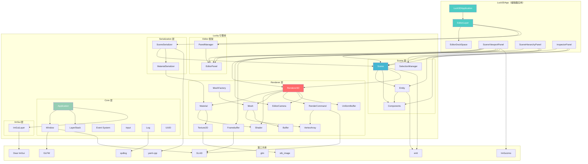

# Luck3D 引擎架构说明

> **文档版本**：v1.0  
> **创建日期**：2026-04-17  
> **目标读者**：引擎开发者  
> **文档说明**：本文档从系统设计层面描述 Luck3D 引擎的整体架构、模块划分、模块间依赖关系、数据流向和关键设计决策。阅读本文档后，开发者应能明确了解项目当前的架构全貌，快速定位代码位置，并理解各模块的职责边界。

---

## 目录

- [一、项目结构](#一项目结构)
- [二、整体架构分层](#二整体架构分层)
- [三、模块详解](#三模块详解)
  - [3.1 Core 层 ― 引擎核心](#31-core-层--引擎核心)
  - [3.2 Renderer 层 ― 渲染系统](#32-renderer-层--渲染系统)
  - [3.3 Scene 层 ― 场景与 ECS](#33-scene-层--场景与-ecs)
  - [3.4 Serialization 层 ― 序列化系统](#34-serialization-层--序列化系统)
  - [3.5 Editor 层 ― 编辑器框架](#35-editor-层--编辑器框架)
  - [3.6 ImGui 层 ― 即时模式 UI](#36-imgui-层--即时模式-ui)
  - [3.7 Math 与 Utils ― 工具模块](#37-math-与-utils--工具模块)
- [四、模块依赖关系图](#四模块依赖关系图)
- [五、数据流与渲染管线](#五数据流与渲染管线)
  - [5.1 主循环数据流](#51-主循环数据流)
  - [5.2 渲染管线数据流](#52-渲染管线数据流)
  - [5.3 事件传播流](#53-事件传播流)
- [六、关键设计决策](#六关键设计决策)
- [七、第三方依赖](#七第三方依赖)
- [八、构建系统](#八构建系统)
- [九、代码规范与约定](#九代码规范与约定)
- [十、已知架构限制与演进方向](#十已知架构限制与演进方向)

---

## 一、项目结构

```
Luck3D/                             # 解决方案根目录
├── Build.lua                       # Premake5 工作区配置
├── Dependencies.lua                # 第三方库路径定义
│
├── Lucky/                          # ?? 引擎核心库（静态库 .lib）
│   ├── Build-Lucky.lua             # 引擎库构建配置
│   ├── Source/
│   │   ├── Lucky.h                 # 引擎公共头文件（对外暴露的统一入口）
│   │   ├── lcpch.h / lcpch.cpp     # 预编译头
│   │   └── Lucky/
│   │       ├── Core/               # 核心层：Application、Window、Event、Input、Layer
│   │       ├── Renderer/           # 渲染层：Renderer3D、Shader、Material、Mesh、Framebuffer
│   │       ├── Scene/              # 场景层：Scene、Entity、Components
│   │       ├── Serialization/      # 序列化层：SceneSerializer、MaterialSerializer
│   │       ├── Editor/             # 编辑器框架：EditorPanel、PanelManager
│   │       ├── ImGui/              # ImGui 集成层：ImGuiLayer
│   │       ├── Math/               # 数学工具：矩阵分解等
│   │       └── Utils/              # 通用工具：文件对话框、Singleton
│   └── Vendor/                     # 第三方库源码
│       ├── GLFW/                   # 窗口与输入
│       ├── GLAD/                   # OpenGL 函数加载
│       ├── imgui/                  # Dear ImGui
│       ├── ImGuizmo/               # ImGuizmo（Transform 手柄 + ViewManipulate）
│       ├── entt/                   # ECS 框架
│       ├── glm/                    # 数学库
│       ├── spdlog/                 # 日志库
│       ├── stb_image/              # 图片加载
│       └── yaml-cpp/               # YAML 解析
│
├── Luck3DApp/                      # ??? 编辑器应用（可执行文件 .exe）
│   ├── Build-Luck3DApp.lua         # 编辑器构建配置
│   ├── Source/
│   │   ├── Luck3DApplication.cpp   # 入口点：CreateApplication()
│   │   ├── EditorLayer.h/cpp       # 编辑器主层：菜单栏、场景管理、文件操作
│   │   ├── EditorDockSpace.h/cpp   # DockSpace 布局管理
│   │   └── Panels/                 # 编辑器面板
│   │       ├── SceneViewportPanel  # 3D 场景视口（渲染 + 相机 + Gizmo）
│   │       ├── SceneHierarchyPanel # 场景层级树
│   │       └── InspectorPanel      # 属性检查器
│   ├── Assets/                     # 编辑器资产
│   │   ├── Shaders/                # Shader 文件（Standard.vert/frag、InternalError.vert/frag）
│   │   ├── Textures/               # 纹理资源
│   │   └── Scenes/                 # 场景文件（.luck3d）
│   └── Resources/                  # 编辑器资源（字体等）
│
├── Vendor/                         # 全局工具
│   └── Binaries/Premake/           # Premake5 可执行文件
│
├── Scripts/                        # 构建脚本
│   ├── Setup-Windows.bat
│   └── Setup-Linux.sh
│
└── docs/                           # ?? 设计文档
    ├── Architecture_Overview.md    # 本文档
    ├── Feature_Guide.md            # 功能说明文档（面向用户）
    ├── Roadmap_Feature_Development.md  # 功能发展路线图
    ├── ECS/                        # ECS 系统设计文档
    ├── MaterialSystem/             # 材质系统设计文档
    ├── RenderingSystem/            # 渲染系统设计文档
    ├── Serialization/              # 序列化系统设计文档
    └── DevelopmentIssues/          # 开发问题记录
```

---

## 二、整体架构分层

Luck3D 采用**分层架构**，从底层到顶层依次为：

```
┌─────────────────────────────────────────────────────────────────────┐
│                        Luck3DApp（编辑器应用）                        │
│   EditorLayer → PanelManager → SceneViewportPanel / Hierarchy /    │
│                                 Inspector                           │
├─────────────────────────────────────────────────────────────────────┤
│                        Editor 框架层                                 │
│   EditorPanel（基类） → PanelManager（面板注册与生命周期管理）         │
├─────────────────────────────────────────────────────────────────────┤
│                        Scene 层（场景与 ECS）                        │
│   Scene → Entity → Components（Transform / MeshFilter /             │
│            MeshRenderer / Light / Relationship / ID / Name）         │
├─────────────────────────────────────────────────────────────────────┤
│                        Serialization 层                              │
│   SceneSerializer → MaterialSerializer → YamlHelpers                │
├─────────────────────────────────────────────────────────────────────┤
│                        Renderer 层（渲染系统）                        │
│   Renderer3D → Material → Shader → Texture → Mesh → MeshFactory    │
│   EditorCamera → Camera → Framebuffer → UniformBuffer               │
│   RenderCommand → VertexArray → Buffer                              │
├─────────────────────────────────────────────────────────────────────┤
│                        Core 层（引擎核心）                            │
│   Application → Window → OpenGLContext                               │
│   LayerStack → Layer → ImGuiLayer                                    │
│   Event → EventDispatcher                                            │
│   Input → KeyCodes / MouseButtonCodes                                │
│   UUID / DeltaTime / Log / Base                                      │
├─────────────────────────────────────────────────────────────────────┤
│                        第三方库层                                     │
│   GLFW / GLAD / Dear ImGui / ImGuizmo / entt / glm / spdlog /       │
│   stb_image / yaml-cpp                                               │
└─────────────────────────────────────────────────────────────────────┘
```

**分层原则**：
- **上层依赖下层**，下层不依赖上层
- **Lucky 库**（引擎核心）不依赖 **Luck3DApp**（编辑器应用）
- 引擎库编译为**静态库**（`.lib`），编辑器应用链接引擎库生成**可执行文件**（`.exe`）

---

## 三、模块详解

### 3.1 Core 层 ― 引擎核心

**目录**：`Lucky/Source/Lucky/Core/`

Core 层提供引擎运行所需的基础设施，是所有其他模块的基石。

#### Application（应用程序）

| 文件 | 说明 |
|------|------|
| `Application.h/cpp` | 引擎入口点，管理主循环、窗口、层栈、事件分发 |
| `Base.h` | 基础类型定义：`Ref<T>`（shared_ptr）、`Scope<T>`（unique_ptr）、断言宏 |
| `EntryPoint.h` | `main()` 函数定义，调用用户实现的 `CreateApplication()` |

**Application 主循环**：

```
Application::Run()
  while (m_Running)
    ├── 计算 DeltaTime
    ├── 遍历 LayerStack，调用每个 Layer::OnUpdate(dt)
    ├── ImGuiLayer::Begin()
    ├── 遍历 LayerStack，调用每个 Layer::OnImGuiRender()
    ├── ImGuiLayer::End()
    └── Window::OnUpdate()  // SwapBuffers + PollEvents
```

**设计要点**：
- `Application` 是**单例**（`s_Instance`），通过 `Application::GetInstance()` 全局访问
- 用户通过继承 `Layer` 并 `PushLayer()` 来注入自定义逻辑
- 事件通过 `Window` 的回调函数传入 `Application::OnEvent()`，再**逆序**分发给 LayerStack

#### Window（窗口系统）

| 文件 | 说明 |
|------|------|
| `Window.h/cpp` | GLFW 窗口封装，管理窗口创建、事件回调、VSync |
| `OpenGLContext.h/cpp` | OpenGL 上下文初始化（GLAD 加载） |

**设计要点**：
- `Window` 持有 `GLFWwindow*` 和 `OpenGLContext`
- GLFW 回调函数将原生事件转换为 Lucky 的 `Event` 对象，通过 `EventCallbackFn` 传递给 `Application`

#### Event（事件系统）

| 文件 | 说明 |
|------|------|
| `Events/Event.h` | 事件基类、事件类型枚举、事件分类枚举、`EventDispatcher` |
| `Events/ApplicationEvent.h` | 窗口关闭、窗口缩放事件 |
| `Events/KeyEvent.h` | 键盘按下、抬起、字符输入事件 |
| `Events/MouseEvent.h` | 鼠标移动、按钮、滚轮事件 |

**设计要点**：
- 采用**观察者模式**：事件产生后立即同步分发（非队列模式）
- `EventDispatcher` 通过模板匹配事件类型，调用对应的处理函数
- 事件按 LayerStack **逆序**传播（Overlay 层优先处理），`m_Handled` 标记可阻止继续传播

#### Layer（层系统）

| 文件 | 说明 |
|------|------|
| `Layer.h/cpp` | 层基类，定义 `OnAttach/OnDetach/OnUpdate/OnImGuiRender/OnEvent` 虚函数 |
| `LayerStack.h/cpp` | 层栈管理器，区分普通层（前半段）和覆盖层（后半段） |

**设计要点**：
- `LayerStack` 内部使用 `std::vector<Layer*>`，普通层从前端插入，覆盖层从后端追加
- `OnUpdate` 按正序调用（普通层先于覆盖层），事件按逆序分发（覆盖层先于普通层）

#### Input（输入系统）

| 文件 | 说明 |
|------|------|
| `Input/Input.h/cpp` | 静态输入查询接口（`IsKeyPressed`、`IsMouseButtonPressed`、`GetMousePosition`） |
| `Input/KeyCodes.h` | 键盘键码定义 |
| `Input/MouseButtonCodes.h` | 鼠标按钮码定义 |

**设计要点**：
- 采用**轮询模式**（Polling），直接查询 GLFW 当前状态
- 全 static 方法，任何地方都可调用

#### 其他核心模块

| 文件 | 说明 |
|------|------|
| `UUID.h/cpp` | 64 位随机 UUID 生成器，用于实体唯一标识 |
| `DeltaTime.h` | 帧间隔时间封装，支持隐式转换为 `float`（秒） |
| `Log.h/cpp` | 基于 spdlog 的日志系统，分为 Core 日志和 Client 日志 |
| `Hash.h/cpp` | FNV 哈希函数，用于面板 ID 等场景 |

---

### 3.2 Renderer 层 ― 渲染系统

**目录**：`Lucky/Source/Lucky/Renderer/`

渲染系统是引擎最核心的模块，负责将场景数据转换为屏幕上的图像。

#### 渲染器层次结构

```
┌──────────────────────────────────────────────────────────────┐
│                     Renderer3D（高层渲染器）                    │
│  BeginScene() → DrawMesh() × N → EndScene()                  │
│  管理 Camera UBO、Light UBO、ShaderLibrary、默认材质           │
├──────────────────────────────────────────────────────────────┤
│                     Material + Shader（材质系统）              │
│  Material::Apply() → Shader::Bind() + SetUniform × N         │
│  Shader 内省 → 自动发现 uniform → 材质属性 Map                 │
├──────────────────────────────────────────────────────────────┤
│                     Mesh + MeshFactory（几何数据）             │
│  Vertex(Pos/Color/Normal/UV/Tangent) → SubMesh → VAO/VBO/IBO │
│  MeshFactory 提供 5 种内置图元                                 │
├──────────────────────────────────────────────────────────────┤
│                     RenderCommand（底层渲染命令）              │
│  Init / Clear / DrawIndexed / DrawIndexedRange / DrawLines    │
│  直接封装 OpenGL API 调用                                      │
├──────────────────────────────────────────────────────────────┤
│                     GPU 资源封装                               │
│  VertexArray / VertexBuffer / IndexBuffer / UniformBuffer     │
│  Framebuffer / Texture2D                                      │
└──────────────────────────────────────────────────────────────┘
```

#### Renderer3D（3D 渲染器）

| 文件 | 说明 |
|------|------|
| `Renderer3D.h/cpp` | 3D 渲染器，全 static 方法 + 文件级 static 数据 |
| `Renderer.h/cpp` | 顶层初始化入口（调用 `Renderer3D::Init()`） |

**当前渲染流程**：

```
Renderer3D::BeginScene(camera, lightData)
  ├── 上传 Camera UBO (binding=0)：ViewProjection + CameraPosition
  └── 上传 Light UBO (binding=1)：DirectionalLights + PointLights + SpotLights

Renderer3D::DrawMesh(transform, mesh, materials)  // 每个实体调用一次
  └── 遍历 mesh->GetSubMeshes()
      ├── 获取对应 Material（或 fallback 到默认/错误材质）
      ├── shader->Bind()
      ├── shader->SetMat4("u_Model", transform)
      ├── material->Apply()  // 上传所有用户可编辑的 uniform
      └── RenderCommand::DrawIndexedRange(vao, indexOffset, indexCount)

Renderer3D::EndScene()  // 当前为空实现
```

**设计要点**：
- 当前为**全 static 设计**，不支持多实例（多视口需要重构为实例化）
- 物体按 entt 注册顺序绘制，**无排序**（R9 将引入 DrawCommand 排序）
- 每个 SubMesh 一次 DrawCall，**无批处理**
- Camera 和 Light 数据通过 **UBO**（Uniform Buffer Object）传递，避免每个 Shader 重复设置

#### Material + Shader（材质系统）

| 文件 | 说明 |
|------|------|
| `Material.h/cpp` | 材质类：持有 Shader 引用 + 属性 Map（`unordered_map<string, MaterialProperty>`） |
| `Shader.h/cpp` | 着色器类：编译、链接、内省、Uniform 上传 |

**Shader 内省机制**：
```
Shader::Compile()
  └── Shader::Introspect()
      ├── glGetProgramiv(GL_ACTIVE_UNIFORMS)  // 查询所有 active uniform
      ├── 过滤 UBO 中的 uniform（Camera/Light 数据）
      ├── 过滤内部 uniform（u_Model 等）
      └── 保留用户可编辑的 uniform → m_Uniforms 列表
```

**Material 属性系统**：
- `MaterialPropertyValue` 使用 `std::variant` 存储多种类型（float/vec2/vec3/vec4/int/mat3/mat4/Texture2D）
- `m_PropertyMap`：`unordered_map` 按名 O(1) 查找
- `m_PropertyOrder`：`vector<string>` 保持 Shader 源码中的声明顺序（用于 Inspector 显示）
- `SetShader()` 触发 `RebuildProperties()`，尽量保留同名同类型的旧属性值

**Shader 文件约定**：
- 顶点着色器：`*.vert`，片段着色器：`*.frag`
- `Shader::Create("path/ShaderName")` 自动加载 `ShaderName.vert` 和 `ShaderName.frag`
- 支持 `@default` 注释元数据指定 sampler2D 的默认纹理类型

#### Mesh + MeshFactory（几何数据）

| 文件 | 说明 |
|------|------|
| `Mesh.h/cpp` | 网格类：顶点数据 + 索引数据 + SubMesh 列表 + VAO/VBO/IBO |
| `MeshFactory.h/cpp` | 内置图元工厂：Cube / Plane / Sphere / Cylinder / Capsule |
| `MeshTangentCalculator.h/cpp` | MikkTSpace 风格的切线计算 |

**顶点格式**（`Vertex` 结构体）：
| 属性 | 类型 | 说明 |
|------|------|------|
| Position | `vec3` | 顶点位置 |
| Color | `vec4` | 顶点颜色 |
| Normal | `vec3` | 法线 |
| TexCoord | `vec2` | 纹理坐标 |
| Tangent | `vec4` | 切线 + 手性（xyz = tangent 方向，w = handedness ±1） |

**SubMesh 机制**：
- 一个 `Mesh` 可包含多个 `SubMesh`，共享同一个 VAO
- 每个 `SubMesh` 记录 `IndexOffset`、`IndexCount`、`MaterialIndex`
- `DrawIndexedRange` 按 SubMesh 分段绘制，每个 SubMesh 可使用不同材质

#### Framebuffer（帧缓冲区）

| 文件 | 说明 |
|------|------|
| `Framebuffer.h/cpp` | 帧缓冲区封装，支持多颜色附件 + 深度附件 |

**当前配置**（SceneViewportPanel 使用）：
- 颜色附件 0：`RGBA8`（场景渲染结果）
- 颜色附件 1：`RED_INTEGER`（Entity ID，用于鼠标拾取）
- 深度附件：`DEPTH24_STENCIL8`

**鼠标拾取原理**：
```
SceneViewportPanel::OnUpdate()
  ├── Framebuffer.Bind()
  ├── ClearAttachment(1, -1)           // 清除 Entity ID 缓冲区
  ├── Scene::OnUpdate()                 // 渲染时写入 Entity ID
  ├── Framebuffer.Unbind()
  └── 鼠标点击时：
      └── GetPixel(1, mouseX, mouseY)  // 读取 Entity ID → 选中实体
```

#### 其他渲染模块

| 文件 | 说明 |
|------|------|
| `Camera.h` | 相机基类，持有投影矩阵 |
| `EditorCamera.h/cpp` | 编辑器相机：轨道相机模型（焦点 + 距离 + Pitch/Yaw），支持平移/旋转/缩放 |
| `Texture.h/cpp` | 2D 纹理封装（stb_image 加载） |
| `Buffer.h/cpp` | VertexBuffer / IndexBuffer 封装 |
| `VertexArray.h/cpp` | VAO 封装，管理 VBO 绑定和顶点属性布局 |
| `UniformBuffer.h/cpp` | UBO 封装 |
| `OpenGLContext.h/cpp` | OpenGL 上下文初始化 |

---

### 3.3 Scene 层 ― 场景与 ECS

**目录**：`Lucky/Source/Lucky/Scene/`

Scene 层基于 **entt** 库实现 ECS（Entity-Component-System）架构。

#### 核心类

| 文件 | 说明 |
|------|------|
| `Scene.h/cpp` | 场景类：持有 `entt::registry`，管理实体创建/销毁/更新 |
| `Entity.h/cpp` | 实体类：`entt::entity` 的封装，提供类型安全的组件操作 |
| `SelectionManager.h/cpp` | 选中管理器：全局单例，记录当前选中的实体 UUID |

**Scene::OnUpdate() 流程**：
```
Scene::OnUpdate(dt, camera)
  ├── 收集光源数据
  │   ├── 遍历 DirectionalLightComponent → 填充 SceneLightData
  │   ├── 遍历 PointLightComponent → 填充 SceneLightData
  │   └── 遍历 SpotLightComponent → 填充 SceneLightData
  │
  ├── Renderer3D::BeginScene(camera, lightData)
  │
  ├── 遍历所有具有 MeshFilter + MeshRenderer + Transform 的实体
  │   └── Renderer3D::DrawMesh(worldTransform, mesh, materials)
  │
  └── Renderer3D::EndScene()
```

#### 组件系统

所有组件定义在 `Lucky/Source/Lucky/Scene/Components/` 目录下：

| 组件 | 文件 | 说明 |
|------|------|------|
| `IDComponent` | `IDComponent.h` | UUID 标识，每个实体必有 |
| `NameComponent` | `NameComponent.h` | 实体名称，每个实体必有 |
| `TransformComponent` | `TransformComponent.h` | 位置/旋转/缩放，每个实体必有 |
| `RelationshipComponent` | `RelationshipComponent.h` | 父子层级关系（Parent UUID + Children UUID 列表） |
| `MeshFilterComponent` | `MeshFilterComponent.h` | 持有 `Ref<Mesh>`，可通过 `PrimitiveType` 创建内置图元 |
| `MeshRendererComponent` | `MeshRendererComponent.h` | 持有材质列表 `vector<Ref<Material>>`，索引对应 SubMesh 的 MaterialIndex |
| `DirectionalLightComponent` | `DirectionalLightComponent.h` | 方向光：Color + Intensity |
| `PointLightComponent` | `PointLightComponent.h` | 点光源：Color + Intensity + Range |
| `SpotLightComponent` | `SpotLightComponent.h` | 聚光灯：Color + Intensity + Range + InnerCutoffAngle + OuterCutoffAngle |

**实体创建流程**：
```
Scene::CreateEntity("Name")
  ├── registry.create()                    // 创建 entt entity
  ├── entity.AddComponent<IDComponent>()   // 自动添加 UUID
  ├── entity.AddComponent<NameComponent>() // 自动添加名称
  ├── entity.AddComponent<TransformComponent>()      // 自动添加 Transform
  └── entity.AddComponent<RelationshipComponent>()   // 自动添加层级关系
```

**父子层级系统**：
- `RelationshipComponent` 存储 `Parent`（UUID）和 `Children`（`vector<UUID>`）
- `Entity::SetParent()` 处理旧父节点移除 + 新父节点添加
- 世界矩阵通过递归计算：`WorldTransform = Parent.WorldTransform × Local.GetTransform()`
- **DirtyFlag 优化**：仅在 Transform 变化时重新计算世界矩阵

**TransformComponent 设计要点**：
- 同时存储**欧拉角**（`RotationEuler`）和**四元数**（`Rotation`），通过 `SetRotationEuler()` / `SetRotation()` 保持同步
- 欧拉角用于编辑器 Inspector 显示（人类可读），四元数用于实际变换计算（避免万向锁）
- `SetRotation(quat)` 内部会选择最接近原始欧拉角的等价表示，避免 UI 上的突变

---

### 3.4 Serialization 层 ― 序列化系统

**目录**：`Lucky/Source/Lucky/Serialization/`

| 文件 | 说明 |
|------|------|
| `SceneSerializer.h/cpp` | 场景序列化/反序列化（YAML 格式，`.luck3d` 扩展名） |
| `MaterialSerializer.h/cpp` | 材质序列化/反序列化（内嵌在场景文件中） |
| `YamlHelpers.h` | YAML 读写辅助函数（vec2/vec3/vec4/quat 等类型的序列化） |

**场景文件结构**（`.luck3d`）：
```yaml
Scene: SceneName
Entities:
  - Entity: 12345678901234
    NameComponent:
      Name: "Cube"
    TransformComponent:
      Translation: [0, 0, 0]
      RotationEuler: [0, 0, 0]
      Scale: [1, 1, 1]
    RelationshipComponent:
      Parent: 0
      Children: []
    MeshFilterComponent:
      PrimitiveType: 1
    MeshRendererComponent:
      Materials:
        - ShaderName: "Standard"
          Properties:
            u_Albedo: [1, 1, 1, 1]
            ...
```

---

### 3.5 Editor 层 ― 编辑器框架

**引擎侧**（`Lucky/Source/Lucky/Editor/`）：

| 文件 | 说明 |
|------|------|
| `EditorPanel.h/cpp` | 编辑器面板基类，定义 `OnUpdate/OnImGuiRender/OnEvent/OnGUI` 虚函数 |
| `PanelManager.h/cpp` | 面板管理器：注册、查找、生命周期管理（基于 FNV 哈希的 ID 系统） |

**应用侧**（`Luck3DApp/Source/`）：

| 文件 | 说明 |
|------|------|
| `Luck3DApplication.cpp` | 入口点，创建 `Application` 并 `PushLayer(EditorLayer)` |
| `EditorLayer.h/cpp` | 编辑器主层：初始化面板、菜单栏、场景文件操作（New/Open/Save/SaveAs） |
| `EditorDockSpace.h/cpp` | ImGui DockSpace 布局管理 |
| `Panels/SceneViewportPanel.h/cpp` | 3D 场景视口：Framebuffer 渲染 + EditorCamera + ImGuizmo Transform 手柄 + 鼠标拾取 |
| `Panels/SceneHierarchyPanel.h/cpp` | 场景层级树：实体树形显示 + 拖拽重排父子关系 + 右键菜单（创建/删除实体、添加组件） |
| `Panels/InspectorPanel.h/cpp` | 属性检查器：根据组件类型动态生成 UI（Transform / MeshFilter / MeshRenderer / Light） |

**面板注册流程**：
```
EditorLayer::OnAttach()
  ├── m_PanelManager = CreateScope<PanelManager>()
  ├── m_PanelManager->AddPanel<SceneViewportPanel>("SceneViewport", true, m_Scene)
  ├── m_PanelManager->AddPanel<SceneHierarchyPanel>("Hierarchy", true, m_Scene)
  └── m_PanelManager->AddPanel<InspectorPanel>("Inspector", true, m_Scene)
```

---

### 3.6 ImGui 层 ― 即时模式 UI

**目录**：`Lucky/Source/Lucky/ImGui/`

| 文件 | 说明 |
|------|------|
| `ImGuiLayer.h/cpp` | ImGui 初始化、Begin/End 帧管理、事件处理 |
| `ImGuiBuild.cpp` | ImGui 后端实现文件（`imgui_impl_glfw.cpp` + `imgui_impl_opengl3.cpp`） |

**设计要点**：
- `ImGuiLayer` 作为**覆盖层**（Overlay）添加到 LayerStack，确保 UI 渲染在最上层
- `Begin()` 中调用 `ImGuizmo::BeginFrame()` 初始化 ImGuizmo 帧状态
- 所有编辑器面板的 UI 绘制在 `Layer::OnImGuiRender()` 回调中完成

---

### 3.7 Math 与 Utils ― 工具模块

| 目录 | 文件 | 说明 |
|------|------|------|
| `Math/` | `Math.h/cpp` | 矩阵分解（`DecomposeTransform`：从 mat4 提取 Translation/Rotation/Scale） |
| `Utils/` | `PlatformUtils.h/cpp` | 平台相关工具（Windows 文件对话框：Open/Save） |
| `Utils/` | `Singleton.h` | CRTP 单例模板基类 |

---

## 四、模块依赖关系图



---

## 五、数据流与渲染管线

### 5.1 主循环数据流

```
┌─────────────────────────────────────────────────────────────────────┐
│                        Application::Run()                            │
│                                                                      │
│  ┌──────────┐    ┌──────────────┐    ┌──────────────┐               │
│  │ DeltaTime │───→│ EditorLayer  │───→│ ImGuiLayer   │               │
│  │ 计算      │    │ ::OnUpdate() │    │ ::Begin()    │               │
│  └──────────┘    └──────┬───────┘    └──────────────┘               │
│                         │                                            │
│                         ��                                            │
│              ┌──────────────────┐                                    │
│              │ PanelManager     │                                    │
│              │ ::OnUpdate(dt)   │                                    │
│              └──────┬───────────┘                                    │
│                     │                                                │
│         ┌───────────┼───────────────┐                                │
│         ��           ��               ��                                │
│  ┌────────────┐ ┌──────────┐ ┌───────────┐                          │
│  │ Viewport   │ │Hierarchy │ │ Inspector │                          │
│  │ ::OnUpdate │ │::OnUpdate│ │ ::OnUpdate│                          │
│  └─────┬──────┘ └──────────┘ └───────────┘                          │
│        │                                                             │
│        ��                                                             │
│  ┌──────────────────────────────────────┐                            │
│  │ Framebuffer.Bind()                    │                           │
│  │ Scene::OnUpdate(dt, camera)           │                           │
│  │   ├── 收集光源 → SceneLightData      │                           │
│  │   ├── Renderer3D::BeginScene()        │                           │
│  │   ├── Renderer3D::DrawMesh() × N     │                           │
│  │   └── Renderer3D::EndScene()          │                           │
│  │ UI_DrawGizmos()  // ImGuizmo          │                           │
│  │ Framebuffer.Unbind()                  │                           │
│  └──────────────────────────────────────┘                            │
│                                                                      │
│  ┌──────────────┐    ┌──────────────┐    ┌──────────────┐           │
│  │ EditorLayer  │───→│ ImGuiLayer   │───→│ Window       │           │
│  │::OnImGuiRender│   │ ::End()      │    │ ::OnUpdate() │           │
│  └──────────────┘    └──────────────┘    │ SwapBuffers  │           │
│                                          │ PollEvents   │           │
│                                          └──────────────┘           │
└─────────────────────────────────────────────────────────────────────┘
```

### 5.2 渲染管线数据流

```
┌─────────────────────────────────────────────────────────────────────┐
│                     当前渲染管线（单 Pass Forward）                    │
│                                                                      │
│  CPU 侧                              GPU 侧                         │
│  ──────                              ──────                          │
│                                                                      │
│  Camera UBO ─────────────────────→  binding=0                        │
│  ┌─────────────────────┐            ┌─────────────────────┐         │
│  │ ViewProjection mat4 │            │ 顶点着色器           │         │
│  │ CameraPosition vec3 │            │ gl_Position =        │         │
│  └─────────────────────┘            │   VP × Model × pos  │         │
│                                     └─────────────────────┘         │
│  Light UBO ──────────────────────→  binding=1                        │
│  ┌─────────────────────┐            ┌─────────────────────┐         │
│  │ DirLights[4]        │            │ 片段着色器           │         │
│  │ PointLights[8]      │            │ PBR 光照计算         │         │
│  │ SpotLights[4]       │            │ Gamma 校正           │         │
│  └─────────────────────┘            └─────────────────────┘         │
│                                                                      │
│  Material::Apply() ──────────────→  Uniform 变量                     │
│  ┌─────────────────────┐            ┌─────────────────────┐         │
│  │ u_Albedo vec4       │            │ 材质属性             │         │
│  │ u_Metallic float    │            │ 纹理采样             │         │
│  │ u_AlbedoMap tex     │            │                     │         │
│  │ ...                 │            │                     │         │
│  └─────────────────────┘            └─────────────────────┘         │
│                                                                      │
│  DrawIndexedRange() ─────────────→  光栅化 → 帧缓冲区                │
│                                     ┌─────────────────────┐         │
│                                     │ Attachment 0: RGBA8  │ → 显示  │
│                                     │ Attachment 1: R32I   │ → 拾取  │
│                                     │ Depth: D24S8         │         │
│                                     └─────────────────────┘         │
└─────────────────────────────────────────────────────────────────────┘
```

### 5.3 事件传播流

```
GLFW 回调
  │
  ��
Window::EventCallback
  │
  ��
Application::OnEvent(event)
  │
  ├── Application 自身处理（WindowClose / WindowResize）
  │
  └── LayerStack 逆序分发
      │
      ├── ImGuiLayer::OnEvent()     ← 覆盖层，最先处理
      │   └── 如果 ImGui 捕获了输入，设置 m_Handled = true
      │
      └── EditorLayer::OnEvent()    ← 普通层
          │
          └── PanelManager::OnEvent()
              │
              ├── SceneViewportPanel::OnEvent()  ← EditorCamera 事件
              ├── SceneHierarchyPanel::OnEvent()
              └── InspectorPanel::OnEvent()
```

---

## 六、关键设计决策

| 决策 | 选择 | 原因 |
|------|------|------|
| **图形 API** | OpenGL 4.5+ | 跨平台、学习成本低、适合引擎原型开发 |
| **ECS 框架** | entt | Header-only、高性能、C++ 社区广泛使用 |
| **UI 框架** | Dear ImGui | 即时模式、适合工具/编辑器开发、生态丰富 |
| **数学库** | glm | OpenGL 风格、Header-only、与 GLSL 语法一致 |
| **构建系统** | Premake5 | 轻量级、Lua 脚本配置、生成 VS 解决方案 |
| **序列化格式** | YAML | 人类可读、Git 友好、yaml-cpp 库成熟 |
| **智能指针** | `Ref<T>` = shared_ptr / `Scope<T>` = unique_ptr | 统一命名、简化代码 |
| **渲染器设计** | 全 static 方法 | 简单直接，当前阶段够用（远期将重构为实例化） |
| **光照模型** | PBR（Metallic-Roughness） | 物理正确、业界标准 |
| **UBO 传递光照** | Camera UBO (binding=0) + Light UBO (binding=1) | 避免每个 Shader 重复设置，性能好 |
| **材质属性存储** | `unordered_map<string, MaterialProperty>` | O(1) 查找 + 源码顺序排序 |
| **Transform 旋转** | 四元数 + 欧拉角双存储 | 四元数避免万向锁，欧拉角方便编辑器显示 |
| **父子层级** | UUID 引用（非指针） | 序列化友好、避免悬空指针 |
| **Entity ID 拾取** | Framebuffer 第二颜色附件（R32I） | GPU 加速、精确到像素 |

---

## 七、第三方依赖

| 库 | 版本 | 用途 | 集成方式 |
|----|------|------|----------|
| **GLFW** | 3.x | 窗口创建、输入处理、OpenGL 上下文 | Git submodule + Premake 编译 |
| **GLAD** | OpenGL 4.5 | OpenGL 函数指针加载 | 源码直接包含 |
| **Dear ImGui** | docking 分支 | 编辑器 UI（DockSpace、面板） | Git submodule + Premake 编译 |
| **ImGuizmo** | latest | Transform 操控手柄 + ViewManipulate | Git submodule |
| **entt** | 3.x | ECS 框架（Entity-Component-System） | Header-only |
| **glm** | 0.9.9+ | 数学库（向量、矩阵、四元数） | Git submodule，Header-only |
| **spdlog** | 1.x | 日志系统 | Git submodule，Header-only |
| **stb_image** | latest | 图片加载（PNG/JPG） | Header-only 单文件 |
| **yaml-cpp** | 0.7+ | YAML 解析/生成 | Git submodule + Premake 编译 |

---

## 八、构建系统

**工具**：Premake5（Lua 脚本生成 Visual Studio 解决方案）

**构建配置**：

| 配置 | 说明 |
|------|------|
| Debug | 启用断言、调试符号、无优化 |
| Release | 启用优化、保留调试符号 |
| Dist | 发布版本、最大优化、无调试 |

**项目结构**：

| 项目 | 类型 | 输出 |
|------|------|------|
| Lucky | 静态库 (.lib) | 引擎核心 |
| Luck3DApp | 可执行文件 (.exe) | 编辑器应用 |
| GLFW | 静态库 (.lib) | 窗口库 |
| GLAD | 静态库 (.lib) | OpenGL 加载 |
| ImGui | 静态库 (.lib) | UI 库 |
| yaml-cpp | 静态库 (.lib) | YAML 解析 |

**构建步骤**：
```bash
# 1. 克隆仓库（含子模块）
git clone --recursive <repo-url>

# 2. 运行 Premake 生成 VS 解决方案
Scripts/Setup-Windows.bat    # Windows
Scripts/Setup-Linux.sh       # Linux

# 3. 打开 Luck3D.sln，选择配置，编译运行
```

---

## 九、代码规范与约定

### 命名规范

| 类别 | 规范 | 示例 |
|------|------|------|
| 类名 | PascalCase | `Renderer3D`、`EditorCamera` |
| 函数名 | PascalCase | `BeginScene()`、`GetViewMatrix()` |
| 成员变量 | `m_` 前缀 + PascalCase | `m_ViewMatrix`、`m_Scene` |
| 静态成员 | `s_` 前缀 + PascalCase | `s_Instance`、`s_MaxPointLights` |
| 枚举值 | PascalCase | `FramebufferTextureFormat::RGBA8` |
| 命名空间 | PascalCase | `Lucky` |
| 文件名 | PascalCase | `Renderer3D.h`、`SceneSerializer.cpp` |

### 智能指针约定

| 类型 | 别名 | 用途 |
|------|------|------|
| `std::shared_ptr<T>` | `Ref<T>` | 共享所有权的资源（Shader、Material、Mesh、Texture、Scene） |
| `std::unique_ptr<T>` | `Scope<T>` | 独占所有权的资源（Window、PanelManager） |

### 注释规范

- 使用 `/// <summary>` XML 文档注释风格
- 所有公共接口必须有注释
- 中文注释

---

## 十、已知架构限制与演进方向

| 限制 | 影响 | 演进方向 | 对应文档 |
|------|------|----------|----------|
| Renderer3D 全 static | 不支持多视口/多相机独立渲染 | 重构为实例化 SceneRenderer | `PhaseR12_Renderer_Architecture_Evolution.md` |
| 无渲染排序 | GPU 状态频繁切换、无法正确渲染透明物体 | DrawCommand + SortKey | `PhaseR9_DrawCommand_Sorting.md` |
| 无阴影 | 场景缺乏深度感 | Shadow Map + PCF | `PhaseR4_Shadow_System.md` |
| 无 HDR | 高光溢出被截断、色调不自然 | RGBA16F + ACES Tonemapping | `PhaseR5_HDR_Tonemapping.md` |
| 无后处理 | 无法实现 Bloom、FXAA 等效果 | PostProcess Effect 链 | `PhaseR6_PostProcessing_Framework.md` |
| 单 Pass 渲染 | 无法灵活组合多个渲染阶段 | RenderPass 抽象 | `PhaseR7_Multi_Pass_Rendering.md` |
| 无模型导入 | 只有 5 种内置图元 | Assimp 集成 | `PhaseR11_Model_Import.md` |
| 无 Per-Material 渲染状态 | 所有物体使用相同的 ZWrite/Cull/Blend 设置 | RenderState 结构体 | `PhaseR13_RenderState_PerMaterial.md` |

> 详细的功能发展路线请参见 `docs/Roadmap_Feature_Development.md`。
