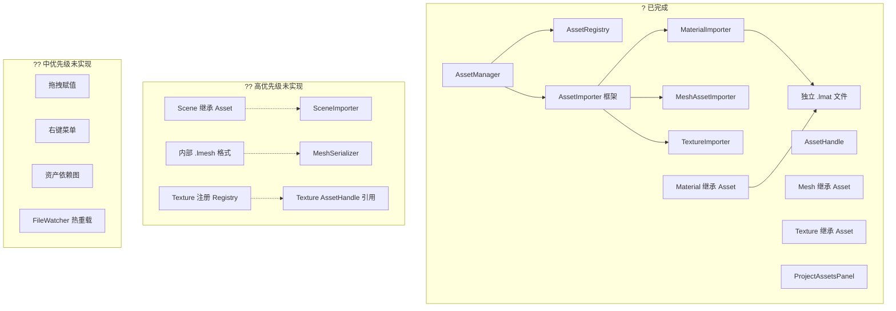

# 资产系统功能状态追踪

> **文档版本**：v1.0  
> **创建日期**：2026-05-19  
> **更新日期**：2026-05-19  
> **文档说明**：本文档追踪 Luck3D 引擎资产系统的功能实现状态，对标 Unity AssetDatabase / Hazel AssetManager 的功能集。**每次功能更新后请同步更新本文档。**

---

## 更新日志

| 日期 | 版本 | 更新内容 |
|------|------|----------|
| 2026-05-19 | v1.0 | 初始版本，盘点 Phase A + Phase B 完成后的资产系统状态 |

---

## 一、功能完成度总览

> **整体完成度：约 40%**（相对于一个完整的资产管理系统）

| 模块 | 完成度 | 已实现 | 未实现 | 说明 |
|------|--------|--------|--------|------|
| 核心框架（AssetManager / Registry / Handle） | ? 100% | 7 | 0 | Phase A 完成 |
| Material 资产 | ? 95% | 6 | 1 | Phase B 完成，独立 .lmat 文件 |
| Mesh 资产 | ?? 40% | 2 | 3 | 仅外部模型引用，无内部格式 |
| Texture 资产 | ?? 30% | 2 | 3 | 继承 Asset 但未注册 Registry |
| Scene 资产 | ? 10% | 1 | 4 | 枚举已定义但 Scene 未继承 Asset |
| Shader 资产 | ? 5% | 0 | 3 | 枚举已预留，完全未实现 |
| 编辑器集成 | ?? 50% | 4 | 4 | ProjectAssetsPanel 基础功能 |

---

## 二、已实现功能详细清单

### 2.1 核心框架

> **目录**：`Lucky/Source/Lucky/Asset/`  
> **完成度**：? 100%

| # | 功能 | 状态 | 关键文件 | 说明 |
|---|------|------|----------|------|
| AF-01 | Asset 基类 | ? 已完成 | `Asset/Asset.h` | 纯虚基类，提供 Handle + GetAssetType 接口 |
| AF-02 | AssetHandle | ? 已完成 | `Asset/AssetHandle.h` | 独立类型包装，64 位 UUID，类型安全 |
| AF-03 | AssetType 枚举 | ? 已完成 | `Asset/AssetType.h` | Material / Mesh / Texture2D / Scene / Shader + 扩展名推断 |
| AF-04 | AssetMetadata | ? 已完成 | `Asset/AssetMetadata.h` | Handle + Type + FilePath |
| AF-05 | AssetRegistry | ? 已完成 | `Asset/AssetRegistry.h/cpp` | 双向映射（Handle?Path）+ YAML 持久化（`.lcr` 文件） |
| AF-06 | AssetManager | ? 已完成 | `Asset/AssetManager.h/cpp` | Init/Shutdown/ImportAsset/CreateAsset/GetAsset/缓存/Importer 注册表 |
| AF-07 | AssetImporter 框架 | ? 已完成 | `Asset/AssetImporter.h` | 基类 + 注册表分发（按 AssetType 路由到对应 Importer） |

---

### 2.2 Material 资产

> **完成度**：? 95%

| # | 功能 | 状态 | 关键文件 | 说明 |
|---|------|------|----------|------|
| AM-01 | Material 继承 Asset | ? 已完成 | `Renderer/Material.h` | `GetAssetType()` 返回 `AssetType::Material` |
| AM-02 | MaterialImporter | ? 已完成 | `Asset/MaterialImporter.h/cpp` | 从 `.lmat` 文件加载材质，调用 `MaterialSerializer::DeserializeFromFile` |
| AM-03 | 独立 .lmat 文件 | ? 已完成 | `Serialization/MaterialSerializer.h/cpp` | `SerializeToFile` / `DeserializeFromFile`，纯 YAML 格式 |
| AM-04 | 脏标记 + 手动保存 | ? 已完成 | `Renderer/Material.h`、`Editor/MaterialEditor.cpp` | `IsDirty()` / `MarkDirty()` / `ClearDirty()` + "Save Material" 按钮 |
| AM-05 | 场景中 AssetHandle 引用 | ? 已完成 | `Serialization/SceneSerializer.cpp` | MeshRendererComponent + SkyboxMaterial 均通过 AssetHandle 引用 |
| AM-06 | 导入模型时自动保存材质 | ? 已完成 | `Luck3DApp/Source/EditorLayer.cpp` | ImportModel 时将材质保存为独立 `.lmat` 文件并注册 |
| AM-07 | 材质实例化（MaterialInstance） | ? 未实现 | ― | 无法基于同一 .lmat 创建变体 |

---

### 2.3 Mesh 资产

> **完成度**：?? 40%

| # | 功能 | 状态 | 关键文件 | 说明 |
|---|------|------|----------|------|
| AH-01 | Mesh 继承 Asset | ? 已完成 | `Renderer/Mesh.h` | `GetAssetType()` 返回 `AssetType::Mesh` |
| AH-02 | MeshAssetImporter | ? 已完成 | `Asset/MeshAssetImporter.h/cpp` | 从外部模型文件（.fbx/.obj 等）通过 Assimp 加载 |
| AH-03 | 内部 Mesh 格式（.lmesh） | ? 未实现 | ― | 无内部序列化格式，每次加载都需 Assimp 重新解析 |
| AH-04 | 内置图元持久化 | ? 未实现 | ― | Cube/Sphere 等内置图元无法保存为资产文件 |
| AH-05 | Mesh Import Settings | ? 未实现 | ― | 无缩放因子、法线计算、UV 翻转等导入设置 |

---

### 2.4 Texture 资产

> **完成度**：?? 30%

| # | 功能 | 状态 | 关键文件 | 说明 |
|---|------|------|----------|------|
| AT-01 | Texture 继承 Asset | ? 已完成 | `Renderer/Texture.h` | Texture 基类继承 Asset |
| AT-02 | TextureImporter | ? 已完成 | `Asset/TextureImporter.h/cpp` | 从图片文件加载纹理 |
| AT-03 | 纹理注册到 Registry | ? 未实现 | ― | 纹理在 .lmat 中通过路径引用，未注册到 AssetRegistry |
| AT-04 | 纹理通过 AssetHandle 引用 | ? 未实现 | ― | 材质文件中纹理仍用相对路径，移动文件后引用断裂 |
| AT-05 | Texture Import Settings | ? 未实现 | ― | 无压缩格式、Mipmap、sRGB/Linear、Wrap Mode 配置 |

---

### 2.5 Scene 资产

> **完成度**：? 10%

| # | 功能 | 状态 | 关键文件 | 说明 |
|---|------|------|----------|------|
| AS-01 | AssetType::Scene 枚举 | ? 已完成 | `Asset/AssetType.h` | 枚举值已定义，扩展名 `.luck3d` 已映射 |
| AS-02 | Scene 继承 Asset | ? 未实现 | `Scene/Scene.h` | Scene 类不继承 Asset，无 Handle |
| AS-03 | SceneImporter | ? 未实现 | ― | 无 SceneImporter，场景加载由 EditorLayer 手动处理 |
| AS-04 | 场景通过 AssetManager 管理 | ? 未实现 | ― | Open/Save 不经过 AssetManager |
| AS-05 | 场景注册到 Registry | ? 未实现 | ― | 场景文件不注册，无 AssetHandle |

---

### 2.6 Shader 资产

> **完成度**：? 5%

| # | 功能 | 状态 | 关键文件 | 说明 |
|---|------|------|----------|------|
| ASH-01 | AssetType::Shader 枚举 | ? 已完成 | `Asset/AssetType.h` | 枚举值已预留 |
| ASH-02 | Shader 继承 Asset | ? 未实现 | ― | Shader 由 ShaderLibrary 独立管理 |
| ASH-03 | ShaderImporter | ? 未实现 | ― | 无 ShaderImporter |

---

### 2.7 编辑器集成

> **完成度**：?? 50%

| # | 功能 | 状态 | 关键文件 | 说明 |
|---|------|------|----------|------|
| AE-01 | ProjectAssetsPanel 目录树 | ? 已完成 | `Panels/ProjectAssetsPanel.h/cpp` | 左侧目录树 + 右侧内容区 |
| AE-02 | 文件列表浏览 | ? 已完成 | `Panels/ProjectAssetsPanel.cpp` | 显示文件名，支持目录导航 |
| AE-03 | Create Material 菜单 | ? 已完成 | `Luck3DApp/Source/EditorLayer.cpp` | File → Create Material... |
| AE-04 | Import Model 菜单 | ? 已完成 | `Luck3DApp/Source/EditorLayer.cpp` | File → Import Model... |
| AE-05 | 拖拽赋值 | ? 未实现 | ― | 无法从 ProjectAssetsPanel 拖拽资产到 Inspector |
| AE-06 | 右键菜单操作 | ? 未实现 | ― | 无创建/删除/重命名/在文件管理器中显示 |
| AE-07 | 资产缩略图/图标 | ? 未实现 | ― | 无类型图标和预览缩略图 |
| AE-08 | 双击打开资产 | ? 未实现 | ― | 无法双击 .luck3d 打开场景 |

---

## 三、未实现功能详细清单

### 3.1 高优先级（核心功能缺口）

| # | 功能 | 优先级 | 说明 | 参考 |
|---|------|--------|------|------|
| A-TODO-01 | **Scene 纳入资产系统** | ?? P0 | Scene 继承 Asset + SceneImporter + 通过 AssetManager 管理 | Unity AssetDatabase |
| A-TODO-02 | **内部 Mesh 格式（.lmesh）** | ?? P0 | 二进制序列化格式，避免每次 Assimp 解析，支持内置图元持久化 | Unity .mesh |
| A-TODO-03 | **Texture 纳入 Registry** | ?? P0 | 纹理注册到 Registry + AssetHandle 引用 + 统一缓存 | Unity Texture Import |

### 3.2 中优先级（编辑器体验）

| # | 功能 | 优先级 | 说明 | 参考 |
|---|------|--------|------|------|
| A-TODO-04 | **ProjectAssetsPanel 增强** | ?? P1 | 拖拽赋值 + 右键菜单 + 双击打开 + 缩略图 + 搜索过滤 | Unity Project 面板 |
| A-TODO-05 | **资产依赖追踪** | ?? P1 | 构建依赖图，删除前检查引用 | Unity Find References |
| A-TODO-06 | **资产热重载** | ?? P1 | FileWatcher 监控 + 自动重新加载 | Unity Auto Refresh |

### 3.3 低优先级（进阶功能）

| # | 功能 | 优先级 | 说明 | 参考 |
|---|------|--------|------|------|
| A-TODO-07 | **Shader 纳入资产系统** | ?? P2 | Shader 继承 Asset + ShaderImporter + 热重载 | Unity ShaderLab |
| A-TODO-08 | **资产导入设置** | ?? P2 | 纹理压缩/Mipmap + 模型缩放/法线 | Unity Import Settings |
| A-TODO-09 | **Prefab 系统** | ?? P2 | 实体模板资产化 | Unity Prefab |
| A-TODO-10 | **异步资产加载** | ?? P2 | 后台线程加载 + 占位资源 | Unity Async Load |
| A-TODO-11 | **材质实例化** | ?? P2 | 基于同一 .lmat 创建变体 | Unity Material Instance |

---

## 四、架构关系图

---

## 五、文件清单

### 已实现的文件

| 文件路径 | 说明 |
|---------|------|
| `Lucky/Source/Lucky/Asset/Asset.h` | Asset 基类 |
| `Lucky/Source/Lucky/Asset/AssetHandle.h` | AssetHandle 类型 |
| `Lucky/Source/Lucky/Asset/AssetType.h` | AssetType 枚举 + 扩展名推断 |
| `Lucky/Source/Lucky/Asset/AssetMetadata.h` | 资产元数据 |
| `Lucky/Source/Lucky/Asset/AssetRegistry.h/cpp` | 注册表 + YAML 持久化 |
| `Lucky/Source/Lucky/Asset/AssetManager.h/cpp` | 资产管理器 |
| `Lucky/Source/Lucky/Asset/AssetImporter.h` | Importer 基类 |
| `Lucky/Source/Lucky/Asset/MaterialImporter.h/cpp` | 材质导入器 |
| `Lucky/Source/Lucky/Asset/MeshAssetImporter.h/cpp` | Mesh 导入器（Assimp） |
| `Lucky/Source/Lucky/Asset/TextureImporter.h/cpp` | 纹理导入器 |
| `Lucky/Source/Lucky/Asset/MeshImporter.h/cpp` | 模型导入（Assimp 封装） |
| `Lucky/Source/Lucky/Serialization/MaterialSerializer.h/cpp` | 材质序列化（内联 + 文件级） |
| `Lucky/Source/Lucky/Editor/MaterialEditor.h/cpp` | 材质编辑器（脏标记 + 保存） |
| `Luck3DApp/Source/Panels/ProjectAssetsPanel.h/cpp` | 项目资产面板 |

---

## 六、功能更新操作指南

当完成新的资产系统功能时，请按以下步骤更新本文档：

1. 在"更新日志"中添加新条目
2. 更新"功能完成度总览"中对应模块的完成度和数量
3. 将已完成的功能从"未实现功能详细清单"移至"已实现功能详细清单"
4. 更新"文件清单"中新增的文件
5. 同步更新全局 `Feature_Status_Tracker.md` 中资产系统部分的完成度
