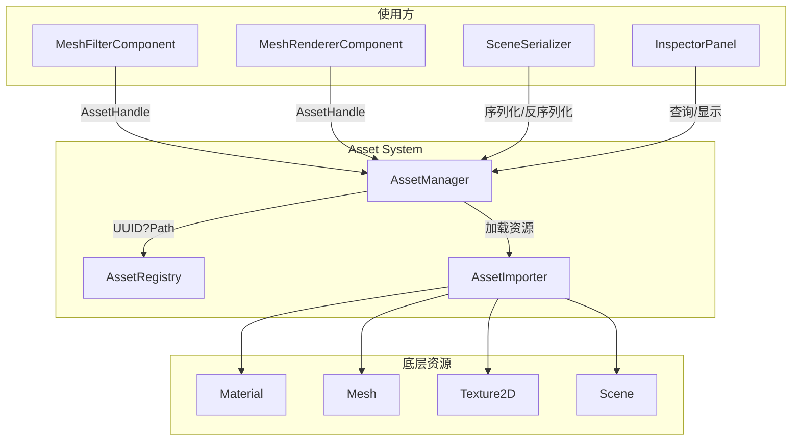
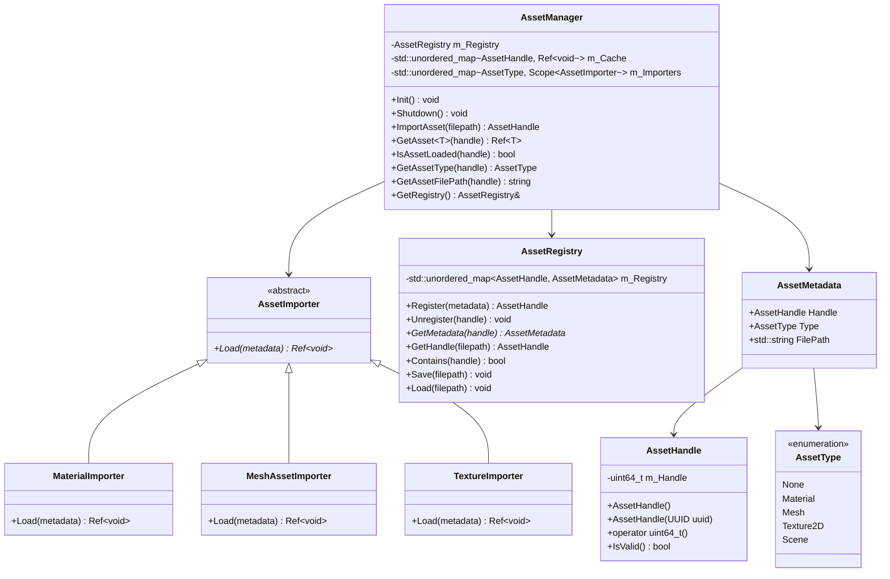
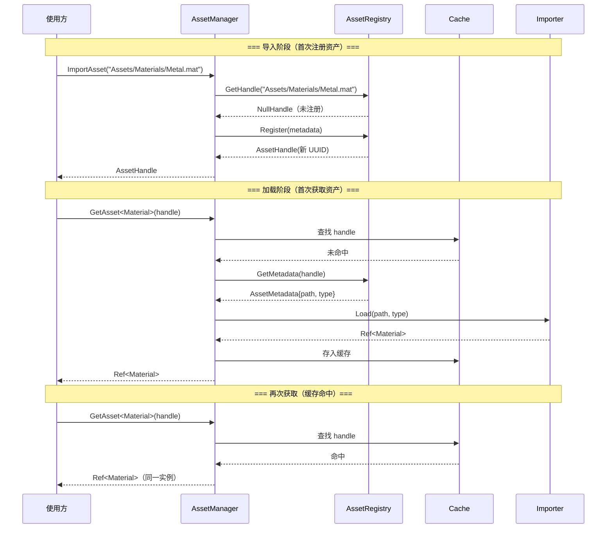

# Phase A：资产系统核心框架

## 目录

- [一、概述](#一概述)
  - [1.1 当前问题](#11-当前问题)
  - [1.2 资产系统解决的问题](#12-资产系统解决的问题)
  - [1.3 设计目标](#13-设计目标)
  - [1.4 前置依赖](#14-前置依赖)
  - [1.5 术语定义](#15-术语定义)
- [二、整体架构](#二整体架构)
  - [2.1 架构概览](#21-架构概览)
  - [2.2 核心类关系图](#22-核心类关系图)
  - [2.3 资产生命周期](#23-资产生命周期)
- [三、AssetHandle 设计](#三assethandle-设计)
  - [3.1 方案 A：UUID 直接作为 Handle](#31-方案-auuid-直接作为-handle)
  - [3.2 方案 B：独立 AssetHandle 类型包装](#32-方案-b独立-assethandle-类型包装)
  - [3.3 方案推荐](#33-方案推荐)
- [四、AssetType 枚举设计](#四assettype-枚举设计)
- [五、AssetMetadata 设计](#五assetmetadata-设计)
- [六、AssetRegistry 设计](#六assetregistry-设计)
  - [6.1 职责定义](#61-职责定义)
  - [6.2 数据结构](#62-数据结构)
  - [6.3 持久化方案](#63-持久化方案)
  - [6.4 方案 A：单文件 Registry（.lreg）](#64-方案-a单文件-registrylreg)
  - [6.5 方案 B：Sidecar .meta 文件](#65-方案-bsidecar-meta-文件)
  - [6.6 方案 C：混合方案（Registry + .meta）](#66-方案-c混合方案registry--meta)
  - [6.7 方案推荐](#67-方案推荐)
- [七、AssetManager 设计](#七assetmanager-设计)
  - [7.1 职责定义](#71-职责定义)
  - [7.2 接口设计](#72-接口设计)
  - [7.3 缓存策略](#73-缓存策略)
  - [7.4 方案 A：强引用缓存（shared_ptr 持有）](#74-方案-a强引用缓存shared_ptr-持有)
  - [7.5 方案 B：弱引用缓存（weak_ptr 持有）](#75-方案-b弱引用缓存weak_ptr-持有)
  - [7.6 方案 C：引用计数 + LRU 淘汰](#76-方案-c引用计数--lru-淘汰)
  - [7.7 方案推荐](#77-方案推荐)
- [八、Asset 基类设计](#八asset-基类设计)
  - [8.1 方案 A：无基类，纯 Handle 引用](#81-方案-a无基类纯-handle-引用)
  - [8.2 方案 B：Asset 基类 + 派生](#82-方案-basset-基类--派生)
  - [8.3 方案推荐](#83-方案推荐)
- [九、AssetImporter 框架设计](#九assetimporter-框架设计)
  - [9.1 方案 A：统一 Importer 接口 + 注册表](#91-方案-a统一-importer-接口--注册表)
  - [9.2 方案 B：AssetManager 内部分发](#92-方案-bassetmanager-内部分发)
  - [9.3 方案推荐](#93-方案推荐)
- [十、与现有系统的集成](#十与现有系统的集成)
  - [10.1 MeshFilterComponent 改造](#101-meshfiltercomponent-改造)
  - [10.2 MeshRendererComponent 改造](#102-meshrenderercomponent-改造)
  - [10.3 SceneSerializer 改造](#103-sceneserializer-改造)
- [十一、项目目录结构](#十一项目目录结构)
- [十二、数据结构完整定义](#十二数据结构完整定义)
  - [12.1 AssetHandle.h](#121-assethandleh)
  - [12.2 AssetType.h](#122-assettypeh)
  - [12.3 AssetMetadata.h](#123-assetmetadatah)
  - [12.4 Asset.h](#124-asseth)
  - [12.5 AssetRegistry.h](#125-assetregistryh)
  - [12.6 AssetRegistry.cpp（关键实现）](#126-assetregistrycpp关键实现)
  - [12.7 AssetImporter.h](#127-assetimporterh)
  - [12.8 MaterialImporter.h](#128-materialimporterh)
  - [12.9 MaterialImporter.cpp](#129-materialimportercpp)
  - [12.10 MeshAssetImporter.h](#1210-meshassetimporterh)
  - [12.11 MeshAssetImporter.cpp](#1211-meshassetimportercpp)
  - [12.12 TextureImporter.h](#1212-textureimporterh)
  - [12.13 TextureImporter.cpp](#1213-textureimportercpp)
  - [12.14 AssetManager.h](#1214-assetmanagerh)
  - [12.15 AssetManager.cpp（完整实现）](#1215-assetmanagercpp完整实现)
- [十三、序列化格式](#十三序列化格式)
  - [13.1 Registry 文件格式（.lreg）](#131-registry-文件格式lreg)
  - [13.2 场景文件中的资产引用格式](#132-场景文件中的资产引用格式)
- [十四、涉及的文件清单](#十四涉及的文件清单)
- [十五、分步实施策略](#十五分步实施策略)
- [十六、验证清单](#十六验证清单)
- [十七、已知限制与后续扩展](#十七已知限制与后续扩展)

---

## 一、概述

### 1.1 当前问题

当前项目没有统一的资产管理系统，各类资源的加载和引用方式各不相同：

```
当前实现（SceneSerializer.cpp - Deserialize）：
  // Mesh：每次反序列化都重新 Import
  MeshImportResult result = MeshImporter::Import(absolutePath);

  // Material：内嵌在场景文件中，无法独立存在
  Ref<Material> material = MaterialSerializer::Deserialize(materialNode);

  // Texture：直接通过路径创建，无缓存
  Ref<Texture2D> texture = Texture2D::Create(absolutePath);
```

| 问题 | 影响 |
|------|------|
| **材质内嵌在场景文件中** | 无法跨实体共享材质，无法在 Inspector 中"替换"为另一个预设材质 |
| **无资产引用机制** | 没有 UUID/Handle 标识资产，组件直接持有 `Ref<T>` 实例 |
| **无加载缓存** | 同一模型文件被多个实体引用时，每次反序列化都重新 `Import()`，浪费内存和时间 |
| **纹理无缓存** | 同一纹理路径被多个材质引用时，每次都创建新的 GPU 纹理对象 |
| **资源路径硬编码** | 移动/重命名文件后，所有引用该文件的场景都会失效 |
| **无统一生命周期管理** | 资源何时加载、何时释放完全由使用方决定，无法统一管理 |

### 1.2 资产系统解决的问题

资产系统提供统一的资源标识、加载、缓存和引用机制：

```
引入资产系统后：
┌─────────────────────────────────────────────────────────────┐
│                      AssetManager                            │
│  ┌──────────┐    ┌──────────────┐    ┌──────────────────┐  │
│  │ Registry │    │    Cache     │    │    Importers     │  │
│  │ UUID?Path│    │ UUID→Ref<T> │    │ Type→Importer  │  │
│  └──────────┘    └──────────────┘    └──────────────────┘  │
└─────────────────────────────────────────────────────────────┘
         ↑                    ↑                    ↑
         │                    │                    │
    注册资产            获取/缓存资产          加载/导入资产
         │                    │                    │
┌────────┴────────────────────┴────────────────────┴──────────┐
│  组件通过 AssetHandle（UUID）引用资产，不再直接持有 Ref<T>     │
│  MeshRendererComponent { AssetHandle MaterialHandle; }       │
└─────────────────────────────────────────────────────────────┘
```

### 1.3 设计目标

1. ? 统一的资产标识机制（AssetHandle = UUID）
2. ? 统一的资产加载入口（AssetManager）
3. ? 加载缓存（同一资产只加载一次）
4. ? 支持的资产类型：Material、Mesh（模型文件）、Texture2D、Scene
5. ? 资产注册表持久化（UUID ? 文件路径映射）
6. ? 为后续 Phase B（独立 .mat 文件）和 Phase C（Content Browser）奠定基础
7. ? 遵循项目现有代码规范和架构风格

> **注意**：本设计不考虑旧场景文件的向后兼容。当前所有场景文件均为临时测试用途，资产系统引入后将使用全新的序列化格式。

### 1.4 前置依赖

| 依赖 | 状态 | 说明 |
|------|------|------|
| UUID 系统 | ? 已完成 | `Core/UUID.h`，64 位随机 UUID，支持 `std::hash` |
| YAML 序列化框架 | ? 已完成 | yaml-cpp 集成，`YamlHelpers.h` 已有 UUID 转换器 |
| MaterialSerializer | ? 已完成 | 独立类，支持 Serialize/Deserialize（当前内联到场景文件） |
| MeshImporter | ? 已完成 | Assimp 集成，支持多格式导入 |
| Texture2D | ? 已完成 | stb_image 加载，支持路径创建 |
| ShaderLibrary | ? 已完成 | Shader 统一管理，按名索引 |
| Ref/CreateRef | ? 已完成 | `shared_ptr` 别名，统一内存管理 |

### 1.5 术语定义

| 术语 | 定义 |
|------|------|
| **Asset** | 项目中可被引用的持久化资源（Material、Mesh、Texture、Scene 等） |
| **AssetHandle** | 资产的唯一标识符（本质是 UUID），用于在组件中引用资产 |
| **AssetMetadata** | 资产的元信息（Handle、类型、文件路径、加载状态等） |
| **AssetRegistry** | 维护 Handle ? FilePath 映射的注册表，持久化到磁盘 |
| **AssetManager** | 资产系统的统一入口，负责加载、缓存、查询 |

---

## 二、整体架构

### 2.1 架构概览



### 2.2 核心类关系图



### 2.3 资产生命周期



---

## 三、AssetHandle 设计

AssetHandle 是资产系统的核心标识符，所有组件通过 AssetHandle 引用资产。

### 3.1 方案 A：UUID 直接作为 Handle

直接使用现有的 `UUID` 类作为 AssetHandle（typedef）。

```cpp
// AssetHandle.h
#pragma once

#include "Lucky/Core/UUID.h"

namespace Lucky
{
    using AssetHandle = UUID;

    // 无效 Handle 常量
    constexpr uint64_t NullAssetHandle = 0;
}
```

**优点**：
- 零成本抽象，无需新类型
- 复用现有 UUID 的 hash 特化和 YAML 转换器
- 实现最简单

**缺点**：
- 语义不清晰：`UUID` 既用于 Entity ID 又用于 Asset Handle，容易混淆
- 无法在编译期区分 Entity UUID 和 Asset Handle
- 无法为 AssetHandle 添加特有方法（如 `IsValid()`）

### 3.2 方案 B：独立 AssetHandle 类型包装

创建独立的 `AssetHandle` 类，内部持有 `uint64_t`，提供类型安全。

```cpp
// AssetHandle.h
#pragma once

#include "Lucky/Core/UUID.h"

namespace Lucky
{
    /// <summary>
    /// 资产句柄：用于唯一标识一个资产
    /// 本质是 64 位 UUID，但与 Entity UUID 类型隔离
    /// </summary>
    class AssetHandle
    {
    public:
        AssetHandle() : m_Handle(0) {}
        explicit AssetHandle(UUID uuid) : m_Handle(static_cast<uint64_t>(uuid)) {}
        explicit AssetHandle(uint64_t handle) : m_Handle(handle) {}

        /// <summary>
        /// 生成新的随机 AssetHandle
        /// </summary>
        static AssetHandle Generate() { return AssetHandle(UUID()); }

        bool IsValid() const { return m_Handle != 0; }
        operator uint64_t() const { return m_Handle; }
        
        bool operator==(const AssetHandle& other) const { return m_Handle == other.m_Handle; }
        bool operator!=(const AssetHandle& other) const { return m_Handle != other.m_Handle; }

    private:
        uint64_t m_Handle;
    };

    // 无效 Handle 常量
    inline const AssetHandle NullAssetHandle{};
}

// std::hash 特化
namespace std
{
    template<>
    struct hash<Lucky::AssetHandle>
    {
        std::size_t operator()(const Lucky::AssetHandle& handle) const
        {
            return hash<uint64_t>()(static_cast<uint64_t>(handle));
        }
    };
}
```

**优点**：
- 类型安全：编译期区分 Entity UUID 和 Asset Handle
- 语义清晰：代码可读性好
- 可扩展：可以添加 `IsValid()`、`Generate()` 等方法
- 符合 Hazel 引擎的设计（Hazel 使用独立 `AssetHandle` 类型）

**缺点**：
- 需要额外的 `std::hash` 特化
- 需要额外的 YAML 转换器
- 代码量略多

### 3.3 方案推荐

| 方案 | 推荐度 | 理由 |
|------|--------|------|
| **方案 B（独立类型）** | ?? 最优 | 类型安全、语义清晰、可扩展，长期维护成本低 |
| 方案 A（typedef） | ?? 其次 | 实现简单但语义模糊，后续重构成本高 |

**推荐方案 B**。虽然代码量略多，但类型安全带来的编译期错误检查在大型项目中价值极高。Entity UUID 和 Asset Handle 是完全不同的概念，不应混用同一类型。

---

## 四、AssetType 枚举设计

```cpp
// AssetType.h
#pragma once

#include <string>

namespace Lucky
{
    /// <summary>
    /// 资产类型枚举
    /// </summary>
    enum class AssetType : uint8_t
    {
        None = 0,       // 无效类型
        Material,       // 材质（.mat）
        Mesh,           // 网格/模型（.obj/.fbx/.gltf/.glb/.dae/.3ds/.blend）
        Texture2D,      // 2D 纹理（.png/.jpg/.tga/.bmp/.hdr）
        Scene,          // 场景（.luck3d）
        Shader          // 着色器（预留）
    };

    /// <summary>
    /// AssetType 转字符串
    /// </summary>
    inline const char* AssetTypeToString(AssetType type)
    {
        switch (type)
        {
            case AssetType::Material:   return "Material";
            case AssetType::Mesh:       return "Mesh";
            case AssetType::Texture2D:  return "Texture2D";
            case AssetType::Scene:      return "Scene";
            case AssetType::Shader:     return "Shader";
            default:                    return "None";
        }
    }

    /// <summary>
    /// 字符串转 AssetType
    /// </summary>
    inline AssetType StringToAssetType(const std::string& str)
    {
        if (str == "Material")  return AssetType::Material;
        if (str == "Mesh")      return AssetType::Mesh;
        if (str == "Texture2D") return AssetType::Texture2D;
        if (str == "Scene")     return AssetType::Scene;
        if (str == "Shader")    return AssetType::Shader;
        return AssetType::None;
    }

    /// <summary>
    /// 根据文件扩展名推断资产类型
    /// </summary>
    /// <param name="extension">文件扩展名（含点号，如 ".mat"）</param>
    /// <returns>推断的资产类型</returns>
    inline AssetType GetAssetTypeFromExtension(const std::string& extension)
    {
        // 材质
        if (extension == ".mat") return AssetType::Material;

        // 模型
        if (extension == ".obj" || extension == ".fbx" ||
            extension == ".gltf" || extension == ".glb" ||
            extension == ".dae" || extension == ".3ds" ||
            extension == ".blend")
            return AssetType::Mesh;

        // 纹理
        if (extension == ".png" || extension == ".jpg" ||
            extension == ".jpeg" || extension == ".tga" ||
            extension == ".bmp" || extension == ".hdr")
            return AssetType::Texture2D;

        // 场景
        if (extension == ".luck3d") return AssetType::Scene;

        // Shader
        if (extension == ".vert" || extension == ".frag")
            return AssetType::Shader;

        return AssetType::None;
    }
}
```

---

## 五、AssetMetadata 设计

```cpp
// AssetMetadata.h
#pragma once

#include "AssetHandle.h"
#include "AssetType.h"

#include <string>

namespace Lucky
{
    /// <summary>
    /// 资产元数据：描述一个已注册资产的基本信息
    /// </summary>
    struct AssetMetadata
    {
        AssetHandle Handle;                     // 资产唯一标识
        AssetType Type = AssetType::None;       // 资产类型
        std::string FilePath;                   // 相对于项目根目录的文件路径（使用正斜杠）

        /// <summary>
        /// 元数据是否有效
        /// </summary>
        bool IsValid() const
        {
            return Handle.IsValid() && Type != AssetType::None && !FilePath.empty();
        }
    };
}
```

---

## 六、AssetRegistry 设计

### 6.1 职责定义

AssetRegistry 负责维护 **AssetHandle ? 文件路径** 的双向映射关系，并将此映射持久化到磁盘。它**不负责**资源的加载和缓存。

核心职责：
- 注册新资产（分配 Handle）
- 注销资产
- 通过 Handle 查询元数据
- 通过文件路径查询 Handle（避免重复注册）
- 持久化到磁盘 / 从磁盘加载

### 6.2 数据结构

```cpp
class AssetRegistry
{
private:
    std::unordered_map<AssetHandle, AssetMetadata> m_Registry;          // Handle → Metadata
    std::unordered_map<std::string, AssetHandle> m_PathToHandle;        // FilePath → Handle（反向索引）
};
```

### 6.3 持久化方案

Registry 需要持久化到磁盘，以便下次打开项目时恢复 UUID ? 路径映射。以下是三种常见方案：

### 6.4 方案 A：单文件 Registry（.lreg）

将所有资产的元数据集中存储在项目根目录的一个 YAML 文件中。

```yaml
# Assets.lreg
Assets:
  - Handle: 12345678901234
    Type: Material
    FilePath: Assets/Materials/Metal.mat
  - Handle: 98765432109876
    Type: Mesh
    FilePath: Assets/Models/Cube.obj
  - Handle: 11111111111111
    Type: Texture2D
    FilePath: Assets/Textures/Wood.png
```

**优点**：
- 实现最简单，单文件读写
- 查询快速（全部在内存中）
- 版本控制友好（单文件 diff）
- 启动时一次性加载

**缺点**：
- 多人协作时容易冲突（所有人修改同一文件）
- 文件越来越大（大型项目可能有数千资产）
- 编辑器外部删除/移动文件后 Registry 中会残留悬空条目（编辑器内操作会自动同步 Registry，无需额外清理）

### 6.5 方案 B：Sidecar .meta 文件

每个资产文件旁边放一个同名的 `.meta` 文件（Unity 风格）。

```
Assets/
├── Materials/
│   ├── Metal.mat
│   └── Metal.mat.meta     ← 包含 UUID
├── Models/
│   ├── Cube.obj
│   └── Cube.obj.meta      ← 包含 UUID
```

```yaml
# Metal.mat.meta
Handle: 12345678901234
Type: Material
```

**优点**：
- 多人协作友好（每个文件独立 .meta，冲突概率低）
- 移动文件时 .meta 跟随移动，UUID 不变
- Unity 开发者熟悉此模式

**缺点**：
- 文件数量翻倍，目录看起来杂乱
- 启动时需要遍历整个 Assets 目录收集所有 .meta 文件
- 实现复杂度高（需要文件系统监控）
- 新增文件时需要自动生成 .meta

### 6.6 方案 C：混合方案（Registry + .meta）

使用单文件 Registry 作为主索引，但在资产文件内部嵌入 UUID（如 .mat 文件头部包含 AssetID 字段）。

```yaml
# Metal.mat（文件内部包含 UUID）
AssetID: 12345678901234
Name: Metal
Shader: Standard
Properties:
  ...
```

```yaml
# Assets.lreg（全局索引，可从文件内容重建）
Assets:
  - Handle: 12345678901234
    Type: Material
    FilePath: Assets/Materials/Metal.mat
```

**优点**：
- Registry 可从文件内容重建（容错性好）
- 不需要额外的 .meta 文件
- 文件自包含（移动文件后可通过扫描重建 Registry）

**缺点**：
- 只适用于自定义格式文件（.mat、.luck3d），不适用于 .obj/.png 等第三方格式
- 第三方格式仍需要 .meta 或 Registry 记录

### 6.7 方案推荐

| 方案 | 推荐度 | 理由 |
|------|--------|------|
| **方案 A（单文件 Registry）** | ?? 最优 | 实现简单、启动快、当前项目规模小（单人开发），完全够用 |
| 方案 C（混合方案） | ?? 其次 | 容错性好，但实现复杂度高，当前阶段过度设计 |
| 方案 B（.meta 文件） | ?? 第三 | 适合大型团队协作，但当前项目不需要，且实现复杂 |

**推荐方案 A**。理由：
1. 当前为单人开发，不存在多人协作冲突问题
2. 项目资产数量有限（预计 < 100），单文件完全够用
3. 实现最简单，可以快速投入使用
4. 后续如需迁移到 .meta 方案，只需修改持久化层，不影响上层接口

---

## 七、AssetManager 设计

### 7.1 职责定义

AssetManager 是资产系统的**统一入口**，采用全静态方法模式。AssetManager 本质上是一个**全局唯一的服务**（类似 Unity 的 `AssetDatabase`），整个应用生命周期内只需要一个实例。这种模式使得任何系统都可以直接通过 `AssetManager::GetAsset<T>(handle)` 获取资产，无需传递管理器引用。

核心职责：
- 初始化/关闭资产系统
- 导入资产（注册到 Registry）
- 加载资产（从磁盘加载到内存）
- 缓存管理（避免重复加载）
- 类型安全的资产获取

### 7.2 接口设计

```cpp
class AssetManager
{
public:
    /// <summary>
    /// 初始化资产系统（加载 Registry）
    /// </summary>
    static void Init();

    /// <summary>
    /// 关闭资产系统（保存 Registry，清空缓存）
    /// </summary>
    static void Shutdown();

    // ---- 资产导入 ----

    /// <summary>
    /// 导入资产：将文件注册到资产系统，返回 Handle
    /// 如果文件已注册，返回已有的 Handle
    /// </summary>
    /// <param name="filepath">相对于项目根目录的文件路径</param>
    /// <returns>资产 Handle</returns>
    static AssetHandle ImportAsset(const std::string& filepath);

    // ---- 资产获取 ----

    /// <summary>
    /// 获取资产：通过 Handle 获取已加载的资产实例
    /// 如果未加载，自动触发加载
    /// </summary>
    /// <typeparam name="T">资产类型（Material/Mesh/Texture2D）</typeparam>
    /// <param name="handle">资产 Handle</param>
    /// <returns>资产实例（失败返回 nullptr）</returns>
    template<typename T>
    static Ref<T> GetAsset(AssetHandle handle);

    // ---- 查询接口 ----

    /// <summary>
    /// 资产是否已加载到内存
    /// </summary>
    static bool IsAssetLoaded(AssetHandle handle);

    /// <summary>
    /// 资产是否已注册（在 Registry 中）
    /// </summary>
    static bool IsAssetRegistered(AssetHandle handle);

    /// <summary>
    /// 获取资产类型
    /// </summary>
    static AssetType GetAssetType(AssetHandle handle);

    /// <summary>
    /// 获取资产文件路径
    /// </summary>
    static const std::string& GetAssetFilePath(handle) string

    /// <summary>
    /// 获取 Registry 引用（供编辑器使用）
    /// </summary>
    static AssetRegistry& GetRegistry();

    // ---- 缓存管理 ----

    /// <summary>
    /// 从缓存中移除指定资产（下次获取时重新加载）
    /// </summary>
    static void UnloadAsset(AssetHandle handle);

    /// <summary>
    /// 清空所有缓存
    /// </summary>
    static void ClearCache();

    /// <summary>
    /// 保存 Registry 到磁盘
    /// </summary>
    static void SaveRegistry();
};
```

### 7.3 缓存策略

缓存是 AssetManager 的核心功能之一，决定了资产的内存管理方式。

### 7.4 方案 A：强引用缓存（shared_ptr 持有）

AssetManager 的缓存 Map 直接持有 `Ref<T>`（shared_ptr），资产一旦加载就永远不会被释放（除非手动 Unload）。

```cpp
struct AssetManagerData
{
    AssetRegistry Registry;
    std::unordered_map<AssetHandle, Ref<void>> Cache;   // 强引用缓存
};
```

**注意**：`Ref<void>` 即 `std::shared_ptr<void>`，利用 shared_ptr 的类型擦除特性存储任意类型。获取时通过 `std::static_pointer_cast<T>` 转换。

```cpp
template<typename T>
Ref<T> AssetManager::GetAsset(AssetHandle handle)
{
    // 缓存命中
    auto it = s_Data.Cache.find(handle);
    if (it != s_Data.Cache.end())
    {
        return std::static_pointer_cast<T>(it->second);
    }

    // 缓存未命中，加载资产
    Ref<T> asset = LoadAsset<T>(handle);
    if (asset)
    {
        s_Data.Cache[handle] = asset;   // 存入缓存（shared_ptr<void> 自动转换）
    }
    return asset;
}
```

**优点**：
- 实现最简单
- 获取速度快（O(1) 哈希查找）
- 不会出现悬空引用
- 适合当前项目规模（资产数量少，内存不是瓶颈）

**缺点**：
- 内存只增不减（除非手动 Unload 或 ClearCache）
- 大型项目中可能导致内存占用过高
- 无法自动释放不再使用的资产

### 7.5 方案 B：弱引用缓存（weak_ptr 持有）

缓存 Map 持有 `std::weak_ptr<void>`，当所有使用方释放引用后，资产自动从内存中释放。

```cpp
struct AssetManagerData
{
    AssetRegistry Registry;
    std::unordered_map<AssetHandle, std::weak_ptr<void>> Cache;   // 弱引用缓存
};
```

```cpp
template<typename T>
Ref<T> AssetManager::GetAsset(AssetHandle handle)
{
    auto it = s_Data.Cache.find(handle);
    if (it != s_Data.Cache.end())
    {
        // 尝试提升弱引用
        if (auto locked = it->second.lock())
        {
            return std::static_pointer_cast<T>(locked);
        }
        else
        {
            // 弱引用已失效，移除缓存条目
            s_Data.Cache.erase(it);
        }
    }

    // 加载资产
    Ref<T> asset = LoadAsset<T>(handle);
    if (asset)
    {
        s_Data.Cache[handle] = asset;
    }
    return asset;
}
```

**优点**：
- 自动内存管理（无人引用时自动释放）
- 不会导致内存泄漏

**缺点**：
- 频繁加载/释放：如果组件短暂释放引用后又重新获取，会触发重新加载
- 实现稍复杂（需要处理 weak_ptr 失效的情况）
- 性能不稳定（缓存命中率取决于使用方的引用持有时间）

### 7.6 方案 C：引用计数 + LRU 淘汰

维护引用计数，当引用计数降为 0 时不立即释放，而是放入 LRU 队列。LRU 队列满时淘汰最久未使用的资产。

```cpp
struct CachedAsset
{
    Ref<void> Asset;
    uint64_t LastAccessTime;
    uint32_t ReferenceCount;
};

struct AssetManagerData
{
    AssetRegistry Registry;
    std::unordered_map<AssetHandle, CachedAsset> Cache;
    uint32_t MaxCacheSize = 256;    // 最大缓存数量
};
```

**优点**：
- 内存使用可控（有上限）
- 兼顾性能和内存（热资产常驻，冷资产淘汰）
- 适合大型项目

**缺点**：
- 实现复杂度最高
- 当前项目规模不需要（过度设计）
- 需要额外的时间戳和淘汰逻辑

### 7.7 方案推荐

| 方案 | 推荐度 | 理由 |
|------|--------|------|
| **方案 A（强引用缓存）** | ?? 最优 | 实现简单、性能稳定、当前项目规模小，内存不是瓶颈 |
| 方案 B（弱引用缓存） | ?? 其次 | 自动内存管理好，但频繁加载释放影响性能 |
| 方案 C（LRU 淘汰） | ?? 第三 | 适合大型项目，当前过度设计 |

**推荐方案 A**。理由：
1. 当前项目资产数量有限（< 100），全部常驻内存完全可行
2. 实现最简单，可以快速投入使用
3. 提供 `UnloadAsset()` 和 `ClearCache()` 接口，需要时可手动释放
4. 后续如需升级为 LRU 方案，只需修改缓存层内部实现，不影响外部接口

---

## 八、Asset 基类设计

是否需要一个 `Asset` 基类，让 Material、Mesh、Texture2D 等都继承自它？

### 8.1 方案 A：无基类，纯 Handle 引用

不引入 Asset 基类，现有的 Material、Mesh、Texture2D 类保持不变。AssetManager 通过 `Ref<void>` 类型擦除存储，获取时通过模板参数转换。

```cpp
// 使用方式
AssetHandle handle = AssetManager::ImportAsset("Assets/Materials/Metal.mat");
Ref<Material> material = AssetManager::GetAsset<Material>(handle);
```

**优点**：
- 不修改现有类（Material、Mesh、Texture2D 完全不变）
- 侵入性最低
- 实现简单

**缺点**：
- 类型安全依赖使用方正确传入模板参数（如果 Handle 对应 Material 但传入 `GetAsset<Mesh>` 会导致未定义行为）
- 无法在运行时通过基类指针统一操作资产
- 资产本身不知道自己的 Handle

### 8.2 方案 B：Asset 基类 + 派生

引入 `Asset` 基类，所有可作为资产的类型继承自它。

```cpp
/// <summary>
/// 资产基类：所有可被资产系统管理的资源类型的基类
/// </summary>
class Asset
{
public:
    virtual ~Asset() = default;

    AssetHandle GetHandle() const { return m_Handle; }
    void SetHandle(AssetHandle handle) { m_Handle = handle; }

    virtual AssetType GetAssetType() const = 0;

private:
    AssetHandle m_Handle;
};

// Material 继承 Asset
class Material : public Asset
{
public:
    AssetType GetAssetType() const override { return AssetType::Material; }
    // ... 现有接口不变 ...
};
```

**优点**：
- 类型安全：可以在运行时检查资产类型
- 资产自知：每个资产实例知道自己的 Handle
- 统一接口：可以通过 `Ref<Asset>` 统一操作

**缺点**：
- 侵入性高：需要修改 Material、Mesh、Texture2D 的继承关系
- Texture2D 已经继承自 `Texture` 基类，多继承会增加复杂度
- 现有代码大量使用 `Ref<Material>`、`Ref<Mesh>`，改为 `Ref<Asset>` 需要大量修改

### 8.3 方案推荐

| 方案 | 推荐度 | 理由 |
|------|--------|------|
| **方案 B（Asset 基类）** | ?? 最优 | 类型安全、资产自知、统一操作，一次性修改成本换取长期收益 |
| 方案 A（无基类） | ?? 其次 | 侵入性低但语义弱，后期添加基类的重构成本更高 |

**推荐方案 B**。理由：
1. **资产自知**：每个资产实例知道自己的 Handle，组件只需持有 `Ref<Material>` 即可同时获得运行时实例和资产标识，无需维护双列表
2. **类型安全**：可以在运行时通过基类指针统一操作资产，Inspector 中显示资产信息、Content Browser 中统一操作都需要基类支持
3. **一次性成本**：修改几个现有类的继承关系是一次性的，但收益是长期的
4. **业界验证**：Unity/Unreal/Godot 等主流引擎都使用基类方案（Unity 的所有资产继承自 `UnityEngine.Object`）
5. **避免后期重构**：如果现在不加，后期再加的重构成本更高（因为到时候使用方更多）

**继承关系设计**：

```cpp
// Asset 作为资产基类
class Asset
{
public:
    virtual ~Asset() = default;

    AssetHandle GetHandle() const { return m_Handle; }
    void SetHandle(AssetHandle handle) { m_Handle = handle; }

    virtual AssetType GetAssetType() const = 0;

private:
    AssetHandle m_Handle;
};

// Material 直接继承 Asset
class Material : public Asset
{
public:
    AssetType GetAssetType() const override { return AssetType::Material; }
    // ... 现有接口不变 ...
};

// Mesh 直接继承 Asset
class Mesh : public Asset
{
public:
    AssetType GetAssetType() const override { return AssetType::Mesh; }
    // ... 现有接口不变 ...
};

// Texture 基类继承 Asset，Texture2D 通过继承 Texture 间接获得 Asset 能力
class Texture : public Asset
{
public:
    // ... 现有纯虚接口不变 ...
};

class Texture2D : public Texture
{
public:
    AssetType GetAssetType() const override { return AssetType::Texture2D; }
    // ... 现有接口不变 ...
};
```

**关键优势――解决组件双列表问题**：

由于 Material 继承自 Asset，`Ref<Material>` 本身就包含了 Handle 信息。组件只需持有 `Ref<Material>`：

```cpp
// 序列化时：遍历 Materials，取 material->GetHandle() 写入
for (auto& material : comp.Materials)
{
    out << material->GetHandle();  // 直接从资产实例获取 Handle
}

// 反序列化时：通过 Handle 从 AssetManager 获取 Ref<Material>
AssetHandle handle(node.as<uint64_t>());
Ref<Material> material = AssetManager::GetAsset<Material>(handle);
comp.Materials.push_back(material);
```

**AssetManager 中的类型检查**（仍然保留，作为额外安全保障）：

```cpp
template<typename T>
Ref<T> AssetManager::GetAsset(AssetHandle handle)
{
    // 类型检查
    AssetType expectedType = GetExpectedAssetType<T>();
    AssetType actualType = GetAssetType(handle);
    
    if (expectedType != actualType)
    {
        LF_CORE_ERROR("AssetManager::GetAsset - Type mismatch! Expected {0}, got {1}",
                      AssetTypeToString(expectedType), AssetTypeToString(actualType));
        return nullptr;
    }

    // ... 加载逻辑 ...
    // 加载完成后设置 Handle
    Ref<T> asset = ...;
    asset->SetHandle(handle);
    return asset;
}

// 类型映射辅助
template<typename T> AssetType GetExpectedAssetType();
template<> AssetType GetExpectedAssetType<Material>() { return AssetType::Material; }
template<> AssetType GetExpectedAssetType<Mesh>() { return AssetType::Mesh; }
template<> AssetType GetExpectedAssetType<Texture2D>() { return AssetType::Texture2D; }
```

---

## 九、AssetImporter 框架设计

AssetImporter 负责将磁盘文件加载为内存中的资源对象。

### 9.1 方案 A：统一 Importer 接口 + 注册表

定义 `AssetImporter` 基类接口，每种资产类型实现一个具体 Importer，通过注册表分发。

```cpp
/// <summary>
/// 资产导入器基类
/// </summary>
class AssetImporter
{
public:
    virtual ~AssetImporter() = default;
    virtual Ref<void> Load(const AssetMetadata& metadata) = 0;
};

/// <summary>
/// 材质导入器
/// </summary>
class MaterialImporter : public AssetImporter
{
public:
    Ref<void> Load(const AssetMetadata& metadata) override;
};

/// <summary>
/// 网格导入器
/// </summary>
class MeshAssetImporter : public AssetImporter
{
public:
    Ref<void> Load(const AssetMetadata& metadata) override;
};

/// <summary>
/// 纹理导入器
/// </summary>
class TextureImporter : public AssetImporter
{
public:
    Ref<void> Load(const AssetMetadata& metadata) override;
};
```

注册表：

```cpp
// AssetManager 内部
std::unordered_map<AssetType, Scope<AssetImporter>> m_Importers;

// Init 时注册
m_Importers[AssetType::Material] = CreateScope<MaterialImporter>();
m_Importers[AssetType::Mesh] = CreateScope<MeshAssetImporter>();
m_Importers[AssetType::Texture2D] = CreateScope<TextureImporter>();
```

**优点**：
- 开闭原则：新增资产类型只需添加新 Importer，不修改 AssetManager
- 解耦：AssetManager 不依赖具体的加载逻辑
- 可测试：每个 Importer 可独立测试

**缺点**：
- 类层次较深（基类 + 多个派生类）
- 当前只有 3-4 种资产类型，抽象层次过高
- `Ref<void>` 返回值需要类型转换

### 9.2 方案 B：AssetManager 内部分发

不引入 Importer 基类，直接在 AssetManager 内部通过 switch-case 分发加载逻辑。

```cpp
// AssetManager.cpp 内部
namespace
{
    Ref<void> LoadAsset(const AssetMetadata& metadata)
    {
        switch (metadata.Type)
        {
            case AssetType::Material:
                return LoadMaterial(metadata);
            case AssetType::Mesh:
                return LoadMesh(metadata);
            case AssetType::Texture2D:
                return LoadTexture(metadata);
            default:
                LF_CORE_ERROR("AssetManager: Unknown asset type!");
                return nullptr;
        }
    }

    Ref<void> LoadMaterial(const AssetMetadata& metadata)
    {
        // 使用现有的 MaterialSerializer 从文件加载
        YAML::Node data = YAML::LoadFile(metadata.FilePath);
        return MaterialSerializer::Deserialize(data);
    }

    Ref<void> LoadMesh(const AssetMetadata& metadata)
    {
        // 使用现有的 MeshImporter 加载
        MeshImportResult result = MeshImporter::Import(metadata.FilePath);
        if (result.Success)
        {
            return result.MeshData;
        }
        return nullptr;
    }

    Ref<void> LoadTexture(const AssetMetadata& metadata)
    {
        return Texture2D::Create(metadata.FilePath);
    }
}
```

**优点**：
- 实现最简单，无额外类层次
- 直接复用现有的 MeshImporter、MaterialSerializer、Texture2D::Create
- 代码集中，易于理解和调试
- 适合当前资产类型数量少的情况

**缺点**：
- 违反开闭原则（新增类型需修改 switch-case）
- AssetManager.cpp 可能变得臃肿
- 不易独立测试

### 9.3 方案推荐

| 方案 | 推荐度 | 理由 |
|------|--------|------|
| **方案 A（统一 Importer 接口）** | ?? 最优 | 符合开闭原则、解耦彻底、一次性到位无需后期重构 |
| 方案 B（内部分发） | ?? 其次 | 实现简单，但违反开闭原则，后期需重构 |

**推荐方案 A**。理由：
1. 多个派生类并不是问题，每个 Importer 职责单一、代码清晰
2. 符合开闭原则：新增资产类型只需添加新 Importer 类 + 注册，不修改 AssetManager
3. 一次性到位，避免后期从 switch-case 重构为接口模式的成本
4. 每个 Importer 可独立测试，便于调试
5. AssetManager 不依赖具体加载逻辑，职责分离彻底

---

## 十、与现有系统的集成

### 10.1 MeshFilterComponent 改造

由于 Mesh 继承自 Asset 基类，每个 Mesh 实例自身就包含 AssetHandle 信息，因此组件**只需持有 `Ref<Mesh>`**，无需额外维护 AssetHandle 字段。这与 MeshRendererComponent 的设计完全一致――组件直接引用资产实例，序列化时从实例中提取 Handle。

```cpp
// 改造前（当前）
struct MeshFilterComponent
{
    MeshRef Mesh;
    PrimitiveType Primitive = PrimitiveType::None;
    std::string MeshFilePath;
    // ...
};

// 改造后（移除 MeshFilePath，无需额外 AssetHandle 字段）
struct MeshFilterComponent
{
    MeshRef Mesh;                                       // 运行时 Mesh 实例（Mesh 继承 Asset，内含 Handle）
    PrimitiveType Primitive = PrimitiveType::None;      // 内置图元类型（None 表示使用外部模型）

    MeshFilterComponent() = default;
    MeshFilterComponent(const MeshFilterComponent& other) = default;
    MeshFilterComponent(const MeshRef& mesh)
        : Mesh(mesh) {}
    MeshFilterComponent(PrimitiveType primitiveType)
        : Primitive(primitiveType)
    {
        Mesh = MeshFactory::CreatePrimitive(primitiveType);
    }
};
```

**设计说明**：
- `Mesh` 既是运行时使用的网格实例（渲染管线直接使用），也是资产引用的载体
- 序列化时：如果 `Primitive != None`，序列化 PrimitiveType（内置图元无需资产引用）；否则通过 `mesh->GetHandle()` 获取 AssetHandle 写入文件
- 反序列化时：如果有 PrimitiveType，用 MeshFactory 创建；否则通过 AssetHandle 从 AssetManager 获取 `Ref<Mesh>` 实例
- **无需 AssetHandle 字段**：Mesh 继承 Asset 基类后，实例本身就是 Handle 的载体（与 MeshRendererComponent 中 Material 的设计一致）
- 渲染管线无需任何修改，仍然直接使用 `Ref<Mesh>`

### 10.2 MeshRendererComponent 改造

由于 Material 继承自 Asset 基类，每个 Material 实例自身就包含 AssetHandle 信息，因此组件**只需持有 `Ref<Material>`**，无需额外维护 Handle 列表。这与 Unity 的做法一致――组件直接引用资产实例，序列化时从实例中提取 Handle。

```cpp
// 改造前（当前）
struct MeshRendererComponent
{
    std::vector<Ref<Material>> Materials;
    // ...
};

// 改造后（无变化，Material 继承 Asset 后自带 Handle）
struct MeshRendererComponent
{
    std::vector<Ref<Material>> Materials;               // 运行时材质实例列表（Material 继承 Asset，内含 Handle）

    MeshRendererComponent() = default;
    MeshRendererComponent(const MeshRendererComponent& other) = default;
    MeshRendererComponent(const std::vector<Ref<Material>>& materials)
        : Materials(materials) {}

    // ... 现有方法保持不变 ...
};
```

**设计说明**：
- `Materials` 既是运行时使用的材质实例列表（渲染管线直接使用），也是资产引用的载体
- 序列化时：遍历 `Materials`，通过 `material->GetHandle()` 获取 AssetHandle 写入文件
- 反序列化时：通过 AssetHandle 从 AssetManager 获取 `Ref<Material>` 实例
- **无需双列表**：Material 继承 Asset 基类后，实例本身就是 Handle 的载体（类似 Unity 中 Material 继承 Object）
- 渲染管线无需任何修改，仍然直接使用 `Ref<Material>`

### 10.3 SceneSerializer 改造

#### MeshFilterComponent 序列化

```cpp
// 序列化 MeshFilterComponent
static void SerializeMeshFilterComponent(YAML::Emitter& out, const MeshFilterComponent& comp)
{
    out << YAML::Key << "MeshFilterComponent" << YAML::BeginMap;

    if (comp.Primitive != PrimitiveType::None)
    {
        // 内置图元：序列化 PrimitiveType
        out << YAML::Key << "PrimitiveType" << YAML::Value << static_cast<int>(comp.Primitive);
    }
    else if (comp.Mesh)
    {
        // 外部模型：直接从 Mesh 实例获取 Handle（Mesh 继承 Asset，自带 Handle）
        out << YAML::Key << "MeshAsset" << YAML::Value << static_cast<uint64_t>(comp.Mesh->GetHandle());
    }

    out << YAML::EndMap;
}
```

```cpp
// 反序列化 MeshFilterComponent
YAML::Node meshFilterNode = entity["MeshFilterComponent"];
if (meshFilterNode)
{
    if (meshFilterNode["PrimitiveType"])
    {
        // 内置图元：通过 MeshFactory 创建
        PrimitiveType type = static_cast<PrimitiveType>(meshFilterNode["PrimitiveType"].as<int>());
        deserializedEntity.AddComponent<MeshFilterComponent>(type);
    }
    else if (meshFilterNode["MeshAsset"])
    {
        // 外部模型：通过 AssetManager 加载
        AssetHandle handle(meshFilterNode["MeshAsset"].as<uint64_t>());
        Ref<Mesh> mesh = AssetManager::GetAsset<Mesh>(handle);
        if (!mesh)
        {
            LF_CORE_ERROR("SceneSerializer: Failed to load mesh asset [{0}]", static_cast<uint64_t>(handle));
        }
        auto& comp = deserializedEntity.AddComponent<MeshFilterComponent>(mesh);
    }
}
```

#### MeshRendererComponent 序列化

```cpp
// 序列化 MeshRendererComponent
static void SerializeMeshRendererComponent(YAML::Emitter& out, const MeshRendererComponent& comp)
{
    out << YAML::Key << "MeshRendererComponent" << YAML::BeginMap;
    out << YAML::Key << "Materials" << YAML::BeginSeq;

    for (const auto& material : comp.Materials)
    {
        out << YAML::BeginMap;
        // 直接从 Material 实例获取 Handle（Material 继承 Asset，自带 Handle）
        out << YAML::Key << "AssetHandle" << YAML::Value << static_cast<uint64_t>(material->GetHandle());
        out << YAML::EndMap;
    }

    out << YAML::EndSeq;
    out << YAML::EndMap;
}
```

```cpp
// 反序列化 MeshRendererComponent
for (auto materialNode : materialsNode)
{
    AssetHandle handle(materialNode["AssetHandle"].as<uint64_t>());
    Ref<Material> material = AssetManager::GetAsset<Material>(handle);
    if (!material)
    {
        LF_CORE_ERROR("SceneSerializer: Failed to load material asset [{0}]", static_cast<uint64_t>(handle));
        material = Renderer3D::GetInternalErrorMaterial();
    }
    meshRendererComponent.Materials.push_back(material);
}
```

---

## 十一、项目目录结构

```
Lucky/Source/Lucky/Asset/
├── AssetHandle.h               // AssetHandle 类型定义
├── AssetType.h                 // AssetType 枚举 + 辅助函数
├── AssetMetadata.h             // AssetMetadata 结构体
├── Asset.h                     // Asset 基类（Material/Mesh/Texture 继承）
├── AssetRegistry.h             // AssetRegistry 类声明
├── AssetRegistry.cpp           // AssetRegistry 实现（含 YAML 持久化）
├── AssetImporter.h             // AssetImporter 基类接口
├── MaterialImporter.h          // 材质导入器声明
├── MaterialImporter.cpp        // 材质导入器实现
├── MeshAssetImporter.h         // 网格导入器声明
├── MeshAssetImporter.cpp       // 网格导入器实现
├── TextureImporter.h           // 纹理导入器声明
├── TextureImporter.cpp         // 纹理导入器实现
├── AssetManager.h              // AssetManager 类声明
├── AssetManager.cpp            // AssetManager 实现（缓存 + Importer 注册表）
└── MeshImporter.h/cpp          // (已有) 模型导入器（Assimp 封装）
```

---

## 十二、数据结构完整定义

### 12.1 AssetHandle.h

```cpp
#pragma once

#include "Lucky/Core/UUID.h"

namespace Lucky
{
    /// <summary>
    /// 资产句柄：用于唯一标识一个资产
    /// 本质是 64 位 UUID，但与 Entity UUID 类型隔离，提供类型安全
    /// </summary>
    class AssetHandle
    {
    public:
        AssetHandle() : m_Handle(0) {}
        explicit AssetHandle(UUID uuid) : m_Handle(static_cast<uint64_t>(uuid)) {}
        explicit AssetHandle(uint64_t handle) : m_Handle(handle) {}

        /// <summary>
        /// 生成新的随机 AssetHandle
        /// </summary>
        static AssetHandle Generate() { return AssetHandle(UUID()); }

        /// <summary>
        /// 句柄是否有效（非零）
        /// </summary>
        bool IsValid() const { return m_Handle != 0; }

        operator uint64_t() const { return m_Handle; }

        bool operator==(const AssetHandle& other) const { return m_Handle == other.m_Handle; }
        bool operator!=(const AssetHandle& other) const { return m_Handle != other.m_Handle; }
        bool operator<(const AssetHandle& other) const { return m_Handle < other.m_Handle; }

    private:
        uint64_t m_Handle;
    };

    /// <summary>
    /// 无效 Handle 常量
    /// </summary>
    inline const AssetHandle NullAssetHandle{};
}

namespace std
{
    /// <summary>
    /// AssetHandle 哈希特化
    /// </summary>
    template<>
    struct hash<Lucky::AssetHandle>
    {
        std::size_t operator()(const Lucky::AssetHandle& handle) const
        {
            return hash<uint64_t>()(static_cast<uint64_t>(handle));
        }
    };
}

// YAML 转换器（放在 YamlHelpers.h 中或此处）
namespace YAML
{
    template<>
    struct convert<Lucky::AssetHandle>
    {
        static Node encode(const Lucky::AssetHandle& handle)
        {
            Node node;
            node.push_back(static_cast<uint64_t>(handle));
            return node;
        }

        static bool decode(const Node& node, Lucky::AssetHandle& handle)
        {
            handle = Lucky::AssetHandle(node.as<uint64_t>());
            return true;
        }
    };
}
```

### 12.2 AssetType.h

```cpp
#pragma once

#include <string>

namespace Lucky
{
    /// <summary>
    /// 资产类型枚举
    /// </summary>
    enum class AssetType : uint8_t
    {
        None = 0,       // 无效类型
        Material,       // 材质（.mat）
        Mesh,           // 网格/模型（.obj/.fbx/.gltf/.glb/.dae/.3ds/.blend）
        Texture2D,      // 2D 纹理（.png/.jpg/.tga/.bmp/.hdr）
        Scene,          // 场景（.luck3d）
        Shader          // 着色器（预留）
    };

    /// <summary>
    /// AssetType 转字符串
    /// </summary>
    inline const char* AssetTypeToString(AssetType type)
    {
        switch (type)
        {
            case AssetType::Material:   return "Material";
            case AssetType::Mesh:       return "Mesh";
            case AssetType::Texture2D:  return "Texture2D";
            case AssetType::Scene:      return "Scene";
            case AssetType::Shader:     return "Shader";
            default:                    return "None";
        }
    }

    /// <summary>
    /// 字符串转 AssetType
    /// </summary>
    inline AssetType StringToAssetType(const std::string& str)
    {
        if (str == "Material")  return AssetType::Material;
        if (str == "Mesh")      return AssetType::Mesh;
        if (str == "Texture2D") return AssetType::Texture2D;
        if (str == "Scene")     return AssetType::Scene;
        if (str == "Shader")    return AssetType::Shader;
        return AssetType::None;
    }

    /// <summary>
    /// 根据文件扩展名推断资产类型
    /// </summary>
    /// <param name="extension">文件扩展名（含点号，如 ".mat"、".obj"）</param>
    /// <returns>推断的资产类型，未知扩展名返回 None</returns>
    inline AssetType GetAssetTypeFromExtension(const std::string& extension)
    {
        // 材质
        if (extension == ".mat") return AssetType::Material;

        // 模型
        if (extension == ".obj" || extension == ".fbx" ||
            extension == ".gltf" || extension == ".glb" ||
            extension == ".dae" || extension == ".3ds" ||
            extension == ".blend")
            return AssetType::Mesh;

        // 纹理
        if (extension == ".png" || extension == ".jpg" ||
            extension == ".jpeg" || extension == ".tga" ||
            extension == ".bmp" || extension == ".hdr")
            return AssetType::Texture2D;

        // 场景
        if (extension == ".luck3d") return AssetType::Scene;

        // Shader
        if (extension == ".vert" || extension == ".frag")
            return AssetType::Shader;

        return AssetType::None;
    }
}
```

### 12.3 AssetMetadata.h

```cpp
#pragma once

#include "AssetHandle.h"
#include "AssetType.h"

#include <string>

namespace Lucky
{
    /// <summary>
    /// 资产元数据：描述一个已注册资产的基本信息
    /// </summary>
    struct AssetMetadata
    {
        AssetHandle Handle;                     // 资产唯一标识
        AssetType Type = AssetType::None;       // 资产类型
        std::string FilePath;                   // 相对于项目根目录的文件路径（使用正斜杠 /）

        /// <summary>
        /// 元数据是否有效
        /// </summary>
        bool IsValid() const
        {
            return Handle.IsValid() && Type != AssetType::None && !FilePath.empty();
        }
    };
}
```

### 12.4 Asset.h

```cpp
#pragma once

#include "AssetHandle.h"
#include "AssetType.h"

namespace Lucky
{
    /// <summary>
    /// 资产基类：所有可被资产系统管理的资源类型的基类
    /// Material、Mesh、Texture 等均继承自此类
    /// 提供统一的 Handle 访问和类型查询能力
    /// </summary>
    class Asset
    {
    public:
        virtual ~Asset() = default;

        /// <summary>
        /// 获取资产 Handle
        /// </summary>
        AssetHandle GetHandle() const { return m_Handle; }

        /// <summary>
        /// 设置资产 Handle（由 AssetManager 在加载时调用）
        /// </summary>
        void SetHandle(AssetHandle handle) { m_Handle = handle; }

        /// <summary>
        /// 获取资产类型（纯虚函数，派生类必须实现）
        /// </summary>
        virtual AssetType GetAssetType() const = 0;

    private:
        AssetHandle m_Handle;
    };
}
```

**继承关系说明**：

引入 Asset 基类后，以下现有类需要修改继承关系：

```
Asset（资产基类）
├── Material : public Asset
├── Mesh : public Asset
└── Texture : public Asset
    └── Texture2D : public Texture（间接继承 Asset）
```

- **Material**：直接继承 `Asset`，添加 `GetAssetType()` 返回 `AssetType::Material`
- **Mesh**：直接继承 `Asset`，添加 `GetAssetType()` 返回 `AssetType::Mesh`
- **Texture**：基类继承 `Asset`，添加纯虚 `GetAssetType()`
- **Texture2D**：通过继承 `Texture` 间接继承 `Asset`，实现 `GetAssetType()` 返回 `AssetType::Texture2D`

**现有类修改示例**：

```cpp
// Material.h - 修改前
class Material
{
    // ...
};

// Material.h - 修改后
class Material : public Asset
{
public:
    AssetType GetAssetType() const override { return AssetType::Material; }
    // ... 其余接口不变 ...
};
```

```cpp
// Mesh.h - 修改后
class Mesh : public Asset
{
public:
    AssetType GetAssetType() const override { return AssetType::Mesh; }
    // ... 其余接口不变 ...
};
```

```cpp
// Texture.h - 修改后（抽象基类）
class Texture : public Asset
{
public:
    // ... 现有纯虚接口不变 ...
};

// Texture2D（OpenGLTexture2D 等实现类）
// 通过继承 Texture 间接继承 Asset
// GetAssetType() 返回 AssetType::Texture2D
```

### 12.5 AssetRegistry.h

```cpp
#pragma once

#include "AssetHandle.h"
#include "AssetMetadata.h"

#include <unordered_map>
#include <string>

namespace Lucky
{
    /// <summary>
    /// 资产注册表：维护 AssetHandle ? 文件路径的双向映射
    /// 负责持久化到磁盘（.lreg 文件）
    /// </summary>
    class AssetRegistry
    {
    public:
        AssetRegistry() = default;

        // ---- 注册/注销 ----

        /// <summary>
        /// 注册新资产，分配 Handle 并记录元数据
        /// </summary>
        /// <param name="metadata">资产元数据（Handle 字段会被自动填充）</param>
        /// <returns>分配的 AssetHandle</returns>
        AssetHandle Register(AssetMetadata metadata);

        /// <summary>
        /// 使用指定 Handle 注册资产（用于从磁盘恢复）
        /// </summary>
        /// <param name="metadata">资产元数据（Handle 字段必须有效）</param>
        void RegisterWithHandle(const AssetMetadata& metadata);

        /// <summary>
        /// 注销资产
        /// </summary>
        /// <param name="handle">要注销的资产 Handle</param>
        void Unregister(AssetHandle handle);

        // ---- 查询 ----

        /// <summary>
        /// 通过 Handle 获取元数据指针（未找到返回 nullptr）
        /// </summary>
        const AssetMetadata* GetMetadata(AssetHandle handle) const;

        /// <summary>
        /// 通过 Handle 获取元数据指针（可修改）
        /// </summary>
        AssetMetadata* GetMetadata(AssetHandle handle);

        /// <summary>
        /// 通过文件路径获取 Handle（未找到返回 NullAssetHandle）
        /// </summary>
        AssetHandle GetHandle(const std::string& filepath) const;

        /// <summary>
        /// 是否包含指定 Handle
        /// </summary>
        bool Contains(AssetHandle handle) const;

        /// <summary>
        /// 是否包含指定文件路径
        /// </summary>
        bool ContainsPath(const std::string& filepath) const;

        /// <summary>
        /// 获取已注册资产数量
        /// </summary>
        size_t GetAssetCount() const { return m_Registry.size(); }

        // ---- 持久化 ----

        /// <summary>
        /// 保存 Registry 到文件
        /// </summary>
        /// <param name="filepath">输出文件路径（如 "Assets.lreg"）</param>
        void Save(const std::string& filepath) const;

        /// <summary>
        /// 从文件加载 Registry
        /// </summary>
        /// <param name="filepath">Registry 文件路径</param>
        /// <returns>加载是否成功</returns>
        bool Load(const std::string& filepath);

        // ---- 迭代 ----

        /// <summary>
        /// 获取所有已注册的元数据（只读）
        /// </summary>
        const std::unordered_map<AssetHandle, AssetMetadata>& GetAllMetadata() const { return m_Registry; }

    private:
        std::unordered_map<AssetHandle, AssetMetadata> m_Registry;      // Handle → Metadata
        std::unordered_map<std::string, AssetHandle> m_PathToHandle;    // FilePath → Handle（反向索引）
    };
}
```

### 12.6 AssetRegistry.cpp（关键实现）

```cpp
#include "lcpch.h"
#include "AssetRegistry.h"

#include "Lucky/Serialization/YamlHelpers.h"

#include <fstream>
#include <yaml-cpp/yaml.h>
#include <filesystem>

namespace Lucky
{
    AssetHandle AssetRegistry::Register(AssetMetadata metadata)
    {
        // 检查是否已注册（通过路径）
        AssetHandle existingHandle = GetHandle(metadata.FilePath);
        if (existingHandle.IsValid())
        {
            LF_CORE_WARN("AssetRegistry: Asset already registered at path '{0}', returning existing handle.", metadata.FilePath);
            return existingHandle;
        }

        // 生成新 Handle
        metadata.Handle = AssetHandle::Generate();

        // 注册
        m_Registry[metadata.Handle] = metadata;
        m_PathToHandle[metadata.FilePath] = metadata.Handle;

        LF_CORE_INFO("AssetRegistry: Registered asset [{0}] type={1} path='{2}'",
                     static_cast<uint64_t>(metadata.Handle),
                     AssetTypeToString(metadata.Type),
                     metadata.FilePath);

        return metadata.Handle;
    }

    void AssetRegistry::RegisterWithHandle(const AssetMetadata& metadata)
    {
        if (!metadata.Handle.IsValid())
        {
            LF_CORE_ERROR("AssetRegistry::RegisterWithHandle - Invalid handle!");
            return;
        }

        m_Registry[metadata.Handle] = metadata;
        m_PathToHandle[metadata.FilePath] = metadata.Handle;
    }

    void AssetRegistry::Unregister(AssetHandle handle)
    {
        auto it = m_Registry.find(handle);
        if (it != m_Registry.end())
        {
            m_PathToHandle.erase(it->second.FilePath);
            m_Registry.erase(it);
            LF_CORE_INFO("AssetRegistry: Unregistered asset [{0}]", static_cast<uint64_t>(handle));
        }
    }

    const AssetMetadata* AssetRegistry::GetMetadata(AssetHandle handle) const
    {
        auto it = m_Registry.find(handle);
        if (it != m_Registry.end())
        {
            return &it->second;
        }
        return nullptr;
    }

    AssetMetadata* AssetRegistry::GetMetadata(AssetHandle handle)
    {
        auto it = m_Registry.find(handle);
        if (it != m_Registry.end())
        {
            return &it->second;
        }
        return nullptr;
    }

    AssetHandle AssetRegistry::GetHandle(const std::string& filepath) const
    {
        auto it = m_PathToHandle.find(filepath);
        if (it != m_PathToHandle.end())
        {
            return it->second;
        }
        return NullAssetHandle;
    }

    bool AssetRegistry::Contains(AssetHandle handle) const
    {
        return m_Registry.find(handle) != m_Registry.end();
    }

    bool AssetRegistry::ContainsPath(const std::string& filepath) const
    {
        return m_PathToHandle.find(filepath) != m_PathToHandle.end();
    }

    void AssetRegistry::Save(const std::string& filepath) const
    {
        YAML::Emitter out;

        out << YAML::BeginMap;
        out << YAML::Key << "AssetRegistry" << YAML::Value << YAML::BeginSeq;

        for (const auto& [handle, metadata] : m_Registry)
        {
            out << YAML::BeginMap;
            out << YAML::Key << "Handle" << YAML::Value << static_cast<uint64_t>(handle);
            out << YAML::Key << "Type" << YAML::Value << AssetTypeToString(metadata.Type);
            out << YAML::Key << "FilePath" << YAML::Value << metadata.FilePath;
            out << YAML::EndMap;
        }

        out << YAML::EndSeq;
        out << YAML::EndMap;

        std::ofstream fout(filepath);
        fout << out.c_str();

        LF_CORE_INFO("AssetRegistry: Saved {0} assets to '{1}'", m_Registry.size(), filepath);
    }

    bool AssetRegistry::Load(const std::string& filepath)
    {
        if (!std::filesystem::exists(filepath))
        {
            LF_CORE_WARN("AssetRegistry: File not found '{0}', starting with empty registry.", filepath);
            return false;
        }

        YAML::Node data = YAML::LoadFile(filepath);

        if (!data["AssetRegistry"])
        {
            LF_CORE_ERROR("AssetRegistry: Invalid registry file '{0}'", filepath);
            return false;
        }

        m_Registry.clear();
        m_PathToHandle.clear();

        YAML::Node assetsNode = data["AssetRegistry"];
        for (auto assetNode : assetsNode)
        {
            AssetMetadata metadata;
            metadata.Handle = AssetHandle(assetNode["Handle"].as<uint64_t>());
            metadata.Type = StringToAssetType(assetNode["Type"].as<std::string>());
            metadata.FilePath = assetNode["FilePath"].as<std::string>();

            if (metadata.IsValid())
            {
                m_Registry[metadata.Handle] = metadata;
                m_PathToHandle[metadata.FilePath] = metadata.Handle;
            }
        }

        LF_CORE_INFO("AssetRegistry: Loaded {0} assets from '{1}'", m_Registry.size(), filepath);
        return true;
    }
}
```

### 12.7 AssetImporter.h

```cpp
#pragma once

#include "AssetMetadata.h"

#include "Lucky/Core/Base.h"

namespace Lucky
{
    /// <summary>
    /// 资产导入器基类：定义资产加载的统一接口
    /// 每种资产类型实现一个具体的 Importer 派生类
    /// </summary>
    class AssetImporter
    {
    public:
        virtual ~AssetImporter() = default;

        /// <summary>
        /// 从磁盘加载资产
        /// </summary>
        /// <param name="metadata">资产元数据（包含文件路径和类型）</param>
        /// <returns>加载的资产实例（通过 Ref<void> 类型擦除），失败返回 nullptr</returns>
        virtual Ref<void> Load(const AssetMetadata& metadata) = 0;
    };
}
```

### 12.8 MaterialImporter.h

```cpp
#pragma once

#include "AssetImporter.h"

namespace Lucky
{
    /// <summary>
    /// 材质导入器：从 .mat 文件加载材质
    /// </summary>
    class MaterialImporter : public AssetImporter
    {
    public:
        Ref<void> Load(const AssetMetadata& metadata) override;
    };
}
```

### 12.9 MaterialImporter.cpp

```cpp
#include "lcpch.h"
#include "MaterialImporter.h"

#include "Lucky/Serialization/MaterialSerializer.h"

#include <filesystem>
#include <yaml-cpp/yaml.h>

namespace Lucky
{
    Ref<void> MaterialImporter::Load(const AssetMetadata& metadata)
    {
        std::string absolutePath = std::filesystem::absolute(metadata.FilePath).string();

        if (!std::filesystem::exists(absolutePath))
        {
            LF_CORE_ERROR("MaterialImporter: File not found: '{0}'", absolutePath);
            return nullptr;
        }

        YAML::Node data = YAML::LoadFile(absolutePath);

        // .mat 文件的根节点就是材质数据
        Ref<Material> material = MaterialSerializer::Deserialize(data);
        if (!material)
        {
            LF_CORE_ERROR("MaterialImporter: Failed to deserialize material: '{0}'", absolutePath);
            return nullptr;
        }

        return material;
    }
}
```

### 12.10 MeshAssetImporter.h

```cpp
#pragma once

#include "AssetImporter.h"

namespace Lucky
{
    /// <summary>
    /// 网格导入器：从模型文件（.obj/.fbx/.gltf 等）加载网格
    /// 内部委托给已有的 MeshImporter（Assimp 封装）
    /// </summary>
    class MeshAssetImporter : public AssetImporter
    {
    public:
        Ref<void> Load(const AssetMetadata& metadata) override;
    };
}
```

### 12.11 MeshAssetImporter.cpp

```cpp
#include "lcpch.h"
#include "MeshAssetImporter.h"

#include "MeshImporter.h"

#include <filesystem>

namespace Lucky
{
    Ref<void> MeshAssetImporter::Load(const AssetMetadata& metadata)
    {
        std::string absolutePath = std::filesystem::absolute(metadata.FilePath).string();

        MeshImportResult result = MeshImporter::Import(absolutePath);
        if (result.Success)
        {
            return result.MeshData;
        }

        LF_CORE_ERROR("MeshAssetImporter: Failed to load mesh: '{0}' - {1}", absolutePath, result.ErrorMessage);
        return nullptr;
    }
}
```

### 12.12 TextureImporter.h

```cpp
#pragma once

#include "AssetImporter.h"

namespace Lucky
{
    /// <summary>
    /// 纹理导入器：从图片文件（.png/.jpg/.tga 等）加载 2D 纹理
    /// </summary>
    class TextureImporter : public AssetImporter
    {
    public:
        Ref<void> Load(const AssetMetadata& metadata) override;
    };
}
```

### 12.13 TextureImporter.cpp

```cpp
#include "lcpch.h"
#include "TextureImporter.h"

#include "Lucky/Renderer/Texture.h"

#include <filesystem>

namespace Lucky
{
    Ref<void> TextureImporter::Load(const AssetMetadata& metadata)
    {
        std::string absolutePath = std::filesystem::absolute(metadata.FilePath).string();

        if (!std::filesystem::exists(absolutePath))
        {
            LF_CORE_ERROR("TextureImporter: File not found: '{0}'", absolutePath);
            return nullptr;
        }

        return Texture2D::Create(absolutePath);
    }
}
```

### 12.14 AssetManager.h

```cpp
#pragma once

#include "AssetHandle.h"
#include "AssetType.h"
#include "AssetRegistry.h"

#include "Lucky/Core/Base.h"

namespace Lucky
{
    /// <summary>
    /// 资产管理器：资产系统的统一入口
    /// 负责资产的注册、加载、缓存和查询
    /// 采用全静态方法模式（与 Renderer3D 风格一致）
    /// </summary>
    class AssetManager
    {
    public:
        /// <summary>
        /// 初始化资产系统（加载 Registry 文件）
        /// </summary>
        static void Init();

        /// <summary>
        /// 关闭资产系统（保存 Registry，清空缓存）
        /// </summary>
        static void Shutdown();

        // ---- 资产导入 ----

        /// <summary>
        /// 导入资产：将文件注册到资产系统
        /// 如果文件已注册，返回已有的 Handle
        /// 资产类型通过文件扩展名自动推断
        /// </summary>
        /// <param name="filepath">相对于项目根目录的文件路径</param>
        /// <returns>资产 Handle（失败返回 NullAssetHandle）</returns>
        static AssetHandle ImportAsset(const std::string& filepath);

        /// <summary>
        /// 导入资产（指定类型）
        /// </summary>
        /// <param name="filepath">文件路径</param>
        /// <param name="type">资产类型</param>
        /// <returns>资产 Handle</returns>
        static AssetHandle ImportAsset(const std::string& filepath, AssetType type);

        // ---- 资产获取 ----

        /// <summary>
        /// 获取资产：通过 Handle 获取资产实例
        /// 如果未加载，自动触发加载；如果已缓存，直接返回缓存
        /// </summary>
        /// <typeparam name="T">资产类型（Material / Mesh / Texture2D）</typeparam>
        /// <param name="handle">资产 Handle</param>
        /// <returns>资产实例（失败返回 nullptr）</returns>
        template<typename T>
        static Ref<T> GetAsset(AssetHandle handle);

        // ---- 查询接口 ----

        /// <summary>
        /// 资产是否已加载到内存（在缓存中）
        /// </summary>
        static bool IsAssetLoaded(AssetHandle handle);

        /// <summary>
        /// 资产是否已注册（在 Registry 中）
        /// </summary>
        static bool IsAssetRegistered(AssetHandle handle);

        /// <summary>
        /// 获取资产类型
        /// </summary>
        static AssetType GetAssetType(AssetHandle handle);

        /// <summary>
        /// 获取资产文件路径
        /// </summary>
        static const std::string& GetAssetFilePath(AssetHandle handle);

        /// <summary>
        /// 获取 Registry 引用（供编辑器 UI 使用）
        /// </summary>
        static AssetRegistry& GetRegistry();

        // ---- 缓存管理 ----

        /// <summary>
        /// 从缓存中移除指定资产（下次获取时重新加载）
        /// </summary>
        static void UnloadAsset(AssetHandle handle);

        /// <summary>
        /// 清空所有缓存（不影响 Registry）
        /// </summary>
        static void ClearCache();

        /// <summary>
        /// 保存 Registry 到磁盘
        /// </summary>
        static void SaveRegistry();

    private:
        /// <summary>
        /// 加载资产到内存（内部方法）
        /// </summary>
        static Ref<void> LoadAsset(const AssetMetadata& metadata);
    };
}
```

### 12.15 AssetManager.cpp（完整实现）

```cpp
#include "lcpch.h"
#include "AssetManager.h"

#include "Asset.h"
#include "AssetImporter.h"
#include "MaterialImporter.h"
#include "MeshAssetImporter.h"
#include "TextureImporter.h"

#include "Lucky/Renderer/Material.h"
#include "Lucky/Renderer/Mesh.h"
#include "Lucky/Renderer/Texture.h"

#include <filesystem>

namespace Lucky
{
    // ---- 静态数据 ----
    struct AssetManagerData
    {
        AssetRegistry Registry;
        std::unordered_map<AssetHandle, Ref<void>> Cache;               // 强引用缓存
        std::unordered_map<AssetType, Scope<AssetImporter>> Importers;  // Importer 注册表

        std::string RegistryFilePath = "Assets.lreg";                   // Registry 文件路径
    };

    static AssetManagerData s_Data;

    // ---- 类型映射辅助 ----
    namespace
    {
        template<typename T>
        AssetType GetExpectedAssetType()
        {
            static_assert(sizeof(T) == 0, "Unsupported asset type");
            return AssetType::None;
        }

        template<> AssetType GetExpectedAssetType<Material>() { return AssetType::Material; }
        template<> AssetType GetExpectedAssetType<Mesh>() { return AssetType::Mesh; }
        template<> AssetType GetExpectedAssetType<Texture2D>() { return AssetType::Texture2D; }
    }

    // ---- 公有接口实现 ----

    void AssetManager::Init()
    {
        // 注册 Importers
        s_Data.Importers[AssetType::Material] = CreateScope<MaterialImporter>();
        s_Data.Importers[AssetType::Mesh] = CreateScope<MeshAssetImporter>();
        s_Data.Importers[AssetType::Texture2D] = CreateScope<TextureImporter>();

        // 加载 Registry
        s_Data.Registry.Load(s_Data.RegistryFilePath);

        LF_CORE_INFO("AssetManager initialized. Registry: {0} assets, Importers: {1} registered.",
                     s_Data.Registry.GetAssetCount(), s_Data.Importers.size());
    }

    void AssetManager::Shutdown()
    {
        SaveRegistry();
        s_Data.Cache.clear();
        s_Data.Importers.clear();
        LF_CORE_INFO("AssetManager shutdown.");
    }

    AssetHandle AssetManager::ImportAsset(const std::string& filepath)
    {
        // 规范化路径（使用正斜杠）
        std::filesystem::path path(filepath);
        std::string normalizedPath = path.generic_string();

        // 推断资产类型
        std::string extension = path.extension().string();
        AssetType type = GetAssetTypeFromExtension(extension);

        if (type == AssetType::None)
        {
            LF_CORE_ERROR("AssetManager::ImportAsset - Unknown file type: '{0}'", extension);
            return NullAssetHandle;
        }

        return ImportAsset(normalizedPath, type);
    }

    AssetHandle AssetManager::ImportAsset(const std::string& filepath, AssetType type)
    {
        // 检查是否已注册
        AssetHandle existingHandle = s_Data.Registry.GetHandle(filepath);
        if (existingHandle.IsValid())
        {
            return existingHandle;
        }

        // 注册新资产
        AssetMetadata metadata;
        metadata.Type = type;
        metadata.FilePath = filepath;

        return s_Data.Registry.Register(metadata);
    }

    template<typename T>
    Ref<T> AssetManager::GetAsset(AssetHandle handle)
    {
        if (!handle.IsValid())
        {
            return nullptr;
        }

        // 类型检查
        AssetType expectedType = GetExpectedAssetType<T>();
        const AssetMetadata* metadata = s_Data.Registry.GetMetadata(handle);

        if (!metadata)
        {
            LF_CORE_ERROR("AssetManager::GetAsset - Handle not found in registry: {0}", static_cast<uint64_t>(handle));
            return nullptr;
        }

        if (metadata->Type != expectedType)
        {
            LF_CORE_ERROR("AssetManager::GetAsset - Type mismatch! Expected {0}, got {1}",
                          AssetTypeToString(expectedType), AssetTypeToString(metadata->Type));
            return nullptr;
        }

        // 缓存命中
        auto it = s_Data.Cache.find(handle);
        if (it != s_Data.Cache.end())
        {
            return std::static_pointer_cast<T>(it->second);
        }

        // 缓存未命中，通过 Importer 加载资产
        Ref<void> asset = LoadAsset(*metadata);
        if (asset)
        {
            // 设置资产的 Handle（Asset 基类提供）
            std::static_pointer_cast<Asset>(asset)->SetHandle(handle);
            s_Data.Cache[handle] = asset;
            return std::static_pointer_cast<T>(asset);
        }

        return nullptr;
    }

    // 显式实例化模板（避免链接错误）
    template Ref<Material> AssetManager::GetAsset<Material>(AssetHandle handle);
    template Ref<Mesh> AssetManager::GetAsset<Mesh>(AssetHandle handle);
    template Ref<Texture2D> AssetManager::GetAsset<Texture2D>(AssetHandle handle);

    bool AssetManager::IsAssetLoaded(AssetHandle handle)
    {
        return s_Data.Cache.find(handle) != s_Data.Cache.end();
    }

    bool AssetManager::IsAssetRegistered(AssetHandle handle)
    {
        return s_Data.Registry.Contains(handle);
    }

    AssetType AssetManager::GetAssetType(AssetHandle handle)
    {
        const AssetMetadata* metadata = s_Data.Registry.GetMetadata(handle);
        return metadata ? metadata->Type : AssetType::None;
    }

    const std::string& AssetManager::GetAssetFilePath(AssetHandle handle)
    {
        static const std::string s_EmptyString;
        const AssetMetadata* metadata = s_Data.Registry.GetMetadata(handle);
        return metadata ? metadata->FilePath : s_EmptyString;
    }

    AssetRegistry& AssetManager::GetRegistry()
    {
        return s_Data.Registry;
    }

    void AssetManager::UnloadAsset(AssetHandle handle)
    {
        s_Data.Cache.erase(handle);
    }

    void AssetManager::ClearCache()
    {
        s_Data.Cache.clear();
        LF_CORE_INFO("AssetManager: Cache cleared.");
    }

    void AssetManager::SaveRegistry()
    {
        s_Data.Registry.Save(s_Data.RegistryFilePath);
    }

    Ref<void> AssetManager::LoadAsset(const AssetMetadata& metadata)
    {
        // 通过 Importer 注册表分发加载
        auto it = s_Data.Importers.find(metadata.Type);
        if (it == s_Data.Importers.end())
        {
            LF_CORE_ERROR("AssetManager::LoadAsset - No importer registered for type: {0}",
                          AssetTypeToString(metadata.Type));
            return nullptr;
        }

        return it->second->Load(metadata);
    }
}
```

---

## 十三、序列化格式

### 13.1 Registry 文件格式（.lreg）

```yaml
# Assets.lreg - 资产注册表
AssetRegistry:
  - Handle: 7284619502847361
    Type: Material
    FilePath: Assets/Materials/Metal.mat
  - Handle: 9182736450192837
    Type: Material
    FilePath: Assets/Materials/Wood.mat
  - Handle: 5647382910564738
    Type: Mesh
    FilePath: Assets/Models/Sponza/sponza.obj
  - Handle: 1928374650192837
    Type: Texture2D
    FilePath: Assets/Textures/Wood_Albedo.png
  - Handle: 3847562910384756
    Type: Texture2D
    FilePath: Assets/Textures/Metal_Normal.png
```

### 13.2 场景文件中的资产引用格式

场景文件统一使用 AssetHandle 引用资产，不支持内嵌格式：

```yaml
Entity: 12345678901234
  NameComponent:
    Name: Metal Cube
  TransformComponent:
    Position: [0, 0, 0]
    Rotation: [0, 0, 0, 1]
    Scale: [1, 1, 1]
  MeshFilterComponent:
    PrimitiveType: 1
    MeshAsset: 0
  MeshRendererComponent:
    Materials:
      - AssetHandle: 7284619502847361
      - AssetHandle: 9182736450192837
```

---

## 十四、涉及的文件清单

### 需要新建的文件

| 文件路径 | 内容 |
|---------|------|
| `Lucky/Source/Lucky/Asset/AssetHandle.h` | AssetHandle 类型定义 + std::hash 特化 + YAML 转换器 |
| `Lucky/Source/Lucky/Asset/AssetType.h` | AssetType 枚举 + 字符串转换 + 扩展名推断 |
| `Lucky/Source/Lucky/Asset/AssetMetadata.h` | AssetMetadata 结构体 |
| `Lucky/Source/Lucky/Asset/Asset.h` | Asset 基类（提供 Handle 访问和类型查询） |
| `Lucky/Source/Lucky/Asset/AssetRegistry.h` | AssetRegistry 类声明 |
| `Lucky/Source/Lucky/Asset/AssetRegistry.cpp` | AssetRegistry 实现（注册/查询/YAML 持久化） |
| `Lucky/Source/Lucky/Asset/AssetImporter.h` | AssetImporter 基类接口定义 |
| `Lucky/Source/Lucky/Asset/MaterialImporter.h` | MaterialImporter 声明 |
| `Lucky/Source/Lucky/Asset/MaterialImporter.cpp` | MaterialImporter 实现（调用 MaterialSerializer） |
| `Lucky/Source/Lucky/Asset/MeshAssetImporter.h` | MeshAssetImporter 声明 |
| `Lucky/Source/Lucky/Asset/MeshAssetImporter.cpp` | MeshAssetImporter 实现（调用 MeshImporter） |
| `Lucky/Source/Lucky/Asset/TextureImporter.h` | TextureImporter 声明 |
| `Lucky/Source/Lucky/Asset/TextureImporter.cpp` | TextureImporter 实现（调用 Texture2D::Create） |
| `Lucky/Source/Lucky/Asset/AssetManager.h` | AssetManager 类声明 |
| `Lucky/Source/Lucky/Asset/AssetManager.cpp` | AssetManager 实现（缓存/Importer 注册表/模板实例化） |

### 需要修改的文件

| 文件路径 | 修改内容 |
|---------|----------|
| `Lucky/Source/Lucky/Renderer/Material.h` | 继承 `Asset` 基类，实现 `GetAssetType()` 返回 `AssetType::Material` |
| `Lucky/Source/Lucky/Renderer/Mesh.h` | 继承 `Asset` 基类，实现 `GetAssetType()` 返回 `AssetType::Mesh` |
| `Lucky/Source/Lucky/Renderer/Texture.h` | `Texture` 基类继承 `Asset`，`Texture2D` 间接继承 |
| `Lucky/Source/Lucky/Scene/Components/MeshFilterComponent.h` | 新增 `AssetHandle MeshAsset` 字段，移除 `MeshFilePath` |
| `Lucky/Source/Lucky/Scene/Components/MeshRendererComponent.h` | 移除 `MaterialAssets` 双列表，仅保留 `Materials`（Material 继承 Asset，自带 Handle） |
| `Lucky/Source/Lucky/Serialization/SceneSerializer.cpp` | 序列化/反序列化使用 `material->GetHandle()` 获取 AssetHandle |
| `Lucky/Source/Lucky/Serialization/YamlHelpers.h` | 新增 AssetHandle 的 YAML 转换器（如果不放在 AssetHandle.h 中） |
| `Luck3DApp/Source/EditorLayer.cpp` | 在 `OnAttach()` 中调用 `AssetManager::Init()`，在 `OnDetach()` 中调用 `AssetManager::Shutdown()` |

### 不需要修改的文件

| 文件路径 | 原因 |
|---------|------|
| `Lucky/Source/Lucky/Asset/MeshImporter.h/cpp` | MeshImporter 不变，MeshAssetImporter 委托调用 |
| `Lucky/Source/Lucky/Serialization/MaterialSerializer.h/cpp` | MaterialSerializer 不变，MaterialImporter 委托调用 |
| `Lucky/Source/Lucky/Renderer/Renderer3D.h/cpp` | 渲染管线不变，仍然使用 `Ref<Material>` |
| `Lucky/Source/Lucky/Renderer/Passes/*.cpp` | 渲染 Pass 不变，仍然使用 `Ref<Material>` |

---

## 十五、分步实施策略

| 步骤 | 内容 | 依赖 | 预估工作量 |
|------|------|------|-----------|
| **Step 1** | 创建 `AssetHandle.h`、`AssetType.h`、`AssetMetadata.h`、`Asset.h` | 无 | 极小 |
| **Step 2** | 修改 `Material.h`、`Mesh.h`、`Texture.h`：继承 `Asset` 基类，实现 `GetAssetType()` | Step 1 | 小 |
| **Step 3** | 实现 `AssetRegistry.h/cpp`（注册/查询/YAML 持久化） | Step 1 | 小 |
| **Step 4** | 实现 `AssetImporter.h` 基类接口 | Step 1 | 极小 |
| **Step 5** | 实现 `MaterialImporter.h/cpp`、`MeshAssetImporter.h/cpp`、`TextureImporter.h/cpp` | Step 4 | 小 |
| **Step 6** | 实现 `AssetManager.h/cpp`（Init/Shutdown/ImportAsset/GetAsset/缓存/Importer 注册表/SetHandle） | Step 1, 2, 3, 5 | 中 |
| **Step 7** | 修改 `EditorLayer.cpp`：在 Init/Shutdown 中调用 AssetManager | Step 6 | 极小 |
| **Step 8** | 修改 `MeshFilterComponent.h`：新增 `AssetHandle MeshAsset`，移除 `MeshFilePath` | Step 1 | 极小 |
| **Step 9** | 修改 `MeshRendererComponent.h`：移除双列表，仅保留 `Materials`（Material 继承 Asset，自带 Handle） | Step 2 | 极小 |
| **Step 10** | 修改 `SceneSerializer.cpp`：序列化使用 `material->GetHandle()`，反序列化通过 AssetManager 获取 | Step 6, 8, 9 | 中 |
| **Step 11** | 编译测试 + 验证资产加载/缓存/持久化 | 全部 | 小 |

**推荐执行顺序**：Step 1 → 2 → 3 → 4 → 5 → 6 → 7 → 8 → 9 → 10 → 11

> **关键里程碑**：
> - Step 2 完成后：Asset 基类体系建立，Material/Mesh/Texture 均可通过 `GetHandle()` 获取自身 Handle
> - Step 6 完成后：AssetManager 核心功能可用（可以 Import + GetAsset + Importer 分发 + 自动 SetHandle）
> - Step 7 完成后：资产系统随编辑器启动/关闭
> - Step 10 完成后：场景文件使用 AssetHandle 引用资产，组件无需双列表
> - Step 11 完成后：Phase A 全部完成，可以开始 Phase B（独立 .mat 文件）

---

## 十六、验证清单

| # | 验证项 | 预期结果 |
|---|--------|--------|
| 1 | 编译通过 | 无编译错误和警告 |
| 2 | AssetManager::Init() 正常启动 | 日志输出 "AssetManager initialized" |
| 3 | AssetManager::Shutdown() 正常关闭 | Registry 保存到 Assets.lreg |
| 4 | ImportAsset 注册新资产 | 返回有效 Handle，Registry 中可查到 |
| 5 | ImportAsset 重复注册 | 返回已有 Handle（不重复注册） |
| 6 | GetAsset\<Texture2D\> 加载纹理 | 返回有效 Ref\<Texture2D\>，缓存命中 |
| 7 | GetAsset\<Mesh\> 加载模型 | 返回有效 Ref\<Mesh\>，缓存命中 |
| 8 | GetAsset 类型不匹配 | 返回 nullptr，日志输出错误 |
| 9 | GetAsset 无效 Handle | 返回 nullptr |
| 10 | Registry 持久化 | 关闭后重启，Registry 内容不丢失 |
| 11 | 新场景文件保存/加载 | AssetHandle 引用正确序列化和反序列化 |
| 12 | UnloadAsset 后重新获取 | 资产重新加载（不使用旧缓存） |
| 13 | 多个组件引用同一 Handle | 返回同一 Ref 实例（共享） |
| 14 | Importer 注册表正确分发 | Material/Mesh/Texture 分别由对应 Importer 加载 |

---

## 十七、已知限制与后续扩展

| 限制 | 影响 | 后续优化方向 |
|------|------|-------------|
| 无独立 .mat 文件 | 材质仍内嵌在场景中（Phase A 只建框架） | Phase B：MaterialSerializer 支持独立文件 |
| 无 Content Browser | 无法可视化浏览和拖拽资产 | Phase C：Content Browser 面板 |
| 无文件系统监控 | 外部修改/删除文件后 Registry 不会自动更新 | 后续添加 FileWatcher 自动检测；Phase C 中实现手动刷新（见下方说明） |
| 无异步加载 | 大资产加载时会阻塞主线程 | 后续添加异步加载 + 加载状态回调 |
| 无资产热重载 | 修改 .mat 文件后需要手动重新加载 | 后续结合 FileWatcher 实现热重载 |
| 单文件 Registry | 大型项目可能有性能问题 | 后续可迁移为 .meta 文件方案 |
| 无资产依赖追踪 | 删除纹理后不知道哪些材质引用了它 | 后续添加依赖图 |
| Shader 未纳入管理 | ShaderLibrary 独立管理 | 后续可选纳入资产系统 |
| 无资产版本控制 | 无法回退到旧版本 | 后续可结合 Git 实现 |

### 17.1 Registry 手动刷新功能（Phase C 实现）

**背景**：编辑器内的资产操作（创建、删除、移动）会自动同步 Registry，无需额外处理。但如果用户在编辑器外部（如文件管理器中）移动或删除了资产文件，Registry 中会残留悬空条目。

**解决方案**：参考 Unity 的 `AssetDatabase.Refresh()` 机制，在 Phase C（Content Browser）中实现手动刷新功能：

1. **触发方式**：在 Content Browser 面板中通过快捷键 `Ctrl+R` 或右键菜单触发刷新
2. **刷新逻辑**：
   - 遍历 Registry 中所有已注册条目
   - 检查每个条目的 `FilePath` 对应的文件是否仍然存在
   - 移除文件已不存在的悬空条目
   - 扫描 Assets 目录发现未注册的新文件并自动注册
   - 清除已失效资产的缓存
3. **预留接口**（Phase A 中已在 AssetRegistry 中预留）：

```cpp
/// <summary>
/// 刷新 Registry：扫描已注册资产，移除文件已不存在的悬空条目，发现新文件并注册
/// </summary>
void AssetRegistry::Refresh(const std::string& assetsDirectory)
{
    // 1. 移除悬空条目
    std::vector<AssetHandle> toRemove;
    for (const auto& [handle, metadata] : m_Registry)
    {
        if (!std::filesystem::exists(metadata.FilePath))
        {
            toRemove.push_back(handle);
        }
    }
    for (auto handle : toRemove)
    {
        Unregister(handle);
    }

    // 2. 扫描新文件（遍历 assetsDirectory，注册未在 Registry 中的文件）
    for (const auto& entry : std::filesystem::recursive_directory_iterator(assetsDirectory))
    {
        if (!entry.is_regular_file()) continue;

        std::string relativePath = entry.path().generic_string();
        if (!ContainsPath(relativePath))
        {
            AssetType type = GetAssetTypeFromExtension(entry.path().extension().string());
            if (type != AssetType::None)
            {
                AssetMetadata metadata;
                metadata.Type = type;
                metadata.FilePath = relativePath;
                Register(metadata);
            }
        }
    }
}
```

4. **后续升级路径**：Phase C 完成后，可进一步添加 `FileSystemWatcher` 实现自动检测，在检测到文件变化时自动调用 `Refresh()`，无需用户手动触发。
