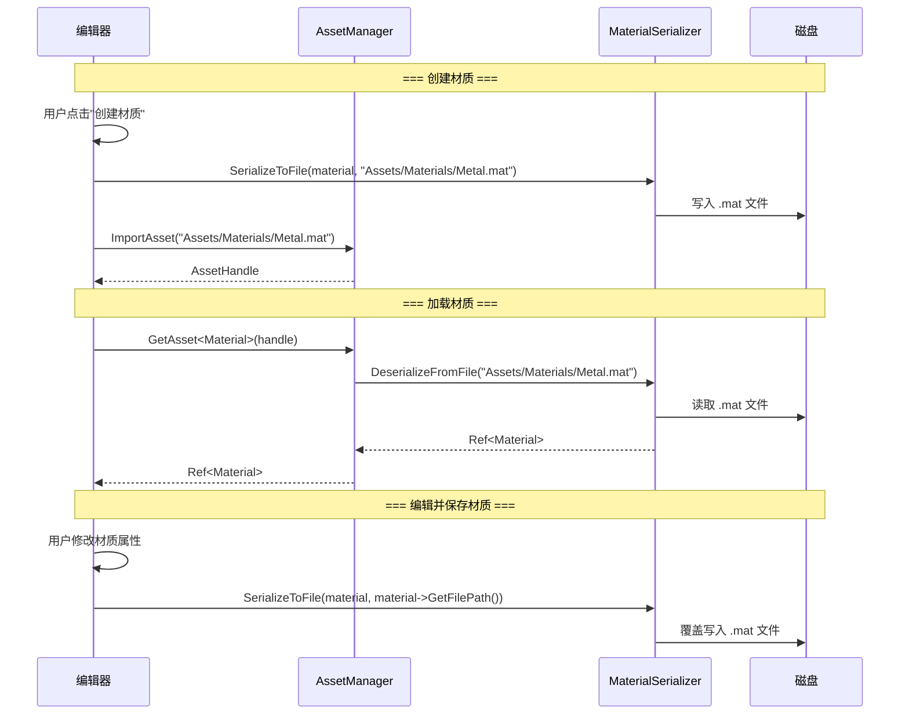
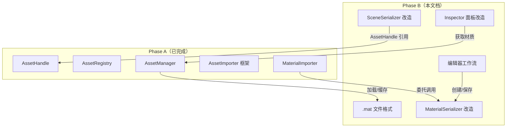
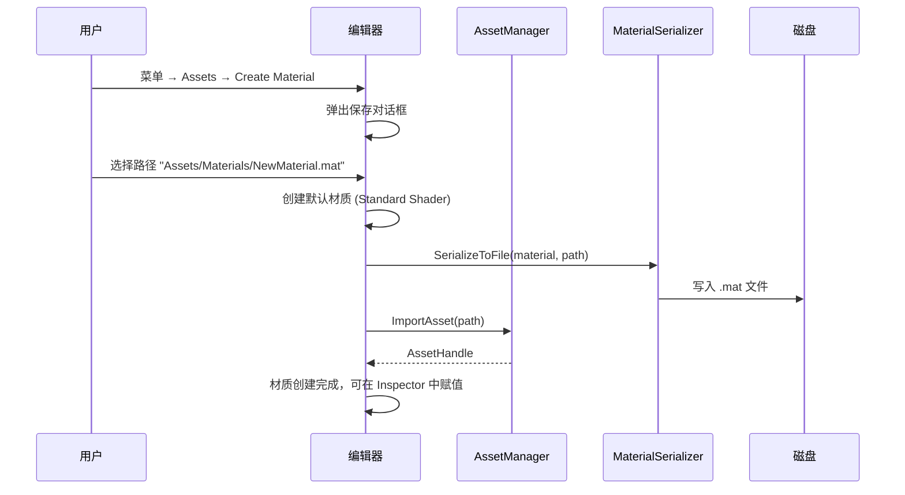
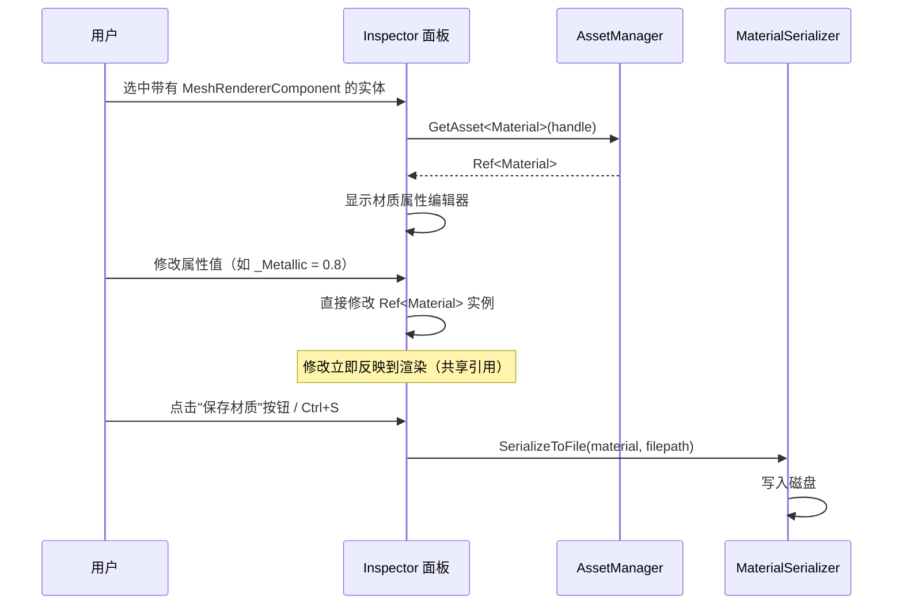
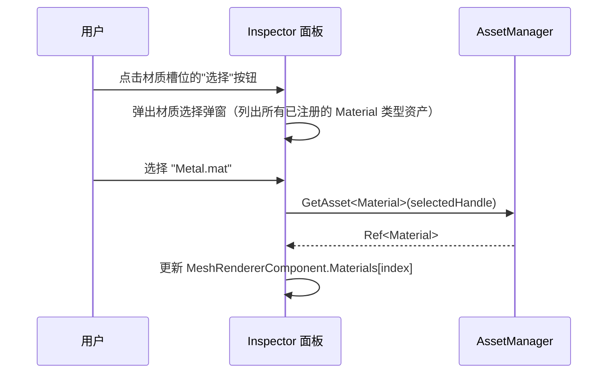

# Phase B：独立材质文件（.mat）

## 目录

- [一、概述](#一概述)
  - [1.1 当前问题](#11-当前问题)
  - [1.2 Phase B 解决的问题](#12-phase-b-解决的问题)
  - [1.3 设计目标](#13-设计目标)
  - [1.4 前置依赖](#14-前置依赖)
  - [1.5 术语定义](#15-术语定义)
- [二、整体架构](#二整体架构)
  - [2.1 材质文件工作流](#21-材质文件工作流)
  - [2.2 与 Phase A 的关系](#22-与-phase-a-的关系)
- [三、.mat 文件格式设计](#三mat-文件格式设计)
  - [3.1 方案 A：纯 YAML 格式](#31-方案-a纯-yaml-格式)
  - [3.2 方案 B：YAML + 二进制混合格式](#32-方案-byaml--二进制混合格式)
  - [3.3 方案推荐](#33-方案推荐)
  - [3.4 完整 .mat 文件示例](#34-完整-mat-文件示例)
- [四、MaterialSerializer 改造](#四materialserializer-改造)
  - [4.1 方案 A：扩展现有 MaterialSerializer](#41-方案-a扩展现有-materialserializer)
  - [4.2 方案 B：新建 MaterialFileSerializer](#42-方案-b新建-materialfileserializer)
  - [4.3 方案推荐](#43-方案推荐)
  - [4.4 接口设计](#44-接口设计)
  - [4.5 完整实现](#45-完整实现)
- [五、纹理引用方式设计](#五纹理引用方式设计)
  - [5.1 方案 A：相对路径引用](#51-方案-a相对路径引用)
  - [5.2 方案 B：AssetHandle 引用](#52-方案-bassethandle-引用)
  - [5.3 方案 C：混合方案（路径 + Handle）](#53-方案-c混合方案路径--handle)
  - [5.4 方案推荐](#54-方案推荐)
- [六、场景文件改造](#六场景文件改造)
  - [6.1 方案 A：材质完全外部化](#61-方案-a材质完全外部化)
  - [6.2 方案 B：支持内嵌和外部引用两种模式](#62-方案-b支持内嵌和外部引用两种模式)
  - [6.3 方案推荐](#63-方案推荐)
  - [6.4 新场景文件格式示例](#64-新场景文件格式示例)
- [七、MaterialImporter 改造](#七materialimporter-改造)
  - [7.1 改造内容](#71-改造内容)
  - [7.2 完整实现](#72-完整实现)
- [八、编辑器工作流设计](#八编辑器工作流设计)
  - [8.1 创建材质工作流](#81-创建材质工作流)
  - [8.2 编辑材质工作流](#82-编辑材质工作流)
  - [8.3 材质赋值工作流](#83-材质赋值工作流)
  - [8.4 方案 A：自动保存](#84-方案-a自动保存)
  - [8.5 方案 B：手动保存](#85-方案-b手动保存)
  - [8.6 方案推荐](#86-方案推荐)
- [九、Inspector 面板改造](#九inspector-面板改造)
  - [9.1 材质槽位显示](#91-材质槽位显示)
  - [9.2 材质编辑器改造](#92-材质编辑器改造)
- [十、SceneSerializer 改造](#十sceneserializer-改造)
  - [10.1 序列化改造](#101-序列化改造)
  - [10.2 反序列化改造](#102-反序列化改造)
- [十一、项目目录结构](#十一项目目录结构)
- [十二、涉及的文件清单](#十二涉及的文件清单)
- [十三、分步实施策略](#十三分步实施策略)
- [十四、验证清单](#十四验证清单)
- [十五、已知限制与后续扩展](#十五已知限制与后续扩展)

---

## 一、概述

### 1.1 当前问题

Phase A 完成后，虽然资产系统核心框架已建立（AssetHandle、AssetRegistry、AssetManager），但材质仍然内嵌在场景文件中：

```yaml
# 当前场景文件中的材质（内嵌格式）
MeshRendererComponent:
  Materials:
    - Name: Metal Material
      Shader: Standard
      RenderState:
        RenderingMode: 0
        CullMode: 0
        ...
      Properties:
        - Name: _Albedo
          Type: Float4
          Value: [0.8, 0.2, 0.2, 1.0]
        - Name: _AlbedoMap
          Type: Sampler2D
          Value: Assets/Textures/Metal_Albedo.png
        ...
```

| 问题 | 影响 |
|------|------|
| **材质无法跨实体共享** | 两个实体使用相同材质时，数据被复制两份，修改一个不影响另一个 |
| **材质无法跨场景复用** | 切换场景后材质丢失，需要重新配置 |
| **无法独立版本控制** | 材质修改导致整个场景文件变更，Git diff 不友好 |
| **无法在 Content Browser 中管理** | 材质不是独立文件，无法浏览/搜索/拖拽 |
| **场景文件臃肿** | 大量材质数据内嵌导致场景文件过大 |

### 1.2 Phase B 解决的问题

将材质从场景文件中抽离为独立的 `.mat` 文件，成为可被资产系统管理的独立资产：

```
引入独立材质文件后：
┌─────────────────────────────────────────────────────────────┐
│  Assets/                                                     │
│  ├── Materials/                                              │
│  │   ├── Metal.mat          ← 独立材质文件                   │
│  │   ├── Wood.mat           ← 独立材质文件                   │
│  │   └── Glass.mat          ← 独立材质文件                   │
│  ├── Textures/                                               │
│  │   ├── Metal_Albedo.png                                    │
│  │   └── Wood_Normal.png                                     │
│  └── Scenes/                                                 │
│      └── Main.luck3d        ← 场景文件仅引用材质 Handle       │
└─────────────────────────────────────────────────────────────┘
```

### 1.3 设计目标

1. ? 材质作为独立 `.mat` 文件存在于磁盘
2. ? 材质通过 AssetHandle 被场景文件引用
3. ? 多个实体/场景可共享同一材质文件
4. ? 材质文件可被 AssetManager 加载和缓存
5. ? 编辑器支持创建/保存/编辑独立材质
6. ? 材质文件格式人类可读（YAML），Git 友好
7. ? 纹理在材质文件中通过 AssetHandle 引用（统一引用机制）

### 1.4 前置依赖

| 依赖 | 状态 | 说明 |
|------|------|------|
| Phase A 资产系统核心框架 | ? 待完成 | AssetHandle、AssetRegistry、AssetManager、AssetImporter |
| MaterialSerializer | ? 已完成 | 当前支持 Emitter/Node 级别的序列化 |
| Material 继承 Asset | ? Phase A Step 2 | Material 需要有 `GetHandle()` 方法 |
| AssetManager::ImportAsset | ? Phase A Step 6 | 需要能注册 .mat 文件 |

### 1.5 术语定义

| 术语 | 定义 |
|------|------|
| **.mat 文件** | 独立材质资产文件，YAML 格式，包含材质的完整定义 |
| **材质引用** | 场景文件中通过 AssetHandle 引用材质的方式 |
| **材质实例** | 运行时加载到内存中的 `Ref<Material>` 对象 |
| **默认材质** | 当材质文件丢失或加载失败时使用的内置错误材质 |

---

## 二、整体架构

### 2.1 材质文件工作流



### 2.2 与 Phase A 的关系



---

## 三、.mat 文件格式设计

### 3.1 方案 A：纯 YAML 格式

整个 `.mat` 文件使用 YAML 格式，与当前 MaterialSerializer 的输出格式一致，仅增加文件头信息。

```yaml
# Metal.mat
Material:
  Handle: 7284619502847361
  Name: Metal Material
  Shader: Standard
  RenderState:
    RenderingMode: 0
    CullMode: 0
    DepthWrite: true
    DepthTest: 1
    BlendMode: 0
    RenderQueue: 2000
  Properties:
    - Name: _Albedo
      Type: Float4
      Value: [0.8, 0.2, 0.2, 1.0]
    - Name: _Metallic
      Type: Float
      Value: 0.9
    - Name: _Roughness
      Type: Float
      Value: 0.3
    - Name: _AlbedoMap
      Type: Sampler2D
      Value: Assets/Textures/Metal_Albedo.png
    - Name: _NormalMap
      Type: Sampler2D
      Value: Assets/Textures/Metal_Normal.png
```

**优点**：
- 人类可读，Git 友好
- 与现有 MaterialSerializer 格式完全兼容，改造量最小
- 可直接用文本编辑器修改
- 调试方便

**缺点**：
- 文件体积略大（相比二进制）
- 解析速度略慢（对于当前项目规模可忽略）

### 3.2 方案 B：YAML + 二进制混合格式

文件头使用 YAML 存储元信息，属性值使用二进制存储。

```
[YAML Header]
Material:
  Handle: 7284619502847361
  Name: Metal Material
  Shader: Standard
  PropertyCount: 5
[Binary Data]
<属性值二进制数据>
```

**优点**：
- 加载速度更快
- 文件体积更小

**缺点**：
- 不可人类直接阅读
- 实现复杂度高
- Git diff 不友好
- 调试困难
- 当前项目规模无需此优化

### 3.3 方案推荐

| 方案 | 推荐度 | 理由 |
|------|--------|------|
| **方案 A：纯 YAML** | ??? 最优 | 与现有代码风格一致，改造量最小，可读性好，适合当前项目规模 |
| 方案 B：混合格式 | ? | 过度优化，增加复杂度，当前无性能瓶颈 |

**推荐方案 A**。

### 3.4 完整 .mat 文件示例

```yaml
# 文件格式版本（预留，便于后续升级）
Version: 1

Material:
  # AssetHandle（与 Registry 中一致）
  Handle: 7284619502847361
  
  # 材质名称
  Name: PBR Metal
  
  # 引用的 Shader 名称（从 ShaderLibrary 中查找）
  Shader: Standard
  
  # 渲染状态
  RenderState:
    RenderingMode: 0
    CullMode: 0
    DepthWrite: true
    DepthTest: 1
    BlendMode: 0
    RenderQueue: 2000
  
  # 材质属性列表（按 Shader uniform 声明顺序）
  Properties:
    - Name: _Albedo
      Type: Float4
      Value: [0.8, 0.2, 0.2, 1.0]
    - Name: _Metallic
      Type: Float
      Value: 0.9
    - Name: _Roughness
      Type: Float
      Value: 0.3
    - Name: _AO
      Type: Float
      Value: 1.0
    - Name: _AlbedoMap
      Type: Sampler2D
      Value: Assets/Textures/Metal_Albedo.png
    - Name: _NormalMap
      Type: Sampler2D
      Value: Assets/Textures/Metal_Normal.png
    - Name: _MetallicMap
      Type: Sampler2D
      Value: ""
    - Name: _RoughnessMap
      Type: Sampler2D
      Value: ""
```

---

## 四、MaterialSerializer 改造

### 4.1 方案 A：扩展现有 MaterialSerializer

在现有 `MaterialSerializer` 类中添加文件级别的序列化/反序列化方法，保留原有的 Emitter/Node 级别方法（供内部使用或过渡期使用）。

```cpp
class MaterialSerializer
{
public:
    // ---- 原有接口（保留，供内部使用）----
    static void Serialize(YAML::Emitter& out, const Ref<Material>& material);
    static Ref<Material> Deserialize(const YAML::Node& materialNode);

    // ---- 新增：文件级别接口 ----
    static void SerializeToFile(const Ref<Material>& material, const std::string& filepath);
    static Ref<Material> DeserializeFromFile(const std::string& filepath);
};
```

**优点**：
- 改动最小，向后兼容
- 复用现有序列化逻辑
- 单一职责类

**缺点**：
- 类职责略有膨胀（既处理 Node 级别又处理文件级别）

### 4.2 方案 B：新建 MaterialFileSerializer

创建独立的 `MaterialFileSerializer` 类专门处理 `.mat` 文件的读写，原有 `MaterialSerializer` 保持不变。

```cpp
// 新类
class MaterialFileSerializer
{
public:
    static void Serialize(const Ref<Material>& material, const std::string& filepath);
    static Ref<Material> Deserialize(const std::string& filepath);
};
```

**优点**：
- 职责分离清晰
- 不影响现有代码

**缺点**：
- 新增一个类，增加维护成本
- 内部实现仍需调用 MaterialSerializer 的属性序列化逻辑，存在代码重复或耦合

### 4.3 方案推荐

| 方案 | 推荐度 | 理由 |
|------|--------|------|
| **方案 A：扩展现有类** | ??? 最优 | 改动最小，复用现有逻辑，保持代码集中 |
| 方案 B：新建类 | ?? | 职责更清晰，但增加了不必要的复杂度 |

**推荐方案 A**。

### 4.4 接口设计

```cpp
// MaterialSerializer.h
#pragma once

#include "Lucky/Renderer/Material.h"
#include "Lucky/Asset/AssetHandle.h"

#include <yaml-cpp/yaml.h>

namespace Lucky
{
    /// <summary>
    /// 材质序列化器：支持内联序列化（到 Emitter/Node）和独立文件序列化（.mat）
    /// </summary>
    class MaterialSerializer
    {
    public:
        // ---- 内联序列化（供 SceneSerializer 内部使用，Phase B 后可逐步废弃）----

        /// <summary>
        /// 序列化材质到 YAML Emitter（内联模式）
        /// </summary>
        static void Serialize(YAML::Emitter& out, const Ref<Material>& material);

        /// <summary>
        /// 从 YAML 节点反序列化材质（内联模式）
        /// </summary>
        static Ref<Material> Deserialize(const YAML::Node& materialNode);

        // ---- 独立文件序列化（.mat 文件）----

        /// <summary>
        /// 将材质序列化到独立 .mat 文件
        /// 文件包含完整的材质定义（Handle、Shader、RenderState、Properties）
        /// </summary>
        /// <param name="material">要序列化的材质</param>
        /// <param name="filepath">输出文件路径（如 "Assets/Materials/Metal.mat"）</param>
        /// <returns>序列化是否成功</returns>
        static bool SerializeToFile(const Ref<Material>& material, const std::string& filepath);

        /// <summary>
        /// 从独立 .mat 文件反序列化材质
        /// </summary>
        /// <param name="filepath">材质文件路径</param>
        /// <returns>反序列化的材质（失败返回 nullptr）</returns>
        static Ref<Material> DeserializeFromFile(const std::string& filepath);
    };
}
```

### 4.5 完整实现

```cpp
// MaterialSerializer.cpp 新增部分

bool MaterialSerializer::SerializeToFile(const Ref<Material>& material, const std::string& filepath)
{
    if (!material)
    {
        LF_CORE_ERROR("MaterialSerializer::SerializeToFile - Material is null!");
        return false;
    }

    YAML::Emitter out;
    out << YAML::BeginMap;

    // 文件格式版本
    out << YAML::Key << "Version" << YAML::Value << 1;

    // 材质数据
    out << YAML::Key << "Material" << YAML::Value;
    out << YAML::BeginMap;

    // AssetHandle
    out << YAML::Key << "Handle" << YAML::Value << static_cast<uint64_t>(material->GetHandle());

    // 调用现有的序列化逻辑（Name、Shader、RenderState、Properties）
    // 注意：这里直接内联写入，不再嵌套一层 BeginMap/EndMap
    out << YAML::Key << "Name" << YAML::Value << material->GetName();

    // Shader 名称
    std::string shaderName = "";
    if (material->GetShader())
    {
        shaderName = material->GetShader()->GetName();
    }
    out << YAML::Key << "Shader" << YAML::Value << shaderName;

    // 渲染状态
    const RenderState& state = material->GetRenderState();
    out << YAML::Key << "RenderState" << YAML::BeginMap;
    out << YAML::Key << "RenderingMode" << YAML::Value << static_cast<int>(material->GetRenderingMode());
    out << YAML::Key << "CullMode" << YAML::Value << static_cast<int>(state.Cull);
    out << YAML::Key << "DepthWrite" << YAML::Value << state.DepthWrite;
    out << YAML::Key << "DepthTest" << YAML::Value << static_cast<int>(state.DepthTest);
    out << YAML::Key << "BlendMode" << YAML::Value << static_cast<int>(state.Blend);
    out << YAML::Key << "RenderQueue" << YAML::Value << state.Queue;
    out << YAML::EndMap;

    // 材质属性列表
    out << YAML::Key << "Properties" << YAML::Value << YAML::BeginSeq;
    const auto& propertyOrder = material->GetPropertyOrder();
    const auto& propertyMap = material->GetPropertyMap();

    for (const std::string& propName : propertyOrder)
    {
        auto it = propertyMap.find(propName);
        if (it == propertyMap.end()) continue;

        const MaterialProperty& prop = it->second;
        out << YAML::BeginMap;
        out << YAML::Key << "Name" << YAML::Value << prop.Name;
        out << YAML::Key << "Type" << YAML::Value << ShaderUniformTypeToString(prop.Type);
        SerializeMaterialPropertyValue(out, prop);
        out << YAML::EndMap;
    }
    out << YAML::EndSeq;

    out << YAML::EndMap;    // Material
    out << YAML::EndMap;    // Root

    // 确保目录存在
    std::filesystem::path path(filepath);
    if (path.has_parent_path())
    {
        std::filesystem::create_directories(path.parent_path());
    }

    // 写入文件
    std::ofstream fout(filepath);
    if (!fout.is_open())
    {
        LF_CORE_ERROR("MaterialSerializer::SerializeToFile - Failed to open file: {0}", filepath);
        return false;
    }

    fout << out.c_str();
    fout.close();

    LF_CORE_INFO("MaterialSerializer: Saved material '{0}' to '{1}'", material->GetName(), filepath);
    return true;
}

Ref<Material> MaterialSerializer::DeserializeFromFile(const std::string& filepath)
{
    if (!std::filesystem::exists(filepath))
    {
        LF_CORE_ERROR("MaterialSerializer::DeserializeFromFile - File not found: {0}", filepath);
        return nullptr;
    }

    YAML::Node data;
    try
    {
        data = YAML::LoadFile(filepath);
    }
    catch (const YAML::Exception& e)
    {
        LF_CORE_ERROR("MaterialSerializer::DeserializeFromFile - YAML parse error: {0}", e.what());
        return nullptr;
    }

    YAML::Node materialNode = data["Material"];
    if (!materialNode)
    {
        LF_CORE_ERROR("MaterialSerializer::DeserializeFromFile - No 'Material' node in file: {0}", filepath);
        return nullptr;
    }

    // 使用现有的反序列化逻辑
    Ref<Material> material = Deserialize(materialNode);

    if (material)
    {
        // 设置 Handle（从文件中读取）
        if (materialNode["Handle"])
        {
            uint64_t handleValue = materialNode["Handle"].as<uint64_t>();
            material->SetHandle(AssetHandle(handleValue));
        }

        LF_CORE_INFO("MaterialSerializer: Loaded material '{0}' from '{1}'", material->GetName(), filepath);
    }

    return material;
}
```

---

## 五、纹理引用方式设计

材质文件中引用纹理的方式是一个关键设计决策。

### 5.1 方案 A：相对路径引用

纹理在 `.mat` 文件中通过相对路径引用（相对于项目根目录）。

```yaml
Properties:
  - Name: _AlbedoMap
    Type: Sampler2D
    Value: Assets/Textures/Metal_Albedo.png
```

**优点**：
- 与当前实现完全一致，无需修改 MaterialSerializer 的属性序列化逻辑
- 人类可读，直观
- 不依赖 Registry（即使 Registry 损坏，路径仍可用）

**缺点**：
- 移动/重命名纹理文件后，所有引用该纹理的 `.mat` 文件都需要更新
- 无法利用资产系统的缓存机制（需要额外的路径→Handle 查找）

### 5.2 方案 B：AssetHandle 引用

纹理在 `.mat` 文件中通过 AssetHandle（UUID）引用。

```yaml
Properties:
  - Name: _AlbedoMap
    Type: Sampler2D
    Value: 3847562910384756
```

**优点**：
- 移动/重命名纹理文件后，引用不会失效（Handle 不变）
- 完全统一的资产引用机制
- 可直接通过 AssetManager 获取纹理（利用缓存）

**缺点**：
- 不可人类直接阅读（UUID 无语义）
- 依赖 Registry 正确性（Registry 损坏则无法解析）
- 需要修改 MaterialSerializer 的纹理属性序列化逻辑

### 5.3 方案 C：混合方案（路径 + Handle）

同时存储路径和 Handle，优先使用 Handle，Handle 失效时回退到路径。

```yaml
Properties:
  - Name: _AlbedoMap
    Type: Sampler2D
    Value:
      Handle: 3847562910384756
      Path: Assets/Textures/Metal_Albedo.png
```

**优点**：
- 兼具两种方案的优点
- Handle 失效时有路径兜底
- 人类可读（路径提供语义信息）

**缺点**：
- 格式稍复杂
- 需要维护两份引用的一致性
- 实现复杂度略高

### 5.4 方案推荐

| 方案 | 推荐度 | 理由 |
|------|--------|------|
| **方案 A：相对路径** | ??? 最优 | 与当前实现一致，改动最小，Phase B 的核心目标是材质独立化而非纹理引用改造 |
| 方案 C：混合方案 | ?? | 最完善但增加复杂度，可作为后续优化 |
| 方案 B：纯 Handle | ? | 可读性差，当前阶段不推荐 |

**推荐方案 A**。纹理引用方式的改造可以在后续 Phase 中独立进行，Phase B 聚焦于材质文件独立化。

---

## 六、场景文件改造

### 6.1 方案 A：材质完全外部化

场景文件中不再内嵌任何材质数据，所有材质通过 AssetHandle 引用外部 `.mat` 文件。

```yaml
MeshRendererComponent:
  Materials:
    - AssetHandle: 7284619502847361
    - AssetHandle: 9182736450192837
```

**优点**：
- 场景文件极简，职责清晰
- 材质修改不影响场景文件
- 完全解耦

**缺点**：
- 每个材质都必须先保存为 `.mat` 文件才能使用
- 临时/测试材质也需要创建文件（略繁琐）

### 6.2 方案 B：支持内嵌和外部引用两种模式

场景文件同时支持 AssetHandle 引用和内嵌材质两种格式，反序列化时自动识别。

```yaml
MeshRendererComponent:
  Materials:
    # 外部引用模式
    - AssetHandle: 7284619502847361
    # 内嵌模式（向后兼容或临时材质）
    - Name: Temp Material
      Shader: Standard
      Properties: [...]
```

**优点**：
- 向后兼容
- 灵活，支持临时材质

**缺点**：
- 增加反序列化复杂度（需要判断格式）
- 两种模式并存容易混乱
- 违背"统一引用机制"的设计目标

### 6.3 方案推荐

| 方案 | 推荐度 | 理由 |
|------|--------|------|
| **方案 A：完全外部化** | ??? 最优 | 与 Phase A 设计目标一致（统一 AssetHandle 引用），简洁清晰 |
| 方案 B：混合模式 | ?? | 灵活但增加复杂度，且 Phase A 文档已明确"不考虑旧场景兼容" |

**推荐方案 A**。Phase A 文档已明确不考虑旧场景文件的向后兼容，因此无需支持内嵌模式。

### 6.4 新场景文件格式示例

```yaml
Scene: Main Scene
EnvironmentSettings:
  SkyboxMaterial: 1234567890123456
  AmbientSource: 1
  AmbientColor: [0.1, 0.1, 0.15]
  DiffuseIntensity: 1.0
  SpecularIntensity: 1.0
  ReflectionResolution: 256
Entitys:
  - Entity: 12345678901234
    NameComponent:
      Name: Metal Cube
    TransformComponent:
      Position: [0, 0, 0]
      Rotation: [0, 0, 0, 1]
      Scale: [1, 1, 1]
    MeshFilterComponent:
      PrimitiveType: 1
      MeshAsset: 0
    MeshRendererComponent:
      Materials:
        - AssetHandle: 7284619502847361
        - AssetHandle: 9182736450192837
```

---

## 七、MaterialImporter 改造

### 7.1 改造内容

Phase A 中的 `MaterialImporter` 负责通过 AssetManager 加载材质。Phase B 需要修改其实现，使其调用 `MaterialSerializer::DeserializeFromFile` 来加载独立 `.mat` 文件。

### 7.2 完整实现

```cpp
// MaterialImporter.h
#pragma once

#include "AssetImporter.h"

namespace Lucky
{
    /// <summary>
    /// 材质资产导入器：从 .mat 文件加载材质
    /// </summary>
    class MaterialImporter : public AssetImporter
    {
    public:
        /// <summary>
        /// 加载材质资产
        /// </summary>
        /// <param name="metadata">资产元数据（包含文件路径）</param>
        /// <returns>加载的材质（Ref<void> 类型擦除）</returns>
        Ref<void> Load(const AssetMetadata& metadata) override;
    };
}

// MaterialImporter.cpp
#include "lcpch.h"
#include "MaterialImporter.h"

#include "Lucky/Serialization/MaterialSerializer.h"

#include <filesystem>

namespace Lucky
{
    Ref<void> MaterialImporter::Load(const AssetMetadata& metadata)
    {
        std::string absolutePath = std::filesystem::absolute(metadata.FilePath).string();

        Ref<Material> material = MaterialSerializer::DeserializeFromFile(absolutePath);

        if (!material)
        {
            LF_CORE_ERROR("MaterialImporter: Failed to load material from '{0}'", metadata.FilePath);
            return nullptr;
        }

        // 设置 Handle（确保与 Registry 中一致）
        material->SetHandle(metadata.Handle);

        return material;
    }
}
```

---

## 八、编辑器工作流设计

### 8.1 创建材质工作流



### 8.2 编辑材质工作流



### 8.3 材质赋值工作流



### 8.4 方案 A：自动保存

材质属性修改后自动保存到磁盘（类似 Unity 的行为）。

**实现方式**：在 Inspector 中检测到材质属性变化时，自动调用 `SerializeToFile`。

```cpp
// InspectorPanel.cpp - DrawMaterialEditor 中
if (propertyChanged)
{
    MaterialSerializer::SerializeToFile(material, AssetManager::GetAssetFilePath(material->GetHandle()));
}
```

**优点**：
- 用户无需手动保存，体验流畅
- 不会丢失修改

**缺点**：
- 频繁写磁盘（每次属性修改都触发 I/O）
- 无法"撤销"到保存前的状态（需要 Undo 系统配合）
- 误操作难以恢复

### 8.5 方案 B：手动保存

材质修改后标记为"脏"（dirty），用户手动触发保存（Ctrl+S 或按钮）。

**实现方式**：Material 类新增 `m_Dirty` 标记，Inspector 中显示"未保存"提示。

```cpp
// Material.h 新增
class Material : public Asset
{
public:
    // ...
    bool IsDirty() const { return m_Dirty; }
    void MarkDirty() { m_Dirty = true; }
    void ClearDirty() { m_Dirty = false; }
private:
    bool m_Dirty = false;
};
```

```cpp
// InspectorPanel.cpp
if (material->IsDirty())
{
    ImGui::TextColored({1, 0.5f, 0, 1}, "(Unsaved)");
    if (ImGui::Button("Save Material") || (ImGui::IsKeyDown(ImGuiKey_LeftCtrl) && ImGui::IsKeyPressed(ImGuiKey_S)))
    {
        std::string filepath = AssetManager::GetAssetFilePath(material->GetHandle());
        MaterialSerializer::SerializeToFile(material, filepath);
        material->ClearDirty();
    }
}
```

**优点**：
- 减少磁盘 I/O
- 用户可以"放弃修改"（重新加载）
- 与 Undo/Redo 系统配合更好

**缺点**：
- 用户可能忘记保存
- 需要额外的 UI 提示

### 8.6 方案推荐

| 方案 | 推荐度 | 理由 |
|------|--------|------|
| **方案 B：手动保存** | ??? 最优 | 更安全，与后续 Undo 系统配合好，减少 I/O，用户有控制权 |
| 方案 A：自动保存 | ?? | 体验流畅但风险高，适合有完善 Undo 系统后再考虑 |

**推荐方案 B**。

---

## 九、Inspector 面板改造

### 9.1 材质槽位显示

改造 `MeshRendererComponent` 在 Inspector 中的显示方式：

```cpp
// InspectorPanel.cpp - DrawComponent<MeshRendererComponent> 中

// 遍历材质槽位
for (uint32_t i = 0; i < meshRendererComponent.Materials.size(); ++i)
{
    Ref<Material>& material = meshRendererComponent.Materials[i];
    
    ImGui::PushID(static_cast<int>(i));
    
    // 显示材质名称和 Handle
    std::string label = std::format("Slot {}", i);
    std::string materialName = material ? material->GetName() : "(None)";
    
    // 材质槽位：显示名称 + 选择按钮
    ImGui::Text("%s", label.c_str());
    ImGui::SameLine();
    
    float buttonWidth = ImGui::GetContentRegionAvail().x;
    if (ImGui::Button(materialName.c_str(), { buttonWidth, 0 }))
    {
        // 打开材质选择弹窗
        m_ShowMaterialPicker = true;
        m_MaterialPickerSlotIndex = i;
    }
    
    // 拖放目标（Phase C 中实现从 Content Browser 拖拽）
    if (ImGui::BeginDragDropTarget())
    {
        if (const ImGuiPayload* payload = ImGui::AcceptDragDropPayload("ASSET_HANDLE"))
        {
            AssetHandle handle = *(AssetHandle*)payload->Data;
            if (AssetManager::GetAssetType(handle) == AssetType::Material)
            {
                material = AssetManager::GetAsset<Material>(handle);
            }
        }
        ImGui::EndDragDropTarget();
    }
    
    ImGui::PopID();
}
```

### 9.2 材质编辑器改造

材质编辑器需要增加"保存"功能和"脏标记"显示：

```cpp
void InspectorPanel::DrawMaterialEditor(Ref<Material>& material)
{
    if (!material) return;
    
    // 标题栏：材质名称 + 脏标记
    ImGui::Text("Material: %s", material->GetName().c_str());
    if (material->IsDirty())
    {
        ImGui::SameLine();
        ImGui::TextColored({1.0f, 0.6f, 0.0f, 1.0f}, " *");
    }
    
    // 保存按钮
    if (material->GetHandle().IsValid() && material->IsDirty())
    {
        if (ImGui::Button("Save"))
        {
            std::string filepath = AssetManager::GetAssetFilePath(material->GetHandle());
            if (!filepath.empty())
            {
                MaterialSerializer::SerializeToFile(material, filepath);
                material->ClearDirty();
            }
        }
    }
    
    ImGui::Separator();
    
    // ... 现有的属性编辑逻辑 ...
    // 在每个属性修改处添加 material->MarkDirty();
}
```

---

## 十、SceneSerializer 改造

### 10.1 序列化改造

```cpp
// SceneSerializer.cpp - SerializeEntity 中 MeshRendererComponent 部分

// MeshRenderer 组件
if (entity.HasComponent<MeshRendererComponent>())
{
    const auto& meshRendererComponent = entity.GetComponent<MeshRendererComponent>();
    
    out << YAML::Key << "MeshRendererComponent";
    out << YAML::BeginMap;
    
    // 序列化材质列表（仅存储 AssetHandle）
    out << YAML::Key << "Materials" << YAML::Value << YAML::BeginSeq;

    for (const auto& material : meshRendererComponent.Materials)
    {
        out << YAML::BeginMap;
        if (material && material->GetHandle().IsValid())
        {
            out << YAML::Key << "AssetHandle" << YAML::Value << static_cast<uint64_t>(material->GetHandle());
        }
        else
        {
            out << YAML::Key << "AssetHandle" << YAML::Value << 0;  // 无效 Handle
        }
        out << YAML::EndMap;
    }

    out << YAML::EndSeq;
    out << YAML::EndMap;
}
```

### 10.2 反序列化改造

```cpp
// SceneSerializer.cpp - Deserialize 中 MeshRendererComponent 部分

YAML::Node meshRendererComponentNode = entity["MeshRendererComponent"];
if (meshRendererComponentNode)
{
    auto& meshRendererComponent = deserializedEntity.AddComponent<MeshRendererComponent>();
    
    YAML::Node materialsNode = meshRendererComponentNode["Materials"];
    if (materialsNode && materialsNode.IsSequence())
    {
        meshRendererComponent.Materials.clear();
        meshRendererComponent.Materials.reserve(materialsNode.size());

        for (auto materialNode : materialsNode)
        {
            Ref<Material> material = nullptr;
            
            if (materialNode["AssetHandle"])
            {
                uint64_t handleValue = materialNode["AssetHandle"].as<uint64_t>();
                AssetHandle handle(handleValue);
                
                if (handle.IsValid())
                {
                    // 通过 AssetManager 获取材质（自动加载 + 缓存）
                    material = AssetManager::GetAsset<Material>(handle);
                }
            }
            
            if (!material)
            {
                // 材质加载失败，使用错误材质
                material = Renderer3D::GetInternalErrorMaterial();
                LF_CORE_WARN("SceneSerializer: Material asset not found, using error material.");
            }

            meshRendererComponent.Materials.push_back(material);
        }
    }
}
```

---

## 十一、项目目录结构

```
Luck3D/
├── Assets/                         ← 项目资产根目录
│   ├── Materials/                  ← 材质文件目录
│   │   ├── Metal.mat
│   │   ├── Wood.mat
│   │   └── Glass.mat
│   ├── Textures/                   ← 纹理文件目录
│   │   ├── Metal_Albedo.png
│   │   └── Wood_Normal.png
│   ├── Models/                     ← 模型文件目录
│   │   └── Cube.fbx
│   └── Scenes/                     ← 场景文件目录
│       └── Main.luck3d
├── Assets.lreg                     ← 资产注册表（Phase A）
└── Lucky/
    └── Source/
        └── Lucky/
            ├── Asset/
            │   └── MaterialImporter.cpp    ← 改造
            └── Serialization/
                ├── MaterialSerializer.h    ← 改造（新增文件级接口）
                └── MaterialSerializer.cpp  ← 改造（新增文件级实现）
```

---

## 十二、涉及的文件清单

### 需要修改的文件

| 文件路径 | 修改内容 |
|---------|----------|
| `Lucky/Source/Lucky/Serialization/MaterialSerializer.h` | 新增 `SerializeToFile` / `DeserializeFromFile` 接口 |
| `Lucky/Source/Lucky/Serialization/MaterialSerializer.cpp` | 实现文件级序列化/反序列化，提取 `SerializeMaterialPropertyValue` 等为可复用的内部函数 |
| `Lucky/Source/Lucky/Asset/MaterialImporter.cpp` | 修改 `Load` 实现，调用 `MaterialSerializer::DeserializeFromFile` |
| `Lucky/Source/Lucky/Renderer/Material.h` | 新增 `m_Dirty` 标记及 `IsDirty()` / `MarkDirty()` / `ClearDirty()` 方法 |
| `Lucky/Source/Lucky/Serialization/SceneSerializer.cpp` | MeshRendererComponent 序列化改为 AssetHandle 引用；反序列化改为通过 AssetManager 获取 |
| `Luck3DApp/Source/Panels/InspectorPanel.cpp` | 材质编辑器增加保存按钮和脏标记显示；材质槽位改为 Handle 引用显示 |
| `Luck3DApp/Source/EditorLayer.cpp` | 新增"创建材质"菜单项 |

### 不需要修改的文件

| 文件路径 | 原因 |
|---------|------|
| `Lucky/Source/Lucky/Asset/AssetHandle.h` | Phase A 已定义 |
| `Lucky/Source/Lucky/Asset/AssetManager.h/cpp` | Phase A 已实现，无需修改 |
| `Lucky/Source/Lucky/Asset/AssetRegistry.h/cpp` | Phase A 已实现，无需修改 |
| `Lucky/Source/Lucky/Renderer/Material.cpp` | 材质核心逻辑不变 |
| `Lucky/Source/Lucky/Renderer/Renderer3D.h/cpp` | 渲染管线不变 |

---

## 十三、分步实施策略

| 步骤 | 内容 | 依赖 | 预估工作量 |
|------|------|------|-----------|
| **Step 1** | Material.h 新增 `m_Dirty` 标记和相关方法 | Phase A Step 2 | 极小 |
| **Step 2** | MaterialSerializer.h 新增 `SerializeToFile` / `DeserializeFromFile` 接口声明 | 无 | 极小 |
| **Step 3** | MaterialSerializer.cpp 实现 `SerializeToFile`（提取内部辅助函数） | Step 2 | 小 |
| **Step 4** | MaterialSerializer.cpp 实现 `DeserializeFromFile` | Step 2 | 小 |
| **Step 5** | MaterialImporter.cpp 修改 `Load` 实现，调用 `DeserializeFromFile` | Step 4 | 极小 |
| **Step 6** | SceneSerializer.cpp 改造 MeshRendererComponent 序列化（AssetHandle 引用） | Phase A Step 10 | 小 |
| **Step 7** | SceneSerializer.cpp 改造 MeshRendererComponent 反序列化（通过 AssetManager 获取） | Step 5, 6 | 小 |
| **Step 8** | SceneSerializer.cpp 改造 EnvironmentSettings 中 SkyboxMaterial 的序列化（AssetHandle 引用） | Step 6 | 极小 |
| **Step 9** | InspectorPanel.cpp 改造材质编辑器（脏标记 + 保存按钮） | Step 1 | 小 |
| **Step 10** | EditorLayer.cpp 新增"创建材质"菜单项和工作流 | Step 3 | 小 |
| **Step 11** | 编译测试 + 验证材质创建/保存/加载/共享 | 全部 | 小 |

**推荐执行顺序**：Step 1 → 2 → 3 → 4 → 5 → 6 → 7 → 8 → 9 → 10 → 11

> **关键里程碑**：
> - Step 4 完成后：可以手动创建 `.mat` 文件并通过代码加载
> - Step 7 完成后：场景文件使用 AssetHandle 引用材质，材质通过 AssetManager 加载
> - Step 10 完成后：编辑器支持完整的材质创建/编辑/保存工作流
> - Step 11 完成后：Phase B 全部完成

---

## 十四、验证清单

| # | 验证项 | 预期结果 |
|---|--------|--------|
| 1 | 编译通过 | 无编译错误和警告 |
| 2 | 创建材质 | 编辑器菜单创建材质，生成 .mat 文件 |
| 3 | .mat 文件内容正确 | YAML 格式，包含 Handle/Name/Shader/RenderState/Properties |
| 4 | 加载材质 | AssetManager::GetAsset\<Material\>(handle) 正确加载 .mat 文件 |
| 5 | 材质缓存 | 多次获取同一 Handle 返回同一实例 |
| 6 | 材质共享 | 两个实体引用同一 Handle，修改一个另一个同步变化 |
| 7 | 场景保存 | MeshRendererComponent 中材质序列化为 AssetHandle |
| 8 | 场景加载 | 反序列化时通过 AssetManager 正确获取材质 |
| 9 | 材质丢失处理 | Handle 无效或文件不存在时，使用错误材质 |
| 10 | 脏标记 | 修改材质属性后显示"未保存"标记 |
| 11 | 保存材质 | 点击保存按钮后 .mat 文件更新，脏标记清除 |
| 12 | Registry 持久化 | .mat 文件注册到 Registry，重启后仍可查到 |
| 13 | 纹理路径正确 | .mat 文件中纹理路径为相对路径，加载时正确解析 |
| 14 | SkyboxMaterial 外部化 | 天空盒材质也通过 AssetHandle 引用 |

---

## 十五、已知限制与后续扩展

| 限制 | 影响 | 后续优化方向 |
|------|------|-------------|
| 纹理仍用路径引用 | 移动纹理文件后 .mat 中引用失效 | 后续改为 AssetHandle 引用纹理 |
| 无材质实例化 | 无法基于同一 .mat 创建变体 | 后续添加 MaterialInstance 概念 |
| 无材质模板/预设 | 无法快速创建常用材质 | 后续添加材质模板系统 |
| 无材质预览 | Content Browser 中无法预览材质效果 | Phase C 中实现材质球预览 |
| 保存时无备份 | 保存失败可能丢失数据 | 后续添加 .mat.bak 备份机制 |
| 无批量操作 | 无法批量修改多个材质的属性 | 后续添加批量编辑功能 |
