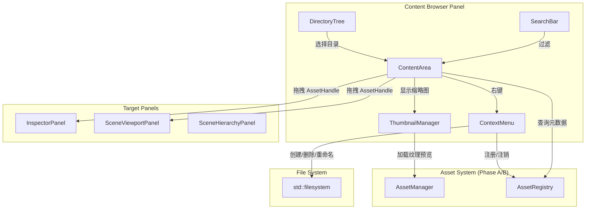
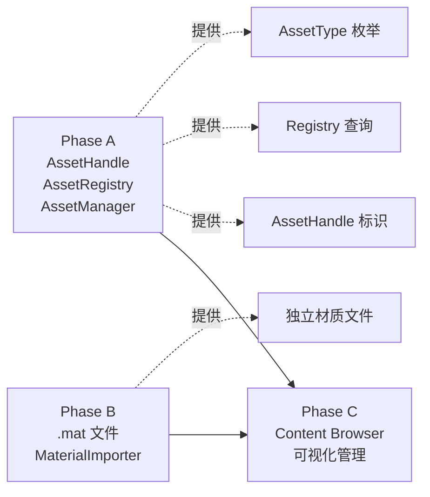

# Phase C：Content Browser 面板

## 目录

- [一、概述](#一概述)
  - [1.1 当前问题](#11-当前问题)
  - [1.2 Phase C 解决的问题](#12-phase-c-解决的问题)
  - [1.3 设计目标](#13-设计目标)
  - [1.4 前置依赖](#14-前置依赖)
  - [1.5 术语定义](#15-术语定义)
- [二、整体架构](#二整体架构)
  - [2.1 架构概览](#21-架构概览)
  - [2.2 与 Phase A/B 的关系](#22-与-phase-ab-的关系)
  - [2.3 面板布局设计](#23-面板布局设计)
- [三、ContentBrowserPanel 设计](#三contentbrowserpanel-设计)
  - [3.1 方案 A：单面板（目录树 + 内容区合一）](#31-方案-a单面板目录树--内容区合一)
  - [3.2 方案 B：双面板（目录树独立 + 内容区独立）](#32-方案-b双面板目录树独立--内容区独立)
  - [3.3 方案 C：单面板内分栏（左侧目录树 + 右侧内容区）](#33-方案-c单面板内分栏左侧目录树--右侧内容区)
  - [3.4 方案推荐](#34-方案推荐)
  - [3.5 类设计](#35-类设计)
- [四、目录树设计](#四目录树设计)
  - [4.1 数据模型](#41-数据模型)
  - [4.2 方案 A：实时扫描文件系统](#42-方案-a实时扫描文件系统)
  - [4.3 方案 B：缓存目录结构 + 手动刷新](#43-方案-b缓存目录结构--手动刷新)
  - [4.4 方案推荐](#44-方案推荐)
  - [4.5 目录树渲染](#45-目录树渲染)
- [五、资产网格视图设计](#五资产网格视图设计)
  - [5.1 方案 A：纯图标网格视图](#51-方案-a纯图标网格视图)
  - [5.2 方案 B：列表视图](#52-方案-b列表视图)
  - [5.3 方案 C：可切换视图（网格 / 列表）](#53-方案-c可切换视图网格--列表)
  - [5.4 方案推荐](#54-方案推荐)
  - [5.5 网格视图渲染](#55-网格视图渲染)
  - [5.6 缩略图尺寸滑块](#56-缩略图尺寸滑块)
- [六、资产缩略图系统](#六资产缩略图系统)
  - [6.1 方案 A：静态图标（按类型区分）](#61-方案-a静态图标按类型区分)
  - [6.2 方案 B：动态缩略图生成](#62-方案-b动态缩略图生成)
  - [6.3 方案 C：静态图标 + 纹理实时预览](#63-方案-c静态图标--纹理实时预览)
  - [6.4 方案推荐](#64-方案推荐)
  - [6.5 图标资源管理](#65-图标资源管理)
- [七、拖拽系统设计](#七拖拽系统设计)
  - [7.1 拖拽源（Drag Source）](#71-拖拽源drag-source)
  - [7.2 拖拽目标（Drop Target）](#72-拖拽目标drop-target)
  - [7.3 方案 A：仅支持拖拽到 Inspector](#73-方案-a仅支持拖拽到-inspector)
  - [7.4 方案 B：支持拖拽到 Inspector + Viewport + Hierarchy](#74-方案-b支持拖拽到-inspector--viewport--hierarchy)
  - [7.5 方案推荐](#75-方案推荐)
  - [7.6 拖拽 Payload 设计](#76-拖拽-payload-设计)
- [八、右键菜单设计](#八右键菜单设计)
  - [8.1 目录右键菜单](#81-目录右键菜单)
  - [8.2 资产右键菜单](#82-资产右键菜单)
  - [8.3 空白区域右键菜单](#83-空白区域右键菜单)
  - [8.4 方案 A：简单菜单（基础操作）](#84-方案-a简单菜单基础操作)
  - [8.5 方案 B：完整菜单（含资产创建子菜单）](#85-方案-b完整菜单含资产创建子菜单)
  - [8.6 方案推荐](#86-方案推荐)
- [九、搜索与过滤设计](#九搜索与过滤设计)
  - [9.1 方案 A：仅名称搜索](#91-方案-a仅名称搜索)
  - [9.2 方案 B：名称搜索 + 类型过滤](#92-方案-b名称搜索--类型过滤)
  - [9.3 方案推荐](#93-方案推荐)
  - [9.4 搜索实现](#94-搜索实现)
- [十、Registry 刷新功能](#十registry-刷新功能)
  - [10.1 刷新触发方式](#101-刷新触发方式)
  - [10.2 刷新逻辑](#102-刷新逻辑)
  - [10.3 实现代码](#103-实现代码)
- [十一、资产操作实现](#十一资产操作实现)
  - [11.1 创建资产](#111-创建资产)
  - [11.2 删除资产](#112-删除资产)
  - [11.3 重命名资产](#113-重命名资产)
  - [11.4 移动资产](#114-移动资产)
  - [11.5 复制资产](#115-复制资产)
- [十二、与现有系统的集成](#十二与现有系统的集成)
  - [12.1 与 EditorLayer 集成](#121-与-editorlayer-集成)
  - [12.2 与 InspectorPanel 集成](#122-与-inspectorpanel-集成)
  - [12.3 与 AssetManager 集成](#123-与-assetmanager-集成)
- [十三、数据结构完整定义](#十三数据结构完整定义)
  - [13.1 ContentBrowserPanel.h](#131-contentbrowserpanelh)
  - [13.2 ContentBrowserPanel.cpp（关键实现）](#132-contentbrowserpanelcpp关键实现)
  - [13.3 ThumbnailManager.h](#133-thumbnailmanagerh)
  - [13.4 ThumbnailManager.cpp](#134-thumbnailmanagercpp)
- [十四、项目目录结构](#十四项目目录结构)
- [十五、涉及的文件清单](#十五涉及的文件清单)
- [十六、分步实施策略](#十六分步实施策略)
- [十七、验证清单](#十七验证清单)
- [十八、已知限制与后续扩展](#十八已知限制与后续扩展)

---

## 一、概述

### 1.1 当前问题

Phase A/B 完成后，资产系统核心框架和独立材质文件已就绪，但用户无法可视化地浏览和管理项目中的资产：

```
当前状态：
- 导入模型：通过菜单 File → Import Model... 打开文件对话框
- 创建材质：通过菜单 File → Create Material（Phase B）
- 赋值材质：在 Inspector 中手动操作
- 查看资产：无法查看项目中有哪些资产文件
- 管理资产：无法在编辑器内移动/重命名/删除资产
```

| 问题 | 影响 |
|------|------|
| **无资产浏览器** | 用户不知道项目中有哪些可用资产 |
| **无拖拽赋值** | 材质/纹理赋值需要手动输入或通过菜单操作 |
| **无可视化管理** | 创建/删除/移动资产需要在文件管理器中操作 |
| **无搜索功能** | 项目资产增多后难以快速定位 |
| **无缩略图预览** | 无法直观区分不同纹理/材质 |

### 1.2 Phase C 解决的问题

提供一个完整的 Content Browser 面板，让用户可以在编辑器内可视化地浏览、搜索、管理和使用项目资产：

```
引入 Content Browser 后：
┌─────────────────────────────────────────────────────────────────┐
│  Content Browser                                    [?? Search] │
├──────────────┬──────────────────────────────────────────────────┤
│  ?? Assets   │  ← Back    Assets/Materials/                     │
│  ├── ?? Mat  │  ┌──────┐  ┌──────┐  ┌──────┐  ┌──────┐       │
│  ├── ?? Tex  │  │ ??   │  │ ??   │  │ ??   │  │ ??   │       │
│  ├── ?? Mod  │  │Metal │  │Wood  │  │Glass │  │Brick │       │
│  └── ?? Sce  │  │.mat  │  │.mat  │  │.mat  │  │.mat  │       │
│              │  └──────┘  └──────┘  └──────┘  └──────┘       │
│              │                                                  │
│              │  拖拽到 Inspector 即可赋值                        │
├──────────────┴──────────────────────────────────────────────────┤
│  [�T�T�T�T�T�T�T�T�T�T�T�T�T�T�T○�T�T�T] Thumbnail Size                           │
└─────────────────────────────────────────────────────────────────┘
```

### 1.3 设计目标

1. ? 可视化浏览项目 Assets 目录下的所有文件和文件夹
2. ? 左侧目录树 + 右侧内容网格的经典双栏布局
3. ? 支持资产缩略图显示（纹理实时预览 + 其他类型图标）
4. ? 支持从 Content Browser 拖拽资产到 Inspector 属性槽位
5. ? 支持右键菜单（创建/删除/重命名/移动资产）
6. ? 支持按名称搜索和按类型过滤
7. ? 支持 Registry 手动刷新（Ctrl+R）
8. ? 支持缩略图尺寸调节
9. ? 遵循项目现有面板系统架构（继承 `EditorPanel`，通过 `PanelManager` 注册）

### 1.4 前置依赖

| 依赖 | 状态 | 说明 |
|------|------|------|
| Phase A 资产系统核心框架 | ? 待完成 | AssetHandle、AssetRegistry、AssetManager、AssetType |
| Phase B 独立材质文件 | ? 待完成 | .mat 文件格式，材质通过 AssetHandle 引用 |
| EditorPanel 基类 | ? 已完成 | `Lucky/Editor/EditorPanel.h`，提供 OnGUI/OnUpdate/OnEvent 接口 |
| PanelManager | ? 已完成 | `Lucky/Editor/PanelManager.h`，面板注册和管理 |
| UI 工具库 | ? 已完成 | `Lucky/UI/` 目录，Widgets/UICore/Theme/DrawUtils/ScopedGuards |
| ImGui 拖拽 API | ? 已完成 | ImGui 内置 BeginDragDropSource/BeginDragDropTarget |
| Texture2D | ? 已完成 | 用于加载图标纹理和纹理缩略图预览 |
| std::filesystem | ? 已完成 | C++17 文件系统库，用于目录遍历 |

### 1.5 术语定义

| 术语 | 定义 |
|------|------|
| **Content Browser** | 资产浏览器面板，用于可视化浏览和管理项目资产 |
| **目录树（Directory Tree）** | 左侧面板，以树形结构显示 Assets 目录层级 |
| **内容区（Content Area）** | 右侧面板，以网格或列表形式显示当前目录下的文件 |
| **缩略图（Thumbnail）** | 资产的可视化预览图标 |
| **拖拽 Payload** | ImGui 拖拽操作中传递的数据（AssetHandle 或文件路径） |
| **Assets 根目录** | 项目的资产根目录，Content Browser 的浏览范围 |

---

## 二、整体架构

### 2.1 架构概览



### 2.2 与 Phase A/B 的关系



Content Browser 依赖 Phase A 提供的：
- `AssetHandle`：拖拽时传递的资产标识
- `AssetRegistry`：查询资产元数据、刷新注册表
- `AssetManager`：加载资产（用于缩略图预览）
- `AssetType`：按类型过滤和显示图标

Content Browser 依赖 Phase B 提供的：
- 独立 `.mat` 文件：可在 Content Browser 中浏览和管理

### 2.3 面板布局设计

```
┌─────────────────────────────────────────────────────────────────────┐
│  Content Browser                                                     │
├─────────────────────────────────────────────────────────────────────┤
│  [?? 搜索框________________] [类型过滤��] [网格|列表] [刷新]          │
├──────────────┬──────────────────────────────────────────────────────┤
│              │  ← ..    ?? Materials/                                │
│  目录树       │                                                      │
│              │  ┌────┐  ┌────┐  ┌────┐  ┌────┐  ┌────┐            │
│  ?? Assets   │  │icon│  │icon│  │icon│  │icon│  │icon│            │
│  ├─?? Mats  │  │name│  │name│  │name│  │name│  │name│            │
│  ├─?? Texs  │  └────┘  └────┘  └────┘  └────┘  └────┘            │
│  ├─?? Mods  │                                                      │
│  └─?? Scns  │  ┌────┐  ┌────┐                                     │
│              │  │icon│  │icon│                                     │
│              │  │name│  │name│                                     │
│              │  └────┘  └────┘                                     │
├──────────────┴──────────────────────────────────────────────────────┤
│  [�T�T�T�T�T�T�T�T�T�T�T�T�T�T�T○�T�T�T�T�T�T�T�T�T�T�T] 缩略图大小    Items: 7               │
└─────────────────────────────────────────────────────────────────────┘
```

---

## 三、ContentBrowserPanel 设计

### 3.1 方案 A：单面板（目录树 + 内容区合一）

仅显示当前目录的内容，通过面包屑导航或返回按钮切换目录，不显示目录树。

```cpp
class ContentBrowserPanel : public EditorPanel
{
public:
    void OnGUI() override
    {
        DrawBreadcrumb();       // 面包屑导航
        DrawContentGrid();      // 内容网格（文件夹 + 文件混合显示）
    }
private:
    std::filesystem::path m_CurrentDirectory;
};
```

**优点**：
- 实现简单
- 占用空间小
- 适合小型项目

**缺点**：
- 无法快速跳转到深层目录
- 无法同时看到目录结构全貌
- 导航效率低

### 3.2 方案 B：双面板（目录树独立 + 内容区独立）

目录树和内容区作为两个独立的 EditorPanel 注册到 PanelManager。

```cpp
class DirectoryTreePanel : public EditorPanel { ... };
class ContentAreaPanel : public EditorPanel { ... };
```

**优点**：
- 可以独立停靠和关闭
- 灵活度最高

**缺点**：
- 两个面板之间需要通信机制（事件/回调/共享状态）
- 增加了系统复杂度
- 用户可能误关闭其中一个

### 3.3 方案 C：单面板内分栏（左侧目录树 + 右侧内容区）

一个 EditorPanel 内部使用 ImGui 的 `Columns` 或 `Child` 窗口实现左右分栏。

```cpp
class ContentBrowserPanel : public EditorPanel
{
public:
    void OnGUI() override
    {
        DrawToolbar();          // 顶部工具栏（搜索 + 过滤 + 视图切换）
        
        // 左右分栏
        ImGui::BeginChild("DirectoryTree", { m_TreeWidth, 0 }, true);
        DrawDirectoryTree();
        ImGui::EndChild();
        
        ImGui::SameLine();
        
        ImGui::BeginChild("ContentArea", { 0, 0 }, true);
        DrawContentArea();
        ImGui::EndChild();
        
        DrawBottomBar();        // 底部状态栏（缩略图大小 + 项目计数）
    }
private:
    float m_TreeWidth = 200.0f;
    std::filesystem::path m_CurrentDirectory;
};
```

**优点**：
- 经典布局，用户熟悉（Unity/Unreal 均采用此方案）
- 单面板管理简单，无需跨面板通信
- 目录树和内容区紧密关联，交互自然
- 可通过拖拽分隔条调整比例

**缺点**：
- 面板内部布局稍复杂
- 分栏比例需要持久化

### 3.4 方案推荐

| 方案 | 推荐度 | 理由 |
|------|--------|------|
| **方案 C：单面板内分栏** | ??? 最优 | 经典布局，用户体验最佳，实现复杂度适中，与项目现有面板架构一致 |
| 方案 A：单面板 | ?? | 适合 MVP 快速实现，但长期体验不佳 |
| 方案 B：双面板 | ? | 过度设计，增加不必要的复杂度 |

**推荐方案 C**。

### 3.5 类设计

```cpp
class ContentBrowserPanel : public EditorPanel
{
public:
    ContentBrowserPanel();
    ~ContentBrowserPanel() override = default;

    void OnUpdate(DeltaTime dt) override;
    void OnGUI() override;
    void OnEvent(Event& event) override;

private:
    // ---- UI 绘制 ----
    void DrawToolbar();
    void DrawDirectoryTree();
    void DrawDirectoryTreeNode(const std::filesystem::path& directory);
    void DrawContentArea();
    void DrawContentGrid();
    void DrawContentList();
    void DrawAssetItem(const std::filesystem::directory_entry& entry);
    void DrawBottomBar();

    // ---- 右键菜单 ----
    void DrawContextMenu();
    void DrawDirectoryContextMenu(const std::filesystem::path& directory);
    void DrawAssetContextMenu(const std::filesystem::path& filepath);
    void DrawEmptySpaceContextMenu();

    // ---- 资产操作 ----
    void CreateMaterial();
    void DeleteAsset(const std::filesystem::path& filepath);
    void RenameAsset(const std::filesystem::path& oldPath, const std::string& newName);
    void MoveAsset(const std::filesystem::path& oldPath, const std::filesystem::path& newDirectory);

    // ---- 辅助 ----
    void NavigateTo(const std::filesystem::path& directory);
    void Refresh();
    Ref<Texture2D> GetThumbnail(const std::filesystem::path& filepath);
    AssetType GetAssetTypeFromPath(const std::filesystem::path& filepath) const;
    bool PassesFilter(const std::filesystem::directory_entry& entry) const;

private:
    std::filesystem::path m_AssetsDirectory;        // Assets 根目录
    std::filesystem::path m_CurrentDirectory;       // 当前浏览目录

    float m_TreePanelWidth = 200.0f;                // 目录树宽度
    float m_ThumbnailSize = 96.0f;                  // 缩略图大小
    float m_Padding = 16.0f;                        // 网格间距

    // 搜索与过滤
    char m_SearchBuffer[256] = {};                   // 搜索输入缓冲
    AssetType m_TypeFilter = AssetType::None;        // 类型过滤（None = 显示全部）

    // 视图模式
    enum class ViewMode { Grid, List };
    ViewMode m_ViewMode = ViewMode::Grid;

    // 重命名状态
    bool m_IsRenaming = false;
    std::filesystem::path m_RenamingPath;
    char m_RenameBuffer[256] = {};

    // 缩略图
    Ref<ThumbnailManager> m_ThumbnailManager;

    // 选中状态
    std::filesystem::path m_SelectedPath;
};
```

---

## 四、目录树设计

### 4.1 数据模型

目录树直接基于文件系统实时渲染，不需要额外的数据模型。每帧遍历 `m_AssetsDirectory` 下的子目录，使用 ImGui TreeNode 渲染。

### 4.2 方案 A：实时扫描文件系统

每帧调用 `std::filesystem::directory_iterator` 遍历目录结构。

```cpp
void ContentBrowserPanel::DrawDirectoryTreeNode(const std::filesystem::path& directory)
{
    std::string dirName = directory.filename().string();
    
    ImGuiTreeNodeFlags flags = ImGuiTreeNodeFlags_OpenOnArrow | ImGuiTreeNodeFlags_SpanAvailWidth;
    if (m_CurrentDirectory == directory)
        flags |= ImGuiTreeNodeFlags_Selected;
    
    // 检查是否有子目录
    bool hasSubDirs = false;
    for (auto& entry : std::filesystem::directory_iterator(directory))
    {
        if (entry.is_directory())
        {
            hasSubDirs = true;
            break;
        }
    }
    if (!hasSubDirs)
        flags |= ImGuiTreeNodeFlags_Leaf;
    
    bool opened = ImGui::TreeNodeEx(dirName.c_str(), flags);
    
    if (ImGui::IsItemClicked() && !ImGui::IsItemToggledOpen())
        NavigateTo(directory);
    
    if (opened)
    {
        for (auto& entry : std::filesystem::directory_iterator(directory))
        {
            if (entry.is_directory())
                DrawDirectoryTreeNode(entry.path());
        }
        ImGui::TreePop();
    }
}
```

**优点**：
- 实现简单，无需维护缓存
- 始终反映文件系统真实状态
- 无同步问题

**缺点**：
- 每帧遍历文件系统有性能开销
- 大型项目（数千文件）可能卡顿
- 频繁的系统调用

### 4.3 方案 B：缓存目录结构 + 手动刷新

构建目录树的内存缓存，仅在刷新时重新扫描。

```cpp
struct DirectoryNode
{
    std::string Name;
    std::filesystem::path FullPath;
    std::vector<DirectoryNode> SubDirectories;
    bool IsExpanded = false;
};

class ContentBrowserPanel : public EditorPanel
{
private:
    DirectoryNode m_RootNode;
    
    void RebuildDirectoryTree()
    {
        m_RootNode = BuildNode(m_AssetsDirectory);
    }
    
    DirectoryNode BuildNode(const std::filesystem::path& path)
    {
        DirectoryNode node;
        node.Name = path.filename().string();
        node.FullPath = path;
        
        for (auto& entry : std::filesystem::directory_iterator(path))
        {
            if (entry.is_directory())
                node.SubDirectories.push_back(BuildNode(entry.path()));
        }
        
        // 按名称排序
        std::sort(node.SubDirectories.begin(), node.SubDirectories.end(),
            [](const auto& a, const auto& b) { return a.Name < b.Name; });
        
        return node;
    }
};
```

**优点**：
- 渲染性能好，无每帧文件系统调用
- 可以缓存排序结果
- 适合大型项目

**缺点**：
- 需要手动刷新才能看到外部变化
- 缓存与文件系统可能不同步
- 实现稍复杂

### 4.4 方案推荐

| 方案 | 推荐度 | 理由 |
|------|--------|------|
| **方案 B：缓存目录结构** | ??? 最优 | 性能好，适合项目增长，配合 Refresh 机制可保持同步 |
| 方案 A：实时扫描 | ?? | 简单但性能差，适合原型阶段 |

**推荐方案 B**。在 Phase D 中引入 FileWatcher 后可自动触发刷新。

### 4.5 目录树渲染

```cpp
void ContentBrowserPanel::DrawDirectoryTree()
{
    // 根节点始终展开
    ImGuiTreeNodeFlags rootFlags = ImGuiTreeNodeFlags_DefaultOpen | ImGuiTreeNodeFlags_OpenOnArrow | ImGuiTreeNodeFlags_SpanAvailWidth;
    if (m_CurrentDirectory == m_AssetsDirectory)
        rootFlags |= ImGuiTreeNodeFlags_Selected;
    
    bool rootOpened = ImGui::TreeNodeEx("Assets", rootFlags);
    
    if (ImGui::IsItemClicked() && !ImGui::IsItemToggledOpen())
        NavigateTo(m_AssetsDirectory);
    
    // 目录树右键菜单
    if (ImGui::BeginPopupContextItem())
    {
        DrawDirectoryContextMenu(m_AssetsDirectory);
        ImGui::EndPopup();
    }
    
    if (rootOpened)
    {
        for (auto& subDir : m_RootNode.SubDirectories)
            DrawDirectoryTreeNodeCached(subDir);
        ImGui::TreePop();
    }
}

void ContentBrowserPanel::DrawDirectoryTreeNodeCached(DirectoryNode& node)
{
    ImGuiTreeNodeFlags flags = ImGuiTreeNodeFlags_OpenOnArrow | ImGuiTreeNodeFlags_SpanAvailWidth;
    
    if (m_CurrentDirectory == node.FullPath)
        flags |= ImGuiTreeNodeFlags_Selected;
    if (node.SubDirectories.empty())
        flags |= ImGuiTreeNodeFlags_Leaf;
    
    bool opened = ImGui::TreeNodeEx(node.Name.c_str(), flags);
    
    if (ImGui::IsItemClicked() && !ImGui::IsItemToggledOpen())
        NavigateTo(node.FullPath);
    
    // 右键菜单
    if (ImGui::BeginPopupContextItem())
    {
        DrawDirectoryContextMenu(node.FullPath);
        ImGui::EndPopup();
    }
    
    if (opened)
    {
        for (auto& subDir : node.SubDirectories)
            DrawDirectoryTreeNodeCached(subDir);
        ImGui::TreePop();
    }
}
```

---

## 五、资产网格视图设计

### 5.1 方案 A：纯图标网格视图

所有资产以固定大小的图标 + 名称显示，类似 Windows 资源管理器的"大图标"模式。

```
┌────┐  ┌────┐  ┌────┐  ┌────┐
│icon│  │icon│  │icon│  │icon│
│name│  │name│  │name│  │name│
└────┘  └────┘  └────┘  └────┘
```

**优点**：
- 视觉效果好，直观
- 适合浏览纹理等可视化资产
- 用户熟悉的交互模式

**缺点**：
- 显示信息有限（仅名称）
- 名称过长时需要截断
- 占用空间大

### 5.2 方案 B：列表视图

资产以列表形式显示，每行包含图标、名称、类型、大小等信息。

```
[icon] Metal.mat          Material    2.1 KB
[icon] Wood_Albedo.png    Texture2D   4.5 MB
[icon] Cube.fbx           Mesh        1.2 MB
```

**优点**：
- 信息密度高
- 适合大量资产的快速浏览
- 可以显示更多元数据

**缺点**：
- 视觉效果一般
- 不适合纹理预览
- 需要列头排序功能

### 5.3 方案 C：可切换视图（网格 / 列表）

提供视图切换按钮，用户可以在网格视图和列表视图之间切换。

```cpp
enum class ViewMode { Grid, List };

void ContentBrowserPanel::DrawContentArea()
{
    switch (m_ViewMode)
    {
        case ViewMode::Grid: DrawContentGrid(); break;
        case ViewMode::List: DrawContentList(); break;
    }
}
```

**优点**：
- 灵活，满足不同场景需求
- 用户可根据偏好选择

**缺点**：
- 需要实现两套渲染逻辑
- 增加代码量

### 5.4 方案推荐

| 方案 | 推荐度 | 理由 |
|------|--------|------|
| **方案 C：可切换视图** | ??? 最优 | 灵活性最高，用户体验最佳，参考 Unity 实现 |
| 方案 A：纯网格 | ?? | 适合 MVP，后续再添加列表视图 |
| 方案 B：纯列表 | ? | 信息密度高但视觉效果差 |

**推荐方案 C**，但可以先实现网格视图（MVP），后续再添加列表视图。

### 5.5 网格视图渲染

```cpp
void ContentBrowserPanel::DrawContentGrid()
{
    float cellSize = m_ThumbnailSize + m_Padding;
    float panelWidth = ImGui::GetContentRegionAvail().x;
    int columnCount = std::max(1, static_cast<int>(panelWidth / cellSize));
    
    ImGui::Columns(columnCount, nullptr, false);
    
    // 返回上级按钮（非根目录时显示）
    if (m_CurrentDirectory != m_AssetsDirectory)
    {
        ImGui::PushStyleColor(ImGuiCol_Button, ImVec4(0, 0, 0, 0));
        
        // 使用返回图标
        Ref<Texture2D> backIcon = m_ThumbnailManager->GetBackIcon();
        UI::Image(backIcon, { m_ThumbnailSize, m_ThumbnailSize });
        
        if (ImGui::IsItemHovered() && ImGui::IsMouseDoubleClicked(ImGuiMouseButton_Left))
        {
            NavigateTo(m_CurrentDirectory.parent_path());
        }
        
        ImGui::TextWrapped("..");
        ImGui::PopStyleColor();
        ImGui::NextColumn();
    }
    
    // 遍历当前目录
    for (auto& entry : std::filesystem::directory_iterator(m_CurrentDirectory))
    {
        if (!PassesFilter(entry))
            continue;
        
        DrawAssetItem(entry);
        ImGui::NextColumn();
    }
    
    ImGui::Columns(1);
}

void ContentBrowserPanel::DrawAssetItem(const std::filesystem::directory_entry& entry)
{
    const auto& path = entry.path();
    std::string filename = path.filename().string();
    
    ImGui::PushID(filename.c_str());
    
    // 获取缩略图
    Ref<Texture2D> thumbnail = GetThumbnail(path);
    
    // 选中高亮
    bool isSelected = (m_SelectedPath == path);
    if (isSelected)
        ImGui::PushStyleColor(ImGuiCol_Button, ImVec4(0.2f, 0.4f, 0.7f, 0.6f));
    else
        ImGui::PushStyleColor(ImGuiCol_Button, ImVec4(0, 0, 0, 0));
    
    // 绘制缩略图按钮
    ImGui::ImageButton(
        (ImTextureID)(uint64_t)thumbnail->GetRendererID(),
        { m_ThumbnailSize, m_ThumbnailSize },
        { 0, 1 }, { 1, 0 }  // OpenGL Y 翻转
    );
    
    ImGui::PopStyleColor();
    
    // ---- 交互 ----
    
    // 单击选中
    if (ImGui::IsItemClicked(ImGuiMouseButton_Left))
    {
        m_SelectedPath = path;
    }
    
    // 双击打开
    if (ImGui::IsItemHovered() && ImGui::IsMouseDoubleClicked(ImGuiMouseButton_Left))
    {
        if (entry.is_directory())
        {
            NavigateTo(path);
        }
        else
        {
            // 打开资产（如打开场景文件）
            // TODO: 根据类型执行不同操作
        }
    }
    
    // 拖拽源
    if (entry.is_regular_file())
    {
        AssetHandle handle = AssetManager::GetRegistry().GetHandle(
            std::filesystem::relative(path, m_AssetsDirectory).generic_string());
        
        if (handle.IsValid() && ImGui::BeginDragDropSource())
        {
            ImGui::SetDragDropPayload("ASSET_HANDLE", &handle, sizeof(AssetHandle));
            ImGui::Text("%s", filename.c_str());
            ImGui::EndDragDropSource();
        }
    }
    
    // 右键菜单
    if (ImGui::BeginPopupContextItem())
    {
        if (entry.is_directory())
            DrawDirectoryContextMenu(path);
        else
            DrawAssetContextMenu(path);
        ImGui::EndPopup();
    }
    
    // 文件名（支持重命名）
    if (m_IsRenaming && m_RenamingPath == path)
    {
        ImGui::SetKeyboardFocusHere();
        if (ImGui::InputText("##rename", m_RenameBuffer, sizeof(m_RenameBuffer),
            ImGuiInputTextFlags_EnterReturnsTrue | ImGuiInputTextFlags_AutoSelectAll))
        {
            RenameAsset(m_RenamingPath, m_RenameBuffer);
            m_IsRenaming = false;
        }
        if (ImGui::IsKeyPressed(ImGuiKey_Escape))
        {
            m_IsRenaming = false;
        }
    }
    else
    {
        ImGui::TextWrapped("%s", filename.c_str());
    }
    
    ImGui::PopID();
}
```

### 5.6 缩略图尺寸滑块

```cpp
void ContentBrowserPanel::DrawBottomBar()
{
    ImGui::Separator();
    
    // 缩略图大小滑块
    ImGui::SetNextItemWidth(150.0f);
    ImGui::SliderFloat("##ThumbnailSize", &m_ThumbnailSize, 48.0f, 192.0f, "%.0f");
    
    if (ImGui::IsItemHovered())
        ImGui::SetTooltip("Thumbnail Size");
    
    ImGui::SameLine();
    
    // 项目计数
    int itemCount = 0;
    for (auto& entry : std::filesystem::directory_iterator(m_CurrentDirectory))
    {
        if (PassesFilter(entry))
            itemCount++;
    }
    ImGui::Text("Items: %d", itemCount);
}
```

---

## 六、资产缩略图系统

### 6.1 方案 A：静态图标（按类型区分）

所有资产使用预制的静态图标，按 AssetType 区分。

```
Material  → ?? 材质球图标
Mesh      → ?? 立方体图标
Texture2D → ??? 图片图标
Scene     → ?? 场景图标
Folder    → ?? 文件夹图标
Unknown   → ?? 文件图标
```

**优点**：
- 实现极简单
- 性能零开销
- 无需额外资源加载

**缺点**：
- 无法区分同类型的不同资产
- 纹理无法预览实际内容
- 视觉信息量少

### 6.2 方案 B：动态缩略图生成

为每个资产动态生成缩略图：
- 纹理：缩放后的纹理预览
- 材质：离屏渲染材质球
- 模型：离屏渲染模型预览

**优点**：
- 视觉效果最佳
- 信息量最大

**缺点**：
- 实现复杂度极高（需要离屏渲染管线）
- 性能开销大
- 需要缩略图缓存和异步生成
- 远超当前项目阶段需求

### 6.3 方案 C：静态图标 + 纹理实时预览

- 纹理类型：直接加载纹理文件作为缩略图（缩放显示）
- 其他类型：使用静态图标

```cpp
Ref<Texture2D> ThumbnailManager::GetThumbnail(const std::filesystem::path& path)
{
    if (std::filesystem::is_directory(path))
        return m_FolderIcon;
    
    std::string ext = path.extension().string();
    AssetType type = GetAssetTypeFromExtension(ext);
    
    switch (type)
    {
        case AssetType::Texture2D:
            return GetOrLoadTextureThumbnail(path);  // 加载实际纹理
        case AssetType::Material:
            return m_MaterialIcon;
        case AssetType::Mesh:
            return m_MeshIcon;
        case AssetType::Scene:
            return m_SceneIcon;
        default:
            return m_FileIcon;
    }
}
```

**优点**：
- 纹理可以实时预览，视觉效果好
- 其他类型使用图标，实现简单
- 性能可控（纹理加载可以懒加载 + 缓存）
- 复杂度适中

**缺点**：
- 材质/模型无法预览（后续可扩展）
- 大量纹理首次加载可能有延迟

### 6.4 方案推荐

| 方案 | 推荐度 | 理由 |
|------|--------|------|
| **方案 C：静态图标 + 纹理预览** | ??? 最优 | 平衡了视觉效果和实现复杂度，纹理预览是最有价值的功能 |
| 方案 A：纯静态图标 | ?? | 适合快速原型，后续升级为方案 C |
| 方案 B：动态缩略图 | ? | 过度设计，当前阶段不需要 |

**推荐方案 C**。

### 6.5 图标资源管理

```cpp
/// <summary>
/// 缩略图管理器：管理资产图标和纹理缩略图缓存
/// </summary>
class ThumbnailManager
{
public:
    ThumbnailManager();
    ~ThumbnailManager() = default;

    /// <summary>
    /// 获取指定路径的缩略图
    /// </summary>
    Ref<Texture2D> GetThumbnail(const std::filesystem::path& path);

    /// <summary>
    /// 获取文件夹图标
    /// </summary>
    Ref<Texture2D> GetFolderIcon() const { return m_FolderIcon; }

    /// <summary>
    /// 获取返回图标
    /// </summary>
    Ref<Texture2D> GetBackIcon() const { return m_BackIcon; }

    /// <summary>
    /// 清除缩略图缓存
    /// </summary>
    void ClearCache();

private:
    Ref<Texture2D> GetOrLoadTextureThumbnail(const std::filesystem::path& path);
    Ref<Texture2D> GetIconForType(AssetType type) const;

private:
    // 内置图标
    Ref<Texture2D> m_FolderIcon;
    Ref<Texture2D> m_BackIcon;
    Ref<Texture2D> m_FileIcon;
    Ref<Texture2D> m_MaterialIcon;
    Ref<Texture2D> m_MeshIcon;
    Ref<Texture2D> m_SceneIcon;
    Ref<Texture2D> m_TextureIcon;       // 纹理加载失败时的备用图标

    // 纹理缩略图缓存：路径 → 纹理
    std::unordered_map<std::string, Ref<Texture2D>> m_ThumbnailCache;
};
```

图标文件存放位置：

```
Luck3DApp/
└── Resources/
    └── Icons/
        ├── ContentBrowser/
        │   ├── FolderIcon.png
        │   ├── BackIcon.png
        │   ├── FileIcon.png
        │   ├── MaterialIcon.png
        │   ├── MeshIcon.png
        │   ├── SceneIcon.png
        │   └── TextureIcon.png
```

---

## 七、拖拽系统设计

### 7.1 拖拽源（Drag Source）

Content Browser 中的资产项作为拖拽源，传递 `AssetHandle` 数据。

```cpp
// ContentBrowserPanel.cpp - DrawAssetItem 中
if (entry.is_regular_file() && ImGui::BeginDragDropSource(ImGuiDragDropFlags_SourceAllowNullID))
{
    // 获取资产的 Handle
    std::string relativePath = std::filesystem::relative(path, m_AssetsDirectory).generic_string();
    AssetHandle handle = AssetManager::GetRegistry().GetHandle(relativePath);
    
    if (handle.IsValid())
    {
        ImGui::SetDragDropPayload("ASSET_HANDLE", &handle, sizeof(AssetHandle));
        
        // 拖拽预览
        Ref<Texture2D> thumbnail = GetThumbnail(path);
        UI::Image(thumbnail, { 48, 48 });
        ImGui::SameLine();
        ImGui::Text("%s", path.filename().string().c_str());
    }
    
    ImGui::EndDragDropSource();
}
```

### 7.2 拖拽目标（Drop Target）

Inspector 中的材质槽位、纹理槽位等作为拖拽目标。

```cpp
// InspectorPanel.cpp - 材质槽位
if (ImGui::BeginDragDropTarget())
{
    if (const ImGuiPayload* payload = ImGui::AcceptDragDropPayload("ASSET_HANDLE"))
    {
        AssetHandle handle = *(AssetHandle*)payload->Data;
        AssetType type = AssetManager::GetAssetType(handle);
        
        if (type == AssetType::Material)
        {
            material = AssetManager::GetAsset<Material>(handle);
        }
    }
    ImGui::EndDragDropTarget();
}
```

### 7.3 方案 A：仅支持拖拽到 Inspector

拖拽目标仅限 Inspector 面板中的属性槽位（材质槽位、纹理属性等）。

**优点**：
- 实现简单
- 目标明确
- 不需要修改其他面板

**缺点**：
- 功能有限
- 无法直接拖拽模型到场景

### 7.4 方案 B：支持拖拽到 Inspector + Viewport + Hierarchy

拖拽目标扩展到：
- **Inspector**：材质/纹理属性槽位
- **Viewport**：拖拽模型到视口创建实体
- **Hierarchy**：拖拽场景文件打开

```cpp
// SceneViewportPanel.cpp - 视口拖拽目标
if (ImGui::BeginDragDropTarget())
{
    if (const ImGuiPayload* payload = ImGui::AcceptDragDropPayload("ASSET_HANDLE"))
    {
        AssetHandle handle = *(AssetHandle*)payload->Data;
        AssetType type = AssetManager::GetAssetType(handle);
        
        if (type == AssetType::Mesh)
        {
            // 在拖拽位置创建实体
            Entity entity = m_Scene->CreateEntity("Imported Mesh");
            auto& meshFilter = entity.AddComponent<MeshFilterComponent>();
            meshFilter.MeshAsset = handle;
            meshFilter.Mesh = AssetManager::GetAsset<Mesh>(handle);
            entity.AddComponent<MeshRendererComponent>();
        }
    }
    ImGui::EndDragDropTarget();
}
```

**优点**：
- 功能完整，交互自然
- 用户体验好（拖拽模型到场景是常见操作）

**缺点**：
- 需要修改多个面板
- 实现复杂度较高

### 7.5 方案推荐

| 方案 | 推荐度 | 理由 |
|------|--------|------|
| **方案 B：多目标拖拽** | ??? 最优 | 功能完整，用户体验好，是 3D 引擎编辑器的标准功能 |
| 方案 A：仅 Inspector | ?? | 适合 MVP 快速实现，后续再扩展 |

**推荐方案 B**，但可以分步实现：先实现 Inspector 拖拽（Step 1），再扩展到 Viewport（Step 2）。

### 7.6 拖拽 Payload 设计

```cpp
// 拖拽 Payload 类型标识符
constexpr const char* DRAG_DROP_ASSET_HANDLE = "ASSET_HANDLE";      // AssetHandle（已注册资产）
constexpr const char* DRAG_DROP_FILE_PATH = "FILE_PATH";            // 文件路径（未注册文件）

// Payload 数据结构
struct AssetDragDropPayload
{
    AssetHandle Handle;
    AssetType Type;
};
```

使用 `AssetHandle` 作为 Payload 的好处：
- 接收方可以直接通过 `AssetManager::GetAsset<T>(handle)` 获取资产
- 类型安全：接收方可以检查 `AssetManager::GetAssetType(handle)` 是否匹配
- 与资产系统完全集成

---

## 八、右键菜单设计

### 8.1 目录右键菜单

```cpp
void ContentBrowserPanel::DrawDirectoryContextMenu(const std::filesystem::path& directory)
{
    if (ImGui::MenuItem("New Folder"))
    {
        std::filesystem::path newDir = directory / "New Folder";
        std::filesystem::create_directory(newDir);
        Refresh();
    }
    
    ImGui::Separator();
    
    if (ImGui::BeginMenu("Create"))
    {
        if (ImGui::MenuItem("Material"))
        {
            CreateMaterialInDirectory(directory);
        }
        // 后续可扩展：Create Scene 等
        ImGui::EndMenu();
    }
    
    ImGui::Separator();
    
    if (ImGui::MenuItem("Show in Explorer"))
    {
        // 打开系统文件管理器
        ShellExecuteA(nullptr, "explore", directory.string().c_str(), nullptr, nullptr, SW_SHOWNORMAL);
    }
    
    if (ImGui::MenuItem("Refresh", "Ctrl+R"))
    {
        Refresh();
    }
    
    ImGui::Separator();
    
    // 非根目录才能删除
    if (directory != m_AssetsDirectory)
    {
        if (ImGui::MenuItem("Delete"))
        {
            // 确认对话框（后续实现）
            std::filesystem::remove_all(directory);
            Refresh();
        }
        
        if (ImGui::MenuItem("Rename"))
        {
            m_IsRenaming = true;
            m_RenamingPath = directory;
            strncpy(m_RenameBuffer, directory.filename().string().c_str(), sizeof(m_RenameBuffer));
        }
    }
}
```

### 8.2 资产右键菜单

```cpp
void ContentBrowserPanel::DrawAssetContextMenu(const std::filesystem::path& filepath)
{
    if (ImGui::MenuItem("Open"))
    {
        // 根据类型执行不同操作
        AssetType type = GetAssetTypeFromPath(filepath);
        switch (type)
        {
            case AssetType::Scene:
                // 通知 EditorLayer 打开场景
                break;
            case AssetType::Material:
                // 在 Inspector 中显示材质编辑器
                break;
            default:
                break;
        }
    }
    
    ImGui::Separator();
    
    if (ImGui::MenuItem("Rename", "F2"))
    {
        m_IsRenaming = true;
        m_RenamingPath = filepath;
        std::string stem = filepath.stem().string();
        strncpy(m_RenameBuffer, stem.c_str(), sizeof(m_RenameBuffer));
    }
    
    if (ImGui::MenuItem("Delete", "Delete"))
    {
        DeleteAsset(filepath);
    }
    
    if (ImGui::MenuItem("Duplicate"))
    {
        CopyAsset(filepath);
    }
    
    ImGui::Separator();
    
    if (ImGui::MenuItem("Show in Explorer"))
    {
        // 打开文件所在目录并选中文件
        std::string cmd = "/select," + filepath.string();
        ShellExecuteA(nullptr, "open", "explorer.exe", cmd.c_str(), nullptr, SW_SHOWNORMAL);
    }
    
    ImGui::Separator();
    
    // 显示资产信息
    std::string relativePath = std::filesystem::relative(filepath, m_AssetsDirectory).generic_string();
    AssetHandle handle = AssetManager::GetRegistry().GetHandle(relativePath);
    if (handle.IsValid())
    {
        ImGui::TextDisabled("Handle: %llu", static_cast<uint64_t>(handle));
        ImGui::TextDisabled("Type: %s", AssetTypeToString(AssetManager::GetAssetType(handle)).c_str());
    }
}
```

### 8.3 空白区域右键菜单

```cpp
void ContentBrowserPanel::DrawEmptySpaceContextMenu()
{
    if (ImGui::BeginPopupContextWindow("ContentAreaContextMenu", ImGuiPopupFlags_NoOpenOverItems | ImGuiPopupFlags_MouseButtonRight))
    {
        if (ImGui::MenuItem("New Folder"))
        {
            std::filesystem::path newDir = m_CurrentDirectory / "New Folder";
            std::filesystem::create_directory(newDir);
            Refresh();
        }
        
        ImGui::Separator();
        
        if (ImGui::BeginMenu("Create"))
        {
            if (ImGui::MenuItem("Material"))
            {
                CreateMaterialInDirectory(m_CurrentDirectory);
            }
            ImGui::EndMenu();
        }
        
        ImGui::Separator();
        
        if (ImGui::MenuItem("Show in Explorer"))
        {
            ShellExecuteA(nullptr, "explore", m_CurrentDirectory.string().c_str(), nullptr, nullptr, SW_SHOWNORMAL);
        }
        
        if (ImGui::MenuItem("Refresh", "Ctrl+R"))
        {
            Refresh();
        }
        
        ImGui::EndPopup();
    }
}
```

### 8.4 方案 A：简单菜单（基础操作）

仅包含最基本的操作：删除、重命名、在资源管理器中显示。

**优点**：实现简单，功能明确
**缺点**：功能有限，创建资产需要通过其他入口

### 8.5 方案 B：完整菜单（含资产创建子菜单）

包含完整的操作集：创建（材质/文件夹）、删除、重命名、复制、移动、在资源管理器中显示、刷新。

**优点**：功能完整，操作便捷
**缺点**：实现工作量稍大

### 8.6 方案推荐

| 方案 | 推荐度 | 理由 |
|------|--------|------|
| **方案 B：完整菜单** | ??? 最优 | Content Browser 的核心价值就是提供便捷的资产管理操作 |
| 方案 A：简单菜单 | ?? | 适合 MVP |

**推荐方案 B**。

---

## 九、搜索与过滤设计

### 9.1 方案 A：仅名称搜索

提供一个搜索框，按文件名模糊匹配过滤当前目录下的文件。

```cpp
void ContentBrowserPanel::DrawToolbar()
{
    // 搜索框
    ImGui::SetNextItemWidth(200.0f);
    ImGui::InputTextWithHint("##Search", "Search...", m_SearchBuffer, sizeof(m_SearchBuffer));
}

bool ContentBrowserPanel::PassesFilter(const std::filesystem::directory_entry& entry) const
{
    // 搜索过滤
    if (m_SearchBuffer[0] != '\0')
    {
        std::string filename = entry.path().filename().string();
        std::string search = m_SearchBuffer;
        
        // 大小写不敏感匹配
        std::transform(filename.begin(), filename.end(), filename.begin(), ::tolower);
        std::transform(search.begin(), search.end(), search.begin(), ::tolower);
        
        if (filename.find(search) == std::string::npos)
            return false;
    }
    
    return true;
}
```

**优点**：
- 实现简单
- 满足基本需求

**缺点**：
- 无法按类型过滤
- 搜索范围仅限当前目录

### 9.2 方案 B：名称搜索 + 类型过滤

搜索框 + 类型下拉过滤器，搜索时可选择是否递归搜索子目录。

```cpp
void ContentBrowserPanel::DrawToolbar()
{
    // 搜索框
    ImGui::SetNextItemWidth(200.0f);
    bool searchChanged = ImGui::InputTextWithHint("##Search", "Search...", m_SearchBuffer, sizeof(m_SearchBuffer));
    
    ImGui::SameLine();
    
    // 类型过滤下拉
    const char* typeFilterOptions[] = { "All", "Material", "Mesh", "Texture2D", "Scene" };
    int currentFilter = static_cast<int>(m_TypeFilter);
    ImGui::SetNextItemWidth(100.0f);
    if (ImGui::Combo("##TypeFilter", &currentFilter, typeFilterOptions, IM_ARRAYSIZE(typeFilterOptions)))
    {
        m_TypeFilter = static_cast<AssetType>(currentFilter);
    }
    
    ImGui::SameLine();
    
    // 视图切换按钮
    if (ImGui::Button(m_ViewMode == ViewMode::Grid ? "Grid" : "List"))
    {
        m_ViewMode = (m_ViewMode == ViewMode::Grid) ? ViewMode::List : ViewMode::Grid;
    }
    
    ImGui::SameLine();
    
    // 刷新按钮
    if (ImGui::Button("Refresh"))
    {
        Refresh();
    }
}

bool ContentBrowserPanel::PassesFilter(const std::filesystem::directory_entry& entry) const
{
    // 隐藏文件过滤（.meta 等）
    std::string filename = entry.path().filename().string();
    if (filename[0] == '.' || filename.ends_with(".lreg"))
        return false;
    
    // 目录始终显示（除非在搜索模式下）
    if (entry.is_directory() && m_SearchBuffer[0] == '\0')
        return true;
    
    // 名称搜索过滤
    if (m_SearchBuffer[0] != '\0')
    {
        std::string lowerFilename = filename;
        std::string lowerSearch = m_SearchBuffer;
        std::transform(lowerFilename.begin(), lowerFilename.end(), lowerFilename.begin(), ::tolower);
        std::transform(lowerSearch.begin(), lowerSearch.end(), lowerSearch.begin(), ::tolower);
        
        if (lowerFilename.find(lowerSearch) == std::string::npos)
            return false;
    }
    
    // 类型过滤
    if (m_TypeFilter != AssetType::None && entry.is_regular_file())
    {
        AssetType fileType = GetAssetTypeFromPath(entry.path());
        if (fileType != m_TypeFilter)
            return false;
    }
    
    return true;
}
```

**优点**：
- 功能完整
- 可以快速定位特定类型的资产
- 用户体验好

**缺点**：
- 实现稍复杂
- 需要处理搜索模式下的目录显示逻辑

### 9.3 方案推荐

| 方案 | 推荐度 | 理由 |
|------|--------|------|
| **方案 B：名称搜索 + 类型过滤** | ??? 最优 | 功能完整，类型过滤是 Content Browser 的核心功能 |
| 方案 A：仅名称搜索 | ?? | 适合 MVP |

**推荐方案 B**。

### 9.4 搜索实现

搜索模式下的特殊行为：
- 搜索框非空时，递归搜索当前目录及所有子目录
- 搜索结果平铺显示（不显示目录层级）
- 清空搜索框后恢复正常浏览模式

```cpp
void ContentBrowserPanel::DrawContentGrid()
{
    // ...
    
    if (m_SearchBuffer[0] != '\0')
    {
        // 搜索模式：递归遍历
        DrawSearchResults();
    }
    else
    {
        // 正常模式：仅当前目录
        DrawCurrentDirectoryContents();
    }
}

void ContentBrowserPanel::DrawSearchResults()
{
    for (auto& entry : std::filesystem::recursive_directory_iterator(m_CurrentDirectory))
    {
        if (!entry.is_regular_file())
            continue;
        if (!PassesFilter(entry))
            continue;
        
        DrawAssetItem(entry);
        ImGui::NextColumn();
    }
}
```

---

## 十、Registry 刷新功能

### 10.1 刷新触发方式

| 触发方式 | 说明 |
|---------|------|
| 快捷键 `Ctrl+R` | 在 Content Browser 面板聚焦时按下 |
| 右键菜单 → Refresh | 右键空白区域或目录 |
| 工具栏刷新按钮 | 点击工具栏中的刷新按钮 |
| 面板首次打开 | Content Browser 初始化时自动刷新一次 |

### 10.2 刷新逻辑

刷新操作执行以下步骤：

1. **重建目录树缓存**：重新扫描 Assets 目录结构
2. **同步 Registry**：
   - 移除文件已不存在的悬空条目
   - 扫描新文件并自动注册
3. **清除缩略图缓存**：已删除文件的缩略图需要清除
4. **保存 Registry**：将更新后的 Registry 持久化

### 10.3 实现代码

```cpp
void ContentBrowserPanel::Refresh()
{
    LF_CORE_INFO("ContentBrowser: Refreshing...");
    
    // 1. 重建目录树缓存
    RebuildDirectoryTree();
    
    // 2. 同步 Registry
    AssetManager::RefreshRegistry(m_AssetsDirectory.string());
    
    // 3. 清除缩略图缓存（简单策略：全部清除）
    m_ThumbnailManager->ClearCache();
    
    // 4. 验证当前目录是否仍然存在
    if (!std::filesystem::exists(m_CurrentDirectory))
    {
        m_CurrentDirectory = m_AssetsDirectory;
    }
    
    LF_CORE_INFO("ContentBrowser: Refresh complete.");
}
```

`AssetManager::RefreshRegistry` 的实现（Phase A 中已预留接口）：

```cpp
// AssetManager.cpp
void AssetManager::RefreshRegistry(const std::string& assetsDirectory)
{
    // 1. 移除悬空条目
    std::vector<AssetHandle> toRemove;
    for (const auto& [handle, metadata] : s_Registry.GetAllMetadata())
    {
        std::filesystem::path fullPath = assetsDirectory / metadata.FilePath;
        if (!std::filesystem::exists(fullPath))
        {
            toRemove.push_back(handle);
            // 同时清除缓存
            s_AssetCache.erase(handle);
        }
    }
    for (auto handle : toRemove)
    {
        s_Registry.Unregister(handle);
        LF_CORE_WARN("AssetManager: Removed stale asset [{0}]", static_cast<uint64_t>(handle));
    }
    
    // 2. 扫描新文件
    for (const auto& entry : std::filesystem::recursive_directory_iterator(assetsDirectory))
    {
        if (!entry.is_regular_file()) continue;
        
        std::string relativePath = std::filesystem::relative(entry.path(), assetsDirectory).generic_string();
        
        if (!s_Registry.ContainsPath(relativePath))
        {
            AssetType type = GetAssetTypeFromExtension(entry.path().extension().string());
            if (type != AssetType::None)
            {
                AssetMetadata metadata;
                metadata.Type = type;
                metadata.FilePath = relativePath;
                s_Registry.Register(metadata);
                LF_CORE_INFO("AssetManager: Discovered new asset '{0}'", relativePath);
            }
        }
    }
    
    // 3. 保存 Registry
    s_Registry.Save(s_RegistryFilePath);
}
```

---

## 十一、资产操作实现

### 11.1 创建资产

```cpp
void ContentBrowserPanel::CreateMaterialInDirectory(const std::filesystem::path& directory)
{
    // 生成不重复的文件名
    std::string baseName = "New Material";
    std::filesystem::path filepath = directory / (baseName + ".mat");
    int counter = 1;
    while (std::filesystem::exists(filepath))
    {
        filepath = directory / (baseName + " (" + std::to_string(counter++) + ").mat");
    }
    
    // 创建默认材质
    Ref<Shader> defaultShader = ShaderLibrary::Get("Standard");
    Ref<Material> material = Material::Create(defaultShader);
    material->SetName(filepath.stem().string());
    
    // 序列化到文件
    MaterialSerializer::SerializeToFile(material, filepath.string());
    
    // 注册到 AssetManager
    std::string relativePath = std::filesystem::relative(filepath, m_AssetsDirectory).generic_string();
    AssetHandle handle = AssetManager::ImportAsset(relativePath, AssetType::Material);
    material->SetHandle(handle);
    
    // 刷新视图
    Refresh();
    
    // 选中新创建的文件并进入重命名模式
    m_SelectedPath = filepath;
    m_IsRenaming = true;
    m_RenamingPath = filepath;
    strncpy(m_RenameBuffer, filepath.stem().string().c_str(), sizeof(m_RenameBuffer));
    
    LF_CORE_INFO("ContentBrowser: Created material '{0}'", filepath.string());
}
```

### 11.2 删除资产

```cpp
void ContentBrowserPanel::DeleteAsset(const std::filesystem::path& filepath)
{
    // 从 Registry 注销
    std::string relativePath = std::filesystem::relative(filepath, m_AssetsDirectory).generic_string();
    AssetHandle handle = AssetManager::GetRegistry().GetHandle(relativePath);
    
    if (handle.IsValid())
    {
        AssetManager::UnloadAsset(handle);
        AssetManager::GetRegistry().Unregister(handle);
    }
    
    // 删除文件
    std::filesystem::remove(filepath);
    
    // 清除选中状态
    if (m_SelectedPath == filepath)
        m_SelectedPath.clear();
    
    // 刷新
    Refresh();
    
    LF_CORE_INFO("ContentBrowser: Deleted asset '{0}'", filepath.string());
}
```

### 11.3 重命名资产

```cpp
void ContentBrowserPanel::RenameAsset(const std::filesystem::path& oldPath, const std::string& newName)
{
    std::filesystem::path newPath;
    
    if (std::filesystem::is_directory(oldPath))
    {
        newPath = oldPath.parent_path() / newName;
    }
    else
    {
        // 保留原扩展名
        newPath = oldPath.parent_path() / (newName + oldPath.extension().string());
    }
    
    if (std::filesystem::exists(newPath))
    {
        LF_CORE_WARN("ContentBrowser: Cannot rename - '{0}' already exists.", newPath.string());
        return;
    }
    
    // 更新 Registry 中的路径
    std::string oldRelative = std::filesystem::relative(oldPath, m_AssetsDirectory).generic_string();
    std::string newRelative = std::filesystem::relative(newPath, m_AssetsDirectory).generic_string();
    
    AssetHandle handle = AssetManager::GetRegistry().GetHandle(oldRelative);
    if (handle.IsValid())
    {
        AssetMetadata* metadata = AssetManager::GetRegistry().GetMetadata(handle);
        if (metadata)
        {
            metadata->FilePath = newRelative;
        }
        // 更新反向索引需要 Registry 提供接口
        AssetManager::GetRegistry().UpdatePath(handle, newRelative);
    }
    
    // 重命名文件
    std::filesystem::rename(oldPath, newPath);
    
    // 更新选中状态
    if (m_SelectedPath == oldPath)
        m_SelectedPath = newPath;
    
    // 刷新
    Refresh();
    
    LF_CORE_INFO("ContentBrowser: Renamed '{0}' to '{1}'", oldPath.filename().string(), newPath.filename().string());
}
```

### 11.4 移动资产

```cpp
void ContentBrowserPanel::MoveAsset(const std::filesystem::path& oldPath, const std::filesystem::path& newDirectory)
{
    std::filesystem::path newPath = newDirectory / oldPath.filename();
    
    if (std::filesystem::exists(newPath))
    {
        LF_CORE_WARN("ContentBrowser: Cannot move - '{0}' already exists in target directory.", oldPath.filename().string());
        return;
    }
    
    // 更新 Registry
    std::string oldRelative = std::filesystem::relative(oldPath, m_AssetsDirectory).generic_string();
    std::string newRelative = std::filesystem::relative(newPath, m_AssetsDirectory).generic_string();
    
    AssetHandle handle = AssetManager::GetRegistry().GetHandle(oldRelative);
    if (handle.IsValid())
    {
        AssetManager::GetRegistry().UpdatePath(handle, newRelative);
    }
    
    // 移动文件
    std::filesystem::rename(oldPath, newPath);
    
    Refresh();
    
    LF_CORE_INFO("ContentBrowser: Moved '{0}' to '{1}'", oldPath.string(), newDirectory.string());
}
```

### 11.5 复制资产

```cpp
void ContentBrowserPanel::CopyAsset(const std::filesystem::path& filepath)
{
    // 生成副本文件名
    std::string stem = filepath.stem().string();
    std::string ext = filepath.extension().string();
    std::filesystem::path copyPath = filepath.parent_path() / (stem + " (Copy)" + ext);
    
    int counter = 2;
    while (std::filesystem::exists(copyPath))
    {
        copyPath = filepath.parent_path() / (stem + " (Copy " + std::to_string(counter++) + ")" + ext);
    }
    
    // 复制文件
    std::filesystem::copy_file(filepath, copyPath);
    
    // 注册新资产
    std::string relativePath = std::filesystem::relative(copyPath, m_AssetsDirectory).generic_string();
    AssetType type = GetAssetTypeFromPath(copyPath);
    if (type != AssetType::None)
    {
        AssetManager::ImportAsset(relativePath, type);
    }
    
    Refresh();
    
    LF_CORE_INFO("ContentBrowser: Copied '{0}' to '{1}'", filepath.filename().string(), copyPath.filename().string());
}
```

---

## 十二、与现有系统的集成

### 12.1 与 EditorLayer 集成

```cpp
// EditorLayer.cpp - OnAttach 中注册 Content Browser 面板

#include "Panels/ContentBrowserPanel.h"

#define CONTENT_BROWSER_PANEL_ID "ContentBrowserPanel"

void EditorLayer::OnAttach()
{
    // ... 现有面板注册 ...
    
    // 注册 Content Browser 面板
    m_PanelManager->AddPanel<ContentBrowserPanel>(CONTENT_BROWSER_PANEL_ID, "Content Browser", true);
}

// UI_DrawMenuBar 中添加菜单项
if (ImGui::BeginMenu("Window"))
{
    if (ImGui::BeginMenu("Panels"))
    {
        // ... 现有菜单项 ...
        
        if (ImGui::MenuItem("Content Browser"))
        {
            uint32_t panelID = Hash::GenerateFNVHash(CONTENT_BROWSER_PANEL_ID);
            PanelData* panelData = m_PanelManager->GetPanelData(panelID);
            panelData->IsOpen = true;
        }
        
        ImGui::EndMenu();
    }
    ImGui::EndMenu();
}
```

### 12.2 与 InspectorPanel 集成

Inspector 面板需要添加拖拽目标支持：

```cpp
// InspectorPanel.cpp - 材质槽位拖拽目标

// 在材质槽位按钮后添加拖拽目标
if (ImGui::BeginDragDropTarget())
{
    if (const ImGuiPayload* payload = ImGui::AcceptDragDropPayload("ASSET_HANDLE"))
    {
        AssetHandle handle = *(AssetHandle*)payload->Data;
        
        // 验证类型
        if (AssetManager::GetAssetType(handle) == AssetType::Material)
        {
            Ref<Material> draggedMaterial = AssetManager::GetAsset<Material>(handle);
            if (draggedMaterial)
            {
                meshRendererComponent.Materials[i] = draggedMaterial;
            }
        }
    }
    ImGui::EndDragDropTarget();
}

// 纹理属性拖拽目标
if (ImGui::BeginDragDropTarget())
{
    if (const ImGuiPayload* payload = ImGui::AcceptDragDropPayload("ASSET_HANDLE"))
    {
        AssetHandle handle = *(AssetHandle*)payload->Data;
        
        if (AssetManager::GetAssetType(handle) == AssetType::Texture2D)
        {
            Ref<Texture2D> texture = AssetManager::GetAsset<Texture2D>(handle);
            if (texture)
            {
                material->SetTexture(propertyName, texture);
                material->MarkDirty();
            }
        }
    }
    ImGui::EndDragDropTarget();
}
```

### 12.3 与 AssetManager 集成

Content Browser 需要 AssetManager 提供以下接口（Phase A 中应已实现或预留）：

```cpp
// AssetManager 需要提供的接口
class AssetManager
{
public:
    // Phase A 已有
    static AssetHandle ImportAsset(const std::string& filepath, AssetType type);
    static void UnloadAsset(AssetHandle handle);
    static AssetType GetAssetType(AssetHandle handle);
    static AssetRegistry& GetRegistry();
    
    template<typename T>
    static Ref<T> GetAsset(AssetHandle handle);
    
    // Phase C 新增
    static void RefreshRegistry(const std::string& assetsDirectory);
    static std::string GetAssetFilePath(AssetHandle handle);
};

// AssetRegistry 需要新增的接口
class AssetRegistry
{
public:
    // Phase A 已有
    AssetHandle GetHandle(const std::string& filepath) const;
    bool ContainsPath(const std::string& filepath) const;
    void Unregister(AssetHandle handle);
    
    // Phase C 新增
    void UpdatePath(AssetHandle handle, const std::string& newPath);
};
```

`AssetRegistry::UpdatePath` 实现：

```cpp
void AssetRegistry::UpdatePath(AssetHandle handle, const std::string& newPath)
{
    auto it = m_Registry.find(handle);
    if (it == m_Registry.end())
    {
        LF_CORE_ERROR("AssetRegistry::UpdatePath - Handle not found!");
        return;
    }
    
    // 移除旧的反向索引
    m_PathToHandle.erase(it->second.FilePath);
    
    // 更新路径
    it->second.FilePath = newPath;
    
    // 添加新的反向索引
    m_PathToHandle[newPath] = handle;
    
    LF_CORE_INFO("AssetRegistry: Updated path for [{0}] to '{1}'", static_cast<uint64_t>(handle), newPath);
}
```

---

## 十三、数据结构完整定义

### 13.1 ContentBrowserPanel.h

```cpp
#pragma once

#include "Lucky/Editor/EditorPanel.h"
#include "Lucky/Asset/AssetHandle.h"
#include "Lucky/Asset/AssetType.h"
#include "Lucky/Renderer/Texture.h"

#include <filesystem>

namespace Lucky
{
    class ThumbnailManager;

    /// <summary>
    /// 目录树节点缓存
    /// </summary>
    struct DirectoryNode
    {
        std::string Name;                           // 目录名
        std::filesystem::path FullPath;             // 完整路径
        std::vector<DirectoryNode> SubDirectories;  // 子目录
    };

    /// <summary>
    /// Content Browser 面板：可视化浏览和管理项目资产
    /// </summary>
    class ContentBrowserPanel : public EditorPanel
    {
    public:
        ContentBrowserPanel();
        ~ContentBrowserPanel() override = default;

        void OnUpdate(DeltaTime dt) override;
        void OnGUI() override;
        void OnEvent(Event& event) override;

    private:
        // ---- UI 绘制 ----
        void DrawToolbar();
        void DrawDirectoryTree();
        void DrawDirectoryTreeNodeCached(DirectoryNode& node);
        void DrawContentArea();
        void DrawContentGrid();
        void DrawContentList();
        void DrawAssetItem(const std::filesystem::directory_entry& entry);
        void DrawBottomBar();

        // ---- 右键菜单 ----
        void DrawDirectoryContextMenu(const std::filesystem::path& directory);
        void DrawAssetContextMenu(const std::filesystem::path& filepath);
        void DrawEmptySpaceContextMenu();

        // ---- 资产操作 ----
        void CreateMaterialInDirectory(const std::filesystem::path& directory);
        void DeleteAsset(const std::filesystem::path& filepath);
        void RenameAsset(const std::filesystem::path& oldPath, const std::string& newName);
        void MoveAsset(const std::filesystem::path& oldPath, const std::filesystem::path& newDirectory);
        void CopyAsset(const std::filesystem::path& filepath);

        // ---- 辅助 ----
        void NavigateTo(const std::filesystem::path& directory);
        void Refresh();
        void RebuildDirectoryTree();
        DirectoryNode BuildDirectoryNode(const std::filesystem::path& path);
        Ref<Texture2D> GetThumbnail(const std::filesystem::path& filepath);
        AssetType GetAssetTypeFromPath(const std::filesystem::path& filepath) const;
        bool PassesFilter(const std::filesystem::directory_entry& entry) const;

        // ---- 搜索 ----
        void DrawSearchResults();
        void DrawCurrentDirectoryContents();

    private:
        std::filesystem::path m_AssetsDirectory;        // Assets 根目录
        std::filesystem::path m_CurrentDirectory;       // 当前浏览目录

        // 目录树缓存
        DirectoryNode m_RootNode;

        // 布局参数
        float m_TreePanelWidth = 200.0f;                // 目录树宽度
        float m_ThumbnailSize = 96.0f;                  // 缩略图大小
        float m_Padding = 16.0f;                        // 网格间距

        // 搜索与过滤
        char m_SearchBuffer[256] = {};                   // 搜索输入缓冲
        AssetType m_TypeFilter = AssetType::None;        // 类型过滤（None = 显示全部）

        // 视图模式
        enum class ViewMode { Grid, List };
        ViewMode m_ViewMode = ViewMode::Grid;

        // 重命名状态
        bool m_IsRenaming = false;
        std::filesystem::path m_RenamingPath;
        char m_RenameBuffer[256] = {};

        // 缩略图管理
        Ref<ThumbnailManager> m_ThumbnailManager;

        // 选中状态
        std::filesystem::path m_SelectedPath;
    };
}
```

### 13.2 ContentBrowserPanel.cpp（关键实现）

```cpp
#include "ContentBrowserPanel.h"

#include "Lucky/Asset/AssetManager.h"
#include "Lucky/Renderer/Shader.h"
#include "Lucky/Renderer/Material.h"
#include "Lucky/Serialization/MaterialSerializer.h"

#include "Lucky/UI/UICore.h"
#include "Lucky/UI/Theme.h"
#include "Lucky/UI/DrawUtils.h"
#include "Lucky/UI/Widgets.h"

#include <imgui/imgui.h>
#include <algorithm>

#ifdef _WIN32
#include <Windows.h>
#include <shellapi.h>
#endif

namespace Lucky
{
    ContentBrowserPanel::ContentBrowserPanel()
    {
        // 设置 Assets 根目录（相对于工作目录）
        m_AssetsDirectory = "Assets";
        m_CurrentDirectory = m_AssetsDirectory;
        
        // 确保 Assets 目录存在
        if (!std::filesystem::exists(m_AssetsDirectory))
        {
            std::filesystem::create_directories(m_AssetsDirectory);
        }
        
        // 初始化缩略图管理器
        m_ThumbnailManager = CreateRef<ThumbnailManager>();
        
        // 初始构建目录树
        RebuildDirectoryTree();
    }

    void ContentBrowserPanel::OnUpdate(DeltaTime dt)
    {
        // 暂无每帧更新逻辑
    }

    void ContentBrowserPanel::OnGUI()
    {
        DrawToolbar();
        
        ImGui::Separator();
        
        // 左右分栏
        float contentHeight = ImGui::GetContentRegionAvail().y - 30.0f; // 预留底部栏高度
        
        // 左侧：目录树
        ImGui::BeginChild("##DirectoryTree", { m_TreePanelWidth, contentHeight }, true);
        DrawDirectoryTree();
        ImGui::EndChild();
        
        ImGui::SameLine();
        
        // 右侧：内容区
        ImGui::BeginChild("##ContentArea", { 0, contentHeight }, true);
        DrawContentArea();
        DrawEmptySpaceContextMenu();
        ImGui::EndChild();
        
        // 底部栏
        DrawBottomBar();
    }

    void ContentBrowserPanel::OnEvent(Event& event)
    {
        // 处理快捷键
        // Ctrl+R 刷新
        // F2 重命名
        // Delete 删除
    }

    void ContentBrowserPanel::DrawToolbar()
    {
        // 搜索框
        ImGui::SetNextItemWidth(200.0f);
        ImGui::InputTextWithHint("##Search", "Search...", m_SearchBuffer, sizeof(m_SearchBuffer));
        
        ImGui::SameLine();
        
        // 类型过滤
        const char* typeOptions[] = { "All", "Material", "Mesh", "Texture2D", "Scene" };
        int currentFilter = static_cast<int>(m_TypeFilter);
        ImGui::SetNextItemWidth(100.0f);
        if (ImGui::Combo("##TypeFilter", &currentFilter, typeOptions, IM_ARRAYSIZE(typeOptions)))
        {
            m_TypeFilter = static_cast<AssetType>(currentFilter);
        }
        
        ImGui::SameLine();
        
        // 视图切换
        const char* viewLabel = (m_ViewMode == ViewMode::Grid) ? "Grid" : "List";
        if (ImGui::Button(viewLabel))
        {
            m_ViewMode = (m_ViewMode == ViewMode::Grid) ? ViewMode::List : ViewMode::Grid;
        }
        
        ImGui::SameLine();
        
        // 刷新按钮
        if (ImGui::Button("Refresh"))
        {
            Refresh();
        }
    }

    void ContentBrowserPanel::DrawContentArea()
    {
        // 面包屑导航
        std::string relativePath = std::filesystem::relative(m_CurrentDirectory, m_AssetsDirectory).generic_string();
        if (relativePath == ".")
            relativePath = "Assets/";
        else
            relativePath = "Assets/" + relativePath + "/";
        
        // 返回按钮
        if (m_CurrentDirectory != m_AssetsDirectory)
        {
            if (ImGui::Button("<-"))
            {
                NavigateTo(m_CurrentDirectory.parent_path());
            }
            ImGui::SameLine();
        }
        
        ImGui::Text("%s", relativePath.c_str());
        ImGui::Separator();
        
        // 内容视图
        if (m_SearchBuffer[0] != '\0')
        {
            DrawSearchResults();
        }
        else
        {
            DrawCurrentDirectoryContents();
        }
    }

    void ContentBrowserPanel::NavigateTo(const std::filesystem::path& directory)
    {
        if (std::filesystem::exists(directory) && std::filesystem::is_directory(directory))
        {
            m_CurrentDirectory = directory;
            m_SelectedPath.clear();
            m_IsRenaming = false;
        }
    }

    void ContentBrowserPanel::Refresh()
    {
        RebuildDirectoryTree();
        AssetManager::RefreshRegistry(m_AssetsDirectory.string());
        m_ThumbnailManager->ClearCache();
        
        if (!std::filesystem::exists(m_CurrentDirectory))
        {
            m_CurrentDirectory = m_AssetsDirectory;
        }
    }

    void ContentBrowserPanel::RebuildDirectoryTree()
    {
        m_RootNode = BuildDirectoryNode(m_AssetsDirectory);
    }

    DirectoryNode ContentBrowserPanel::BuildDirectoryNode(const std::filesystem::path& path)
    {
        DirectoryNode node;
        node.Name = path.filename().string();
        node.FullPath = path;
        
        if (std::filesystem::exists(path) && std::filesystem::is_directory(path))
        {
            for (auto& entry : std::filesystem::directory_iterator(path))
            {
                if (entry.is_directory())
                {
                    node.SubDirectories.push_back(BuildDirectoryNode(entry.path()));
                }
            }
            
            // 按名称排序
            std::sort(node.SubDirectories.begin(), node.SubDirectories.end(),
                [](const DirectoryNode& a, const DirectoryNode& b) { return a.Name < b.Name; });
        }
        
        return node;
    }

    AssetType ContentBrowserPanel::GetAssetTypeFromPath(const std::filesystem::path& filepath) const
    {
        std::string ext = filepath.extension().string();
        // 调用 Phase A 中定义的 GetAssetTypeFromExtension
        return GetAssetTypeFromExtension(ext);
    }

    bool ContentBrowserPanel::PassesFilter(const std::filesystem::directory_entry& entry) const
    {
        std::string filename = entry.path().filename().string();
        
        // 隐藏系统文件
        if (filename[0] == '.' || filename.ends_with(".lreg"))
            return false;
        
        // 目录在非搜索模式下始终显示
        if (entry.is_directory() && m_SearchBuffer[0] == '\0')
            return true;
        
        // 名称搜索
        if (m_SearchBuffer[0] != '\0')
        {
            std::string lowerFilename = filename;
            std::string lowerSearch = m_SearchBuffer;
            std::transform(lowerFilename.begin(), lowerFilename.end(), lowerFilename.begin(), ::tolower);
            std::transform(lowerSearch.begin(), lowerSearch.end(), lowerSearch.begin(), ::tolower);
            
            if (lowerFilename.find(lowerSearch) == std::string::npos)
                return false;
        }
        
        // 类型过滤
        if (m_TypeFilter != AssetType::None && entry.is_regular_file())
        {
            AssetType fileType = GetAssetTypeFromPath(entry.path());
            if (fileType != m_TypeFilter)
                return false;
        }
        
        return true;
    }

    Ref<Texture2D> ContentBrowserPanel::GetThumbnail(const std::filesystem::path& filepath)
    {
        return m_ThumbnailManager->GetThumbnail(filepath);
    }
}
```

### 13.3 ThumbnailManager.h

```cpp
#pragma once

#include "Lucky/Core/Base.h"
#include "Lucky/Renderer/Texture.h"
#include "Lucky/Asset/AssetType.h"

#include <filesystem>
#include <unordered_map>
#include <string>

namespace Lucky
{
    /// <summary>
    /// 缩略图管理器：管理 Content Browser 中的资产图标和纹理缩略图缓存
    /// </summary>
    class ThumbnailManager
    {
    public:
        ThumbnailManager();
        ~ThumbnailManager() = default;

        /// <summary>
        /// 获取指定路径的缩略图（目录返回文件夹图标，纹理返回实际预览，其他返回类型图标）
        /// </summary>
        /// <param name="path">文件或目录路径</param>
        /// <returns>缩略图纹理</returns>
        Ref<Texture2D> GetThumbnail(const std::filesystem::path& path);

        /// <summary>
        /// 获取返回上级目录图标
        /// </summary>
        Ref<Texture2D> GetBackIcon() const { return m_BackIcon; }

        /// <summary>
        /// 获取文件夹图标
        /// </summary>
        Ref<Texture2D> GetFolderIcon() const { return m_FolderIcon; }

        /// <summary>
        /// 清除纹理缩略图缓存（图标不清除）
        /// </summary>
        void ClearCache();

    private:
        /// <summary>
        /// 加载或从缓存获取纹理缩略图
        /// </summary>
        Ref<Texture2D> GetOrLoadTextureThumbnail(const std::filesystem::path& path);

        /// <summary>
        /// 根据资产类型获取对应图标
        /// </summary>
        Ref<Texture2D> GetIconForType(AssetType type) const;

    private:
        // 内置图标（程序启动时加载，不会被清除）
        Ref<Texture2D> m_FolderIcon;
        Ref<Texture2D> m_BackIcon;
        Ref<Texture2D> m_FileIcon;
        Ref<Texture2D> m_MaterialIcon;
        Ref<Texture2D> m_MeshIcon;
        Ref<Texture2D> m_SceneIcon;
        Ref<Texture2D> m_TextureIcon;       // 纹理加载失败时的备用图标

        // 纹理缩略图缓存
        std::unordered_map<std::string, Ref<Texture2D>> m_ThumbnailCache;
    };
}
```

### 13.4 ThumbnailManager.cpp

```cpp
#include "ThumbnailManager.h"

#include "Lucky/Asset/AssetType.h"
#include "Lucky/Core/Log.h"

namespace Lucky
{
    // 图标资源路径（相对于工作目录）
    static const char* s_IconBasePath = "Resources/Icons/ContentBrowser/";

    ThumbnailManager::ThumbnailManager()
    {
        // 加载内置图标
        std::string basePath = s_IconBasePath;
        
        m_FolderIcon   = Texture2D::Create(basePath + "FolderIcon.png");
        m_BackIcon     = Texture2D::Create(basePath + "BackIcon.png");
        m_FileIcon     = Texture2D::Create(basePath + "FileIcon.png");
        m_MaterialIcon = Texture2D::Create(basePath + "MaterialIcon.png");
        m_MeshIcon     = Texture2D::Create(basePath + "MeshIcon.png");
        m_SceneIcon    = Texture2D::Create(basePath + "SceneIcon.png");
        m_TextureIcon  = Texture2D::Create(basePath + "TextureIcon.png");
    }

    Ref<Texture2D> ThumbnailManager::GetThumbnail(const std::filesystem::path& path)
    {
        // 目录 → 文件夹图标
        if (std::filesystem::is_directory(path))
            return m_FolderIcon;
        
        // 根据扩展名判断类型
        std::string ext = path.extension().string();
        AssetType type = GetAssetTypeFromExtension(ext);
        
        switch (type)
        {
            case AssetType::Texture2D:
                return GetOrLoadTextureThumbnail(path);
            default:
                return GetIconForType(type);
        }
    }

    Ref<Texture2D> ThumbnailManager::GetOrLoadTextureThumbnail(const std::filesystem::path& path)
    {
        std::string pathStr = path.generic_string();
        
        // 查找缓存
        auto it = m_ThumbnailCache.find(pathStr);
        if (it != m_ThumbnailCache.end())
            return it->second;
        
        // 加载纹理
        if (std::filesystem::exists(path))
        {
            Ref<Texture2D> texture = Texture2D::Create(pathStr);
            if (texture)
            {
                m_ThumbnailCache[pathStr] = texture;
                return texture;
            }
        }
        
        // 加载失败，返回备用图标
        LF_CORE_WARN("ThumbnailManager: Failed to load texture thumbnail '{0}'", pathStr);
        return m_TextureIcon;
    }

    Ref<Texture2D> ThumbnailManager::GetIconForType(AssetType type) const
    {
        switch (type)
        {
            case AssetType::Material:   return m_MaterialIcon;
            case AssetType::Mesh:       return m_MeshIcon;
            case AssetType::Scene:      return m_SceneIcon;
            case AssetType::Texture2D:  return m_TextureIcon;
            default:                    return m_FileIcon;
        }
    }

    void ThumbnailManager::ClearCache()
    {
        m_ThumbnailCache.clear();
    }
}
```

---

## 十四、项目目录结构

```
Luck3D/
├── Assets/                             ← 项目资产根目录（Content Browser 浏览范围）
│   ├── Materials/
│   ├── Textures/
│   ├── Models/
│   └── Scenes/
├── Luck3DApp/
│   ├── Source/
│   │   ├── Panels/
│   │   │   ├── ContentBrowserPanel.h   ← 新建
│   │   │   ├── ContentBrowserPanel.cpp ← 新建
│   │   │   └── ...
│   │   └── EditorLayer.cpp            ← 修改（注册面板）
│   └── Resources/
│       └── Icons/
│           └── ContentBrowser/         ← 新建（图标资源）
│               ├── FolderIcon.png
│               ├── BackIcon.png
│               ├── FileIcon.png
│               ├── MaterialIcon.png
│               ├── MeshIcon.png
│               ├── SceneIcon.png
│               └── TextureIcon.png
└── Lucky/
    └── Source/
        └── Lucky/
            └── Asset/
                ├── AssetRegistry.h     ← 修改（新增 UpdatePath）
                ├── AssetRegistry.cpp   ← 修改（实现 UpdatePath）
                ├── AssetManager.h      ← 修改（新增 RefreshRegistry）
                ├── AssetManager.cpp    ← 修改（实现 RefreshRegistry）
                └── ThumbnailManager.h  ← 新建
                └── ThumbnailManager.cpp← 新建
```

---

## 十五、涉及的文件清单

### 需要新建的文件

| 文件路径 | 内容 |
|---------|------|
| `Luck3DApp/Source/Panels/ContentBrowserPanel.h` | Content Browser 面板类声明 |
| `Luck3DApp/Source/Panels/ContentBrowserPanel.cpp` | Content Browser 面板实现 |
| `Lucky/Source/Lucky/Asset/ThumbnailManager.h` | 缩略图管理器声明 |
| `Lucky/Source/Lucky/Asset/ThumbnailManager.cpp` | 缩略图管理器实现 |
| `Luck3DApp/Resources/Icons/ContentBrowser/FolderIcon.png` | 文件夹图标 |
| `Luck3DApp/Resources/Icons/ContentBrowser/BackIcon.png` | 返回图标 |
| `Luck3DApp/Resources/Icons/ContentBrowser/FileIcon.png` | 通用文件图标 |
| `Luck3DApp/Resources/Icons/ContentBrowser/MaterialIcon.png` | 材质图标 |
| `Luck3DApp/Resources/Icons/ContentBrowser/MeshIcon.png` | 模型图标 |
| `Luck3DApp/Resources/Icons/ContentBrowser/SceneIcon.png` | 场景图标 |
| `Luck3DApp/Resources/Icons/ContentBrowser/TextureIcon.png` | 纹理图标 |

### 需要修改的文件

| 文件路径 | 修改内容 |
|---------|----------|
| `Lucky/Source/Lucky/Asset/AssetRegistry.h` | 新增 `UpdatePath(AssetHandle, const std::string&)` 接口 |
| `Lucky/Source/Lucky/Asset/AssetRegistry.cpp` | 实现 `UpdatePath`（更新路径 + 反向索引） |
| `Lucky/Source/Lucky/Asset/AssetManager.h` | 新增 `RefreshRegistry(const std::string&)` 静态方法 |
| `Lucky/Source/Lucky/Asset/AssetManager.cpp` | 实现 `RefreshRegistry`（移除悬空 + 扫描新文件 + 保存） |
| `Luck3DApp/Source/EditorLayer.cpp` | 注册 ContentBrowserPanel，添加 Window 菜单项 |
| `Luck3DApp/Source/Panels/InspectorPanel.cpp` | 材质槽位和纹理属性添加拖拽目标支持 |

### 不需要修改的文件

| 文件路径 | 原因 |
|---------|------|
| `Lucky/Source/Lucky/Editor/EditorPanel.h` | 基类接口不变 |
| `Lucky/Source/Lucky/Editor/PanelManager.h` | 面板管理器不变 |
| `Lucky/Source/Lucky/Renderer/Texture.h/cpp` | 纹理加载接口不变 |
| `Lucky/Source/Lucky/Asset/AssetHandle.h` | Phase A 已定义 |
| `Lucky/Source/Lucky/Asset/AssetType.h` | Phase A 已定义 |

---

## 十六、分步实施策略

| 步骤 | 内容 | 依赖 | 预估工作量 |
|------|------|------|-----------|
| **Step 1** | 准备图标资源文件（7 个 PNG 图标） | 无 | 极小 |
| **Step 2** | 实现 `ThumbnailManager.h/cpp`（图标加载 + 纹理缓存） | Step 1 | 小 |
| **Step 3** | 实现 `ContentBrowserPanel.h` 类声明 | Phase A/B | 极小 |
| **Step 4** | 实现 `ContentBrowserPanel.cpp` ― 基础框架（构造函数 + OnGUI 分栏布局） | Step 3 | 小 |
| **Step 5** | 实现目录树渲染（缓存构建 + TreeNode 递归渲染） | Step 4 | 小 |
| **Step 6** | 实现内容网格视图（遍历目录 + 缩略图显示 + 文件名） | Step 2, 4 | 中 |
| **Step 7** | 实现搜索与过滤（搜索框 + 类型下拉 + PassesFilter） | Step 6 | 小 |
| **Step 8** | 实现拖拽源（Content Browser 中资产项的 DragDropSource） | Step 6 | 小 |
| **Step 9** | 实现拖拽目标（InspectorPanel 中材质/纹理槽位的 DragDropTarget） | Step 8 | 小 |
| **Step 10** | 实现右键菜单（目录/资产/空白区域三种菜单） | Step 6 | 小 |
| **Step 11** | 实现资产操作（创建材质/删除/重命名/复制） | Step 10 | 中 |
| **Step 12** | 实现 `AssetRegistry::UpdatePath` | Phase A | 极小 |
| **Step 13** | 实现 `AssetManager::RefreshRegistry` | Step 12 | 小 |
| **Step 14** | 实现 Refresh 功能（快捷键 + 按钮 + 逻辑） | Step 13 | 小 |
| **Step 15** | 修改 `EditorLayer.cpp`（注册面板 + 菜单项） | Step 4 | 极小 |
| **Step 16** | 实现底部状态栏（缩略图大小滑块 + 项目计数） | Step 6 | 极小 |
| **Step 17** | 实现列表视图（可选，网格视图已满足基本需求） | Step 6 | 小 |
| **Step 18** | 编译测试 + 验证全部功能 | 全部 | 小 |

**推荐执行顺序**：Step 1 → 2 → 3 → 4 → 5 → 6 → 7 → 8 → 9 → 10 → 11 → 12 → 13 → 14 → 15 → 16 → 17 → 18

> **关键里程碑**：
> - Step 6 完成后：可以浏览 Assets 目录，看到文件图标和名称
> - Step 9 完成后：可以从 Content Browser 拖拽资产到 Inspector
> - Step 11 完成后：可以在 Content Browser 中创建/删除/重命名资产
> - Step 14 完成后：Registry 刷新功能可用
> - Step 18 完成后：Phase C 全部完成

---

## 十七、验证清单

| # | 验证项 | 预期结果 |
|---|--------|--------|
| 1 | 编译通过 | 无编译错误和警告 |
| 2 | 面板显示 | Content Browser 面板正常显示在编辑器中 |
| 3 | 目录树渲染 | 左侧显示 Assets 目录树结构 |
| 4 | 目录导航 | 点击目录树节点或双击文件夹可切换当前目录 |
| 5 | 返回上级 | 点击返回按钮可回到上级目录 |
| 6 | 缩略图显示 | 纹理显示实际预览，其他类型显示对应图标 |
| 7 | 缩略图大小 | 滑块可调节缩略图大小，网格自动重排 |
| 8 | 名称搜索 | 输入关键词后正确过滤显示匹配的文件 |
| 9 | 类型过滤 | 选择类型后仅显示对应类型的资产 |
| 10 | 拖拽材质 | 从 Content Browser 拖拽 .mat 到 Inspector 材质槽位成功赋值 |
| 11 | 拖拽纹理 | 从 Content Browser 拖拽纹理到 Inspector 纹理属性成功赋值 |
| 12 | 拖拽类型检查 | 拖拽错误类型到槽位时不接受 |
| 13 | 右键创建材质 | 右键 → Create → Material 创建 .mat 文件 |
| 14 | 右键删除 | 右键 → Delete 删除文件并从 Registry 注销 |
| 15 | 右键重命名 | 右键 → Rename 进入重命名模式，回车确认 |
| 16 | 右键复制 | 右键 → Duplicate 创建副本并注册 |
| 17 | Refresh 功能 | Ctrl+R 或按钮触发刷新，检测外部变化 |
| 18 | 悬空条目清理 | 外部删除文件后刷新，Registry 中对应条目被移除 |
| 19 | 新文件发现 | 外部添加文件后刷新，新文件被自动注册 |
| 20 | 在资源管理器中显示 | 右键 → Show in Explorer 打开系统文件管理器 |
| 21 | 选中高亮 | 单击资产项显示选中高亮 |
| 22 | Window 菜单 | Window → Panels → Content Browser 可打开面板 |

---

## 十八、已知限制与后续扩展

| 限制 | 影响 | 后续优化方向 |
|------|------|-------------|
| 无材质球预览 | 材质仅显示静态图标，无法预览效果 | 后续添加离屏渲染材质球缩略图 |
| 无模型预览 | 模型仅显示静态图标 | 后续添加离屏渲染模型缩略图 |
| 无文件拖拽导入 | 无法从系统文件管理器拖拽文件到 Content Browser | 后续添加外部文件拖入支持 |
| 无多选操作 | 无法同时选中多个文件进行批量操作 | 后续添加 Ctrl+Click / Shift+Click 多选 |
| 无剪切/粘贴 | 无 Ctrl+X/C/V 快捷键支持 | 后续添加剪贴板操作 |
| 无确认对话框 | 删除操作无二次确认 | 后续添加模态确认对话框 |
| 无自动刷新 | 外部文件变化不会自动反映 | Phase D 中添加 FileWatcher 自动刷新 |
| 纹理缩略图无尺寸限制 | 大纹理直接加载可能占用过多显存 | 后续添加缩略图尺寸限制（生成小尺寸副本） |
| 无资产引用计数显示 | 无法看到资产被多少实体引用 | Phase D 依赖追踪完成后可显示 |
| 无排序功能 | 文件按文件系统顺序显示 | 后续添加按名称/类型/大小/日期排序 |
| 目录拖拽移动 | 无法通过拖拽移动文件到其他目录 | 后续添加目录间拖拽移动 |
