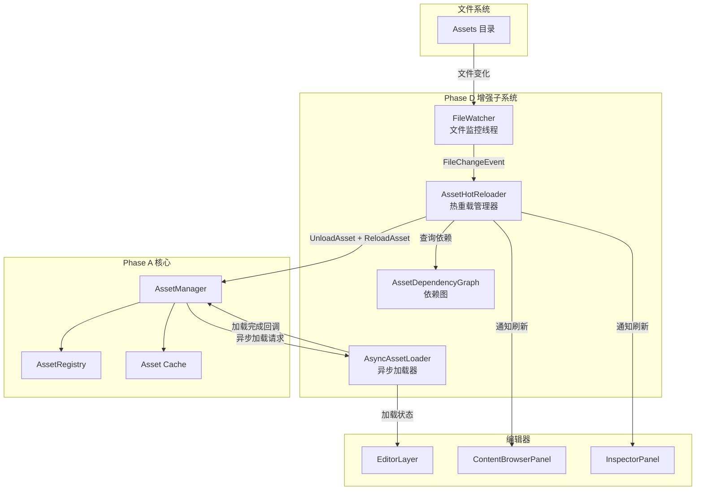
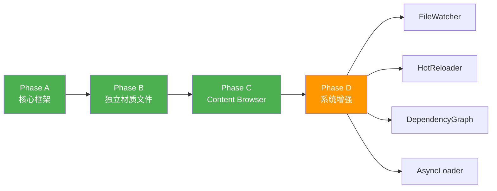
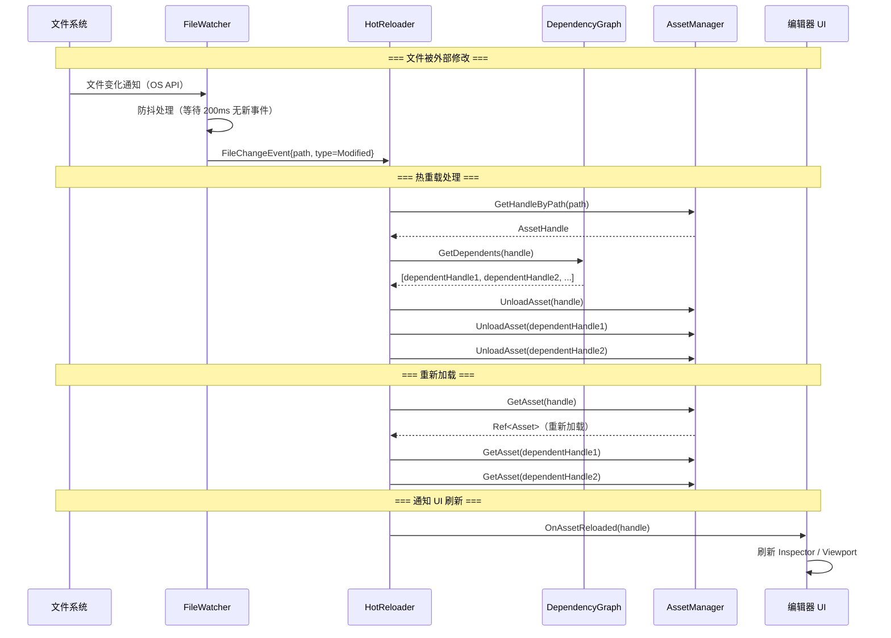
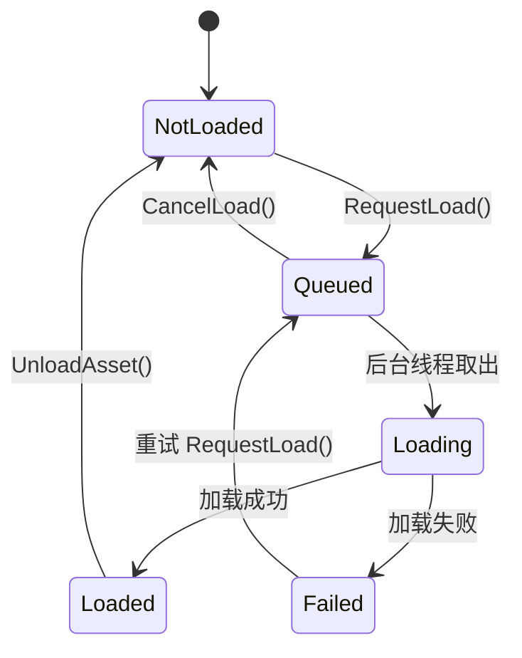

# Phase D：资产系统增强（FileWatcher / 热重载 / 依赖追踪 / 异步加载）

## 目录

- [一、概述](#一概述)
  - [1.1 当前问题](#11-当前问题)
  - [1.2 Phase D 解决的问题](#12-phase-d-解决的问题)
  - [1.3 设计目标](#13-设计目标)
  - [1.4 前置依赖](#14-前置依赖)
  - [1.5 术语定义](#15-术语定义)
- [二、整体架构](#二整体架构)
  - [2.1 架构概览](#21-架构概览)
  - [2.2 与 Phase A/B/C 的关系](#22-与-phase-abc-的关系)
  - [2.3 子系统交互流程](#23-子系统交互流程)
- [三、FileWatcher 设计](#三filewatcher-设计)
  - [3.1 职责定义](#31-职责定义)
  - [3.2 方案 A：轮询式文件监控（Polling）](#32-方案-a轮询式文件监控polling)
  - [3.3 方案 B：操作系统原生 API 监控（ReadDirectoryChangesW）](#33-方案-b操作系统原生-api-监控readdirectorychangesw)
  - [3.4 方案 C：混合方案（原生 API + 轮询兜底）](#34-方案-c混合方案原生-api--轮询兜底)
  - [3.5 方案推荐](#35-方案推荐)
  - [3.6 FileWatcher 接口设计](#36-filewatcher-接口设计)
  - [3.7 FileWatcher 完整实现](#37-filewatcher-完整实现)
  - [3.8 文件变化事件设计](#38-文件变化事件设计)
  - [3.9 防抖（Debounce）机制](#39-防抖debounce机制)
- [四、热重载系统设计](#四热重载系统设计)
  - [4.1 职责定义](#41-职责定义)
  - [4.2 方案 A：立即重载（检测到变化即刻重载）](#42-方案-a立即重载检测到变化即刻重载)
  - [4.3 方案 B：延迟批量重载（收集变化，帧末统一处理）](#43-方案-b延迟批量重载收集变化帧末统一处理)
  - [4.4 方案 C：手动触发重载（通知用户，由用户决定）](#44-方案-c手动触发重载通知用户由用户决定)
  - [4.5 方案推荐](#45-方案推荐)
  - [4.6 AssetHotReloader 接口设计](#46-assethotreloader-接口设计)
  - [4.7 AssetHotReloader 完整实现](#47-assethotreloader-完整实现)
  - [4.8 各类型资产的重载策略](#48-各类型资产的重载策略)
  - [4.9 重载通知机制](#49-重载通知机制)
- [五、资产依赖追踪设计](#五资产依赖追踪设计)
  - [5.1 职责定义](#51-职责定义)
  - [5.2 方案 A：静态依赖图（注册时构建）](#52-方案-a静态依赖图注册时构建)
  - [5.3 方案 B：动态依赖追踪（加载时记录）](#53-方案-b动态依赖追踪加载时记录)
  - [5.4 方案 C：混合方案（静态 + 动态）](#54-方案-c混合方案静态--动态)
  - [5.5 方案推荐](#55-方案推荐)
  - [5.6 AssetDependencyGraph 接口设计](#56-assetdependencygraph-接口设计)
  - [5.7 AssetDependencyGraph 完整实现](#57-assetdependencygraph-完整实现)
  - [5.8 依赖关系的持久化](#58-依赖关系的持久化)
  - [5.9 依赖追踪的应用场景](#59-依赖追踪的应用场景)
- [六、异步加载系统设计](#六异步加载系统设计)
  - [6.1 职责定义](#61-职责定义)
  - [6.2 方案 A：std::async + std::future](#62-方案-astdasync--stdfuture)
  - [6.3 方案 B：自定义线程池 + 任务队列](#63-方案-b自定义线程池--任务队列)
  - [6.4 方案 C：单后台线程 + 请求队列](#64-方案-c单后台线程--请求队列)
  - [6.5 方案推荐](#65-方案推荐)
  - [6.6 AsyncAssetLoader 接口设计](#66-asyncassetloader-接口设计)
  - [6.7 AsyncAssetLoader 完整实现](#67-asyncassetloader-完整实现)
  - [6.8 加载状态与回调机制](#68-加载状态与回调机制)
  - [6.9 线程安全考虑](#69-线程安全考虑)
  - [6.10 占位资产（Placeholder Asset）](#610-占位资产placeholder-asset)
- [七、与 AssetManager 的集成](#七与-assetmanager-的集成)
  - [7.1 AssetManager 扩展接口](#71-assetmanager-扩展接口)
  - [7.2 初始化与关闭流程改造](#72-初始化与关闭流程改造)
  - [7.3 GetAsset 流程改造（支持异步）](#73-getasset-流程改造支持异步)
- [八、与编辑器的集成](#八与编辑器的集成)
  - [8.1 EditorLayer 改造](#81-editorlayer-改造)
  - [8.2 状态栏通知](#82-状态栏通知)
  - [8.3 Inspector 实时刷新](#83-inspector-实时刷新)
- [九、项目目录结构](#九项目目录结构)
- [十、涉及的文件清单](#十涉及的文件清单)
- [十一、分步实施策略](#十一分步实施策略)
- [十二、验证清单](#十二验证清单)
- [十三、已知限制与后续扩展](#十三已知限制与后续扩展)

---

## 一、概述

### 1.1 当前问题

Phase A/B/C 完成后，资产系统已具备核心框架（AssetManager）、独立材质文件（.mat）和 Content Browser 面板。但仍存在以下问题：

| 问题 | 影响 |
|------|------|
| **无文件系统监控** | 外部编辑器修改纹理/材质后，编辑器内看不到变化，必须手动刷新 |
| **无资产热重载** | 修改 `.mat` 文件或替换纹理后，需要关闭重启编辑器才能看到效果 |
| **无资产依赖追踪** | 删除纹理时不知道哪些材质引用了它，可能导致材质显示异常 |
| **无异步加载** | 加载大型模型或高分辨率纹理时，主线程阻塞，编辑器卡顿 |
| **无加载进度反馈** | 用户不知道资产是否正在加载、加载进度如何 |

### 1.2 Phase D 解决的问题

Phase D 为资产系统添加四个增强子系统：

```
Phase D 增强子系统：
┌─────────────────────────────────────────────────────────────────┐
│                     Asset System Enhancement                      │
│                                                                   │
│  ┌──────────────┐  ┌──────────────┐  ┌──────────────────────┐  │
│  │ FileWatcher  │  │ HotReloader  │  │ DependencyGraph      │  │
│  │ 文件系统监控  │→│ 资产热重载    │  │ 依赖追踪             │  │
│  └──────────────┘  └──────────────┘  └──────────────────────┘  │
│                                                                   │
│  ┌──────────────────────────────────────────────────────────┐   │
│  │              AsyncAssetLoader（异步加载）                   │   │
│  │  后台线程加载 + 主线程回调 + 占位资产 + 进度通知            │   │
│  └──────────────────────────────────────────────────────────┘   │
└─────────────────────────────────────────────────────────────────┘
```

### 1.3 设计目标

1. ? 文件系统监控：自动检测 Assets 目录下文件的创建/修改/删除/重命名
2. ? 资产热重载：文件变化后自动重新加载受影响的资产，无需重启编辑器
3. ? 依赖追踪：维护资产间的依赖关系图，支持级联重载和安全删除检查
4. ? 异步加载：大资产后台加载，不阻塞主线程，提供加载状态回调
5. ? 与现有系统无缝集成：不破坏 Phase A/B/C 的现有接口
6. ? 遵循项目现有代码规范和架构风格

### 1.4 前置依赖

| 依赖 | 状态 | 说明 |
|------|------|------|
| Phase A（Asset Core Framework） | ? 前置完成 | AssetManager / AssetRegistry / AssetHandle / Importer 框架 |
| Phase B（独立材质文件） | ? 前置完成 | .mat 文件独立存在，可被热重载 |
| Phase C（Content Browser） | ? 前置完成 | 提供 UI 刷新入口和状态显示 |
| Event 系统 | ? 已完成 | `Core/Events/Event.h`，观察者模式事件分发 |
| UUID 系统 | ? 已完成 | `Core/UUID.h`，64 位随机 UUID |
| std::thread / std::mutex | ? C++17 标准库 | 多线程基础设施 |
| std::filesystem | ? C++17 标准库 | 文件系统操作 |
| Windows API（ReadDirectoryChangesW） | ? 平台 API | 原生文件监控（仅 Windows） |

### 1.5 术语定义

| 术语 | 定义 |
|------|------|
| **FileWatcher** | 文件系统监控器，检测目录下文件的变化事件 |
| **Hot Reload** | 热重载，在不重启应用的情况下重新加载已修改的资产 |
| **Dependency Graph** | 依赖图，记录资产之间的引用关系（A 依赖 B） |
| **Async Loading** | 异步加载，在后台线程执行资产加载，不阻塞主线程 |
| **Debounce** | 防抖，合并短时间内的多次事件为一次处理 |
| **Placeholder Asset** | 占位资产，异步加载期间显示的临时替代资产 |
| **Cascade Reload** | 级联重载，当被依赖资产变化时，自动重载所有依赖它的资产 |

---

## 二、整体架构

### 2.1 架构概览



### 2.2 与 Phase A/B/C 的关系



Phase D 的四个子系统是**可独立实施**的增强模块：
- **FileWatcher** 是 HotReloader 的前置依赖
- **DependencyGraph** 增强 HotReloader 的级联重载能力
- **AsyncLoader** 完全独立，可单独实施

### 2.3 子系统交互流程



---

## 三、FileWatcher 设计

### 3.1 职责定义

FileWatcher 负责监控指定目录（Assets/）下的文件变化，将变化事件通知给上层系统。

核心职责：
- 在后台线程中监控文件系统变化
- 检测文件的创建、修改、删除、重命名事件
- 提供防抖机制，避免短时间内重复触发
- 线程安全地将事件传递到主线程

### 3.2 方案 A：轮询式文件监控（Polling）

定期扫描目录，比较文件的最后修改时间（last_write_time），检测变化。

```cpp
class FileWatcherPolling
{
public:
    void Start(const std::string& directory, float intervalSeconds = 1.0f);
    void Stop();
    void Poll();  // 每帧调用，检查是否有变化

private:
    struct FileState
    {
        std::filesystem::file_time_type LastWriteTime;
        uintmax_t FileSize;
    };

    std::string m_WatchDirectory;
    std::unordered_map<std::string, FileState> m_FileStates;  // 上次快照
    float m_PollInterval = 1.0f;
    float m_TimeSinceLastPoll = 0.0f;
};
```

**轮询逻辑**：
```cpp
void FileWatcherPolling::Poll()
{
    // 1. 扫描当前目录所有文件
    std::unordered_map<std::string, FileState> currentStates;
    for (const auto& entry : std::filesystem::recursive_directory_iterator(m_WatchDirectory))
    {
        if (!entry.is_regular_file()) continue;
        std::string path = entry.path().generic_string();
        currentStates[path] = { entry.last_write_time(), entry.file_size() };
    }

    // 2. 比较：检测新增和修改
    for (const auto& [path, state] : currentStates)
    {
        auto it = m_FileStates.find(path);
        if (it == m_FileStates.end())
        {
            // 新文件
            EmitEvent(FileChangeType::Created, path);
        }
        else if (it->second.LastWriteTime != state.LastWriteTime)
        {
            // 文件被修改
            EmitEvent(FileChangeType::Modified, path);
        }
    }

    // 3. 比较：检测删除
    for (const auto& [path, state] : m_FileStates)
    {
        if (currentStates.find(path) == currentStates.end())
        {
            EmitEvent(FileChangeType::Deleted, path);
        }
    }

    // 4. 更新快照
    m_FileStates = std::move(currentStates);
}
```

**优点**：
- 跨平台：纯 C++ 标准库实现，无平台依赖
- 实现简单，易于理解和调试
- 不需要后台线程（可在主线程每帧调用）
- 不会遗漏任何变化（每次全量比较）

**缺点**：
- 性能开销：大型目录（1000+ 文件）每次扫描耗时较长
- 延迟高：取决于轮询间隔（通常 1-2 秒）
- 无法检测重命名（只能看到删除 + 创建）
- CPU 占用：即使无变化也需要定期扫描

### 3.3 方案 B：操作系统原生 API 监控（ReadDirectoryChangesW）

使用 Windows API `ReadDirectoryChangesW` 在后台线程中异步等待文件变化通知。

```cpp
class FileWatcherNative
{
public:
    void Start(const std::string& directory);
    void Stop();

    // 主线程调用：处理已收集的事件
    void ProcessPendingEvents();

private:
    void WatchThread();  // 后台监控线程

    std::string m_WatchDirectory;
    HANDLE m_DirectoryHandle = INVALID_HANDLE_VALUE;
    HANDLE m_StopEvent = NULL;
    std::thread m_WatchThread;
    bool m_Running = false;

    // 线程安全的事件队列
    std::mutex m_EventMutex;
    std::vector<FileChangeEvent> m_PendingEvents;
};
```

**后台线程实现**：
```cpp
void FileWatcherNative::WatchThread()
{
    const DWORD bufferSize = 64 * 1024;  // 64KB 缓冲区
    std::vector<BYTE> buffer(bufferSize);

    OVERLAPPED overlapped = {};
    overlapped.hEvent = CreateEvent(NULL, TRUE, FALSE, NULL);

    while (m_Running)
    {
        DWORD bytesReturned = 0;
        BOOL success = ReadDirectoryChangesW(
            m_DirectoryHandle,
            buffer.data(),
            bufferSize,
            TRUE,  // 监控子目录
            FILE_NOTIFY_CHANGE_FILE_NAME |
            FILE_NOTIFY_CHANGE_DIR_NAME |
            FILE_NOTIFY_CHANGE_LAST_WRITE |
            FILE_NOTIFY_CHANGE_SIZE |
            FILE_NOTIFY_CHANGE_CREATION,
            &bytesReturned,
            &overlapped,
            NULL
        );

        if (!success) break;

        // 等待事件或停止信号
        HANDLE handles[] = { overlapped.hEvent, m_StopEvent };
        DWORD waitResult = WaitForMultipleObjects(2, handles, FALSE, INFINITE);

        if (waitResult == WAIT_OBJECT_0 + 1)
        {
            // 收到停止信号
            break;
        }

        if (waitResult == WAIT_OBJECT_0)
        {
            // 有文件变化
            GetOverlappedResult(m_DirectoryHandle, &overlapped, &bytesReturned, FALSE);
            ParseNotifications(buffer.data(), bytesReturned);
            ResetEvent(overlapped.hEvent);
        }
    }

    CloseHandle(overlapped.hEvent);
}

void FileWatcherNative::ParseNotifications(const BYTE* buffer, DWORD bytesReturned)
{
    if (bytesReturned == 0) return;

    const FILE_NOTIFY_INFORMATION* info = reinterpret_cast<const FILE_NOTIFY_INFORMATION*>(buffer);

    std::lock_guard<std::mutex> lock(m_EventMutex);

    while (true)
    {
        // 将宽字符文件名转换为 UTF-8
        std::wstring wFileName(info->FileName, info->FileNameLength / sizeof(WCHAR));
        std::string fileName = WStringToUTF8(wFileName);
        std::string fullPath = m_WatchDirectory + "/" + fileName;

        // 转换事件类型
        FileChangeType changeType = FileChangeType::Modified;
        switch (info->Action)
        {
            case FILE_ACTION_ADDED:            changeType = FileChangeType::Created; break;
            case FILE_ACTION_REMOVED:          changeType = FileChangeType::Deleted; break;
            case FILE_ACTION_MODIFIED:         changeType = FileChangeType::Modified; break;
            case FILE_ACTION_RENAMED_OLD_NAME: changeType = FileChangeType::RenamedOld; break;
            case FILE_ACTION_RENAMED_NEW_NAME: changeType = FileChangeType::RenamedNew; break;
        }

        m_PendingEvents.push_back({ changeType, fullPath });

        // 移动到下一条通知
        if (info->NextEntryOffset == 0) break;
        info = reinterpret_cast<const FILE_NOTIFY_INFORMATION*>(
            reinterpret_cast<const BYTE*>(info) + info->NextEntryOffset);
    }
}
```

**优点**：
- 实时性极高：文件变化后几乎立即收到通知（毫秒级）
- 零 CPU 开销：线程在等待时处于休眠状态
- 支持重命名检测（RenamedOld + RenamedNew 配对）
- 适合大型目录（不需要遍历文件系统）

**缺点**：
- 平台相关：仅 Windows（Linux 需要 inotify，macOS 需要 FSEvents）
- 实现复杂：需要处理 OVERLAPPED I/O、宽字符转换、缓冲区溢出等
- 需要后台线程和线程同步
- 某些情况下可能丢失事件（缓冲区溢出时）

### 3.4 方案 C：混合方案（原生 API + 轮询兜底）

优先使用原生 API 监控，当原生 API 不可用或报告缓冲区溢出时，回退到轮询模式进行一次全量扫描。

```cpp
class FileWatcherHybrid
{
public:
    void Start(const std::string& directory);
    void Stop();
    void Update(float deltaTime);  // 每帧调用

private:
    Scope<FileWatcherNative> m_NativeWatcher;   // 原生监控
    Scope<FileWatcherPolling> m_PollingWatcher;  // 轮询兜底
    bool m_NativeAvailable = false;
    bool m_NeedFullScan = false;  // 缓冲区溢出时触发全量扫描
};
```

**优点**：
- 兼顾实时性和可靠性
- 原生 API 提供低延迟通知
- 轮询兜底确保不会遗漏变化

**缺点**：
- 实现复杂度最高
- 两套机制维护成本高
- 当前项目规模不需要如此复杂的方案

### 3.5 方案推荐

| 方案 | 推荐度 | 理由 |
|------|--------|------|
| **方案 B（原生 API）** | ? 最优 | 实时性好、零 CPU 开销、当前仅需支持 Windows |
| 方案 A（轮询） | ? 其次 | 跨平台、实现简单，但延迟高且有 CPU 开销 |
| 方案 C（混合） | ? 第三 | 最可靠，但过度设计，当前不需要 |

**推荐方案 B**。理由：
1. 当前项目仅支持 Windows 平台（参见 Feature Status Tracker：P-TODO-02 跨平台支持为 P1 优先级，尚未实现）
2. 原生 API 实时性极好，用户体验最佳（修改文件后立即看到效果）
3. 零 CPU 开销，不影响编辑器性能
4. 后续如需跨平台，可通过条件编译添加 inotify/FSEvents 实现，接口不变
5. 缓冲区溢出的情况在小型项目中极少发生

### 3.6 FileWatcher 接口设计

```cpp
#pragma once

#include <string>
#include <vector>
#include <functional>
#include <thread>
#include <mutex>
#include <atomic>

#ifdef _WIN32
#include <Windows.h>
#endif

namespace Lucky
{
    /// <summary>
    /// 文件变化类型
    /// </summary>
    enum class FileChangeType
    {
        Created,        // 文件被创建
        Modified,       // 文件被修改
        Deleted,        // 文件被删除
        RenamedOld,     // 重命名：旧名称
        RenamedNew      // 重命名：新名称
    };

    /// <summary>
    /// 文件变化事件
    /// </summary>
    struct FileChangeEvent
    {
        FileChangeType Type;        // 变化类型
        std::string FilePath;       // 文件路径（相对于监控目录）
        std::string OldFilePath;    // 重命名时的旧路径（仅 RenamedNew 有效）
    };

    /// <summary>
    /// 文件变化回调函数类型
    /// </summary>
    using FileChangeCallback = std::function<void(const std::vector<FileChangeEvent>&)>;

    /// <summary>
    /// 文件系统监控器：在后台线程中监控指定目录的文件变化
    /// 使用 Windows ReadDirectoryChangesW API 实现
    /// </summary>
    class FileWatcher
    {
    public:
        FileWatcher() = default;
        ~FileWatcher();

        /// <summary>
        /// 开始监控指定目录
        /// </summary>
        /// <param name="directory">要监控的目录路径（绝对路径）</param>
        /// <param name="callback">文件变化回调（在主线程中调用）</param>
        void Start(const std::string& directory, FileChangeCallback callback);

        /// <summary>
        /// 停止监控
        /// </summary>
        void Stop();

        /// <summary>
        /// 是否正在监控
        /// </summary>
        bool IsWatching() const { return m_Running.load(); }

        /// <summary>
        /// 主线程每帧调用：处理已收集的事件（防抖后）
        /// </summary>
        /// <param name="deltaTime">帧间隔时间</param>
        void Update(float deltaTime);

        /// <summary>
        /// 设置防抖延迟时间（秒）
        /// </summary>
        /// <param name="seconds">延迟秒数（默认 0.2 秒）</param>
        void SetDebounceDelay(float seconds) { m_DebounceDelay = seconds; }

    private:
        /// <summary>
        /// 后台监控线程函数
        /// </summary>
        void WatchThread();

        /// <summary>
        /// 解析 ReadDirectoryChangesW 返回的通知缓冲区
        /// </summary>
        void ParseNotifications(const BYTE* buffer, DWORD bytesReturned);

        /// <summary>
        /// 宽字符转 UTF-8
        /// </summary>
        static std::string WStringToUTF8(const std::wstring& wstr);

    private:
        std::string m_WatchDirectory;               // 监控目录
        FileChangeCallback m_Callback;              // 变化回调

        // 后台线程
        std::thread m_WatchThread;                  // 监控线程
        std::atomic<bool> m_Running{ false };       // 运行标志

#ifdef _WIN32
        HANDLE m_DirectoryHandle = INVALID_HANDLE_VALUE;    // 目录句柄
        HANDLE m_StopEvent = NULL;                          // 停止事件
#endif

        // 事件队列（线程安全）
        std::mutex m_EventMutex;                    // 事件队列锁
        std::vector<FileChangeEvent> m_RawEvents;   // 原始事件（后台线程写入）

        // 防抖
        float m_DebounceDelay = 0.2f;               // 防抖延迟（秒）
        float m_TimeSinceLastEvent = 0.0f;          // 距上次事件的时间
        bool m_HasPendingEvents = false;            // 是否有待处理事件
        std::vector<FileChangeEvent> m_DebouncedEvents; // 防抖后的事件
    };
}
```

### 3.7 FileWatcher 完整实现

```cpp
#include "lcpch.h"
#include "FileWatcher.h"

#include "Lucky/Core/Log.h"

#include <filesystem>

#ifdef _WIN32

namespace Lucky
{
    FileWatcher::~FileWatcher()
    {
        Stop();
    }

    void FileWatcher::Start(const std::string& directory, FileChangeCallback callback)
    {
        if (m_Running.load())
        {
            LF_CORE_WARN("FileWatcher: Already watching, stop first.");
            return;
        }

        m_WatchDirectory = directory;
        m_Callback = std::move(callback);

        // 打开目录句柄
        std::wstring wDirectory(m_WatchDirectory.begin(), m_WatchDirectory.end());
        m_DirectoryHandle = CreateFileW(
            wDirectory.c_str(),
            FILE_LIST_DIRECTORY,
            FILE_SHARE_READ | FILE_SHARE_WRITE | FILE_SHARE_DELETE,
            NULL,
            OPEN_EXISTING,
            FILE_FLAG_BACKUP_SEMANTICS | FILE_FLAG_OVERLAPPED,
            NULL
        );

        if (m_DirectoryHandle == INVALID_HANDLE_VALUE)
        {
            LF_CORE_ERROR("FileWatcher: Failed to open directory '{0}'", directory);
            return;
        }

        // 创建停止事件
        m_StopEvent = CreateEvent(NULL, TRUE, FALSE, NULL);

        // 启动监控线程
        m_Running.store(true);
        m_WatchThread = std::thread(&FileWatcher::WatchThread, this);

        LF_CORE_INFO("FileWatcher: Started watching '{0}'", directory);
    }

    void FileWatcher::Stop()
    {
        if (!m_Running.load()) return;

        m_Running.store(false);

        // 发送停止信号
        if (m_StopEvent != NULL)
        {
            SetEvent(m_StopEvent);
        }

        // 等待线程结束
        if (m_WatchThread.joinable())
        {
            m_WatchThread.join();
        }

        // 清理句柄
        if (m_DirectoryHandle != INVALID_HANDLE_VALUE)
        {
            CloseHandle(m_DirectoryHandle);
            m_DirectoryHandle = INVALID_HANDLE_VALUE;
        }
        if (m_StopEvent != NULL)
        {
            CloseHandle(m_StopEvent);
            m_StopEvent = NULL;
        }

        LF_CORE_INFO("FileWatcher: Stopped.");
    }

    void FileWatcher::Update(float deltaTime)
    {
        // 从后台线程取出原始事件
        {
            std::lock_guard<std::mutex> lock(m_EventMutex);
            if (!m_RawEvents.empty())
            {
                // 合并到防抖缓冲区
                for (auto& event : m_RawEvents)
                {
                    m_DebouncedEvents.push_back(std::move(event));
                }
                m_RawEvents.clear();
                m_TimeSinceLastEvent = 0.0f;
                m_HasPendingEvents = true;
            }
        }

        // 防抖：等待一段时间无新事件后再触发回调
        if (m_HasPendingEvents)
        {
            m_TimeSinceLastEvent += deltaTime;
            if (m_TimeSinceLastEvent >= m_DebounceDelay)
            {
                // 防抖时间到，触发回调
                if (m_Callback && !m_DebouncedEvents.empty())
                {
                    // 去重：同一文件的多次 Modified 只保留最后一次
                    auto deduped = DeduplicateEvents(m_DebouncedEvents);
                    m_Callback(deduped);
                }
                m_DebouncedEvents.clear();
                m_HasPendingEvents = false;
            }
        }
    }

    void FileWatcher::WatchThread()
    {
        const DWORD bufferSize = 64 * 1024;  // 64KB
        std::vector<BYTE> buffer(bufferSize);

        OVERLAPPED overlapped = {};
        overlapped.hEvent = CreateEvent(NULL, TRUE, FALSE, NULL);

        while (m_Running.load())
        {
            DWORD bytesReturned = 0;
            BOOL success = ReadDirectoryChangesW(
                m_DirectoryHandle,
                buffer.data(),
                bufferSize,
                TRUE,  // 递归监控子目录
                FILE_NOTIFY_CHANGE_FILE_NAME |
                FILE_NOTIFY_CHANGE_DIR_NAME |
                FILE_NOTIFY_CHANGE_LAST_WRITE |
                FILE_NOTIFY_CHANGE_SIZE |
                FILE_NOTIFY_CHANGE_CREATION,
                &bytesReturned,
                &overlapped,
                NULL
            );

            if (!success)
            {
                DWORD error = GetLastError();
                if (error != ERROR_IO_PENDING)
                {
                    LF_CORE_ERROR("FileWatcher: ReadDirectoryChangesW failed, error={0}", error);
                    break;
                }
            }

            // 等待文件变化或停止信号
            HANDLE handles[] = { overlapped.hEvent, m_StopEvent };
            DWORD waitResult = WaitForMultipleObjects(2, handles, FALSE, INFINITE);

            if (waitResult == WAIT_OBJECT_0 + 1)
            {
                // 收到停止信号
                CancelIo(m_DirectoryHandle);
                break;
            }

            if (waitResult == WAIT_OBJECT_0)
            {
                // 有文件变化
                if (GetOverlappedResult(m_DirectoryHandle, &overlapped, &bytesReturned, FALSE))
                {
                    if (bytesReturned > 0)
                    {
                        ParseNotifications(buffer.data(), bytesReturned);
                    }
                }
                ResetEvent(overlapped.hEvent);
            }
        }

        CloseHandle(overlapped.hEvent);
    }

    void FileWatcher::ParseNotifications(const BYTE* buffer, DWORD bytesReturned)
    {
        if (bytesReturned == 0) return;

        const FILE_NOTIFY_INFORMATION* info =
            reinterpret_cast<const FILE_NOTIFY_INFORMATION*>(buffer);

        std::lock_guard<std::mutex> lock(m_EventMutex);

        std::string lastRenamedOldPath;

        while (true)
        {
            // 宽字符文件名转 UTF-8
            std::wstring wFileName(info->FileName, info->FileNameLength / sizeof(WCHAR));
            std::string relativePath = WStringToUTF8(wFileName);

            // 统一路径分隔符
            std::replace(relativePath.begin(), relativePath.end(), '\\', '/');

            FileChangeEvent event;
            event.FilePath = relativePath;

            switch (info->Action)
            {
                case FILE_ACTION_ADDED:
                    event.Type = FileChangeType::Created;
                    break;
                case FILE_ACTION_REMOVED:
                    event.Type = FileChangeType::Deleted;
                    break;
                case FILE_ACTION_MODIFIED:
                    event.Type = FileChangeType::Modified;
                    break;
                case FILE_ACTION_RENAMED_OLD_NAME:
                    event.Type = FileChangeType::RenamedOld;
                    lastRenamedOldPath = relativePath;
                    break;
                case FILE_ACTION_RENAMED_NEW_NAME:
                    event.Type = FileChangeType::RenamedNew;
                    event.OldFilePath = lastRenamedOldPath;
                    break;
            }

            m_RawEvents.push_back(std::move(event));

            // 移动到下一条通知
            if (info->NextEntryOffset == 0) break;
            info = reinterpret_cast<const FILE_NOTIFY_INFORMATION*>(
                reinterpret_cast<const BYTE*>(info) + info->NextEntryOffset);
        }
    }

    std::string FileWatcher::WStringToUTF8(const std::wstring& wstr)
    {
        if (wstr.empty()) return "";

        int size = WideCharToMultiByte(CP_UTF8, 0, wstr.c_str(),
            static_cast<int>(wstr.size()), nullptr, 0, nullptr, nullptr);
        std::string result(size, 0);
        WideCharToMultiByte(CP_UTF8, 0, wstr.c_str(),
            static_cast<int>(wstr.size()), result.data(), size, nullptr, nullptr);
        return result;
    }

    std::vector<FileChangeEvent> FileWatcher::DeduplicateEvents(
        const std::vector<FileChangeEvent>& events)
    {
        // 对同一文件的多次事件进行去重合并
        // 规则：
        //   Created + Modified → Created
        //   Modified + Modified → Modified（保留最后一次）
        //   Created + Deleted → 忽略（文件从未真正存在过）
        //   Modified + Deleted → Deleted

        std::unordered_map<std::string, FileChangeEvent> merged;

        for (const auto& event : events)
        {
            auto it = merged.find(event.FilePath);
            if (it == merged.end())
            {
                merged[event.FilePath] = event;
            }
            else
            {
                auto& existing = it->second;
                if (existing.Type == FileChangeType::Created && event.Type == FileChangeType::Deleted)
                {
                    // 创建后又删除 → 忽略
                    merged.erase(it);
                }
                else if (existing.Type == FileChangeType::Created && event.Type == FileChangeType::Modified)
                {
                    // 创建后修改 → 仍为创建
                    // 保持 Created 不变
                }
                else
                {
                    // 其他情况：用最新事件覆盖
                    existing = event;
                }
            }
        }

        std::vector<FileChangeEvent> result;
        result.reserve(merged.size());
        for (auto& [path, event] : merged)
        {
            result.push_back(std::move(event));
        }
        return result;
    }
}

#endif // _WIN32
```

### 3.8 文件变化事件设计

FileWatcher 产生的事件需要传递到主线程处理。设计采用**生产者-消费者模式**：

```
后台线程（生产者）                    主线程（消费者）
     │                                    │
     │  ReadDirectoryChangesW             │
     │  ──────────────────→               │
     │  ParseNotifications                │
     │  ──────────────────→               │
     │  push to m_RawEvents               │
     │  �T�T�T�T�T�T�T�T�T�T�T�T�T�T�T�T�T�T�T�T�T�T�T�T�T�T�T�T�T�T�T   │
     │         (mutex 保护)               │
     │                                    │  Update(deltaTime)
     │                                    │  ──────────────────→
     │                                    │  取出 m_RawEvents
     │                                    │  防抖处理
     │                                    │  触发 Callback
```

### 3.9 防抖（Debounce）机制

文件保存操作通常会触发多次写入事件（例如：先清空文件，再写入内容）。防抖机制确保只在最后一次事件后的指定延迟时间内无新事件时才触发回调。

```
时间轴：
  t=0ms    Modified(file.mat)  ← 第一次写入
  t=50ms   Modified(file.mat)  ← 第二次写入
  t=100ms  Modified(file.mat)  ← 第三次写入
  t=300ms  ← 200ms 无新事件，触发回调（仅一次）
```

防抖参数：
- 默认延迟：200ms（`m_DebounceDelay = 0.2f`）
- 可通过 `SetDebounceDelay()` 调整

---

## 四、热重载系统设计

### 4.1 职责定义

AssetHotReloader 接收 FileWatcher 的文件变化事件，判断哪些已加载的资产需要重新加载，并执行重载操作。

核心职责：
- 将文件路径映射到 AssetHandle
- 判断资产是否已加载（仅重载已在内存中的资产）
- 执行资产卸载和重新加载
- 通过依赖图进行级联重载
- 通知 UI 刷新

### 4.2 方案 A：立即重载（检测到变化即刻重载）

收到文件变化事件后，立即在当前帧执行资产重载。

```cpp
void AssetHotReloader::OnFileChanged(const std::vector<FileChangeEvent>& events)
{
    for (const auto& event : events)
    {
        AssetHandle handle = AssetManager::GetRegistry().GetHandle(event.FilePath);
        if (!handle.IsValid()) continue;

        if (event.Type == FileChangeType::Modified)
        {
            // 立即重载
            AssetManager::UnloadAsset(handle);
            AssetManager::GetAsset<void>(handle);  // 触发重新加载
        }
    }
}
```

**优点**：
- 实现最简单
- 响应最快

**缺点**：
- 如果多个文件同时变化，可能导致帧内多次重载，造成卡顿
- 无法批量优化（例如：材质和它引用的纹理同时变化时，材质可能被重载两次）
- 重载顺序不可控（可能先重载材质，此时纹理还是旧的）

### 4.3 方案 B：延迟批量重载（收集变化，帧末统一处理）

收集一帧内的所有变化事件，在帧末统一处理，按依赖顺序重载。

```cpp
class AssetHotReloader
{
public:
    void OnFileChanged(const std::vector<FileChangeEvent>& events);
    void ProcessPendingReloads();  // 每帧末调用

private:
    std::vector<AssetHandle> m_PendingReloads;  // 待重载队列
};

void AssetHotReloader::ProcessPendingReloads()
{
    if (m_PendingReloads.empty()) return;

    // 1. 拓扑排序：被依赖的资产先重载
    auto sorted = TopologicalSort(m_PendingReloads);

    // 2. 按顺序重载
    for (AssetHandle handle : sorted)
    {
        if (AssetManager::IsAssetLoaded(handle))
        {
            AssetManager::UnloadAsset(handle);
            // 重新加载（类型由 Registry 中的 metadata 决定）
            ReloadAsset(handle);
        }
    }

    // 3. 通知 UI
    for (AssetHandle handle : sorted)
    {
        NotifyAssetReloaded(handle);
    }

    m_PendingReloads.clear();
}
```

**优点**：
- 批量处理，减少重复重载
- 可以按依赖顺序重载（先纹理后材质）
- 一帧只处理一次，性能可控
- 可以合并同一资产的多次变化

**缺点**：
- 实现稍复杂（需要拓扑排序）
- 延迟略高（需要等到帧末）
- 需要维护待重载队列

### 4.4 方案 C：手动触发重载（通知用户，由用户决定）

检测到变化后不自动重载，而是在 UI 上显示通知，由用户手动触发重载。

```cpp
// 编辑器状态栏显示：
// "3 个资产已在外部修改 [重新加载] [忽略]"

class AssetHotReloader
{
public:
    void OnFileChanged(const std::vector<FileChangeEvent>& events);

    bool HasPendingChanges() const { return !m_PendingChanges.empty(); }
    const std::vector<AssetHandle>& GetPendingChanges() const { return m_PendingChanges; }

    void ReloadAll();   // 用户点击"重新加载"
    void DismissAll();  // 用户点击"忽略"

private:
    std::vector<AssetHandle> m_PendingChanges;
};
```

**优点**：
- 用户完全控制，不会意外覆盖正在编辑的内容
- 实现简单
- 适合可能产生冲突的场景（用户正在编辑材质，外部也修改了同一材质）

**缺点**：
- 用户体验差（需要手动操作）
- 不够"实时"
- 大多数情况下用户都会选择"重新加载"

### 4.5 方案推荐

| 方案 | 推荐度 | 理由 |
|------|--------|------|
| **方案 B（延迟批量重载）** | ? 最优 | 兼顾性能和正确性，按依赖顺序重载，一帧一次处理 |
| 方案 A（立即重载） | ? 其次 | 简单直接，但多文件同时变化时可能卡顿 |
| 方案 C（手动触发） | ? 第三 | 最安全但体验差，可作为可选配置项 |

**推荐方案 B**。理由：
1. 批量处理避免了同一帧内多次重载的性能问题
2. 拓扑排序确保依赖顺序正确（先重载纹理，再重载引用该纹理的材质）
3. 与 FileWatcher 的防抖机制配合，确保文件写入完成后才触发重载
4. 可以在方案 B 基础上添加可选的"手动确认"模式（作为编辑器偏好设置）

### 4.6 AssetHotReloader 接口设计

```cpp
#pragma once

#include "Lucky/Asset/AssetHandle.h"

#include <vector>
#include <functional>
#include <unordered_set>

namespace Lucky
{
    struct FileChangeEvent;  // 前向声明
    class AssetDependencyGraph;  // 前向声明

    /// <summary>
    /// 资产重载回调：当资产被重载后调用
    /// </summary>
    using AssetReloadedCallback = std::function<void(AssetHandle handle)>;

    /// <summary>
    /// 资产热重载管理器：接收文件变化事件，执行资产重载
    /// </summary>
    class AssetHotReloader
    {
    public:
        AssetHotReloader() = default;

        /// <summary>
        /// 设置依赖图引用（用于级联重载）
        /// </summary>
        /// <param name="graph">依赖图指针（可为 nullptr，表示不进行级联重载）</param>
        void SetDependencyGraph(AssetDependencyGraph* graph) { m_DependencyGraph = graph; }

        /// <summary>
        /// 接收文件变化事件（由 FileWatcher 回调调用）
        /// </summary>
        /// <param name="events">文件变化事件列表</param>
        void OnFileChanged(const std::vector<FileChangeEvent>& events);

        /// <summary>
        /// 处理待重载队列（每帧末调用）
        /// </summary>
        void ProcessPendingReloads();

        /// <summary>
        /// 是否有待处理的重载
        /// </summary>
        bool HasPendingReloads() const { return !m_PendingReloads.empty(); }

        /// <summary>
        /// 获取待重载数量
        /// </summary>
        size_t GetPendingReloadCount() const { return m_PendingReloads.size(); }

        /// <summary>
        /// 注册资产重载回调（UI 刷新用）
        /// </summary>
        /// <param name="callback">回调函数</param>
        void RegisterReloadCallback(AssetReloadedCallback callback);

        /// <summary>
        /// 清除所有回调
        /// </summary>
        void ClearCallbacks() { m_ReloadCallbacks.clear(); }

    private:
        /// <summary>
        /// 重载单个资产
        /// </summary>
        void ReloadAsset(AssetHandle handle);

        /// <summary>
        /// 收集需要级联重载的资产
        /// </summary>
        void CollectCascadeReloads(AssetHandle handle, std::vector<AssetHandle>& outHandles);

        /// <summary>
        /// 按依赖顺序排序（被依赖的排前面）
        /// </summary>
        std::vector<AssetHandle> TopologicalSort(const std::vector<AssetHandle>& handles);

        /// <summary>
        /// 通知所有回调
        /// </summary>
        void NotifyReloaded(AssetHandle handle);

    private:
        AssetDependencyGraph* m_DependencyGraph = nullptr;  // 依赖图（可选）

        std::unordered_set<AssetHandle> m_PendingReloadSet; // 去重用
        std::vector<AssetHandle> m_PendingReloads;          // 待重载队列

        std::vector<AssetReloadedCallback> m_ReloadCallbacks;   // 重载通知回调
    };
}
```

### 4.7 AssetHotReloader 完整实现

```cpp
#include "lcpch.h"
#include "AssetHotReloader.h"

#include "Lucky/Asset/AssetManager.h"
#include "Lucky/Asset/AssetDependencyGraph.h"
#include "Lucky/Asset/FileWatcher.h"

#include "Lucky/Core/Log.h"

namespace Lucky
{
    void AssetHotReloader::OnFileChanged(const std::vector<FileChangeEvent>& events)
    {
        auto& registry = AssetManager::GetRegistry();

        for (const auto& event : events)
        {
            switch (event.Type)
            {
                case FileChangeType::Modified:
                {
                    // 文件被修改：如果已注册且已加载，加入重载队列
                    AssetHandle handle = registry.GetHandle(event.FilePath);
                    if (handle.IsValid() && AssetManager::IsAssetLoaded(handle))
                    {
                        if (m_PendingReloadSet.find(handle) == m_PendingReloadSet.end())
                        {
                            m_PendingReloadSet.insert(handle);
                            m_PendingReloads.push_back(handle);

                            // 收集级联重载
                            CollectCascadeReloads(handle, m_PendingReloads);
                        }
                    }
                    break;
                }
                case FileChangeType::Deleted:
                {
                    // 文件被删除：从缓存中移除（Registry 保留，标记为 Missing）
                    AssetHandle handle = registry.GetHandle(event.FilePath);
                    if (handle.IsValid())
                    {
                        AssetManager::UnloadAsset(handle);
                        // 可选：标记 metadata 状态为 Missing
                        LF_CORE_WARN("AssetHotReloader: Asset file deleted: '{0}'", event.FilePath);
                    }
                    break;
                }
                case FileChangeType::Created:
                {
                    // 新文件：自动注册到 Registry
                    if (!registry.ContainsPath(event.FilePath))
                    {
                        AssetManager::ImportAsset(event.FilePath);
                        LF_CORE_INFO("AssetHotReloader: New asset detected: '{0}'", event.FilePath);
                    }
                    break;
                }
                case FileChangeType::RenamedNew:
                {
                    // 重命名：更新 Registry 中的路径
                    AssetHandle handle = registry.GetHandle(event.OldFilePath);
                    if (handle.IsValid())
                    {
                        AssetMetadata* metadata = registry.GetMetadata(handle);
                        if (metadata)
                        {
                            registry.UpdatePath(handle, event.FilePath);
                            LF_CORE_INFO("AssetHotReloader: Asset renamed: '{0}' → '{1}'",
                                event.OldFilePath, event.FilePath);
                        }
                    }
                    break;
                }
                default:
                    break;
            }
        }
    }

    void AssetHotReloader::ProcessPendingReloads()
    {
        if (m_PendingReloads.empty()) return;

        LF_CORE_INFO("AssetHotReloader: Processing {0} pending reloads...", m_PendingReloads.size());

        // 1. 拓扑排序：被依赖的资产先重载
        auto sorted = TopologicalSort(m_PendingReloads);

        // 2. 按顺序重载
        for (AssetHandle handle : sorted)
        {
            ReloadAsset(handle);
        }

        // 3. 通知 UI
        for (AssetHandle handle : sorted)
        {
            NotifyReloaded(handle);
        }

        // 4. 清空队列
        m_PendingReloads.clear();
        m_PendingReloadSet.clear();

        LF_CORE_INFO("AssetHotReloader: Reload complete.");
    }

    void AssetHotReloader::RegisterReloadCallback(AssetReloadedCallback callback)
    {
        m_ReloadCallbacks.push_back(std::move(callback));
    }

    void AssetHotReloader::ReloadAsset(AssetHandle handle)
    {
        if (!AssetManager::IsAssetRegistered(handle)) return;

        // 卸载旧资产
        AssetManager::UnloadAsset(handle);

        // 重新加载（通过 AssetManager 的标准流程）
        AssetType type = AssetManager::GetAssetType(handle);
        switch (type)
        {
            case AssetType::Material:
                AssetManager::GetAsset<Material>(handle);
                break;
            case AssetType::Mesh:
                AssetManager::GetAsset<Mesh>(handle);
                break;
            case AssetType::Texture2D:
                AssetManager::GetAsset<Texture2D>(handle);
                break;
            default:
                LF_CORE_WARN("AssetHotReloader: Unsupported asset type for reload.");
                break;
        }

        LF_CORE_INFO("AssetHotReloader: Reloaded asset [{0}]", static_cast<uint64_t>(handle));
    }

    void AssetHotReloader::CollectCascadeReloads(AssetHandle handle, std::vector<AssetHandle>& outHandles)
    {
        if (!m_DependencyGraph) return;

        // 获取所有依赖此资产的资产（反向依赖）
        auto dependents = m_DependencyGraph->GetDependents(handle);
        for (AssetHandle dependent : dependents)
        {
            if (m_PendingReloadSet.find(dependent) == m_PendingReloadSet.end())
            {
                if (AssetManager::IsAssetLoaded(dependent))
                {
                    m_PendingReloadSet.insert(dependent);
                    outHandles.push_back(dependent);

                    // 递归收集（A→B→C，修改 A 需要重载 B 和 C）
                    CollectCascadeReloads(dependent, outHandles);
                }
            }
        }
    }

    std::vector<AssetHandle> AssetHotReloader::TopologicalSort(const std::vector<AssetHandle>& handles)
    {
        if (!m_DependencyGraph || handles.size() <= 1)
        {
            return handles;  // 无依赖图或只有一个元素，直接返回
        }

        // Kahn 算法拓扑排序
        std::unordered_set<AssetHandle> handleSet(handles.begin(), handles.end());
        std::unordered_map<AssetHandle, int> inDegree;
        std::unordered_map<AssetHandle, std::vector<AssetHandle>> adjList;

        // 初始化入度
        for (AssetHandle h : handles)
        {
            inDegree[h] = 0;
        }

        // 构建子图的邻接表
        for (AssetHandle h : handles)
        {
            auto dependencies = m_DependencyGraph->GetDependencies(h);
            for (AssetHandle dep : dependencies)
            {
                if (handleSet.count(dep))
                {
                    adjList[dep].push_back(h);
                    inDegree[h]++;
                }
            }
        }

        // BFS
        std::vector<AssetHandle> sorted;
        std::queue<AssetHandle> queue;

        for (auto& [h, degree] : inDegree)
        {
            if (degree == 0)
            {
                queue.push(h);
            }
        }

        while (!queue.empty())
        {
            AssetHandle current = queue.front();
            queue.pop();
            sorted.push_back(current);

            for (AssetHandle next : adjList[current])
            {
                if (--inDegree[next] == 0)
                {
                    queue.push(next);
                }
            }
        }

        // 如果有环（不应该发生），将剩余节点追加
        if (sorted.size() < handles.size())
        {
            for (AssetHandle h : handles)
            {
                if (std::find(sorted.begin(), sorted.end(), h) == sorted.end())
                {
                    sorted.push_back(h);
                }
            }
        }

        return sorted;
    }

    void AssetHotReloader::NotifyReloaded(AssetHandle handle)
    {
        for (const auto& callback : m_ReloadCallbacks)
        {
            callback(handle);
        }
    }
}
```

### 4.8 各类型资产的重载策略

| 资产类型 | 重载策略 | 说明 |
|----------|----------|------|
| **Texture2D** | 重新从文件加载像素数据，更新 GPU 纹理 | 需要重新上传到 GPU |
| **Material** | 重新解析 .mat 文件，重建属性列表 | 纹理引用可能变化 |
| **Mesh** | 重新导入模型文件，重建顶点数据 | 需要重新创建 VAO/VBO |
| **Scene** | 不自动重载（场景文件修改需要用户确认） | 避免覆盖用户正在编辑的内容 |

**特殊处理**：
- Texture2D 重载时，需要保持原有的 `Ref<Texture2D>` 指针有效（原地更新数据，而非创建新对象）
- Material 重载时，需要保持原有的 `Ref<Material>` 指针有效

**原地更新方案**：

```cpp
// Texture2D 原地更新
void Texture2D::ReloadFromFile(const std::string& path)
{
    // 重新加载像素数据
    int width, height, channels;
    stbi_set_flip_vertically_on_load(1);
    unsigned char* data = stbi_load(path.c_str(), &width, &height, &channels, 0);

    if (data)
    {
        // 更新 GPU 纹理数据（glTexSubImage2D 或重新创建）
        m_Width = width;
        m_Height = height;
        UpdateGPUData(data, width, height, channels);
        stbi_image_free(data);
    }
}

// Material 原地更新
void Material::ReloadFromFile(const std::string& path)
{
    // 重新解析 .mat 文件
    YAML::Node data = YAML::LoadFile(path);
    // 保留 Shader 引用，重建属性列表
    MaterialSerializer::DeserializeInto(data, *this);
}
```

### 4.9 重载通知机制

重载完成后需要通知编辑器 UI 刷新显示。采用回调注册模式：

```cpp
// EditorLayer 注册回调
m_HotReloader.RegisterReloadCallback([this](AssetHandle handle)
{
    // 刷新 Inspector（如果正在显示该资产）
    m_InspectorPanel.OnAssetReloaded(handle);

    // 刷新 Content Browser 缩略图
    m_ContentBrowserPanel.InvalidateThumbnail(handle);

    // 标记 Viewport 需要重绘
    m_ViewportNeedsRedraw = true;
});
```

---

## 五、资产依赖追踪设计

### 5.1 职责定义

AssetDependencyGraph 维护资产之间的依赖关系，支持正向查询（A 依赖哪些资产）和反向查询（哪些资产依赖 A）。

核心职责：
- 记录资产间的依赖关系（Material → Texture2D）
- 支持正向查询：获取资产的所有依赖
- 支持反向查询：获取依赖某资产的所有资产
- 支持安全删除检查（删除前检查是否有其他资产依赖它）
- 支持级联重载（被依赖资产变化时，通知所有依赖方）

### 5.2 方案 A：静态依赖图（注册时构建）

在资产注册到 Registry 时，通过解析文件内容提取依赖关系。

```cpp
class AssetDependencyGraphStatic
{
public:
    /// 注册资产时调用：解析文件提取依赖
    void BuildDependencies(AssetHandle handle, const std::string& filepath, AssetType type);

private:
    /// 解析 .mat 文件提取纹理依赖
    std::vector<AssetHandle> ParseMaterialDependencies(const std::string& filepath);
};
```

**构建时机**：
```cpp
// AssetManager::ImportAsset 中调用
AssetHandle handle = m_Registry.Register(metadata);
m_DependencyGraph.BuildDependencies(handle, metadata.FilePath, metadata.Type);
```

**优点**：
- 依赖关系在注册时就确定，查询时无需额外计算
- 可以在不加载资产的情况下查询依赖关系
- 适合安全删除检查（不需要加载所有资产）

**缺点**：
- 需要为每种资产类型编写解析逻辑
- 如果文件内容变化（例如材质更换了纹理），需要重新解析
- 注册时需要读取文件内容，增加启动时间

### 5.3 方案 B：动态依赖追踪（加载时记录）

在资产加载过程中，通过 Importer 记录实际的依赖关系。

```cpp
class AssetDependencyGraphDynamic
{
public:
    /// 加载资产时调用：记录依赖
    void RecordDependency(AssetHandle dependent, AssetHandle dependency);

    /// 卸载资产时调用：清除依赖记录
    void ClearDependencies(AssetHandle handle);
};
```

**记录时机**：
```cpp
// MaterialImporter::Load 中
Ref<void> MaterialImporter::Load(const AssetMetadata& metadata)
{
    // ... 加载材质 ...

    // 记录纹理依赖
    for (const auto& texturePath : material->GetTextureReferences())
    {
        AssetHandle textureHandle = AssetManager::GetRegistry().GetHandle(texturePath);
        if (textureHandle.IsValid())
        {
            AssetManager::GetDependencyGraph().RecordDependency(metadata.Handle, textureHandle);
        }
    }

    return material;
}
```

**优点**：
- 依赖关系精确（基于实际加载过程）
- 不需要额外的文件解析逻辑
- 自动适应所有资产类型

**缺点**：
- 只有加载过的资产才有依赖记录
- 未加载的资产无法查询依赖关系
- 安全删除检查可能不完整（如果引用方未加载）

### 5.4 方案 C：混合方案（静态 + 动态）

注册时进行轻量级静态解析（仅提取直接引用的 AssetHandle），加载时补充动态依赖。

```cpp
class AssetDependencyGraphHybrid
{
public:
    /// 注册时：轻量级静态解析
    void BuildStaticDependencies(AssetHandle handle, const std::string& filepath, AssetType type);

    /// 加载时：补充动态依赖
    void RecordDynamicDependency(AssetHandle dependent, AssetHandle dependency);

    /// 查询时：合并静态和动态依赖
    std::vector<AssetHandle> GetDependencies(AssetHandle handle) const;
};
```

**优点**：
- 兼顾完整性和精确性
- 未加载的资产也能查询基本依赖

**缺点**：
- 实现复杂度最高
- 两套数据可能不一致

### 5.5 方案推荐

| 方案 | 推荐度 | 理由 |
|------|--------|------|
| **方案 B（动态追踪）** | ? 最优 | 实现简单、依赖精确、与现有 Importer 框架自然集成 |
| 方案 A（静态解析） | ? 其次 | 完整性好，但需要额外解析逻辑 |
| 方案 C（混合） | ? 第三 | 最完整，但过度设计 |

**推荐方案 B**。理由：
1. 当前项目中，热重载只需要处理已加载的资产（未加载的资产不在内存中，无需重载）
2. 动态追踪与 Importer 框架自然集成，只需在加载时添加几行记录代码
3. 安全删除检查可以通过"加载所有相关资产后再检查"来弥补
4. 实现最简单，维护成本最低

### 5.6 AssetDependencyGraph 接口设计

```cpp
#pragma once

#include "Lucky/Asset/AssetHandle.h"

#include <vector>
#include <unordered_map>
#include <unordered_set>

namespace Lucky
{
    /// <summary>
    /// 资产依赖图：维护资产之间的依赖关系
    /// 支持正向查询（A 依赖哪些）和反向查询（谁依赖 A）
    /// </summary>
    class AssetDependencyGraph
    {
    public:
        AssetDependencyGraph() = default;

        // ---- 依赖记录 ----

        /// <summary>
        /// 记录依赖关系：dependent 依赖 dependency
        /// 例如：Material 依赖 Texture2D
        /// </summary>
        /// <param name="dependent">依赖方（如 Material）</param>
        /// <param name="dependency">被依赖方（如 Texture2D）</param>
        void AddDependency(AssetHandle dependent, AssetHandle dependency);

        /// <summary>
        /// 移除指定资产的所有依赖记录（正向和反向）
        /// 在资产卸载或删除时调用
        /// </summary>
        /// <param name="handle">要清除的资产 Handle</param>
        void RemoveDependencies(AssetHandle handle);

        /// <summary>
        /// 清除指定资产的正向依赖（保留反向）
        /// 在资产重新加载前调用（重载后会重新记录）
        /// </summary>
        /// <param name="dependent">依赖方 Handle</param>
        void ClearForwardDependencies(AssetHandle dependent);

        // ---- 查询 ----

        /// <summary>
        /// 正向查询：获取指定资产依赖的所有资产
        /// 例如：Material 依赖哪些 Texture2D
        /// </summary>
        /// <param name="handle">资产 Handle</param>
        /// <returns>依赖的资产列表</returns>
        std::vector<AssetHandle> GetDependencies(AssetHandle handle) const;

        /// <summary>
        /// 反向查询：获取依赖指定资产的所有资产
        /// 例如：哪些 Material 依赖这个 Texture2D
        /// </summary>
        /// <param name="handle">被依赖的资产 Handle</param>
        /// <returns>依赖此资产的资产列表</returns>
        std::vector<AssetHandle> GetDependents(AssetHandle handle) const;

        /// <summary>
        /// 检查是否有其他资产依赖指定资产（安全删除检查）
        /// </summary>
        /// <param name="handle">要检查的资产 Handle</param>
        /// <returns>是否有依赖方</returns>
        bool HasDependents(AssetHandle handle) const;

        /// <summary>
        /// 获取依赖指定资产的数量
        /// </summary>
        size_t GetDependentCount(AssetHandle handle) const;

        /// <summary>
        /// 递归获取所有反向依赖（包括间接依赖）
        /// 例如：A→B→C，GetAllDependents(C) 返回 {B, A}
        /// </summary>
        /// <param name="handle">被依赖的资产 Handle</param>
        /// <returns>所有直接和间接依赖此资产的资产列表</returns>
        std::vector<AssetHandle> GetAllDependents(AssetHandle handle) const;

        /// <summary>
        /// 清空所有依赖记录
        /// </summary>
        void Clear();

        /// <summary>
        /// 获取总依赖边数
        /// </summary>
        size_t GetEdgeCount() const;

    private:
        /// <summary>
        /// 递归收集所有反向依赖（DFS）
        /// </summary>
        void CollectAllDependentsRecursive(AssetHandle handle,
            std::unordered_set<AssetHandle>& visited) const;

    private:
        // 正向依赖：dependent → [dependencies]
        // 例如：Material → [Texture1, Texture2]
        std::unordered_map<AssetHandle, std::unordered_set<AssetHandle>> m_ForwardDeps;

        // 反向依赖：dependency → [dependents]
        // 例如：Texture1 → [Material1, Material2]
        std::unordered_map<AssetHandle, std::unordered_set<AssetHandle>> m_ReverseDeps;
    };
}
```

### 5.7 AssetDependencyGraph 完整实现

```cpp
#include "lcpch.h"
#include "AssetDependencyGraph.h"

#include "Lucky/Core/Log.h"

namespace Lucky
{
    void AssetDependencyGraph::AddDependency(AssetHandle dependent, AssetHandle dependency)
    {
        if (!dependent.IsValid() || !dependency.IsValid()) return;
        if (dependent == dependency) return;  // 不允许自依赖

        m_ForwardDeps[dependent].insert(dependency);
        m_ReverseDeps[dependency].insert(dependent);
    }

    void AssetDependencyGraph::RemoveDependencies(AssetHandle handle)
    {
        // 移除正向依赖
        auto forwardIt = m_ForwardDeps.find(handle);
        if (forwardIt != m_ForwardDeps.end())
        {
            // 从被依赖方的反向列表中移除自己
            for (AssetHandle dep : forwardIt->second)
            {
                auto reverseIt = m_ReverseDeps.find(dep);
                if (reverseIt != m_ReverseDeps.end())
                {
                    reverseIt->second.erase(handle);
                    if (reverseIt->second.empty())
                    {
                        m_ReverseDeps.erase(reverseIt);
                    }
                }
            }
            m_ForwardDeps.erase(forwardIt);
        }

        // 移除反向依赖
        auto reverseIt = m_ReverseDeps.find(handle);
        if (reverseIt != m_ReverseDeps.end())
        {
            // 从依赖方的正向列表中移除自己
            for (AssetHandle dep : reverseIt->second)
            {
                auto forwardIt2 = m_ForwardDeps.find(dep);
                if (forwardIt2 != m_ForwardDeps.end())
                {
                    forwardIt2->second.erase(handle);
                    if (forwardIt2->second.empty())
                    {
                        m_ForwardDeps.erase(forwardIt2);
                    }
                }
            }
            m_ReverseDeps.erase(reverseIt);
        }
    }

    void AssetDependencyGraph::ClearForwardDependencies(AssetHandle dependent)
    {
        auto it = m_ForwardDeps.find(dependent);
        if (it == m_ForwardDeps.end()) return;

        // 从被依赖方的反向列表中移除自己
        for (AssetHandle dep : it->second)
        {
            auto reverseIt = m_ReverseDeps.find(dep);
            if (reverseIt != m_ReverseDeps.end())
            {
                reverseIt->second.erase(dependent);
                if (reverseIt->second.empty())
                {
                    m_ReverseDeps.erase(reverseIt);
                }
            }
        }

        m_ForwardDeps.erase(it);
    }

    std::vector<AssetHandle> AssetDependencyGraph::GetDependencies(AssetHandle handle) const
    {
        auto it = m_ForwardDeps.find(handle);
        if (it == m_ForwardDeps.end()) return {};

        return std::vector<AssetHandle>(it->second.begin(), it->second.end());
    }

    std::vector<AssetHandle> AssetDependencyGraph::GetDependents(AssetHandle handle) const
    {
        auto it = m_ReverseDeps.find(handle);
        if (it == m_ReverseDeps.end()) return {};

        return std::vector<AssetHandle>(it->second.begin(), it->second.end());
    }

    bool AssetDependencyGraph::HasDependents(AssetHandle handle) const
    {
        auto it = m_ReverseDeps.find(handle);
        return it != m_ReverseDeps.end() && !it->second.empty();
    }

    size_t AssetDependencyGraph::GetDependentCount(AssetHandle handle) const
    {
        auto it = m_ReverseDeps.find(handle);
        return it != m_ReverseDeps.end() ? it->second.size() : 0;
    }

    std::vector<AssetHandle> AssetDependencyGraph::GetAllDependents(AssetHandle handle) const
    {
        std::unordered_set<AssetHandle> visited;
        CollectAllDependentsRecursive(handle, visited);
        return std::vector<AssetHandle>(visited.begin(), visited.end());
    }

    void AssetDependencyGraph::Clear()
    {
        m_ForwardDeps.clear();
        m_ReverseDeps.clear();
    }

    size_t AssetDependencyGraph::GetEdgeCount() const
    {
        size_t count = 0;
        for (const auto& [handle, deps] : m_ForwardDeps)
        {
            count += deps.size();
        }
        return count;
    }

    void AssetDependencyGraph::CollectAllDependentsRecursive(
        AssetHandle handle, std::unordered_set<AssetHandle>& visited) const
    {
        auto it = m_ReverseDeps.find(handle);
        if (it == m_ReverseDeps.end()) return;

        for (AssetHandle dependent : it->second)
        {
            if (visited.insert(dependent).second)  // 避免循环
            {
                CollectAllDependentsRecursive(dependent, visited);
            }
        }
    }
}
```

### 5.8 依赖关系的持久化

依赖图采用**运行时构建**策略，不持久化到磁盘。理由：
1. 依赖关系在资产加载时自动记录，无需额外文件
2. 避免依赖文件与实际资产内容不一致
3. 启动时按需加载资产，依赖图逐步构建

### 5.9 依赖追踪的应用场景

| 场景 | 使用方式 |
|------|----------|
| **热重载级联** | 纹理修改 → 查询 GetDependents → 重载所有引用该纹理的材质 |
| **安全删除检查** | 删除纹理前 → HasDependents → 提示"有 N 个材质引用此纹理" |
| **资产引用计数显示** | Inspector 中显示"被 N 个资产引用" |
| **批量操作** | 删除材质时，自动解除与纹理的依赖关系 |

**安全删除检查示例**（Content Browser 中）：

```cpp
// 用户右键删除资产
void ContentBrowserPanel::OnDeleteAsset(AssetHandle handle)
{
    auto& depGraph = AssetManager::GetDependencyGraph();

    if (depGraph.HasDependents(handle))
    {
        auto dependents = depGraph.GetDependents(handle);
        // 弹出确认对话框
        std::string message = "以下 " + std::to_string(dependents.size()) +
            " 个资产引用了此资产，删除后这些资产可能显示异常：\n";

        for (AssetHandle dep : dependents)
        {
            message += "  - " + AssetManager::GetAssetFilePath(dep) + "\n";
        }
        message += "\n确定要删除吗？";

        if (ShowConfirmDialog("删除确认", message))
        {
            AssetManager::DeleteAsset(handle);
        }
    }
    else
    {
        AssetManager::DeleteAsset(handle);
    }
}
```

---

## 六、异步加载系统设计

### 6.1 职责定义

AsyncAssetLoader 负责在后台线程中执行资产加载，避免大资产加载时阻塞主线程。

核心职责：
- 接收异步加载请求
- 在后台线程中执行文件 I/O 和数据解析
- 加载完成后在主线程中执行 GPU 资源创建和回调
- 提供加载状态查询和进度通知
- 管理占位资产（加载期间的临时替代）

### 6.2 方案 A：std::async + std::future

使用 C++ 标准库的 `std::async` 启动异步任务，通过 `std::future` 获取结果。

```cpp
class AsyncAssetLoaderFuture
{
public:
    template<typename T>
    std::future<Ref<T>> LoadAsync(AssetHandle handle)
    {
        return std::async(std::launch::async, [handle]() -> Ref<T>
        {
            return AssetManager::LoadAssetSync<T>(handle);
        });
    }

private:
    std::unordered_map<AssetHandle, std::future<Ref<void>>> m_Futures;
};
```

**优点**：
- 实现极简，利用标准库
- 无需手动管理线程
- 每个加载任务独立

**缺点**：
- 每次加载都可能创建新线程（开销大）
- 无法控制并发数量
- `std::future::get()` 是阻塞的，需要轮询 `wait_for`
- GPU 资源创建必须在主线程，需要额外的同步机制
- 无法取消正在进行的加载

### 6.3 方案 B：自定义线程池 + 任务队列

创建固定大小的线程池，通过任务队列分发加载任务。

```cpp
class AsyncAssetLoaderPool
{
public:
    void Init(uint32_t threadCount = 2);
    void Shutdown();

    void RequestLoad(AssetHandle handle, AssetLoadedCallback callback);
    void Update();  // 主线程调用：处理完成的任务

private:
    struct LoadTask
    {
        AssetHandle Handle;
        AssetLoadedCallback Callback;
    };

    struct LoadResult
    {
        AssetHandle Handle;
        Ref<void> Asset;        // CPU 端数据
        AssetLoadedCallback Callback;
    };

    // 线程池
    std::vector<std::thread> m_Workers;
    std::queue<LoadTask> m_TaskQueue;
    std::mutex m_TaskMutex;
    std::condition_variable m_TaskCV;
    bool m_Stopping = false;

    // 完成队列（主线程消费）
    std::mutex m_ResultMutex;
    std::vector<LoadResult> m_CompletedResults;
};
```

**优点**：
- 线程数量可控（避免过多线程竞争）
- 任务队列支持优先级排序
- 可以取消排队中的任务
- 适合大量并发加载请求

**缺点**：
- 实现复杂度高
- 需要手动管理线程生命周期
- 线程池大小需要调优
- 当前项目规模不需要多线程并发加载

### 6.4 方案 C：单后台线程 + 请求队列

使用单个后台线程顺序处理加载请求，通过请求队列和完成队列与主线程通信。

```cpp
class AsyncAssetLoaderSingle
{
public:
    void Init();
    void Shutdown();

    /// 提交异步加载请求
    void RequestLoad(AssetHandle handle, AssetLoadedCallback callback);

    /// 主线程每帧调用：处理完成的加载结果
    void Update();

    /// 查询加载状态
    AssetLoadState GetLoadState(AssetHandle handle) const;

    /// 获取队列中待加载数量
    size_t GetPendingCount() const;

private:
    void WorkerThread();  // 后台线程函数

    struct LoadRequest
    {
        AssetHandle Handle;
        AssetLoadedCallback Callback;
    };

    struct LoadResult
    {
        AssetHandle Handle;
        Ref<void> Asset;
        AssetLoadedCallback Callback;
        bool Success;
    };

    std::thread m_WorkerThread;
    std::atomic<bool> m_Running{ false };

    // 请求队列（主线程写入，后台线程读取）
    std::mutex m_RequestMutex;
    std::condition_variable m_RequestCV;
    std::queue<LoadRequest> m_RequestQueue;

    // 完成队列（后台线程写入，主线程读取）
    std::mutex m_ResultMutex;
    std::vector<LoadResult> m_CompletedResults;

    // 加载状态
    std::mutex m_StateMutex;
    std::unordered_map<AssetHandle, AssetLoadState> m_LoadStates;
};
```

**优点**：
- 实现简单（只有一个后台线程）
- 加载顺序确定（FIFO）
- 不会有多线程竞争问题（后台只有一个线程访问文件系统）
- 资源占用少
- 适合当前项目规模

**缺点**：
- 并发度低（一次只能加载一个资产）
- 如果某个资产加载很慢，会阻塞后续请求
- 无法利用多核优势

### 6.5 方案推荐

| 方案 | 推荐度 | 理由 |
|------|--------|------|
| **方案 C（单后台线程）** | ? 最优 | 实现简单、无竞争问题、适合当前项目规模 |
| 方案 B（线程池） | ? 其次 | 并发度高，但当前过度设计 |
| 方案 A（std::async） | ? 第三 | 最简单但不可控，无法管理并发数 |

**推荐方案 C**。理由：
1. 当前项目资产数量少，单线程顺序加载完全够用
2. 单线程避免了文件系统并发访问的复杂性
3. 实现简单，易于调试
4. 后续如需提升并发度，可将单线程替换为线程池，接口不变
5. GPU 资源创建统一在主线程的 `Update()` 中完成，避免 OpenGL 上下文问题

### 6.6 AsyncAssetLoader 接口设计

```cpp
#pragma once

#include "Lucky/Asset/AssetHandle.h"
#include "Lucky/Core/Base.h"

#include <functional>
#include <thread>
#include <mutex>
#include <queue>
#include <atomic>
#include <condition_variable>
#include <unordered_map>

namespace Lucky
{
    /// <summary>
    /// 资产加载状态
    /// </summary>
    enum class AssetLoadState
    {
        NotLoaded,      // 未加载
        Queued,         // 已排队等待加载
        Loading,        // 正在加载中
        Loaded,         // 加载完成
        Failed          // 加载失败
    };

    /// <summary>
    /// 异步加载完成回调
    /// </summary>
    /// <param name="handle">资产 Handle</param>
    /// <param name="asset">加载的资产（失败为 nullptr）</param>
    /// <param name="success">是否成功</param>
    using AssetLoadedCallback = std::function<void(AssetHandle handle, Ref<void> asset, bool success)>;

    /// <summary>
    /// 异步资产加载器：在后台线程中执行资产加载
    /// 采用单后台线程 + 请求/完成队列模式
    /// </summary>
    class AsyncAssetLoader
    {
    public:
        AsyncAssetLoader() = default;
        ~AsyncAssetLoader();

        /// <summary>
        /// 初始化异步加载器（启动后台线程）
        /// </summary>
        void Init();

        /// <summary>
        /// 关闭异步加载器（停止后台线程，等待当前任务完成）
        /// </summary>
        void Shutdown();

        /// <summary>
        /// 提交异步加载请求
        /// </summary>
        /// <param name="handle">要加载的资产 Handle</param>
        /// <param name="callback">加载完成回调（在主线程中调用）</param>
        void RequestLoad(AssetHandle handle, AssetLoadedCallback callback = nullptr);

        /// <summary>
        /// 主线程每帧调用：处理完成的加载结果（执行 GPU 资源创建和回调）
        /// </summary>
        void Update();

        /// <summary>
        /// 查询指定资产的加载状态
        /// </summary>
        /// <param name="handle">资产 Handle</param>
        /// <returns>加载状态</returns>
        AssetLoadState GetLoadState(AssetHandle handle) const;

        /// <summary>
        /// 获取队列中待加载的请求数量
        /// </summary>
        size_t GetPendingCount() const;

        /// <summary>
        /// 是否有正在进行的加载任务
        /// </summary>
        bool IsLoading() const;

        /// <summary>
        /// 取消指定资产的加载请求（仅对排队中的有效）
        /// </summary>
        /// <param name="handle">要取消的资产 Handle</param>
        /// <returns>是否成功取消</returns>
        bool CancelLoad(AssetHandle handle);

    private:
        /// <summary>
        /// 后台工作线程函数
        /// </summary>
        void WorkerThread();

        /// <summary>
        /// 在后台线程中执行加载（CPU 端数据）
        /// </summary>
        Ref<void> LoadAssetData(AssetHandle handle);

    private:
        // 后台线程
        std::thread m_WorkerThread;
        std::atomic<bool> m_Running{ false };

        // 请求队列
        struct LoadRequest
        {
            AssetHandle Handle;
            AssetLoadedCallback Callback;
        };
        std::mutex m_RequestMutex;
        std::condition_variable m_RequestCV;
        std::queue<LoadRequest> m_RequestQueue;

        // 完成队列
        struct LoadResult
        {
            AssetHandle Handle;
            Ref<void> Asset;
            AssetLoadedCallback Callback;
            bool Success;
        };
        std::mutex m_ResultMutex;
        std::vector<LoadResult> m_CompletedResults;

        // 加载状态
        mutable std::mutex m_StateMutex;
        std::unordered_map<AssetHandle, AssetLoadState> m_LoadStates;
    };
}
```

### 6.7 AsyncAssetLoader 完整实现

```cpp
#include "lcpch.h"
#include "AsyncAssetLoader.h"

#include "Lucky/Asset/AssetManager.h"
#include "Lucky/Core/Log.h"

namespace Lucky
{
    AsyncAssetLoader::~AsyncAssetLoader()
    {
        Shutdown();
    }

    void AsyncAssetLoader::Init()
    {
        if (m_Running.load()) return;

        m_Running.store(true);
        m_WorkerThread = std::thread(&AsyncAssetLoader::WorkerThread, this);

        LF_CORE_INFO("AsyncAssetLoader: Initialized (single worker thread).");
    }

    void AsyncAssetLoader::Shutdown()
    {
        if (!m_Running.load()) return;

        // 通知线程停止
        m_Running.store(false);
        m_RequestCV.notify_one();

        // 等待线程结束
        if (m_WorkerThread.joinable())
        {
            m_WorkerThread.join();
        }

        // 清空队列
        {
            std::lock_guard<std::mutex> lock(m_RequestMutex);
            while (!m_RequestQueue.empty()) m_RequestQueue.pop();
        }
        {
            std::lock_guard<std::mutex> lock(m_ResultMutex);
            m_CompletedResults.clear();
        }
        {
            std::lock_guard<std::mutex> lock(m_StateMutex);
            m_LoadStates.clear();
        }

        LF_CORE_INFO("AsyncAssetLoader: Shutdown.");
    }

    void AsyncAssetLoader::RequestLoad(AssetHandle handle, AssetLoadedCallback callback)
    {
        if (!m_Running.load())
        {
            LF_CORE_WARN("AsyncAssetLoader: Not running, cannot accept requests.");
            return;
        }

        // 检查是否已在加载中
        {
            std::lock_guard<std::mutex> lock(m_StateMutex);
            auto it = m_LoadStates.find(handle);
            if (it != m_LoadStates.end())
            {
                if (it->second == AssetLoadState::Queued || it->second == AssetLoadState::Loading)
                {
                    LF_CORE_WARN("AsyncAssetLoader: Asset [{0}] already queued/loading.",
                        static_cast<uint64_t>(handle));
                    return;
                }
            }
            m_LoadStates[handle] = AssetLoadState::Queued;
        }

        // 加入请求队列
        {
            std::lock_guard<std::mutex> lock(m_RequestMutex);
            m_RequestQueue.push({ handle, std::move(callback) });
        }
        m_RequestCV.notify_one();

        LF_CORE_TRACE("AsyncAssetLoader: Queued asset [{0}] for loading.",
            static_cast<uint64_t>(handle));
    }

    void AsyncAssetLoader::Update()
    {
        // 取出完成的结果
        std::vector<LoadResult> results;
        {
            std::lock_guard<std::mutex> lock(m_ResultMutex);
            results = std::move(m_CompletedResults);
            m_CompletedResults.clear();
        }

        // 在主线程中处理结果
        for (auto& result : results)
        {
            if (result.Success && result.Asset)
            {
                // 将资产存入 AssetManager 缓存
                AssetManager::CacheAsset(result.Handle, result.Asset);

                // 更新状态
                {
                    std::lock_guard<std::mutex> lock(m_StateMutex);
                    m_LoadStates[result.Handle] = AssetLoadState::Loaded;
                }

                LF_CORE_INFO("AsyncAssetLoader: Asset [{0}] loaded successfully.",
                    static_cast<uint64_t>(result.Handle));
            }
            else
            {
                // 加载失败
                {
                    std::lock_guard<std::mutex> lock(m_StateMutex);
                    m_LoadStates[result.Handle] = AssetLoadState::Failed;
                }

                LF_CORE_ERROR("AsyncAssetLoader: Failed to load asset [{0}].",
                    static_cast<uint64_t>(result.Handle));
            }

            // 执行回调
            if (result.Callback)
            {
                result.Callback(result.Handle, result.Asset, result.Success);
            }
        }
    }

    AssetLoadState AsyncAssetLoader::GetLoadState(AssetHandle handle) const
    {
        std::lock_guard<std::mutex> lock(m_StateMutex);
        auto it = m_LoadStates.find(handle);
        return it != m_LoadStates.end() ? it->second : AssetLoadState::NotLoaded;
    }

    size_t AsyncAssetLoader::GetPendingCount() const
    {
        std::lock_guard<std::mutex> lock(m_RequestMutex);
        return m_RequestQueue.size();
    }

    bool AsyncAssetLoader::IsLoading() const
    {
        std::lock_guard<std::mutex> lock(m_StateMutex);
        for (const auto& [handle, state] : m_LoadStates)
        {
            if (state == AssetLoadState::Queued || state == AssetLoadState::Loading)
                return true;
        }
        return false;
    }

    bool AsyncAssetLoader::CancelLoad(AssetHandle handle)
    {
        std::lock_guard<std::mutex> lock(m_RequestMutex);

        // 只能取消排队中的（正在加载的无法取消）
        std::queue<LoadRequest> newQueue;
        bool cancelled = false;

        while (!m_RequestQueue.empty())
        {
            auto& req = m_RequestQueue.front();
            if (req.Handle == handle)
            {
                cancelled = true;
                // 更新状态
                std::lock_guard<std::mutex> stateLock(m_StateMutex);
                m_LoadStates.erase(handle);
            }
            else
            {
                newQueue.push(std::move(req));
            }
            m_RequestQueue.pop();
        }

        m_RequestQueue = std::move(newQueue);
        return cancelled;
    }

    void AsyncAssetLoader::WorkerThread()
    {
        while (m_Running.load())
        {
            LoadRequest request;

            // 等待请求
            {
                std::unique_lock<std::mutex> lock(m_RequestMutex);
                m_RequestCV.wait(lock, [this]()
                {
                    return !m_RequestQueue.empty() || !m_Running.load();
                });

                if (!m_Running.load()) break;
                if (m_RequestQueue.empty()) continue;

                request = std::move(m_RequestQueue.front());
                m_RequestQueue.pop();
            }

            // 更新状态为 Loading
            {
                std::lock_guard<std::mutex> lock(m_StateMutex);
                m_LoadStates[request.Handle] = AssetLoadState::Loading;
            }

            // 执行加载（CPU 端数据）
            Ref<void> asset = LoadAssetData(request.Handle);

            // 将结果放入完成队列
            {
                std::lock_guard<std::mutex> lock(m_ResultMutex);
                m_CompletedResults.push_back({
                    request.Handle,
                    asset,
                    std::move(request.Callback),
                    asset != nullptr
                });
            }
        }
    }

    Ref<void> AsyncAssetLoader::LoadAssetData(AssetHandle handle)
    {
        // 通过 AssetManager 的内部加载逻辑（不涉及 GPU 操作）
        // 注意：此函数在后台线程中执行，不能调用 OpenGL API
        return AssetManager::LoadAssetCPU(handle);
    }
}
```

### 6.8 加载状态与回调机制



### 6.9 线程安全考虑

| 操作 | 线程 | 保护机制 |
|------|------|----------|
| 提交加载请求 | 主线程 | `m_RequestMutex` |
| 取出请求执行 | 后台线程 | `m_RequestMutex` + `condition_variable` |
| 写入完成结果 | 后台线程 | `m_ResultMutex` |
| 读取完成结果 | 主线程 | `m_ResultMutex` |
| 查询/更新状态 | 两个线程 | `m_StateMutex` |
| GPU 资源创建 | 主线程 | 无需锁（仅主线程操作） |

**关键约束**：
- OpenGL API 调用**必须**在主线程中执行（OpenGL 上下文绑定到创建它的线程）
- 后台线程只负责文件 I/O 和 CPU 端数据解析（读取文件、解析 YAML、解码图片像素等）
- GPU 资源创建（glGenTextures、glBufferData 等）在主线程的 `Update()` 中完成

**两阶段加载模式**：

```
后台线程（CPU 阶段）：
  1. 读取文件到内存
  2. 解析数据格式（YAML / Assimp / stb_image）
  3. 生成 CPU 端数据结构

主线程（GPU 阶段）：
  4. 创建 OpenGL 对象（Texture / VAO / VBO）
  5. 上传数据到 GPU
  6. 存入缓存
  7. 执行回调
```

### 6.10 占位资产（Placeholder Asset）

异步加载期间，组件可能已经尝试获取资产。此时返回占位资产，避免空指针。

```cpp
/// <summary>
/// 占位资产管理：提供各类型的默认占位资产
/// </summary>
namespace PlaceholderAssets
{
    /// 获取占位纹理（1x1 灰色纹理）
    Ref<Texture2D> GetPlaceholderTexture();

    /// 获取占位材质（使用默认 Shader + 灰色）
    Ref<Material> GetPlaceholderMaterial();

    /// 获取占位网格（单位立方体）
    Ref<Mesh> GetPlaceholderMesh();

    /// 初始化占位资产（在 AssetManager::Init 中调用）
    void Init();

    /// 释放占位资产
    void Shutdown();
}
```

**使用方式**：

```cpp
template<typename T>
Ref<T> AssetManager::GetAsset(AssetHandle handle)
{
    // 1. 缓存命中
    auto cached = GetFromCache<T>(handle);
    if (cached) return cached;

    // 2. 检查是否正在异步加载
    if (s_Data.AsyncLoader.GetLoadState(handle) == AssetLoadState::Loading ||
        s_Data.AsyncLoader.GetLoadState(handle) == AssetLoadState::Queued)
    {
        // 返回占位资产
        return GetPlaceholder<T>();
    }

    // 3. 同步加载（小资产）或提交异步加载（大资产）
    // ...
}
```

**大小阈值判断**：

```cpp
// 根据文件大小决定同步/异步加载
static constexpr size_t ASYNC_LOAD_THRESHOLD = 1024 * 1024;  // 1MB

bool ShouldLoadAsync(const AssetMetadata& metadata)
{
    auto fileSize = std::filesystem::file_size(metadata.FilePath);
    return fileSize > ASYNC_LOAD_THRESHOLD;
}
```

---

## 七、与 AssetManager 的集成

### 7.1 AssetManager 扩展接口

Phase D 需要为 AssetManager 添加以下接口：

```cpp
class AssetManager
{
public:
    // ---- Phase A 已有接口（不变）----
    static void Init();
    static void Shutdown();
    static AssetHandle ImportAsset(const std::string& filepath);
    template<typename T> static Ref<T> GetAsset(AssetHandle handle);
    static bool IsAssetLoaded(AssetHandle handle);
    static void UnloadAsset(AssetHandle handle);
    static AssetRegistry& GetRegistry();
    static void SaveRegistry();

    // ---- Phase D 新增接口 ----

    /// <summary>
    /// 获取依赖图引用
    /// </summary>
    static AssetDependencyGraph& GetDependencyGraph();

    /// <summary>
    /// 获取异步加载器引用
    /// </summary>
    static AsyncAssetLoader& GetAsyncLoader();

    /// <summary>
    /// 获取热重载器引用
    /// </summary>
    static AssetHotReloader& GetHotReloader();

    /// <summary>
    /// 将资产存入缓存（供 AsyncAssetLoader 回调使用）
    /// </summary>
    static void CacheAsset(AssetHandle handle, Ref<void> asset);

    /// <summary>
    /// 仅执行 CPU 端加载（不创建 GPU 资源，供后台线程调用）
    /// </summary>
    static Ref<void> LoadAssetCPU(AssetHandle handle);

    /// <summary>
    /// 异步获取资产：如果未加载则提交异步请求，返回占位资产
    /// </summary>
    template<typename T>
    static Ref<T> GetAssetAsync(AssetHandle handle, AssetLoadedCallback callback = nullptr);

    /// <summary>
    /// 每帧更新（处理异步加载结果、FileWatcher 事件、热重载）
    /// </summary>
    static void Update(float deltaTime);
};
```

### 7.2 初始化与关闭流程改造

```cpp
void AssetManager::Init()
{
    // Phase A 原有初始化
    s_Data.Importers[AssetType::Material] = CreateScope<MaterialImporter>();
    s_Data.Importers[AssetType::Mesh] = CreateScope<MeshAssetImporter>();
    s_Data.Importers[AssetType::Texture2D] = CreateScope<TextureImporter>();
    s_Data.Registry.Load(s_Data.RegistryFilePath);

    // Phase D 新增初始化
    PlaceholderAssets::Init();
    s_Data.AsyncLoader.Init();
    s_Data.HotReloader.SetDependencyGraph(&s_Data.DependencyGraph);
    s_Data.HotReloader.RegisterReloadCallback([](AssetHandle handle)
    {
        LF_CORE_INFO("Asset reloaded: [{0}]", static_cast<uint64_t>(handle));
    });

    // 启动 FileWatcher
    std::string assetsDir = std::filesystem::absolute("Assets").string();
    s_Data.FileWatcher.Start(assetsDir, [](const std::vector<FileChangeEvent>& events)
    {
        s_Data.HotReloader.OnFileChanged(events);
    });

    LF_CORE_INFO("AssetManager initialized (Phase D: FileWatcher + HotReload + Async enabled).");
}

void AssetManager::Shutdown()
{
    // Phase D 关闭
    s_Data.FileWatcher.Stop();
    s_Data.AsyncLoader.Shutdown();
    s_Data.DependencyGraph.Clear();
    PlaceholderAssets::Shutdown();

    // Phase A 原有关闭
    s_Data.Registry.Save(s_Data.RegistryFilePath);
    s_Data.Cache.clear();
    s_Data.Importers.clear();

    LF_CORE_INFO("AssetManager shutdown.");
}
```

### 7.3 GetAsset 流程改造（支持异步）

```cpp
template<typename T>
Ref<T> AssetManager::GetAsset(AssetHandle handle)
{
    if (!handle.IsValid()) return nullptr;

    // 1. 缓存命中
    auto it = s_Data.Cache.find(handle);
    if (it != s_Data.Cache.end())
    {
        return std::static_pointer_cast<T>(it->second);
    }

    // 2. 类型检查
    AssetType expectedType = GetExpectedAssetType<T>();
    AssetType actualType = GetAssetType(handle);
    if (expectedType != actualType)
    {
        LF_CORE_ERROR("AssetManager::GetAsset - Type mismatch!");
        return nullptr;
    }

    // 3. 同步加载（Phase A 行为不变）
    const AssetMetadata* metadata = s_Data.Registry.GetMetadata(handle);
    if (!metadata) return nullptr;

    Ref<void> asset = LoadAsset(*metadata);
    if (asset)
    {
        // 设置 Handle
        auto typedAsset = std::static_pointer_cast<Asset>(asset);
        typedAsset->SetHandle(handle);

        // 存入缓存
        s_Data.Cache[handle] = asset;

        return std::static_pointer_cast<T>(asset);
    }

    return nullptr;
}

template<typename T>
Ref<T> AssetManager::GetAssetAsync(AssetHandle handle, AssetLoadedCallback callback)
{
    if (!handle.IsValid()) return nullptr;

    // 1. 缓存命中
    auto it = s_Data.Cache.find(handle);
    if (it != s_Data.Cache.end())
    {
        return std::static_pointer_cast<T>(it->second);
    }

    // 2. 已在加载中 → 返回占位
    auto state = s_Data.AsyncLoader.GetLoadState(handle);
    if (state == AssetLoadState::Queued || state == AssetLoadState::Loading)
    {
        return GetPlaceholder<T>();
    }

    // 3. 提交异步加载请求
    s_Data.AsyncLoader.RequestLoad(handle, std::move(callback));

    // 4. 返回占位资产
    return GetPlaceholder<T>();
}
```

---

## 八、与编辑器的集成

### 8.1 EditorLayer 改造

```cpp
// EditorLayer.cpp

void EditorLayer::OnUpdate(float deltaTime)
{
    // Phase D：每帧更新资产系统
    AssetManager::Update(deltaTime);

    // ... 其余更新逻辑 ...
}
```

`AssetManager::Update` 内部：

```cpp
void AssetManager::Update(float deltaTime)
{
    // 1. FileWatcher 事件处理（防抖）
    s_Data.FileWatcher.Update(deltaTime);

    // 2. 热重载处理
    s_Data.HotReloader.ProcessPendingReloads();

    // 3. 异步加载结果处理
    s_Data.AsyncLoader.Update();
}
```

### 8.2 状态栏通知

在编辑器底部状态栏显示加载状态：

```cpp
void EditorLayer::RenderStatusBar()
{
    // 异步加载状态
    if (AssetManager::GetAsyncLoader().IsLoading())
    {
        size_t pending = AssetManager::GetAsyncLoader().GetPendingCount();
        ImGui::Text("Loading assets... (%zu pending)", pending);
    }

    // 热重载通知
    if (AssetManager::GetHotReloader().HasPendingReloads())
    {
        size_t count = AssetManager::GetHotReloader().GetPendingReloadCount();
        ImGui::Text("Reloading %zu assets...", count);
    }
}
```

### 8.3 Inspector 实时刷新

当资产被热重载后，Inspector 面板需要刷新显示：

```cpp
// InspectorPanel 注册热重载回调
AssetManager::GetHotReloader().RegisterReloadCallback([this](AssetHandle handle)
{
    // 如果当前选中的实体使用了被重载的资产，标记需要刷新
    if (m_SelectedEntity.IsValid())
    {
        if (auto* meshRenderer = m_SelectedEntity.TryGetComponent<MeshRendererComponent>())
        {
            for (const auto& material : meshRenderer->Materials)
            {
                if (material && material->GetHandle() == handle)
                {
                    m_NeedsRefresh = true;
                    break;
                }
            }
        }
    }
});
```

---

## 九、项目目录结构

```
Lucky/Source/Lucky/Asset/
├── AssetHandle.h                   (Phase A)
├── AssetType.h                     (Phase A)
├── AssetMetadata.h                 (Phase A)
├── Asset.h                         (Phase A)
├── AssetRegistry.h                 (Phase A)
├── AssetRegistry.cpp               (Phase A)
├── AssetImporter.h                 (Phase A)
├── MaterialImporter.h              (Phase A)
├── MaterialImporter.cpp            (Phase A)
├── MeshAssetImporter.h             (Phase A)
├── MeshAssetImporter.cpp           (Phase A)
├── MeshImporter.h                  (已有)
├── MeshImporter.cpp                (已有)
├── TextureImporter.h               (Phase A)
├── TextureImporter.cpp             (Phase A)
├── AssetManager.h                  (Phase A, Phase D 扩展)
├── AssetManager.cpp                (Phase A, Phase D 扩展)
├── FileWatcher.h                   (Phase D 新增)
├── FileWatcher.cpp                 (Phase D 新增)
├── AssetHotReloader.h              (Phase D 新增)
├── AssetHotReloader.cpp            (Phase D 新增)
├── AssetDependencyGraph.h          (Phase D 新增)
├── AssetDependencyGraph.cpp        (Phase D 新增)
├── AsyncAssetLoader.h              (Phase D 新增)
├── AsyncAssetLoader.cpp            (Phase D 新增)
└── PlaceholderAssets.h/cpp         (Phase D 新增)
```

---

## 十、涉及的文件清单

### 需要新建的文件

| 文件路径 | 内容 |
|---------|------|
| `Lucky/Source/Lucky/Asset/FileWatcher.h` | FileWatcher 类声明 + FileChangeEvent 结构体 |
| `Lucky/Source/Lucky/Asset/FileWatcher.cpp` | FileWatcher 实现（ReadDirectoryChangesW + 防抖） |
| `Lucky/Source/Lucky/Asset/AssetHotReloader.h` | AssetHotReloader 类声明 |
| `Lucky/Source/Lucky/Asset/AssetHotReloader.cpp` | AssetHotReloader 实现（级联重载 + 拓扑排序） |
| `Lucky/Source/Lucky/Asset/AssetDependencyGraph.h` | AssetDependencyGraph 类声明 |
| `Lucky/Source/Lucky/Asset/AssetDependencyGraph.cpp` | AssetDependencyGraph 实现（正向/反向依赖） |
| `Lucky/Source/Lucky/Asset/AsyncAssetLoader.h` | AsyncAssetLoader 类声明 |
| `Lucky/Source/Lucky/Asset/AsyncAssetLoader.cpp` | AsyncAssetLoader 实现（单后台线程 + 队列） |
| `Lucky/Source/Lucky/Asset/PlaceholderAssets.h` | 占位资产管理声明 |
| `Lucky/Source/Lucky/Asset/PlaceholderAssets.cpp` | 占位资产管理实现 |

### 需要修改的文件

| 文件路径 | 修改内容 |
|---------|----------|
| `Lucky/Source/Lucky/Asset/AssetManager.h` | 新增 Phase D 接口（GetDependencyGraph / GetAsyncLoader / GetHotReloader / Update / GetAssetAsync / CacheAsset / LoadAssetCPU） |
| `Lucky/Source/Lucky/Asset/AssetManager.cpp` | AssetManagerData 新增 FileWatcher / HotReloader / DependencyGraph / AsyncLoader 成员；Init/Shutdown 中初始化/关闭新子系统；新增 Update 方法 |
| `Lucky/Source/Lucky/Asset/AssetRegistry.h` | 新增 `UpdatePath()` 方法（重命名时更新路径） |
| `Lucky/Source/Lucky/Asset/AssetRegistry.cpp` | 实现 `UpdatePath()` |
| `Lucky/Source/Lucky/Asset/MaterialImporter.cpp` | 加载完成后记录纹理依赖到 DependencyGraph |
| `Lucky/Source/Lucky/Renderer/Texture.h` | 新增 `ReloadFromFile()` 虚方法（原地更新纹理数据） |
| `Lucky/Source/Lucky/Renderer/Texture.cpp` | 实现 `ReloadFromFile()`（重新加载像素数据并更新 GPU） |
| `Lucky/Source/Lucky/Renderer/Material.h` | 新增 `ReloadFromFile()` 方法 |
| `Lucky/Source/Lucky/Renderer/Material.cpp` | 实现 `ReloadFromFile()`（重新解析 .mat 文件） |
| `Luck3DApp/Source/EditorLayer.cpp` | OnUpdate 中调用 `AssetManager::Update(deltaTime)`；注册热重载回调 |

### 不需要修改的文件

| 文件路径 | 原因 |
|---------|------|
| `Lucky/Source/Lucky/Asset/AssetHandle.h` | Handle 定义不变 |
| `Lucky/Source/Lucky/Asset/AssetType.h` | 类型枚举不变 |
| `Lucky/Source/Lucky/Asset/AssetImporter.h` | Importer 基类接口不变 |
| `Lucky/Source/Lucky/Renderer/Renderer3D.h/cpp` | 渲染管线不变 |
| `Lucky/Source/Lucky/Renderer/Passes/*.cpp` | 渲染 Pass 不变 |
| `Lucky/Source/Lucky/Scene/Components/*.h` | 组件定义不变 |

---

## 十一、分步实施策略

| 步骤 | 内容 | 依赖 | 预估工作量 |
|------|------|------|-----------|
| **Step 1** | 实现 `FileWatcher.h/cpp`（ReadDirectoryChangesW + 防抖 + 事件去重） | 无 | 中 |
| **Step 2** | 实现 `AssetDependencyGraph.h/cpp`（正向/反向依赖 + 递归查询） | 无 | 小 |
| **Step 3** | 修改 `MaterialImporter.cpp`：加载时记录纹理依赖 | Step 2 | 极小 |
| **Step 4** | 修改 `AssetRegistry.h/cpp`：新增 `UpdatePath()` 方法 | 无 | 极小 |
| **Step 5** | 修改 `Texture.h/cpp`、`Material.h/cpp`：新增 `ReloadFromFile()` 方法 | 无 | 小 |
| **Step 6** | 实现 `AssetHotReloader.h/cpp`（级联重载 + 拓扑排序 + 通知回调） | Step 1, 2, 4, 5 | 中 |
| **Step 7** | 实现 `PlaceholderAssets.h/cpp`（占位纹理/材质/网格） | 无 | 小 |
| **Step 8** | 实现 `AsyncAssetLoader.h/cpp`（单后台线程 + 请求/完成队列） | Step 7 | 中 |
| **Step 9** | 修改 `AssetManager.h/cpp`：集成所有 Phase D 子系统 | Step 1-8 | 中 |
| **Step 10** | 修改 `EditorLayer.cpp`：调用 Update、注册回调、状态栏显示 | Step 9 | 小 |
| **Step 11** | 编译测试 + 验证各子系统功能 | 全部 | 小 |

**推荐执行顺序**：Step 1 → 2 → 3 → 4 → 5 → 6 → 7 → 8 → 9 → 10 → 11

> **可并行实施**：
> - Step 1（FileWatcher）和 Step 2（DependencyGraph）可并行
> - Step 7（PlaceholderAssets）和 Step 5（ReloadFromFile）可并行
> - Step 8（AsyncLoader）可在 Step 6（HotReloader）之后或并行

> **关键里程碑**：
> - Step 1 完成后：文件变化可被检测
> - Step 6 完成后：热重载功能可用（修改文件后自动更新）
> - Step 8 完成后：大资产不再阻塞主线程
> - Step 10 完成后：Phase D 全部完成

---

## 十二、验证清单

| # | 验证项 | 预期结果 |
|---|--------|--------|
| 1 | 编译通过 | 无编译错误和警告 |
| 2 | FileWatcher 启动 | 日志输出 "FileWatcher: Started watching..." |
| 3 | 外部修改纹理文件 | FileWatcher 检测到 Modified 事件 |
| 4 | 外部新建文件 | FileWatcher 检测到 Created 事件，自动注册到 Registry |
| 5 | 外部删除文件 | FileWatcher 检测到 Deleted 事件，从缓存中移除 |
| 6 | 外部重命名文件 | Registry 中路径自动更新 |
| 7 | 防抖生效 | 快速连续保存文件只触发一次重载 |
| 8 | 纹理热重载 | 修改纹理文件后，Viewport 中显示更新 |
| 9 | 材质热重载 | 修改 .mat 文件后，渲染效果更新 |
| 10 | 级联重载 | 修改纹理后，引用该纹理的材质也被重载 |
| 11 | 依赖图正确 | Material 加载后，DependencyGraph 中记录了纹理依赖 |
| 12 | 安全删除检查 | 删除被引用的纹理时，弹出警告对话框 |
| 13 | 异步加载不阻塞 | 加载大模型时，编辑器 UI 保持响应 |
| 14 | 异步加载完成 | 加载完成后，占位资产被替换为真实资产 |
| 15 | 加载状态查询 | GetLoadState 返回正确的状态 |
| 16 | 取消加载 | CancelLoad 成功取消排队中的请求 |
| 17 | FileWatcher 停止 | Shutdown 后后台线程正确退出 |
| 18 | AsyncLoader 停止 | Shutdown 后后台线程正确退出，不死锁 |
| 19 | 多资产同时变化 | 批量重载正确执行，无重复重载 |
| 20 | 编辑器关闭 | 所有后台线程正确退出，无资源泄漏 |

---

## 十三、已知限制与后续扩展

| 限制 | 影响 | 后续优化方向 |
|------|------|-------------|
| 仅支持 Windows | Linux/macOS 无法使用 FileWatcher | 添加 inotify（Linux）/ FSEvents（macOS）实现 |
| 单后台加载线程 | 大量资产同时加载时吞吐量有限 | 升级为线程池（2-4 线程） |
| 无加载优先级 | 所有加载请求 FIFO 处理 | 添加优先级队列（可见资产优先） |
| 依赖图不持久化 | 每次启动需要重新构建 | 可选：将依赖图序列化到 .lreg 文件 |
| 无 Shader 热重载 | 修改 .glsl 文件后需要重启 | 后续添加 Shader 编译 + 热重载 |
| 原地更新限制 | 纹理尺寸变化时需要重新创建 GPU 对象 | 检测尺寸变化，必要时重建 |
| 无加载进度条 | 大资产加载时无进度反馈 | 添加 Importer 级别的进度回调 |
| Scene 不自动重载 | 场景文件修改需要手动重新打开 | 可选：添加场景热重载确认对话框 |
| 无资产版本控制 | 热重载后无法回退 | 结合 Undo 系统记录重载前状态 |
