# Phase D：资产系统高优先级功能设计

## 目录

- [一、概述](#一概述)
  - [1.1 本文档范围](#11-本文档范围)
  - [1.2 设计目标](#12-设计目标)
  - [1.3 前置依赖](#13-前置依赖)
  - [1.4 术语定义](#14-术语定义)
- [二、Part 1：Scene 纳入资产系统](#二part-1scene-纳入资产系统)
  - [2.1 当前问题](#21-当前问题)
  - [2.2 设计目标](#22-设计目标)
  - [2.3 Scene 继承 Asset](#23-scene-继承-asset)
  - [2.4 SceneImporter 设计](#24-sceneimporter-设计)
  - [2.5 EditorLayer 改造](#25-editorlayer-改造)
  - [2.6 场景注册到 Registry](#26-场景注册到-registry)
  - [2.7 涉及的文件清单](#27-涉及的文件清单)
  - [2.8 分步实施策略](#28-分步实施策略)
  - [2.9 验证清单](#29-验证清单)
- [三、Part 2：内部 Mesh 格式（.lmesh）](#三part-2内部-mesh-格式lmesh)
  - [3.1 当前问题](#31-当前问题)
  - [3.2 设计目标](#32-设计目标-1)
  - [3.3 .lmesh 文件格式设计](#33-lmesh-文件格式设计)
  - [3.4 MeshSerializer 设计](#34-meshserializer-设计)
  - [3.5 导入流程改造](#35-导入流程改造)
  - [3.6 内置图元持久化](#36-内置图元持久化)
  - [3.7 MeshAssetImporter 改造](#37-meshassetimporter-改造)
  - [3.8 涉及的文件清单](#38-涉及的文件清单)
  - [3.9 分步实施策略](#39-分步实施策略)
  - [3.10 验证清单](#310-验证清单)
- [四、Part 3：Texture 纳入 Registry 管理](#四part-3texture-纳入-registry-管理)
  - [4.1 当前问题](#41-当前问题)
  - [4.2 设计目标](#42-设计目标-2)
  - [4.3 纹理注册方案设计](#43-纹理注册方案设计)
  - [4.4 材质文件中纹理引用改造](#44-材质文件中纹理引用改造)
  - [4.5 TextureImporter 改造](#45-textureimporter-改造)
  - [4.6 MaterialSerializer 改造](#46-materialserializer-改造)
  - [4.7 涉及的文件清单](#47-涉及的文件清单)
  - [4.8 分步实施策略](#48-分步实施策略)
  - [4.9 验证清单](#49-验证清单)
- [五、三个 Part 的实施顺序](#五三个-part-的实施顺序)
- [六、已知限制与后续扩展](#六已知限制与后续扩展)

---

## 一、概述

### 1.1 本文档范围

本文档覆盖资产系统三个高优先级功能的详细设计：

| Part | 功能 | 核心价值 |
|------|------|---------|
| **Part 1** | Scene 纳入资产系统 | 场景成为一等公民资产，统一管理 |
| **Part 2** | 内部 Mesh 格式（.lmesh） | 加载速度提升，内置图元可持久化 |
| **Part 3** | Texture 纳入 Registry 管理 | 纹理统一引用，移动文件不断裂 |

### 1.2 设计目标

1. ? 三种资产类型完整纳入 AssetManager 管理（注册/加载/缓存/引用）
2. ? 所有资产通过 AssetHandle 引用（统一引用机制）
3. ? 与现有 Phase A/B 架构无缝集成
4. ? 遵循项目现有代码规范和架构风格
5. ? 每个 Part 可独立实施，互不阻塞

### 1.3 前置依赖

| 依赖 | 状态 | 说明 |
|------|------|------|
| Phase A 资产系统核心框架 | ? 已完成 | AssetHandle / AssetRegistry / AssetManager / AssetImporter |
| Phase B 独立材质文件 | ? 已完成 | MaterialSerializer::SerializeToFile/DeserializeFromFile |
| SceneSerializer | ? 已完成 | 场景 YAML 序列化/反序列化 |
| MeshImporter (Assimp) | ? 已完成 | 外部模型文件导入 |
| TextureImporter | ? 已完成 | 图片文件加载为 Texture2D |

### 1.4 术语定义

| 术语 | 定义 |
|------|------|
| **.lmesh** | Luck3D 内部 Mesh 资产文件格式（二进制） |
| **.luck3d** | Luck3D 场景文件格式（YAML） |
| **源文件** | 外部导入的原始文件（.fbx/.obj/.png 等） |
| **导入产物** | 从源文件转换生成的内部格式文件（.lmesh） |

---

## 二、Part 1：Scene 纳入资产系统

### 2.1 当前问题

当前 `Scene` 类不继承 `Asset`，场景文件的打开/保存完全由 `EditorLayer` 手动处理：

```cpp
// 当前实现（EditorLayer.cpp）
void EditorLayer::OpenScene()
{
    std::string filepath = FileDialogs::OpenFile("Scene (*.luck3d)\0*.luck3d\0");
    SceneSerializer serializer(m_Scene);
    serializer.Deserialize(filepath);  // 直接反序列化，不经过 AssetManager
}
```

| 问题 | 影响 |
|------|------|
| Scene 无 AssetHandle | 无法在 ProjectAssetsPanel 中通过双击打开场景 |
| 场景不注册到 Registry | 无法追踪项目中有哪些场景文件 |
| 打开/保存不经过 AssetManager | 与资产系统脱节，无法利用缓存和统一管理 |
| 无法被其他资产引用 | 后续 Prefab 系统需要引用子场景 |

### 2.2 设计目标

1. `Scene` 继承 `Asset`，实现 `GetAssetType()` 返回 `AssetType::Scene`
2. 实现 `SceneImporter`，通过 AssetManager 加载场景
3. 场景文件注册到 Registry，拥有 AssetHandle
4. EditorLayer 的 Open/Save 通过 AssetManager 管理
5. 场景文件中记录自身的 AssetHandle

### 2.3 Scene 继承 Asset

#### 方案 A：Scene 直接继承 Asset

```cpp
// Scene.h
#include "Lucky/Asset/Asset.h"

class Scene : public Asset
{
public:
    AssetType GetAssetType() const override { return AssetType::Scene; }
    
    // ... 现有接口不变 ...
};
```

**优点**：
- 最简单直接
- 与 Material / Mesh / Texture 保持一致
- Scene 自带 Handle，可直接通过 `GetHandle()` 获取

**缺点**：
- Scene 是一个重量级对象（持有 entt::registry），缓存策略需要考虑
- 多场景同时加载时内存占用大

#### 方案 B：SceneAsset 包装类

创建独立的 `SceneAsset` 类继承 Asset，内部持有 `Ref<Scene>`。

```cpp
class SceneAsset : public Asset
{
public:
    AssetType GetAssetType() const override { return AssetType::Scene; }
    Ref<Scene> GetScene() const { return m_Scene; }
private:
    Ref<Scene> m_Scene;
};
```

**优点**：
- 不修改现有 Scene 类
- 可以在 SceneAsset 中添加额外元数据（如场景缩略图路径）

**缺点**：
- 增加一层间接性
- 使用时需要 `sceneAsset->GetScene()` 多一步
- 与 Material/Mesh 的模式不一致（它们直接继承 Asset）

#### 方案推荐

| 方案 | 推荐度 | 理由 |
|------|--------|------|
| **方案 A：直接继承** | ??? 最优 | 与现有模式一致，简单直接，Scene 本身就是资产 |
| 方案 B：包装类 | ?? | 过度设计，增加不必要的复杂度 |

**推荐方案 A**。

### 2.4 SceneImporter 设计

#### 方案 A：SceneImporter 内部使用 SceneSerializer

```cpp
// SceneImporter.h
#pragma once

#include "AssetImporter.h"

namespace Lucky
{
    /// <summary>
    /// 场景资产导入器：从 .luck3d 文件加载场景
    /// </summary>
    class SceneImporter : public AssetImporter
    {
    public:
        Ref<void> Load(const AssetMetadata& metadata) override;
    };
}

// SceneImporter.cpp
#include "lcpch.h"
#include "SceneImporter.h"

#include "Lucky/Scene/Scene.h"
#include "Lucky/Serialization/SceneSerializer.h"

#include <filesystem>

namespace Lucky
{
    Ref<void> SceneImporter::Load(const AssetMetadata& metadata)
    {
        std::string absolutePath = std::filesystem::absolute(metadata.FilePath).string();

        Ref<Scene> scene = CreateRef<Scene>();
        SceneSerializer serializer(scene);

        if (!serializer.Deserialize(absolutePath))
        {
            LF_CORE_ERROR("SceneImporter: Failed to load scene from '{0}'", metadata.FilePath);
            return nullptr;
        }

        scene->SetHandle(metadata.Handle);

        LF_CORE_INFO("SceneImporter: Loaded scene '{0}' from '{1}'", scene->GetName(), metadata.FilePath);
        return scene;
    }
}
```

**优点**：
- 复用现有 SceneSerializer 逻辑
- 实现简单
- 与 MaterialImporter 模式一致

**缺点**：
- SceneSerializer::Deserialize 当前返回 bool，需要确认接口兼容

#### 方案 B：SceneImporter 直接解析 YAML

直接在 SceneImporter 中实现 YAML 解析，不依赖 SceneSerializer。

**优点**：
- 完全解耦

**缺点**：
- 代码重复
- 维护两份解析逻辑

#### 方案推荐

| 方案 | 推荐度 | 理由 |
|------|--------|------|
| **方案 A：委托 SceneSerializer** | ??? 最优 | 复用现有逻辑，与其他 Importer 模式一致 |
| 方案 B：直接解析 | ? | 代码重复，维护成本高 |

**推荐方案 A**。

### 2.5 EditorLayer 改造

#### 方案 A：EditorLayer 通过 AssetManager 管理场景

```cpp
// EditorLayer.h 新增
AssetHandle m_CurrentSceneHandle;  // 当前打开的场景 Handle

// EditorLayer.cpp 改造
void EditorLayer::OpenScene()
{
    std::string filepath = FileDialogs::OpenFile("Scene (*.luck3d)\0*.luck3d\0");
    if (filepath.empty()) return;
    
    OpenScene(filepath);
}

void EditorLayer::OpenScene(const std::string& filepath)
{
    // 注册到资产系统（如果尚未注册）
    std::filesystem::path relPath = std::filesystem::relative(filepath);
    std::string normalizedPath = relPath.generic_string();
    
    AssetHandle sceneHandle = AssetManager::ImportAsset(normalizedPath, AssetType::Scene);
    if (!sceneHandle.IsValid())
    {
        LF_CORE_ERROR("Failed to import scene: '{0}'", normalizedPath);
        return;
    }
    
    // 通过 AssetManager 加载场景
    // 注意：场景不使用缓存（每次打开都是新实例）
    AssetManager::UnloadAsset(sceneHandle);  // 清除旧缓存
    Ref<Scene> scene = AssetManager::GetAsset<Scene>(sceneHandle);
    if (!scene)
    {
        LF_CORE_ERROR("Failed to load scene asset: '{0}'", normalizedPath);
        return;
    }
    
    m_Scene = scene;
    m_CurrentSceneHandle = sceneHandle;
    
    // 通知面板场景变更
    // ...
}

void EditorLayer::SaveScene()
{
    if (!m_CurrentSceneHandle.IsValid())
    {
        SaveSceneAs();
        return;
    }
    
    const std::string& filepath = AssetManager::GetAssetFilePath(m_CurrentSceneHandle);
    std::string absolutePath = std::filesystem::absolute(filepath).string();
    
    SceneSerializer serializer(m_Scene);
    serializer.Serialize(absolutePath);
}
```

**优点**：
- 场景通过 AssetManager 统一管理
- 场景文件自动注册到 Registry
- 为后续 ProjectAssetsPanel 双击打开场景奠定基础

**缺点**：
- 场景是重量级对象，缓存策略需要特殊处理（每次打开新实例）

#### 方案 B：EditorLayer 仅注册，不通过 AssetManager 加载

```cpp
void EditorLayer::OpenScene(const std::string& filepath)
{
    // 仅注册到 Registry（获取 Handle）
    AssetHandle sceneHandle = AssetManager::ImportAsset(normalizedPath, AssetType::Scene);
    
    // 仍然使用 SceneSerializer 直接加载（不经过 AssetManager 缓存）
    m_Scene = CreateRef<Scene>();
    SceneSerializer serializer(m_Scene);
    serializer.Deserialize(absolutePath);
    m_Scene->SetHandle(sceneHandle);
    
    m_CurrentSceneHandle = sceneHandle;
}
```

**优点**：
- 改动最小
- 不需要处理场景缓存问题
- 场景仍然注册到 Registry（有 Handle）

**缺点**：
- 加载不经过 AssetManager，与其他资产不一致
- SceneImporter 形同虚设

#### 方案推荐

| 方案 | 推荐度 | 理由 |
|------|--------|------|
| **方案 A：完全通过 AssetManager** | ??? 最优 | 统一管理，架构一致，为后续功能奠定基础 |
| 方案 B：仅注册 | ?? | 改动小但架构不一致 |

**推荐方案 A**。注意场景加载时需要先 `UnloadAsset` 清除旧缓存，确保每次打开都是新实例。

### 2.6 场景注册到 Registry

场景文件在以下时机注册到 Registry：

1. **首次保存场景**（Save As）：保存后自动注册
2. **打开场景**：打开时如果未注册则自动注册
3. **AssetManager::Init**：启动时从 `.lcr` 文件恢复已注册的场景

场景文件中需要记录自身的 Handle：

```yaml
# .luck3d 文件新增字段
Scene: Main Scene
Handle: 7284619502847361    # 新增：场景自身的 AssetHandle
EnvironmentSettings:
  ...
```

### 2.7 涉及的文件清单

| 文件路径 | 修改内容 |
|---------|----------|
| `Lucky/Source/Lucky/Scene/Scene.h` | 继承 Asset，实现 `GetAssetType()` |
| `Lucky/Source/Lucky/Asset/SceneImporter.h`（新建） | SceneImporter 声明 |
| `Lucky/Source/Lucky/Asset/SceneImporter.cpp`（新建） | SceneImporter 实现 |
| `Lucky/Source/Lucky/Asset/AssetManager.cpp` | 注册 SceneImporter + 添加 `GetAsset<Scene>` 模板实例化 |
| `Lucky/Source/Lucky/Serialization/SceneSerializer.h` | `Deserialize` 返回 bool（确认） |
| `Lucky/Source/Lucky/Serialization/SceneSerializer.cpp` | 序列化时写入 Handle 字段 |
| `Luck3DApp/Source/EditorLayer.h` | 新增 `m_CurrentSceneHandle` |
| `Luck3DApp/Source/EditorLayer.cpp` | Open/Save/SaveAs 改造 |

### 2.8 分步实施策略

| 步骤 | 内容 | 依赖 | 预估工作量 |
|------|------|------|-----------|
| Step 1 | Scene.h 继承 Asset，实现 GetAssetType() | 无 | 极小 |
| Step 2 | 创建 SceneImporter.h/cpp | Step 1 | 小 |
| Step 3 | AssetManager.cpp 注册 SceneImporter + 模板实例化 | Step 2 | 极小 |
| Step 4 | SceneSerializer.cpp 序列化时写入 Handle 字段 | Step 1 | 极小 |
| Step 5 | EditorLayer 改造 Open/Save/SaveAs | Step 3, 4 | 中 |
| Step 6 | 编译测试 + 验证 | 全部 | 小 |

### 2.9 验证清单

| # | 验证项 | 预期结果 |
|---|--------|--------|
| 1 | 编译通过 | 无编译错误 |
| 2 | 打开场景 | 场景正确加载，自动注册到 Registry |
| 3 | 保存场景 | .luck3d 文件中包含 Handle 字段 |
| 4 | Save As 新场景 | 新场景获得新 Handle，注册到 Registry |
| 5 | 重启后打开场景 | Registry 中保留场景注册信息 |
| 6 | Assets.lcr 内容 | 包含场景文件的注册条目（Type: Scene） |

---

## 三、Part 2：内部 Mesh 格式（.lmesh）

### 3.1 当前问题

当前 Mesh 资产直接引用外部模型文件（`.fbx/.obj`），每次加载都需要 Assimp 重新解析：

```cpp
// 当前 MeshAssetImporter.cpp
Ref<void> MeshAssetImporter::Load(const AssetMetadata& metadata)
{
    MeshImportResult result = MeshImporter::Import(absolutePath);  // 每次都调用 Assimp
    return result.MeshData;
}
```

| 问题 | 影响 |
|------|------|
| 每次加载都需 Assimp 解析 | 加载速度慢（Assimp 解析 .fbx 需要数百毫秒） |
| 无法序列化内置图元 | Cube/Sphere 等内置图元无法保存为资产文件 |
| 依赖外部文件格式 | 外部文件格式复杂，解析可能有兼容性问题 |
| 无法存储引擎特有数据 | 如预计算的切线、LOD 数据等 |

### 3.2 设计目标

1. 设计 `.lmesh` 内部二进制格式（快速加载）
2. 实现 `MeshSerializer`（序列化/反序列化 Mesh 到 `.lmesh`）
3. 导入外部模型时，转换为 `.lmesh` 内部格式
4. 内置图元可保存为 `.lmesh` 文件
5. `MeshAssetImporter` 改为加载 `.lmesh` 文件

### 3.3 .lmesh 文件格式设计

#### 方案 A：纯二进制格式

```
┌─────────────────────────────────────────────────┐
│ Header (固定大小)                                │
│   Magic: "LMSH" (4 bytes)                       │
│   Version: uint32_t (4 bytes)                   │
│   VertexCount: uint32_t (4 bytes)               │
│   IndexCount: uint32_t (4 bytes)                │
│   SubMeshCount: uint32_t (4 bytes)              │
│   NameLength: uint32_t (4 bytes)                │
│   Flags: uint32_t (4 bytes, 预留)               │
├─────────────────────────────────────────────────┤
│ Name (NameLength bytes, UTF-8)                  │
├─────────────────────────────────────────────────┤
│ Vertices (VertexCount × sizeof(Vertex))         │
│   每个 Vertex:                                   │
│     Position: vec3 (12 bytes)                   │
│     Color: vec4 (16 bytes)                      │
│     Normal: vec3 (12 bytes)                     │
│     TexCoord: vec2 (8 bytes)                    │
│     Tangent: vec4 (16 bytes)                    │
│   共 64 bytes/vertex                            │
├─────────────────────────────────────────────────┤
│ Indices (IndexCount × sizeof(uint32_t))         │
├─────────────────────────────────────────────────┤
│ SubMeshes (SubMeshCount × sizeof(SubMeshData))  │
│   每个 SubMeshData:                              │
│     IndexOffset: uint32_t (4 bytes)             │
│     IndexCount: uint32_t (4 bytes)              │
│     VertexCount: uint32_t (4 bytes)             │
│     MaterialIndex: uint32_t (4 bytes)           │
│   共 16 bytes/submesh                           │
└─────────────────────────────────────────────────┘
```

**优点**：
- 加载速度极快（直接 memcpy 到内存）
- 文件体积最小
- 无解析开销

**缺点**：
- 不可人类阅读
- 调试困难
- 版本升级时需要处理兼容性（通过 Version 字段）
- Git diff 不友好

#### 方案 B：YAML 格式

```yaml
Mesh:
  Name: Cube
  Vertices:
    - Position: [0.5, 0.5, 0.5]
      Normal: [0, 0, 1]
      TexCoord: [1, 1]
      ...
  Indices: [0, 1, 2, 2, 3, 0, ...]
  SubMeshes:
    - IndexOffset: 0
      IndexCount: 36
      VertexCount: 24
      MaterialIndex: 0
```

**优点**：
- 人类可读
- Git 友好
- 调试方便

**缺点**：
- 文件体积巨大（一个简单 Cube 就有数百行）
- 加载速度慢（YAML 解析 + 字符串转数字）
- 高精度模型（数万顶点）文件可达数十 MB

#### 方案 C：混合格式（YAML Header + 二进制 Body）

```
[YAML Header]
LMesh:
  Version: 1
  Name: Cube
  VertexCount: 24
  IndexCount: 36
  SubMeshCount: 1
  SubMeshes:
    - IndexOffset: 0
      IndexCount: 36
      VertexCount: 24
      MaterialIndex: 0
---BINARY---
<顶点数据二进制>
<索引数据二进制>
```

**优点**：
- Header 可读（方便调试元信息）
- Body 高效（二进制加载）
- 折中方案

**缺点**：
- 实现复杂度高
- 需要自定义解析器（不能直接用 yaml-cpp）
- 文件格式不标准

#### 方案推荐

| 方案 | 推荐度 | 理由 |
|------|--------|------|
| **方案 A：纯二进制** | ??? 最优 | Mesh 数据量大，性能是首要考虑；Version 字段保证向前兼容；调试可通过日志输出元信息 |
| 方案 C：混合格式 | ?? | 折中但实现复杂 |
| 方案 B：YAML | ? | 性能不可接受，仅适合极小的测试 Mesh |

**推荐方案 A**。

### 3.4 MeshSerializer 设计

```cpp
// MeshSerializer.h
#pragma once

#include "Lucky/Renderer/Mesh.h"

namespace Lucky
{
    /// <summary>
    /// .lmesh 文件头
    /// </summary>
    struct LMeshHeader
    {
        char Magic[4] = { 'L', 'M', 'S', 'H' };   // 魔数
        uint32_t Version = 1;                       // 格式版本
        uint32_t VertexCount = 0;                   // 顶点数量
        uint32_t IndexCount = 0;                    // 索引数量
        uint32_t SubMeshCount = 0;                  // 子网格数量
        uint32_t NameLength = 0;                    // 名称长度（字节）
        uint32_t Flags = 0;                         // 预留标志位
    };

    /// <summary>
    /// Mesh 序列化器：负责 .lmesh 二进制文件的读写
    /// </summary>
    class MeshSerializer
    {
    public:
        /// <summary>
        /// 将 Mesh 序列化到 .lmesh 文件
        /// </summary>
        /// <param name="mesh">要序列化的 Mesh</param>
        /// <param name="filepath">输出文件路径</param>
        /// <returns>是否成功</returns>
        static bool Serialize(const Ref<Mesh>& mesh, const std::string& filepath);

        /// <summary>
        /// 从 .lmesh 文件反序列化 Mesh
        /// </summary>
        /// <param name="filepath">文件路径</param>
        /// <returns>反序列化的 Mesh（失败返回 nullptr）</returns>
        static Ref<Mesh> Deserialize(const std::string& filepath);
    };
}
```

#### 完整实现

```cpp
// MeshSerializer.cpp
#include "lcpch.h"
#include "MeshSerializer.h"

#include <fstream>
#include <filesystem>

namespace Lucky
{
    bool MeshSerializer::Serialize(const Ref<Mesh>& mesh, const std::string& filepath)
    {
        if (!mesh)
        {
            LF_CORE_ERROR("MeshSerializer::Serialize - Mesh is null!");
            return false;
        }

        // 确保目录存在
        std::filesystem::path path(filepath);
        if (path.has_parent_path())
        {
            std::filesystem::create_directories(path.parent_path());
        }

        std::ofstream file(filepath, std::ios::binary);
        if (!file.is_open())
        {
            LF_CORE_ERROR("MeshSerializer::Serialize - Failed to open file: {0}", filepath);
            return false;
        }

        const auto& vertices = mesh->GetVertices();
        const auto& subMeshes = mesh->GetSubMeshes();
        const std::string& name = mesh->GetName();

        // 写入 Header
        LMeshHeader header;
        header.VertexCount = mesh->GetVertexCount();
        header.IndexCount = mesh->GetVertexIndexCount();
        header.SubMeshCount = mesh->GetSubMeshCount();
        header.NameLength = static_cast<uint32_t>(name.size());

        file.write(reinterpret_cast<const char*>(&header), sizeof(LMeshHeader));

        // 写入名称
        file.write(name.data(), name.size());

        // 写入顶点数据
        file.write(reinterpret_cast<const char*>(vertices.data()), vertices.size() * sizeof(Vertex));

        // 写入索引数据（需要从 Mesh 获取索引列表）
        // 注意：当前 Mesh 类需要暴露索引数据的访问接口
        const auto& indices = mesh->GetIndices();
        file.write(reinterpret_cast<const char*>(indices.data()), indices.size() * sizeof(uint32_t));

        // 写入 SubMesh 数据
        for (const auto& subMesh : subMeshes)
        {
            file.write(reinterpret_cast<const char*>(&subMesh), sizeof(SubMesh));
        }

        file.close();

        LF_CORE_INFO("MeshSerializer: Saved mesh '{0}' to '{1}' ({2} vertices, {3} indices, {4} submeshes)",
            name, filepath, header.VertexCount, header.IndexCount, header.SubMeshCount);
        return true;
    }

    Ref<Mesh> MeshSerializer::Deserialize(const std::string& filepath)
    {
        if (!std::filesystem::exists(filepath))
        {
            LF_CORE_ERROR("MeshSerializer::Deserialize - File not found: {0}", filepath);
            return nullptr;
        }

        std::ifstream file(filepath, std::ios::binary);
        if (!file.is_open())
        {
            LF_CORE_ERROR("MeshSerializer::Deserialize - Failed to open file: {0}", filepath);
            return nullptr;
        }

        // 读取 Header
        LMeshHeader header;
        file.read(reinterpret_cast<char*>(&header), sizeof(LMeshHeader));

        // 验证魔数
        if (header.Magic[0] != 'L' || header.Magic[1] != 'M' ||
            header.Magic[2] != 'S' || header.Magic[3] != 'H')
        {
            LF_CORE_ERROR("MeshSerializer::Deserialize - Invalid file format: {0}", filepath);
            return nullptr;
        }

        // 验证版本
        if (header.Version != 1)
        {
            LF_CORE_ERROR("MeshSerializer::Deserialize - Unsupported version {0}: {1}", header.Version, filepath);
            return nullptr;
        }

        // 读取名称
        std::string name(header.NameLength, '\0');
        file.read(name.data(), header.NameLength);

        // 读取顶点数据
        std::vector<Vertex> vertices(header.VertexCount);
        file.read(reinterpret_cast<char*>(vertices.data()), header.VertexCount * sizeof(Vertex));

        // 读取索引数据
        std::vector<uint32_t> indices(header.IndexCount);
        file.read(reinterpret_cast<char*>(indices.data()), header.IndexCount * sizeof(uint32_t));

        // 读取 SubMesh 数据
        std::vector<SubMesh> subMeshes(header.SubMeshCount);
        for (uint32_t i = 0; i < header.SubMeshCount; ++i)
        {
            file.read(reinterpret_cast<char*>(&subMeshes[i]), sizeof(SubMesh));
        }

        file.close();

        // 创建 Mesh
        Ref<Mesh> mesh = CreateRef<Mesh>(vertices, indices, subMeshes);
        mesh->SetName(name);

        LF_CORE_INFO("MeshSerializer: Loaded mesh '{0}' from '{1}' ({2} vertices, {3} indices)",
            name, filepath, header.VertexCount, header.IndexCount);
        return mesh;
    }
}
```

### 3.5 导入流程改造

导入外部模型时，流程变为：

```
外部 .fbx/.obj → Assimp 解析 → Mesh 内存对象 → MeshSerializer 序列化 → .lmesh 文件
                                                                              ↓
                                                              注册到 Registry（AssetType::Mesh）
```

#### EditorLayer::ImportModel 改造

```cpp
void EditorLayer::ImportModel(const std::filesystem::path& filepath)
{
    // 1. 通过 Assimp 导入
    MeshImportResult result = MeshImporter::Import(filepath.string());
    if (!result.Success) { /* 错误处理 */ return; }
    
    // 2. 将 Mesh 保存为 .lmesh 文件
    std::filesystem::path relPath = std::filesystem::relative(filepath);
    std::filesystem::path lmeshPath = relPath;
    lmeshPath.replace_extension(".lmesh");
    
    std::string absoluteLmeshPath = std::filesystem::absolute(lmeshPath).string();
    MeshSerializer::Serialize(result.MeshData, absoluteLmeshPath);
    
    // 3. 注册 .lmesh 文件到资产系统（而非原始 .fbx）
    std::string normalizedPath = lmeshPath.generic_string();
    AssetHandle meshHandle = AssetManager::ImportAsset(normalizedPath, AssetType::Mesh);
    
    // 4. 设置 Handle
    result.MeshData->SetHandle(meshHandle);
    
    // 5. 材质处理（同 Phase B）
    // ...
}
```

### 3.6 内置图元持久化

内置图元（Cube/Sphere/Plane 等）可以在编辑器启动时自动生成 `.lmesh` 文件：

#### 方案 A：启动时自动生成

```cpp
// AssetManager::Init() 中
void AssetManager::InitBuiltinMeshAssets()
{
    const std::string builtinDir = "Assets/Meshes/Builtin/";
    
    struct BuiltinMeshDef
    {
        PrimitiveType Type;
        const char* Name;
    };
    
    BuiltinMeshDef builtins[] = {
        { PrimitiveType::Cube, "Cube" },
        { PrimitiveType::Sphere, "Sphere" },
        { PrimitiveType::Plane, "Plane" },
        { PrimitiveType::Cylinder, "Cylinder" },
        { PrimitiveType::Capsule, "Capsule" },
    };
    
    for (const auto& def : builtins)
    {
        std::string filepath = builtinDir + def.Name + ".lmesh";
        
        // 如果文件不存在则生成
        if (!std::filesystem::exists(filepath))
        {
            Ref<Mesh> mesh = MeshFactory::CreatePrimitive(def.Type);
            mesh->SetName(def.Name);
            MeshSerializer::Serialize(mesh, filepath);
        }
        
        // 注册到资产系统
        ImportAsset(filepath, AssetType::Mesh);
    }
}
```

**优点**：
- 内置图元也有 AssetHandle，可被场景引用
- 统一管理

**缺点**：
- 启动时有额外 I/O（仅首次）

#### 方案 B：内置图元不持久化，运行时生成

内置图元仍然通过 `MeshFactory::CreatePrimitive` 运行时生成，不保存为文件，但分配固定的 Handle。

```cpp
// 使用固定的 Handle（硬编码）
static const AssetHandle s_CubeHandle(1);
static const AssetHandle s_SphereHandle(2);
// ...
```

**优点**：
- 无额外文件
- 启动更快

**缺点**：
- 硬编码 Handle 不灵活
- 不在 Registry 中，无法通过 ProjectAssetsPanel 浏览

#### 方案推荐

| 方案 | 推荐度 | 理由 |
|------|--------|------|
| **方案 A：启动时自动生成** | ??? 最优 | 统一管理，内置图元也是资产，可在 ProjectAssetsPanel 中浏览 |
| 方案 B：运行时生成 | ?? | 简单但不统一 |

**推荐方案 A**。

### 3.7 MeshAssetImporter 改造

```cpp
// MeshAssetImporter.cpp 改造后
#include "lcpch.h"
#include "MeshAssetImporter.h"

#include "Lucky/Serialization/MeshSerializer.h"

#include <filesystem>

namespace Lucky
{
    Ref<void> MeshAssetImporter::Load(const AssetMetadata& metadata)
    {
        std::string absolutePath = std::filesystem::absolute(metadata.FilePath).string();
        std::string extension = std::filesystem::path(metadata.FilePath).extension().string();

        // .lmesh 文件：直接二进制加载（快速）
        if (extension == ".lmesh")
        {
            Ref<Mesh> mesh = MeshSerializer::Deserialize(absolutePath);
            if (!mesh)
            {
                LF_CORE_ERROR("MeshAssetImporter: Failed to load .lmesh: '{0}'", absolutePath);
                return nullptr;
            }
            return mesh;
        }

        // 外部模型文件（.fbx/.obj 等）：通过 Assimp 加载（兼容旧注册）
        MeshImportResult result = MeshImporter::Import(absolutePath);
        if (result.Success)
        {
            return result.MeshData;
        }

        LF_CORE_ERROR("MeshAssetImporter: Failed to load mesh: '{0}'", absolutePath);
        return nullptr;
    }
}
```

### 3.8 涉及的文件清单

| 文件路径 | 修改内容 |
|---------|----------|
| `Lucky/Source/Lucky/Serialization/MeshSerializer.h`（新建） | MeshSerializer + LMeshHeader 声明 |
| `Lucky/Source/Lucky/Serialization/MeshSerializer.cpp`（新建） | Serialize / Deserialize 实现 |
| `Lucky/Source/Lucky/Renderer/Mesh.h` | 新增 `GetIndices()` 公有接口（暴露索引数据） |
| `Lucky/Source/Lucky/Asset/MeshAssetImporter.cpp` | 改造：优先加载 .lmesh，兼容外部格式 |
| `Lucky/Source/Lucky/Asset/AssetType.h` | 添加 `.lmesh` 扩展名映射 |
| `Lucky/Source/Lucky/Asset/AssetManager.cpp` | 新增 `InitBuiltinMeshAssets()` |
| `Luck3DApp/Source/EditorLayer.cpp` | ImportModel 改造：导入后保存为 .lmesh |

### 3.9 分步实施策略

| 步骤 | 内容 | 依赖 | 预估工作量 |
|------|------|------|-----------|
| Step 1 | Mesh.h 新增 `GetIndices()` 公有接口 | 无 | 极小 |
| Step 2 | 创建 MeshSerializer.h/cpp | Step 1 | 中 |
| Step 3 | AssetType.h 添加 `.lmesh` 扩展名映射 | 无 | 极小 |
| Step 4 | MeshAssetImporter.cpp 改造（支持 .lmesh） | Step 2, 3 | 小 |
| Step 5 | EditorLayer::ImportModel 改造（导入后保存 .lmesh） | Step 2 | 小 |
| Step 6 | AssetManager 内置图元持久化 | Step 2 | 小 |
| Step 7 | 编译测试 + 验证 | 全部 | 小 |

### 3.10 验证清单

| # | 验证项 | 预期结果 |
|---|--------|--------|
| 1 | 编译通过 | 无编译错误 |
| 2 | 导入模型 | 生成 .lmesh 文件，注册到 Registry |
| 3 | .lmesh 文件大小合理 | 二进制格式，体积远小于 YAML |
| 4 | 重启后加载 .lmesh | 从 .lmesh 快速加载（不调用 Assimp），模型正确显示 |
| 5 | 内置图元 .lmesh | Assets/Meshes/Builtin/ 下生成 5 个 .lmesh 文件 |
| 6 | 内置图元通过 AssetManager 加载 | Cube/Sphere 等有 AssetHandle，可在 Registry 中查到 |
| 7 | 场景保存/加载 | MeshAsset Handle 引用 .lmesh 文件，加载正确 |

---

## 四、Part 3：Texture 纳入 Registry 管理

### 4.1 当前问题

当前纹理在 `.lmat` 文件中通过相对路径引用：

```yaml
# 当前 .lmat 文件中的纹理引用
Properties:
  - Name: _AlbedoMap
    Type: Sampler2D
    Value: Assets/Textures/Metal_Albedo.png
```

| 问题 | 影响 |
|------|------|
| 纹理未注册到 Registry | 无法通过 AssetHandle 引用 |
| 路径引用 | 移动/重命名纹理文件后，所有引用该纹理的 .lmat 文件都失效 |
| 无统一缓存 | 同一纹理被多个材质引用时，可能创建多个 GPU 纹理对象 |
| 无法在 ProjectAssetsPanel 中管理 | 纹理不是"已注册资产" |

### 4.2 设计目标

1. 纹理文件导入时自动注册到 Registry（获得 AssetHandle）
2. `.lmat` 文件中纹理引用改为 AssetHandle
3. 纹理通过 AssetManager 统一加载和缓存
4. 向后兼容：支持旧格式（路径引用）的回退加载

### 4.3 纹理注册方案设计

#### 方案 A：自动注册（导入时）

纹理在以下时机自动注册到 Registry：
1. **导入模型时**：模型引用的纹理自动注册
2. **创建/保存材质时**：材质引用的纹理自动注册
3. **AssetManager::Init 时**：扫描 Assets 目录中的图片文件自动注册

```cpp
// 纹理注册辅助函数
AssetHandle AssetManager::EnsureTextureRegistered(const std::string& texturePath)
{
    // 检查是否已注册
    AssetHandle existing = GetAssetHandle(texturePath);
    if (existing.IsValid())
    {
        return existing;
    }
    
    // 注册新纹理
    return ImportAsset(texturePath, AssetType::Texture2D);
}
```

**优点**：
- 用户无感知，自动完成
- 不需要手动导入纹理

**缺点**：
- 需要在多个地方调用注册逻辑
- 首次使用时可能有延迟

#### 方案 B：手动注册（通过 ProjectAssetsPanel）

用户需要在 ProjectAssetsPanel 中右键 → Import Texture 来注册纹理。

**优点**：
- 用户有完全控制权
- 不会注册不需要的纹理

**缺点**：
- 用户体验差，操作繁琐
- 容易忘记注册

#### 方案推荐

| 方案 | 推荐度 | 理由 |
|------|--------|------|
| **方案 A：自动注册** | ??? 最优 | 用户无感知，体验好，与 Unity 行为一致 |
| 方案 B：手动注册 | ? | 体验差，不推荐 |

**推荐方案 A**。

### 4.4 材质文件中纹理引用改造

#### 方案 A：纯 AssetHandle 引用

```yaml
Properties:
  - Name: _AlbedoMap
    Type: Sampler2D
    Value: 3847562910384756    # AssetHandle
```

**优点**：
- 移动/重命名纹理文件后引用不断裂
- 完全统一的引用机制
- 可直接通过 AssetManager 获取纹理（利用缓存）

**缺点**：
- 不可人类直接阅读（UUID 无语义）
- 依赖 Registry 正确性

#### 方案 B：混合方案（Handle + Path）

```yaml
Properties:
  - Name: _AlbedoMap
    Type: Sampler2D
    Value:
      Handle: 3847562910384756
      Path: Assets/Textures/Metal_Albedo.png
```

**优点**：
- Handle 失效时有路径兜底
- 人类可读（路径提供语义信息）
- 向后兼容

**缺点**：
- 格式稍复杂
- 需要维护两份引用的一致性

#### 方案 C：保持路径引用，仅注册 Registry

```yaml
Properties:
  - Name: _AlbedoMap
    Type: Sampler2D
    Value: Assets/Textures/Metal_Albedo.png    # 仍然是路径
```

纹理注册到 Registry 但 .lmat 文件中仍用路径引用。加载时通过路径查找 Handle，再通过 AssetManager 获取纹理。

**优点**：
- .lmat 文件格式不变
- 人类可读
- 改动最小

**缺点**：
- 移动文件后仍然断裂（路径变了）
- 需要额外的路径→Handle 查找步骤

#### 方案推荐

| 方案 | 推荐度 | 理由 |
|------|--------|------|
| **方案 B：混合方案** | ??? 最优 | 兼具可读性和健壮性，Handle 失效时路径兜底，向后兼容旧 .lmat 文件 |
| 方案 A：纯 Handle | ?? | 最统一但可读性差 |
| 方案 C：保持路径 | ? | 改动最小但未解决核心问题 |

**推荐方案 B**。

### 4.5 TextureImporter 改造

TextureImporter 当前实现已经可用，无需大改。主要确保通过 AssetManager 获取纹理时能正确利用缓存：

```cpp
// TextureImporter.cpp（无需修改，当前实现已满足）
Ref<void> TextureImporter::Load(const AssetMetadata& metadata)
{
    std::string absolutePath = std::filesystem::absolute(metadata.FilePath).string();

    if (!std::filesystem::exists(absolutePath))
    {
        LF_CORE_ERROR("TextureImporter: File not found: '{0}'", absolutePath);
        return nullptr;
    }

    return Texture2D::Create(absolutePath);
}
```

### 4.6 MaterialSerializer 改造

#### SerializeToFile 中纹理属性序列化改造

```cpp
case ShaderUniformType::Sampler2D:
{
    const Ref<Texture2D>& texture = std::get<Ref<Texture2D>>(prop.Value);
    out << YAML::Key << "Value" << YAML::Value;
    out << YAML::BeginMap;
    
    if (texture && !texture->GetPath().empty())
    {
        // 确保纹理已注册到 Registry
        std::filesystem::path absPath(texture->GetPath());
        std::filesystem::path relPath = std::filesystem::relative(absPath);
        std::string texturePath = relPath.generic_string();
        
        AssetHandle textureHandle = AssetManager::EnsureTextureRegistered(texturePath);
        
        out << YAML::Key << "Handle" << YAML::Value << static_cast<uint64_t>(textureHandle);
        out << YAML::Key << "Path" << YAML::Value << texturePath;
    }
    else
    {
        out << YAML::Key << "Handle" << YAML::Value << static_cast<uint64_t>(0);
        out << YAML::Key << "Path" << YAML::Value << "";
    }
    
    out << YAML::EndMap;
    break;
}
```

#### DeserializeFromFile 中纹理属性反序列化改造

```cpp
case ShaderUniformType::Sampler2D:
{
    if (valueNode.IsMap())
    {
        // 新格式：Handle + Path
        AssetHandle textureHandle;
        std::string texturePath;
        
        if (valueNode["Handle"])
        {
            textureHandle = AssetHandle(valueNode["Handle"].as<uint64_t>());
        }
        if (valueNode["Path"])
        {
            texturePath = valueNode["Path"].as<std::string>();
        }
        
        Ref<Texture2D> texture = nullptr;
        
        // 优先通过 Handle 加载
        if (textureHandle.IsValid())
        {
            texture = AssetManager::GetAsset<Texture2D>(textureHandle);
        }
        
        // Handle 失效时回退到路径加载
        if (!texture && !texturePath.empty())
        {
            std::filesystem::path path(texturePath);
            std::string absolutePath = std::filesystem::absolute(path).string();
            if (std::filesystem::exists(absolutePath))
            {
                texture = Texture2D::Create(absolutePath);
                LF_CORE_WARN("Texture loaded via fallback path: '{0}'", texturePath);
            }
        }
        
        if (texture)
        {
            material->SetTexture(propName, texture);
        }
    }
    else if (valueNode.IsScalar())
    {
        // 旧格式兼容：纯路径字符串
        std::string texturePath = valueNode.as<std::string>();
        if (!texturePath.empty())
        {
            std::filesystem::path path(texturePath);
            std::string absolutePath = std::filesystem::absolute(path).string();
            Ref<Texture2D> texture = Texture2D::Create(absolutePath);
            material->SetTexture(propName, texture);
        }
    }
    break;
}
```

### 4.7 涉及的文件清单

| 文件路径 | 修改内容 |
|---------|----------|
| `Lucky/Source/Lucky/Asset/AssetManager.h` | 新增 `EnsureTextureRegistered()` 接口 |
| `Lucky/Source/Lucky/Asset/AssetManager.cpp` | 实现 `EnsureTextureRegistered()` |
| `Lucky/Source/Lucky/Serialization/MaterialSerializer.cpp` | 纹理属性序列化改为 Handle+Path 混合格式；反序列化支持新旧两种格式 |
| `Luck3DApp/Source/EditorLayer.cpp` | ImportModel 时自动注册纹理 |

### 4.8 分步实施策略

| 步骤 | 内容 | 依赖 | 预估工作量 |
|------|------|------|-----------|
| Step 1 | AssetManager 新增 `EnsureTextureRegistered()` | 无 | 极小 |
| Step 2 | MaterialSerializer 纹理序列化改造（Handle+Path） | Step 1 | 小 |
| Step 3 | MaterialSerializer 纹理反序列化改造（支持新旧格式） | Step 1 | 小 |
| Step 4 | EditorLayer::ImportModel 中自动注册纹理 | Step 1 | 极小 |
| Step 5 | 编译测试 + 验证 | 全部 | 小 |

### 4.9 验证清单

| # | 验证项 | 预期结果 |
|---|--------|--------|
| 1 | 编译通过 | 无编译错误 |
| 2 | 创建材质并设置纹理 | 保存后 .lmat 文件中纹理为 Handle+Path 格式 |
| 3 | 纹理注册到 Registry | Assets.lcr 中包含纹理注册条目 |
| 4 | 重启后加载材质 | 纹理通过 Handle 从 AssetManager 加载（缓存命中） |
| 5 | 多个材质引用同一纹理 | 只创建一个 GPU 纹理对象（AssetManager 缓存） |
| 6 | 旧格式 .lmat 兼容 | 旧格式（纯路径）的 .lmat 文件仍可正确加载 |
| 7 | Handle 失效回退 | 手动删除 Registry 条目后，通过 Path 回退加载成功 |
| 8 | 导入模型时纹理自动注册 | 模型引用的纹理自动注册到 Registry |

---

## 五、三个 Part 的实施顺序

三个 Part 之间**无强依赖关系**，可以按任意顺序实施。推荐顺序：

```
Part 1（Scene）→ Part 3（Texture）→ Part 2（Mesh）
```

**理由**：
1. **Part 1（Scene）** 改动最小，风险最低，可以快速验证
2. **Part 3（Texture）** 改动中等，但对材质系统的完整性提升最大
3. **Part 2（Mesh）** 改动最大（新增二进制序列化），但收益也最大（加载速度）

```mermaid
gantt
    title 实施顺序
    dateFormat X
    axisFormat %s

    section Part 1: Scene
    Scene 继承 Asset          :a1, 0, 1
    SceneImporter             :a2, 1, 2
    EditorLayer 改造          :a3, 2, 4
    验证                      :a4, 4, 5

    section Part 3: Texture
    EnsureTextureRegistered   :b1, 5, 6
    MaterialSerializer 改造   :b2, 6, 8
    验证                      :b3, 8, 9

    section Part 2: Mesh
    MeshSerializer            :c1, 9, 12
    MeshAssetImporter 改造    :c2, 12, 13
    ImportModel 改造          :c3, 13, 15
    内置图元持久化            :c4, 15, 16
    验证                      :c5, 16, 17
```



---

## 六、已知限制与后续扩展

| 限制 | 影响 | 后续优化方向 |
|------|------|-------------|
| Scene 缓存策略简单 | 每次打开都重新加载 | 后续可添加场景预加载/后台加载 |
| .lmesh 无压缩 | 大模型文件体积较大 | 后续可添加 LZ4/Zstd 压缩 |
| .lmesh 无 LOD 数据 | 无多级细节 | 后续在 Header 中扩展 LOD 信息 |
| 纹理无 Import Settings | 无压缩格式/Mipmap 配置 | 后续添加 .meta 文件存储导入设置 |
| 无 TextureCube 注册 | Cubemap 纹理未纳入管理 | 后续扩展 TextureCubeImporter |
| 无资产删除同步 | 删除文件后 Registry 残留 | Phase C 中实现 Refresh 功能 |
| 内置图元文件可能被误删 | 用户可能在文件管理器中删除 | 启动时自动检查并重新生成 |
