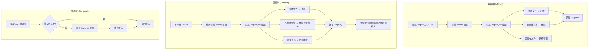

# Phase D - Part 4：资产自动注册与增量同步（Refresh）

## 目录

- [一、概述](#一概述)
  - [1.1 本文档范围](#11-本文档范围)
  - [1.2 设计目标](#12-设计目标)
  - [1.3 前置依赖](#13-前置依赖)
  - [1.4 术语定义](#14-术语定义)
- [二、当前问题](#二当前问题)
- [三、Unity 参考行为](#三unity-参考行为)
- [四、整体架构设计](#四整体架构设计)
- [五、启动时自动注册](#五启动时自动注册)
  - [5.1 方案对比](#51-方案对比)
  - [5.2 推荐方案详细设计](#52-推荐方案详细设计)
  - [5.3 实现代码](#53-实现代码)
- [六、增量同步（Refresh）](#六增量同步refresh)
  - [6.1 方案对比](#61-方案对比)
  - [6.2 推荐方案详细设计](#62-推荐方案详细设计)
  - [6.3 实现代码](#63-实现代码)
- [七、不可识别文件的处理策略](#七不可识别文件的处理策略)
- [八、涉及的文件清单](#八涉及的文件清单)
- [九、分步实施策略](#九分步实施策略)
- [十、验证清单](#十验证清单)
- [十一、已知限制与后续扩展](#十一已知限制与后续扩展)

---

## 一、概述

### 1.1 本文档范围

本文档设计 **资产自动注册** 和 **增量同步（Refresh）** 两个核心功能：

1. **启动时自动注册**：编辑器启动时扫描 Assets 目录，将所有引擎可识别的文件自动注册到 Registry
2. **增量同步（Refresh）**：运行时检测文件系统变化（新增/删除/移动），同步更新 Registry

### 1.2 设计目标

1. ? 编辑器启动时，Assets 目录下所有引擎可识别的文件自动注册到 Registry
2. ? 手动触发 Refresh（Ctrl+R）时，增量同步 Registry 与磁盘文件的差异
3. ? 新增文件 → 自动注册；删除文件 → 移除 Registry 条目 + 清除缓存
4. ? 注册 ≠ 加载：注册只分配 Handle 和记录路径，实际加载仍为懒加载（GetAsset 时触发）
5. ? 性能可控：扫描操作不阻塞主线程过久（大项目场景下）

### 1.3 前置依赖

| 依赖 | 状态 | 说明 |
|------|------|------|
| Phase A 资产系统核心框架 | ? 已完成 | AssetHandle / AssetRegistry / AssetManager / AssetImporter |
| AssetType 扩展名映射 | ? 已完成 | `GetAssetTypeFromExtension()` 支持 .lmat/.fbx/.png/.luck3d 等 |
| AssetRegistry 持久化 | ? 已完成 | Save/Load 到 .lcr 文件 |
| ProjectAssetsPanel | ? 已完成 | 已有 `Refresh()` 方法（目录树刷新） |

### 1.4 术语定义

| 术语 | 含义 |
|------|------|
| **注册（Register）** | 将文件路径记录到 AssetRegistry，分配 AssetHandle。不加载文件内容到内存 |
| **加载（Load）** | 通过 Importer 读取文件内容，创建运行时对象（如 Texture2D、Material），放入缓存 |
| **导入（Import）** | 注册 + 可选的格式转换（当前项目中 Import ≈ Register，无格式转换步骤） |
| **Refresh** | 对比磁盘文件与 Registry 的差异，执行增量同步（新增/删除/移动） |
| **可识别文件** | 扩展名在 `GetAssetTypeFromExtension()` 中有映射的文件 |

---

## 二、当前问题

### 当前 `AssetManager::Init()` 的行为

```cpp
void AssetManager::Init()
{
    // 注册 Importers
    s_Data.Importers[AssetType::Material] = CreateScope<MaterialImporter>();
    s_Data.Importers[AssetType::Mesh] = CreateScope<MeshAssetImporter>();
    s_Data.Importers[AssetType::Texture2D] = CreateScope<TextureImporter>();
    s_Data.Importers[AssetType::Scene] = CreateScope<SceneImporter>();

    // 加载 Registry（从 .lcr 文件恢复已注册的资产列表）
    s_Data.Registry.Load(s_Data.RegistryFilePath);
}
```

| 问题 | 影响 |
|------|------|
| 启动时不扫描 Assets 目录 | 新拷贝到 Assets 目录的文件不会被自动注册，必须通过代码调用 `ImportAsset` |
| 无 Refresh 机制 | 删除文件后 Registry 中残留无效条目；外部新增文件不可见 |
| Registry 与磁盘不同步 | ProjectAssetsPanel 中显示的资产列表可能与实际文件不一致 |
| 资产只能通过代码注册 | 用户手动拷贝文件到 Assets 目录后，必须重启或通过菜单操作才能使用 |

---

## 三、Unity 参考行为

| 时机 | Unity 的行为 | 本项目对应设计 |
|------|-------------|---------------|
| 编辑器启动 | 扫描 Assets 目录，对比 Library 缓存，注册新文件，移除已删除文件 | `AssetManager::Init()` 中增加目录扫描 |
| 编辑器获得焦点 | 自动触发 `AssetDatabase.Refresh()` | 后续扩展（本次不实现） |
| 手动 Ctrl+R | 强制触发 `AssetDatabase.Refresh()` | `AssetManager::Refresh()` |
| 文件新增 | 注册 + 生成 .meta + 导入到 Library | 注册到 Registry（分配 Handle） |
| 文件删除 | 从 AssetDatabase 移除 + 清理 Library | 从 Registry 移除 + 清除缓存 |
| 文件移动（编辑器内） | GUID 不变，更新路径映射 | Handle 不变，更新 FilePath |
| 文件内容变化 | 重新导入（更新 Library 缓存） | 清除缓存（下次 GetAsset 时重新加载） |
| 不可识别文件 | 注册为 DefaultAsset，分配 GUID | 忽略（不注册） |

---

## 四、整体架构设计

### 流程图



### 核心数据流

```
磁盘文件 (Assets/)
    ↓ 扫描
文件路径集合 (std::set<std::string>)
    ↓ 对比
AssetRegistry (Handle ? Path 映射)
    ↓ 按需加载
Cache (Handle → Ref<void>)
```

---

## 五、启动时自动注册

### 5.1 方案对比

#### 方案 A：Init 时全量扫描 + 增量对比（? 推荐）

**流程**：
1. 先加载 `.lcr` 文件恢复已有 Registry
2. 递归扫描 Assets 目录，收集所有可识别文件的相对路径
3. 对比 Registry 与磁盘：新增 → 注册，已删除 → 移除
4. 保存更新后的 Registry

**优点**：
- 启动后 Registry 与磁盘完全同步
- 逻辑简单，一次扫描解决所有问题
- 无需额外的 "首次导入" 流程

**缺点**：
- 大项目（数万文件）时启动可能有短暂延迟（通常 < 100ms）

#### 方案 B：Init 时仅加载 Registry，不扫描

**流程**：
1. 只加载 `.lcr` 文件
2. 依赖用户手动 Refresh 或代码调用 `ImportAsset` 来注册新文件

**优点**：
- 启动最快（无扫描开销）

**缺点**：
- Registry 可能与磁盘不同步
- 用户体验差（新文件不可见，需要手动操作）
- 删除的文件残留在 Registry 中

#### 方案 C：Init 时仅验证已注册资产是否仍存在

**流程**：
1. 加载 `.lcr` 文件
2. 遍历 Registry 中所有条目，检查文件是否仍存在
3. 不存在的标记为 Missing 或移除
4. 不扫描新文件

**优点**：
- 比方案 A 快（只检查已注册的，不扫描全目录）
- 能清理无效条目

**缺点**：
- 新文件不会被自动发现
- 仍需要手动 Refresh 来注册新文件

#### 方案推荐

| 方案 | 推荐度 | 理由 |
|------|--------|------|
| **方案 A：全量扫描 + 增量对比** | ??? 最优 | 启动后 Registry 与磁盘完全同步，用户体验最好，与 Unity 行为一致 |
| 方案 C：仅验证已注册 | ?? | 折中方案，适合超大项目 |
| 方案 B：不扫描 | ? | 体验差，不推荐 |

**推荐方案 A**。当前项目规模（数百文件级别），全量扫描的性能开销可忽略不计。

---

### 5.2 推荐方案详细设计

#### 扫描规则

| 规则 | 说明 |
|------|------|
| 扫描根目录 | `Assets/` 目录（相对于项目根目录） |
| 递归扫描 | 递归遍历所有子目录 |
| 文件过滤 | 只注册 `GetAssetTypeFromExtension()` 返回非 `None` 的文件 |
| 路径格式 | 统一使用正斜杠 `/` 的相对路径（如 `Assets/Textures/Metal.png`） |
| 忽略目录 | 跳过隐藏目录（以 `.` 开头）和特殊目录（如 `.git`） |

#### 对比逻辑

```
设 R = Registry 中所有路径的集合
设 D = 磁盘扫描得到的所有路径的集合

新增文件 = D - R（磁盘有，Registry 无）→ 注册
已删除文件 = R - D（Registry 有，磁盘无）→ 移除
已存在文件 = R ∩ D（两者都有）→ 保持不变
```

---

### 5.3 实现代码

#### AssetManager.h 新增接口

```cpp
class AssetManager
{
public:
    // ... 现有接口 ...

    // ---- 目录扫描与同步 ----

    /// <summary>
    /// 扫描 Assets 目录并同步 Registry（增量对比）
    /// 新增文件自动注册，已删除文件自动移除
    /// </summary>
    /// <returns>同步结果统计</returns>
    static RefreshResult Refresh();

private:
    /// <summary>
    /// 递归扫描目录，收集所有可识别资产文件的相对路径
    /// </summary>
    /// <param name="directory">要扫描的目录（相对路径）</param>
    /// <param name="outPaths">输出：收集到的文件路径集合</param>
    static void ScanDirectory(const std::string& directory, std::set<std::string>& outPaths);
};
```

#### RefreshResult 结构体

```cpp
/// <summary>
/// Refresh 操作的结果统计
/// </summary>
struct RefreshResult
{
    uint32_t Added = 0;     // 新注册的资产数量
    uint32_t Removed = 0;   // 移除的资产数量
    uint32_t Total = 0;     // 当前 Registry 中的总资产数量
};
```

#### AssetManager.cpp 实现

```cpp
#include <set>
#include <filesystem>

namespace Lucky
{
    // 静态数据中新增 Assets 根目录配置
    struct AssetManagerData
    {
        // ... 现有成员 ...
        std::string AssetsDirectory = "Assets";  // Assets 根目录（相对路径）
    };

    void AssetManager::Init()
    {
        // 注册 Importers（现有逻辑不变）
        s_Data.Importers[AssetType::Material] = CreateScope<MaterialImporter>();
        s_Data.Importers[AssetType::Mesh] = CreateScope<MeshAssetImporter>();
        s_Data.Importers[AssetType::Texture2D] = CreateScope<TextureImporter>();
        s_Data.Importers[AssetType::Scene] = CreateScope<SceneImporter>();

        // 加载 Registry
        s_Data.Registry.Load(s_Data.RegistryFilePath);

        // 启动时自动同步 Registry 与磁盘
        RefreshResult result = Refresh();

        LF_CORE_INFO("AssetManager initialized. Registry: {0} assets ({1} added, {2} removed).",
                     result.Total, result.Added, result.Removed);
    }

    RefreshResult AssetManager::Refresh()
    {
        RefreshResult result;

        // 1. 扫描磁盘文件
        std::set<std::string> diskPaths;
        ScanDirectory(s_Data.AssetsDirectory, diskPaths);

        // 2. 收集 Registry 中所有路径
        std::set<std::string> registryPaths;
        const auto& allMetadata = s_Data.Registry.GetAllMetadata();
        for (const auto& [handle, metadata] : allMetadata)
        {
            registryPaths.insert(metadata.FilePath);
        }

        // 3. 计算差异：新增文件 = 磁盘有，Registry 无
        for (const std::string& path : diskPaths)
        {
            if (registryPaths.find(path) == registryPaths.end())
            {
                // 新文件，注册到 Registry
                std::filesystem::path fsPath(path);
                std::string extension = fsPath.extension().string();
                AssetType type = GetAssetTypeFromExtension(extension);

                if (type != AssetType::None)
                {
                    AssetMetadata metadata;
                    metadata.Type = type;
                    metadata.FilePath = path;
                    s_Data.Registry.Register(metadata);
                    result.Added++;
                }
            }
        }

        // 4. 计算差异：已删除文件 = Registry 有，磁盘无
        std::vector<AssetHandle> toRemove;
        for (const auto& [handle, metadata] : allMetadata)
        {
            if (diskPaths.find(metadata.FilePath) == diskPaths.end())
            {
                toRemove.push_back(handle);
            }
        }

        for (AssetHandle handle : toRemove)
        {
            // 清除缓存
            s_Data.Cache.erase(handle);
            // 从 Registry 移除
            s_Data.Registry.Unregister(handle);
            result.Removed++;
        }

        // 5. 如果有变化，保存 Registry
        if (result.Added > 0 || result.Removed > 0)
        {
            SaveRegistry();
        }

        result.Total = static_cast<uint32_t>(s_Data.Registry.GetAssetCount());
        return result;
    }

    void AssetManager::ScanDirectory(const std::string& directory, std::set<std::string>& outPaths)
    {
        std::filesystem::path dirPath(directory);

        if (!std::filesystem::exists(dirPath) || !std::filesystem::is_directory(dirPath))
        {
            LF_CORE_WARN("AssetManager::ScanDirectory - Directory not found: '{0}'", directory);
            return;
        }

        for (const auto& entry : std::filesystem::recursive_directory_iterator(dirPath))
        {
            // 跳过目录
            if (!entry.is_regular_file())
            {
                continue;
            }

            // 跳过隐藏文件/目录（以 . 开头的路径段）
            std::filesystem::path relativePath = std::filesystem::relative(entry.path());
            bool isHidden = false;
            for (const auto& part : relativePath)
            {
                std::string partStr = part.string();
                if (!partStr.empty() && partStr[0] == '.')
                {
                    isHidden = true;
                    break;
                }
            }
            if (isHidden)
            {
                continue;
            }

            // 检查扩展名是否可识别
            std::string extension = entry.path().extension().string();
            AssetType type = GetAssetTypeFromExtension(extension);

            if (type != AssetType::None)
            {
                // 使用正斜杠的相对路径
                std::string normalizedPath = relativePath.generic_string();
                outPaths.insert(normalizedPath);
            }
        }
    }
}
```

---

## 六、增量同步（Refresh）

### 6.1 方案对比

#### 方案 A：手动触发 Refresh（? 推荐，本次实现）

**触发方式**：
- 用户按 Ctrl+R
- ProjectAssetsPanel 中的刷新按钮
- 代码调用 `AssetManager::Refresh()`

**优点**：
- 实现简单，无额外依赖
- 用户有明确的控制权
- 不消耗后台资源

**缺点**：
- 需要用户主动触发
- 外部修改文件后不会自动感知

#### 方案 B：编辑器获得焦点时自动 Refresh

**触发方式**：
- 编辑器窗口从后台切回前台时自动触发

**优点**：
- 与 Unity 行为一致
- 用户从外部工具（如 Photoshop）修改纹理后，切回编辑器自动更新

**缺点**：
- 需要平台层支持窗口焦点事件
- 频繁切换窗口时可能有性能影响
- 实现稍复杂

#### 方案 C：FileWatcher 实时监控

**触发方式**：
- 后台线程持续监控 Assets 目录的文件系统事件

**优点**：
- 实时响应，无需手动触发
- 最佳用户体验

**缺点**：
- 需要引入第三方库（如 efsw）
- 跨平台兼容性问题
- 后台线程与主线程同步复杂
- 实现成本高

#### 方案推荐

| 方案 | 推荐度 | 优先级 | 理由 |
|------|--------|--------|------|
| **方案 A：手动 Refresh** | ??? 最优 | 本次实现 | 实现简单，满足核心需求 |
| 方案 B：焦点自动 Refresh | ?? | 后续扩展 | 体验好，但需要平台层支持 |
| 方案 C：FileWatcher | ? | 远期目标 | 最佳体验，但实现成本高 |

**本次实现方案 A**，后续可叠加方案 B。

---

### 6.2 推荐方案详细设计

#### Refresh 的完整行为

| 检测到的变化 | 处理方式 |
|-------------|----------|
| 新增文件（磁盘有，Registry 无） | 注册到 Registry，分配新 Handle |
| 删除文件（Registry 有，磁盘无） | 从 Registry 移除，清除缓存 |
| 文件内容变化（文件存在但内容改变） | 本次不检测（后续通过时间戳/hash 实现） |
| 文件移动（路径变化） | 本次视为"旧路径删除 + 新路径新增"（后续通过 .meta 文件追踪） |

#### 与 ProjectAssetsPanel 的集成

Refresh 完成后需要通知 ProjectAssetsPanel 刷新 UI：

```cpp
// EditorLayer 或 ProjectAssetsPanel 中调用
void ProjectAssetsPanel::OnRefreshRequested()
{
    // 1. 调用 AssetManager::Refresh()
    RefreshResult result = AssetManager::Refresh();

    // 2. 重建目录树缓存
    RebuildDirectoryTree();

    // 3. 日志输出
    if (result.Added > 0 || result.Removed > 0)
    {
        LF_CORE_INFO("Refresh complete: {0} added, {1} removed, {2} total.",
                     result.Added, result.Removed, result.Total);
    }
}
```

#### 快捷键绑定

在 `EditorLayer` 或 `ProjectAssetsPanel` 的 `OnEvent` 中处理 Ctrl+R：

```cpp
void ProjectAssetsPanel::OnEvent(Event& event)
{
    EventDispatcher dispatcher(event);
    dispatcher.Dispatch<KeyPressedEvent>([this](KeyPressedEvent& e)
    {
        // Ctrl+R 触发 Refresh
        if (e.GetKeyCode() == Key::R && Input::IsKeyPressed(Key::LeftControl))
        {
            OnRefreshRequested();
            return true;
        }
        return false;
    });
}
```

---

### 6.3 实现代码

#### Refresh 的核心逻辑

Refresh 的核心逻辑已在第五章的 `AssetManager::Refresh()` 中实现（启动时和手动触发共用同一个方法）。

#### 额外考虑：缓存失效

当文件被删除时，如果该资产已加载到缓存中，需要清除缓存：

```cpp
// 在 Refresh 的"已删除文件"处理中
for (AssetHandle handle : toRemove)
{
    // 清除缓存（如果已加载）
    auto cacheIt = s_Data.Cache.find(handle);
    if (cacheIt != s_Data.Cache.end())
    {
        LF_CORE_WARN("AssetManager::Refresh - Removing cached asset [{0}] (file deleted)",
                     static_cast<uint64_t>(handle));
        s_Data.Cache.erase(cacheIt);
    }

    // 从 Registry 移除
    s_Data.Registry.Unregister(handle);
    result.Removed++;
}
```

#### 额外考虑：Internal 目录的特殊处理

`Assets/Internal/` 目录下的资产（如默认材质）由引擎代码通过 `EnsureAsset` 创建。如果用户误删了这些文件，Refresh 会将其从 Registry 移除，但下次启动时 `EnsureAsset` 会重新创建。无需特殊处理。

---

## 七、不可识别文件的处理策略

### 方案对比

| 方案 | 行为 | 优缺点 |
|------|------|--------|
| **方案 A：忽略不可识别文件**（? 推荐） | `GetAssetTypeFromExtension()` 返回 `None` 的文件不注册 | 简单、干净，与 Unreal 一致 |
| 方案 B：注册为 Unknown 类型 | 新增 `AssetType::Unknown`，所有文件都注册 | 与 Unity 一致，但增加复杂度 |

**推荐方案 A**。理由：
1. 当前项目规模不需要管理非资产文件
2. 减少 Registry 中的噪音条目
3. 后续如果需要，可以轻松扩展为方案 B

### 当前可识别的文件类型

基于 `GetAssetTypeFromExtension()` 的实现：

| 资产类型 | 扩展名 |
|---------|--------|
| Material | `.lmat` |
| Mesh | `.obj` `.fbx` `.gltf` `.glb` `.dae` `.3ds` `.blend` |
| Texture2D | `.png` `.jpg` `.jpeg` `.tga` `.bmp` `.hdr` |
| Scene | `.luck3d` |
| Shader | `.vert` `.frag`（预留，当前未实现 ShaderImporter） |

---

## 八、涉及的文件清单

| 文件路径 | 修改类型 | 修改内容 |
|---------|----------|----------|
| `Lucky/Source/Lucky/Asset/AssetManager.h` | 修改 | 新增 `Refresh()` 公有接口、`ScanDirectory()` 私有方法、`RefreshResult` 结构体 |
| `Lucky/Source/Lucky/Asset/AssetManager.cpp` | 修改 | 实现 `Refresh()` 和 `ScanDirectory()`；修改 `Init()` 在加载 Registry 后调用 `Refresh()` |
| `Lucky/Source/Lucky/Asset/AssetManager.cpp` | 修改 | `AssetManagerData` 新增 `AssetsDirectory` 成员 |
| `Luck3DApp/Source/Panels/ProjectAssetsPanel.h` | 修改 | 新增 `OnRefreshRequested()` 方法声明 |
| `Luck3DApp/Source/Panels/ProjectAssetsPanel.cpp` | 修改 | 实现 `OnRefreshRequested()`；`OnEvent` 中添加 Ctrl+R 快捷键处理 |

---

## 九、分步实施策略

| 步骤 | 内容 | 依赖 | 预估工作量 | 验证方式 |
|------|------|------|-----------|----------|
| Step 1 | 定义 `RefreshResult` 结构体 | 无 | 极小 | 编译通过 |
| Step 2 | 实现 `ScanDirectory()` | 无 | 小 | 单元测试：扫描 Assets 目录，输出文件列表 |
| Step 3 | 实现 `Refresh()` | Step 1, 2 | 中 | 手动添加/删除文件后调用 Refresh，验证 Registry 变化 |
| Step 4 | 修改 `Init()` 调用 `Refresh()` | Step 3 | 极小 | 启动后检查 .lcr 文件内容 |
| Step 5 | ProjectAssetsPanel 集成 Ctrl+R | Step 3 | 小 | 按 Ctrl+R 后 UI 刷新 |
| Step 6 | 编译测试 + 完整验证 | 全部 | 小 | 验证清单全部通过 |

---

## 十、验证清单

| # | 验证项 | 预期结果 |
|---|--------|--------|
| 1 | 编译通过 | 无编译错误和警告 |
| 2 | 首次启动（无 .lcr 文件） | 扫描 Assets 目录，所有可识别文件注册到 Registry，生成 .lcr 文件 |
| 3 | 正常启动（有 .lcr 文件） | 加载 .lcr + 扫描目录，增量同步（无变化时 Added=0, Removed=0） |
| 4 | 外部新增文件后启动 | 新文件自动注册，.lcr 更新 |
| 5 | 外部删除文件后启动 | 已删除文件从 Registry 移除，.lcr 更新 |
| 6 | 运行时 Ctrl+R | 触发 Refresh，新增/删除文件被正确处理 |
| 7 | 不可识别文件 | `.txt`、`.pdf` 等文件不被注册 |
| 8 | 隐藏目录 | `.git/` 等隐藏目录下的文件不被扫描 |
| 9 | 路径格式 | Registry 中所有路径使用正斜杠 `/`（如 `Assets/Textures/Metal.png`） |
| 10 | 性能 | 数百文件的项目，Refresh 耗时 < 50ms |
| 11 | 已加载资产被删除 | 缓存被清除，后续 GetAsset 返回 nullptr |
| 12 | Internal 资产被误删 | Refresh 移除条目，下次启动 EnsureAsset 重新创建 |
| 13 | ProjectAssetsPanel 同步 | Refresh 后目录树和文件列表正确更新 |

---

## 十一、已知限制与后续扩展

| 限制 | 影响 | 后续优化方向 |
|------|------|-------------|
| 文件移动视为"删除+新增" | 移动文件后 Handle 会变化，引用该资产的其他资产会断裂 | 后续通过 .meta 文件存储 Handle，实现路径无关的追踪 |
| 不检测文件内容变化 | 外部修改纹理/材质文件后，缓存中仍是旧内容 | 后续通过文件时间戳或 hash 检测变化，清除缓存 |
| 无自动 Refresh（焦点切换） | 从外部工具切回编辑器后需要手动 Ctrl+R | 后续添加窗口焦点事件监听，自动触发 Refresh |
| 无 FileWatcher | 编辑器运行期间外部文件变化不会实时感知 | 后续集成 efsw 等文件监控库 |
| Shader 类型预留但无 Importer | `.vert`/`.frag` 文件会被注册但无法通过 GetAsset 加载 | 后续实现 ShaderImporter |
| 大项目性能 | 数万文件时全量扫描可能有延迟 | 后续可改为增量扫描（记录上次扫描时间戳，只检查新修改的文件） |
| 无 Undo/Redo | Refresh 移除的资产无法恢复 | 后续可在移除前备份到回收站 |
