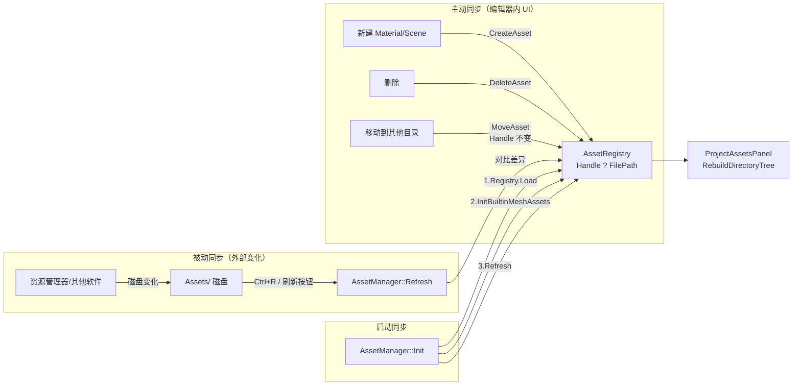

# Phase D - Part 4：资产自动注册与增量同步（Refresh）

## 目录

- [一、概述](#一概述)
  - [1.1 本文档范围](#11-本文档范围)
  - [1.2 设计目标](#12-设计目标)
  - [1.3 前置依赖](#13-前置依赖)
  - [1.4 术语定义](#14-术语定义)
- [二、当前问题](#二当前问题)
- [三、Unity 参考行为](#三unity-参考行为)
- [四、整体架构设计](#四整体架构设计)
- [五、启动时自动注册](#五启动时自动注册)
  - [5.1 方案对比](#51-方案对比)
  - [5.2 推荐方案详细设计](#52-推荐方案详细设计)
  - [5.3 实现代码](#53-实现代码)
- [六、增量同步（Refresh）](#六增量同步refresh)
  - [6.1 方案对比](#61-方案对比)
  - [6.2 推荐方案详细设计](#62-推荐方案详细设计)
  - [6.3 实现代码](#63-实现代码)
  - [6.4 编辑器内 CRUD 的即时同步](#64-编辑器内-crud-的即时同步)
  - [6.5 触发时机分期规划](#65-触发时机分期规划)
- [七、不可识别文件的处理策略](#七不可识别文件的处理策略)
- [八、涉及的文件清单](#八涉及的文件清单)
- [九、分步实施策略](#九分步实施策略)
- [十、验证清单](#十验证清单)
- [十一、已知限制与后续扩展](#十一已知限制与后续扩展)

---

## 一、概述

### 1.1 本文档范围

本文档设计 **资产自动注册** 与 **Registry 与磁盘同步** 三个核心能力，覆盖 Unity 一致的完整行为链：

1. **启动时自动注册（被动同步）**：编辑器启动时扫描 Assets 目录，将所有引擎可识别的文件自动注册到 Registry
2. **手动/焦点触发的增量同步 Refresh（被动同步）**：运行时对比 Registry 与磁盘差异，处理外部（资源管理器/其他软件）产生的文件系统变化
3. **编辑器内 CRUD 的即时同步（主动同步）**：在 Project 面板内新建/删除/重命名/移动资产时，通过显式 API 立即更新 Registry，Handle 保持稳定，避免依赖 Refresh

> **主动 vs 被动**：本项目将同步机制显式区分为「主动同步」（编辑器内操作即时调用 `AssetManager` API）与「被动同步」（外部变化后通过 Refresh 补齐）。Unity 的 `AssetDatabase.CreateAsset / DeleteAsset / MoveAsset` 属于主动，`AssetDatabase.Refresh` 属于被动。

### 1.2 设计目标

1. 编辑器启动时，Assets 目录下所有引擎可识别的文件自动注册到 Registry
2. 手动触发 Refresh（Ctrl+R）或点击刷新按钮时，增量同步 Registry 与磁盘文件的差异
3. 新增文件 → 自动注册；删除文件 → 移除 Registry 条目 + 清除缓存
4. 编辑器内主动 CRUD（`DeleteAsset` / `MoveAsset`）立即同步 Registry，且 `MoveAsset` 保持 Handle 不变
5. 注册 ≠ 加载：注册只分配 Handle 和记录路径，实际加载仍为懒加载（GetAsset 时触发）
6. 性能可控：扫描操作不阻塞主线程过久（大项目场景下）
7. 内建资产（`Assets/Meshes/Builtin/*.lmesh` 等）在 Refresh 与外部误删场景下保持稳定

### 1.3 前置依赖

| 依赖 | 状态 | 说明 |
|------|------|------|
| Phase A 资产系统核心框架 | 已完成 | `AssetHandle` / `AssetRegistry` / `AssetManager` / `AssetImporter` |
| AssetType 扩展名映射 | 已完成 | `GetAssetTypeFromExtension()` 目前识别 `.lmat` / `.lmesh` / 常见图片 / `.luck3d` / `.vert` / `.frag`（外部模型 `.obj/.fbx/...` **暂未纳入**资产系统，见 §七） |
| AssetRegistry 持久化 | 已完成 | `Save`/`Load` 到 `AssetRegistry.lcr` |
| ProjectAssetsPanel | 已完成 | 已有 `Refresh()` / `RebuildDirectoryTree()`，但**尚未挂接**任何触发路径（`OnEvent` 为空实现） |
| `AssetManager::InitBuiltinMeshAssets` | 已完成 | 启动时生成 `Assets/Meshes/Builtin/*.lmesh` 并 `ImportAsset` 注册 |
| `Input` 静态类 | 已完成 | `Input::IsKeyPressed(KeyCode)` 可直接用于组合键判断 |

### 1.4 术语定义

| 术语 | 含义 |
|------|------|
| **注册（Register）** | 将文件路径记录到 `AssetRegistry`，分配 `AssetHandle`。不加载文件内容到内存 |
| **加载（Load）** | 通过 `Importer` 读取文件内容，创建运行时对象（如 `Texture2D`、`Material`），放入缓存 |
| **导入（Import）** | 注册 + 可选的格式转换（当前项目中 Import ≈ Register，无格式转换步骤） |
| **主动同步** | 编辑器内 UI 操作触发的显式 API 调用（`CreateAsset` / `DeleteAsset` / `MoveAsset`），立即修改 Registry |
| **被动同步（Refresh）** | 对比磁盘文件与 Registry 的差异，批量处理外部产生的变化 |
| **可识别文件** | 扩展名在 `GetAssetTypeFromExtension()` 中有映射的文件 |
| **Builtin/Internal 资产** | 引擎启动时通过 `EnsureAsset` / `InitBuiltinMeshAssets` 创建的默认资产（如 `Assets/Meshes/Builtin/Cube.lmesh`） |

---

## 二、当前问题

### 当前 `AssetManager::Init()` 的行为

```cpp
void AssetManager::Init()
{
    // 注册 Importers
    s_Data.Importers[AssetType::Material] = CreateScope<MaterialImporter>();
    s_Data.Importers[AssetType::Mesh]     = CreateScope<MeshImporter>();
    s_Data.Importers[AssetType::Texture2D]= CreateScope<TextureImporter>();
    s_Data.Importers[AssetType::Scene]    = CreateScope<SceneImporter>();

    // 加载 Registry（从 .lcr 文件恢复已注册的资产列表）
    s_Data.Registry.Load(s_Data.RegistryFilePath);

    // 生成并注册内建 Mesh（Cube/Sphere/Plane/Cylinder/Capsule）
    InitBuiltinMeshAssets();
}
```

### 当前 `ProjectAssetsPanel` 的行为

- 目录树与内容区通过 `std::filesystem::directory_iterator` **直接读磁盘**呈现；
- `Refresh()` / `RebuildDirectoryTree()` 存在但**没有任何入口调用**；
- `OnEvent(Event&)` 为空实现，未挂接任何快捷键；
- 面板内**没有**新建/删除/重命名/移动等主动 CRUD 操作，也没有右键上下文菜单。

### 问题矩阵

| 问题 | 影响 |
|------|------|
| 启动时不扫描 Assets 目录 | 新拷贝到 Assets 目录的文件不会被自动注册，必须通过代码调用 `ImportAsset` |
| 无 Refresh 机制 | 外部删除后 Registry 残留无效条目；外部新增文件不可见 |
| Registry 与磁盘 UI 展现不一致 | Project 面板显示的是磁盘直读结果，可能出现“磁盘上存在但 Registry 未注册”的项 ?? 拖拽/选中失效 |
| 无主动 CRUD API | 代码层只能 `CreateAsset`，无法删/移资产并同步 Registry；面板右键菜单无以衣靠 |
| 资产只能通过代码注册 | 用户手动拷贝文件到 Assets 目录后，必须重启或通过菜单操作才能使用 |

---

## 三、Unity 参考行为

| 时机 | Unity 的行为 | 本项目对应设计 |
|------|-------------|---------------|
| 编辑器启动 | 扫描 Assets 目录，对比 Library 缓存，注册新文件，移除已删除文件 | `AssetManager::Init()` 中在 `Registry.Load` 与 `InitBuiltinMeshAssets` 后调用 `Refresh()` |
| 应用窗口重新获得 OS 焦点 | 自动触发 `AssetDatabase.Refresh()` | Phase 3（需平台层新增 `WindowFocusEvent`），本次不实现 |
| 手动 Ctrl+R | 强制触发 `AssetDatabase.Refresh()` | `AssetManager::Refresh()`，本次实现 |
| Project 面板内新建 | `AssetDatabase.CreateAsset()` 立即同步 | 已有 `AssetManager::CreateAsset`，本次新增工厂入口（Create→Material/Scene/...） |
| Project 面板内删除 | `AssetDatabase.DeleteAsset()` 立即同步 | 本次新增 `AssetManager::DeleteAsset(handle)` |
| Project 面板内重命名/移动 | `AssetDatabase.MoveAsset()`，GUID 不变 | 本次新增 `AssetManager::MoveAsset(handle, newPath)`，Handle 不变（仅作为底层 API，本次**不**提供 UI 入口） |
| 外部新增文件 | Refresh 时注册 + 生成 .meta | Refresh 时注册（分配 Handle） |
| 外部删除文件 | Refresh 时从 AssetDatabase 移除 + 清理 Library | Refresh 时从 Registry 移除 + 清除缓存 |
| 外部移动/重命名 | Refresh 时基于 .meta 中的 GUID 识别为同一资产 | 本次视为“旧路径删除 + 新路径新增”（未来由 .meta 升级） |
| 文件内容变化 | 重新导入（更新 Library 缓存） | 本次不检测（后续通过时间戳/hash 实现） |
| 不可识别文件 | 注册为 `DefaultAsset` | 忽略（不注册） |

---

## 四、整体架构设计

### 四个数据改变来源



### 启动与 Refresh 的完整流程

```mermaid
flowchart TD
    subgraph "编辑器启动 (Init)"
        A1[注册 Importers] --> A2[加载 Registry .lcr]
        A2 --> A3[InitBuiltinMeshAssets<br/>生成+注册内建 Mesh]
        A3 --> A4[Refresh: 扫描 Assets 目录]
        A4 --> A5[新增文件 → 注册]
        A4 --> A6[已删除文件 → 移除+清缓存]
        A5 --> A7[保存 Registry]
        A6 --> A7
    end
    
    subgraph "运行时被动同步 (Refresh)"
        B1[Ctrl+R / 刷新按钮<br/>（Phase 3 后：窗口获焦）] --> B2[AssetManager::Refresh]
        B2 --> B3[重新扫描 Assets]
        B3 --> B4[新增→注册]
        B3 --> B5[删除→移除+清缓存]
        B4 --> B6[保存 Registry]
        B5 --> B6
        B6 --> B7[通知 ProjectAssetsPanel<br/>RebuildDirectoryTree]
    end
    
    subgraph "运行时主动同步 (编辑器内 CRUD)"
        C1[面板右键菜单<br/>新建/删除/移动] --> C2{操作类型}
        C2 -->|New| C3[CreateAsset→写磁盘+注册]
        C2 -->|Delete| C4[DeleteAsset→删磁盘+Unregister]
        C2 -->|Move| C5[MoveAsset→重命名+UpdatePath<br/>Handle 不变]
        C3 --> C6[保存 Registry]
        C4 --> C6
        C5 --> C6
        C6 --> C7[通知 ProjectAssetsPanel<br/>RebuildDirectoryTree]
    end
    
    subgraph "懒加载 (GetAsset)"
        D1[GetAsset] --> D2{缓存中?}
        D2 -->|是| D3[返回缓存]
        D2 -->|否| D4[Importer.Load→放入缓存]
        D4 --> D3
    end
```



### 核心数据流

```
磁盘文件 (Assets/)                            编辑器 UI 操作
    ↓ 扫描 (Refresh)                             ↓ 主动调用
文件路径集合 (std::set<std::string>)          CreateAsset / DeleteAsset / MoveAsset
    ↓ 对比                                       ↓
            AssetRegistry (Handle ? Path 双向映射)
                            ↓ 按需加载
                    Cache (Handle → Ref<void>)
```

---

## 五、启动时自动注册

### 5.1 方案对比

#### 方案 A：Init 时全量扫描 + 增量对比（? 推荐）

**流程**：
1. 先加载 `.lcr` 文件恢复已有 Registry
2. 递归扫描 Assets 目录，收集所有可识别文件的相对路径
3. 对比 Registry 与磁盘：新增 → 注册，已删除 → 移除
4. 保存更新后的 Registry

**优点**：
- 启动后 Registry 与磁盘完全同步
- 逻辑简单，一次扫描解决所有问题
- 无需额外的 "首次导入" 流程

**缺点**：
- 大项目（数万文件）时启动可能有短暂延迟（通常 < 100ms）

#### 方案 B：Init 时仅加载 Registry，不扫描

**流程**：
1. 只加载 `.lcr` 文件
2. 依赖用户手动 Refresh 或代码调用 `ImportAsset` 来注册新文件

**优点**：
- 启动最快（无扫描开销）

**缺点**：
- Registry 可能与磁盘不同步
- 用户体验差（新文件不可见，需要手动操作）
- 删除的文件残留在 Registry 中

#### 方案 C：Init 时仅验证已注册资产是否仍存在

**流程**：
1. 加载 `.lcr` 文件
2. 遍历 Registry 中所有条目，检查文件是否仍存在
3. 不存在的标记为 Missing 或移除
4. 不扫描新文件

**优点**：
- 比方案 A 快（只检查已注册的，不扫描全目录）
- 能清理无效条目

**缺点**：
- 新文件不会被自动发现
- 仍需要手动 Refresh 来注册新文件

#### 方案推荐

| 方案 | 推荐度 | 理由 |
|------|--------|------|
| **方案 A：全量扫描 + 增量对比** | ??? 最优 | 启动后 Registry 与磁盘完全同步，用户体验最好，与 Unity 行为一致 |
| 方案 C：仅验证已注册 | ?? | 折中方案，适合超大项目 |
| 方案 B：不扫描 | ? | 体验差，不推荐 |

**推荐方案 A**。当前项目规模（数百文件级别），全量扫描的性能开销可忽略不计。

---

### 5.2 推荐方案详细设计

#### 扫描规则

| 规则 | 说明 |
|------|------|
| 扫描根目录 | `Assets/` 目录（相对于**进程当前工作目录**，即项目根目录） |
| 递归扫描 | 递归遍历所有子目录 |
| 文件过滤 | 只注册 `GetAssetTypeFromExtension()` 返回非 `None` 的文件 |
| 路径格式 | 统一使用正斜杠 `/` 的相对路径（如 `Assets/Textures/Metal.png`） |
| 忽略目录 | 跳过隐藏目录（以 `.` 开头）和特殊目录（如 `.git`） |

> **路径相对性约束**：本项目 Registry 中的路径统一为相对于**进程当前工作目录**（cwd）的相对路径，且要求 cwd 必须等于项目根目录（现有 `CreateAsset` / `ImportAsset` 已依此约定）。`ScanDirectory` 内部使用无第二参数的 `std::filesystem::relative(entry.path())`，等价于 `relative(entry.path(), cwd)`。**Refresh 与 CreateAsset 必须共享相同的路径规范化规则**，否则会出现同一文件被视为两条不同记录（Registry 有 `Assets/x.lmat`、Refresh 扫出 `./Assets/x.lmat`）导致误删/重复注册。

#### 对比逻辑

```
设 R = Registry 中所有路径的集合
设 D = 磁盘扫描得到的所有路径的集合

新增文件 = D - R（磁盘有，Registry 无）→ 注册
已删除文件 = R - D（Registry 有，磁盘无）→ 移除
已存在文件 = R ∩ D（两者都有）→ 保持不变
```

---

### 5.3 实现代码

#### AssetManager.h 新增接口

```cpp
class AssetManager
{
public:
    // ... 现有接口 ...

    // ---- 目录扫描与同步 ----

    /// <summary>
    /// 扫描 Assets 目录并同步 Registry（增量对比）
    /// 新增文件自动注册，已删除文件自动移除
    /// </summary>
    /// <returns>同步结果统计</returns>
    static RefreshResult Refresh();

private:
    /// <summary>
    /// 递归扫描目录，收集所有可识别资产文件的相对路径
    /// </summary>
    /// <param name="directory">要扫描的目录（相对路径）</param>
    /// <param name="outPaths">输出：收集到的文件路径集合</param>
    static void ScanDirectory(const std::string& directory, std::set<std::string>& outPaths);
};
```

#### RefreshResult 结构体

```cpp
/// <summary>
/// Refresh 操作的结果统计
/// </summary>
struct RefreshResult
{
    uint32_t Added = 0;     // 新注册的资产数量
    uint32_t Removed = 0;   // 移除的资产数量
    uint32_t Total = 0;     // 当前 Registry 中的总资产数量
};
```

#### AssetManager.cpp 实现

```cpp
#include <set>
#include <filesystem>

namespace Lucky
{
    // 静态数据中新增 Assets 根目录配置
    struct AssetManagerData
    {
        // ... 现有成员 ...
        std::string AssetsDirectory = "Assets";  // Assets 根目录（相对路径）
    };

    void AssetManager::Init()
    {
        // 1. 注册 Importers（现有逻辑不变）
        s_Data.Importers[AssetType::Material]  = CreateScope<MaterialImporter>();
        s_Data.Importers[AssetType::Mesh]      = CreateScope<MeshImporter>();
        s_Data.Importers[AssetType::Texture2D] = CreateScope<TextureImporter>();
        s_Data.Importers[AssetType::Scene]     = CreateScope<SceneImporter>();

        // 2. 加载 Registry
        s_Data.Registry.Load(s_Data.RegistryFilePath);

        // 3. 生成并注册内建 Mesh（务必先于 Refresh：
        //    ① 若 Builtin/*.lmesh 被外部误删，此步会重生成，避免下一步 Refresh 因“文件缺失”而 Unregister；
        //    ② 首次运行时 InitBuiltinMeshAssets 已通过 ImportAsset 注册，Refresh 遇到同路径会命中已注册分支，不重复分配 Handle。）
        InitBuiltinMeshAssets();

        // 4. 启动时自动同步 Registry 与磁盘（外部新增/删除的资产在此处被反映）
        RefreshResult result = Refresh();

        LF_CORE_INFO("AssetManager initialized. Registry: {0} assets ({1} added, {2} removed).",
                     result.Total, result.Added, result.Removed);
    }

    RefreshResult AssetManager::Refresh()
    {
        RefreshResult result;

        // 1. 扫描磁盘文件
        std::set<std::string> diskPaths;
        ScanDirectory(s_Data.AssetsDirectory, diskPaths);

        // 2. 收集 Registry 中所有路径
        std::set<std::string> registryPaths;
        const auto& allMetadata = s_Data.Registry.GetAllMetadata();
        for (const auto& [handle, metadata] : allMetadata)
        {
            registryPaths.insert(metadata.FilePath);
        }

        // 3. 计算差异：新增文件 = 磁盘有，Registry 无
        //    注意：这里直接调用 Registry.Register 而非 ImportAsset，
        //    避免 ImportAsset 内部再次做“已存在返回 handle”的 O(N) 查找。
        for (const std::string& path : diskPaths)
        {
            if (registryPaths.find(path) == registryPaths.end())
            {
                // 新文件，注册到 Registry
                std::filesystem::path fsPath(path);
                std::string extension = fsPath.extension().string();
                AssetType type = GetAssetTypeFromExtension(extension);

                if (type != AssetType::None)
                {
                    AssetMetadata metadata;
                    metadata.Type = type;
                    metadata.FilePath = path;
                    s_Data.Registry.Register(metadata);
                    result.Added++;
                }
            }
        }

        // 4. 计算差异：已删除文件 = Registry 有，磁盘无
        std::vector<AssetHandle> toRemove;
        for (const auto& [handle, metadata] : allMetadata)
        {
            if (diskPaths.find(metadata.FilePath) == diskPaths.end())
            {
                toRemove.push_back(handle);
            }
        }

        for (AssetHandle handle : toRemove)
        {
            // 清除缓存
            s_Data.Cache.erase(handle);
            // 从 Registry 移除
            s_Data.Registry.Unregister(handle);
            result.Removed++;
        }

        // 5. 如果有变化，保存 Registry
        if (result.Added > 0 || result.Removed > 0)
        {
            SaveRegistry();
        }

        result.Total = static_cast<uint32_t>(s_Data.Registry.GetAssetCount());
        return result;
    }

    void AssetManager::ScanDirectory(const std::string& directory, std::set<std::string>& outPaths)
    {
        std::filesystem::path dirPath(directory);

        if (!std::filesystem::exists(dirPath) || !std::filesystem::is_directory(dirPath))
        {
            LF_CORE_WARN("AssetManager::ScanDirectory - Directory not found: '{0}'", directory);
            return;
        }

        for (const auto& entry : std::filesystem::recursive_directory_iterator(dirPath))
        {
            // 跳过目录
            if (!entry.is_regular_file())
            {
                continue;
            }

            // 跳过隐藏文件/目录（以 . 开头的路径段）
            std::filesystem::path relativePath = std::filesystem::relative(entry.path());
            bool isHidden = false;
            for (const auto& part : relativePath)
            {
                std::string partStr = part.string();
                if (!partStr.empty() && partStr[0] == '.')
                {
                    isHidden = true;
                    break;
                }
            }
            if (isHidden)
            {
                continue;
            }

            // 检查扩展名是否可识别
            std::string extension = entry.path().extension().string();
            AssetType type = GetAssetTypeFromExtension(extension);

            if (type != AssetType::None)
            {
                // 使用正斜杠的相对路径
                std::string normalizedPath = relativePath.generic_string();
                outPaths.insert(normalizedPath);
            }
        }
    }
}
```

---

## 六、增量同步（Refresh）

### 6.1 方案对比

#### 方案 A：手动触发 Refresh（? 推荐，本次实现）

**触发方式**：
- 用户按 Ctrl+R
- ProjectAssetsPanel 中的刷新按钮
- 代码调用 `AssetManager::Refresh()`

**优点**：
- 实现简单，无额外依赖
- 用户有明确的控制权
- 不消耗后台资源

**缺点**：
- 需要用户主动触发
- 外部修改文件后不会自动感知

#### 方案 B：编辑器获得焦点时自动 Refresh

**触发方式**：
- 编辑器窗口从后台切回前台时自动触发

**优点**：
- 与 Unity 行为一致
- 用户从外部工具（如 Photoshop）修改纹理后，切回编辑器自动更新

**缺点**：
- 需要平台层支持窗口焦点事件
- 频繁切换窗口时可能有性能影响
- 实现稍复杂

#### 方案 C：FileWatcher 实时监控

**触发方式**：
- 后台线程持续监控 Assets 目录的文件系统事件

**优点**：
- 实时响应，无需手动触发
- 最佳用户体验

**缺点**：
- 需要引入第三方库（如 efsw）
- 跨平台兼容性问题
- 后台线程与主线程同步复杂
- 实现成本高

#### 方案推荐

| 方案 | 推荐度 | 优先级 | 理由 |
|------|--------|--------|------|
| **方案 A：手动 Refresh** | ??? 最优 | 本次实现 | 实现简单，满足核心需求 |
| 方案 B：焦点自动 Refresh | ?? | 后续扩展 | 体验好，但需要平台层支持 |
| 方案 C：FileWatcher | ? | 远期目标 | 最佳体验，但实现成本高 |

**本次实现方案 A**，后续可叠加方案 B。

---

### 6.2 推荐方案详细设计

#### Refresh 的完整行为

| 检测到的变化 | 处理方式 |
|-------------|----------|
| 新增文件（磁盘有，Registry 无） | 注册到 Registry，分配新 Handle |
| 删除文件（Registry 有，磁盘无） | 从 Registry 移除，清除缓存 |
| 文件内容变化（文件存在但内容改变） | 本次不检测（后续通过时间戳/hash 实现） |
| 文件移动（路径变化） | 本次视为"旧路径删除 + 新路径新增"（后续通过 .meta 文件追踪） |

#### 与 ProjectAssetsPanel 的集成

Refresh 完成后需要通知 ProjectAssetsPanel 刷新 UI：

```cpp
// EditorLayer 或 ProjectAssetsPanel 中调用
void ProjectAssetsPanel::OnRefreshRequested()
{
    // 1. 调用 AssetManager::Refresh()
    RefreshResult result = AssetManager::Refresh();

    // 2. 重建目录树缓存
    RebuildDirectoryTree();

    // 3. 日志输出
    if (result.Added > 0 || result.Removed > 0)
    {
        LF_CORE_INFO("Refresh complete: {0} added, {1} removed, {2} total.", result.Added, result.Removed, result.Total);
    }
}
```

#### 快捷键绑定

在 `EditorLayer` 或 `ProjectAssetsPanel` 的 `OnEvent` 中处理 Ctrl+R：

```cpp
void ProjectAssetsPanel::OnEvent(Event& event)
{
    EventDispatcher dispatcher(event);
    dispatcher.Dispatch<KeyPressedEvent>([this](KeyPressedEvent& e)
    {
        // Ctrl+R 触发 Refresh
        if (e.GetKeyCode() == Key::R && Input::IsKeyPressed(Key::LeftControl))
        {
            OnRefreshRequested();
            return true;
        }

        return false;
    });
}
```

---

### 6.3 实现代码

#### Refresh 的核心逻辑

Refresh 的核心逻辑已在第五章的 `AssetManager::Refresh()` 中实现（启动时和手动触发共用同一个方法）。

#### 额外考虑：缓存失效

当文件被删除时，如果该资产已加载到缓存中，需要清除缓存：

```cpp
// 在 Refresh 的"已删除文件"处理中
for (AssetHandle handle : toRemove)
{
    // 清除缓存（如果已加载）
    auto cacheIt = s_Data.Cache.find(handle);
    if (cacheIt != s_Data.Cache.end())
    {
        LF_CORE_WARN("AssetManager::Refresh - Removing cached asset [{0}] (file deleted)", static_cast<uint64_t>(handle));
        s_Data.Cache.erase(cacheIt);
    }

    // 从 Registry 移除
    s_Data.Registry.Unregister(handle);
    result.Removed++;
}
```

#### 额外考虑：Internal 目录的特殊处理

`Assets/Internal/` 目录下的资产（如默认材质）由引擎代码通过 `EnsureAsset` 创建。如果用户误删了这些文件，Refresh 会将其从 Registry 移除，但下次启动时 `EnsureAsset` 会重新创建。无需特殊处理。

对于 `Assets/Meshes/Builtin/*.lmesh`（由 `InitBuiltinMeshAssets` 生成），由于 `Init()` 中 `InitBuiltinMeshAssets` 先于 `Refresh` 执行（见 §5.3 步骤 3），启动时该目录一定存在，Refresh 不会触发误删；运行时若用户在文件资源管理器手动删除后按 Ctrl+R，Refresh 会 `Unregister` 掉这些 Handle 并清缓存，此时正在使用 Builtin Mesh 的 Scene 引用会失效（Handle 变成悬垂）。**当前版本采取"文档告知"策略**：内建资产由引擎维护，用户不应外部删除；后续可考虑在 `Refresh` 中对 `Assets/Meshes/Builtin/*` 做白名单跳过，或在 `Unregister` 前先尝试 `InitBuiltinMeshAssets` 再生成。

---

### 6.4 编辑器内 CRUD 的即时同步（主动同步）

Refresh 处理的是**外部**产生的变化，而 Project 面板内部的**主动**操作应该**立即**同步 Registry，不依赖 Refresh。这与 Unity `AssetDatabase.CreateAsset / DeleteAsset / MoveAsset` 的行为一致。

#### 6.4.1 三种主动操作的 API 与语义

| 操作 | API | Registry 行为 | Handle 行为 | 磁盘行为 |
|------|-----|--------------|------------|---------|
| 新建 | `AssetManager::CreateAsset(asset, path)` | 注册 | 分配新 Handle | 写入文件 |
| 删除 | `AssetManager::DeleteAsset(handle)` | `Unregister` + 清缓存 | 作废 | `filesystem::remove` |
| 移动（底层 API，本次无 UI 入口） | `AssetManager::MoveAsset(handle, newPath)` | `UpdatePath` | **不变** | `filesystem::rename` |

> **关键点：`MoveAsset` 必须保持 Handle 不变**。这是"路径无关的资产引用"能力的核心 ?? 场景/材质等资产引用其他资产时存储的是 Handle 而非 Path，因此在面板内移动文件不会导致引用断裂。这也是 Unity GUID 机制的核心价值之一。
>
> **本次范围说明**：`MoveAsset` / `AssetRegistry::UpdatePath` 作为底层 API 保留，未来面板支持拖拽资产到其他目录时会直接复用；但**重命名相关的 UI 入口（右键 Rename / F2 / 内联 InputText）本次不实现**。

#### 6.4.2 `AssetRegistry` 需要新增的能力

当前 `AssetRegistry` 只有 `Register` / `RegisterWithHandle` / `Unregister`，**无法在保持 Handle 不变的前提下更新 FilePath**（`Unregister + Register` 会分配新 Handle，且反向索引 `m_PathToHandle` 需要同步更新）。因此需要新增：

```cpp
class AssetRegistry
{
public:
    // ... 现有接口 ...

    /// <summary>
    /// 更新指定 Handle 对应资产的文件路径（Handle 保持不变）
    /// 用于编辑器内重命名/移动资产，保持跨资产引用不断裂
    /// </summary>
    /// <param name="handle">要更新的 Handle</param>
    /// <param name="newFilePath">新的相对路径（正斜杠格式）</param>
    /// <returns>更新是否成功（Handle 不存在或 newFilePath 已被其他 Handle 占用时失败）</returns>
    bool UpdatePath(AssetHandle handle, const std::string& newFilePath);
};
```

实现要点（伪代码）：

```cpp
bool AssetRegistry::UpdatePath(AssetHandle handle, const std::string& newFilePath)
{
    auto it = m_Registry.find(handle);
    if (it == m_Registry.end())
    {
        return false;
    }

    // 新路径必须唯一（若已被其他 Handle 占用则拒绝）
    auto pathIt = m_PathToHandle.find(newFilePath);
    if (pathIt != m_PathToHandle.end() && pathIt->second != handle)
    {
        return false;
    }

    // 同步反向索引
    m_PathToHandle.erase(it->second.FilePath);
    it->second.FilePath = newFilePath;
    m_PathToHandle[newFilePath] = handle;
    return true;
}
```

#### 6.4.3 `AssetManager::DeleteAsset` 与 `MoveAsset` 的实现

```cpp
// AssetManager.h
class AssetManager
{
public:
    // ... 现有接口 ...

    /// <summary>
    /// 删除资产：从磁盘删除文件、清缓存、从 Registry 移除
    /// 用于 Project 面板右键 Delete 或 Del 键
    /// </summary>
    /// <param name="handle">要删除的资产 Handle</param>
    /// <returns>是否成功</returns>
    static bool DeleteAsset(AssetHandle handle);

    /// <summary>
    /// 重命名/移动资产：在磁盘 rename 文件 + Registry 更新路径，Handle 不变
    /// 本次不提供 UI 入口，仅作为底层 API（供后续拖拽移动等能力使用）
    /// </summary>
    /// <param name="handle">要移动的资产 Handle</param>
    /// <param name="newFilePath">新的相对路径（如 "Assets/Materials/Metal_v2.lmat"）</param>
    /// <returns>是否成功</returns>
    static bool MoveAsset(AssetHandle handle, const std::string& newFilePath);
};
```

```cpp
// AssetManager.cpp
bool AssetManager::DeleteAsset(AssetHandle handle)
{
    const AssetMetadata* metadata = s_Data.Registry.GetMetadata(handle);
    if (!metadata)
    {
        LF_CORE_ERROR("AssetManager::DeleteAsset - Handle not found: {0}", static_cast<uint64_t>(handle));
        return false;
    }

    std::string absolutePath = std::filesystem::absolute(metadata->FilePath).string();

    // 1. 删磁盘文件（若已被外部删掉，remove 返回 false 但不视为错误）
    std::error_code ec;
    std::filesystem::remove(absolutePath, ec);
    if (ec)
    {
        LF_CORE_ERROR("AssetManager::DeleteAsset - Failed to remove file '{0}': {1}", absolutePath, ec.message());
        return false;
    }

    // 2. 清缓存
    s_Data.Cache.erase(handle);

    // 3. 从 Registry 移除
    s_Data.Registry.Unregister(handle);

    // 4. 持久化
    SaveRegistry();

    LF_CORE_INFO("AssetManager::DeleteAsset - Removed '{0}'", metadata->FilePath);
    return true;
}

bool AssetManager::MoveAsset(AssetHandle handle, const std::string& newFilePath)
{
    const AssetMetadata* metadata = s_Data.Registry.GetMetadata(handle);
    if (!metadata)
    {
        LF_CORE_ERROR("AssetManager::MoveAsset - Handle not found: {0}", static_cast<uint64_t>(handle));
        return false;
    }

    std::filesystem::path newPath(newFilePath);
    std::string normalizedNewPath = newPath.generic_string();

    // 同路径直接成功
    if (metadata->FilePath == normalizedNewPath)
    {
        return true;
    }

    std::string oldAbs = std::filesystem::absolute(metadata->FilePath).string();
    std::string newAbs = std::filesystem::absolute(normalizedNewPath).string();

    // 目标路径已存在则拒绝（避免覆盖）
    if (std::filesystem::exists(newAbs))
    {
        LF_CORE_ERROR("AssetManager::MoveAsset - Target path already exists: '{0}'", normalizedNewPath);
        return false;
    }

    // 1. 确保目标目录存在
    std::filesystem::create_directories(newPath.parent_path());

    // 2. rename 磁盘文件
    std::error_code ec;
    std::filesystem::rename(oldAbs, newAbs, ec);
    if (ec)
    {
        LF_CORE_ERROR("AssetManager::MoveAsset - Failed to rename '{0}' -> '{1}': {2}", oldAbs, newAbs, ec.message());
        return false;
    }

    // 3. 更新 Registry（Handle 不变）
    if (!s_Data.Registry.UpdatePath(handle, normalizedNewPath))
    {
        // 回滚磁盘
        std::filesystem::rename(newAbs, oldAbs, ec);
        LF_CORE_ERROR("AssetManager::MoveAsset - Registry update failed, rolled back");
        return false;
    }

    // 4. 持久化
    SaveRegistry();

    LF_CORE_INFO("AssetManager::MoveAsset - '{0}' -> '{1}' (handle {2} preserved)", metadata->FilePath, normalizedNewPath, static_cast<uint64_t>(handle));
    return true;
}
```

> **文件夹级别的 Move/Delete**：目录本身不是资产，但目录下的资产需要批量同步。本次不实现文件夹级 API（避免超出范围）；面板层若允许拖拽整个文件夹，需要遍历子项对每个资产依次调用 `MoveAsset`。这作为 Phase 2 增强。

#### 6.4.4 与 ProjectAssetsPanel 的集成

面板层增加右键上下文菜单（仅 Delete），**统一使用 `UI::BeginPopupContextItem` / `UI::EndPopup`**（[Widgets.h](../../Lucky/Source/Lucky/UI/Widgets.h) 中的封装，与项目其他面板保持一致），不直接使用 `ImGui::BeginPopupContextItem`：

```cpp
// ProjectAssetsPanel::DrawAssetItem 中
if (!isDirectory && assetHandle.IsValid() && UI::BeginPopupContextItem())
{
    if (ImGui::MenuItem("Delete"))
    {
        AssetManager::DeleteAsset(assetHandle);
        RebuildDirectoryTree();
        SelectionManager::Deselect();
        ImGui::CloseCurrentPopup();
    }

    UI::EndPopup();
}
```

> **重命名不在本次范围**：尽管 `MoveAsset` / `UpdatePath` 已实现，但重命名的 UI 入口（右键 Rename / F2 / 内联 InputText）实现成本较高（需要处理焦点、失焦提交、Esc 取消、同名冲突等），且当前优先级不高，本次不实现，待后续按需补齐。

---

### 6.5 触发时机分期规划

用户提到"聚焦到 Project 面板时刷新"，需要澄清 Unity 的实际语义并分阶段落地：

| Phase | 触发条件 | 实现要点 | 是否本次实现 |
|-------|---------|---------|-------------|
| **Phase 1** | 快捷键 Ctrl+R | `ProjectAssetsPanel::OnEvent` 中 `Dispatch<KeyPressedEvent>` + `Input::IsKeyPressed(Key::LeftControl)` | ? 本次 |
| **Phase 1** | Project 面板顶部"刷新"按钮 | `OnGUI` 顶部工具栏加一个 `ImGui::Button(ICON_REFRESH)` | ? 本次 |
| **Phase 2** | Project 面板右键"Refresh" | 空白区域右键菜单加 `"Refresh"` 项 | ? 本次（顺手加） |
| **Phase 3** | 应用窗口重新获得 OS 焦点 | 平台层（GLFW `SetWindowFocusCallback`）产出 `WindowFocusEvent`，通过事件系统派发 | ? 后续 Part |
| **Phase 4** | FileWatcher 实时监控 | 集成 efsw 等第三方库，后台线程 → 主线程消息队列 | ? 远期 |

#### 关于"面板级焦点刷新"的判断

**不采用**"聚焦到 Project 面板即刷新"。理由：

1. **不符合 Unity 语义**：Unity 的自动 Refresh 触发在整个应用重新获得 **OS 焦点** 时（如从 Photoshop 切回来），而不是 ImGui 内部面板间的鼠标焦点切换。
2. **噪音过大**：ImGui 中面板焦点会随鼠标位置频繁切换，每次都全盘扫描会造成明显卡顿和无意义的日志。
3. **无收益**：编辑器内部产生的所有变化都走"主动同步"路径，Registry 早已是最新；面板级焦点变化时磁盘不可能有新变化。

因此 Phase 2 的定义为"OS 窗口获焦"，等平台层支持 `WindowFocusEvent` 后再实现，本次 Phase D Part4 只做 Phase 1。

#### 快捷键判断的实现细节

```cpp
void ProjectAssetsPanel::OnEvent(Event& event)
{
    // 只在面板窗口聚焦时响应，避免与其他面板的 Ctrl+R 冲突
    // （前置：ImGui 键盘事件路由到聚焦窗口时才会走到此 Panel，可视 EventBus 实现而定；
    //  若事件是全局广播，则用 ImGui::IsWindowFocused() 二次过滤，需在 OnGUI 中记录 focused 状态）
    EventDispatcher dispatcher(event);
    dispatcher.Dispatch<KeyPressedEvent>([this](KeyPressedEvent& e) -> bool
    {
        if (e.GetKeyCode() == Key::R && Input::IsKeyPressed(Key::LeftControl))
        {
            OnRefreshRequested();
            return true;
        }

        return false;
    });
}
```

> **实现注意**：目前 `Input::IsKeyPressed` 已经存在（见 [Input.h](../../Lucky/Source/Lucky/Core/Input/Input.h)），可直接使用；`KeyPressedEvent` 位于 `Lucky/Source/Lucky/Core/Events/KeyEvent.h`。是否需要面板聚焦过滤，取决于 `EditorLayer` / `PanelManager` 的事件路由策略，实施时查看具体路由链再决定。

---

## 七、不可识别文件的处理策略

### 方案对比

| 方案 | 行为 | 优缺点 |
|------|------|--------|
| **方案 A：忽略不可识别文件**（? 推荐） | `GetAssetTypeFromExtension()` 返回 `None` 的文件不注册 | 简单、干净，与 Unreal 一致 |
| 方案 B：注册为 Unknown 类型 | 新增 `AssetType::Unknown`，所有文件都注册 | 与 Unity 一致，但增加复杂度 |

**推荐方案 A**。理由：
1. 当前项目规模不需要管理非资产文件
2. 减少 Registry 中的噪音条目
3. 后续如果需要，可以轻松扩展为方案 B

### 当前可识别的文件类型

基于 [AssetType.h](../../Lucky/Source/Lucky/Asset/AssetType.h) 中 `GetAssetTypeFromExtension()` 的当前实现：

| 资产类型 | 扩展名 | 备注 |
|---------|--------|------|
| Material | `.lmat` | 引擎内部序列化格式 |
| Mesh | `.lmesh` | 引擎内部网格格式（Phase D Part2 引入）；外部模型 `.obj/.fbx/.gltf/.glb/.dae/.3ds/.blend` **不再作为可识别资产**，见下文 |
| Texture2D | `.png` `.jpg` `.jpeg` `.tga` `.bmp` `.hdr` | |
| Scene | `.luck3d` | |
| Shader | `.vert` `.frag` | 预留，当前未实现 `ShaderImporter`，GetAsset 无法加载 |

### 关于外部模型格式（`.obj` / `.fbx` / ...）

早期设计中，外部模型格式曾被视作 Mesh 资产直接注册。在 Phase D Part2「Internal Mesh Format」引入 `.lmesh` 之后，语义调整为：

- **外部模型 = 导入源，不是资产**：`.obj/.fbx/...` 只用于「Import」流程，产物是若干 `.lmesh`（+ 可能的 `.lmat`）文件，只有产物才注册到 Registry；
- **Refresh 会忽略外部模型**：本次 Refresh 的白名单以 `GetAssetTypeFromExtension()` 为准，因此 `.obj` 等被自动跳过，不会污染 Registry；
- **后续扩展**：若要实现"拖入 `.fbx` 自动导入"，应新增 `ModelImportPipeline`，在 Refresh 遇到未导入的外部模型时触发一次性 Import，而**不是**把外部模型本身注册为资产。这属于 Phase D Part5 及以后的范围。

---

## 八、涉及的文件清单

### 8.1 被动同步（启动扫描 + Refresh）

| 文件路径 | 修改类型 | 修改内容 |
|---------|----------|----------|
| [AssetManager.h](../../Lucky/Source/Lucky/Asset/AssetManager.h) | 修改 | 新增 `RefreshResult` 结构体；新增 `Refresh()` 公有接口、`ScanDirectory()` 私有方法 |
| [AssetManager.cpp](../../Lucky/Source/Lucky/Asset/AssetManager.cpp) | 修改 | 实现 `Refresh()` 和 `ScanDirectory()`；`AssetManagerData` 新增 `AssetsDirectory` 成员；修改 `Init()` 在 `InitBuiltinMeshAssets()` **之后**调用 `Refresh()` |

### 8.2 主动同步（编辑器内 CRUD）

| 文件路径 | 修改类型 | 修改内容 |
|---------|----------|----------|
| [AssetRegistry.h](../../Lucky/Source/Lucky/Asset/AssetRegistry.h) | 修改 | 新增 `UpdatePath(handle, newFilePath)`，用于 Move 时保持 Handle 不变 |
| [AssetRegistry.cpp](../../Lucky/Source/Lucky/Asset/AssetRegistry.cpp) | 修改 | 实现 `UpdatePath`（同步更新 `m_Registry` 与反向索引 `m_PathToHandle`） |
| [AssetManager.h](../../Lucky/Source/Lucky/Asset/AssetManager.h) | 修改 | 新增 `DeleteAsset(handle)` / `MoveAsset(handle, newFilePath)` |
| [AssetManager.cpp](../../Lucky/Source/Lucky/Asset/AssetManager.cpp) | 修改 | 实现 `DeleteAsset` / `MoveAsset`（磁盘操作 + Registry 同步 + SaveRegistry） |

### 8.3 UI 层集成

| 文件路径 | 修改类型 | 修改内容 |
|---------|----------|----------|
| [ProjectAssetsPanel.h](../../Luck3DApp/Source/Panels/ProjectAssetsPanel.h) | 修改 | 新增 `OnRefreshRequested()` 与面板聚焦状态成员 |
| [ProjectAssetsPanel.cpp](../../Luck3DApp/Source/Panels/ProjectAssetsPanel.cpp) | 修改 | 实现 `OnRefreshRequested()`；`OnEvent` 挂接 Ctrl+R；`OnGUI` 顶部添加刷新按钮；`DrawAssetItem` 添加右键菜单（Delete） |

---

## 九、分步实施策略

实施顺序按「被动 → 主动 → UI 集成」推进，前后依赖清晰、可独立验证。

| 步骤 | 内容 | 依赖 | 预估工作量 | 验证方式 |
|------|------|------|-----------|----------|
| Step 1 | 定义 `RefreshResult` 结构体 | 无 | 极小 | 编译通过 |
| Step 2 | 实现 `ScanDirectory()` | 无 | 小 | 打印扫描结果，人工核对与 Assets 目录一致；隐藏目录被过滤 |
| Step 3 | 实现 `Refresh()` | Step 1, 2 | 中 | 手动添加/删除文件后调用 Refresh，验证 Registry 变化与 `.lcr` 更新 |
| Step 4 | 修改 `Init()`：`InitBuiltinMeshAssets` 之后调用 `Refresh()` | Step 3 | 极小 | 启动日志包含 `Added / Removed / Total`；`.lcr` 内容正确 |
| Step 5 | `AssetRegistry::UpdatePath` 实现 | 无 | 小 | 单元路径：注册 → UpdatePath → GetHandle(newPath) 命中、GetHandle(oldPath) 失效、Handle 不变 |
| Step 6 | `AssetManager::DeleteAsset` / `MoveAsset` | Step 5 | 中 | 代码触发 Delete → 磁盘文件消失 + Registry 移除；MoveAsset 作为底层 API，本次无 UI 验证入口（仅要求编译通过） |
| Step 7 | `ProjectAssetsPanel` 顶部刷新按钮 + Ctrl+R 快捷键 | Step 4 | 小 | 点按钮 / 按 Ctrl+R 后目录树与内容区正确刷新 |
| Step 8 | `ProjectAssetsPanel` 右键菜单接入 Delete | Step 6 | 小 | 面板内右键 Delete → 磁盘变化 + UI 立即更新 |
| Step 9 | 编译测试 + 完整验证 | 全部 | 小 | 验证清单全部通过 |

---

## 十、验证清单

### 10.1 启动与被动同步（Refresh）

| # | 验证项 | 预期结果 |
|---|--------|----------|
| 1 | 编译通过 | 无编译错误和警告 |
| 2 | 首次启动（无 `.lcr` 文件） | 扫描 Assets 目录，所有可识别文件注册到 Registry，生成 `.lcr` 文件 |
| 3 | 正常启动（有 `.lcr` 文件） | 加载 `.lcr` + `InitBuiltinMeshAssets` + Refresh，无外部变化时 `Added=0, Removed=0` |
| 4 | 外部新增文件后启动 | 新文件自动注册，`.lcr` 更新 |
| 5 | 外部删除文件后启动 | 已删除文件从 Registry 移除，`.lcr` 更新（若删的是 Builtin Mesh，`InitBuiltinMeshAssets` 已重新生成，不会被 Refresh 误删） |
| 6 | 运行时 Ctrl+R | 触发 Refresh，新增/删除文件被正确处理，日志输出 `Added / Removed / Total` |
| 7 | 运行时点击面板顶部刷新按钮 | 等价于 Ctrl+R，UI 立即刷新 |
| 8 | 不可识别文件 | `.txt`、`.pdf`、`.obj`、`.fbx` 等不被注册 |
| 9 | 隐藏目录 | `.git/`、`.vs/` 等隐藏目录下的文件不被扫描 |
| 10 | 路径格式 | Registry 中所有路径使用正斜杠 `/`（如 `Assets/Textures/Metal.png`） |
| 11 | 性能 | 数百文件的项目，Refresh 耗时 < 50ms |
| 12 | 已加载资产被外部删除 | Ctrl+R 后缓存被清除；若 Scene 中仍有引用则日志有警告 |
| 13 | ProjectAssetsPanel 同步 | Refresh 后目录树和文件列表正确更新，无残留 UI 项 |

### 10.2 主动同步（编辑器内 CRUD）

| # | 验证项 | 预期结果 |
|---|--------|----------|
| 14 | 面板右键 Delete 材质 | 磁盘 `.lmat` 文件消失、Registry 移除、缓存清空、UI 立即更新，无需 Ctrl+R |
| 15 | `AssetManager::MoveAsset` 底层 API（无 UI，代码直接调用） | 磁盘文件重命名、Registry `FilePath` 更新，**Handle 保持不变**（用旧 Handle `GetAsset` 仍能拿到同一实例） |
| 16 | `MoveAsset` 到已存在的目标路径 | `MoveAsset` 拒绝并保持原状（返回 false，日志给出原因） |
| 17 | `MoveAsset` 后 Scene 引用完整性 | 场景中 `MeshRenderer` 引用被重命名材质的 Handle，重开场景后仍能正确解析（因为 Handle 未变） |
| 18 | Delete 后再 Refresh | Refresh `Added=0, Removed=0`（已由主动同步处理，Refresh 不重复工作） |
| 19 | `.lcr` 持久化 | 每次 Create / Delete / Move 后 `.lcr` 立即写盘，重启后状态保持 |

---

## 十一、已知限制与后续扩展

| 限制 | 影响 | 后续优化方向 |
|------|------|-------------|
| 外部（资源管理器）产生的移动/重命名仍视为"删除+新增" | 通过外部工具移动文件后 Handle 会变化，跨资产引用会断裂；仅编辑器内 `MoveAsset`（底层 API）能保持 Handle | 引入 `.meta` 文件（与 Unity GUID 机制一致），在磁盘每个资产旁记录其 Handle，Refresh 时基于 `.meta` 匹配到同一资产 |
| 不检测文件内容变化 | 外部修改纹理/材质文件后，缓存中仍是旧内容 | 通过文件时间戳或 hash 检测变化，Refresh 中清除对应缓存 |
| 无自动 Refresh（OS 窗口焦点） | 从外部工具切回编辑器后需要手动 Ctrl+R | Phase 3：平台层新增 `WindowFocusEvent`（GLFW `SetWindowFocusCallback`），编辑器接收后自动触发 Refresh |
| 无 FileWatcher | 编辑器运行期间外部文件变化不会实时感知 | Phase 4：集成 efsw 等文件监控库，后台线程 → 主线程消息队列 |
| 无文件夹级 Move/Delete | 面板层若允许拖拽整个文件夹，需要在 UI 层遍历子项批量调用 `MoveAsset` | 后续新增 `AssetManager::MoveFolder / DeleteFolder`，内部批量处理 |
| Windows 大小写变更不识别 | 在 Windows 下仅改文件名大小写（如 `Metal.png` → `metal.png`），Refresh 视为无变化 | 若真有此需求，可在 Refresh 中用 `equivalent` 检测；或规定 `MoveAsset` 走