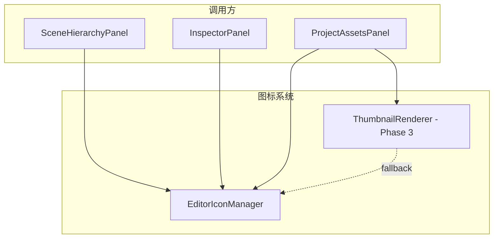

# 编辑器图标系统 Phase 2：EditorIconManager（固定图标管理器）

> **文档版本**：v1.0  
> **创建日期**：2026-05-24  
> **状态**：待实施  
> **优先级**：? 第一优先级（最先实施）  
> **所属模块**：Lucky 引擎 Editor 模块  
> **关联文档**：  
> - [EditorIcon_Phase1_IconFont.md](./EditorIcon_Phase1_IconFont.md)（图标字体）  
> - [EditorIcon_Phase3_ThumbnailRenderer.md](./EditorIcon_Phase3_ThumbnailRenderer.md)（渲染缩略图）  
> - [Coding_Style_Guide.md](../Coding_Style_Guide.md)（代码规范）  
> - [ImGui_Layer3_CommonWidgets_And_EditorPanel.md](./ImGui_Layer3_CommonWidgets_And_EditorPanel.md)（通用控件层）

---

## 一、概述

### 1.1 目标

实现一个集中管理所有**固定图标**（纹理图标）的管理器 `EditorIconManager`，为编辑器的以下场景提供统一的图标获取接口：

1. **Hierarchy 面板**：实体节点图标（所有实体统一使用默认图标）
2. **Inspector 面板**：组件头部图标（Transform、Light、MeshFilter 等）
3. **Project 面板目录树**：文件夹图标、资产类型图标
4. **Project 面板内容区**：列表模式下的资产默认图标
5. **AssetField 引用字段**：材质槽、网格引用等字段的图标

### 1.2 核心设计原则

- **语义一致性**：同一类型（如 Material）无论出现在哪个面板，图标都相同
- **单一数据源**：所有固定图标由 `EditorIconManager` 统一管理，不允许各面板自行加载
- **启动时加载**：所有图标在编辑器启动时一次性加载，运行期间常驻内存
- **Fallback 机制**：当请求的图标不存在时，返回默认的通用图标

### 1.3 与其他模块的关系



---

## 二、文件结构

### 2.1 源代码文件

```
Lucky/Source/Lucky/Editor/
├── EditorPanel.h               # 已有
├── EditorPanel.cpp             # 已有
├── PanelManager.h              # 已有
├── PanelManager.cpp            # 已有
├── EditorIconManager.h         # 新增：图标管理器头文件
└── EditorIconManager.cpp       # 新增：图标管理器实现
```

### 2.2 资源文件

```
Luck3DApp/
└── Resources/
    └── Icons/
        ├── Entity/
        │   └── Entity.png              # 统一实体图标（正方体）
        ├── Component/
        │   ├── Transform.png           # Transform 组件（三轴箭头）
        │   ├── MeshFilter.png          # MeshFilter 组件（网格线框）
        │   ├── MeshRenderer.png        # MeshRenderer 组件（网格+着色）
        │   ├── Light.png               # Light 组件（灯泡）
        │   └── PostProcessVolume.png   # PostProcessVolume 组件
        ├── Asset/
        │   ├── Material.png            # 材质图标（材质球）
        │   ├── Mesh.png                # 网格图标（线框立方体）
        │   ├── Texture.png             # 纹理图标（棋盘格/图片）
        │   ├── Scene.png               # 场景图标
        │   └── Shader.png              # 着色器图标
        └── Common/
            ├── Folder.png              # 文件夹图标
            ├── FolderOpen.png          # 打开的文件夹图标
            └── File.png                # 通用文件图标（同时作为未知类型的 fallback）
```

### 2.3 图标规格

| 属性 | 值 | 说明 |
|------|-----|------|
| 格式 | PNG（RGBA） | 支持透明背景 |
| 尺寸 | 64×64 像素 | 足够清晰，缩小显示时仍然锐利 |
| 颜色 | 白色/浅灰色为主 | 适配深色主题，可通过 tint 着色 |
| 背景 | 透明 | 与任何背景色融合 |

---

## 三、接口设计

### 3.1 方案对比

#### 方案 A：全静态类（推荐 ???）

```cpp
class EditorIconManager
{
public:
    static void Init();
    static void Shutdown();
    
    static Ref<Texture2D> GetAssetTypeIcon(AssetType type);
    static Ref<Texture2D> GetComponentIcon(const std::string& componentName);
    static Ref<Texture2D> GetEntityIcon();
    static Ref<Texture2D> GetFolderIcon(bool isOpen = false);
    static Ref<Texture2D> GetFileIcon();
};
```

**优点**：
- 与项目现有架构完全一致（`Renderer3D`、`GizmoRenderer` 等均为全静态类）
- 调用简洁：`EditorIconManager::GetAssetTypeIcon(AssetType::Material)`
- 无需传递实例引用

**缺点**：
- 全局状态，不可测试（但编辑器图标管理器不需要单元测试）

#### 方案 B：单例模式

```cpp
class EditorIconManager
{
public:
    static EditorIconManager& Get();
    
    Ref<Texture2D> GetAssetTypeIcon(AssetType type);
    // ...
};
```

**优点**：
- 面向对象，可以继承/mock

**缺点**：
- 与项目现有风格不一致
- 调用略繁琐：`EditorIconManager::Get().GetAssetTypeIcon(...)`

#### 方案 C：作为 EditorLayer 的成员

```cpp
class EditorLayer
{
private:
    EditorIconManager m_IconManager;
};
```

**优点**：
- 生命周期明确

**缺点**：
- 各面板需要通过 EditorLayer 间接访问，耦合度高
- 与现有面板独立性设计矛盾

### 3.2 推荐方案：方案 A（全静态类）

**推荐原因**：
1. 与 `Renderer3D`、`GizmoRenderer`、`RenderCommand` 等现有静态类风格完全一致
2. 任何面板都可以直接调用，无需依赖注入
3. 初始化/销毁时机明确（在 `EditorLayer::OnAttach` / `OnDetach` 中调用）

---

## 四、详细实现

### 4.1 EditorIconManager.h

```cpp
// Lucky/Source/Lucky/Editor/EditorIconManager.h
#pragma once

#include "Lucky/Core/Base.h"
#include "Lucky/Renderer/Texture.h"
#include "Lucky/Asset/AssetType.h"
#include "Lucky/Scene/Entity.h"

#include <string>
#include <unordered_map>

namespace Lucky
{
    /// <summary>
    /// 编辑器图标管理器
    /// 管理所有固定图标（纹理图标）的加载和获取
    /// 采用全静态设计，与 Renderer3D 等模块风格一致
    /// </summary>
    class EditorIconManager
    {
    public:
        /// <summary>
        /// 初始化：加载所有图标纹理
        /// 应在 EditorLayer::OnAttach() 中调用
        /// </summary>
        static void Init();

        /// <summary>
        /// 销毁：释放所有图标纹理
        /// 应在 EditorLayer::OnDetach() 中调用
        /// </summary>
        static void Shutdown();

        // ======== 资产类型图标 ========

        /// <summary>
        /// 获取资产类型图标
        /// 用于 Project 面板目录树、内容区列表模式、AssetField 引用字段
        /// </summary>
        /// <param name="type">资产类型</param>
        /// <returns>对应的图标纹理，未知类型返回默认图标</returns>
        static Ref<Texture2D> GetAssetTypeIcon(AssetType type);

        // ======== 组件图标 ========

        /// <summary>
        /// 获取组件图标（通过组件类型名）
        /// 用于 Inspector 面板组件头部
        /// </summary>
        /// <param name="componentName">组件类型名（如 "Transform"、"Light"）</param>
        /// <returns>对应的图标纹理，未知组件返回 nullptr</returns>
        static Ref<Texture2D> GetComponentIcon(const std::string& componentName);

        /// <summary>
        /// 获取组件图标（模板版本）
        /// </summary>
        /// <typeparam name="TComponent">组件类型</typeparam>
        /// <returns>对应的图标纹理</returns>
        template<typename TComponent>
        static Ref<Texture2D> GetComponentIcon();

        // ======== 实体图标 ========

        /// <summary>
        /// 获取实体图标
        /// 所有实体统一使用同一个默认图标（正方体）
        /// 用于 Hierarchy 面板树节点
        /// </summary>
        /// <returns>实体图标纹理</returns>
        static Ref<Texture2D> GetEntityIcon();

        // ======== 通用图标 ========

        /// <summary>
        /// 获取文件夹图标
        /// </summary>
        /// <param name="isOpen">是否为打开状态</param>
        /// <returns>文件夹图标纹理</returns>
        static Ref<Texture2D> GetFolderIcon(bool isOpen = false);

        /// <summary>
        /// 获取通用文件图标
        /// </summary>
        /// <returns>文件图标纹理</returns>
        static Ref<Texture2D> GetFileIcon();
    };

    // ======== 模板方法实现 ========

    template<typename TComponent>
    Ref<Texture2D> EditorIconManager::GetComponentIcon()
    {
        // 通过 typeid 获取类型名，去除命名空间前缀
        std::string fullName = typeid(TComponent).name();
        
        // 简化：使用预定义的映射
        // 具体映射在 .cpp 中通过 GetComponentIcon(string) 实现
        return GetComponentIcon(fullName);
    }
}
```

### 4.2 EditorIconManager.cpp

```cpp
// Lucky/Source/Lucky/Editor/EditorIconManager.cpp
#include "lcpch.h"
#include "EditorIconManager.h"

#include "Lucky/Scene/Components/Components.h"

namespace Lucky
{
    /// <summary>
    /// 图标管理器内部数据
    /// </summary>
    struct EditorIconData
    {
        // ---- 资产类型图标 ----
        std::unordered_map<AssetType, Ref<Texture2D>> AssetTypeIcons;

        // ---- 组件图标 ----
        std::unordered_map<std::string, Ref<Texture2D>> ComponentIcons;

        // ---- 实体图标 ----
        Ref<Texture2D> EntityIcon;      // 统一实体图标（所有实体共用）

        // ---- 通用图标 ----
        Ref<Texture2D> FolderIcon;
        Ref<Texture2D> FolderOpenIcon;
        Ref<Texture2D> FileIcon;        // 通用文件图标（同时作为未知资产类型的 fallback）
    };

    static EditorIconData s_IconData;

    /// <summary>
    /// 图标资源根目录
    /// </summary>
    static constexpr const char* s_IconRootPath = "Resources/Icons";

    /// <summary>
    /// 加载单个图标纹理
    /// </summary>
    /// <param name="relativePath">相对于图标根目录的路径</param>
    /// <returns>加载的纹理，失败返回 nullptr</returns>
    static Ref<Texture2D> LoadIcon(const std::string& relativePath)
    {
        std::string fullPath = std::string(s_IconRootPath) + "/" + relativePath;
        
        Ref<Texture2D> texture = Texture2D::Create(fullPath);
        if (!texture || texture->GetRendererID() == 0)
        {
            LF_CORE_WARN("EditorIconManager: Failed to load icon '{0}'", fullPath);
            return nullptr;
        }
        
        return texture;
    }

    void EditorIconManager::Init()
    {
        LF_CORE_INFO("EditorIconManager::Init - Loading editor icons...");

        // ---- 加载通用图标 ----
        s_IconData.FolderIcon       = LoadIcon("Common/Folder.png");
        s_IconData.FolderOpenIcon   = LoadIcon("Common/FolderOpen.png");
        s_IconData.FileIcon         = LoadIcon("Common/File.png");

        // ---- 加载资产类型图标 ----
        s_IconData.AssetTypeIcons[AssetType::Material]  = LoadIcon("Asset/Material.png");
        s_IconData.AssetTypeIcons[AssetType::Mesh]      = LoadIcon("Asset/Mesh.png");
        s_IconData.AssetTypeIcons[AssetType::Texture2D] = LoadIcon("Asset/Texture.png");
        s_IconData.AssetTypeIcons[AssetType::Scene]     = LoadIcon("Asset/Scene.png");
        s_IconData.AssetTypeIcons[AssetType::Shader]    = LoadIcon("Asset/Shader.png");

        // ---- 加载组件图标 ----
        s_IconData.ComponentIcons["Transform"]          = LoadIcon("Component/Transform.png");
        s_IconData.ComponentIcons["MeshFilter"]         = LoadIcon("Component/MeshFilter.png");
        s_IconData.ComponentIcons["MeshRenderer"]       = LoadIcon("Component/MeshRenderer.png");
        s_IconData.ComponentIcons["Light"]              = LoadIcon("Component/Light.png");
        s_IconData.ComponentIcons["PostProcessVolume"]  = LoadIcon("Component/PostProcessVolume.png");

        // ---- 加载实体图标（统一图标） ----
        s_IconData.EntityIcon = LoadIcon("Entity/Entity.png");

        LF_CORE_INFO("EditorIconManager::Init - Done.");
    }

    void EditorIconManager::Shutdown()
    {
        LF_CORE_INFO("EditorIconManager::Shutdown");

        s_IconData.AssetTypeIcons.clear();
        s_IconData.ComponentIcons.clear();
        s_IconData.EntityIcon.reset();
        s_IconData.FolderIcon.reset();
        s_IconData.FolderOpenIcon.reset();
        s_IconData.FileIcon.reset();
    }

    Ref<Texture2D> EditorIconManager::GetAssetTypeIcon(AssetType type)
    {
        auto it = s_IconData.AssetTypeIcons.find(type);
        if (it != s_IconData.AssetTypeIcons.end() && it->second)
        {
            return it->second;
        }

        // Fallback：返回通用文件图标
        return s_IconData.FileIcon;
    }

    Ref<Texture2D> EditorIconManager::GetComponentIcon(const std::string& componentName)
    {
        auto it = s_IconData.ComponentIcons.find(componentName);
        if (it != s_IconData.ComponentIcons.end() && it->second)
        {
            return it->second;
        }

        return nullptr;  // 组件图标可选，返回 nullptr 表示不显示图标
    }

    Ref<Texture2D> EditorIconManager::GetEntityIcon()
    {
        return s_IconData.EntityIcon;
    }

    Ref<Texture2D> EditorIconManager::GetFolderIcon(bool isOpen)
    {
        if (isOpen && s_IconData.FolderOpenIcon)
        {
            return s_IconData.FolderOpenIcon;
        }

        return s_IconData.FolderIcon;
    }

    Ref<Texture2D> EditorIconManager::GetFileIcon()
    {
        return s_IconData.FileIcon;
    }
}
```

### 4.3 初始化与销毁时机

在 `EditorLayer` 中调用初始化和销毁：

```cpp
// Luck3DApp/Source/EditorLayer.cpp

#include "Lucky/Editor/EditorIconManager.h"

void EditorLayer::OnAttach()
{
    LF_TRACE("EditorLayer::OnAttach");

    // 初始化图标管理器（在创建面板之前）
    EditorIconManager::Init();

    m_Scene = CreateRef<Scene>("New Scene");
    m_PanelManager = CreateScope<PanelManager>();
    
    // ... 注册面板 ...
}

void EditorLayer::OnDetach()
{
    LF_TRACE("EditorLayer::OnDetach");

    // 销毁图标管理器
    EditorIconManager::Shutdown();
}
```

---

## 五、面板集成

### 5.1 Hierarchy 面板 ? 实体图标

修改 `BeginTreeNode` 接口以支持图标参数：

#### 方案 A：修改 BeginTreeNode 签名（推荐 ???）

```cpp
// Lucky/Source/Lucky/UI/Widgets.h

/// <summary>
/// 树节点（带图标版本）
/// </summary>
/// <param name="icon">节点图标（可为 nullptr，不显示图标）</param>
/// <param name="name">名称</param>
/// <param name="defaultOpen">默认打开</param>
/// <param name="selected">已选中</param>
/// <param name="isLeaf">是叶节点</param>
/// <returns>是否展开</returns>
bool BeginTreeNode(const Ref<Texture2D>& icon, const char* name, bool defaultOpen = false, bool selected = false, bool isLeaf = false);
```

**实现**：

```cpp
// Lucky/Source/Lucky/UI/Widgets.cpp

bool BeginTreeNode(const Ref<Texture2D>& icon, const char* name, bool defaultOpen, bool selected, bool isLeaf)
{
    ScopedStyle itemSpacing(ImGuiStyleVar_ItemSpacing, { 0, 0 });
    ImGuiTreeNodeFlags flags = ImGuiTreeNodeFlags_OpenOnArrow | ImGuiTreeNodeFlags_SpanFullWidth | ImGuiTreeNodeFlags_SpanAvailWidth;

    // ... 现有的颜色和标志设置代码 ...

    // 使用空标签创建树节点（图标和文本手动绘制）
    const std::string& hiddenID = std::format("##{}", name);
    bool opened = ImGui::TreeNodeEx(hiddenID.c_str(), flags);

    // 在同一行绘制图标 + 文本
    ImGui::SameLine();
    
    if (icon)
    {
        float iconSize = ImGui::GetTextLineHeight();    // 图标大小与文本行高一致
        ImTextureID texID = reinterpret_cast<ImTextureID>(static_cast<uintptr_t>(icon->GetRendererID()));
        ImGui::Image(texID, ImVec2(iconSize, iconSize));
        ImGui::SameLine();
        ShiftCursorX(4.0f);     // 图标与文本之间的间距
    }
    
    ImGui::Text("%s", name);

    return opened;
}
```

**优点**：
- 接口清晰，图标作为可选参数
- 保持原有无图标版本的兼容性（重载）
- 图标大小自动跟随文本行高

**缺点**：
- 需要修改 TreeNodeEx 的使用方式（使用隐藏 ID + 手动绘制）

#### 方案 B：在 TreeNode 外部手动绘制图标

```cpp
// 调用方自行在 TreeNode 前绘制图标
Ref<Texture2D> icon = EditorIconManager::GetEntityIcon(entity);
if (icon)
{
    float iconSize = ImGui::GetTextLineHeight();
    UI::Image(icon, ImVec2(iconSize, iconSize));
    ImGui::SameLine();
}
bool opened = UI::BeginTreeNode(name, ...);
```

**优点**：
- 不需要修改 Widgets 接口

**缺点**：
- 每个调用点都要重复图标绘制代码
- 图标不在 TreeNode 的点击区域内
- 布局对齐需要手动处理

#### 推荐：方案 A

修改 `BeginTreeNode` 接口，提供带图标的重载版本。原有无图标版本保持不变（内部调用带图标版本，传入 nullptr）。

### 5.2 Hierarchy 面板调用示例

```cpp
// Luck3DApp/Source/Panels/SceneHierarchyPanel.cpp

#include "Lucky/Editor/EditorIconManager.h"

void SceneHierarchyPanel::DrawEntityNode(Entity entity)
{
    const std::string& name = entity.GetComponent<NameComponent>().Name;
    UUID id = entity.GetUUID();
    const std::string& strID = std::format("{0}##{1}", name, static_cast<uint64_t>(id));

    bool isLeaf = entity.GetChildren().empty();
    
    // 获取实体图标（所有实体统一图标）
    Ref<Texture2D> icon = EditorIconManager::GetEntityIcon();
    
    bool opened = UI::BeginTreeNode(icon, strID.c_str(), false, SelectionManager::IsSelected(id), isLeaf);
    
    // ... 后续逻辑不变 ...
}
```

### 5.3 Inspector 面板 ? 组件图标

修改 `DrawComponent` 模板方法，在组件头部显示图标：

```cpp
// Luck3DApp/Source/Panels/InspectorPanel.h

#include "Lucky/Editor/EditorIconManager.h"

template<typename TComponent, typename UIFunction>
void InspectorPanel::DrawComponent(const std::string& name, Entity entity, UIFunction OnOpened)
{
    if (!entity.HasComponent<TComponent>())
    {
        return;
    }
    
    const ImGuiTreeNodeFlags flags = ImGuiTreeNodeFlags_DefaultOpen | ImGuiTreeNodeFlags_AllowItemOverlap | ImGuiTreeNodeFlags_FramePadding | ImGuiTreeNodeFlags_SpanAvailWidth;
    
    auto& component = entity.GetComponent<TComponent>();
    ImVec2 contentRegionAvail = ImGui::GetContentRegionAvail();
    
    const std::string& strComponentID = std::format("{}##{}{}", name, static_cast<uint64_t>(entity.GetUUID()), typeid(TComponent).hash_code());
    
    bool opened = false;
    
    UI::Draw::HorizontalLine();
    
    UI::ShiftCursorY(1.0f);
    {
        UI::ScopedStyle itemSpacing(ImGuiStyleVar_ItemSpacing, { 0, 0 });
        opened = ImGui::TreeNodeEx(strComponentID.c_str(), flags, "");
        
        // 组件图标 + 组件名
        ImGui::SameLine();
        UI::ShiftCursorX(8.0f);
        
        // 绘制组件图标
        Ref<Texture2D> componentIcon = EditorIconManager::GetComponentIcon(name);
        if (componentIcon)
        {
            float iconSize = ImGui::GetTextLineHeight();
            ImTextureID texID = reinterpret_cast<ImTextureID>(static_cast<uintptr_t>(componentIcon->GetRendererID()));
            ImGui::Image(texID, ImVec2(iconSize, iconSize));
            ImGui::SameLine();
            UI::ShiftCursorX(4.0f);
        }
        
        {
            UI::ScopedFont boldFont(ImGui::GetIO().Fonts->Fonts[0]);
            ImGui::Text(name.c_str());
        }
        
        // ... 设置按钮、弹出菜单等后续代码不变 ...
    }
    
    // ... 后续代码不变 ...
}
```

### 5.4 Project 面板 ? 目录树图标

```cpp
// Luck3DApp/Source/Panels/ProjectAssetsPanel.cpp

#include "Lucky/Editor/EditorIconManager.h"

void ProjectAssetsPanel::DrawDirectoryTreeNode(DirectoryNode& node)
{
    const std::string& strID = node.Name;
    bool isRoot = node.FullPath == m_AssetsDirectory;
    bool isLeaf = node.SubDirectories.empty();

    // 获取文件夹图标（根据是否展开选择不同图标）
    bool isCurrentDir = (m_CurrentDirectory == node.FullPath);
    Ref<Texture2D> folderIcon = EditorIconManager::GetFolderIcon(isCurrentDir);

    if (isRoot)
    {
        ImGui::PushFont(ImGui::GetIO().Fonts->Fonts[0]);
    }
    
    bool opened = UI::BeginTreeNode(folderIcon, strID.c_str(), isRoot, isCurrentDir, isLeaf);
    
    if (isRoot)
    {
        ImGui::PopFont();
    }
    
    // ... 后续逻辑不变 ...
}
```

### 5.5 Project 面板 ? 内容区资产图标

```cpp
// Luck3DApp/Source/Panels/ProjectAssetsPanel.cpp

void ProjectAssetsPanel::DrawAssetItem(const std::filesystem::directory_entry& entry)
{
    const std::filesystem::path& path = entry.path();
    std::string strID = path.stem().string();
    
    bool isDirectory = entry.is_directory();
    
    // 获取图标
    Ref<Texture2D> icon = nullptr;
    if (isDirectory)
    {
        icon = EditorIconManager::GetFolderIcon(false);
    }
    else
    {
        AssetType type = GetAssetTypeFromPath(path);
        icon = EditorIconManager::GetAssetTypeIcon(type);
    }
    
    if (!isDirectory)
    {
        AssetHandle assetHandle = AssetManager::GetAssetHandle(path.string());
        strID = std::format("{}##{}", path.stem().string(), static_cast<uint32_t>(assetHandle));
    }
    
    if (UI::BeginTreeNode(icon, strID.c_str(), false, m_SelectionPath == path, true))
    {
        UI::EndTreeNode();
    }
    
    // ... 后续逻辑不变 ...
}
```

---

## 六、图标设计规范

### 6.1 图标视觉风格

为保持编辑器视觉一致性，所有图标应遵循以下规范：

| 属性 | 规范 | 说明 |
|------|------|------|
| 线条粗细 | 2px（64×64 画布） | 与 Lucide 图标字体风格一致 |
| 圆角 | 2px | 柔和但不过度圆润 |
| 主色调 | 白色 `#FFFFFF` 或浅灰 `#E0E0E0` | 深色主题下清晰可见 |
| 填充 | 线条风格为主，关键区域可半透明填充 | 避免过于厚重 |
| 安全边距 | 4px（64×64 画布的每边） | 确保缩小后不贴边 |
| 有效绘制区域 | 56×56 像素（64 - 4×2） | 图标内容在此区域内 |

### 6.2 各图标设计参考

| 图标名 | 视觉描述 | 参考 |
|--------|---------|------|
| Entity.png | 正方体线框 | Unity 的 GameObject 图标 |
| Light.png | 灯泡 + 光线 | Unity 的 Light 图标 |
| Transform.png | 三轴箭头（RGB = XYZ） | Unity 的 Transform 图标 |
| MeshFilter.png | 线框立方体 | Unity 的 MeshFilter 图标 |
| MeshRenderer.png | 实心立方体 + 着色 | Unity 的 MeshRenderer 图标 |
| Material.png | 材质球（球体 + 高光） | Unity 的 Material 图标 |
| Mesh.png | 线框网格 | Unity 的 Mesh 图标 |
| Texture.png | 棋盘格 / 图片图标 | Unity 的 Texture 图标 |
| Scene.png | 场景/地形轮廓 | Unity 的 Scene 图标 |
| Shader.png | 代码/着色器符号 | Unity 的 Shader 图标 |
| Folder.png | 文件夹 | 标准文件夹图标 |
| FolderOpen.png | 打开的文件夹 | 标准打开文件夹图标 |

### 6.3 图标获取方式

**方案 A（推荐）：使用免费图标资源**

1. [Flaticon](https://www.flaticon.com/) ? 大量免费图标，需注明出处
2. [Icons8](https://icons8.com/) ? 提供编辑器风格图标
3. [Game-icons.net](https://game-icons.net/) ? 游戏相关图标，CC BY 3.0
4. 自行使用矢量工具（Figma/Inkscape）绘制

**方案 B：使用 AI 生成**

使用 AI 图像生成工具生成 64×64 的简约线条图标，然后手动调整。

**方案 C：临时使用纯色占位图标**

在开发初期，可以使用程序生成的纯色方块作为占位图标，后续替换为正式图标：

```cpp
// 临时：生成纯色占位图标
static Ref<Texture2D> CreatePlaceholderIcon(uint32_t color)
{
    Ref<Texture2D> tex = Texture2D::Create(4, 4);   // 4×4 纯色
    uint32_t data[16];
    std::fill(std::begin(data), std::end(data), color);
    tex->SetData(data, sizeof(data));
    return tex;
}
```

---

## 七、实施步骤

| 步骤 | 内容 | 涉及文件 | 预计工作量 |
|------|------|---------|-----------|
| 1 | 创建 `Resources/Icons/` 目录结构 | 目录 | 5 分钟 |
| 2 | 准备图标 PNG 文件（可先用占位图标） | PNG 文件 | 30 分钟 |
| 3 | 实现 `EditorIconManager.h/cpp` | `Lucky/Source/Lucky/Editor/` | 30 分钟 |
| 4 | 在 `EditorLayer` 中调用 Init/Shutdown | `EditorLayer.cpp` | 5 分钟 |
| 5 | 修改 `BeginTreeNode` 添加图标重载 | `Widgets.h/cpp` | 30 分钟 |
| 6 | Hierarchy 面板集成实体图标 | `SceneHierarchyPanel.cpp` | 15 分钟 |
| 7 | Inspector 面板集成组件图标 | `InspectorPanel.h` | 20 分钟 |
| 8 | Project 面板集成目录/资产图标 | `ProjectAssetsPanel.cpp` | 20 分钟 |
| 9 | 调试图标对齐和大小 | 多个文件 | 20 分钟 |

---

## 八、扩展性设计

### 8.1 新增资产类型

当引擎新增资产类型时，只需：
1. 在 `AssetType` 枚举中添加新类型
2. 准备对应的 PNG 图标文件
3. 在 `EditorIconManager::Init()` 中添加一行加载代码

### 8.2 新增组件类型

当引擎新增组件时，只需：
1. 准备对应的 PNG 图标文件
2. 在 `EditorIconManager::Init()` 中添加一行加载代码

### 8.3 图标热重载（远期）

未来可以支持图标热重载（修改 PNG 文件后自动刷新），但当前阶段不需要。

---

## 九、验收标准

1. ? `EditorIconManager::Init()` 成功加载所有图标，无报错
2. ? Hierarchy 面板树节点显示统一实体图标
3. ? Inspector 面板组件头部显示组件图标
4. ? Project 面板目录树显示文件夹图标
5. ? Project 面板内容区显示资产类型图标
6. ? 图标大小与文本行高一致，垂直居中对齐
7. ? 缺失图标时不崩溃，显示 fallback 图标或不显示
8. ? `EditorIconManager::Shutdown()` 正确释放所有纹理资源
