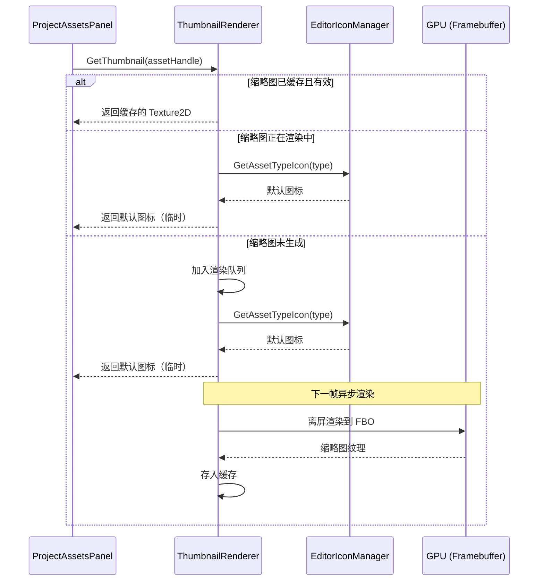

# 编辑器图标系统 Phase 3：ThumbnailRenderer（渲染缩略图）

> **文档版本**：v1.0  
> **创建日期**：2026-05-24  
> **状态**：待实施  
> **优先级**：? 第三优先级（最后实施）  
> **所属模块**：Luck3DApp 编辑器  
> **前置依赖**：  
> - Phase 2 `EditorIconManager` 必须先完成（作为 fallback 图标源）  
> - 引擎 `Framebuffer` 类已实现离屏渲染能力（已具备）  
> **关联文档**：  
> - [EditorIcon_Phase1_IconFont.md](./EditorIcon_Phase1_IconFont.md)（图标字体）  
> - [EditorIcon_Phase2_EditorIconManager.md](./EditorIcon_Phase2_EditorIconManager.md)（固定图标管理器）  
> - [Coding_Style_Guide.md](../Coding_Style_Guide.md)（代码规范）

---

## 一、概述

### 1.1 目标

实现一个渲染缩略图系统 `ThumbnailRenderer`，为 Project 面板的缩略图模式提供**资产内容预览**能力。与 Phase 2 的固定图标不同，渲染缩略图是**动态生成**的，反映资产的实际内容。

### 1.2 适用场景

| 资产类型 | 缩略图来源 | 说明 |
|---------|-----------|------|
| **Texture2D** | 直接显示纹理内容 | 加载原始纹理并缩放显示 |
| **Material** | 离屏渲染材质球 | 使用该材质渲染一个球体到小 FBO |
| **Mesh** | 离屏渲染网格预览 | 渲染该 Mesh 的线框或实体到小 FBO |
| **Scene** | 不需要渲染缩略图 | 使用 Phase 2 的固定场景图标 |
| **Shader** | 不需要渲染缩略图 | 使用 Phase 2 的固定着色器图标 |

### 1.3 与 EditorIconManager 的关系



### 1.4 核心设计原则

- **按需生成**：只有当资产在 Project 面板中可见时才生成缩略图
- **异步/分帧**：每帧只渲染有限数量的缩略图，避免卡顿
- **LRU 缓存**：缓存数量有上限，超出时淘汰最久未访问的缩略图
- **失效机制**：资产内容修改时，对应缩略图标记为失效并重新生成
- **优雅降级**：缩略图未就绪时，显示 Phase 2 的固定默认图标

---

## 二、文件结构

```
Luck3DApp/Source/
├── Panels/
│   └── ProjectAssetsPanel.h/cpp    # 修改：集成 ThumbnailRenderer
├── Thumbnail/
│   ├── ThumbnailRenderer.h         # 新增：缩略图渲染器
│   ├── ThumbnailRenderer.cpp       # 新增：实现
│   ├── ThumbnailCache.h            # 新增：缩略图缓存（LRU）
│   └── ThumbnailCache.cpp          # 新增：实现
└── EditorLayer.h/cpp               # 修改：初始化/销毁 ThumbnailRenderer
```

---

## 三、架构设计

### 3.1 方案对比

#### 方案 A：全静态类 + 内部缓存（推荐 ???）

```cpp
class ThumbnailRenderer
{
public:
    static void Init();
    static void Shutdown();
    static void OnUpdate();     // 每帧调用，处理渲染队列
    
    static Ref<Texture2D> GetThumbnail(AssetHandle handle);
    static void Invalidate(AssetHandle handle);
    static void InvalidateAll();
};
```

**优点**：
- 与项目现有架构一致（`Renderer3D`、`EditorIconManager` 等）
- 调用简洁
- 内部管理渲染队列和缓存，外部无需关心实现细节

**缺点**：
- 全局状态

#### 方案 B：实例化对象，由 ProjectAssetsPanel 持有

```cpp
class ThumbnailRenderer
{
public:
    ThumbnailRenderer();
    ~ThumbnailRenderer();
    
    void OnUpdate();
    Ref<Texture2D> GetThumbnail(AssetHandle handle);
    void Invalidate(AssetHandle handle);
};

// ProjectAssetsPanel 中
class ProjectAssetsPanel : public EditorPanel
{
private:
    ThumbnailRenderer m_ThumbnailRenderer;
};
```

**优点**：
- 生命周期与面板绑定，更清晰
- 可以有多个实例（如果未来有多个资产浏览器）

**缺点**：
- 如果其他面板也需要缩略图（如 Inspector 的材质预览），需要共享实例
- 与项目现有风格不一致

#### 方案 C：单例模式

```cpp
class ThumbnailRenderer
{
public:
    static ThumbnailRenderer& Get();
    // ...
};
```

**优点**：面向对象  
**缺点**：与项目风格不一致

### 3.2 推荐方案：方案 A（全静态类）

**推荐原因**：
1. 与 `EditorIconManager`、`Renderer3D` 风格一致
2. 未来 Inspector 面板的材质预览也可以复用
3. 渲染队列和缓存作为内部实现细节，对外透明

---

## 四、详细实现

### 4.1 ThumbnailCache.h ? 缩略图缓存

```cpp
// Luck3DApp/Source/Thumbnail/ThumbnailCache.h
#pragma once

#include "Lucky/Core/Base.h"
#include "Lucky/Renderer/Texture.h"
#include "Lucky/Asset/AssetHandle.h"

#include <unordered_map>
#include <list>

namespace Lucky
{
    /// <summary>
    /// 缩略图状态
    /// </summary>
    enum class ThumbnailState : uint8_t
    {
        Invalid = 0,    // 无效/未生成
        Pending,        // 已加入渲染队列，等待渲染
        Ready           // 已渲染完成，可使用
    };

    /// <summary>
    /// 缩略图缓存条目
    /// </summary>
    struct ThumbnailEntry
    {
        Ref<Texture2D> Texture;             // 缩略图纹理
        ThumbnailState State = ThumbnailState::Invalid;
        float LastAccessTime = 0.0f;        // 最后访问时间（用于 LRU）
    };

    /// <summary>
    /// 缩略图 LRU 缓存
    /// 当缓存数量超过上限时，淘汰最久未访问的条目
    /// </summary>
    class ThumbnailCache
    {
    public:
        /// <summary>
        /// 构造函数
        /// </summary>
        /// <param name="maxSize">缓存最大容量</param>
        ThumbnailCache(size_t maxSize = 256);

        /// <summary>
        /// 获取缓存条目
        /// </summary>
        /// <param name="handle">资产句柄</param>
        /// <returns>缓存条目指针，不存在返回 nullptr</returns>
        ThumbnailEntry* Get(AssetHandle handle);

        /// <summary>
        /// 插入或更新缓存条目
        /// </summary>
        /// <param name="handle">资产句柄</param>
        /// <param name="entry">缓存条目</param>
        void Put(AssetHandle handle, const ThumbnailEntry& entry);

        /// <summary>
        /// 使指定条目失效
        /// </summary>
        /// <param name="handle">资产句柄</param>
        void Invalidate(AssetHandle handle);

        /// <summary>
        /// 清空所有缓存
        /// </summary>
        void Clear();

        /// <summary>
        /// 获取当前缓存数量
        /// </summary>
        size_t Size() const { return m_Cache.size(); }

    private:
        /// <summary>
        /// 淘汰最久未访问的条目
        /// </summary>
        void Evict();

    private:
        size_t m_MaxSize;

        // LRU 链表：front = 最近访问，back = 最久未访问
        std::list<AssetHandle> m_AccessOrder;

        // 缓存数据
        struct CacheNode
        {
            ThumbnailEntry Entry;
            std::list<AssetHandle>::iterator AccessIterator;     // 在 m_AccessOrder 中的位置
        };
        std::unordered_map<AssetHandle, CacheNode> m_Cache;
    };
}
```

### 4.2 ThumbnailCache.cpp ? 实现

```cpp
// Luck3DApp/Source/Thumbnail/ThumbnailCache.cpp
#include "ThumbnailCache.h"

namespace Lucky
{
    ThumbnailCache::ThumbnailCache(size_t maxSize)
        : m_MaxSize(maxSize)
    {
    }

    ThumbnailEntry* ThumbnailCache::Get(AssetHandle handle)
    {
        auto it = m_Cache.find(handle);
        if (it == m_Cache.end())
        {
            return nullptr;
        }

        // 更新 LRU 顺序：移到链表头部
        m_AccessOrder.erase(it->second.AccessIterator);
        m_AccessOrder.push_front(handle);
        it->second.AccessIterator = m_AccessOrder.begin();

        return &it->second.Entry;
    }

    void ThumbnailCache::Put(AssetHandle handle, const ThumbnailEntry& entry)
    {
        auto it = m_Cache.find(handle);
        if (it != m_Cache.end())
        {
            // 已存在：更新条目
            it->second.Entry = entry;
            m_AccessOrder.erase(it->second.AccessIterator);
            m_AccessOrder.push_front(handle);
            it->second.AccessIterator = m_AccessOrder.begin();
            return;
        }

        // 不存在：检查是否需要淘汰
        if (m_Cache.size() >= m_MaxSize)
        {
            Evict();
        }

        // 插入新条目
        m_AccessOrder.push_front(handle);
        CacheNode node;
        node.Entry = entry;
        node.AccessIterator = m_AccessOrder.begin();
        m_Cache[handle] = node;
    }

    void ThumbnailCache::Invalidate(AssetHandle handle)
    {
        auto it = m_Cache.find(handle);
        if (it != m_Cache.end())
        {
            it->second.Entry.State = ThumbnailState::Invalid;
            it->second.Entry.Texture.reset();
        }
    }

    void ThumbnailCache::Clear()
    {
        m_Cache.clear();
        m_AccessOrder.clear();
    }

    void ThumbnailCache::Evict()
    {
        if (m_AccessOrder.empty())
        {
            return;
        }

        // 淘汰链表尾部（最久未访问）
        AssetHandle lruHandle = m_AccessOrder.back();
        m_AccessOrder.pop_back();
        m_Cache.erase(lruHandle);
    }
}
```

### 4.3 ThumbnailRenderer.h ? 缩略图渲染器

```cpp
// Luck3DApp/Source/Thumbnail/ThumbnailRenderer.h
#pragma once

#include "Lucky/Core/Base.h"
#include "Lucky/Renderer/Texture.h"
#include "Lucky/Renderer/Framebuffer.h"
#include "Lucky/Asset/AssetHandle.h"
#include "Lucky/Asset/AssetType.h"

#include "ThumbnailCache.h"

#include <queue>

namespace Lucky
{
    /// <summary>
    /// 缩略图渲染器配置
    /// </summary>
    struct ThumbnailRendererConfig
    {
        uint32_t ThumbnailSize = 128;       // 缩略图分辨率（正方形）
        size_t CacheMaxSize = 256;          // 缓存最大数量
        uint32_t MaxRendersPerFrame = 2;    // 每帧最大渲染数量（避免卡顿）
    };

    /// <summary>
    /// 缩略图渲染器
    /// 负责为资产生成内容预览缩略图
    /// 采用全静态设计，与 EditorIconManager 风格一致
    /// </summary>
    class ThumbnailRenderer
    {
    public:
        /// <summary>
        /// 初始化缩略图渲染器
        /// 创建离屏 Framebuffer、预览场景等资源
        /// </summary>
        /// <param name="config">配置参数</param>
        static void Init(const ThumbnailRendererConfig& config = {});

        /// <summary>
        /// 销毁缩略图渲染器
        /// 释放所有资源
        /// </summary>
        static void Shutdown();

        /// <summary>
        /// 每帧更新：处理渲染队列
        /// 应在 EditorLayer::OnUpdate() 中调用
        /// </summary>
        static void OnUpdate();

        /// <summary>
        /// 获取资产的缩略图
        /// 如果缩略图已缓存，直接返回
        /// 如果未生成，加入渲染队列并返回 nullptr（调用方应使用 fallback 图标）
        /// </summary>
        /// <param name="handle">资产句柄</param>
        /// <returns>缩略图纹理，未就绪时返回 nullptr</returns>
        static Ref<Texture2D> GetThumbnail(AssetHandle handle);

        /// <summary>
        /// 获取资产的最佳可用图标
        /// 优先返回渲染缩略图，未就绪时自动 fallback 到 EditorIconManager 的默认图标
        /// </summary>
        /// <param name="handle">资产句柄</param>
        /// <param name="type">资产类型（用于 fallback）</param>
        /// <returns>最佳可用的图标纹理</returns>
        static Ref<Texture2D> GetBestAvailableIcon(AssetHandle handle, AssetType type);

        /// <summary>
        /// 使指定资产的缩略图失效
        /// 下次请求时将重新渲染
        /// </summary>
        /// <param name="handle">资产句柄</param>
        static void Invalidate(AssetHandle handle);

        /// <summary>
        /// 使所有缩略图失效
        /// </summary>
        static void InvalidateAll();

        /// <summary>
        /// 判断指定资产类型是否支持渲染缩略图
        /// </summary>
        /// <param name="type">资产类型</param>
        /// <returns>是否支持</returns>
        static bool SupportsPreview(AssetType type);
    };
}
```

### 4.4 ThumbnailRenderer.cpp ? 实现

```cpp
// Luck3DApp/Source/Thumbnail/ThumbnailRenderer.cpp
#include "ThumbnailRenderer.h"

#include "Lucky/Asset/AssetManager.h"
#include "Lucky/Editor/EditorIconManager.h"
#include "Lucky/Renderer/Renderer3D.h"
#include "Lucky/Renderer/RenderCommand.h"
#include "Lucky/Renderer/Framebuffer.h"
#include "Lucky/Renderer/MeshFactory.h"

#include <glm/glm.hpp>
#include <glm/gtc/matrix_transform.hpp>

namespace Lucky
{
    /// <summary>
    /// 缩略图渲染器内部数据
    /// </summary>
    struct ThumbnailRendererData
    {
        ThumbnailRendererConfig Config;

        // 离屏渲染资源
        Ref<Framebuffer> PreviewFramebuffer;     // 预览用 FBO
        Ref<Mesh> PreviewSphere;                 // 材质预览用球体

        // 缓存
        ThumbnailCache Cache;

        // 渲染队列
        std::queue<AssetHandle> RenderQueue;

        // 预览相机参数
        glm::mat4 ViewMatrix;
        glm::mat4 ProjectionMatrix;
        glm::mat4 ViewProjectionMatrix;

        bool Initialized = false;
    };

    static ThumbnailRendererData s_Data;

    void ThumbnailRenderer::Init(const ThumbnailRendererConfig& config)
    {
        s_Data.Config = config;
        s_Data.Cache = ThumbnailCache(config.CacheMaxSize);

        // 创建离屏 Framebuffer
        FramebufferSpecification fbSpec;
        fbSpec.Width = config.ThumbnailSize;
        fbSpec.Height = config.ThumbnailSize;
        fbSpec.Attachments = { FramebufferTextureFormat::RGBA8, FramebufferTextureFormat::Depth };
        s_Data.PreviewFramebuffer = Framebuffer::Create(fbSpec);

        // 创建预览球体（用于材质预览）
        s_Data.PreviewSphere = MeshFactory::CreateSphere(1.0f, 32, 32);

        // 设置预览相机（固定视角）
        float distance = 2.5f;
        glm::vec3 cameraPos = glm::vec3(0.0f, 0.0f, distance);
        glm::vec3 target = glm::vec3(0.0f);
        s_Data.ViewMatrix = glm::lookAt(cameraPos, target, glm::vec3(0.0f, 1.0f, 0.0f));
        s_Data.ProjectionMatrix = glm::perspective(glm::radians(45.0f), 1.0f, 0.1f, 100.0f);
        s_Data.ViewProjectionMatrix = s_Data.ProjectionMatrix * s_Data.ViewMatrix;

        s_Data.Initialized = true;

        LF_CORE_INFO("ThumbnailRenderer::Init - Thumbnail size: {0}x{0}, Cache max: {1}",
                     config.ThumbnailSize, config.CacheMaxSize);
    }

    void ThumbnailRenderer::Shutdown()
    {
        s_Data.Cache.Clear();
        s_Data.PreviewFramebuffer.reset();
        s_Data.PreviewSphere.reset();
        s_Data.Initialized = false;

        // 清空渲染队列
        while (!s_Data.RenderQueue.empty())
        {
            s_Data.RenderQueue.pop();
        }

        LF_CORE_INFO("ThumbnailRenderer::Shutdown");
    }

    void ThumbnailRenderer::OnUpdate()
    {
        if (!s_Data.Initialized || s_Data.RenderQueue.empty())
        {
            return;
        }

        uint32_t renderedCount = 0;

        while (!s_Data.RenderQueue.empty() && renderedCount < s_Data.Config.MaxRendersPerFrame)
        {
            AssetHandle handle = s_Data.RenderQueue.front();
            s_Data.RenderQueue.pop();

            // 获取资产元数据
            AssetType type = AssetManager::GetAssetType(handle);

            Ref<Texture2D> thumbnail = nullptr;

            switch (type)
            {
                case AssetType::Texture2D:
                    thumbnail = RenderTextureThumbnail(handle);
                    break;
                case AssetType::Material:
                    thumbnail = RenderMaterialThumbnail(handle);
                    break;
                case AssetType::Mesh:
                    thumbnail = RenderMeshThumbnail(handle);
                    break;
                default:
                    break;
            }

            if (thumbnail)
            {
                ThumbnailEntry entry;
                entry.Texture = thumbnail;
                entry.State = ThumbnailState::Ready;
                s_Data.Cache.Put(handle, entry);
            }

            renderedCount++;
        }
    }

    Ref<Texture2D> ThumbnailRenderer::GetThumbnail(AssetHandle handle)
    {
        if (!s_Data.Initialized || !handle.IsValid())
        {
            return nullptr;
        }

        // 查询缓存
        ThumbnailEntry* entry = s_Data.Cache.Get(handle);

        if (entry)
        {
            if (entry->State == ThumbnailState::Ready)
            {
                return entry->Texture;  // 缓存命中
            }

            if (entry->State == ThumbnailState::Pending)
            {
                return nullptr;  // 正在渲染中
            }
        }

        // 缓存未命中或已失效：加入渲染队列
        AssetType type = AssetManager::GetAssetType(handle);
        if (SupportsPreview(type))
        {
            ThumbnailEntry pendingEntry;
            pendingEntry.State = ThumbnailState::Pending;
            s_Data.Cache.Put(handle, pendingEntry);
            s_Data.RenderQueue.push(handle);
        }

        return nullptr;
    }

    Ref<Texture2D> ThumbnailRenderer::GetBestAvailableIcon(AssetHandle handle, AssetType type)
    {
        // 优先尝试获取渲染缩略图
        Ref<Texture2D> thumbnail = GetThumbnail(handle);
        if (thumbnail)
        {
            return thumbnail;
        }

        // Fallback：使用 EditorIconManager 的固定图标
        return EditorIconManager::GetAssetTypeIcon(type);
    }

    void ThumbnailRenderer::Invalidate(AssetHandle handle)
    {
        s_Data.Cache.Invalidate(handle);
    }

    void ThumbnailRenderer::InvalidateAll()
    {
        s_Data.Cache.Clear();

        // 清空渲染队列
        while (!s_Data.RenderQueue.empty())
        {
            s_Data.RenderQueue.pop();
        }
    }

    bool ThumbnailRenderer::SupportsPreview(AssetType type)
    {
        switch (type)
        {
            case AssetType::Texture2D:
            case AssetType::Material:
            case AssetType::Mesh:
                return true;
            default:
                return false;
        }
    }
}
```

### 4.5 各类型缩略图渲染实现

以下为 `ThumbnailRenderer.cpp` 中的私有渲染方法（放在匿名命名空间或作为文件级静态函数）：

```cpp
// ThumbnailRenderer.cpp（续）

namespace Lucky
{
    // ======== 私有渲染方法 ========

    /// <summary>
    /// 渲染 Texture2D 缩略图
    /// 对于纹理资产，直接返回加载后的纹理本身（不需要离屏渲染）
    /// </summary>
    static Ref<Texture2D> RenderTextureThumbnail(AssetHandle handle)
    {
        // Texture2D 的缩略图就是它自己
        // 直接通过 AssetManager 获取已加载的纹理
        Ref<Texture2D> texture = AssetManager::GetAsset<Texture2D>(handle);
        return texture;  // 直接返回原始纹理，ImGui 会自动缩放显示
    }

    /// <summary>
    /// 渲染 Material 缩略图
    /// 使用该材质渲染一个球体到离屏 FBO
    /// </summary>
    static Ref<Texture2D> RenderMaterialThumbnail(AssetHandle handle)
    {
        Ref<Material> material = AssetManager::GetAsset<Material>(handle);
        if (!material)
        {
            return nullptr;
        }

        // 绑定预览 FBO
        s_Data.PreviewFramebuffer->Bind();
        RenderCommand::SetViewport(0, 0, s_Data.Config.ThumbnailSize, s_Data.Config.ThumbnailSize);
        RenderCommand::SetClearColor({ 0.1f, 0.1f, 0.1f, 1.0f });
        RenderCommand::Clear();

        // 设置相机 UBO（简化版本，直接设置 VP 矩阵）
        // TODO: 使用简化的 BeginScene 或直接设置 UBO
        
        // 渲染球体
        glm::mat4 modelMatrix = glm::mat4(1.0f);
        std::vector<Ref<Material>> materials = { material };
        Renderer3D::DrawMesh(modelMatrix, s_Data.PreviewSphere, materials, -1);

        s_Data.PreviewFramebuffer->Unbind();

        // 从 FBO 读取颜色附件作为缩略图纹理
        // 注意：这里需要将 FBO 的颜色附件复制到一个独立的 Texture2D
        // 因为 FBO 会被下一次渲染覆盖
        Ref<Texture2D> thumbnail = CopyFramebufferToTexture(s_Data.PreviewFramebuffer, s_Data.Config.ThumbnailSize);

        return thumbnail;
    }

    /// <summary>
    /// 渲染 Mesh 缩略图
    /// 使用默认材质渲染该 Mesh 到离屏 FBO
    /// </summary>
    static Ref<Texture2D> RenderMeshThumbnail(AssetHandle handle)
    {
        Ref<Mesh> mesh = AssetManager::GetAsset<Mesh>(handle);
        if (!mesh)
        {
            return nullptr;
        }

        // 绑定预览 FBO
        s_Data.PreviewFramebuffer->Bind();
        RenderCommand::SetViewport(0, 0, s_Data.Config.ThumbnailSize, s_Data.Config.ThumbnailSize);
        RenderCommand::SetClearColor({ 0.1f, 0.1f, 0.1f, 1.0f });
        RenderCommand::Clear();

        // 计算模型变换：使 Mesh 适配视口
        // 根据 Mesh 的 AABB 计算缩放和偏移
        glm::mat4 modelMatrix = CalculateFitTransform(mesh);

        // 使用默认材质渲染
        std::vector<Ref<Material>> materials = { Renderer3D::GetDefaultMaterial() };
        Renderer3D::DrawMesh(modelMatrix, mesh, materials, -1);

        s_Data.PreviewFramebuffer->Unbind();

        Ref<Texture2D> thumbnail = CopyFramebufferToTexture(s_Data.PreviewFramebuffer, s_Data.Config.ThumbnailSize);

        return thumbnail;
    }

    /// <summary>
    /// 将 Framebuffer 的颜色附件复制到独立的 Texture2D
    /// </summary>
    static Ref<Texture2D> CopyFramebufferToTexture(const Ref<Framebuffer>& fbo, uint32_t size)
    {
        // 创建目标纹理
        Ref<Texture2D> texture = Texture2D::Create(size, size);

        // 使用 glCopyTexSubImage2D 或 glBlitFramebuffer 复制像素
        // 具体实现取决于 OpenGL 版本和可用扩展
        
        // 方案 1：glReadPixels + SetData（简单但慢）
        std::vector<uint8_t> pixels(size * size * 4);
        fbo->Bind();
        glReadPixels(0, 0, size, size, GL_RGBA, GL_UNSIGNED_BYTE, pixels.data());
        fbo->Unbind();
        texture->SetData(pixels.data(), pixels.size());

        return texture;
    }

    /// <summary>
    /// 计算使 Mesh 适配预览视口的变换矩阵
    /// </summary>
    static glm::mat4 CalculateFitTransform(const Ref<Mesh>& mesh)
    {
        // TODO: 根据 Mesh 的 AABB 计算适当的缩放和平移
        // 使 Mesh 居中且填满视口
        return glm::mat4(1.0f);
    }
}
```

---

## 五、FBO 颜色附件复制方案

### 5.1 方案对比

将 FBO 渲染结果保存为独立纹理是缩略图系统的关键技术点。

#### 方案 A：glReadPixels + Texture2D::SetData（推荐初期使用 ??）

```cpp
std::vector<uint8_t> pixels(size * size * 4);
fbo->Bind();
glReadPixels(0, 0, size, size, GL_RGBA, GL_UNSIGNED_BYTE, pixels.data());
fbo->Unbind();

Ref<Texture2D> tex = Texture2D::Create(size, size);
tex->SetData(pixels.data(), pixels.size());
```

**优点**：
- 实现简单，不需要修改引擎底层
- 使用现有的 `Texture2D::Create` 和 `SetData` 接口

**缺点**：
- GPU → CPU → GPU 双向传输，性能较差
- 对于每帧只渲染 1-2 个缩略图的场景，性能影响可接受

#### 方案 B：glBlitFramebuffer（推荐长期使用 ???）

```cpp
// 创建目标 FBO（每个缩略图一个独立的 FBO/纹理）
// 使用 glBlitFramebuffer 直接在 GPU 上复制
glBindFramebuffer(GL_READ_FRAMEBUFFER, sourceFBO);
glBindFramebuffer(GL_DRAW_FRAMEBUFFER, targetFBO);
glBlitFramebuffer(0, 0, size, size, 0, 0, size, size, GL_COLOR_BUFFER_BIT, GL_LINEAR);
```

**优点**：
- 纯 GPU 操作，零 CPU 参与
- 性能最优

**缺点**：
- 需要为每个缓存的缩略图维护一个独立的纹理对象
- 需要扩展 Framebuffer 类或直接使用 GL 调用

#### 方案 C：每个缩略图使用独立 FBO（推荐最终方案 ???）

```cpp
// 为每个缩略图创建独立的 Framebuffer
// 渲染完成后，直接使用该 FBO 的颜色附件 ID 作为 ImGui 纹理
uint32_t textureID = thumbnailFBO->GetColorAttachmentRendererID(0);
// ImGui::Image 直接使用这个 textureID
```

**优点**：
- 零拷贝，性能最优
- 渲染完成后直接可用

**缺点**：
- 每个缩略图占用一个 FBO 对象（但 FBO 本身很轻量）
- 需要管理大量小 FBO 的生命周期

### 5.2 推荐实施路径

1. **初期**：使用方案 A（glReadPixels），快速实现功能验证
2. **优化期**：切换到方案 C（独立 FBO），消除 CPU-GPU 往返

---

## 六、与 Project 面板的集成

### 6.1 缩略图模式 vs 列表模式

Project 面板的内容区有两种显示模式：

| 模式 | 图标来源 | 说明 |
|------|---------|------|
| **列表模式**（当前） | `EditorIconManager::GetAssetTypeIcon()` | 固定小图标 + 文件名 |
| **缩略图模式**（新增） | `ThumbnailRenderer::GetBestAvailableIcon()` | 大缩略图 + 文件名 |

### 6.2 缩略图模式的 UI 布局

```
┌──────────────────────────────────────────────────────┐
│  Content Area (缩略图模式)                            │
│                                                      │
│  ┌─────────┐  ┌─────────┐  ┌─────────┐  ┌─────────┐│
│  │ ┌─────┐ │  │ ┌─────┐ │  │ ┌─────┐ │  │ ┌─────┐ ││
│  │ │     │ │  │ │ ?  │ │  │ │ ?  │ │  │ │ ?  │ ││
│  │ │ ?  │ │  │ │材质球│ │  │ │网格 │ │  │ │纹理 │ ││
│  │ │     │ │  │ │     │ │  │ │     │ │  │ │     │ ││
│  │ └─────┘ │  │ └─────┘ │  │ └─────┘ │  │ └─────┘ ││
│  │ Meshes  │  │ Wood.lmat│  │Cube.lmesh│  │ sky.png ││
│  └─────────┘  └─────────┘  └─────────┘  └─────────┘│
│                                                      │
│  缩略图大小滑块: [====●=====]                         │
└──────────────────────────────────────────────────────┘
```

### 6.3 ProjectAssetsPanel 集成代码

```cpp
// Luck3DApp/Source/Panels/ProjectAssetsPanel.cpp

#include "Thumbnail/ThumbnailRenderer.h"
#include "Lucky/Editor/EditorIconManager.h"

void ProjectAssetsPanel::DrawAssetItemThumbnail(const std::filesystem::directory_entry& entry)
{
    const std::filesystem::path& path = entry.path();
    bool isDirectory = entry.is_directory();
    
    float thumbnailSize = m_ThumbnailSize;  // 由滑块控制
    
    // 获取图标/缩略图
    Ref<Texture2D> icon = nullptr;
    
    if (isDirectory)
    {
        icon = EditorIconManager::GetFolderIcon(false);
    }
    else
    {
        AssetType type = GetAssetTypeFromPath(path);
        AssetHandle handle = AssetManager::GetAssetHandle(path.string());
        
        if (handle.IsValid() && ThumbnailRenderer::SupportsPreview(type))
        {
            // 尝试获取渲染缩略图
            icon = ThumbnailRenderer::GetBestAvailableIcon(handle, type);
        }
        else
        {
            // 不支持预览的类型，使用固定图标
            icon = EditorIconManager::GetAssetTypeIcon(type);
        }
    }
    
    // 绘制缩略图
    ImGui::BeginGroup();
    {
        // 缩略图区域
        if (icon)
        {
            UI::Image(icon, ImVec2(thumbnailSize, thumbnailSize));
        }
        else
        {
            // 占位：绘制空白区域
            ImGui::Dummy(ImVec2(thumbnailSize, thumbnailSize));
        }
        
        // 文件名（居中，截断）
        std::string filename = path.stem().string();
        float textWidth = ImGui::CalcTextSize(filename.c_str()).x;
        if (textWidth > thumbnailSize)
        {
            // 截断文件名
            filename = filename.substr(0, 10) + "...";
        }
        float textOffset = (thumbnailSize - ImGui::CalcTextSize(filename.c_str()).x) * 0.5f;
        ImGui::SetCursorPosX(ImGui::GetCursorPosX() + textOffset);
        ImGui::TextUnformatted(filename.c_str());
    }
    ImGui::EndGroup();
    
    // 选中/交互逻辑
    if (ImGui::IsItemClicked())
    {
        m_SelectionPath = path;
    }
}
```

---

## 七、渲染缩略图的技术难点与解决方案

### 7.1 BeginScene/EndScene 冲突

**问题**：`ThumbnailRenderer::OnUpdate()` 在主渲染循环之外调用 `Renderer3D::DrawMesh()`，但 `DrawMesh` 依赖 `BeginScene` 设置的 Camera UBO。

**解决方案对比**：

#### 方案 A：使用独立的简化渲染路径（推荐 ???）

```cpp
// 不使用 Renderer3D::BeginScene/EndScene
// 直接设置 Camera UBO 并调用 DrawMesh
static void RenderPreviewScene()
{
    // 手动设置 Camera UBO
    Renderer3D::SetCameraUBO(s_Data.ViewProjectionMatrix, cameraPos);
    
    // 设置简化的光照（固定方向光）
    SceneLightData lightData;
    lightData.DirectionalLights[0].Direction = glm::vec3(-0.5f, -1.0f, -0.5f);
    lightData.DirectionalLights[0].Color = glm::vec3(1.0f);
    lightData.DirectionalLights[0].Intensity = 1.0f;
    lightData.DirectionalLightCount = 1;
    Renderer3D::SetLightUBO(lightData);
    
    // 渲染
    Renderer3D::DrawMesh(modelMatrix, mesh, materials, -1);
}
```

**优点**：
- 不干扰主渲染循环
- 可以使用固定的预览光照

**缺点**：
- 需要暴露 `SetCameraUBO` / `SetLightUBO` 方法（或创建新的内部方法）

#### 方案 B：在 EndScene 之后、下一帧 BeginScene 之前渲染

```cpp
// 在 EditorLayer::OnUpdate() 的末尾调用
void EditorLayer::OnUpdate(DeltaTime dt)
{
    m_PanelManager->OnUpdate(dt);
    
    // 主渲染已完成，此时可以安全使用 FBO
    ThumbnailRenderer::OnUpdate();
}
```

**优点**：
- 时序清晰，不会与主渲染冲突

**缺点**：
- 仍然需要设置 Camera UBO

#### 推荐：方案 A + 方案 B 结合

在 `EditorLayer::OnUpdate()` 末尾调用 `ThumbnailRenderer::OnUpdate()`，内部使用独立的 Camera/Light UBO 设置。

### 7.2 Renderer3D 状态污染

**问题**：缩略图渲染会修改 Renderer3D 的全局状态（Camera UBO、Light UBO、绑定的 Shader 等）。

**解决方案**：

```cpp
// 在缩略图渲染前后保存/恢复状态
static void RenderMaterialThumbnail(AssetHandle handle)
{
    // 保存当前 OpenGL 状态
    GLint previousFBO;
    glGetIntegerv(GL_FRAMEBUFFER_BINDING, &previousFBO);
    GLint previousViewport[4];
    glGetIntegerv(GL_VIEWPORT, previousViewport);
    
    // ... 执行缩略图渲染 ...
    
    // 恢复状态
    glBindFramebuffer(GL_FRAMEBUFFER, previousFBO);
    glViewport(previousViewport[0], previousViewport[1], previousViewport[2], previousViewport[3]);
}
```

### 7.3 资产未加载

**问题**：请求缩略图时，资产可能尚未加载到内存。

**解决方案**：
- `GetThumbnail()` 内部通过 `AssetManager::GetAsset<T>()` 触发懒加载
- 如果资产加载失败，返回 nullptr，不加入缓存

---

## 八、实施步骤

| 步骤 | 内容 | 涉及文件 | 预计工作量 |
|------|------|---------|-----------|
| 1 | 实现 `ThumbnailCache` | `Thumbnail/ThumbnailCache.h/cpp` | 30 分钟 |
| 2 | 实现 `ThumbnailRenderer` 框架 | `Thumbnail/ThumbnailRenderer.h/cpp` | 45 分钟 |
| 3 | 实现 Texture2D 缩略图（最简单） | `ThumbnailRenderer.cpp` | 15 分钟 |
| 4 | 实现 Material 缩略图渲染 | `ThumbnailRenderer.cpp` | 60 分钟 |
| 5 | 实现 Mesh 缩略图渲染 | `ThumbnailRenderer.cpp` | 45 分钟 |
| 6 | 在 EditorLayer 中集成 Init/Shutdown/OnUpdate | `EditorLayer.cpp` | 10 分钟 |
| 7 | Project 面板集成缩略图模式 | `ProjectAssetsPanel.cpp` | 60 分钟 |
| 8 | 添加缩略图大小滑块 | `ProjectAssetsPanel.cpp` | 20 分钟 |
| 9 | 实现 FBO 复制优化（方案 C） | `ThumbnailRenderer.cpp` | 45 分钟 |
| 10 | 调试和优化 | 多个文件 | 60 分钟 |

---

## 九、性能考量

### 9.1 每帧渲染预算

| 配置项 | 默认值 | 说明 |
|--------|--------|------|
| `MaxRendersPerFrame` | 2 | 每帧最多渲染 2 个缩略图 |
| `ThumbnailSize` | 128 | 128×128 分辨率 |
| `CacheMaxSize` | 256 | 最多缓存 256 个缩略图 |

以 128×128 分辨率计算：
- 单个缩略图渲染：~0.1ms（一个球体 + 一个材质）
- 每帧 2 个：~0.2ms
- 对 60fps 的影响：< 1%

### 9.2 内存占用

- 单个缩略图：128 × 128 × 4 bytes = 64KB
- 256 个缓存：256 × 64KB = 16MB
- 可接受范围内

### 9.3 优化策略

1. **可见性剔除**：只为当前可见的资产请求缩略图
2. **优先级队列**：优先渲染用户正在查看的资产
3. **分辨率自适应**：缩略图显示尺寸小于阈值时，使用固定图标代替

---

## 十、验收标准

1. ? `ThumbnailRenderer::Init()` 成功创建离屏 FBO 和预览资源
2. ? Texture2D 资产在 Project 面板中显示实际纹理内容
3. ? Material 资产在 Project 面板中显示材质球预览
4. ? Mesh 资产在 Project 面板中显示网格预览
5. ? 缩略图未就绪时显示 Phase 2 的默认图标（无闪烁/空白）
6. ? 每帧渲染不超过配置的最大数量，无明显卡顿
7. ? 缓存淘汰机制正常工作，内存占用在预期范围内
8. ? `Invalidate()` 后重新请求可以获得更新后的缩略图
9. ? 编辑器关闭时所有资源正确释放

---

## 十一、远期扩展

### 11.1 缩略图持久化（磁盘缓存）

将渲染好的缩略图保存到磁盘（如 `.luck3d_cache/thumbnails/` 目录），下次启动时直接加载，避免重新渲染。

### 11.2 Inspector 材质预览

Inspector 面板中的材质编辑器可以复用 `ThumbnailRenderer` 的渲染能力，提供实时材质预览球。

### 11.3 拖拽预览

拖拽资产时，鼠标光标旁显示资产的缩略图预览。

### 11.4 异步渲染（多线程）

使用独立的 OpenGL 上下文在后台线程渲染缩略图，完全不影响主线程帧率。（需要 OpenGL 共享上下文支持）
