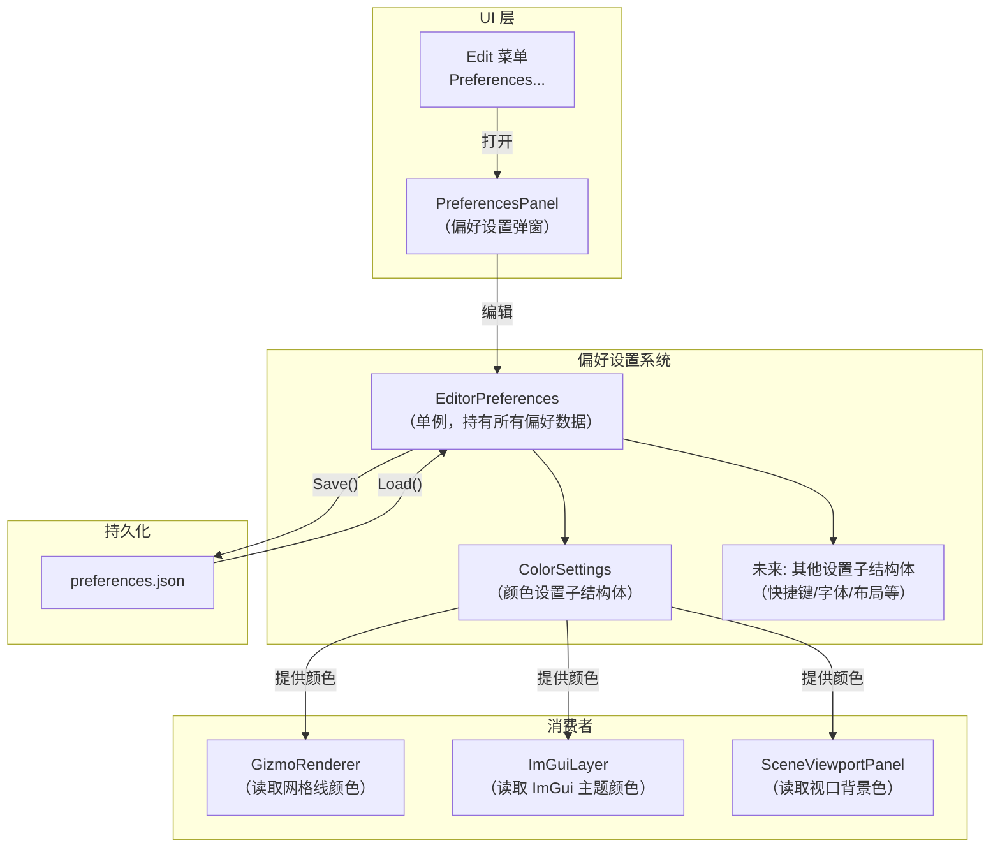

# 编辑器偏好设置与主题颜色系统设计文档

> **文档类型**：详细设计文档（可直接编码实施）  
> **创建日期**：2026-04-21  
> **状态**：规划中  
> **关联文档**：  
> - [ImGui_Encapsulation_Strategy.md](./ImGui_Encapsulation_Strategy.md) ― ImGui 封装策略  
> - [Architecture_Overview.md](../Architecture_Overview.md) ― 项目架构说明  
> - [PhaseR10_Gizmo_Rendering.md](../RenderingSystem/PhaseR10_Gizmo_Rendering.md) ― Gizmo 渲染系统

---

## 目录

- [一、概述](#一概述)
- [二、当前项目颜色硬编码现状](#二当前项目颜色硬编码现状)
- [三、整体架构设计](#三整体架构设计)
- [四、EditorPreferences 单例设计](#四editorpreferences-单例设计)
  - [4.1 存放位置的方案对比](#41-存放位置的方案对比)
  - [4.2 ColorSettings 结构体设计](#42-colorsettings-结构体设计)
  - [4.3 EditorPreferences 类设计](#43-editorpreferences-类设计)
  - [4.4 ApplyImGuiColors 实现](#44-applyimguicolors-实现)
- [五、GizmoRenderer 颜色参数化改造](#五gizmorenderer-颜色参数化改造)
  - [5.1 方案对比：如何让 GizmoRenderer 获取颜色](#51-方案对比如何让-gizmorenderer-获取颜色)
  - [5.2 推荐方案的详细实现](#52-推荐方案的详细实现)
- [六、偏好设置面板设计](#六偏好设置面板设计)
  - [6.1 面板类型的方案对比](#61-面板类型的方案对比)
  - [6.2 面板 UI 布局设计](#62-面板-ui-布局设计)
  - [6.3 面板实现代码](#63-面板实现代码)
- [七、菜单栏集成](#七菜单栏集成)
- [八、颜色数据流](#八颜色数据流)
- [九、序列化方案](#九序列化方案)
  - [9.1 序列化格式的方案对比](#91-序列化格式的方案对比)
  - [9.2 推荐方案的详细实现](#92-推荐方案的详细实现)
  - [9.3 文件路径的方案对比](#93-文件路径的方案对比)
- [十、ImGuiLayer 集成](#十imguilayer-集成)
- [十一、SceneViewportPanel 集成](#十一sceneviewportpanel-集成)
- [十二、构建系统集成](#十二构建系统集成)
- [十三、初始化与生命周期](#十三初始化与生命周期)
- [十四、未来扩展设计](#十四未来扩展设计)
- [十五、实施清单](#十五实施清单)
- [十六、文件变更总览](#十六文件变更总览)

---

## 一、概述

### 1.1 需求背景

当前项目中的颜色值分散在多个文件中，全部是硬编码。以世界坐标系网格线的 XZ 轴颜色为引子，引入一个编辑器偏好设置系统，在菜单栏新增 `Edit → Preferences...`，偏好设置面板中有 `Colors` 选项可以设置编辑器内的各种颜色。

### 1.2 首批功能范围

| 颜色类别 | 具体颜色项 | 当前硬编码位置 |
|----------|-----------|---------------|
| **Gizmo 颜色** | 网格 X 轴颜色 | `GizmoRenderer.cpp` `DrawInfiniteGrid()` |
| **Gizmo 颜色** | 网格 Z 轴颜色 | `GizmoRenderer.cpp` `DrawInfiniteGrid()` |
| **Gizmo 颜色** | 网格线颜色 | `GizmoRenderer.cpp` `DrawInfiniteGrid()` |
| **UI 颜色** | 面板背景色（WindowBg） | ImGui 默认深色主题 |
| **UI 颜色** | 子窗口背景色（ChildBg） | ImGui 默认深色主题 |
| **UI 颜色** | 控件背景色（FrameBg / Hovered / Active） | ImGui 默认深色主题 |
| **UI 颜色** | 按钮颜色（Button / Hovered / Active） | ImGui 默认深色主题 |
| **UI 颜色** | 标题栏颜色（Header / Hovered / Active） | ImGui 默认深色主题 |
| **UI 颜色** | 文字颜色 | ImGui 默认深色主题 |
| **视口颜色** | 视口背景色（ClearColor） | `SceneViewportPanel.cpp` |

### 1.3 设计目标

1. 颜色集中管理，消除硬编码
2. 运行时可修改（偏好设置面板实时调整）
3. 可序列化/反序列化（保存到文件，下次启动恢复）
4. 偏好设置系统可扩展（未来添加快捷键、字体等设置不会耦合）

---

## 二、当前项目颜色硬编码现状

### 2.1 GizmoRenderer.cpp ― DrawInfiniteGrid()

```cpp
// 文件：Lucky/Source/Lucky/Renderer/GizmoRenderer.cpp 第 167-169 行
s_GizmoData.GridShader->SetFloat4("u_AxisXColor", glm::vec4(1.0f, 0.2f, 0.322f, 1.0f));         // X 轴红色
s_GizmoData.GridShader->SetFloat4("u_AxisZColor", glm::vec4(0.157f, 0.565f, 1.0f, 1.0f));       // Z 轴蓝色
s_GizmoData.GridShader->SetFloat4("u_GridColor", glm::vec4(0.329f, 0.329f, 0.329f, 0.502f));    // 网格线灰色
```

这些颜色通过 Shader uniform 传入 `InfiniteGrid.frag`，Shader 中已定义对应的 uniform 变量：

```glsl
// 文件：Luck3DApp/Assets/Shaders/InfiniteGrid.frag
uniform vec4 u_AxisXColor;      // X 轴颜色
uniform vec4 u_AxisZColor;      // Z 轴颜色
uniform vec4 u_GridColor;       // 网格线颜色
```

**关键发现**：Shader 已经支持通过 uniform 接收颜色参数，改造只需要修改 C++ 侧的传入值来源。

### 2.2 ImGuiLayer.cpp ― SetDefaultStyles()

```cpp
// 文件：Lucky/Source/Lucky/ImGui/ImGuiLayer.cpp 第 107-137 行
void ImGuiLayer::SetDefaultStyles()
{
    ImGuiStyle& style = ImGui::GetStyle();
    // 只设置了样式参数（圆角、边框等），没有设置任何颜色
    style.WindowBorderSize = 1.0f;
    style.FrameRounding = 4.0f;
    // ... 等等
}
```

**关键发现**：当前 `SetDefaultStyles()` **只设置了样式参数，没有设置任何颜色**，完全依赖 ImGui 的默认深色主题。

### 2.3 SceneViewportPanel.cpp ― 视口背景色

```cpp
// 文件：Luck3DApp/Source/Panels/SceneViewportPanel.cpp 第 60 行
RenderCommand::SetClearColor({ 0.1f, 0.1f, 0.1f, 1.0f });
```

### 2.4 EditorDockSpace.cpp ― DockSpace 背景色

```cpp
// 文件：Luck3DApp/Source/EditorDockSpace.cpp 第 43 行
static ImVec4 barColor = ImGui::GetStyle().Colors[ImGuiCol_MenuBarBg];
```

从 ImGui 默认主题获取，改为从 EditorPreferences 获取后会自动跟随主题变化。

---

## 三、整体架构设计

### 3.1 架构图



### 3.2 核心设计决策

| 决策 | 选择 | 原因 |
|------|------|------|
| 颜色类型 | `glm::vec4` | 引擎统一类型，ImGui 和 Shader 都能用 |
| 存储方式 | 单例 + 结构体 | 运行时可修改，序列化方便 |
| 与 Hazel 的区别 | 非 `constexpr` | 需要运行时修改和持久化 |
| 偏好设置面板 | 独立弹窗（非 DockSpace 面板） | 参考 Unity/Blender |
| 序列化格式 | YAML（项目已有 yaml-cpp） | 与场景文件格式一致 |

---

## 四、EditorPreferences 单例设计

### 4.1 存放位置的方案对比

EditorPreferences 应该放在引擎层还是编辑器应用层？

#### 方案 A：放在引擎层 `Lucky/Source/Lucky/Editor/`（? 推荐）

```
Lucky/Source/Lucky/Editor/
├── EditorPanel.h/cpp           // 已有
├── PanelManager.h/cpp          // 已有
└── EditorPreferences.h/cpp     // 新增
```

**优点**：
- 与 `PanelManager`、`EditorPanel` 同级，引擎层已有 `Editor` 目录
- `GizmoRenderer`（引擎层）可以直接访问，不需要跨层传参
- `ImGuiLayer`（引擎层）可以直接访问

**缺点**：
- 引擎层包含编辑器概念（但当前已有 `Editor` 目录，说明项目已接受这一设计）

#### 方案 B：放在编辑器应用层 `Luck3DApp/Source/`

```
Luck3DApp/Source/
├── EditorLayer.h/cpp           // 已有
└── EditorPreferences.h/cpp     // 新增
```

**优点**：
- 编辑器概念不侵入引擎层

**缺点**：
- `GizmoRenderer`（引擎层）无法直接访问，需要通过参数传入或回调
- `ImGuiLayer`（引擎层）无法直接访问

#### 方案 C：参数传入模式（不使用单例）

`DrawInfiniteGrid` 接受颜色参数，由调用者从 EditorPreferences 读取后传入。

**优点**：
- 完全解耦，不破坏层级依赖

**缺点**：
- 参数列表变长，每个消费者都需要手动传参
- `ImGuiLayer::SetDefaultStyles()` 仍然需要访问颜色数据

#### 推荐：方案 A

理由：当前项目的 `Lucky/Source/Lucky/Editor/` 已经存在 `PanelManager` 和 `EditorPanel`，说明引擎层本身就包含编辑器基础设施。`EditorPreferences` 与它们同级是自然的。

### 4.2 ColorSettings 结构体设计

```cpp
// 文件：Lucky/Source/Lucky/Editor/EditorPreferences.h

#pragma once

#include <glm/glm.hpp>
#include <string>

namespace Lucky
{
    /// <summary>
    /// 颜色设置：编辑器中所有可配置的颜色
    /// </summary>
    struct ColorSettings
    {
        // ---- Gizmo 颜色 ----
        glm::vec4 GridAxisXColor  = { 1.0f, 0.2f, 0.322f, 1.0f };       // 网格 X 轴（红色）
        glm::vec4 GridAxisZColor  = { 0.157f, 0.565f, 1.0f, 1.0f };     // 网格 Z 轴（蓝色）
        glm::vec4 GridLineColor   = { 0.329f, 0.329f, 0.329f, 0.502f }; // 网格线（灰色半透明）
        
        // ---- 视口颜色 ----
        glm::vec4 ViewportClearColor = { 0.1f, 0.1f, 0.1f, 1.0f };     // 视口背景色
        
        // ---- ImGui UI 颜色 ----
        glm::vec4 WindowBackground       = { 0.1f, 0.105f, 0.11f, 1.0f };
        glm::vec4 ChildBackground        = { 0.14f, 0.14f, 0.14f, 1.0f };
        
        glm::vec4 FrameBackground        = { 0.2f, 0.205f, 0.21f, 1.0f };
        glm::vec4 FrameBackgroundHovered = { 0.3f, 0.305f, 0.31f, 1.0f };
        glm::vec4 FrameBackgroundActive  = { 0.15f, 0.1505f, 0.151f, 1.0f };
        
        glm::vec4 ButtonColor            = { 0.2f, 0.205f, 0.21f, 1.0f };
        glm::vec4 ButtonHovered          = { 0.3f, 0.305f, 0.31f, 1.0f };
        glm::vec4 ButtonActive           = { 0.15f, 0.1505f, 0.151f, 1.0f };
        
        glm::vec4 HeaderColor            = { 0.2f, 0.205f, 0.21f, 1.0f };
        glm::vec4 HeaderHovered          = { 0.3f, 0.305f, 0.31f, 1.0f };
        glm::vec4 HeaderActive           = { 0.15f, 0.1505f, 0.151f, 1.0f };
        
        glm::vec4 TitleBarBackground     = { 0.15f, 0.1505f, 0.151f, 1.0f };
        
        glm::vec4 TabColor               = { 0.15f, 0.1505f, 0.151f, 1.0f };
        glm::vec4 TabHovered             = { 0.38f, 0.3805f, 0.381f, 1.0f };
        glm::vec4 TabActive              = { 0.28f, 0.2805f, 0.281f, 1.0f };
        
        glm::vec4 TextColor              = { 1.0f, 1.0f, 1.0f, 1.0f };
        glm::vec4 TextDisabledColor      = { 0.5f, 0.5f, 0.5f, 1.0f };
        
        glm::vec4 SeparatorColor         = { 0.14f, 0.14f, 0.14f, 1.0f };
        
        glm::vec4 ScrollbarBackground    = { 0.02f, 0.02f, 0.02f, 0.53f };
        glm::vec4 ScrollbarGrab          = { 0.31f, 0.31f, 0.31f, 1.0f };
        glm::vec4 ScrollbarGrabHovered   = { 0.41f, 0.41f, 0.41f, 1.0f };
        glm::vec4 ScrollbarGrabActive    = { 0.51f, 0.51f, 0.51f, 1.0f };
    };
}
```

**设计说明**：
- 所有颜色使用 `glm::vec4`（RGBA），与引擎其他模块一致
- 默认值参考 Hazel 的 `SetDarkThemeColors()` 和 `SetDarkThemeV2Colors()`
- Gizmo 颜色的默认值与当前 `GizmoRenderer.cpp` 中的硬编码值完全一致
- 每个字段都有中文注释说明用途

### 4.3 EditorPreferences 类设计

```cpp
// 文件：Lucky/Source/Lucky/Editor/EditorPreferences.h（续）

namespace Lucky
{
    /// <summary>
    /// 编辑器偏好设置：全局单例，管理所有编辑器配置
    /// </summary>
    class EditorPreferences
    {
    public:
        /// <summary>
        /// 获取单例实例
        /// </summary>
        static EditorPreferences& Get();
        
        /// <summary>
        /// 获取颜色设置（可修改）
        /// </summary>
        ColorSettings& GetColors() { return m_Colors; }
        
        /// <summary>
        /// 获取颜色设置（只读）
        /// </summary>
        const ColorSettings& GetColors() const { return m_Colors; }
        
        /// <summary>
        /// 将颜色设置应用到 ImGui 主题
        /// </summary>
        void ApplyImGuiColors();
        
        /// <summary>
        /// 重置颜色为默认值
        /// </summary>
        void ResetColorsToDefault();
        
        /// <summary>
        /// 保存偏好设置到文件
        /// </summary>
        /// <param name="filepath">文件路径（默认 "preferences.yaml"）</param>
        void Save(const std::string& filepath = "preferences.yaml");
        
        /// <summary>
        /// 从文件加载偏好设置
        /// </summary>
        /// <param name="filepath">文件路径（默认 "preferences.yaml"）</param>
        /// <returns>是否加载成功</returns>
        bool Load(const std::string& filepath = "preferences.yaml");
        
    private:
        EditorPreferences() = default;
        ~EditorPreferences() = default;
        
        // 禁止拷贝和移动
        EditorPreferences(const EditorPreferences&) = delete;
        EditorPreferences& operator=(const EditorPreferences&) = delete;
        
    private:
        ColorSettings m_Colors;     // 颜色设置
        
        // 未来扩展：
        // KeyBindingSettings m_KeyBindings;
        // FontSettings m_Fonts;
        // LayoutSettings m_Layout;
    };
}
```

**实现文件**：

```cpp
// 文件：Lucky/Source/Lucky/Editor/EditorPreferences.cpp

#include "lcpch.h"
#include "EditorPreferences.h"

#include <imgui/imgui.h>

namespace Lucky
{
    EditorPreferences& EditorPreferences::Get()
    {
        static EditorPreferences instance;
        return instance;
    }
    
    void EditorPreferences::ResetColorsToDefault()
    {
        m_Colors = ColorSettings();  // 使用默认构造（所有字段回到默认值）
    }
    
    void EditorPreferences::ApplyImGuiColors()
    {
        // 见 4.4 节详细实现
    }
    
    void EditorPreferences::Save(const std::string& filepath)
    {
        // 见第九章序列化方案
    }
    
    bool EditorPreferences::Load(const std::string& filepath)
    {
        // 见第九章序列化方案
    }
}
```

### 4.4 ApplyImGuiColors 实现

此函数将 `ColorSettings` 中的颜色映射到 ImGui 的 `ImGuiCol_*` 枚举。

**glm::vec4 → ImVec4 转换**：两者内存布局完全一致（4 个连续 float），可以直接 reinterpret_cast 或逐字段赋值。

#### 方案 A：逐字段赋值（? 推荐，最安全）

```cpp
void EditorPreferences::ApplyImGuiColors()
{
    auto& colors = ImGui::GetStyle().Colors;
    const auto& c = m_Colors;
    
    // 辅助 lambda：glm::vec4 → ImVec4
    auto ToImVec4 = [](const glm::vec4& v) -> ImVec4 {
        return ImVec4(v.r, v.g, v.b, v.a);
    };
    
    // ---- 窗口背景 ----
    colors[ImGuiCol_WindowBg]           = ToImVec4(c.WindowBackground);
    colors[ImGuiCol_ChildBg]            = ToImVec4(c.ChildBackground);
    
    // ---- 控件背景 ----
    colors[ImGuiCol_FrameBg]            = ToImVec4(c.FrameBackground);
    colors[ImGuiCol_FrameBgHovered]     = ToImVec4(c.FrameBackgroundHovered);
    colors[ImGuiCol_FrameBgActive]      = ToImVec4(c.FrameBackgroundActive);
    
    // ---- 按钮 ----
    colors[ImGuiCol_Button]             = ToImVec4(c.ButtonColor);
    colors[ImGuiCol_ButtonHovered]      = ToImVec4(c.ButtonHovered);
    colors[ImGuiCol_ButtonActive]       = ToImVec4(c.ButtonActive);
    
    // ---- 标题/组件头 ----
    colors[ImGuiCol_Header]             = ToImVec4(c.HeaderColor);
    colors[ImGuiCol_HeaderHovered]      = ToImVec4(c.HeaderHovered);
    colors[ImGuiCol_HeaderActive]       = ToImVec4(c.HeaderActive);
    
    // ---- 标题栏 ----
    colors[ImGuiCol_TitleBg]            = ToImVec4(c.TitleBarBackground);
    colors[ImGuiCol_TitleBgActive]      = ToImVec4(c.TitleBarBackground);
    colors[ImGuiCol_TitleBgCollapsed]   = ToImVec4(c.TitleBarBackground);
    
    // ---- Tab ----
    colors[ImGuiCol_Tab]                = ToImVec4(c.TabColor);
    colors[ImGuiCol_TabHovered]         = ToImVec4(c.TabHovered);
    colors[ImGuiCol_TabActive]          = ToImVec4(c.TabActive);
    colors[ImGuiCol_TabUnfocused]       = ToImVec4(c.TabColor);
    colors[ImGuiCol_TabUnfocusedActive] = ToImVec4(c.TabActive);
    
    // ---- 文字 ----
    colors[ImGuiCol_Text]               = ToImVec4(c.TextColor);
    colors[ImGuiCol_TextDisabled]       = ToImVec4(c.TextDisabledColor);
    
    // ---- 分隔线 ----
    colors[ImGuiCol_Separator]          = ToImVec4(c.SeparatorColor);
    colors[ImGuiCol_SeparatorHovered]   = ToImVec4(c.SeparatorColor);
    colors[ImGuiCol_SeparatorActive]    = ToImVec4(c.SeparatorColor);
    
    // ---- 滚动条 ----
    colors[ImGuiCol_ScrollbarBg]        = ToImVec4(c.ScrollbarBackground);
    colors[ImGuiCol_ScrollbarGrab]      = ToImVec4(c.ScrollbarGrab);
    colors[ImGuiCol_ScrollbarGrabHovered] = ToImVec4(c.ScrollbarGrabHovered);
    colors[ImGuiCol_ScrollbarGrabActive]  = ToImVec4(c.ScrollbarGrabActive);
}
```

#### 方案 B：使用 reinterpret_cast（更简洁但不够安全）

```cpp
// glm::vec4 和 ImVec4 内存布局一致，可以直接转换
colors[ImGuiCol_WindowBg] = *reinterpret_cast<const ImVec4*>(&c.WindowBackground);
```

**不推荐**：虽然 `glm::vec4` 和 `ImVec4` 内存布局一致，但依赖实现细节，不够安全。

**推荐方案 A**，使用辅助 lambda 逐字段赋值。

---

## 五、GizmoRenderer 颜色参数化改造

### 5.1 方案对比：如何让 GizmoRenderer 获取颜色

#### 方案 A：直接从 EditorPreferences 读取（? 推荐）

```cpp
// GizmoRenderer.cpp
void GizmoRenderer::DrawInfiniteGrid(const EditorCamera& camera)
{
    const auto& colors = EditorPreferences::Get().GetColors();
    
    s_GizmoData.GridShader->SetFloat4("u_AxisXColor", colors.GridAxisXColor);
    s_GizmoData.GridShader->SetFloat4("u_AxisZColor", colors.GridAxisZColor);
    s_GizmoData.GridShader->SetFloat4("u_GridColor", colors.GridLineColor);
    // ... 其余不变
}
```

**优点**：
- 代码最简洁，改动最小（只改 3 行）
- `GizmoRenderer` 和 `EditorPreferences` 都在引擎层，无跨层依赖

**缺点**：
- `GizmoRenderer` 依赖 `EditorPreferences`（但两者都在引擎层 `Lucky/` 下）

#### 方案 B：修改 DrawInfiniteGrid 签名，参数传入

```cpp
// GizmoRenderer.h
struct InfiniteGridSettings
{
    glm::vec4 AxisXColor = { 1.0f, 0.2f, 0.322f, 1.0f };
    glm::vec4 AxisZColor = { 0.157f, 0.565f, 1.0f, 1.0f };
    glm::vec4 GridColor  = { 0.329f, 0.329f, 0.329f, 0.502f };
    float CellSize       = 1.0f;
    float MinPixels      = 1.0f;
    float FadeDistance    = 100.0f;
};

static void DrawInfiniteGrid(const EditorCamera& camera, const InfiniteGridSettings& settings = {});
```

调用处：

```cpp
// SceneViewportPanel.cpp
InfiniteGridSettings gridSettings;
gridSettings.AxisXColor = EditorPreferences::Get().GetColors().GridAxisXColor;
gridSettings.AxisZColor = EditorPreferences::Get().GetColors().GridAxisZColor;
gridSettings.GridColor  = EditorPreferences::Get().GetColors().GridLineColor;
GizmoRenderer::DrawInfiniteGrid(m_EditorCamera, gridSettings);
```

**优点**：
- `GizmoRenderer` 完全不依赖 `EditorPreferences`，纯数据驱动
- 更灵活，调用者可以传入任意颜色

**缺点**：
- 调用处代码变长
- 每个调用者都需要手动从 EditorPreferences 读取并传入
- `InfiniteGridSettings` 结构体与 `ColorSettings` 中的字段重复

#### 方案 C：回调/函数指针

```cpp
// GizmoRenderer.h
using ColorProviderFn = std::function<glm::vec4(const std::string& colorName)>;
static void SetColorProvider(ColorProviderFn provider);
```

**优点**：完全解耦

**缺点**：过度设计，增加复杂度

#### 推荐：方案 A（最优）、方案 B（其次）

**方案 A 最优**的理由：
- `GizmoRenderer` 位于 `Lucky/Source/Lucky/Renderer/`，`EditorPreferences` 位于 `Lucky/Source/Lucky/Editor/`，两者都在引擎库内部，不存在跨库依赖
- 代码最简洁，改动最小
- 当前项目的 `Editor` 目录已经被引擎层的其他模块引用（如 `PanelManager` 被 `Luck3DApp` 使用），说明项目已接受引擎层包含编辑器基础设施

**方案 B 其次**的理由：
- 如果未来需要将 `GizmoRenderer` 用于非编辑器场景（如运行时渲染），参数传入模式更灵活
- 但当前阶段 `GizmoRenderer` 仅在编辑器中使用，方案 A 足够

### 5.2 推荐方案的详细实现

**修改 GizmoRenderer.cpp**（方案 A）：

```cpp
// 文件：Lucky/Source/Lucky/Renderer/GizmoRenderer.cpp
// 新增 include
#include "Lucky/Editor/EditorPreferences.h"

// 修改 DrawInfiniteGrid 函数体（仅修改 3 行）
void GizmoRenderer::DrawInfiniteGrid(const EditorCamera& camera)
{
    glm::mat4 vpMatrix = camera.GetViewProjectionMatrix();
    glm::mat4 inverseVP = glm::inverse(vpMatrix);
    
    s_GizmoData.GridShader->Bind();
    s_GizmoData.GridShader->SetMat4("u_InverseVP", inverseVP);
    
    s_GizmoData.GridShader->SetFloat("u_GridCellSize", 1.0f);
    s_GizmoData.GridShader->SetFloat("u_GridMinPixels", 1.0f);
    s_GizmoData.GridShader->SetFloat("u_GridFadeDistance", 100.0f);
    
    // 从 EditorPreferences 读取颜色（替代硬编码）
    const auto& colors = EditorPreferences::Get().GetColors();
    s_GizmoData.GridShader->SetFloat4("u_AxisXColor", colors.GridAxisXColor);
    s_GizmoData.GridShader->SetFloat4("u_AxisZColor", colors.GridAxisZColor);
    s_GizmoData.GridShader->SetFloat4("u_GridColor", colors.GridLineColor);
    
    RenderCommand::DrawArrays(s_GizmoData.GridVertexArray, 6);
}
```

**如果选择方案 B**，则 `GizmoRenderer.h` 和 `.cpp` 的修改如下：

```cpp
// GizmoRenderer.h ― 新增结构体和修改签名
struct InfiniteGridSettings
{
    glm::vec4 AxisXColor  = { 1.0f, 0.2f, 0.322f, 1.0f };
    glm::vec4 AxisZColor  = { 0.157f, 0.565f, 1.0f, 1.0f };
    glm::vec4 GridColor   = { 0.329f, 0.329f, 0.329f, 0.502f };
    float CellSize        = 1.0f;
    float MinPixels       = 1.0f;
    float FadeDistance     = 100.0f;
};

static void DrawInfiniteGrid(const EditorCamera& camera, const InfiniteGridSettings& settings = {});

// GizmoRenderer.cpp ― 使用 settings 参数
void GizmoRenderer::DrawInfiniteGrid(const EditorCamera& camera, const InfiniteGridSettings& settings)
{
    // ... 省略不变的代码 ...
    
    s_GizmoData.GridShader->SetFloat("u_GridCellSize", settings.CellSize);
    s_GizmoData.GridShader->SetFloat("u_GridMinPixels", settings.MinPixels);
    s_GizmoData.GridShader->SetFloat("u_GridFadeDistance", settings.FadeDistance);
    
    s_GizmoData.GridShader->SetFloat4("u_AxisXColor", settings.AxisXColor);
    s_GizmoData.GridShader->SetFloat4("u_AxisZColor", settings.AxisZColor);
    s_GizmoData.GridShader->SetFloat4("u_GridColor", settings.GridColor);
    
    RenderCommand::DrawArrays(s_GizmoData.GridVertexArray, 6);
}

// SceneViewportPanel.cpp ― 调用处
const auto& colors = EditorPreferences::Get().GetColors();
InfiniteGridSettings gridSettings;
gridSettings.AxisXColor = colors.GridAxisXColor;
gridSettings.AxisZColor = colors.GridAxisZColor;
gridSettings.GridColor  = colors.GridLineColor;
GizmoRenderer::DrawInfiniteGrid(m_EditorCamera, gridSettings);
```

---

## 六、偏好设置面板设计

### 6.1 面板类型的方案对比

#### 方案 A：独立弹窗，不走 PanelManager（? 推荐）

在 `EditorLayer` 中用 `bool m_ShowPreferences` 控制显示，在 `OnImGuiRender()` 中用 `ImGui::Begin()` 绘制独立窗口。

```cpp
// EditorLayer.h
bool m_ShowPreferences = false;

// EditorLayer.cpp ― OnImGuiRender()
if (m_ShowPreferences)
{
    UI_DrawPreferencesPanel(&m_ShowPreferences);
}
```

**优点**：
- 参考 Unity/Blender，偏好设置是独立窗口
- 不需要常驻在 DockSpace 中
- 实现简单，不需要创建新的 EditorPanel 子类

**缺点**：
- 绘制逻辑直接写在 `EditorLayer` 中（可以提取为独立函数或类）

#### 方案 B：走 PanelManager，作为可停靠面板

```cpp
m_PanelManager->AddPanel<PreferencesPanel>("Preferences", "Preferences", false);
```

**优点**：
- 与其他面板统一管理
- 可以停靠在 DockSpace 中

**缺点**：
- 偏好设置不应该常驻，用完即关
- 需要创建新的 `PreferencesPanel` 类

#### 方案 C：独立弹窗 + 独立类（?? 最优）

创建一个 `PreferencesPanel` 类，但不走 `PanelManager`，由 `EditorLayer` 直接持有和调用。

```cpp
// EditorLayer.h
#include "Panels/PreferencesPanel.h"
PreferencesPanel m_PreferencesPanel;

// EditorLayer.cpp ― OnImGuiRender()
m_PreferencesPanel.OnImGuiRender();
```

**优点**：
- 绘制逻辑独立封装，不污染 `EditorLayer`
- 不走 PanelManager，保持独立弹窗语义
- 代码组织清晰

**缺点**：
- 需要创建新文件

#### 推荐：方案 C（最优）、方案 A（其次）

**方案 C 最优**：代码组织最清晰，绘制逻辑独立封装。
**方案 A 其次**：如果不想创建新文件，可以直接在 `EditorLayer` 中写一个 `UI_DrawPreferencesPanel()` 函数。

### 6.2 面板 UI 布局设计

```
┌─────────────────────────────────────────────────────────────┐
│  Preferences                                            [X] │
├──────────────┬──────────────────────────────────────────────┤
│              │                                              │
│  ? Colors    │  �� Gizmo Colors                              │
│              │    Grid X Axis    [■ 颜色选择器]              │
│  (未来)      │    Grid Z Axis    [■ 颜色选择器]              │
│  ? General   │    Grid Lines     [■ 颜色选择器]              │
│  ? Keys      │                                              │
│  ...         │  �� Viewport                                  │
│              │    Clear Color    [■ 颜色选择器]              │
│              │                                              │
│              │  �� UI Colors                                 │
│              │    Window Bg      [■ 颜色选择器]              │
│              │    Child Bg       [■ 颜色选择器]              │
│              │    Frame Bg       [■ 颜色选择器]              │
│              │    Frame Hovered  [■ 颜色选择器]              │
│              │    Frame Active   [■ 颜色选择器]              │
│              │    Button         [■ 颜色选择器]              │
│              │    Button Hovered [■ 颜色选择器]              │
│              │    Button Active  [■ 颜色选择器]              │
│              │    Header         [■ 颜色选择器]              │
│              │    Header Hovered [■ 颜色选择器]              │
│              │    Header Active  [■ 颜色选择器]              │
│              │    Title Bar      [■ 颜色选择器]              │
│              │    Tab            [■ 颜色选择器]              │
│              │    Tab Hovered    [■ 颜色选择器]              │
│              │    Tab Active     [■ 颜色选择器]              │
│              │    Text           [■ 颜色选择器]              │
│              │    Text Disabled  [■ 颜色选择器]              │
│              │    Separator      [■ 颜色选择器]              │
│              │    Scrollbar Bg   [■ 颜色选择器]              │
│              │    Scrollbar Grab [■ 颜色选择器]              │
│              │                                              │
│              │  [Reset to Default]    [Save]                │
└──────────────┴──────────────────────────────────────────────┘
```

左侧是**分类列表**（目前只有 Colors，未来可扩展），右侧是对应分类的设置项。

### 6.3 面板实现代码

#### 方案 C 的实现（独立类）

```cpp
// 文件：Luck3DApp/Source/Panels/PreferencesPanel.h

#pragma once

namespace Lucky
{
    /// <summary>
    /// 偏好设置面板：独立弹窗，不走 PanelManager
    /// </summary>
    class PreferencesPanel
    {
    public:
        PreferencesPanel() = default;
        
        /// <summary>
        /// 渲染偏好设置面板
        /// </summary>
        void OnImGuiRender();
        
        /// <summary>
        /// 打开偏好设置面板
        /// </summary>
        void Open() { m_IsOpen = true; }
        
        /// <summary>
        /// 面板是否打开
        /// </summary>
        bool IsOpen() const { return m_IsOpen; }
        
    private:
        /// <summary>
        /// 绘制颜色设置页
        /// </summary>
        void DrawColorsPage();
        
    private:
        bool m_IsOpen = false;
        
        /// <summary>
        /// 当前选中的分类索引（0 = Colors）
        /// </summary>
        int m_SelectedCategory = 0;
    };
}
```

```cpp
// 文件：Luck3DApp/Source/Panels/PreferencesPanel.cpp

#include "PreferencesPanel.h"

#include "Lucky/Editor/EditorPreferences.h"

#include <imgui/imgui.h>
#include <glm/gtc/type_ptr.hpp>

namespace Lucky
{
    void PreferencesPanel::OnImGuiRender()
    {
        if (!m_IsOpen)
        {
            return;
        }
        
        ImGui::SetNextWindowSize(ImVec2(720, 560), ImGuiCond_FirstUseEver);
        
        if (ImGui::Begin("Preferences", &m_IsOpen))
        {
            // ---- 左侧分类列表 ----
            ImGui::BeginChild("Categories", ImVec2(150, 0), true);
            {
                if (ImGui::Selectable("Colors", m_SelectedCategory == 0))
                {
                    m_SelectedCategory = 0;
                }
                
                // 未来扩展：
                // if (ImGui::Selectable("General", m_SelectedCategory == 1))
                //     m_SelectedCategory = 1;
                // if (ImGui::Selectable("Keys", m_SelectedCategory == 2))
                //     m_SelectedCategory = 2;
            }
            ImGui::EndChild();
            
            ImGui::SameLine();
            
            // ---- 右侧设置内容 ----
            ImGui::BeginChild("Content", ImVec2(0, 0), false);
            {
                switch (m_SelectedCategory)
                {
                case 0:
                    DrawColorsPage();
                    break;
                }
            }
            ImGui::EndChild();
        }
        ImGui::End();
    }
    
    void PreferencesPanel::DrawColorsPage()
    {
        auto& colors = EditorPreferences::Get().GetColors();
        bool changed = false;
        
        // ---- Gizmo 颜色 ----
        if (ImGui::CollapsingHeader("Gizmo Colors", ImGuiTreeNodeFlags_DefaultOpen))
        {
            changed |= ImGui::ColorEdit4("Grid X Axis", glm::value_ptr(colors.GridAxisXColor));
            changed |= ImGui::ColorEdit4("Grid Z Axis", glm::value_ptr(colors.GridAxisZColor));
            changed |= ImGui::ColorEdit4("Grid Lines", glm::value_ptr(colors.GridLineColor));
        }
        
        // ---- 视口颜色 ----
        if (ImGui::CollapsingHeader("Viewport", ImGuiTreeNodeFlags_DefaultOpen))
        {
            changed |= ImGui::ColorEdit4("Clear Color", glm::value_ptr(colors.ViewportClearColor));
        }
        
        // ---- UI 颜色 ----
        if (ImGui::CollapsingHeader("UI Colors", ImGuiTreeNodeFlags_DefaultOpen))
        {
            changed |= ImGui::ColorEdit4("Window Bg", glm::value_ptr(colors.WindowBackground));
            changed |= ImGui::ColorEdit4("Child Bg", glm::value_ptr(colors.ChildBackground));
            
            ImGui::Separator();
            
            changed |= ImGui::ColorEdit4("Frame Bg", glm::value_ptr(colors.FrameBackground));
            changed |= ImGui::ColorEdit4("Frame Hovered", glm::value_ptr(colors.FrameBackgroundHovered));
            changed |= ImGui::ColorEdit4("Frame Active", glm::value_ptr(colors.FrameBackgroundActive));
            
            ImGui::Separator();
            
            changed |= ImGui::ColorEdit4("Button", glm::value_ptr(colors.ButtonColor));
            changed |= ImGui::ColorEdit4("Button Hovered", glm::value_ptr(colors.ButtonHovered));
            changed |= ImGui::ColorEdit4("Button Active", glm::value_ptr(colors.ButtonActive));
            
            ImGui::Separator();
            
            changed |= ImGui::ColorEdit4("Header", glm::value_ptr(colors.HeaderColor));
            changed |= ImGui::ColorEdit4("Header Hovered", glm::value_ptr(colors.HeaderHovered));
            changed |= ImGui::ColorEdit4("Header Active", glm::value_ptr(colors.HeaderActive));
            
            ImGui::Separator();
            
            changed |= ImGui::ColorEdit4("Title Bar", glm::value_ptr(colors.TitleBarBackground));
            
            ImGui::Separator();
            
            changed |= ImGui::ColorEdit4("Tab", glm::value_ptr(colors.TabColor));
            changed |= ImGui::ColorEdit4("Tab Hovered", glm::value_ptr(colors.TabHovered));
            changed |= ImGui::ColorEdit4("Tab Active", glm::value_ptr(colors.TabActive));
            
            ImGui::Separator();
            
            changed |= ImGui::ColorEdit4("Text", glm::value_ptr(colors.TextColor));
            changed |= ImGui::ColorEdit4("Text Disabled", glm::value_ptr(colors.TextDisabledColor));
            
            ImGui::Separator();
            
            changed |= ImGui::ColorEdit4("Separator", glm::value_ptr(colors.SeparatorColor));
            
            ImGui::Separator();
            
            changed |= ImGui::ColorEdit4("Scrollbar Bg", glm::value_ptr(colors.ScrollbarBackground));
            changed |= ImGui::ColorEdit4("Scrollbar Grab", glm::value_ptr(colors.ScrollbarGrab));
            changed |= ImGui::ColorEdit4("Scrollbar Grab Hovered", glm::value_ptr(colors.ScrollbarGrabHovered));
            changed |= ImGui::ColorEdit4("Scrollbar Grab Active", glm::value_ptr(colors.ScrollbarGrabActive));
        }
        
        // 颜色改变时立即应用到 ImGui 主题
        if (changed)
        {
            EditorPreferences::Get().ApplyImGuiColors();
        }
        
        ImGui::Spacing();
        ImGui::Separator();
        ImGui::Spacing();
        
        // ---- 底部按钮 ----
        if (ImGui::Button("Reset to Default"))
        {
            EditorPreferences::Get().ResetColorsToDefault();
            EditorPreferences::Get().ApplyImGuiColors();
        }
        
        ImGui::SameLine();
        
        if (ImGui::Button("Save"))
        {
            EditorPreferences::Get().Save();
        }
    }
}
```

#### 方案 A 的实现（直接在 EditorLayer 中）

如果不想创建新文件，可以在 `EditorLayer` 中添加：

```cpp
// EditorLayer.h ― 新增成员
bool m_ShowPreferences = false;

// EditorLayer.cpp ― 新增方法
void EditorLayer::UI_DrawPreferencesPanel()
{
    // 与方案 C 的 PreferencesPanel::OnImGuiRender() 内容相同
    // 只是直接写在 EditorLayer 中
}
```

---

## 七、菜单栏集成

在 `EditorLayer::UI_DrawMenuBar()` 中新增 `Edit` 菜单：

```cpp
void EditorLayer::UI_DrawMenuBar()
{
    if (ImGui::BeginMainMenuBar())
    {
        // File 菜单（已有，不变）
        if (ImGui::BeginMenu("File"))
        {
            // ... 已有内容不变 ...
            ImGui::EndMenu();
        }
        
        // Edit 菜单（新增）
        if (ImGui::BeginMenu("Edit"))
        {
            if (ImGui::MenuItem("Preferences..."))
            {
                m_PreferencesPanel.Open();  // 方案 C
                // 或 m_ShowPreferences = true;  // 方案 A
            }
            ImGui::EndMenu();
        }

        // Window 菜单（已有，不变）
        if (ImGui::BeginMenu("Window"))
        {
            // ... 已有内容不变 ...
            ImGui::EndMenu();
        }

        // Help 菜单（已有，不变）
        if (ImGui::BeginMenu("Help"))
        {
            // ... 已有内容不变 ...
            ImGui::EndMenu();
        }

        ImGui::EndMainMenuBar();
    }
}
```

**菜单顺序**：`File | Edit | Window | Help`，与 Unity/Blender 一致。

---

## 八、颜色数据流

### 8.1 启动时

```
Application::Run()
  → EditorLayer::OnAttach()
      → EditorPreferences::Get().Load("preferences.yaml")   // 尝试加载配置文件
      → EditorPreferences::Get().ApplyImGuiColors()          // 应用颜色到 ImGui 主题
```

### 8.2 运行时（偏好设置面板修改颜色）

```
用户在 PreferencesPanel 中修改颜色
  → ImGui::ColorEdit4() 直接修改 ColorSettings 中的 glm::vec4 字段
  → changed = true
  → EditorPreferences::Get().ApplyImGuiColors()  // 立即同步到 ImGui 主题
  
下一帧渲染时：
  → GizmoRenderer::DrawInfiniteGrid()
      → 从 EditorPreferences::Get().GetColors() 读取网格线颜色
      → 通过 Shader uniform 传入 GPU
  → ImGui 使用更新后的主题颜色渲染所有面板
  → SceneViewportPanel::OnUpdate()
      → 从 EditorPreferences::Get().GetColors() 读取视口背景色
      → RenderCommand::SetClearColor(colors.ViewportClearColor)
```

### 8.3 保存/加载

```
用户点击 "Save" 按钮
  → EditorPreferences::Get().Save("preferences.yaml")
      → 将 ColorSettings 序列化为 YAML 文件

下次启动时
  → EditorPreferences::Get().Load("preferences.yaml")
      → 从 YAML 文件反序列化到 ColorSettings
  → EditorPreferences::Get().ApplyImGuiColors()
```

---

## 九、序列化方案

### 9.1 序列化格式的方案对比

#### 方案 A：YAML 格式（? 推荐）

```yaml
# preferences.yaml
Colors:
  Gizmo:
    GridAxisXColor: [1.0, 0.2, 0.322, 1.0]
    GridAxisZColor: [0.157, 0.565, 1.0, 1.0]
    GridLineColor: [0.329, 0.329, 0.329, 0.502]
  Viewport:
    ClearColor: [0.1, 0.1, 0.1, 1.0]
  UI:
    WindowBackground: [0.1, 0.105, 0.11, 1.0]
    ChildBackground: [0.14, 0.14, 0.14, 1.0]
    FrameBackground: [0.2, 0.205, 0.21, 1.0]
    # ... 其他颜色 ...
```

**优点**：
- 项目已有 yaml-cpp 依赖，无需引入新库
- 与场景文件（`.luck3d`）格式一致
- 人类可读，Git 友好
- 项目已有 `YamlHelpers.h` 提供 vec4 等类型的序列化辅助函数

**缺点**：
- yaml-cpp 解析速度比 JSON 稍慢（但偏好设置文件很小，可忽略）

#### 方案 B：JSON 格式

```json
{
    "colors": {
        "gizmo": {
            "gridAxisX": [1.0, 0.2, 0.322, 1.0],
            "gridAxisZ": [0.157, 0.565, 1.0, 1.0]
        }
    }
}
```

**优点**：
- 格式通用

**缺点**：
- 项目没有 JSON 库（需要引入 nlohmann/json 或类似库）
- 与项目已有的 YAML 序列化风格不一致

#### 方案 C：INI 格式

**优点**：极简

**缺点**：不支持嵌套结构，不适合颜色数组

#### 推荐：方案 A（YAML）

理由：项目已有 yaml-cpp 和 `YamlHelpers.h`，零额外依赖，与场景序列化风格一致。

### 9.2 推荐方案的详细实现

```cpp
// 文件：Lucky/Source/Lucky/Editor/EditorPreferences.cpp

#include <yaml-cpp/yaml.h>
#include "Lucky/Serialization/YamlHelpers.h"

void EditorPreferences::Save(const std::string& filepath)
{
    YAML::Emitter out;
    out << YAML::BeginMap;
    
    out << YAML::Key << "Colors" << YAML::Value << YAML::BeginMap;
    {
        // Gizmo
        out << YAML::Key << "Gizmo" << YAML::Value << YAML::BeginMap;
        out << YAML::Key << "GridAxisXColor" << YAML::Value << m_Colors.GridAxisXColor;
        out << YAML::Key << "GridAxisZColor" << YAML::Value << m_Colors.GridAxisZColor;
        out << YAML::Key << "GridLineColor" << YAML::Value << m_Colors.GridLineColor;
        out << YAML::EndMap;
        
        // Viewport
        out << YAML::Key << "Viewport" << YAML::Value << YAML::BeginMap;
        out << YAML::Key << "ClearColor" << YAML::Value << m_Colors.ViewportClearColor;
        out << YAML::EndMap;
        
        // UI
        out << YAML::Key << "UI" << YAML::Value << YAML::BeginMap;
        out << YAML::Key << "WindowBackground" << YAML::Value << m_Colors.WindowBackground;
        out << YAML::Key << "ChildBackground" << YAML::Value << m_Colors.ChildBackground;
        out << YAML::Key << "FrameBackground" << YAML::Value << m_Colors.FrameBackground;
        out << YAML::Key << "FrameBackgroundHovered" << YAML::Value << m_Colors.FrameBackgroundHovered;
        out << YAML::Key << "FrameBackgroundActive" << YAML::Value << m_Colors.FrameBackgroundActive;
        out << YAML::Key << "ButtonColor" << YAML::Value << m_Colors.ButtonColor;
        out << YAML::Key << "ButtonHovered" << YAML::Value << m_Colors.ButtonHovered;
        out << YAML::Key << "ButtonActive" << YAML::Value << m_Colors.ButtonActive;
        out << YAML::Key << "HeaderColor" << YAML::Value << m_Colors.HeaderColor;
        out << YAML::Key << "HeaderHovered" << YAML::Value << m_Colors.HeaderHovered;
        out << YAML::Key << "HeaderActive" << YAML::Value << m_Colors.HeaderActive;
        out << YAML::Key << "TitleBarBackground" << YAML::Value << m_Colors.TitleBarBackground;
        out << YAML::Key << "TabColor" << YAML::Value << m_Colors.TabColor;
        out << YAML::Key << "TabHovered" << YAML::Value << m_Colors.TabHovered;
        out << YAML::Key << "TabActive" << YAML::Value << m_Colors.TabActive;
        out << YAML::Key << "TextColor" << YAML::Value << m_Colors.TextColor;
        out << YAML::Key << "TextDisabledColor" << YAML::Value << m_Colors.TextDisabledColor;
        out << YAML::Key << "SeparatorColor" << YAML::Value << m_Colors.SeparatorColor;
        out << YAML::Key << "ScrollbarBackground" << YAML::Value << m_Colors.ScrollbarBackground;
        out << YAML::Key << "ScrollbarGrab" << YAML::Value << m_Colors.ScrollbarGrab;
        out << YAML::Key << "ScrollbarGrabHovered" << YAML::Value << m_Colors.ScrollbarGrabHovered;
        out << YAML::Key << "ScrollbarGrabActive" << YAML::Value << m_Colors.ScrollbarGrabActive;
        out << YAML::EndMap;
    }
    out << YAML::EndMap;
    
    out << YAML::EndMap;
    
    std::ofstream fout(filepath);
    fout << out.c_str();
}

bool EditorPreferences::Load(const std::string& filepath)
{
    std::ifstream stream(filepath);
    if (!stream.good())
    {
        LF_CORE_WARN("Preferences file not found: {0}, using defaults.", filepath);
        return false;
    }
    
    YAML::Node data = YAML::LoadFile(filepath);
    
    if (!data["Colors"])
    {
        return false;
    }
    
    auto colorsNode = data["Colors"];
    
    // 辅助 lambda：安全读取 vec4
    auto ReadVec4 = [](const YAML::Node& node, const std::string& key, glm::vec4& target)
    {
        if (node[key])
        {
            target = node[key].as<glm::vec4>();
        }
    };
    
    // Gizmo
    if (colorsNode["Gizmo"])
    {
        auto gizmo = colorsNode["Gizmo"];
        ReadVec4(gizmo, "GridAxisXColor", m_Colors.GridAxisXColor);
        ReadVec4(gizmo, "GridAxisZColor", m_Colors.GridAxisZColor);
        ReadVec4(gizmo, "GridLineColor", m_Colors.GridLineColor);
    }
    
    // Viewport
    if (colorsNode["Viewport"])
    {
        auto viewport = colorsNode["Viewport"];
        ReadVec4(viewport, "ClearColor", m_Colors.ViewportClearColor);
    }
    
    // UI
    if (colorsNode["UI"])
    {
        auto ui = colorsNode["UI"];
        ReadVec4(ui, "WindowBackground", m_Colors.WindowBackground);
        ReadVec4(ui, "ChildBackground", m_Colors.ChildBackground);
        ReadVec4(ui, "FrameBackground", m_Colors.FrameBackground);
        ReadVec4(ui, "FrameBackgroundHovered", m_Colors.FrameBackgroundHovered);
        ReadVec4(ui, "FrameBackgroundActive", m_Colors.FrameBackgroundActive);
        ReadVec4(ui, "ButtonColor", m_Colors.ButtonColor);
        ReadVec4(ui, "ButtonHovered", m_Colors.ButtonHovered);
        ReadVec4(ui, "ButtonActive", m_Colors.ButtonActive);
        ReadVec4(ui, "HeaderColor", m_Colors.HeaderColor);
        ReadVec4(ui, "HeaderHovered", m_Colors.HeaderHovered);
        ReadVec4(ui, "HeaderActive", m_Colors.HeaderActive);
        ReadVec4(ui, "TitleBarBackground", m_Colors.TitleBarBackground);
        ReadVec4(ui, "TabColor", m_Colors.TabColor);
        ReadVec4(ui, "TabHovered", m_Colors.TabHovered);
        ReadVec4(ui, "TabActive", m_Colors.TabActive);
        ReadVec4(ui, "TextColor", m_Colors.TextColor);
        ReadVec4(ui, "TextDisabledColor", m_Colors.TextDisabledColor);
        ReadVec4(ui, "SeparatorColor", m_Colors.SeparatorColor);
        ReadVec4(ui, "ScrollbarBackground", m_Colors.ScrollbarBackground);
        ReadVec4(ui, "ScrollbarGrab", m_Colors.ScrollbarGrab);
        ReadVec4(ui, "ScrollbarGrabHovered", m_Colors.ScrollbarGrabHovered);
        ReadVec4(ui, "ScrollbarGrabActive", m_Colors.ScrollbarGrabActive);
    }
    
    LF_CORE_INFO("Preferences loaded from: {0}", filepath);
    return true;
}
```

**注意**：`YamlHelpers.h` 中已有 `glm::vec4` 的 YAML 序列化/反序列化支持（`YAML::convert<glm::vec4>` 特化）。如果没有 `glm::vec4` 的特化，需要先添加。可以参考已有的 `glm::vec3` 特化。

### 9.3 文件路径的方案对比

#### 方案 A：项目根目录（? 推荐，当前阶段）

```
Luck3D/
├── preferences.yaml    ← 偏好设置文件
├── Luck3DApp/
├── Lucky/
└── ...
```

**优点**：简单直接，与场景文件同级

**缺点**：多用户共享项目时会冲突

#### 方案 B：用户配置目录

```
%APPDATA%/Luck3D/preferences.yaml    (Windows)
~/.config/Luck3D/preferences.yaml    (Linux)
```

**优点**：多用户友好

**缺点**：需要平台相关代码获取路径

#### 方案 C：编辑器工作目录

```
Luck3DApp/preferences.yaml
```

**优点**：与编辑器可执行文件同级

**缺点**：Debug/Release 配置可能有不同的工作目录

#### 推荐：方案 A（当前阶段），未来可迁移到方案 B

---

## 十、ImGuiLayer 集成

修改 `ImGuiLayer::OnAttach()` 中的 `SetDefaultStyles()` 调用后，添加颜色应用：

```cpp
// 文件：Lucky/Source/Lucky/ImGui/ImGuiLayer.cpp

#include "Lucky/Editor/EditorPreferences.h"  // 新增

void ImGuiLayer::OnAttach()
{
    // ... 已有代码不变 ...
    
    if (io.ConfigFlags & ImGuiConfigFlags_ViewportsEnable)
    {
        SetDefaultStyles();     // 设置样式参数（圆角、边框等）
    }
    
    // 新增：加载偏好设置并应用颜色
    EditorPreferences::Get().Load();            // 尝试加载配置文件（失败则使用默认值）
    EditorPreferences::Get().ApplyImGuiColors(); // 应用颜色到 ImGui 主题
    
    // ... 已有代码不变 ...
}
```

**注意**：`SetDefaultStyles()` 只设置样式参数（圆角、边框等），`ApplyImGuiColors()` 设置颜色。两者职责分离，互不影响。

---

## 十一、SceneViewportPanel 集成

修改 `SceneViewportPanel::OnUpdate()` 中的视口背景色：

```cpp
// 文件：Luck3DApp/Source/Panels/SceneViewportPanel.cpp

#include "Lucky/Editor/EditorPreferences.h"  // 新增

void SceneViewportPanel::OnUpdate(DeltaTime dt)
{
    // ... 已有代码不变 ...
    
    m_Framebuffer->Bind();
    
    // 修改：从 EditorPreferences 读取视口背景色（替代硬编码）
    const auto& colors = EditorPreferences::Get().GetColors();
    RenderCommand::SetClearColor(colors.ViewportClearColor);
    
    RenderCommand::Clear();
    
    // ... 已有代码不变 ...
}
```

---

## 十二、构建系统集成

新增的文件需要确保被 Premake 构建系统包含。当前项目使用通配符包含源文件：

```lua
-- Build-Lucky.lua 中应已有类似配置：
files {
    "Source/**.h",
    "Source/**.cpp"
}
```

新增的 `Lucky/Source/Lucky/Editor/EditorPreferences.h/cpp` 会被自动包含。

新增的 `Luck3DApp/Source/Panels/PreferencesPanel.h/cpp` 也会被自动包含。

**无需修改构建脚本**。

---

## 十三、初始化与生命周期

### 13.1 完整的初始化顺序

```
main()
  → Application::Application()
      → Window::Create()
      → ImGuiLayer::OnAttach()
          → ImGui::CreateContext()
          → SetDefaultStyles()                              // 设置样式参数
          → EditorPreferences::Get().Load()                 // 加载偏好设置
          → EditorPreferences::Get().ApplyImGuiColors()     // 应用颜色
      → PushOverlay(ImGuiLayer)
  → EditorLayer::OnAttach()
      → PanelManager 创建面板
  → Application::Run()
      → 主循环
```

### 13.2 关闭时

```
Application::~Application()
  → EditorLayer::OnDetach()
  → ImGuiLayer::OnDetach()
      // 注意：不在这里自动保存，由用户手动点击 Save 按钮
```

**设计决策**：偏好设置**不自动保存**，需要用户手动点击 Save 按钮。原因：
- 用户可能在调试时临时修改颜色，不希望持久化
- 参考 Unity 的行为：Preferences 修改后立即生效，但需要手动保存

如果未来需要自动保存，可以在 `EditorLayer::OnDetach()` 中添加 `EditorPreferences::Get().Save()`。

---

## 十四、未来扩展设计

### 14.1 添加新的设置类别

```cpp
// EditorPreferences.h ― 添加新的设置结构体
struct GeneralSettings
{
    float FontSize = 20.0f;
    bool ShowFPS = false;
    // ...
};

class EditorPreferences
{
    // ...
    GeneralSettings& GetGeneral() { return m_General; }
    
private:
    ColorSettings m_Colors;
    GeneralSettings m_General;  // 新增
};
```

```cpp
// PreferencesPanel.cpp ― 添加新的分类页
if (ImGui::Selectable("General", m_SelectedCategory == 1))
    m_SelectedCategory = 1;

// switch 中添加
case 1:
    DrawGeneralPage();
    break;
```

### 14.2 主题预设

```cpp
// EditorPreferences.h
enum class ThemePreset
{
    Dark,       // 默认深色
    Light,      // 浅色
    Custom      // 自定义
};

void ApplyThemePreset(ThemePreset preset);
```

```cpp
// PreferencesPanel.cpp ― 在 Colors 页顶部添加主题选择
static int currentTheme = 0;
const char* themes[] = { "Dark", "Light", "Custom" };
if (ImGui::Combo("Theme", &currentTheme, themes, 3))
{
    EditorPreferences::Get().ApplyThemePreset((ThemePreset)currentTheme);
    EditorPreferences::Get().ApplyImGuiColors();
}
```

### 14.3 与 ImGui 封装策略的关系

本文档中的 `ColorSettings` 对应 [ImGui_Encapsulation_Strategy.md](./ImGui_Encapsulation_Strategy.md) 中 **Phase 1（基础设施）** 的 `Theme::Colors` 部分。区别在于：

| 特性 | ImGui 封装策略中的 Theme::Colors | 本文档的 ColorSettings |
|------|:---:|:---:|
| 存储方式 | `constexpr`（编译期常量） | 运行时变量（可修改） |
| 可修改性 | ? | ? |
| 序列化 | ? | ? |
| 偏好设置面板 | ? | ? |

**两者可以共存**：`Theme::Colors` 作为默认值的来源，`ColorSettings` 作为运行时的实际值。或者直接用 `ColorSettings` 替代 `Theme::Colors`。

---

## 十五、实施清单

### 新增文件

| 文件 | 说明 | 预估行数 |
|------|------|:---:|
| `Lucky/Source/Lucky/Editor/EditorPreferences.h` | EditorPreferences 类 + ColorSettings 结构体 | ~120 |
| `Lucky/Source/Lucky/Editor/EditorPreferences.cpp` | 单例实现 + ApplyImGuiColors + Save/Load | ~200 |
| `Luck3DApp/Source/Panels/PreferencesPanel.h` | 偏好设置面板头文件 | ~30 |
| `Luck3DApp/Source/Panels/PreferencesPanel.cpp` | 偏好设置面板实现 | ~150 |

### 修改文件

| 文件 | 修改内容 | 预估改动行数 |
|------|---------|:---:|
| `Lucky/Source/Lucky/ImGui/ImGuiLayer.cpp` | 添加 `#include` + 调用 `Load()` 和 `ApplyImGuiColors()` | ~5 |
| `Lucky/Source/Lucky/Renderer/GizmoRenderer.cpp` | 添加 `#include` + 从 EditorPreferences 读取颜色（替代硬编码） | ~5 |
| `Luck3DApp/Source/Panels/SceneViewportPanel.cpp` | 添加 `#include` + 从 EditorPreferences 读取视口背景色 | ~3 |
| `Luck3DApp/Source/EditorLayer.h` | 添加 `#include` + `PreferencesPanel` 成员 | ~3 |
| `Luck3DApp/Source/EditorLayer.cpp` | 添加 Edit 菜单 + 调用 `PreferencesPanel::OnImGuiRender()` | ~15 |

### 总工作量

| 类别 | 行数 |
|------|:---:|
| 新增代码 | ~500 |
| 修改代码 | ~31 |
| **总计** | **~531** |

---

## 十六、文件变更总览

```
Lucky/Source/Lucky/Editor/
├── EditorPanel.h/cpp           // 不变
├── PanelManager.h/cpp          // 不变
└── EditorPreferences.h/cpp     // ? 新增

Lucky/Source/Lucky/ImGui/
└── ImGuiLayer.cpp              // ?? 修改（添加 Load + ApplyImGuiColors 调用）

Lucky/Source/Lucky/Renderer/
└── GizmoRenderer.cpp           // ?? 修改（从 EditorPreferences 读取颜色）

Luck3DApp/Source/
├── EditorLayer.h               // ?? 修改（添加 PreferencesPanel 成员）
├── EditorLayer.cpp             // ?? 修改（添加 Edit 菜单 + 渲染偏好面板）
└── Panels/
    ├── SceneViewportPanel.cpp  // ?? 修改（从 EditorPreferences 读取视口背景色）
    └── PreferencesPanel.h/cpp  // ? 新增

preferences.yaml                // ? 运行时生成（用户点击 Save 后）
```
