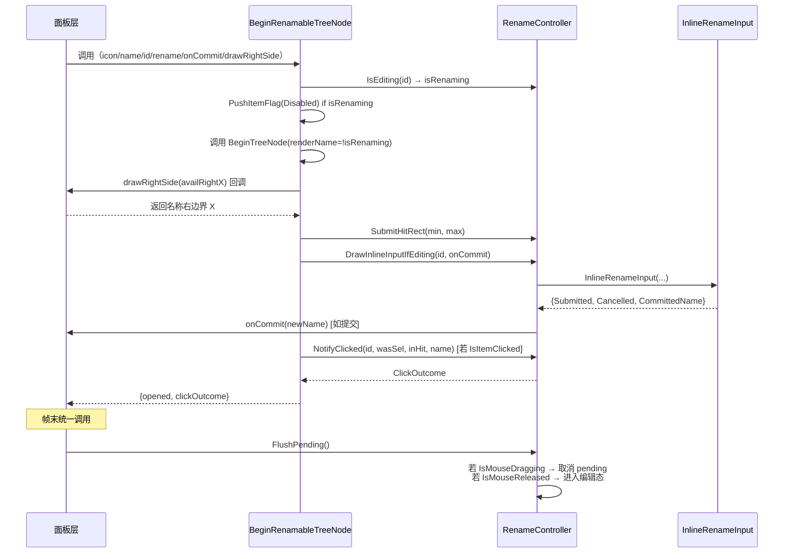

# Luck3D 内联重命名（Inline Rename）功能整合设计文档

> 版本：v1.0  
> 适用范围：`Lucky/UI` 通用控件层 + `Luck3DApp/Panels` 面板层  
> 关联代码规范：[Coding_Style_Guide.md](./Coding_Style_Guide.md)

---

## 目录

1. [背景与目标](#1-背景与目标)
2. [现状分析](#2-现状分析)
3. [总体设计](#3-总体设计)
4. [核心组件：`RenameController<TId>`](#4-核心组件renamecontrollertid)
5. [容器适配器：`BeginRenamableTreeNode` / `BeginRenamableGridItem`](#5-容器适配器)
6. [面板层接入](#6-面板层接入)
7. [关键实现细节](#7-关键实现细节)
8. [方案对比与优先级](#8-方案对比与优先级)
9. [实施步骤（分阶段落地）](#9-实施步骤分阶段落地)
10. [测试与验收标准](#10-测试与验收标准)
11. [附录 A：完整头文件示例](#附录-a完整头文件示例)
12. [附录 B：完整实现示例](#附录-b完整实现示例)

---

## 1. 背景与目标

### 1.1 背景

当前 Luck3D 编辑器中，"节点内联重命名（Inline Rename）"功能仅在 `SceneHierarchyPanel` 中实现。随着 `ProjectAssetsPanel` 的完善，以下四处 UI 场景都需要同样的重命名能力：

| # | 面板 | 容器类型 | 使用控件 |
|---|------|---------|---------|
| 1 | `SceneHierarchyPanel` | 树节点 | `UI::BeginTreeNode` |
| 2 | `ProjectAssetsPanel`（左侧目录树） | 树节点 | `UI::BeginTreeNode` |
| 3 | `ProjectAssetsPanel`（右侧 List 视图） | 树节点 | `UI::BeginTreeNode` |
| 4 | `ProjectAssetsPanel`（右侧 Grid 视图，未来） | 缩略图 + 名称 | 自定义布局 |

前三处在 UI 层面的重命名交互**完全一致**，第四处（Grid）虽然容器布局不同，但**状态机语义完全相同**。

### 1.2 目标

- **UI 层零重复**：Rename 状态机与 InputText 渲染只写一次，四处共用；
- **`BeginTreeNode` 基础版本不变**：不重命名的 TreeNode（如 Inspector 折叠组、非文件树等）零心智负担；
- **业务解耦**：`Entity::SetName` / `AssetManager::MoveAsset` / `std::filesystem::rename` 三种数据回写策略通过回调接入，不污染 UI 层；
- **交互对齐 Unity**：
  - "已选中 + 单击名称区" → 弹出编辑框；
  - "按下后拖拽" → 取消编辑候选（Rename 优先级低于 DragDrop）；
  - `Enter` / 失焦 → 提交；`Esc` / 未编辑失焦 → 取消。

### 1.3 非目标

- 不引入外部弹窗（Modal）形式的 Rename；
- 不改变 `UI::InlineRenameInput` 的现有实现（已成熟，直接复用）；
- 不处理 Rename 之外的选中 / 拖拽 / 右键菜单交互（这些由面板自主决定）。

---

## 2. 现状分析

### 2.1 Rename 功能的职责分解

以 [SceneHierarchyPanel.cpp](../Luck3DApp/Source/Panels/SceneHierarchyPanel.cpp) 为参照，把 Rename 拆成 **6 个正交职责**：

| # | 职责 | 现所在位置 | 是否 UI 通用？ |
|---|------|-----------|--------------|
| 1 | 名称文本"命中矩形"计算 | `DrawEntityComponentIcons` 写入 `m_LastNameHitRect` | 通用（依赖容器布局） |
| 2 | 两阶段触发：`按下 → 登记 pending → 抬起未拖拽 → 进入编辑态` | `DrawEntityNode` + `OnGUI` 帧末仲裁 | **完全通用** |
| 3 | 状态存储：`EditingID` / `FirstFrame` / `Buffer` / `PendingID` / `PendingName` | `RenameState m_Rename` | **完全通用**（ID 类型不同） |
| 4 | 编辑态渲染：`renderName=false` + `PushItemFlag(Disabled)` + `SetItemAllowOverlap` + 调用 `InlineRenameInput` | `DrawEntityNode` 的 `isRenaming` 分支 | **完全通用** |
| 5 | 提交语义：Enter/失焦提交、Esc/未编辑失焦取消 | `UI::InlineRenameInput` 内 | 已通用 ? |
| 6 | 数据回写：`entity.SetName(...)` | `DrawEntityNode` 的 `Submitted` 分支 | 业务相关（每种资源不同） |

**关键结论**：
- 1~5 是**纯 UI 逻辑**，不依赖节点代表的是 Entity 还是文件；
- 只有第 6 项是业务相关，且抽象为"字符串 → 结果"的回调即可；
- Grid 视图与 TreeNode 的差异**仅在第 1 项（命中矩形来源）**??TreeNode 是"图标右侧到组件图标区之间"，Grid 是"缩略图下方的 label 矩形"。

### 2.2 现有基础设施

| 组件 | 位置 | 状态 |
|-----|------|-----|
| `UI::InlineRenameInput` | [Widgets.h](../Lucky/Source/Lucky/UI/Widgets.h) L54 | ? 已实现，跨帧稳定 |
| `UI::BeginTreeNode`（单/双图标 + `renderName` 参数） | [Widgets.h](../Lucky/Source/Lucky/UI/Widgets.h) L26-45 | ? 已支持"关闭默认名"钩子 |
| `Entity::SetName(const std::string&)` | [Entity.cpp](../Lucky/Source/Lucky/Scene/Entity.cpp) L19 | ? 内含空校验 |
| `AssetManager::MoveAsset(AssetHandle, const std::string&)` | [AssetManager.cpp](../Lucky/Source/Lucky/Asset/AssetManager.cpp) L366 | ? 保持 Handle，含回滚 |
| `std::filesystem::rename` | STL | 用于目录改名 |

**结论**：基础设施齐备，本次工作只需在 UI 层引入"状态机抽象 + 容器适配器"。

---

## 3. 总体设计

### 3.1 分层架构

```plantuml
@startuml
package "Luck3DApp / Panels（业务层）" {
    [SceneHierarchyPanel] ..> [RenameController<UUID>]
    [ProjectAssetsPanel]  ..> [RenameController<fs::path>]
}

package "Lucky / UI（通用控件层）" {
    class "RenameController<TId>" as RC {
        + IsEditing(id) : bool
        + NotifyClicked(id, wasSelected, inHit, name) : ClickOutcome
        + SubmitHitRect(min, max)
        + DrawInlineInputIfEditing(id, onCommit) : bool
        + FlushPending()
        + CancelIfEditing(id) / CancelAll()
    }
    class "BeginRenamableTreeNode" as BRTN
    class "BeginRenamableGridItem" as BRGI
    class "InlineRenameInput" as IRI
    class "BeginTreeNode" as BTN

    BRTN --> RC : uses
    BRTN --> BTN : composes
    BRTN --> IRI : composes
    BRGI --> RC : uses
    BRGI --> IRI : composes
}

package "ImGui（第三方）" {
    [ImGui::TreeNodeEx]
    [ImGui::InputText]
}

BTN ..> [ImGui::TreeNodeEx]
IRI ..> [ImGui::InputText]
@enduml
```

### 3.2 核心思想

把 Rename 建模成一个**与容器解耦的、以 `TId` 泛化的状态机**：

- **状态归属**：`RenameController` 由**面板**持有（不放全局 static），面板间互不干扰；
- **容器职责**：`BeginRenamableTreeNode` / `BeginRenamableGridItem` 负责"算出命中矩形 + 调用 controller"；
- **业务回写**：面板通过 `onCommit` 回调（lambda）注入具体的改名逻辑；
- **组件图标（Hierarchy 独有）**：通过 `drawRightSide` hook 让面板自定义"名称右边的额外内容"。

### 3.3 数据流



---

## 4. 核心组件：`RenameController<TId>`

### 4.1 类型约束

`TId` 需满足：
- 可比较：支持 `operator==` / `operator!=`；
- 可默认构造：`TId{}` 表示"无编辑目标"；
- 可拷贝：状态机内需存值。

常见特化：
- `RenameController<UUID>` ?? Hierarchy 面板；
- `RenameController<std::filesystem::path>` ?? ProjectAssets 面板；
- `RenameController<AssetHandle>` ?? 可选（若以 Handle 为主键）。

### 4.2 完整接口

```cpp
// Lucky/Source/Lucky/UI/Widgets.h（追加）

namespace Lucky::UI
{
    /// <summary>
    /// NotifyClicked 的处理结果，指导调用方是否走"正常 Select"分支
    /// </summary>
    enum class RenameClickOutcome : uint8_t
    {
        None = 0,                       // 未处理（一般不会返回）
        RegisteredAsRenameCandidate,    // 已登记为 Rename 候选（不要 Select，不要清 pending）
        ShouldSelect                    // 应走正常 Select 分支
    };

    /// <summary>
    /// 内联重命名状态机（与容器 UI 解耦）
    /// - 由面板持有，跨帧稳定
    /// - TId 需支持 operator==、拷贝构造、默认构造（默认值表示"无编辑目标"）
    /// </summary>
    template <typename TId>
    class RenameController
    {
    public:
        // ---- 查询 ----
        bool IsEditing(const TId& id) const;
        bool IsEditingAny() const { return m_HasEditing; }

        // ---- 容器适配器调用（每节点绘制过程中按序调用） ----

        /// <summary>
        /// 上报命中矩形（每节点绘制时调用一次）
        /// 供 DrawInlineInputIfEditing 覆盖 InputText，也供 NotifyClicked 判定 inHit
        /// </summary>
        void SubmitHitRect(const ImVec2& rectMin, const ImVec2& rectMax);

        /// <summary>
        /// 点击回调：处理"已选中 + 名称区"的两阶段登记
        /// </summary>
        RenameClickOutcome NotifyClicked(const TId& id, bool wasSelectedBeforeClick, const std::string& currentName);

        /// <summary>
        /// 编辑态渲染：若本节点处于编辑态，调用 InlineRenameInput 并处理 onCommit
        /// - onCommit 签名：void(const std::string& newName)
        /// - 返回 true 表示本帧发生了 Commit 或 Cancel（编辑态本帧结束）
        /// </summary>
        template <typename FnCommit>
        bool DrawInlineInputIfEditing(const TId& id, const char* imguiID, FnCommit&& onCommit);

        // ---- 外部强制退出 ----
        void CancelIfEditing(const TId& id);
        void CancelAll();

        // ---- 面板 OnGUI 帧末统一调用一次 ----
        void FlushPending();

    private:
        // 编辑态
        bool  m_HasEditing = false;
        TId   m_EditingID{};
        bool  m_FirstFrame = false;
        char  m_Buffer[128] = { 0 };

        // 两阶段候选
        bool         m_HasPending = false;
        TId          m_PendingID{};
        std::string  m_PendingName;

        // 帧内命中矩形（SubmitHitRect 写入，DrawInlineInputIfEditing / NotifyClicked 消费）
        bool   m_HitValid = false;
        ImVec2 m_HitMin{};
        ImVec2 m_HitMax{};
    };
}
```

### 4.3 关键方法语义

#### `NotifyClicked`
```
输入：id / wasSelectedBeforeClick / currentName
使用成员：m_HitValid、m_HitMin/Max、当前鼠标位置

流程：
1. 计算 inHit = (m_HitValid && 鼠标在矩形内)
2. 若 wasSelectedBeforeClick && inHit：
   - m_PendingID = id
   - m_PendingName = currentName
   - m_HasPending = true
   - return RegisteredAsRenameCandidate
3. 否则：
   - 清 pending（防跨节点串扰）
   - 若当前有编辑态且 id 不同：CancelAll()
   - return ShouldSelect
```

#### `FlushPending`
```
若 !m_HasPending：直接返回

若 ImGui::IsMouseDragging(0)：
    - 取消 pending（拖拽优先）
    - 清空 m_HasPending

否则若 ImGui::IsMouseReleased(0)：
    - m_EditingID = m_PendingID
    - m_HasEditing = true
    - m_FirstFrame = true
    - strncpy(m_Buffer, m_PendingName.c_str(), sizeof(m_Buffer)-1)
    - 清空 m_HasPending
```

#### `DrawInlineInputIfEditing`
```
若 !IsEditing(id) || !m_HitValid：return false

调用 UI::InlineRenameInput(imguiID, m_HitMin, m_HitMax, m_Buffer, sizeof(m_Buffer), m_FirstFrame)
m_FirstFrame = false

若 result.Submitted：
    onCommit(result.CommittedName)
    m_HasEditing = false
    return true

若 result.Cancelled：
    m_HasEditing = false
    return true

return false
```

---

## 5. 容器适配器

### 5.1 `BeginRenamableTreeNode`

#### 5.1.1 签名

```cpp
namespace Lucky::UI
{
    /// <summary>
    /// 可重命名树节点：TreeNode + Rename 状态机的组合封装
    /// 
    /// 内部完成：
    /// - 若该节点处于编辑态：自动 PushItemFlag(Disabled) + renderName=false + SetItemAllowOverlap
    /// - 调用 drawRightSide 让面板绘制右侧图标（可选），并据此算出名称命中矩形
    /// - 上报命中矩形 → controller.SubmitHitRect
    /// - 调用 controller.DrawInlineInputIfEditing 处理编辑态
    /// - 若发生 IsItemClicked，调用 controller.NotifyClicked 并将结果通过 outClickOutcome 传回
    /// </summary>
    /// <param name="icon">节点图标</param>
    /// <param name="name">名称（用于快照 + 布局计算）</param>
    /// <param name="id">唯一 ID（TId）</param>
    /// <param name="selected">是否选中（本次点击前的状态）</param>
    /// <param name="isLeaf">是否叶节点</param>
    /// <param name="defaultOpen">默认展开</param>
    /// <param name="rename">Rename 状态机（面板持有）</param>
    /// <param name="onCommit">改名回调：void(const std::string& newName)</param>
    /// <param name="drawRightSide">
    ///     右侧图标绘制回调：float(float availableRightScreenX) -> float
    ///     参数：可用区域右边界屏幕 X 坐标；返回：名称右边界屏幕 X 坐标（用于算命中矩形）
    ///     传入 nullptr 表示无右侧图标，此时名称右边界 = 内容区右边界
    /// </param>
    /// <param name="outClickOutcome">点击结果输出（可为 nullptr）</param>
    /// <returns>TreeNode 是否展开</returns>
    template <typename TId, typename FnCommit, typename FnRightSide = std::nullptr_t>
    bool BeginRenamableTreeNode(
        const Ref<Texture2D>&       icon,
        const char*                 name,
        const TId&                  id,
        bool                        selected,
        bool                        isLeaf,
        bool                        defaultOpen,
        RenameController<TId>&      rename,
        FnCommit&&                  onCommit,
        FnRightSide                 drawRightSide = nullptr,
        RenameClickOutcome*         outClickOutcome = nullptr);

    /// 双图标版本（closedIcon + openIcon）
    template <typename TId, typename FnCommit, typename FnRightSide = std::nullptr_t>
    bool BeginRenamableTreeNode(
        const Ref<Texture2D>&       closedIcon,
        const Ref<Texture2D>&       openIcon,
        const char*                 name,
        const TId&                  id,
        bool                        selected,
        bool                        isLeaf,
        bool                        defaultOpen,
        RenameController<TId>&      rename,
        FnCommit&&                  onCommit,
        FnRightSide                 drawRightSide = nullptr,
        RenameClickOutcome*         outClickOutcome = nullptr);
}
```

#### 5.1.2 内部流程伪代码

```cpp
bool isRenaming = rename.IsEditing(id);

if (isRenaming)
{
    ImGui::PushItemFlag(ImGuiItemFlags_Disabled, true);
}

bool opened = BeginTreeNode(icon, name, defaultOpen, selected, isLeaf, /*renderName*/ !isRenaming);

if (isRenaming)
{
    ImGui::PopItemFlag();
    ImGui::SetItemAllowOverlap();
}

// ---- 计算名称文本命中矩形 ----
NameRectResult nameRect = ComputeNameHitRect(name);  // 内部工具函数，见 §7.2

// ---- 右侧图标（可选）----
if constexpr (!std::is_null_pointer_v<FnRightSide>)
{
    // 面板自绘右侧图标，可能修改 nameRect.RightX（回退侵入区域）
    float newRight = drawRightSide(nameRect.ContentRightScreenX);
    nameRect.RightScreenX = std::min(nameRect.RightScreenX, newRight);
}

rename.SubmitHitRect({ nameRect.LeftScreenX, nameRect.TopScreenY },
                     { nameRect.RightScreenX, nameRect.BottomScreenY });

// ---- 编辑态：InputText 覆盖 ----
rename.DrawInlineInputIfEditing(id, "##InlineRename", std::forward<FnCommit>(onCommit));

// ---- 点击处理 ----
if (!isRenaming && ImGui::IsItemClicked())
{
    RenameClickOutcome outcome = rename.NotifyClicked(id, selected, name);
    if (outClickOutcome)
    {
        *outClickOutcome = outcome;
    }
}

return opened;
```

### 5.2 `BeginRenamableGridItem`（Grid 视图，未来阶段）

#### 5.2.1 签名

```cpp
namespace Lucky::UI
{
    /// <summary>
    /// 可重命名 Grid 项：缩略图 + 名称（Unity Project Grid 布局）
    /// 
    /// 布局：
    /// ┌───────────┐
    /// │           │
    /// │ Thumbnail │  cellSize.x × cellSize.x（正方形缩略图）
    /// │           │
    /// ├───────────┤
    /// │ name label│  cellSize.x × labelHeight（可换行 / 截断）
    /// └───────────┘
    /// 
    /// 编辑态：label 区域覆盖为 InputText
    /// </summary>
    /// <returns>是否被点击（用于选中）</returns>
    template <typename TId, typename FnCommit>
    bool BeginRenamableGridItem(
        const Ref<Texture2D>&       thumbnail,
        const char*                 name,
        const TId&                  id,
        bool                        selected,
        const ImVec2&               cellSize,
        RenameController<TId>&      rename,
        FnCommit&&                  onCommit,
        RenameClickOutcome*         outClickOutcome = nullptr);
}
```

#### 5.2.2 布局流程

```
使用 ImGui::BeginGroup / EndGroup 打包缩略图 + label 为一个逻辑 Item

1. 绘制选中框（背景色，若 selected）
2. 绘制缩略图（居中，OpenGL Y 翻转）
3. label 区：
   - 非编辑态：ImGui::TextWrapped(name)，同时记录 label 屏幕矩形
   - 编辑态：跳过 TextWrapped，label 矩形交给 InputText
4. 名称命中矩形 = label 屏幕矩形
5. rename.SubmitHitRect(...)
6. rename.DrawInlineInputIfEditing(...)
7. IsItemClicked → rename.NotifyClicked(...) → outClickOutcome
```

**注意**：Grid 项的"整体命中"（如缩略图区域）用于选中，"label 命中"用于 Rename 候选判定。二者是同一个 `IsItemClicked`，靠 `mouseInHit` 区分。

---

## 6. 面板层接入

### 6.1 `SceneHierarchyPanel`

#### 6.1.1 头文件精简

```cpp
// SceneHierarchyPanel.h（精简后）

class SceneHierarchyPanel : public EditorPanel
{
    // ... 其他不变 ...

private:
    // ↓↓↓ 删除以下三个结构 ↓↓↓
    // struct RenameState { ... };
    // RenameState m_Rename;
    // struct NameHitRect { ... };
    // NameHitRect m_LastNameHitRect;

    // ↑↑↑ 替换为 ↑↑↑
    UI::RenameController<UUID> m_Rename;

    // ... 其他保持 ...
};
```

#### 6.1.2 `DrawEntityNode` 改造

```cpp
void SceneHierarchyPanel::DrawEntityNode(Entity entity, int depth)
{
    const std::string& name = entity.GetComponent<NameComponent>().Name;
    UUID id = entity.GetUUID();
    bool isLeaf = entity.GetChildren().empty();
    const Ref<Texture2D>& icon = EditorIconManager::GetEntityIcon();

    if (m_PendingExpand.erase(id) > 0)
    {
        ImGui::SetNextItemOpen(true, ImGuiCond_Always);
    }

    UI::RenameClickOutcome clickOutcome = UI::RenameClickOutcome::None;
    bool opened = UI::BeginRenamableTreeNode(
        icon, name.c_str(), id,
        SelectionManager::IsSelected(id), isLeaf, /*defaultOpen*/ false,
        m_Rename,
        [entity](const std::string& newName) { entity.SetName(newName); },   // onCommit
        [this, entity, depth](float rightX) -> float                          // drawRightSide
        {
            return DrawEntityComponentIcons(entity, depth, rightX);           // 返回名称右边界
        },
        &clickOutcome);

    // 缓存行底 Y（拖拽 X 层级回退需要）
    m_EntityBottomY[id] = ImGui::GetItemRectMax().y;

    // 处理选中
    if (clickOutcome == UI::RenameClickOutcome::ShouldSelect)
    {
        SelectionManager::Select(id);
        LF_TRACE("Selected Entity: [ENTT = {0}, UUID {1}, Name {2}]", static_cast<uint32_t>(entity), id, entity.GetName());
    }

    // ---- 拖拽源 / 拖拽目标 / 右键菜单 / 递归子节点：保持原有逻辑 ----
    // （编辑态下这些行为由 PushItemFlag(Disabled) 自动屏蔽，无需额外分支）
    // ...
}
```

**注意**：`DrawEntityComponentIcons` 的签名要改为 `float DrawEntityComponentIcons(Entity, int depth, float rightScreenX)`，参数新增 `rightScreenX`（可用区域右边界屏幕坐标），返回值为"名称右边界屏幕 X"。原实现中"计算命中矩形并写入 `m_LastNameHitRect`"的段落删除。

#### 6.1.3 `OnGUI` 帧末调用

```cpp
void SceneHierarchyPanel::OnGUI()
{
    // ... 原有绘制 ...

    // ↓ 帧末统一处理两阶段仲裁
    m_Rename.FlushPending();

    // ↓ 空白点击时强制退出编辑态
    if (ImGui::IsMouseClicked(0) && ImGui::IsWindowHovered() && !ImGui::IsAnyItemHovered())
    {
        SelectionManager::Deselect();
        m_Rename.CancelAll();
    }
}
```

#### 6.1.4 实体被删除时同步退出编辑态

```cpp
if (entityDeleted)
{
    m_Rename.CancelIfEditing(id);
    m_Scene->DestroyEntity(entity);
    // ...
}
```

### 6.2 `ProjectAssetsPanel`

#### 6.2.1 头文件新增

```cpp
// ProjectAssetsPanel.h
private:
    UI::RenameController<std::filesystem::path> m_Rename;
```

#### 6.2.2 左侧目录树

```cpp
void ProjectAssetsPanel::DrawDirectoryTreeNode(DirectoryNode& node)
{
    bool isRoot = (node.FullPath == m_AssetsDirectory);
    bool isLeaf = node.SubDirectories.empty();
    bool isCurrentDir = (m_CurrentDirectory == node.FullPath);

    const Ref<Texture2D>& folderClosedIcon = EditorIconManager::GetFolderIcon(false);
    const Ref<Texture2D>& folderOpenIcon = EditorIconManager::GetFolderIcon(true);

    if (isRoot)
    {
        ImGui::PushFont(ImGui::GetIO().Fonts->Fonts[0]);
    }

    UI::RenameClickOutcome clickOutcome = UI::RenameClickOutcome::None;
    std::filesystem::path pathCopy = node.FullPath;   // 回调按值捕获，避免 Rebuild 后悬空

    bool opened = UI::BeginRenamableTreeNode(
        folderClosedIcon, folderOpenIcon,
        node.Name.c_str(), node.FullPath,
        isCurrentDir, isLeaf, isRoot,
        m_Rename,
        [this, pathCopy](const std::string& newName)
        {
            EnqueueAction([this, pathCopy, newName]() { RenameFolderTo(pathCopy, newName); });
        },
        /*drawRightSide*/ nullptr,
        &clickOutcome);

    if (isRoot)
    {
        ImGui::PopFont();
    }

    // ---- 右键菜单 / 导航点击：保持原有逻辑（编辑态下 IsItemClicked 自动被屏蔽） ----

    if (opened)
    {
        for (DirectoryNode& subDir : node.SubDirectories)
        {
            DrawDirectoryTreeNode(subDir);
        }
        UI::EndTreeNode();
    }
}
```

#### 6.2.3 右侧列表（`DrawAssetItem`）

```cpp
void ProjectAssetsPanel::DrawAssetItem(const std::filesystem::directory_entry& entry)
{
    const std::filesystem::path& path = entry.path();
    bool isDirectory = entry.is_directory();

    // ... 提前获取 icon / assetHandle / isSelected（同现有逻辑）...

    UI::RenameClickOutcome clickOutcome = UI::RenameClickOutcome::None;
    std::filesystem::path pathCopy = path;
    AssetHandle handleCopy = assetHandle;

    if (UI::BeginRenamableTreeNode(
            icon, path.stem().string().c_str(), path,
            isSelected, /*isLeaf*/ true, /*defaultOpen*/ false,
            m_Rename,
            [this, isDirectory, pathCopy, handleCopy](const std::string& newName)
            {
                EnqueueAction([this, isDirectory, pathCopy, handleCopy, newName]()
                {
                    if (isDirectory)
                    {
                        RenameFolderTo(pathCopy, newName);
                    }
                    else
                    {
                        RenameAssetTo(handleCopy, newName);
                    }
                });
            },
            /*drawRightSide*/ nullptr,
            &clickOutcome))
    {
        UI::EndTreeNode();
    }

    // 处理 Select（保持原有 "抬起时" 语义）
    // 注意：clickOutcome 是"按下瞬间"结果，Project 面板的"抬起选中"逻辑保留在原处
    // ...
}
```

#### 6.2.4 新增数据回写函数

```cpp
// ProjectAssetsPanel.cpp

void ProjectAssetsPanel::RenameFolderTo(const std::filesystem::path& oldPath, const std::string& newName)
{
    // 空校验、非法字符校验、同名校验
    if (newName.empty())
    {
        LF_CORE_WARN("ProjectAssetsPanel::RenameFolderTo - Empty name, keep original");
        return;
    }

    std::filesystem::path newPath = oldPath.parent_path() / newName;
    if (newPath == oldPath)
    {
        return;
    }
    if (std::filesystem::exists(newPath))
    {
        LF_CORE_WARN("ProjectAssetsPanel::RenameFolderTo - '{0}' already exists", newPath.generic_string());
        return;
    }

    std::error_code ec;
    std::filesystem::rename(oldPath, newPath, ec);
    if (ec)
    {
        LF_CORE_ERROR("ProjectAssetsPanel::RenameFolderTo - '{0}' -> '{1}': {2}", oldPath.generic_string(), newPath.generic_string(), ec.message());
        return;
    }

    // 目录改名后：需要级联更新该目录下所有资产的 Registry 路径
    // （方案：遍历该目录下的资产 Handle，对每个 Handle 调用 MoveAsset 到新路径）
    // 详见 §7.4

    LF_CORE_INFO("ProjectAssetsPanel::RenameFolderTo - '{0}' -> '{1}'", oldPath.generic_string(), newPath.generic_string());
    RebuildDirectoryTree();

    // 若当前浏览目录在被重命名子树内，同步纠正
    if (m_CurrentDirectory == oldPath || IsSubPath(oldPath, m_CurrentDirectory))
    {
        m_CurrentDirectory = RelocateUnderNewRoot(m_CurrentDirectory, oldPath, newPath);
    }
}

void ProjectAssetsPanel::RenameAssetTo(AssetHandle handle, const std::string& newName)
{
    if (newName.empty())
    {
        LF_CORE_WARN("ProjectAssetsPanel::RenameAssetTo - Empty name, keep original");
        return;
    }

    const AssetMetadata* metadata = /* 取 metadata */;
    if (!metadata)
    {
        return;
    }

    std::filesystem::path oldPath(metadata->FilePath);
    std::filesystem::path newPath = oldPath.parent_path() / (newName + oldPath.extension().string());

    if (!AssetManager::MoveAsset(handle, newPath.generic_string()))
    {
        return;   // AssetManager 内部已打错误日志并回滚
    }

    RebuildDirectoryTree();
}
```

---

## 7. 关键实现细节

### 7.1 命中矩形的坐标系

`RenameController::SubmitHitRect` 与 `InlineRenameInput` 之间约定使用**屏幕坐标**（`ImVec2` 屏幕系）。理由：
- `InlineRenameInput` 已使用 `SetCursorScreenPos` 定位；
- `SceneHierarchyPanel::DrawEntityComponentIcons` 内部已完成"窗口坐标 ? 屏幕坐标"换算；
- Grid 视图直接从 `GetItemRectMin/Max` 拿到的就是屏幕坐标。

统一为屏幕坐标可以避免跨面板的坐标系混淆。

### 7.2 `BeginRenamableTreeNode` 内部的命中矩形计算

参考 `SceneHierarchyPanel::DrawEntityComponentIcons` 中的算法（[SceneHierarchyPanel.cpp](../Luck3DApp/Source/Panels/SceneHierarchyPanel.cpp) L~840）：

```
名称文本左边界（屏幕 X） = 
    TreeNode ItemRectMin.x
  + (depth+1) * IndentSpacing        // 由 ImGui TreePush 累积
  + FontSize                          // 箭头占位
  + TreeNodeArrowToIconSpacing
  + IconSize
  + TreeNodeIconToTextSpacing
```

**深度 depth 从哪来？** 有两个方案：

- **方案 A**：让适配器**从 `DC.Indent.x` 反推**（`(indent - baseIndent) / IndentSpacing`）。
  - 优点：调用方无需传 depth；
  - 缺点：`BeginTreeNode` 内部会 `TreePush` 修改 `DC.Indent.x`，反推容易踩坑；需在 `TreePush` **之前**记录。
- **方案 B**：让适配器接受可选参数 `int depth = -1`，`-1` 表示由适配器内部反推；面板知道自己层级时可直接传。
  - 优点：容错更好；
  - 缺点：签名多一个参数。

**推荐方案 B**（默认 `depth = -1` 内部反推；Hierarchy 已有 depth 变量，直接传更精确）。

### 7.3 编辑态屏蔽 TreeNode 交互

现有实现（`PushItemFlag(Disabled)` + `SetItemAllowOverlap`）是**必需的**??原因见 [SceneHierarchyPanel.cpp](../Luck3DApp/Source/Panels/SceneHierarchyPanel.cpp) 内联注释（约 L400-L430）。

`BeginRenamableTreeNode` 内部必须原封不动地保留这段逻辑：

```cpp
if (isRenaming)
{
    ImGui::PushItemFlag(ImGuiItemFlags_Disabled, true);
}
bool opened = BeginTreeNode(..., /*renderName*/ !isRenaming);
if (isRenaming)
{
    ImGui::PopItemFlag();
    ImGui::SetItemAllowOverlap();
}
```

### 7.4 目录改名的级联更新

改名一个目录 `A/B` → `A/C` 后，其下所有资产的 `AssetMetadata::FilePath`（如 `A/B/foo.lmat`）都需要更新为 `A/C/foo.lmat`。

**方案对比**：

- **方案 A**（推荐）：改名后立即遍历该目录下所有资产 Handle，逐个调用 `AssetManager::MoveAsset(handle, newPathUnderNewRoot)`。
  - **注意**：磁盘 `rename` 已经把文件移到了 `A/C/` 下，`MoveAsset` 内部的 `filesystem::rename` 会失败。需要拆分为**只更新 Registry**的接口，或复用 `AssetRegistry::UpdatePath`。
  - **实施**：在 `AssetManager` 中新增 `bool UpdateAssetPath(AssetHandle, const std::string& newRelativePath)`（只更新 Registry，不动磁盘）。
- **方案 B**：目录改名走"逐个 `MoveAsset`"：先不改目录磁盘名，遍历资产，对每个资产调用 `MoveAsset` 到新路径（`MoveAsset` 会用 `create_directories` 建出 `A/C/`），最后 `remove` 空的 `A/B`。
  - 优点：完全复用 `MoveAsset`，无需新接口；
  - 缺点：语义"绕"，且 `A/B` 下可能有非资产文件被漏迁。
- **方案 C**：只改磁盘 + 全量 `AssetManager::Refresh()`。
  - 优点：实现最短；
  - 缺点：Refresh 走"增量对比"，被 rename 的文件会被识别为"删除 + 新增"，导致 Handle 变化，跨场景引用断裂。**不可接受**。

**推荐方案 A**（新增 `UpdateAssetPath` 接口，语义清晰、Handle 保持不变）。

### 7.5 命名冲突处理

改名后与同级已存在文件/节点冲突时的策略：

| 场景 | Unity 行为 | 推荐行为 |
|-----|-----------|---------|
| Entity 改名与兄弟同名 | 允许（Hierarchy 允许重名） | **允许**，与 Unity 一致 |
| 目录改名与兄弟同名 | 拒绝 | **拒绝**，`std::filesystem::rename` 会失败 |
| 资产改名与兄弟同名 | 拒绝 | **拒绝**，`MoveAsset` 已含此校验 |

拒绝时**保留原名**（`onCommit` 内部检测并 return，UI 层无需处理）。

### 7.6 快捷键触发 Rename

Unity 支持 `F2` 键触发选中节点的重命名。设计：

```cpp
// 面板 OnEvent 中
if (e.GetKeyCode() == Key::F2)
{
    UUID id = SelectionManager::GetSelection();
    if (id != 0)
    {
        Entity entity = m_Scene->TryGetEntityWithUUID(id);
        if (entity)
        {
            m_Rename.BeginEditing(id, entity.GetName());   // ← 新增接口
        }
    }
}
```

需要在 `RenameController` 增加：

```cpp
/// <summary>
/// 编程式进入编辑态（用于 F2 快捷键 / 创建后自动 Rename）
/// </summary>
void BeginEditing(const TId& id, const std::string& currentName);
```

### 7.7 创建后自动 Rename

`ProjectAssetsPanel::CreateFolderAt` / `CreateMaterialAt` 后当前仅 `SelectionManager::SelectAsset`。可扩展为自动进入编辑态：

```cpp
void ProjectAssetsPanel::CreateFolderAt(const std::filesystem::path& parentDir)
{
    std::filesystem::path target = MakeUniquePath(parentDir, "New Folder", "");
    // ... 现有创建逻辑 ...

    SelectionManager::SelectFolder(target);
    m_Rename.BeginEditing(target, target.filename().string());   // ← 新增
}
```

---

## 8. 方案对比与优先级

### 8.1 整体方案对比

| # | 方案 | 优先级 | 优点 | 缺点 |
|---|------|-------|------|------|
| A | 把 Rename 参数直接塞进 `BeginTreeNode` | ★☆☆☆☆ | 面板层最短 | ①`BeginTreeNode` 无法承载跨帧状态机；②数据回写策略无法通用；③覆盖不到 Grid 视图；④污染基础 API |
| B | `BeginTreeNode` 增加 `isRenaming` 参数（半整合） | ★★☆☆☆ | 改动小 | 只省 3 行样板代码，状态机 / 命中矩形 / InputText 调用仍在面板层，收益太小 |
| **C** | **`RenameController<TId>` 状态机 + `BeginRenamableTreeNode` / `BeginRenamableGridItem` 适配器** | **★★★★★（推荐）** | ①零重复；②`BeginTreeNode` 基础 API 干净；③Grid 天然复用；④业务解耦 | 引入模板类，`Widgets.h` 略微复杂 |
| D | 每个面板自己 copy 一份 Rename 逻辑 | ★☆☆☆☆ | 无耦合 | 违背 DRY，四处维护成本翻倍 |

**推荐方案 C**，理由：
1. **符合正交原则**：状态机（跨帧）与容器渲染（帧内）分离；
2. **业务解耦到底**：`onCommit` lambda 让 UI 层不感知 Entity / Asset / 目录的差异；
3. **面向未来**：Grid 视图、F2 快捷键、创建后自动 Rename 都在同一套 API 下自然扩展；
4. **代价可控**：模板放头文件、实现放 `Widgets.inl`（`#include` 到 `Widgets.h` 末尾），无编译时长膨胀。

### 8.2 关键子方案对比

#### 8.2.1 `RenameController` 的存储粒度

| 方案 | 优点 | 缺点 | 推荐 |
|-----|-----|-----|-----|
| **每个面板一个 controller** | 状态隔离清晰、无并发风险 | 面板需持有成员 | ? 推荐 |
| 全局单例 | 全局唯一，跨面板互斥（同时只允许一个 Rename） | 需要处理 `TId` 类型擦除，接口复杂化 | 不推荐 |

#### 8.2.2 `drawRightSide` 回调 vs. 派生类

| 方案 | 优点 | 缺点 | 推荐 |
|-----|-----|-----|-----|
| **回调（lambda）** | 灵活、无需继承、模板函数天然支持 | 签名略复杂 | ? 推荐 |
| 继承 `TreeNodeRenderer` 接口 | OOP 语义明确 | 强迫面板持有额外对象，Overkill | 不推荐 |

#### 8.2.3 depth 参数

| 方案 | 优点 | 缺点 | 推荐 |
|-----|-----|-----|-----|
| **可选参数 `int depth = -1`（-1 自动反推）** | 容错好、面板可精确控制 | 签名多一参数 | ? 推荐 |
| 强制传 depth | 明确 | 面板必须自维护 depth | 备选 |
| 完全内部反推 | 面板无感 | 反推逻辑受 `TreePush` 影响，边界脆弱 | 不推荐 |

#### 8.2.4 目录改名的资产联动（详见 §7.4）

| 方案 | 优点 | 缺点 | 推荐 |
|-----|-----|-----|-----|
| **新增 `AssetManager::UpdateAssetPath`（仅更新 Registry）** | 语义清晰、Handle 稳定、易于批量 | 需新增接口 | ? 推荐 |
| 逐个 `MoveAsset` | 复用现有接口 | 语义"绕"，非资产文件可能漏迁 | 不推荐 |
| 全量 `Refresh` | 实现最短 | Handle 会变，跨场景引用断裂 | ? 禁用 |

#### 8.2.5 `RenameController` 模板放置位置

| 方案 | 优点 | 缺点 | 推荐 |
|-----|-----|-----|-----|
| **模板声明 + 实现都放 `Widgets.h`（末尾 `#include "Widgets.inl"`）** | 与项目现有 `Ref<T>` / `RefAs` 一致 | `Widgets.h` 变大 | ? 推荐 |
| 显式实例化 | `.cpp` 内实现，头文件干净 | 面板每次新增 `TId` 都要显式实例化 | 备选 |

---

## 9. 实施步骤（分阶段落地）

按依赖顺序分批完成，每一步都能独立编译通过、独立验证。

### Step 1：新增 `RenameController<TId>` 骨架

- 在 [Widgets.h](../Lucky/Source/Lucky/UI/Widgets.h) 追加 `RenameClickOutcome` 枚举 + `RenameController<TId>` 模板类；
- 在 [Widgets.cpp](../Lucky/Source/Lucky/UI/Widgets.cpp) 追加模板方法定义（或新增 `Widgets.inl`）；
- **验证**：项目编译通过，无任何面板接入。

### Step 2：`SceneHierarchyPanel` 迁移状态机（不接入适配器）

- 删除 `RenameState` / `NameHitRect` 结构；
- 新增 `UI::RenameController<UUID> m_Rename;`；
- `DrawEntityNode` 中现有的"两阶段登记 / 编辑态渲染"逻辑改为调用 `m_Rename` 的方法；
- `OnGUI` 帧末改为 `m_Rename.FlushPending()`；
- **验证**：Hierarchy 面板 Rename 功能与原来完全一致，回归测试。

### Step 3：新增 `BeginRenamableTreeNode` 适配器 + Hierarchy 切换

- 在 [Widgets.h](../Lucky/Source/Lucky/UI/Widgets.h) 追加模板函数；
- 内部封装 `BeginTreeNode` 调用、命中矩形计算、`SubmitHitRect`、`DrawInlineInputIfEditing`、`NotifyClicked`；
- `SceneHierarchyPanel::DrawEntityNode` 改用 `BeginRenamableTreeNode`，`DrawEntityComponentIcons` 改造为 `drawRightSide` 回调；
- **验证**：Hierarchy 面板视觉、交互无变化，代码行数明显减少。

### Step 4：`ProjectAssetsPanel` 左侧目录树接入

- 新增 `UI::RenameController<std::filesystem::path> m_Rename;`；
- `DrawDirectoryTreeNode` 改用 `BeginRenamableTreeNode`；
- 实现 `RenameFolderTo` 数据回写函数（含目录级联更新，见 §7.4）；
- 新增 `AssetManager::UpdateAssetPath` 接口；
- **验证**：左侧目录树支持双击已选中节点后原地重命名，级联更新资产 Registry。

### Step 5：`ProjectAssetsPanel` 右侧列表接入

- `DrawAssetItem` 改用 `BeginRenamableTreeNode`；
- 实现 `RenameAssetTo` 数据回写函数（走 `AssetManager::MoveAsset`）；
- **验证**：右侧列表中的资产与目录都可原地改名。

### Step 6：F2 快捷键 + 创建后自动 Rename

- `RenameController` 新增 `BeginEditing(id, name)` 接口；
- `SceneHierarchyPanel::OnEvent` / `ProjectAssetsPanel::OnEvent` 处理 F2；
- `CreateFolderAt` / `CreateMaterialAt` / `CreateSceneAt` 创建后自动进入编辑态；
- **验证**：F2 与创建流程符合 Unity 表现。

### Step 7（可选，未来）：Grid 视图 + `BeginRenamableGridItem`

- 在 [Widgets.h](../Lucky/Source/Lucky/UI/Widgets.h) 追加 `BeginRenamableGridItem`；
- `ProjectAssetsPanel::DrawContentArea` 增加视图模式切换（List / Grid）；
- Grid 模式使用 `BeginRenamableGridItem` 渲染每项；
- **验证**：Grid 视图下 Rename 交互与 List 视图完全一致。

---

## 10. 测试与验收标准

### 10.1 单点交互验收（每处面板都要测）

| # | 操作 | 期望结果 |
|---|------|---------|
| 1 | 点击未选中节点的名称 | 选中节点，**不**进入编辑态 |
| 2 | 点击已选中节点的名称 → 立即抬起 | 进入编辑态，InputText 获焦 + 全选 |
| 3 | 点击已选中节点的名称 → 按住拖拽 | 启动拖拽，**不**进入编辑态 |
| 4 | 编辑态下按 `Enter` | 提交，数据回写，退出编辑态 |
| 5 | 编辑态下按 `Esc` | 取消，保留原名，退出编辑态 |
| 6 | 编辑态下点击 InputText 外部 | 已编辑 → 提交；未编辑 → 取消 |
| 7 | 编辑态下选中其他节点 | 强制退出编辑态 |
| 8 | 编辑提交空字符串 | 保留原名，输出警告日志 |
| 9 | 编辑期间该节点被外部删除 | 编辑态自动退出，无悬空 |
| 10 | F2 快捷键（选中节点后） | 进入编辑态 |
| 11 | 创建 Folder / Material / Scene 后 | 新建项自动进入编辑态 |

### 10.2 跨面板隔离验收

| # | 操作 | 期望结果 |
|---|------|---------|
| 1 | Hierarchy 与 Project 面板同时打开，Hierarchy 中一个节点处于编辑态时点击 Project | Hierarchy 编辑态退出（失焦提交），Project 正常响应 |
| 2 | 两个面板各自独立处理 F2 | 焦点面板才响应 F2 |

### 10.3 目录改名级联验收

| # | 操作 | 期望结果 |
|---|------|---------|
| 1 | 改名 `Assets/Models` → `Assets/Meshes` | 目录改名成功；子资产 `AssetHandle` 保持不变；`AssetMetadata::FilePath` 全部同步；跨场景引用不断裂 |
| 2 | 改名当前浏览目录 | `m_CurrentDirectory` 自动纠正到新路径 |
| 3 | 改名为已存在的兄弟目录名 | 拒绝，保留原名，输出警告 |

### 10.4 视觉验收

- InputText 高度与 TreeNode 行高一致（差 1px 内），无跳动；
- InputText 内文字起点与原名文本严格对齐（无左右偏移）；
- 编辑态下右侧组件图标（Hierarchy）与"编辑框侵入"的行为一致（图标退位）。

---

## 附录 A：完整头文件示例

### A.1 [Widgets.h](../Lucky/Source/Lucky/UI/Widgets.h) 追加内容

```cpp
namespace Lucky::UI
{
    // ======== 内联重命名整合 ========

    /// <summary>
    /// NotifyClicked 的处理结果
    /// </summary>
    enum class RenameClickOutcome : uint8_t
    {
        None = 0,
        RegisteredAsRenameCandidate,
        ShouldSelect
    };

    /// <summary>
    /// 内联重命名状态机（与容器 UI 解耦，由面板持有）
    /// TId 需支持 operator==、拷贝构造、默认构造
    /// </summary>
    template <typename TId>
    class RenameController
    {
    public:
        RenameController() = default;

        // ---- 查询 ----
        bool IsEditing(const TId& id) const;
        bool IsEditingAny() const { return m_HasEditing; }

        // ---- 容器调用 ----
        void SubmitHitRect(const ImVec2& rectMin, const ImVec2& rectMax);
        RenameClickOutcome NotifyClicked(const TId& id, bool wasSelectedBeforeClick, const std::string& currentName);

        template <typename FnCommit>
        bool DrawInlineInputIfEditing(const TId& id, const char* imguiID, FnCommit&& onCommit);

        // ---- 编程式控制 ----
        void BeginEditing(const TId& id, const std::string& currentName);
        void CancelIfEditing(const TId& id);
        void CancelAll();

        // ---- 帧末统一调用 ----
        void FlushPending();

    private:
        bool  m_HasEditing = false;
        TId   m_EditingID{};
        bool  m_FirstFrame = false;
        char  m_Buffer[128] = { 0 };

        bool         m_HasPending = false;
        TId          m_PendingID{};
        std::string  m_PendingName;

        bool   m_HitValid = false;
        ImVec2 m_HitMin{};
        ImVec2 m_HitMax{};
    };

    /// <summary>
    /// 可重命名树节点（单图标版本）
    /// </summary>
    template <typename TId, typename FnCommit, typename FnRightSide = std::nullptr_t>
    bool BeginRenamableTreeNode(
        const Ref<Texture2D>&       icon,
        const char*                 name,
        const TId&                  id,
        bool                        selected,
        bool                        isLeaf,
        bool                        defaultOpen,
        RenameController<TId>&      rename,
        FnCommit&&                  onCommit,
        FnRightSide                 drawRightSide = nullptr,
        RenameClickOutcome*         outClickOutcome = nullptr,
        int                         depth = -1);

    /// <summary>
    /// 可重命名树节点（双图标版本）
    /// </summary>
    template <typename TId, typename FnCommit, typename FnRightSide = std::nullptr_t>
    bool BeginRenamableTreeNode(
        const Ref<Texture2D>&       closedIcon,
        const Ref<Texture2D>&       openIcon,
        const char*                 name,
        const TId&                  id,
        bool                        selected,
        bool                        isLeaf,
        bool                        defaultOpen,
        RenameController<TId>&      rename,
        FnCommit&&                  onCommit,
        FnRightSide                 drawRightSide = nullptr,
        RenameClickOutcome*         outClickOutcome = nullptr,
        int                         depth = -1);

    /// <summary>
    /// 可重命名 Grid 项（缩略图 + 名称）
    /// </summary>
    template <typename TId, typename FnCommit>
    bool BeginRenamableGridItem(
        const Ref<Texture2D>&       thumbnail,
        const char*                 name,
        const TId&                  id,
        bool                        selected,
        const ImVec2&               cellSize,
        RenameController<TId>&      rename,
        FnCommit&&                  onCommit,
        RenameClickOutcome*         outClickOutcome = nullptr);
}

#include "Widgets.inl"   // 模板方法实现
```

---

## 附录 B：完整实现示例

### B.1 `RenameController<TId>` 关键方法（`Widgets.inl`）

```cpp
namespace Lucky::UI
{
    template <typename TId>
    bool RenameController<TId>::IsEditing(const TId& id) const
    {
        return m_HasEditing && m_EditingID == id;
    }

    template <typename TId>
    void RenameController<TId>::SubmitHitRect(const ImVec2& rectMin, const ImVec2& rectMax)
    {
        m_HitValid = (rectMax.x > rectMin.x) && (rectMax.y > rectMin.y);
        m_HitMin = rectMin;
        m_HitMax = rectMax;
    }

    template <typename TId>
    RenameClickOutcome RenameController<TId>::NotifyClicked(const TId& id, bool wasSelectedBeforeClick, const std::string& currentName)
    {
        ImVec2 mouse = ImGui::GetMousePos();
        bool inHit = m_HitValid
            && mouse.x >= m_HitMin.x && mouse.x <= m_HitMax.x
            && mouse.y >= m_HitMin.y && mouse.y <= m_HitMax.y;

        if (wasSelectedBeforeClick && inHit)
        {
            m_PendingID = id;
            m_PendingName = currentName;
            m_HasPending = true;
            return RenameClickOutcome::RegisteredAsRenameCandidate;
        }

        // 未选中 or 不在名称区：清 pending，若当前编辑非本节点则强退
        m_HasPending = false;
        m_PendingName.clear();
        if (m_HasEditing && !(m_EditingID == id))
        {
            m_HasEditing = false;
        }
        return RenameClickOutcome::ShouldSelect;
    }

    template <typename TId>
    template <typename FnCommit>
    bool RenameController<TId>::DrawInlineInputIfEditing(const TId& id, const char* imguiID, FnCommit&& onCommit)
    {
        if (!IsEditing(id) || !m_HitValid)
        {
            return false;
        }

        UI::InlineRenameResult result = UI::InlineRenameInput(
            imguiID, m_HitMin, m_HitMax,
            m_Buffer, sizeof(m_Buffer), m_FirstFrame);

        m_FirstFrame = false;

        if (result.Submitted)
        {
            onCommit(result.CommittedName);
            m_HasEditing = false;
            return true;
        }
        if (result.Cancelled)
        {
            m_HasEditing = false;
            return true;
        }
        return false;
    }

    template <typename TId>
    void RenameController<TId>::BeginEditing(const TId& id, const std::string& currentName)
    {
        m_EditingID = id;
        m_HasEditing = true;
        m_FirstFrame = true;
        std::strncpy(m_Buffer, currentName.c_str(), sizeof(m_Buffer) - 1);
        m_Buffer[sizeof(m_Buffer) - 1] = '\0';
        m_HasPending = false;
        m_PendingName.clear();
    }

    template <typename TId>
    void RenameController<TId>::CancelIfEditing(const TId& id)
    {
        if (IsEditing(id))
        {
            m_HasEditing = false;
        }
    }

    template <typename TId>
    void RenameController<TId>::CancelAll()
    {
        m_HasEditing = false;
        m_HasPending = false;
        m_PendingName.clear();
    }

    template <typename TId>
    void RenameController<TId>::FlushPending()
    {
        if (!m_HasPending)
        {
            return;
        }

        if (ImGui::IsMouseDragging(ImGuiMouseButton_Left))
        {
            m_HasPending = false;
            m_PendingName.clear();
            return;
        }

        if (ImGui::IsMouseReleased(ImGuiMouseButton_Left))
        {
            m_EditingID = m_PendingID;
            m_HasEditing = true;
            m_FirstFrame = true;
            std::strncpy(m_Buffer, m_PendingName.c_str(), sizeof(m_Buffer) - 1);
            m_Buffer[sizeof(m_Buffer) - 1] = '\0';

            m_HasPending = false;
            m_PendingName.clear();
        }
    }
}
```

### B.2 `BeginRenamableTreeNode`（单图标版本，`Widgets.inl`）

```cpp
namespace Lucky::UI
{
    namespace Internal
    {
        /// <summary>
        /// 计算 TreeNode 的名称文本命中矩形（屏幕坐标）
        /// - depth = -1 时按 DC.Indent.x 反推层级
        /// - 返回值 RightScreenX：默认取内容区右边界（无右侧图标时的名称右边界）
        /// </summary>
        struct NameHitRectInfo
        {
            float LeftScreenX;
            float RightScreenX;
            float TopScreenY;
            float BottomScreenY;
            float ContentRightScreenX;   // 内容区右边界（供 drawRightSide 使用）
        };

        NameHitRectInfo ComputeNameHitRect(int depth);   // 实现见 Widgets.cpp
    }

    template <typename TId, typename FnCommit, typename FnRightSide>
    bool BeginRenamableTreeNode(
        const Ref<Texture2D>&       icon,
        const char*                 name,
        const TId&                  id,
        bool                        selected,
        bool                        isLeaf,
        bool                        defaultOpen,
        RenameController<TId>&      rename,
        FnCommit&&                  onCommit,
        FnRightSide                 drawRightSide,
        RenameClickOutcome*         outClickOutcome,
        int                         depth)
    {
        bool isRenaming = rename.IsEditing(id);

        if (isRenaming)
        {
            ImGui::PushItemFlag(ImGuiItemFlags_Disabled, true);
        }

        bool opened = BeginTreeNode(icon, name, defaultOpen, selected, isLeaf, /*renderName*/ !isRenaming);

        if (isRenaming)
        {
            ImGui::PopItemFlag();
            ImGui::SetItemAllowOverlap();
        }

        // 计算命中矩形
        Internal::NameHitRectInfo hit = Internal::ComputeNameHitRect(depth);

        // 右侧图标（可选）
        if constexpr (!std::is_null_pointer_v<std::decay_t<FnRightSide>>)
        {
            float nameRightFromCallback = drawRightSide(hit.ContentRightScreenX);
            hit.RightScreenX = std::min(hit.RightScreenX, nameRightFromCallback);
        }

        rename.SubmitHitRect({ hit.LeftScreenX, hit.TopScreenY },
                             { hit.RightScreenX, hit.BottomScreenY });

        // 编辑态覆盖 InputText
        rename.DrawInlineInputIfEditing(id, "##InlineRename", std::forward<FnCommit>(onCommit));

        // 点击处理
        RenameClickOutcome outcome = RenameClickOutcome::None;
        if (!isRenaming && ImGui::IsItemClicked())
        {
            outcome = rename.NotifyClicked(id, selected, name);
        }
        if (outClickOutcome)
        {
            *outClickOutcome = outcome;
        }

        return opened;
    }
}
```

### B.3 `Internal::ComputeNameHitRect`（`Widgets.cpp`，非模板）

```cpp
namespace Lucky::UI::Internal
{
    NameHitRectInfo ComputeNameHitRect(int depth)
    {
        NameHitRectInfo info{};

        ImVec2 itemMin = ImGui::GetItemRectMin();
        ImVec2 itemMax = ImGui::GetItemRectMax();
        const ImGuiStyle& style = ImGui::GetStyle();

        // depth = -1：按 DC.Indent.x 反推（TreePush 已生效，因此当前 Indent 对应"下一层子节点"）
        // 真实层级 depth = Indent / IndentSpacing - 1（-1 抵消 Scene 根 TreeNode 的额外一层）
        if (depth < 0)
        {
            float indent = ImGui::GetCurrentWindow()->DC.Indent.x;
            depth = std::max(0, static_cast<int>(indent / style.IndentSpacing) - 1);
        }

        float indentWidth = style.IndentSpacing * static_cast<float>(depth + 1);
        float arrowWidth = ImGui::GetFontSize();
        float iconSize = ImGui::GetTextLineHeight() - Theme::Layout::TreeNodeIconSizeShrink;

        float nameLeftScreenX = itemMin.x
            + indentWidth
            + arrowWidth
            + Theme::Layout::TreeNodeArrowToIconSpacing
            + iconSize
            + Theme::Layout::TreeNodeIconToTextSpacing;

        // 内容区右边界（含右边距）
        float contentRightScreenX = ImGui::GetWindowPos().x
            + ImGui::GetContentRegionMax().x
            - Theme::Layout::TreeNodeComponentIconRightMargin
            - ImGui::GetScrollX();

        info.LeftScreenX = nameLeftScreenX;
        info.RightScreenX = contentRightScreenX;   // 默认：无右侧图标时到内容区右端
        info.ContentRightScreenX = contentRightScreenX;
        info.TopScreenY = itemMin.y;
        info.BottomScreenY = itemMax.y;
        return info;
    }
}
```

### B.4 `SceneHierarchyPanel::DrawEntityComponentIcons` 改造后签名

```cpp
/// <summary>
/// 绘制右侧组件图标（供 BeginRenamableTreeNode 的 drawRightSide 回调使用）
/// </summary>
/// <param name="entity">实体</param>
/// <param name="depth">该实体在 Hierarchy 中的可视层级</param>
/// <param name="contentRightScreenX">内容区右边界屏幕 X</param>
/// <returns>名称右边界屏幕 X（= 图标区左侧 - 最小间距；无图标时 = contentRightScreenX）</returns>
float SceneHierarchyPanel::DrawEntityComponentIcons(Entity entity, int depth, float contentRightScreenX);
```

原实现中"计算 `m_LastNameHitRect`"的段落删除。

---

## 变更记录

| 版本 | 日期 | 变更 |
|------|------|------|
| v1.0 | 2026-07-19 | 初版 |
