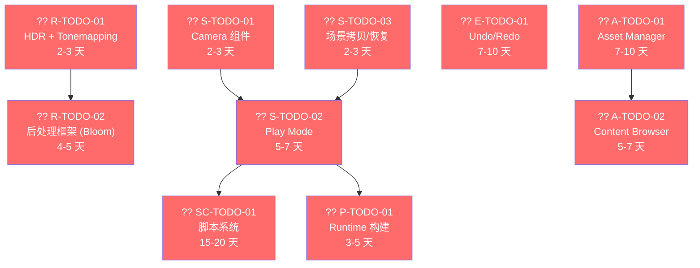

# Luck3D 引擎功能盘点与状态追踪

> **文档版本**：v1.0  
> **创建日期**：2026-04-29  
> **更新日期**：2026-04-29  
> **文档说明**：本文档全面盘点 Luck3D 引擎的功能实现状态，对标简化版 Unity / 通用 3D 游戏引擎的功能集，追踪距离第一个可发布版本（MVP）的差距。**每次功能更新后请同步更新本文档。**

---

## 更新日志

| 日期 | 版本 | 更新内容 |
|------|------|----------|
| 2026-04-29 | v1.0 | 初始版本，全面盘点已实现与未实现功能 |

---

## 目录

- [一、功能完成度总览](#一功能完成度总览)
- [二、已实现功能详细清单](#二已实现功能详细清单)
  - [2.1 核心基础设施（Core）](#21-核心基础设施core)
  - [2.2 渲染系统（Renderer）](#22-渲染系统renderer)
  - [2.3 场景与 ECS（Scene）](#23-场景与-ecsscene)
  - [2.4 序列化系统（Serialization）](#24-序列化系统serialization)
  - [2.5 编辑器（Editor）](#25-编辑器editor)
  - [2.6 资产系统（Asset）](#26-资产系统asset)
- [三、未实现功能详细清单](#三未实现功能详细清单)
  - [3.1 渲染系统缺失](#31-渲染系统缺失)
  - [3.2 场景与 ECS 缺失](#32-场景与-ecs-缺失)
  - [3.3 脚本系统缺失](#33-脚本系统缺失)
  - [3.4 物理系统缺失](#34-物理系统缺失)
  - [3.5 音频系统缺失](#35-音频系统缺失)
  - [3.6 动画系统缺失](#36-动画系统缺失)
  - [3.7 资产管理缺失](#37-资产管理缺失)
  - [3.8 编辑器功能缺失](#38-编辑器功能缺失)
  - [3.9 平台与构建缺失](#39-平台与构建缺失)
- [四、架构优化方向](#四架构优化方向)
- [五、MVP 路线图（第一个可发布版本）](#五mvp-路线图第一个可发布版本)
- [六、功能更新操作指南](#六功能更新操作指南)

---

## 一、功能完成度总览

> **整体完成度：约 40-45%**（相对于一个最小可发布的 3D 游戏引擎）

| 模块 | 完成度 | 已实现 | 未实现 | 说明 |
|------|--------|--------|--------|------|
| 核心基础设施（Core） | ?? 90% | 10 | 1 | 基本完善，缺少异步事件队列 |
| 渲染系统（Renderer） | ?? 75% | 25 | 11 | 核心管线完整，缺 HDR/后处理/透明 |
| 场景与 ECS（Scene） | ?? 65% | 9 | 6 | 基础完善，缺 Camera 组件/Play Mode |
| 序列化系统（Serialization） | ?? 85% | 6 | 1 | 基本完善，缺独立材质文件 |
| 编辑器（Editor） | ?? 60% | 14 | 10 | 框架完善，缺 Undo/Console/ContentBrowser |
| 资产系统（Asset） | ?? 20% | 1 | 5 | 仅有模型导入，缺统一资产管理 |
| 脚本系统 | ?? 0% | 0 | 3 | 完全缺失 |
| 物理系统 | ?? 0% | 0 | 4 | 完全缺失 |
| 音频系统 | ?? 0% | 0 | 3 | 完全缺失 |
| 动画系统 | ?? 0% | 0 | 3 | 完全缺失 |
| 平台与构建 | ?? 25% | 1 | 3 | 仅 Windows + OpenGL |

---

## 二、已实现功能详细清单

### 2.1 核心基础设施（Core）

> **目录**：`Lucky/Source/Lucky/Core/`  
> **完成度**：?? 90%

| # | 功能 | 状态 | 关键文件 | 说明 |
|---|------|------|----------|------|
| C-01 | Application 主循环 | ? 已完成 | `Core/Application.h/cpp` | 单例模式，管理窗口、层栈、事件分发 |
| C-02 | Window 窗口系统 | ? 已完成 | `Core/Window.h/cpp` | GLFW 封装，支持 VSync |
| C-03 | Event 事件系统 | ? 已完成 | `Core/Events/` | 观察者模式，同步分发，支持键盘/鼠标/窗口事件 |
| C-04 | Layer 层系统 | ? 已完成 | `Core/Layer.h/cpp`、`Core/LayerStack.h/cpp` | LayerStack 管理普通层和覆盖层 |
| C-05 | Input 输入系统 | ? 已完成 | `Core/Input/Input.h/cpp` | 轮询模式，全 static 方法 |
| C-06 | UUID 系统 | ? 已完成 | `Core/UUID.h/cpp` | 64 位随机 UUID |
| C-07 | Log 日志系统 | ? 已完成 | `Core/Log.h/cpp` | 基于 spdlog，分 Core/Client 日志 |
| C-08 | DeltaTime | ? 已完成 | `Core/DeltaTime.h` | 帧间隔时间封装 |
| C-09 | Hash 工具 | ? 已完成 | `Core/Hash.h/cpp` | FNV 哈希 |
| C-10 | 构建系统 | ? 已完成 | `Build.lua`、`Build-Lucky.lua` | Premake5，支持 Debug/Release/Dist |

---

### 2.2 渲染系统（Renderer）

> **目录**：`Lucky/Source/Lucky/Renderer/`  
> **完成度**：?? 75%

#### 基础渲染设施

| # | 功能 | 状态 | 关键文件 | 说明 |
|---|------|------|----------|------|
| R-01 | OpenGL 上下文 | ? 已完成 | `Renderer/OpenGLContext.h/cpp` | GLAD 加载 OpenGL 4.5+ |
| R-02 | RenderCommand 底层封装 | ? 已完成 | `Renderer/RenderCommand.h/cpp` | Init/Clear/DrawIndexed/DrawLines/SetCullMode/SetDepthWrite/SetBlendMode 等 |
| R-03 | VertexArray / Buffer | ? 已完成 | `Renderer/VertexArray.h/cpp`、`Renderer/Buffer.h/cpp` | VAO/VBO/IBO 封装 |
| R-04 | UniformBuffer (UBO) | ? 已完成 | `Renderer/UniformBuffer.h/cpp` | Camera UBO (binding=0) + Light UBO (binding=1) |
| R-05 | Framebuffer | ? 已完成 | `Renderer/Framebuffer.h/cpp` | 多颜色附件 + 深度附件，支持 Resize |
| R-06 | Texture2D | ? 已完成 | `Renderer/Texture.h/cpp` | stb_image 加载，支持默认纹理（White/Black/Normal） |
| R-07 | ScreenQuad | ? 已完成 | `Renderer/ScreenQuad.h/cpp` | 全屏四边形（用于后处理/描边合成） |

#### Shader 与材质系统

| # | 功能 | 状态 | 关键文件 | 说明 |
|---|------|------|----------|------|
| R-08 | Shader 系统 | ? 已完成 | `Renderer/Shader.h/cpp` | 编译/链接/内省/Uniform 上传，支持 `#include` 指令，支持 `@default` 元数据 |
| R-09 | ShaderLibrary | ? 已完成 | `Renderer/Shader.h` | 着色器库管理，区分 Internal/User 着色器 |
| R-10 | Material 材质系统 | ? 已完成 | `Renderer/Material.h/cpp` | Shader 内省 + PropertyMap + 纹理槽自动管理 + 源码顺序排序 |

#### 几何与网格

| # | 功能 | 状态 | 关键文件 | 说明 |
|---|------|------|----------|------|
| R-11 | Mesh / SubMesh | ? 已完成 | `Renderer/Mesh.h/cpp` | 顶点数据（Pos/Color/Normal/UV/Tangent）+ SubMesh 分段绘制 |
| R-12 | MeshFactory 内置图元 | ? 已完成 | `Renderer/MeshFactory.h/cpp` | Cube / Plane / Sphere / Cylinder / Capsule（5 种） |
| R-13 | MeshTangentCalculator | ? 已完成 | `Renderer/MeshTangentCalculator.h/cpp` | MikkTSpace 风格切线计算 |

#### 渲染管线架构

| # | 功能 | 状态 | 关键文件 | 说明 |
|---|------|------|----------|------|
| R-14 | Renderer3D | ? 已完成 | `Renderer/Renderer3D.h/cpp` | BeginScene/DrawMesh/EndScene，全 static 设计 |
| R-15 | DrawCommand 排序 | ? 已完成 | `Renderer/Renderer3D.cpp` | 延迟提交 + SortKey 排序（按 Shader ID 聚合） |
| R-16 | RenderState 定义 | ? 已完成 | `Renderer/RenderState.h` | CullMode / DepthWrite / DepthTest / BlendMode / RenderQueue 枚举和结构体 |
| R-17 | RenderPass 抽象 | ? 已完成 | `Renderer/RenderPass.h` | RenderPass 基类 |
| R-18 | RenderPipeline 管理器 | ? 已完成 | `Renderer/RenderPipeline.h/cpp` | Pass 注册 + 分组执行 |
| R-19 | RenderContext | ? 已完成 | `Renderer/RenderContext.h` | 帧渲染上下文，包含 DrawCommand 列表、阴影数据、描边数据 |

#### 光照与 PBR

| # | 功能 | 状态 | 关键文件 | 说明 |
|---|------|------|----------|------|
| R-20 | PBR 渲染 | ? 已完成 | `Shaders/Standard.vert/frag` | Metallic-Roughness 工作流 |
| R-21 | 多光源支持 | ? 已完成 | `Shaders/Lucky/Lighting.glsl` | 方向光×4 / 点光源×8 / 聚光灯×4，通过 UBO 传递 |

#### 阴影系统

| # | 功能 | 状态 | 关键文件 | 说明 |
|---|------|------|----------|------|
| R-22 | 方向光 Shadow Map | ? 已完成 | `Renderer/Passes/ShadowPass.h/cpp` | 方向光阴影贴图 |
| R-23 | 硬阴影 / 软阴影 (PCF) | ? 已完成 | `Shaders/Lucky/Shadow.glsl` | 硬阴影 + PCF 3×3 软阴影 + 动态 Bias |

#### 编辑器渲染功能

| # | 功能 | 状态 | 关键文件 | 说明 |
|---|------|------|----------|------|
| R-24 | 选中描边 | ? 已完成 | `Renderer/Passes/SilhouettePass.h/cpp`、`Renderer/Passes/OutlineCompositePass.h/cpp` | Silhouette + 边缘检测，支持叶节点/非叶节点不同颜色 |
| R-25 | 鼠标拾取 | ? 已完成 | `Renderer/Passes/PickingPass.h/cpp` | Entity ID Framebuffer (R32I) |
| R-26 | Gizmo 渲染 | ? 已完成 | `Renderer/GizmoRenderer.h/cpp` | 线段批处理 + 无限网格 + 灯光可视化 + 坐标轴指示器 |
| R-27 | EditorCamera | ? 已完成 | `Renderer/EditorCamera.h/cpp` | 轨道相机模型（焦点 + 距离 + Pitch/Yaw） |
| R-28 | OpaquePass | ? 已完成 | `Renderer/Passes/OpaquePass.h/cpp` | 不透明物体渲染 Pass |

---

### 2.3 场景与 ECS（Scene）

> **目录**：`Lucky/Source/Lucky/Scene/`  
> **完成度**：?? 65%

| # | 功能 | 状态 | 关键文件 | 说明 |
|---|------|------|----------|------|
| S-01 | Scene 场景管理 | ? 已完成 | `Scene/Scene.h/cpp` | entt::registry，实体创建/销毁/查询 |
| S-02 | Entity 实体封装 | ? 已完成 | `Scene/Entity.h/cpp` | 类型安全的组件操作 |
| S-03 | 父子层级关系 | ? 已完成 | `Scene/Components/RelationshipComponent.h` | UUID 引用 |
| S-04 | 世界矩阵计算 | ? 已完成 | `Scene/Scene.cpp` | 递归计算 Parent × Local |
| S-05 | DirtyFlag 优化 | ? 已完成 | `Scene/Components/TransformComponent.h` | 仅在 Transform 变化时重新计算 |
| S-06 | SelectionManager | ? 已完成 | `Scene/SelectionManager.h/cpp` | 全局选中管理 |
| S-07 | 统一 LightComponent | ? 已完成 | `Scene/Components/LightComponent.h` | 单一组件通过 Type 区分（Directional/Point/Spot），含阴影参数 |

**已实现的组件**（8 个）：

| 组件 | 文件 | 说明 | 可移除 |
|------|------|------|--------|
| IDComponent | `IDComponent.h` | 64 位 UUID | ? |
| NameComponent | `NameComponent.h` | 实体名称 | ? |
| TransformComponent | `TransformComponent.h` | 位置/旋转/缩放，四元数+欧拉角双存储 | ? |
| RelationshipComponent | `RelationshipComponent.h` | 父子层级（Parent UUID + Children UUID 列表） | ? |
| MeshFilterComponent | `MeshFilterComponent.h` | 持有 Mesh，可通过 PrimitiveType 或文件路径创建 | ? |
| MeshRendererComponent | `MeshRendererComponent.h` | 持有材质列表，索引对应 SubMesh | ? |
| LightComponent | `LightComponent.h` | 统一光源（Directional/Point/Spot）+ 阴影参数 | ? |
| ~~DirectionalLight/PointLight/SpotLight~~ | ― | 已合并为统一 LightComponent | ― |

---

### 2.4 序列化系统（Serialization）

> **目录**：`Lucky/Source/Lucky/Serialization/`  
> **完成度**：?? 85%

| # | 功能 | 状态 | 关键文件 | 说明 |
|---|------|------|----------|------|
| SE-01 | 场景序列化 | ? 已完成 | `Serialization/SceneSerializer.h/cpp` | YAML 格式 `.luck3d` 文件 |
| SE-02 | 材质序列化 | ? 已完成 | `Serialization/MaterialSerializer.h/cpp` | 内嵌在场景文件中 |
| SE-03 | YamlHelpers | ? 已完成 | `Serialization/YamlHelpers.h` | vec2/vec3/vec4/quat 等类型支持 |
| SE-04 | 模型路径序列化 | ? 已完成 | `Serialization/SceneSerializer.cpp` | MeshFilePath 保存和加载 |
| SE-05 | 光源阴影参数序列化 | ? 已完成 | `Serialization/SceneSerializer.cpp` | ShadowType/ShadowBias/ShadowStrength |
| SE-06 | 编辑器偏好序列化 | ? 已完成 | `Editor/EditorPreferences.cpp` | 颜色主题保存/加载 |

---

### 2.5 编辑器（Editor）

> **引擎侧**：`Lucky/Source/Lucky/Editor/`  
> **应用侧**：`Luck3DApp/Source/`  
> **完成度**：?? 60%

| # | 功能 | 状态 | 关键文件 | 说明 |
|---|------|------|----------|------|
| E-01 | EditorPanel 基类 | ? 已完成 | `Editor/EditorPanel.h/cpp` | 面板生命周期管理 |
| E-02 | PanelManager | ? 已完成 | `Editor/PanelManager.h/cpp` | 面板注册/查找/生命周期 |
| E-03 | DockSpace 布局 | ? 已完成 | `Luck3DApp/Source/EditorDockSpace.h/cpp` | ImGui DockSpace |
| E-04 | SceneViewportPanel | ? 已完成 | `Panels/SceneViewportPanel.h/cpp` | 3D 视口 + 相机 + Gizmo + 拾取 + 描边 |
| E-05 | SceneHierarchyPanel | ? 已完成 | `Panels/SceneHierarchyPanel.h/cpp` | 树形层级 + 拖拽重排 + 右键菜单 |
| E-06 | InspectorPanel | ? 已完成 | `Panels/InspectorPanel.h/cpp` | 组件属性编辑 + 材质编辑 |
| E-07 | PreferencesPanel | ? 已完成 | `Panels/PreferencesPanel.h/cpp` | 编辑器偏好设置（颜色主题） |
| E-08 | EditorPreferences | ? 已完成 | `Editor/EditorPreferences.h/cpp` | 全局颜色配置 + 保存/加载 |
| E-09 | Transform Gizmo | ? 已完成 | `Panels/SceneViewportPanel.cpp` | ImGuizmo 平移/旋转/缩放手柄 |
| E-10 | ViewManipulate | ? 已完成 | `Panels/SceneViewportPanel.cpp` | 坐标轴指示器 |
| E-11 | File 菜单 | ? 已完成 | `Luck3DApp/Source/EditorLayer.cpp` | New/Open/Save/SaveAs/Quit |
| E-12 | Window 菜单 | ? 已完成 | `Luck3DApp/Source/EditorLayer.cpp` | 面板显示/聚焦 |
| E-13 | 命令行打开场景 | ? 已完成 | `Luck3DApp/Source/EditorLayer.cpp` | 支持命令行参数 |
| E-14 | 右键菜单创建实体 | ? 已完成 | `Panels/SceneHierarchyPanel.cpp` | 创建图元/光源/空实体 |

---

### 2.6 资产系统（Asset）

> **目录**：`Lucky/Source/Lucky/Asset/`  
> **完成度**：?? 20%

| # | 功能 | 状态 | 关键文件 | 说明 |
|---|------|------|----------|------|
| A-01 | 模型导入 | ? 已完成 | `Asset/MeshImporter.h/cpp` | Assimp 集成，支持 .obj/.fbx/.gltf/.glb/.dae/.3ds/.blend |

---

## 三、未实现功能详细清单

### 3.1 渲染系统缺失

| # | 功能 | 优先级 | 说明 | 参考引擎 |
|---|------|--------|------|----------|
| R-TODO-01 | **HDR + Tonemapping** | ?? P0 | 当前手动 Gamma 校正在 Standard.frag 中，高光溢出被截断。需要 RGBA16F FBO + ACES Tonemapping Pass | Unity / Hazel |
| R-TODO-02 | **后处理框架** | ?? P0 | 无 Bloom / FXAA / 色调调整等效果。需要 PostProcessEffect 基类 + FBO Ping-Pong | Unity / Hazel |
| R-TODO-03 | **透明物体渲染** | ?? P1 | RenderState 枚举已定义但未集成到 Material。当前所有物体按不透明绘制，无透明排序 | Unity |
| R-TODO-04 | **Per-Material RenderState** | ?? P1 | RenderState 结构体已定义，但 Material 未持有 RenderState，Inspector 无 UI | Unity |
| R-TODO-05 | **级联阴影 (CSM)** | ?? P1 | 当前阴影使用固定正交范围，大场景精度不足 | Unity |
| R-TODO-06 | **IBL 环境光** | ?? P1 | 当前环境光为简单常量 `vec3(0.03)`，缺乏环境反射 | Unity / Hazel |
| R-TODO-07 | **天空盒 / Skybox** | ?? P1 | 无天空盒渲染，背景为纯色 | 基本引擎标配 |
| R-TODO-08 | **视锥体剔除** | ?? P1 | 所有物体都提交 GPU，无剔除优化 | Unity |
| R-TODO-09 | **LOD 系统** | ?? P2 | 无多级细节 | Unity |
| R-TODO-10 | **Deferred Rendering** | ?? P2 | 当前 Forward 渲染，光源多时性能差 | 可选架构 |
| R-TODO-11 | **GPU Instancing** | ?? P2 | 无实例化渲染 | Unity |

---

### 3.2 场景与 ECS 缺失

| # | 功能 | 优先级 | 说明 | 参考引擎 |
|---|------|--------|------|----------|
| S-TODO-01 | **Camera 组件** | ?? P0 | 无运行时相机组件，只有 EditorCamera。无法定义游戏内相机 | Unity |
| S-TODO-02 | **Play Mode** | ?? P0 | 无运行时模式（播放/暂停/停止），无法测试游戏逻辑 | Unity |
| S-TODO-03 | **场景拷贝/恢复** | ?? P0 | Play Mode 需要场景快照，进入播放时拷贝，退出时恢复 | Unity |
| S-TODO-04 | **Prefab 系统** | ?? P1 | 无预制体，无法复用实体模板 | Unity |
| S-TODO-05 | **多场景管理** | ?? P1 | 无场景加载/卸载/切换 | Unity |
| S-TODO-06 | **标签/图层系统** | ?? P1 | 无 Tag/Layer，无法分类管理实体 | Unity |

---

### 3.3 脚本系统缺失

| # | 功能 | 优先级 | 说明 | 参考引擎 |
|---|------|--------|------|----------|
| SC-TODO-01 | **脚本系统** | ?? P0 | 无任何脚本支持（C#/Lua/原生 C++），用户无法编写游戏逻辑 | Hazel（Mono C#）/ Godot（GDScript） |
| SC-TODO-02 | **ScriptComponent** | ?? P0 | 无脚本组件 | Unity |
| SC-TODO-03 | **脚本 API** | ?? P0 | 无暴露给脚本的引擎 API（Transform/Input/Physics 等） | Unity |

---

### 3.4 物理系统缺失

| # | 功能 | 优先级 | 说明 | 参考引擎 |
|---|------|--------|------|----------|
| PH-TODO-01 | **2D 物理** | ?? P1 | 无 Box2D 集成 | Hazel（Box2D） |
| PH-TODO-02 | **3D 物理** | ?? P1 | 无 3D 物理引擎（Bullet/PhysX/Jolt） | Hazel（Jolt Physics） |
| PH-TODO-03 | **碰撞检测** | ?? P1 | 无碰撞器组件（BoxCollider/SphereCollider/MeshCollider） | Unity |
| PH-TODO-04 | **Rigidbody** | ?? P1 | 无刚体组件 | Unity |

---

### 3.5 音频系统缺失

| # | 功能 | 优先级 | 说明 | 参考引擎 |
|---|------|--------|------|----------|
| AU-TODO-01 | **音频引擎** | ?? P1 | 无任何音频支持 | Hazel（miniaudio） |
| AU-TODO-02 | **AudioComponent** | ?? P1 | 无音频组件 | Unity |
| AU-TODO-03 | **3D 空间音频** | ?? P2 | 无空间化音频 | Unity |

---

### 3.6 动画系统缺失

| # | 功能 | 优先级 | 说明 | 参考引擎 |
|---|------|--------|------|----------|
| AN-TODO-01 | **骨骼动画** | ?? P1 | 无 Skinned Mesh 渲染 | Hazel（Animation 系统） |
| AN-TODO-02 | **动画状态机** | ?? P1 | 无动画图/状态机 | Hazel（AnimationGraph） |
| AN-TODO-03 | **关键帧动画** | ?? P1 | 无属性动画 | Unity |

---

### 3.7 资产管理缺失

| # | 功能 | 优先级 | 说明 | 参考引擎 |
|---|------|--------|------|----------|
| A-TODO-01 | **Asset Manager** | ?? P0 | 无统一资产管理系统，资源直接通过路径加载，无缓存/引用计数 | Hazel（AssetManager + AssetRegistry） |
| A-TODO-02 | **Content Browser** | ?? P0 | 无资产浏览器面板，无法可视化管理项目文件 | Unity / Hazel |
| A-TODO-03 | **资产导入管线** | ?? P1 | MeshImporter 已有但无统一导入框架 | Hazel（AssetImporter） |
| A-TODO-04 | **独立材质文件 (.mat)** | ?? P1 | 材质内嵌在场景文件中，无独立材质资产 | Unity |
| A-TODO-05 | **纹理导入设置** | ?? P1 | 无纹理压缩/Mipmap/过滤模式配置 | Unity |

---

### 3.8 编辑器功能缺失

| # | 功能 | 优先级 | 说明 | 参考引擎 |
|---|------|--------|------|----------|
| E-TODO-01 | **Undo/Redo** | ?? P0 | 无撤销/重做，编辑操作不可逆 | Unity / Hazel |
| E-TODO-02 | **Console 面板** | ?? P1 | 无日志控制台面板 | Hazel（EditorConsolePanel） |
| E-TODO-03 | **RenderPipeline 调试面板** | ?? P1 | 无渲染管线调试面板（Pass 开关/统计信息） | ― |
| E-TODO-04 | **多选** | ?? P1 | 无框选/Ctrl 多选实体 | Unity |
| E-TODO-05 | **复制/粘贴实体** | ?? P1 | 无 Ctrl+C/V 复制实体 | Unity |
| E-TODO-06 | **快捷键系统** | ?? P1 | 快捷键硬编码，无自定义配置 | Unity |
| E-TODO-07 | **项目系统** | ?? P1 | 无项目概念（.hproj），无项目创建/打开/设置 | Hazel（Project 系统） |
| E-TODO-08 | **场景修改标记** | ?? P1 | 无 "未保存更改" 提示，关闭时不会警告 | Unity |
| E-TODO-09 | **Viewport 工具栏** | ?? P2 | 无视口内工具栏（渲染模式切换、统计信息显示等） | Unity |
| E-TODO-10 | **性能统计面板** | ?? P2 | 无 FPS/DrawCall/三角形数等统计显示 | Unity |

---

### 3.9 平台与构建缺失

| # | 功能 | 优先级 | 说明 | 参考引擎 |
|---|------|--------|------|----------|
| P-TODO-01 | **Runtime 构建** | ?? P0 | 无独立运行时可执行文件，只有编辑器 | Hazel（Hazel-Runtime） |
| P-TODO-02 | **跨平台支持** | ?? P1 | 仅 Windows（文件对话框使用 Win32 API），Linux 脚本存在但未验证 | Hazel |
| P-TODO-03 | **Vulkan/DirectX 后端** | ?? P2 | 仅 OpenGL，无图形 API 抽象层 | Hazel（Vulkan 后端） |

---

## 四、架构优化方向

| # | 优化项 | 当前状态 | 建议 | 优先级 |
|---|--------|----------|------|--------|
| OPT-01 | **Renderer3D 全 static** | 不支持多视口/多相机 | 重构为实例化 SceneRenderer | ?? P1 |
| OPT-02 | **无 Renderer2D** | 无 2D 渲染能力（UI/Sprite/Debug 绘制） | 添加 2D 批处理渲染器 | ?? P1 |
| OPT-03 | **Shader 无缓存** | 每次启动重新编译 | 添加 Shader 缓存（SPIR-V 或二进制） | ?? P1 |
| OPT-04 | **无多线程** | 单线程渲染 | 渲染线程分离 | ?? P2 |
| OPT-05 | **无 ECS System 抽象** | 只有 Entity + Component，无 System 抽象 | 添加 System 基类（可选） | ?? P2 |
| OPT-06 | **事件系统同步** | 事件立即分发，无队列 | 可选：添加事件队列 | ?? P2 |
| OPT-07 | **无反射系统** | 组件注册硬编码 | 添加 Reflection 模块 | ?? P2 |

---

## 五、MVP 路线图（第一个可发布版本）

### 优先级定义

| 优先级 | 含义 | 说明 |
|--------|------|------|
| ?? P0 | **必须有** | 没有这些功能，引擎无法作为最小可用产品发布 |
| ?? P1 | **应该有** | 基本游戏引擎应具备的功能，发布后尽快补充 |
| ?? P2 | **可以有** | 完善体验的功能，可在后续版本迭代 |

### P0 功能依赖关系



### MVP 工作量估算

| 模块 | 功能 | 编号 | 预估工作量 |
|------|------|------|-----------|
| 渲染 | HDR + Tonemapping | R-TODO-01 | 2-3 天 |
| 渲染 | 后处理框架 + Bloom | R-TODO-02 | 4-5 天 |
| 场景 | Camera 组件 + 运行时相机 | S-TODO-01 | 2-3 天 |
| 场景 | 场景拷贝/恢复 | S-TODO-03 | 2-3 天 |
| 场景 | Play Mode（播放/暂停/停止） | S-TODO-02 | 5-7 天 |
| 编辑器 | Undo/Redo（命令模式） | E-TODO-01 | 7-10 天 |
| 资产 | Asset Manager | A-TODO-01 | 7-10 天 |
| 资产 | Content Browser | A-TODO-02 | 5-7 天 |
| 脚本 | 脚本系统（Lua 或 C#） | SC-TODO-01~03 | 15-20 天 |
| 构建 | Runtime 独立可执行文件 | P-TODO-01 | 3-5 天 |
| **总计** | | | **约 55-75 天** |

### 推荐实施顺序

```
Phase 1：渲染完善（约 1 周）
  ├── R-TODO-01  HDR + Tonemapping
  └── R-TODO-02  后处理框架

Phase 2：编辑器体验（约 2 周）
  ├── E-TODO-01  Undo/Redo
  ├── A-TODO-01  Asset Manager
  └── A-TODO-02  Content Browser

Phase 3：运行时基础（约 2 周）
  ├── S-TODO-01  Camera 组件
  ├── S-TODO-03  场景拷贝/恢复
  └── S-TODO-02  Play Mode

Phase 4：脚本与发布（约 3-4 周）
  ├── SC-TODO-01~03  脚本系统
  └── P-TODO-01      Runtime 构建
```

---

## 六、功能更新操作指南

> **每次完成一个功能后，请按以下步骤更新本文档。**

### 步骤 1：更新「更新日志」

在文档顶部的「更新日志」表格中添加一行：

```markdown
| 2026-XX-XX | vX.X | 完成 R-TODO-01 HDR + Tonemapping，移至已实现 |
```

### 步骤 2：移动功能条目

1. 从「三、未实现功能详细清单」中**删除**对应条目
2. 在「二、已实现功能详细清单」对应模块中**添加**新条目，填写关键文件和说明

### 步骤 3：更新完成度

更新「一、功能完成度总览」表格中对应模块的：
- 完成度百分比和颜色标记
- 已实现/未实现数量

### 步骤 4：更新文档版本

修改文档顶部的：
- `文档版本`：递增版本号
- `更新日期`：当前日期

### 示例：完成 HDR + Tonemapping 后的更新

```diff
# 更新日志
+ | 2026-05-05 | v1.1 | 完成 R-TODO-01 HDR + Tonemapping |

# 一、功能完成度总览
- | 渲染系统（Renderer） | ?? 75% | 25 | 11 |
+ | 渲染系统（Renderer） | ?? 78% | 26 | 10 |

# 二、已实现功能 → 渲染管线架构 新增：
+ | R-29 | HDR + Tonemapping | ? 已完成 | `Shaders/Internal/Tonemapping.frag` | RGBA16F FBO + ACES Tonemapping |

# 三、未实现功能 → 渲染系统缺失 删除：
- | R-TODO-01 | HDR + Tonemapping | ?? P0 | ... |
```

---

## 附录：已做得好的部分（项目亮点）

以下是当前项目中设计和实现质量较高的部分，值得在后续开发中保持和延续：

1. **渲染管线架构**（RenderPass / RenderPipeline / DrawCommand 排序）― 架构清晰，扩展性好
2. **PBR 材质系统**（Shader 内省 + 自动属性发现 + PropertyMap）― 设计优秀，用户无需手动注册属性
3. **阴影系统**（Hard/Soft + 动态 Bias + ShadowPass）― 功能完整
4. **选中描边**（Silhouette + 边缘检测 + 叶/非叶节点颜色区分）― 效果完整
5. **Gizmo 渲染**（无限网格 + 灯光可视化 + 坐标轴指示器）― 编辑体验良好
6. **模型导入**（Assimp 集成 + 多格式支持）― 已可用
7. **编辑器框架**（面板系统 + 偏好设置 + 颜色主题）― 结构清晰
8. **父子层级系统**（UUID 引用 + DirtyFlag + 世界矩阵递归计算）― 设计合理
9. **序列化系统**（YAML 格式 + 材质内嵌 + 光源阴影参数）― Git 友好
10. **统一 LightComponent**（单一组件 + Type 区分 + 阴影参数集成）― 简洁统一
