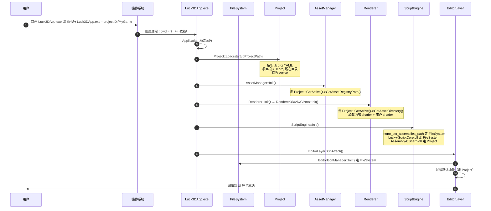

# Phase 1.1：分发形态与目录约定

> 本文档是 [Phase1_ProjectAbstraction_Design.md](./Phase1_ProjectAbstraction_Design.md) 的**落地补充**。Phase 1 完成了"代码只依赖 `FileSystem::GetEditorExecutableDirectory()` 和 `Project::GetActive()` 两个抽象"的重构，但**没有约定"这两个抽象在物理上分别指向哪里"**??本文档补齐这一空白。
>
> 覆盖三件事：
> 1. 用户拿到 Luck3D 后，"引擎安装目录" 应该长什么样
> 2. 用户创建的"项目目录"应该长什么样，与引擎目录的关系
> 3. 从"双击 exe"到"编辑器完全启动"这一段的完整流程
> 4. 开发期（代码在仓库里）和发布期（用户拿到 zip）之间的物理布局桥接方式

---

## 目录

1. [两大目录：引擎安装目录 vs 用户项目目录](#1-两大目录引擎安装目录-vs-用户项目目录)
2. [引擎安装目录形态](#2-引擎安装目录形态)
3. [用户项目目录形态](#3-用户项目目录形态)
4. [启动流程](#4-启动流程)
5. [开发期 → 发布期的桥接](#5-开发期--发布期的桥接)
6. [路径归属速查表](#6-路径归属速查表)
7. [FAQ](#7-faq)

---

## 1. 两大目录：引擎安装目录 vs 用户项目目录

Luck3D 从设计上把整个磁盘世界分成**互相独立、彼此正交**的两个目录：

```
┌─────────────────────────────────┐    ┌─────────────────────────────────┐
│   引擎安装目录 (Editor Install)   │    │   用户项目目录 (User Project)    │
│                                 │    │                                 │
│  归属：Luck3D 引擎自身            │    │  归属：某个具体项目               │
│  内容：编辑器 exe / 图标 / Mono   │    │  内容：场景 / 材质 / 脚本 / 网格  │
│  分发：一次安装，多次使用          │    │  管理：用户自己创建 / Git 追踪    │
│  更新：跟随引擎版本升级            │    │  可移植：拷贝整个目录即可迁移      │
└─────────────────────────────────┘    └─────────────────────────────────┘
              ▲                                        ▲
              │                                        │
              └────  Luck3DApp.exe --project ...  ─────┘
                    通过命令行/菜单打开某个项目
```

**核心约定**：

- **引擎安装目录**里的一切，是"编辑器自己带的东西"，**永远跟随 `Luck3DApp.exe` 走**
- **用户项目目录**里的一切，是"当前打开的项目内容"，**永远跟随 `Project.lcproj` 走**
- 一个引擎安装可以打开任意多个用户项目（就像 Unity 一份 Editor 打开任意项目）
- 一个用户项目可以被任意一个兼容版本的引擎安装打开（不同机器可能装在不同盘符）

**这一约定的直接推论**：任何代码字面量都不允许既依赖 exe 目录又依赖项目目录??每一个路径都必须能明确回答"我属于哪一类"。

---

## 2. 引擎安装目录形态

### 2.1 用户视角的最终形态

用户下载 `Luck3D-<version>-windows-x64.zip` 解压到任意位置（例如 `D:\Tools\Luck3D\`），得到如下目录：

```
Luck3D/                                    ← 引擎安装根（解压位置任意）
├─ Luck3DApp.exe                           ← 编辑器可执行文件
├─ assimp-vc143-mtd.dll                    ← native 依赖（模型导入）
│
├─ Resources/                              ← 编辑器自用资源（跟 exe 走）
│  ├─ Icons/                               ← 编辑器 UI 图标
│  │  ├─ Asset/
│  │  ├─ Common/
│  │  ├─ Component/
│  │  ├─ Entity/
│  │  └─ Toolbar/
│  └─ Scripts/
│     └─ Lucky-ScriptCore.dll              ← C# 引擎 API 层（Lucky namespace）
│
└─ mono/                                   ← Mono runtime（跟 exe 走）
   └─ lib/
      └─ mono/
         └─ 4.5/
            ├─ mscorlib.dll                ← .NET 基础类库
            ├─ System.dll
            ├─ System.Core.dll
            └─ ...（其它 mono runtime 组件）
```

**关键约束**：

| 约束 | 原因 |
|---|---|
| 用户**不删除、不修改**这些文件 | 版本管理由引擎自己负责，篡改会导致行为未定义 |
| 用户**不 Git 追踪**引擎安装目录 | 它属于工具链，不属于项目产物 |
| 编辑器**不写入**引擎安装目录 | 该目录应视为只读；日志、临时文件等一律写用户目录 |
| 未来加入的编辑器资源（字体 / splash / 内置 shader / editor prefab）都放在 `Resources/` 下 | 与 §5.2 保持一致的"exe 相对"分层 |

### 2.2 分类

引擎安装目录里的每一项都属于以下两类之一（对齐 [Project_System_Roadmap.md §2](./Project_System_Roadmap.md) 的四类分层里的前两类）：

| 类别 | 内容 | 定位方式 |
|---|---|---|
| ① 编辑器自用资源 | `Resources/Icons/*`、（未来）`Resources/Fonts/*`、`Resources/ProjectTemplate/*` | `FileSystem::GetEditorExecutableDirectory() / "Resources" / ...` |
| ② 引擎运行时依赖 | `Resources/Scripts/Lucky-ScriptCore.dll`、`mono/lib/*`、`assimp-vc143-mtd.dll` | `FileSystem::GetEditorExecutableDirectory() / ...` |

**代码中的实际调用点**（Phase 1 已完成）：

- [EditorIconManager.cpp](../../Lucky/Source/Lucky/Editor/EditorIconManager.cpp)：`FileSystem::GetEditorExecutableDirectory() / "Resources" / "Icons"`
- [ScriptEngine.cpp](../../Lucky/Source/Lucky/Scripting/ScriptEngine.cpp) `InitMono`：`FileSystem::GetEditorExecutableDirectory() / "mono" / "lib"`
- [ScriptEngine.cpp](../../Lucky/Source/Lucky/Scripting/ScriptEngine.cpp) `Init`：`FileSystem::GetEditorExecutableDirectory() / "Resources" / "Scripts" / "Lucky-ScriptCore.dll"`

---

## 3. 用户项目目录形态

### 3.1 用户视角的最终形态

用户通过 `File → New Project` 或者 Hub 在磁盘任意位置（例如 `D:\MyGames\SpaceShooter\`）创建一个项目：

```
SpaceShooter/                              ← 用户项目根（位置任意）
├─ Project.lcproj                          ← 项目描述文件（YAML，判定"是否 Luck3D 项目"的唯一依据）
├─ AssetRegistry.lcr                       ← 资产注册表（GUID ? 路径映射，可删可重建）
│
├─ Assets/                                 ← 项目资产（跟随项目走）
│  ├─ Scenes/                              ← 场景（.luck3d）
│  ├─ Materials/                           ← 材质（.lmat）
│  ├─ Meshes/                              ← 网格（.lmesh，含引擎内置基元）
│  │  └─ Builtin/                          ← 引擎内置基元（首次运行自动生成，可删可重建）
│  ├─ Models/                              ← 外部模型（.fbx / .obj）
│  ├─ Textures/                            ← 纹理
│  ├─ Shaders/                             ← 用户自定义 shader + 引擎内置 shader
│  │  ├─ Standard.vert/frag                ← 用户可见 shader
│  │  ├─ Skybox.vert/frag
│  │  ├─ Sprite.vert/frag
│  │  ├─ Internal/                         ← 引擎内部 shader（不在用户 shader 列表中显示）
│  │  │  ├─ InternalError.vert/frag
│  │  │  ├─ EntityID.vert/frag
│  │  │  ├─ IBL/
│  │  │  ├─ PostProcess/
│  │  │  ├─ Shadow/
│  │  │  └─ ...
│  │  └─ Lucky/                            ← shader 公共 include
│  │     ├─ Common.glsl
│  │     ├─ Lighting.glsl
│  │     └─ Shadow.glsl
│  ├─ Scripts/                             ← 用户 C# 脚本
│  │  └─ *.cs
│  └─ Internal/                            ← 引擎运行时创建的项目内资产（首次运行自动生成）
│     └─ Materials/
│        ├─ Default-Material.lmat
│        ├─ Default-Skybox.lmat
│        └─ Sprite-Default.lmat
│
├─ Binaries/                               ← C# 编译产物
│  └─ Assembly-CSharp.dll                  ← 用户 C# 程序集（由 sln 编译产出）
│
├─ Intermediates/                          ← C# 中间产物（可删可重建）
│
├─ Build-Project.lua                       ← premake 脚本（模板生成，用户一般不改）
├─ Win-GenProject.bat                      ← 一键生成 C# sln
├─ Project.sln                             ← C# 解决方案（自动生成，用户在此打开 VS/Rider）
└─ Assembly-CSharp.csproj                  ← C# 项目文件（自动生成）
```

### 3.2 三类子内容

| 子类 | 举例 | 生命周期 |
|---|---|---|
| ③ 用户资产 | `Assets/**` 里用户创建/导入的一切、`Binaries/Assembly-CSharp.dll` | 用户手动维护，Git 追踪 |
| ④ 项目派生数据 | `AssetRegistry.lcr`、`Assets/Meshes/Builtin/*`、`Assets/Internal/Materials/*`、`Intermediates/`、`Project.sln`、`Assembly-CSharp.csproj` | 引擎/premake 自动生成，可删可重建 |
| ⑤ 项目描述 | `Project.lcproj`、`Build-Project.lua` | 用户/模板生成，长期不变，Git 追踪 |

**"引擎运行时创建的项目内资产"** 的边界（这是一个容易混淆的灰色地带）：

- `Assets/Meshes/Builtin/Cube.lmesh` 等引擎内置基元 → 逻辑上属于引擎，但**物理上必须在项目内**，因为它们要参与 AssetRegistry 的 GUID 分配、可以被 Scene 引用；引擎首次启动检测不存在时自动生成到项目内
- `Assets/Internal/Materials/Default-Material.lmat` 等默认材质 → 同理，物理上属于项目

**关键**：这些"引擎写进项目"的资产**首次生成后就是项目的一部分**，用户改动、Git 追踪都由用户自己决定；引擎只保证"缺失时能恢复"。

### 3.3 代码中的实际调用点

Phase 1 已完成的迁移（当前实现）：

- [AssetManager.cpp](../../Lucky/Source/Lucky/Asset/AssetManager.cpp)：`Project::GetActive()->GetAssetRegistryPath()`、`Project::GetActive()->GetAssetDirectory()`、`Project::GetActive()->ResolveAbsolute(relativePath)`
- [Renderer3D.cpp](../../Lucky/Source/Lucky/Renderer/Renderer3D.cpp)、[Renderer2D.cpp](../../Lucky/Source/Lucky/Renderer/Renderer2D.cpp)、[GizmoRenderer.cpp](../../Lucky/Source/Lucky/Renderer/GizmoRenderer.cpp)：Shader 加载走 `Project::GetActive()->GetAssetDirectory() / "Shaders/..."`
- [ProjectAssetsPanel.cpp](../../Luck3DApp/Source/Panels/ProjectAssetsPanel.cpp)：`m_AssetsDirectory = Project::GetActive()->GetAssetDirectory()`
- [EditorLayer.cpp](../../Luck3DApp/Source/EditorLayer.cpp) `EnsureDefaultScene`：`Project::GetActive()->GetStartScenePath()`
- [ScriptEngine.cpp](../../Lucky/Source/Lucky/Scripting/ScriptEngine.cpp) `LoadAppAssembly`：`Project::GetActive()->GetScriptModulePath()`

---

## 4. 启动流程

### 4.1 从 exe 双击到编辑器 UI 出现



### 4.2 关键时序约束

- **`Project::Load` 必须最先完成**（Application 构造函数第一步），因为之后所有 `Init` 都直接或间接调用 `Project::GetActive()`
- **`FileSystem::GetEditorExecutableDirectory()` 无依赖**：进程内首次调用惰性初始化，可以在任意时机安全调用
- **`Renderer::Init` 依赖 `Project`**（加载 shader）+ **`AssetManager` 依赖 `Project`**（Registry / Refresh 扫描）；两者独立，`AssetManager::Init` 先于 `Renderer::Init` 更安全（虽然当前顺序反过来也能跑）
- **`ScriptEngine::Init` 同时依赖 `FileSystem` 和 `Project`**（Core dll 走 exe、App dll 走 Project）

### 4.3 三种启动入口的差异

| 入口 | 命令行 | `startupProjectPath` 来源 | 状态 |
|---|---|---|---|
| VS F5（开发期） | 无参数 | 硬编码到 `LF_REPO_ROOT/Luck3DApp/Project/Project.lcproj` | 当前实现 |
| 命令行 `Luck3DApp.exe --project D:/MyGame` | `--project <path>` | 参数拼接 `<path>/Project.lcproj` | Phase 4 |
| 双击 `.lcproj` 文件（关联到 exe） | 单参数=文件路径 | 直接使用该路径 | Phase 5 |
| 欢迎面板 → Open Project | 无参数启动 → 用户选目录 → 重启进程 with `--project` | 用户选择 | Phase 6 |

**关键**：不论哪种入口，进入 `Application` 构造函数后的路径都是一样的??`Project::Load(<lcproj绝对路径>)` → 后续所有 Init。这就是 Phase 1 建立的核心解耦。

---

## 5. 开发期 → 发布期的桥接

### 5.1 问题

代码里所有路径都走 `FileSystem::GetEditorExecutableDirectory()`，语义上要求"引擎资源就在 exe 目录旁"。但开发期：

- exe 输出在 `Binaries/windows-x86_64/Debug/Luck3DApp/Luck3DApp.exe`
- 引擎资源却位于 `Luck3DApp/Resources/`、`Luck3DApp/mono/`（源目录，Git 追踪）

**两者位置不匹配**，直接 F5 会报"找不到 mscorlib.dll / Lucky-ScriptCore.dll / Icons"。

### 5.2 解决方案：postbuild 增量复制

在 [Build-Luck3DApp.lua](../../Luck3DApp/Build-Luck3DApp.lua) 里给三个 configuration 各加两条 `xcopy`：

```lua
'xcopy /D /E /I /Y /Q "%{wks.location}/Luck3DApp/mono" "%{cfg.targetdir}/mono\\" >NUL',
'xcopy /D /E /I /Y /Q "%{wks.location}/Luck3DApp/Resources" "%{cfg.targetdir}/Resources\\" >NUL',
```

**xcopy 参数含义**：
- `/D`：仅在源比目标新时才复制 → 首次全量，之后无变化则**零 IO**，不拖慢构建
- `/E`：递归含空目录
- `/I`：目标不存在时按目录创建
- `/Y`：静默覆盖，不弹提示
- `/Q`：不输出每个文件名
- `>NUL`：吞掉 xcopy 的进度输出，保持 build log 干净

### 5.3 桥接后的开发期布局

每次 build 后，`Binaries/windows-x86_64/<Cfg>/Luck3DApp/` 会变成与 §2.1 引擎安装目录**结构一致的迷你版**：

```
Binaries/windows-x86_64/Debug/Luck3DApp/
├─ Luck3DApp.exe
├─ Luck3DApp.pdb
├─ assimp-vc143-mtd.dll
├─ Resources/                     ← xcopy 自 Luck3DApp/Resources/
│  ├─ Icons/
│  └─ Scripts/Lucky-ScriptCore.dll
└─ mono/                          ← xcopy 自 Luck3DApp/mono/
   └─ lib/mono/4.5/mscorlib.dll
```

同时，`Project.lcproj` 通过 `spec.StartupProjectPath = LF_REPO_ROOT / "Luck3DApp" / "Project" / "Project.lcproj"` 硬编码到源目录（见 [Luck3DApplication.cpp](../../Luck3DApp/Source/Luck3DApplication.cpp)）。这是开发期唯一"绕过 exe 目录"的路径，因为项目目录是每个开发者本地的，不适合被 postbuild 复制。

### 5.4 发布期的打包脚本

未来做 `Dist` 分发时，直接把 `Binaries/windows-x86_64/Dist/Luck3DApp/` 打包 zip 即可：

```
zip -r Luck3D-0.1.0-windows-x64.zip Binaries/windows-x86_64/Dist/Luck3DApp/
```

结果就是 §2.1 描述的引擎安装目录。用户解压到任意位置双击 exe，通过命令行 / 欢迎面板打开自己的项目目录即可使用。

### 5.5 目录布局对照表

| 内容 | 开发期物理位置 | 发布期物理位置 | 代码定位方式 |
|---|---|---|---|
| Luck3DApp.exe | `Binaries/windows-x86_64/<Cfg>/Luck3DApp/Luck3DApp.exe` | `<解压目录>/Luck3DApp.exe` | ? |
| Icons | 源：`Luck3DApp/Resources/Icons/`<br/>构建后：`<targetdir>/Resources/Icons/` | `<解压目录>/Resources/Icons/` | `FileSystem::GetEditorExecutableDirectory() / "Resources" / "Icons"` |
| Lucky-ScriptCore.dll | 源：`Luck3DApp/Resources/Scripts/`<br/>构建后：`<targetdir>/Resources/Scripts/` | `<解压目录>/Resources/Scripts/` | `FileSystem::GetEditorExecutableDirectory() / "Resources" / "Scripts"` |
| Mono runtime | 源：`Luck3DApp/mono/`<br/>构建后：`<targetdir>/mono/` | `<解压目录>/mono/` | `FileSystem::GetEditorExecutableDirectory() / "mono" / "lib"` |
| Assets / AssetRegistry | 开发期：`Luck3DApp/Project/`（源码 + Git 追踪） | 用户任意位置 `<Project>/` | `Project::GetActive()->GetAssetDirectory()` 等 |
| .lcproj | 开发期硬编码 `LF_REPO_ROOT/Luck3DApp/Project/Project.lcproj` | 用户任意位置 `<Project>/Project.lcproj` | `Application::Specification::StartupProjectPath` |

---

## 6. 路径归属速查表

按 [Project_System_Roadmap.md §2](./Project_System_Roadmap.md) 的四类分层，Luck3D 各具体资源的归属如下：

| 资源 | 类别 | 归属目录 | 定位代码 |
|---|---|---|---|
| Icons | ① 编辑器自用 | 引擎安装 | `FileSystem::GetEditorExecutableDirectory()` |
| （未来）Fonts | ① 编辑器自用 | 引擎安装 | 同上 |
| （未来）ProjectTemplate | ① 编辑器自用 | 引擎安装 | 同上 |
| Mono runtime | ② 引擎运行时 | 引擎安装 | 同上 |
| Lucky-ScriptCore.dll | ② 引擎运行时 | 引擎安装 | 同上 |
| assimp-vc143-mtd.dll | ② 引擎运行时 | 引擎安装（与 exe 同目录） | 系统 DLL 搜索 |
| Assets/Scenes/*.luck3d | ③ 项目资产 | 用户项目 | `Project::GetActive()->GetAssetDirectory()` |
| Assets/Materials/*.lmat | ③ 项目资产 | 用户项目 | 同上 |
| Assets/Meshes/*.lmesh（用户导入） | ③ 项目资产 | 用户项目 | 同上 |
| Assets/Shaders/*.vert/frag（内部+用户） | ③ 项目资产 | 用户项目 | 同上 |
| Assets/Scripts/*.cs | ③ 项目资产 | 用户项目 | 同上 |
| Binaries/Assembly-CSharp.dll | ③ 项目资产 | 用户项目 | `Project::GetActive()->GetScriptModulePath()` |
| Project.lcproj | ⑤ 项目描述 | 用户项目 | `Project::GetActive()->GetProjectFilePath()` |
| AssetRegistry.lcr | ④ 项目派生 | 用户项目 | `Project::GetActive()->GetAssetRegistryPath()` |
| Assets/Meshes/Builtin/*.lmesh | ④ 项目派生 | 用户项目 | 由引擎首次启动生成 |
| Assets/Internal/Materials/*.lmat | ④ 项目派生 | 用户项目 | 由引擎首次启动生成 |
| Intermediates/、Project.sln、Assembly-CSharp.csproj | ④ 项目派生 | 用户项目 | premake 生成 |

**判据**：
- 打开一个新项目时**内容会变**的 → 属于用户项目
- 打开任何项目内容都**一样**的 → 属于引擎安装
- 删掉后**引擎能自动重建**的 → 派生数据（可以放在项目派生子类）

---

## 7. FAQ

### Q1：为什么 shader 也算"项目资产"？内置的 `InternalError.vert` 不是应该属于引擎吗？

**A**：概念上确实"归属引擎"，但**物理上必须在项目里**，理由有三：

1. Shader 通过 `AssetHandle` 参与资产系统，需要在 `AssetRegistry.lcr` 里注册 GUID；如果 shader 在 exe 目录，AssetRegistry 就要能记录"跨项目"的资产，破坏"AssetRegistry 只归属本项目"的契约
2. 未来用户可能想自定义 / 派生自 `Standard.vert` 的用户 shader，把它作为项目资产的一部分放在 `Assets/Shaders/` 是自然的
3. 引擎首次启动检测 shader 缺失时自动从模板恢复（对齐 §3.2 中的 `Assets/Internal/Materials/*.lmat` 的处理方式），也是一种合理演进

**未来演进方向**（不在本 Phase 内）：把"引擎内部 shader"从 `Assets/Shaders/Internal/` 提出到引擎安装目录下的 `Resources/Shaders/`，通过独立的 `EngineShaderLibrary`（而非 `AssetManager`）加载。届时用户 shader 与内部 shader 就有明确的物理分界。这属于 Phase 3 以后的重构。

### Q2：为什么 `AssetRegistry.lcr` 归项目而不归引擎？

**A**：它记录的是"这个项目里都有哪些资产、每个资产的 GUID 是多少"，是**项目内容的索引**，不同项目内容不同。它可以完全删除后由 `AssetManager::Refresh()` 重新扫描 `Assets/` 生成??所以它是**项目派生数据**，跟随项目走，可加入 `.gitignore`（但当前项目实践里是提交追踪的，便于 GUID 稳定）。

### Q3：Mono runtime 那么大（几十 MB），每个 configuration 都复制一份不浪费吗？

**A**：`xcopy /D` 只在源文件比目标新时才复制，首次全量之后基本零 IO；三个 configuration 各占约 40MB 磁盘，可以接受（Build 目录本就在 `.gitignore` 里，不影响仓库）。如果未来 Debug/Release 都想跑，这也是必要开销，无法避免。

### Q4：开发期能不能不做 postbuild，让代码在 Debug 下直接读源目录？

**A**：技术上可行（用 `LF_REPO_ROOT` 编译期常量在 Debug 下重定向路径），但有两个代价：
1. 代码里出现 Debug/Dist 路径分支，语义不统一
2. 稍不注意在 Dist 里也读到硬编码的开发机绝对路径，产出"分发出的 exe 只能在开发机上跑"的严重 bug

**结论**：坚持"开发期的 `<targetdir>` 就是发布期的 `<解压目录>` 的镜像"这一约定，让开发和发布行为完全一致，是更稳妥的选择。这也是本 Phase 1.1 补 postbuild 而不是加 Debug 分支的原因。

### Q5：用户能否把项目目录放在引擎安装目录里面？

**A**：技术上可以（例如 `D:\Tools\Luck3D\MyProject\Project.lcproj`），代码不会拒绝。但**强烈不推荐**：
- 引擎升级（重新解压覆盖）会把项目一起覆盖
- 违反"引擎装一次、项目多个"的心智模型
- 未来若引擎添加"自动清理引擎目录"的安全机制会误删项目

推荐做法：引擎装到 `D:\Tools\Luck3D\`，项目放在 `D:\MyGames\SpaceShooter\`。

### Q6：项目根一定要有 `Project.lcproj` 吗？

**A**：是的。判定一个目录"是否是 Luck3D 项目"的**唯一依据**就是 `Project.lcproj` 是否存在。`Project::Load` 在文件不存在时会打错误日志并返回 `nullptr`，`Application` 构造函数里的 `LF_CORE_ASSERT` 会立即断言退出，不允许"隐式回退"。这一约定保证了未来命令行 / 欢迎面板 / 双击关联的实现都能用同一套判据。

---

## 8. 后续 Phase 衔接

本文档描述的目录形态是**目标形态**，并非所有细节都在 Phase 1 里完成。分工如下：

| 已完成（Phase 1） | 待完成（后续 Phase） |
|---|---|
| `FileSystem::GetEditorExecutableDirectory()` | 命令行 `--project` 参数解析（Phase 4） |
| `Project` 抽象 + `.lcproj` 加载 | 编辑器 New/Open Project 菜单（Phase 5） |
| Icons / Mono / Lucky-ScriptCore.dll 走 exe 相对 | 欢迎面板 + 最近项目列表（Phase 6） |
| Assets / AssetRegistry / Shader / Skybox 走 Project 相对 | 项目模板 + 自动生成 sln（Phase 7） |
| Build-Luck3DApp.lua postbuild 完成开发期到发布期的桥接 | Luck3DHub 独立启动器（Phase 8） |

后续任何一个 Phase 的实现，都应该**始终维持本文档定义的两大目录约定**??不允许引入既依赖 exe 目录又依赖项目目录的路径字面量，也不允许把项目内容写到 exe 目录旁、或把引擎资源塞进项目目录里。
