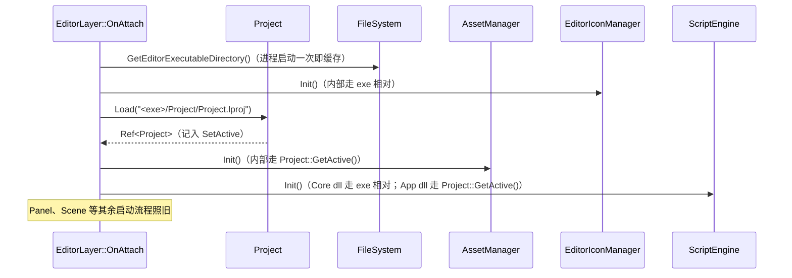
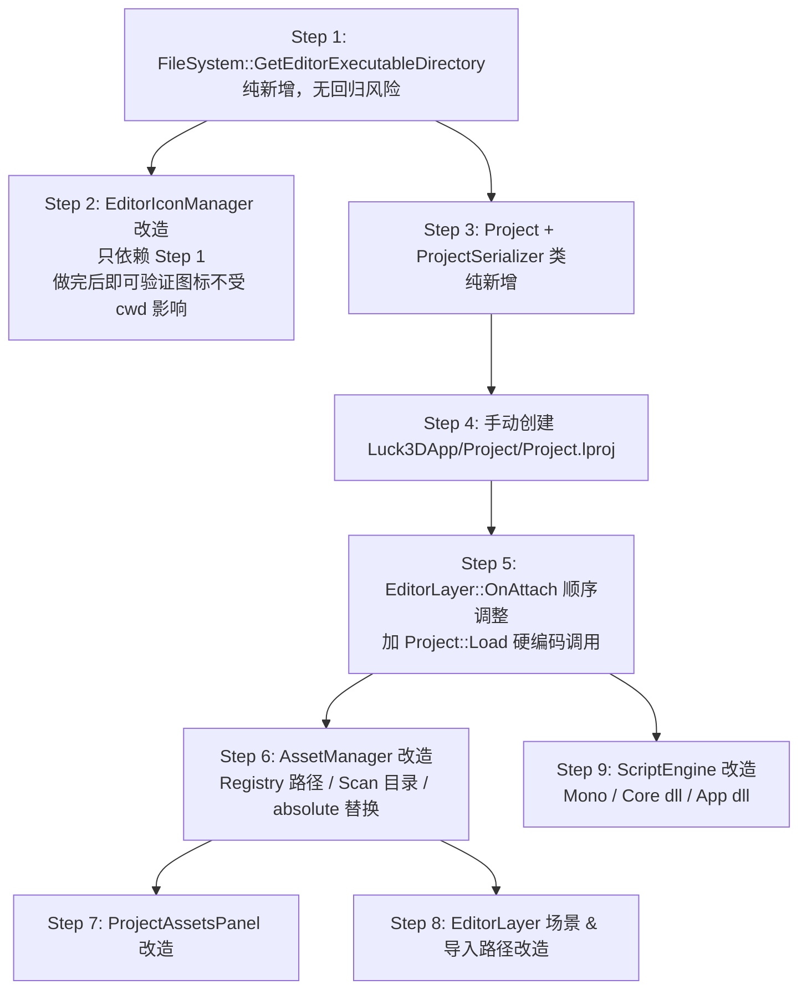

# Phase 1：Project 抽象与路径分层（第 1/2/3 层）设计文档

> 本文档覆盖 [Project_System_Roadmap.md](./Project_System_Roadmap.md) 中的**第 1 层（`.lproj` 项目描述文件）**、**第 2 层（`Project` 类）**、**第 3 层（三类路径拆分）**。目标：把当前"代码全部相对 cwd"的实现，改造为"代码只依赖 `FileSystem::GetEditorExecutableDirectory()` 和 `Project::GetActive()` 两个抽象"。做完这三层后，编辑器完全脱离 cwd 依赖，为"命令行 `--project` 打开任意项目"和 Unity Hub 式的多项目切换铺好地基。
>
> 代码风格严格遵循 [Coding_Style_Guide.md](../Coding_Style_Guide.md)：Allman 花括号 / 4 空格缩进 / `m_` `s_` 前缀 / 每个控制语句强制花括号 / XML 文档注释 / 智能指针别名 `Ref`/`Scope` / 禁止为对齐而对齐等。

---

## 目录

1. [现状快照与改造范围](#1-现状快照与改造范围)
2. [整体设计](#2-整体设计)
3. [第 1 层：`.lproj` 项目描述文件](#3-第-1-层lproj-项目描述文件)
4. [第 2 层：`Project` 类](#4-第-2-层project-类)
5. [第 3 层：三类路径拆分](#5-第-3-层三类路径拆分)
   - 5.1 [`FileSystem::GetEditorExecutableDirectory()` 新增](#51-filesystemgeteditorexecutabledirectory-新增)
   - 5.2 [3.1 编辑器自用资源改 exe 相对](#52-31-编辑器自用资源改-exe-相对editoriconmanager)
   - 5.3 [3.2 引擎运行时库改 exe 相对](#53-32-引擎运行时库改-exe-相对scriptengine-mono)
   - 5.4 [3.3 项目资产改 Project 相对](#54-33-项目资产改-project-相对assetmanager--panel--editorlayer)
6. [实施顺序与验证清单](#6-实施顺序与验证清单)
7. [附录：完整改动位置索引](#7-附录完整改动位置索引)

---

## 1. 现状快照与改造范围

### 1.1 当前的路径耦合

引擎侧几乎所有的**路径字面量**都散落在少量固定位置，都是**"隐式相对 cwd"**：

| 位置 | 硬编码路径 | 类别 |
|---|---|---|
| [EditorIconManager.cpp](../../Lucky/Source/Lucky/Editor/EditorIconManager.cpp) | `s_IconRootPath = "Resources/Icons"` | ① 编辑器自用资源 |
| [ScriptEngine.cpp](../../Lucky/Source/Lucky/Scripting/ScriptEngine.cpp) `InitMono` | `mono_set_assemblies_path("mono/lib")` | ② 引擎运行时库 |
| [ScriptEngine.cpp](../../Lucky/Source/Lucky/Scripting/ScriptEngine.cpp) `Init` | `"Resources/Scripts/Lucky-ScriptCore.dll"` | ② 引擎运行时库 |
| [ScriptEngine.cpp](../../Lucky/Source/Lucky/Scripting/ScriptEngine.cpp) `Init` | `"Assets/Scripts/Binaries/App.dll"` | ③ 项目资产 |
| [AssetManager.cpp](../../Lucky/Source/Lucky/Asset/AssetManager.cpp) `s_Data` | `RegistryFilePath = "AssetRegistry.lcr"`、`AssetsDirectory = "Assets"` | ③ 项目资产 |
| [AssetManager.cpp](../../Lucky/Source/Lucky/Asset/AssetManager.cpp) `InitBuiltinMeshAssets` | `"Assets/Meshes/Builtin/"` | ③ 项目资产 |
| [ProjectAssetsPanel.cpp](../../Luck3DApp/Source/Panels/ProjectAssetsPanel.cpp) 构造函数 | `m_AssetsDirectory = "Assets"` | ③ 项目资产 |
| [EditorLayer.cpp](../../Luck3DApp/Source/EditorLayer.cpp) `EnsureDefaultScene` | `"Assets" / "Scenes" / "New Scene.luck3d"` | ③ 项目资产 |
| [EditorLayer.cpp](../../Luck3DApp/Source/EditorLayer.cpp) `ImportModel` | `"Assets/Meshes"`、`"Assets/Materials"` | ③ 项目资产 |

**闪退根因**：`Luck3DApp/Assets/` 已迁至 `Luck3DApp/Project/Assets/`，但代码里仍以 cwd 为基点拼相对路径。cwd 无论保持在 `Luck3DApp/`（编辑器资源找到、Assets 找不到）还是切到 `Luck3DApp/Project/`（Assets 找到、编辑器资源找不到），都必然有一类崩。

### 1.2 改造边界

本 Phase **只做以下三件事**：

- 新增 `.lproj` 文件格式与序列化
- 新增 `Project` 单例抽象
- 把上表全部替换为对 `FileSystem::GetEditorExecutableDirectory()` 或 `Project::GetActive()` 的调用

**明确不做**（留给后续 Phase）：

- 命令行 `--project` 参数解析（第 4 层）
- 编辑器菜单 New/Open Project（第 5 层）
- 欢迎面板 / 最近项目（第 6 层）
- C# 工程模板自动生成（第 7 层）
- `Luck3DHub.exe`（第 8 层）
- 修改 cwd 或 `debugdir`（本 Phase 结束后 cwd 由 IDE 默认决定，不做人为干预）

### 1.3 出口标准

1. 编辑器可从 VS 直接启动（cwd = `$(ProjectDir) = Luck3DApp/`），图标、字体、Scene、Assets、ScriptCore 全部正常加载
2. 手动把 cwd 改成任意其他目录（例如 `C:\`），启动 exe，图标 / 场景 / 资产**依然全部正常加载**??这是"脱离 cwd 依赖"的可验证证据
3. `AssetRegistry.lcr` 保存位置在 `Luck3DApp/Project/AssetRegistry.lcr`（不再是 `Luck3DApp/AssetRegistry.lcr`）
4. 用户手动删除 `Luck3DApp/Project/Project.lproj`，编辑器启动报明确错误并退出，而不是隐式使用其它路径

---

## 2. 整体设计

### 2.1 两个抽象

设计文档追求的最终形态是：**代码里再也不出现任何以 cwd 为基点的相对路径**。所有路径都从下面两个函数派生：

```cpp
FileSystem::GetEditorExecutableDirectory()  // 定位编辑器自身携带的一切
Project::GetActive()->GetXxx()              // 定位当前项目相关的一切
```

其他所有"Assets/xxx"、"Resources/Icons/xxx"、"mono/lib"这类字符串常量，一律改为从上面两个函数派生。

### 2.2 生命周期



**关键顺序**：`FileSystem` → `EditorIconManager::Init` → `Project::Load` → `AssetManager::Init` → `ScriptEngine::Init`。

`EditorIconManager::Init` 只依赖 `FileSystem`（第 3.1 层），可以放在 `Project::Load` 之前，这样即使项目加载失败，图标仍能加载、退出前的错误弹窗也能显示。

### 2.3 模块位置

```
Lucky/Source/Lucky/
├─ Core/
│   └─ FileSystem.h/.cpp              新增：GetEditorExecutableDirectory()
├─ Project/                            新增目录
│   ├─ Project.h/.cpp                  新增：Project 类
│   └─ ProjectSerializer.h/.cpp        新增：.lproj YAML 序列化
├─ Editor/
│   └─ EditorIconManager.cpp           修改：s_IconRootPath 走 FileSystem
├─ Asset/
│   └─ AssetManager.cpp                修改：s_Data 走 Project::GetActive()
└─ Scripting/
    └─ ScriptEngine.cpp                修改：三处硬编码替换

Luck3DApp/Source/
├─ EditorLayer.cpp                     修改：OnAttach 调 Project::Load；场景/资产路径走 Project
└─ Panels/
    └─ ProjectAssetsPanel.cpp          修改：m_AssetsDirectory 走 Project::GetActive()
```

---

## 3. 第 1 层：`.lproj` 项目描述文件

### 3.1 目标

- 一个纯 YAML 文件，物理放在项目根目录下（例如 `Luck3DApp/Project/Project.lproj`）
- 描述项目名、版本、Assets 子目录、脚本产物路径、启动场景等**长期不变**的项目级配置
- 判定一个目录"是不是 Luck3D 项目"的**唯一依据**：目录内有没有 `.lproj` 文件

### 3.2 文件格式（本 Phase 版本）

```yaml
Project:
  Name: Sandbox
  EngineVersion: 0.1.0
  AssetDirectory: Assets
  ScriptModulePath: Binaries/Assembly-CSharp.dll
  DefaultNamespace: Sandbox
  StartScene: Assets/Scenes/New Scene.luck3d
```

- `Name`：项目名，未来给 Hub / 窗口标题使用
- `EngineVersion`：**只作为记录**，本 Phase 不做兼容校验（避免过度设计）
- `AssetDirectory`：Assets 子目录名，本 Phase **固定为 `"Assets"`**，但字段保留可配置以对齐 Unity（`Assets/` 是 Unity 的硬约定）
- `ScriptModulePath`：用户 C# 程序集相对项目根的路径（对齐 Roadmap 中 `Binaries/Assembly-CSharp.dll` 的产物落地）
- `DefaultNamespace`：新建脚本时的默认命名空间，本 Phase 只序列化不使用
- `StartScene`：项目默认打开的场景（相对项目根，本 Phase 由 `EditorLayer::EnsureDefaultScene` 读取）

### 3.3 方案选型：文件位置与命名

#### 方案 A（推荐 ?）：项目根目录直接放 `Project.lproj`

**优点**：
- 语义清晰：一个目录 + 一个描述文件 = 一个项目
- 用户在文件资源管理器里一眼能看出这是 Luck3D 项目
- 与 Unreal 的 `.uproject` 惯例一致（Unreal 用 `MyGame.uproject`，我们用固定名 `Project.lproj`）
- 未来加双击关联时非常直接（`.lproj` → `Luck3DApp.exe`）

**缺点**：
- 项目根目录多一个文件

#### 方案 B：项目描述文件命名为 `<ProjectName>.lproj`

**优点**：
- 文件资源管理器里能通过文件名一眼看到项目名
- 与 Unreal 完全一致

**缺点**：
- 需要额外维护"文件名 == 项目名"的一致性（重命名项目要同时改文件名）
- 打开项目时需要在目录里搜索 `*.lproj` 而不是直接判断 `Project.lproj` 是否存在，多一次 IO

#### 方案 C：使用 `ProjectSettings/` 子目录（对齐 Unity）

**优点**：
- 与 Unity 完全一致
- 未来可以在子目录里放很多分片配置（GraphicsSettings、Physics、Tags、Layers 等）

**缺点**：
- 首版设计过于沉重，Unity 那套是历经多年演化的结果
- 本 Phase 只有 6 个字段，用单文件足够；到未来字段膨胀时再拆分即可（这是"演进得起"的方向）

#### 推荐方案：A

**理由**：命名简单、判定简单、迁移成本低。未来若字段膨胀到需要分片，改为 `Project.lproj` 单文件仍保留，其他分片放 `ProjectSettings/` 即可（Unity 后期也是主索引 + 分片的模式），当前不做过度设计。

### 3.4 方案选型：序列化格式

#### 方案 A（推荐 ?）：YAML

**优点**：
- 项目已有 `yaml-cpp` 依赖（`.luck3d` 场景、`.lmat` 材质、`AssetRegistry.lcr` 全用 YAML）
- 有现成的 `Lucky/Serialization/YamlHelpers.h` 辅助函数
- 人工可读、可 Git diff、可手动编辑

**缺点**：
- 加载性能不如二进制，但项目描述文件只在启动时读一次，性能不敏感

#### 方案 B：JSON

**优点**：
- 也是纯文本、可 diff

**缺点**：
- 项目未引入 JSON 依赖，需要额外引入 nlohmann/json 或 rapidjson
- 与项目其他持久化格式不一致

#### 方案 C：自定义二进制

**优点**：
- 加载最快

**缺点**：
- 无法手动编辑、无法 diff、迁移期难以调试
- 与项目现有全 YAML 的持久化基调冲突

#### 推荐方案：A

**理由**：与项目现有序列化生态完全一致；启动一次读取的性能开销可忽略。

### 3.5 接口设计

新增 [Lucky/Source/Lucky/Project/ProjectSerializer.h](../../Lucky/Source/Lucky/Project/ProjectSerializer.h)：

```cpp
#pragma once

#include "Lucky/Core/Base.h"
#include "Project.h"

#include <filesystem>

namespace Lucky
{
    /// <summary>
    /// .lproj 文件的 YAML 序列化 / 反序列化
    /// </summary>
    class ProjectSerializer
    {
    public:
        /// <summary>
        /// 序列化 Project 到 .lproj 文件
        /// </summary>
        /// <param name="project">要保存的 Project</param>
        /// <param name="filepath">.lproj 文件绝对路径</param>
        /// <returns>是否成功</returns>
        static bool Serialize(const Ref<Project>& project, const std::filesystem::path& filepath);

        /// <summary>
        /// 反序列化 .lproj 文件到 Project
        /// </summary>
        /// <param name="filepath">.lproj 文件绝对路径</param>
        /// <returns>加载成功返回 Project，失败返回 nullptr</returns>
        static Ref<Project> Deserialize(const std::filesystem::path& filepath);
    };
}
```

**实现要点**：
- 内部使用 `yaml-cpp` 的 `Emitter` / `LoadFile`（对齐 [AssetRegistry.cpp](../../Lucky/Source/Lucky/Asset/AssetRegistry.cpp) 的写法）
- `Deserialize` 失败（文件不存在、YAML 解析错误、缺少必需字段 `Name` / `AssetDirectory`）时打 `LF_CORE_ERROR` 并返回 `nullptr`
- 序列化时字段固定顺序：`Name` → `EngineVersion` → `AssetDirectory` → `ScriptModulePath` → `DefaultNamespace` → `StartScene`（便于 diff 稳定）

---

## 4. 第 2 层：`Project` 类

### 4.1 目标

一个引擎级单例（`static Ref<Project> s_ActiveProject`），全局唯一表征"当前打开的项目"。所有需要项目相关路径的代码都调 `Project::GetActive()->GetXxx()`，不直接拼字符串。

### 4.2 接口设计

新增 [Lucky/Source/Lucky/Project/Project.h](../../Lucky/Source/Lucky/Project/Project.h)：

```cpp
#pragma once

#include "Lucky/Core/Base.h"

#include <filesystem>
#include <string>

namespace Lucky
{
    /// <summary>
    /// 项目配置：与 .lproj 文件字段一一对应
    /// </summary>
    struct ProjectConfig
    {
        std::string Name = "Untitled";                              // 项目名
        std::string EngineVersion = "0.1.0";                        // 记录用引擎版本
        std::string AssetDirectory = "Assets";                      // Assets 子目录名（相对项目根）
        std::string ScriptModulePath = "Binaries/Assembly-CSharp.dll";  // 用户 C# 程序集（相对项目根）
        std::string DefaultNamespace = "Sandbox";                   // 新建脚本的默认命名空间
        std::string StartScene;                                     // 启动场景（相对项目根，可为空）
    };

    /// <summary>
    /// 项目：表示一个已加载的 Luck3D 项目
    /// 提供项目根目录 + 所有项目内路径的绝对/相对路径查询
    /// 由 Project::Load / Project::Create 创建，由 Project::SetActive 设为全局 Active
    /// </summary>
    class Project
    {
    public:
        // ======== 生命周期 ========

        /// <summary>
        /// 从 .lproj 文件加载项目
        /// </summary>
        /// <param name="lprojPath">.lproj 文件绝对路径</param>
        /// <returns>加载成功返回 Project，失败返回 nullptr</returns>
        static Ref<Project> Load(const std::filesystem::path& lprojPath);

        /// <summary>
        /// 创建一个内存中的项目（不落盘）
        /// 用于新建项目场景、单元测试
        /// </summary>
        /// <param name="projectDirectory">项目根目录绝对路径</param>
        /// <param name="config">项目配置</param>
        static Ref<Project> Create(const std::filesystem::path& projectDirectory, const ProjectConfig& config);

        // ======== Active 单例 ========

        /// <summary>
        /// 获取当前 Active 项目（未加载时返回 nullptr）
        /// </summary>
        static const Ref<Project>& GetActive() { return s_ActiveProject; }

        /// <summary>
        /// 设为 Active 项目（一般在 Load 内部调用；也允许外部显式切换）
        /// </summary>
        static void SetActive(Ref<Project> project);

        /// <summary>
        /// 清除 Active 项目（Shutdown 时调用）
        /// </summary>
        static void ClearActive();

        // ======== 只读查询 ========

        /// <summary>
        /// 项目根目录（绝对路径，正斜杠）
        /// </summary>
        const std::filesystem::path& GetProjectDirectory() const { return m_ProjectDirectory; }

        /// <summary>
        /// .lproj 文件绝对路径（Load 传入 / Create 时为空）
        /// </summary>
        const std::filesystem::path& GetProjectFilePath() const { return m_ProjectFilePath; }

        /// <summary>
        /// 项目配置（可读，运行期不修改）
        /// </summary>
        const ProjectConfig& GetConfig() const { return m_Config; }

        // ======== 派生路径 ========

        /// <summary>
        /// Assets 目录绝对路径 = ProjectDirectory / AssetDirectory
        /// </summary>
        std::filesystem::path GetAssetDirectory() const;

        /// <summary>
        /// AssetRegistry.lcr 文件绝对路径（固定在项目根下）
        /// </summary>
        std::filesystem::path GetAssetRegistryPath() const;

        /// <summary>
        /// 用户 C# 程序集绝对路径 = ProjectDirectory / ScriptModulePath
        /// </summary>
        std::filesystem::path GetScriptModulePath() const;

        /// <summary>
        /// 启动场景绝对路径（StartScene 为空时返回空 path）
        /// </summary>
        std::filesystem::path GetStartScenePath() const;

        /// <summary>
        /// 把项目内相对路径转为绝对路径
        /// </summary>
        /// <param name="relativePath">相对项目根的路径（如 "Assets/Scenes/New Scene.luck3d"）</param>
        std::filesystem::path ResolveAbsolute(const std::filesystem::path& relativePath) const;

        /// <summary>
        /// 把绝对路径转为项目内相对路径（正斜杠格式）；若不在项目内返回空字符串
        /// </summary>
        std::string MakeRelative(const std::filesystem::path& absolutePath) const;

    private:
        Project() = default;

        friend class ProjectSerializer;

    private:
        std::filesystem::path m_ProjectDirectory;   // 项目根绝对路径
        std::filesystem::path m_ProjectFilePath;    // .lproj 绝对路径（Create 时为空）
        ProjectConfig m_Config;                     // 项目配置

        static Ref<Project> s_ActiveProject;        // 全局唯一 Active
    };
}
```

### 4.3 方案选型：Active 存储方式

#### 方案 A（推荐 ?）：静态成员 `s_ActiveProject`

**优点**：
- 简单、直接
- 与项目现有单例风格一致（`Renderer2D`、`SceneManager`、`Input` 都是全静态方法）
- 不引入 Application 依赖（`Project` 层级低于 `Application`）

**缺点**：
- 单元测试若并行执行会互相干扰（但项目暂无并发测试）

#### 方案 B：挂在 `Application` 上作为成员

**优点**：
- 生命周期与 Application 强绑定
- 语义上"项目属于应用实例"

**缺点**：
- `Project` 是 `Lucky/Project/`，`Application` 是 `Lucky/Core/`，反向依赖不好
- 每次访问都要 `Application::GetInstance().GetActiveProject()->...`，冗长
- 与现有 `SceneManager` 等纯静态类风格不一致

#### 方案 C：全局 Service Locator

**优点**：
- 便于替换 mock
- 便于扩展未来的 SubSystem 管理

**缺点**：
- 项目当前没有 Service Locator 基建，为一个 `Project` 引入太重
- 与现有静态类完全冲突

#### 推荐方案：A

**理由**：与项目已有静态类模式（[Coding_Style_Guide.md §13.2](../Coding_Style_Guide.md)）完全一致，最简单直接。

### 4.4 方案选型：路径存储用绝对还是相对

#### 方案 A（推荐 ?）：`m_ProjectDirectory` 存**绝对路径**

**优点**：
- 未来 cwd 无论怎么变，`GetAssetDirectory()` 拼出来的仍然是有效绝对路径
- `ProjectAssetsPanel`、`Scene::Load` 等消费方只需要 `std::filesystem::path` 拼接，不再自己 `absolute()`
- 与 Unity 内部 `Application.dataPath` 是绝对路径的选择一致

**缺点**：
- `.lproj` 里如果放绝对路径会破坏项目可移植性（不同人的机器上路径不同）??但 `.lproj` 里我们**只存字段值**（如 `AssetDirectory: Assets`），**不存项目根绝对路径**（项目根就是 `.lproj` 所在目录，Load 时从参数派生）

#### 方案 B：`m_ProjectDirectory` 存**相对 cwd 的路径**

**优点**：
- 老代码风格延续

**缺点**：
- **恰好就是我们要消灭的祸根**??第 3 层的核心就是让代码不依赖 cwd

#### 推荐方案：A

**理由**：目标是消灭 cwd 依赖，所以内部路径统一存绝对路径；`.lproj` 文件本身不含绝对路径信息，通过"`.lproj` 所在目录 = 项目根"的隐式约定保证可移植。

### 4.5 关键实现骨架

```cpp
// Lucky/Source/Lucky/Project/Project.cpp
#include "lcpch.h"
#include "Project.h"
#include "ProjectSerializer.h"

namespace Lucky
{
    Ref<Project> Project::s_ActiveProject = nullptr;

    Ref<Project> Project::Load(const std::filesystem::path& lprojPath)
    {
        if (!std::filesystem::exists(lprojPath))
        {
            LF_CORE_ERROR("Project::Load - .lproj file not found: '{0}'", lprojPath.string());
            return nullptr;
        }

        Ref<Project> project = ProjectSerializer::Deserialize(lprojPath);
        if (!project)
        {
            return nullptr;
        }

        // 项目根 = .lproj 所在目录（规范化为绝对路径）
        project->m_ProjectFilePath = std::filesystem::absolute(lprojPath).lexically_normal();
        project->m_ProjectDirectory = project->m_ProjectFilePath.parent_path();

        SetActive(project);

        LF_CORE_INFO("Project::Load - Loaded '{0}' at '{1}'", project->m_Config.Name, project->m_ProjectDirectory.string());
        return project;
    }

    Ref<Project> Project::Create(const std::filesystem::path& projectDirectory, const ProjectConfig& config)
    {
        Ref<Project> project = Ref<Project>(new Project());
        project->m_ProjectDirectory = std::filesystem::absolute(projectDirectory).lexically_normal();
        project->m_Config = config;
        return project;
    }

    void Project::SetActive(Ref<Project> project)
    {
        s_ActiveProject = project;
    }

    void Project::ClearActive()
    {
        s_ActiveProject.reset();
    }

    std::filesystem::path Project::GetAssetDirectory() const
    {
        return m_ProjectDirectory / m_Config.AssetDirectory;
    }

    std::filesystem::path Project::GetAssetRegistryPath() const
    {
        return m_ProjectDirectory / "AssetRegistry.lcr";
    }

    std::filesystem::path Project::GetScriptModulePath() const
    {
        return m_ProjectDirectory / m_Config.ScriptModulePath;
    }

    std::filesystem::path Project::GetStartScenePath() const
    {
        if (m_Config.StartScene.empty())
        {
            return {};
        }
        return m_ProjectDirectory / m_Config.StartScene;
    }

    std::filesystem::path Project::ResolveAbsolute(const std::filesystem::path& relativePath) const
    {
        return (m_ProjectDirectory / relativePath).lexically_normal();
    }

    std::string Project::MakeRelative(const std::filesystem::path& absolutePath) const
    {
        std::error_code ec;
        std::filesystem::path rel = std::filesystem::relative(absolutePath, m_ProjectDirectory, ec);
        if (ec || rel.empty() || rel.native().rfind(L"..", 0) == 0)
        {
            return {};
        }
        return rel.generic_string();
    }
}
```

**注意事项**：
- `Project` 构造函数私有，`Load` / `Create` 是唯二入口（`Ref<Project>(new Project())` 手动构造走友元 / 私有构造，也可以用 `struct Access` 包装，本 Phase 保持简单直接 `new Project()` 后交给 `Ref` 接管）
- 所有返回的路径都在拼接后立刻 `.lexically_normal()`，保证跨平台一致（正斜杠输出交给 `.generic_string()`）
- `MakeRelative` 用于 UI 显示时把绝对路径反算为相对??防止越过项目根（`..` 前缀）返回空

### 4.6 与 [Coding_Style_Guide.md](../Coding_Style_Guide.md) 的对齐清单

- ? 类名 PascalCase：`Project` / `ProjectConfig` / `ProjectSerializer`
- ? 私有成员 `m_` 前缀：`m_ProjectDirectory` / `m_Config`
- ? 静态成员 `s_` 前缀：`s_ActiveProject`
- ? 公有成员 PascalCase：`ProjectConfig::Name` / `ProjectConfig::AssetDirectory`
- ? 头文件保护 `#pragma once`
- ? 每条 `if` / `else` 都强制花括号
- ? 内联 Getter 保留在头文件：`GetProjectDirectory()` / `GetActive()`
- ? `struct`（POD）用于 `ProjectConfig`；`class` 用于 `Project`
- ? XML `/// <summary>` 文档注释覆盖公有接口
- ? 智能指针用 `Ref<Project>` 而非 `std::shared_ptr<Project>`
- ? 单空格普通风格，不做等号对齐

---

## 5. 第 3 层：三类路径拆分

### 5.1 `FileSystem::GetEditorExecutableDirectory()` 新增

#### 5.1.1 接口

新增 [Lucky/Source/Lucky/Core/FileSystem.h](../../Lucky/Source/Lucky/Core/FileSystem.h)：

```cpp
#pragma once

#include <filesystem>

namespace Lucky
{
    /// <summary>
    /// 文件系统工具（平台无关封装）
    /// </summary>
    class FileSystem
    {
    public:
        /// <summary>
        /// 获取编辑器可执行文件所在目录（首次调用后缓存）
        /// 用于定位所有随 exe 一起分发的资源（图标、字体、Mono、内置 shader 等）
        /// </summary>
        /// <returns>exe 所在目录的绝对路径</returns>
        static const std::filesystem::path& GetEditorExecutableDirectory();
    };
}
```

#### 5.1.2 Windows 实现

```cpp
// Lucky/Source/Lucky/Core/FileSystem.cpp
#include "lcpch.h"
#include "FileSystem.h"

#ifdef LF_PLATFORM_WINDOWS
    #include <Windows.h>
#endif

namespace Lucky
{
    const std::filesystem::path& FileSystem::GetEditorExecutableDirectory()
    {
        static std::filesystem::path s_ExeDir = []
        {
#ifdef LF_PLATFORM_WINDOWS
            wchar_t buffer[MAX_PATH] = { 0 };
            DWORD length = ::GetModuleFileNameW(nullptr, buffer, MAX_PATH);
            LF_CORE_ASSERT(length > 0 && length < MAX_PATH, "GetModuleFileNameW failed");
            return std::filesystem::path(buffer).parent_path().lexically_normal();
#else
            LF_CORE_ASSERT(false, "GetEditorExecutableDirectory not implemented for this platform");
            return std::filesystem::current_path();
#endif
        }();

        return s_ExeDir;
    }
}
```

**关键点**：
- `static` 局部变量惰性初始化：进程内首次调用时初始化，之后无锁读取；C++11 保证线程安全
- 用 lambda + 立即调用简化初始化写法
- Windows 用 `GetModuleFileNameW`（宽字符）保证中文路径兼容
- `LF_PLATFORM_WINDOWS` 宏项目已有（`filter "system:windows" defines { "WINDOWS" }`??本 Phase 沿用现有的 `WINDOWS` 宏或补充 `LF_PLATFORM_WINDOWS`，与 [Base.h](../../Lucky/Source/Lucky/Core/Base.h) 现有约定一致）
- 未来跨平台时补 `LF_PLATFORM_LINUX` 分支（`readlink("/proc/self/exe")`）和 macOS 分支（`_NSGetExecutablePath`）

#### 5.1.3 方案选型：路径来源

##### 方案 A（推荐 ?）：`GetModuleFileNameW(nullptr, ...)`

**优点**：
- Windows 原生 API，永远正确指向当前进程 exe
- 不受 cwd、`argv[0]`、`PATH` 环境变量影响
- 支持 Unicode 路径

**缺点**：
- 平台相关（但引擎本就 Windows-first）

##### 方案 B：从 `argv[0]` 派生

**优点**：
- 跨平台简单

**缺点**：
- `argv[0]` 可以被启动器伪造（Unity Hub 就常这么做）
- 通过 `PATH` 启动时 `argv[0]` 只有 basename，需要额外搜索
- 不可靠

##### 方案 C：假设 cwd 就是 exe 所在目录

**优点**：
- 零实现

**缺点**：
- **与本 Phase 目标完全冲突**（就是要消灭 cwd 依赖）

##### 推荐方案：A

### 5.2 3.1 编辑器自用资源改 exe 相对（EditorIconManager）

#### 5.2.1 现状代码位置

[EditorIconManager.cpp](../../Lucky/Source/Lucky/Editor/EditorIconManager.cpp) 顶部：

```cpp
static constexpr const char* s_IconRootPath = "Resources/Icons";

static Ref<Texture2D> LoadIcon(const std::string& relativePath)
{
    std::string fullPath = std::string(s_IconRootPath) + "/" + relativePath;
    Ref<Texture2D> texture = Texture2D::Create(fullPath);
    // ...
}
```

#### 5.2.2 改造方案

##### 方案 A（推荐 ?）：改为 `std::filesystem::path` 全局变量，运行时从 `FileSystem` 派生

```cpp
// 顶部：
#include "Lucky/Core/FileSystem.h"

// s_IconRootPath 类型改为 std::filesystem::path，去掉 constexpr（因为初值需要运行时计算）
static const std::filesystem::path& GetIconRootPath()
{
    static const std::filesystem::path s_IconRootPath =
        FileSystem::GetEditorExecutableDirectory() / "Resources" / "Icons";
    return s_IconRootPath;
}

static Ref<Texture2D> LoadIcon(const std::string& relativePath)
{
    std::filesystem::path fullPath = GetIconRootPath() / relativePath;
    Ref<Texture2D> texture = Texture2D::Create(fullPath.string());
    // ...（其余不变）
}
```

**优点**：
- 静态局部变量惰性初始化，只算一次
- 类型 `std::filesystem::path` 后可以用 `/` 拼接，比 `std::string + "/"` 更安全
- 首次调用发生在 `EditorIconManager::Init()`，此时 `FileSystem` 已可用（`FileSystem` 只依赖 Win32 API，无前置初始化需求）

**缺点**：
- 从 `constexpr const char*` 换成 `static const` 局部变量，牺牲了一点编译期常量语义（可忽略）

##### 方案 B：`Init(const std::filesystem::path& exeDir)` 让调用方注入

**优点**：
- 显式依赖

**缺点**：
- 需要修改所有 `EditorIconManager::Init()` 的调用点
- 项目内只有 [EditorLayer.cpp](../../Luck3DApp/Source/EditorLayer.cpp) 一个调用点，注入的价值不大
- 增加 API 表面积

##### 方案 C：`Texture2D::Create` 内部统一处理"Resources/"前缀 → exe 相对

**优点**：
- 一处改动覆盖所有加载

**缺点**：
- Texture2D 是引擎渲染层，与"编辑器资源"这个上层语义耦合
- 未来加载"项目资产纹理"也会走 Texture2D，很难区分该走 exe 相对还是 Project 相对
- **严重违反分层**，排除

##### 推荐方案：A

**理由**：变更局部、语义清晰、零 API 表面积扩大。

#### 5.2.3 落地清单

- [EditorIconManager.cpp](../../Lucky/Source/Lucky/Editor/EditorIconManager.cpp)：
  - 删除 `static constexpr const char* s_IconRootPath = "Resources/Icons";`
  - 新增 `static const std::filesystem::path& GetIconRootPath()`
  - `LoadIcon` 内 `fullPath` 拼接改为 `GetIconRootPath() / relativePath`
  - `#include "Lucky/Core/FileSystem.h"`

**注意**：其他"编辑器自用"资源（未来会有字体等）应参考同样模式，本 Phase 只有图标一处需要改。

### 5.3 3.2 引擎运行时库改 exe 相对（ScriptEngine + Mono）

#### 5.3.1 现状代码位置

[ScriptEngine.cpp](../../Lucky/Source/Lucky/Scripting/ScriptEngine.cpp)：

```cpp
void ScriptEngine::Init()
{
    // ...
    LoadCoreAssembly("Resources/Scripts/Lucky-ScriptCore.dll");       // ← 相对 cwd
    LoadAppAssembly("Assets/Scripts/Binaries/App.dll");               // ← 这条属于 3.3，见 5.4
    // ...
}

void ScriptEngine::InitMono()
{
    mono_set_assemblies_path("mono/lib");                            // ← 相对 cwd
    // ...
}
```

#### 5.3.2 改造方案

**统一把两处编辑器自带路径拼在 `FileSystem::GetEditorExecutableDirectory()` 上**：

```cpp
void ScriptEngine::Init()
{
    s_Data = new ScriptEngineData();

    InitMono();

    const std::filesystem::path exeDir = FileSystem::GetEditorExecutableDirectory();
    LoadCoreAssembly(exeDir / "Resources" / "Scripts" / "Lucky-ScriptCore.dll");

    // App dll 属于项目资产，走 Project::GetActive()（详见 5.4）
    if (const Ref<Project>& project = Project::GetActive())
    {
        LoadAppAssembly(project->GetScriptModulePath());
    }

    LoadAssemblyClasses();
    // ...
}

void ScriptEngine::InitMono()
{
    // Mono 库目录跟随 exe 分发
    const std::filesystem::path monoLibDir = FileSystem::GetEditorExecutableDirectory() / "mono" / "lib";
    mono_set_assemblies_path(monoLibDir.string().c_str());

    MonoDomain* rootDomain = mono_jit_init("LuckyJITRuntime");
    LF_CORE_ASSERT(rootDomain, "ScriptEngine: mono_jit_init failed");

    s_Data->RootDomain = rootDomain;
}
```

**方案讨论**：只有一个合理选项??把 exe 相对路径显式化。备选方案（Mono runtime 安装到系统 `PATH` 或走 `MONO_PATH` 环境变量）都会破坏"绿色可分发"，直接排除。

#### 5.3.3 落地清单

- [ScriptEngine.cpp](../../Lucky/Source/Lucky/Scripting/ScriptEngine.cpp)：
  - 顶部添加 `#include "Lucky/Core/FileSystem.h"` 和 `#include "Lucky/Project/Project.h"`
  - `InitMono()`：`mono_set_assemblies_path` 走 `FileSystem::GetEditorExecutableDirectory() / "mono" / "lib"`
  - `Init()`：`LoadCoreAssembly` 走 `FileSystem::GetEditorExecutableDirectory() / "Resources" / "Scripts" / "Lucky-ScriptCore.dll"`
  - `Init()`：`LoadAppAssembly` 走 `Project::GetActive()->GetScriptModulePath()`（详见 5.4 的"跨类别复用"）
- `LoadCoreAssembly` / `LoadAppAssembly` 参数保持 `const std::filesystem::path&`，无需修改签名

### 5.4 3.3 项目资产改 Project 相对（AssetManager / Panel / EditorLayer）

#### 5.4.1 现状梳理

| 位置 | 硬编码 | 用途 |
|---|---|---|
| `AssetManager::s_Data.RegistryFilePath` | `"AssetRegistry.lcr"` | Registry 保存/加载路径 |
| `AssetManager::s_Data.AssetsDirectory` | `"Assets"` | `Refresh()` 扫描根 |
| `AssetManager::InitBuiltinMeshAssets` | `"Assets/Meshes/Builtin/"` | 内置图元生成路径 |
| `AssetManager::MoveAsset / DeleteAsset` 内 `absolute()` | 隐式相对 cwd | 计算磁盘绝对路径 |
| `AssetManager::CreateAsset / EnsureAsset / ImportModel` 内 `absolute()` | 隐式相对 cwd | 计算磁盘绝对路径 |
| `ProjectAssetsPanel` 构造函数 | `m_AssetsDirectory = "Assets"` | UI 根目录 |
| `EditorLayer::EnsureDefaultScene` | `"Assets" / "Scenes" / "New Scene.luck3d"` | 默认场景路径 |
| `EditorLayer::ImportModel` | `"Assets/Meshes"` / `"Assets/Materials"` | 导入产物落地 |
| `ScriptEngine::Init` | `"Assets/Scripts/Binaries/App.dll"` | 用户 C# 程序集 |

#### 5.4.2 改造原则

**存储的相对路径不变，解析绝对路径时改为相对 Project 根**：

- `AssetMetadata::FilePath` 里存的值仍是 `"Assets/Scenes/xxx.luck3d"` 这样的项目内相对路径（这是资产系统的对外契约，跨项目、跨机器都可移植）
- 所有把相对路径转绝对的地方，把 `std::filesystem::absolute(rel)` **替换为** `Project::GetActive()->ResolveAbsolute(rel)`

**为什么不改 `AssetMetadata::FilePath` 的语义**：
- 若改为存绝对路径，`AssetRegistry.lcr` 就不能跨机器共享（每台机器项目根不同）
- 现有 Scene 序列化里存的都是相对路径（Handle → 相对路径），改了会破坏兼容

#### 5.4.3 方案选型：`AssetManager` 内如何拿到 Project 路径

##### 方案 A（推荐 ?）：直接调 `Project::GetActive()`

```cpp
void AssetManager::Init()
{
    LF_CORE_ASSERT(Project::GetActive(), "AssetManager::Init requires an active Project");

    // Importers 注册（不变）
    s_Data.Importers[AssetType::Material] = CreateScope<MaterialImporter>();
    // ...

    // Registry 加载：从 Project 拿绝对路径
    s_Data.Registry.Load(Project::GetActive()->GetAssetRegistryPath().string());

    InitBuiltinMeshAssets();
    RefreshResult result = Refresh();
    // ...
}

RefreshResult AssetManager::Refresh()
{
    RefreshResult result;

    std::set<std::string> diskPaths;
    // 扫描目录改为 Project 的绝对 Assets 目录
    // ScanDirectory 内部要把绝对路径反算为"相对项目根"的相对路径
    ScanDirectory(Project::GetActive()->GetAssetDirectory(), outPaths);
    // ...
}
```

**优点**：
- 代码最直接，读者一眼看懂"这个路径归属项目"
- 无 API 表面积扩大

**缺点**：
- 每处调用都要 `Project::GetActive()`，如果 `Active` 为空要有防御

##### 方案 B：把 Project 路径缓存到 `AssetManager::s_Data`

```cpp
struct AssetManagerData
{
    std::filesystem::path RegistryFilePath;
    std::filesystem::path AssetsDirectory;
    // ...
};

void AssetManager::Init()
{
    s_Data.RegistryFilePath = Project::GetActive()->GetAssetRegistryPath();
    s_Data.AssetsDirectory = Project::GetActive()->GetAssetDirectory();
    // ...
}
```

**优点**：
- 后续调用不用重复走 `Project::GetActive()`，性能略优
- 老代码结构改动最小（只是把初始值改成运行时赋值）

**缺点**：
- 若未来支持"运行时切换项目"，需要额外 `Reload` 接口刷新缓存
- 状态多一份副本，容易与 `Project` 不同步

##### 方案 C：让 `AssetManager` 成为 `Project` 的子系统

**优点**：
- 语义最纯正："每个项目有自己的 AssetManager"

**缺点**：
- `AssetManager` 是全静态类，改成实例化是大改
- 面向本 Phase 目标过度设计

##### 推荐方案：A

**理由**：本 Phase 的"运行时切换项目"由重启进程解决（对齐 Unity），不需要 Reload；直接调 `Project::GetActive()` 表达最清晰。若未来性能敏感场景多，再演进到 B。

#### 5.4.4 关键改动逐项列出

##### AssetManager.cpp

```cpp
// 顶部
#include "Lucky/Project/Project.h"

// s_Data 里移除硬编码字段
struct AssetManagerData
{
    AssetRegistry Registry;
    std::unordered_map<AssetHandle, Ref<void>> Cache;
    std::unordered_map<AssetType, Scope<AssetImporter>> Importers;
    // 删除 RegistryFilePath / AssetsDirectory（改从 Project::GetActive() 派生）
};

// Init：调用点走 Project
void AssetManager::Init()
{
    LF_CORE_ASSERT(Project::GetActive(), "AssetManager::Init requires an active Project");

    s_Data.Importers[AssetType::Material] = CreateScope<MaterialImporter>();
    s_Data.Importers[AssetType::Mesh] = CreateScope<MeshImporter>();
    s_Data.Importers[AssetType::Texture2D] = CreateScope<TextureImporter>();
    s_Data.Importers[AssetType::Scene] = CreateScope<SceneImporter>();

    s_Data.Registry.Load(Project::GetActive()->GetAssetRegistryPath().string());

    InitBuiltinMeshAssets();
    RefreshResult result = Refresh();

    LF_CORE_INFO("AssetManager initialized. Registry: {0} assets ({1} added, {2} removed), Importers: {3} registered.",
                 result.Total, result.Added, result.Removed, s_Data.Importers.size());
}

// SaveRegistry
void AssetManager::SaveRegistry()
{
    s_Data.Registry.Save(Project::GetActive()->GetAssetRegistryPath().string());
}

// 所有 std::filesystem::absolute(relativePath) 替换为 Project::GetActive()->ResolveAbsolute(relativePath)
// 例如 CreateAsset：
AssetHandle AssetManager::CreateAsset(const Ref<Asset>& asset, const std::string& filepath)
{
    std::filesystem::path relPath(filepath);
    std::string normalizedPath = relPath.generic_string();
    std::string absolutePath = Project::GetActive()->ResolveAbsolute(relPath).string();
    // ...（其余不变）
}
```

**同类替换清单**（同文件内）：
- `CreateAsset`：`absolutePath` 计算
- `EnsureAsset`：`absolutePath` 计算
- `DeleteAsset`：`absolutePath` 计算
- `MoveAsset`：`oldAbs` / `newAbs` 计算
- `InitBuiltinMeshAssets`：`builtinDir` 改为 `Project::GetActive()->GetAssetDirectory() / "Meshes" / "Builtin"`；`filepath` 计算改为 `Project::GetActive()->ResolveAbsolute(...)`

**`ScanDirectory` 的重构**：

```cpp
void AssetManager::ScanDirectory(const std::filesystem::path& absoluteDirectory,
                                 std::set<std::string>& outPaths)
{
    if (!std::filesystem::exists(absoluteDirectory) || !std::filesystem::is_directory(absoluteDirectory))
    {
        LF_CORE_WARN("AssetManager::ScanDirectory - Directory not found: '{0}'", absoluteDirectory.string());
        return;
    }

    const std::filesystem::path& projectDir = Project::GetActive()->GetProjectDirectory();

    for (const auto& entry : std::filesystem::recursive_directory_iterator(absoluteDirectory))
    {
        if (!entry.is_regular_file())
        {
            continue;
        }

        // 相对项目根目录的相对路径，正斜杠格式（保持 AssetMetadata::FilePath 的既有语义）
        std::error_code ec;
        std::filesystem::path relativePath = std::filesystem::relative(entry.path(), projectDir, ec);
        if (ec)
        {
            continue;
        }

        // 跳过隐藏文件 / 隐藏目录
        bool isHidden = false;
        for (const auto& part : relativePath)
        {
            std::string partStr = part.string();
            if (!partStr.empty() && partStr[0] == '.')
            {
                isHidden = true;
                break;
            }
        }
        if (isHidden)
        {
            continue;
        }

        std::string extension = entry.path().extension().string();
        AssetType type = GetAssetTypeFromExtension(extension);
        if (type == AssetType::None)
        {
            continue;
        }

        outPaths.insert(relativePath.generic_string());
    }
}
```

**要点**：签名从 `const std::string&` 改为 `const std::filesystem::path&`（对应 header 同步修改），入参改为传绝对路径，内部用 `std::filesystem::relative(entry, projectDir)` 算相对路径。

##### ProjectAssetsPanel.cpp / .h

`ProjectAssetsPanel` 构造函数：

```cpp
ProjectAssetsPanel::ProjectAssetsPanel()
{
    SetFlags(ImGuiWindowFlags_NoScrollbar | ImGuiWindowFlags_NoScrollWithMouse);

    // Assets 根改为 Project 派生（绝对路径）
    m_AssetsDirectory = Project::GetActive()->GetAssetDirectory();
    m_CurrentDirectory = m_AssetsDirectory;

    RebuildDirectoryTree();
}
```

**注意**：`m_AssetsDirectory` 字段类型已经是 `std::filesystem::path`，改成绝对路径后所有下游拼接（`m_CurrentDirectory` / `m_RootNode.FullPath`）都是绝对路径，逻辑不变；只有"面向用户显示"或"面向 AssetMetadata 匹配"的地方需要走 `Project::GetActive()->MakeRelative(...)` 反算??这类点当前 `ProjectAssetsPanel` 内部若有硬编码 `"Assets/"` 前缀比较需要顺手清理（本 Phase 只做替换，不改语义）。

##### EditorLayer.cpp

`EnsureDefaultScene`：

```cpp
void EditorLayer::EnsureDefaultScene()
{
    // 默认场景：优先使用 Project.StartScene，未配置时用 Assets/Scenes/New Scene.luck3d
    const Ref<Project>& project = Project::GetActive();

    std::filesystem::path startScene = project->GetStartScenePath();
    if (startScene.empty())
    {
        startScene = project->GetAssetDirectory() / "Scenes" / "New Scene.luck3d";
    }

    // 相对项目根路径（供 AssetMetadata / SceneManager 使用）
    std::string relativePath = project->MakeRelative(startScene);

    if (std::filesystem::exists(startScene))
    {
        SceneManager::OpenScene(std::filesystem::path(relativePath));
        return;
    }

    std::filesystem::create_directories(startScene.parent_path());

    Ref<Scene> scene = CreateRef<Scene>("New Scene");
    // ...（原有场景构造逻辑不变）

    AssetHandle sceneHandle = AssetManager::CreateAsset(scene, relativePath);
    // ...
}
```

`ImportModel`：`"Assets/Meshes"` / `"Assets/Materials"` 分别改为：

```cpp
std::filesystem::path meshesDir = Project::GetActive()->GetAssetDirectory() / "Meshes";
// ...
std::filesystem::path materialsDir = Project::GetActive()->GetAssetDirectory() / "Materials";
```

其中传给 `AssetManager::CreateAsset` 的 `filepath` 仍应是相对项目根的路径，用 `MakeRelative` 反算即可。

**关键**：`OnAttach` 中，`Project::Load` 必须在 `AssetManager` / `ScriptEngine` / `EnsureDefaultScene` 之前完成：

```cpp
void EditorLayer::OnAttach()
{
    LF_TRACE("EditorLayer::OnAttach");

    // 1. Editor 自身资源：只依赖 FileSystem
    EditorIconManager::Init();
    ComponentRegistry::RegisterAll();
    ComponentContextMenuRegistry::RegisterBuiltins();

    // 2. 加载 Project（硬编码 exe 相对路径；未来第 4 层改为命令行）
    const std::filesystem::path lprojPath =
        FileSystem::GetEditorExecutableDirectory() / "Project" / "Project.lproj";
    Ref<Project> project = Project::Load(lprojPath);
    LF_CORE_ASSERT(project, "Failed to load project");

    // 3. 依赖 Project 的子系统
    AssetManager::Init();       // 待新增（当前项目 AssetManager 由 XxxLayer 或 XxxSubSystem 隐式初始化，若无则本 Phase 补上）
    ScriptEngine::Init();       // 待接入（当前 ScriptEngine::Init 尚未在 EditorLayer 显式调用）

    // 4. AssetInspector 注册（不变）
    AssetInspectorRegistry::Register(AssetType::Material,  &MaterialInspector::Draw);
    // ...

    SceneManager::Init();
    m_PanelManager = CreateScope<PanelManager>();
    // Panel 添加（不变）
    // ...

    // 5. 命令行场景 / 默认场景
    auto commandLineArgs = Application::GetInstance().GetSpecification().CommandLineArgs;
    if (commandLineArgs.Count > 1)
    {
        SceneManager::OpenScene(std::filesystem::path(commandLineArgs[1]));
    }
    else
    {
        EnsureDefaultScene();
    }
}
```

**顺序确认**：`FileSystem` → `EditorIconManager::Init`（不依赖 Project）→ `Project::Load` → `AssetManager::Init`（依赖 Project）→ `ScriptEngine::Init`（依赖 Project 拿 App dll 路径）→ 面板 / 场景。

##### ScriptEngine.cpp

见 5.3.2，其中 `LoadAppAssembly("Assets/Scripts/Binaries/App.dll")` 替换为：

```cpp
if (const Ref<Project>& project = Project::GetActive())
{
    LoadAppAssembly(project->GetScriptModulePath());
}
```

这里同时完成了 3.2（Core dll 走 exe）+ 3.3（App dll 走 Project）两类拆分，这一行同时属于 5.3 和 5.4，是"跨类别复用"的自然结果。

#### 5.4.5 兼容性说明

- **AssetMetadata::FilePath 语义不变**：仍是相对项目根的相对路径。旧的 `AssetRegistry.lcr` 文件内容格式完全兼容，不需要迁移工具。
- **cwd 无关性**：改造完成后，进程 cwd 无论指向哪里，都不影响任何资产加载。

---

## 6. 实施顺序与验证清单

### 6.1 严格顺序（不可颠倒）



### 6.2 每步验证点

| 步骤 | 验证方式 |
|---|---|
| Step 1 | 单元级：写一个临时 `LF_CORE_INFO(FileSystem::GetEditorExecutableDirectory().string())` 观察是否正确 |
| Step 2 | 编辑器启动后，把 VS `Debugging → Working Directory` 改成 `C:\`，重启，图标仍能正常加载 |
| Step 3 | 编译通过；`ProjectSerializer::Deserialize` 对不存在文件返回 nullptr |
| Step 4 | `Luck3DApp/Project/Project.lproj` 存在且能被 YAML 校验 |
| Step 5 | 启动日志出现 "Project::Load - Loaded 'Sandbox' at ..." |
| Step 6 | `AssetRegistry.lcr` 保存到 `Luck3DApp/Project/AssetRegistry.lcr`；Content Panel 能看到所有资产 |
| Step 7 | ProjectAssetsPanel 左侧目录树能显示 `Assets/` 下所有子目录 |
| Step 8 | 首次启动能创建默认场景到 `Luck3DApp/Project/Assets/Scenes/New Scene.luck3d`；ImportModel 落地到 `Luck3DApp/Project/Assets/Meshes/` |
| Step 9 | ScriptEngine::Init 日志正常；`Lucky-ScriptCore` 加载成功；App dll 缺失时打 warning 而不是崩 |

### 6.3 出口回归清单

**必须全部通过**：

1. ? 从 VS 直接 F5 启动（cwd = `Luck3DApp/`），编辑器完全正常
2. ? 把 VS `Debugging → Working Directory` 改成 `C:\Windows`，F5 启动，编辑器完全正常（图标、场景、资产、Panel、脚本核心 dll 全部加载成功）??**这是"脱离 cwd 依赖"的证明**
3. ? `AssetRegistry.lcr` 存在 `Luck3DApp/Project/AssetRegistry.lcr`
4. ? 删除 `Luck3DApp/Project/Project.lproj`，启动报明确错误并 assert 失败退出（不是隐式回退）
5. ? 修改 `Project.lproj` 的 `StartScene` 为其他场景路径，启动时打开对应场景
6. ? Play → 移动 Cube → Stop → Cube 位置还原（回归 P0 已有能力）

---

## 7. 附录：完整改动位置索引

### 7.1 新增文件

| 文件 | 说明 |
|---|---|
| [Lucky/Source/Lucky/Core/FileSystem.h](../../Lucky/Source/Lucky/Core/FileSystem.h) | 新增 |
| [Lucky/Source/Lucky/Core/FileSystem.cpp](../../Lucky/Source/Lucky/Core/FileSystem.cpp) | 新增 |
| [Lucky/Source/Lucky/Project/Project.h](../../Lucky/Source/Lucky/Project/Project.h) | 新增 |
| [Lucky/Source/Lucky/Project/Project.cpp](../../Lucky/Source/Lucky/Project/Project.cpp) | 新增 |
| [Lucky/Source/Lucky/Project/ProjectSerializer.h](../../Lucky/Source/Lucky/Project/ProjectSerializer.h) | 新增 |
| [Lucky/Source/Lucky/Project/ProjectSerializer.cpp](../../Lucky/Source/Lucky/Project/ProjectSerializer.cpp) | 新增 |
| `Luck3DApp/Project/Project.lproj` | 新增 |

### 7.2 修改文件

| 文件 | 改动摘要 |
|---|---|
| [Lucky/Source/Lucky/Editor/EditorIconManager.cpp](../../Lucky/Source/Lucky/Editor/EditorIconManager.cpp) | `s_IconRootPath` 走 `FileSystem::GetEditorExecutableDirectory()` |
| [Lucky/Source/Lucky/Asset/AssetManager.h](../../Lucky/Source/Lucky/Asset/AssetManager.h) | `ScanDirectory` 签名 `std::string → std::filesystem::path` |
| [Lucky/Source/Lucky/Asset/AssetManager.cpp](../../Lucky/Source/Lucky/Asset/AssetManager.cpp) | 删除 `s_Data.RegistryFilePath` / `s_Data.AssetsDirectory`；所有 `absolute` 改 `Project::GetActive()->ResolveAbsolute`；`ScanDirectory` 走 `Project` 相对 |
| [Lucky/Source/Lucky/Scripting/ScriptEngine.cpp](../../Lucky/Source/Lucky/Scripting/ScriptEngine.cpp) | `mono_set_assemblies_path`、`LoadCoreAssembly` 走 exe 相对；`LoadAppAssembly` 走 `Project::GetActive()->GetScriptModulePath()` |
| [Luck3DApp/Source/EditorLayer.cpp](../../Luck3DApp/Source/EditorLayer.cpp) | `OnAttach` 顺序调整、`Project::Load`、`EnsureDefaultScene` / `ImportModel` 走 Project |
| [Luck3DApp/Source/Panels/ProjectAssetsPanel.cpp](../../Luck3DApp/Source/Panels/ProjectAssetsPanel.cpp) | `m_AssetsDirectory` 走 `Project::GetActive()->GetAssetDirectory()` |

### 7.3 不改动的文件（重点确认）

- [AssetRegistry.h/.cpp](../../Lucky/Source/Lucky/Asset/AssetRegistry.h)：仍以 `std::string` 相对路径为主键；调用方保证传入项目内相对路径即可
- [SceneImporter.cpp](../../Lucky/Source/Lucky/Asset/SceneImporter.cpp)：走 `AssetMetadata::FilePath`，无硬编码
- [Build-Luck3DApp.lua](../../Luck3DApp/Build-Luck3DApp.lua)：**不再加 `debugdir`**??cwd 由 IDE 默认决定，改动完全在代码里
- [Build-Project.lua](../../Luck3DApp/Project/Build-Project.lua)：用户 C# 工程生成脚本，与本 Phase 无关

---

## 8. 后续 Phase 衔接

做完 1/2/3 层后：

- **第 4 层（命令行 `--project`）**：只需修改 `EditorLayer::OnAttach` 中 `Project::Load(...)` 的入参来源??从命令行拿路径，未拿到时回退到 `FileSystem::GetEditorExecutableDirectory() / "Project" / "Project.lproj"`。改动极小。
- **第 5 层（编辑器菜单 New/Open）**：`Project::Create` + `ProjectSerializer::Serialize` + 重启进程。无需再动本 Phase 建立的抽象。
- **第 6-8 层**：完全在本 Phase 抽象之上叠加 UI 与外部启动器。

这就是本 Phase 的核心价值：**一次到位地把"cwd 依赖"消灭在最底层，后续所有 UI 和入口方式都只是"怎么调用 `Project::SetActive`"的问题**。
