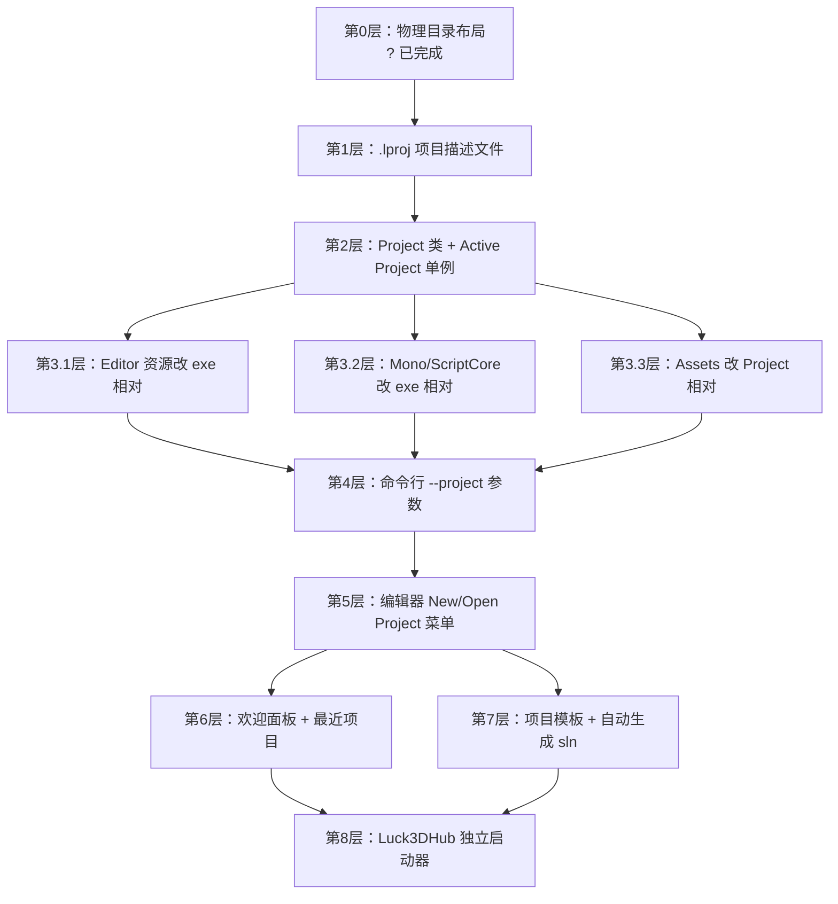

# Project 系统路线图

> 目标：让 Luck3D 编辑器像 Unity 那样，能够"打开任意目录下的一个项目"，从而支持未来的多项目切换、`Luck3DHub` 启动器、命令行 `--project` 等入口。本文档只描述阶段划分与关键决策，不包含具体实现代码。

---

## 0. 背景与最终形态

### 最终形态（对齐 Unity）

用户通过任意方式（命令行 / 编辑器菜单 / 外部 Hub）选择一个项目根目录，编辑器打开后就以该目录作为"当前项目"，加载其中的资产、脚本、场景。

一个典型项目 `TestPro/` 的物理结构：

```
TestPro/
├─ Project.lproj                 项目描述文件（YAML）
├─ Assets/                       所有用户资产
│   ├─ Scenes/xxx.luck3d
│   ├─ Materials/xxx.lmat
│   ├─ Scripts/xxx.cs
│   └─ ...
├─ Binaries/                     C# 编译产物
│   └─ Assembly-CSharp.dll
├─ Intermediates/                C# 中间产物（可删可重建）
├─ AssetRegistry.lcr             资产注册表（可删可重建）
├─ Build-Project.lua             premake 脚本（自动生成 / 模板生成）
├─ Win-GenProject.bat            一键生成 C# sln
├─ Project.sln                   C# 解决方案（自动生成）
└─ Assembly-CSharp.csproj        C# 项目（自动生成）
```

---

## 1. Unity 那几步各自在做什么

拆解 Unity 用户视角的三步操作到底层动作，看清每一步引擎真正执行了什么，是设计 Luck3D 对等实现的前提。

### 步骤 A：UnityHub 创建项目 `TestPro`

UnityHub 是外部启动器，与引擎解耦。它只做三件事：

1. **物理创建目录结构**：`TestPro/Assets/`、`TestPro/ProjectSettings/`、`TestPro/Packages/`、`TestPro/UserSettings/`
2. **写 `ProjectSettings/ProjectVersion.txt`**：记录用哪个 Unity 版本打开（Hub 用来选择 Editor 二进制）
3. **调用对应版本的 `Unity.exe`**：`Unity.exe -projectPath "D:/TestPro"`

Hub **不**是引擎的一部分，本身完全不知道引擎内部结构，做的一切只是"生成项目骨架 + 用命令行参数启动 Editor"。

### 步骤 B：Editor 启动并解析命令行

`Unity.exe` 启动时读 `-projectPath` 参数，把该路径设为 "Active Project"：

1. 校验 `TestPro/ProjectSettings/ProjectVersion.txt`（不存在则视为新项目，创建默认设置）
2. 把项目根路径存到全局 `Application::GetProjectRoot()` 单例，后续所有代码都从这里取
3. **不 chdir**：不修改进程 cwd（Unity Editor 的 cwd 通常还是 exe 目录）；所有相对路径都从 `ProjectRoot` 拼

### 步骤 C：Editor 加载项目

拿到 `ProjectRoot` 后：

1. **读 `ProjectSettings/*.asset`**：图形设置、Tags、Layers、Physics 参数、启动场景等
2. **构建 AssetDatabase**：递归扫描 `<ProjectRoot>/Assets/**`，为每个文件生成/加载 `.meta`（含 GUID），建立 GUID → 路径映射
3. **打开默认场景**：从 `ProjectSettings` 或 `Library/LastSceneManagerSetup.txt` 里读最后一次打开的场景 GUID，用 AssetDatabase 定位物理路径并加载
4. **生成 C# 解决方案**：Editor 内部（IDE 集成模块）用 `Assets/**.cs` + 内置 UnityEditor.dll/UnityEngine.dll 等程序集，动态生成 `<ProjectName>.sln` + `Assembly-CSharp.csproj`（**每次启动都会重新生成 / 更新**，用户不应手动改）
5. **首次编译 C# 脚本**：调用内置 mcs/roslyn 把 `Assets/**.cs` 编译成 `Library/ScriptAssemblies/Assembly-CSharp.dll`
6. **UI 渲染**：编辑器 UI 上下文（图标、字体、内置 Shader、EditorGUI 布局）**全都来自 exe 内嵌资源或 exe 目录下的编辑器安装包**，与 ProjectRoot 无关

### 步骤 D：Hub 打开已有项目

跟步骤 C 完全一样，只是 Hub 不再创建骨架，直接 `Unity.exe -projectPath "D:/TestPro"`。**Editor 里没有任何"启动/关闭当前项目"的隐式流程**??退出编辑器就是退出进程；换项目就是**重启 Editor 进程**（Unity 老版本至今如此，新版有个 "Project → Open Project" 菜单，但内部实现也是重启进程）。

### 步骤 E：`TestPro.sln` 从哪里来

用户看到的 `TestPro.sln` **不是 Hub 生成的、也不是用户维护的**，而是 **Editor 每次检测到 `.cs` 有变动就重新写一次**。用户双击 sln 打开 VS/Rider，改 `.cs`，保存 → Unity 检测到文件变化 → 触发脚本重编译 → hot reload。sln 里的项目文件也是自动生成的，用户不应手动加 `.cs` 到 csproj。

---

## 2. Unity 的四类路径分层

Unity 把"路径"分成**四类完全独立**的东西：

| 类型 | 例子 | 定位方式 | 归属 |
|---|---|---|---|
| ① 编辑器自身资源 | Icons / Fonts / 内置 shader / 内置组件图标 | 相对 **exe 目录** | Editor Install |
| ② 引擎运行时库 | Mono / UnityEngine.dll / native plugin | 相对 **exe 目录** | Editor Install |
| ③ 项目资产 | Assets/Scenes/xxx.unity | 相对 **ProjectRoot** | Project |
| ④ 项目派生数据 | Library/ 、Temp/ 、Logs/ | 相对 **ProjectRoot** | Project（可删可重建）|

Unity 严格不混用这四类??**这也是能"多项目切换"的根基**。

---

## 3. Luck3D 当前的现状

| 四类路径 | Luck3D 现状 | 问题 |
|---|---|---|
| ① 编辑器自身资源 | `Luck3DApp/Resources/Icons/...` | `s_IconRootPath = "Resources/Icons"` 相对 **cwd** |
| ② 引擎运行时库 | `Luck3DApp/Resources/Scripts/Lucky-ScriptCore.dll`、`Luck3DApp/mono/lib/` | 同样相对 **cwd** |
| ③ 项目资产 | `AssetRegistry.lcr` 里存 `Assets/xxx`，Scene 加载 `"Assets/Scenes/xxx.luck3d"` | 相对 **cwd** |
| ④ 项目派生数据 | 无（AssetRegistry 单文件凑合）| ? |

**结论**：Luck3D **把四类路径全塞进"相对 cwd"这一个通道里**，用 cwd = `Luck3DApp/` 一次性喂饱。动 cwd 就是同时动这四类。

**典型踩坑**：给编辑器加 `debugdir "%{wks.location}/Luck3DApp/Project"` 把 cwd 切到 `Luck3DApp/Project/` 后，编辑器启动阶段 `EditorIconManager` 用 `Resources/Icons/...` 加载图标，会解析到不存在的 `Luck3DApp/Project/Resources/Icons/...`，全部加载失败，Toolbar/Hierarchy 用无效 texture ID 渲染，立刻闪退。

---

## 4. 落地路径（按依赖顺序）

### 【第 0 层｜物理目录布局】重新定义"项目根"

```
Luck3DApp/                       编辑器 exe 项目（对应 Unity Editor Install）
├─ Resources/                    编辑器自用资源
├─ mono/                         引擎运行时
└─ Project/                      一个具体的项目（未来可以有多个）
    ├─ Assets/                   项目资产
    ├─ AssetRegistry.lcr
    ├─ Build-Project.lua
    └─ Win-GenProject.bat
```

**状态**：已完成（`Luck3DApp/Project/` 目录已创建，`Assets/` 已迁入）。

### 【第 1 层｜`.lproj` 项目描述文件】? 必须

新增 `<ProjectRoot>/Project.lproj`（YAML）：

```yaml
Project:
  Name: TestPro
  EngineVersion: 0.1.0
  AssetDirectory: Assets
  ScriptModulePath: Binaries/Assembly-CSharp.dll
  DefaultNamespace: TestPro
  StartScene: Assets/Scenes/Default.luck3d
```

**为什么必须**：这个文件是**"这是不是一个 Luck3D 项目"的唯一判据**。以后不管从命令行、Hub、菜单打开，判定方式统一为"目录里有没有 `.lproj`"。

**依赖**：无。

### 【第 2 层｜引擎里加 `Project` 类】? 必须

新增 `Lucky/Source/Lucky/Project/Project.h/.cpp`：

```cpp
class Project
{
public:
    static Ref<Project> Load(const std::filesystem::path& lprojPath);
    static Ref<Project> Create(const std::filesystem::path& projectDir, const std::string& name);
    static Ref<Project> GetActive();
    static void SetActive(Ref<Project> project);

    const std::filesystem::path& GetProjectDirectory() const;
    std::filesystem::path GetAssetDirectory() const;        // ProjectDir / AssetDirectory
    std::filesystem::path GetAssetRegistryPath() const;     // ProjectDir / AssetRegistry.lcr
    std::filesystem::path GetScriptModulePath() const;      // ProjectDir / Binaries/Assembly-CSharp.dll
    std::filesystem::path GetProjectFilePath() const;       // .lproj 本身
};
```

**为什么必须**：把散落各处的"相对 cwd 的 Assets/xxx"改成"相对 `Project::GetActive()->GetAssetDirectory()`"，从此**代码不再依赖 cwd**。这是"能打开任意目录下的项目"的地基。

**依赖**：第 1 层。

### 【第 3 层｜把三类路径拆开】? 必须

这一步是核心，解决 cwd 混用问题。

#### 3.1 编辑器自用资源 → 用 exe 相对路径

`EditorIconManager::s_IconRootPath` 从 `"Resources/Icons"` 改为：

```cpp
static const std::filesystem::path s_IconRootPath =
    FileSystem::GetEditorExecutableDirectory() / "Resources" / "Icons";
```

配套新增 `FileSystem::GetEditorExecutableDirectory()`：Windows 下用 `GetModuleFileNameW(nullptr, ...)` + 取父目录实现。

字体、内置 shader、其它编辑器自用资源同样处理。**这些东西跟着 exe 走，未来 cwd 无论怎么变都不受影响。**

#### 3.2 引擎运行时库（Mono / Lucky-ScriptCore.dll） → exe 相对路径

`mono_set_assemblies_path` 和加载 `Lucky-ScriptCore.dll` 都改成走 `GetEditorExecutableDirectory()`。

#### 3.3 项目资产（`Assets/`、`AssetRegistry.lcr`） → 用 `Project::GetActive()` 定位

- `AssetRegistry` 保存 / 加载路径 → `Project::GetActive()->GetAssetRegistryPath()`
- `ProjectAssetsPanel` 扫描根 → `Project::GetActive()->GetAssetDirectory()`
- `Scene` 加载 / 保存的相对路径 → 拼在 `AssetDirectory` 下
- `ScriptEngine` 加载用户程序集 → `Project::GetActive()->GetScriptModulePath()`

**做完这一步后**："cwd 是什么"就完全不影响引擎行为了??cwd 可以保持在 exe 目录（对齐 Unity）。

**依赖**：第 2 层。

### 【第 4 层｜命令行 `--project` 参数】? 必须

`Luck3DApplication` / `EntryPoint` 里读 `argv`：

```cpp
Lucky::Application* Lucky::CreateApplication(ApplicationCommandLineArgs args)
{
    ApplicationSpecification spec;
    spec.Name = "Luck3D";
    spec.CommandLineArgs = args;

    if (auto projectPath = args.TryGetProjectPath())
    {
        spec.StartupProjectPath = projectPath;
    }

    return new Luck3DApplication(spec);
}
```

`EditorLayer::OnAttach` 里：

```cpp
if (!spec.StartupProjectPath.empty())
{
    Project::Load(spec.StartupProjectPath / "Project.lproj");
}
else
{
    // 没传项目路径 → 进入"欢迎/最近项目"界面（第 6 层）
    // 未完成第 6 层前，默认打开 Luck3DApp/Project 走通流程
    Project::Load("Project/Project.lproj");
}
```

**做完这一步**：`Luck3DApp.exe --project D:/MyGames/TestPro` 就能开任意项目，**不需要 Hub 也可用命令行开项目**。

**依赖**：第 2 层。

### 【第 5 层｜编辑器内 New / Open Project】? 推荐

菜单：`File → New Project...` / `File → Open Project...`

- **新建**：弹目录选择 → 在目标目录物理创建 `Assets/`、`Binaries/`、`Project.lproj`（模板文件复制自 `Luck3DApp/Resources/ProjectTemplate/`）→ 生成一份初始 `Assembly-CSharp.csproj`（复制模板并把 workspace 名替换成 `<ProjectName>`）→ **重启进程 with `--project <路径>`**
- **打开**：弹文件选择器选 `.lproj` → 重启进程 with `--project <路径>`

**为什么推荐**：即使没有 Hub，编辑器本身也能自足；Hub 只是这套流程外面套的 UI 皮。

**依赖**：第 4 层。

### 【第 6 层｜欢迎 / 最近项目面板】? 推荐

启动时如果没有 `--project` 参数，显示 Project Browser 面板（对齐 Unity Editor 无 Hub 时的欢迎窗）：

- 列出 `%APPDATA%/Luck3D/recent-projects.json` 里记录的最近打开项目
- 有 "New / Open / 双击列表项打开" 三个入口
- 选中任意一个 → 重启进程 with `--project <路径>`

**为什么推荐**：让 Editor 自己就能作为"简化版 Hub"。

**依赖**：第 5 层。

### 【第 7 层｜C# 工程模板 + 自动生成 sln】? 推荐

Unity 里 `Assembly-CSharp.csproj` 是自动生成的。Luck3D 目前是"用户先手动跑一次 `Win-GenProject.bat`"。可以做得更 Unity 化：

- **模板**：`Luck3DApp/Resources/ProjectTemplate/` 放 `Build-Project.lua.template` 和 `Win-GenProject.bat.template`，`{PROJECT_NAME}` 占位
- **新建项目时**：拷模板到新项目目录，字符串替换生成 `Build-Project.lua`
- **首次打开项目时**：如果 `<ProjectRoot>/Project.sln` 不存在或 `.lua` 比 `.sln` 新 → 自动跑 premake 生成
- **未来（Phase 3）**：监听 `Assets/**.cs` 变动，自动重新生成 csproj + 触发编译

**依赖**：第 5 层。

### 【第 8 层｜Luck3DHub 独立启动器】? 可选

`Luck3DHub.exe` 只是个独立的小型 GUI 程序：

- 用一个简单的 UI 库（ImGui / Qt / WPF）
- 存最近项目列表、发起 `Luck3DApp.exe --project ...`
- **对引擎零耦合**（外部启动器）

第 5、6 层做完后，Editor 自身就替代了 Hub 的作用，此层可以永远不做。

---

## 5. 依赖关系图



---

## 6. 行动建议

### 短期（当前 Phase 内解决闪退 + 铺 Project 抽象地基）

优先级从上到下：

1. **回退 debugdir**：把 cwd 还原成 exe 目录，编辑器立刻能跑
2. **做第 3.1 层**：`EditorIconManager` 的 `s_IconRootPath` 改成 exe 相对路径（一次性解决同类问题）
3. **做第 2 层**：写最小 `Project` 类（先 4 个字段：`ProjectDirectory / AssetDirectory / AssetRegistryPath / ScriptModulePath`；不需要 `.lproj`，先硬编码 `AssetDirectory = "Assets"`）
4. **做第 3.3 层**：把所有 `"Assets/xxx"`、`"AssetRegistry.lcr"` 的用法改成走 `Project::GetActive()->GetXxx()`
5. **`EditorLayer::OnAttach`** 里 `Project::SetActive(Project::Create("<repo>/Luck3DApp/Project"))` 硬编码打开当前 Project 目录

到这一步为止，代码已经**完全脱离对 cwd 的依赖**，为"命令行开任意项目"铺好地基，闪退问题彻底根除。

### 中期（下一 Phase）

6. **第 1 层**：把硬编码 `Project::Create(...)` 换成 `Project::Load(<path>/Project.lproj)`，写 `.lproj` 序列化
7. **第 4 层**：命令行 `--project` 参数解析

到此为止，`Luck3DApp.exe --project D:/TestPro` 就能开任意项目。**Hub 完全不需要??命令行就是 Hub 的本质**。

### 长期（体验优化）

8. 第 5 层：菜单 New/Open Project + 重启进程
9. 第 6 层：欢迎面板 + 最近项目列表
10. 第 7 层：项目模板 + 自动生成 sln

### 更远期（可选）

11. 第 8 层：`Luck3DHub.exe`

---

## 7. 核心心法

**"能像 Unity 那样开项目"** 的本质，是让引擎代码里**没有任何路径依赖 cwd**、只依赖两个抽象：

- `FileSystem::GetEditorExecutableDirectory()` ← 定位编辑器自身的所有东西
- `Project::GetActive()->GetXxx()` ← 定位当前项目的所有东西

只要这两个抽象立起来，命令行、菜单、Hub 只是"怎么调用 `Project::SetActive(...)`"的不同前端 UI 而已，**引擎本体不用管**。
