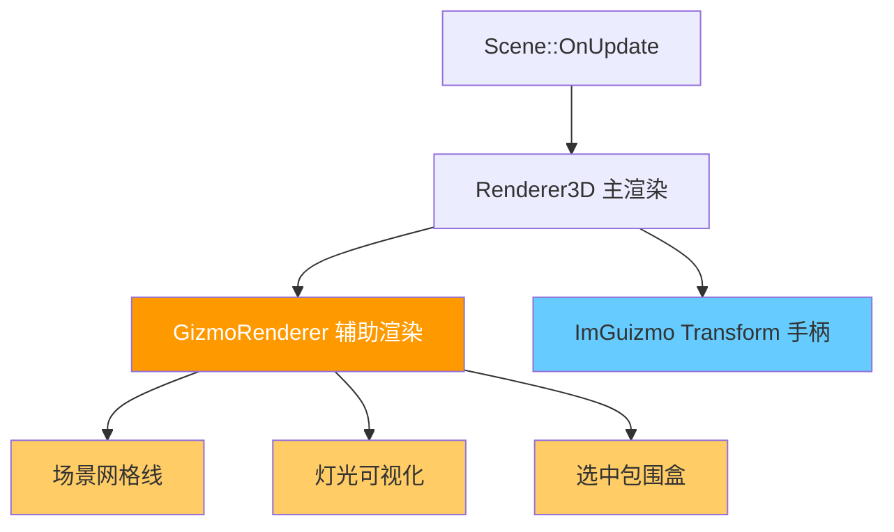

# Phase R10：Gizmo 渲染系统

> **文档版本**：v1.1  
> **创建日期**：2026-04-15  
> **更新日期**：2026-04-17  
> **优先级**：?? P2  
> **预计工作量**：4-5 天  
> **前置依赖**：无（可独立实施，与 Phase R9 并行开发）  
> **文档说明**：本文档详细描述如何为编辑器添加 Gizmo 渲染系统，包括灯光方向可视化、场景网格线、坐标轴指示器、选中实体包围盒等功能。Gizmo 使用独立的渲染路径，不影响主渲染流程。Transform 操控手柄（ImGuizmo）已在项目中实现。v1.1 版本新增坐标轴指示器（ViewManipulate）设计、补充聚光灯内锥角可视化、补充网格线 Y 轴、统一灯光 Gizmo 显示策略。

---

## 目录

- [一、现状分析](#一现状分析)
- [二、改进目标](#二改进目标)
- [三、涉及的文件清单](#三涉及的文件清单)
- [四、方案设计](#四方案设计)
  - [4.1 整体架构](#41-整体架构)
  - [4.2 GizmoRenderer 设计](#42-gizmorenderer-设计)
  - [4.3 Gizmo Shader 设计](#43-gizmo-shader-设计)
- [五、核心类实现](#五核心类实现)
  - [5.1 GizmoRenderer 类](#51-gizmorenderer-类)
  - [5.2 线段批处理](#52-线段批处理)
- [六、Gizmo Shader](#六gizmo-shader)
  - [6.1 GizmoLine.vert](#61-gizmolinevert)
  - [6.2 GizmoLine.frag](#62-gizmolinefrag)
- [七、内置 Gizmo 功能](#七内置-gizmo-功能)
  - [7.1 场景网格线（Grid）](#71-场景网格线grid)
  - [7.2 方向光方向线](#72-方向光方向线)
  - [7.3 点光源范围球](#73-点光源范围球)
  - [7.4 聚光灯锥体（内外锥角）](#74-聚光灯锥体内外锥角)
  - [7.5 选中实体包围盒](#75-选中实体包围盒)
- [八、坐标轴指示器（ViewManipulate）](#八坐标轴指示器viewmanipulate)
  - [8.1 功能说明](#81-功能说明)
  - [8.2 ImGuizmo ViewManipulate API](#82-imguizmo-viewmanipulate-api)
  - [8.3 EditorCamera 适配](#83-editorcamera-适配)
  - [8.4 集成代码](#84-集成代码)
- [九、Transform 操控手柄（ImGuizmo）― ? 已完成](#九transform-操控手柄imguizmo-已完成)
  - [9.1 ImGuizmo 集成](#91-imguizmo-集成)
  - [9.2 操控模式](#92-操控模式)
  - [9.3 编辑器集成](#93-编辑器集成)
- [十、渲染流程集成](#十渲染流程集成)
  - [10.1 调用时机](#101-调用时机)
  - [10.2 Scene 修改](#102-scene-修改)
  - [10.3 SceneViewportPanel 修改](#103-sceneviewportpanel-修改)
- [十一、验证方法](#十一验证方法)
- [十二、设计决策记录](#十二设计决策记录)

---

## 一、现状分析

> 基于 2026-04-15 的实际代码状态。

### 当前编辑器能力

| 功能 | 状态 | 说明 |
|------|------|------|
| Hierarchy 面板 | ? 已实现 | 场景层级树，支持创建/删除/重命名/拖拽排序 |
| Inspector 面板 | ? 已实现 | 组件属性编辑（Transform、Material、Light 等） |
| Scene Viewport | ? 已实现 | 3D 视口 + 编辑器相机（WASD + 鼠标） |
| 实体选择 | ? 已实现 | 鼠标点击拾取（Entity ID Framebuffer） |
| 灯光组件 | ? 已实现 | DirectionalLight / PointLight / SpotLight |

### 问题

| 编号 | 问题 | 影响 |
|------|------|------|
| R10-01 | 场景中没有网格线 | 无法判断物体的空间位置和大小 |
| R10-02 | 灯光实体在场景中不可见 | 灯光没有网格，用户看不到灯光的位置和方向 |
| R10-03 | 选中物体无包围盒显示 | 无法直观看到物体的边界范围 |
| R10-04 | ~~没有 Transform 操控手柄~~ | ~~只能通过 Inspector 输入数字来移动/旋转/缩放物体~~ **（? 已实现）** |
| R10-05 | 没有坐标轴指示器 | 无法直观判断当前编辑器相机的朝向，缺少类似 Unity/Blender 视口右上角的坐标轴小部件 |

---

## 二、改进目标

1. **GizmoRenderer**：独立的线段渲染器，支持绘制线段、圆、箭头等基础图元
2. **场景网格线**：XZ 平面参考网格 + Y 轴绿色短线，帮助判断空间位置和三维方向
3. **灯光可视化**：方向光箭头、点光源范围球、聚光灯内外锥角 + 范围锥体
4. **选中包围盒**：线框高亮选中物体的 AABB
5. **坐标轴指示器**：视口右上角的 3D 坐标轴小部件（ImGuizmo ViewManipulate），显示当前相机朝向，点击可快速切换视角
6. ~~**Transform 操控手柄**：集成 ImGuizmo，支持平移/旋转/缩放~~ **（? 已在项目中实现）**

---

## 三、涉及的文件清单

| 文件路径 | 操作 | 说明 |
|---------|------|------|
| `Lucky/Source/Lucky/Renderer/GizmoRenderer.h` | **新建** | Gizmo 渲染器头文件 |
| `Lucky/Source/Lucky/Renderer/GizmoRenderer.cpp` | **新建** | Gizmo 渲染器实现 |
| `Luck3DApp/Assets/Shaders/GizmoLine.vert` | **新建** | 线段顶点着色器 |
| `Luck3DApp/Assets/Shaders/GizmoLine.frag` | **新建** | 线段片段着色器 |
| `Luck3DApp/Source/Panels/SceneViewportPanel.cpp` | 修改 | 在场景渲染后调用 GizmoRenderer |
| `Luck3DApp/Source/Panels/SceneViewportPanel.h` | 修改 | 添加 Gizmo 相关状态 |

### 第三方依赖（可选）

| 库 | 用途 | 集成方式 |
|----|------|---------|
| ImGuizmo | Transform 操控手柄 | Header-only，直接包含 |

---

## 四、方案设计

### 4.1 整体架构



**关键设计**：GizmoRenderer 与 Renderer3D 完全独立，使用自己的 Shader 和绘制路径。在主场景渲染完成后，在同一个 Framebuffer 上叠加绘制 Gizmo。

### 4.2 GizmoRenderer 设计

```cpp
class GizmoRenderer
{
public:
    static void Init();
    static void Shutdown();
    
    // 开始/结束 Gizmo 渲染
    static void BeginScene(const EditorCamera& camera);
    static void EndScene();
    
    // 基础图元
    static void DrawLine(const glm::vec3& start, const glm::vec3& end, const glm::vec4& color);
    static void DrawWireBox(const glm::vec3& center, const glm::vec3& size, const glm::vec4& color);
    static void DrawWireCircle(const glm::vec3& center, const glm::vec3& axis, float radius, const glm::vec4& color, int segments = 32);
    static void DrawWireSphere(const glm::vec3& center, float radius, const glm::vec4& color, int segments = 32);
    static void DrawArrow(const glm::vec3& origin, const glm::vec3& direction, float length, const glm::vec4& color);
    static void DrawWireCone(const glm::vec3& apex, const glm::vec3& direction, float height, float angle, const glm::vec4& color, int segments = 32);
    
    // 高级 Gizmo
    static void DrawGrid(float size, int divisions, const glm::vec4& color = glm::vec4(0.5f, 0.5f, 0.5f, 0.5f));
    static void DrawDirectionalLightGizmo(const glm::vec3& position, const glm::vec3& direction, const glm::vec3& color);
    static void DrawPointLightGizmo(const glm::vec3& position, float range, const glm::vec3& color);
    static void DrawSpotLightGizmo(const glm::vec3& position, const glm::vec3& direction, float range, float innerAngle, float outerAngle, const glm::vec3& color);
};
```

### 4.3 Gizmo Shader 设计

Gizmo 使用极简的线段着色器，不参与光照计算：

- 顶点输入：位置 + 颜色
- 无光照、无纹理
- 支持深度测试（可选禁用，让 Gizmo 始终可见）

---

## 五、核心类实现

### 5.1 GizmoRenderer 类

```cpp
// Lucky/Source/Lucky/Renderer/GizmoRenderer.h
#pragma once

#include "Lucky/Core/Base.h"
#include "Lucky/Renderer/EditorCamera.h"
#include <glm/glm.hpp>

namespace Lucky
{
    /// <summary>
    /// Gizmo 渲染器：用于编辑器辅助可视化
    /// 独立的渲染路径，不影响主渲染流程
    /// 使用线段批处理，一次 DrawCall 绘制所有线段
    /// </summary>
    class GizmoRenderer
    {
    public:
        static void Init();
        static void Shutdown();
        
        /// <summary>
        /// 开始 Gizmo 渲染（设置相机矩阵）
        /// </summary>
        static void BeginScene(const EditorCamera& camera);
        
        /// <summary>
        /// 结束 Gizmo 渲染（提交所有线段到 GPU）
        /// </summary>
        static void EndScene();
        
        // ---- 基础图元 ----
        
        static void DrawLine(const glm::vec3& start, const glm::vec3& end, const glm::vec4& color);
        static void DrawWireBox(const glm::vec3& center, const glm::vec3& size, const glm::vec4& color);
        static void DrawWireCircle(const glm::vec3& center, const glm::vec3& axis, float radius, const glm::vec4& color, int segments = 32);
        static void DrawWireSphere(const glm::vec3& center, float radius, const glm::vec4& color, int segments = 32);
        static void DrawArrow(const glm::vec3& origin, const glm::vec3& direction, float length, const glm::vec4& color);
        static void DrawWireCone(const glm::vec3& apex, const glm::vec3& direction, float height, float angle, const glm::vec4& color, int segments = 32);
        
        // ---- 场景 Gizmo ----
        
        static void DrawGrid(float size = 10.0f, int divisions = 10, const glm::vec4& color = glm::vec4(0.5f, 0.5f, 0.5f, 0.5f));
        static void DrawDirectionalLightGizmo(const glm::vec3& position, const glm::vec3& direction, const glm::vec3& color);
        static void DrawPointLightGizmo(const glm::vec3& position, float range, const glm::vec3& color);
        static void DrawSpotLightGizmo(const glm::vec3& position, const glm::vec3& direction, float range, float innerAngle, float outerAngle, const glm::vec3& color);
    };
}
```

### 5.2 线段批处理

GizmoRenderer 内部使用线段批处理，将所有线段收集到一个 VBO 中，一次 DrawCall 绘制：

```cpp
// GizmoRenderer.cpp 内部数据
struct GizmoVertex
{
    glm::vec3 Position;
    glm::vec4 Color;
};

struct GizmoRendererData
{
    static const uint32_t MaxLines = 10000;
    static const uint32_t MaxVertices = MaxLines * 2;
    
    Ref<VertexArray> LineVAO;
    Ref<VertexBuffer> LineVBO;
    Ref<Shader> LineShader;
    
    GizmoVertex* LineVertexBufferBase = nullptr;     // 顶点缓冲区基地址
    GizmoVertex* LineVertexBufferPtr = nullptr;      // 当前写入位置
    uint32_t LineVertexCount = 0;                    // 当前线段顶点数
};

static GizmoRendererData s_GizmoData;

void GizmoRenderer::Init()
{
    // 创建线段 VAO/VBO
    s_GizmoData.LineVAO = VertexArray::Create();
    s_GizmoData.LineVBO = VertexBuffer::Create(sizeof(GizmoVertex) * GizmoRendererData::MaxVertices);
    s_GizmoData.LineVBO->SetLayout({
        { ShaderDataType::Float3, "a_Position" },
        { ShaderDataType::Float4, "a_Color" }
    });
    s_GizmoData.LineVAO->AddVertexBuffer(s_GizmoData.LineVBO);
    
    // 分配 CPU 端顶点缓冲区
    s_GizmoData.LineVertexBufferBase = new GizmoVertex[GizmoRendererData::MaxVertices];
    
    // 加载 Gizmo Shader
    s_GizmoData.LineShader = Shader::Create("Assets/Shaders/GizmoLine");
}

void GizmoRenderer::BeginScene(const EditorCamera& camera)
{
    // 重置顶点缓冲区
    s_GizmoData.LineVertexBufferPtr = s_GizmoData.LineVertexBufferBase;
    s_GizmoData.LineVertexCount = 0;
    
    // 相机矩阵通过 UBO (binding=0) 已经设置，无需额外操作
}

void GizmoRenderer::DrawLine(const glm::vec3& start, const glm::vec3& end, const glm::vec4& color)
{
    if (s_GizmoData.LineVertexCount >= GizmoRendererData::MaxVertices)
        return;
    
    s_GizmoData.LineVertexBufferPtr->Position = start;
    s_GizmoData.LineVertexBufferPtr->Color = color;
    s_GizmoData.LineVertexBufferPtr++;
    
    s_GizmoData.LineVertexBufferPtr->Position = end;
    s_GizmoData.LineVertexBufferPtr->Color = color;
    s_GizmoData.LineVertexBufferPtr++;
    
    s_GizmoData.LineVertexCount += 2;
}

void GizmoRenderer::EndScene()
{
    if (s_GizmoData.LineVertexCount == 0)
        return;
    
    // 上传顶点数据到 GPU
    uint32_t dataSize = (uint32_t)((uint8_t*)s_GizmoData.LineVertexBufferPtr - (uint8_t*)s_GizmoData.LineVertexBufferBase);
    s_GizmoData.LineVBO->SetData(s_GizmoData.LineVertexBufferBase, dataSize);
    
    // 绑定 Shader
    s_GizmoData.LineShader->Bind();
    
    // 设置线宽
    glLineWidth(1.5f);
    
    // 绘制所有线段
    s_GizmoData.LineVAO->Bind();
    glDrawArrays(GL_LINES, 0, s_GizmoData.LineVertexCount);
}
```

---

## 六、Gizmo Shader

### 6.1 GizmoLine.vert

```glsl
#version 450 core

layout(location = 0) in vec3 a_Position;
layout(location = 1) in vec4 a_Color;

layout(std140, binding = 0) uniform Camera
{
    mat4 ViewProjectionMatrix;
    vec3 Position;
} u_Camera;

out vec4 v_Color;

void main()
{
    v_Color = a_Color;
    gl_Position = u_Camera.ViewProjectionMatrix * vec4(a_Position, 1.0);
}
```

### 6.2 GizmoLine.frag

```glsl
#version 450 core

layout(location = 0) out vec4 o_Color;

in vec4 v_Color;

void main()
{
    o_Color = v_Color;
}
```

---

## 七、内置 Gizmo 功能

### 7.1 场景网格线（Grid）

```cpp
void GizmoRenderer::DrawGrid(float size, int divisions, const glm::vec4& color)
{
    float step = size / divisions;
    float halfSize = size / 2.0f;
    
    for (int i = 0; i <= divisions; ++i)
    {
        float pos = -halfSize + i * step;
        
        // X 方向线段
        DrawLine(glm::vec3(pos, 0.0f, -halfSize), glm::vec3(pos, 0.0f, halfSize), color);
        // Z 方向线段
        DrawLine(glm::vec3(-halfSize, 0.0f, pos), glm::vec3(halfSize, 0.0f, pos), color);
    }
    
    // 高亮中心轴线
    DrawLine(glm::vec3(-halfSize, 0.0f, 0.0f), glm::vec3(halfSize, 0.0f, 0.0f), glm::vec4(0.8f, 0.2f, 0.2f, 0.8f));  // X 轴红色
    DrawLine(glm::vec3(0.0f, 0.0f, -halfSize), glm::vec3(0.0f, 0.0f, halfSize), glm::vec4(0.2f, 0.2f, 0.8f, 0.8f));  // Z 轴蓝色
    
    // Y 轴绿色短线（原点处显示一小段，帮助感知三维空间）
    float yAxisLength = step * 2.0f;  // Y 轴长度为 2 个网格单位
    DrawLine(glm::vec3(0.0f, 0.0f, 0.0f), glm::vec3(0.0f, yAxisLength, 0.0f), glm::vec4(0.2f, 0.8f, 0.2f, 0.8f));  // Y 轴绿色
}
```

### 7.2 方向光方向线

```cpp
void GizmoRenderer::DrawDirectionalLightGizmo(const glm::vec3& position, const glm::vec3& direction, const glm::vec3& color)
{
    glm::vec4 c = glm::vec4(color, 1.0f);
    float length = 1.5f;
    
    // 绘制多条平行箭头表示方向光
    glm::vec3 dir = glm::normalize(direction);
    
    // 计算垂直于方向的两个轴
    glm::vec3 up = glm::abs(dir.y) < 0.99f ? glm::vec3(0, 1, 0) : glm::vec3(1, 0, 0);
    glm::vec3 right = glm::normalize(glm::cross(dir, up));
    up = glm::normalize(glm::cross(right, dir));
    
    float offset = 0.3f;
    
    // 中心箭头
    DrawArrow(position, dir, length, c);
    
    // 四周箭头
    DrawArrow(position + right * offset, dir, length, c);
    DrawArrow(position - right * offset, dir, length, c);
    DrawArrow(position + up * offset, dir, length, c);
    DrawArrow(position - up * offset, dir, length, c);
}
```

### 7.3 点光源范围球

```cpp
void GizmoRenderer::DrawPointLightGizmo(const glm::vec3& position, float range, const glm::vec3& color)
{
    glm::vec4 c = glm::vec4(color, 0.6f);
    DrawWireSphere(position, range, c, 24);
}
```

### 7.4 聚光灯锥体（内外锥角）

聚光灯 Gizmo 同时显示内锥角和外锥角，帮助用户直观理解光照衰减区域：
- **外锥角**：实线绘制，表示光照完全截止的边界
- **内锥角**：半透明绘制，表示光照开始衰减的边界

```cpp
void GizmoRenderer::DrawSpotLightGizmo(const glm::vec3& position, const glm::vec3& direction, float range, float innerAngle, float outerAngle, const glm::vec3& color)
{
    glm::vec4 outerColor = glm::vec4(color, 0.6f);  // 外锥角：正常透明度
    glm::vec4 innerColor = glm::vec4(color, 0.3f);  // 内锥角：更透明，区分内外锥
    
    // 外锥角锥体（实线）
    DrawWireCone(position, direction, range, outerAngle, outerColor, 24);
    
    // 内锥角锥体（半透明）
    DrawWireCone(position, direction, range, innerAngle, innerColor, 24);
}
```

### 7.5 选中实体包围盒

```cpp
void GizmoRenderer::DrawWireBox(const glm::vec3& center, const glm::vec3& size, const glm::vec4& color)
{
    glm::vec3 half = size * 0.5f;
    
    // 8 个顶点
    glm::vec3 v[8] = {
        center + glm::vec3(-half.x, -half.y, -half.z),
        center + glm::vec3( half.x, -half.y, -half.z),
        center + glm::vec3( half.x,  half.y, -half.z),
        center + glm::vec3(-half.x,  half.y, -half.z),
        center + glm::vec3(-half.x, -half.y,  half.z),
        center + glm::vec3( half.x, -half.y,  half.z),
        center + glm::vec3( half.x,  half.y,  half.z),
        center + glm::vec3(-half.x,  half.y,  half.z),
    };
    
    // 12 条边
    // 底面
    DrawLine(v[0], v[1], color); DrawLine(v[1], v[2], color);
    DrawLine(v[2], v[3], color); DrawLine(v[3], v[0], color);
    // 顶面
    DrawLine(v[4], v[5], color); DrawLine(v[5], v[6], color);
    DrawLine(v[6], v[7], color); DrawLine(v[7], v[4], color);
    // 竖边
    DrawLine(v[0], v[4], color); DrawLine(v[1], v[5], color);
    DrawLine(v[2], v[6], color); DrawLine(v[3], v[7], color);
}
```

---

## 八、坐标轴指示器（ViewManipulate）

> **v1.1 新增**：类似 Unity Scene View 右上角或 Blender 视口右上角的 3D 坐标轴小部件，显示当前编辑器相机的朝向，点击坐标轴可快速切换到对应的正交视图。

### 8.1 功能说明

| 功能 | 说明 |
|------|------|
| **显示当前相机朝向** | 在视口右上角绘制一个交互式 3D 坐标轴（X 红 / Y 绿 / Z 蓝） |
| **点击切换视角** | 点击某个轴可快速切换到对应的正交视图（前/后/左/右/上/下） |
| **拖拽旋转** | 拖拽坐标轴小部件可旋转编辑器相机 |

**参考效果**：
- Unity：Scene View 右上角的 Orientation Gizmo
- Blender：3D Viewport 右上角的 Navigation Gizmo

### 8.2 ImGuizmo ViewManipulate API

项目已集成的 ImGuizmo 库**原生支持**此功能，无需额外引入第三方库：

```cpp
// ImGuizmo.h 中的声明
// 方式一：在 Manipulate() 之后调用（复用已设置的上下文）
IMGUI_API void ViewManipulate(float* view, float length, ImVec2 position, ImVec2 size, ImU32 backgroundColor);

// 方式二：独立调用（不依赖 Manipulate）
IMGUI_API void ViewManipulate(float* view, const float* projection, OPERATION operation, MODE mode, 
                               float* matrix, float length, ImVec2 position, ImVec2 size, ImU32 backgroundColor);

// 辅助查询
IMGUI_API bool IsUsingViewManipulate();     // 是否正在操作坐标轴指示器
IMGUI_API bool IsViewManipulateHovered();   // 鼠标是否悬停在坐标轴指示器上
```

**参数说明**：
| 参数 | 类型 | 说明 |
|------|------|------|
| `view` | `float*` | 视图矩阵指针（**会被修改**） |
| `length` | `float` | 相机到焦点的距离 |
| `position` | `ImVec2` | 坐标轴小部件的左上角位置（屏幕坐标） |
| `size` | `ImVec2` | 坐标轴小部件的大小（建议 128×128） |
| `backgroundColor` | `ImU32` | 背景颜色（建议半透明 `0x10101010`） |

### 8.3 EditorCamera 适配

**技术难点**：`ViewManipulate` 需要直接修改 view 矩阵（`float* view`），但当前 `EditorCamera` 的 view 矩阵是由 `m_Pitch`、`m_Yaw`、`m_Distance`、`m_FocalPoint` 内部计算得出的，`GetViewMatrix()` 返回 `const glm::mat4&`。

**解决方案**：在 `EditorCamera` 中新增一个方法，从 `ViewManipulate` 修改后的 view 矩阵反推出内部参数：

```cpp
// EditorCamera.h 中新增
/// <summary>
/// 从外部修改后的视图矩阵反推内部参数（用于 ViewManipulate 集成）
/// </summary>
/// <param name="viewMatrix">被 ViewManipulate 修改后的视图矩阵</param>
void SetViewMatrix(const glm::mat4& viewMatrix);
```

```cpp
// EditorCamera.cpp 中实现
void EditorCamera::SetViewMatrix(const glm::mat4& viewMatrix)
{
    m_ViewMatrix = viewMatrix;
    
    // 从 view 矩阵反推相机参数
    glm::mat4 invView = glm::inverse(viewMatrix);
    
    // 相机位置 = 逆视图矩阵的平移列
    m_Position = glm::vec3(invView[3]);
    
    // 从逆视图矩阵提取旋转，反推 pitch 和 yaw
    glm::vec3 forward = -glm::vec3(invView[2]);  // 相机前方向（-Z）
    m_Pitch = asin(-forward.y);                    // 俯仰角
    m_Yaw = atan2(forward.x, forward.z);           // 偏航角
    
    // 焦点 = 相机位置 + 前方向 × 距离
    m_FocalPoint = m_Position + forward * m_Distance;
}
```

### 8.4 集成代码

```cpp
// SceneViewportPanel.cpp 中
void SceneViewportPanel::UI_DrawViewManipulate()
{
    // 坐标轴指示器位置：视口右上角，128×128 大小
    float viewManipulateSize = 128.0f;
    ImVec2 viewManipulatePos = ImVec2(
        m_Bounds[1].x - viewManipulateSize,  // 右对齐
        m_Bounds[0].y                         // 顶部对齐
    );
    
    // 获取可修改的视图矩阵副本
    glm::mat4 viewMatrix = m_EditorCamera.GetViewMatrix();
    
    // 绘制坐标轴指示器（会修改 viewMatrix）
    ImGuizmo::ViewManipulate(
        glm::value_ptr(viewMatrix),
        m_EditorCamera.GetDistance(),
        viewManipulatePos,
        ImVec2(viewManipulateSize, viewManipulateSize),
        0x10101010  // 半透明背景
    );
    
    // 如果 ViewManipulate 修改了视图矩阵，同步回 EditorCamera
    if (ImGuizmo::IsUsingViewManipulate())
    {
        m_EditorCamera.SetViewMatrix(viewMatrix);
    }
}
```

---

## 九、Transform 操控手柄（ImGuizmo） ― ? 已完成

> **状态**：? 已在项目中实现。ImGuizmo 库已集成在 `Lucky/Vendor/ImGuizmo/`，Transform 操控手柄已在 `SceneViewportPanel::UI_DrawGizmos()` 中完整实现。
>
> 以下内容保留作为实现参考记录。

### 9.1 ImGuizmo 集成

ImGuizmo 是一个 Header-only 的 ImGui 扩展库，提供 3D Transform 操控手柄。

**已完成的集成**：
1. ? `ImGuizmo.h` 和 `ImGuizmo.cpp` 已添加到 `Lucky/Vendor/ImGuizmo/`
2. ? `SceneViewportPanel` 中已调用 ImGuizmo API
3. ? `ImGuiLayer::Begin()` 中已调用 `ImGuizmo::BeginFrame()`

### 9.2 操控模式

| 模式 | 快捷键 | 说明 | 状态 |
|------|--------|------|------|
| 平移（Translate） | G | 沿 X/Y/Z 轴移动 | ? 已实现 |
| 旋转（Rotate） | R | 绕 X/Y/Z 轴旋转 | ? 已实现 |
| 缩放（Scale） | S | 沿 X/Y/Z 轴缩放 | ? 已实现 |
| Ctrl 刻度捕捉 | Ctrl + 拖拽 | 平移/缩放 0.5 间隔，旋转 5° 间隔 | ? 已实现 |

### 9.3 编辑器集成

当前实现位于 `Luck3DApp/Source/Panels/SceneViewportPanel.cpp` 的 `UI_DrawGizmos()` 方法中，支持：
- 选中实体时显示 Transform 操控手柄
- G/R/S 快捷键切换操控模式
- Ctrl 刻度捕捉
- 本地/世界坐标系切换
- 旋转增量累积（避免万向锁漂移）

---

## 十、渲染流程集成

### 10.1 调用时机

```
SceneViewportPanel::OnUpdate
  → Framebuffer.Bind()
  → RenderCommand::Clear()
  → Scene::OnUpdate()                  // 主渲染（Renderer3D）
  → GizmoRenderer::BeginScene()        // Gizmo 渲染（新增）
      → DrawGrid()                     // 网格线（含 X/Y/Z 轴高亮）
      → DrawDirectionalLightGizmo()    // 灯光可视化
      → DrawPointLightGizmo()
      → DrawSpotLightGizmo()           // 内外锥角
      → DrawWireBox()                  // 选中包围盒
  → GizmoRenderer::EndScene()          // 提交线段（新增）
  → UI_DrawGizmos()                    // ImGuizmo Transform 手柄（已实现）
  → UI_DrawViewManipulate()            // 坐标轴指示器（新增）
  → Framebuffer.Unbind()
```

### 10.2 Scene 修改

不需要修改 `Scene.cpp`。Gizmo 渲染在 `SceneViewportPanel` 中完成，直接访问 Scene 的实体数据。

### 10.3 SceneViewportPanel 修改

```cpp
void SceneViewportPanel::OnUpdate(DeltaTime dt)
{
    // ... 现有代码（Framebuffer Bind、Clear、Scene::OnUpdate）...
    
    // ---- Gizmo 渲染（新增） ----
    GizmoRenderer::BeginScene(m_EditorCamera);
    {
        // 场景网格线
        GizmoRenderer::DrawGrid(20.0f, 20);
        
        // 灯光可视化
        auto dirLights = m_Scene->GetAllEntitiesWith<TransformComponent, DirectionalLightComponent>();
        for (auto entity : dirLights)
        {
            auto [transform, light] = dirLights.get<TransformComponent, DirectionalLightComponent>(entity);
            GizmoRenderer::DrawDirectionalLightGizmo(transform.Translation, transform.GetForward(), light.Color);
        }
        
        auto pointLights = m_Scene->GetAllEntitiesWith<TransformComponent, PointLightComponent>();
        for (auto entity : pointLights)
        {
            auto [transform, light] = pointLights.get<TransformComponent, PointLightComponent>(entity);
            GizmoRenderer::DrawPointLightGizmo(transform.Translation, light.Range, light.Color);
        }
        
        auto spotLights = m_Scene->GetAllEntitiesWith<TransformComponent, SpotLightComponent>();
        for (auto entity : spotLights)
        {
            auto [transform, light] = spotLights.get<TransformComponent, SpotLightComponent>(entity);
            GizmoRenderer::DrawSpotLightGizmo(transform.Translation, transform.GetForward(), light.Range, light.InnerCutoffAngle, light.OuterCutoffAngle, light.Color);
        }
        
        // 选中实体包围盒
        UUID selectedID = SelectionManager::GetSelection();
        if (selectedID != 0)
        {
            Entity selectedEntity = m_Scene->TryGetEntityWithUUID(selectedID);
            if (selectedEntity && selectedEntity.HasComponent<MeshFilterComponent>())
            {
                auto& transform = selectedEntity.GetComponent<TransformComponent>();
                // 简单使用单位包围盒（后续可从 Mesh 获取实际 AABB）
                GizmoRenderer::DrawWireBox(transform.Translation, transform.Scale, glm::vec4(1.0f, 0.5f, 0.0f, 1.0f));
            }
        }
    }
    GizmoRenderer::EndScene();
    
    // ImGuizmo 操控手柄（已实现）
    UI_DrawGizmos();
    
    // 坐标轴指示器（新增）
    UI_DrawViewManipulate();
    
    // ... 现有代码（Framebuffer Unbind）...
}
```

---

## 十一、验证方法

### 11.1 网格线验证

1. 启动编辑器，确认 XZ 平面显示网格线
2. 确认 X 轴为红色、Z 轴为蓝色、Y 轴为绿色短线
3. 移动相机，确认网格线透视正确

### 11.2 灯光可视化验证

1. 创建方向光实体，确认显示方向箭头
2. 旋转方向光，确认箭头方向跟随
3. 创建点光源，确认显示范围球
4. 创建聚光灯，确认显示内外锥角锥体（外锥角实线、内锥角半透明）
5. 调整聚光灯 InnerCutoffAngle / OuterCutoffAngle，确认两个锥体大小变化

### 11.3 坐标轴指示器验证

1. 确认视口右上角显示 3D 坐标轴小部件
2. 旋转编辑器相机，确认坐标轴指示器同步旋转
3. 点击坐标轴（如 X 轴），确认相机快速切换到对应的正交视图
4. 确认切换视角后 EditorCamera 的 Pitch/Yaw 参数正确同步

### 11.4 Transform 手柄验证（? 已通过）

1. ? 选中物体，确认显示平移手柄
2. ? 拖拽手柄，确认物体跟随移动
3. ? 按 G/R/S 切换模式，确认手柄类型变化
4. ? 确认 Inspector 中的数值同步更新

---

## 十二、设计决策记录

| 决策 | 选择 | 原因 |
|------|------|------|
| 渲染方式 | 独立 GizmoRenderer | 与主渲染完全解耦，不影响 Renderer3D |
| 线段绘制 | 批处理（一次 DrawCall） | 性能好，避免大量小 DrawCall |
| Transform 手柄 | ImGuizmo | 成熟的库，功能完善，Header-only 易集成（? 已实现） |
| 坐标轴指示器 | ImGuizmo ViewManipulate | 复用已集成的 ImGuizmo 库，无需额外依赖（v1.1 新增） |
| 网格线 | CPU 生成线段 | 简单直接，网格线数量有限 |
| 网格线坐标轴 | X 红 / Y 绿 / Z 蓝 | 与 Unity/Blender 一致的颜色约定（v1.1 补充 Y 轴） |
| 灯光可视化 | 第一版全部显示，后续改为仅选中时显示详细 Gizmo | 第一版简单直接，避免过早引入复杂逻辑（v1.1 统一策略） |
| 聚光灯 Gizmo | 同时显示内外锥角 | 帮助用户直观理解光照衰减区域（v1.1 补充） |
| 深度测试 | Gizmo 默认启用深度测试 | 被遮挡的 Gizmo 不显示，更自然 |
| Shader | 极简线段 Shader | 无光照、无纹理，仅位置 + 颜色 |