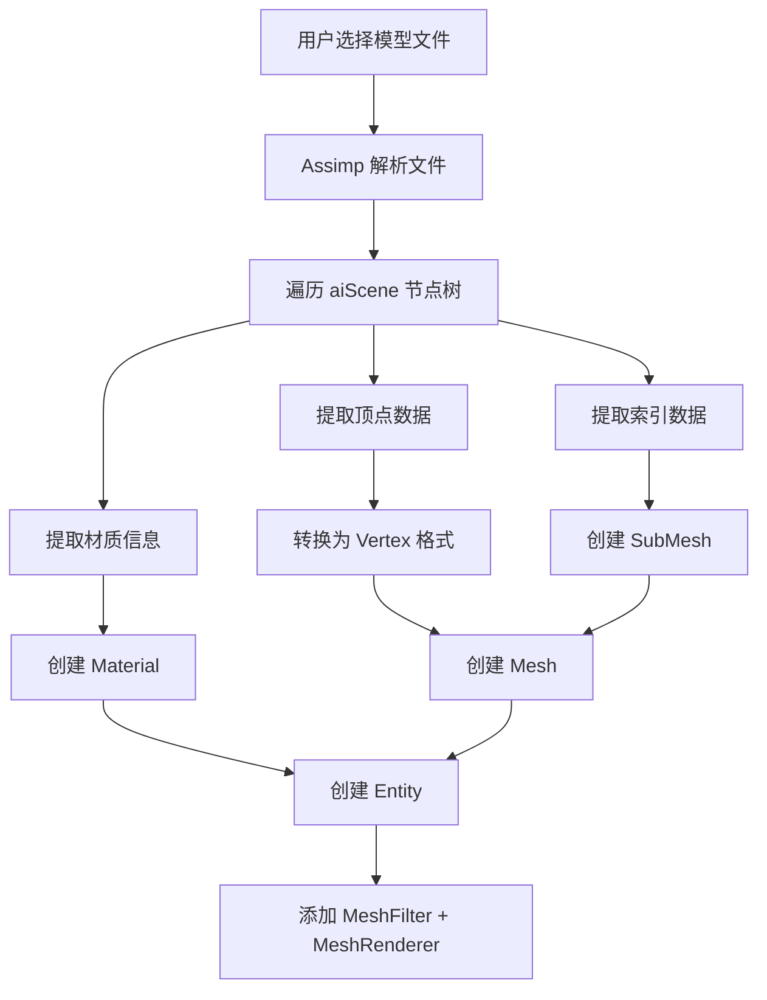

# Phase R11：模型导入（AssetImporter）

> **文档版本**：v1.0  
> **创建日期**：2026-04-15  
> **优先级**：?? P2  
> **预计工作量**：5-7 天  
> **前置依赖**：无（可独立实施）  
> **文档说明**：本文档详细描述如何集成 Assimp 库实现外部 3D 模型导入功能，支持 `.obj`、`.fbx`、`.gltf`/`.glb` 等主流格式。导入后自动创建 Mesh、SubMesh 和默认材质。所有代码可直接对照实现。

---

## 目录

- [一、现状分析](#一现状分析)
- [二、改进目标](#二改进目标)
- [三、涉及的文件清单](#三涉及的文件清单)
- [四、方案设计](#四方案设计)
  - [4.1 导入流程](#41-导入流程)
  - [4.2 Assimp 集成方案](#42-assimp-集成方案)
  - [4.3 数据映射](#43-数据映射)
- [五、核心类设计](#五核心类设计)
  - [5.1 MeshImporter 类](#51-meshimporter-类)
  - [5.2 导入选项](#52-导入选项)
- [六、详细实现](#六详细实现)
  - [6.1 Assimp 场景解析](#61-assimp-场景解析)
  - [6.2 Mesh 节点遍历](#62-mesh-节点遍历)
  - [6.3 顶点数据转换](#63-顶点数据转换)
  - [6.4 材质信息提取](#64-材质信息提取)
  - [6.5 法线和切线处理](#65-法线和切线处理)
- [七、MeshFilterComponent 扩展](#七meshfiltercomponent-扩展)
- [八、编辑器集成](#八编辑器集成)
  - [8.1 菜单导入](#81-菜单导入)
  - [8.2 Inspector 显示](#82-inspector-显示)
- [九、序列化支持](#九序列化支持)
- [十、验证方法](#十验证方法)
- [十一、第三方依赖](#十一第三方依赖)
- [十二、设计决策记录](#十二设计决策记录)

---

## 一、现状分析

> 基于 2026-04-15 的实际代码状态。

### 当前网格系统

```cpp
// MeshFactory：内置图元工厂
enum class PrimitiveType
{
    None = 0,
    Cube,       // 立方体
    Plane,      // 平面
    Sphere,     // 经纬球
    Cylinder,   // 圆柱体
    Capsule,    // 胶囊体
};

class MeshFactory
{
public:
    static Ref<Mesh> CreatePrimitive(PrimitiveType type);
    static Ref<Mesh> CreateCube();
    static Ref<Mesh> CreatePlane(uint32_t subdivisions = 1);
    static Ref<Mesh> CreateSphere(uint32_t segments = 32, uint32_t rings = 16);
    static Ref<Mesh> CreateCylinder(uint32_t segments = 32);
    static Ref<Mesh> CreateCapsule(uint32_t segments = 32, uint32_t rings = 8);
};
```

### 当前 MeshFilterComponent

```cpp
struct MeshFilterComponent
{
    PrimitiveType Primitive = PrimitiveType::None;
    Ref<Mesh> Mesh;
    
    MeshFilterComponent() = default;
    MeshFilterComponent(PrimitiveType type)
        : Primitive(type), Mesh(MeshFactory::CreatePrimitive(type)) {}
};
```

### 问题

| 编号 | 问题 | 影响 |
|------|------|------|
| R11-01 | 只有 5 种内置图元 | 无法验证 PBR 材质在复杂模型上的效果 |
| R11-02 | 无法导入外部模型 | 引擎只能渲染简单几何体 |
| R11-03 | MeshFilterComponent 仅支持 PrimitiveType | 无法引用外部模型文件 |

---

## 二、改进目标

1. **Assimp 集成**：引入 Assimp 库解析 3D 模型文件
2. **MeshImporter**：新增模型导入类，支持 `.obj`、`.fbx`、`.gltf`/`.glb`
3. **自动 SubMesh**：根据模型中的 mesh 分组创建 SubMesh
4. **自动材质**：根据模型中的材质信息创建默认 Material
5. **法线/切线**：如果模型缺少法线或切线，自动计算
6. **编辑器集成**：通过菜单导入模型，自动创建实体

---

## 三、涉及的文件清单

| 文件路径 | 操作 | 说明 |
|---------|------|------|
| `Lucky/Source/Lucky/Renderer/MeshImporter.h` | **新建** | 模型导入器头文件 |
| `Lucky/Source/Lucky/Renderer/MeshImporter.cpp` | **新建** | 模型导入器实现 |
| `Lucky/Source/Lucky/Scene/Components/MeshFilterComponent.h` | 修改 | 支持外部模型路径 |
| `Lucky/Source/Lucky/Serialization/SceneSerializer.cpp` | 修改 | 序列化外部模型路径 |
| `Luck3DApp/Source/EditorLayer.cpp` | 修改 | 添加导入菜单 |
| `Luck3DApp/Source/Panels/InspectorPanel.cpp` | 修改 | 显示模型文件路径 |

### 第三方依赖

| 库 | 版本 | 用途 | 集成方式 |
|----|------|------|---------|
| Assimp | 5.3+ | 3D 模型文件解析 | Git 子模块 + CMake |

---

## 四、方案设计

### 4.1 导入流程



### 4.2 Assimp 集成方案

| 方案 | 说明 | 优点 | 缺点 | 推荐 |
|------|------|------|------|------|
| **方案 A：Git 子模块（推荐）** | 将 Assimp 作为 Git 子模块 | 版本可控，源码编译 | 编译时间增加 | ? |
| 方案 B：预编译库 | 使用预编译的 .lib/.dll | 编译快 | 平台兼容性问题 | |
| 方案 C：vcpkg | 通过包管理器安装 | 方便 | 需要额外工具 | |

**推荐方案 A**：与项目现有的子模块管理方式一致（如 glfw、imgui 等）。

### 4.3 数据映射

| Assimp 数据 | Luck3D 数据 | 说明 |
|-------------|-------------|------|
| `aiMesh` | `SubMesh` | 一个 aiMesh 对应一个 SubMesh |
| `aiMesh::mVertices` | `Vertex::Position` | 顶点位置 |
| `aiMesh::mNormals` | `Vertex::Normal` | 法线 |
| `aiMesh::mTextureCoords[0]` | `Vertex::TexCoord` | 纹理坐标（第一套） |
| `aiMesh::mTangents` | `Vertex::Tangent` | 切线 |
| `aiMesh::mColors[0]` | `Vertex::Color` | 顶点颜色 |
| `aiMesh::mFaces` | 索引数据 | 三角形索引 |
| `aiMaterial` | `Material` | 材质属性 |
| `aiMesh::mMaterialIndex` | `SubMesh::MaterialIndex` | 材质索引 |

---

## 五、核心类设计

### 5.1 MeshImporter 类

```cpp
// Lucky/Source/Lucky/Renderer/MeshImporter.h
#pragma once

#include "Lucky/Core/Base.h"
#include "Mesh.h"
#include "Material.h"

#include <string>
#include <vector>

namespace Lucky
{
    /// <summary>
    /// 导入结果：包含导入的 Mesh 和材质列表
    /// </summary>
    struct MeshImportResult
    {
        Ref<Mesh> MeshData;                         // 导入的网格（包含所有 SubMesh）
        std::vector<Ref<Material>> Materials;       // 材质列表（索引对应 SubMesh::MaterialIndex）
        std::string FilePath;                       // 源文件路径
        bool Success = false;                       // 是否导入成功
        std::string ErrorMessage;                   // 错误信息
    };
    
    /// <summary>
    /// 导入选项
    /// </summary>
    struct MeshImportOptions
    {
        bool CalculateNormals = true;       // 如果模型缺少法线，自动计算
        bool CalculateTangents = true;      // 如果模型缺少切线，自动计算
        bool FlipUVs = true;               // 翻转 UV 的 Y 轴（OpenGL 纹理坐标）
        bool Triangulate = true;            // 将多边形三角化
        float ScaleFactor = 1.0f;           // 缩放因子
    };
    
    /// <summary>
    /// 模型导入器：使用 Assimp 解析 3D 模型文件
    /// 
    /// 支持格式：.obj, .fbx, .gltf, .glb, .dae, .3ds, .blend 等
    /// </summary>
    class MeshImporter
    {
    public:
        /// <summary>
        /// 从文件导入模型
        /// </summary>
        /// <param name="filepath">模型文件路径</param>
        /// <param name="options">导入选项</param>
        /// <returns>导入结果</returns>
        static MeshImportResult Import(const std::string& filepath, const MeshImportOptions& options = {});
        
        /// <summary>
        /// 检查文件格式是否支持
        /// </summary>
        /// <param name="filepath">文件路径</param>
        /// <returns>是否支持</returns>
        static bool IsFormatSupported(const std::string& filepath);
        
        /// <summary>
        /// 获取支持的文件格式列表
        /// </summary>
        /// <returns>格式列表（如 ".obj", ".fbx" 等）</returns>
        static std::vector<std::string> GetSupportedFormats();
    };
}
```

### 5.2 导入选项

| 选项 | 类型 | 默认值 | 说明 |
|------|------|--------|------|
| CalculateNormals | bool | true | 缺少法线时自动计算 |
| CalculateTangents | bool | true | 缺少切线时自动计算 |
| FlipUVs | bool | true | 翻转 UV Y 轴（OpenGL 需要） |
| Triangulate | bool | true | 多边形三角化 |
| ScaleFactor | float | 1.0 | 全局缩放 |

---

## 六、详细实现

### 6.1 Assimp 场景解析

```cpp
// MeshImporter.cpp
#include <assimp/Importer.hpp>
#include <assimp/scene.h>
#include <assimp/postprocess.h>

MeshImportResult MeshImporter::Import(const std::string& filepath, const MeshImportOptions& options)
{
    MeshImportResult result;
    result.FilePath = filepath;
    
    Assimp::Importer importer;
    
    // 设置导入标志
    unsigned int flags = 0;
    if (options.Triangulate)       flags |= aiProcess_Triangulate;
    if (options.FlipUVs)           flags |= aiProcess_FlipUVs;
    if (options.CalculateNormals)  flags |= aiProcess_GenSmoothNormals;
    if (options.CalculateTangents) flags |= aiProcess_CalcTangentSpace;
    flags |= aiProcess_JoinIdenticalVertices;   // 合并重复顶点
    flags |= aiProcess_OptimizeMeshes;          // 优化网格
    
    const aiScene* scene = importer.ReadFile(filepath, flags);
    
    if (!scene || scene->mFlags & AI_SCENE_FLAGS_INCOMPLETE || !scene->mRootNode)
    {
        result.Success = false;
        result.ErrorMessage = importer.GetErrorString();
        LF_CORE_ERROR("Assimp Error: {0}", result.ErrorMessage);
        return result;
    }
    
    // 解析场景
    std::vector<Vertex> allVertices;
    std::vector<uint32_t> allIndices;
    std::vector<SubMesh> subMeshes;
    
    ProcessNode(scene->mRootNode, scene, allVertices, allIndices, subMeshes, options);
    
    // 创建 Mesh
    result.MeshData = Mesh::Create(filepath, allVertices, allIndices, subMeshes);
    
    // 提取材质
    ProcessMaterials(scene, result.Materials, filepath);
    
    result.Success = true;
    return result;
}
```

### 6.2 Mesh 节点遍历

```cpp
static void ProcessNode(const aiNode* node, const aiScene* scene,
                         std::vector<Vertex>& vertices, std::vector<uint32_t>& indices,
                         std::vector<SubMesh>& subMeshes, const MeshImportOptions& options)
{
    // 处理当前节点的所有 Mesh
    for (unsigned int i = 0; i < node->mNumMeshes; i++)
    {
        aiMesh* mesh = scene->mMeshes[node->mMeshes[i]];
        ProcessMesh(mesh, scene, vertices, indices, subMeshes, options);
    }
    
    // 递归处理子节点
    for (unsigned int i = 0; i < node->mNumChildren; i++)
    {
        ProcessNode(node->mChildren[i], scene, vertices, indices, subMeshes, options);
    }
}
```

### 6.3 顶点数据转换

```cpp
static void ProcessMesh(const aiMesh* mesh, const aiScene* scene,
                         std::vector<Vertex>& vertices, std::vector<uint32_t>& indices,
                         std::vector<SubMesh>& subMeshes, const MeshImportOptions& options)
{
    uint32_t vertexOffset = static_cast<uint32_t>(vertices.size());
    uint32_t indexOffset = static_cast<uint32_t>(indices.size());
    
    // 提取顶点
    for (unsigned int i = 0; i < mesh->mNumVertices; i++)
    {
        Vertex vertex;
        
        // 位置
        vertex.Position = {
            mesh->mVertices[i].x * options.ScaleFactor,
            mesh->mVertices[i].y * options.ScaleFactor,
            mesh->mVertices[i].z * options.ScaleFactor
        };
        
        // 法线
        if (mesh->HasNormals())
        {
            vertex.Normal = { mesh->mNormals[i].x, mesh->mNormals[i].y, mesh->mNormals[i].z };
        }
        
        // 纹理坐标（第一套）
        if (mesh->mTextureCoords[0])
        {
            vertex.TexCoord = { mesh->mTextureCoords[0][i].x, mesh->mTextureCoords[0][i].y };
        }
        else
        {
            vertex.TexCoord = { 0.0f, 0.0f };
        }
        
        // 切线
        if (mesh->HasTangentsAndBitangents())
        {
            vertex.Tangent = {
                mesh->mTangents[i].x, mesh->mTangents[i].y, mesh->mTangents[i].z,
                1.0f  // 手性（默认 1.0，后续可从 Bitangent 计算）
            };
        }
        
        // 顶点颜色
        if (mesh->mColors[0])
        {
            vertex.Color = {
                mesh->mColors[0][i].r, mesh->mColors[0][i].g,
                mesh->mColors[0][i].b, mesh->mColors[0][i].a
            };
        }
        else
        {
            vertex.Color = { 1.0f, 1.0f, 1.0f, 1.0f };
        }
        
        vertices.push_back(vertex);
    }
    
    // 提取索引
    for (unsigned int i = 0; i < mesh->mNumFaces; i++)
    {
        aiFace face = mesh->mFaces[i];
        for (unsigned int j = 0; j < face.mNumIndices; j++)
        {
            indices.push_back(vertexOffset + face.mIndices[j]);
        }
    }
    
    // 创建 SubMesh
    SubMesh subMesh;
    subMesh.Name = mesh->mName.C_Str();
    subMesh.IndexOffset = indexOffset;
    subMesh.IndexCount = static_cast<uint32_t>(indices.size()) - indexOffset;
    subMesh.MaterialIndex = mesh->mMaterialIndex;
    subMeshes.push_back(subMesh);
}
```

### 6.4 材质信息提取

```cpp
static void ProcessMaterials(const aiScene* scene, std::vector<Ref<Material>>& materials, const std::string& filepath)
{
    std::string directory = filepath.substr(0, filepath.find_last_of("/\\"));
    
    for (unsigned int i = 0; i < scene->mNumMaterials; i++)
    {
        aiMaterial* aiMat = scene->mMaterials[i];
        
        // 创建默认 PBR 材质
        Ref<Material> material = Renderer3D::GetDefaultMaterial();  // 基于默认材质克隆
        
        // 提取材质名称
        aiString name;
        if (aiMat->Get(AI_MATKEY_NAME, name) == AI_SUCCESS)
        {
            material->SetName(name.C_Str());
        }
        
        // 提取基础颜色
        aiColor4D baseColor;
        if (aiMat->Get(AI_MATKEY_BASE_COLOR, baseColor) == AI_SUCCESS)
        {
            material->SetFloat4("u_Albedo", { baseColor.r, baseColor.g, baseColor.b, baseColor.a });
        }
        else
        {
            aiColor3D diffuse;
            if (aiMat->Get(AI_MATKEY_COLOR_DIFFUSE, diffuse) == AI_SUCCESS)
            {
                material->SetFloat4("u_Albedo", { diffuse.r, diffuse.g, diffuse.b, 1.0f });
            }
        }
        
        // 提取金属度
        float metallic = 0.0f;
        if (aiMat->Get(AI_MATKEY_METALLIC_FACTOR, metallic) == AI_SUCCESS)
        {
            material->SetFloat("u_Metallic", metallic);
        }
        
        // 提取粗糙度
        float roughness = 0.5f;
        if (aiMat->Get(AI_MATKEY_ROUGHNESS_FACTOR, roughness) == AI_SUCCESS)
        {
            material->SetFloat("u_Roughness", roughness);
        }
        
        // TODO: 提取纹理路径并加载纹理
        // aiString texPath;
        // if (aiMat->GetTexture(aiTextureType_BASE_COLOR, 0, &texPath) == AI_SUCCESS)
        // {
        //     std::string fullPath = directory + "/" + texPath.C_Str();
        //     Ref<Texture2D> texture = Texture2D::Create(fullPath);
        //     material->SetTexture("u_AlbedoMap", texture);
        // }
        
        materials.push_back(material);
    }
}
```

### 6.5 法线和切线处理

Assimp 的 `aiProcess_GenSmoothNormals` 和 `aiProcess_CalcTangentSpace` 标志会自动计算缺失的法线和切线。如果 Assimp 计算的切线不满足需求，可以使用引擎已有的 `MeshTangentCalculator` 重新计算：

```cpp
// 如果需要使用引擎自己的切线计算
if (!mesh->HasTangentsAndBitangents())
{
    MeshTangentCalculator::Calculate(vertices, indices);
}
```

---

## 七、MeshFilterComponent 扩展

当前 `MeshFilterComponent` 仅支持 `PrimitiveType`，需要扩展支持外部模型路径：

```cpp
// MeshFilterComponent.h 修改
struct MeshFilterComponent
{
    PrimitiveType Primitive = PrimitiveType::None;  // 内置图元类型
    std::string MeshFilePath;                        // 外部模型文件路径（新增）
    Ref<Mesh> Mesh;
    
    MeshFilterComponent() = default;
    
    // 内置图元构造
    MeshFilterComponent(PrimitiveType type)
        : Primitive(type), Mesh(MeshFactory::CreatePrimitive(type)) {}
    
    // 外部模型构造（新增）
    MeshFilterComponent(const std::string& filepath, Ref<Lucky::Mesh> mesh)
        : Primitive(PrimitiveType::None), MeshFilePath(filepath), Mesh(mesh) {}
    
    /// <summary>
    /// 是否为外部模型
    /// </summary>
    bool IsExternalMesh() const { return !MeshFilePath.empty(); }
};
```

---

## 八、编辑器集成

### 8.1 菜单导入

```cpp
// EditorLayer.cpp 中添加导入菜单
if (ImGui::BeginMenu("File"))
{
    // ... 现有菜单项 ...
    
    if (ImGui::MenuItem("Import Model..."))
    {
        std::string filepath = FileDialogs::OpenFile(
            "3D Model (*.obj;*.fbx;*.gltf;*.glb)\0*.obj;*.fbx;*.gltf;*.glb\0"
            "All Files (*.*)\0*.*\0"
        );
        
        if (!filepath.empty())
        {
            ImportModel(filepath);
        }
    }
    
    ImGui::EndMenu();
}

void EditorLayer::ImportModel(const std::string& filepath)
{
    MeshImportResult result = MeshImporter::Import(filepath);
    
    if (result.Success)
    {
        // 创建实体
        std::string name = std::filesystem::path(filepath).stem().string();
        Entity entity = m_Scene->CreateEntity(name);
        
        // 添加 MeshFilter
        entity.AddComponent<MeshFilterComponent>(filepath, result.MeshData);
        
        // 添加 MeshRenderer（使用导入的材质）
        auto& meshRenderer = entity.AddComponent<MeshRendererComponent>();
        meshRenderer.Materials = result.Materials;
        
        LF_CORE_INFO("Imported model: {0} ({1} SubMeshes, {2} Materials)", 
                      name, result.MeshData->GetSubMeshes().size(), result.Materials.size());
    }
    else
    {
        LF_CORE_ERROR("Failed to import model: {0}", result.ErrorMessage);
    }
}
```

### 8.2 Inspector 显示

在 Inspector 面板的 MeshFilterComponent 部分，显示模型文件路径：

```cpp
// InspectorPanel.cpp 中 MeshFilterComponent 的绘制
if (meshFilter.IsExternalMesh())
{
    ImGui::Text("Model: %s", meshFilter.MeshFilePath.c_str());
    // 显示 SubMesh 数量
    if (meshFilter.Mesh)
    {
        ImGui::Text("SubMeshes: %d", (int)meshFilter.Mesh->GetSubMeshes().size());
    }
}
else
{
    // 现有的 PrimitiveType 下拉框
    // ...
}
```

---

## 九、序列化支持

### 序列化

```cpp
// SceneSerializer.cpp 中 MeshFilterComponent 的序列化
if (entity.HasComponent<MeshFilterComponent>())
{
    const auto& meshFilter = entity.GetComponent<MeshFilterComponent>();
    
    out << YAML::Key << "MeshFilterComponent";
    out << YAML::BeginMap;
    
    if (meshFilter.IsExternalMesh())
    {
        out << YAML::Key << "MeshFilePath" << YAML::Value << meshFilter.MeshFilePath;
    }
    else
    {
        out << YAML::Key << "PrimitiveType" << YAML::Value << (int)meshFilter.Primitive;
    }
    
    out << YAML::EndMap;
}
```

### 反序列化

```cpp
// 反序列化
YAML::Node meshFilterNode = entity["MeshFilterComponent"];
if (meshFilterNode)
{
    if (meshFilterNode["MeshFilePath"])
    {
        std::string filepath = meshFilterNode["MeshFilePath"].as<std::string>();
        MeshImportResult result = MeshImporter::Import(filepath);
        if (result.Success)
        {
            deserializedEntity.AddComponent<MeshFilterComponent>(filepath, result.MeshData);
        }
    }
    else if (meshFilterNode["PrimitiveType"])
    {
        PrimitiveType type = (PrimitiveType)meshFilterNode["PrimitiveType"].as<int>();
        deserializedEntity.AddComponent<MeshFilterComponent>(type);
    }
}
```

---

## 十、验证方法

### 10.1 基础导入验证

1. 导入一个简单的 `.obj` 文件（如 Stanford Bunny）
2. 确认模型在场景中正确显示
3. 确认顶点位置、法线、UV 正确

### 10.2 多 SubMesh 验证

1. 导入一个包含多个 Mesh 的模型
2. 确认每个 SubMesh 正确创建
3. 确认材质索引正确对应

### 10.3 材质验证

1. 导入一个带材质信息的 `.gltf` 文件
2. 确认基础颜色、金属度、粗糙度正确提取
3. 确认 PBR 渲染效果正确

### 10.4 序列化验证

1. 导入模型后保存场景
2. 重新加载场景
3. 确认模型正确恢复

### 10.5 错误处理验证

1. 尝试导入不支持的文件格式
2. 尝试导入损坏的模型文件
3. 确认错误信息正确显示

---

## 十一、第三方依赖

### Assimp 集成步骤

1. **添加子模块**：
   ```bash
   git submodule add https://github.com/assimp/assimp.git Lucky/Vendor/assimp
   ```

2. **CMake 配置**（或 premake5 配置）：
   ```lua
   -- premake5.lua 中添加
   include "Lucky/Vendor/assimp"
   
   -- 在 Lucky 项目中链接
   links { "assimp" }
   includedirs { "Lucky/Vendor/assimp/include" }
   ```

3. **编译选项**（减少编译时间）：
   ```cmake
   set(ASSIMP_BUILD_TESTS OFF)
   set(ASSIMP_BUILD_ASSIMP_TOOLS OFF)
   set(ASSIMP_BUILD_SAMPLES OFF)
   set(ASSIMP_INSTALL OFF)
   # 只启用需要的格式
   set(ASSIMP_BUILD_ALL_IMPORTERS_BY_DEFAULT OFF)
   set(ASSIMP_BUILD_OBJ_IMPORTER ON)
   set(ASSIMP_BUILD_FBX_IMPORTER ON)
   set(ASSIMP_BUILD_GLTF_IMPORTER ON)
   ```

---

## 十二、设计决策记录

| 决策 | 选择 | 原因 |
|------|------|------|
| 导入库 | Assimp | 业界标准，支持 40+ 格式，活跃维护 |
| 集成方式 | Git 子模块 | 与项目现有方式一致 |
| 数据映射 | 直接转换为 Vertex 格式 | 与现有 Mesh 系统兼容 |
| 材质处理 | 提取基础属性，使用默认 Shader | 简单可靠，后续可扩展纹理加载 |
| 切线计算 | 优先使用 Assimp，备选 MeshTangentCalculator | 利用已有代码 |
| MeshFilterComponent | 扩展支持文件路径 | 向后兼容，不影响内置图元 |
| 序列化 | 存储文件路径，加载时重新导入 | 简单，避免存储大量网格数据 |
| 纹理加载 | 暂不实现（TODO） | 需要资产管理系统支持，后续实现 |
