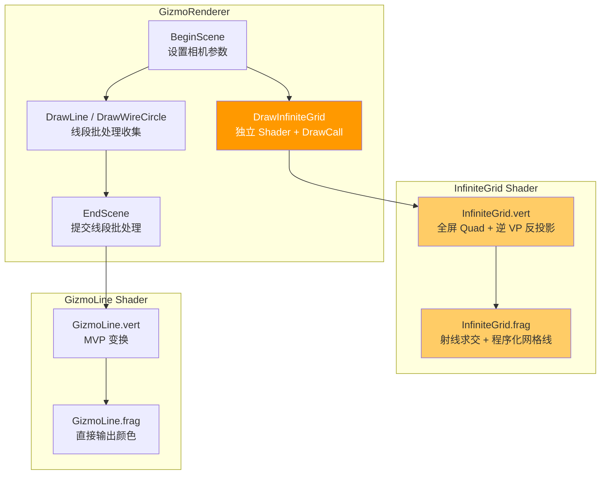

# Phase R14：无限网格（Infinite Grid）

> **文档版本**：v1.1  
> **创建日期**：2026-04-20  
> **最后更新**：2026-04-20  
> **优先级**：? P2  
> **预计工作量**：2.5-4 天  
> **前置依赖**：Phase R10（Gizmo 渲染系统，? 已完成）  
> **文档说明**：本文档详细描述如何将当前有限的 CPU 生成网格线替换为 GPU 程序化无限网格。采用全屏四边形 + 射线-平面求交 + 程序化网格线的方案，实现类似 Unity/Blender 的无限延伸网格效果。文档中对每个可选实现方式都进行了详细对比分析。

---

## 目录

- [一、现状分析](#一现状分析)
- [二、改进目标](#二改进目标)
- [三、涉及的文件清单](#三涉及的文件清单)
- [四、方案总体设计](#四方案总体设计)
  - [4.1 核心原理](#41-核心原理)
  - [4.2 渲染流程](#42-渲染流程)
  - [4.3 整体架构图](#43-整体架构图)
- [五、Shader 实现](#五shader-实现)
  - [5.1 顶点着色器 InfiniteGrid.vert](#51-顶点着色器-infinitegridvert)
  - [5.2 片段着色器 InfiniteGrid.frag](#52-片段着色器-infinitegridfrag)
  - [5.3 Shader 核心算法详解](#53-shader-核心算法详解)
- [六、C++ 端实现](#六c-端实现)
  - [6.1 GizmoRenderer 修改](#61-gizmorenderer-修改)
  - [6.2 SceneViewportPanel 修改](#62-sceneviewportpanel-修改)
- [七、关键技术决策与多方案对比](#七关键技术决策与多方案对比)
  - [7.1 逆 VP 矩阵传递方式](#71-逆-vp-矩阵传递方式)
  - [7.2 全屏四边形绘制方式](#72-全屏四边形绘制方式)
  - [7.3 网格线抗锯齿算法](#73-网格线抗锯齿算法)
  - [7.4 多级 LOD 策略](#74-多级-lod-策略)
  - [7.5 距离衰减函数](#75-距离衰减函数)
  - [7.6 深度写入方式](#76-深度写入方式)
  - [7.7 渲染顺序与混合模式](#77-渲染顺序与混合模式)
  - [7.8 中心轴线高亮方式](#78-中心轴线高亮方式)
- [八、可配置参数](#八可配置参数)
- [九、验证方法](#九验证方法)
- [十、已知限制与后续优化](#十已知限制与后续优化)
- [十一、设计决策汇总](#十一设计决策汇总)

---

## 一、现状分析

> 基于 2026-04-20 的实际代码状态。

### 当前实现

当前 `GizmoRenderer::DrawGrid(20.0f, 20)` 在 CPU 端生成有限线段：

```cpp
// GizmoRenderer.cpp - 当前实现
void GizmoRenderer::DrawGrid(float size, int divisions, const glm::vec4& color)
{
    float step = size / divisions;
    float halfSize = size / 2.0f;

    for (int i = 0; i <= divisions; ++i)
    {
        float pos = -halfSize + i * step;
        if (i == divisions / 2) continue;  // 跳过中心线（由轴线高亮绘制）
        
        DrawLine(glm::vec3(pos, 0.0f, -halfSize), glm::vec3(pos, 0.0f, halfSize), color);
        DrawLine(glm::vec3(-halfSize, 0.0f, pos), glm::vec3(halfSize, 0.0f, pos), color);
    }

    // 高亮中心轴线
    DrawLine(glm::vec3(-halfSize, 0.0f, 0.0f), glm::vec3(halfSize, 0.0f, 0.0f), glm::vec4(1.0f, 0.2f, 0.322f, 1.0f));  // X 轴红色
    DrawLine(glm::vec3(0.0f, 0.0f, -halfSize), glm::vec3(0.0f, 0.0f, halfSize), glm::vec4(0.157f, 0.565f, 1.0f, 1.0f)); // Z 轴蓝色
}
```

### 问题

| 编号 | 问题 | 影响 |
|------|------|------|
| R14-01 | 网格有明确边界（±10m） | 相机移动到边缘时网格突然消失 |
| R14-02 | 无多级 LOD | 缩放时网格密度不变，远处网格线过密产生摩尔纹 |
| R14-03 | CPU 端生成线段 | 每帧提交 42 条线段（84 个顶点），扩大范围会线性增长 |
| R14-04 | 无抗锯齿 | 远处网格线锯齿明显，视觉效果差 |
| R14-05 | 无距离衰减 | 网格线在边界处突然截断，没有平滑过渡 |

---

## 二、改进目标

1. **无限延伸**：网格在 XZ 平面上无限延伸，无论相机怎么移动都有网格
2. **多级 LOD**：根据相机高度/距离自动切换网格密度（1m → 10m → 100m）
3. **抗锯齿**：使用屏幕空间导数（`fwidth`）实现平滑的网格线
4. **距离衰减**：远处网格线平滑淡出，避免摩尔纹和硬边界
5. **深度正确**：网格写入深度缓冲，与场景物体正确遮挡
6. **中心轴线高亮**：X 轴红色、Z 轴蓝色，与 Unity/Blender 一致
7. **高性能**：仅 1 个 DrawCall（全屏四边形），纯 GPU 计算

---

## 三、涉及的文件清单

| 文件路径 | 操作 | 说明 |
|---------|------|------|
| `Luck3DApp/Assets/Shaders/InfiniteGrid.vert` | **新建** | 无限网格顶点着色器 |
| `Luck3DApp/Assets/Shaders/InfiniteGrid.frag` | **新建** | 无限网格片段着色器 |
| `Lucky/Source/Lucky/Renderer/GizmoRenderer.h` | 修改 | 新增 `DrawInfiniteGrid()` 声明 |
| `Lucky/Source/Lucky/Renderer/GizmoRenderer.cpp` | 修改 | 实现 `DrawInfiniteGrid()`，管理全屏 Quad 资源 |
| `Luck3DApp/Source/Panels/SceneViewportPanel.cpp` | 修改 | 将 `DrawGrid()` 替换为 `DrawInfiniteGrid()` |

---

## 四、方案总体设计

### 4.1 核心原理

无限网格的核心思路是：**不在 CPU 端生成几何体，而是在 GPU 的片段着色器中程序化计算每个像素是否在网格线上**。

具体步骤：

1. **绘制全屏四边形**：覆盖整个屏幕的两个三角形（6 个顶点）
2. **顶点着色器**：将全屏四边形的每个顶点通过逆 VP 矩阵反投影到世界空间，得到从相机出发的射线（近平面点 + 远平面点）
3. **片段着色器**：
   - 对每个片段，插值得到射线的近平面点和远平面点
   - 计算射线与 Y=0 平面的交点，得到世界空间 XZ 坐标
   - 使用 `fract()` + `fwidth()` 程序化判断该像素是否在网格线上
   - 根据相机距离计算多级 LOD 和距离衰减
   - 手动写入 `gl_FragDepth`，确保与场景物体正确遮挡


### 4.2 渲染流程

```
SceneViewportPanel::OnUpdate
  → Framebuffer.Bind()
  → RenderCommand::Clear()
  → Scene::OnUpdate()                      // 主渲染（Renderer3D）
  → GizmoRenderer::BeginScene()
      → GizmoRenderer::DrawInfiniteGrid()  // ★ 无限网格（新增，独立 DrawCall）
      → DrawDirectionalLightGizmo()        // 灯光 Gizmo（线段批处理）
      → DrawPointLightGizmo()
      → DrawSpotLightGizmo()
  → GizmoRenderer::EndScene()              // 提交线段批处理
  → Framebuffer.Unbind()
```

**关键**：`DrawInfiniteGrid()` 在 `BeginScene()` 之后、`EndScene()` 之前调用，但它**不使用线段批处理**，而是使用独立的 Shader 和 DrawCall。它在 `DrawInfiniteGrid()` 内部立即执行绘制，不等待 `EndScene()`。

### 4.3 整体架构图



---

## 五、Shader 实现

### 5.1 顶点着色器 InfiniteGrid.vert

```glsl
#version 450 core

// 逆 VP 矩阵（用于将 NDC 坐标反投影到世界空间）
uniform mat4 u_InverseVP;

// 输出到片段着色器的世界空间射线端点
out vec3 v_NearPoint;   // 近平面上的世界空间点
out vec3 v_FarPoint;    // 远平面上的世界空间点

// 全屏四边形顶点（硬编码在 Shader 中，使用 gl_VertexID 索引）
// 两个三角形组成一个覆盖整个 NDC 空间的四边形
vec3 gridPlane[6] = vec3[](
    vec3(-1.0, -1.0, 0.0), vec3(1.0, -1.0, 0.0), vec3(1.0, 1.0, 0.0),
    vec3(-1.0, -1.0, 0.0), vec3(1.0, 1.0, 0.0), vec3(-1.0, 1.0, 0.0)
);

/// <summary>
/// 将 NDC 空间的点通过逆 VP 矩阵反投影到世界空间
/// </summary>
/// <param name="clipPos">NDC 空间坐标（xy 为屏幕坐标，z 为深度）</param>
/// <returns>世界空间坐标</returns>
vec3 UnprojectPoint(vec3 clipPos)
{
    vec4 worldPos = u_InverseVP * vec4(clipPos, 1.0);
    return worldPos.xyz / worldPos.w;   // 透视除法
}

void main()
{
    vec3 pos = gridPlane[gl_VertexID];
    
    // 将 NDC 空间的近平面（z=-1）和远平面（z=1）上的点反投影到世界空间
    // 注意：OpenGL NDC 的 Z 范围是 [-1, 1]
    v_NearPoint = UnprojectPoint(vec3(pos.xy, -1.0));   // 近平面
    v_FarPoint  = UnprojectPoint(vec3(pos.xy,  1.0));   // 远平面
    
    // 全屏四边形直接输出 NDC 坐标，不需要任何变换
    gl_Position = vec4(pos, 1.0);
}
```

### 5.2 片段着色器 InfiniteGrid.frag

```glsl
#version 450 core

// ---- 输入 ----
in vec3 v_NearPoint;    // 近平面世界空间点（从顶点着色器插值）
in vec3 v_FarPoint;     // 远平面世界空间点（从顶点着色器插值）

// ---- 输出 ----
layout(location = 0) out vec4 o_Color;

// ---- Camera UBO（与 GizmoLine.vert 共享 binding=0）----
layout(std140, binding = 0) uniform Camera
{
    mat4 ViewProjectionMatrix;
    vec3 Position;
} u_Camera;

// ---- 网格参数 Uniforms ----
uniform float u_GridCellSize;       // 基础网格单元大小（默认 1.0）
uniform float u_GridMinPixels;      // 网格线最小像素宽度（默认 2.0）
uniform float u_GridFadeDistance;   // 网格淡出距离（默认 100.0）

// 轴线颜色
uniform vec4 u_AxisXColor;      // X 轴颜色（默认红色）
uniform vec4 u_AxisZColor;      // Z 轴颜色（默认蓝色）
uniform vec4 u_GridColor;       // 网格线颜色（默认灰色半透明）

/// 计算程序化网格线（Pristine Grid 算法）
/// 使用屏幕空间导数（fwidth）实现抗锯齿
/// worldPos2D: 世界空间 XZ 坐标
/// scale: 网格缩放（1.0 / cellSize）
/// 返回: 网格线强度 [0, 1]
float PristineGrid(vec2 worldPos2D, float scale)
{
    vec2 coord = worldPos2D * scale;
    
    // 屏幕空间导数：每个像素对应的世界空间变化量
    vec2 derivative = fwidth(coord);
    
    // 计算到最近网格线的距离（归一化到像素空间）
    vec2 grid = abs(fract(coord - 0.5) - 0.5) / derivative;
    
    // 取 X 和 Z 方向的最小值（任一方向在线上即可）
    float line = min(grid.x, grid.y);
    
    // 将距离转换为强度
    return 1.0 - min(line / u_GridMinPixels, 1.0);
}

/// 计算单轴方向的网格线强度（仅检测一个方向）
/// coord1D: 单轴世界坐标
/// scale: 网格缩放（1.0 / cellSize）
/// 返回: 该轴方向网格线强度 [0, 1]
float PristineGridAxis(float coord1D, float scale)
{
    float c = coord1D * scale;
    float d = fwidth(c);
    float grid = abs(fract(c - 0.5) - 0.5) / d;
    return 1.0 - min(grid / u_GridMinPixels, 1.0);
}

void main()
{
    // ---- 1. 射线与 Y=0 平面求交 ----
    // 射线参数方程：P = nearPoint + t * (farPoint - nearPoint)
    // Y=0 平面：P.y = 0
    // 解：t = -nearPoint.y / (farPoint.y - nearPoint.y)
    float t = -v_NearPoint.y / (v_FarPoint.y - v_NearPoint.y);
    
    // 世界空间交点
    vec3 worldPos = v_NearPoint + t * (v_FarPoint - v_NearPoint);
    
    // ---- 2. 丢弃不在平面上的片段 ----
    // t < 0 表示交点在相机后方
    if (t < 0.0)
    {
        discard;
    }
    
    // ---- 3. 计算多级 LOD 网格线 ----
    float cellSize = u_GridCellSize;
    
    float grid1 = PristineGrid(worldPos.xz, 1.0 / cellSize);           // 细网格（如 1m）
    float grid2 = PristineGrid(worldPos.xz, 1.0 / (cellSize * 10.0));  // 中网格（如 10m）
    float grid3 = PristineGrid(worldPos.xz, 1.0 / (cellSize * 100.0)); // 粗网格（如 100m）
    
    // ---- 4. 根据相机高度混合 LOD ----
    float cameraHeight = abs(u_Camera.Position.y);
    
    // LOD 混合因子：相机越高，细网格越淡，粗网格越显
    float lod1Fade = 1.0 - smoothstep(cellSize * 5.0,  cellSize * 20.0,  cameraHeight);  // 细网格在 5~20 倍 cellSize 高度淡出
    float lod2Fade = 1.0 - smoothstep(cellSize * 50.0, cellSize * 200.0, cameraHeight);  // 中网格在 50~200 倍 cellSize 高度淡出
    // 粗网格始终显示
    
    // 合并网格线强度（取最大值，避免重叠区域过亮）
    float gridIntensity = max(grid1 * lod1Fade, max(grid2 * lod2Fade, grid3));
    
    // ---- 5. 距离衰减 ----
    float distToCamera = length(worldPos - u_Camera.Position);
    float fade = 1.0 - smoothstep(u_GridFadeDistance * 0.5, u_GridFadeDistance, distToCamera);
    
    gridIntensity *= fade;
    
    // ---- 6. 轴线"染色"方案 ----
    // 核心思想：不单独绘制轴线，而是检测当前片段是否在 x=0 或 z=0 的网格线上
    // 如果是，则将灰色网格线的颜色替换为轴线颜色
    // 这样轴线的"形状"完全由 PristineGrid 算法决定，不会断裂
    
    // 使用最细网格的 scale 来判断轴线（轴线始终以最细网格精度显示）
    float scale = 1.0 / cellSize;
    vec2 coord = worldPos.xz * scale;
    
    // 最近的网格线索引
    float nearestGridX = round(coord.x);  // x 方向最近的网格线索引
    float nearestGridZ = round(coord.y);  // z 方向最近的网格线索引（coord.y 对应 worldPos.z）
    
    // 当前片段到最近网格线的归一化距离（与 PristineGrid 相同的计算方式）
    vec2 derivative = fwidth(coord);
    vec2 gridDist = abs(fract(coord - 0.5) - 0.5) / derivative;
    
    // 判断当前片段是否在 X 方向的网格线上（gridDist.x < u_GridMinPixels 表示在线上）
    bool onGridLineX = (gridDist.x < u_GridMinPixels);
    // 判断当前片段是否在 Z 方向的网格线上
    bool onGridLineZ = (gridDist.y < u_GridMinPixels);
    
    // 判断最近的网格线是否是轴线（索引为 0）
    bool isAxisX = onGridLineX && (abs(nearestGridX) < 0.5);  // x=0 的网格线 → Z 轴（蓝色）
    bool isAxisZ = onGridLineZ && (abs(nearestGridZ) < 0.5);  // z=0 的网格线 → X 轴（红色）
    
    // ---- 7. 合成最终颜色 ----
    vec4 color = u_GridColor;
    color.a *= gridIntensity;
    
    // 轴线染色：将灰色网格线替换为轴线颜色（保持相同的强度/alpha）
    if (isAxisZ)
    {
        // z=0 的网格线 → X 轴（红色）
        color.rgb = u_AxisXColor.rgb;
    }
    if (isAxisX)
    {
        // x=0 的网格线 → Z 轴（蓝色）
        color.rgb = u_AxisZColor.rgb;
    }
    
    // 完全透明则丢弃
    if (color.a < 0.001)
    {
        discard;
    }
    
    o_Color = color;
    
    // ---- 8. 手动写入深度 ----
    vec4 clipSpacePos = u_Camera.ViewProjectionMatrix * vec4(worldPos, 1.0);
    float depth = (clipSpacePos.z / clipSpacePos.w) * 0.5 + 0.5;   // NDC [-1,1] → [0,1]
    gl_FragDepth = depth;
}
```

### 5.3 Shader 核心算法详解

#### 5.3.1 射线-平面求交

```
射线参数方程：P(t) = nearPoint + t × (farPoint - nearPoint)
Y=0 平面方程：P.y = 0

代入：nearPoint.y + t × (farPoint.y - nearPoint.y) = 0
解出：t = -nearPoint.y / (farPoint.y - nearPoint.y)

当 t ∈ [0, 1] 时，交点在近平面和远平面之间（可见）
当 t < 0 时，交点在相机后方（不可见，discard）
```

#### 5.3.2 PristineGrid 算法

这是 Ben Golus 提出的 "Pristine Grid" 算法，核心思想：

```
1. coord = worldPos.xz * scale
   将世界坐标缩放到网格空间

2. derivative = fwidth(coord)
   计算屏幕空间导数，即每个像素对应多少网格空间单位
   这是抗锯齿的关键：知道一个像素"覆盖"了多大的世界空间

3. grid = abs(fract(coord - 0.5) - 0.5) / derivative
   fract(coord - 0.5) - 0.5：计算到最近整数网格线的有符号距离
   abs(...)：取绝对值
   / derivative：归一化到像素空间（距离以"像素"为单位）

4. line = min(grid.x, grid.y)
   取 X 和 Z 方向的最小距离（任一方向在线上即可）

5. intensity = 1.0 - min(line / lineWidth, 1.0)
   距离 < lineWidth 像素时，强度 > 0（在线上）
   距离 >= lineWidth 像素时，强度 = 0（不在线上）
```

#### 5.3.3 多级 LOD 混合

```
相机高度 h 决定哪些级别的网格可见：

h < 5m    → 细网格(1m) 100% + 中网格(10m) 100% + 粗网格(100m) 100%
h = 10m   → 细网格(1m)  50% + 中网格(10m) 100% + 粗网格(100m) 100%
h > 20m   → 细网格(1m)   0% + 中网格(10m) 100% + 粗网格(100m) 100%
h = 100m  → 细网格(1m)   0% + 中网格(10m)  50% + 粗网格(100m) 100%
h > 200m  → 细网格(1m)   0% + 中网格(10m)   0% + 粗网格(100m) 100%

使用 smoothstep 实现平滑过渡，避免 LOD 切换时的跳变。
```

#### 5.3.4 轴线"染色"算法详解

轴线高亮采用"染色"方案而非独立绘制，核心原理如下：

```
问题背景：
  独立绘制轴线（使用 abs(worldPos.x) 或 smoothstep 判断）会导致掠射角下轴线"断裂"。
  原因是全屏四边形由两个三角形组成，三角形对角线边界处 v_NearPoint/v_FarPoint 的
  线性插值存在微小不连续，而轴线使用全局坐标（abs(worldPos.x)）对此极其敏感。
  灰色网格线不受影响，因为 fract() 是周期函数，只关心小数部分。

染色方案核心思想：
  轴线不是一个独立的绘制逻辑，而是对 x=0 和 z=0 位置的灰色网格线进行"颜色替换"。
  轴线的形状、抗锯齿、线宽完全由 PristineGrid 算法决定。

算法步骤：
  1. coord = worldPos.xz * scale
     将世界坐标缩放到网格空间

  2. nearestGridX = round(coord.x)
     nearestGridZ = round(coord.y)
     计算当前片段最近的网格线索引

  3. gridDist = abs(fract(coord - 0.5) - 0.5) / fwidth(coord)
     使用与 PristineGrid 完全相同的算法计算到最近网格线的像素距离

  4. onGridLineX = (gridDist.x < u_GridMinPixels)
     判断当前片段是否在 X 方向的网格线上

  5. isAxisX = onGridLineX && (abs(nearestGridX) < 0.5)
     判断最近的网格线索引是否为 0（即 x=0 这条线）

  6. 如果 isAxisX 为 true，将颜色从灰色替换为蓝色（Z 轴）
     如果 isAxisZ 为 true，将颜色从灰色替换为红色（X 轴）

优势：
  - 轴线与灰色网格线使用完全相同的数学路径，不可能断裂
  - 零额外计算开销（复用 PristineGrid 的 fract/fwidth 结果）
  - 轴线自动继承网格线的抗锯齿、LOD、距离衰减等所有特性
```

---

## 六、C++ 端实现

### 6.1 GizmoRenderer 修改

#### 6.1.1 头文件修改（GizmoRenderer.h）

```cpp
// 在 "场景 Gizmo" 区域新增：

/// <summary>
/// 绘制无限网格（GPU 程序化，独立 DrawCall）
/// 在 BeginScene() 之后、EndScene() 之前调用
/// </summary>
/// <param name="camera">编辑器相机（用于获取逆 VP 矩阵）</param>
static void DrawInfiniteGrid(const EditorCamera& camera);
```

#### 6.1.2 实现文件修改（GizmoRenderer.cpp）

在 `GizmoRendererData` 结构体中新增无限网格相关的资源：

```cpp
struct GizmoRendererData
{
    // ... 现有的线段批处理数据 ...
    
    // ---- 无限网格资源 ----
    Ref<VertexArray> GridVertexArray;    // 空 VAO（用于无 VBO 绘制）
    Ref<Shader> GridShader;             // 无限网格 Shader
};
```

在 `Init()` 中初始化：

```cpp
void GizmoRenderer::Init()
{
    // ... 现有的线段批处理初始化 ...
    
    // ---- 无限网格初始化 ----
    s_GizmoData.GridVertexArray = VertexArray::Create();    // 空 VAO
    s_GizmoData.GridShader = Shader::Create("Assets/Shaders/InfiniteGrid");
}
```

实现 `DrawInfiniteGrid()`：

```cpp
void GizmoRenderer::DrawInfiniteGrid(const EditorCamera& camera)
{
    // 计算逆 VP 矩阵
    glm::mat4 vpMatrix = camera.GetViewProjectionMatrix();
    glm::mat4 inverseVP = glm::inverse(vpMatrix);
    
    // 绑定 Shader 并设置 Uniforms
    s_GizmoData.GridShader->Bind();
    s_GizmoData.GridShader->SetMat4("u_InverseVP", inverseVP);
    
    // 网格参数
    s_GizmoData.GridShader->SetFloat("u_GridCellSize", 1.0f);
    s_GizmoData.GridShader->SetFloat("u_GridMinPixels", 1.0f);
    s_GizmoData.GridShader->SetFloat("u_GridFadeDistance", 100.0f);
    
    // 轴线颜色
    s_GizmoData.GridShader->SetFloat4("u_AxisXColor", glm::vec4(1.0f, 0.2f, 0.322f, 1.0f));         // X 轴红色
    s_GizmoData.GridShader->SetFloat4("u_AxisZColor", glm::vec4(0.157f, 0.565f, 1.0f, 1.0f));       // Z 轴蓝色
    s_GizmoData.GridShader->SetFloat4("u_GridColor", glm::vec4(0.329f, 0.329f, 0.329f, 0.502f));    // 网格线灰色
    
    // 绑定空 VAO 并绘制 6 个顶点（全屏四边形，顶点在 Shader 中硬编码）
    RenderCommand::DrawArrays(s_GizmoData.GridVertexArray, 6);
}
```

#### 6.1.3 RenderCommand 新增 DrawArrays 方法

当前 `RenderCommand` 只有 `DrawLines`（使用 `GL_LINES`）和 `DrawIndexed`（使用 `GL_TRIANGLES` + 索引）。需要新增一个通用的 `DrawArrays` 方法：

**RenderCommand.h 新增：**

```cpp
/// <summary>
/// 绘制三角形（无索引）
/// </summary>
/// <param name="vertexArray">顶点数组</param>
/// <param name="vertexCount">顶点个数</param>
static void DrawArrays(const Ref<VertexArray>& vertexArray, uint32_t vertexCount);
```

**RenderCommand.cpp 新增：**

```cpp
void RenderCommand::DrawArrays(const Ref<VertexArray>& vertexArray, uint32_t vertexCount)
{
    vertexArray->Bind();
    glDrawArrays(GL_TRIANGLES, 0, vertexCount);
}
```

### 6.2 SceneViewportPanel 修改

将 `DrawGrid(20.0f, 20)` 替换为 `DrawInfiniteGrid()`：

```cpp
// SceneViewportPanel.cpp - OnUpdate 中
GizmoRenderer::BeginScene(m_EditorCamera);
{
    // 无限网格（替换原有的 DrawGrid）
    GizmoRenderer::DrawInfiniteGrid(m_EditorCamera);

    // 灯光 Gizmo（不变）
    // ...
}
GizmoRenderer::EndScene();
```

---

## 七、关键技术决策与多方案对比

### 7.1 逆 VP 矩阵传递方式

无限网格 Shader 需要逆 VP 矩阵来将 NDC 坐标反投影到世界空间。当前 Camera UBO（binding=0）只包含 `ViewProjectionMatrix` 和 `Position`，没有逆矩阵。

#### 方案 A：使用独立 Uniform 传递（? 推荐，最优）

```cpp
// C++ 端
glm::mat4 inverseVP = glm::inverse(camera.GetViewProjectionMatrix());
gridShader->SetMat4("u_InverseVP", inverseVP);
```

```glsl
// Shader 端
uniform mat4 u_InverseVP;
```

| 优点 | 缺点 |
|------|------|
| ? 不影响现有 UBO 结构 | ?? 每帧需要一次 `glUniformMatrix4fv` 调用 |
| ? 不影响其他 Shader | |
| ? 实现最简单 | |
| ? 只有 InfiniteGrid Shader 需要此矩阵 | |

#### 方案 B：扩展 Camera UBO

```cpp
// 修改 CameraUBOData
struct CameraUBOData
{
    glm::mat4 ViewProjectionMatrix;
    glm::mat4 InverseViewProjectionMatrix;  // 新增
    glm::vec3 Position;
    char padding[4];
};
```

```glsl
// 所有使用 Camera UBO 的 Shader 都需要更新
layout(std140, binding = 0) uniform Camera
{
    mat4 ViewProjectionMatrix;
    mat4 InverseViewProjectionMatrix;   // 新增
    vec3 Position;
} u_Camera;
```

| 优点 | 缺点 |
|------|------|
| ? 所有 Shader 都能访问逆矩阵 | ? 需要修改所有使用 Camera UBO 的 Shader（GizmoLine、Standard、InternalError） |
| ? 只需一次 UBO 更新 | ? UBO 大小增加 64 字节 |
| | ? 改动范围大，容易引入 bug |
| | ? 大多数 Shader 不需要逆矩阵 |

#### 方案 C：在 Shader 中实时计算逆矩阵

```glsl
// 在顶点着色器中
mat4 inverseVP = inverse(u_Camera.ViewProjectionMatrix);
```

| 优点 | 缺点 |
|------|------|
| ? 不需要修改 C++ 端 | ? GPU 端计算 4x4 矩阵求逆，性能开销大 |
| ? 不需要额外 Uniform | ? 每个顶点都要计算一次（虽然只有 6 个顶点） |
| | ? 不推荐在 Shader 中做矩阵求逆 |

**推荐**：**方案 A**。最简单、最安全、不影响现有代码。逆矩阵在 CPU 端计算一次（`glm::inverse`），通过独立 Uniform 传递给 Shader。

---

### 7.2 全屏四边形绘制方式

#### 方案 A：gl_VertexID 硬编码顶点（? 推荐，最优）

在顶点着色器中使用 `gl_VertexID` 索引硬编码的顶点数组，C++ 端只需一个空 VAO：

```glsl
// Shader 中
vec3 gridPlane[6] = vec3[](
    vec3(-1, -1, 0), vec3(1, -1, 0), vec3(1, 1, 0),
    vec3(-1, -1, 0), vec3(1, 1, 0), vec3(-1, 1, 0)
);
vec3 pos = gridPlane[gl_VertexID];
```

```cpp
// C++ 端
auto emptyVAO = VertexArray::Create();  // 空 VAO，无 VBO
emptyVAO->Bind();
glDrawArrays(GL_TRIANGLES, 0, 6);
```

| 优点 | 缺点 |
|------|------|
| ? 零 GPU 内存占用（无 VBO） | ?? 需要确保空 VAO 绑定后 `glDrawArrays` 能正常工作 |
| ? 代码最简洁 | ?? 某些老旧驱动可能不支持（OpenGL 4.5 完全支持） |
| ? 无需管理 VBO 生命周期 | |

#### 方案 B：创建专用 VBO

```cpp
float quadVertices[] = {
    -1.0f, -1.0f, 0.0f,
     1.0f, -1.0f, 0.0f,
     1.0f,  1.0f, 0.0f,
    -1.0f, -1.0f, 0.0f,
     1.0f,  1.0f, 0.0f,
    -1.0f,  1.0f, 0.0f,
};

auto vbo = VertexBuffer::Create(quadVertices, sizeof(quadVertices));
vbo->SetLayout({ { ShaderDataType::Float3, "a_Position" } });
auto vao = VertexArray::Create();
vao->AddVertexBuffer(vbo);
```

```glsl
// Shader 中
layout(location = 0) in vec3 a_Position;
// 使用 a_Position 代替 gridPlane[gl_VertexID]
```

| 优点 | 缺点 |
|------|------|
| ? 传统方式，兼容性最好 | ? 需要额外的 VBO（72 字节，微不足道） |
| ? 与项目现有模式一致 | ? 需要管理 VBO 生命周期 |
| | ? 代码稍多 |

#### 方案 C：使用超大三角形（Single Triangle Trick）

使用一个覆盖整个屏幕的超大三角形代替两个三角形的四边形：

```glsl
vec2 positions[3] = vec2[](
    vec2(-1.0, -1.0),
    vec2( 3.0, -1.0),
    vec2(-1.0,  3.0)
);
```

| 优点 | 缺点 |
|------|------|
| ? 只需 3 个顶点 | ?? 超出屏幕的部分被裁剪，但 GPU 仍需处理 |
| ? 避免四边形对角线的光栅化接缝 | ?? 概念不直观 |

**推荐**：**方案 A**（gl_VertexID 硬编码）。项目使用 OpenGL 4.5（`#version 450 core`），完全支持此方式。零额外内存，代码最简洁。

**次优**：**方案 B**（专用 VBO）。如果遇到空 VAO 兼容性问题，可以回退到此方案。

---

### 7.3 网格线抗锯齿算法

#### 方案 A：Pristine Grid（fwidth + fract）（? 推荐，最优）

即上文 Shader 中使用的算法，由 Ben Golus 提出：

```glsl
vec2 coord = worldPos.xz * scale;
vec2 derivative = fwidth(coord);
vec2 grid = abs(fract(coord - 0.5) - 0.5) / derivative;
float line = min(grid.x, grid.y);
float intensity = 1.0 - min(line / lineWidth, 1.0);
```

| 优点 | 缺点 |
|------|------|
| ? 抗锯齿效果最好 | ?? 需要理解 `fwidth` 的含义 |
| ? 自动适应屏幕分辨率 | |
| ? 线宽以像素为单位，视觉一致 | |
| ? 业界标准做法 | |

#### 方案 B：smoothstep 抗锯齿

```glsl
vec2 coord = worldPos.xz * scale;
vec2 derivative = fwidth(coord);
vec2 grid = smoothstep(vec2(0.0), derivative * lineWidth, abs(fract(coord - 0.5) - 0.5));
float line = min(grid.x, grid.y);
float intensity = 1.0 - line;
```

| 优点 | 缺点 |
|------|------|
| ? 过渡更平滑（三次曲线） | ?? 线宽控制不如方案 A 精确 |
| ? 视觉上更柔和 | ?? 计算量略大（smoothstep 比线性插值贵） |

#### 方案 C：简单 step（无抗锯齿）

```glsl
vec2 coord = worldPos.xz * scale;
float line = step(0.98, max(fract(coord.x), fract(coord.y)));
```

| 优点 | 缺点 |
|------|------|
| ? 最简单 | ? 无抗锯齿，远处严重摩尔纹 |
| ? 性能最好 | ? 视觉效果差 |

**推荐**：**方案 A**（Pristine Grid）。这是目前业界公认的最佳网格线抗锯齿算法，Unity 和 Blender 都使用类似方法。

---

### 7.4 多级 LOD 策略

#### 方案 A：基于相机高度的 LOD（? 推荐，最优）

根据相机 Y 坐标的绝对值决定各级网格的可见性：

```glsl
float cameraHeight = abs(u_Camera.Position.y);
float lod1Fade = 1.0 - smoothstep(cellSize * 5.0,  cellSize * 20.0,  cameraHeight);
float lod2Fade = 1.0 - smoothstep(cellSize * 50.0, cellSize * 200.0, cameraHeight);
```

| 优点 | 缺点 |
|------|------|
| ? 直观：俯视时自动切换到粗网格 | ?? 相机水平看时（Y≈0），始终显示细网格 |
| ? 计算简单 | |
| ? Unity 采用类似方式 | |

#### 方案 B：基于相机到原点距离的 LOD

```glsl
float cameraDist = length(u_Camera.Position);
float lod1Fade = 1.0 - smoothstep(cellSize * 5.0,  cellSize * 20.0,  cameraDist);
float lod2Fade = 1.0 - smoothstep(cellSize * 50.0, cellSize * 200.0, cameraDist);
```

| 优点 | 缺点 |
|------|------|
| ? 任何角度都能正确切换 LOD | ? 相机远离原点但平行于地面时，细网格也会消失 |
| | ? 不够直观 |

#### 方案 C：基于每个片段到相机距离的 LOD（? 次优）

```glsl
float distToCamera = length(worldPos - u_Camera.Position);
float lod1Fade = 1.0 - smoothstep(cellSize * 10.0,  cellSize * 40.0,  distToCamera);
float lod2Fade = 1.0 - smoothstep(cellSize * 100.0, cellSize * 400.0, distToCamera);
```

| 优点 | 缺点 |
|------|------|
| ? 最精确：近处细网格，远处粗网格 | ?? 每个片段都要计算距离（已经在距离衰减中计算了，可复用） |
| ? 与距离衰减自然结合 | ?? 可能出现同一视野内多级网格的环形过渡带 |
| ? Blender 采用类似方式 | |

**推荐**：**方案 A**（基于相机高度）。最简单直观，适合编辑器场景。大多数情况下编辑器相机都是从上方俯视场景。

**次优**：**方案 C**（基于片段距离）。如果需要更精确的 LOD 控制，可以使用此方案。

**混合方案**：也可以将方案 A 和方案 C 结合――用相机高度决定全局 LOD 级别，用片段距离做局部衰减。

---

### 7.5 距离衰减函数

#### 方案 A：smoothstep 衰减（? 推荐，最优）

```glsl
float distToCamera = length(worldPos - u_Camera.Position);
float fade = 1.0 - smoothstep(fadeDistance * 0.5, fadeDistance, distToCamera);
```

| 优点 | 缺点 |
|------|------|
| ? 平滑的三次曲线过渡 | ?? 需要调参（fadeDistance） |
| ? 视觉效果最好 | |
| ? 没有硬边界 | |

#### 方案 B：线性衰减

```glsl
float fade = clamp(1.0 - distToCamera / fadeDistance, 0.0, 1.0);
```

| 优点 | 缺点 |
|------|------|
| ? 最简单 | ? 过渡不够平滑 |
| ? 计算量最小 | ? 在 fadeDistance 处有明显的衰减起点 |

#### 方案 C：指数衰减

```glsl
float fade = exp(-distToCamera * distToCamera / (fadeDistance * fadeDistance));
```

| 优点 | 缺点 |
|------|------|
| ? 自然的高斯衰减 | ?? 衰减速度不如 smoothstep 可控 |
| ? 无硬边界 | ?? 远处衰减过快或过慢需要调参 |

**推荐**：**方案 A**（smoothstep）。过渡最平滑，参数最直观（`fadeDistance` 就是网格完全消失的距离）。

---

### 7.6 深度写入方式

#### 方案 A：手动写入 gl_FragDepth（? 推荐，最优）

```glsl
vec4 clipSpacePos = u_Camera.ViewProjectionMatrix * vec4(worldPos, 1.0);
float depth = (clipSpacePos.z / clipSpacePos.w) * 0.5 + 0.5;
gl_FragDepth = depth;
```

| 优点 | 缺点 |
|------|------|
| ? 网格与场景物体正确遮挡 | ?? 写入 `gl_FragDepth` 会禁用 Early-Z 优化 |
| ? 物体放在地面上时，物体遮挡网格 | ?? 性能略有影响（但全屏 Quad 只有一层，影响极小） |
| ? 视觉效果最自然 | |

#### 方案 B：不写入深度（禁用深度写入）

```cpp
// C++ 端
glDepthMask(GL_FALSE);  // 禁用深度写入
// 绘制网格
glDepthMask(GL_TRUE);   // 恢复深度写入
```

| 优点 | 缺点 |
|------|------|
| ? 保留 Early-Z 优化 | ? 网格始终在所有物体后面（或前面） |
| ? 实现简单 | ? 物体与网格的遮挡关系不正确 |

#### 方案 C：使用 layout(depth_greater) 优化

```glsl
layout(depth_greater) out float gl_FragDepth;
```

这告诉 GPU：`gl_FragDepth` 的值总是 >= 默认深度值，允许部分 Early-Z 优化。

| 优点 | 缺点 |
|------|------|
| ? 保留部分 Early-Z 优化 | ?? 需要确保写入的深度确实 >= 默认值 |
| ? 深度遮挡正确 | ?? 对于无限网格，这个假设不一定成立 |

**推荐**：**方案 A**（手动写入 `gl_FragDepth`）。虽然禁用了 Early-Z，但无限网格只有一个全屏 Quad（无重叠），Early-Z 的收益本来就很小。正确的深度遮挡对视觉效果至关重要。

---

### 7.7 渲染顺序与混合模式

#### 方案 A：主场景之后、其他 Gizmo 之前绘制（? 推荐，最优）

```
Scene::OnUpdate()           // 主场景渲染
GizmoRenderer::BeginScene()
  DrawInfiniteGrid()        // ★ 无限网格
  DrawLightGizmos()         // 灯光 Gizmo
GizmoRenderer::EndScene()   // 提交线段
```

混合模式：使用现有的 `GL_SRC_ALPHA, GL_ONE_MINUS_SRC_ALPHA`（已在 `RenderCommand::Init()` 中全局启用）。

| 优点 | 缺点 |
|------|------|
| ? 场景物体遮挡网格（通过深度测试） | ?? 需要确保深度测试开启 |
| ? 灯光 Gizmo 绘制在网格之上 | |
| ? 与现有渲染流程自然融合 | |

#### 方案 B：所有 Gizmo 之后绘制

| 优点 | 缺点 |
|------|------|
| ? 不影响其他 Gizmo 的绘制 | ? 网格可能遮挡灯光 Gizmo |

#### 方案 C：主场景之前绘制

| 优点 | 缺点 |
|------|------|
| ? 网格始终在最底层 | ? 如果不写入深度，场景物体无法遮挡网格 |
| | ? 如果写入深度，可能影响场景渲染的 Early-Z |

**推荐**：**方案 A**。在主场景之后绘制，利用深度测试让场景物体遮挡网格，然后灯光 Gizmo 绘制在网格之上。

**关于混合模式**：当前项目已全局启用 `GL_BLEND` + `GL_SRC_ALPHA, GL_ONE_MINUS_SRC_ALPHA`，无限网格的 Shader 输出带 alpha 的颜色，自然会与背景混合。无需额外设置。

---

### 7.8 中心轴线高亮方式

#### 方案 A：在片段着色器中用 fwidth 独立判断

在同一个 Shader 中，额外判断 `worldPos.x ≈ 0` 和 `worldPos.z ≈ 0`：

```glsl
vec2 derivative = fwidth(worldPos.xz);
float axisX = 1.0 - min(abs(worldPos.z) / (derivative.y * lineWidth), 1.0);
float axisZ = 1.0 - min(abs(worldPos.x) / (derivative.x * lineWidth), 1.0);

if (axisX > 0.01) color = vec4(xAxisColor, max(color.a, axisX * fade));
if (axisZ > 0.01) color = vec4(zAxisColor, max(color.a, axisZ * fade));
```

| 优点 | 缺点 |
|------|------|
| ? 无额外 DrawCall | ? 使用全局坐标 `abs(worldPos.x/z)`，对插值误差极其敏感 |
| ? 实现简单 | ? **掠射角下轴线"断裂"**：全屏四边形两个三角形的对角线边界处，`v_NearPoint`/`v_FarPoint` 的线性插值存在微小不连续，被全局坐标放大 |
| | ? 即使用解析导数替代 `fwidth`，断裂问题依然存在（根因是插值不连续，不是导数估计问题） |

#### 方案 B：使用独立的线段绘制轴线

保留原有的 `DrawLine` 绘制中心轴线，但将线段延长到很远：

```cpp
float axisLength = 1000.0f;
DrawLine(glm::vec3(-axisLength, 0, 0), glm::vec3(axisLength, 0, 0), xAxisColor);
DrawLine(glm::vec3(0, 0, -axisLength), glm::vec3(0, 0, axisLength), zAxisColor);
```

| 优点 | 缺点 |
|------|------|
| ? 轴线可以有不同的线宽 | ? 额外的线段（增加线段批处理负担） |
| ? 轴线不受网格 Shader 影响 | ? 线段没有抗锯齿 |
| | ? 线段有固定长度，不是真正无限 |

#### 方案 C：轴线"染色"方案（? 最终采用，最优）

**核心思想**：不单独绘制轴线，而是检测当前片段是否在 x=0 或 z=0 的网格线上，如果是，则将灰色网格线的颜色替换为轴线颜色。轴线的"形状"完全由 PristineGrid 算法决定。

```glsl
// 使用最细网格的 scale 来判断轴线
float scale = 1.0 / cellSize;
vec2 coord = worldPos.xz * scale;

// 最近的网格线索引
float nearestGridX = round(coord.x);
float nearestGridZ = round(coord.y);

// 当前片段到最近网格线的归一化距离（与 PristineGrid 相同的计算方式）
vec2 derivative = fwidth(coord);
vec2 gridDist = abs(fract(coord - 0.5) - 0.5) / derivative;

// 判断当前片段是否在网格线上 且 最近的网格线是轴线（索引为 0）
bool onGridLineX = (gridDist.x < u_GridMinPixels);
bool onGridLineZ = (gridDist.y < u_GridMinPixels);
bool isAxisX = onGridLineX && (abs(nearestGridX) < 0.5);  // x=0 → Z 轴（蓝色）
bool isAxisZ = onGridLineZ && (abs(nearestGridZ) < 0.5);  // z=0 → X 轴（红色）

// 染色：替换颜色，保持相同的强度/alpha
if (isAxisZ) color.rgb = u_AxisXColor.rgb;
if (isAxisX) color.rgb = u_AxisZColor.rgb;
```

| 优点 | 缺点 |
|------|------|
| ? **彻底解决断裂问题**：轴线与灰色网格线使用完全相同的 `fract` + `fwidth` 数学路径 | ?? 轴线与灰色网格线共享相同的线宽和强度 |
| ? 零额外计算开销（复用 PristineGrid 的结果） | ?? 轴线不能比灰色网格线更粗 |
| ? 轴线自动继承抗锯齿、LOD、距离衰减等所有特性 | |
| ? `fract()` 是周期函数，对插值误差天然免疫 | |
| ? 无额外 DrawCall | |

**为什么方案 C 能解决断裂而方案 A 不能？**

关键区别在于坐标的使用方式：
- **方案 A** 使用 `abs(worldPos.x)` ―― 这是**全局单调函数**，对 `worldPos` 的任何微小偏移都会产生响应
- **方案 C** 使用 `fract(coord - 0.5) - 0.5` ―― 这是**周期函数**，只关心坐标的小数部分（即相对于最近整数的有符号距离）

全屏四边形的两个三角形在对角线边界处，`v_NearPoint`/`v_FarPoint` 的线性插值存在微小不连续（因为 `gl_Position.w = 1.0` 导致 GPU 做线性插值而非透视校正插值，但反投影结果在世界空间中是非线性的）。这个不连续：
- 对 `abs(worldPos.x)` 来说是致命的――微小偏移直接导致轴线位置跳变
- 对 `fract(...)` 来说是无害的――微小偏移只会让小数部分微小变化，不会跨越网格线边界

**推荐**：**方案 C**（轴线染色）。从根本上解决了断裂问题，且零额外开销。

---

## 八、可配置参数

以下参数建议在 C++ 端作为常量或可配置变量，通过 Uniform 传递给 Shader：

| 参数 | 类型 | 默认值 | 说明 |
|------|------|--------|------|
| `u_GridCellSize` | float | 1.0 | 基础网格单元大小（米） |
| `u_GridMinPixels` | float | 1.0 | 网格线最小像素宽度（控制线粗细） |
| `u_GridFadeDistance` | float | 100.0 | 网格淡出距离（米） |
| `u_AxisXColor` | vec4 | (1.0, 0.2, 0.322, 1.0) | X 轴颜色（红色，与现有一致） |
| `u_AxisZColor` | vec4 | (0.157, 0.565, 1.0, 1.0) | Z 轴颜色（蓝色，与现有一致） |
| `u_GridColor` | vec4 | (0.329, 0.329, 0.329, 0.502) | 网格线颜色（灰色半透明，与现有一致） |

**后续可扩展**：
- 网格线粗细可在编辑器设置面板中调节
- 网格单元大小可根据项目需求调整
- 淡出距离可根据场景规模调整

---

## 九、验证方法

### 9.1 基础功能验证

| 测试项 | 预期结果 |
|--------|---------|
| 启动编辑器 | XZ 平面显示无限网格 |
| 相机向任意方向移动 | 网格始终存在，无边界 |
| 相机升高 | 细网格淡出，粗网格显现 |
| 相机降低 | 粗网格淡出，细网格显现 |
| 远处网格 | 平滑淡出，无硬边界 |

### 9.2 视觉质量验证

| 测试项 | 预期结果 |
|--------|---------|
| 近处网格线 | 清晰、无锯齿 |
| 远处网格线 | 平滑淡出，无摩尔纹 |
| X 轴（Z=0） | 红色高亮，无限延伸 |
| Z 轴（X=0） | 蓝色高亮，无限延伸 |
| LOD 切换 | 平滑过渡，无跳变 |

### 9.3 深度遮挡验证

| 测试项 | 预期结果 |
|--------|---------|
| 物体放在地面上 | 物体遮挡网格线 |
| 物体在地面下方 | 网格线遮挡物体 |
| 灯光 Gizmo | 灯光线框绘制在网格之上 |

### 9.4 性能验证

| 测试项 | 预期结果 |
|--------|---------|
| DrawCall 数量 | 无限网格仅增加 1 个 DrawCall |
| 帧率影响 | 与原有 DrawGrid 相比，帧率无明显下降 |
| GPU 占用 | 片段着色器计算量适中，不应成为瓶颈 |

### 9.5 边界情况验证

| 测试项 | 预期结果 |
|--------|---------|
| 相机在 Y=0 平面上 | 网格正常显示（射线几乎平行于平面，远处自然衰减） |
| 相机在 Y=0 平面下方 | 网格从下方可见（t > 0 的片段仍然绘制） |
| 相机正对 Y 轴向下看 | 网格正常显示，LOD 根据高度切换 |
| 极远距离 | 网格完全淡出，不影响性能 |

---

## 十、已知限制与后续优化

### 10.1 已知限制

| 限制 | 说明 | 影响程度 |
|------|------|---------|
| Early-Z 禁用 | 使用 `gl_FragDepth` 会禁用 Early-Z 优化 | 低（只有一层全屏 Quad） |
| 浮点精度 | 极远处（>10000m）可能出现浮点精度问题 | 低（距离衰减会在此之前淡出） |
| 单平面 | 只支持 Y=0 平面的网格 | 低（编辑器场景通常只需要 XZ 平面网格） |
| 轴线线宽 | 染色方案下轴线与灰色网格线共享相同线宽，无法单独加粗 | 低（视觉上颜色区分已足够明显） |

### 10.2 后续优化方向

| 优化 | 说明 | 优先级 |
|------|------|--------|
| Y 轴短线 | 在原点处绘制一小段 Y 轴绿色线（使用线段批处理） | P3 |
| 网格参数面板 | 在编辑器设置中暴露网格参数（线宽、颜色、淡出距离等） | P3 |
| 自适应 LOD | 根据相机 FOV 和视口大小自动调整 LOD 阈值 | P4 |
| 多平面支持 | 支持 XY、YZ 平面的网格（用于 2D 编辑模式） | P4 |
| 轴线加粗 | 如需轴线比灰色线更粗，可在染色时额外检测相邻网格线并扩展染色范围 | P4 |

### 10.3 开发过程中遇到的问题与解决方案

| 问题 | 原因分析 | 尝试的方案 | 最终解决方案 |
|------|---------|-----------|-------------|
| X/Z 轴线在掠射角下"断裂" | 全屏四边形两个三角形对角线边界处 `v_NearPoint`/`v_FarPoint` 线性插值不连续，全局坐标 `abs(worldPos.x/z)` 对此极其敏感 | ① 用解析导数替代 `fwidth` → 无效<br/>② 在片段着色器中精确反投影（传递 NDC 坐标）→ 无效 | 采用"染色"方案：轴线不独立绘制，而是对 x=0/z=0 位置的灰色网格线进行颜色替换，使用 `fract()` 周期函数天然免疫插值误差 |
| 轴线位置有灰色网格线重叠 | 轴线和灰色网格线在同一位置同时绘制 | 在轴线区域压低灰色网格线强度 | 染色方案自然解决：轴线就是灰色网格线本身，只是颜色不同 |
| 轴线有类似摩尔纹的"正弦波" | 同断裂问题的根因，`fwidth` 在三角形边界处的导数估计跳变 | 用 `smoothstep` 替代线性过渡 | 染色方案自然解决 |

---

## 十一、设计决策汇总

| 决策 | 选择 | 原因 |
|------|------|------|
| 整体方案 | GPU 程序化无限网格 | 业界标准，效果最好，性能最优 |
| 逆 VP 矩阵传递 | 独立 Uniform（方案 A） | 不影响现有 UBO，实现最简单 |
| 全屏四边形 | gl_VertexID 硬编码（方案 A） | 零内存，代码最简洁，OpenGL 4.5 完全支持 |
| 抗锯齿算法 | Pristine Grid / fwidth（方案 A） | 业界标准，效果最好 |
| 多级 LOD | 基于相机高度（方案 A） | 最直观，适合编辑器场景 |
| 距离衰减 | smoothstep（方案 A） | 过渡最平滑 |
| 深度写入 | gl_FragDepth（方案 A） | 遮挡关系正确，视觉最自然 |
| 渲染顺序 | 主场景之后、其他 Gizmo 之前 | 深度遮挡正确，Gizmo 在网格之上 |
| 中心轴线 | **轴线"染色"方案（方案 C）** | 彻底解决掠射角断裂问题，`fract()` 周期函数天然免疫插值误差，零额外开销 |
| 混合模式 | 复用全局 Alpha Blend | 无需额外设置 |
