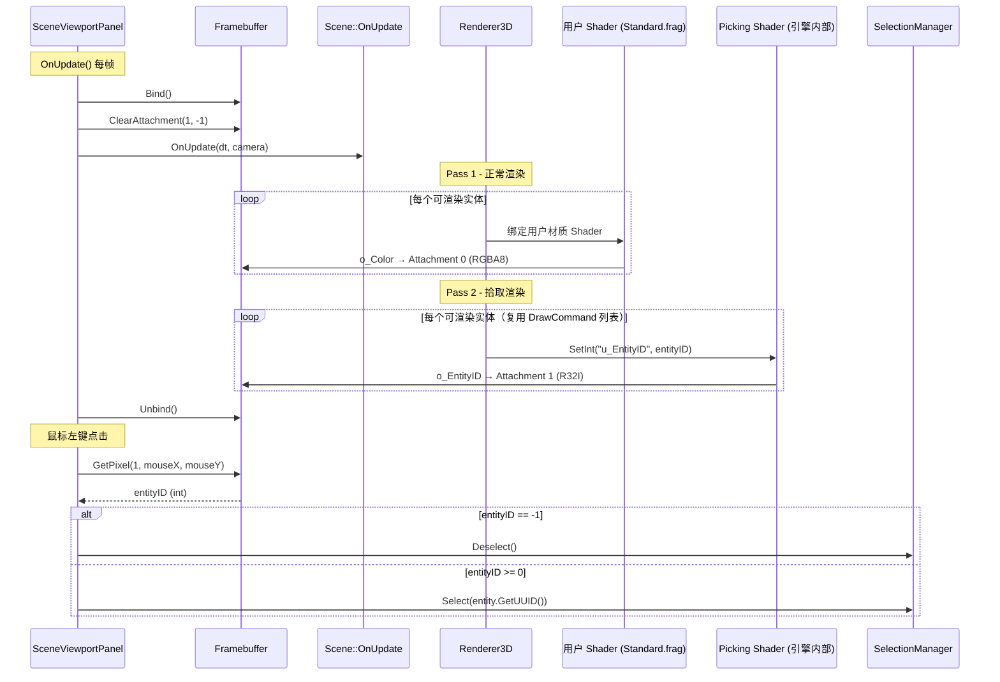

# ?? Luck3D 鼠标拾取功能 ― 方案 B 详细设计文档

## 一、方案概述

**方案名称**：独立拾取 Pass + 专用 Picking Shader（双 Pass 方案）

**核心思想**：在正常渲染 Pass 完成后，使用引擎内部的专用 Picking Shader 对所有可渲染物体再执行一次极简渲染，仅将 Entity ID 写入 Framebuffer 的第二个颜色附件（`R32I`）。鼠标点击时读取该像素获得 Entity ID，从而实现拾取。

**关键优势**：用户编写的任何 Shader 都不需要做任何修改，拾取逻辑完全封装在引擎内部。

---

## 二、整体架构

### 2.1 数据流图



### 2.2 Framebuffer 附件布局（已有，无需修改）

| 附件索引 | 格式 | 用途 | 当前状态 |
|----------|------|------|----------|
| Attachment 0 | `RGBA8` | 颜色渲染结果 | ? 已有 |
| Attachment 1 | `RED_INTEGER` (`R32I`) | Entity ID 缓冲区 | ? 已有（但未使用） |
| Depth | `DEPTH24_STENCIL8` | 深度/模板 | ? 已有 |

---

## 三、需要修改的文件清单

| 序号 | 文件 | 修改类型 | 说明 |
|------|------|----------|------|
| 1 | `Luck3DApp/Assets/Shaders/EntityID.vert` | **新建** | Picking Pass 顶点着色器 |
| 2 | `Luck3DApp/Assets/Shaders/EntityID.frag` | **新建** | Picking Pass 片段着色器 |
| 3 | `Lucky/Source/Lucky/Renderer/Renderer3D.h` | 修改 | `DrawMesh` 增加 `entityID` 参数 |
| 4 | `Lucky/Source/Lucky/Renderer/Renderer3D.cpp` | 修改 | `DrawCommand` 增加 `EntityID` 字段；`EndScene()` 增加 Picking Pass |
| 5 | `Lucky/Source/Lucky/Scene/Scene.cpp` | 修改 | `OnUpdate()` 传递 `entt::entity` 给 `DrawMesh` |
| 6 | `Luck3DApp/Source/Panels/SceneViewportPanel.h` | 修改 | 增加 `OnMouseButtonPressed` 方法声明 |
| 7 | `Luck3DApp/Source/Panels/SceneViewportPanel.cpp` | 修改 | 增加 `ClearAttachment` + 鼠标点击拾取逻辑 |
| 8 | `Lucky/Source/Lucky/Renderer/Material.cpp` | 修改 | `IsInternalUniform` 黑名单增加 `u_EntityID` |

---

## 四、各模块详细设计

### 4.1 新建 Picking Shader

#### 4.1.1 EntityID.vert

**文件路径**：`Luck3DApp/Assets/Shaders/EntityID.vert`

**设计要点**：
- 只需要 `a_Position`（`location = 0`）作为输入
- 使用与 Standard.vert 相同的 Camera UBO（`binding = 0`）
- 使用与 Standard.vert 相同的 `u_ObjectToWorldMatrix` uniform
- **不需要**法线、纹理坐标、切线等其他顶点属性
- 虽然只使用 `a_Position`，但 VAO 的 vertex layout 包含所有 5 个属性（Position, Color, Normal, TexCoord, Tangent），OpenGL 会自动忽略 Shader 中未使用的属性，**不需要修改 VAO**

**完整代码**：

```glsl
#version 450 core

layout(location = 0) in vec3 a_Position;    // 位置

// 相机 Uniform 缓冲区（与 Standard.vert 共享）
layout(std140, binding = 0) uniform Camera
{
    mat4 ViewProjectionMatrix;
    vec3 Position;
} u_Camera;

// 模型矩阵
uniform mat4 u_ObjectToWorldMatrix;

void main()
{
    vec4 worldPos = u_ObjectToWorldMatrix * vec4(a_Position, 1.0);
    gl_Position = u_Camera.ViewProjectionMatrix * worldPos;
}
```

#### 4.1.2 EntityID.frag

**文件路径**：`Luck3DApp/Assets/Shaders/EntityID.frag`

**设计要点**：
- 输出到 `location = 1`（Attachment 1，即 `R32I` Entity ID 缓冲区）
- 接收引擎传入的 `uniform int u_EntityID`
- **极简**：不做任何光照计算

**关键设计决策 ― `layout(location)` 的选择**：

这里有两种实现方式：

---

**方式 A（推荐 ?????）：输出到 `location = 1`，配合 `glDrawBuffers` 动态切换**

```glsl
#version 450 core

// 不输出到 location = 0（颜色缓冲区）
layout(location = 1) out int o_EntityID;    // 颜色缓冲区 1 输出 Entity ID

uniform int u_EntityID;

void main()
{
    o_EntityID = u_EntityID;
}
```

**原理**：在 Picking Pass 开始前，通过 `glDrawBuffers` 只启用 Attachment 1 的写入，禁用 Attachment 0。这样 Picking Pass 不会覆盖 Pass 1 的颜色渲染结果。

**优点**：
- Shader 输出的 `location` 与 Framebuffer 附件索引直接对应，语义清晰
- 不需要修改 Framebuffer 类

**缺点**：
- 需要在 Picking Pass 前后调用 `glDrawBuffers` 切换写入目标
- 需要在 `Renderer3D` 或 `RenderCommand` 中封装 `glDrawBuffers` 调用

**需要的 `glDrawBuffers` 调用**：
```cpp
// Picking Pass 开始前：只写入 Attachment 1
GLenum pickBuffers[] = { GL_NONE, GL_COLOR_ATTACHMENT1 };
glDrawBuffers(2, pickBuffers);

// ... 执行 Picking Pass 绘制 ...

// Picking Pass 结束后：恢复写入 Attachment 0 和 Attachment 1
GLenum normalBuffers[] = { GL_COLOR_ATTACHMENT0, GL_COLOR_ATTACHMENT1 };
glDrawBuffers(2, normalBuffers);
```

---

**方式 B：输出到 `location = 0`，使用独立的 Picking Framebuffer**

```glsl
#version 450 core

layout(location = 0) out int o_EntityID;    // 输出到唯一的颜色附件

uniform int u_EntityID;

void main()
{
    o_EntityID = u_EntityID;
}
```

**原理**：创建一个独立的 Framebuffer，只有一个 `R32I` 颜色附件和一个共享的深度附件。Picking Pass 渲染到这个独立 FBO。

**优点**：
- 完全隔离，不影响主 Framebuffer 的 `glDrawBuffers` 状态
- 概念更清晰

**缺点**：
- 需要额外创建一个 Framebuffer
- 需要共享深度缓冲区（否则遮挡关系不正确），OpenGL 中共享深度附件需要额外处理
- 实现复杂度更高
- 内存占用更多

---

**方式 C：输出到 `location = 0`，直接复用主 Framebuffer + `glDrawBuffers` 切换**

```glsl
#version 450 core

layout(location = 0) out int o_EntityID;

uniform int u_EntityID;

void main()
{
    o_EntityID = u_EntityID;
}
```

**原理**：在 Picking Pass 前，通过 `glDrawBuffers` 将 `location = 0` 映射到 `GL_COLOR_ATTACHMENT1`。

```cpp
// Picking Pass 开始前：location=0 映射到 Attachment 1
GLenum pickBuffers[] = { GL_COLOR_ATTACHMENT1 };
glDrawBuffers(1, pickBuffers);

// ... 执行 Picking Pass 绘制 ...

// 恢复
GLenum normalBuffers[] = { GL_COLOR_ATTACHMENT0, GL_COLOR_ATTACHMENT1 };
glDrawBuffers(2, normalBuffers);
```

**优点**：
- Shader 只有一个输出，更简单

**缺点**：
- `glDrawBuffers` 的映射语义不直观（`location = 0` 实际写入 Attachment 1）
- 容易混淆

---

**最终推荐：方式 A**

理由：语义最清晰（`location = 1` 对应 Attachment 1），实现简单，不需要额外的 Framebuffer。

---

### 4.2 修改 Renderer3D

#### 4.2.1 DrawCommand 结构体增加 EntityID 字段

**文件**：`Lucky/Source/Lucky/Renderer/Renderer3D.cpp`

**当前代码**（第 14-22 行）：
```cpp
struct DrawCommand
{
    glm::mat4 Transform;
    Ref<Mesh> MeshData;
    const SubMesh* SubMeshPtr;
    Ref<Material> MaterialData;
    uint64_t SortKey = 0;
    float DistanceToCamera = 0.0f;
};
```

**修改后**：
```cpp
struct DrawCommand
{
    glm::mat4 Transform;
    Ref<Mesh> MeshData;
    const SubMesh* SubMeshPtr;
    Ref<Material> MaterialData;
    uint64_t SortKey = 0;
    float DistanceToCamera = 0.0f;
    int EntityID = -1;              // Entity ID（用于鼠标拾取，-1 表示无效）
};
```

#### 4.2.2 DrawMesh 接口增加 entityID 参数

**文件**：`Lucky/Source/Lucky/Renderer/Renderer3D.h`

**当前代码**（第 83-90 行）：
```cpp
static void DrawMesh(const glm::mat4& transform, Ref<Mesh>& mesh, const std::vector<Ref<Material>>& materials);
```

**修改后**：
```cpp
static void DrawMesh(const glm::mat4& transform, Ref<Mesh>& mesh, const std::vector<Ref<Material>>& materials, int entityID = -1);
```

> **注意**：`entityID` 使用默认参数 `-1`，这样不会破坏现有的调用代码（如果有其他地方调用 `DrawMesh` 但不需要拾取）。

#### 4.2.3 DrawMesh 实现中传递 EntityID

**文件**：`Lucky/Source/Lucky/Renderer/Renderer3D.cpp`

在 `DrawMesh` 方法中构建 `DrawCommand` 时，增加：
```cpp
cmd.EntityID = entityID;
```

具体位置在当前代码第 195 行附近（`cmd.DistanceToCamera = distToCamera;` 之后）。

#### 4.2.4 Renderer3DData 增加 Picking Shader

**文件**：`Lucky/Source/Lucky/Renderer/Renderer3D.cpp`

在 `Renderer3DData` 结构体中增加：
```cpp
Ref<Shader> EntityIDShader;     // Entity ID 拾取着色器（引擎内部）
```

#### 4.2.5 Init() 中加载 Picking Shader

在 `Renderer3D::Init()` 中增加：
```cpp
s_Data.ShaderLib->Load("Assets/Shaders/EntityID");
s_Data.EntityIDShader = s_Data.ShaderLib->Get("EntityID");
```

#### 4.2.6 EndScene() 中增加 Picking Pass

**这是最核心的修改**。在 `EndScene()` 的正常渲染循环之后，增加 Picking Pass。

**关键设计决策 ― Picking Pass 的深度测试策略**：

---

**策略 A（推荐 ?????）：复用 Pass 1 的深度缓冲区，Picking Pass 开启深度测试但关闭深度写入**

```cpp
// Picking Pass 使用 Pass 1 已经写好的深度缓冲区
// 深度测试 = GL_LEQUAL（只有通过深度测试的片段才写入 Entity ID）
// 深度写入 = 关闭（不修改深度缓冲区）
glDepthMask(GL_FALSE);  // 关闭深度写入
glDepthFunc(GL_LEQUAL);  // 深度测试函数：小于等于（因为是相同几何体，深度值相同）
```

**优点**：
- 自动处理遮挡：被遮挡的物体不会写入 Entity ID
- 不需要清除深度缓冲区
- 性能好：很多片段会被深度测试 early-z 剔除

**缺点**：
- 需要使用 `GL_LEQUAL` 而非 `GL_LESS`，因为 Picking Pass 渲染的是相同几何体，深度值完全相同

---

**策略 B：Picking Pass 完全重新渲染，清除深度后重新深度测试**

```cpp
// 清除深度缓冲区
glClear(GL_DEPTH_BUFFER_BIT);
// 正常深度测试 + 深度写入
```

**优点**：
- 简单直接

**缺点**：
- 浪费性能：需要重新做完整的深度测试
- 清除深度缓冲区会影响后续的 Gizmo 渲染（Gizmo 需要与场景物体正确遮挡）

---

**策略 C：Picking Pass 关闭深度测试，依赖绘制顺序**

**缺点**：完全不可行，会导致被遮挡的物体覆盖前面的物体的 Entity ID。

---

**最终推荐：策略 A**

---

**EndScene() 的完整修改设计**：

```cpp
void Renderer3D::EndScene()
{
    // ======== Pass 1: 正常渲染（现有代码，不变） ========
    std::sort(s_Data.OpaqueDrawCommands.begin(), s_Data.OpaqueDrawCommands.end(), [](const DrawCommand& a, const DrawCommand& b)
    {
        return a.SortKey < b.SortKey;
    });

    uint32_t lastShaderID = 0;

    for (const DrawCommand& cmd : s_Data.OpaqueDrawCommands)
    {
        uint32_t currentShaderID = cmd.MaterialData->GetShader()->GetRendererID();
        if (currentShaderID != lastShaderID)
        {
            cmd.MaterialData->GetShader()->Bind();
            lastShaderID = currentShaderID;
        }
    
        cmd.MaterialData->GetShader()->SetMat4("u_ObjectToWorldMatrix", cmd.Transform);
        cmd.MaterialData->Apply();
    
        RenderCommand::DrawIndexedRange(
            cmd.MeshData->GetVertexArray(),
            cmd.SubMeshPtr->IndexOffset,
            cmd.SubMeshPtr->IndexCount
        );
    
        s_Data.Stats.DrawCalls++;
        s_Data.Stats.TriangleCount += cmd.SubMeshPtr->IndexCount / 3;
    }

    // ======== Pass 2: Picking Pass（新增） ========
    
    // 切换 glDrawBuffers：只写入 Attachment 1（Entity ID）
    GLenum pickBuffers[] = { GL_NONE, GL_COLOR_ATTACHMENT1 };
    glDrawBuffers(2, pickBuffers);
    
    // 关闭深度写入，保持深度测试（复用 Pass 1 的深度缓冲区）
    glDepthMask(GL_FALSE);
    glDepthFunc(GL_LEQUAL);
    
    // 绑定 Picking Shader
    s_Data.EntityIDShader->Bind();
    
    for (const DrawCommand& cmd : s_Data.OpaqueDrawCommands)
    {
        // 设置模型变换矩阵
        s_Data.EntityIDShader->SetMat4("u_ObjectToWorldMatrix", cmd.Transform);
        // 设置 Entity ID
        s_Data.EntityIDShader->SetInt("u_EntityID", cmd.EntityID);
        
        // 绘制
        RenderCommand::DrawIndexedRange(
            cmd.MeshData->GetVertexArray(),
            cmd.SubMeshPtr->IndexOffset,
            cmd.SubMeshPtr->IndexCount
        );
    }
    
    // 恢复 glDrawBuffers 和深度状态
    GLenum normalBuffers[] = { GL_COLOR_ATTACHMENT0, GL_COLOR_ATTACHMENT1 };
    glDrawBuffers(2, normalBuffers);
    glDepthMask(GL_TRUE);
    glDepthFunc(GL_LESS);
    
    // ======== 清空命令列表 ========
    s_Data.OpaqueDrawCommands.clear();
}
```

**?? 重要注意事项**：

1. **`glDrawBuffers` 和 `glDepthMask`/`glDepthFunc` 是 OpenGL 原生调用**。当前项目的 `RenderCommand` 类没有封装这些方法。你有两种选择：

   - **选择 A（推荐 ????）**：直接在 `Renderer3D.cpp` 中 `#include <glad/glad.h>` 并直接调用 `glDrawBuffers`、`glDepthMask`、`glDepthFunc`。这是最快的实现方式，后续可以重构到 `RenderCommand` 中。
   
   - **选择 B（更规范 ?????）**：在 `RenderCommand` 中新增以下方法，然后在 `Renderer3D` 中调用：
     ```cpp
     // RenderCommand.h 新增
     static void SetDrawBuffers(const std::vector<uint32_t>& attachments);
     static void SetDepthMask(bool enabled);
     static void SetDepthFunc(DepthFunc func); // 需要定义 DepthFunc 枚举
     ```
     这种方式更符合引擎的抽象层设计，但需要更多代码。

2. **`s_Data.OpaqueDrawCommands` 在 Picking Pass 中被复用**。注意 Pass 1 结束后不要清空命令列表，要等 Picking Pass 也完成后再清空。当前代码中 `clear()` 在 `EndScene()` 末尾，所以只需要确保 Picking Pass 代码在 `clear()` 之前即可。

---

### 4.3 修改 Scene::OnUpdate

**文件**：`Lucky/Source/Lucky/Scene/Scene.cpp`

**当前代码**（第 139-148 行）：
```cpp
auto meshGroup = m_Registry.group<TransformComponent>(entt::get<MeshFilterComponent, MeshRendererComponent>);

for (auto entity : meshGroup)
{
    auto [transform, meshFilter, meshRenderer] = meshGroup.get<TransformComponent, MeshFilterComponent, MeshRendererComponent>(entity);

    Renderer3D::DrawMesh(transform.GetTransform(), meshFilter.Mesh, meshRenderer.Materials);
}
```

**修改后**：
```cpp
auto meshGroup = m_Registry.group<TransformComponent>(entt::get<MeshFilterComponent, MeshRendererComponent>);

for (auto entity : meshGroup)
{
    auto [transform, meshFilter, meshRenderer] = meshGroup.get<TransformComponent, MeshFilterComponent, MeshRendererComponent>(entity);

    Renderer3D::DrawMesh(transform.GetTransform(), meshFilter.Mesh, meshRenderer.Materials, (int)(uint32_t)entity);
}
```

**关键设计决策 ― Entity ID 的类型选择**：

| 选项 | 类型 | 位宽 | 说明 |
|------|------|------|------|
| **`entt::entity`（推荐 ?????）** | `uint32_t` | 32 位 | 直接转为 `int` 存入 `R32I`，拾取后可直接构造 `Entity` 对象 |
| `UUID` | `uint64_t` | 64 位 | **不可行**：`R32I` 只能存 32 位，会丢失高 32 位 |
| 自定义递增 ID | `int` | 32 位 | 可行但多余，需要额外维护映射表 |

**`entt::entity` 转 `int` 的安全性**：
- `entt::entity` 底层是 `uint32_t`
- `Entity` 类已有 `operator uint32_t()` 转换运算符（见 `Entity.h` 第 112 行）
- `(int)(uint32_t)entity` 将 `entt::entity` 先转为 `uint32_t` 再转为 `int`
- 当 entity 数量不超过 `INT_MAX`（约 21 亿）时完全安全
- 使用 `-1`（即 `0xFFFFFFFF`）作为"无实体"标记，这恰好等于 `entt::null` 的值

---

### 4.4 修改 SceneViewportPanel

#### 4.4.1 增加 Entity ID 缓冲区清除

**文件**：`Luck3DApp/Source/Panels/SceneViewportPanel.cpp`

在 `OnUpdate()` 中，`RenderCommand::Clear()` 之后、`m_Scene->OnUpdate()` 之前，增加：

```cpp
m_Framebuffer->ClearAttachment(1, -1);  // 清除 Entity ID 缓冲区为 -1（无实体）
```

**为什么需要清除**：
- `RenderCommand::Clear()` 只清除颜色缓冲区 0 和深度缓冲区
- Entity ID 缓冲区（Attachment 1）是 `R32I` 格式，不会被 `glClear` 清除
- 如果不清除，上一帧的 Entity ID 数据会残留，导致点击空白区域时读到错误的 ID

#### 4.4.2 增加鼠标按下事件处理

**文件**：`Luck3DApp/Source/Panels/SceneViewportPanel.h`

在 `private` 区域增加方法声明：
```cpp
bool OnMouseButtonPressed(MouseButtonPressedEvent& e);
```

增加头文件引用：
```cpp
#include "Lucky/Core/Events/MouseEvent.h"
```

**文件**：`Luck3DApp/Source/Panels/SceneViewportPanel.cpp`

**4.4.2.1 在 OnEvent 中注册鼠标事件分发**

**当前代码**（第 117-123 行）：
```cpp
void SceneViewportPanel::OnEvent(Event& event)
{
    m_EditorCamera.OnEvent(event);
    
    EventDispatcher dispatcher(event);
    dispatcher.Dispatch<KeyPressedEvent>(LF_BIND_EVENT_FUNC(SceneViewportPanel::OnKeyPressed));
}
```

**修改后**：
```cpp
void SceneViewportPanel::OnEvent(Event& event)
{
    m_EditorCamera.OnEvent(event);
    
    EventDispatcher dispatcher(event);
    dispatcher.Dispatch<KeyPressedEvent>(LF_BIND_EVENT_FUNC(SceneViewportPanel::OnKeyPressed));
    dispatcher.Dispatch<MouseButtonPressedEvent>(LF_BIND_EVENT_FUNC(SceneViewportPanel::OnMouseButtonPressed));
}
```

**4.4.2.2 OnMouseButtonPressed 实现**

```cpp
bool SceneViewportPanel::OnMouseButtonPressed(MouseButtonPressedEvent& e)
{
    if (e.GetMouseButton() != Mouse::ButtonLeft)
    {
        return false;
    }
    
    // 跳过 Alt 键（相机操作）和 ImGuizmo 操作
    if (Input::IsKeyPressed(Key::LeftAlt) || ImGuizmo::IsOver())
    {
        return false;
    }
    
    // 获取鼠标在视口中的坐标
    auto [mx, my] = ImGui::GetMousePos();
    mx -= m_Bounds[0].x;
    my -= m_Bounds[0].y;
    
    auto viewportWidth = m_Bounds[1].x - m_Bounds[0].x;
    auto viewportHeight = m_Bounds[1].y - m_Bounds[0].y;
    
    // 翻转 Y 轴（ImGui Y 向下，OpenGL Y 向上）
    my = viewportHeight - my;
    
    int mouseX = (int)mx;
    int mouseY = (int)my;
    
    // 检查是否在视口范围内
    if (mouseX >= 0 && mouseY >= 0 && mouseX < (int)viewportWidth && mouseY < (int)viewportHeight)
    {
        m_Framebuffer->Bind();
        int pixelData = m_Framebuffer->GetPixel(1, mouseX, mouseY);
        m_Framebuffer->Unbind();
        
        if (pixelData == -1)
        {
            // 点击空白区域 → 取消选中
            SelectionManager::Deselect();
        }
        else
        {
            // 通过 entt::entity 获取 Entity → 选中
            entt::entity enttID = (entt::entity)(uint32_t)pixelData;
            Entity entity = { enttID, m_Scene.get() };
            
            if (entity)
            {
                SelectionManager::Select(entity.GetUUID());
            }
        }
    }
    
    return false;
}
```

**关键设计决策 ― 拾取时机的选择**：

---

**时机 A（推荐 ?????）：在 `OnMouseButtonPressed` 事件中拾取**

即上面的实现方式。在鼠标按下事件触发时，立即读取 Framebuffer 像素。

**优点**：
- 响应即时，用户体验好
- 实现简单
- 事件驱动，不浪费每帧的 CPU 时间

**缺点**：
- 读取的是**上一帧**的 Entity ID 缓冲区数据（因为当前帧可能还没渲染完）
- 但这在实践中完全不是问题，因为帧率足够高时，上一帧和当前帧的差异人眼不可察觉

---

**时机 B：在 `OnUpdate` 中每帧检测鼠标状态**

```cpp
void SceneViewportPanel::OnUpdate(DeltaTime dt)
{
    // ... 渲染 ...
    
    // 每帧检测鼠标左键
    if (Input::IsMouseButtonPressed(Mouse::ButtonLeft) && !ImGuizmo::IsOver() && !Input::IsKeyPressed(Key::LeftAlt))
    {
        // 读取像素 ...
    }
}
```

**优点**：
- 读取的是当前帧刚渲染完的数据

**缺点**：
- 每帧都检测，浪费 CPU（虽然 `IsMouseButtonPressed` 开销很小）
- 需要自己处理"按下"和"持续按住"的区别（避免每帧都触发选中）
- 需要额外的状态变量来记录上一帧的鼠标状态

---

**时机 C：在 `OnUpdate` 中渲染完成后，仅在鼠标按下的那一帧读取**

结合 A 和 B：在事件中设置一个标志位，在 `OnUpdate` 渲染完成后检查标志位并读取。

```cpp
// 在 OnMouseButtonPressed 中：
m_PendingPick = true;
m_PendingPickPos = { mouseX, mouseY };

// 在 OnUpdate 渲染完成后：
if (m_PendingPick)
{
    int pixelData = m_Framebuffer->GetPixel(1, m_PendingPickPos.x, m_PendingPickPos.y);
    // ... 处理选中 ...
    m_PendingPick = false;
}
```

**优点**：
- 读取的是当前帧的最新数据
- 只在需要时读取

**缺点**：
- 实现稍复杂，需要额外的成员变量
- 拾取延迟一帧（事件在 `OnUpdate` 之前处理，但读取在 `OnUpdate` 之后）

---

**最终推荐：时机 A**

理由：最简单、最直接，上一帧数据的延迟在实践中完全不可感知。

---

### 4.5 修改 Material.cpp ― IsInternalUniform 黑名单

**文件**：`Lucky/Source/Lucky/Renderer/Material.cpp`

**当前代码**（第 12-18 行）：
```cpp
static bool IsInternalUniform(const std::string& name)
{
    static const std::unordered_set<std::string> s_InternalUniforms = {
        "u_ObjectToWorldMatrix",
    };

    return s_InternalUniforms.find(name) != s_InternalUniforms.end();
}
```

**修改后**：
```cpp
static bool IsInternalUniform(const std::string& name)
{
    static const std::unordered_set<std::string> s_InternalUniforms = {
        "u_ObjectToWorldMatrix",
        "u_EntityID",               // Entity ID（拾取系统，由引擎每帧设置）
    };

    return s_InternalUniforms.find(name) != s_InternalUniforms.end();
}
```

**为什么需要这个修改**：

虽然 Picking Shader（`EntityID`）是引擎内部 Shader，不会被用户材质使用，但如果未来用户的自定义 Shader 中恰好也声明了 `uniform int u_EntityID`（虽然不太可能），这个黑名单可以防止它出现在材质 Inspector 中。这是一个**防御性编程**措施。

> **注意**：如果你确定 `u_EntityID` 只会出现在引擎内部的 `EntityID` Shader 中，而不会出现在任何用户 Shader 中，那么这个修改是**可选的**。但推荐加上，成本极低。

---

## 五、Vertex 结构不需要修改

**明确结论**：`Vertex` 结构体（`Lucky/Source/Lucky/Renderer/Mesh.h`）**完全不需要修改**。

**原因**：
- Entity ID 是 **per-object** 数据（同一个物体的所有顶点共享同一个 Entity ID）
- 通过 `uniform int u_EntityID` 传递，这是 per-DrawCall 的数据
- 不是 per-vertex 数据，不应该放在 Vertex 结构中
- VAO 的 vertex layout 也不需要修改

---

## 六、不需要修改的文件

| 文件 | 原因 |
|------|------|
| `Standard.vert` / `Standard.frag` | 用户 Shader 不需要任何修改 |
| `InternalError.vert` / `InternalError.frag` | 同上 |
| `GizmoLine.vert` / `GizmoLine.frag` | Gizmo 不参与拾取 |
| `InfiniteGrid.vert` / `InfiniteGrid.frag` | 网格不参与拾取 |
| `Framebuffer.h` / `Framebuffer.cpp` | 已有 `R32I` 附件、`GetPixel()`、`ClearAttachment()` |
| `Mesh.h` / `Mesh.cpp` | Vertex 结构不需要修改 |
| `SelectionManager.h` / `SelectionManager.cpp` | 已有 `Select()`、`Deselect()` |

---

## 七、边界情况与注意事项

### 7.1 Gizmo 与拾取的交互

**问题**：Gizmo（网格线、灯光 Gizmo）在 `Renderer3D::EndScene()` 之后由 `GizmoRenderer` 绘制。它们不经过 `Renderer3D` 的 `DrawCommand` 系统，因此不会写入 Entity ID 缓冲区。

**结果**：点击 Gizmo 线条时，读取到的是 `-1`（空白）或被 Gizmo 遮挡的物体的 Entity ID。这是**正确的行为**――Gizmo 不应该被"选中"。

### 7.2 ImGuizmo 操作优先级

**问题**：当用户正在拖拽 ImGuizmo（平移/旋转/缩放手柄）时，不应该触发拾取。

**解决**：在 `OnMouseButtonPressed` 中检查 `ImGuizmo::IsOver()`，如果鼠标悬停在 Gizmo 手柄上则跳过拾取。

### 7.3 相机操作优先级

**问题**：当用户按住 Alt 键进行相机旋转/平移时，不应该触发拾取。

**解决**：在 `OnMouseButtonPressed` 中检查 `Input::IsKeyPressed(Key::LeftAlt)`。

### 7.4 entt::entity 的有效性验证

**问题**：从像素读取的 `int` 值转换为 `entt::entity` 后，该 entity 可能已经被销毁。

**解决**：构造 `Entity` 对象后，使用 `operator bool()` 检查有效性（检查 `m_EntityID != entt::null`）。但这不能检测 entity 是否已被销毁。

**更安全的做法**（可选）：
```cpp
entt::entity enttID = (entt::entity)(uint32_t)pixelData;
if (m_Scene->m_Registry.valid(enttID))  // 检查 entity 是否仍然有效
{
    Entity entity = { enttID, m_Scene.get() };
    SelectionManager::Select(entity.GetUUID());
}
```

> **注意**：`m_Registry.valid()` 是 `entt::registry` 的方法，但 `m_Registry` 是 `Scene` 的私有成员。你需要在 `Scene` 中添加一个公共方法，或者将 `SceneViewportPanel` 添加为 `Scene` 的友元类。

**实现方式选择**：

- **方式 A（推荐 ?????）**：在 `Scene` 中添加公共方法：
  ```cpp
  // Scene.h
  bool IsEntityValid(entt::entity entity) const { return m_Registry.valid(entity); }
  ```

- **方式 B**：将 `SceneViewportPanel` 添加为 `Scene` 的友元类（`Scene.h` 已有 `friend class SceneHierarchyPanel` 的先例）。

- **方式 C（最简单）**：使用 `TryGetEntityWithUUID` 的思路，但需要先有 UUID。或者直接用 `try-catch`。实际上，在正常使用中 entity 不太可能在点击的同一帧被销毁，所以简单的 `operator bool()` 检查就够了。

### 7.5 多个 SubMesh 共享同一个 Entity ID

**问题**：一个 Entity 可能有多个 SubMesh，每个 SubMesh 生成一个 `DrawCommand`。

**结果**：所有 SubMesh 的 `DrawCommand` 都携带相同的 `EntityID`，这是**正确的**――点击物体的任何部分都应该选中整个 Entity。

### 7.6 `glReadPixels` 的性能影响

**问题**：`glReadPixels` 会导致 CPU-GPU 同步（pipeline stall）。

**实际影响**：
- 只读取 1 个像素（1×1，4 字节），数据量极小
- 只在鼠标点击时触发，不是每帧调用
- 在编辑器场景中，性能影响完全可以忽略

### 7.7 Picking Pass 的性能开销

**问题**：Picking Pass 需要对所有物体再渲染一遍。

**实际影响**：
- Picking Shader 极简（无光照、无纹理采样），GPU 开销很小
- 大量片段会被 early-z 剔除（因为深度缓冲区已经有 Pass 1 的数据）
- 主要开销是 DrawCall 数量（CPU 端），但与 Pass 1 相同
- 对于编辑器场景（通常几十到几百个物体），完全不是问题

---

## 八、实现顺序建议

建议按以下顺序实现，每步完成后可以编译验证：

1. **新建 `EntityID.vert` 和 `EntityID.frag`** ― 可以先创建文件，后续步骤会加载它
2. **修改 `Material.cpp`** ― 将 `u_EntityID` 加入黑名单（最小改动，不影响现有功能）
3. **修改 `Renderer3D.h`** ― `DrawMesh` 增加 `entityID` 参数（有默认值，不破坏现有调用）
4. **修改 `Renderer3D.cpp`** ― `DrawCommand` 增加字段 + `Init()` 加载 Shader + `EndScene()` 增加 Picking Pass
5. **修改 `Scene.cpp`** ― 传递 `(int)(uint32_t)entity` 给 `DrawMesh`
6. **修改 `SceneViewportPanel.cpp`** ― 增加 `ClearAttachment(1, -1)` + 鼠标点击拾取逻辑
7. **修改 `SceneViewportPanel.h`** ― 增加方法声明和头文件

---

## 九、测试验证方法

1. **基础拾取测试**：在场景中放置多个物体，点击不同物体，验证 Hierarchy 面板中的选中项是否正确切换
2. **空白区域测试**：点击没有物体的区域，验证选中项是否被取消
3. **遮挡测试**：将一个物体放在另一个物体前面，点击重叠区域，验证选中的是前面的物体
4. **Gizmo 测试**：选中物体后，拖拽 Gizmo 手柄，验证不会意外切换选中对象
5. **相机操作测试**：按住 Alt 键旋转相机，验证不会触发拾取
6. **多 SubMesh 测试**：导入一个有多个 SubMesh 的模型，点击不同部分，验证都选中同一个 Entity
