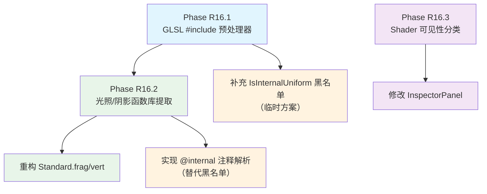

# PhaseR16：Shader 架构重构 ― 光照解耦 + #include 预处理 + Shader 可见性分类

## 一、概述

### 1.1 目标

本阶段解决当前渲染系统的三个架构级问题：

| # | 问题 | 严重程度 | 核心原因 |
|---|------|---------|---------|
| 1 | 光照/阴影计算硬编码在 Standard.frag 中 | ?? 高 | 光照代码与表面着色代码强耦合 |
| 2 | 所有 Shader（含引擎内部）暴露在 Inspector 下拉框中 | ?? 中 | ShaderLibrary 无可见性分类 |
| 3 | 用户自定义 Shader 需重写光照/阴影逻辑 | ?? 高 | 无公共函数库，无 #include 机制 |

问题 1 和 3 本质上是同一问题的两面：**光照/阴影代码没有从具体 Shader 中解耦出来**。解决 `#include` + 函数库提取后，两个问题同时解决。

### 1.2 改进后的架构目标

```
改进前：
┌─────────────────────────────────────────────┐
│ Standard.frag                               │
│  ├── PBR 材质采样（用户关心）                │
│  ├── 光照计算 ~200 行（引擎功能）            │
│  └── 阴影计算 ~60 行（引擎功能）             │
└─────────────────────────────────────────────┘

改进后：
┌─────────────────────────────────────────────┐
│ Standard.frag（用户 Shader）                 │
│  ├── #include "Lucky/Common.glsl"           │
│  ├── #include "Lucky/Lighting.glsl"         │
│  ├── #include "Lucky/Shadow.glsl"           │
│  └── PBR 材质采样 + 调用光照/阴影函数        │
├─────────────────────────────────────────────┤
│ ToonShader.frag（用户自定义 Shader）         │
│  ├── #include "Lucky/Common.glsl"           │
│  ├── #include "Lucky/Lighting.glsl"         │
│  ├── #include "Lucky/Shadow.glsl"           │
│  └── 卡通着色 + 调用光照/阴影函数            │
└─────────────────────────────────────────────┘
```

### 1.3 涉及的文件

#### 需要新建的文件

| 文件路径 | 说明 |
|---------|------|
| `Luck3DApp/Assets/Shaders/Lucky/Common.glsl` | 公共定义：Camera UBO、Lights UBO、光源结构体 |
| `Luck3DApp/Assets/Shaders/Lucky/Lighting.glsl` | 光照函数库：PBR BRDF 核心函数 + 各光源类型计算 |
| `Luck3DApp/Assets/Shaders/Lucky/Shadow.glsl` | 阴影函数库：阴影采样 + 硬/软阴影计算 |

#### 需要修改的文件

| 文件路径 | 说明 |
|---------|------|
| `Lucky/Source/Lucky/Renderer/Shader.h` | Shader 类添加 `m_IsInternal` 标记；ShaderLibrary 添加过滤接口 |
| `Lucky/Source/Lucky/Renderer/Shader.cpp` | 添加 `#include` 预处理器；修改 Load 接口支持 Internal 标记 |
| `Lucky/Source/Lucky/Renderer/Renderer3D.cpp` | 修改 Shader 加载，标记内部 Shader |
| `Luck3DApp/Source/Panels/InspectorPanel.cpp` | 使用过滤后的 Shader 列表 |
| `Luck3DApp/Assets/Shaders/Standard.frag` | 重构：提取光照/阴影代码，改用 #include |
| `Luck3DApp/Assets/Shaders/Standard.vert` | 重构：提取公共 UBO 定义，改用 #include |

### 1.4 实施阶段划分

```
Phase R16.1：GLSL #include 预处理器
Phase R16.2：光照/阴影函数库提取
Phase R16.3：Shader 可见性分类
```

> **依赖关系**：R16.2 依赖 R16.1（需要 #include 机制才能引用函数库）；R16.3 独立于 R16.1/R16.2，可并行实施。

---

## 二、Phase R16.1 ― GLSL #include 预处理器

### 2.1 问题分析

当前 `Shader::Shader(const std::string& filepath)` 构造函数直接读取 `.vert` 和 `.frag` 文件，然后交给 OpenGL 编译。GLSL 标准**不支持** `#include` 指令（`GL_ARB_shading_language_include` 扩展支持有限且不跨平台），因此需要在 CPU 端实现一个预处理器，在将源码交给 `glShaderSource()` 之前展开所有 `#include`。

### 2.2 实现方案对比

#### 方案 A：简单字符串替换（正则匹配 + 文件读取）? 推荐

**原理**：在 `Shader::ReadFile()` 之后、`Compile()` 之前，扫描源码中的 `#include "xxx"` 指令，将其替换为对应文件的内容。

**实现步骤**：

1. 在 `Shader` 类中新增 `PreprocessIncludes()` 方法
2. 使用正则表达式匹配 `#include "path"` 
3. 读取被引用的文件内容，替换 `#include` 行
4. 支持递归 include（A include B，B include C）
5. 使用 `std::unordered_set` 防止循环 include

**代码设计**：

```cpp
// Shader.h ― 新增私有方法
private:
    /// <summary>
    /// 预处理 #include 指令：将 #include "path" 替换为对应文件内容
    /// 在 ReadFile() 之后、Compile() 之前调用
    /// </summary>
    /// <param name="source">Shader 源码（会被修改）</param>
    /// <param name="directory">当前 Shader 文件所在目录（用于解析相对路径）</param>
    /// <returns>处理后的源码</returns>
    std::string PreprocessIncludes(const std::string& source, const std::string& directory);
```

```cpp
// Shader.cpp ― 实现

std::string Shader::PreprocessIncludes(const std::string& source, const std::string& directory)
{
    std::string result;
    std::unordered_set<std::string> includedFiles;  // 防止循环 include
    
    // 递归处理的内部 lambda
    std::function<std::string(const std::string&, const std::string&, int)> process;
    process = [&](const std::string& src, const std::string& dir, int depth) -> std::string
    {
        if (depth > 16)  // 防止无限递归
        {
            LF_CORE_ERROR("Shader #include depth exceeded 16 levels");
            return src;
        }
        
        std::string output;
        std::istringstream stream(src);
        std::string line;
        
        // 正则匹配 #include "path"
        std::regex includeRegex(R"(^\s*#include\s+"([^"]+)")");
        
        while (std::getline(stream, line))
        {
            std::smatch match;
            if (std::regex_search(line, match, includeRegex))
            {
                std::string includePath = match[1].str();
                
                // 解析完整路径（相对于当前文件目录）
                std::string fullPath = dir + "/" + includePath;
                
                // 防止重复 include
                if (includedFiles.count(fullPath))
                {
                    output += "// [已包含] " + includePath + "\n";
                    continue;
                }
                includedFiles.insert(fullPath);
                
                // 读取被引用的文件
                std::string includeContent = ReadFile(fullPath);
                if (includeContent.empty())
                {
                    LF_CORE_ERROR("Failed to include file: {0}", fullPath);
                    output += "// [include 失败] " + includePath + "\n";
                    continue;
                }
                
                // 计算被引用文件的目录（支持嵌套 include）
                std::string includeDir = fullPath.substr(0, fullPath.find_last_of("/\\"));
                
                // 递归处理被引用文件中的 #include
                output += "// ---- begin include: " + includePath + " ----\n";
                output += process(includeContent, includeDir, depth + 1);
                output += "// ---- end include: " + includePath + " ----\n";
            }
            else
            {
                output += line + "\n";
            }
        }
        
        return output;
    };
    
    return process(source, directory, 0);
}
```

**修改 Shader 构造函数**：

```cpp
Shader::Shader(const std::string& filepath)
    : m_RendererID(0)
{
    std::string vertexSrc = ReadFile(filepath + ".vert");
    std::string fragmentSrc = ReadFile(filepath + ".frag");

    // 编译前解析 @default 注释元数据
    ParseTextureDefaults(vertexSrc);
    ParseTextureDefaults(fragmentSrc);
    
    // ★ 新增：预处理 #include 指令
    std::string directory = filepath.substr(0, filepath.find_last_of("/\\"));
    vertexSrc = PreprocessIncludes(vertexSrc, directory);
    fragmentSrc = PreprocessIncludes(fragmentSrc, directory);
    
    std::unordered_map<GLenum, std::string> shaderSources;
    shaderSources[GL_VERTEX_SHADER] = vertexSrc;
    shaderSources[GL_FRAGMENT_SHADER] = fragmentSrc;

    // 计算着色器名
    auto lastSlash = filepath.find_last_of("/\\");
    lastSlash = lastSlash == std::string::npos ? 0 : lastSlash + 1;
    m_Name = filepath.substr(lastSlash, filepath.size() - lastSlash);
    
    Compile(shaderSources);
    
    ApplyTextureDefaults();
}
```

**优点**：
- 实现简单，~60 行代码
- 与现有架构完全兼容，不需要修改 Compile 流程
- 支持递归 include 和循环检测
- 用户在 Shader 中使用标准的 `#include "path"` 语法，直觉友好

**缺点**：
- 编译错误的行号会偏移（include 展开后行号变化），调试时需要注意
- 每次编译都要重新处理 include（无缓存）

---

#### 方案 B：GL_ARB_shading_language_include 扩展

**原理**：使用 OpenGL 的 `GL_ARB_shading_language_include` 扩展，通过 `glNamedStringARB()` 注册虚拟路径，让 GPU 驱动在编译时自动解析 `#include`。

**代码设计**：

```cpp
// 初始化时注册 include 路径
void Shader::RegisterIncludePath(const std::string& virtualPath, const std::string& source)
{
    glNamedStringARB(GL_SHADER_INCLUDE_ARB, 
                     virtualPath.length(), virtualPath.c_str(),
                     source.length(), source.c_str());
}

// 编译时使用 glCompileShaderIncludeARB
void Shader::CompileWithIncludes(GLuint shader, const char* source)
{
    glShaderSource(shader, 1, &source, nullptr);
    
    const char* searchPaths[] = { "/Lucky" };
    glCompileShaderIncludeARB(shader, 1, searchPaths, nullptr);
}
```

**优点**：
- 编译错误行号准确（GPU 驱动处理）
- 无需 CPU 端预处理

**缺点**：
- ? **不是所有 GPU/驱动都支持**（NVIDIA 支持较好，AMD/Intel 支持不稳定）
- ? 不跨平台（Vulkan/Metal/DirectX 不支持此扩展）
- 需要在初始化时注册所有 include 文件
- 调试困难（错误信息依赖驱动实现）

---

#### 方案 C：使用 #line 指令保留行号信息的增强预处理器

**原理**：在方案 A 的基础上，在每个 include 展开前后插入 `#line` 指令，让 GLSL 编译器报告正确的文件名和行号。

**代码设计**（仅展示与方案 A 的差异部分）：

```cpp
// 在 include 展开时插入 #line 指令
output += "#line 1 \"" + includePath + "\"\n";  // 切换到 include 文件的行号
output += process(includeContent, includeDir, depth + 1);
output += "#line " + std::to_string(currentLineNumber + 1) + " \"" + currentFile + "\"\n";  // 恢复原文件行号
```

> **注意**：GLSL `#line` 指令的第二个参数（文件标识符）在不同驱动上的支持不一致。GLSL 4.50 规范中 `#line` 只接受整数作为 source string number，不支持字符串文件名。因此需要维护一个 `文件名 → 整数 ID` 的映射表。

```cpp
// 使用整数 ID 代替文件名
static std::unordered_map<std::string, int> s_FileIDMap;
static int s_NextFileID = 0;

int GetFileID(const std::string& filepath)
{
    auto it = s_FileIDMap.find(filepath);
    if (it != s_FileIDMap.end()) return it->second;
    s_FileIDMap[filepath] = s_NextFileID;
    return s_NextFileID++;
}

// 展开时
output += "#line 1 " + std::to_string(GetFileID(includePath)) + "\n";
output += process(includeContent, includeDir, depth + 1);
output += "#line " + std::to_string(currentLineNumber + 1) + " " + std::to_string(GetFileID(currentFile)) + "\n";
```

**优点**：
- 编译错误行号准确（通过 `#line` 指令）
- 完全在 CPU 端处理，跨平台
- 调试体验好

**缺点**：
- 实现复杂度比方案 A 高
- 需要维护文件 ID 映射表
- 编译错误中显示的是整数 ID 而非文件名，需要额外的映射查找

---

### 2.3 方案推荐

| 方案 | 实现复杂度 | 跨平台 | 调试体验 | 推荐度 |
|------|-----------|--------|---------|--------|
| **A：简单字符串替换** | ? 低 | ? | 一般（行号偏移） | ??? **最优（推荐）** |
| B：GL_ARB 扩展 | 中 | ? | 好 | ? 不推荐 |
| C：#line 增强预处理 | 较高 | ? | 好 | ?? 其次 |

**推荐方案 A**。理由：
1. 实现最简单，与现有架构完全兼容
2. 行号偏移问题在实际开发中影响不大（include 文件通常是稳定的库代码，很少出错）
3. 后续如果需要更好的调试体验，可以从 A 升级到 C（增量改进，不需要重写）

### 2.4 #include 路径解析规则

需要定义 `#include "path"` 中 `path` 的解析规则：

#### 方案 A：相对于当前文件目录 ? 推荐

```glsl
// 文件位置：Assets/Shaders/Standard.frag
// 解析规则：相对于 Assets/Shaders/

#include "Lucky/Common.glsl"     // → Assets/Shaders/Lucky/Common.glsl
#include "Lucky/Lighting.glsl"   // → Assets/Shaders/Lucky/Lighting.glsl
```

**优点**：直觉、简单
**缺点**：如果 Shader 在不同子目录中，include 路径不同

#### 方案 B：相对于固定的 Include 根目录

```glsl
// 固定根目录：Assets/Shaders/Include/
// 所有 #include 都相对于此目录解析

#include "Common.glsl"     // → Assets/Shaders/Include/Common.glsl
#include "Lighting.glsl"   // → Assets/Shaders/Include/Lighting.glsl
```

**优点**：路径统一，不受 Shader 文件位置影响
**缺点**：需要额外配置根目录

#### 方案 C：混合模式（引号 vs 尖括号）

```glsl
#include "MyHelper.glsl"          // 相对于当前文件目录
#include <Lucky/Common.glsl>      // 相对于引擎 Include 根目录
```

**优点**：灵活，与 C/C++ 的 include 语义一致
**缺点**：实现复杂度增加

**推荐方案 A**（相对于当前文件目录）。理由：
- 最简单，与用户直觉一致
- 引擎内置 include 文件放在 `Assets/Shaders/Lucky/` 子目录下，用户 Shader 通过 `#include "Lucky/xxx.glsl"` 引用
- 如果后续需要更灵活的路径解析，可以升级到方案 C

### 2.5 @default 注释与 #include 的交互

当前 `ParseTextureDefaults()` 在 `PreprocessIncludes()` 之前调用。需要确认：

- **include 文件中是否会包含 `@default` 注释？** ― 不会。`@default` 注释只出现在用户 Shader 的 `uniform sampler2D` 声明旁边，而 include 文件中不会声明用户的纹理 uniform。
- **结论**：`ParseTextureDefaults()` 的调用顺序不需要改变。保持在 `PreprocessIncludes()` 之前调用即可。

但需要注意：如果 include 文件中也包含 `uniform` 声明（如 `u_ShadowMap`），`ParseTextureDefaults()` 不会解析到它们（因为此时 include 还未展开）。这是正确的行为，因为 include 文件中的 uniform 都是引擎内部的，不需要 `@default` 注释。

> **重要**：如果未来 include 文件中需要支持 `@default` 注释，则需要将 `ParseTextureDefaults()` 移到 `PreprocessIncludes()` 之后调用。

---

## 三、Phase R16.2 ― 光照/阴影函数库提取

### 3.1 文件拆分设计

从当前 `Standard.frag`（410 行）中提取公共代码到三个 include 文件：

```
Standard.frag（410 行）
├── Camera UBO layout          → Lucky/Common.glsl
├── Lights UBO layout          → Lucky/Common.glsl
├── 光源结构体定义              → Lucky/Common.glsl
├── 常量定义                    → Lucky/Common.glsl
├── 阴影 uniform 声明          → Lucky/Shadow.glsl
├── 阴影计算函数 (~60 行)      → Lucky/Shadow.glsl
├── PBR BRDF 函数 (~50 行)    → Lucky/Lighting.glsl
├── 各光源类型计算 (~90 行)    → Lucky/Lighting.glsl
└── main() + 材质采样          → Standard.frag（保留）
```

### 3.2 Lucky/Common.glsl 设计

```glsl
// Lucky/Common.glsl
// 引擎公共定义：Camera UBO、Lights UBO、光源结构体、常量
// 所有用户 Shader 都应 #include 此文件

#ifndef LUCKY_COMMON_GLSL
#define LUCKY_COMMON_GLSL

// ---- 常量 ----
#define MAX_DIRECTIONAL_LIGHTS 4
#define MAX_POINT_LIGHTS 8
#define MAX_SPOT_LIGHTS 4

const float PI = 3.14159265359;
const float AMBIENT_STRENGTH = 0.03;  // 常量环境光强度（无 IBL 时的替代方案）

// ---- 光源结构体 ----

struct DirectionalLight
{
    vec3 Direction;
    float Intensity;
    vec3 Color;
    float _padding;
};

struct PointLight
{
    vec3 Position;
    float Intensity;
    vec3 Color;
    float Range;
};

struct SpotLight
{
    vec3 Position;
    float Intensity;
    vec3 Direction;
    float Range;
    vec3 Color;
    float InnerCutoff;
    float OuterCutoff;
    float _padding0;
    float _padding1;
    float _padding2;
};

// ---- 相机 Uniform 缓冲区 ----
layout(std140, binding = 0) uniform Camera
{
    mat4 ViewProjectionMatrix;
    vec3 Position;
} u_Camera;

// ---- 光照 Uniform 缓冲区 ----
layout(std140, binding = 1) uniform Lights
{
    int DirectionalLightCount;
    int PointLightCount;
    int SpotLightCount;
    float _padding;

    DirectionalLight DirectionalLights[MAX_DIRECTIONAL_LIGHTS];
    PointLight PointLights[MAX_POINT_LIGHTS];
    SpotLight SpotLights[MAX_SPOT_LIGHTS];
} u_Lights;

#endif // LUCKY_COMMON_GLSL
```

### 3.3 Lucky/Shadow.glsl 设计

```glsl
// Lucky/Shadow.glsl
// 引擎阴影计算函数库
// 依赖：Lucky/Common.glsl（需要在此文件之前 include）

#ifndef LUCKY_SHADOW_GLSL
#define LUCKY_SHADOW_GLSL

// ---- 阴影参数（由 OpaquePass 在每帧设置） ----
uniform sampler2D u_ShadowMap;
uniform mat4 u_LightSpaceMatrix;
uniform float u_ShadowBias;
uniform float u_ShadowStrength;
uniform int u_ShadowEnabled;
uniform int u_ShadowType;  // 1 = Hard, 2 = Soft (PCF 3×3)

/// <summary>
/// 计算动态 Bias：根据法线和光照方向的夹角调整
/// </summary>
float CalcShadowBias(vec3 normal, vec3 lightDir)
{
    float NdotL = dot(normal, lightDir);
    return u_ShadowBias * (1.0 + 9.0 * (1.0 - clamp(NdotL, 0.0, 1.0)));
}

/// <summary>
/// 硬阴影计算（单次采样）
/// </summary>
float ShadowCalculationHard(vec3 projCoords, float bias)
{
    float currentDepth = projCoords.z;
    float closestDepth = texture(u_ShadowMap, projCoords.xy).r;
    return currentDepth - bias > closestDepth ? 1.0 : 0.0;
}

/// <summary>
/// 软阴影计算（PCF 3×3 采样核）
/// </summary>
float ShadowCalculationSoft(vec3 projCoords, float bias)
{
    float currentDepth = projCoords.z;
    float shadow = 0.0;
    vec2 texelSize = 1.0 / textureSize(u_ShadowMap, 0);
    for (int x = -1; x <= 1; ++x)
    {
        for (int y = -1; y <= 1; ++y)
        {
            float pcfDepth = texture(u_ShadowMap, projCoords.xy + vec2(x, y) * texelSize).r;
            shadow += currentDepth - bias > pcfDepth ? 1.0 : 0.0;
        }
    }
    shadow /= 9.0;
    return shadow;
}

/// <summary>
/// 阴影计算入口（根据 u_ShadowType 选择硬阴影或软阴影）
/// 返回值：0.0 = 完全在阴影中，1.0 = 完全不在阴影中
/// </summary>
float ShadowCalculation(vec3 worldPos, vec3 normal, vec3 lightDir)
{
    vec4 fragPosLightSpace = u_LightSpaceMatrix * vec4(worldPos, 1.0);
    vec3 projCoords = fragPosLightSpace.xyz / fragPosLightSpace.w;
    projCoords = projCoords * 0.5 + 0.5;
    
    if (projCoords.z > 1.0)
    {
        return 1.0;
    }
    
    float bias = CalcShadowBias(normal, lightDir);
    
    float shadow = 0.0;
    if (u_ShadowType == 1)
    {
        shadow = ShadowCalculationHard(projCoords, bias);
    }
    else
    {
        shadow = ShadowCalculationSoft(projCoords, bias);
    }
    
    shadow *= u_ShadowStrength;
    
    return 1.0 - shadow;
}

#endif // LUCKY_SHADOW_GLSL
```

### 3.4 Lucky/Lighting.glsl 设计

这里有两种设计思路，需要根据引擎的定位来选择：

#### 方案 A：提取 PBR BRDF 核心函数 + 各光源类型计算函数 ? 推荐

将 PBR 的 BRDF 核心函数（GGX NDF、Fresnel-Schlick、Smith GGX）和各光源类型的计算函数（CalcDirectionalLight、CalcPointLight、CalcSpotLight）都提取到 Lighting.glsl 中。

```glsl
// Lucky/Lighting.glsl
// 引擎光照计算函数库（PBR 工作流）
// 依赖：Lucky/Common.glsl

#ifndef LUCKY_LIGHTING_GLSL
#define LUCKY_LIGHTING_GLSL

// ==================== PBR BRDF 核心函数 ====================

/// <summary>
/// GGX/Trowbridge-Reitz 法线分布函数
/// </summary>
float DistributionGGX(vec3 N, vec3 H, float roughness)
{
    float a = roughness * roughness;
    float a2 = a * a;
    float NdotH = max(dot(N, H), 0.0);
    float NdotH2 = NdotH * NdotH;

    float denom = (NdotH2 * (a2 - 1.0) + 1.0);
    denom = PI * denom * denom;

    return a2 / max(denom, 0.0000001);
}

/// <summary>
/// Fresnel-Schlick 近似
/// </summary>
vec3 FresnelSchlick(float cosTheta, vec3 F0)
{
    return F0 + (1.0 - F0) * pow(clamp(1.0 - cosTheta, 0.0, 1.0), 5.0);
}

/// <summary>
/// Smith's Schlick-GGX 几何遮蔽（单方向）
/// </summary>
float GeometrySchlickGGX(float NdotV, float roughness)
{
    float r = (roughness + 1.0);
    float k = (r * r) / 8.0;
    return NdotV / (NdotV * (1.0 - k) + k);
}

/// <summary>
/// Smith's 几何遮蔽（双方向）
/// </summary>
float GeometrySmith(vec3 N, vec3 V, vec3 L, float roughness)
{
    float NdotV = max(dot(N, V), 0.0);
    float NdotL = max(dot(N, L), 0.0);
    float ggx1 = GeometrySchlickGGX(NdotV, roughness);
    float ggx2 = GeometrySchlickGGX(NdotL, roughness);
    return ggx1 * ggx2;
}

// ==================== 光源计算函数 ====================

/// <summary>
/// 计算方向光的 PBR 贡献
/// </summary>
vec3 CalcDirectionalLight(DirectionalLight light, vec3 N, vec3 V, vec3 albedo, float metallic, float roughness, vec3 F0)
{
    vec3 L = normalize(-light.Direction);
    vec3 H = normalize(V + L);

    vec3 radiance = light.Color * light.Intensity;

    float D = DistributionGGX(N, H, roughness);
    vec3  F = FresnelSchlick(max(dot(H, V), 0.0), F0);
    float G = GeometrySmith(N, V, L, roughness);

    vec3 numerator = D * F * G;
    float denominator = 4.0 * max(dot(N, V), 0.0) * max(dot(N, L), 0.0) + 0.0001;
    vec3 specular = numerator / denominator;

    vec3 kD = (vec3(1.0) - F) * (1.0 - metallic);
    float NdotL = max(dot(N, L), 0.0);

    return (kD * albedo / PI + specular) * radiance * NdotL;
}

/// <summary>
/// 计算点光源的 PBR 贡献
/// </summary>
vec3 CalcPointLight(PointLight light, vec3 N, vec3 V, vec3 worldPos, vec3 albedo, float metallic, float roughness, vec3 F0)
{
    vec3 L = light.Position - worldPos;
    float distance = length(L);

    if (distance > light.Range)
        return vec3(0.0);

    L = normalize(L);
    vec3 H = normalize(V + L);

    float attenuation = clamp(1.0 - (distance / light.Range), 0.0, 1.0);
    attenuation *= attenuation;

    vec3 radiance = light.Color * light.Intensity * attenuation;

    float D = DistributionGGX(N, H, roughness);
    vec3  F = FresnelSchlick(max(dot(H, V), 0.0), F0);
    float G = GeometrySmith(N, V, L, roughness);

    vec3 numerator = D * F * G;
    float denominator = 4.0 * max(dot(N, V), 0.0) * max(dot(N, L), 0.0) + 0.0001;
    vec3 specular = numerator / denominator;

    vec3 kD = (vec3(1.0) - F) * (1.0 - metallic);
    float NdotL = max(dot(N, L), 0.0);

    return (kD * albedo / PI + specular) * radiance * NdotL;
}

/// <summary>
/// 计算聚光灯的 PBR 贡献
/// </summary>
vec3 CalcSpotLight(SpotLight light, vec3 N, vec3 V, vec3 worldPos, vec3 albedo, float metallic, float roughness, vec3 F0)
{
    vec3 L = light.Position - worldPos;
    float distance = length(L);

    if (distance > light.Range)
        return vec3(0.0);

    L = normalize(L);
    vec3 H = normalize(V + L);

    float theta = dot(L, normalize(-light.Direction));
    float epsilon = light.InnerCutoff - light.OuterCutoff;
    float spotIntensity = clamp((theta - light.OuterCutoff) / epsilon, 0.0, 1.0);

    float attenuation = clamp(1.0 - (distance / light.Range), 0.0, 1.0);
    attenuation *= attenuation;

    vec3 radiance = light.Color * light.Intensity * attenuation * spotIntensity;

    float D = DistributionGGX(N, H, roughness);
    vec3  F = FresnelSchlick(max(dot(H, V), 0.0), F0);
    float G = GeometrySmith(N, V, L, roughness);

    vec3 numerator = D * F * G;
    float denominator = 4.0 * max(dot(N, V), 0.0) * max(dot(N, L), 0.0) + 0.0001;
    vec3 specular = numerator / denominator;

    vec3 kD = (vec3(1.0) - F) * (1.0 - metallic);
    float NdotL = max(dot(N, L), 0.0);

    return (kD * albedo / PI + specular) * radiance * NdotL;
}

// ==================== 便捷函数 ====================

/// <summary>
/// 计算所有光源的 PBR 贡献（含阴影）
/// 这是一个一站式函数，用户只需调用此函数即可获得完整的光照结果
/// 需要同时 #include "Lucky/Shadow.glsl"
/// </summary>
/// <param name="N">世界空间法线（归一化）</param>
/// <param name="V">视线方向（归一化，从片元指向相机）</param>
/// <param name="worldPos">片元世界空间位置</param>
/// <param name="albedo">基础颜色</param>
/// <param name="metallic">金属度</param>
/// <param name="roughness">粗糙度</param>
/// <param name="F0">基础反射率</param>
/// <returns>所有光源的直接光照贡献总和（含阴影衰减）</returns>
vec3 CalcAllLights(vec3 N, vec3 V, vec3 worldPos, vec3 albedo, float metallic, float roughness, vec3 F0)
{
    vec3 Lo = vec3(0.0);

    // 方向光
    for (int i = 0; i < u_Lights.DirectionalLightCount; ++i)
    {
        vec3 contribution = CalcDirectionalLight(u_Lights.DirectionalLights[i], N, V, albedo, metallic, roughness, F0);
        
        // 仅对第一个方向光应用阴影
        if (i == 0 && u_ShadowEnabled != 0)
        {
            vec3 lightDir = normalize(-u_Lights.DirectionalLights[i].Direction);
            float shadow = ShadowCalculation(worldPos, N, lightDir);
            contribution *= shadow;
        }
        
        Lo += contribution;
    }

    // 点光源
    for (int i = 0; i < u_Lights.PointLightCount; ++i)
    {
        Lo += CalcPointLight(u_Lights.PointLights[i], N, V, worldPos, albedo, metallic, roughness, F0);
    }

    // 聚光灯
    for (int i = 0; i < u_Lights.SpotLightCount; ++i)
    {
        Lo += CalcSpotLight(u_Lights.SpotLights[i], N, V, worldPos, albedo, metallic, roughness, F0);
    }

    return Lo;
}

#endif // LUCKY_LIGHTING_GLSL
```

**优点**：
- 用户可以直接调用 `CalcAllLights()` 一行代码获得完整光照
- 也可以单独调用 `CalcDirectionalLight()` 等函数进行自定义组合
- PBR BRDF 函数可以被用户复用（如自定义光照模型时使用 `DistributionGGX()`）
- 灵活度高，适合不同水平的用户

**缺点**：
- `CalcAllLights()` 依赖 `Shadow.glsl` 中的 `ShadowCalculation()` 和 `u_ShadowEnabled`，形成了 Lighting.glsl 对 Shadow.glsl 的隐式依赖
- 如果用户不想要 PBR 光照（如卡通着色），仍然需要自己写光照循环

---

#### 方案 B：仅提取 BRDF 核心函数，光源循环留在用户 Shader 中

将 `Lighting.glsl` 限制为纯粹的 BRDF 工具函数库，不包含 `CalcDirectionalLight()` 等高层函数。

```glsl
// Lucky/Lighting.glsl（方案 B 版本）
// 仅包含 BRDF 核心函数

#ifndef LUCKY_LIGHTING_GLSL
#define LUCKY_LIGHTING_GLSL

float DistributionGGX(vec3 N, vec3 H, float roughness) { ... }
vec3 FresnelSchlick(float cosTheta, vec3 F0) { ... }
float GeometrySchlickGGX(float NdotV, float roughness) { ... }
float GeometrySmith(vec3 N, vec3 V, vec3 L, float roughness) { ... }

// 用户需要自己写光源循环和 CalcDirectionalLight 等函数

#endif
```

**优点**：
- Lighting.glsl 职责单一，无隐式依赖
- 用户完全控制光照计算流程

**缺点**：
- ? 用户仍然需要写大量样板代码（光源循环、各光源类型计算）
- ? 没有解决"用户自定义 Shader 需重写光照逻辑"的核心问题

---

#### 方案 C：提供 CalcAllLights() 但将阴影逻辑解耦

将 `CalcAllLights()` 拆分为不含阴影的版本和含阴影的版本，消除 Lighting.glsl 对 Shadow.glsl 的依赖。

```glsl
// Lucky/Lighting.glsl（方案 C 版本）

// 不含阴影的版本
vec3 CalcAllLightsNoShadow(vec3 N, vec3 V, vec3 worldPos, vec3 albedo, float metallic, float roughness, vec3 F0)
{
    vec3 Lo = vec3(0.0);
    for (int i = 0; i < u_Lights.DirectionalLightCount; ++i)
        Lo += CalcDirectionalLight(u_Lights.DirectionalLights[i], N, V, albedo, metallic, roughness, F0);
    for (int i = 0; i < u_Lights.PointLightCount; ++i)
        Lo += CalcPointLight(u_Lights.PointLights[i], N, V, worldPos, albedo, metallic, roughness, F0);
    for (int i = 0; i < u_Lights.SpotLightCount; ++i)
        Lo += CalcSpotLight(u_Lights.SpotLights[i], N, V, worldPos, albedo, metallic, roughness, F0);
    return Lo;
}
```

```glsl
// Lucky/Shadow.glsl 中提供含阴影的版本
// 需要在 Lighting.glsl 之后 include

vec3 CalcAllLights(vec3 N, vec3 V, vec3 worldPos, vec3 albedo, float metallic, float roughness, vec3 F0)
{
    vec3 Lo = vec3(0.0);
    
    for (int i = 0; i < u_Lights.DirectionalLightCount; ++i)
    {
        vec3 contribution = CalcDirectionalLight(u_Lights.DirectionalLights[i], N, V, albedo, metallic, roughness, F0);
        if (i == 0 && u_ShadowEnabled != 0)
        {
            vec3 lightDir = normalize(-u_Lights.DirectionalLights[i].Direction);
            contribution *= ShadowCalculation(worldPos, N, lightDir);
        }
        Lo += contribution;
    }
    
    for (int i = 0; i < u_Lights.PointLightCount; ++i)
        Lo += CalcPointLight(u_Lights.PointLights[i], N, V, worldPos, albedo, metallic, roughness, F0);
    for (int i = 0; i < u_Lights.SpotLightCount; ++i)
        Lo += CalcSpotLight(u_Lights.SpotLights[i], N, V, worldPos, albedo, metallic, roughness, F0);
    
    return Lo;
}
```

**优点**：
- Lighting.glsl 无外部依赖
- 用户可以选择是否使用阴影
- 依赖关系清晰

**缺点**：
- 两个文件中有重复的光源循环代码
- 用户需要记住 include 顺序（先 Lighting 后 Shadow）

---

### 3.5 方案推荐

| 方案 | 用户体验 | 代码复杂度 | 依赖关系 | 推荐度 |
|------|---------|-----------|---------|--------|
| **A：完整函数库 + CalcAllLights()** | ??? 最好 | 中 | Lighting 隐式依赖 Shadow | ??? **最优（推荐）** |
| B：仅 BRDF 核心函数 | 差 | 低 | 无依赖 | ? 不推荐 |
| C：拆分有/无阴影版本 | 好 | 较高 | 无隐式依赖 | ?? 其次 |

**推荐方案 A**。理由：
1. 用户体验最好：一行 `CalcAllLights()` 即可获得完整光照 + 阴影
2. 隐式依赖问题可以通过文档和 include 顺序约定来解决（`Common → Shadow → Lighting`）
3. 高级用户仍然可以不使用 `CalcAllLights()`，自己组合底层函数

### 3.6 重构后的 Standard.frag

```glsl
#version 450 core

layout(location = 0) out vec4 o_Color;

// ---- 引擎公共库 ----
#include "Lucky/Common.glsl"
#include "Lucky/Shadow.glsl"
#include "Lucky/Lighting.glsl"

// ---- 顶点着色器输出数据 ----
struct VertexOutput
{
    vec4 Color;
    vec3 Normal;
    vec2 TexCoord;
    vec3 WorldPos;
    mat3 TBN;
};

layout(location = 0) in VertexOutput v_Input;

// ---- PBR 材质参数 ----
uniform vec4  u_Albedo;
uniform float u_Metallic;
uniform float u_Roughness;
uniform float u_AO;
uniform vec3  u_Emission;
uniform float u_EmissionIntensity;

// ---- PBR 纹理 ----
// @default: white
uniform sampler2D u_AlbedoMap;

// @default: normal
uniform sampler2D u_NormalMap;

// @default: white
uniform sampler2D u_MetallicMap;

// @default: white
uniform sampler2D u_RoughnessMap;

// @default: white
uniform sampler2D u_AOMap;

// @default: white
uniform sampler2D u_EmissionMap;

// ==================== 法线获取 ====================

vec3 GetNormal()
{
    vec3 normalMapSample = texture(u_NormalMap, v_Input.TexCoord).rgb;
    normalMapSample = normalMapSample * 2.0 - 1.0;
    return normalize(v_Input.TBN * normalMapSample);
}

void main()
{
    // ---- 采样材质参数 ----
    vec4 albedo4 = u_Albedo * texture(u_AlbedoMap, v_Input.TexCoord);
    vec3 albedo = albedo4.rgb;
    float alpha = albedo4.a;
    
    float metallic = u_Metallic * texture(u_MetallicMap, v_Input.TexCoord).r;
    float roughness = u_Roughness * texture(u_RoughnessMap, v_Input.TexCoord).r;
    roughness = max(roughness, 0.04);
    float ao = u_AO * texture(u_AOMap, v_Input.TexCoord).r;
    vec3 emission = u_Emission * u_EmissionIntensity * texture(u_EmissionMap, v_Input.TexCoord).rgb;
    
    // ---- 获取法线和视线方向 ----
    vec3 N = GetNormal();
    vec3 V = normalize(u_Camera.Position - v_Input.WorldPos);
    
    // ---- 计算 F0 ----
    vec3 F0 = mix(vec3(0.04), albedo, metallic);
    
    // ---- 光照计算（一行调用，引擎自动处理所有光源 + 阴影） ----
    vec3 Lo = CalcAllLights(N, V, v_Input.WorldPos, albedo, metallic, roughness, F0);

    // ---- 环境光 ----
    vec3 ambient = vec3(AMBIENT_STRENGTH) * albedo * ao;

    // ---- 最终颜色 ----
    vec3 color = ambient + Lo + emission;

    // ---- Gamma 校正 ----
    color = pow(color, vec3(1.0 / 2.2));

    o_Color = vec4(color, alpha);
}
```

> **对比**：重构前 Standard.frag 有 410 行，重构后约 90 行。光照/阴影逻辑完全由 include 文件提供。

### 3.7 重构后的 Standard.vert

```glsl
#version 450 core

layout(location = 0) in vec3 a_Position;
layout(location = 1) in vec4 a_Color;
layout(location = 2) in vec3 a_Normal;
layout(location = 3) in vec2 a_TexCoord;
layout(location = 4) in vec4 a_Tangent;

// ---- 引擎公共库 ----
#include "Lucky/Common.glsl"

// 模型矩阵
uniform mat4 u_ObjectToWorldMatrix;

// 顶点着色器输出数据
struct VertexOutput
{
    vec4 Color;
    vec3 Normal;
    vec2 TexCoord;
    vec3 WorldPos;
    mat3 TBN;
};

layout(location = 0) out VertexOutput v_Output;

void main()
{
    v_Output.Color = a_Color;
    v_Output.TexCoord = a_TexCoord;
    
    mat3 normalMatrix = mat3(transpose(inverse(u_ObjectToWorldMatrix)));
    vec3 N = normalize(normalMatrix * a_Normal);
    v_Output.Normal = N;

    vec3 T = normalize(normalMatrix * a_Tangent.xyz);
    T = normalize(T - dot(T, N) * N);
    vec3 B = cross(N, T) * a_Tangent.w;
    v_Output.TBN = mat3(T, B, N);

    vec4 worldPos = u_ObjectToWorldMatrix * vec4(a_Position, 1.0);
    v_Output.WorldPos = worldPos.xyz;

    gl_Position = u_Camera.ViewProjectionMatrix * worldPos;
}
```

### 3.8 用户自定义 Shader 示例（ToonShader）

展示重构后用户创建自定义 Shader 的体验：

```glsl
// ToonShader.frag ― 用户自定义卡通着色器
#version 450 core

layout(location = 0) out vec4 o_Color;

#include "Lucky/Common.glsl"
#include "Lucky/Shadow.glsl"
// 注意：不 include Lighting.glsl，因为卡通着色不使用 PBR

struct VertexOutput
{
    vec4 Color;
    vec3 Normal;
    vec2 TexCoord;
    vec3 WorldPos;
    mat3 TBN;
};

layout(location = 0) in VertexOutput v_Input;

uniform vec4 u_BaseColor;
uniform float u_Steps;  // 色阶数量（如 3.0）

// @default: white
uniform sampler2D u_MainTex;

void main()
{
    vec3 albedo = u_BaseColor.rgb * texture(u_MainTex, v_Input.TexCoord).rgb;
    vec3 N = normalize(v_Input.Normal);
    vec3 V = normalize(u_Camera.Position - v_Input.WorldPos);
    
    vec3 Lo = vec3(0.0);
    
    // 自定义卡通光照：离散化 NdotL
    for (int i = 0; i < u_Lights.DirectionalLightCount; ++i)
    {
        vec3 L = normalize(-u_Lights.DirectionalLights[i].Direction);
        float NdotL = max(dot(N, L), 0.0);
        
        // 离散化
        NdotL = floor(NdotL * u_Steps) / u_Steps;
        
        vec3 contribution = albedo * u_Lights.DirectionalLights[i].Color 
                          * u_Lights.DirectionalLights[i].Intensity * NdotL;
        
        // ★ 阴影仍然自动生效！
        if (i == 0 && u_ShadowEnabled != 0)
        {
            contribution *= ShadowCalculation(v_Input.WorldPos, N, L);
        }
        
        Lo += contribution;
    }
    
    vec3 ambient = vec3(0.1) * albedo;
    vec3 color = ambient + Lo;
    color = pow(color, vec3(1.0 / 2.2));
    
    o_Color = vec4(color, u_BaseColor.a);
}
```

> **关键改进**：用户只需 `#include "Lucky/Shadow.glsl"` 并调用 `ShadowCalculation()`，即可让自定义 Shader 获得阴影支持。无需手动声明 6 个阴影 uniform，无需理解阴影实现细节。

### 3.9 Include 顺序约定

```
#include "Lucky/Common.glsl"      // 必须第一个（定义 UBO、结构体、常量）
#include "Lucky/Shadow.glsl"      // 第二个（依赖 Common 中的常量）
#include "Lucky/Lighting.glsl"    // 第三个（依赖 Common + Shadow）
```

> 由于使用了 `#ifndef` include guard，即使顺序错误也不会导致重复定义，但可能导致编译错误（未定义的符号）。建议在文档中明确约定顺序。

---

## 四、Phase R16.3 ― Shader 可见性分类

### 4.1 问题分析

当前 `InspectorPanel.cpp` 中：

```cpp
std::vector<std::string> shaderNames = Renderer3D::GetShaderLibrary()->GetShaderNameList();
```

返回所有已注册的 Shader，包括引擎内部的 `InternalError`、`EntityID`、`Silhouette`、`OutlineComposite`、`Shadow` 等。用户在 Material Inspector 中看到这些内部 Shader 会造成困惑。

### 4.2 实现方案对比

#### 方案 A：Shader 类添加 `m_IsInternal` 标记 ? 推荐

**原理**：在 `Shader` 类中添加一个布尔标记，标识该 Shader 是否为引擎内部使用。`ShaderLibrary` 提供过滤接口。

**代码设计**：

```cpp
// Shader.h ― Shader 类新增

class Shader
{
public:
    // ... 现有接口 ...
    
    /// <summary>
    /// 是否为引擎内部 Shader（不在 Inspector 中显示）
    /// </summary>
    bool IsInternal() const { return m_IsInternal; }
    
    /// <summary>
    /// 设置为引擎内部 Shader
    /// </summary>
    void SetInternal(bool isInternal) { m_IsInternal = isInternal; }

private:
    // ... 现有成员 ...
    bool m_IsInternal = false;  // 是否为引擎内部 Shader
};
```

```cpp
// Shader.h ― ShaderLibrary 类新增

class ShaderLibrary
{
public:
    // ... 现有接口 ...
    
    /// <summary>
    /// 获取用户可见的着色器名称列表（排除引擎内部 Shader）
    /// </summary>
    std::vector<std::string> GetUserVisibleShaderNames() const;
};
```

```cpp
// Shader.cpp ― 实现

std::vector<std::string> ShaderLibrary::GetUserVisibleShaderNames() const
{
    std::vector<std::string> names;
    for (const auto& [name, shader] : m_Shaders)
    {
        if (!shader->IsInternal())
        {
            names.push_back(name);
        }
    }
    return names;
}
```

**修改 Renderer3D::Init()**：

```cpp
void Renderer3D::Init()
{
    s_Data.ShaderLib = CreateRef<ShaderLibrary>();
    
    // 加载引擎内部 Shader（标记为 Internal）
    s_Data.ShaderLib->Load("Assets/Shaders/InternalError");
    s_Data.ShaderLib->Get("InternalError")->SetInternal(true);
    
    s_Data.ShaderLib->Load("Assets/Shaders/EntityID");
    s_Data.ShaderLib->Get("EntityID")->SetInternal(true);
    
    s_Data.ShaderLib->Load("Assets/Shaders/Outline/Silhouette");
    s_Data.ShaderLib->Get("Silhouette")->SetInternal(true);
    
    s_Data.ShaderLib->Load("Assets/Shaders/Outline/OutlineComposite");
    s_Data.ShaderLib->Get("OutlineComposite")->SetInternal(true);
    
    s_Data.ShaderLib->Load("Assets/Shaders/Shadow/Shadow");
    s_Data.ShaderLib->Get("Shadow")->SetInternal(true);

    // 加载用户可见 Shader（默认 m_IsInternal = false）
    s_Data.ShaderLib->Load("Assets/Shaders/Standard");
    
    // ... 其余初始化代码不变 ...
}
```

**修改 InspectorPanel.cpp**：

```cpp
// 替换原来的 GetShaderNameList() 调用
std::vector<std::string> shaderNames = Renderer3D::GetShaderLibrary()->GetUserVisibleShaderNames();
```

**优点**：
- 实现简单，改动最小
- 标记在 Shader 对象上，语义清晰
- 不影响现有的 `GetShaderNameList()` 接口（向后兼容）
- 可以在运行时动态修改（如调试模式下显示所有 Shader）

**缺点**：
- 需要在 `Init()` 中手动为每个内部 Shader 调用 `SetInternal(true)`

---

#### 方案 B：ShaderLibrary 提供带 Internal 标记的 Load 重载

**原理**：在 `ShaderLibrary::Load()` 中添加 `isInternal` 参数，加载时直接标记。

```cpp
// Shader.h ― ShaderLibrary 新增 Load 重载

/// <summary>
/// 加载着色器并标记是否为引擎内部
/// </summary>
Ref<Shader> Load(const std::string& filepath, bool isInternal);
```

```cpp
// Shader.cpp ― 实现

Ref<Shader> ShaderLibrary::Load(const std::string& filepath, bool isInternal)
{
    auto shader = Shader::Create(filepath);
    shader->SetInternal(isInternal);
    Add(shader);
    return shader;
}
```

**修改 Renderer3D::Init()**：

```cpp
void Renderer3D::Init()
{
    s_Data.ShaderLib = CreateRef<ShaderLibrary>();
    
    // 引擎内部 Shader
    s_Data.ShaderLib->Load("Assets/Shaders/InternalError", true);
    s_Data.ShaderLib->Load("Assets/Shaders/EntityID", true);
    s_Data.ShaderLib->Load("Assets/Shaders/Outline/Silhouette", true);
    s_Data.ShaderLib->Load("Assets/Shaders/Outline/OutlineComposite", true);
    s_Data.ShaderLib->Load("Assets/Shaders/Shadow/Shadow", true);

    // 用户可见 Shader
    s_Data.ShaderLib->Load("Assets/Shaders/Standard");  // 默认 isInternal = false
    
    // ...
}
```

**优点**：
- 加载和标记一步完成，代码更简洁
- 不需要在 Load 之后再 Get + SetInternal

**缺点**：
- 修改了 Load 接口（虽然是新增重载，不破坏兼容性）

---

#### 方案 C：命名约定（前缀过滤）

**原理**：通过 Shader 名称前缀来区分内部/用户 Shader。例如内部 Shader 以 `__` 或 `Internal/` 开头。

```cpp
// ShaderLibrary 中根据命名约定过滤
std::vector<std::string> ShaderLibrary::GetUserVisibleShaderNames() const
{
    std::vector<std::string> names;
    for (const auto& [name, shader] : m_Shaders)
    {
        // 跳过以 "__" 开头的内部 Shader
        if (name.substr(0, 2) != "__")
        {
            names.push_back(name);
        }
    }
    return names;
}
```

**修改 Renderer3D::Init()**：

```cpp
// 内部 Shader 使用 "__" 前缀
s_Data.ShaderLib->Load("__InternalError", "Assets/Shaders/InternalError");
s_Data.ShaderLib->Load("__EntityID", "Assets/Shaders/EntityID");
// ...
```

**优点**：
- 不需要修改 Shader 类
- 命名即分类，一目了然

**缺点**：
- ? 依赖命名约定，容易出错
- ? 需要修改所有引用内部 Shader 名称的代码（如 `ShadowPass::Init()` 中的 `Get("Shadow")` 需要改为 `Get("__Shadow")`）
- 不够灵活（无法在运行时切换）

---

#### 方案 D：分离的 ShaderLibrary（内部库 + 用户库）

**原理**：使用两个独立的 `ShaderLibrary`，一个存储引擎内部 Shader，一个存储用户可见 Shader。

```cpp
struct Renderer3DData
{
    Ref<ShaderLibrary> InternalShaderLib;  // 引擎内部 Shader
    Ref<ShaderLibrary> UserShaderLib;      // 用户可见 Shader
};
```

**优点**：
- 物理隔离，最安全
- 不需要过滤逻辑

**缺点**：
- ? 需要修改大量代码（所有获取 Shader 的地方都需要知道从哪个库获取）
- ? 增加了架构复杂度
- ? 如果用户 Shader 需要引用内部 Shader（如 fallback），跨库查找不方便

---

### 4.3 方案推荐

| 方案 | 实现复杂度 | 代码改动量 | 灵活性 | 推荐度 |
|------|-----------|-----------|--------|--------|
| **A：m_IsInternal 标记** | ? 低 | 小 | 高 | ?? 其次 |
| **B：Load 重载 + 标记** | ? 低 | 最小 | 高 | ??? **最优（推荐）** |
| C：命名约定 | 低 | 中（需改名称引用） | 低 | ? 不推荐 |
| D：分离 ShaderLibrary | 高 | 大 | 中 | ? 不推荐 |

**推荐方案 B**。理由：
1. 代码改动量最小：只需新增一个 Load 重载 + 一个 GetUserVisibleShaderNames 方法
2. 加载和标记一步完成，不需要额外的 Get + SetInternal 调用
3. 向后兼容：原有的 `Load(filepath)` 默认 `isInternal = false`
4. 方案 A 也完全可行，作为备选

---

## 五、OpaquePass 阴影 Uniform 注入的兼容性分析

### 5.1 当前问题

当前 `OpaquePass.cpp` 中，阴影 uniform 是**无条件地**为每个 DrawCommand 的 Shader 设置的：

```cpp
if (context.ShadowEnabled)
{
    cmd.MaterialData->GetShader()->SetInt("u_ShadowMap", 15);
    cmd.MaterialData->GetShader()->SetMat4("u_LightSpaceMatrix", context.LightSpaceMatrix);
    cmd.MaterialData->GetShader()->SetFloat("u_ShadowBias", context.ShadowBias);
    cmd.MaterialData->GetShader()->SetFloat("u_ShadowStrength", context.ShadowStrength);
    cmd.MaterialData->GetShader()->SetInt("u_ShadowEnabled", 1);
    cmd.MaterialData->GetShader()->SetInt("u_ShadowType", static_cast<int>(context.ShadowShadowType));
}
```

这段代码对**所有 Shader** 都设置阴影 uniform。如果某个 Shader 没有声明这些 uniform，`glGetUniformLocation()` 会返回 -1，`glUniform*()` 调用会被 OpenGL 静默忽略（不会报错，但也不会生效）。

### 5.2 重构后的兼容性

重构后，阴影 uniform 声明在 `Lucky/Shadow.glsl` 中。只要用户 Shader `#include "Lucky/Shadow.glsl"`，这些 uniform 就会被声明，OpaquePass 的注入代码就能正常工作。

**两种情况**：

| 用户 Shader 是否 include Shadow.glsl | OpaquePass 注入阴影 uniform | 结果 |
|--------------------------------------|---------------------------|------|
| ? 是 | uniform 存在，正常设置 | ? 阴影正常工作 |
| ? 否 | uniform 不存在，glUniform 静默忽略 | ? 无阴影，但不报错 |

**结论**：OpaquePass 的阴影注入代码**不需要修改**。OpenGL 的静默忽略机制保证了兼容性。

### 5.3 可选优化：检查 Shader 是否支持阴影

如果希望避免无效的 `glUniform*()` 调用（虽然性能影响极小），可以在 Shader 类中添加一个标记：

```cpp
// 可选优化（非必须）
class Shader
{
public:
    bool SupportsShadow() const { return m_SupportsShadow; }
    
private:
    bool m_SupportsShadow = false;  // 在 Introspect() 中检测是否有 u_ShadowEnabled uniform
};
```

```cpp
// Introspect() 中检测
void Shader::Introspect()
{
    // ... 现有代码 ...
    
    // 检测是否支持阴影
    m_SupportsShadow = (glGetUniformLocation(m_RendererID, "u_ShadowEnabled") != -1);
}
```

```cpp
// OpaquePass 中使用
if (context.ShadowEnabled && cmd.MaterialData->GetShader()->SupportsShadow())
{
    // 设置阴影 uniform
}
```

> **建议**：这是一个可选优化，初期不需要实现。当 Shader 数量增多且性能成为瓶颈时再考虑。

---

## 六、IsInternalUniform 黑名单的更新

### 6.1 当前状态

`Material.cpp` 中的 `IsInternalUniform()` 维护了一个黑名单，用于在 `RebuildProperties()` 时过滤引擎内部 uniform，不暴露给用户编辑：

```cpp
static const std::unordered_set<std::string> s_InternalUniforms = {
    "u_ObjectToWorldMatrix",
    "u_EntityID",
    "u_ShadowMap",
    "u_LightSpaceMatrix",
    "u_ShadowBias",
    "u_ShadowStrength",
    "u_ShadowEnabled",
};
```

### 6.2 重构后的变化

重构后，阴影 uniform 声明在 `Lucky/Shadow.glsl` 中。当用户 Shader `#include "Lucky/Shadow.glsl"` 时，这些 uniform 会被 `Introspect()` 发现并添加到 `m_Uniforms` 列表中。

**需要确保 `IsInternalUniform()` 黑名单包含所有 Shadow.glsl 中声明的 uniform**：

```cpp
static const std::unordered_set<std::string> s_InternalUniforms = {
    "u_ObjectToWorldMatrix",
    "u_EntityID",
    // ---- 阴影系统（来自 Lucky/Shadow.glsl） ----
    "u_ShadowMap",
    "u_LightSpaceMatrix",
    "u_ShadowBias",
    "u_ShadowStrength",
    "u_ShadowEnabled",
    "u_ShadowType",         // ★ 当前黑名单中缺少此项，需要补充
};
```

> **注意**：当前黑名单中**缺少 `u_ShadowType`**。这意味着如果用户 Shader 声明了 `u_ShadowType`（通过 include Shadow.glsl），它会出现在 Inspector 的材质属性中。需要在本次重构中补充。

### 6.3 更优的方案：基于前缀的自动过滤

#### 方案 A：维护黑名单（当前方案）

保持现有的 `IsInternalUniform()` 黑名单，手动添加每个引擎内部 uniform。

**优点**：精确控制
**缺点**：每次新增引擎 uniform 都需要更新黑名单，容易遗漏

#### 方案 B：基于注释元数据的自动标记 ? 推荐

在 include 文件中使用注释元数据标记引擎内部 uniform，类似于现有的 `@default` 机制：

```glsl
// Lucky/Shadow.glsl 中

// @internal
uniform sampler2D u_ShadowMap;

// @internal
uniform mat4 u_LightSpaceMatrix;

// @internal
uniform float u_ShadowBias;

// @internal
uniform float u_ShadowStrength;

// @internal
uniform int u_ShadowEnabled;

// @internal
uniform int u_ShadowType;
```

在 `Shader` 类中新增 `ParseInternalUniforms()` 方法，解析 `@internal` 注释，将标记的 uniform 记录到一个集合中。`Material::RebuildProperties()` 使用此集合过滤。

```cpp
// Shader.h ― ShaderUniform 新增字段
struct ShaderUniform
{
    std::string Name;
    ShaderUniformType Type;
    int Location;
    int Size;
    TextureDefault DefaultTexture = TextureDefault::White;
    bool IsInternal = false;  // ★ 新增：是否为引擎内部 uniform
};
```

```cpp
// Shader.cpp ― 新增解析方法
void Shader::ParseInternalUniforms(const std::string& source)
{
    // 正则匹配：// @internal 后面紧跟 uniform 声明
    std::regex internalRegex(R"(//\s*@internal\s*\n\s*uniform\s+\w+\s+(\w+)\s*;)");
    
    auto begin = std::sregex_iterator(source.begin(), source.end(), internalRegex);
    auto end = std::sregex_iterator();
    
    for (auto it = begin; it != end; ++it)
    {
        std::string uniformName = (*it)[1].str();
        m_InternalUniformSet.insert(uniformName);
    }
}
```

```cpp
// Shader.cpp ― 在 ApplyTextureDefaults() 类似的位置，将 IsInternal 标记应用到 m_Uniforms
void Shader::ApplyInternalFlags()
{
    for (auto& uniform : m_Uniforms)
    {
        if (m_InternalUniformSet.count(uniform.Name))
        {
            uniform.IsInternal = true;
        }
    }
}
```

```cpp
// Material.cpp ― RebuildProperties() 中使用 IsInternal 标记
for (const ShaderUniform& uniform : uniforms)
{
    if (uniform.IsInternal)  // ★ 替代原来的 IsInternalUniform() 黑名单
    {
        continue;
    }
    // ... 构造 MaterialProperty ...
}
```

**优点**：
- 自动化：新增引擎 uniform 只需在 GLSL 中添加 `// @internal` 注释
- 不需要维护 C++ 端的黑名单
- 与现有的 `@default` 机制风格一致
- 引擎内部 uniform 的标记与其声明在同一位置，不会遗漏

**缺点**：
- 需要新增解析逻辑（但与 `ParseTextureDefaults()` 类似，复杂度不高）
- `@internal` 注释需要在 `PreprocessIncludes()` 之后解析（因为 uniform 声明在 include 文件中）

> **重要**：如果采用方案 B，需要调整调用顺序：
> ```
> ReadFile → ParseTextureDefaults → PreprocessIncludes → ParseInternalUniforms → Compile → Introspect → ApplyTextureDefaults → ApplyInternalFlags
> ```

#### 方案 C：混合方案（黑名单 + @internal）

保留现有的 `IsInternalUniform()` 黑名单作为兜底，同时支持 `@internal` 注释。两者取并集。

```cpp
// Material.cpp
for (const ShaderUniform& uniform : uniforms)
{
    if (uniform.IsInternal || IsInternalUniform(uniform.Name))
    {
        continue;
    }
    // ...
}
```

**优点**：向后兼容，渐进式迁移
**缺点**：两套机制并存，略显冗余

### 6.4 方案推荐

| 方案 | 维护成本 | 自动化程度 | 实现复杂度 | 推荐度 |
|------|---------|-----------|-----------|--------|
| A：黑名单 | 高（手动维护） | 低 | ? 最低 | ? 可用但不推荐 |
| **B：@internal 注释** | 低（自动） | 高 | 中 | ??? **最优（推荐）** |
| C：混合方案 | 中 | 中 | 中 | ?? 其次 |

**推荐方案 B**。理由：
1. 与现有的 `@default` 机制风格一致，学习成本低
2. 引擎内部 uniform 的标记与其声明在同一位置，不会遗漏
3. 新增引擎 uniform 时只需在 GLSL 中添加注释，不需要修改 C++ 代码

> **如果希望最小化改动**，可以先用方案 A（补充 `u_ShadowType` 到黑名单），后续再升级到方案 B。

---

## 七、完整的文件修改清单

### 7.1 新建文件

| 文件 | 说明 |
|------|------|
| `Luck3DApp/Assets/Shaders/Lucky/Common.glsl` | 公共定义（Camera UBO、Lights UBO、光源结构体、常量） |
| `Luck3DApp/Assets/Shaders/Lucky/Shadow.glsl` | 阴影函数库（阴影 uniform + 硬/软阴影计算） |
| `Luck3DApp/Assets/Shaders/Lucky/Lighting.glsl` | 光照函数库（PBR BRDF + 光源计算 + CalcAllLights） |

### 7.2 修改文件

| 文件 | 改动说明 |
|------|---------|
| `Lucky/Source/Lucky/Renderer/Shader.h` | Shader 类新增 `m_IsInternal` + `PreprocessIncludes()` 声明；ShaderUniform 新增 `IsInternal`；ShaderLibrary 新增 `Load(path, isInternal)` + `GetUserVisibleShaderNames()` |
| `Lucky/Source/Lucky/Renderer/Shader.cpp` | 实现 `PreprocessIncludes()`；修改构造函数调用 PreprocessIncludes；实现 `ParseInternalUniforms()` + `ApplyInternalFlags()`；实现 `ShaderLibrary::Load(path, isInternal)` + `GetUserVisibleShaderNames()` |
| `Lucky/Source/Lucky/Renderer/Renderer3D.cpp` | `Init()` 中使用 `Load(path, true)` 加载内部 Shader |
| `Lucky/Source/Lucky/Renderer/Material.cpp` | `RebuildProperties()` 中使用 `uniform.IsInternal` 替代 `IsInternalUniform()` 黑名单（或补充黑名单） |
| `Luck3DApp/Source/Panels/InspectorPanel.cpp` | 使用 `GetUserVisibleShaderNames()` 替代 `GetShaderNameList()` |
| `Luck3DApp/Assets/Shaders/Standard.frag` | 重构：提取光照/阴影代码，改用 `#include` |
| `Luck3DApp/Assets/Shaders/Standard.vert` | 重构：提取 Camera UBO 定义，改用 `#include` |

---

## 八、实施顺序



### 推荐实施顺序

| 步骤 | 内容 | 依赖 | 预估改动量 |
|------|------|------|-----------|
| 1 | Phase R16.3：Shader 可见性分类 | 无 | 小（~50 行） |
| 2 | Phase R16.1：GLSL #include 预处理器 | 无 | 中（~80 行） |
| 3 | Phase R16.2：创建 Lucky/*.glsl 函数库文件 | Step 2 | 中（~300 行，但大部分是从 Standard.frag 复制） |
| 4 | 重构 Standard.frag/vert 使用 #include | Step 2 + 3 | 中（删除 ~320 行，新增 ~90 行） |
| 5 | 补充 `u_ShadowType` 到 IsInternalUniform 黑名单 | 无 | 极小（1 行） |
| 6 | （可选）实现 @internal 注释解析，替代黑名单 | Step 2 + 3 | 中（~60 行） |

> **建议**：Step 1 和 Step 5 可以立即实施（改动极小，无风险）。Step 2-4 是核心改动，建议一起实施并测试。Step 6 是可选优化，可以后续再做。

---

## 九、验证方法

### 9.1 Phase R16.1 验证（#include 预处理器）

1. **基本 include**：Standard.frag 中 `#include "Lucky/Common.glsl"` 能正确展开
2. **递归 include**：如果 Lighting.glsl 中 include 了 Common.glsl，不会重复定义（include guard 生效）
3. **循环检测**：A include B，B include A，不会无限递归
4. **路径解析**：不同目录下的 Shader 都能正确找到 `Lucky/*.glsl`
5. **编译成功**：展开后的 GLSL 代码能通过 OpenGL 编译

### 9.2 Phase R16.2 验证（光照/阴影函数库）

1. **Standard Shader 渲染结果不变**：重构前后的渲染结果完全一致（PBR 光照 + 阴影）
2. **自定义 Shader 能使用光照**：创建一个测试 Shader，`#include "Lucky/Lighting.glsl"` 后调用 `CalcAllLights()`，验证光照正常
3. **自定义 Shader 能使用阴影**：`#include "Lucky/Shadow.glsl"` 后调用 `ShadowCalculation()`，验证阴影正常
4. **不 include 也不报错**：创建一个不 include 任何库的简单 Shader（如纯色 Shader），验证不会编译错误

### 9.3 Phase R16.3 验证（Shader 可见性）

1. **Inspector 下拉框**：只显示 `Standard`（和其他用户 Shader），不显示 `InternalError`、`EntityID`、`Shadow` 等
2. **内部 Shader 仍可使用**：`ShadowPass`、`PickingPass` 等仍能通过 `ShaderLibrary::Get()` 获取内部 Shader
3. **GetShaderNameList() 不变**：原有接口仍返回所有 Shader（向后兼容）

---

## 十、设计决策记录

| # | 决策 | 选择 | 理由 |
|---|------|------|------|
| 1 | #include 预处理器实现方式 | 方案 A：简单字符串替换 | 实现最简单，后续可升级到方案 C |
| 2 | #include 路径解析规则 | 方案 A：相对于当前文件目录 | 最直觉，与用户习惯一致 |
| 3 | Lighting.glsl 设计 | 方案 A：完整函数库 + CalcAllLights() | 用户体验最好，一行代码获得完整光照 |
| 4 | Shader 可见性分类 | 方案 B：Load 重载 + 标记 | 代码改动最小，加载和标记一步完成 |
| 5 | 引擎内部 uniform 过滤 | 方案 B：@internal 注释（推荐）；方案 A：黑名单（临时） | @internal 自动化程度高，与 @default 风格一致 |

---

## 十一、风险与注意事项

### 11.1 #include 展开后的行号偏移

GLSL 编译错误中报告的行号是展开后的行号，与原始文件中的行号不一致。

**缓解措施**：
- 在展开时插入注释标记（`// ---- begin include: xxx ----`），帮助定位
- 后续可升级到方案 C（#line 指令），彻底解决

### 11.2 Include 文件修改后需要重新编译 Shader

当前 Shader 在 `Renderer3D::Init()` 中一次性编译。如果修改了 `Lucky/Common.glsl` 等 include 文件，需要重启应用才能生效。

**缓解措施**：
- 后续可实现 Shader 热重载（监听文件变化，自动重新编译）
- 这是一个独立的功能，不在本 Phase 范围内

### 11.3 GLSL include guard 的兼容性

GLSL 不支持 `#pragma once`，但支持 `#ifndef` / `#define` / `#endif` 预处理指令。本方案使用 `#ifndef LUCKY_COMMON_GLSL` 风格的 include guard。

**注意**：这些 `#ifndef` 指令是在 CPU 端的 `PreprocessIncludes()` 中处理的（因为我们是在 CPU 端做文本替换），还是交给 GLSL 编译器处理？

**答案**：交给 GLSL 编译器处理。`PreprocessIncludes()` 只负责将 `#include` 行替换为文件内容，不处理 `#ifndef` 等预处理指令。GLSL 编译器原生支持 `#ifndef` / `#define` / `#endif`，会正确处理重复定义问题。

但是，`PreprocessIncludes()` 中的 `includedFiles` 集合也会防止同一文件被多次展开（文件级去重）。两层保护确保不会出现重复定义。

### 11.4 VertexOutput 结构体的位置

当前 `VertexOutput` 结构体在 `Standard.frag` 和 `Standard.vert` 中各定义了一份。重构后是否应该提取到 Common.glsl 中？

**建议**：**不提取**。理由：
- `VertexOutput` 的内容取决于具体 Shader 的需求（不同 Shader 可能需要不同的插值变量）
- 例如卡通着色器可能不需要 `TBN` 矩阵
- 保留在用户 Shader 中，给用户最大的灵活性
