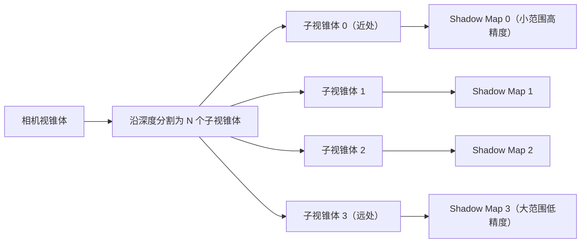

# Phase R18：Cascaded Shadow Maps（级联阴影）

## 目录

- [一、概述](#一概述)
  - [1.1 当前问题](#11-当前问题)
  - [1.2 CSM 解决的问题](#12-csm-解决的问题)
  - [1.3 设计目标](#13-设计目标)
  - [1.4 前置依赖](#14-前置依赖)
- [二、CSM 原理](#二csm-原理)
  - [2.1 核心思想](#21-核心思想)
  - [2.2 与基础 Shadow Map 的对比](#22-与基础-shadow-map-的对比)
  - [2.3 主流引擎的 CSM 实现参考](#23-主流引擎的-csm-实现参考)
- [三、视锥体分割算法](#三视锥体分割算法)
  - [3.1 方案 A：Uniform 均匀分割](#31-方案-a-uniform-均匀分割)
  - [3.2 方案 B：Logarithmic 对数分割](#32-方案-b-logarithmic-对数分割)
  - [3.3 方案 C：Practical Split（PSSM）](#33-方案-c-practical-splitpssm)
  - [3.4 方案 D：手动分割（固定比例）](#34-方案-d-手动分割固定比例)
  - [3.5 方案推荐](#35-方案推荐)
- [四、级联数量选择](#四级联数量选择)
  - [4.1 方案对比](#41-方案对比)
  - [4.2 方案推荐](#42-方案推荐)
- [五、Shadow Map 存储方案](#五shadow-map-存储方案)
  - [5.1 方案 A：多个独立 FBO](#51-方案-a-多个独立-fbo)
  - [5.2 方案 B：Texture2DArray](#52-方案-b-texture2darray)
  - [5.3 方案 C：Shadow Atlas（图集）](#53-方案-c-shadow-atlas图集)
  - [5.4 方案推荐](#54-方案推荐)
- [六、数据结构设计](#六数据结构设计)
  - [6.1 DirectionalLightComponent 扩展](#61-directionallightcomponent-扩展)
  - [6.2 SceneLightData 扩展](#62-scenelightdata-扩展)
  - [6.3 Renderer3DData 扩展](#63-renderer3ddata-扩展)
  - [6.4 RenderContext 扩展](#64-rendercontext-扩展)
- [七、CPU 端实现](#七cpu-端实现)
  - [7.1 视锥体分割计算](#71-视锥体分割计算)
  - [7.2 每级正交投影范围计算](#72-每级正交投影范围计算)
  - [7.3 Light Space Matrix 计算](#73-light-space-matrix-计算)
  - [7.4 BeginScene 修改](#74-beginscene-修改)
- [八、ShadowPass 修改](#八shadowpass-修改)
  - [8.1 ShadowPass 类设计（Texture2DArray 方案）](#81-shadowpass-类设计texture2darray-方案)
  - [8.2 ShadowPass 实现](#82-shadowpass-实现)
- [九、OpaquePass 修改](#九opaquepass-修改)
- [十、Shader 修改](#十shader-修改)
  - [10.1 Shadow.glsl 修改](#101-shadowglsl-修改)
  - [10.2 Lighting.glsl 修改](#102-lightingglsl-修改)
  - [10.3 Standard.vert 修改（无需修改）](#103-standardvert-修改无需修改)
- [十一、级联之间的过渡策略](#十一级联之间的过渡策略)
  - [11.1 方案 A：硬切换（无过渡）](#111-方案-a-硬切换无过渡)
  - [11.2 方案 B：线性混合过渡](#112-方案-b-线性混合过渡)
  - [11.3 方案推荐](#113-方案推荐)
- [十二、Shadow Map 稳定性（Shimmer 消除）](#十二shadow-map-稳定性shimmer-消除)
  - [12.1 问题描述](#121-问题描述)
  - [12.2 解决方案：Texel Snapping](#122-解决方案-texel-snapping)
- [十三、Inspector UI 设计](#十三inspector-ui-设计)
- [十四、序列化](#十四序列化)
- [十五、调试可视化](#十五调试可视化)
- [十六、Framebuffer 扩展（如选择 Texture2DArray 方案）](#十六framebuffer-扩展如选择-texture2darray-方案)
- [十七、EditorCamera 接口扩展](#十七editorcamera-接口扩展)
- [十八、涉及的文件清单](#十八涉及的文件清单)
- [十九、分步实施策略](#十九分步实施策略)
- [二十、验证清单](#二十验证清单)
- [二十一、已知限制与后续优化](#二十一已知限制与后续优化)

---

## 一、概述

### 1.1 当前问题

当前阴影系统（Phase R4）使用**单张固定范围的 Shadow Map**，存在以下问题：

```
当前实现（Renderer3D.cpp - BeginScene）：
  const float orthoSize = 20.0f;    // 固定正交投影范围
  const float nearPlane = -30.0f;
  const float farPlane = 30.0f;
  glm::mat4 lightProjection = glm::ortho(-orthoSize, orthoSize, -orthoSize, orthoSize, nearPlane, farPlane);
```

| 问题 | 影响 |
|------|------|
| **固定正交投影范围（±20）** | 超出 20 单位范围的物体没有阴影 |
| **单张 2048×2048 Shadow Map** | 2048 个纹素覆盖 40×40 的世界空间 = 每纹素 ~2cm，近处阴影锯齿严重 |
| **光源位置固定看向原点** | `lightPos = -lightDir * 15.0f`，`lookAt(lightPos, vec3(0.0f), ...)`，相机移动后阴影不跟随 |
| **Shadow Map 精度浪费** | 远处物体和近处物体共享同一张 Shadow Map，远处不需要高精度但占用了纹素 |

### 1.2 CSM 解决的问题

CSM（Cascaded Shadow Maps，级联阴影贴图）将相机视锥体沿深度方向分割为多个子区间（级联），每个级联使用独立的 Shadow Map，**近处级联覆盖范围小但精度高，远处级联覆盖范围大但精度低**。

```
单张 Shadow Map：
┌─────────────────────────────────────────┐
│  2048×2048 纹素覆盖 40×40 世界空间       │
│  近处和远处精度相同 → 近处锯齿严重        │
└─────────────────────────────────────────┘

CSM（4 级联）：
┌──────────┬──────────┬──────────┬──────────┐
│ Cascade 0│ Cascade 1│ Cascade 2│ Cascade 3│
│ 2048×2048│ 2048×2048│ 2048×2048│ 2048×2048│
│ 覆盖 5m  │ 覆盖 15m │ 覆盖 50m │ 覆盖 150m│
│ 高精度   │ 中精度   │ 低精度   │ 极低精度 │
└──────────┴──────────┴──────────┴──────────┘
近处精度提升 ~8 倍，远处仍有阴影覆盖
```

### 1.3 设计目标

1. ? 方向光阴影覆盖整个相机视锥体（不再受固定 ±20 范围限制）
2. ? 近处阴影精度显著提升（减少锯齿）
3. ? 阴影跟随相机移动（不再固定看向原点）
4. ? 级联数量可配置（Inspector UI 可调）
5. ? 与现有 Hard/Soft 阴影模式兼容
6. ? 向后兼容：不破坏现有的 Shader #include 架构（R16）
7. ? 序列化支持

### 1.4 前置依赖

| 依赖 | 状态 | 说明 |
|------|------|------|
| Phase R4 阴影系统 | ? 已完成 | ShadowPass、Shadow.glsl、OpaquePass 阴影注入 |
| Phase R7 多 Pass 渲染 | ? 已完成 | RenderPipeline、RenderPass、RenderContext |
| Phase R16 Shader 架构重构 | ? 已完成 | #include 预处理器、Shadow.glsl/Lighting.glsl/Common.glsl 函数库 |
| Phase R21 Translucent Shadow Map | ? 已完成 | ShadowPass 支持透明物体阴影（深度+RGBA8 颜色双附件 FBO），Shadow.glsl 返回 vec3 颜色阴影因子 |
| 统一 LightComponent | ? 已完成 | 原 DirectionalLightComponent 已合并为统一 LightComponent（通过 LightType 区分） |
| EditorCamera 视锥体参数 | ? 已有 | FOV、Near、Far、ViewMatrix、AspectRatio（成员变量已有，需添加 public getter） |

---

## 二、CSM 原理

### 2.1 核心思想



**CSM 的核心流程**：

1. **分割视锥体**：将相机的 Near~Far 范围按某种算法分割为 N 个子区间
2. **计算每级的正交投影**：对每个子视锥体，计算其在光源空间的 AABB，作为该级 Shadow Map 的正交投影范围
3. **渲染 N 张 Shadow Map**：每级使用独立的 Light Space Matrix 渲染深度
4. **片段着色器中选择级联**：根据片段的深度（到相机的距离），选择对应的级联进行阴影采样

### 2.2 与基础 Shadow Map 的对比

| 方面 | 基础 Shadow Map（当前） | CSM |
|------|----------------------|-----|
| Shadow Map 数量 | 1 张 | N 张（通常 2~4） |
| 正交投影范围 | 固定（±20） | 每级动态计算（跟随相机视锥体） |
| 近处精度 | 低（与远处共享） | 高（独立的小范围 Shadow Map） |
| 远处覆盖 | 有限（超出范围无阴影） | 完整（覆盖整个视锥体） |
| 相机跟随 | ? 固定看向原点 | ? 跟随相机视锥体 |
| 渲染开销 | 1 次 Shadow Pass | N 次 Shadow Pass |
| 实现复杂度 | 低 | 中~高 |

### 2.3 主流引擎的 CSM 实现参考

| 引擎 | 默认级联数 | 分割算法 | Shadow Map 存储 | 过渡策略 |
|------|-----------|---------|----------------|---------|
| **Unity URP** | 4 | 手动比例（Inspector 可调） | Texture2DArray | 无过渡（硬切换） |
| **Unity HDRP** | 4 | 手动比例 | Shadow Atlas | 线性混合 |
| **Unreal Engine** | 3~5 | 指数分割 | Shadow Atlas | 级联间混合 |
| **Godot 4** | 2 或 4 | 手动比例 | Texture2DArray | 可选混合 |
| **Filament** | 4 | Practical Split | Texture2DArray | 无过渡 |

---

## 三、视锥体分割算法

视锥体分割是 CSM 的核心算法，决定了每个级联覆盖的深度范围。

设相机近平面为 `n`，远平面为 `f`，级联数为 `N`，第 `i` 个级联的远平面为 `C_i`。

### 3.1 方案 A：Uniform 均匀分割

```
C_i = n + (f - n) * (i / N)
```

**示例**（n=0.01, f=150, N=4）：

| 级联 | 近 | 远 | 范围 |
|------|----|----|------|
| 0 | 0.01 | 37.5 | 37.5 |
| 1 | 37.5 | 75.0 | 37.5 |
| 2 | 75.0 | 112.5 | 37.5 |
| 3 | 112.5 | 150.0 | 37.5 |

**优点**：
- 实现最简单

**缺点**：
- ? 近处级联范围过大（37.5m），精度不够
- ? 远处级联范围与近处相同，浪费精度
- ? 不符合人眼感知（近处需要更高精度）

### 3.2 方案 B：Logarithmic 对数分割

```
C_i = n * (f / n) ^ (i / N)
```

**示例**（n=0.01, f=150, N=4）：

| 级联 | 近 | 远 | 范围 |
|------|----|----|------|
| 0 | 0.01 | 0.11 | 0.10 |
| 1 | 0.11 | 1.22 | 1.11 |
| 2 | 1.22 | 13.4 | 12.2 |
| 3 | 13.4 | 150.0 | 136.6 |

**优点**：
- 近处级联范围极小，精度极高
- 数学上最优的精度分配

**缺点**：
- ? 当 `n` 很小时（如 0.01），第一个级联范围过小（0.1m），几乎无用
- ? 最后一个级联范围过大（136m），精度极低
- ? 对 Near Plane 值非常敏感

### 3.3 方案 C：Practical Split（PSSM）

**Practical Split Scheme**（GPU Gems 3 提出）是 Uniform 和 Logarithmic 的加权混合：

```
C_log_i = n * (f / n) ^ (i / N)
C_uni_i = n + (f - n) * (i / N)
C_i = lambda * C_log_i + (1 - lambda) * C_uni_i
```

其中 `lambda ∈ [0, 1]` 控制混合比例：
- `lambda = 0`：纯 Uniform
- `lambda = 1`：纯 Logarithmic
- `lambda = 0.5`：均衡混合（常用默认值）

**示例**（n=0.01, f=150, N=4, lambda=0.5）：

| 级联 | 近 | 远 | 范围 |
|------|----|----|------|
| 0 | 0.01 | 18.8 | 18.8 |
| 1 | 18.8 | 38.1 | 19.3 |
| 2 | 38.1 | 62.9 | 24.8 |
| 3 | 62.9 | 150.0 | 87.1 |

**优点**：
- ? 平衡了近处精度和远处覆盖
- ? `lambda` 参数可调，灵活性高
- ? 业界广泛使用（Filament、部分 Unity 配置）

**缺点**：
- 需要额外的 `lambda` 参数
- 对用户来说不够直观

### 3.4 方案 D：手动分割（固定比例）

用户直接指定每个级联的远平面距离（或占总距离的百分比）：

```cpp
// 方式 1：百分比（Unity URP 风格）
float cascadeSplits[4] = { 0.067f, 0.2f, 0.467f, 1.0f };
// C_i = n + (f - n) * cascadeSplits[i]

// 方式 2：绝对距离
float cascadeDistances[4] = { 10.0f, 30.0f, 70.0f, 150.0f };
```

**示例**（n=0.01, f=150, 比例 6.7%/20%/46.7%/100%）：

| 级联 | 近 | 远 | 范围 |
|------|----|----|------|
| 0 | 0.01 | 10.0 | 10.0 |
| 1 | 10.0 | 30.0 | 20.0 |
| 2 | 30.0 | 70.0 | 40.0 |
| 3 | 70.0 | 150.0 | 80.0 |

**优点**：
- ? 最直观，用户完全控制
- ? 可以针对具体场景精细调优
- ? Unity URP 的默认方式，用户熟悉

**缺点**：
- 需要用户手动调整
- 不同场景可能需要不同的分割比例

### 3.5 方案推荐

| 方案 | 实现复杂度 | 灵活性 | 直观性 | 推荐度 |
|------|-----------|--------|--------|--------|
| A：Uniform | ? 最低 | 低 | 高 | ? 不推荐 |
| B：Logarithmic | ?? 低 | 低 | 低 | ? 不推荐 |
| **C：Practical Split** | ?? 低 | 高 | 中 | ?? 其次 |
| **D：手动分割** | ? 最低 | 最高 | 最高 | ??? **最优（推荐）** |

**推荐方案 D（手动分割）**，理由：
1. 实现最简单，不需要复杂的数学公式
2. 用户完全可控，Inspector 中直接拖动滑块调整每级的距离
3. 与 Unity URP 一致，用户熟悉
4. 可以提供一组合理的默认值，大多数场景无需调整
5. 如果后续需要自动分割，可以在此基础上添加 Practical Split 作为"自动"模式

**默认分割比例**（参考 Unity URP）：

```cpp
// 4 级联默认比例（占 Shadow Distance 的百分比）
float cascadeSplits[4] = { 0.067f, 0.2f, 0.467f, 1.0f };
// 假设 Shadow Distance = 150m：
// Cascade 0: 0 ~ 10m
// Cascade 1: 10 ~ 30m
// Cascade 2: 30 ~ 70m
// Cascade 3: 70 ~ 150m
```

---

## 四、级联数量选择

### 4.1 方案对比

| 级联数 | 渲染开销 | 阴影质量 | 内存占用（20482） | 适用场景 |
|--------|---------|---------|------------------|---------|
| **1** | 1× Shadow Pass | 与当前相同 | 16 MB | 小场景、低端设备 |
| **2** | 2× Shadow Pass | 中等提升 | 32 MB | 中等场景 |
| **3** | 3× Shadow Pass | 显著提升 | 48 MB | 大多数场景 |
| **4** | 4× Shadow Pass | 最佳质量 | 64 MB | 大场景、高端设备 |

> 内存计算：2048 × 2048 × 4 bytes（32-bit depth）= 16 MB / 张

### 4.2 方案推荐

**推荐默认 4 级联**，理由：
1. 与 Unity URP/HDRP 默认值一致
2. 4 次 Shadow Pass 的开销在现代 GPU 上可以接受
3. 提供 Inspector UI 让用户可以降低到 1~3 级联
4. 代码中使用 `MAX_CASCADE_COUNT = 4` 常量，Shader 中使用 `#define` 对应

---

## 五、Shadow Map 存储方案

### 5.1 方案 A：多个独立 FBO

每个级联使用一个独立的 `Framebuffer`（与当前 ShadowPass 的 FBO 结构相同）。

```cpp
// ShadowPass 中
Ref<Framebuffer> m_CascadeFBOs[MAX_CASCADE_COUNT];  // 每级一个 FBO

// 渲染时
for (int i = 0; i < cascadeCount; ++i)
{
    m_CascadeFBOs[i]->Bind();
    // 渲染该级联的深度...
    m_CascadeFBOs[i]->Unbind();
}

// OpaquePass 中绑定纹理
for (int i = 0; i < cascadeCount; ++i)
{
    RenderCommand::BindTextureUnit(15 - i, m_CascadeFBOs[i]->GetDepthAttachmentRendererID());
}
```

**Shader 中**：
```glsl
uniform sampler2D u_ShadowMap0;  // 级联 0
uniform sampler2D u_ShadowMap1;  // 级联 1
uniform sampler2D u_ShadowMap2;  // 级联 2
uniform sampler2D u_ShadowMap3;  // 级联 3
```

**优点**：
- ? **不需要修改 Framebuffer 类**，完全复用现有代码
- ? 实现最简单，与当前架构完全兼容
- ? 每个 FBO 可以有不同的分辨率（如近处级联更高分辨率）

**缺点**：
- ? 占用多个纹理单元（4 级联占用 4 个纹理单元）
- ? Shader 中需要多个 `sampler2D` uniform
- ? FBO 切换开销（每级联一次 Bind/Unbind）

### 5.2 方案 B：Texture2DArray

使用 OpenGL 的 `GL_TEXTURE_2D_ARRAY`，所有级联共享一个纹理对象的不同层。

```cpp
// 底层原理（GL 原生调用，仅作概念说明）：
GLuint shadowMapArray;
glGenTextures(1, &shadowMapArray);
glBindTexture(GL_TEXTURE_2D_ARRAY, shadowMapArray);
glTexImage3D(GL_TEXTURE_2D_ARRAY, 0, GL_DEPTH_COMPONENT24,
             resolution, resolution, cascadeCount,
             0, GL_DEPTH_COMPONENT, GL_FLOAT, nullptr);

// 渲染时：将每层绑定到 FBO
glFramebufferTextureLayer(GL_FRAMEBUFFER, GL_DEPTH_ATTACHMENT, shadowMapArray, 0, cascadeIndex);
```

> **注意**：以上为底层 GL 原理说明。实际实现中，这些操作已封装到引擎的 `Framebuffer` 类中（通过 `DEPTH_COMPONENT_ARRAY` 格式 + `BindDepthLayer()` 接口），ShadowPass 无需直接调用原生 GL API。详见 §8.2 和 §16。

**Shader 中**：
```glsl
uniform sampler2DArray u_ShadowMapArray;  // 一个 uniform 包含所有级联

// 采样
float depth = texture(u_ShadowMapArray, vec3(uv, cascadeIndex)).r;
```

**优点**：
- ? 只占用 1 个纹理单元
- ? Shader 中只需 1 个 `sampler2DArray` uniform
- ? GPU 缓存友好（连续内存布局）
- ? 业界标准做法（Unity、Godot、Filament 均使用）

**缺点**：
- ? 所有层必须相同分辨率
- ? 实现复杂度略高于方案 A（但一次性到位，避免后续迁移成本）

> **注**：Texture2DArray 的创建和逐层绑定已封装到引擎 `Framebuffer` 类中（详见 §16），ShadowPass 通过 `Framebuffer::Create()` + `BindDepthLayer()` 接口管理，无需直接使用原生 GL 调用。

### 5.3 方案 C：Shadow Atlas（图集）

将所有级联的 Shadow Map 打包到一张大纹理中（如 4096×4096 分为 4 个 2048×2048 区域）。

```
┌──────────┬──────────┐
│ Cascade 0│ Cascade 1│
│ 2048×2048│ 2048×2048│
├──────────┼──────────┤
│ Cascade 2│ Cascade 3│
│ 2048×2048│ 2048×2048│
└──────────┴──────────┘
     4096 × 4096
```

**优点**：
- ? 只需 1 个 FBO + 1 个纹理
- ? 不需要 Texture2DArray 支持
- ? 可以为不同级联分配不同大小的区域

**缺点**：
- ? 需要管理 Viewport 偏移（每级联渲染到不同区域）
- ? Shader 中需要额外的 UV 偏移计算
- ? 纹理尺寸可能超出硬件限制（4 × 2048 = 4096，还可以接受）
- ? 边界处可能有采样泄漏

### 5.4 方案推荐

| 方案 | 实现复杂度 | 纹理单元占用 | Framebuffer 改动 | 推荐度 |
|------|-----------|-------------|-----------------|--------|
| A：多个独立 FBO | ? 最低 | 4 个 | 无 | ?? 其次 |
| **B：Texture2DArray** | ?? 中 | 1 个 | 需要扩展 | ??? **最优（推荐）** |
| C：Shadow Atlas | ?? 中 | 1 个 | 无 | ? 不推荐 |

**推荐方案 B（Texture2DArray）**，理由：
1. **业界标准做法**（Unity、Godot、Filament 均使用 Texture2DArray 存储 CSM）
2. **只占用 1 个纹理单元**，Shader 中只需 1 个 `sampler2DArray` uniform，不会挤占材质纹理槽位
3. **GPU 缓存友好**，连续内存布局，采样效率高
4. **Shader 代码简洁**，使用 `texture(u_ShadowMapArray, vec3(uv, cascadeIndex))` 直接索引，无需 if-else 链
5. **一次性到位**，避免后续从方案 A 迁移到方案 B 的重构成本
6. Framebuffer 扩展工作量可控（新增 `Layers` 字段 + `DEPTH_COMPONENT_ARRAY` 格式 + `BindDepthLayer()` 接口），详见 §16

> **Framebuffer 扩展说明**：方案 B 需要扩展 Framebuffer 类以支持 Texture2DArray 创建和逐层绑定（`BindDepthLayer()`）。这是一次性的基础设施投入，后续多光源阴影（Shadow Atlas）也可以复用此能力。详见 [§16 Framebuffer 扩展](#十六framebuffer-扩展如选择-texture2darray-方案)。

---

## 六、数据结构设计

### 6.1 LightComponent 扩展（CSM 属性）

> **注意**：当前引擎已将 `DirectionalLightComponent`、`PointLightComponent`、`SpotLightComponent` 合并为统一的 `LightComponent`（通过 `LightType` 区分类型）。CSM 属性添加到 `LightComponent` 中，仅当 `Type == LightType::Directional` 时使用。

```cpp
// Lucky/Source/Lucky/Scene/Components/LightComponent.h

/// <summary>
/// 光源类型
/// </summary>
enum class LightType : uint8_t
{
    Directional = 0,    // 方向光（平行光）
    Point,              // 点光源
    Spot                // 聚光灯
};

/// <summary>
/// 阴影类型
/// </summary>
enum class ShadowType : uint8_t
{
    None = 0,       // 不投射阴影
    Hard,           // 硬阴影（无 PCF）
    Soft            // 软阴影（PCF 5×5）
};

/// <summary>
/// 统一光源组件：表示场景中的一个光源
/// 通过 Type 字段区分光源类型，不同类型使用不同的属性子集
/// </summary>
struct LightComponent
{
    // ======== 通用属性（所有光源类型共享） ========
    LightType Type = LightType::Directional;            // 光源类型
    glm::vec3 Color = glm::vec3(1.0f, 1.0f, 1.0f);    // 光照颜色
    float Intensity = 1.0f;                             // 光照强度

    // ======== Point / Spot 属性 ========
    float Range = 10.0f;                                // 光照范围（Point/Spot 使用）

    // ======== Spot 属性 ========
    float InnerCutoffAngle = 12.5f;                     // 内锥角（度）（Spot 使用）
    float OuterCutoffAngle = 17.5f;                     // 外锥角（度）（Spot 使用）

    // ======== 阴影属性（所有光源类型共享） ========
    ShadowType Shadows = ShadowType::None;              // 阴影类型
    float ShadowBias = 0.0003f;                         // 阴影偏移
    float ShadowStrength = 1.0f;                        // 阴影强度 [0, 1]

    // ======== CSM 属性（R18 新增，仅 LightType::Directional 使用） ========
    int CascadeCount = 4;                                       // 级联数量 [1, 4]
    float ShadowDistance = 150.0f;                              // 阴影最大距离（替代固定 orthoSize）
    float CascadeSplits[4] = { 0.067f, 0.2f, 0.467f, 1.0f };  // 级联分割比例（占 ShadowDistance 的百分比）
    int ShadowMapResolution = 2048;                             // 每级 Shadow Map 分辨率

    LightComponent() = default;
    LightComponent(const LightComponent& other) = default;
    LightComponent(LightType type) : Type(type)
    {
        switch (type)
        {
            case LightType::Directional:
                Shadows = ShadowType::Hard;     // 方向光默认开启硬阴影
                break;
            case LightType::Point:
            case LightType::Spot:
                Shadows = ShadowType::None;
                break;
        }
    }
};
```

**CSM 新增字段说明**（仅 `LightType::Directional` 使用）：

| 字段 | 类型 | 默认值 | 说明 |
|------|------|--------|------|
| `CascadeCount` | int | 4 | 级联数量，范围 [1, 4] |
| `ShadowDistance` | float | 150.0f | 阴影最大距离（世界空间单位），替代原来的固定 `orthoSize` |
| `CascadeSplits[4]` | float[4] | {0.067, 0.2, 0.467, 1.0} | 每级的分割比例，`CascadeSplits[i]` 表示第 i 级的远平面占 `ShadowDistance` 的百分比 |
| `ShadowMapResolution` | int | 2048 | 每级 Shadow Map 的分辨率 |

### 6.2 SceneLightData 扩展

```cpp
// Lucky/Source/Lucky/Renderer/Renderer3D.h

constexpr static int MAX_CASCADE_COUNT = 4;  // 最大级联数（R18 新增）

struct SceneLightData
{
    // ---- 光源数据（现有，不变） ----
    int DirectionalLightCount = 0;
    DirectionalLightData DirectionalLights[s_MaxDirectionalLights];  // 方向光数组
    
    int PointLightCount = 0;
    PointLightData PointLights[s_MaxPointLights];                    // 点光源数组
    
    int SpotLightCount = 0;
    SpotLightData SpotLights[s_MaxSpotLights];                       // 聚光灯数组

    // ---- 阴影参数（CPU 端传递，不影响 UBO 布局，现有） ----
    ShadowType DirLightShadowType = ShadowType::None;   // 方向光阴影类型
    float DirLightShadowBias = 0.005f;                   // 方向光阴影偏移
    float DirLightShadowStrength = 1.0f;                 // 方向光阴影强度 [0, 1]

    // ---- CSM 参数（R18 新增） ----
    int CascadeCount = 4;                                                       // 级联数量
    float ShadowDistance = 150.0f;                                              // 阴影最大距离
    float CascadeSplits[MAX_CASCADE_COUNT] = { 0.067f, 0.2f, 0.467f, 1.0f };   // 级联分割比例
    int ShadowMapResolution = 2048;                                             // 每级 Shadow Map 分辨率
};
```

> **注意**：`MAX_CASCADE_COUNT` 常量需要新增到 `Renderer3D.h` 中，与现有的 `s_MaxDirectionalLights` 等常量并列。

### 6.3 Renderer3DData 扩展

```cpp
// Lucky/Source/Lucky/Renderer/Renderer3D.cpp（内部结构）

struct Renderer3DData
{
    // ... 现有字段不变 ...

    // ======== 阴影数据（替换原有单矩阵） ========
    bool ShadowEnabled = false;
    float ShadowBias = 0.005f;
    float ShadowStrength = 1.0f;
    ShadowType ShadowShadowType = ShadowType::None;

    // ---- CSM 数据（R18 新增，替换原有 LightSpaceMatrix） ----
    int CascadeCount = 4;
    glm::mat4 CascadeLightSpaceMatrices[MAX_CASCADE_COUNT];     // 每级的 Light Space Matrix
    float CascadeFarPlanes[MAX_CASCADE_COUNT];                   // 每级的远平面距离（视图空间）
    int ShadowMapResolution = 2048;
};
```

### 6.4 RenderContext 扩展

```cpp
// Lucky/Source/Lucky/Renderer/RenderContext.h

struct RenderContext
{
    // ... 现有字段不变（DrawCommand 列表、Outline 数据、FBO 引用、HDR/后处理等） ...

    // ---- 阴影数据（现有字段保留，CSM 扩展） ----
    bool ShadowEnabled = false;
    float ShadowBias = 0.005f;
    float ShadowStrength = 1.0f;
    ShadowType ShadowShadowType = ShadowType::None;

    // ---- CSM 数据（R18 新增，替换原有单个 LightSpaceMatrix / ShadowMapTextureID） ----
    int CascadeCount = 4;
    glm::mat4 CascadeLightSpaceMatrices[MAX_CASCADE_COUNT];     // 每级 Light Space Matrix
    float CascadeFarPlanes[MAX_CASCADE_COUNT];                   // 每级远平面距离（视图空间 z 值）
    uint32_t CascadeShadowMapArrayTextureID = 0;                // CSM Texture2DArray 深度纹理 ID（所有级联共享）
    int ShadowMapResolution = 2048;

    // ---- Translucent Shadow Map 数据（R21 已实现，CSM 需兼容） ----
    // 策略：仅第一级联（Cascade 0）生成 Translucent Shadow Map
    // 理由：透明物体阴影主要在近处可见，远处级联无需额外开销
    uint32_t TranslucentShadowMapTextureID = 0;     // Translucent Shadow Map 颜色纹理 ID（仅 Cascade 0）
    bool TranslucentShadowEnabled = false;          // 是否启用 Translucent Shadow Map

    // ---- 相机数据（CSM 需要，R18 新增） ----
    glm::mat4 CameraViewMatrix = glm::mat4(1.0f);               // 相机视图矩阵（用于计算片段的视图空间深度）

    // 兼容性说明：
    // 原有 LightSpaceMatrix → 替换为 CascadeLightSpaceMatrices[0]（CascadeCount==1 时行为一致）
    // 原有 ShadowMapTextureID → 替换为 CascadeShadowMapArrayTextureID（Texture2DArray 包含所有级联）
    // 原有 TranslucentShadowMapTextureID → 保留（仅 Cascade 0 使用）
};
```

> **Texture2DArray 说明**：
> - `CascadeShadowMapArrayTextureID` 是一个 `GL_TEXTURE_2D_ARRAY` 纹理对象的 ID
> - 包含 `CascadeCount` 层，每层为一个 `ShadowMapResolution × ShadowMapResolution` 的深度纹理
> - Shader 中使用 `sampler2DArray` 采样：`texture(u_ShadowMapArray, vec3(uv, cascadeIndex))`
> - 相比方案 A 的多个纹理 ID 数组，只需传递 1 个纹理 ID，绑定 1 个纹理单元

---

## 七、CPU 端实现

### 7.1 视锥体分割计算

```cpp
/// <summary>
/// 计算级联分割的远平面距离（视图空间）
/// </summary>
/// <param name="cameraNear">相机近平面</param>
/// <param name="shadowDistance">阴影最大距离</param>
/// <param name="cascadeCount">级联数量</param>
/// <param name="splits">分割比例数组</param>
/// <param name="outFarPlanes">输出：每级远平面距离</param>
static void CalculateCascadeSplitDistances(
    float cameraNear,
    float shadowDistance,
    int cascadeCount,
    const float splits[],
    float outFarPlanes[])
{
    for (int i = 0; i < cascadeCount; ++i)
    {
        outFarPlanes[i] = cameraNear + shadowDistance * splits[i];
    }
}
```

**示例**（cameraNear=0.01, shadowDistance=150, splits={0.067, 0.2, 0.467, 1.0}）：

| 级联 | 近平面 | 远平面 | 范围 |
|------|--------|--------|------|
| 0 | 0.01 | 10.06 | 10.05 |
| 1 | 10.06 | 30.01 | 19.95 |
| 2 | 30.01 | 70.06 | 40.05 |
| 3 | 70.06 | 150.01 | 79.95 |

### 7.2 每级正交投影范围计算

每个级联需要计算其在光源空间的 AABB（Axis-Aligned Bounding Box），作为正交投影的范围。

**算法步骤**：

1. 根据相机的 FOV、AspectRatio、Near/Far 计算子视锥体的 8 个角点（世界空间）
2. 将 8 个角点变换到光源空间（乘以光源的 View Matrix）
3. 计算光源空间的 AABB（min/max xyz）
4. 使用 AABB 构建正交投影矩阵

```cpp
/// <summary>
/// 计算子视锥体的 8 个角点（世界空间）
/// </summary>
/// <param name="cameraInvVP">相机 (ViewProjection)^-1 矩阵</param>
/// <param name="nearDist">子视锥体近平面距离</param>
/// <param name="farDist">子视锥体远平面距离</param>
/// <param name="cameraNear">相机原始近平面</param>
/// <param name="cameraFar">相机原始远平面</param>
/// <returns>8 个角点（世界空间）</returns>
static std::array<glm::vec3, 8> GetFrustumCornersWorldSpace(
    const glm::mat4& cameraViewMatrix,
    float fov, float aspectRatio,
    float nearDist, float farDist)
{
    // 计算子视锥体的投影矩阵
    glm::mat4 subProjection = glm::perspective(glm::radians(fov), aspectRatio, nearDist, farDist);
    glm::mat4 invVP = glm::inverse(subProjection * cameraViewMatrix);

    // NDC 空间的 8 个角点
    std::array<glm::vec3, 8> corners;
    int index = 0;
    for (int x = 0; x <= 1; ++x)
    {
        for (int y = 0; y <= 1; ++y)
        {
            for (int z = 0; z <= 1; ++z)
            {
                glm::vec4 pt = invVP * glm::vec4(
                    2.0f * x - 1.0f,
                    2.0f * y - 1.0f,
                    2.0f * z - 1.0f,
                    1.0f
                );
                corners[index++] = glm::vec3(pt) / pt.w;
            }
        }
    }
    return corners;
}
```

### 7.3 Light Space Matrix 计算

```cpp
/// <summary>
/// 计算单个级联的 Light Space Matrix
/// </summary>
/// <param name="frustumCorners">子视锥体的 8 个角点（世界空间）</param>
/// <param name="lightDir">光照方向（归一化）</param>
/// <returns>Light Space Matrix（正交投影 × 光源视图）</returns>
static glm::mat4 CalculateCascadeLightSpaceMatrix(
    const std::array<glm::vec3, 8>& frustumCorners,
    const glm::vec3& lightDir)
{
    // 1. 计算子视锥体的中心点
    glm::vec3 center(0.0f);
    for (const auto& corner : frustumCorners)
    {
        center += corner;
    }
    center /= 8.0f;

    // 2. 构建光源视图矩阵（从光源方向看向子视锥体中心）
    glm::vec3 lightPos = center - lightDir * 50.0f;  // 沿光照反方向偏移
    glm::mat4 lightView = glm::lookAt(lightPos, center, glm::vec3(0.0f, 1.0f, 0.0f));

    // 3. 将 8 个角点变换到光源空间，计算 AABB
    float minX = std::numeric_limits<float>::max();
    float maxX = std::numeric_limits<float>::lowest();
    float minY = std::numeric_limits<float>::max();
    float maxY = std::numeric_limits<float>::lowest();
    float minZ = std::numeric_limits<float>::max();
    float maxZ = std::numeric_limits<float>::lowest();

    for (const auto& corner : frustumCorners)
    {
        glm::vec4 lightSpaceCorner = lightView * glm::vec4(corner, 1.0f);
        minX = std::min(minX, lightSpaceCorner.x);
        maxX = std::max(maxX, lightSpaceCorner.x);
        minY = std::min(minY, lightSpaceCorner.y);
        maxY = std::max(maxY, lightSpaceCorner.y);
        minZ = std::min(minZ, lightSpaceCorner.z);
        maxZ = std::max(maxZ, lightSpaceCorner.z);
    }

    // 4. 扩展 Z 范围（确保光源"背后"的物体也能投射阴影）
    // 这个偏移量需要足够大，以捕获视锥体外但仍能投射阴影的物体
    const float zMultiplier = 10.0f;
    if (minZ < 0)
    {
        minZ *= zMultiplier;
    }
    else
    {
        minZ /= zMultiplier;
    }
    if (maxZ < 0)
    {
        maxZ /= zMultiplier;
    }
    else
    {
        maxZ *= zMultiplier;
    }

    // 5. 构建正交投影矩阵
    glm::mat4 lightProjection = glm::ortho(minX, maxX, minY, maxY, minZ, maxZ);

    return lightProjection * lightView;
}
```

### 7.4 BeginScene 修改

```cpp
void Renderer3D::BeginScene(const EditorCamera& camera, const SceneLightData& lightData)
{
    // ... 现有的 Camera UBO 和 Light UBO 设置不变 ...

    // ======== CSM 计算（替换原有的固定 orthoSize 计算） ========
    s_Data.ShadowEnabled = false;
    if (lightData.DirectionalLightCount > 0 && lightData.DirLightShadowType != ShadowType::None)
    {
        s_Data.ShadowEnabled = true;
        s_Data.ShadowBias = lightData.DirLightShadowBias;
        s_Data.ShadowStrength = lightData.DirLightShadowStrength;
        s_Data.ShadowShadowType = lightData.DirLightShadowType;
        s_Data.CascadeCount = lightData.CascadeCount;
        s_Data.ShadowMapResolution = lightData.ShadowMapResolution;

        glm::vec3 lightDir = glm::normalize(lightData.DirectionalLights[0].Direction);

        // 计算每级的远平面距离
        float cascadeNearPlanes[MAX_CASCADE_COUNT];
        float cascadeFarPlanes[MAX_CASCADE_COUNT];
        
        float cameraNear = camera.GetNear();  // 需要 EditorCamera 暴露此接口
        
        for (int i = 0; i < s_Data.CascadeCount; ++i)
        {
            cascadeNearPlanes[i] = (i == 0) ? cameraNear : cascadeFarPlanes[i - 1];
            cascadeFarPlanes[i] = cameraNear + lightData.ShadowDistance * lightData.CascadeSplits[i];
            s_Data.CascadeFarPlanes[i] = cascadeFarPlanes[i];
        }

        // 计算每级的 Light Space Matrix
        for (int i = 0; i < s_Data.CascadeCount; ++i)
        {
            auto corners = GetFrustumCornersWorldSpace(
                camera.GetViewMatrix(),
                camera.GetFOV(),        // 需要 EditorCamera 暴露此接口
                camera.GetAspectRatio(), // 需要 EditorCamera 暴露此接口
                cascadeNearPlanes[i],
                cascadeFarPlanes[i]
            );

            s_Data.CascadeLightSpaceMatrices[i] = CalculateCascadeLightSpaceMatrix(corners, lightDir);
        }
    }

    // ... 其余代码不变 ...
}
```

---

## 八、ShadowPass 修改

> **重要变更（R21 兼容）**：当前 ShadowPass 使用**深度 + RGBA8 颜色双附件** FBO（R21 Translucent Shadow Map）。CSM 版本需要保持 Translucent Shadow Map 的支持。
> 
> **Translucent Shadow 在 CSM 下的策略**：仅 Cascade 0 生成 Translucent Shadow Map（透明物体颜色衰减），其余级联只渲染深度。理由：透明物体彩色阴影主要在近处可见，远处级联无需额外开销。
>
> **渲染状态恢复说明**：当前 `RenderPipeline::Execute()` 在每个 Pass 执行后自动调用 `RenderCommand::ResetDefaultRenderState()` 恢复默认渲染状态，因此 ShadowPass 内部**无需手动恢复渲染状态**（如 CullMode、ColorMask、DepthWrite、BlendMode 等）。同理，也**无需手动重新绑定主 FBO 和恢复视口**，Pipeline 会在下一个 Pass 执行前处理。

### 8.1 ShadowPass 类设计（Texture2DArray 方案）

> **设计原则**：ShadowPass 通过引擎封装的 `Framebuffer` 接口管理所有 FBO 资源（包括 Texture2DArray），不直接使用原生 GL 调用。这与 §16 Framebuffer 扩展配合，确保代码风格与其他 Pass 一致。

```cpp
// Lucky/Source/Lucky/Renderer/Passes/ShadowPass.h

class ShadowPass : public RenderPass
{
public:
    void Init() override;
    void Execute(const RenderContext& context) override;
    void Resize(uint32_t width, uint32_t height) override;
    const std::string& GetName() const override { static std::string name = "ShadowPass"; return name; }
    const std::string& GetGroup() const override { static std::string group = "Shadow"; return group; }

    /// <summary>
    /// 获取 CSM Texture2DArray 深度纹理 ID（包含所有级联层）
    /// </summary>
    uint32_t GetShadowMapArrayTextureID() const { return m_CSMFramebuffer->GetDepthArrayTextureID(); }

    /// <summary>
    /// 获取 Translucent Shadow Map 颜色纹理 ID（仅 Cascade 0）
    /// </summary>
    uint32_t GetTranslucentShadowMapTextureID() const;

private:
    // ---- CSM Framebuffer：Texture2DArray 深度纹理（所有级联共享） ----
    Ref<Framebuffer> m_CSMFramebuffer;      // DEPTH_COMPONENT_ARRAY，Layers = cascadeCount

    // ---- Translucent Shadow Map：仅 Cascade 0 使用（独立 FBO） ----
    Ref<Framebuffer> m_TranslucentFBO;      // Cascade 0 的 Translucent Shadow Map FBO（RGBA8 颜色附件）

    Ref<Shader> m_ShadowShader;
    uint32_t m_ShadowMapResolution = 2048;
};
```

### 8.2 ShadowPass 实现

```cpp
// Lucky/Source/Lucky/Renderer/Passes/ShadowPass.cpp

void ShadowPass::Init()
{
    m_ShadowShader = Renderer3D::GetShaderLibrary()->Get("Shadow");

    // ---- 创建 CSM Framebuffer（Texture2DArray，所有级联共享） ----
    FramebufferSpecification csmSpec;
    csmSpec.Width = m_ShadowMapResolution;
    csmSpec.Height = m_ShadowMapResolution;
    csmSpec.Layers = MAX_CASCADE_COUNT;  // 4 层（4 个级联）
    csmSpec.Attachments = { FramebufferTextureFormat::DEPTH_COMPONENT_ARRAY };
    m_CSMFramebuffer = Framebuffer::Create(csmSpec);

    // ---- 创建 Translucent Shadow Map FBO（仅 Cascade 0 使用） ----
    // 独立的 RGBA8 颜色附件，用于透明物体颜色衰减
    FramebufferSpecification translucentSpec;
    translucentSpec.Width = m_ShadowMapResolution;
    translucentSpec.Height = m_ShadowMapResolution;
    translucentSpec.Attachments = { FramebufferTextureFormat::RGBA8 };
    m_TranslucentFBO = Framebuffer::Create(translucentSpec);
}

void ShadowPass::Execute(const RenderContext& context)
{
    // 条件执行：仅当阴影启用且有可渲染物体时执行
    bool hasOpaque = context.OpaqueDrawCommands && !context.OpaqueDrawCommands->empty();
    bool hasTransparent = context.TransparentDrawCommands && !context.TransparentDrawCommands->empty();

    if (!context.ShadowEnabled || (!hasOpaque && !hasTransparent))
    {
        return;
    }

    // 获取实际分辨率（可能被组件修改）
    uint32_t resolution = static_cast<uint32_t>(context.ShadowMapResolution);

    // 检查 Texture2DArray 分辨率是否需要更新
    if (resolution != m_ShadowMapResolution)
    {
        m_ShadowMapResolution = resolution;
        m_CSMFramebuffer->Resize(resolution, resolution);
        m_TranslucentFBO->Resize(resolution, resolution);
    }

    // 设置渲染状态：关闭面剔除（双面渲染，避免薄物体/近距离阴影缺失）
    RenderCommand::SetCullMode(CullMode::Off);
    m_ShadowShader->Bind();

    // ======== 逐级联渲染深度 ========
    m_CSMFramebuffer->Bind();

    for (int cascade = 0; cascade < context.CascadeCount; ++cascade)
    {
        // 将 Texture2DArray 的第 cascade 层绑定为深度附件
        m_CSMFramebuffer->BindDepthLayer(cascade);
        RenderCommand::SetViewport(0, 0, resolution, resolution);
        RenderCommand::Clear();

        // 设置该级联的 Light Space Matrix
        m_ShadowShader->SetMat4("u_LightSpaceMatrix", context.CascadeLightSpaceMatrices[cascade]);

        // ---- 不透明物体：只写深度 ----
        if (hasOpaque)
        {
            RenderCommand::SetColorMask(false, false, false, false);
            m_ShadowShader->SetInt("u_AlphaTestEnabled", 0);
            m_ShadowShader->SetInt("u_TranslucentShadowEnabled", 0);

            for (const DrawCommand& cmd : *context.OpaqueDrawCommands)
            {
                m_ShadowShader->SetMat4("u_ObjectToWorldMatrix", cmd.Transform);
                RenderCommand::DrawIndexedRange(
                    cmd.MeshData->GetVertexArray(),
                    cmd.SubMeshPtr->IndexOffset,
                    cmd.SubMeshPtr->IndexCount
                );
            }
        }
    }

    m_CSMFramebuffer->Unbind();

    // ======== Translucent Shadow Map（仅 Cascade 0） ========
    if (hasTransparent && context.TranslucentShadowEnabled)
    {
        m_TranslucentFBO->Bind();
        RenderCommand::SetViewport(0, 0, resolution, resolution);
        RenderCommand::SetClearColor(glm::vec4(1.0f, 1.0f, 1.0f, 1.0f));
        RenderCommand::Clear();

        // 使用 Cascade 0 的 Light Space Matrix
        m_ShadowShader->SetMat4("u_LightSpaceMatrix", context.CascadeLightSpaceMatrices[0]);

        // 关闭深度写入 + 启用颜色写入 + 乘法混合
        RenderCommand::SetDepthWrite(false);
        RenderCommand::SetColorMask(true, true, true, true);
        RenderCommand::SetBlendMode(BlendMode::Zero_SrcColor);

        m_ShadowShader->SetInt("u_AlphaTestEnabled", 1);
        m_ShadowShader->SetInt("u_TranslucentShadowEnabled", 1);
        m_ShadowShader->SetFloat("u_AlphaTestThreshold", 0.5f);

        const auto& defaultWhiteTexture = Renderer3D::GetDefaultTexture(TextureDefault::White);

        for (const DrawCommand& cmd : *context.TransparentDrawCommands)
        {
            m_ShadowShader->SetMat4("u_ObjectToWorldMatrix", cmd.Transform);

            // 传递材质的 Albedo 颜色（包含 Alpha）
            glm::vec4 albedo = cmd.MaterialData->GetFloat4("u_Albedo");
            m_ShadowShader->SetFloat4("u_Albedo", albedo);

            // 绑定材质的 AlbedoMap 纹理
            Ref<Texture2D> albedoMap = cmd.MaterialData->GetTexture("u_AlbedoMap");
            if (albedoMap)
                albedoMap->Bind(0);
            else
                defaultWhiteTexture->Bind(0);
            m_ShadowShader->SetInt("u_AlbedoMap", 0);

            RenderCommand::DrawIndexedRange(
                cmd.MeshData->GetVertexArray(),
                cmd.SubMeshPtr->IndexOffset,
                cmd.SubMeshPtr->IndexCount
            );
        }

        m_TranslucentFBO->Unbind();
    }

    // 注意：无需手动恢复渲染状态（CullMode、ColorMask、DepthWrite、BlendMode 等）
    // RenderPipeline::Execute() 在每个 Pass 执行后自动调用 RenderCommand::ResetDefaultRenderState()
    // 也无需手动重新绑定主 FBO 和恢复视口，Pipeline 会在下一个 Pass 执行前处理
}

uint32_t ShadowPass::GetTranslucentShadowMapTextureID() const
{
    return m_TranslucentFBO->GetColorAttachmentRendererID(0);
}
```

> **与当前实现的关键差异**：
> 
> | 对比项 | 当前实现（R4/R21） | CSM Texture2DArray 方案 |
> |--------|-------------------|------------------------|
> | 深度存储 | 单个 Framebuffer 的深度附件 | `Ref<Framebuffer>`（DEPTH_COMPONENT_ARRAY，4 层），通过 `BindDepthLayer()` 逐层切换 |
> | Translucent Shadow | 与深度共用同一 FBO（RGBA8 颜色附件） | 独立 `Ref<Framebuffer>`（仅 Cascade 0 使用） |
> | 纹理单元占用 | 深度 1 个 + 颜色 1 个 = 2 个 | Texture2DArray 1 个 + Translucent 1 个 = 2 个 |
> | 渲染状态恢复 | ~~手动恢复 CullMode、重新绑定主 FBO~~ | 无需手动恢复（Pipeline 统一处理） |
> | FBO 管理方式 | 引擎 Framebuffer 类 | 统一使用引擎 Framebuffer 类（CSM + Translucent 均通过封装接口） |

> **Translucent Shadow Map 兼容说明**：
> - Translucent Shadow Map 使用独立的 `Ref<Framebuffer>`（RGBA8 颜色附件），不再与深度 Shadow Map 共用 FBO
> - 深度 Shadow Map 和 Translucent Shadow Map 均通过引擎封装的 `Framebuffer` 类管理，无需直接使用原生 GL 调用
> - 透明物体仅在 Cascade 0 的 Light Space Matrix 下渲染颜色衰减（乘法混合 `BlendMode::Zero_SrcColor`）
> - OpaquePass / TransparentPass 中，Translucent Shadow Map 纹理来自 `m_TranslucentFBO`

---

## 九、OpaquePass / TransparentPass 修改

### 9.1 纹理单元分配方案

> **重要变更（Texture2DArray 方案）**：使用 `sampler2DArray` 后，CSM 的所有级联只需占用 **1 个纹理单元**，大幅简化纹理管理。

| 纹理单元 | 用途 | 说明 |
|----------|------|------|
| 0~7 | 材质纹理 | 用户 Shader 的 Albedo/Normal/Metallic 等纹理 |
| 14 | Translucent Shadow Map | 透明物体颜色衰减纹理（仅 Cascade 0，保持原有位置） |
| 15 | CSM Shadow Map Array | `GL_TEXTURE_2D_ARRAY`，包含所有级联的深度纹理 |

> **说明**：相比方案 A（多个独立 FBO 占用 4 个纹理单元 15/14/13/12），Texture2DArray 方案只需 1 个纹理单元（15），Translucent Shadow Map 保持在纹理单元 14 不变（与当前 R21 实现一致，无需迁移）。

### 9.2 OpaquePass 修改

```cpp
void OpaquePass::Execute(const RenderContext& context)
{
    // ... 现有的 HDR FBO 绑定、清屏逻辑不变 ...

    // ---- 绑定 CSM Shadow Map Texture2DArray ----
    if (context.ShadowEnabled && context.CascadeShadowMapArrayTextureID != 0)
    {
        // 绑定 Texture2DArray 到纹理单元 15（一个纹理包含所有级联）
        RenderCommand::BindTextureUnit(15, context.CascadeShadowMapArrayTextureID);

        // 绑定 Translucent Shadow Map 纹理（纹理单元 14，仅 Cascade 0 的颜色衰减）
        if (context.TranslucentShadowEnabled && context.TranslucentShadowMapTextureID != 0)
        {
            RenderCommand::BindTextureUnit(14, context.TranslucentShadowMapTextureID);
        }
    }

    // ---- 批量绘制不透明物体 ----
    // ... 现有的状态跟踪、Shader 绑定、材质应用逻辑不变 ...

    for (const DrawCommand& cmd : *context.OpaqueDrawCommands)
    {
        // ... 现有的 RenderState 应用、Shader 绑定、Material::Apply() 不变 ...

        // 设置引擎内部 uniform
        cmd.MaterialData->GetShader()->SetMat4("u_ObjectToWorldMatrix", cmd.Transform);

        // 设置阴影相关 uniform（替换原有的单矩阵设置）
        if (context.ShadowEnabled)
        {
            // CSM uniform（Texture2DArray 方案：只需绑定 1 个纹理单元）
            cmd.MaterialData->GetShader()->SetInt("u_ShadowMapArray", 15);  // sampler2DArray
            cmd.MaterialData->GetShader()->SetInt("u_CascadeCount", context.CascadeCount);
            
            for (int i = 0; i < context.CascadeCount; ++i)
            {
                // Light Space Matrix
                std::string matName = "u_CascadeLightSpaceMatrices[" + std::to_string(i) + "]";
                cmd.MaterialData->GetShader()->SetMat4(matName, context.CascadeLightSpaceMatrices[i]);
                
                // 级联远平面距离
                std::string farName = "u_CascadeFarPlanes[" + std::to_string(i) + "]";
                cmd.MaterialData->GetShader()->SetFloat(farName, context.CascadeFarPlanes[i]);
            }
            
            // 相机视图矩阵（用于计算片段的视图空间深度）
            cmd.MaterialData->GetShader()->SetMat4("u_CameraViewMatrix", context.CameraViewMatrix);
            
            cmd.MaterialData->GetShader()->SetFloat("u_ShadowBias", context.ShadowBias);
            cmd.MaterialData->GetShader()->SetFloat("u_ShadowStrength", context.ShadowStrength);
            cmd.MaterialData->GetShader()->SetInt("u_ShadowEnabled", 1);
            cmd.MaterialData->GetShader()->SetInt("u_ShadowType", static_cast<int>(context.ShadowShadowType));

            // Translucent Shadow Map（纹理单元 14，仅 Cascade 0 的颜色衰减）
            cmd.MaterialData->GetShader()->SetInt("u_TranslucentShadowMap", 14);
            cmd.MaterialData->GetShader()->SetInt("u_TranslucentShadowEnabled", context.TranslucentShadowEnabled ? 1 : 0);
        }
        else
        {
            cmd.MaterialData->GetShader()->SetInt("u_ShadowEnabled", 0);
            cmd.MaterialData->GetShader()->SetInt("u_TranslucentShadowEnabled", 0);
        }

        // ... 绘制逻辑不变 ...
    }
}
```

### 9.3 TransparentPass 修改

`TransparentPass` 的阴影 uniform 设置与 `OpaquePass` 基本一致，区别在于：
- 透明物体**不启用** Translucent Shadow Map 接收（避免自阴影），即 `u_TranslucentShadowEnabled = 0`

```cpp
void TransparentPass::Execute(const RenderContext& context)
{
    // ... 现有逻辑不变 ...

    // ---- 绑定 CSM Shadow Map Texture2DArray（与 OpaquePass 相同） ----
    if (context.ShadowEnabled && context.CascadeShadowMapArrayTextureID != 0)
    {
        RenderCommand::BindTextureUnit(15, context.CascadeShadowMapArrayTextureID);
        // 注意：TransparentPass 不绑定 Translucent Shadow Map（避免自阴影）
    }

    for (const DrawCommand& cmd : *context.TransparentDrawCommands)
    {
        // ... 现有的 RenderState 应用、Shader 绑定、Material::Apply() 不变 ...

        // 设置阴影相关 uniform（与 OpaquePass 相同，但 TranslucentShadowEnabled = 0）
        if (context.ShadowEnabled)
        {
            cmd.MaterialData->GetShader()->SetInt("u_ShadowMapArray", 15);
            cmd.MaterialData->GetShader()->SetInt("u_CascadeCount", context.CascadeCount);
            
            for (int i = 0; i < context.CascadeCount; ++i)
            {
                std::string matName = "u_CascadeLightSpaceMatrices[" + std::to_string(i) + "]";
                cmd.MaterialData->GetShader()->SetMat4(matName, context.CascadeLightSpaceMatrices[i]);
                
                std::string farName = "u_CascadeFarPlanes[" + std::to_string(i) + "]";
                cmd.MaterialData->GetShader()->SetFloat(farName, context.CascadeFarPlanes[i]);
            }
            
            cmd.MaterialData->GetShader()->SetMat4("u_CameraViewMatrix", context.CameraViewMatrix);
            cmd.MaterialData->GetShader()->SetFloat("u_ShadowBias", context.ShadowBias);
            cmd.MaterialData->GetShader()->SetFloat("u_ShadowStrength", context.ShadowStrength);
            cmd.MaterialData->GetShader()->SetInt("u_ShadowEnabled", 1);
            cmd.MaterialData->GetShader()->SetInt("u_ShadowType", static_cast<int>(context.ShadowShadowType));

            // 透明物体不接收 Translucent Shadow（避免自阴影）
            cmd.MaterialData->GetShader()->SetInt("u_TranslucentShadowMap", 14);
            cmd.MaterialData->GetShader()->SetInt("u_TranslucentShadowEnabled", 0);
        }
        else
        {
            cmd.MaterialData->GetShader()->SetInt("u_ShadowEnabled", 0);
            cmd.MaterialData->GetShader()->SetInt("u_TranslucentShadowEnabled", 0);
        }

        // ... 绘制逻辑不变 ...
    }
}
```

> **性能优化说明**：上述代码中每帧为每个 DrawCommand 设置 `u_CascadeLightSpaceMatrices[i]`、`u_CascadeFarPlanes[i]` 等数组 uniform，使用字符串拼接 + `SetMat4`/`SetFloat`。这在 DrawCommand 数量较少时性能可以接受。如果后续成为瓶颈，可以优化为：
> 1. 预缓存 uniform location（在 Shader 编译后一次性查询）
> 2. 将 CSM 数据放入 UBO（避免逐 DrawCommand 设置）
> 3. 注意：`u_ShadowMapArray` 纹理单元只需设置一次（Texture2DArray 绑定后对所有 DrawCommand 生效），无需逐 DrawCommand 重复设置

---

## 十、Shader 修改

### 10.1 Shadow.glsl 修改

> **重要变更（R21 兼容）**：当前 `ShadowCalculation()` 返回 `vec3`（支持 Translucent Shadow 的彩色阴影衰减）。CSM 版本必须保持此签名，并在 Cascade 0 中集成 Translucent Shadow Map 采样。
>
> **Texture2DArray 优势**：使用 `sampler2DArray` 后，无需 if-else 链来规避动态索引限制，直接使用 `texture(u_ShadowMapArray, vec3(uv, cascadeIndex))` 即可。代码更简洁、性能更好。

```glsl
// Lucky/Shadow.glsl
// 引擎阴影计算函数库（CSM Texture2DArray 版本，支持 Translucent Shadow）
// 依赖：Lucky/Common.glsl（需要在此文件之前 include）

#ifndef LUCKY_SHADOW_GLSL
#define LUCKY_SHADOW_GLSL

#define MAX_CASCADE_COUNT 4

// ---- CSM 阴影参数（由 OpaquePass / TransparentPass 在每帧设置） ----
uniform sampler2DArray u_ShadowMapArray;                        // CSM Texture2DArray（所有级联共享）
uniform mat4 u_CascadeLightSpaceMatrices[MAX_CASCADE_COUNT];    // 每级 Light Space Matrix
uniform float u_CascadeFarPlanes[MAX_CASCADE_COUNT];            // 每级远平面距离（视图空间）
uniform int u_CascadeCount;                                      // 实际级联数量
uniform mat4 u_CameraViewMatrix;                                 // 相机视图矩阵

// ---- 通用阴影参数 ----
uniform float u_ShadowBias;         // 阴影偏移
uniform float u_ShadowStrength;     // 阴影强度 [0, 1]
uniform int u_ShadowEnabled;        // 阴影开关（0 = 关闭, 1 = 开启）
uniform int u_ShadowType;           // 阴影类型（1 = Hard 硬阴影, 2 = Soft 软阴影 PCF 5x5）

// ---- Translucent Shadow Map 参数（仅 Cascade 0） ----
uniform sampler2D u_TranslucentShadowMap;   // Translucent Shadow Map 颜色纹理（仅 Cascade 0）
uniform int u_TranslucentShadowEnabled;     // 是否启用 Translucent Shadow（0 = 关闭, 1 = 开启）

// ==================== 阴影计算 ====================

/// <summary>
/// 计算动态 Bias：根据法线和光照方向的夹角调整
/// u_ShadowBias 作为基础 bias, 当法线与光照方向接近垂直时放大到 10 倍
/// </summary>
float CalcShadowBias(vec3 normal, vec3 lightDir)
{
    float NdotL = dot(normal, lightDir);
    // 基础 bias * 动态缩放因子（最小 1 倍, 最大 10 倍）
    return u_ShadowBias * (1.0 + 9.0 * (1.0 - clamp(NdotL, 0.0, 1.0)));
}

/// <summary>
/// 硬阴影计算（单次采样，使用 Texture2DArray）
/// 返回值：0.0 = 完全不在阴影中, 1.0 = 完全在阴影中
/// </summary>
float ShadowCalculationHard(vec3 projCoords, float bias, int cascadeIndex)
{
    float currentDepth = projCoords.z;
    float closestDepth = texture(u_ShadowMapArray, vec3(projCoords.xy, float(cascadeIndex))).r;
    return currentDepth - bias > closestDepth ? 1.0 : 0.0;
}

/// <summary>
/// 软阴影计算（PCF 5x5 采样核，使用 Texture2DArray）
/// 返回值：0.0 = 完全不在阴影中, 1.0 = 完全在阴影中
/// </summary>
float ShadowCalculationSoft(vec3 projCoords, float bias, int cascadeIndex)
{
    float currentDepth = projCoords.z;
    float shadow = 0.0;
    vec2 texelSize = 1.0 / textureSize(u_ShadowMapArray, 0).xy;
    for (int x = -2; x <= 2; ++x)
    {
        for (int y = -2; y <= 2; ++y)
        {
            float pcfDepth = texture(u_ShadowMapArray, vec3(projCoords.xy + vec2(x, y) * texelSize, float(cascadeIndex))).r;
            shadow += currentDepth - bias > pcfDepth ? 1.0 : 0.0;
        }
    }
    shadow /= 25.0;
    return shadow;
}

/// <summary>
/// 选择当前片段所属的级联索引
/// 根据片段在视图空间的深度（z 值）与每级远平面比较
/// </summary>
int SelectCascadeIndex(vec3 worldPos)
{
    // 将世界空间位置变换到视图空间
    vec4 viewPos = u_CameraViewMatrix * vec4(worldPos, 1.0);
    float depth = -viewPos.z;  // 视图空间 z 为负值，取反得到正的深度

    // 遍历级联，找到第一个远平面 >= 当前深度的级联
    for (int i = 0; i < u_CascadeCount; ++i)
    {
        if (depth < u_CascadeFarPlanes[i])
        {
            return i;
        }
    }
    // 超出所有级联范围，返回最后一级
    return u_CascadeCount - 1;
}

/// <summary>
/// CSM 阴影计算入口（支持 Translucent Shadow）
/// 返回值：vec3, 每个通道 0.0 = 完全在阴影中, 1.0 = 完全不在阴影中
/// 不启用 Translucent Shadow 时, 三个通道值相同（等价于原来的 float）
/// </summary>
vec3 ShadowCalculation(vec3 worldPos, vec3 normal, vec3 lightDir)
{
    // 1. 选择级联
    int cascadeIndex = SelectCascadeIndex(worldPos);

    // 2. 变换到该级联的光源空间
    vec4 fragPosLightSpace = u_CascadeLightSpaceMatrices[cascadeIndex] * vec4(worldPos, 1.0);
    vec3 projCoords = fragPosLightSpace.xyz / fragPosLightSpace.w;
    projCoords = projCoords * 0.5 + 0.5;

    // 超出 Shadow Map 范围的区域不在阴影中
    if (projCoords.z > 1.0)
    {
        return vec3(1.0);
    }

    // 3. 动态 Bias
    float bias = CalcShadowBias(normal, lightDir);

    // 4. 根据阴影类型选择计算方式
    float shadow = 0.0;
    if (u_ShadowType == 1)  // Hard
    {
        shadow = ShadowCalculationHard(projCoords, bias, cascadeIndex);
    }
    else  // Soft (u_ShadowType == 2)
    {
        shadow = ShadowCalculationSoft(projCoords, bias, cascadeIndex);
    }

    // 5. 应用阴影强度
    shadow *= u_ShadowStrength;

    // 基础阴影因子（标量）
    float baseShadow = 1.0 - shadow;

    // 6. Translucent Shadow 颜色衰减（仅 Cascade 0 有 Translucent Shadow Map）
    if (u_TranslucentShadowEnabled != 0 && cascadeIndex == 0)
    {
        // 使用 Cascade 0 的光源空间坐标采样 Translucent Shadow Map
        vec3 translucentColor = texture(u_TranslucentShadowMap, projCoords.xy).rgb;
        return vec3(baseShadow) * translucentColor;
    }

    return vec3(baseShadow);
}

#endif // LUCKY_SHADOW_GLSL
```

> **关键变化（相对于当前 R21 版本）**：
> - `u_ShadowMap`（sampler2D） → `u_ShadowMapArray`（**sampler2DArray**，所有级联共享一个纹理对象）
> - `u_LightSpaceMatrix` → `u_CascadeLightSpaceMatrices[MAX_CASCADE_COUNT]`（数组）
> - 新增 `u_CascadeFarPlanes[MAX_CASCADE_COUNT]`、`u_CascadeCount`、`u_CameraViewMatrix`
> - 新增 `SelectCascadeIndex()` 函数（根据视图空间深度选择级联）
> - `ShadowCalculationHard/Soft` 增加 `cascadeIndex` 参数，直接使用 `texture(u_ShadowMapArray, vec3(uv, cascadeIndex))` 采样
> - **无需 if-else 链**：`sampler2DArray` 支持动态索引（第三个坐标为层索引），比 `sampler2D` 数组更简洁
> - `ShadowCalculation()` 返回值保持 `vec3`（与 R21 一致），签名不变
> - Translucent Shadow Map 采样仅在 `cascadeIndex == 0` 时执行（仅 Cascade 0 有颜色附件）
> - PCF 采样核保持 5×5（与当前 R21 实现一致）
> - `textureSize(u_ShadowMapArray, 0)` 返回 `ivec3`（width, height, layers），取 `.xy` 获取分辨率

### 10.2 Lighting.glsl 修改

`Lighting.glsl` 中的 `CalcAllLights()` 函数需要**小幅修改**：`ShadowCalculation()` 的返回值从 `float` 变为 `vec3`（支持 Translucent Shadow 的彩色阴影衰减），因此阴影因子的类型和乘法需要调整：

```glsl
// CalcAllLights 中的阴影调用（需要修改：float → vec3）
if (i == 0 && u_ShadowEnabled != 0)
{
    vec3 lightDir = normalize(-u_Lights.DirectionalLights[i].Direction);
    vec3 shadow = ShadowCalculation(worldPos, N, lightDir);  // 返回 vec3（彩色阴影衰减）
    contribution *= shadow;  // vec3 * vec3 逐通道相乘
}
```

> **说明**：此修改与 R21 Translucent Shadow Map 引入时的变更一致。如果当前 Lighting.glsl 已经使用 `vec3` 接收 `ShadowCalculation()` 的返回值，则无需额外修改。

### 10.3 Standard.vert 修改（无需修改）

顶点着色器不需要修改。CSM 的级联选择和阴影采样都在片段着色器中完成。

---

## 十一、级联之间的过渡策略

### 11.1 方案 A：硬切换（无过渡）

直接根据深度选择级联，级联边界处会有明显的阴影质量跳变。

```glsl
// 已在 SelectCascadeIndex() 中实现
int cascadeIndex = SelectCascadeIndex(worldPos);
// 直接使用 cascadeIndex 采样
```

**优点**：
- ? 实现最简单，零额外开销
- ? Unity URP 默认行为

**缺点**：
- ? 级联边界处可能有可见的阴影质量跳变（尤其是 PCF 软阴影时）

### 11.2 方案 B：线性混合过渡

在级联边界附近的一个过渡区域内，同时采样两个级联并线性混合。

```glsl
/// <summary>
/// 带过渡的 CSM 阴影计算
/// </summary>
float ShadowCalculationWithBlend(vec3 worldPos, vec3 normal, vec3 lightDir)
{
    vec4 viewPos = u_CameraViewMatrix * vec4(worldPos, 1.0);
    float depth = -viewPos.z;

    int cascadeIndex = SelectCascadeIndex(worldPos);

    // 计算当前级联的阴影
    float shadow = ShadowCalculationForCascade(worldPos, normal, lightDir, cascadeIndex);

    // 检查是否在过渡区域（当前级联远平面附近 10% 范围内）
    if (cascadeIndex < u_CascadeCount - 1)
    {
        float cascadeFar = u_CascadeFarPlanes[cascadeIndex];
        float transitionRange = cascadeFar * 0.1;  // 过渡区域 = 远平面的 10%
        float transitionStart = cascadeFar - transitionRange;

        if (depth > transitionStart)
        {
            // 计算下一级联的阴影
            float nextShadow = ShadowCalculationForCascade(worldPos, normal, lightDir, cascadeIndex + 1);
            
            // 线性混合
            float t = (depth - transitionStart) / transitionRange;
            shadow = mix(shadow, nextShadow, t);
        }
    }

    return shadow;
}
```

**优点**：
- ? 级联边界过渡平滑，无可见跳变

**缺点**：
- ? 过渡区域内需要采样两张 Shadow Map，开销翻倍
- ? 实现复杂度增加

### 11.3 方案推荐

| 方案 | 实现复杂度 | 性能开销 | 视觉质量 | 推荐度 |
|------|-----------|---------|---------|--------|
| A：硬切换 | ? 最低 | 无额外开销 | 可能有跳变 | ?? 备选 |
| **B：线性混合** | ?? 中 | 过渡区域 2× | 平滑 | ??? **采用方案** |

**采用方案 B（线性混合过渡）**，理由：
1. 级联边界处的硬切换在 PCF 软阴影下跳变明显，影响视觉质量
2. 过渡区域仅占每级联远平面的 10%，额外开销可控
3. 实现复杂度适中（仅需在 `ShadowCalculation()` 中增加混合逻辑）
4. 主流引擎（Unity HDRP、Unreal）均默认使用线性混合过渡

> **实现要点**：在 `Shadow.glsl` 的 `ShadowCalculation()` 函数中，当片段深度处于当前级联远平面附近 10% 范围内时，同时采样当前级联和下一级联的 Shadow Map，使用 `mix()` 线性插值。详见 §11.2 中的 `ShadowCalculationWithBlend()` 实现。

---

## 十二、Shadow Map 稳定性（Shimmer 消除）

### 12.1 问题描述

当相机移动或旋转时，每级联的正交投影范围会随之变化，导致 Shadow Map 中的纹素与世界空间的映射关系发生微小变化，表现为**阴影边缘闪烁（Shimmer）**。

### 12.2 解决方案：Texel Snapping

将正交投影的中心对齐到 Shadow Map 的纹素网格上，确保相机移动时 Shadow Map 的纹素映射保持稳定。

```cpp
/// <summary>
/// 对 Light Space Matrix 应用 Texel Snapping，消除阴影闪烁
/// </summary>
/// <param name="lightSpaceMatrix">原始 Light Space Matrix</param>
/// <param name="shadowMapResolution">Shadow Map 分辨率</param>
/// <returns>稳定化后的 Light Space Matrix</returns>
static glm::mat4 StabilizeShadowMap(const glm::mat4& lightSpaceMatrix, uint32_t shadowMapResolution)
{
    // 计算一个纹素在光源空间中的大小
    // lightSpaceMatrix 将世界空间映射到 [-1, 1] NDC
    // Shadow Map 分辨率为 N，所以一个纹素 = 2.0 / N（NDC 空间）
    
    // 取原点在光源空间的投影
    glm::vec4 shadowOrigin = lightSpaceMatrix * glm::vec4(0.0f, 0.0f, 0.0f, 1.0f);
    shadowOrigin *= static_cast<float>(shadowMapResolution) / 2.0f;
    
    // 对齐到纹素网格
    glm::vec4 roundedOrigin = glm::round(shadowOrigin);
    glm::vec4 roundOffset = roundedOrigin - shadowOrigin;
    roundOffset *= 2.0f / static_cast<float>(shadowMapResolution);
    roundOffset.z = 0.0f;
    roundOffset.w = 0.0f;
    
    // 应用偏移到投影矩阵
    glm::mat4 stabilized = lightSpaceMatrix;
    stabilized[3] += roundOffset;
    
    return stabilized;
}
```

在 `CalculateCascadeLightSpaceMatrix()` 返回前调用：

```cpp
glm::mat4 lightSpaceMatrix = lightProjection * lightView;
lightSpaceMatrix = StabilizeShadowMap(lightSpaceMatrix, shadowMapResolution);
return lightSpaceMatrix;
```

> **注意**：Texel Snapping 是一个重要的质量优化，建议在初期实现中就包含。实现简单（~10 行代码），效果显著。

---

## 十三、Inspector UI 设计

> **当前状态**：编辑器 UI 已使用封装好的 `UI::PropertyFloat`、`UI::PropertyInt`、`UI::PropertyCombo` 等接口（定义在 `Lucky/Source/Lucky/UI/PropertyGrid.h`），不再直接调用 ImGui API。以下代码与当前 `InspectorPanel.cpp` 中 `LightComponent` 的绘制风格一致。

在 `InspectorPanel.cpp` 的 `DrawComponent<LightComponent>` lambda 中，在现有阴影属性之后添加 CSM 属性：

```cpp
// InspectorPanel.cpp - DrawComponent<LightComponent> lambda 内部
// 在现有的 Shadow Bias / Shadow Strength 之后添加：

DrawComponent<LightComponent>("Light", entity, [](LightComponent& light)
{
    // ... 现有的 Type、Color、Intensity、Range、Cutoff 绘制（使用 UI:: 接口） ...

    // 阴影属性
    const char* shadowTypes[] = { "No Shadows", "Hard Shadows", "Soft Shadows" };
    int currentShadow = static_cast<int>(light.Shadows);
    if (UI::PropertyCombo("Shadow Type", currentShadow, shadowTypes, IM_ARRAYSIZE(shadowTypes)))
    {
        light.Shadows = static_cast<ShadowType>(currentShadow);
    }

    if (light.Shadows != ShadowType::None)
    {
        UI::PropertyFloat("Shadow Bias", light.ShadowBias, 0.0001f, 0.0f, 0.05f);
        UI::PropertyFloat("Shadow Strength", light.ShadowStrength, 0.01f, 0.0f, 1.0f);

        // ---- CSM 属性（仅方向光 + 阴影开启时显示） ----
        if (light.Type == LightType::Directional)
        {
            UI::PropertyFloat("Shadow Distance", light.ShadowDistance, 1.0f, 1.0f, 1000.0f);
            UI::PropertyInt("Cascade Count", light.CascadeCount, 1.0f, 1, 4);

            // Shadow Map Resolution（下拉框）
            const char* resolutionOptions[] = { "512", "1024", "2048", "4096" };
            int resolutionValues[] = { 512, 1024, 2048, 4096 };
            int currentResIdx = 2;  // 默认 2048
            for (int i = 0; i < 4; ++i)
            {
                if (resolutionValues[i] == light.ShadowMapResolution)
                {
                    currentResIdx = i;
                    break;
                }
            }
            if (UI::PropertyCombo("Shadow Resolution", currentResIdx, resolutionOptions, 4))
            {
                light.ShadowMapResolution = resolutionValues[currentResIdx];
            }

            // Cascade Splits（根据 CascadeCount 显示对应数量的滑块）
            for (int i = 0; i < light.CascadeCount; ++i)
            {
                std::string label = "Cascade " + std::to_string(i);
                float minVal = (i == 0) ? 0.001f : light.CascadeSplits[i - 1];
                UI::PropertyFloat(label.c_str(), light.CascadeSplits[i], 0.001f, minVal, 1.0f);
            }

            // 确保最后一级始终为 1.0
            light.CascadeSplits[light.CascadeCount - 1] = 1.0f;

            // 确保分割比例单调递增
            for (int i = 1; i < light.CascadeCount; ++i)
            {
                if (light.CascadeSplits[i] <= light.CascadeSplits[i - 1])
                {
                    light.CascadeSplits[i] = light.CascadeSplits[i - 1] + 0.001f;
                }
            }
        }
    }
});
```

**Inspector 布局预览**：

```
�� Light (Directional)
  Type:             [�� Directional   ]
  Color:            [■■■■■■■■] (1.0, 1.0, 1.0)
  Intensity:        [====●====] 1.0
  
  Shadow Type:      [�� Soft          ]
  Shadow Bias:      [====●====] 0.0003
  Shadow Strength:  [====●====] 1.0
  
  Shadow Distance:  [====●====] 150.0
  Cascade Count:    [====●====] 4
  Shadow Resolution:[�� 2048          ]
  
  Cascade Splits
    Cascade 0:      [●========] 0.067
    Cascade 1:      [==●======] 0.200
    Cascade 2:      [====●====] 0.467
    Cascade 3:      [========●] 1.000  (固定)
```

> **说明**：
> - 所有属性控件使用 `UI::PropertyFloat`、`UI::PropertyInt`、`UI::PropertyCombo` 封装接口，自动处理 Label+Value 两列布局
> - CSM 属性仅在 `LightComponent.Type == LightType::Directional` 且 `Shadows != ShadowType::None` 时显示
> - 点光源和聚光灯不支持 CSM，不显示相关属性

---

## 十四、序列化

在 `SceneSerializer` 中序列化 CSM 新增属性：

```cpp
// 序列化
out << YAML::Key << "CascadeCount" << YAML::Value << component.CascadeCount;
out << YAML::Key << "ShadowDistance" << YAML::Value << component.ShadowDistance;
out << YAML::Key << "ShadowMapResolution" << YAML::Value << component.ShadowMapResolution;
out << YAML::Key << "CascadeSplits" << YAML::Value << YAML::Flow
    << YAML::BeginSeq;
for (int i = 0; i < 4; ++i)
{
    out << component.CascadeSplits[i];
}
out << YAML::EndSeq;
```

```cpp
// 反序列化
if (auto cascadeCount = lightNode["CascadeCount"])
    component.CascadeCount = cascadeCount.as<int>();
if (auto shadowDist = lightNode["ShadowDistance"])
    component.ShadowDistance = shadowDist.as<float>();
if (auto shadowRes = lightNode["ShadowMapResolution"])
    component.ShadowMapResolution = shadowRes.as<int>();
if (auto splits = lightNode["CascadeSplits"])
{
    auto splitSeq = splits.as<std::vector<float>>();
    for (int i = 0; i < 4 && i < splitSeq.size(); ++i)
    {
        component.CascadeSplits[i] = splitSeq[i];
    }
}
```

**YAML 输出示例**：

```yaml
DirectionalLightComponent:
  Color: [1.0, 1.0, 1.0]
  Intensity: 1.0
  Shadows: 2
  ShadowBias: 0.0003
  ShadowStrength: 1.0
  CascadeCount: 4
  ShadowDistance: 150.0
  ShadowMapResolution: 2048
  CascadeSplits: [0.067, 0.2, 0.467, 1.0]
```

---

## 十五、调试可视化

> **设计决策**：CSM 调试可视化开关集成到编辑器的 **RenderPipelinePanel** 面板中，位于 ShadowPass 展开区域内。通过 `RenderPass` 基类新增的 `OnDebugGUI()` 虚方法实现，保持面板与具体 Pass 类型的解耦。

### 15.1 架构设计

#### 整体方案：`OnDebugGUI()` 虚方法 + RenderPipelinePanel 集成

在 `RenderPass` 基类添加 `OnDebugGUI()` 虚方法，各 Pass 可重写此方法在面板中绘制自定义调试 UI。面板遍历 Pass 列表时，在每个 Pass 展开区域内调用 `pass->OnDebugGUI()`，无需 `dynamic_cast`。

**优点**：
- 符合开闭原则：新增 Pass 的调试 UI 无需修改面板代码
- 面板只依赖 `RenderPass` 基类，不耦合具体子类
- 后续其他 Pass（如 OpaquePass 的 Wireframe 模式）也可复用此机制

#### 面板 UI 布局

```
┌──────────────────────────────────────────────┐
│  Render Pipeline                         [×] │
├──────────────────────────────────────────────┤
│  �� Statistics                                │
│    Draw Calls:    12                         │
│    Triangles:     8432                       │
│    Vertices:      25296                      │
│                                              │
│  �� Passes                                    │
│    Shadow                                    │
│    �� 0 ShadowPass                            │
│      [?] Enable                              │
│      ─── Debug ───                           │
│      [?] Cascade Visualization               │
│      Resolution: 2048x2048                   │
│      Cascades: 4                             │
│                                              │
│    Main                                      │
│    ? 1 OpaquePass                            │
│    ? 2 PickingPass                           │
│    ...                                       │
└──────────────────────────────────────────────┘
```

### 15.2 RenderPass 基类扩展

```cpp
// Lucky/Source/Lucky/Renderer/RenderPass.h

class RenderPass
{
public:
    // ... 现有接口 ...

    /// <summary>
    /// 绘制调试 GUI（在 RenderPipelinePanel 中 Pass 展开区域内调用）
    /// 子类可重写以提供自定义调试选项（如 CSM 级联可视化开关）
    /// 默认不绘制任何内容
    /// </summary>
    virtual void OnDebugGUI() {}

    // ... 现有成员 ...
};
```

### 15.3 ShadowPass 调试接口

```cpp
// Lucky/Source/Lucky/Renderer/Passes/ShadowPass.h

class ShadowPass : public RenderPass
{
public:
    // ... 现有接口 ...

    void OnDebugGUI() override;

    /// <summary>
    /// 获取 CSM 级联可视化开关状态（供 OpaquePass 读取并传递给 Shader）
    /// </summary>
    bool IsDebugCSMVisualize() const { return m_DebugCSMVisualize; }

private:
    // ... 现有成员 ...

    // ---- 调试选项 ----
    bool m_DebugCSMVisualize = false;   // 级联颜色可视化开关
};
```

```cpp
// Lucky/Source/Lucky/Renderer/Passes/ShadowPass.cpp

void ShadowPass::OnDebugGUI()
{
    UI::Draw::HorizontalLine();
    UI::PropertyCheckbox("Cascade Visualization", m_DebugCSMVisualize);

    // 显示当前 CSM 信息（只读）
    UI::PropertyReadOnlyString("Resolution",
        (std::to_string(m_ShadowMapResolution) + "x" + std::to_string(m_ShadowMapResolution)).c_str());
}
```

### 15.4 RenderPipelinePanel 集成

在现有 Pass 展开区域内，调用 `OnDebugGUI()`：

```cpp
// Luck3DApp/Source/Panels/RenderPipelinePanel.cpp

// 在 Pass 展开区域内（UI::BeginCollapsing 内部）
if (UI::BeginCollapsing(strPassID.c_str()))
{
    UI::PropertyCheckbox("Enable", pass->Enabled);

    // 调用 Pass 自定义调试 GUI
    pass->OnDebugGUI();

    UI::EndCollapsing();
}
```

### 15.5 调试标志传递机制

CSM 级联可视化需要在 **OpaquePass** 的 Standard Shader 中生效（因为颜色叠加发生在最终着色阶段）。传递路径：

```
ShadowPass::m_DebugCSMVisualize
    → RenderContext::DebugCSMVisualize（ShadowPass::Execute() 中写入）
    → OpaquePass::Execute() 中读取并设置 Shader uniform
    → Standard.glsl 中根据 u_DebugCSMVisualize 叠加颜色
```

#### RenderContext 扩展

```cpp
// Lucky/Source/Lucky/Renderer/RenderContext.h

struct RenderContext
{
    // ... 现有字段 ...

    // ---- 调试标志 ----
    bool DebugCSMVisualize = false;     // CSM 级联颜色可视化
};
```

#### ShadowPass 写入调试标志

```cpp
// ShadowPass::Execute() 开头
void ShadowPass::Execute(const RenderContext& context)
{
    // 写入调试标志到 context（const_cast 用于调试标志，或改为 mutable）
    // 注意：更优雅的方式是在 Pipeline 层面从 ShadowPass 读取并写入 context
    // ...
}
```

> **推荐做法**：由 `RenderPipeline::Execute()` 在调用各 Pass 前，从 ShadowPass 读取 `IsDebugCSMVisualize()` 并写入 `RenderContext::DebugCSMVisualize`，避免 `const_cast`。

#### OpaquePass 读取并设置 Shader uniform

```cpp
// OpaquePass::Execute() 中
if (context.DebugCSMVisualize)
{
    standardShader->SetInt("u_DebugCSMVisualize", 1);
}
else
{
    standardShader->SetInt("u_DebugCSMVisualize", 0);
}
```

### 15.6 Shader 实现：级联颜色叠加

在 Standard Shader 片段着色器中，根据 `u_DebugCSMVisualize` 开关叠加级联颜色：

```glsl
// 调试用：级联颜色可视化
uniform int u_DebugCSMVisualize;  // 0 = 关闭，1 = 开启

vec3 GetCascadeDebugColor(int cascadeIndex)
{
    if (cascadeIndex == 0) return vec3(1.0, 0.0, 0.0);  // 红色
    if (cascadeIndex == 1) return vec3(0.0, 1.0, 0.0);  // 绿色
    if (cascadeIndex == 2) return vec3(0.0, 0.0, 1.0);  // 蓝色
    return vec3(1.0, 1.0, 0.0);                          // 黄色
}

// 在 main() 中使用（最终颜色输出前）
if (u_DebugCSMVisualize == 1)
{
    int cascadeIndex = SelectCascadeIndex(worldPos);
    color = mix(color, GetCascadeDebugColor(cascadeIndex), 0.3);
}
```

**效果**：场景中近处物体显示红色调，中间绿色调，远处蓝色调，最远黄色调，直观展示级联分布。

### 15.7 后续扩展

`OnDebugGUI()` 机制可用于其他 Pass 的调试选项：

| Pass | 可能的调试选项 |
|------|---------------|
| ShadowPass | 级联可视化、Shadow Map 预览、Bias 实时调节 |
| OpaquePass | Wireframe 模式、法线可视化 |
| SilhouettePass | 轮廓颜色/宽度实时调节 |

> **注意**：`OnDebugGUI()` 中使用的 UI 接口（`UI::PropertyCheckbox`、`UI::PropertyReadOnlyString` 等）位于引擎层 `Lucky/UI/` 中，ShadowPass 作为引擎层代码可以直接使用，无层级依赖问题。

---

## 十六、Framebuffer 扩展（Texture2DArray 支持）

> **本节为当前阶段必须完成的工作**。CSM 使用 Texture2DArray 存储多级联深度纹理，需要将 Texture2DArray 能力封装到引擎的 `Framebuffer` 类中，使 ShadowPass 能够通过统一的 Framebuffer 接口管理 CSM 资源，而非直接使用原生 GL 调用。

### 16.1 FramebufferTextureFormat 扩展

在现有枚举中新增 `DEPTH_COMPONENT_ARRAY` 格式：

```cpp
// Lucky/Source/Lucky/Renderer/Framebuffer.h

enum class FramebufferTextureFormat
{
    None = 0,

    RGBA8,                      // 颜色 RGBA
    RGBA16F,                    // HDR 浮点颜色（半精度浮点，用于 HDR 渲染）
    RED_INTEGER,                // 红色整型

    DEFPTH24STENCIL8,           // 深度模板（深度24位 + 模板8位，不可采样）
    DEPTH_COMPONENT,            // 纯深度纹理（24位深度，可采样，用于 Shadow Map）
    DEPTH_COMPONENT_ARRAY,      // 深度纹理数组（GL_TEXTURE_2D_ARRAY，用于 CSM）

    Depth = DEFPTH24STENCIL8    // 默认值
};
```

### 16.2 FramebufferSpecification 扩展

新增 `Layers` 字段，用于指定 Texture2DArray 的层数：

```cpp
struct FramebufferSpecification
{
    uint32_t Width;     // 帧缓冲区宽
    uint32_t Height;    // 帧缓冲区高

    FramebufferAttachmentSpecification Attachments; // 帧缓冲区所有附件

    uint32_t Samples = 1;       // 采样数
    uint32_t Layers = 1;        // 纹理层数（Texture2DArray 使用，默认 1 = 普通 2D 纹理）

    bool SwapChainTarget = false;   // 是否要渲染到屏幕
};
```

> **兼容性说明**：`Layers = 1` 时行为与现有 Framebuffer 完全一致（普通 2D 纹理），不影响现有代码。仅当 `Layers > 1` 且深度格式为 `DEPTH_COMPONENT_ARRAY` 时，才创建 Texture2DArray。

### 16.3 Framebuffer 类新增接口

```cpp
class Framebuffer
{
public:
    // ... 现有接口不变 ...

    /// <summary>
    /// 将 Texture2DArray 的指定层绑定为当前 FBO 的深度附件
    /// 用于 CSM 逐级联渲染：每次渲染一个级联前调用此方法切换目标层
    /// 仅当 Specification.Layers > 1 且深度格式为 DEPTH_COMPONENT_ARRAY 时有效
    /// </summary>
    /// <param name="layer">层索引（0 ~ Layers-1）</param>
    void BindDepthLayer(int layer);

    /// <summary>
    /// 获取深度 Texture2DArray 的纹理 ID
    /// 用于在 OpaquePass/TransparentPass 中绑定到纹理单元进行采样
    /// 仅当 Specification.Layers > 1 时返回有效 ID
    /// </summary>
    /// <returns>Texture2DArray 的 OpenGL 纹理 ID</returns>
    uint32_t GetDepthArrayTextureID() const { return m_DepthAttachment; }
    
private:
    // ... 现有成员不变 ...
    // m_DepthAttachment 在 Layers > 1 时存储 Texture2DArray 的 ID（复用现有字段）
};
```

### 16.4 Framebuffer::Invalidate() 修改

在 `Invalidate()` 中，当检测到 `DEPTH_COMPONENT_ARRAY` 格式且 `Layers > 1` 时，使用 `glTexImage3D` 创建 Texture2DArray：

```cpp
void Framebuffer::Invalidate()
{
    // ... 现有的 FBO 创建、颜色附件创建逻辑不变 ...

    // 深度附件创建
    if (m_DepthAttachmentSpec.TextureFormat != FramebufferTextureFormat::None)
    {
        if (m_DepthAttachmentSpec.TextureFormat == FramebufferTextureFormat::DEPTH_COMPONENT_ARRAY
            && m_Specification.Layers > 1)
        {
            // ---- Texture2DArray 深度附件（用于 CSM） ----
            glGenTextures(1, &m_DepthAttachment);
            glBindTexture(GL_TEXTURE_2D_ARRAY, m_DepthAttachment);
            glTexImage3D(GL_TEXTURE_2D_ARRAY, 0, GL_DEPTH_COMPONENT24,
                         m_Specification.Width, m_Specification.Height, m_Specification.Layers,
                         0, GL_DEPTH_COMPONENT, GL_FLOAT, nullptr);
            glTexParameteri(GL_TEXTURE_2D_ARRAY, GL_TEXTURE_MIN_FILTER, GL_NEAREST);
            glTexParameteri(GL_TEXTURE_2D_ARRAY, GL_TEXTURE_MAG_FILTER, GL_NEAREST);
            glTexParameteri(GL_TEXTURE_2D_ARRAY, GL_TEXTURE_WRAP_S, GL_CLAMP_TO_BORDER);
            glTexParameteri(GL_TEXTURE_2D_ARRAY, GL_TEXTURE_WRAP_T, GL_CLAMP_TO_BORDER);
            float borderColor[] = { 1.0f, 1.0f, 1.0f, 1.0f };
            glTexParameterfv(GL_TEXTURE_2D_ARRAY, GL_TEXTURE_BORDER_COLOR, borderColor);

            // 默认绑定第 0 层作为深度附件
            glFramebufferTextureLayer(GL_FRAMEBUFFER, GL_DEPTH_ATTACHMENT,
                                      m_DepthAttachment, 0, 0);
        }
        else if (m_DepthAttachmentSpec.TextureFormat == FramebufferTextureFormat::DEPTH_COMPONENT)
        {
            // ---- 普通 2D 深度纹理（现有逻辑不变） ----
            // ... 现有的 glTexImage2D + GL_DEPTH_COMPONENT 创建逻辑 ...
        }
        else
        {
            // ---- 深度模板附件（现有逻辑不变） ----
            // ... 现有的 DEPTH24_STENCIL8 创建逻辑 ...
        }
    }

    // ... 现有的 glDrawBuffers、completeness check 逻辑不变 ...
}
```

### 16.5 BindDepthLayer() 实现

```cpp
void Framebuffer::BindDepthLayer(int layer)
{
    LF_CORE_ASSERT(m_Specification.Layers > 1, "BindDepthLayer 仅适用于 Texture2DArray（Layers > 1）");
    LF_CORE_ASSERT(layer >= 0 && layer < static_cast<int>(m_Specification.Layers), "Layer 索引越界");

    glFramebufferTextureLayer(GL_FRAMEBUFFER, GL_DEPTH_ATTACHMENT,
                              m_DepthAttachment, 0, layer);
}
```

### 16.6 IsDepthFormat 工具函数更新

```cpp
static bool IsDepthFormat(FramebufferTextureFormat format)
{
    switch (format)
    {
        case FramebufferTextureFormat::DEFPTH24STENCIL8: return true;
        case FramebufferTextureFormat::DEPTH_COMPONENT:  return true;
        case FramebufferTextureFormat::DEPTH_COMPONENT_ARRAY: return true;  // 新增
    }
    return false;
}
```

### 16.7 ShadowPass 中的使用方式

封装完成后，ShadowPass 通过 Framebuffer 接口管理 CSM 资源，无需直接调用原生 GL API：

```cpp
// ShadowPass 初始化（创建 CSM Framebuffer）
FramebufferSpecification csmSpec;
csmSpec.Width = shadowMapResolution;
csmSpec.Height = shadowMapResolution;
csmSpec.Layers = cascadeCount;  // 4 层（4 个级联）
csmSpec.Attachments = { FramebufferTextureFormat::DEPTH_COMPONENT_ARRAY };
m_CSMFramebuffer = Framebuffer::Create(csmSpec);

// ShadowPass 逐级联渲染
m_CSMFramebuffer->Bind();
for (int i = 0; i < cascadeCount; ++i)
{
    m_CSMFramebuffer->BindDepthLayer(i);  // 切换到第 i 层
    RenderCommand::Clear();
    
    // 设置当前级联的 Light Space Matrix
    shadowShader->SetMat4("u_LightSpaceMatrix", cascadeLightSpaceMatrices[i]);
    
    // 渲染所有投射阴影的物体
    for (const auto& cmd : shadowDrawCommands)
    {
        // ... 绘制逻辑 ...
    }
}
m_CSMFramebuffer->Unbind();

// 获取 Texture2DArray ID 用于后续 Pass 绑定
uint32_t csmTextureID = m_CSMFramebuffer->GetDepthArrayTextureID();
```

### 16.8 与 Translucent Shadow Map 的关系

Translucent Shadow Map 仍使用独立的普通 Framebuffer（`Layers = 1`，RGBA8 颜色附件 + DEPTH_COMPONENT 深度附件），不受本次扩展影响：

```cpp
// Translucent Shadow Map FBO（保持不变，仅 Cascade 0 使用）
FramebufferSpecification translucentSpec;
translucentSpec.Width = shadowMapResolution;
translucentSpec.Height = shadowMapResolution;
translucentSpec.Attachments = {
    FramebufferTextureFormat::RGBA8,            // 颜色衰减纹理
    FramebufferTextureFormat::DEPTH_COMPONENT   // 深度（用于深度测试）
};
m_TranslucentShadowFBO = Framebuffer::Create(translucentSpec);
```

> **设计决策**：将 Texture2DArray 封装到 Framebuffer 类中的好处：
> 1. **统一资源管理**：所有 FBO 资源通过 Framebuffer 类统一创建/销毁/Resize，避免 ShadowPass 中散落的原生 GL 调用
> 2. **Resize 支持**：当 Shadow Map 分辨率在 Inspector 中修改时，调用 `Framebuffer::Resize()` 即可自动重建 Texture2DArray
> 3. **代码一致性**：ShadowPass 的代码风格与 OpaquePass、TransparentPass 等其他 Pass 保持一致（都通过 Framebuffer 接口操作）
> 4. **后续扩展**：如果未来需要点光源 Cubemap Shadow Map（6 层 Texture2DArray 或 Cubemap），同样的 `Layers` + `BindDepthLayer` 机制可以复用

---

## 十七、EditorCamera 接口扩展

CSM 计算需要相机的 FOV、Near、Far、AspectRatio 等参数。当前 `EditorCamera` 已有这些成员变量（`m_FOV`、`m_Near`、`m_Far`、`m_AspectRatio`），但均为 private 且没有 public getter。需要添加：

```cpp
// Lucky/Source/Lucky/Renderer/EditorCamera.h
// 在 public 区域（GetPitch()、GetYaw()、GetViewportHeight() 附近）新增：

float GetFOV() const { return m_FOV; }
float GetNear() const { return m_Near; }
float GetFar() const { return m_Far; }
float GetAspectRatio() const { return m_AspectRatio; }
```

> **当前状态确认**（2026-05-06）：`EditorCamera.h` 中已有 `GetPitch()`、`GetYaw()`、`GetViewportHeight()`、`GetDistance()`、`GetPosition()` 等 getter，但**确认缺少 `GetFOV()`、`GetNear()`、`GetFar()`、`GetAspectRatio()`**。实施时需要在 public 区域添加这 4 个内联 getter。

---

## 十八、涉及的文件清单

### 需要修改的文件

| 文件路径 | 修改内容 |
|---------|----------|
| `Lucky/Source/Lucky/Scene/Components/LightComponent.h` | 新增 CSM 属性（CascadeCount、ShadowDistance、CascadeSplits、ShadowMapResolution），仅 `LightType::Directional` 使用 |
| `Lucky/Source/Lucky/Renderer/Renderer3D.h` | 新增 `MAX_CASCADE_COUNT` 常量，`SceneLightData` 新增 CSM 字段 |
| `Lucky/Source/Lucky/Renderer/Renderer3D.cpp` | `Renderer3DData` 新增 CSM 数据，`BeginScene()` 计算级联分割和 Light Space Matrix，`EndScene()` 构建 CSM RenderContext |
| `Lucky/Source/Lucky/Renderer/RenderContext.h` | 新增 CSM 字段（CascadeLightSpaceMatrices、CascadeFarPlanes、CascadeShadowMapArrayTextureID、CameraViewMatrix） |
| `Lucky/Source/Lucky/Renderer/Passes/ShadowPass.h` | Texture2DArray + 共享 FBO + 独立 Translucent FBO，`GetShadowMapArrayTextureID()` 和 `GetTranslucentShadowMapTextureID()` 接口 |
| `Lucky/Source/Lucky/Renderer/Passes/ShadowPass.cpp` | 通过封装的 `Framebuffer` 接口创建 Texture2DArray（`DEPTH_COMPONENT_ARRAY` + `Layers`），逐级联通过 `BindDepthLayer()` 切换深度附件渲染，Translucent Shadow 使用独立 FBO |
| `Lucky/Source/Lucky/Renderer/Passes/OpaquePass.cpp` | 绑定 Texture2DArray 到纹理单元 15 + Translucent Shadow Map 到纹理单元 14，设置 CSM uniform（`u_ShadowMapArray`、`u_CascadeLightSpaceMatrices`、`u_CascadeFarPlanes` 等） |
| `Lucky/Source/Lucky/Renderer/Passes/TransparentPass.cpp` | 绑定 Texture2DArray（与 OpaquePass 相同），但 `u_TranslucentShadowEnabled = 0`（避免自阴影） |
| `Lucky/Source/Lucky/Renderer/EditorCamera.h` | 新增 `GetFOV()`、`GetNear()`、`GetFar()`、`GetAspectRatio()` getter |
| `Luck3DApp/Assets/Shaders/Lucky/Shadow.glsl` | CSM Texture2DArray 版本：`sampler2DArray u_ShadowMapArray`、级联选择、直接索引采样、Translucent Shadow 兼容 |
| `Luck3DApp/Source/Panels/InspectorPanel.cpp` | CSM 属性 UI（Shadow Distance、Cascade Count、Resolution、Splits），组件类型为 `LightComponent` |
| `Lucky/Source/Lucky/Scene/SceneSerializer.cpp` | 序列化/反序列化 CSM 属性（在 `LightComponent` 节点下） |
| `Lucky/Source/Lucky/Renderer/Material.cpp` | `IsInternalUniform` 黑名单更新（新增 `u_ShadowMapArray`、`u_CascadeLightSpaceMatrices`、`u_CascadeFarPlanes`、`u_CascadeCount`、`u_CameraViewMatrix`、`u_TranslucentShadowMap`、`u_TranslucentShadowEnabled`） |
| `Lucky/Source/Lucky/Scene/Scene.cpp` | `SceneLightData` 收集 CSM 属性（从 `LightComponent` 中读取） |

### 不需要修改的文件

| 文件路径 | 原因 |
|---------|------|
| `Luck3DApp/Assets/Shaders/Lucky/Lighting.glsl` | `CalcAllLights()` 调用 `ShadowCalculation()` 签名不变 |
| `Luck3DApp/Assets/Shaders/Lucky/Common.glsl` | UBO 布局不变 |
| `Luck3DApp/Assets/Shaders/Standard.frag` | 通过 `#include` 自动获取 CSM 版本的 Shadow.glsl |
| `Luck3DApp/Assets/Shaders/Standard.vert` | 无需修改 |
| `Luck3DApp/Assets/Shaders/Internal/Shadow/Shadow.vert` | Shadow Pass Shader 不变（仍然使用单个 `u_LightSpaceMatrix`，由 ShadowPass 逐级联设置） |
| `Luck3DApp/Assets/Shaders/Internal/Shadow/Shadow.frag` | 空 Shader，不变 |
| `Luck3DApp/Assets/Shaders/Internal/Shadow/TranslucentShadow.frag` | Translucent Shadow Pass Shader 不变（仍然使用单个 `u_LightSpaceMatrix`，由 ShadowPass 在 Cascade 0 阶段设置） |
| `Lucky/Source/Lucky/Renderer/Framebuffer.h/.cpp` | Texture2DArray 通过原生 GL 调用在 ShadowPass 中管理，不需要修改 Framebuffer 类 |

---

## 十九、分步实施策略

| 步骤 | 内容 | 依赖 | 预估工作量 |
|------|------|------|-----------|
| **Step 1** | EditorCamera 添加 getter（GetFOV/GetNear/GetFar/GetAspectRatio） | 无 | 极小 |
| **Step 2** | LightComponent 添加 CSM 属性（仅 `LightType::Directional` 使用） | 无 | 小 |
| **Step 3** | SceneLightData 添加 CSM 字段，Scene.cpp 从 `LightComponent` 收集 CSM 属性 | Step 2 | 小 |
| **Step 4** | RenderContext 添加 CSM 字段（替换原有单矩阵，使用 `CascadeShadowMapArrayTextureID`） | 无 | 小 |
| **Step 5** | Renderer3D.cpp：实现视锥体分割 + Light Space Matrix 计算 + Texel Snapping | Step 1, 3, 4 | 中 |
| **Step 6** | ShadowPass 改为 Texture2DArray 方案（通过 Framebuffer 封装接口：`DEPTH_COMPONENT_ARRAY` + `BindDepthLayer()` + 独立 Translucent FBO） | Step 4 | 中 |
| **Step 7** | OpaquePass + TransparentPass 改为绑定 Texture2DArray（纹理单元 15）+ 设置 CSM uniform | Step 4, 6 | 中 |
| **Step 8** | Shadow.glsl 改为 CSM Texture2DArray 版本（`sampler2DArray`，含 Translucent Shadow 兼容） | 无 | 中 |
| **Step 9** | Material.cpp 更新 IsInternalUniform 黑名单（`u_ShadowMapArray`、`u_CascadeLightSpaceMatrices` 等） | Step 8 | 极小 |
| **Step 10** | InspectorPanel 添加 CSM 属性 UI（组件类型为 `LightComponent`） | Step 2 | 小 |
| **Step 11** | SceneSerializer 序列化 CSM 属性（在 `LightComponent` 节点下） | Step 2 | 小 |
| **Step 12** | 编译测试 + 调试 | 全部 | 中 |

**推荐执行顺序**：Step 1 → 2 → 3 → 4 → 5 → 6 → 7 → 8 → 9 → 10 → 11 → 12

> **关键里程碑**：
> - Step 6 完成后：多级联 Shadow Map 生成可用（Cascade 0 含 Translucent Shadow）
> - Step 7 完成后：CSM 基本功能可用（但 Shader 还是旧版本，不会正确采样）
> - Step 8 完成后：CSM 完整可用（含 Translucent Shadow 兼容）
> - Step 12 完成后：全部功能验证通过

---

## 二十、验证清单

| # | 验证项 | 预期结果 |
|---|--------|---------|
| 1 | 编译通过 | 无编译错误 |
| 2 | 默认场景阴影正常 | 与 CSM 之前视觉效果相似（4 级联默认参数） |
| 3 | 近处阴影精度提升 | 近处物体阴影边缘更清晰，锯齿减少 |
| 4 | 远处物体有阴影 | 超出原来 ±20 范围的物体也有阴影 |
| 5 | 相机移动时阴影跟随 | 阴影不再固定在原点附近 |
| 6 | 相机移动时无闪烁 | Texel Snapping 生效，阴影边缘稳定 |
| 7 | Inspector 调整 Cascade Count | 1~4 级联切换正常，阴影质量随级联数变化 |
| 8 | Inspector 调整 Shadow Distance | 阴影覆盖范围随之变化 |
| 9 | Inspector 调整 Cascade Splits | 级联分布变化，近处/远处精度随之调整 |
| 10 | Inspector 调整 Shadow Resolution | Shadow Map 分辨率变化，阴影质量随之变化 |
| 11 | Hard/Soft 阴影模式兼容 | 两种模式在 CSM 下都正常工作 |
| 12 | 保存/加载场景 | CSM 属性正确序列化和反序列化 |
| 13 | CascadeCount = 1 | 行为与原来的单张 Shadow Map 一致（回退兼容） |
| 14 | 调试可视化（可选） | 级联颜色叠加正确显示各级联范围 |

---

## 二十一、已知限制与后续优化

| 限制 | 影响 | 后续优化方向 |
|------|------|-------------|
| 仅方向光支持 CSM | 点光源和聚光灯无级联阴影 | 点光源用 Cubemap Shadow，聚光灯用透视 Shadow Map |
| 所有级联相同分辨率 | 近处级联可能需要更高分辨率 | Texture2DArray 要求所有层相同分辨率，如需不同分辨率需改用多 FBO 方案 |
| 硬切换无过渡 | 级联边界可能有质量跳变 | 添加线性混合过渡（§11.2） |
| 每帧 N 次 Shadow Pass | 渲染开销随级联数线性增长 | 视锥体裁剪（只渲染在该级联范围内的物体） |
| 固定 `lightPos` 偏移 | `center - lightDir * 50.0f` 可能不够 | 根据 AABB 大小动态计算偏移 |
| ShadowPass 使用原生 GL 调用 | 未封装到 Framebuffer 类中 | 后续如有更多 Texture2DArray 需求可统一封装 |
