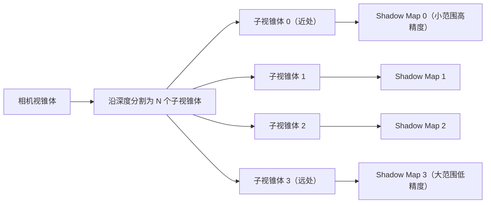

# Phase R18：Cascaded Shadow Maps（级联阴影）

## 目录

- [一、概述](#一概述)
  - [1.1 当前问题](#11-当前问题)
  - [1.2 CSM 解决的问题](#12-csm-解决的问题)
  - [1.3 设计目标](#13-设计目标)
  - [1.4 前置依赖](#14-前置依赖)
- [二、CSM 原理](#二csm-原理)
  - [2.1 核心思想](#21-核心思想)
  - [2.2 与基础 Shadow Map 的对比](#22-与基础-shadow-map-的对比)
  - [2.3 主流引擎的 CSM 实现参考](#23-主流引擎的-csm-实现参考)
- [三、视锥体分割算法](#三视锥体分割算法)
  - [3.1 方案 A：Uniform 均匀分割](#31-方案-a-uniform-均匀分割)
  - [3.2 方案 B：Logarithmic 对数分割](#32-方案-b-logarithmic-对数分割)
  - [3.3 方案 C：Practical Split（PSSM）](#33-方案-c-practical-splitpssm)
  - [3.4 方案 D：手动分割（固定比例）](#34-方案-d-手动分割固定比例)
  - [3.5 方案推荐](#35-方案推荐)
- [四、级联数量选择](#四级联数量选择)
  - [4.1 方案对比](#41-方案对比)
  - [4.2 方案推荐](#42-方案推荐)
- [五、Shadow Map 存储方案](#五shadow-map-存储方案)
  - [5.1 方案 A：多个独立 FBO](#51-方案-a-多个独立-fbo)
  - [5.2 方案 B：Texture2DArray](#52-方案-b-texture2darray)
  - [5.3 方案 C：Shadow Atlas（图集）](#53-方案-c-shadow-atlas图集)
  - [5.4 方案推荐](#54-方案推荐)
- [六、数据结构设计](#六数据结构设计)
  - [6.1 DirectionalLightComponent 扩展](#61-directionallightcomponent-扩展)
  - [6.2 SceneLightData 扩展](#62-scenelightdata-扩展)
  - [6.3 Renderer3DData 扩展](#63-renderer3ddata-扩展)
  - [6.4 RenderContext 扩展](#64-rendercontext-扩展)
- [七、CPU 端实现](#七cpu-端实现)
  - [7.1 视锥体分割计算](#71-视锥体分割计算)
  - [7.2 每级正交投影范围计算](#72-每级正交投影范围计算)
  - [7.3 Light Space Matrix 计算](#73-light-space-matrix-计算)
  - [7.4 BeginScene 修改](#74-beginscene-修改)
- [八、ShadowPass 修改](#八shadowpass-修改)
  - [8.1 方案 A：多 FBO 循环渲染](#81-方案-a-多-fbo-循环渲染)
  - [8.2 方案 B：Texture2DArray + glFramebufferTextureLayer](#82-方案-b-texture2darray--glframebuffertexturelayer)
  - [8.3 方案推荐](#83-方案推荐)
- [九、OpaquePass 修改](#九opaquepass-修改)
- [十、Shader 修改](#十shader-修改)
  - [10.1 Shadow.glsl 修改](#101-shadowglsl-修改)
  - [10.2 Lighting.glsl 修改](#102-lightingglsl-修改)
  - [10.3 Standard.vert 修改（无需修改）](#103-standardvert-修改无需修改)
- [十一、级联之间的过渡策略](#十一级联之间的过渡策略)
  - [11.1 方案 A：硬切换（无过渡）](#111-方案-a-硬切换无过渡)
  - [11.2 方案 B：线性混合过渡](#112-方案-b-线性混合过渡)
  - [11.3 方案推荐](#113-方案推荐)
- [十二、Shadow Map 稳定性（Shimmer 消除）](#十二shadow-map-稳定性shimmer-消除)
  - [12.1 问题描述](#121-问题描述)
  - [12.2 解决方案：Texel Snapping](#122-解决方案-texel-snapping)
- [十三、Inspector UI 设计](#十三inspector-ui-设计)
- [十四、序列化](#十四序列化)
- [十五、调试可视化](#十五调试可视化)
- [十六、Framebuffer 扩展（如选择 Texture2DArray 方案）](#十六framebuffer-扩展如选择-texture2darray-方案)
- [十七、EditorCamera 接口扩展](#十七editorcamera-接口扩展)
- [十八、涉及的文件清单](#十八涉及的文件清单)
- [十九、分步实施策略](#十九分步实施策略)
- [二十、验证清单](#二十验证清单)
- [二十一、已知限制与后续优化](#二十一已知限制与后续优化)

---

## 一、概述

### 1.1 当前问题

当前阴影系统（Phase R4）使用**单张固定范围的 Shadow Map**，存在以下问题：

```
当前实现（Renderer3D.cpp - BeginScene）：
  const float orthoSize = 20.0f;    // 固定正交投影范围
  const float nearPlane = -30.0f;
  const float farPlane = 30.0f;
  glm::mat4 lightProjection = glm::ortho(-orthoSize, orthoSize, -orthoSize, orthoSize, nearPlane, farPlane);
```

| 问题 | 影响 |
|------|------|
| **固定正交投影范围（±20）** | 超出 20 单位范围的物体没有阴影 |
| **单张 2048×2048 Shadow Map** | 2048 个纹素覆盖 40×40 的世界空间 = 每纹素 ~2cm，近处阴影锯齿严重 |
| **光源位置固定看向原点** | `lightPos = -lightDir * 15.0f`，`lookAt(lightPos, vec3(0.0f), ...)`，相机移动后阴影不跟随 |
| **Shadow Map 精度浪费** | 远处物体和近处物体共享同一张 Shadow Map，远处不需要高精度但占用了纹素 |

### 1.2 CSM 解决的问题

CSM（Cascaded Shadow Maps，级联阴影贴图）将相机视锥体沿深度方向分割为多个子区间（级联），每个级联使用独立的 Shadow Map，**近处级联覆盖范围小但精度高，远处级联覆盖范围大但精度低**。

```
单张 Shadow Map：
┌─────────────────────────────────────────┐
│  2048×2048 纹素覆盖 40×40 世界空间       │
│  近处和远处精度相同 → 近处锯齿严重        │
└─────────────────────────────────────────┘

CSM（4 级联）：
┌──────────┬──────────┬──────────┬──────────┐
│ Cascade 0│ Cascade 1│ Cascade 2│ Cascade 3│
│ 2048×2048│ 2048×2048│ 2048×2048│ 2048×2048│
│ 覆盖 5m  │ 覆盖 15m │ 覆盖 50m │ 覆盖 150m│
│ 高精度   │ 中精度   │ 低精度   │ 极低精度 │
└──────────┴──────────┴──────────┴──────────┘
近处精度提升 ~8 倍，远处仍有阴影覆盖
```

### 1.3 设计目标

1. ? 方向光阴影覆盖整个相机视锥体（不再受固定 ±20 范围限制）
2. ? 近处阴影精度显著提升（减少锯齿）
3. ? 阴影跟随相机移动（不再固定看向原点）
4. ? 级联数量可配置（Inspector UI 可调）
5. ? 与现有 Hard/Soft 阴影模式兼容
6. ? 向后兼容：不破坏现有的 Shader #include 架构（R16）
7. ? 序列化支持

### 1.4 前置依赖

| 依赖 | 状态 | 说明 |
|------|------|------|
| Phase R4 阴影系统 | ? 已完成 | ShadowPass、Shadow.glsl、OpaquePass 阴影注入 |
| Phase R7 多 Pass 渲染 | ? 已完成 | RenderPipeline、RenderPass、RenderContext |
| Phase R16 Shader 架构重构 | ? 已完成 | #include 预处理器、Shadow.glsl/Lighting.glsl/Common.glsl 函数库 |
| EditorCamera 视锥体参数 | ? 已有 | FOV、Near、Far、ViewMatrix、AspectRatio |

---

## 二、CSM 原理

### 2.1 核心思想



**CSM 的核心流程**：

1. **分割视锥体**：将相机的 Near~Far 范围按某种算法分割为 N 个子区间
2. **计算每级的正交投影**：对每个子视锥体，计算其在光源空间的 AABB，作为该级 Shadow Map 的正交投影范围
3. **渲染 N 张 Shadow Map**：每级使用独立的 Light Space Matrix 渲染深度
4. **片段着色器中选择级联**：根据片段的深度（到相机的距离），选择对应的级联进行阴影采样

### 2.2 与基础 Shadow Map 的对比

| 方面 | 基础 Shadow Map（当前） | CSM |
|------|----------------------|-----|
| Shadow Map 数量 | 1 张 | N 张（通常 2~4） |
| 正交投影范围 | 固定（±20） | 每级动态计算（跟随相机视锥体） |
| 近处精度 | 低（与远处共享） | 高（独立的小范围 Shadow Map） |
| 远处覆盖 | 有限（超出范围无阴影） | 完整（覆盖整个视锥体） |
| 相机跟随 | ? 固定看向原点 | ? 跟随相机视锥体 |
| 渲染开销 | 1 次 Shadow Pass | N 次 Shadow Pass |
| 实现复杂度 | 低 | 中~高 |

### 2.3 主流引擎的 CSM 实现参考

| 引擎 | 默认级联数 | 分割算法 | Shadow Map 存储 | 过渡策略 |
|------|-----------|---------|----------------|---------|
| **Unity URP** | 4 | 手动比例（Inspector 可调） | Texture2DArray | 无过渡（硬切换） |
| **Unity HDRP** | 4 | 手动比例 | Shadow Atlas | 线性混合 |
| **Unreal Engine** | 3~5 | 指数分割 | Shadow Atlas | 级联间混合 |
| **Godot 4** | 2 或 4 | 手动比例 | Texture2DArray | 可选混合 |
| **Filament** | 4 | Practical Split | Texture2DArray | 无过渡 |

---

## 三、视锥体分割算法

视锥体分割是 CSM 的核心算法，决定了每个级联覆盖的深度范围。

设相机近平面为 `n`，远平面为 `f`，级联数为 `N`，第 `i` 个级联的远平面为 `C_i`。

### 3.1 方案 A：Uniform 均匀分割

```
C_i = n + (f - n) * (i / N)
```

**示例**（n=0.01, f=150, N=4）：

| 级联 | 近 | 远 | 范围 |
|------|----|----|------|
| 0 | 0.01 | 37.5 | 37.5 |
| 1 | 37.5 | 75.0 | 37.5 |
| 2 | 75.0 | 112.5 | 37.5 |
| 3 | 112.5 | 150.0 | 37.5 |

**优点**：
- 实现最简单

**缺点**：
- ? 近处级联范围过大（37.5m），精度不够
- ? 远处级联范围与近处相同，浪费精度
- ? 不符合人眼感知（近处需要更高精度）

### 3.2 方案 B：Logarithmic 对数分割

```
C_i = n * (f / n) ^ (i / N)
```

**示例**（n=0.01, f=150, N=4）：

| 级联 | 近 | 远 | 范围 |
|------|----|----|------|
| 0 | 0.01 | 0.11 | 0.10 |
| 1 | 0.11 | 1.22 | 1.11 |
| 2 | 1.22 | 13.4 | 12.2 |
| 3 | 13.4 | 150.0 | 136.6 |

**优点**：
- 近处级联范围极小，精度极高
- 数学上最优的精度分配

**缺点**：
- ? 当 `n` 很小时（如 0.01），第一个级联范围过小（0.1m），几乎无用
- ? 最后一个级联范围过大（136m），精度极低
- ? 对 Near Plane 值非常敏感

### 3.3 方案 C：Practical Split（PSSM）

**Practical Split Scheme**（GPU Gems 3 提出）是 Uniform 和 Logarithmic 的加权混合：

```
C_log_i = n * (f / n) ^ (i / N)
C_uni_i = n + (f - n) * (i / N)
C_i = lambda * C_log_i + (1 - lambda) * C_uni_i
```

其中 `lambda ∈ [0, 1]` 控制混合比例：
- `lambda = 0`：纯 Uniform
- `lambda = 1`：纯 Logarithmic
- `lambda = 0.5`：均衡混合（常用默认值）

**示例**（n=0.01, f=150, N=4, lambda=0.5）：

| 级联 | 近 | 远 | 范围 |
|------|----|----|------|
| 0 | 0.01 | 18.8 | 18.8 |
| 1 | 18.8 | 38.1 | 19.3 |
| 2 | 38.1 | 62.9 | 24.8 |
| 3 | 62.9 | 150.0 | 87.1 |

**优点**：
- ? 平衡了近处精度和远处覆盖
- ? `lambda` 参数可调，灵活性高
- ? 业界广泛使用（Filament、部分 Unity 配置）

**缺点**：
- 需要额外的 `lambda` 参数
- 对用户来说不够直观

### 3.4 方案 D：手动分割（固定比例）

用户直接指定每个级联的远平面距离（或占总距离的百分比）：

```cpp
// 方式 1：百分比（Unity URP 风格）
float cascadeSplits[4] = { 0.067f, 0.2f, 0.467f, 1.0f };
// C_i = n + (f - n) * cascadeSplits[i]

// 方式 2：绝对距离
float cascadeDistances[4] = { 10.0f, 30.0f, 70.0f, 150.0f };
```

**示例**（n=0.01, f=150, 比例 6.7%/20%/46.7%/100%）：

| 级联 | 近 | 远 | 范围 |
|------|----|----|------|
| 0 | 0.01 | 10.0 | 10.0 |
| 1 | 10.0 | 30.0 | 20.0 |
| 2 | 30.0 | 70.0 | 40.0 |
| 3 | 70.0 | 150.0 | 80.0 |

**优点**：
- ? 最直观，用户完全控制
- ? 可以针对具体场景精细调优
- ? Unity URP 的默认方式，用户熟悉

**缺点**：
- 需要用户手动调整
- 不同场景可能需要不同的分割比例

### 3.5 方案推荐

| 方案 | 实现复杂度 | 灵活性 | 直观性 | 推荐度 |
|------|-----------|--------|--------|--------|
| A：Uniform | ? 最低 | 低 | 高 | ? 不推荐 |
| B：Logarithmic | ?? 低 | 低 | 低 | ? 不推荐 |
| **C：Practical Split** | ?? 低 | 高 | 中 | ?? 其次 |
| **D：手动分割** | ? 最低 | 最高 | 最高 | ??? **最优（推荐）** |

**推荐方案 D（手动分割）**，理由：
1. 实现最简单，不需要复杂的数学公式
2. 用户完全可控，Inspector 中直接拖动滑块调整每级的距离
3. 与 Unity URP 一致，用户熟悉
4. 可以提供一组合理的默认值，大多数场景无需调整
5. 如果后续需要自动分割，可以在此基础上添加 Practical Split 作为"自动"模式

**默认分割比例**（参考 Unity URP）：

```cpp
// 4 级联默认比例（占 Shadow Distance 的百分比）
float cascadeSplits[4] = { 0.067f, 0.2f, 0.467f, 1.0f };
// 假设 Shadow Distance = 150m：
// Cascade 0: 0 ~ 10m
// Cascade 1: 10 ~ 30m
// Cascade 2: 30 ~ 70m
// Cascade 3: 70 ~ 150m
```

---

## 四、级联数量选择

### 4.1 方案对比

| 级联数 | 渲染开销 | 阴影质量 | 内存占用（20482） | 适用场景 |
|--------|---------|---------|------------------|---------|
| **1** | 1× Shadow Pass | 与当前相同 | 16 MB | 小场景、低端设备 |
| **2** | 2× Shadow Pass | 中等提升 | 32 MB | 中等场景 |
| **3** | 3× Shadow Pass | 显著提升 | 48 MB | 大多数场景 |
| **4** | 4× Shadow Pass | 最佳质量 | 64 MB | 大场景、高端设备 |

> 内存计算：2048 × 2048 × 4 bytes（32-bit depth）= 16 MB / 张

### 4.2 方案推荐

**推荐默认 4 级联**，理由：
1. 与 Unity URP/HDRP 默认值一致
2. 4 次 Shadow Pass 的开销在现代 GPU 上可以接受
3. 提供 Inspector UI 让用户可以降低到 1~3 级联
4. 代码中使用 `MAX_CASCADE_COUNT = 4` 常量，Shader 中使用 `#define` 对应

---

## 五、Shadow Map 存储方案

### 5.1 方案 A：多个独立 FBO

每个级联使用一个独立的 `Framebuffer`（与当前 ShadowPass 的 FBO 结构相同）。

```cpp
// ShadowPass 中
Ref<Framebuffer> m_CascadeFBOs[MAX_CASCADE_COUNT];  // 每级一个 FBO

// 渲染时
for (int i = 0; i < cascadeCount; ++i)
{
    m_CascadeFBOs[i]->Bind();
    // 渲染该级联的深度...
    m_CascadeFBOs[i]->Unbind();
}

// OpaquePass 中绑定纹理
for (int i = 0; i < cascadeCount; ++i)
{
    RenderCommand::BindTextureUnit(15 - i, m_CascadeFBOs[i]->GetDepthAttachmentRendererID());
}
```

**Shader 中**：
```glsl
uniform sampler2D u_ShadowMap0;  // 级联 0
uniform sampler2D u_ShadowMap1;  // 级联 1
uniform sampler2D u_ShadowMap2;  // 级联 2
uniform sampler2D u_ShadowMap3;  // 级联 3
```

**优点**：
- ? **不需要修改 Framebuffer 类**，完全复用现有代码
- ? 实现最简单，与当前架构完全兼容
- ? 每个 FBO 可以有不同的分辨率（如近处级联更高分辨率）

**缺点**：
- ? 占用多个纹理单元（4 级联占用 4 个纹理单元）
- ? Shader 中需要多个 `sampler2D` uniform
- ? FBO 切换开销（每级联一次 Bind/Unbind）

### 5.2 方案 B：Texture2DArray

使用 OpenGL 的 `GL_TEXTURE_2D_ARRAY`，所有级联共享一个纹理对象的不同层。

```cpp
// 创建 Texture2DArray
GLuint shadowMapArray;
glGenTextures(1, &shadowMapArray);
glBindTexture(GL_TEXTURE_2D_ARRAY, shadowMapArray);
glTexImage3D(GL_TEXTURE_2D_ARRAY, 0, GL_DEPTH_COMPONENT24,
             resolution, resolution, cascadeCount,
             0, GL_DEPTH_COMPONENT, GL_FLOAT, nullptr);

// 渲染时：将每层绑定到 FBO
glFramebufferTextureLayer(GL_FRAMEBUFFER, GL_DEPTH_ATTACHMENT, shadowMapArray, 0, cascadeIndex);
```

**Shader 中**：
```glsl
uniform sampler2DArray u_ShadowMapArray;  // 一个 uniform 包含所有级联

// 采样
float depth = texture(u_ShadowMapArray, vec3(uv, cascadeIndex)).r;
```

**优点**：
- ? 只占用 1 个纹理单元
- ? Shader 中只需 1 个 `sampler2DArray` uniform
- ? GPU 缓存友好（连续内存布局）
- ? 业界标准做法（Unity、Godot、Filament 均使用）

**缺点**：
- ? **需要扩展 Framebuffer 类**（支持 Texture2DArray 创建和 `glFramebufferTextureLayer`）
- ? 所有层必须相同分辨率
- ? 实现复杂度较高

### 5.3 方案 C：Shadow Atlas（图集）

将所有级联的 Shadow Map 打包到一张大纹理中（如 4096×4096 分为 4 个 2048×2048 区域）。

```
┌──────────┬──────────┐
│ Cascade 0│ Cascade 1│
│ 2048×2048│ 2048×2048│
├──────────┼──────────┤
│ Cascade 2│ Cascade 3│
│ 2048×2048│ 2048×2048│
└──────────┴──────────┘
     4096 × 4096
```

**优点**：
- ? 只需 1 个 FBO + 1 个纹理
- ? 不需要 Texture2DArray 支持
- ? 可以为不同级联分配不同大小的区域

**缺点**：
- ? 需要管理 Viewport 偏移（每级联渲染到不同区域）
- ? Shader 中需要额外的 UV 偏移计算
- ? 纹理尺寸可能超出硬件限制（4 × 2048 = 4096，还可以接受）
- ? 边界处可能有采样泄漏

### 5.4 方案推荐

| 方案 | 实现复杂度 | 纹理单元占用 | Framebuffer 改动 | 推荐度 |
|------|-----------|-------------|-----------------|--------|
| **A：多个独立 FBO** | ? 最低 | 4 个 | 无 | ??? **最优（推荐）** |
| B：Texture2DArray | ??? 高 | 1 个 | 需要扩展 | ?? 其次 |
| C：Shadow Atlas | ?? 中 | 1 个 | 无 | ? 不推荐 |

**推荐方案 A（多个独立 FBO）**，理由：
1. **不需要修改 Framebuffer 类**，完全复用现有的 `DEPTH_COMPONENT` FBO
2. 实现最简单，与当前 ShadowPass 架构一致（只是从 1 个 FBO 变为 N 个）
3. 纹理单元占用 4 个（15、14、13、12），当前材质纹理使用 0~7，不会冲突
4. 每个 FBO 可以独立 Resize（后续可以为近处级联使用更高分辨率）
5. 方案 B 作为远期优化方向（当纹理单元紧张时再迁移）

---

## 六、数据结构设计

### 6.1 DirectionalLightComponent 扩展

```cpp
// Lucky/Source/Lucky/Scene/Components/DirectionalLightComponent.h

/// <summary>
/// 阴影类型
/// </summary>
enum class ShadowType : uint8_t
{
    None = 0,       // 不投射阴影
    Hard,           // 硬阴影（无 PCF）
    Soft            // 软阴影（PCF 3×3）
};

/// <summary>
/// 方向光组件
/// </summary>
struct DirectionalLightComponent
{
    glm::vec3 Color = glm::vec3(1.0f, 1.0f, 1.0f);
    float Intensity = 1.0f;

    // ---- 阴影属性（R4 已实现） ----
    ShadowType Shadows = ShadowType::Hard;
    float ShadowBias = 0.0003f;
    float ShadowStrength = 1.0f;

    // ---- CSM 属性（R18 新增） ----
    int CascadeCount = 4;                                       // 级联数量 [1, 4]
    float ShadowDistance = 150.0f;                              // 阴影最大距离（替代固定 orthoSize）
    float CascadeSplits[4] = { 0.067f, 0.2f, 0.467f, 1.0f };  // 级联分割比例（占 ShadowDistance 的百分比）
    int ShadowMapResolution = 2048;                             // 每级 Shadow Map 分辨率

    DirectionalLightComponent() = default;
    DirectionalLightComponent(const DirectionalLightComponent& other) = default;
    DirectionalLightComponent(const glm::vec3& color, float intensity)
        : Color(color), Intensity(intensity) {}
};
```

**新增字段说明**：

| 字段 | 类型 | 默认值 | 说明 |
|------|------|--------|------|
| `CascadeCount` | int | 4 | 级联数量，范围 [1, 4] |
| `ShadowDistance` | float | 150.0f | 阴影最大距离（世界空间单位），替代原来的固定 `orthoSize` |
| `CascadeSplits[4]` | float[4] | {0.067, 0.2, 0.467, 1.0} | 每级的分割比例，`CascadeSplits[i]` 表示第 i 级的远平面占 `ShadowDistance` 的百分比 |
| `ShadowMapResolution` | int | 2048 | 每级 Shadow Map 的分辨率 |

### 6.2 SceneLightData 扩展

```cpp
// Lucky/Source/Lucky/Renderer/Renderer3D.h

constexpr static int MAX_CASCADE_COUNT = 4;  // 最大级联数

struct SceneLightData
{
    // ... 现有字段不变 ...

    // ---- 阴影参数（CPU 端传递） ----
    ShadowType DirLightShadowType = ShadowType::None;
    float DirLightShadowBias = 0.005f;
    float DirLightShadowStrength = 1.0f;

    // ---- CSM 参数（R18 新增） ----
    int CascadeCount = 4;
    float ShadowDistance = 150.0f;
    float CascadeSplits[MAX_CASCADE_COUNT] = { 0.067f, 0.2f, 0.467f, 1.0f };
    int ShadowMapResolution = 2048;
};
```

### 6.3 Renderer3DData 扩展

```cpp
// Lucky/Source/Lucky/Renderer/Renderer3D.cpp（内部结构）

struct Renderer3DData
{
    // ... 现有字段不变 ...

    // ======== 阴影数据（替换原有单矩阵） ========
    bool ShadowEnabled = false;
    float ShadowBias = 0.005f;
    float ShadowStrength = 1.0f;
    ShadowType ShadowShadowType = ShadowType::None;

    // ---- CSM 数据（R18 新增，替换原有 LightSpaceMatrix） ----
    int CascadeCount = 4;
    glm::mat4 CascadeLightSpaceMatrices[MAX_CASCADE_COUNT];     // 每级的 Light Space Matrix
    float CascadeFarPlanes[MAX_CASCADE_COUNT];                   // 每级的远平面距离（视图空间）
    int ShadowMapResolution = 2048;
};
```

### 6.4 RenderContext 扩展

```cpp
// Lucky/Source/Lucky/Renderer/RenderContext.h

struct RenderContext
{
    // ... 现有字段不变 ...

    // ---- 阴影数据（修改） ----
    bool ShadowEnabled = false;
    float ShadowBias = 0.005f;
    float ShadowStrength = 1.0f;
    ShadowType ShadowShadowType = ShadowType::None;

    // ---- CSM 数据（R18 新增，替换原有单个 LightSpaceMatrix） ----
    int CascadeCount = 4;
    glm::mat4 CascadeLightSpaceMatrices[MAX_CASCADE_COUNT];     // 每级 Light Space Matrix
    float CascadeFarPlanes[MAX_CASCADE_COUNT];                   // 每级远平面距离（视图空间 z 值）
    uint32_t CascadeShadowMapTextureIDs[MAX_CASCADE_COUNT];     // 每级 Shadow Map 纹理 ID
    int ShadowMapResolution = 2048;

    // ---- 相机数据（CSM 需要，R18 新增） ----
    glm::mat4 CameraViewMatrix = glm::mat4(1.0f);               // 相机视图矩阵（用于计算片段的视图空间深度）

    // 兼容性：保留原有字段（标记为废弃，过渡期使用）
    // glm::mat4 LightSpaceMatrix = glm::mat4(1.0f);   // → 替换为 CascadeLightSpaceMatrices[0]
    // uint32_t ShadowMapTextureID = 0;                 // → 替换为 CascadeShadowMapTextureIDs[0]
};
```

> **注意**：原有的 `LightSpaceMatrix` 和 `ShadowMapTextureID` 字段将被移除，由 CSM 数组替代。当 `CascadeCount == 1` 时，行为与原来完全一致（只使用第 0 级）。

---

## 七、CPU 端实现

### 7.1 视锥体分割计算

```cpp
/// <summary>
/// 计算级联分割的远平面距离（视图空间）
/// </summary>
/// <param name="cameraNear">相机近平面</param>
/// <param name="shadowDistance">阴影最大距离</param>
/// <param name="cascadeCount">级联数量</param>
/// <param name="splits">分割比例数组</param>
/// <param name="outFarPlanes">输出：每级远平面距离</param>
static void CalculateCascadeSplitDistances(
    float cameraNear,
    float shadowDistance,
    int cascadeCount,
    const float splits[],
    float outFarPlanes[])
{
    for (int i = 0; i < cascadeCount; ++i)
    {
        outFarPlanes[i] = cameraNear + shadowDistance * splits[i];
    }
}
```

**示例**（cameraNear=0.01, shadowDistance=150, splits={0.067, 0.2, 0.467, 1.0}）：

| 级联 | 近平面 | 远平面 | 范围 |
|------|--------|--------|------|
| 0 | 0.01 | 10.06 | 10.05 |
| 1 | 10.06 | 30.01 | 19.95 |
| 2 | 30.01 | 70.06 | 40.05 |
| 3 | 70.06 | 150.01 | 79.95 |

### 7.2 每级正交投影范围计算

每个级联需要计算其在光源空间的 AABB（Axis-Aligned Bounding Box），作为正交投影的范围。

**算法步骤**：

1. 根据相机的 FOV、AspectRatio、Near/Far 计算子视锥体的 8 个角点（世界空间）
2. 将 8 个角点变换到光源空间（乘以光源的 View Matrix）
3. 计算光源空间的 AABB（min/max xyz）
4. 使用 AABB 构建正交投影矩阵

```cpp
/// <summary>
/// 计算子视锥体的 8 个角点（世界空间）
/// </summary>
/// <param name="cameraInvVP">相机 (ViewProjection)^-1 矩阵</param>
/// <param name="nearDist">子视锥体近平面距离</param>
/// <param name="farDist">子视锥体远平面距离</param>
/// <param name="cameraNear">相机原始近平面</param>
/// <param name="cameraFar">相机原始远平面</param>
/// <returns>8 个角点（世界空间）</returns>
static std::array<glm::vec3, 8> GetFrustumCornersWorldSpace(
    const glm::mat4& cameraViewMatrix,
    float fov, float aspectRatio,
    float nearDist, float farDist)
{
    // 计算子视锥体的投影矩阵
    glm::mat4 subProjection = glm::perspective(glm::radians(fov), aspectRatio, nearDist, farDist);
    glm::mat4 invVP = glm::inverse(subProjection * cameraViewMatrix);

    // NDC 空间的 8 个角点
    std::array<glm::vec3, 8> corners;
    int index = 0;
    for (int x = 0; x <= 1; ++x)
    {
        for (int y = 0; y <= 1; ++y)
        {
            for (int z = 0; z <= 1; ++z)
            {
                glm::vec4 pt = invVP * glm::vec4(
                    2.0f * x - 1.0f,
                    2.0f * y - 1.0f,
                    2.0f * z - 1.0f,
                    1.0f
                );
                corners[index++] = glm::vec3(pt) / pt.w;
            }
        }
    }
    return corners;
}
```

### 7.3 Light Space Matrix 计算

```cpp
/// <summary>
/// 计算单个级联的 Light Space Matrix
/// </summary>
/// <param name="frustumCorners">子视锥体的 8 个角点（世界空间）</param>
/// <param name="lightDir">光照方向（归一化）</param>
/// <returns>Light Space Matrix（正交投影 × 光源视图）</returns>
static glm::mat4 CalculateCascadeLightSpaceMatrix(
    const std::array<glm::vec3, 8>& frustumCorners,
    const glm::vec3& lightDir)
{
    // 1. 计算子视锥体的中心点
    glm::vec3 center(0.0f);
    for (const auto& corner : frustumCorners)
    {
        center += corner;
    }
    center /= 8.0f;

    // 2. 构建光源视图矩阵（从光源方向看向子视锥体中心）
    glm::vec3 lightPos = center - lightDir * 50.0f;  // 沿光照反方向偏移
    glm::mat4 lightView = glm::lookAt(lightPos, center, glm::vec3(0.0f, 1.0f, 0.0f));

    // 3. 将 8 个角点变换到光源空间，计算 AABB
    float minX = std::numeric_limits<float>::max();
    float maxX = std::numeric_limits<float>::lowest();
    float minY = std::numeric_limits<float>::max();
    float maxY = std::numeric_limits<float>::lowest();
    float minZ = std::numeric_limits<float>::max();
    float maxZ = std::numeric_limits<float>::lowest();

    for (const auto& corner : frustumCorners)
    {
        glm::vec4 lightSpaceCorner = lightView * glm::vec4(corner, 1.0f);
        minX = std::min(minX, lightSpaceCorner.x);
        maxX = std::max(maxX, lightSpaceCorner.x);
        minY = std::min(minY, lightSpaceCorner.y);
        maxY = std::max(maxY, lightSpaceCorner.y);
        minZ = std::min(minZ, lightSpaceCorner.z);
        maxZ = std::max(maxZ, lightSpaceCorner.z);
    }

    // 4. 扩展 Z 范围（确保光源"背后"的物体也能投射阴影）
    // 这个偏移量需要足够大，以捕获视锥体外但仍能投射阴影的物体
    const float zMultiplier = 10.0f;
    if (minZ < 0)
    {
        minZ *= zMultiplier;
    }
    else
    {
        minZ /= zMultiplier;
    }
    if (maxZ < 0)
    {
        maxZ /= zMultiplier;
    }
    else
    {
        maxZ *= zMultiplier;
    }

    // 5. 构建正交投影矩阵
    glm::mat4 lightProjection = glm::ortho(minX, maxX, minY, maxY, minZ, maxZ);

    return lightProjection * lightView;
}
```

### 7.4 BeginScene 修改

```cpp
void Renderer3D::BeginScene(const EditorCamera& camera, const SceneLightData& lightData)
{
    // ... 现有的 Camera UBO 和 Light UBO 设置不变 ...

    // ======== CSM 计算（替换原有的固定 orthoSize 计算） ========
    s_Data.ShadowEnabled = false;
    if (lightData.DirectionalLightCount > 0 && lightData.DirLightShadowType != ShadowType::None)
    {
        s_Data.ShadowEnabled = true;
        s_Data.ShadowBias = lightData.DirLightShadowBias;
        s_Data.ShadowStrength = lightData.DirLightShadowStrength;
        s_Data.ShadowShadowType = lightData.DirLightShadowType;
        s_Data.CascadeCount = lightData.CascadeCount;
        s_Data.ShadowMapResolution = lightData.ShadowMapResolution;

        glm::vec3 lightDir = glm::normalize(lightData.DirectionalLights[0].Direction);

        // 计算每级的远平面距离
        float cascadeNearPlanes[MAX_CASCADE_COUNT];
        float cascadeFarPlanes[MAX_CASCADE_COUNT];
        
        float cameraNear = camera.GetNear();  // 需要 EditorCamera 暴露此接口
        
        for (int i = 0; i < s_Data.CascadeCount; ++i)
        {
            cascadeNearPlanes[i] = (i == 0) ? cameraNear : cascadeFarPlanes[i - 1];
            cascadeFarPlanes[i] = cameraNear + lightData.ShadowDistance * lightData.CascadeSplits[i];
            s_Data.CascadeFarPlanes[i] = cascadeFarPlanes[i];
        }

        // 计算每级的 Light Space Matrix
        for (int i = 0; i < s_Data.CascadeCount; ++i)
        {
            auto corners = GetFrustumCornersWorldSpace(
                camera.GetViewMatrix(),
                camera.GetFOV(),        // 需要 EditorCamera 暴露此接口
                camera.GetAspectRatio(), // 需要 EditorCamera 暴露此接口
                cascadeNearPlanes[i],
                cascadeFarPlanes[i]
            );

            s_Data.CascadeLightSpaceMatrices[i] = CalculateCascadeLightSpaceMatrix(corners, lightDir);
        }
    }

    // ... 其余代码不变 ...
}
```

---

## 八、ShadowPass 修改

### 8.1 方案 A：多 FBO 循环渲染

```cpp
// Lucky/Source/Lucky/Renderer/Passes/ShadowPass.h

class ShadowPass : public RenderPass
{
public:
    void Init() override;
    void Execute(const RenderContext& context) override;
    void Resize(uint32_t width, uint32_t height) override;
    const std::string& GetName() const override { static std::string name = "ShadowPass"; return name; }
    const std::string& GetGroup() const override { static std::string group = "Shadow"; return group; }

    /// <summary>
    /// 获取指定级联的 Shadow Map 纹理 ID
    /// </summary>
    uint32_t GetShadowMapTextureID(int cascadeIndex) const;

private:
    Ref<Framebuffer> m_CascadeFBOs[MAX_CASCADE_COUNT];  // 每级一个 FBO
    Ref<Shader> m_ShadowShader;
    uint32_t m_ShadowMapResolution = 2048;
};
```

```cpp
// Lucky/Source/Lucky/Renderer/Passes/ShadowPass.cpp

void ShadowPass::Init()
{
    m_ShadowShader = Renderer3D::GetShaderLibrary()->Get("Shadow");

    // 创建每级的 Shadow Map FBO
    for (int i = 0; i < MAX_CASCADE_COUNT; ++i)
    {
        FramebufferSpecification spec;
        spec.Width = m_ShadowMapResolution;
        spec.Height = m_ShadowMapResolution;
        spec.Attachments = { FramebufferTextureFormat::DEPTH_COMPONENT };
        m_CascadeFBOs[i] = Framebuffer::Create(spec);
    }
}

void ShadowPass::Execute(const RenderContext& context)
{
    if (!context.ShadowEnabled || !context.OpaqueDrawCommands || context.OpaqueDrawCommands->empty())
    {
        return;
    }

    // 获取实际分辨率（可能被组件修改）
    uint32_t resolution = static_cast<uint32_t>(context.ShadowMapResolution);

    // 设置渲染状态
    RenderCommand::SetCullMode(CullMode::Off);
    m_ShadowShader->Bind();

    // 逐级联渲染
    for (int cascade = 0; cascade < context.CascadeCount; ++cascade)
    {
        // 检查 FBO 分辨率是否需要更新
        const auto& spec = m_CascadeFBOs[cascade]->GetSpecification();
        if (spec.Width != resolution || spec.Height != resolution)
        {
            m_CascadeFBOs[cascade]->Resize(resolution, resolution);
        }

        // 绑定该级联的 FBO
        m_CascadeFBOs[cascade]->Bind();
        RenderCommand::SetViewport(0, 0, resolution, resolution);
        RenderCommand::Clear();

        // 设置该级联的 Light Space Matrix
        m_ShadowShader->SetMat4("u_LightSpaceMatrix", context.CascadeLightSpaceMatrices[cascade]);

        // 遍历 DrawCommand 列表
        for (const DrawCommand& cmd : *context.OpaqueDrawCommands)
        {
            m_ShadowShader->SetMat4("u_ObjectToWorldMatrix", cmd.Transform);
            RenderCommand::DrawIndexedRange(
                cmd.MeshData->GetVertexArray(),
                cmd.SubMeshPtr->IndexOffset,
                cmd.SubMeshPtr->IndexCount
            );
        }

        m_CascadeFBOs[cascade]->Unbind();
    }

    // 恢复渲染状态
    RenderCommand::SetCullMode(CullMode::Back);

    // 恢复主 FBO
    if (context.TargetFramebuffer)
    {
        context.TargetFramebuffer->Bind();
        const auto& spec = context.TargetFramebuffer->GetSpecification();
        RenderCommand::SetViewport(0, 0, spec.Width, spec.Height);
    }
}

uint32_t ShadowPass::GetShadowMapTextureID(int cascadeIndex) const
{
    if (cascadeIndex < 0 || cascadeIndex >= MAX_CASCADE_COUNT)
        return 0;
    return m_CascadeFBOs[cascadeIndex]->GetDepthAttachmentRendererID();
}
```

### 8.2 方案 B：Texture2DArray + glFramebufferTextureLayer

```cpp
// 需要扩展 Framebuffer 类或直接使用原生 OpenGL

class ShadowPass : public RenderPass
{
private:
    uint32_t m_ShadowMapArrayID = 0;    // GL_TEXTURE_2D_ARRAY
    uint32_t m_ShadowFBO = 0;           // 共享 FBO
    Ref<Shader> m_ShadowShader;
    uint32_t m_ShadowMapResolution = 2048;
};

void ShadowPass::Init()
{
    m_ShadowShader = Renderer3D::GetShaderLibrary()->Get("Shadow");

    // 创建 Texture2DArray
    glGenTextures(1, &m_ShadowMapArrayID);
    glBindTexture(GL_TEXTURE_2D_ARRAY, m_ShadowMapArrayID);
    glTexImage3D(GL_TEXTURE_2D_ARRAY, 0, GL_DEPTH_COMPONENT24,
                 m_ShadowMapResolution, m_ShadowMapResolution, MAX_CASCADE_COUNT,
                 0, GL_DEPTH_COMPONENT, GL_FLOAT, nullptr);
    glTexParameteri(GL_TEXTURE_2D_ARRAY, GL_TEXTURE_MIN_FILTER, GL_NEAREST);
    glTexParameteri(GL_TEXTURE_2D_ARRAY, GL_TEXTURE_MAG_FILTER, GL_NEAREST);
    glTexParameteri(GL_TEXTURE_2D_ARRAY, GL_TEXTURE_WRAP_S, GL_CLAMP_TO_BORDER);
    glTexParameteri(GL_TEXTURE_2D_ARRAY, GL_TEXTURE_WRAP_T, GL_CLAMP_TO_BORDER);
    float borderColor[] = { 1.0f, 1.0f, 1.0f, 1.0f };
    glTexParameterfv(GL_TEXTURE_2D_ARRAY, GL_TEXTURE_BORDER_COLOR, borderColor);

    // 创建 FBO
    glGenFramebuffers(1, &m_ShadowFBO);
}

void ShadowPass::Execute(const RenderContext& context)
{
    // ...
    glBindFramebuffer(GL_FRAMEBUFFER, m_ShadowFBO);

    for (int cascade = 0; cascade < context.CascadeCount; ++cascade)
    {
        // 将 Texture2DArray 的第 cascade 层绑定为深度附件
        glFramebufferTextureLayer(GL_FRAMEBUFFER, GL_DEPTH_ATTACHMENT,
                                  m_ShadowMapArrayID, 0, cascade);
        glViewport(0, 0, m_ShadowMapResolution, m_ShadowMapResolution);
        glClear(GL_DEPTH_BUFFER_BIT);

        // 渲染...
    }

    glBindFramebuffer(GL_FRAMEBUFFER, 0);
}
```

### 8.3 方案推荐

**推荐方案 A（多 FBO 循环渲染）**，理由与 §5.4 一致：不需要修改 Framebuffer 类，完全复用现有代码。

---

## 九、OpaquePass 修改

```cpp
void OpaquePass::Execute(const RenderContext& context)
{
    // ... 现有代码 ...

    // ---- 绑定所有级联的 Shadow Map 纹理 ----
    if (context.ShadowEnabled)
    {
        for (int i = 0; i < context.CascadeCount; ++i)
        {
            if (context.CascadeShadowMapTextureIDs[i] != 0)
            {
                // 纹理单元分配：15, 14, 13, 12（从高到低，避免与材质纹理 0~7 冲突）
                RenderCommand::BindTextureUnit(15 - i, context.CascadeShadowMapTextureIDs[i]);
            }
        }
    }

    for (const DrawCommand& cmd : *context.OpaqueDrawCommands)
    {
        // ... 现有的 Shader 绑定、材质应用逻辑不变 ...

        // 设置阴影相关 uniform（替换原有的单矩阵设置）
        if (context.ShadowEnabled)
        {
            // CSM uniform
            cmd.MaterialData->GetShader()->SetInt("u_CascadeCount", context.CascadeCount);
            
            for (int i = 0; i < context.CascadeCount; ++i)
            {
                // Shadow Map 纹理单元
                std::string mapName = "u_ShadowMaps[" + std::to_string(i) + "]";
                cmd.MaterialData->GetShader()->SetInt(mapName, 15 - i);
                
                // Light Space Matrix
                std::string matName = "u_CascadeLightSpaceMatrices[" + std::to_string(i) + "]";
                cmd.MaterialData->GetShader()->SetMat4(matName, context.CascadeLightSpaceMatrices[i]);
                
                // 级联远平面距离
                std::string farName = "u_CascadeFarPlanes[" + std::to_string(i) + "]";
                cmd.MaterialData->GetShader()->SetFloat(farName, context.CascadeFarPlanes[i]);
            }
            
            // 相机视图矩阵（用于计算片段的视图空间深度）
            cmd.MaterialData->GetShader()->SetMat4("u_CameraViewMatrix", context.CameraViewMatrix);
            
            cmd.MaterialData->GetShader()->SetFloat("u_ShadowBias", context.ShadowBias);
            cmd.MaterialData->GetShader()->SetFloat("u_ShadowStrength", context.ShadowStrength);
            cmd.MaterialData->GetShader()->SetInt("u_ShadowEnabled", 1);
            cmd.MaterialData->GetShader()->SetInt("u_ShadowType", static_cast<int>(context.ShadowShadowType));
        }
        else
        {
            cmd.MaterialData->GetShader()->SetInt("u_ShadowEnabled", 0);
        }

        // ... 绘制逻辑不变 ...
    }
}
```

> **性能优化说明**：上述代码中每帧为每个 DrawCommand 设置 `u_ShadowMaps[i]`、`u_CascadeLightSpaceMatrices[i]`、`u_CascadeFarPlanes[i]` 等数组 uniform，使用字符串拼接 + `SetInt`/`SetMat4`/`SetFloat`。这在 DrawCommand 数量较少时性能可以接受。如果后续成为瓶颈，可以优化为：
> 1. 预缓存 uniform location（在 Shader 编译后一次性查询）
> 2. 将 CSM 数据放入 UBO（避免逐 DrawCommand 设置）

---

## 十、Shader 修改

### 10.1 Shadow.glsl 修改

```glsl
// Lucky/Shadow.glsl
// 引擎阴影计算函数库（CSM 版本）
// 依赖：Lucky/Common.glsl（需要在此文件之前 include）

#ifndef LUCKY_SHADOW_GLSL
#define LUCKY_SHADOW_GLSL

#define MAX_CASCADE_COUNT 4

// ---- CSM 阴影参数（由 OpaquePass 在每帧设置） ----
uniform sampler2D u_ShadowMaps[MAX_CASCADE_COUNT];              // 每级 Shadow Map
uniform mat4 u_CascadeLightSpaceMatrices[MAX_CASCADE_COUNT];    // 每级 Light Space Matrix
uniform float u_CascadeFarPlanes[MAX_CASCADE_COUNT];            // 每级远平面距离（视图空间）
uniform int u_CascadeCount;                                      // 实际级联数量
uniform mat4 u_CameraViewMatrix;                                 // 相机视图矩阵

// ---- 通用阴影参数 ----
uniform float u_ShadowBias;         // 阴影偏移
uniform float u_ShadowStrength;     // 阴影强度 [0, 1]
uniform int u_ShadowEnabled;        // 阴影开关（0 = 关闭，1 = 开启）
uniform int u_ShadowType;           // 阴影类型（1 = Hard, 2 = Soft PCF 3×3）

// ==================== 阴影计算 ====================

/// <summary>
/// 计算动态 Bias
/// </summary>
float CalcShadowBias(vec3 normal, vec3 lightDir)
{
    float NdotL = dot(normal, lightDir);
    return u_ShadowBias * (1.0 + 9.0 * (1.0 - clamp(NdotL, 0.0, 1.0)));
}

/// <summary>
/// 硬阴影计算（单次采样）
/// </summary>
float ShadowCalculationHard(vec3 projCoords, float bias, int cascadeIndex)
{
    float currentDepth = projCoords.z;
    float closestDepth = texture(u_ShadowMaps[cascadeIndex], projCoords.xy).r;
    return currentDepth - bias > closestDepth ? 1.0 : 0.0;
}

/// <summary>
/// 软阴影计算（PCF 3×3）
/// </summary>
float ShadowCalculationSoft(vec3 projCoords, float bias, int cascadeIndex)
{
    float currentDepth = projCoords.z;
    float shadow = 0.0;
    vec2 texelSize = 1.0 / textureSize(u_ShadowMaps[cascadeIndex], 0);
    for (int x = -1; x <= 1; ++x)
    {
        for (int y = -1; y <= 1; ++y)
        {
            float pcfDepth = texture(u_ShadowMaps[cascadeIndex], projCoords.xy + vec2(x, y) * texelSize).r;
            shadow += currentDepth - bias > pcfDepth ? 1.0 : 0.0;
        }
    }
    shadow /= 9.0;
    return shadow;
}

/// <summary>
/// 选择当前片段所属的级联索引
/// 根据片段在视图空间的深度（z 值）与每级远平面比较
/// </summary>
int SelectCascadeIndex(vec3 worldPos)
{
    // 将世界空间位置变换到视图空间
    vec4 viewPos = u_CameraViewMatrix * vec4(worldPos, 1.0);
    float depth = -viewPos.z;  // 视图空间 z 为负值，取反得到正的深度

    // 遍历级联，找到第一个远平面 >= 当前深度的级联
    for (int i = 0; i < u_CascadeCount; ++i)
    {
        if (depth < u_CascadeFarPlanes[i])
        {
            return i;
        }
    }
    // 超出所有级联范围，返回最后一级
    return u_CascadeCount - 1;
}

/// <summary>
/// CSM 阴影计算入口
/// 返回值：0.0 = 完全在阴影中，1.0 = 完全不在阴影中
/// </summary>
float ShadowCalculation(vec3 worldPos, vec3 normal, vec3 lightDir)
{
    // 1. 选择级联
    int cascadeIndex = SelectCascadeIndex(worldPos);

    // 2. 变换到该级联的光源空间
    vec4 fragPosLightSpace = u_CascadeLightSpaceMatrices[cascadeIndex] * vec4(worldPos, 1.0);
    vec3 projCoords = fragPosLightSpace.xyz / fragPosLightSpace.w;
    projCoords = projCoords * 0.5 + 0.5;

    // 超出 Shadow Map 范围
    if (projCoords.z > 1.0)
    {
        return 1.0;
    }

    // 3. 动态 Bias
    float bias = CalcShadowBias(normal, lightDir);

    // 4. 根据阴影类型选择计算方式
    float shadow = 0.0;
    if (u_ShadowType == 1)  // Hard
    {
        shadow = ShadowCalculationHard(projCoords, bias, cascadeIndex);
    }
    else  // Soft (u_ShadowType == 2)
    {
        shadow = ShadowCalculationSoft(projCoords, bias, cascadeIndex);
    }

    // 5. 应用阴影强度
    shadow *= u_ShadowStrength;

    return 1.0 - shadow;
}

#endif // LUCKY_SHADOW_GLSL
```

> **关键变化**：
> - `u_ShadowMap` → `u_ShadowMaps[MAX_CASCADE_COUNT]`（数组）
> - `u_LightSpaceMatrix` → `u_CascadeLightSpaceMatrices[MAX_CASCADE_COUNT]`（数组）
> - 新增 `u_CascadeFarPlanes[MAX_CASCADE_COUNT]`、`u_CascadeCount`、`u_CameraViewMatrix`
> - 新增 `SelectCascadeIndex()` 函数
> - `ShadowCalculationHard/Soft` 增加 `cascadeIndex` 参数
> - `ShadowCalculation()` 入口函数签名不变，内部自动选择级联

> **GLSL sampler2D 数组的限制**：在 GLSL 中，`sampler2D` 数组的索引**必须是编译期常量或 uniform 变量**（不能是动态循环变量）。上述代码中 `cascadeIndex` 来自 `SelectCascadeIndex()` 的返回值，在某些驱动上可能不被接受。如果遇到此问题，需要改为 `if-else` 链：
>
> ```glsl
> float SampleShadowMap(vec2 uv, int cascadeIndex)
> {
>     if (cascadeIndex == 0) return texture(u_ShadowMaps[0], uv).r;
>     if (cascadeIndex == 1) return texture(u_ShadowMaps[1], uv).r;
>     if (cascadeIndex == 2) return texture(u_ShadowMaps[2], uv).r;
>     return texture(u_ShadowMaps[3], uv).r;
> }
> ```
>
> 这也是 Texture2DArray 方案的优势之一：`texture(u_ShadowMapArray, vec3(uv, cascadeIndex))` 不受此限制。

### 10.2 Lighting.glsl 修改

`Lighting.glsl` 中的 `CalcAllLights()` 函数**不需要修改**，因为它调用的 `ShadowCalculation()` 函数签名没有变化：

```glsl
// CalcAllLights 中的阴影调用（无需修改）
if (i == 0 && u_ShadowEnabled != 0)
{
    vec3 lightDir = normalize(-u_Lights.DirectionalLights[i].Direction);
    float shadow = ShadowCalculation(worldPos, N, lightDir);  // 签名不变
    contribution *= shadow;
}
```

### 10.3 Standard.vert 修改（无需修改）

顶点着色器不需要修改。CSM 的级联选择和阴影采样都在片段着色器中完成。

---

## 十一、级联之间的过渡策略

### 11.1 方案 A：硬切换（无过渡）

直接根据深度选择级联，级联边界处会有明显的阴影质量跳变。

```glsl
// 已在 SelectCascadeIndex() 中实现
int cascadeIndex = SelectCascadeIndex(worldPos);
// 直接使用 cascadeIndex 采样
```

**优点**：
- ? 实现最简单，零额外开销
- ? Unity URP 默认行为

**缺点**：
- ? 级联边界处可能有可见的阴影质量跳变（尤其是 PCF 软阴影时）

### 11.2 方案 B：线性混合过渡

在级联边界附近的一个过渡区域内，同时采样两个级联并线性混合。

```glsl
/// <summary>
/// 带过渡的 CSM 阴影计算
/// </summary>
float ShadowCalculationWithBlend(vec3 worldPos, vec3 normal, vec3 lightDir)
{
    vec4 viewPos = u_CameraViewMatrix * vec4(worldPos, 1.0);
    float depth = -viewPos.z;

    int cascadeIndex = SelectCascadeIndex(worldPos);

    // 计算当前级联的阴影
    float shadow = ShadowCalculationForCascade(worldPos, normal, lightDir, cascadeIndex);

    // 检查是否在过渡区域（当前级联远平面附近 10% 范围内）
    if (cascadeIndex < u_CascadeCount - 1)
    {
        float cascadeFar = u_CascadeFarPlanes[cascadeIndex];
        float transitionRange = cascadeFar * 0.1;  // 过渡区域 = 远平面的 10%
        float transitionStart = cascadeFar - transitionRange;

        if (depth > transitionStart)
        {
            // 计算下一级联的阴影
            float nextShadow = ShadowCalculationForCascade(worldPos, normal, lightDir, cascadeIndex + 1);
            
            // 线性混合
            float t = (depth - transitionStart) / transitionRange;
            shadow = mix(shadow, nextShadow, t);
        }
    }

    return shadow;
}
```

**优点**：
- ? 级联边界过渡平滑，无可见跳变

**缺点**：
- ? 过渡区域内需要采样两张 Shadow Map，开销翻倍
- ? 实现复杂度增加

### 11.3 方案推荐

| 方案 | 实现复杂度 | 性能开销 | 视觉质量 | 推荐度 |
|------|-----------|---------|---------|--------|
| **A：硬切换** | ? 最低 | 无额外开销 | 可能有跳变 | ??? **最优（推荐初期实现）** |
| B：线性混合 | ?? 中 | 过渡区域 2× | 平滑 | ?? 其次（后续优化） |

**推荐初期使用方案 A（硬切换）**，理由：
1. 实现最简单
2. 在大多数场景中，如果分割比例合理，跳变不明显
3. 后续可以作为可选优化添加方案 B

---

## 十二、Shadow Map 稳定性（Shimmer 消除）

### 12.1 问题描述

当相机移动或旋转时，每级联的正交投影范围会随之变化，导致 Shadow Map 中的纹素与世界空间的映射关系发生微小变化，表现为**阴影边缘闪烁（Shimmer）**。

### 12.2 解决方案：Texel Snapping

将正交投影的中心对齐到 Shadow Map 的纹素网格上，确保相机移动时 Shadow Map 的纹素映射保持稳定。

```cpp
/// <summary>
/// 对 Light Space Matrix 应用 Texel Snapping，消除阴影闪烁
/// </summary>
/// <param name="lightSpaceMatrix">原始 Light Space Matrix</param>
/// <param name="shadowMapResolution">Shadow Map 分辨率</param>
/// <returns>稳定化后的 Light Space Matrix</returns>
static glm::mat4 StabilizeShadowMap(const glm::mat4& lightSpaceMatrix, uint32_t shadowMapResolution)
{
    // 计算一个纹素在光源空间中的大小
    // lightSpaceMatrix 将世界空间映射到 [-1, 1] NDC
    // Shadow Map 分辨率为 N，所以一个纹素 = 2.0 / N（NDC 空间）
    
    // 取原点在光源空间的投影
    glm::vec4 shadowOrigin = lightSpaceMatrix * glm::vec4(0.0f, 0.0f, 0.0f, 1.0f);
    shadowOrigin *= static_cast<float>(shadowMapResolution) / 2.0f;
    
    // 对齐到纹素网格
    glm::vec4 roundedOrigin = glm::round(shadowOrigin);
    glm::vec4 roundOffset = roundedOrigin - shadowOrigin;
    roundOffset *= 2.0f / static_cast<float>(shadowMapResolution);
    roundOffset.z = 0.0f;
    roundOffset.w = 0.0f;
    
    // 应用偏移到投影矩阵
    glm::mat4 stabilized = lightSpaceMatrix;
    stabilized[3] += roundOffset;
    
    return stabilized;
}
```

在 `CalculateCascadeLightSpaceMatrix()` 返回前调用：

```cpp
glm::mat4 lightSpaceMatrix = lightProjection * lightView;
lightSpaceMatrix = StabilizeShadowMap(lightSpaceMatrix, shadowMapResolution);
return lightSpaceMatrix;
```

> **注意**：Texel Snapping 是一个重要的质量优化，建议在初期实现中就包含。实现简单（~10 行代码），效果显著。

---

## 十三、Inspector UI 设计

在 `InspectorPanel.cpp` 的 `DirectionalLightComponent` 绘制区域中添加 CSM 属性：

```cpp
// InspectorPanel.cpp - DirectionalLightComponent 绘制

// ... 现有的 Color、Intensity、ShadowType、ShadowBias、ShadowStrength 绘制 ...

// ---- CSM 属性（仅当 ShadowType != None 时显示） ----
if (component.Shadows != ShadowType::None)
{
    // Shadow Distance
    ImGui::DragFloat("Shadow Distance", &component.ShadowDistance, 1.0f, 1.0f, 1000.0f, "%.1f");
    
    // Cascade Count
    ImGui::SliderInt("Cascade Count", &component.CascadeCount, 1, 4);
    
    // Shadow Map Resolution（下拉框）
    const char* resolutionOptions[] = { "512", "1024", "2048", "4096" };
    int resolutionValues[] = { 512, 1024, 2048, 4096 };
    int currentResIdx = 2;  // 默认 2048
    for (int i = 0; i < 4; ++i)
    {
        if (resolutionValues[i] == component.ShadowMapResolution)
        {
            currentResIdx = i;
            break;
        }
    }
    if (ImGui::Combo("Shadow Resolution", &currentResIdx, resolutionOptions, 4))
    {
        component.ShadowMapResolution = resolutionValues[currentResIdx];
    }
    
    // Cascade Splits（根据 CascadeCount 显示对应数量的滑块）
    ImGui::Text("Cascade Splits");
    for (int i = 0; i < component.CascadeCount; ++i)
    {
        std::string label = "Cascade " + std::to_string(i);
        float minVal = (i == 0) ? 0.001f : component.CascadeSplits[i - 1];
        float maxVal = (i == component.CascadeCount - 1) ? 1.0f : 1.0f;
        ImGui::SliderFloat(label.c_str(), &component.CascadeSplits[i], minVal, maxVal, "%.3f");
    }
    // 确保最后一级始终为 1.0
    component.CascadeSplits[component.CascadeCount - 1] = 1.0f;
    
    // 确保分割比例单调递增
    for (int i = 1; i < component.CascadeCount; ++i)
    {
        if (component.CascadeSplits[i] <= component.CascadeSplits[i - 1])
        {
            component.CascadeSplits[i] = component.CascadeSplits[i - 1] + 0.001f;
        }
    }
}
```

**Inspector 布局预览**：

```
�� Directional Light
  Color:            [■■■■■■■■] (1.0, 1.0, 1.0)
  Intensity:        [====●====] 1.0
  
  Shadow Type:      [�� Soft          ]
  Shadow Bias:      [====●====] 0.0003
  Shadow Strength:  [====●====] 1.0
  
  Shadow Distance:  [====●====] 150.0
  Cascade Count:    [====●====] 4
  Shadow Resolution:[�� 2048          ]
  
  Cascade Splits
    Cascade 0:      [●========] 0.067
    Cascade 1:      [==●======] 0.200
    Cascade 2:      [====●====] 0.467
    Cascade 3:      [========●] 1.000  (固定)
```

---

## 十四、序列化

在 `SceneSerializer` 中序列化 CSM 新增属性：

```cpp
// 序列化
out << YAML::Key << "CascadeCount" << YAML::Value << component.CascadeCount;
out << YAML::Key << "ShadowDistance" << YAML::Value << component.ShadowDistance;
out << YAML::Key << "ShadowMapResolution" << YAML::Value << component.ShadowMapResolution;
out << YAML::Key << "CascadeSplits" << YAML::Value << YAML::Flow
    << YAML::BeginSeq;
for (int i = 0; i < 4; ++i)
{
    out << component.CascadeSplits[i];
}
out << YAML::EndSeq;
```

```cpp
// 反序列化
if (auto cascadeCount = dirLightNode["CascadeCount"])
    component.CascadeCount = cascadeCount.as<int>();
if (auto shadowDist = dirLightNode["ShadowDistance"])
    component.ShadowDistance = shadowDist.as<float>();
if (auto shadowRes = dirLightNode["ShadowMapResolution"])
    component.ShadowMapResolution = shadowRes.as<int>();
if (auto splits = dirLightNode["CascadeSplits"])
{
    auto splitSeq = splits.as<std::vector<float>>();
    for (int i = 0; i < 4 && i < splitSeq.size(); ++i)
    {
        component.CascadeSplits[i] = splitSeq[i];
    }
}
```

**YAML 输出示例**：

```yaml
DirectionalLightComponent:
  Color: [1.0, 1.0, 1.0]
  Intensity: 1.0
  Shadows: 2
  ShadowBias: 0.0003
  ShadowStrength: 1.0
  CascadeCount: 4
  ShadowDistance: 150.0
  ShadowMapResolution: 2048
  CascadeSplits: [0.067, 0.2, 0.467, 1.0]
```

---

## 十五、调试可视化

为了方便调试 CSM，建议添加级联可视化功能（可选实现）：

### 方案：级联颜色叠加

在 Shader 中根据当前片段所属的级联索引叠加不同颜色：

```glsl
// 调试用：级联颜色可视化
uniform int u_DebugCSMVisualize;  // 0 = 关闭，1 = 开启

vec3 GetCascadeDebugColor(int cascadeIndex)
{
    if (cascadeIndex == 0) return vec3(1.0, 0.0, 0.0);  // 红色
    if (cascadeIndex == 1) return vec3(0.0, 1.0, 0.0);  // 绿色
    if (cascadeIndex == 2) return vec3(0.0, 0.0, 1.0);  // 蓝色
    return vec3(1.0, 1.0, 0.0);                          // 黄色
}

// 在 main() 中使用
if (u_DebugCSMVisualize == 1)
{
    int cascadeIndex = SelectCascadeIndex(worldPos);
    color = mix(color, GetCascadeDebugColor(cascadeIndex), 0.3);
}
```

**效果**：场景中近处物体显示红色调，中间绿色调，远处蓝色调，最远黄色调，直观展示级联分布。

---

## 十六、Framebuffer 扩展（如选择 Texture2DArray 方案）

> **注意**：如果选择推荐的方案 A（多个独立 FBO），则**不需要修改 Framebuffer 类**。本节仅作为方案 B 的参考。

如果后续需要迁移到 Texture2DArray 方案，需要在 Framebuffer 中添加：

```cpp
// FramebufferTextureFormat 新增
enum class FramebufferTextureFormat
{
    // ... 现有格式 ...
    DEPTH_COMPONENT_ARRAY,  // 深度纹理数组（用于 CSM）
};

// FramebufferSpecification 新增
struct FramebufferSpecification
{
    // ... 现有字段 ...
    uint32_t Layers = 1;    // 纹理层数（Texture2DArray 使用，默认 1 = 普通纹理）
};
```

---

## 十七、EditorCamera 接口扩展

CSM 计算需要相机的 FOV、Near、Far、AspectRatio 等参数。当前 `EditorCamera` 已有这些成员变量，但部分没有 public getter。需要添加：

```cpp
// Lucky/Source/Lucky/Renderer/EditorCamera.h

// 需要新增的 public getter（如果尚未存在）
float GetFOV() const { return m_FOV; }
float GetNear() const { return m_Near; }
float GetFar() const { return m_Far; }
float GetAspectRatio() const { return m_AspectRatio; }
```

> **检查**：当前 `EditorCamera.h` 中已有 `GetPitch()`、`GetYaw()`、`GetViewportHeight()` 等 getter，但**缺少 `GetFOV()`、`GetNear()`、`GetFar()`、`GetAspectRatio()`**。需要添加这 4 个 getter。

---

## 十八、涉及的文件清单

### 需要修改的文件

| 文件路径 | 修改内容 |
|---------|---------|
| `Lucky/Source/Lucky/Scene/Components/DirectionalLightComponent.h` | 新增 CSM 属性（CascadeCount、ShadowDistance、CascadeSplits、ShadowMapResolution） |
| `Lucky/Source/Lucky/Renderer/Renderer3D.h` | 新增 `MAX_CASCADE_COUNT` 常量，`SceneLightData` 新增 CSM 字段 |
| `Lucky/Source/Lucky/Renderer/Renderer3D.cpp` | `Renderer3DData` 新增 CSM 数据，`BeginScene()` 计算级联分割和 Light Space Matrix，`EndScene()` 构建 CSM RenderContext |
| `Lucky/Source/Lucky/Renderer/RenderContext.h` | 新增 CSM 字段（CascadeLightSpaceMatrices、CascadeFarPlanes、CascadeShadowMapTextureIDs、CameraViewMatrix） |
| `Lucky/Source/Lucky/Renderer/Passes/ShadowPass.h` | 多 FBO 数组，`GetShadowMapTextureID(int)` 接口变更 |
| `Lucky/Source/Lucky/Renderer/Passes/ShadowPass.cpp` | 多 FBO 初始化，逐级联循环渲染 |
| `Lucky/Source/Lucky/Renderer/Passes/OpaquePass.cpp` | 绑定多张 Shadow Map 纹理，设置 CSM uniform 数组 |
| `Lucky/Source/Lucky/Renderer/EditorCamera.h` | 新增 `GetFOV()`、`GetNear()`、`GetFar()`、`GetAspectRatio()` getter |
| `Luck3DApp/Assets/Shaders/Lucky/Shadow.glsl` | CSM 版本：sampler2D 数组、级联选择、多级采样 |
| `Luck3DApp/Source/Panels/InspectorPanel.cpp` | CSM 属性 UI（Shadow Distance、Cascade Count、Resolution、Splits） |
| `Lucky/Source/Lucky/Scene/SceneSerializer.cpp` | 序列化/反序列化 CSM 属性 |
| `Lucky/Source/Lucky/Renderer/Material.cpp` | `IsInternalUniform` 黑名单更新（新增 CSM uniform） |
| `Lucky/Source/Lucky/Scene/Scene.cpp` | `SceneLightData` 收集 CSM 属性 |

### 不需要修改的文件

| 文件路径 | 原因 |
|---------|------|
| `Luck3DApp/Assets/Shaders/Lucky/Lighting.glsl` | `CalcAllLights()` 调用 `ShadowCalculation()` 签名不变 |
| `Luck3DApp/Assets/Shaders/Lucky/Common.glsl` | UBO 布局不变 |
| `Luck3DApp/Assets/Shaders/Standard.frag` | 通过 `#include` 自动获取 CSM 版本的 Shadow.glsl |
| `Luck3DApp/Assets/Shaders/Standard.vert` | 无需修改 |
| `Luck3DApp/Assets/Shaders/Internal/Shadow/Shadow.vert` | Shadow Pass Shader 不变（仍然使用单个 `u_LightSpaceMatrix`，由 ShadowPass 逐级联设置） |
| `Luck3DApp/Assets/Shaders/Internal/Shadow/Shadow.frag` | 空 Shader，不变 |
| `Lucky/Source/Lucky/Renderer/Framebuffer.h/.cpp` | 方案 A 不需要修改 |

---

## 十九、分步实施策略

| 步骤 | 内容 | 依赖 | 预估工作量 |
|------|------|------|-----------|
| **Step 1** | EditorCamera 添加 getter（GetFOV/GetNear/GetFar/GetAspectRatio） | 无 | 极小 |
| **Step 2** | DirectionalLightComponent 添加 CSM 属性 | 无 | 小 |
| **Step 3** | SceneLightData 添加 CSM 字段，Scene.cpp 收集 CSM 属性 | Step 2 | 小 |
| **Step 4** | RenderContext 添加 CSM 字段（替换原有单矩阵） | 无 | 小 |
| **Step 5** | Renderer3D.cpp：实现视锥体分割 + Light Space Matrix 计算 + Texel Snapping | Step 1, 3, 4 | 中 |
| **Step 6** | ShadowPass 改为多 FBO 循环渲染 | Step 4 | 中 |
| **Step 7** | OpaquePass 改为设置 CSM uniform 数组 | Step 4, 6 | 中 |
| **Step 8** | Shadow.glsl 改为 CSM 版本 | 无 | 中 |
| **Step 9** | Material.cpp 更新 IsInternalUniform 黑名单 | Step 8 | 极小 |
| **Step 10** | InspectorPanel 添加 CSM 属性 UI | Step 2 | 小 |
| **Step 11** | SceneSerializer 序列化 CSM 属性 | Step 2 | 小 |
| **Step 12** | 编译测试 + 调试 | 全部 | 中 |

**推荐执行顺序**：Step 1 → 2 → 3 → 4 → 5 → 6 → 7 → 8 → 9 → 10 → 11 → 12

> **关键里程碑**：
> - Step 7 完成后：CSM 基本功能可用（但 Shader 还是旧版本，不会正确采样）
> - Step 8 完成后：CSM 完整可用
> - Step 12 完成后：全部功能验证通过

---

## 二十、验证清单

| # | 验证项 | 预期结果 |
|---|--------|---------|
| 1 | 编译通过 | 无编译错误 |
| 2 | 默认场景阴影正常 | 与 CSM 之前视觉效果相似（4 级联默认参数） |
| 3 | 近处阴影精度提升 | 近处物体阴影边缘更清晰，锯齿减少 |
| 4 | 远处物体有阴影 | 超出原来 ±20 范围的物体也有阴影 |
| 5 | 相机移动时阴影跟随 | 阴影不再固定在原点附近 |
| 6 | 相机移动时无闪烁 | Texel Snapping 生效，阴影边缘稳定 |
| 7 | Inspector 调整 Cascade Count | 1~4 级联切换正常，阴影质量随级联数变化 |
| 8 | Inspector 调整 Shadow Distance | 阴影覆盖范围随之变化 |
| 9 | Inspector 调整 Cascade Splits | 级联分布变化，近处/远处精度随之调整 |
| 10 | Inspector 调整 Shadow Resolution | Shadow Map 分辨率变化，阴影质量随之变化 |
| 11 | Hard/Soft 阴影模式兼容 | 两种模式在 CSM 下都正常工作 |
| 12 | 保存/加载场景 | CSM 属性正确序列化和反序列化 |
| 13 | CascadeCount = 1 | 行为与原来的单张 Shadow Map 一致（回退兼容） |
| 14 | 调试可视化（可选） | 级联颜色叠加正确显示各级联范围 |

---

## 二十一、已知限制与后续优化

| 限制 | 影响 | 后续优化方向 |
|------|------|-------------|
| 仅方向光支持 CSM | 点光源和聚光灯无级联阴影 | 点光源用 Cubemap Shadow，聚光灯用透视 Shadow Map |
| 所有级联相同分辨率 | 近处级联可能需要更高分辨率 | 方案 A 支持每级不同分辨率（只需修改 FBO 创建参数） |
| 硬切换无过渡 | 级联边界可能有质量跳变 | 添加线性混合过渡（§11.2） |
| sampler2D 数组索引限制 | 某些驱动不支持动态索引 | 改用 if-else 链或迁移到 Texture2DArray |
| 每帧 N 次 Shadow Pass | 渲染开销随级联数线性增长 | 视锥体裁剪（只渲染在该级联范围内的物体） |
| 纹理单元占用 4 个 | 材质纹理可用槽位减少 | 迁移到 Texture2DArray（只占 1 个纹理单元） |
| 固定 `lightPos` 偏移 | `center - lightDir * 50.0f` 可能不够 | 根据 AABB 大小动态计算偏移 |
