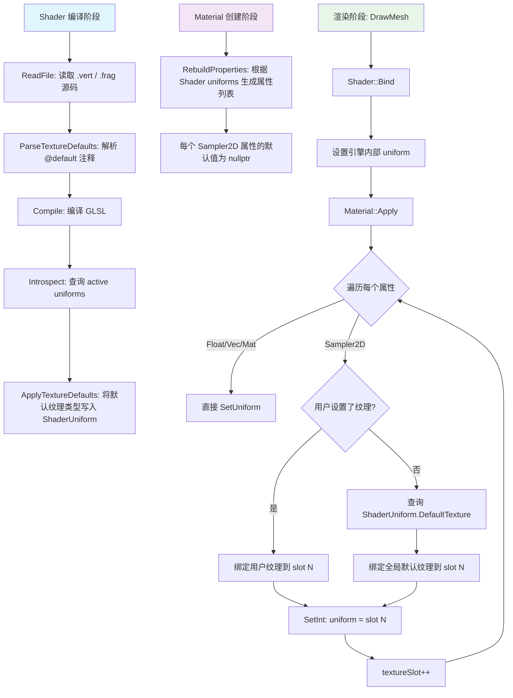

# Phase R2.1：纹理槽位自动管理系统

> **文档版本**：v1.0  
> **创建日期**：2026-04-09  
> **优先级**：?? P0（核心目标）  
> **预计工作量**：1-2 天  
> **前置依赖**：Phase R2（PBR Shader）  
> **文档说明**：本文档详细描述如何重构纹理槽位管理系统，实现"Shader 源码声明默认纹理 + Material 自动管理槽位"的方案。目标是让用户编写完 Shader 后无需修改任何引擎源码即可正常使用，纹理的默认值、槽位分配、绑定逻辑全部由引擎自动完成。

---

## 目录

- [一、现状分析](#一现状分析)
  - [1.1 当前架构的问题](#11-当前架构的问题)
  - [1.2 问题根因](#12-问题根因)
- [二、改进目标](#二改进目标)
- [三、主流引擎方案调研](#三主流引擎方案调研)
  - [3.1 Unity](#31-unity)
  - [3.2 Godot](#32-godot)
  - [3.3 Unreal](#33-unreal)
  - [3.4 共同点总结](#34-共同点总结)
- [四、方案选型](#四方案选型)
  - [4.1 候选方案对比](#41-候选方案对比)
  - [4.2 最终方案：Shader 源码注释元数据](#42-最终方案shader-源码注释元数据)
- [五、详细设计](#五详细设计)
  - [5.1 默认纹理类型枚举](#51-默认纹理类型枚举)
  - [5.2 GLSL 注释元数据语法](#52-glsl-注释元数据语法)
  - [5.3 ShaderUniform 结构扩展](#53-shaderuniform-结构扩展)
  - [5.4 Shader 源码解析](#54-shader-源码解析)
  - [5.5 全局默认纹理表](#55-全局默认纹理表)
  - [5.6 Material::Apply() 重构](#56-materialapply-重构)
  - [5.7 DrawMesh 解耦](#57-drawmesh-解耦)
- [六、涉及的文件清单](#六涉及的文件清单)
- [七、代码实现](#七代码实现)
  - [7.1 Shader.h 修改](#71-shaderh-修改)
  - [7.2 Shader.cpp 修改](#72-shadercpp-修改)
  - [7.3 Renderer3D.h 修改](#73-renderer3dh-修改)
  - [7.4 Renderer3D.cpp 修改](#74-renderer3dcpp-修改)
  - [7.5 Material.cpp 修改](#75-materialcpp-修改)
  - [7.6 Standard.frag 修改](#76-standardfrag-修改)
- [八、纹理绑定流程](#八纹理绑定流程)
  - [8.1 完整流程图](#81-完整流程图)
  - [8.2 纹理查找优先级](#82-纹理查找优先级)
- [九、用户工作流](#九用户工作流)
  - [9.1 创建新 Shader](#91-创建新-shader)
  - [9.2 创建 Material](#92-创建-material)
  - [9.3 对比：改进前 vs 改进后](#93-对比改进前-vs-改进后)
- [十、验证方法](#十验证方法)
- [十一、设计决策记录](#十一设计决策记录)

---

## 一、现状分析

### 1.1 当前架构的问题

#### 问题 1：渲染器硬编码 Shader 的纹理槽位

在 `Renderer3D.cpp` 的 `DrawMesh()` 中，手动为 Standard Shader 的 6 个 PBR 纹理绑定了固定槽位：

```cpp
// DrawMesh() 中 ―― 硬编码 Standard Shader 的纹理槽位
s_Data.WhiteTexture->Bind(0);          // u_AlbedoMap
s_Data.DefaultNormalTexture->Bind(1);  // u_NormalMap
s_Data.WhiteTexture->Bind(2);          // u_MetallicMap
s_Data.WhiteTexture->Bind(3);          // u_RoughnessMap
s_Data.WhiteTexture->Bind(4);          // u_AOMap
s_Data.WhiteTexture->Bind(5);          // u_EmissionMap
```

如果创建一个新 Shader 定义了不同的纹理（如 `u_MaskMap`、`u_DetailNormal`），渲染器完全不知道该怎么处理。

#### 问题 2：Material::Apply() 纹理为空时不设置 uniform

在 `Material.cpp` 的 `Apply()` 中，纹理为空时跳过了 `SetInt` 调用：

```cpp
case ShaderUniformType::Sampler2D:
{
    const Ref<Texture2D>& texture = std::get<Ref<Texture2D>>(prop.Value);
    if (texture)
    {
        texture->Bind(textureSlot);
        m_Shader->SetInt(prop.Name, textureSlot);
        textureSlot++;
    }
    break;  // ← 纹理为空时什么都不做！
}
```

纹理为空时，sampler uniform 的值保持 OpenGL 默认值 `0`，全部指向 slot 0。这导致了 Cube 两对面颜色一样的 bug ―― `u_NormalMap` 采样了 slot 0 的白色纹理而不是法线蓝纹理。

#### 问题 3：每新增一个 Shader 都需要修改渲染器源码

当前架构下，每创建一个新 Shader，都需要：

1. 在 `Renderer3D::Init()` 中创建对应的默认纹理
2. 在 `DrawMesh()` 中手动绑定这些默认纹理到正确的槽位
3. 确保槽位编号和 `Apply()` 中的 `textureSlot` 计数器不冲突

这完全违背了"写完 Shader 就能用"的目标。

### 1.2 问题根因

```
根因：纹理的"默认值信息"和"槽位分配逻辑"分散在三个地方
├── Renderer3D.cpp  → 硬编码默认纹理绑定和槽位
├── Material.cpp    → 纹理为空时不处理
└── Standard.frag   → 注释中写了默认值，但引擎不读取
```

**核心矛盾**：不同类型的纹理需要不同的默认值（白色 vs 法线蓝 vs 黑色），但这个信息没有被系统化管理。

---

## 二、改进目标

1. **Shader 自包含**：默认纹理信息声明在 Shader 源码中，引擎编译时自动解析
2. **Material 自动管理**：`Material::Apply()` 自动完成所有纹理的绑定和槽位分配
3. **DrawMesh 解耦**：渲染器不再硬编码任何 Shader 特定的纹理绑定
4. **零配置使用**：编写完 Shader 后，无需修改任何引擎源码即可创建材质并使用
5. **槽位自动分配**：纹理槽位由 `Apply()` 动态分配，超出 32 上限时警告
6. **向后兼容**：不改变 `MaterialProperty` 的数据结构，不影响现有的序列化和 Inspector UI

---

## 三、主流引擎方案调研

### 3.1 Unity

Unity 使用 ShaderLab 语法在 Shader 中声明默认纹理类型：

```hlsl
Properties {
    _MainTex ("Albedo", 2D) = "white" {}      // 默认白色
    _BumpMap ("Normal Map", 2D) = "bump" {}    // 默认法线蓝
    _MaskTex ("Mask", 2D) = "black" {}         // 默认黑色
}
```

- `Properties` 块不是 HLSL 标准语法，而是 Unity 自定义的**元数据声明**
- 编译前由 Unity 的解析器提取默认纹理类型
- 材质系统在纹理为空时自动绑定对应的内置默认纹理
- 渲染器**完全不需要知道**某个 Shader 有哪些纹理
- 槽位分配由材质系统在 Apply 时动态完成

### 3.2 Godot

Godot 在 Shader 语言中支持 `hint_xxx` 修饰符：

```glsl
uniform sampler2D albedo_tex : hint_default_white;
uniform sampler2D normal_tex : hint_default_normal;
uniform sampler2D mask_tex : hint_default_black;
```

- `hint_xxx` 不是标准 GLSL，而是 Godot 自定义的**类型修饰符**
- Godot 有自己的 Shader 语言解析器，编译前提取 hint 信息
- 引擎根据 hint 自动绑定对应的默认纹理

### 3.3 Unreal

- 不使用文本 Shader，而是材质图（Material Graph）
- 每个 Texture Sample 节点都有一个 "Default Texture" 属性
- 未连接的纹理节点直接使用常量值，编译后不包含未使用的纹理采样

### 3.4 共同点总结

| 特征 | Unity | Godot | Unreal |
|------|-------|-------|--------|
| 默认纹理信息位置 | Shader 资产中 | Shader 资产中 | 材质图节点中 |
| 语法形式 | 自定义 Properties 块 | 自定义 hint 修饰符 | 节点属性 |
| 是否需要改引擎源码 | 否 | 否 | 否 |
| 信息自包含 | ? | ? | ? |

**共同点**：所有主流引擎都在 Shader 资产中声明默认纹理类型，只是语法形式不同。

---

## 四、方案选型

### 4.1 候选方案对比

| 方案 | 描述 | 命名自由 | 不改数据结构 | Shader 无分支 | 自包含 | 新增 Shader 需改引擎 | 推荐度 |
|------|------|---------|------------|-------------|--------|-------------------|--------|
| A. 命名约定推断 | 根据 uniform 名推断默认纹理 | ? | ? | ? | ? | ? | ?? |
| B. GLSL 注释元数据 | Shader 源码中用注释声明 | ? | ? | ? | ? | ? | ????? |
| C. 统一白色 + Shader 判断 | 全部用白色，Shader 自己处理 | ? | ? | ? | ? | ? | ? |
| D. Material fallback 表 | Material 层面设置 fallback | ? | ? | ? | ? | 部分 | ??? |
| E. Shader 对象注册 fallback | Shader 对象上注册默认纹理 | ? | ? | ? | ? | ?（Init 中注册） | ???? |

#### 各方案淘汰原因

- **方案 A**：命名受限，用户必须遵守约定，容易误判（如 `u_NormalStrength` 也包含 "Normal"）
- **方案 C**：把问题推给 Shader 编写者，引入 if 分支，判断逻辑不可靠
- **方案 D**：每个 Material 实例都需要手动设置 fallback，100 个材质就要设置 100 次
- **方案 E**：每新增一个 Shader，仍需在 `Init()` 中写一行注册代码，本质上还是在引擎源码中硬编码

### 4.2 最终方案：Shader 源码注释元数据

**选择方案 B**，理由：

1. **信息完全自包含在 Shader 资产中** ―― 默认纹理类型写在 Shader 源码的注释中
2. **新增 Shader 完全不需要修改引擎源码** ―― 引擎编译 Shader 时自动解析注释
3. **命名完全自由** ―― 不依赖任何命名约定
4. **与主流引擎思路一致** ―― Unity 的 `Properties` 块、Godot 的 `hint_xxx` 本质上都是 Shader 中的元数据
5. **实现复杂度适中** ―― 只需在 Shader 编译前增加一个简单的正则解析步骤

由于我们直接使用标准 GLSL，不能修改语法，最自然的方式是**结构化注释**。

---

## 五、详细设计

### 5.1 默认纹理类型枚举

```cpp
/// 纹理默认类型
enum class TextureDefault : uint8_t
{
    White,      // (255, 255, 255, 255) ―― 乘法中性值，大多数纹理的默认值
    Black,      // (0, 0, 0, 255)       ―― 加法中性值
    Normal,     // (128, 128, 255, 255)  ―― 平坦法线，解码后为 (0, 0, 1)
};
```

> **扩展性**：未来可按需添加 `Gray`（128,128,128,255）、`Transparent`（0,0,0,0）等类型。

### 5.2 GLSL 注释元数据语法

在 Shader 源码中，使用 `// @default: <type>` 注释标注 `sampler2D` uniform 的默认纹理类型：

```glsl
// @default: white
uniform sampler2D u_AlbedoMap;

// @default: normal
uniform sampler2D u_NormalMap;

// @default: white
uniform sampler2D u_MetallicMap;

// @default: white
uniform sampler2D u_RoughnessMap;

// @default: white
uniform sampler2D u_AOMap;

// @default: white
uniform sampler2D u_EmissionMap;
```

#### 语法规则

| 规则 | 说明 |
|------|------|
| 注释格式 | `// @default: <type>`，其中 `<type>` 为 `white`、`black`、`normal` 之一 |
| 位置要求 | 必须在 `uniform sampler2D` 声明的**前一行**（紧邻） |
| 大小写 | `<type>` 不区分大小写（`White`、`WHITE`、`white` 均可） |
| 缺省值 | 没有 `@default` 注释的 `sampler2D` 默认使用 `white` |
| 作用范围 | 仅对 `sampler2D` 类型的 uniform 有效，其他类型忽略 |

#### 为什么选择注释而非自定义语法

| 对比项 | 注释元数据 | 自定义语法 |
|--------|-----------|-----------|
| GLSL 编译器兼容性 | ? 注释被编译器忽略 | ? 编译器报错 |
| IDE 语法高亮 | ? 正常显示 | ? 可能报错 |
| 实现复杂度 | 低（正则匹配） | 高（需要完整解析器） |
| 信息丢失风险 | 注释可能被误删 | 不会 |

> **注释误删风险的缓解**：没有 `@default` 注释时自动使用白色纹理，这是最安全的默认值。只有法线贴图等少数纹理需要特殊标注，即使标注丢失也只是法线效果异常，不会导致崩溃。

### 5.3 ShaderUniform 结构扩展

在 `ShaderUniform` 中增加一个 `DefaultTexture` 字段，仅 `Sampler2D` 类型使用：

```cpp
struct ShaderUniform
{
    std::string Name;                                       // uniform 变量名
    ShaderUniformType Type;                                 // 数据类型
    int Location;                                           // uniform location
    int Size;                                               // 数组大小（非数组为 1）
    TextureDefault DefaultTexture = TextureDefault::White;  // 默认纹理类型（仅 Sampler2D 使用）
};
```

#### 为什么放在 ShaderUniform 中

- `ShaderUniform` 本身就是描述"这个 uniform 的元信息"的结构
- "默认纹理类型"确实是 `sampler2D` 类型 uniform 的一个固有属性
- Unity 的 `ShaderProperty` 中也包含默认值信息
- 这个字段只对 `Sampler2D` 类型有意义，其他类型忽略即可
- **这不是"嵌入了不属于它的职责"，而是"它本来就应该知道的信息"**

### 5.4 Shader 源码解析

在 `Shader::Compile()` 之前（或在 `Introspect()` 之后），解析 Shader 源码中的 `@default` 注释，将结果存入对应的 `ShaderUniform.DefaultTexture` 字段。

#### 解析算法

```
输入：Shader 源码字符串（vertex + fragment）
输出：uniform 名 → TextureDefault 的映射表

1. 使用正则表达式匹配所有 "// @default: <type>\n...uniform sampler2D <name>;" 模式
2. 提取 <type> 和 <name>
3. 将 <type> 转换为 TextureDefault 枚举值
4. 存入映射表
```

#### 正则表达式

```
//\s*@default\s*:\s*(white|black|normal)\s*\n\s*uniform\s+sampler2D\s+(\w+)\s*;
```

匹配示例：

```glsl
// @default: normal          ← 匹配 group(1) = "normal"
uniform sampler2D u_NormalMap;  ← 匹配 group(2) = "u_NormalMap"
```

#### 解析时机

```
Shader 构造函数
    │
    ├─ ReadFile(vertex)
    ├─ ReadFile(fragment)
    │
    ├─ ParseTextureDefaults(vertexSrc)   ← 新增：解析注释元数据
    ├─ ParseTextureDefaults(fragmentSrc) ← 新增：解析注释元数据
    │
    ├─ Compile(shaderSources)
    │     └─ Introspect()  ← 内省后，将解析结果写入 ShaderUniform.DefaultTexture
    │
    └─ ApplyTextureDefaults()  ← 新增：将解析结果应用到 m_Uniforms
```

### 5.5 全局默认纹理表

在 `Renderer3D` 中维护一个按 `TextureDefault` 枚举索引的全局默认纹理表。这个表在引擎初始化时创建一次，永远不需要修改。

```cpp
struct Renderer3DData
{
    // 全局默认纹理表
    std::unordered_map<TextureDefault, Ref<Texture2D>> DefaultTextures;
};
```

初始化：

```cpp
void Renderer3D::Init()
{
    // 创建全局默认纹理
    // White: (255, 255, 255, 255)
    uint32_t whiteData = 0xFFFFFFFF;
    s_Data.DefaultTextures[TextureDefault::White] = Texture2D::Create(1, 1);
    s_Data.DefaultTextures[TextureDefault::White]->SetData(&whiteData, sizeof(uint32_t));

    // Black: (0, 0, 0, 255)
    uint32_t blackData = 0xFF000000;
    s_Data.DefaultTextures[TextureDefault::Black] = Texture2D::Create(1, 1);
    s_Data.DefaultTextures[TextureDefault::Black]->SetData(&blackData, sizeof(uint32_t));

    // Normal: (128, 128, 255, 255)
    uint32_t normalData = 0xFFFF8080;
    s_Data.DefaultTextures[TextureDefault::Normal] = Texture2D::Create(1, 1);
    s_Data.DefaultTextures[TextureDefault::Normal]->SetData(&normalData, sizeof(uint32_t));
}
```

提供静态访问接口：

```cpp
// Renderer3D.h
static const Ref<Texture2D>& GetDefaultTexture(TextureDefault type);
```

### 5.6 Material::Apply() 重构

`Apply()` 方法是本方案的核心变更点。重构后的逻辑：

```cpp
void Material::Apply() const
{
    if (!m_Shader) return;

    int textureSlot = 0;  // 从 0 开始，不再预留

    for (const std::string& name : m_PropertyOrder)
    {
        const MaterialProperty& prop = ...;

        switch (prop.Type)
        {
            // ... Float/Vec/Mat 类型不变 ...

            case ShaderUniformType::Sampler2D:
            {
                if (textureSlot >= 32)
                {
                    LF_CORE_WARN("纹理槽位超出上限(32)，纹理 '{0}' 将被忽略", prop.Name);
                    break;
                }

                const Ref<Texture2D>& texture = std::get<Ref<Texture2D>>(prop.Value);

                if (texture)
                {
                    // 用户设置了纹理 → 绑定用户纹理
                    texture->Bind(textureSlot);
                }
                else
                {
                    // 用户未设置纹理 → 从 Shader 的 uniform 元数据获取默认纹理类型
                    TextureDefault defaultType = TextureDefault::White;  // 兜底

                    // 查找 Shader 中该 uniform 的默认纹理类型
                    for (const auto& uniform : m_Shader->GetUniforms())
                    {
                        if (uniform.Name == prop.Name)
                        {
                            defaultType = uniform.DefaultTexture;
                            break;
                        }
                    }

                    Renderer3D::GetDefaultTexture(defaultType)->Bind(textureSlot);
                }

                m_Shader->SetInt(prop.Name, textureSlot);  // 无论哪种情况都设置 uniform
                textureSlot++;
                break;
            }
        }
    }
}
```

#### 关键变更点

| 变更 | 旧逻辑 | 新逻辑 |
|------|--------|--------|
| 纹理为空时 | 跳过，不设置 uniform | 绑定默认纹理，设置 uniform |
| 槽位起始值 | `textureSlot = 1`（预留 0 号给白色） | `textureSlot = 0`（从 0 开始） |
| 槽位上限检查 | 无 | 超过 32 时警告并跳过 |
| 默认纹理来源 | DrawMesh 硬编码 | 从 ShaderUniform.DefaultTexture 查询 |
| SetInt 调用 | 仅在纹理非空时调用 | 无论纹理是否为空都调用 |

### 5.7 DrawMesh 解耦

移除 `DrawMesh()` 中所有手动纹理绑定代码：

```cpp
void Renderer3D::DrawMesh(const glm::mat4& transform, Ref<Mesh>& mesh,
                           const std::vector<Ref<Material>>& materials)
{
    // ... 准备顶点数据 ...

    for (const SubMesh& sm : mesh->GetSubMeshes())
    {
        // ... 获取材质 ...

        material->GetShader()->Bind();
        material->GetShader()->SetMat4("u_ObjectToWorldMatrix", transform);

        // ↓↓↓ 删除以下 6 行硬编码纹理绑定 ↓↓↓
        // s_Data.WhiteTexture->Bind(0);
        // s_Data.DefaultNormalTexture->Bind(1);
        // s_Data.WhiteTexture->Bind(2);
        // s_Data.WhiteTexture->Bind(3);
        // s_Data.WhiteTexture->Bind(4);
        // s_Data.WhiteTexture->Bind(5);

        // Apply 自动处理所有纹理绑定
        material->Apply();

        RenderCommand::DrawIndexedRange(...);
    }
}
```

---

## 六、涉及的文件清单

| 文件路径 | 操作 | 说明 |
|---------|------|------|
| `Lucky/Source/Lucky/Renderer/Shader.h` | 修改 | 增加 `TextureDefault` 枚举，扩展 `ShaderUniform` 结构 |
| `Lucky/Source/Lucky/Renderer/Shader.cpp` | 修改 | 增加 `ParseTextureDefaults()` 解析方法，修改 `Introspect()` |
| `Lucky/Source/Lucky/Renderer/Renderer3D.h` | 修改 | 增加 `GetDefaultTexture()` 静态接口 |
| `Lucky/Source/Lucky/Renderer/Renderer3D.cpp` | 修改 | 重构默认纹理初始化，移除 DrawMesh 中的硬编码纹理绑定 |
| `Lucky/Source/Lucky/Renderer/Material.cpp` | 修改 | 重构 `Apply()` 中的 Sampler2D 处理逻辑 |
| `Luck3DApp/Assets/Shaders/Standard.frag` | 修改 | 为 sampler2D uniform 添加 `@default` 注释 |

> **注意**：不需要修改 `Material.h`（`MaterialProperty` 结构不变）。不需要修改 Inspector UI。

---

## 七、代码实现

### 7.1 Shader.h 修改

```cpp
#pragma once

#include <string>
#include <regex>

#include <glm/glm.hpp>

#include "Buffer.h"

namespace Lucky
{
    /// Shader Uniform 类型
    enum class ShaderUniformType
    {
        None = 0,
        Float, Float2, Float3, Float4,
        Int,
        Mat3, Mat4,
        Sampler2D
    };

    /// 纹理默认类型（仅 Sampler2D 使用）
    enum class TextureDefault : uint8_t
    {
        White,      // (255, 255, 255, 255) ―― 乘法中性值
        Black,      // (0, 0, 0, 255)       ―― 加法中性值
        Normal,     // (128, 128, 255, 255)  ―― 平坦法线
    };

    /// Shader Uniform 参数信息
    struct ShaderUniform
    {
        std::string Name;                                       // uniform 变量名
        ShaderUniformType Type;                                 // 数据类型
        int Location;                                           // uniform location
        int Size;                                               // 数组大小（非数组为 1）
        TextureDefault DefaultTexture = TextureDefault::White;  // 默认纹理类型（仅 Sampler2D 使用）
    };

    class Shader
    {
    public:
        // ... 现有公开接口不变 ...

    private:
        // ... 现有私有方法 ...

        /// 解析 Shader 源码中的 @default 注释元数据
        /// 提取 sampler2D uniform 的默认纹理类型
        void ParseTextureDefaults(const std::string& source);

        /// 将解析到的默认纹理类型应用到 m_Uniforms 列表
        void ApplyTextureDefaults();

    private:
        uint32_t m_RendererID;
        std::string m_Name;
        std::vector<ShaderUniform> m_Uniforms;

        /// 解析缓存：uniform 名 → 默认纹理类型
        std::unordered_map<std::string, TextureDefault> m_TextureDefaultMap;
    };

    // ... ShaderLibrary 不变 ...
}
```

### 7.2 Shader.cpp 修改

#### 新增：TextureDefault 字符串转换

```cpp
/// 将字符串转换为 TextureDefault 枚举
static TextureDefault StringToTextureDefault(const std::string& str)
{
    // 转小写比较
    std::string lower = str;
    std::transform(lower.begin(), lower.end(), lower.begin(), ::tolower);

    if (lower == "black")   return TextureDefault::Black;
    if (lower == "normal")  return TextureDefault::Normal;

    return TextureDefault::White;  // 默认白色
}
```

#### 新增：ParseTextureDefaults()

```cpp
void Shader::ParseTextureDefaults(const std::string& source)
{
    // 正则匹配：// @default: <type> 后紧跟 uniform sampler2D <name>;
    // 支持中间有空行或其他注释
    static const std::regex pattern(
        R"(//\s*@default\s*:\s*(\w+)\s*\n\s*uniform\s+sampler2D\s+(\w+)\s*;)",
        std::regex::ECMAScript
    );

    auto begin = std::sregex_iterator(source.begin(), source.end(), pattern);
    auto end = std::sregex_iterator();

    for (auto it = begin; it != end; ++it)
    {
        const std::smatch& match = *it;
        std::string type = match[1].str();  // white / black / normal
        std::string name = match[2].str();  // uniform 名

        m_TextureDefaultMap[name] = StringToTextureDefault(type);

        LF_CORE_TRACE("  Texture default: '{0}' → {1}", name, type);
    }
}
```

#### 新增：ApplyTextureDefaults()

```cpp
void Shader::ApplyTextureDefaults()
{
    for (ShaderUniform& uniform : m_Uniforms)
    {
        if (uniform.Type != ShaderUniformType::Sampler2D)
        {
            continue;
        }

        auto it = m_TextureDefaultMap.find(uniform.Name);
        if (it != m_TextureDefaultMap.end())
        {
            uniform.DefaultTexture = it->second;
        }
        // 没有 @default 注释的 sampler2D → 保持默认值 TextureDefault::White
    }
}
```

#### 修改：Shader 构造函数

```cpp
Shader::Shader(const std::string& filepath)
    : m_RendererID(0)
{
    std::string vertexSrc = ReadFile(filepath + ".vert");
    std::string fragmentSrc = ReadFile(filepath + ".frag");

    // 解析 @default 注释元数据（在编译前）
    ParseTextureDefaults(vertexSrc);
    ParseTextureDefaults(fragmentSrc);

    std::unordered_map<GLenum, std::string> shaderSources;
    shaderSources[GL_VERTEX_SHADER] = vertexSrc;
    shaderSources[GL_FRAGMENT_SHADER] = fragmentSrc;

    // 计算着色器名
    auto lastSlash = filepath.find_last_of("/\\");
    lastSlash = lastSlash == std::string::npos ? 0 : lastSlash + 1;
    m_Name = filepath.substr(lastSlash, filepath.size() - lastSlash);

    Compile(shaderSources);  // 编译（内部调用 Introspect()）

    // 将解析到的默认纹理类型应用到 uniform 列表
    ApplyTextureDefaults();
}
```

### 7.3 Renderer3D.h 修改

```cpp
class Renderer3D
{
public:
    // ... 现有接口 ...

    /// 获取指定类型的全局默认纹理
    static const Ref<Texture2D>& GetDefaultTexture(TextureDefault type);
};
```

### 7.4 Renderer3D.cpp 修改

#### 修改：Renderer3DData 结构

```cpp
struct Renderer3DData
{
    static const uint32_t MaxTextureSlots = 32;

    Ref<ShaderLibrary> ShaderLib;

    Ref<Shader> InternalErrorShader;
    Ref<Shader> StandardShader;
    Ref<Material> InternalErrorMaterial;
    Ref<Material> DefaultMaterial;

    // 全局默认纹理表（替代原来的 WhiteTexture + DefaultNormalTexture）
    std::unordered_map<TextureDefault, Ref<Texture2D>> DefaultTextures;

    // 移除：Ref<Texture2D> WhiteTexture;
    // 移除：Ref<Texture2D> DefaultNormalTexture;
    // 移除：std::array<Ref<Texture2D>, MaxTextureSlots> TextureSlots;
    // 移除：uint32_t TextureSlotIndex = 1;

    std::vector<Vertex> MeshVertexBufferData;
    Renderer3D::Statistics Stats;

    // ... CameraData / LightData 不变 ...
};
```

#### 修改：Init()

```cpp
void Renderer3D::Init()
{
    s_Data.ShaderLib = CreateRef<ShaderLibrary>();

    s_Data.ShaderLib->Load("Assets/Shaders/InternalError");
    s_Data.ShaderLib->Load("Assets/Shaders/Standard");

    s_Data.InternalErrorShader = s_Data.ShaderLib->Get("InternalError");
    s_Data.StandardShader = s_Data.ShaderLib->Get("Standard");

    s_Data.InternalErrorMaterial = CreateRef<Material>("InternalError Material", s_Data.InternalErrorShader);
    s_Data.DefaultMaterial = CreateRef<Material>("Default Material", s_Data.StandardShader);

    // ---- 创建全局默认纹理 ----

    // White: (255, 255, 255, 255) ―― 乘法中性值
    uint32_t whiteData = 0xFFFFFFFF;
    s_Data.DefaultTextures[TextureDefault::White] = Texture2D::Create(1, 1);
    s_Data.DefaultTextures[TextureDefault::White]->SetData(&whiteData, sizeof(uint32_t));

    // Black: (0, 0, 0, 255) ―― 加法中性值
    uint32_t blackData = 0xFF000000;
    s_Data.DefaultTextures[TextureDefault::Black] = Texture2D::Create(1, 1);
    s_Data.DefaultTextures[TextureDefault::Black]->SetData(&blackData, sizeof(uint32_t));

    // Normal: (128, 128, 255, 255) ―― 平坦法线
    uint32_t normalData = 0xFFFF8080;
    s_Data.DefaultTextures[TextureDefault::Normal] = Texture2D::Create(1, 1);
    s_Data.DefaultTextures[TextureDefault::Normal]->SetData(&normalData, sizeof(uint32_t));

    // PBR 默认参数
    s_Data.DefaultMaterial->SetFloat4("u_Albedo", glm::vec4(0.8f, 0.8f, 0.8f, 1.0f));
    s_Data.DefaultMaterial->SetFloat("u_Metallic", 0.0f);
    s_Data.DefaultMaterial->SetFloat("u_Roughness", 0.5f);
    s_Data.DefaultMaterial->SetFloat("u_AO", 1.0f);
    s_Data.DefaultMaterial->SetFloat3("u_Emission", glm::vec3(0.0f));
    s_Data.DefaultMaterial->SetFloat("u_EmissionIntensity", 1.0f);

    s_Data.CameraUniformBuffer = UniformBuffer::Create(sizeof(Renderer3DData::CameraData), 0);
    s_Data.LightUniformBuffer = UniformBuffer::Create(sizeof(Renderer3DData::LightData), 1);
}
```

#### 修改：DrawMesh()

```cpp
void Renderer3D::DrawMesh(const glm::mat4& transform, Ref<Mesh>& mesh,
                           const std::vector<Ref<Material>>& materials)
{
    // 准备顶点数据
    s_Data.MeshVertexBufferData.clear();
    for (const Vertex& vertex : mesh->GetVertices())
    {
        Vertex v = vertex;
        s_Data.MeshVertexBufferData.push_back(v);
    }

    uint32_t dataSize = sizeof(Vertex) * static_cast<uint32_t>(s_Data.MeshVertexBufferData.size());
    mesh->SetVertexBufferData(s_Data.MeshVertexBufferData.data(), dataSize);

    for (const SubMesh& sm : mesh->GetSubMeshes())
    {
        Ref<Material> material = nullptr;
        if (sm.MaterialIndex < materials.size())
        {
            material = materials[sm.MaterialIndex];
        }

        if (!material || !material->GetShader())
        {
            material = s_Data.InternalErrorMaterial;
        }

        material->GetShader()->Bind();
        material->GetShader()->SetMat4("u_ObjectToWorldMatrix", transform);

        // 不再手动绑定默认纹理！Apply() 自动处理
        material->Apply();

        RenderCommand::DrawIndexedRange(mesh->GetVertexArray(), sm.IndexOffset, sm.IndexCount);

        s_Data.Stats.DrawCalls++;
        s_Data.Stats.TriangleCount += sm.IndexCount / 3;
    }
}
```

#### 新增：GetDefaultTexture()

```cpp
const Ref<Texture2D>& Renderer3D::GetDefaultTexture(TextureDefault type)
{
    auto it = s_Data.DefaultTextures.find(type);
    if (it != s_Data.DefaultTextures.end())
    {
        return it->second;
    }

    // 兜底：返回白色纹理
    return s_Data.DefaultTextures[TextureDefault::White];
}
```

#### 修改：GetWhiteTexture()（向后兼容）

```cpp
const Ref<Texture2D>& Renderer3D::GetWhiteTexture()
{
    return s_Data.DefaultTextures[TextureDefault::White];
}
```

### 7.5 Material.cpp 修改

仅修改 `Apply()` 方法中的 `Sampler2D` 分支：

```cpp
void Material::Apply() const
{
    if (!m_Shader)
    {
        return;
    }

    int textureSlot = 0;  // 从 0 开始，不再预留

    for (const std::string& name : m_PropertyOrder)
    {
        auto it = m_PropertyMap.find(name);
        if (it == m_PropertyMap.end())
        {
            continue;
        }

        const MaterialProperty& prop = it->second;

        switch (prop.Type)
        {
            case ShaderUniformType::Float:
                m_Shader->SetFloat(prop.Name, std::get<float>(prop.Value));
                break;
            case ShaderUniformType::Float2:
                m_Shader->SetFloat2(prop.Name, std::get<glm::vec2>(prop.Value));
                break;
            case ShaderUniformType::Float3:
                m_Shader->SetFloat3(prop.Name, std::get<glm::vec3>(prop.Value));
                break;
            case ShaderUniformType::Float4:
                m_Shader->SetFloat4(prop.Name, std::get<glm::vec4>(prop.Value));
                break;
            case ShaderUniformType::Int:
                m_Shader->SetInt(prop.Name, std::get<int>(prop.Value));
                break;
            case ShaderUniformType::Mat3:
                m_Shader->SetMat3(prop.Name, std::get<glm::mat3>(prop.Value));
                break;
            case ShaderUniformType::Mat4:
                m_Shader->SetMat4(prop.Name, std::get<glm::mat4>(prop.Value));
                break;
            case ShaderUniformType::Sampler2D:
            {
                if (textureSlot >= 32)
                {
                    LF_CORE_WARN("Texture slot limit exceeded (32), texture '{0}' will be ignored", prop.Name);
                    break;
                }

                const Ref<Texture2D>& texture = std::get<Ref<Texture2D>>(prop.Value);

                if (texture)
                {
                    // 用户设置了纹理 → 绑定用户纹理
                    texture->Bind(textureSlot);
                }
                else
                {
                    // 用户未设置纹理 → 查询 Shader 中该 uniform 的默认纹理类型
                    TextureDefault defaultType = TextureDefault::White;

                    const auto& uniforms = m_Shader->GetUniforms();
                    for (const auto& uniform : uniforms)
                    {
                        if (uniform.Name == prop.Name)
                        {
                            defaultType = uniform.DefaultTexture;
                            break;
                        }
                    }

                    Renderer3D::GetDefaultTexture(defaultType)->Bind(textureSlot);
                }

                m_Shader->SetInt(prop.Name, textureSlot);  // 无论哪种情况都设置 uniform
                textureSlot++;
                break;
            }
            default:
                break;
        }
    }
}
```

### 7.6 Standard.frag 修改

为所有 `sampler2D` uniform 添加 `@default` 注释：

```glsl
// ---- PBR 纹理 ----

// @default: white
uniform sampler2D u_AlbedoMap;

// @default: normal
uniform sampler2D u_NormalMap;

// @default: white
uniform sampler2D u_MetallicMap;

// @default: white
uniform sampler2D u_RoughnessMap;

// @default: white
uniform sampler2D u_AOMap;

// @default: white
uniform sampler2D u_EmissionMap;
```

> **注意**：`@default: white` 的纹理其实可以省略注释（缺省就是 white），但为了代码可读性和一致性，建议全部标注。

---

## 八、纹理绑定流程

### 8.1 完整流程图



### 8.2 纹理查找优先级

```
Material::Apply() 中 Sampler2D 的纹理查找链：

1. 用户纹理（MaterialProperty.Value 中的 Ref<Texture2D>）
   │
   └─ 非空 → 使用用户纹理
   │
   └─ 为空 ↓

2. Shader 声明的默认纹理类型（ShaderUniform.DefaultTexture）
   │
   └─ 有 @default 注释 → 使用对应的全局默认纹理
   │
   └─ 无 @default 注释 ↓

3. 全局兜底：白色纹理（TextureDefault::White）
```

---

## 九、用户工作流

### 9.1 创建新 Shader

用户只需编写标准 GLSL 代码，并用 `@default` 注释标注特殊纹理的默认类型：

```glsl
// MyCustomShader.frag

// @default: white
uniform sampler2D u_DiffuseTex;

// @default: normal
uniform sampler2D u_BumpTex;

// @default: black
uniform sampler2D u_GlowTex;

// 没有 @default 注释 → 自动使用 white
uniform sampler2D u_SomeOtherTex;
```

**完成。不需要修改任何引擎源码。**

### 9.2 创建 Material

1. 选择 Shader → 自动生成属性面板（`RebuildProperties()` 自动发现所有 uniform）
2. 不设置纹理 → 自动使用 Shader 中声明的默认纹理
3. 设置纹理 → 使用用户纹理
4. 移除纹理 → 自动回退到默认纹理

**全程不需要关心槽位编号、默认纹理绑定等底层细节。**

### 9.3 对比：改进前 vs 改进后

#### 改进前：新增一个 Shader 的步骤

```
1. 编写 MyShader.vert / MyShader.frag
2. 在 Renderer3D::Init() 中：
   a. 加载 Shader
   b. 创建需要的默认纹理（如果有新类型）
   c. 为 Shader 注册默认纹理到固定槽位
3. 在 Renderer3D::DrawMesh() 中：
   a. 添加 if 判断当前 Shader 类型
   b. 手动绑定默认纹理到对应槽位
4. 确保槽位编号不与 Material::Apply() 冲突
5. 测试
```

#### 改进后：新增一个 Shader 的步骤

```
1. 编写 MyShader.vert / MyShader.frag（在 sampler2D 前加 @default 注释）
2. 测试
```

---

## 十、验证方法

### 10.1 基本功能验证

1. 启动引擎，确认 Standard Shader 的 PBR 渲染效果与改进前一致
2. 创建 Cube，确认 6 个面的颜色正确（不再出现两对面颜色一样的 bug）
3. 旋转光源，确认每个面的光照响应独立正确

### 10.2 默认纹理验证

1. 创建一个使用 Standard Shader 的材质，不设置任何纹理
2. 确认渲染结果正确（Albedo 使用 u_Albedo 颜色值，法线使用顶点法线）
3. 为材质设置一个法线贴图，确认表面有凹凸感
4. 移除法线贴图，确认表面恢复平滑

### 10.3 @default 注释解析验证

1. 在引擎日志中确认 `ParseTextureDefaults` 正确解析了所有 `@default` 注释
2. 确认 `u_NormalMap` 的 `DefaultTexture` 为 `Normal`
3. 确认 `u_AlbedoMap` 的 `DefaultTexture` 为 `White`

### 10.4 槽位自动分配验证

1. 在引擎日志中确认 `Apply()` 为每个纹理分配了正确的槽位
2. 确认槽位从 0 开始递增，无冲突

### 10.5 新 Shader 零配置验证

1. 创建一个新的测试 Shader（如 `TestShader.frag`），定义 2-3 个 `sampler2D` uniform
2. 不修改任何引擎源码
3. 使用该 Shader 创建材质，确认渲染正确
4. 确认默认纹理自动生效

### 10.6 槽位上限验证

1. 创建一个 Shader，定义超过 32 个 `sampler2D` uniform
2. 确认引擎输出警告日志
3. 确认前 32 个纹理正常工作，超出的纹理被忽略

---

## 十一、设计决策记录

| 决策 | 选择 | 原因 |
|------|------|------|
| 默认纹理信息存放位置 | Shader 源码注释 | 信息自包含，新增 Shader 无需改引擎源码 |
| 元数据语法 | `// @default: <type>` 注释 | 兼容标准 GLSL 编译器，IDE 无报错 |
| 缺省默认纹理 | 白色 (White) | 乘法中性值，最安全的默认行为 |
| ShaderUniform 扩展 | 增加 DefaultTexture 字段 | 这是 uniform 的固有元信息，放在此处最合理 |
| MaterialProperty 结构 | 不修改 | 保持向后兼容，不影响序列化和 Inspector UI |
| 纹理槽位起始值 | 从 0 开始 | 不再预留固定槽位，完全动态分配 |
| 槽位上限处理 | 警告 + 忽略超出的纹理 | 不崩溃，优雅降级 |
| 全局默认纹理表 | `unordered_map<TextureDefault, Ref<Texture2D>>` | 按枚举索引，初始化一次永不修改 |
| DrawMesh 纹理绑定 | 完全移除 | 由 Material::Apply() 统一管理 |
| 解析时机 | Compile 前解析，Introspect 后应用 | 确保 uniform 列表已建立后再关联默认纹理类型 |
