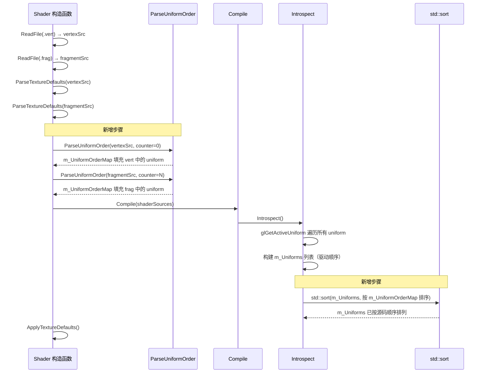

# PhaseR2.2：Shader Uniform 按源码定义顺序排序

## 1. 概述

### 1.1 问题背景

当前 `Shader::Introspect()` 方法通过 `glGetActiveUniform` 遍历所有 active uniform，但 **OpenGL 规范不保证返回顺序与 GLSL 源码中的声明顺序一致**。不同 GPU 驱动（NVIDIA、AMD、Intel）可能按字母序、按类型、或按内部优化后的顺序返回 uniform。

这导致以下问题：
- **Inspector 面板中材质属性的显示顺序不可预测**：用户在 Shader 中精心组织的 uniform 声明顺序（如先颜色、再金属度、再粗糙度）在 Inspector 中被打乱
- **不同平台/驱动下属性顺序不一致**：同一个 Shader 在不同机器上可能显示不同的属性排列
- **用户体验差**：Shader 作者无法控制材质属性在编辑器中的展示顺序

### 1.2 目标

在 `Shader::Introspect()` 完成后，对 `m_Uniforms` 列表按照 **GLSL 源码中 uniform 的声明顺序** 进行排序，使得：
1. Uniform 列表的顺序与 Shader 源码中的书写顺序一致
2. 不需要修改任何 Shader 文件
3. 不依赖特定 OpenGL 版本或驱动行为
4. 对下游系统（Material、Inspector）完全透明

### 1.3 设计原则

- **全自动**：不需要 Shader 作者手动标注顺序
- **与现有架构一致**：复用已有的源码解析模式（参考 `ParseTextureDefaults`）
- **跨平台可靠**：不依赖驱动或 OpenGL 版本
- **改动集中**：仅修改 `Shader` 类，不影响其他模块

---

## 2. 涉及的文件

### 需要修改的文件

| 文件路径 | 说明 |
|---------|------|
| `Lucky/Source/Lucky/Renderer/Shader.h` | 新增 `ParseUniformOrder` 方法声明和 `m_UniformOrderMap` 成员 |
| `Lucky/Source/Lucky/Renderer/Shader.cpp` | 实现 `ParseUniformOrder` 方法，修改 `Introspect()` 添加排序逻辑 |

### 不需要修改的文件

| 文件路径 | 说明 |
|---------|------|
| `Lucky/Source/Lucky/Renderer/Material.h` | Material 通过 `GetUniforms()` 获取已排序的列表，无需改动 |
| `Lucky/Source/Lucky/Renderer/Material.cpp` | `RebuildProperties()` 遍历 `m_Uniforms` 的顺序自动正确 |
| `Luck3DApp/Assets/Shaders/*.vert/*.frag` | 不需要修改任何 Shader 文件 |

---

## 3. 当前代码分析

### 3.1 问题代码：`Shader::Introspect()`

```cpp
void Shader::Introspect()
{
    m_Uniforms.clear();

    int uniformCount = 0;
    glGetProgramiv(m_RendererID, GL_ACTIVE_UNIFORMS, &uniformCount);

    for (int i = 0; i < uniformCount; i++)
    {
        char name[256];
        int length = 0;
        int size = 0;
        GLenum type = 0;

        // ?? 返回顺序由驱动决定，不保证与源码声明顺序一致
        glGetActiveUniform(m_RendererID, (GLuint)i, sizeof(name), &length, &size, &type, name);

        // ... 构造 ShaderUniform 并 push_back ...
    }
}
```

`glGetActiveUniform` 的索引 `i` 是 OpenGL 内部的索引，**不是** uniform 在源码中的声明位置。

### 3.2 下游影响链

```
Shader::Introspect()
    │
    ├─ m_Uniforms 列表（顺序由驱动决定）
    │
    └─ Material::RebuildProperties()
         │
         ├─ 遍历 m_Uniforms → 构建 m_PropertyOrder
         │
         └─ Inspector 面板按 m_PropertyOrder 顺序显示属性
              │
              └─ ?? 显示顺序不可预测
```

### 3.3 已有的源码解析先例：`ParseTextureDefaults`

项目中已有通过正则表达式解析 Shader 源码的先例：

```cpp
void Shader::ParseTextureDefaults(const std::string& source)
{
    static const std::regex pattern(
        R"(//\s*@default\s*:\s*(\w+)\s*\n\s*uniform\s+sampler2D\s+(\w+)\s*;)",
        std::regex::ECMAScript
    );
    // ... 正则匹配并提取信息 ...
}
```

新方案将采用类似的模式，保持代码风格一致。

---

## 4. 设计方案

### 4.1 核心思路

```
┌─────────────────────────────────────────────────────────────────┐
│                    Shader 构造流程                                │
│                                                                 │
│  1. ReadFile(vertex)  ──→  vertexSrc                            │
│  2. ReadFile(fragment) ──→  fragmentSrc                         │
│                                                                 │
│  3. ParseTextureDefaults(vertexSrc)    ← 已有                   │
│  4. ParseTextureDefaults(fragmentSrc)  ← 已有                   │
│                                                                 │
│  5. ParseUniformOrder(vertexSrc)       ← 新增：解析声明顺序      │
│  6. ParseUniformOrder(fragmentSrc)     ← 新增：解析声明顺序      │
│                                                                 │
│  7. Compile(shaderSources)                                      │
│       └─ Introspect()                                           │
│            └─ SortUniformsBySourceOrder()  ← 新增：按顺序排序    │
│                                                                 │
│  8. ApplyTextureDefaults()             ← 已有                   │
└─────────────────────────────────────────────────────────────────┘
```

**分两步走**：

1. **解析阶段**（编译前）：用正则表达式扫描 `.vert` 和 `.frag` 源码，提取所有 `uniform` 声明的名称，按出现顺序记录到 `m_UniformOrderMap`（名称 → 序号）
2. **排序阶段**（内省后）：在 `Introspect()` 末尾，根据 `m_UniformOrderMap` 对 `m_Uniforms` 进行排序

### 4.2 解析顺序规则

| 规则 | 说明 |
|------|------|
| 顶点着色器优先 | 先解析 `.vert`，再解析 `.frag`，顶点着色器中的 uniform 排在前面 |
| 去重 | 如果同一个 uniform 在 `.vert` 和 `.frag` 中都有声明，以**首次出现**的位置为准 |
| 连续编号 | 使用全局递增计数器，确保跨文件的顺序连续 |
| 未匹配兜底 | 如果 `glGetActiveUniform` 返回的 uniform 名在源码中未找到（理论上不应发生），排到末尾 |

### 4.3 以 Standard Shader 为例

#### Standard.vert 中的 uniform 声明

```glsl
uniform mat4 u_ObjectToWorldMatrix;     // 序号 0
```

#### Standard.frag 中的 uniform 声明

```glsl
uniform vec4  u_Albedo;                 // 序号 1
uniform float u_Metallic;               // 序号 2
uniform float u_Roughness;              // 序号 3
uniform float u_AO;                     // 序号 4
uniform vec3  u_Emission;               // 序号 5
uniform float u_EmissionIntensity;      // 序号 6
uniform sampler2D u_AlbedoMap;          // 序号 7
uniform sampler2D u_NormalMap;          // 序号 8
uniform sampler2D u_MetallicMap;        // 序号 9
uniform sampler2D u_RoughnessMap;       // 序号 10
uniform sampler2D u_AOMap;              // 序号 11
uniform sampler2D u_EmissionMap;        // 序号 12
```

#### 排序前（驱动返回的可能顺序，按字母序）

```
u_AO, u_AOMap, u_Albedo, u_AlbedoMap, u_Emission, u_EmissionIntensity,
u_EmissionMap, u_Metallic, u_MetallicMap, u_NormalMap,
u_ObjectToWorldMatrix, u_Roughness, u_RoughnessMap
```

#### 排序后（按源码声明顺序）

```
u_ObjectToWorldMatrix, u_Albedo, u_Metallic, u_Roughness, u_AO,
u_Emission, u_EmissionIntensity, u_AlbedoMap, u_NormalMap,
u_MetallicMap, u_RoughnessMap, u_AOMap, u_EmissionMap
```

---

## 5. 正则表达式设计

### 5.1 匹配目标

需要匹配 GLSL 中所有形如以下模式的 uniform 声明：

```glsl
uniform <type> <name>;
uniform <type> <name>[<size>];
```

**不匹配**的情况：
- UBO 中的成员（`layout(std140, binding = N) uniform Block { ... }`）
- 注释中的 uniform 文本

### 5.2 正则表达式

```regex
uniform\s+\w+\s+(\w+)\s*(?:\[\w+\])?\s*;
```

**分解说明**：

| 部分 | 含义 |
|------|------|
| `uniform` | 匹配关键字 `uniform` |
| `\s+` | 一个或多个空白字符 |
| `\w+` | 匹配类型名（如 `float`、`vec3`、`sampler2D`、`mat4`） |
| `\s+` | 一个或多个空白字符 |
| `(\w+)` | **捕获组 1**：匹配 uniform 变量名 |
| `\s*` | 可选空白 |
| `(?:\[\w+\])?` | 可选的数组后缀（如 `[32]`），非捕获组 |
| `\s*;` | 可选空白 + 分号 |

### 5.3 匹配示例

| GLSL 源码 | 是否匹配 | 捕获的名称 |
|-----------|---------|-----------|
| `uniform mat4 u_ObjectToWorldMatrix;` | ? | `u_ObjectToWorldMatrix` |
| `uniform vec4 u_Albedo;` | ? | `u_Albedo` |
| `uniform float u_Metallic;` | ? | `u_Metallic` |
| `uniform sampler2D u_AlbedoMap;` | ? | `u_AlbedoMap` |
| `uniform sampler2D u_Textures[32];` | ? | `u_Textures` |
| `layout(std140, binding = 0) uniform Camera { ... }` | ? | ― |
| `// uniform float u_Unused;` | ?? | 见下方说明 |

### 5.4 关于注释中的 uniform

正则表达式会匹配到注释中的 `uniform` 声明（如 `// uniform float u_Unused;`）。但这**不会造成问题**，因为：

1. 注释中的 uniform 不会被 OpenGL 编译为 active uniform
2. 在排序阶段，`m_UniformOrderMap` 中多出的条目不会被使用（只有 `m_Uniforms` 中实际存在的 uniform 才会参与排序）
3. 最坏情况：浪费了一个序号，但不影响相对顺序

如果未来需要更精确的匹配，可以增加排除行首 `//` 的逻辑，但当前阶段不必要。

### 5.5 关于 UBO 的排除

`layout(std140, binding = N) uniform Camera { ... }` 这种 UBO 声明**不会被匹配**，因为：
- UBO 声明中 `uniform` 后面紧跟的是 Block 名称（如 `Camera`），后面是 `{` 而不是 `;`
- 正则要求以 `;` 结尾，因此 UBO 声明自然被排除

---

## 6. 数据结构设计

### 6.1 新增成员变量

在 `Shader` 类中新增：

```cpp
/// 解析缓存：uniform 名 → 源码声明顺序（序号越小越靠前）
std::unordered_map<std::string, int> m_UniformOrderMap;
```

### 6.2 数据流

```
┌──────────────────────────────────────────────────────────────┐
│                  m_UniformOrderMap                            │
│                                                              │
│  ┌──────────────────────────┬────────┐                       │
│  │ "u_ObjectToWorldMatrix"  │   0    │  ← vert 第 1 个      │
│  │ "u_Albedo"               │   1    │  ← frag 第 1 个      │
│  │ "u_Metallic"             │   2    │  ← frag 第 2 个      │
│  │ "u_Roughness"            │   3    │  ← frag 第 3 个      │
│  │ "u_AO"                   │   4    │  ← frag 第 4 个      │
│  │ "u_Emission"             │   5    │  ← frag 第 5 个      │
│  │ "u_EmissionIntensity"    │   6    │  ← frag 第 6 个      │
│  │ "u_AlbedoMap"            │   7    │  ← frag 第 7 个      │
│  │ "u_NormalMap"            │   8    │  ← frag 第 8 个      │
│  │ "u_MetallicMap"          │   9    │  ← frag 第 9 个      │
│  │ "u_RoughnessMap"         │  10    │  ← frag 第 10 个     │
│  │ "u_AOMap"                │  11    │  ← frag 第 11 个     │
│  │ "u_EmissionMap"          │  12    │  ← frag 第 12 个     │
│  └──────────────────────────┴────────┘                       │
│                                                              │
│  生命周期：构造函数中填充，Introspect() 中使用，之后不再需要   │
└──────────────────────────────────────────────────────────────┘
```

---

## 7. 代码实现

### 7.1 Shader.h 修改

在 `Shader` 类的 `private` 区域新增方法声明和成员变量：

```cpp
private:
    // ... 现有私有方法 ...

    /// <summary>
    /// 解析 Shader 源码中 uniform 的声明顺序
    /// 提取所有 uniform 变量名，按出现顺序记录到 m_UniformOrderMap
    /// </summary>
    /// <param name="source">Shader 源码</param>
    /// <param name="orderCounter">全局顺序计数器（引用传递，跨文件递增）</param>
    void ParseUniformOrder(const std::string& source, int& orderCounter);

private:
    uint32_t m_RendererID;                  // 着色器 ID
    std::string m_Name;                     // 着色器名字
    std::vector<ShaderUniform> m_Uniforms;  // uniform 参数列表

    std::unordered_map<std::string, TextureDefault> m_TextureDefaultMap;    // 解析缓存：uniform 名 -> 默认纹理类型
    std::unordered_map<std::string, int> m_UniformOrderMap;                 // 解析缓存：uniform 名 -> 源码声明顺序
```

### 7.2 Shader.cpp 修改

#### 7.2.1 新增 `ParseUniformOrder` 方法

```cpp
void Shader::ParseUniformOrder(const std::string& source, int& orderCounter)
{
    // 正则匹配所有 uniform 声明：uniform <type> <name>[<array>];
    // 不匹配 UBO 声明（UBO 后面是 { 而非 ;）
    static const std::regex pattern(
        R"(uniform\s+\w+\s+(\w+)\s*(?:\[\w+\])?\s*;)",
        std::regex::ECMAScript
    );

    auto begin = std::sregex_iterator(source.begin(), source.end(), pattern);
    auto end = std::sregex_iterator();

    for (auto it = begin; it != end; ++it)
    {
        std::string name = (*it)[1].str();

        // 去重：同一个 uniform 可能在 vert 和 frag 中都有声明，以首次出现为准
        if (m_UniformOrderMap.find(name) == m_UniformOrderMap.end())
        {
            m_UniformOrderMap[name] = orderCounter++;
        }
    }
}
```

#### 7.2.2 修改构造函数：添加 `ParseUniformOrder` 调用

```cpp
Shader::Shader(const std::string& filepath)
    : m_RendererID(0)
{
    std::string vertexSrc = ReadFile(filepath + ".vert");
    std::string fragmentSrc = ReadFile(filepath + ".frag");

    // 编译前解析 @default 注释元数据
    ParseTextureDefaults(vertexSrc);
    ParseTextureDefaults(fragmentSrc);

    // 编译前解析 uniform 声明顺序（先 vert 后 frag，保证顶点着色器中的 uniform 排在前面）
    int orderCounter = 0;
    ParseUniformOrder(vertexSrc, orderCounter);
    ParseUniformOrder(fragmentSrc, orderCounter);

    std::unordered_map<GLenum, std::string> shaderSources;
    shaderSources[GL_VERTEX_SHADER] = vertexSrc;
    shaderSources[GL_FRAGMENT_SHADER] = fragmentSrc;

    // 计算着色器名
    auto lastSlash = filepath.find_last_of("/\\");
    lastSlash = lastSlash == std::string::npos ? 0 : lastSlash + 1;
    m_Name = filepath.substr(lastSlash, filepath.size() - lastSlash);

    Compile(shaderSources);

    ApplyTextureDefaults();
}
```

#### 7.2.3 修改 `Introspect()`：末尾添加排序逻辑

```cpp
void Shader::Introspect()
{
    m_Uniforms.clear();

    int uniformCount = 0;
    glGetProgramiv(m_RendererID, GL_ACTIVE_UNIFORMS, &uniformCount);

    for (int i = 0; i < uniformCount; i++)
    {
        char name[256];
        int length = 0;
        int size = 0;
        GLenum type = 0;

        glGetActiveUniform(m_RendererID, (GLuint)i, sizeof(name), &length, &size, &type, name);

        int location = glGetUniformLocation(m_RendererID, name);

        if (location == -1)
        {
            continue;
        }

        ShaderUniformType dataType = GLUniformTypeToShaderUniformType(type);
        if (dataType == ShaderUniformType::None)
        {
            continue;
        }

        ShaderUniform uniform;
        uniform.Name = std::string(name);
        uniform.Type = dataType;
        uniform.Location = location;
        uniform.Size = size;

        m_Uniforms.push_back(uniform);

        LF_CORE_TRACE("  Uniform #{0}: name = '{1}', type = {2}, location = {3}, size = {4}",
            i, uniform.Name, (int)uniform.Type, uniform.Location, uniform.Size);
    }

    // ---- 按源码声明顺序排序 ----
    std::sort(m_Uniforms.begin(), m_Uniforms.end(),
        [this](const ShaderUniform& a, const ShaderUniform& b)
        {
            auto itA = m_UniformOrderMap.find(a.Name);
            auto itB = m_UniformOrderMap.find(b.Name);

            // 在 m_UniformOrderMap 中找到的按序号排序
            // 未找到的排到末尾（INT_MAX）
            int orderA = (itA != m_UniformOrderMap.end()) ? itA->second : INT_MAX;
            int orderB = (itB != m_UniformOrderMap.end()) ? itB->second : INT_MAX;

            return orderA < orderB;
        });

    LF_CORE_INFO("Shader '{0}' introspection complete: {1} active uniforms (sorted by source order)",
        m_Name, m_Uniforms.size());
}
```

---

## 8. 数组 Uniform 的特殊处理

### 8.1 问题

对于数组类型的 uniform（如 `uniform sampler2D u_Textures[32]`），`glGetActiveUniform` 返回的名称是 `u_Textures[0]`（带 `[0]` 后缀），而源码中声明的名称是 `u_Textures`。

### 8.2 解决方案

在排序时，如果 uniform 名称中包含 `[0]`，需要去掉后缀再查找：

```cpp
// 辅助函数：去掉数组后缀 "[0]"
static std::string StripArraySuffix(const std::string& name)
{
    auto pos = name.find('[');
    if (pos != std::string::npos)
    {
        return name.substr(0, pos);
    }
    return name;
}
```

排序 lambda 中使用：

```cpp
std::sort(m_Uniforms.begin(), m_Uniforms.end(),
    [this](const ShaderUniform& a, const ShaderUniform& b)
    {
        std::string nameA = StripArraySuffix(a.Name);
        std::string nameB = StripArraySuffix(b.Name);

        auto itA = m_UniformOrderMap.find(nameA);
        auto itB = m_UniformOrderMap.find(nameB);

        int orderA = (itA != m_UniformOrderMap.end()) ? itA->second : INT_MAX;
        int orderB = (itB != m_UniformOrderMap.end()) ? itB->second : INT_MAX;

        return orderA < orderB;
    });
```

---

## 9. 完整执行流程



---

## 10. 对下游系统的影响

### 10.1 Material::RebuildProperties()

```cpp
void Material::RebuildProperties()
{
    // ...
    const std::vector<ShaderUniform>& uniforms = m_Shader->GetUniforms();

    for (const ShaderUniform& uniform : uniforms)  // ← 遍历顺序现在是源码声明顺序
    {
        // ...
        m_PropertyOrder.push_back(uniform.Name);    // ← m_PropertyOrder 自动正确
    }
}
```

**无需任何修改**。`RebuildProperties()` 遍历 `m_Uniforms` 的顺序就是最终的属性顺序，排序在 `Introspect()` 中已经完成。

### 10.2 Inspector 面板

Inspector 按 `m_PropertyOrder` 顺序显示属性，**无需任何修改**。

### 10.3 Material 序列化/反序列化

序列化时按 `m_PropertyOrder` 顺序写入 YAML，反序列化时按 YAML 中的顺序读取。**无需任何修改**。

---

## 11. 边界情况处理

| 边界情况 | 处理方式 |
|---------|---------|
| uniform 在 vert 和 frag 中都有声明 | 以首次出现（vert 中）的位置为准，去重 |
| 数组 uniform（如 `u_Textures[32]`） | 排序时去掉 `[0]` 后缀再查找 |
| 注释中的 uniform 声明 | 不影响排序（多出的序号不会被使用） |
| UBO 中的 uniform | 正则不匹配（UBO 后面是 `{` 不是 `;`），且 `Introspect()` 中 `location == -1` 已跳过 |
| 源码中未找到的 uniform 名 | 排到末尾（`INT_MAX`） |
| 空 Shader 文件 | `m_UniformOrderMap` 为空，排序无效果，`m_Uniforms` 保持原样 |

---

## 12. 性能分析

| 操作 | 复杂度 | 说明 |
|------|--------|------|
| `ParseUniformOrder` | O(N) | N = 源码长度，正则遍历一次 |
| `std::sort` | O(M log M) | M = active uniform 数量（通常 < 20） |
| `unordered_map::find` | O(1) 均摊 | 排序比较函数中的查找 |

**总额外开销**：两次正则遍历 + 一次排序，在 Shader 编译时执行（仅一次），对运行时性能**零影响**。

---

## 13. 测试验证

### 13.1 日志验证

修改后，`Introspect()` 的日志输出应显示按源码顺序排列的 uniform：

```
[TRACE] Uniform #0: name = 'u_ObjectToWorldMatrix', type = 7, location = 0, size = 1
[TRACE] Uniform #1: name = 'u_Albedo', type = 4, location = 1, size = 1
[TRACE] Uniform #2: name = 'u_Metallic', type = 1, location = 2, size = 1
[TRACE] Uniform #3: name = 'u_Roughness', type = 1, location = 3, size = 1
[TRACE] Uniform #4: name = 'u_AO', type = 1, location = 4, size = 1
[TRACE] Uniform #5: name = 'u_Emission', type = 3, location = 5, size = 1
[TRACE] Uniform #6: name = 'u_EmissionIntensity', type = 1, location = 6, size = 1
[TRACE] Uniform #7: name = 'u_AlbedoMap', type = 8, location = 7, size = 1
...
[INFO] Shader 'Standard' introspection complete: 13 active uniforms (sorted by source order)
```

### 13.2 Inspector 验证

Material Inspector 中的属性应按以下顺序显示（排除内部 uniform `u_ObjectToWorldMatrix`）：

1. `u_Albedo`（基础颜色）
2. `u_Metallic`（金属度）
3. `u_Roughness`（粗糙度）
4. `u_AO`（环境光遮蔽）
5. `u_Emission`（自发光颜色）
6. `u_EmissionIntensity`（自发光强度）
7. `u_AlbedoMap`（反照率贴图）
8. `u_NormalMap`（法线贴图）
9. `u_MetallicMap`（金属度贴图）
10. `u_RoughnessMap`（粗糙度贴图）
11. `u_AOMap`（AO 贴图）
12. `u_EmissionMap`（自发光贴图）

### 13.3 跨驱动验证

在不同 GPU 驱动下（如 NVIDIA 和 Intel），Inspector 中的属性顺序应完全一致。

---

## 14. 未来扩展

### 14.1 支持更多 Shader 阶段

当前仅支持 vertex + fragment 两个阶段。如果未来添加 geometry shader 或 compute shader，只需在构造函数中增加对应的 `ParseUniformOrder` 调用即可。

### 14.2 支持 `#include` 预处理

如果未来 Shader 支持 `#include` 指令，需要在解析前先展开 include，再进行正则匹配。

### 14.3 自定义排序注释

如果需要更精细的控制（如将某些 uniform 分组显示），可以在此基础上扩展 `// @group: Lighting` 等注释元数据，但这超出了当前需求范围。
