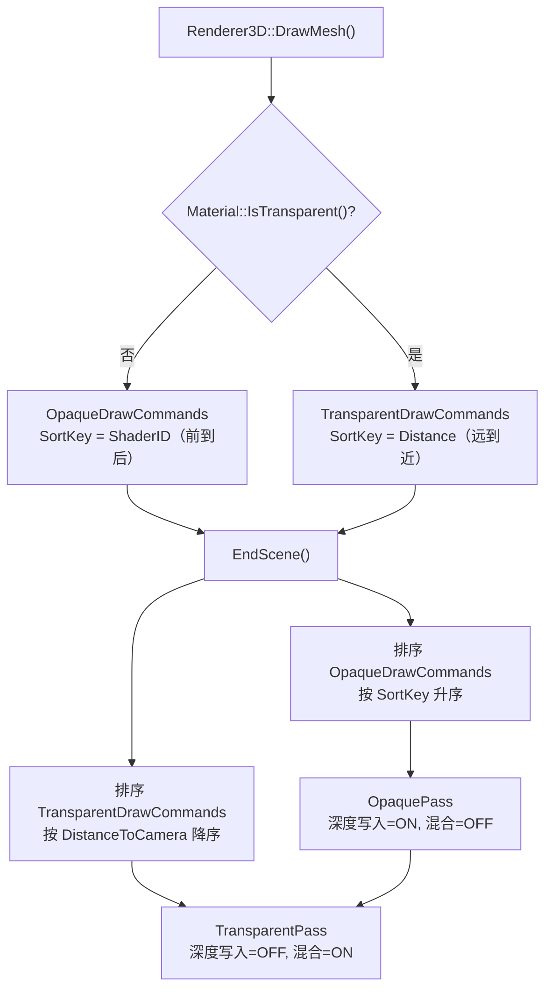

# PhaseR20：透明物体渲染（TransparentPass）

> **文档版本**：v1.0  
> **创建日期**：2026-04-30  
> **对应功能编号**：R-TODO-03  
> **前置依赖**：R-34（Per-Material RenderState）、R-28（OpaquePass）、R-15（DrawCommand 排序）  
> **预估工作量**：1-2 天

---

## 目录

1. [功能概述](#1-功能概述)
2. [当前系统分析](#2-当前系统分析)
3. [设计方案](#3-设计方案)
4. [实现方案对比](#4-实现方案对比)
5. [推荐方案详细设计](#5-推荐方案详细设计)
6. [代码实现](#6-代码实现)
7. [着色器修改](#7-着色器修改)
8. [序列化支持](#8-序列化支持)
9. [测试验证](#9-测试验证)
10. [后续扩展](#10-后续扩展)

---

## 1. 功能概述

### 1.1 目标

实现透明物体的正确渲染，包括：
- 根据材质的 `RenderingMode`（Fade/Transparent）自动将 DrawCommand 分流到透明队列
- 透明物体按从远到近排序（Back-to-Front），确保混合结果正确
- 新建 `TransparentPass`，在 `OpaquePass` 之后执行，禁用深度写入 + 启用 Alpha 混合
- 透明物体参与阴影接收（可选：是否投射阴影）

### 1.2 核心原则

- **不透明物体优先**：先渲染所有不透明物体（写入深度缓冲），再渲染透明物体
- **从远到近排序**：透明物体必须按到相机的距离从远到近排序，确保 Alpha 混合的正确性
- **禁用深度写入**：透明物体不写入深度缓冲（否则会遮挡后面的透明物体），但仍然读取深度缓冲（被不透明物体遮挡时不绘制）

---

## 2. 当前系统分析

### 2.1 已具备的基础设施

| 基础设施 | 状态 | 关键代码 |
|---------|------|---------|
| `RenderState` 结构体 | ? 已完成 | `Renderer/RenderState.h` |
| `RenderingMode` 预设 | ? 已完成 | `ApplyRenderingMode()` 支持 Opaque/Cutout/Fade/Transparent |
| `Material::IsTransparent()` | ? 已完成 | 判断 `Queue >= 2500` |
| `RenderQueue::Transparent = 3000` | ? 已完成 | `RenderState.h` |
| `DrawCommand::DistanceToCamera` | ? 已完成 | 在 `DrawMesh()` 中已计算 |
| `BlendMode` 枚举 | ? 已完成 | `SrcAlpha_OneMinusSrcAlpha` / `One_One` / `SrcAlpha_One` |
| `RenderCommand::SetBlendMode()` | ? 已完成 | 底层混合模式切换 |
| `RenderContext` 预留字段 | ? 已注释 | `TransparentDrawCommands` 已注释预留 |
| OpaquePass 状态跟踪 | ? 已完成 | Per-Material 状态切换机制 |

### 2.2 当前问题

1. `Renderer3D::DrawMesh()` 中所有 DrawCommand 都加入 `OpaqueDrawCommands`，无分流逻辑
2. `RenderContext` 中 `TransparentDrawCommands` 被注释
3. 无 `TransparentPass` 实现
4. 透明物体的排序键应使用距离而非 ShaderID

---

## 3. 设计方案

### 3.1 整体架构



### 3.2 渲染顺序

```
Shadow 分组:
  └── ShadowPass（阴影贴图生成）

Main 分组:
  ├── OpaquePass（不透明物体，深度写入 ON）
  ├── TransparentPass（透明物体，深度写入 OFF）  ← 新增
  └── PickingPass（Entity ID 渲染）

PostProcess 分组:
  └── PostProcessPass（HDR → Tonemapping → LDR 后处理）

Outline 分组:
  ├── SilhouettePass
  └── OutlineCompositePass
```

---

## 4. 实现方案对比

### 4.1 方案 A：独立 TransparentPass（? 推荐 - 最优）

**描述**：新建独立的 `TransparentPass` 类，从 `RenderContext` 中获取透明物体列表，独立执行渲染。

**优点**：
- 职责单一，代码清晰
- 与 OpaquePass 完全解耦，可独立启用/禁用
- 符合现有 RenderPass 架构设计
- 易于后续扩展（如 OIT 替换）

**缺点**：
- 新增一个文件（但代码量很小，约 80 行）

**代码结构**：
```
Lucky/Source/Lucky/Renderer/Passes/TransparentPass.h
Lucky/Source/Lucky/Renderer/Passes/TransparentPass.cpp
```

---

### 4.2 方案 B：OpaquePass 内部分阶段渲染（? 不推荐）

**描述**：在 `OpaquePass::Execute()` 内部，先渲染不透明物体，再切换状态渲染透明物体。

**优点**：
- 不需要新建文件
- 减少 Pass 数量

**缺点**：
- 违反单一职责原则（OpaquePass 名不副实）
- 代码耦合度高，难以独立控制透明渲染的开关
- 不符合现有架构设计模式
- 后续扩展困难

---

### 4.3 方案 C：合并为 GeometryPass（?? 其次）

**描述**：将 OpaquePass 重命名为 GeometryPass，内部按 RenderQueue 分段渲染。

**优点**：
- 语义更准确（"几何体渲染"包含不透明和透明）
- 减少 Pass 间的上下文切换

**缺点**：
- 需要重命名现有 OpaquePass（破坏性改动）
- 单个 Pass 职责过重
- 不利于后续添加更多渲染阶段（如 AlphaTest Pass）
- 与现有代码风格不一致（现有设计是每个 Pass 职责单一）

---

### 4.4 方案选择结论

| 方案 | 推荐度 | 理由 |
|------|--------|------|
| **A：独立 TransparentPass** | ? **最优** | 符合现有架构，职责单一，扩展性好 |
| C：合并为 GeometryPass | ?? 其次 | 语义合理但改动大，不符合现有设计模式 |
| B：OpaquePass 内部分阶段 | ? 不推荐 | 违反设计原则，耦合度高 |

**最终选择：方案 A**

---

## 5. 推荐方案详细设计

### 5.1 DrawCommand 分流策略

#### 方案 A1：在 DrawMesh() 中立即分流（? 推荐 - 最优）

```cpp
void Renderer3D::DrawMesh(...)
{
    // ... 构建 DrawCommand ...
    
    if (material->IsTransparent())
    {
        s_Data.TransparentDrawCommands.push_back(cmd);
    }
    else
    {
        s_Data.OpaqueDrawCommands.push_back(cmd);
    }
}
```

**优点**：
- 逻辑简单直观
- 只需一次判断，无需后续遍历
- 性能最优（O(1) 分流）

**缺点**：
- DrawMesh 需要知道透明/不透明的概念（但这是合理的职责）

---

#### 方案 A2：在 EndScene() 中统一分流（?? 其次）

```cpp
void Renderer3D::EndScene()
{
    // 先收集到统一列表，再分流
    for (auto& cmd : s_Data.AllDrawCommands)
    {
        if (cmd.MaterialData->IsTransparent())
            transparentCmds.push_back(std::move(cmd));
        else
            opaqueCmds.push_back(std::move(cmd));
    }
}
```

**优点**：
- DrawMesh 保持简单，不关心分流逻辑
- 分流逻辑集中在一处

**缺点**：
- 需要额外遍历一次所有 DrawCommand（O(n)）
- 需要额外的临时列表或 move 操作
- 增加 EndScene 的复杂度

---

#### 分流策略选择

| 方案 | 推荐度 | 理由 |
|------|--------|------|
| **A1：DrawMesh 中立即分流** | ? **最优** | 性能最优，逻辑直观 |
| A2：EndScene 中统一分流 | ?? 其次 | 集中管理但有额外开销 |

---

### 5.2 透明物体排序策略

#### 方案 S1：按物体中心到相机距离排序（? 推荐 - 最优）

```cpp
std::sort(transparentCmds.begin(), transparentCmds.end(),
    [](const DrawCommand& a, const DrawCommand& b)
    {
        return a.DistanceToCamera > b.DistanceToCamera;  // 降序：远的先画
    });
```

**优点**：
- 实现简单，`DistanceToCamera` 已在 `DrawMesh()` 中计算
- 对大多数场景足够正确
- 性能好（仅需 O(n log n) 排序）

**缺点**：
- 对于大型透明物体或相互穿插的透明物体，可能出现排序错误
- 物体中心不一定代表最近/最远的面

---

#### 方案 S2：按物体 AABB 最近点到相机距离排序（?? 其次）

```cpp
float nearestDist = ComputeNearestPointDistance(cmd.BoundingBox, cameraPos);
```

**优点**：
- 比中心点排序更精确
- 减少大物体的排序错误

**缺点**：
- 需要 Mesh 提供 AABB 数据（当前 Mesh 未存储 AABB）
- 实现复杂度增加
- 仍然无法解决相互穿插的情况

---

#### 方案 S3：Order-Independent Transparency (OIT)（? 当前不推荐，后续扩展）

**描述**：使用 Weighted Blended OIT 或 Depth Peeling 实现顺序无关的透明渲染。

**优点**：
- 完全解决排序问题
- 无需排序开销

**缺点**：
- 实现复杂度高（需要额外的 FBO、多 Pass）
- 性能开销大
- 超出当前阶段的需求范围

---

#### 排序策略选择

| 方案 | 推荐度 | 理由 |
|------|--------|------|
| **S1：物体中心距离排序** | ? **最优** | 简单高效，满足 90% 场景需求 |
| S2：AABB 最近点排序 | ?? 其次 | 更精确但需要额外基础设施 |
| S3：OIT | ? 后续扩展 | 过于复杂，当前阶段不需要 |

---

### 5.3 透明物体与阴影的交互

#### 方案 SH1：透明物体接收阴影但不投射阴影（? 推荐 - 最优）

**描述**：TransparentPass 中绑定 Shadow Map，透明物体可以被不透明物体的阴影遮挡，但透明物体本身不写入 Shadow Map。

**优点**：
- 实现简单（ShadowPass 只处理不透明物体，无需修改）
- 视觉效果合理（玻璃被建筑阴影遮挡是正确的）
- 性能好

**缺点**：
- 透明物体不会投射阴影（如彩色玻璃不会投射彩色阴影）

---

#### 方案 SH2：透明物体同时接收和投射阴影（?? 其次）

**描述**：ShadowPass 中也渲染透明物体，使用 Alpha 值调制阴影强度。

**优点**：
- 更真实的阴影效果

**缺点**：
- ShadowPass 需要绑定材质纹理（当前 ShadowPass 只使用简单的深度着色器）
- 实现复杂度高
- 性能开销增加

---

#### 阴影策略选择

| 方案 | 推荐度 | 理由 |
|------|--------|------|
| **SH1：接收不投射** | ? **最优** | 简单合理，满足大多数需求 |
| SH2：接收且投射 | ?? 其次 | 更真实但复杂度高，可后续扩展 |

---

### 5.4 透明物体与鼠标拾取

透明物体应该参与鼠标拾取（PickingPass），因为用户需要在编辑器中选中透明物体。

**方案**：PickingPass 同时渲染不透明和透明物体的 Entity ID。

---

## 6. 代码实现

### 6.1 修改 `Renderer3DData`（Renderer3D.cpp）

在 `Renderer3DData` 结构体中添加透明物体列表：

```cpp
struct Renderer3DData
{
    // ... 现有成员 ...
    
    std::vector<DrawCommand> OpaqueDrawCommands;        // 不透明物体绘制命令列表
    std::vector<DrawCommand> TransparentDrawCommands;   // 透明物体绘制命令列表  ← 新增
    std::vector<OutlineDrawCommand> OutlineDrawCommands;
    glm::vec3 CameraPosition;
    
    // ... 其余成员 ...
};
```

### 6.2 修改 `DrawMesh()`（Renderer3D.cpp）

在构建 DrawCommand 后，根据材质透明度分流：

```cpp
void Renderer3D::DrawMesh(const glm::mat4& transform, Ref<Mesh>& mesh,
                          const std::vector<Ref<Material>>& materials, int entityID)
{
    // 准备顶点数据
    const auto& vertices = mesh->GetVertices();
    uint32_t dataSize = sizeof(Vertex) * static_cast<uint32_t>(vertices.size());
    mesh->SetVertexBufferData(vertices.data(), dataSize);
    
    // 计算物体到相机的距离
    glm::vec3 objPos = glm::vec3(transform[3]);
    float distToCamera = glm::length(s_Data.CameraPosition - objPos);
    
    // 绘制每个 SubMesh
    for (const SubMesh& sm : mesh->GetSubMeshes())
    {
        // 获取该 SubMesh 对应的材质
        Ref<Material> material = nullptr;
        if (sm.MaterialIndex < materials.size())
        {
            material = materials[sm.MaterialIndex];
        }
        
        // 当前 SubMesh 材质不存在 使用内部错误材质
        if (!material || !material->GetShader())
        {
            material = s_Data.InternalErrorMaterial;
        }
        
        // 计算排序键
        uint64_t shaderID = material->GetShader()->GetRendererID();
        uint64_t sortKey = (shaderID & 0xFFFF) << 48;
    
        // 构建 DrawCommand
        DrawCommand cmd;
        cmd.Transform = transform;
        cmd.MeshData = mesh;
        cmd.SubMeshPtr = &sm;
        cmd.MaterialData = material;
        cmd.SortKey = sortKey;
        cmd.DistanceToCamera = distToCamera;
        cmd.EntityID = entityID;
    
        // ---- 根据材质透明度分流 ----
        if (material->IsTransparent())
        {
            s_Data.TransparentDrawCommands.push_back(cmd);
        }
        else
        {
            s_Data.OpaqueDrawCommands.push_back(cmd);
        }
    }
}
```

### 6.3 修改 `BeginScene()`（Renderer3D.cpp）

清空透明物体列表：

```cpp
void Renderer3D::BeginScene(const EditorCamera& camera, const SceneLightData& lightData)
{
    // ... 现有代码 ...
    
    // 清空绘制命令列表
    s_Data.OpaqueDrawCommands.clear();
    s_Data.TransparentDrawCommands.clear();  // ← 新增
    
    // 缓存相机位置
    s_Data.CameraPosition = camera.GetPosition();
}
```

### 6.4 修改 `EndScene()`（Renderer3D.cpp）

添加透明物体排序和 RenderContext 传递：

```cpp
void Renderer3D::EndScene()
{
    // ---- 排序不透明物体（按 SortKey 升序，聚合相同 Shader） ----
    std::sort(s_Data.OpaqueDrawCommands.begin(), s_Data.OpaqueDrawCommands.end(),
        [](const DrawCommand& a, const DrawCommand& b)
        {
            return a.SortKey < b.SortKey;
        });
    
    // ---- 排序透明物体（按距离降序，从远到近） ----
    std::sort(s_Data.TransparentDrawCommands.begin(), s_Data.TransparentDrawCommands.end(),
        [](const DrawCommand& a, const DrawCommand& b)
        {
            return a.DistanceToCamera > b.DistanceToCamera;  // 远的先画
        });
    
    // ---- 构建 RenderContext ----
    RenderContext context;
    context.OpaqueDrawCommands = &s_Data.OpaqueDrawCommands;
    context.TransparentDrawCommands = &s_Data.TransparentDrawCommands;  // ← 新增
    context.TargetFramebuffer = s_Data.TargetFramebuffer;
    context.ClearColor = s_Data.ClearColor;
    context.Stats = &s_Data.Stats;
    
    // ... 阴影数据、HDR 数据等（与现有代码相同） ...
    
    // ---- 执行渲染管线 ----
    s_Data.Pipeline.ExecuteGroup("Shadow", context);
    s_Data.Pipeline.ExecuteGroup("Main", context);      // OpaquePass + TransparentPass + PickingPass
    s_Data.Pipeline.ExecuteGroup("PostProcess", context);

    // ======== 提取描边物体到独立列表 ========
    s_Data.OutlineDrawCommands.clear();
    if (!s_Data.OutlineEntityIDs.empty())
    {
        // 从不透明物体中提取
        for (const DrawCommand& cmd : s_Data.OpaqueDrawCommands)
        {
            if (s_Data.OutlineEntityIDs.count(cmd.EntityID))
            {
                OutlineDrawCommand outlineCmd;
                outlineCmd.Transform = cmd.Transform;
                outlineCmd.MeshData = cmd.MeshData;
                outlineCmd.SubMeshPtr = cmd.SubMeshPtr;
                s_Data.OutlineDrawCommands.push_back(outlineCmd);
            }
        }
        // 从透明物体中提取（透明物体也需要描边）
        for (const DrawCommand& cmd : s_Data.TransparentDrawCommands)
        {
            if (s_Data.OutlineEntityIDs.count(cmd.EntityID))
            {
                OutlineDrawCommand outlineCmd;
                outlineCmd.Transform = cmd.Transform;
                outlineCmd.MeshData = cmd.MeshData;
                outlineCmd.SubMeshPtr = cmd.SubMeshPtr;
                s_Data.OutlineDrawCommands.push_back(outlineCmd);
            }
        }
    }
    
    // 清空绘制命令列表
    s_Data.OpaqueDrawCommands.clear();
    s_Data.TransparentDrawCommands.clear();
}
```

### 6.5 修改 `RenderContext`（RenderContext.h）

取消 `TransparentDrawCommands` 的注释：

```cpp
struct RenderContext
{
    // ---- DrawCommand 列表（已排序） ----
    const std::vector<DrawCommand>* OpaqueDrawCommands = nullptr;
    const std::vector<DrawCommand>* TransparentDrawCommands = nullptr;  // ← 取消注释
    
    // ... 其余成员不变 ...
};
```

### 6.6 新建 `TransparentPass.h`

```cpp
#pragma once

#include "Lucky/Renderer/RenderPass.h"

namespace Lucky
{
    /// <summary>
    /// 透明物体渲染 Pass
    /// 按 DistanceToCamera 从远到近排序 + 禁用深度写入 + 启用 Alpha 混合
    /// 在 OpaquePass 之后执行，确保透明物体被不透明物体正确遮挡
    /// </summary>
    class TransparentPass : public RenderPass
    {
    public:
        void Init() override {}  // 无需初始化资源（复用 HDR FBO）
        void Execute(const RenderContext& context) override;
        const std::string& GetName() const override { static std::string name = "TransparentPass"; return name; }
        const std::string& GetGroup() const override { static std::string group = "Main"; return group; }
    };
}
```

### 6.7 新建 `TransparentPass.cpp`

```cpp
#include "lcpch.h"
#include "TransparentPass.h"
#include "Lucky/Renderer/RenderContext.h"
#include "Lucky/Renderer/RenderCommand.h"
#include "Lucky/Renderer/RenderState.h"

namespace Lucky
{
    void TransparentPass::Execute(const RenderContext& context)
    {
        if (!context.TransparentDrawCommands || context.TransparentDrawCommands->empty())
        {
            return;
        }
        
        // ---- 注意：HDR FBO 已在 OpaquePass 中绑定，此处无需重新绑定 ----
        // ---- 深度缓冲区已由 OpaquePass 写入，透明物体可以正确被遮挡 ----
        
        // ---- 绑定 Shadow Map 纹理 ----
        if (context.ShadowEnabled && context.ShadowMapTextureID != 0)
        {
            RenderCommand::BindTextureUnit(15, context.ShadowMapTextureID);
        }
        
        // ---- 批量绘制透明物体（DrawCommands 已按距离从远到近排序） ----
        
        // 状态跟踪
        RenderState lastRenderState;
        uint32_t lastShaderID = 0;
        Material* lastMaterial = nullptr;
        
        for (const DrawCommand& cmd : *context.TransparentDrawCommands)
        {
            const RenderState& state = cmd.MaterialData->GetRenderState();
            
            // ---- 应用渲染状态（仅在变化时设置） ----
            
            if (state.Cull != lastRenderState.Cull)
            {
                RenderCommand::SetCullMode(state.Cull);
            }
            
            if (state.DepthWrite != lastRenderState.DepthWrite)
            {
                RenderCommand::SetDepthWrite(state.DepthWrite);
            }
            
            if (state.DepthTest != lastRenderState.DepthTest)
            {
                RenderCommand::SetDepthFunc(state.DepthTest);
            }
            
            if (state.Blend != lastRenderState.Blend)
            {
                RenderCommand::SetBlendMode(state.Blend);
            }
            
            lastRenderState = state;
            
            // 绑定 Shader
            uint32_t currentShaderID = cmd.MaterialData->GetShader()->GetRendererID();
            if (currentShaderID != lastShaderID)
            {
                cmd.MaterialData->GetShader()->Bind();
                lastShaderID = currentShaderID;
            }
            
            // 应用材质属性
            if (cmd.MaterialData.get() != lastMaterial)
            {
                cmd.MaterialData->Apply();
                lastMaterial = cmd.MaterialData.get();
            }
            
            // 设置模型矩阵
            cmd.MaterialData->GetShader()->SetMat4("u_ObjectToWorldMatrix", cmd.Transform);
            
            // 设置阴影 uniform
            if (context.ShadowEnabled)
            {
                cmd.MaterialData->GetShader()->SetInt("u_ShadowMap", 15);
                cmd.MaterialData->GetShader()->SetMat4("u_LightSpaceMatrix", context.LightSpaceMatrix);
                cmd.MaterialData->GetShader()->SetFloat("u_ShadowBias", context.ShadowBias);
                cmd.MaterialData->GetShader()->SetFloat("u_ShadowStrength", context.ShadowStrength);
                cmd.MaterialData->GetShader()->SetInt("u_ShadowEnabled", 1);
                cmd.MaterialData->GetShader()->SetInt("u_ShadowType", static_cast<int>(context.ShadowShadowType));
            }
            else
            {
                cmd.MaterialData->GetShader()->SetInt("u_ShadowEnabled", 0);
            }
            
            // 绘制
            RenderCommand::DrawIndexedRange(
                cmd.MeshData->GetVertexArray(),
                cmd.SubMeshPtr->IndexOffset,
                cmd.SubMeshPtr->IndexCount
            );
            
            // 更新统计
            if (context.Stats)
            {
                context.Stats->DrawCalls++;
                context.Stats->TriangleCount += cmd.SubMeshPtr->IndexCount / 3;
            }
        }
        
        // 绘制结束后恢复默认渲染状态
        RenderCommand::SetCullMode(CullMode::Back);
        RenderCommand::SetDepthWrite(true);
        RenderCommand::SetDepthFunc(DepthCompareFunc::Less);
        RenderCommand::SetBlendMode(BlendMode::None);
    }
}
```

### 6.8 修改 `Renderer3D::Init()`（注册 TransparentPass）

```cpp
void Renderer3D::Init()
{
    // ... 现有代码 ...
    
    // ======== 创建渲染管线 ========
    auto shadowPass = CreateRef<ShadowPass>();
    auto opaquePass = CreateRef<OpaquePass>();
    auto transparentPass = CreateRef<TransparentPass>();     // ← 新增
    auto pickingPass = CreateRef<PickingPass>();
    auto postProcessPass = CreateRef<PostProcessPass>();
    auto silhouettePass = CreateRef<SilhouettePass>();
    auto outlineCompositePass = CreateRef<OutlineCompositePass>();
    
    outlineCompositePass->SetSilhouettePass(silhouettePass);
    
    // 按顺序添加 Pass
    s_Data.Pipeline.AddPass(shadowPass);
    s_Data.Pipeline.AddPass(opaquePass);
    s_Data.Pipeline.AddPass(transparentPass);   // ← 新增：在 OpaquePass 之后
    s_Data.Pipeline.AddPass(pickingPass);
    s_Data.Pipeline.AddPass(postProcessPass);
    s_Data.Pipeline.AddPass(silhouettePass);
    s_Data.Pipeline.AddPass(outlineCompositePass);
    
    s_Data.Pipeline.Init();
    
    // ... 后处理效果注册等 ...
}
```

### 6.9 修改 `PickingPass`（支持透明物体拾取）

PickingPass 需要同时渲染透明物体的 Entity ID，确保编辑器中可以选中透明物体：

```cpp
void PickingPass::Execute(const RenderContext& context)
{
    // ... 现有的不透明物体 Entity ID 渲染 ...
    
    // ---- 渲染透明物体的 Entity ID ----
    if (context.TransparentDrawCommands)
    {
        for (const DrawCommand& cmd : *context.TransparentDrawCommands)
        {
            m_EntityIDShader->SetMat4("u_ObjectToWorldMatrix", cmd.Transform);
            m_EntityIDShader->SetInt("u_EntityID", cmd.EntityID);
            
            RenderCommand::DrawIndexedRange(
                cmd.MeshData->GetVertexArray(),
                cmd.SubMeshPtr->IndexOffset,
                cmd.SubMeshPtr->IndexCount
            );
        }
    }
}
```

---

## 7. 着色器修改

### 7.1 Standard.frag 已支持透明度

当前 `Standard.frag` 已经输出 `alpha` 值：

```glsl
o_Color = vec4(color, alpha);
```

其中 `alpha` 来自 `u_Albedo.a * texture(u_AlbedoMap, v_Input.TexCoord).a`。

当材质设置为 Transparent/Fade 模式时，GPU 的混合状态由 `TransparentPass` 通过 `RenderCommand::SetBlendMode()` 设置，着色器无需修改。

### 7.2 Alpha Cutout 支持（可选增强）

如果需要支持 `RenderingMode::Cutout`（Alpha 裁剪），需要在 `Standard.frag` 中添加 `discard`：

```glsl
// ---- Alpha Cutout ----
uniform float u_AlphaCutoff;  // Alpha 裁剪阈值（默认 0.5）

void main()
{
    // ... 采样 albedo ...
    
    // Alpha Cutout（仅在 Cutout 模式下生效）
    if (alpha < u_AlphaCutoff)
    {
        discard;
    }
    
    // ... 后续光照计算 ...
}
```

> **注意**：Alpha Cutout 物体仍然在 OpaquePass 中渲染（Queue = 2450 < 2500），因为它们写入深度缓冲。`discard` 语句会丢弃低于阈值的片段。

---

## 8. 序列化支持

当前序列化系统已支持 `RenderingMode` 的保存和加载（在 `MaterialSerializer` 中）。透明物体渲染功能不需要额外的序列化修改，因为：

1. `RenderingMode` 已序列化（Opaque/Cutout/Fade/Transparent）
2. `RenderState` 的各字段（CullMode/DepthWrite/BlendMode/Queue）已序列化
3. 加载场景时，`ApplyRenderingMode()` 会自动配置正确的渲染状态

---

## 9. 测试验证

### 9.1 基本功能测试

1. **创建透明物体**：
   - 创建一个 Cube，将材质 RenderingMode 设为 Transparent
   - 设置 `u_Albedo` 的 Alpha 值为 0.5
   - 验证物体呈半透明效果

2. **排序正确性**：
   - 创建多个透明物体，前后排列
   - 验证从任意角度观察，混合结果正确（远处物体先绘制）

3. **不透明遮挡**：
   - 在透明物体前放置不透明物体
   - 验证不透明物体正确遮挡透明物体

4. **阴影接收**：
   - 在透明物体上方放置方向光（启用阴影）
   - 验证透明物体可以接收阴影

### 9.2 编辑器功能测试

1. **鼠标拾取**：点击透明物体，验证可以正确选中
2. **描边**：选中透明物体，验证描边效果正常
3. **Inspector**：修改 RenderingMode，验证实时切换效果
4. **序列化**：保存/加载场景，验证透明物体状态正确恢复

### 9.3 边界情况测试

1. **全透明物体**（Alpha = 0）：应该不可见但仍可拾取
2. **混合模式切换**：运行时切换 Opaque ? Transparent，验证分流正确
3. **空场景**：无透明物体时，TransparentPass 应该直接跳过（early return）

---

## 10. 后续扩展

### 10.1 短期扩展

- **Alpha Cutout 支持**：在 Standard.frag 中添加 `u_AlphaCutoff` uniform + `discard`
- **双面渲染**：透明物体默认 `CullMode::Off`（可在 `ApplyRenderingMode` 中配置）

### 10.2 中期扩展

- **透明物体投射阴影**：ShadowPass 支持 Alpha 测试
- **AABB 排序**：Mesh 存储 AABB，使用最近点距离排序

### 10.3 长期扩展

- **Order-Independent Transparency (OIT)**：Weighted Blended OIT 或 Depth Peeling
- **Per-Pixel Sorting**：A-Buffer 或 Linked List OIT

---

## 附录：文件修改清单

| 文件 | 操作 | 说明 |
|------|------|------|
| `Renderer/Passes/TransparentPass.h` | **新建** | TransparentPass 头文件 |
| `Renderer/Passes/TransparentPass.cpp` | **新建** | TransparentPass 实现 |
| `Renderer/RenderContext.h` | **修改** | 取消 `TransparentDrawCommands` 注释 |
| `Renderer/Renderer3D.cpp` | **修改** | DrawMesh 分流 + BeginScene 清空 + EndScene 排序和传递 + Init 注册 Pass |
| `Renderer/Passes/PickingPass.cpp` | **修改** | 添加透明物体 Entity ID 渲染 |

**总代码量**：约 120-150 行新增代码 + 约 20 行修改
