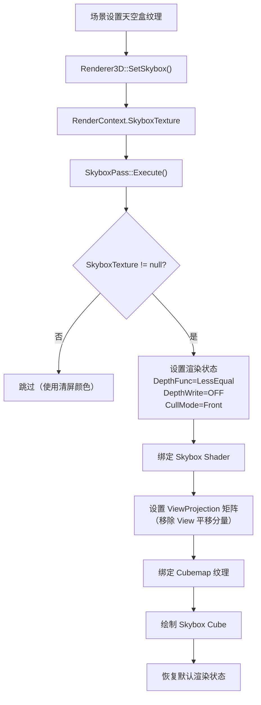
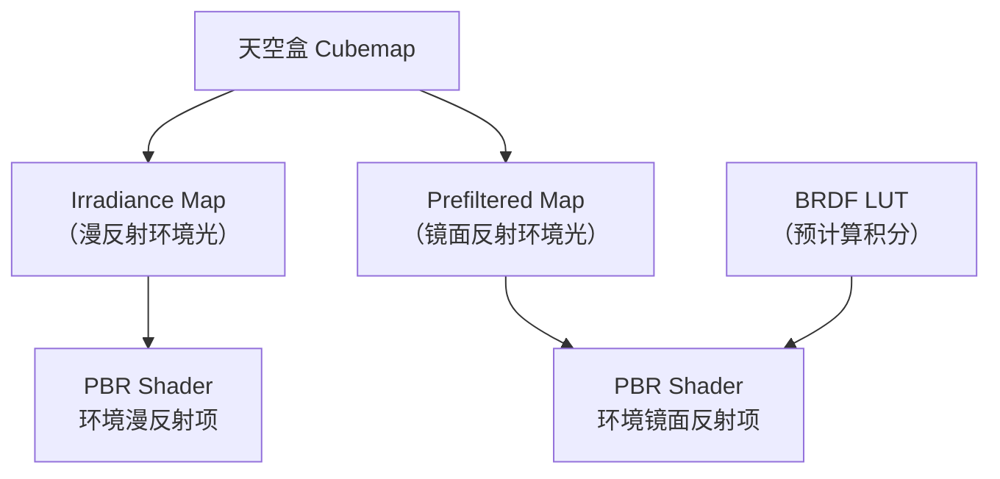

# PhaseR21：天空盒渲染（SkyboxPass）

> **文档版本**：v1.0  
> **创建日期**：2026-04-30  
> **对应功能编号**：R-TODO-07  
> **前置依赖**：R-28（OpaquePass）、R-29（HDR + Tonemapping）、R-17（RenderPass 抽象）  
> **预估工作量**：2-3 天

---

## 目录

1. [功能概述](#1-功能概述)
2. [当前系统分析](#2-当前系统分析)
3. [设计方案](#3-设计方案)
4. [实现方案对比](#4-实现方案对比)
5. [推荐方案详细设计](#5-推荐方案详细设计)
6. [代码实现](#6-代码实现)
7. [着色器实现](#7-着色器实现)
8. [序列化支持](#8-序列化支持)
9. [编辑器集成](#9-编辑器集成)
10. [测试验证](#10-测试验证)
11. [后续扩展](#11-后续扩展)

---

## 1. 功能概述

### 1.1 目标

实现天空盒渲染功能，包括：
- 支持 Cubemap（6 面纹理）和 HDR Equirectangular（单张全景图）两种天空盒纹理格式
- 新建 `TextureCube` 类，封装 OpenGL Cubemap 纹理的创建和加载
- 新建 `SkyboxPass`，在 OpaquePass 之后渲染天空盒（利用 Early-Z 优化）
- 天空盒渲染到 HDR FBO，参与后处理管线（Tonemapping、Bloom 等）
- 提供场景级天空盒配置（全局设置或组件方式）

### 1.2 核心原则

- **深度恒为 1.0**：天空盒顶点着色器中将 `gl_Position.z = gl_Position.w`，使深度值恒为最远（1.0）
- **禁用深度写入**：天空盒不写入深度缓冲，不影响后续渲染
- **深度测试 LessEqual**：使用 `<=` 比较函数，使深度为 1.0 的天空盒像素通过测试
- **移除平移分量**：View 矩阵移除平移部分，天空盒始终"跟随"相机（无限远效果）
- **OpaquePass 之后渲染**：利用已写入的深度缓冲，被不透明物体遮挡的天空像素通过 Early-Z 直接跳过，节省片段着色器开销

---

## 2. 当前系统分析

### 2.1 已具备的基础设施

| 基础设施 | 状态 | 关键代码 |
|---------|------|---------|
| `RenderPass` 基类 | ? 已完成 | `Renderer/RenderPass.h` |
| `RenderPipeline` 管理器 | ? 已完成 | `Renderer/RenderPipeline.h/cpp` |
| `RenderContext` 渲染上下文 | ? 已完成 | `Renderer/RenderContext.h` |
| `RenderQueue::Background = 1000` | ? 已完成 | `Renderer/RenderState.h` |
| HDR FBO (RGBA16F) | ? 已完成 | `Passes/PostProcessPass.h/cpp` |
| `Texture2D` 纹理类 | ? 已完成 | `Renderer/Texture.h/cpp` |
| `ScreenQuad` 全屏四边形 | ? 已完成 | `Renderer/ScreenQuad.h/cpp` |
| `MeshFactory::CreateCube()` | ? 已完成 | `Renderer/MeshFactory.h/cpp` |
| Camera UBO (binding=0) | ? 已完成 | `Shaders/Lucky/Common.glsl` |
| `EditorCamera::GetViewMatrix()` | ? 已完成 | `Renderer/EditorCamera.h` |
| `EditorCamera::GetProjectionMatrix()` | ? 已完成 | 继承自 `Camera` 基类 |
| `RenderCommand::SetDepthFunc()` | ? 已完成 | `Renderer/RenderCommand.h` |
| `RenderCommand::SetDepthWrite()` | ? 已完成 | `Renderer/RenderCommand.h` |
| `RenderCommand::SetCullMode()` | ? 已完成 | `Renderer/RenderCommand.h` |
| Shader `#include` 指令支持 | ? 已完成 | `Renderer/Shader.h/cpp` |

### 2.2 缺失的基础设施

| 缺失项 | 说明 | 需要新建 |
|--------|------|---------|
| `TextureCube` 类 | 无 Cubemap 纹理支持 | 是 |
| Skybox Shader | 无天空盒着色器 | 是 |
| `SkyboxPass` | 无天空盒渲染 Pass | 是 |
| 天空盒几何体 | 需要一个无法线/UV 的简单 Cube | 可复用或新建 |
| 场景天空盒配置 | 无全局天空盒设置 | 是 |

### 2.3 当前渲染管线 Pass 执行顺序

```
Shadow 分组:  ShadowPass
Main 分组:    OpaquePass → PickingPass
PostProcess:  PostProcessPass
Outline:      SilhouettePass → OutlineCompositePass
```

天空盒应插入到 Main 分组中，位于 OpaquePass 之后。

---

## 3. 设计方案

### 3.1 整体架构



### 3.2 渲染顺序（天空盒插入后）

```
Shadow 分组:
  └── ShadowPass（阴影贴图生成）

Main 分组:
  ├── OpaquePass（不透明物体，深度写入 ON）
  ├── SkyboxPass（天空盒，深度写入 OFF，深度测试 LessEqual）  ← 新增
  ├── [TransparentPass]（透明物体，如果已实现）
  └── PickingPass（Entity ID 渲染）

PostProcess 分组:
  └── PostProcessPass（HDR → Tonemapping → LDR 后处理）

Outline 分组:
  ├── SilhouettePass
  └── OutlineCompositePass
```

> **注意**：天空盒在 OpaquePass 之后、TransparentPass 之前渲染。这样：
> 1. 不透明物体的深度已写入，天空盒被遮挡的像素通过 Early-Z 跳过
> 2. 透明物体可以正确地与天空盒混合（透明物体读取深度缓冲，天空盒深度为 1.0）

---

## 4. 实现方案对比

### 4.1 天空盒纹理格式方案

#### 方案 T1：6 面 Cubemap 纹理（? 推荐 - 最优）

**描述**：加载 6 张独立的纹理图片（+X, -X, +Y, -Y, +Z, -Z），组合为 OpenGL Cubemap。

**优点**：
- OpenGL 原生支持 `GL_TEXTURE_CUBE_MAP`
- 采样简单，使用 `samplerCube` + 方向向量
- 无需额外的转换计算
- 运行时性能最优

**缺点**：
- 需要 6 张图片文件（资产管理稍复杂）
- 需要用户准备正确格式的 Cubemap 图片

**适用场景**：标准天空盒、预烘焙环境贴图

---

#### 方案 T2：HDR Equirectangular 全景图（? 推荐 - 同时支持）

**描述**：加载单张 HDR 全景图（.hdr 格式），在 GPU 上转换为 Cubemap。

**优点**：
- 单张图片，资产管理简单
- HDR 格式保留高动态范围信息（适合 IBL）
- 网上资源丰富（Poly Haven 等）

**缺点**：
- 需要额外的预处理步骤（Equirectangular → Cubemap 转换）
- 转换需要额外的 Shader 和 FBO
- 初始化时有一次性开销

**适用场景**：HDR 环境贴图、IBL 预处理

---

#### 方案 T3：程序化天空（Procedural Sky）（? 其次）

**描述**：不使用纹理，通过着色器程序化生成天空（大气散射模型）。

**优点**：
- 无需纹理资产
- 可动态调整时间/天气
- 内存占用极小

**缺点**：
- 实现复杂（大气散射模型如 Preetham/Bruneton）
- 片段着色器计算量大
- 不适合室内场景

**适用场景**：户外场景、动态天气系统

---

#### 纹理格式方案选择

| 方案 | 推荐度 | 理由 |
|------|--------|------|
| **T1：6 面 Cubemap** | ? **最优（首先实现）** | 最简单直接，OpenGL 原生支持 |
| **T2：HDR Equirectangular** | ? **推荐（第二步实现）** | 为后续 IBL 铺路，资源丰富 |
| T3：程序化天空 | ? 其次 | 复杂度高，可作为后续扩展 |

**实施策略**：先实现 T1（6 面 Cubemap），再扩展 T2（HDR Equirectangular → Cubemap 转换）。两者共用同一个 `TextureCube` 类和 `SkyboxPass`。

---

### 4.2 天空盒几何体方案

#### 方案 G1：专用 Skybox Cube（简化 VAO）（? 推荐 - 最优）

**描述**：创建一个仅包含位置属性的简化立方体 VAO，不包含法线、UV、切线等属性。

**优点**：
- 内存占用最小（仅 8 个顶点 × 3 float = 96 字节，或 36 个顶点无索引）
- 顶点属性最少，GPU 带宽开销最小
- 天空盒不需要法线/UV（使用方向向量采样 Cubemap）
- 与 MeshFactory 的通用 Cube 解耦，不影响现有系统

**缺点**：
- 需要新建一个简化的 VAO（但代码量很小）

**实现方式**：在 `SkyboxPass::Init()` 中创建专用 VAO。

---

#### 方案 G2：复用 MeshFactory::CreateCube()（? 其次）

**描述**：直接使用现有的 `MeshFactory::CreateCube()` 创建的 Mesh 作为天空盒几何体。

**优点**：
- 无需新建代码，直接复用
- 代码量最少

**缺点**：
- 现有 Cube 包含完整的顶点属性（Position + Color + Normal + UV + Tangent = 48 字节/顶点）
- 天空盒不需要这些额外属性，浪费 GPU 带宽
- 需要通过 `Mesh::GetVertexArray()` 访问，引入不必要的依赖
- 现有 Cube 的顶点布局与 Skybox Shader 的输入不匹配（Shader 只需要 `a_Position`）

---

#### 方案 G3：全屏四边形 + 反投影（? 其次）

**描述**：使用 `ScreenQuad` 绘制全屏四边形，在片段着色器中通过逆投影矩阵计算世界空间方向向量，采样 Cubemap。

**优点**：
- 仅绘制 2 个三角形（最少的几何体）
- 无需 3D 立方体

**缺点**：
- 片段着色器需要额外的矩阵运算（逆 VP 矩阵）
- 每个片段都需要计算方向向量（相比 Cube 方案的顶点插值，计算量更大）
- 深度值处理更复杂（需要手动写入 `gl_FragDepth = 1.0`）
- 无法利用 Early-Z 优化（全屏四边形覆盖所有像素）

---

#### 几何体方案选择

| 方案 | 推荐度 | 理由 |
|------|--------|------|
| **G1：专用 Skybox Cube** | ? **最优** | 最小开销，与现有系统解耦，利用 Early-Z |
| G2：复用 MeshFactory Cube | ? 其次 | 简单但浪费带宽，属性不匹配 |
| G3：全屏四边形 + 反投影 | ? 其次 | 无法利用 Early-Z，片段计算量大 |

---

### 4.3 天空盒渲染时机方案

#### 方案 O1：OpaquePass 之后渲染（? 推荐 - 最优）

**描述**：天空盒在所有不透明物体渲染完成后绘制，利用已有的深度缓冲进行 Early-Z 剔除。

**优点**：
- 被不透明物体遮挡的天空像素直接被 Early-Z 跳过，不执行片段着色器
- 对于大部分场景（天空只占屏幕一小部分），性能优势明显
- 深度缓冲已完整，天空盒深度设为 1.0 不会影响后续渲染

**缺点**：
- 如果场景中天空占比很大（如空旷场景），Early-Z 优势不明显

---

#### 方案 O2：OpaquePass 之前渲染（? 不推荐）

**描述**：天空盒最先渲染，作为背景。

**优点**：
- 逻辑简单（先画背景再画物体）

**缺点**：
- 所有天空像素都会执行片段着色器，即使后续被不透明物体覆盖
- 严重的 Overdraw 问题
- 如果天空盒写入深度（1.0），后续物体仍然可以通过深度测试（< 1.0），但浪费了深度写入带宽

---

#### 方案 O3：Clear 时直接渲染到背景（? 不推荐）

**描述**：在 Clear 阶段用天空盒替代纯色清屏。

**优点**：
- 概念简单

**缺点**：
- 无法利用 Early-Z
- 与 Clear 逻辑耦合
- 不符合 RenderPass 架构

---

#### 渲染时机选择

| 方案 | 推荐度 | 理由 |
|------|--------|------|
| **O1：OpaquePass 之后** | ? **最优** | Early-Z 优化，性能最好 |
| O2：OpaquePass 之前 | ? 不推荐 | Overdraw 严重 |
| O3：Clear 时渲染 | ? 不推荐 | 不符合架构，无法优化 |

---

### 4.4 场景天空盒配置方案

#### 方案 C1：全局 Renderer3D 设置（? 推荐 - 最优）

**描述**：通过 `Renderer3D::SetSkybox(Ref<TextureCube> skybox)` 设置全局天空盒，数据通过 `RenderContext` 传递给 `SkyboxPass`。

**优点**：
- 实现最简单
- 与现有的 `SetClearColor()`、`SetPostProcessSettings()` 模式一致
- 一个场景只有一个天空盒（合理的默认假设）
- 无需新建组件

**缺点**：
- 不支持多天空盒切换（但可以通过修改全局设置实现）
- 天空盒数据不随场景序列化（需要额外处理）

---

#### 方案 C2：SkyboxComponent 组件（? 其次）

**描述**：新建 `SkyboxComponent`，挂载到场景中的某个实体上。

**优点**：
- 符合 ECS 架构
- 天空盒数据随场景序列化
- 支持多个天空盒实体（通过启用/禁用切换）

**缺点**：
- 需要新建组件 + Inspector UI
- 需要在 Scene 中查找 SkyboxComponent 并传递给 Renderer
- 过度设计（天空盒是全局唯一的，不需要挂载到特定实体）
- 增加了 Scene 和 Renderer 之间的耦合

---

#### 方案 C3：SceneSettings 结构体（? 其次）

**描述**：在 Scene 类中添加 `SceneSettings` 结构体，包含天空盒纹理路径等全局场景设置。

**优点**：
- 天空盒数据随场景序列化
- 语义清晰（场景级设置）
- 不需要新建组件

**缺点**：
- 需要修改 Scene 类
- 需要在 Scene 和 Renderer 之间建立传递机制
- 当前 Scene 类没有 SceneSettings 的概念，需要新增

---

#### 配置方案选择

| 方案 | 推荐度 | 理由 |
|------|--------|------|
| **C1：全局 Renderer3D 设置** | ? **最优（首先实现）** | 最简单，与现有模式一致 |
| C3：SceneSettings | ? 其次 | 语义好但需要改 Scene 类 |
| C2：SkyboxComponent | ? 其次 | 过度设计，天空盒是全局唯一的 |

**实施策略**：先用方案 C1 快速实现功能，后续如果需要场景序列化支持，再升级为 C3。

---

### 4.5 Cubemap 面剔除方案

#### 方案 F1：剔除正面（CullMode::Front）（? 推荐 - 最优）

**描述**：相机在 Cube 内部观察，需要渲染 Cube 的内表面（背面），因此剔除正面。

**优点**：
- 正确渲染 Cube 内表面
- 无需翻转顶点绕序

**缺点**：
- 无

---

#### 方案 F2：不剔除（CullMode::Off）（? 其次）

**描述**：禁用面剔除，渲染所有面。

**优点**：
- 简单，不需要考虑正反面

**缺点**：
- 渲染了不必要的外表面（虽然被内表面覆盖，但浪费了 GPU 资源）
- 可能出现 Z-fighting（内外表面深度相同）

---

#### 方案 F3：翻转顶点绕序（? 其次）

**描述**：创建 Cube 时翻转三角形绕序，使外表面变为内表面。

**优点**：
- 可以使用默认的 `CullMode::Back`

**缺点**：
- 需要特殊的 Cube 几何体（与标准 Cube 不同）
- 容易混淆

---

#### 面剔除方案选择

| 方案 | 推荐度 | 理由 |
|------|--------|------|
| **F1：CullMode::Front** | ? **最优** | 正确且简单，无需修改几何体 |
| F2：CullMode::Off | ? 其次 | 浪费 GPU 资源 |
| F3：翻转绕序 | ? 其次 | 增加复杂度，易混淆 |

---

## 5. 推荐方案详细设计

### 5.1 TextureCube 类设计

```cpp
/// <summary>
/// 立方体贴图纹理（Cubemap）
/// 支持两种加载方式：
/// 1. 6 面独立图片文件
/// 2. HDR Equirectangular 全景图（自动转换为 Cubemap）
/// </summary>
class TextureCube : public Texture
{
public:
    /// <summary>
    /// 从 6 面图片文件创建 Cubemap
    /// 文件命名约定：{basePath}_right.jpg, {basePath}_left.jpg, 
    ///              {basePath}_top.jpg, {basePath}_bottom.jpg,
    ///              {basePath}_front.jpg, {basePath}_back.jpg
    /// </summary>
    static Ref<TextureCube> Create(const std::array<std::string, 6>& facePaths);
    
    /// <summary>
    /// 从单张 HDR 全景图创建 Cubemap（Equirectangular → Cubemap 转换）
    /// </summary>
    static Ref<TextureCube> CreateFromHDR(const std::string& hdrPath, uint32_t resolution = 1024);
    
    /// <summary>
    /// 创建空的 Cubemap（指定分辨率，用于运行时填充）
    /// </summary>
    static Ref<TextureCube> Create(uint32_t resolution);
};
```

### 5.2 SkyboxPass 渲染状态

| 属性 | 值 | 说明 |
|------|-----|------|
| 渲染目标 | HDR FBO | 与 OpaquePass 共用同一个 HDR FBO |
| 渲染对象 | Skybox Cube（仅位置属性） | 36 个顶点，无索引 |
| Shader | Internal/Skybox.vert + Internal/Skybox.frag | 内部着色器 |
| 深度测试 | LessEqual（`<=`） | 天空盒深度 = 1.0，通过 `<=` 测试 |
| 深度写入 | OFF | 不写入深度缓冲 |
| 面剔除 | Front（剔除正面） | 相机在 Cube 内部，渲染内表面 |
| 混合 | OFF | 天空盒不透明 |
| 分组 | "Main" | 与 OpaquePass 同组 |

### 5.3 View 矩阵处理

天空盒需要"跟随"相机移动（无限远效果），因此需要移除 View 矩阵的平移分量：

```cpp
// 移除 View 矩阵的平移分量（保留旋转）
glm::mat4 viewNoTranslation = glm::mat4(glm::mat3(camera->GetViewMatrix()));
glm::mat4 skyboxVP = camera->GetProjectionMatrix() * viewNoTranslation;
```

### 5.4 深度值处理

在顶点着色器中，将输出位置的 z 分量设为 w 分量，使经过透视除法后深度恒为 1.0：

```glsl
vec4 pos = u_SkyboxVP * vec4(a_Position, 1.0);
gl_Position = pos.xyww;  // z = w → 透视除法后 z/w = 1.0
```

---

## 6. 代码实现

### 6.1 新建 `TextureCube.h`

```cpp
// Lucky/Source/Lucky/Renderer/TextureCube.h
#pragma once

#include "Lucky/Core/Base.h"
#include "Texture.h"

#include <array>
#include <string>

namespace Lucky
{
    /// <summary>
    /// 立方体贴图纹理（Cubemap）
    /// 用于天空盒渲染和后续 IBL 环境光照
    /// 
    /// 支持两种加载方式：
    /// 1. 从 6 面独立图片文件加载（LDR 格式：.jpg/.png）
    /// 2. 从单张 HDR 全景图加载（.hdr 格式，自动转换为 Cubemap）
    /// </summary>
    class TextureCube : public Texture
    {
    public:
        /// <summary>
        /// 从 6 面图片文件创建 Cubemap
        /// 面顺序：+X(Right), -X(Left), +Y(Top), -Y(Bottom), +Z(Front), -Z(Back)
        /// </summary>
        /// <param name="facePaths">6 面图片文件路径数组</param>
        /// <returns>TextureCube 实例</returns>
        static Ref<TextureCube> Create(const std::array<std::string, 6>& facePaths);
        
        /// <summary>
        /// 从单张 HDR Equirectangular 全景图创建 Cubemap
        /// 内部执行 Equirectangular → Cubemap 转换
        /// </summary>
        /// <param name="hdrPath">HDR 全景图文件路径（.hdr 格式）</param>
        /// <param name="resolution">Cubemap 每面分辨率（默认 1024×1024）</param>
        /// <returns>TextureCube 实例</returns>
        static Ref<TextureCube> CreateFromHDR(const std::string& hdrPath, uint32_t resolution = 1024);
        
        /// <summary>
        /// 创建空的 Cubemap（指定分辨率，用于运行时填充）
        /// </summary>
        /// <param name="resolution">每面分辨率</param>
        /// <returns>TextureCube 实例</returns>
        static Ref<TextureCube> Create(uint32_t resolution);
        
        /// <summary>
        /// 从 6 面图片文件构造
        /// </summary>
        TextureCube(const std::array<std::string, 6>& facePaths);
        
        /// <summary>
        /// 从 HDR 全景图构造
        /// </summary>
        TextureCube(const std::string& hdrPath, uint32_t resolution);
        
        /// <summary>
        /// 空 Cubemap 构造
        /// </summary>
        TextureCube(uint32_t resolution);
        
        ~TextureCube();
        
        // ---- Texture 接口实现 ----
        uint32_t GetWidth() const override { return m_Resolution; }
        uint32_t GetHeight() const override { return m_Resolution; }
        uint32_t GetRendererID() const override { return m_RendererID; }
        const std::string& GetPath() const override { return m_Path; }
        void SetData(void* data, uint32_t size) override;
        void Bind(uint32_t slot = 0) const override;
        
    private:
        uint32_t m_RendererID = 0;      // OpenGL 纹理 ID
        uint32_t m_Resolution = 0;      // 每面分辨率
        std::string m_Path;             // 路径（6 面时为第一张图片路径，HDR 时为 .hdr 路径）
        bool m_IsHDR = false;           // 是否为 HDR 格式
    };
}
```

### 6.2 新建 `TextureCube.cpp`

```cpp
// Lucky/Source/Lucky/Renderer/TextureCube.cpp
#include "lcpch.h"
#include "TextureCube.h"

#include <stb_image.h>
#include <glad/glad.h>

namespace Lucky
{
    // ======== 静态工厂方法 ========
    
    Ref<TextureCube> TextureCube::Create(const std::array<std::string, 6>& facePaths)
    {
        return CreateRef<TextureCube>(facePaths);
    }
    
    Ref<TextureCube> TextureCube::CreateFromHDR(const std::string& hdrPath, uint32_t resolution)
    {
        return CreateRef<TextureCube>(hdrPath, resolution);
    }
    
    Ref<TextureCube> TextureCube::Create(uint32_t resolution)
    {
        return CreateRef<TextureCube>(resolution);
    }
    
    // ======== 从 6 面图片文件构造 ========
    
    TextureCube::TextureCube(const std::array<std::string, 6>& facePaths)
    {
        m_Path = facePaths[0];  // 使用第一张图片路径作为标识
        
        glCreateTextures(GL_TEXTURE_CUBE_MAP, 1, &m_RendererID);
        
        // 加载第一张图片获取分辨率
        int width, height, channels;
        stbi_set_flip_vertically_on_load(0);  // Cubemap 不需要垂直翻转
        
        stbi_uc* data = stbi_load(facePaths[0].c_str(), &width, &height, &channels, 0);
        LF_CORE_ASSERT(data, "Failed to load cubemap face: {0}", facePaths[0]);
        
        m_Resolution = static_cast<uint32_t>(width);
        
        // 确定格式
        GLenum internalFormat = (channels == 4) ? GL_RGBA8 : GL_RGB8;
        GLenum dataFormat = (channels == 4) ? GL_RGBA : GL_RGB;
        
        // 分配存储
        glTextureStorage2D(m_RendererID, 1, internalFormat, m_Resolution, m_Resolution);
        
        // 上传第一面
        glTextureSubImage3D(m_RendererID, 0, 0, 0, 0, m_Resolution, m_Resolution, 1, dataFormat, GL_UNSIGNED_BYTE, data);
        stbi_image_free(data);
        
        // 加载并上传剩余 5 面
        for (int i = 1; i < 6; ++i)
        {
            data = stbi_load(facePaths[i].c_str(), &width, &height, &channels, 0);
            LF_CORE_ASSERT(data, "Failed to load cubemap face: {0}", facePaths[i]);
            
            glTextureSubImage3D(m_RendererID, 0, 0, 0, i, m_Resolution, m_Resolution, 1, dataFormat, GL_UNSIGNED_BYTE, data);
            stbi_image_free(data);
        }
        
        // 设置纹理参数
        glTextureParameteri(m_RendererID, GL_TEXTURE_MIN_FILTER, GL_LINEAR);
        glTextureParameteri(m_RendererID, GL_TEXTURE_MAG_FILTER, GL_LINEAR);
        glTextureParameteri(m_RendererID, GL_TEXTURE_WRAP_S, GL_CLAMP_TO_EDGE);
        glTextureParameteri(m_RendererID, GL_TEXTURE_WRAP_T, GL_CLAMP_TO_EDGE);
        glTextureParameteri(m_RendererID, GL_TEXTURE_WRAP_R, GL_CLAMP_TO_EDGE);
    }
    
    // ======== 从 HDR 全景图构造 ========
    
    TextureCube::TextureCube(const std::string& hdrPath, uint32_t resolution)
        : m_Path(hdrPath), m_Resolution(resolution), m_IsHDR(true)
    {
        // ---- 步骤 1：加载 HDR 全景图为 2D 纹理 ----
        int width, height, channels;
        stbi_set_flip_vertically_on_load(1);  // HDR 全景图需要翻转
        
        float* hdrData = stbi_loadf(hdrPath.c_str(), &width, &height, &channels, 0);
        LF_CORE_ASSERT(hdrData, "Failed to load HDR image: {0}", hdrPath);
        
        // 创建临时 2D HDR 纹理
        uint32_t hdrTextureID;
        glCreateTextures(GL_TEXTURE_2D, 1, &hdrTextureID);
        glTextureStorage2D(hdrTextureID, 1, GL_RGB16F, width, height);
        glTextureSubImage2D(hdrTextureID, 0, 0, 0, width, height, GL_RGB, GL_FLOAT, hdrData);
        glTextureParameteri(hdrTextureID, GL_TEXTURE_MIN_FILTER, GL_LINEAR);
        glTextureParameteri(hdrTextureID, GL_TEXTURE_MAG_FILTER, GL_LINEAR);
        glTextureParameteri(hdrTextureID, GL_TEXTURE_WRAP_S, GL_CLAMP_TO_EDGE);
        glTextureParameteri(hdrTextureID, GL_TEXTURE_WRAP_T, GL_CLAMP_TO_EDGE);
        stbi_image_free(hdrData);
        
        // ---- 步骤 2：创建目标 Cubemap ----
        glCreateTextures(GL_TEXTURE_CUBE_MAP, 1, &m_RendererID);
        glTextureStorage2D(m_RendererID, 1, GL_RGB16F, m_Resolution, m_Resolution);
        glTextureParameteri(m_RendererID, GL_TEXTURE_MIN_FILTER, GL_LINEAR);
        glTextureParameteri(m_RendererID, GL_TEXTURE_MAG_FILTER, GL_LINEAR);
        glTextureParameteri(m_RendererID, GL_TEXTURE_WRAP_S, GL_CLAMP_TO_EDGE);
        glTextureParameteri(m_RendererID, GL_TEXTURE_WRAP_T, GL_CLAMP_TO_EDGE);
        glTextureParameteri(m_RendererID, GL_TEXTURE_WRAP_R, GL_CLAMP_TO_EDGE);
        
        // ---- 步骤 3：使用 Shader 将 Equirectangular 转换为 Cubemap ----
        // 注意：此步骤需要 EquirectangularToCubemap Shader 和 Capture FBO
        // 详见 7.3 节 EquirectangularToCubemap Shader
        
        // 创建 Capture FBO
        uint32_t captureFBO, captureRBO;
        glGenFramebuffers(1, &captureFBO);
        glGenRenderbuffers(1, &captureRBO);
        glBindFramebuffer(GL_FRAMEBUFFER, captureFBO);
        glBindRenderbuffer(GL_RENDERBUFFER, captureRBO);
        glRenderbufferStorage(GL_RENDERBUFFER, GL_DEPTH_COMPONENT24, m_Resolution, m_Resolution);
        glFramebufferRenderbuffer(GL_FRAMEBUFFER, GL_DEPTH_ATTACHMENT, GL_RENDERBUFFER, captureRBO);
        
        // 6 个面的视图矩阵和投影矩阵
        glm::mat4 captureProjection = glm::perspective(glm::radians(90.0f), 1.0f, 0.1f, 10.0f);
        glm::mat4 captureViews[] =
        {
            glm::lookAt(glm::vec3(0.0f), glm::vec3( 1.0f,  0.0f,  0.0f), glm::vec3(0.0f, -1.0f,  0.0f)),  // +X
            glm::lookAt(glm::vec3(0.0f), glm::vec3(-1.0f,  0.0f,  0.0f), glm::vec3(0.0f, -1.0f,  0.0f)),  // -X
            glm::lookAt(glm::vec3(0.0f), glm::vec3( 0.0f,  1.0f,  0.0f), glm::vec3(0.0f,  0.0f,  1.0f)),  // +Y
            glm::lookAt(glm::vec3(0.0f), glm::vec3( 0.0f, -1.0f,  0.0f), glm::vec3(0.0f,  0.0f, -1.0f)),  // -Y
            glm::lookAt(glm::vec3(0.0f), glm::vec3( 0.0f,  0.0f,  1.0f), glm::vec3(0.0f, -1.0f,  0.0f)),  // +Z
            glm::lookAt(glm::vec3(0.0f), glm::vec3( 0.0f,  0.0f, -1.0f), glm::vec3(0.0f, -1.0f,  0.0f))   // -Z
        };
        
        // 使用 EquirectangularToCubemap Shader 渲染 6 面
        // 注意：需要在 Renderer3D::Init() 中预加载此 Shader
        auto& shaderLib = Renderer3D::GetShaderLibrary();
        auto equirectShader = shaderLib->Get("EquirectToCubemap");
        equirectShader->Bind();
        equirectShader->SetInt("u_EquirectangularMap", 0);
        glBindTextureUnit(0, hdrTextureID);
        
        glViewport(0, 0, m_Resolution, m_Resolution);
        glBindFramebuffer(GL_FRAMEBUFFER, captureFBO);
        
        for (int i = 0; i < 6; ++i)
        {
            equirectShader->SetMat4("u_VP", captureProjection * captureViews[i]);
            glFramebufferTextureLayer(GL_FRAMEBUFFER, GL_COLOR_ATTACHMENT0, m_RendererID, 0, i);
            glClear(GL_COLOR_BUFFER_BIT | GL_DEPTH_BUFFER_BIT);
            
            // 绘制 Cube（需要一个简单的 Cube VAO）
            // 此处使用 SkyboxPass 的静态 Cube VAO（或临时创建）
            // 具体实现见 6.6 节
        }
        
        // 清理
        glBindFramebuffer(GL_FRAMEBUFFER, 0);
        glDeleteFramebuffers(1, &captureFBO);
        glDeleteRenderbuffers(1, &captureRBO);
        glDeleteTextures(1, &hdrTextureID);
    }
    
    // ======== 空 Cubemap 构造 ========
    
    TextureCube::TextureCube(uint32_t resolution)
        : m_Resolution(resolution)
    {
        glCreateTextures(GL_TEXTURE_CUBE_MAP, 1, &m_RendererID);
        glTextureStorage2D(m_RendererID, 1, GL_RGB16F, m_Resolution, m_Resolution);
        
        glTextureParameteri(m_RendererID, GL_TEXTURE_MIN_FILTER, GL_LINEAR);
        glTextureParameteri(m_RendererID, GL_TEXTURE_MAG_FILTER, GL_LINEAR);
        glTextureParameteri(m_RendererID, GL_TEXTURE_WRAP_S, GL_CLAMP_TO_EDGE);
        glTextureParameteri(m_RendererID, GL_TEXTURE_WRAP_T, GL_CLAMP_TO_EDGE);
        glTextureParameteri(m_RendererID, GL_TEXTURE_WRAP_R, GL_CLAMP_TO_EDGE);
    }
    
    // ======== 析构 ========
    
    TextureCube::~TextureCube()
    {
        glDeleteTextures(1, &m_RendererID);
    }
    
    // ======== 接口实现 ========
    
    void TextureCube::SetData(void* data, uint32_t size)
    {
        // Cubemap 不支持通过 SetData 设置（使用构造函数加载）
        LF_CORE_ASSERT(false, "TextureCube::SetData() is not supported. Use Create() factory methods.");
    }
    
    void TextureCube::Bind(uint32_t slot) const
    {
        glBindTextureUnit(slot, m_RendererID);
    }
}
```

### 6.3 新建 `SkyboxPass.h`

```cpp
// Lucky/Source/Lucky/Renderer/Passes/SkyboxPass.h
#pragma once

#include "Lucky/Renderer/RenderPass.h"
#include "Lucky/Renderer/Shader.h"
#include "Lucky/Renderer/VertexArray.h"
#include "Lucky/Renderer/Buffer.h"
#include "Lucky/Renderer/TextureCube.h"

namespace Lucky
{
    /// <summary>
    /// 天空盒渲染 Pass
    /// 在 OpaquePass 之后渲染，利用 Early-Z 跳过被遮挡的天空像素
    /// 渲染状态：深度测试 LessEqual + 深度写入 OFF + 面剔除 Front
    /// 属于 "Main" 分组
    /// </summary>
    class SkyboxPass : public RenderPass
    {
    public:
        void Init() override;
        void Execute(const RenderContext& context) override;
        
        const std::string& GetName() const override
        {
            static std::string name = "SkyboxPass";
            return name;
        }
        
        const std::string& GetGroup() const override
        {
            static std::string group = "Main";
            return group;
        }
        
    private:
        Ref<Shader> m_SkyboxShader;     // 天空盒着色器
        Ref<VertexArray> m_CubeVAO;     // 天空盒 Cube VAO（仅位置属性）
        Ref<VertexBuffer> m_CubeVBO;    // 天空盒 Cube VBO
    };
}
```

### 6.4 新建 `SkyboxPass.cpp`

```cpp
// Lucky/Source/Lucky/Renderer/Passes/SkyboxPass.cpp
#include "lcpch.h"
#include "SkyboxPass.h"
#include "Lucky/Renderer/RenderContext.h"
#include "Lucky/Renderer/RenderCommand.h"
#include "Lucky/Renderer/Renderer3D.h"

namespace Lucky
{
    // 天空盒 Cube 顶点数据（仅位置，36 个顶点，无索引）
    static const float s_SkyboxVertices[] = {
        // +X face
        1.0f, -1.0f, -1.0f,
        1.0f, -1.0f,  1.0f,
        1.0f,  1.0f,  1.0f,
        1.0f,  1.0f,  1.0f,
        1.0f,  1.0f, -1.0f,
        1.0f, -1.0f, -1.0f,
        // -X face
       -1.0f, -1.0f,  1.0f,
       -1.0f, -1.0f, -1.0f,
       -1.0f,  1.0f, -1.0f,
       -1.0f,  1.0f, -1.0f,
       -1.0f,  1.0f,  1.0f,
       -1.0f, -1.0f,  1.0f,
        // +Y face
       -1.0f,  1.0f, -1.0f,
        1.0f,  1.0f, -1.0f,
        1.0f,  1.0f,  1.0f,
        1.0f,  1.0f,  1.0f,
       -1.0f,  1.0f,  1.0f,
       -1.0f,  1.0f, -1.0f,
        // -Y face
       -1.0f, -1.0f,  1.0f,
        1.0f, -1.0f,  1.0f,
        1.0f, -1.0f, -1.0f,
        1.0f, -1.0f, -1.0f,
       -1.0f, -1.0f, -1.0f,
       -1.0f, -1.0f,  1.0f,
        // +Z face
       -1.0f, -1.0f,  1.0f,
       -1.0f,  1.0f,  1.0f,
        1.0f,  1.0f,  1.0f,
        1.0f,  1.0f,  1.0f,
        1.0f, -1.0f,  1.0f,
       -1.0f, -1.0f,  1.0f,
        // -Z face
        1.0f, -1.0f, -1.0f,
        1.0f,  1.0f, -1.0f,
       -1.0f,  1.0f, -1.0f,
       -1.0f,  1.0f, -1.0f,
       -1.0f, -1.0f, -1.0f,
        1.0f, -1.0f, -1.0f
    };
    
    void SkyboxPass::Init()
    {
        // ---- 加载天空盒着色器 ----
        auto& shaderLib = Renderer3D::GetShaderLibrary();
        m_SkyboxShader = shaderLib->Get("Skybox");
        
        // ---- 创建天空盒 Cube VAO（仅位置属性） ----
        m_CubeVAO = VertexArray::Create();
        
        m_CubeVBO = VertexBuffer::Create(s_SkyboxVertices, sizeof(s_SkyboxVertices));
        m_CubeVBO->SetLayout({
            { ShaderDataType::Float3, "a_Position" }
        });
        
        m_CubeVAO->AddVertexBuffer(m_CubeVBO);
    }
    
    void SkyboxPass::Execute(const RenderContext& context)
    {
        // 如果没有设置天空盒纹理，跳过
        if (!context.SkyboxTexture)
        {
            return;
        }
        
        // ---- 注意：HDR FBO 已在 OpaquePass 中绑定，此处无需重新绑定 ----
        // ---- 深度缓冲区已由 OpaquePass 写入，天空盒被遮挡的像素通过 Early-Z 跳过 ----
        
        // ---- 设置渲染状态 ----
        RenderCommand::SetDepthFunc(DepthCompareFunc::LessEqual);   // 深度 = 1.0 通过测试
        RenderCommand::SetDepthWrite(false);                         // 不写入深度
        RenderCommand::SetCullMode(CullMode::Front);                 // 剔除正面（渲染内表面）
        
        // ---- 绑定 Shader ----
        m_SkyboxShader->Bind();
        
        // ---- 计算天空盒 VP 矩阵（移除 View 平移分量） ----
        glm::mat4 viewNoTranslation = glm::mat4(glm::mat3(context.Camera->GetViewMatrix()));
        glm::mat4 skyboxVP = context.Camera->GetProjectionMatrix() * viewNoTranslation;
        m_SkyboxShader->SetMat4("u_SkyboxVP", skyboxVP);
        
        // ---- 绑定 Cubemap 纹理 ----
        context.SkyboxTexture->Bind(0);
        m_SkyboxShader->SetInt("u_SkyboxMap", 0);
        
        // ---- 绘制天空盒 Cube ----
        RenderCommand::DrawArrays(m_CubeVAO, 36);
        
        // ---- 恢复默认渲染状态 ----
        RenderCommand::SetDepthFunc(DepthCompareFunc::Less);
        RenderCommand::SetDepthWrite(true);
        RenderCommand::SetCullMode(CullMode::Back);
        
        // 更新统计
        if (context.Stats)
        {
            context.Stats->DrawCalls++;
            context.Stats->TriangleCount += 12;  // Cube = 12 个三角形
        }
    }
}
```

### 6.5 修改 `RenderContext.h`

在 `RenderContext` 结构体中添加天空盒相关字段：

```cpp
struct RenderContext
{
    // ---- DrawCommand 列表（已排序） ----
    const std::vector<DrawCommand>* OpaqueDrawCommands = nullptr;
    const std::vector<DrawCommand>* TransparentDrawCommands = nullptr;
    
    // ... 现有成员 ...
    
    // ---- 天空盒数据 ----
    Ref<TextureCube> SkyboxTexture;             // 天空盒 Cubemap 纹理（nullptr 表示不渲染天空盒）
    const EditorCamera* Camera = nullptr;       // 相机引用（SkyboxPass 需要 View/Projection 矩阵）
    
    // ... 其余成员不变 ...
};
```

> **注意**：当前 `RenderContext` 中没有 `Camera` 字段（Camera 数据通过 UBO 传递给 Shader）。天空盒需要在 CPU 端计算移除平移分量的 VP 矩阵，因此需要添加 `Camera` 指针。

### 6.6 修改 `Renderer3DData`（Renderer3D.cpp）

添加天空盒纹理存储：

```cpp
struct Renderer3DData
{
    // ... 现有成员 ...
    
    // ======== 天空盒数据 ========
    Ref<TextureCube> SkyboxTexture;     // 天空盒纹理（nullptr 表示不渲染天空盒）
    
    // ... 其余成员 ...
};
```

### 6.7 修改 `Renderer3D.h`

添加天空盒设置接口：

```cpp
class Renderer3D
{
public:
    // ... 现有接口 ...
    
    /// <summary>
    /// 设置天空盒纹理
    /// </summary>
    /// <param name="skybox">Cubemap 纹理（nullptr 表示禁用天空盒）</param>
    static void SetSkybox(const Ref<TextureCube>& skybox);
    
    /// <summary>
    /// 获取当前天空盒纹理
    /// </summary>
    static const Ref<TextureCube>& GetSkybox();
};
```

### 6.8 修改 `Renderer3D.cpp`

#### 6.8.1 添加 SetSkybox/GetSkybox 实现

```cpp
void Renderer3D::SetSkybox(const Ref<TextureCube>& skybox)
{
    s_Data.SkyboxTexture = skybox;
}

const Ref<TextureCube>& Renderer3D::GetSkybox()
{
    return s_Data.SkyboxTexture;
}
```

#### 6.8.2 修改 Init()（注册 SkyboxPass + 加载 Shader）

```cpp
void Renderer3D::Init()
{
    // ... 现有 Shader 加载 ...
    s_Data.ShaderLib->Load("Assets/Shaders/Internal/Skybox");   // ← 新增：天空盒着色器
    
    // ... 现有代码 ...
    
    // ======== 创建渲染管线 ========
    auto shadowPass = CreateRef<ShadowPass>();
    auto opaquePass = CreateRef<OpaquePass>();
    auto skyboxPass = CreateRef<SkyboxPass>();           // ← 新增
    auto pickingPass = CreateRef<PickingPass>();
    auto postProcessPass = CreateRef<PostProcessPass>();
    auto silhouettePass = CreateRef<SilhouettePass>();
    auto outlineCompositePass = CreateRef<OutlineCompositePass>();
    
    outlineCompositePass->SetSilhouettePass(silhouettePass);
    
    // 按顺序添加 Pass
    s_Data.Pipeline.AddPass(shadowPass);
    s_Data.Pipeline.AddPass(opaquePass);
    s_Data.Pipeline.AddPass(skyboxPass);        // ← 新增：在 OpaquePass 之后
    s_Data.Pipeline.AddPass(pickingPass);
    s_Data.Pipeline.AddPass(postProcessPass);
    s_Data.Pipeline.AddPass(silhouettePass);
    s_Data.Pipeline.AddPass(outlineCompositePass);
    
    s_Data.Pipeline.Init();
    
    // ... 后处理效果注册等 ...
}
```

#### 6.8.3 修改 BeginScene()（缓存相机引用）

```cpp
void Renderer3D::BeginScene(const EditorCamera& camera, const SceneLightData& lightData)
{
    // ... 现有代码 ...
    
    // 缓存相机引用（SkyboxPass 需要 View/Projection 矩阵）
    s_Data.CameraRef = &camera;  // ← 新增
    
    // 缓存相机位置
    s_Data.CameraPosition = camera.GetPosition();
}
```

> **注意**：需要在 `Renderer3DData` 中添加 `const EditorCamera* CameraRef = nullptr;`

#### 6.8.4 修改 EndScene()（传递天空盒数据到 RenderContext）

```cpp
void Renderer3D::EndScene()
{
    // ... 现有排序代码 ...
    
    // ---- 构建 RenderContext ----
    RenderContext context;
    context.OpaqueDrawCommands = &s_Data.OpaqueDrawCommands;
    context.TargetFramebuffer = s_Data.TargetFramebuffer;
    context.ClearColor = s_Data.ClearColor;
    context.Stats = &s_Data.Stats;
    
    // 天空盒数据
    context.SkyboxTexture = s_Data.SkyboxTexture;   // ← 新增
    context.Camera = s_Data.CameraRef;              // ← 新增
    
    // ... 阴影数据、HDR 数据等（与现有代码相同） ...
    
    // ---- 执行渲染管线 ----
    // ... 与现有代码相同 ...
}
```

---

## 7. 着色器实现

### 7.1 Skybox.vert（天空盒顶点着色器）

```glsl
// Assets/Shaders/Internal/Skybox.vert
#version 450 core

layout(location = 0) in vec3 a_Position;

out vec3 v_TexCoord;    // 方向向量（用于采样 Cubemap）

uniform mat4 u_SkyboxVP;   // 天空盒 VP 矩阵（View 移除平移 × Projection）

void main()
{
    // 顶点位置即为 Cubemap 采样方向
    v_TexCoord = a_Position;
    
    // 计算裁剪空间位置
    vec4 pos = u_SkyboxVP * vec4(a_Position, 1.0);
    
    // 将 z 设为 w，使透视除法后深度恒为 1.0（最远处）
    gl_Position = pos.xyww;
}
```

### 7.2 Skybox.frag（天空盒片段着色器）

```glsl
// Assets/Shaders/Internal/Skybox.frag
#version 450 core

in vec3 v_TexCoord;     // 方向向量

uniform samplerCube u_SkyboxMap;    // Cubemap 纹理

layout(location = 0) out vec4 o_Color;

void main()
{
    // 使用方向向量采样 Cubemap
    vec3 color = texture(u_SkyboxMap, v_TexCoord).rgb;
    
    o_Color = vec4(color, 1.0);
}
```

> **注意**：天空盒渲染到 HDR FBO（RGBA16F），如果使用 HDR 全景图，颜色值可以超过 1.0，后续由 Tonemapping 处理。

### 7.3 EquirectToCubemap.vert（Equirectangular → Cubemap 转换顶点着色器）

```glsl
// Assets/Shaders/Internal/EquirectToCubemap.vert
#version 450 core

layout(location = 0) in vec3 a_Position;

out vec3 v_LocalPos;

uniform mat4 u_VP;  // 每面的 View × Projection

void main()
{
    v_LocalPos = a_Position;
    gl_Position = u_VP * vec4(a_Position, 1.0);
}
```

### 7.4 EquirectToCubemap.frag（Equirectangular → Cubemap 转换片段着色器）

```glsl
// Assets/Shaders/Internal/EquirectToCubemap.frag
#version 450 core

in vec3 v_LocalPos;

uniform sampler2D u_EquirectangularMap;

layout(location = 0) out vec4 o_Color;

const vec2 invAtan = vec2(0.1591, 0.3183);  // 1/(2*PI), 1/PI

/// <summary>
/// 将方向向量转换为 Equirectangular UV 坐标
/// </summary>
vec2 SampleSphericalMap(vec3 v)
{
    vec2 uv = vec2(atan(v.z, v.x), asin(v.y));
    uv *= invAtan;
    uv += 0.5;
    return uv;
}

void main()
{
    vec2 uv = SampleSphericalMap(normalize(v_LocalPos));
    vec3 color = texture(u_EquirectangularMap, uv).rgb;
    
    o_Color = vec4(color, 1.0);
}
```

> **注意**：EquirectToCubemap Shader 仅在加载 HDR 全景图时使用一次（预处理阶段），不参与每帧渲染。

---

## 8. 序列化支持

### 8.1 当前阶段（方案 C1：全局设置）

由于采用全局 `Renderer3D::SetSkybox()` 方案，天空盒纹理路径需要保存在场景文件中。

#### 8.1.1 场景文件格式扩展

在 `.luck3d` 场景文件中添加 `SceneSettings` 节点：

```yaml
Scene: Untitled
SceneSettings:
  Skybox:
    Type: Cubemap  # 或 "HDR"
    # Cubemap 模式：6 面路径
    Faces:
      - "Assets/Textures/Skybox/right.jpg"
      - "Assets/Textures/Skybox/left.jpg"
      - "Assets/Textures/Skybox/top.jpg"
      - "Assets/Textures/Skybox/bottom.jpg"
      - "Assets/Textures/Skybox/front.jpg"
      - "Assets/Textures/Skybox/back.jpg"
    # HDR 模式：单张全景图路径
    # HDRPath: "Assets/Textures/Skybox/environment.hdr"
    # Resolution: 1024
Entities:
  - Entity: 12345678
    # ...
```

#### 8.1.2 SceneSerializer 修改

在 `SceneSerializer::Serialize()` 和 `SceneSerializer::Deserialize()` 中添加天空盒序列化/反序列化逻辑：

```cpp
// 序列化
void SceneSerializer::Serialize(const std::string& filepath)
{
    YAML::Emitter out;
    out << YAML::BeginMap;
    out << YAML::Key << "Scene" << YAML::Value << "Untitled";
    
    // ---- 场景设置 ----
    out << YAML::Key << "SceneSettings" << YAML::Value << YAML::BeginMap;
    {
        out << YAML::Key << "Skybox" << YAML::Value << YAML::BeginMap;
        // 序列化天空盒配置...
        out << YAML::EndMap;
    }
    out << YAML::EndMap;
    
    // ---- 实体列表 ----
    // ... 现有代码 ...
}

// 反序列化
bool SceneSerializer::Deserialize(const std::string& filepath)
{
    // ... 现有代码 ...
    
    auto sceneSettings = data["SceneSettings"];
    if (sceneSettings)
    {
        auto skybox = sceneSettings["Skybox"];
        if (skybox)
        {
            std::string type = skybox["Type"].as<std::string>("None");
            if (type == "Cubemap")
            {
                auto faces = skybox["Faces"];
                if (faces && faces.size() == 6)
                {
                    std::array<std::string, 6> facePaths;
                    for (int i = 0; i < 6; ++i)
                        facePaths[i] = faces[i].as<std::string>();
                    
                    auto cubemap = TextureCube::Create(facePaths);
                    Renderer3D::SetSkybox(cubemap);
                }
            }
            else if (type == "HDR")
            {
                std::string hdrPath = skybox["HDRPath"].as<std::string>("");
                uint32_t resolution = skybox["Resolution"].as<uint32_t>(1024);
                if (!hdrPath.empty())
                {
                    auto cubemap = TextureCube::CreateFromHDR(hdrPath, resolution);
                    Renderer3D::SetSkybox(cubemap);
                }
            }
        }
    }
    
    // ... 现有代码 ...
}
```

---

## 9. 编辑器集成

### 9.1 Inspector 面板（场景设置区域）

在 Inspector 面板中添加天空盒设置 UI（当没有选中实体时显示场景设置）：

```cpp
// 在 InspectorPanel 中添加场景设置 UI
void InspectorPanel::DrawSceneSettings()
{
    if (ImGui::CollapsingHeader("Skybox", ImGuiTreeNodeFlags_DefaultOpen))
    {
        // 天空盒类型选择
        static int skyboxType = 0;  // 0=None, 1=Cubemap, 2=HDR
        const char* types[] = { "None", "Cubemap (6 Faces)", "HDR Equirectangular" };
        ImGui::Combo("Type", &skyboxType, types, 3);
        
        if (skyboxType == 1)
        {
            // 6 面路径输入
            // ... 文件选择 UI ...
        }
        else if (skyboxType == 2)
        {
            // HDR 文件路径输入
            // ... 文件选择 UI ...
        }
    }
}
```

### 9.2 视口背景

当天空盒启用时，OpaquePass 中的清屏颜色仍然生效（用于天空盒未覆盖的区域，正常情况下天空盒覆盖所有未被物体遮挡的像素）。

---

## 10. 测试验证

### 10.1 基本功能测试

1. **6 面 Cubemap 加载**：
   - 准备 6 张天空盒图片（right/left/top/bottom/front/back）
   - 调用 `TextureCube::Create(facePaths)` 加载
   - 调用 `Renderer3D::SetSkybox(cubemap)` 设置
   - 验证天空盒正确显示

2. **HDR 全景图加载**：
   - 准备一张 .hdr 全景图
   - 调用 `TextureCube::CreateFromHDR(path)` 加载
   - 验证 Equirectangular → Cubemap 转换正确
   - 验证 HDR 天空盒在 Tonemapping 后正确显示

3. **相机旋转**：
   - 旋转编辑器相机
   - 验证天空盒正确跟随相机旋转（无平移效果）

4. **相机移动**：
   - 移动编辑器相机
   - 验证天空盒不随相机移动（无限远效果）

### 10.2 渲染正确性测试

1. **深度遮挡**：
   - 在场景中放置不透明物体
   - 验证物体正确遮挡天空盒（物体后面不显示天空）

2. **透明物体与天空盒**：
   - 在场景中放置透明物体
   - 验证透明物体可以正确地与天空盒混合

3. **HDR + Bloom**：
   - 使用高亮度的 HDR 天空盒
   - 启用 Bloom 效果
   - 验证天空盒的高亮区域产生 Bloom 泛光

4. **性能验证**：
   - 在场景中放置大量不透明物体（覆盖大部分屏幕）
   - 验证天空盒渲染开销很小（Early-Z 跳过被遮挡的像素）

### 10.3 边界情况测试

1. **无天空盒**：`SkyboxTexture = nullptr` 时，SkyboxPass 应直接跳过
2. **空场景**：无任何物体时，天空盒应覆盖整个视口
3. **Resize**：视口大小变化时，天空盒应正确适应新的宽高比
4. **序列化**：保存/加载场景，验证天空盒配置正确恢复

---

## 11. 后续扩展

### 11.1 短期扩展

- **天空盒旋转**：添加 `SkyboxRotation` 参数，允许旋转天空盒（通过旋转采样方向实现）
- **天空盒亮度/色调**：添加 `SkyboxTint` 和 `SkyboxExposure` 参数
- **Mipmap 支持**：为 Cubemap 生成 Mipmap，支持模糊天空盒效果

### 11.2 中期扩展（IBL 环境光照）

天空盒的 Cubemap 可以直接复用为 IBL 的环境贴图：

- **Irradiance Map**：从天空盒 Cubemap 预计算漫反射辐照度贴图
- **Prefiltered Environment Map**：预计算不同粗糙度的镜面反射贴图
- **BRDF LUT**：预计算 BRDF 积分查找表



### 11.3 长期扩展

- **程序化天空**：大气散射模型（Preetham / Bruneton）
- **动态天空盒**：实时渲染场景到 Cubemap（反射探针）
- **天空盒动画**：多个天空盒之间的混合过渡

---

## 附录 A：文件修改清单

| 文件 | 操作 | 说明 |
|------|------|------|
| `Renderer/TextureCube.h` | **新建** | TextureCube 类头文件 |
| `Renderer/TextureCube.cpp` | **新建** | TextureCube 类实现 |
| `Renderer/Passes/SkyboxPass.h` | **新建** | SkyboxPass 头文件 |
| `Renderer/Passes/SkyboxPass.cpp` | **新建** | SkyboxPass 实现 |
| `Renderer/RenderContext.h` | **修改** | 添加 `SkyboxTexture` 和 `Camera` 字段 |
| `Renderer/Renderer3D.h` | **修改** | 添加 `SetSkybox()` / `GetSkybox()` 接口 |
| `Renderer/Renderer3D.cpp` | **修改** | Init 注册 Pass + BeginScene 缓存相机 + EndScene 传递天空盒数据 |
| `Shaders/Internal/Skybox.vert` | **新建** | 天空盒顶点着色器 |
| `Shaders/Internal/Skybox.frag` | **新建** | 天空盒片段着色器 |
| `Shaders/Internal/EquirectToCubemap.vert` | **新建** | HDR 转换顶点着色器（可选，HDR 支持时） |
| `Shaders/Internal/EquirectToCubemap.frag` | **新建** | HDR 转换片段着色器（可选，HDR 支持时） |
| `Serialization/SceneSerializer.cpp` | **修改** | 添加天空盒序列化/反序列化 |

---

## 附录 B：实施阶段建议

### Phase 1：基础天空盒（1-1.5 天）

1. 新建 `TextureCube` 类（仅 6 面 Cubemap 加载）
2. 新建 `SkyboxPass`（含专用 Cube VAO）
3. 新建 `Skybox.vert` + `Skybox.frag`
4. 修改 `RenderContext` + `Renderer3D`（添加天空盒数据传递）
5. 注册 SkyboxPass 到管线
6. 硬编码测试（在 Init 中加载一个测试天空盒）

### Phase 2：HDR 支持（0.5-1 天）

1. 实现 `TextureCube::CreateFromHDR()`
2. 新建 `EquirectToCubemap` Shader
3. 测试 HDR 天空盒 + Tonemapping + Bloom

### Phase 3：编辑器集成（0.5 天）

1. 序列化支持（场景文件中保存天空盒配置）
2. Inspector UI（天空盒类型选择 + 文件路径）

---

## 附录 C：与透明渲染的交互

如果透明物体渲染（PhaseR20）已实现，渲染顺序为：

```
OpaquePass → SkyboxPass → TransparentPass → PickingPass
```

天空盒在透明物体之前渲染，确保：
1. 透明物体可以正确地与天空盒混合（天空盒作为"背景"）
2. 天空盒深度为 1.0，透明物体的深度测试正确（透明物体在天空盒前面）

如果透明物体渲染尚未实现，渲染顺序为：

```
OpaquePass → SkyboxPass → PickingPass
```

两种情况下 SkyboxPass 的实现完全相同，无需修改。
