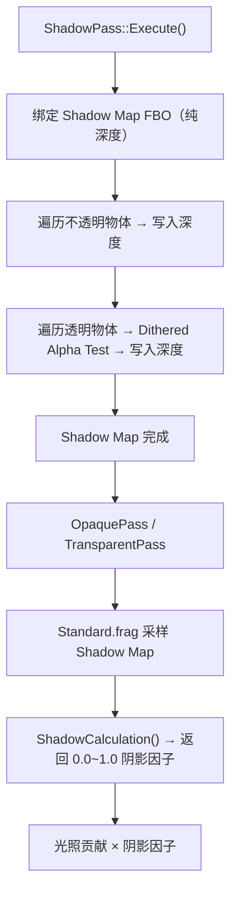
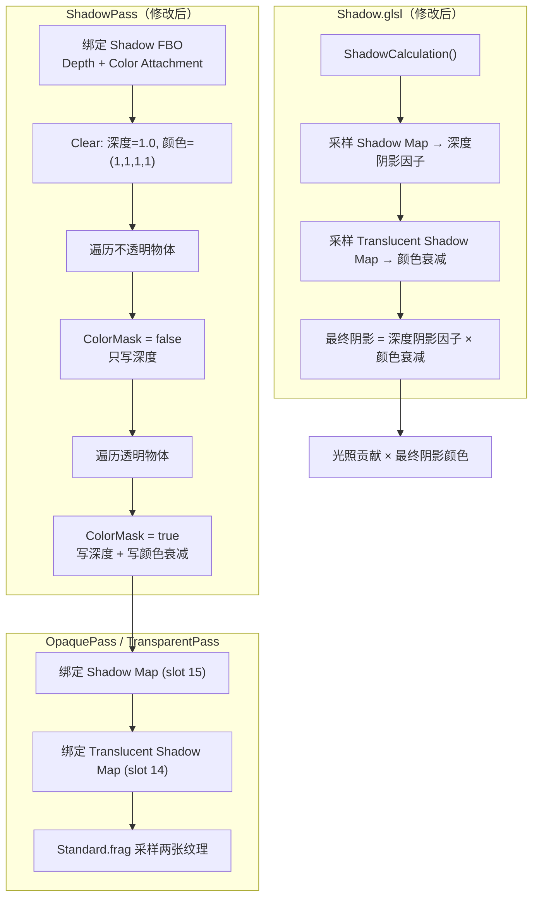
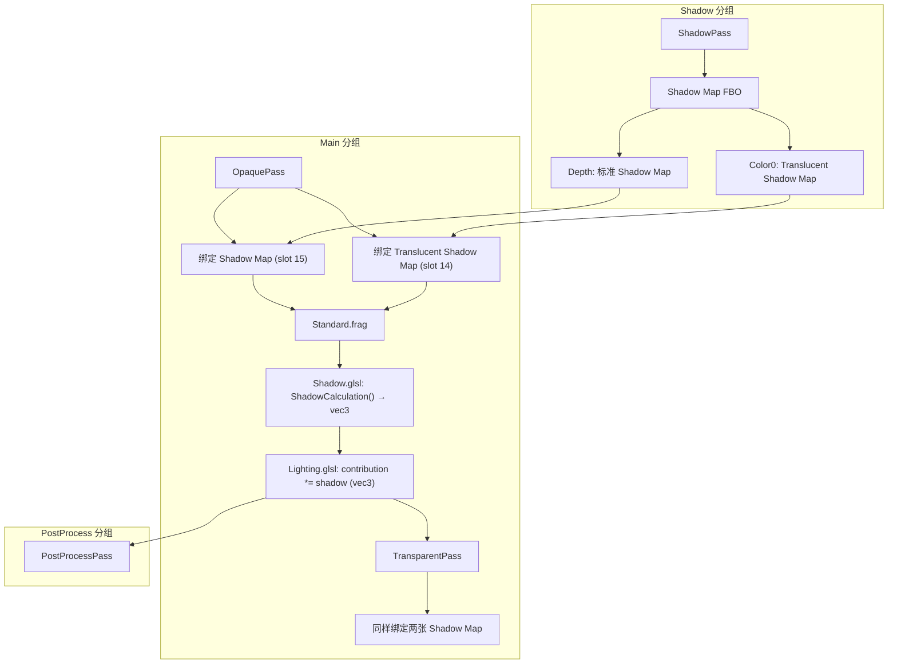

# PhaseR21：Translucent Shadow Map（半透明阴影贴图）

> **文档版本**：v1.0  
> **创建日期**：2026-04-30  
> **对应功能编号**：R-TODO-SH2  
> **前置依赖**：R20（TransparentPass）、ShadowPass（Alpha Test / Dithered Shadow 已实现）  
> **预估工作量**：2-3 天

---

## 目录

1. [功能概述](#1-功能概述)
2. [当前系统分析](#2-当前系统分析)
3. [方案总览与对比](#3-方案总览与对比)
4. [推荐方案详细设计](#4-推荐方案详细设计)
5. [Shader 实现](#5-shader-实现)
6. [C++ 端实现](#6-c-端实现)
7. [渲染管线集成](#7-渲染管线集成)
8. [测试验证](#8-测试验证)
9. [性能分析](#9-性能分析)
10. [后续扩展](#10-后续扩展)

---

## 1. 功能概述

### 1.1 目标

实现半透明物体的**连续浓度阴影**和**彩色阴影**投射：

- 半透明物体（如彩色玻璃、有色液体）投射的阴影浓度与其 alpha 值成正比
- 有颜色的半透明物体投射**彩色阴影**（如红色玻璃投射红色阴影）
- 阴影浓度和颜色连续渐变，无抖动噪点
- 与现有的不透明物体阴影系统兼容

### 1.2 与当前方案的对比

| 特性 | 当前方案（Dithered Shadow） | 本方案（Translucent Shadow Map） |
|------|---------------------------|--------------------------------|
| 阴影浓度 | 离散（Bayer 矩阵抖动模拟） | 连续渐变 |
| 彩色阴影 | ? 不支持 | ? 支持 |
| 近距离观察 | 可能看到抖动图案 | 平滑无噪点 |
| 额外 GPU 资源 | 无 | 需要额外 RGBA FBO |
| 实现复杂度 | 低 | 中等 |

### 1.3 核心原理

在标准 Shadow Map（纯深度）的基础上，额外维护一张 **Translucent Shadow Map（RGBA 颜色纹理）**，记录光线穿过透明物体后的**颜色衰减信息**：

```
光线 → [透明物体 A (红色, alpha=0.5)] → [透明物体 B (蓝色, alpha=0.3)] → 接收面
                                                                          ↓
                                                        阴影颜色 = 红色×0.5 混合 蓝色×0.3
                                                        阴影浓度 = 1 - (1-0.5)×(1-0.3) = 0.65
```

---

## 2. 当前系统分析

### 2.1 已具备的基础设施

| 基础设施 | 状态 | 关键代码 |
|---------|------|---------|
| ShadowPass（不透明 + Dithered 透明） | ? 已完成 | `Renderer/Passes/ShadowPass.cpp` |
| Shadow Map FBO（纯深度） | ? 已完成 | `ShadowPass::Init()` 中创建 |
| Shadow.vert / Shadow.frag | ? 已完成 | `Assets/Shaders/Internal/Shadow/` |
| Shadow.glsl（阴影采样库） | ? 已完成 | `Assets/Shaders/Lucky/Shadow.glsl` |
| Lighting.glsl（光照计算库） | ? 已完成 | `Assets/Shaders/Lucky/Lighting.glsl` |
| TransparentPass | ? 已完成 | `Renderer/Passes/TransparentPass.cpp` |
| Material::GetFloat4 / GetTexture | ? 已完成 | `Renderer/Material.h` |
| RenderCommand::SetBlendMode | ? 已完成 | `Renderer/RenderCommand.h` |
| RenderCommand::SetColorMask | ? 已完成 | `Renderer/RenderCommand.h` |
| Framebuffer（RGBA16F / RGBA8） | ? 已完成 | `Renderer/Framebuffer.h` |
| ScreenQuad | ? 已完成 | `Renderer/ScreenQuad.h` |
| RenderContext | ? 已完成 | `Renderer/RenderContext.h` |

### 2.2 当前阴影渲染流程



### 2.3 需要扩展的部分

1. **ShadowPass**：需要额外渲染一张 Translucent Shadow Map（RGBA 颜色纹理）
2. **Shadow.glsl**：需要额外采样 Translucent Shadow Map，将颜色衰减应用到阴影
3. **RenderContext**：需要传递 Translucent Shadow Map 纹理 ID
4. **OpaquePass / TransparentPass**：需要绑定 Translucent Shadow Map 纹理

---

## 3. 方案总览与对比

### 3.1 方案 A：单 Pass 双 FBO 渲染（? 推荐 - 最优）

**描述**：在 ShadowPass 中使用 **MRT（Multiple Render Targets）** 或 **两次遍历**，同时生成标准 Shadow Map（深度）和 Translucent Shadow Map（RGBA 颜色）。

**子方案 A1：MRT 方式（??? 推荐 - 最优）**

使用一个 FBO 同时绑定深度附件和颜色附件，一次 DrawCall 同时写入深度和颜色。

```
Shadow FBO:
  ├── Depth Attachment: Shadow Map（深度纹理，不透明 + 透明物体深度）
  └── Color Attachment 0: Translucent Shadow Map（RGBA8，透明物体颜色衰减）
```

**优点**：
- 只需一次遍历透明物体，性能最优
- 深度和颜色在同一个 FBO 中，无需额外绑定/解绑
- 不透明物体渲染时禁用颜色写入（`ColorMask = false`），零额外开销

**缺点**：
- 需要修改 Shadow Map FBO 的创建逻辑（添加颜色附件）
- Shadow.frag 需要同时输出颜色和深度

---

**子方案 A2：两次遍历方式（?? 其次）**

先渲染标准 Shadow Map（深度），再单独渲染 Translucent Shadow Map（颜色）。

```
Pass 1: Shadow Map FBO（纯深度）→ 不透明 + 透明物体深度
Pass 2: Translucent FBO（RGBA8）→ 仅透明物体颜色衰减
```

**优点**：
- 不需要修改现有 Shadow Map FBO
- 逻辑分离清晰

**缺点**：
- 透明物体需要遍历两次（一次写深度，一次写颜色）
- 需要额外的 FBO 绑定/解绑操作
- 性能开销约为方案 A1 的 1.5 倍

---

### 3.2 方案 B：独立 TranslucentShadowPass（? 不推荐）

**描述**：新建一个独立的 `TranslucentShadowPass`，专门负责生成 Translucent Shadow Map。

**优点**：
- 职责分离，不修改现有 ShadowPass
- 可独立启用/禁用

**缺点**：
- 透明物体在 ShadowPass 和 TranslucentShadowPass 中各遍历一次（冗余）
- 需要确保两个 Pass 使用相同的 LightSpaceMatrix
- 增加了 Pass 管理的复杂度
- 与现有 ShadowPass 的 Dithered Shadow 逻辑冲突（需要决定是否保留）

---

### 3.3 方案选择结论

| 方案 | 推荐度 | 理由 |
|------|--------|------|
| **A1：MRT 方式** | ??? **最优** | 一次遍历，性能最优，逻辑紧凑 |
| A2：两次遍历 | ?? 其次 | 不修改现有 FBO，但有冗余遍历 |
| B：独立 Pass | ? 不推荐 | 冗余遍历 + 管理复杂 |

**最终选择：方案 A1（MRT 方式）**

---

## 4. 推荐方案详细设计

### 4.1 整体架构



### 4.2 Translucent Shadow Map 的颜色含义

Translucent Shadow Map 中每个像素存储的是**光线穿过该位置所有透明物体后的剩余光照比例**：

- `(1.0, 1.0, 1.0)` = 光线未被任何透明物体遮挡（无颜色衰减）
- `(0.5, 0.0, 0.0)` = 光线穿过红色半透明物体后，只剩 50% 红色光
- `(0.0, 0.0, 0.0)` = 光线被完全吸收（完全不透明的阴影）

### 4.3 混合模式选择

#### 方案 BM1：乘法混合（??? 推荐 - 最优）

```
glBlendFunc(GL_ZERO, GL_SRC_COLOR)
```

公式：`Dst = Dst × Src`

每个透明物体渲染时，将其**透射颜色**（`transmittance = mix(vec3(1.0), albedo, alpha)`）作为 Src 输出，与已有的 Dst 相乘。

**效果**：
- 初始值 `(1, 1, 1)` 表示完全透光
- 红色玻璃（alpha=0.5）：`transmittance = mix((1,1,1), (1,0,0), 0.5) = (1, 0.5, 0.5)`
  - 结果：`Dst = (1,1,1) × (1, 0.5, 0.5) = (1, 0.5, 0.5)` → 红色光通过，绿蓝被吸收一半
- 多层叠加自然累积：`Dst = Dst × T1 × T2 × ...`

**优点**：
- 物理正确（光线穿过多层介质的衰减是乘法关系）
- 顺序无关（乘法满足交换律）→ 不需要对透明物体排序
- 实现简单

**缺点**：
- 无法表示"增加光照"的效果（如发光透明物体）

---

#### 方案 BM2：自定义混合（One - SrcAlpha 方式）（?? 其次）

```
glBlendFunc(GL_ONE, GL_SRC_ALPHA)
```

公式：`Dst = Src + Dst × SrcAlpha`

透明物体输出 `(albedo × alpha, 1 - alpha)`，累积到 Translucent Shadow Map。

**优点**：
- 可以表示更复杂的光照交互

**缺点**：
- 顺序依赖（需要从远到近排序）
- 物理不够直观
- 实现更复杂

---

#### 方案 BM3：预乘 Alpha 混合（? 不推荐）

```
glBlendFunc(GL_ONE, GL_ONE_MINUS_SRC_ALPHA)
```

**优点**：
- 与标准 Alpha 混合一致

**缺点**：
- 严格顺序依赖
- 不适合 Shadow Map 场景（Shadow Map 从光源视角渲染，排序方向与相机不同）

---

#### 混合模式选择结论

| 方案 | 推荐度 | 理由 |
|------|--------|------|
| **BM1：乘法混合** | ??? **最优** | 物理正确，顺序无关，实现简单 |
| BM2：自定义混合 | ?? 其次 | 更灵活但顺序依赖 |
| BM3：预乘 Alpha | ? 不推荐 | 严格顺序依赖，不适合 Shadow Map |

**最终选择：方案 BM1（乘法混合）**

---

### 4.4 Shadow Map FBO 改造

#### 方案 FBO1：扩展现有 Shadow Map FBO（??? 推荐 - 最优）

在现有 Shadow Map FBO 中添加一个 RGBA8 颜色附件：

```cpp
FramebufferSpecification spec;
spec.Width = m_ShadowMapResolution;
spec.Height = m_ShadowMapResolution;
spec.Attachments = {
    FramebufferTextureFormat::RGBA8,            // Color Attachment 0: Translucent Shadow Map
    FramebufferTextureFormat::DEPTH_COMPONENT   // Depth Attachment: 标准 Shadow Map
};
m_ShadowMapFBO = Framebuffer::Create(spec);
```

**优点**：
- 不需要创建额外的 FBO
- 深度和颜色在同一个 FBO 中，MRT 渲染自然支持
- 管理简单

**缺点**：
- 修改了现有 FBO 的结构（需要更新 `GetShadowMapTextureID()` 的实现）
- RGBA8 在 2048×2048 分辨率下占用 16MB 显存

---

#### 方案 FBO2：创建独立的 Translucent FBO（?? 其次）

保持现有 Shadow Map FBO 不变，额外创建一个 RGBA8 FBO：

```cpp
// 现有 Shadow Map FBO（不变）
FramebufferSpecification depthSpec;
depthSpec.Attachments = { FramebufferTextureFormat::DEPTH_COMPONENT };
m_ShadowMapFBO = Framebuffer::Create(depthSpec);

// 新增 Translucent Shadow Map FBO
FramebufferSpecification colorSpec;
colorSpec.Attachments = { FramebufferTextureFormat::RGBA8 };
m_TranslucentShadowFBO = Framebuffer::Create(colorSpec);
```

**优点**：
- 不修改现有 FBO
- 可以独立启用/禁用 Translucent Shadow

**缺点**：
- 需要两次 FBO 绑定/解绑
- 透明物体需要遍历两次（一次写深度到 Shadow Map FBO，一次写颜色到 Translucent FBO）
- 管理两个 FBO 更复杂

---

#### FBO 方案选择结论

| 方案 | 推荐度 | 理由 |
|------|--------|------|
| **FBO1：扩展现有 FBO** | ??? **最优** | MRT 一次遍历，管理简单 |
| FBO2：独立 FBO | ?? 其次 | 不修改现有 FBO，但有冗余遍历 |

**最终选择：方案 FBO1（扩展现有 Shadow Map FBO）**

---

### 4.5 Translucent Shadow Map 纹理格式选择

#### 方案 TF1：RGBA8（??? 推荐 - 最优）

- 每像素 4 字节，2048×2048 = 16MB
- 精度：每通道 8 位（256 级），对于阴影颜色衰减足够
- GPU 采样性能最优

#### 方案 TF2：RGBA16F（?? 其次）

- 每像素 8 字节，2048×2048 = 32MB
- 精度：每通道 16 位半精度浮点
- 适用于需要 HDR 阴影颜色的场景（如极亮的彩色光源穿过透明物体）

#### 方案 TF3：RGB8（? 不推荐）

- 每像素 3 字节，但 GPU 通常会对齐到 4 字节
- 不支持 Alpha 通道（如果后续需要存储额外信息则不够用）
- 实际显存占用与 RGBA8 相同

#### 纹理格式选择结论

| 方案 | 推荐度 | 显存占用 | 精度 |
|------|--------|---------|------|
| **TF1：RGBA8** | ??? **最优** | 16MB | 足够 |
| TF2：RGBA16F | ?? 其次 | 32MB | 更高 |
| TF3：RGB8 | ? 不推荐 | ≈16MB | 无 Alpha |

**最终选择：方案 TF1（RGBA8）**

---

## 5. Shader 实现

### 5.1 修改 Shadow.frag

需要在 Shadow.frag 中添加颜色输出，用于写入 Translucent Shadow Map。

#### 方案 SF1：统一 Shader + 分支控制（??? 推荐 - 最优）

在现有 Shadow.frag 中添加颜色输出和 uniform 控制：

```glsl
// Shadow Pass 片段着色器
// 支持 Dithered Shadow + Translucent Shadow Map
#version 450 core

layout(location = 0) out vec4 o_TranslucentColor;   // Translucent Shadow Map 输出

layout(location = 0) in vec2 v_TexCoord;

// Dithered Shadow 参数
uniform bool      u_AlphaTestEnabled;
uniform float     u_AlphaTestThreshold;
uniform vec4      u_Albedo;
uniform sampler2D u_AlbedoMap;

// Translucent Shadow Map 参数
uniform bool      u_TranslucentShadowEnabled;   // 是否启用 Translucent Shadow Map

// ---- 4×4 Bayer 抖动矩阵 ----
const float bayerMatrix[16] = float[16](
     0.0 / 16.0,  8.0 / 16.0,  2.0 / 16.0, 10.0 / 16.0,
    12.0 / 16.0,  4.0 / 16.0, 14.0 / 16.0,  6.0 / 16.0,
     3.0 / 16.0, 11.0 / 16.0,  1.0 / 16.0,  9.0 / 16.0,
    15.0 / 16.0,  7.0 / 16.0, 13.0 / 16.0,  5.0 / 16.0
);

void main()
{
    if (u_AlphaTestEnabled)
    {
        // 采样材质颜色和 Alpha
        vec4 albedoSample = u_Albedo * texture(u_AlbedoMap, v_TexCoord);
        float alpha = albedoSample.a;
        vec3 albedo = albedoSample.rgb;

        if (u_TranslucentShadowEnabled)
        {
            // ---- Translucent Shadow Map 模式 ----
            // 输出透射颜色：光线穿过该片段后的剩余比例
            // transmittance = mix(白色, 材质颜色, alpha)
            // alpha=0 → 完全透光 (1,1,1)
            // alpha=1 → 完全吸收为材质颜色 (albedo)
            vec3 transmittance = mix(vec3(1.0), albedo, alpha);
            o_TranslucentColor = vec4(transmittance, 1.0);
            
            // 同时使用 Dithered Shadow 写入深度（保持深度 Shadow Map 的兼容性）
            ivec2 coord = ivec2(gl_FragCoord.xy) % 4;
            float threshold = bayerMatrix[coord.y * 4 + coord.x];
            if (alpha < threshold)
            {
                discard;
            }
        }
        else
        {
            // ---- 仅 Dithered Shadow 模式（不写颜色） ----
            ivec2 coord = ivec2(gl_FragCoord.xy) % 4;
            float threshold = bayerMatrix[coord.y * 4 + coord.x];
            if (alpha < threshold)
            {
                discard;
            }
            o_TranslucentColor = vec4(1.0);  // 白色 = 无衰减
        }
    }
    else
    {
        // ---- 不透明物体 ----
        // 不透明物体不影响 Translucent Shadow Map（输出白色 = 无衰减）
        o_TranslucentColor = vec4(1.0);
    }
}
```

**优点**：
- 不需要额外的 Shader 文件
- 通过 uniform 控制行为，灵活切换
- 不透明物体渲染时通过 `ColorMask = false` 跳过颜色写入，零开销

**缺点**：
- Shader 中有分支（但 uniform 分支在 GPU 上是高效的，所有片段走同一分支）

---

#### 方案 SF2：独立 TranslucentShadow.frag（?? 其次）

创建一个专门的 `TranslucentShadow.frag`，仅用于透明物体的 Translucent Shadow Map 渲染。

```glsl
// TranslucentShadow.frag
#version 450 core

layout(location = 0) out vec4 o_TranslucentColor;

layout(location = 0) in vec2 v_TexCoord;

uniform vec4      u_Albedo;
uniform sampler2D u_AlbedoMap;

void main()
{
    vec4 albedoSample = u_Albedo * texture(u_AlbedoMap, v_TexCoord);
    float alpha = albedoSample.a;
    vec3 albedo = albedoSample.rgb;
    
    vec3 transmittance = mix(vec3(1.0), albedo, alpha);
    o_TranslucentColor = vec4(transmittance, 1.0);
}
```

**优点**：
- Shader 职责单一，无分支
- 代码更清晰

**缺点**：
- 需要额外的 Shader 文件和加载逻辑
- 透明物体需要绑定两次不同的 Shader（一次写深度，一次写颜色），增加 DrawCall
- 或者需要两次遍历透明物体列表

---

#### Shader 方案选择结论

| 方案 | 推荐度 | 理由 |
|------|--------|------|
| **SF1：统一 Shader** | ??? **最优** | 一次遍历，MRT 同时写入深度和颜色 |
| SF2：独立 Shader | ?? 其次 | 职责单一但需要额外遍历 |

**最终选择：方案 SF1（统一 Shader + 分支控制）**

---

### 5.2 修改 Shadow.glsl（阴影采样库）

需要在 `ShadowCalculation()` 中额外采样 Translucent Shadow Map，将颜色衰减应用到阴影结果。

#### 方案 SC1：返回 vec3 颜色阴影因子（??? 推荐 - 最优）

将 `ShadowCalculation()` 的返回值从 `float` 改为 `vec3`，表示 RGB 各通道的阴影因子：

```glsl
// ---- Translucent Shadow Map 参数 ----
uniform sampler2D u_TranslucentShadowMap;   // Translucent Shadow Map 纹理
uniform bool u_TranslucentShadowEnabled;    // 是否启用 Translucent Shadow

/// <summary>
/// 阴影计算入口（支持 Translucent Shadow）
/// 返回值：vec3，每个通道 0.0 = 完全在阴影中，1.0 = 完全不在阴影中
/// </summary>
vec3 ShadowCalculation(vec3 worldPos, vec3 normal, vec3 lightDir)
{
    // 将世界空间坐标变换到光源空间
    vec4 fragPosLightSpace = u_LightSpaceMatrix * vec4(worldPos, 1.0);
    vec3 projCoords = fragPosLightSpace.xyz / fragPosLightSpace.w;
    projCoords = projCoords * 0.5 + 0.5;
    
    if (projCoords.z > 1.0)
    {
        return vec3(1.0);
    }
    
    float bias = CalcShadowBias(normal, lightDir);
    
    // 标准深度阴影
    float depthShadow = 0.0;
    if (u_ShadowType == 1)
    {
        depthShadow = ShadowCalculationHard(projCoords, bias);
    }
    else
    {
        depthShadow = ShadowCalculationSoft(projCoords, bias);
    }
    depthShadow *= u_ShadowStrength;
    
    // 基础阴影因子（标量）
    float baseShadow = 1.0 - depthShadow;
    
    // Translucent Shadow 颜色衰减
    if (u_TranslucentShadowEnabled)
    {
        vec3 translucentColor = texture(u_TranslucentShadowMap, projCoords.xy).rgb;
        // translucentColor 表示光线穿过透明物体后的剩余比例
        // 与深度阴影因子相乘：不透明阴影区域 × 颜色衰减
        return baseShadow * translucentColor;
    }
    
    return vec3(baseShadow);
}
```

**优点**：
- 返回 vec3 可以直接与光照贡献（vec3）相乘
- 彩色阴影自然融入光照计算
- 向后兼容（不启用 Translucent Shadow 时返回 `vec3(baseShadow)`，等价于原来的 float）

**缺点**：
- 需要修改 `CalcAllLights()` 中的阴影应用逻辑（从 `float` 改为 `vec3`）
- 所有使用 `ShadowCalculation()` 的地方都需要适配

---

#### 方案 SC2：保持 float 返回值 + 额外函数（?? 其次）

保持 `ShadowCalculation()` 返回 `float` 不变，新增 `ShadowCalculationTranslucent()` 返回 `vec3`：

```glsl
/// <summary>
/// 标准阴影计算（保持不变）
/// </summary>
float ShadowCalculation(vec3 worldPos, vec3 normal, vec3 lightDir)
{
    // ... 现有逻辑不变 ...
}

/// <summary>
/// Translucent 阴影计算（新增）
/// 返回 vec3 颜色阴影因子
/// </summary>
vec3 ShadowCalculationTranslucent(vec3 worldPos, vec3 normal, vec3 lightDir)
{
    float baseShadow = ShadowCalculation(worldPos, normal, lightDir);
    
    vec4 fragPosLightSpace = u_LightSpaceMatrix * vec4(worldPos, 1.0);
    vec3 projCoords = fragPosLightSpace.xyz / fragPosLightSpace.w;
    projCoords = projCoords * 0.5 + 0.5;
    
    vec3 translucentColor = texture(u_TranslucentShadowMap, projCoords.xy).rgb;
    return baseShadow * translucentColor;
}
```

**优点**：
- 不修改现有 `ShadowCalculation()` 接口
- 向后完全兼容

**缺点**：
- 两个函数有重复的坐标变换逻辑
- 调用方需要判断使用哪个函数

---

#### 阴影采样方案选择结论

| 方案 | 推荐度 | 理由 |
|------|--------|------|
| **SC1：返回 vec3** | ??? **最优** | 接口统一，彩色阴影自然融入 |
| SC2：额外函数 | ?? 其次 | 完全兼容但有代码重复 |

**最终选择：方案 SC1（返回 vec3 颜色阴影因子）**

---

### 5.3 修改 Lighting.glsl

`CalcAllLights()` 中阴影应用逻辑需要从 `float` 改为 `vec3`：

```glsl
vec3 CalcAllLights(vec3 N, vec3 V, vec3 worldPos, vec3 albedo, float metallic, float roughness, vec3 F0)
{
    vec3 Lo = vec3(0.0);

    for (int i = 0; i < u_Lights.DirectionalLightCount; ++i)
    {
        vec3 contribution = CalcDirectionalLight(u_Lights.DirectionalLights[i], N, V, albedo, metallic, roughness, F0);
        
        if (i == 0 && u_ShadowEnabled != 0)
        {
            vec3 lightDir = normalize(-u_Lights.DirectionalLights[i].Direction);
            vec3 shadow = ShadowCalculation(worldPos, N, lightDir);  // 现在返回 vec3
            contribution *= shadow;  // vec3 × vec3 = 逐通道相乘
        }
        
        Lo += contribution;
    }

    // 点光源和聚光灯不变...
    
    return Lo;
}
```

### 5.4 修改 Standard.frag

Standard.frag 不需要修改，因为它通过 `CalcAllLights()` 间接使用阴影，而 `CalcAllLights()` 的返回值类型（`vec3`）没有变化。

---

## 6. C++ 端实现

### 6.1 修改 ShadowPass.h

添加 Translucent Shadow Map 相关成员：

```cpp
#pragma once

#include "Lucky/Renderer/RenderPass.h"
#include "Lucky/Renderer/Shader.h"
#include "Lucky/Renderer/Framebuffer.h"

namespace Lucky
{
    /// <summary>
    /// 阴影 Pass：从光源视角渲染场景深度到 Shadow Map
    /// 支持 Translucent Shadow Map：额外生成透明物体的颜色衰减纹理
    /// 属于 "Shadow" 分组，在 OpaquePass 之前执行
    /// </summary>
    class ShadowPass : public RenderPass
    {
    public:
        void Init() override;
        void Execute(const RenderContext& context) override;
        void Resize(uint32_t width, uint32_t height) override;
        const std::string& GetName() const override { static std::string name = "ShadowPass"; return name; }
        const std::string& GetGroup() const override { static std::string group = "Shadow"; return group; }

        /// <summary>
        /// 获取 Shadow Map 深度纹理 ID
        /// </summary>
        uint32_t GetShadowMapTextureID() const;
        
        /// <summary>
        /// 获取 Translucent Shadow Map 颜色纹理 ID
        /// </summary>
        uint32_t GetTranslucentShadowMapTextureID() const;

    private:
        Ref<Framebuffer> m_ShadowMapFBO;        // Shadow Map FBO（深度 + 颜色附件）
        Ref<Shader> m_ShadowShader;             // Shadow Pass Shader
        uint32_t m_ShadowMapResolution = 2048;  // Shadow Map 分辨率
    };
}
```

### 6.2 修改 ShadowPass::Init()

扩展 FBO 创建逻辑，添加 RGBA8 颜色附件：

```cpp
void ShadowPass::Init()
{
    m_ShadowShader = Renderer3D::GetShaderLibrary()->Get("Shadow");

    // 创建 Shadow Map FBO（深度纹理 + Translucent Shadow Map 颜色纹理）
    FramebufferSpecification spec;
    spec.Width = m_ShadowMapResolution;
    spec.Height = m_ShadowMapResolution;
    spec.Attachments = {
        FramebufferTextureFormat::RGBA8,            // Color Attachment 0: Translucent Shadow Map
        FramebufferTextureFormat::DEPTH_COMPONENT   // Depth Attachment: 标准 Shadow Map
    };
    m_ShadowMapFBO = Framebuffer::Create(spec);
}
```

### 6.3 修改 ShadowPass::Execute()

核心修改：在遍历透明物体时启用颜色写入和乘法混合。

```cpp
void ShadowPass::Execute(const RenderContext& context)
{
    bool hasOpaque = context.OpaqueDrawCommands && !context.OpaqueDrawCommands->empty();
    bool hasTransparent = context.TransparentDrawCommands && !context.TransparentDrawCommands->empty();

    if (!context.ShadowEnabled || (!hasOpaque && !hasTransparent))
    {
        return;
    }

    // ---- 绑定 Shadow Map FBO ----
    m_ShadowMapFBO->Bind();
    RenderCommand::SetViewport(0, 0, m_ShadowMapResolution, m_ShadowMapResolution);
    
    // 清除深度（1.0）和颜色（白色 = 无衰减）
    RenderCommand::SetClearColor(glm::vec4(1.0f, 1.0f, 1.0f, 1.0f));
    RenderCommand::Clear();

    // ---- 设置渲染状态 ----
    RenderCommand::SetCullMode(CullMode::Off);

    // ---- 绑定 Shader ----
    m_ShadowShader->Bind();
    m_ShadowShader->SetMat4("u_LightSpaceMatrix", context.LightSpaceMatrix);

    // ---- 遍历不透明物体 ----
    if (hasOpaque)
    {
        // 不透明物体：只写深度，不写颜色（不影响 Translucent Shadow Map）
        RenderCommand::SetColorMask(false, false, false, false);
        m_ShadowShader->SetInt("u_AlphaTestEnabled", 0);
        m_ShadowShader->SetInt("u_TranslucentShadowEnabled", 0);

        for (const DrawCommand& cmd : *context.OpaqueDrawCommands)
        {
            m_ShadowShader->SetMat4("u_ObjectToWorldMatrix", cmd.Transform);

            RenderCommand::DrawIndexedRange(
                cmd.MeshData->GetVertexArray(),
                cmd.SubMeshPtr->IndexOffset,
                cmd.SubMeshPtr->IndexCount
            );
        }
    }

    // ---- 遍历透明物体 ----
    if (hasTransparent)
    {
        // 透明物体：写深度（Dithered）+ 写颜色（Translucent Shadow Map）
        RenderCommand::SetColorMask(true, true, true, true);
        
        // 启用乘法混合：Dst = Dst × Src
        // 每个透明物体的透射颜色与已有值相乘，累积衰减
        RenderCommand::SetBlendMode(BlendMode::Zero_SrcColor);  // 需要新增此混合模式
        
        m_ShadowShader->SetInt("u_AlphaTestEnabled", 1);
        m_ShadowShader->SetInt("u_TranslucentShadowEnabled", 1);

        const auto& defaultWhiteTexture = Renderer3D::GetDefaultTexture(TextureDefault::White);

        for (const DrawCommand& cmd : *context.TransparentDrawCommands)
        {
            m_ShadowShader->SetMat4("u_ObjectToWorldMatrix", cmd.Transform);

            glm::vec4 albedo = cmd.MaterialData->GetFloat4("u_Albedo");
            m_ShadowShader->SetFloat4("u_Albedo", albedo);

            Ref<Texture2D> albedoMap = cmd.MaterialData->GetTexture("u_AlbedoMap");
            if (albedoMap)
            {
                albedoMap->Bind(0);
            }
            else
            {
                defaultWhiteTexture->Bind(0);
            }
            m_ShadowShader->SetInt("u_AlbedoMap", 0);

            RenderCommand::DrawIndexedRange(
                cmd.MeshData->GetVertexArray(),
                cmd.SubMeshPtr->IndexOffset,
                cmd.SubMeshPtr->IndexCount
            );
        }
        
        // 恢复混合模式
        RenderCommand::SetBlendMode(BlendMode::None);
    }

    // ---- 恢复渲染状态 ----
    RenderCommand::SetColorMask(true, true, true, true);
    RenderCommand::SetCullMode(CullMode::Back);
    m_ShadowMapFBO->Unbind();

    // ---- 恢复主 FBO 视口 ----
    if (context.TargetFramebuffer)
    {
        context.TargetFramebuffer->Bind();
        const auto& spec = context.TargetFramebuffer->GetSpecification();
        RenderCommand::SetViewport(0, 0, spec.Width, spec.Height);
    }
}
```

### 6.4 新增 GetTranslucentShadowMapTextureID()

```cpp
uint32_t ShadowPass::GetShadowMapTextureID() const
{
    return m_ShadowMapFBO->GetDepthAttachmentRendererID();
}

uint32_t ShadowPass::GetTranslucentShadowMapTextureID() const
{
    return m_ShadowMapFBO->GetColorAttachmentRendererID(0);
}
```

### 6.5 新增 BlendMode::Zero_SrcColor

需要在 `RenderState.h` 中添加新的混合模式：

```cpp
enum class BlendMode : uint8_t
{
    None = 0,                       // 不混合（不透明物体）
    SrcAlpha_OneMinusSrcAlpha,      // 标准 Alpha 混合
    One_One,                        // 叠加混合
    SrcAlpha_One,                   // 预乘 Alpha 叠加
    Zero_SrcColor                   // 乘法混合（Dst = Dst × Src）← 新增
};
```

在 `RenderCommand.cpp` 的 `SetBlendMode()` 中添加对应的 OpenGL 调用：

```cpp
case BlendMode::Zero_SrcColor:
    glEnable(GL_BLEND);
    glBlendFunc(GL_ZERO, GL_SRC_COLOR);
    break;
```

### 6.6 修改 RenderContext

添加 Translucent Shadow Map 纹理 ID：

```cpp
struct RenderContext
{
    // ... 现有成员 ...
    
    // ---- 阴影数据 ----
    bool ShadowEnabled = false;
    glm::mat4 LightSpaceMatrix = glm::mat4(1.0f);
    uint32_t ShadowMapTextureID = 0;
    uint32_t TranslucentShadowMapTextureID = 0;     // ← 新增
    bool TranslucentShadowEnabled = false;           // ← 新增
    float ShadowBias = 0.005f;
    float ShadowStrength = 1.0f;
    ShadowType ShadowShadowType = ShadowType::None;
    
    // ... 其余成员 ...
};
```

### 6.7 修改 Renderer3D::EndScene()

在构建 RenderContext 时传递 Translucent Shadow Map 数据：

```cpp
void Renderer3D::EndScene()
{
    // ... 现有排序逻辑 ...
    
    // ---- 构建 RenderContext ----
    RenderContext context;
    // ... 现有赋值 ...
    
    // 阴影数据
    auto shadowPass = s_Data.Pipeline.GetPass<ShadowPass>();
    context.ShadowMapTextureID = shadowPass->GetShadowMapTextureID();
    context.TranslucentShadowMapTextureID = shadowPass->GetTranslucentShadowMapTextureID();  // ← 新增
    context.TranslucentShadowEnabled = true;  // 或根据配置决定  // ← 新增
    
    // ... 执行管线 ...
}
```

### 6.8 修改 OpaquePass / TransparentPass

在绑定 Shadow Map 纹理时，额外绑定 Translucent Shadow Map：

```cpp
// OpaquePass::Execute() 和 TransparentPass::Execute() 中
if (context.ShadowEnabled && context.ShadowMapTextureID != 0)
{
    RenderCommand::BindTextureUnit(15, context.ShadowMapTextureID);
    
    // 绑定 Translucent Shadow Map
    if (context.TranslucentShadowEnabled && context.TranslucentShadowMapTextureID != 0)
    {
        RenderCommand::BindTextureUnit(14, context.TranslucentShadowMapTextureID);
    }
}

// 在设置阴影 uniform 时
if (context.ShadowEnabled)
{
    cmd.MaterialData->GetShader()->SetInt("u_ShadowMap", 15);
    cmd.MaterialData->GetShader()->SetInt("u_TranslucentShadowMap", 14);                                    // ← 新增
    cmd.MaterialData->GetShader()->SetInt("u_TranslucentShadowEnabled", context.TranslucentShadowEnabled ? 1 : 0);  // ← 新增
    // ... 其余 uniform ...
}
```

---

## 7. 渲染管线集成

### 7.1 完整渲染流程（修改后）



### 7.2 纹理槽分配

| 纹理槽 | 用途 | 绑定时机 |
|--------|------|---------|
| 0-7 | 材质纹理（AlbedoMap, NormalMap 等） | Material::Apply() |
| 14 | Translucent Shadow Map（新增） | OpaquePass / TransparentPass |
| 15 | Shadow Map（深度） | OpaquePass / TransparentPass |

### 7.3 数据流

```
ShadowPass
  ├── 输出: Shadow Map (Depth Texture, slot 15)
  └── 输出: Translucent Shadow Map (RGBA8 Texture, slot 14)
       │
       ��
OpaquePass / TransparentPass
  ├── 输入: Shadow Map (slot 15)
  ├── 输入: Translucent Shadow Map (slot 14)
  └── Standard.frag → Shadow.glsl → ShadowCalculation()
       │
       ��
  返回 vec3 阴影因子 → Lighting.glsl → contribution *= shadow
```

---

## 8. 测试验证

### 8.1 基本功能测试

1. **纯色透明物体阴影**：
   - 创建红色半透明 Cube（alpha=0.5），放在 Plane 上方
   - 验证 Plane 上出现**红色调的半浓度阴影**
   - 调整 alpha 值，验证阴影浓度连续变化

2. **多层透明物体叠加**：
   - 创建红色和蓝色两个半透明 Cube，前后排列
   - 验证 Plane 上的阴影颜色是两者的混合（紫色调）

3. **alpha=1 的透明物体**：
   - 设置透明 Cube 的 alpha=1
   - 验证阴影与不透明物体一致（完整阴影，颜色为材质色）

4. **alpha=0 的透明物体**：
   - 设置透明 Cube 的 alpha=0
   - 验证无阴影投射

5. **不透明物体阴影不受影响**：
   - 验证不透明物体的阴影行为与修改前完全一致

### 8.2 兼容性测试

1. **Translucent Shadow 关闭时**：
   - 设置 `TranslucentShadowEnabled = false`
   - 验证回退到 Dithered Shadow 行为

2. **无透明物体场景**：
   - 场景中只有不透明物体
   - 验证 Translucent Shadow Map 为全白（无衰减），阴影行为不变

3. **Shadow Map 分辨率变化**：
   - 修改 `m_ShadowMapResolution`
   - 验证 Translucent Shadow Map 同步调整

### 8.3 视觉质量测试

1. **彩色玻璃效果**：
   - 创建多个不同颜色的透明面板
   - 验证投射的阴影颜色与面板颜色一致

2. **阴影边缘质量**：
   - 使用 PCF 软阴影
   - 验证 Translucent Shadow 的边缘也是柔和的

3. **与 Dithered Shadow 对比**：
   - 同一场景分别使用两种方案
   - 对比阴影质量差异

---

## 9. 性能分析

### 9.1 显存开销

| 资源 | 格式 | 分辨率 | 显存 |
|------|------|--------|------|
| Shadow Map（现有） | DEPTH_COMPONENT（24bit） | 2048×2048 | 12MB |
| Translucent Shadow Map（新增） | RGBA8 | 2048×2048 | **16MB** |
| **总计** | | | **28MB** |

相比修改前增加 16MB 显存占用。

### 9.2 GPU 计算开销

| 阶段 | 修改前 | 修改后 | 增量 |
|------|--------|--------|------|
| ShadowPass - 不透明物体 | 写深度 | 写深度（ColorMask=false） | ≈0（ColorMask 硬件跳过） |
| ShadowPass - 透明物体 | Dithered 写深度 | Dithered 写深度 + 写颜色 | +1 次纹理采样 + 颜色输出 |
| OpaquePass - 阴影采样 | 1 次纹理采样 | 2 次纹理采样 | +1 次纹理采样 |
| TransparentPass - 阴影采样 | 1 次纹理采样 | 2 次纹理采样 | +1 次纹理采样 |

**总结**：性能开销很小，主要是额外的纹理采样（每个片段多 1 次 texture() 调用）。

### 9.3 优化建议

1. **按需启用**：通过 `TranslucentShadowEnabled` 开关控制，无透明物体时关闭
2. **降低分辨率**：Translucent Shadow Map 可以使用比 Shadow Map 更低的分辨率（如 1024×1024），因为颜色信息不需要像深度那样精确
3. **延迟清除**：如果场景中无透明物体，跳过 Translucent Shadow Map 的清除和渲染

---

## 10. 后续扩展

### 10.1 短期扩展

- **编辑器 UI**：在 Inspector 面板中添加 "Translucent Shadow" 开关
- **Per-Material 控制**：允许每个材质单独控制是否参与 Translucent Shadow

### 10.2 中期扩展

- **Translucent Shadow Map 分辨率独立控制**：允许 Translucent Shadow Map 使用不同于 Shadow Map 的分辨率
- **多光源 Translucent Shadow**：当前仅支持第一个方向光，后续扩展到点光源和聚光灯

### 10.3 长期扩展

- **体积光 + Translucent Shadow**：结合体积光效果，实现光线穿过彩色玻璃后的体积散射
- **Fourier Opacity Map**：使用傅里叶级数精确建模多层透明介质的光线衰减

---

## 附录 A：文件修改清单

| 文件 | 操作 | 说明 |
|------|------|------|
| `Renderer/RenderState.h` | **修改** | 添加 `BlendMode::Zero_SrcColor` 枚举值 |
| `Renderer/RenderCommand.cpp` | **修改** | 在 `SetBlendMode()` 中添加 `Zero_SrcColor` 的 OpenGL 实现 |
| `Renderer/RenderContext.h` | **修改** | 添加 `TranslucentShadowMapTextureID` 和 `TranslucentShadowEnabled` 字段 |
| `Renderer/Passes/ShadowPass.h` | **修改** | 添加 `GetTranslucentShadowMapTextureID()` 方法 |
| `Renderer/Passes/ShadowPass.cpp` | **修改** | 扩展 FBO 创建 + 透明物体颜色写入逻辑 |
| `Renderer/Passes/OpaquePass.cpp` | **修改** | 绑定 Translucent Shadow Map 纹理 + 设置 uniform |
| `Renderer/Passes/TransparentPass.cpp` | **修改** | 绑定 Translucent Shadow Map 纹理 + 设置 uniform |
| `Renderer/Renderer3D.cpp` | **修改** | EndScene 中传递 Translucent Shadow Map 数据 |
| `Assets/Shaders/Internal/Shadow/Shadow.frag` | **修改** | 添加 Translucent Shadow Map 颜色输出 |
| `Assets/Shaders/Lucky/Shadow.glsl` | **修改** | `ShadowCalculation()` 返回 vec3 + 采样 Translucent Shadow Map |
| `Assets/Shaders/Lucky/Lighting.glsl` | **修改** | `CalcAllLights()` 中阴影因子从 float 改为 vec3 |

**总代码量**：约 80-100 行新增代码 + 约 50 行修改

---

## 附录 B：关键数据结构变更

### BlendMode 枚举（RenderState.h）

```cpp
enum class BlendMode : uint8_t
{
    None = 0,                       // 不混合
    SrcAlpha_OneMinusSrcAlpha,      // 标准 Alpha 混合
    One_One,                        // 叠加混合
    SrcAlpha_One,                   // 预乘 Alpha 叠加
    Zero_SrcColor                   // 乘法混合 Dst = Dst × Src（新增）
};
```

### RenderContext（RenderContext.h）

```cpp
struct RenderContext
{
    // ... 现有成员 ...
    
    // ---- 阴影数据 ----
    bool ShadowEnabled = false;
    glm::mat4 LightSpaceMatrix = glm::mat4(1.0f);
    uint32_t ShadowMapTextureID = 0;
    uint32_t TranslucentShadowMapTextureID = 0;     // 新增
    bool TranslucentShadowEnabled = false;           // 新增
    float ShadowBias = 0.005f;
    float ShadowStrength = 1.0f;
    ShadowType ShadowShadowType = ShadowType::None;
    
    // ... 其余成员 ...
};
```

---

## 附录 C：Shader 完整代码参考

### Shadow.frag（完整修改后）

```glsl
// Shadow Pass 片段着色器
// 支持 Dithered Shadow + Translucent Shadow Map
#version 450 core

layout(location = 0) out vec4 o_TranslucentColor;   // Translucent Shadow Map 输出

layout(location = 0) in vec2 v_TexCoord;

// Dithered Shadow / Alpha Test 参数
uniform bool      u_AlphaTestEnabled;
uniform float     u_AlphaTestThreshold;
uniform vec4      u_Albedo;
uniform sampler2D u_AlbedoMap;

// Translucent Shadow Map 参数
uniform bool      u_TranslucentShadowEnabled;

// ---- 4×4 Bayer 抖动矩阵 ----
const float bayerMatrix[16] = float[16](
     0.0 / 16.0,  8.0 / 16.0,  2.0 / 16.0, 10.0 / 16.0,
    12.0 / 16.0,  4.0 / 16.0, 14.0 / 16.0,  6.0 / 16.0,
     3.0 / 16.0, 11.0 / 16.0,  1.0 / 16.0,  9.0 / 16.0,
    15.0 / 16.0,  7.0 / 16.0, 13.0 / 16.0,  5.0 / 16.0
);

void main()
{
    if (u_AlphaTestEnabled)
    {
        vec4 albedoSample = u_Albedo * texture(u_AlbedoMap, v_TexCoord);
        float alpha = albedoSample.a;
        vec3 albedo = albedoSample.rgb;

        if (u_TranslucentShadowEnabled)
        {
            // ---- Translucent Shadow Map 模式 ----
            // 输出透射颜色
            vec3 transmittance = mix(vec3(1.0), albedo, alpha);
            o_TranslucentColor = vec4(transmittance, 1.0);
            
            // 同时使用 Dithered Shadow 写入深度
            ivec2 coord = ivec2(gl_FragCoord.xy) % 4;
            float threshold = bayerMatrix[coord.y * 4 + coord.x];
            if (alpha < threshold)
            {
                discard;
            }
        }
        else
        {
            // ---- 仅 Dithered Shadow 模式 ----
            ivec2 coord = ivec2(gl_FragCoord.xy) % 4;
            float threshold = bayerMatrix[coord.y * 4 + coord.x];
            if (alpha < threshold)
            {
                discard;
            }
            o_TranslucentColor = vec4(1.0);
        }
    }
    else
    {
        // ---- 不透明物体 ----
        o_TranslucentColor = vec4(1.0);
    }
}
```

### Shadow.glsl（完整修改后）

```glsl
// Lucky/Shadow.glsl
// 引擎阴影计算函数库（支持 Translucent Shadow）
// 依赖：Lucky/Common.glsl

#ifndef LUCKY_SHADOW_GLSL
#define LUCKY_SHADOW_GLSL

// ---- 阴影参数 ----
uniform sampler2D u_ShadowMap;
uniform mat4 u_LightSpaceMatrix;
uniform float u_ShadowBias;
uniform float u_ShadowStrength;
uniform int u_ShadowEnabled;
uniform int u_ShadowType;

// ---- Translucent Shadow 参数 ----
uniform sampler2D u_TranslucentShadowMap;
uniform int u_TranslucentShadowEnabled;

// ==================== 阴影计算 ====================

float CalcShadowBias(vec3 normal, vec3 lightDir)
{
    float NdotL = dot(normal, lightDir);
    return u_ShadowBias * (1.0 + 9.0 * (1.0 - clamp(NdotL, 0.0, 1.0)));
}

float ShadowCalculationHard(vec3 projCoords, float bias)
{
    float currentDepth = projCoords.z;
    float closestDepth = texture(u_ShadowMap, projCoords.xy).r;
    return currentDepth - bias > closestDepth ? 1.0 : 0.0;
}

float ShadowCalculationSoft(vec3 projCoords, float bias)
{
    float currentDepth = projCoords.z;
    float shadow = 0.0;
    vec2 texelSize = 1.0 / textureSize(u_ShadowMap, 0);
    for (int x = -1; x <= 1; ++x)
    {
        for (int y = -1; y <= 1; ++y)
        {
            float pcfDepth = texture(u_ShadowMap, projCoords.xy + vec2(x, y) * texelSize).r;
            shadow += currentDepth - bias > pcfDepth ? 1.0 : 0.0;
        }
    }
    shadow /= 9.0;
    return shadow;
}

/// <summary>
/// 阴影计算入口（支持 Translucent Shadow）
/// 返回值：vec3，每个通道 0.0 = 完全在阴影中，1.0 = 完全不在阴影中
/// 不启用 Translucent Shadow 时，三个通道值相同（等价于原来的 float）
/// </summary>
vec3 ShadowCalculation(vec3 worldPos, vec3 normal, vec3 lightDir)
{
    vec4 fragPosLightSpace = u_LightSpaceMatrix * vec4(worldPos, 1.0);
    vec3 projCoords = fragPosLightSpace.xyz / fragPosLightSpace.w;
    projCoords = projCoords * 0.5 + 0.5;
    
    if (projCoords.z > 1.0)
    {
        return vec3(1.0);
    }
    
    float bias = CalcShadowBias(normal, lightDir);
    
    float shadow = 0.0;
    if (u_ShadowType == 1)
    {
        shadow = ShadowCalculationHard(projCoords, bias);
    }
    else
    {
        shadow = ShadowCalculationSoft(projCoords, bias);
    }
    shadow *= u_ShadowStrength;
    
    float baseShadow = 1.0 - shadow;
    
    // Translucent Shadow 颜色衰减
    if (u_TranslucentShadowEnabled != 0)
    {
        vec3 translucentColor = texture(u_TranslucentShadowMap, projCoords.xy).rgb;
        return baseShadow * translucentColor;
    }
    
    return vec3(baseShadow);
}

#endif // LUCKY_SHADOW_GLSL
```

### Lighting.glsl（关键修改部分）

```glsl
vec3 CalcAllLights(vec3 N, vec3 V, vec3 worldPos, vec3 albedo, float metallic, float roughness, vec3 F0)
{
    vec3 Lo = vec3(0.0);

    for (int i = 0; i < u_Lights.DirectionalLightCount; ++i)
    {
        vec3 contribution = CalcDirectionalLight(u_Lights.DirectionalLights[i], N, V, albedo, metallic, roughness, F0);
        
        if (i == 0 && u_ShadowEnabled != 0)
        {
            vec3 lightDir = normalize(-u_Lights.DirectionalLights[i].Direction);
            vec3 shadow = ShadowCalculation(worldPos, N, lightDir);  // 返回 vec3
            contribution *= shadow;  // vec3 × vec3 逐通道相乘
        }
        
        Lo += contribution;
    }

    // 点光源（不变）
    for (int i = 0; i < u_Lights.PointLightCount; ++i)
    {
        Lo += CalcPointLight(u_Lights.PointLights[i], N, V, worldPos, albedo, metallic, roughness, F0);
    }

    // 聚光灯（不变）
    for (int i = 0; i < u_Lights.SpotLightCount; ++i)
    {
        Lo += CalcSpotLight(u_Lights.SpotLights[i], N, V, worldPos, albedo, metallic, roughness, F0);
    }

    return Lo;
}
```
