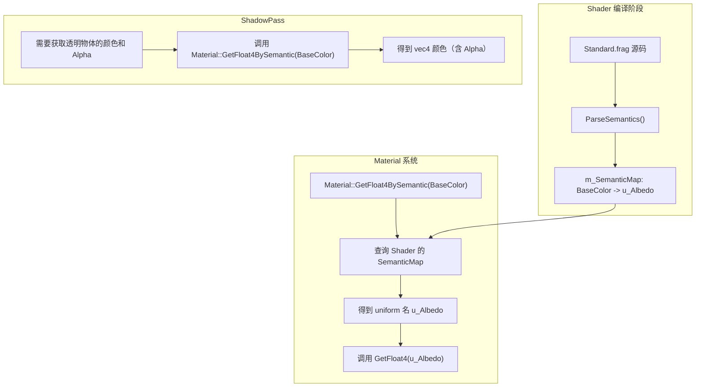

# PhaseR22：Material Semantic Mapping（材质属性语义映射）

> **文档版本**：v1.0  
> **创建日期**：2026-04-30  
> **对应功能编号**：R-TODO-MAT1  
> **前置依赖**：R21（Translucent Shadow Map 已实现）、Material 系统、Shader 系统  
> **预估工作量**：1-2 天

---

## 目录

1. [问题描述](#1-问题描述)
2. [当前系统分析](#2-当前系统分析)
3. [方案总览与对比](#3-方案总览与对比)
4. [推荐方案详细设计](#4-推荐方案详细设计)
5. [C++ 端实现](#5-c-端实现)
6. [Shader 端实现](#6-shader-端实现)
7. [ShadowPass 集成](#7-shadowpass-集成)
8. [测试验证](#8-测试验证)
9. [后续扩展](#9-后续扩展)

---

## 1. 问题描述

### 1.1 当前问题

在 [ShadowPass.cpp](../Lucky/Source/Lucky/Renderer/Passes/ShadowPass.cpp) 第 95 行：

```cpp
glm::vec4 albedo = cmd.MaterialData->GetFloat4("u_Albedo");
Ref<Texture2D> albedoMap = cmd.MaterialData->GetTexture("u_AlbedoMap");
```

ShadowPass **硬编码了 `u_Albedo` 和 `u_AlbedoMap` 两个属性名**，假设所有透明物体的材质都拥有这两个属性。

### 1.2 问题影响

如果用户创建了自定义 Shader，使用不同的 uniform 命名：

| 自定义 Shader 命名 | ShadowPass 行为 | 结果 |
|-------------------|----------------|------|
| `u_BaseColor` | `GetFloat4("u_Albedo")` 返回默认值 `(0,0,0,1)` | 阴影颜色错误（黑色） |
| `u_DiffuseColor` + `u_Opacity` | 找不到 `u_Albedo` | Alpha 始终为 1，透明物体投射完整阴影 |
| 无颜色属性（程序化 Shader） | 找不到任何属性 | 默认值 `(0,0,0,1)`，阴影颜色错误 |

### 1.3 目标

引入**属性语义（Semantic）**机制，让 ShadowPass 通过语义而非硬编码名称获取材质的透明度和颜色信息，兼容任意 Shader 的 uniform 命名。

---

## 2. 当前系统分析

### 2.1 Material 系统现状

```
Material
├── m_Shader: Ref<Shader>                           // 着色器
├── m_PropertyMap: unordered_map<string, Property>  // 属性名 -> 属性值
├── m_PropertyOrder: vector<string>                 // 属性声明顺序
├── m_RenderState: RenderState                      // 渲染状态
└── m_RenderingMode: RenderingMode                  // 渲染模式预设
```

- 属性通过**字符串名称**索引（`GetFloat4("u_Albedo")`）
- 属性列表由 `Shader::Introspect()` 自动生成（反射 active uniform）
- 内部 uniform（如 `u_ObjectToWorldMatrix`）通过黑名单 `IsInternalUniform()` 过滤

### 2.2 Shader 系统现状

```
Shader
├── m_RendererID: uint32_t                          // OpenGL Program ID
├── m_Uniforms: vector<ShaderUniform>               // uniform 列表（内省获得）
├── m_TextureDefaultMap: map<string, TextureDefault> // @default 注解解析结果
└── PreprocessIncludes()                            // #include 预处理
```

- Shader 已支持 `@default` 注解（指定 sampler2D 的默认纹理类型）
- Shader 已支持 `#include` 预处理
- Shader 的 uniform 信息通过 OpenGL 内省获得

### 2.3 ShadowPass 对材质属性的需求

ShadowPass 需要从透明物体的材质中获取以下信息：

| 需求 | 用途 | 当前硬编码 |
|------|------|-----------|
| 基础颜色（含 Alpha） | 计算透射颜色 + Dithered Shadow | `GetFloat4("u_Albedo")` |
| 颜色纹理 | 采样纹理 Alpha | `GetTexture("u_AlbedoMap")` |

---

## 3. 方案总览与对比

### 3.1 方案 A：Shader 注解 + 语义注册表（??? 推荐 - 最优）

**描述**：在 Shader 源码中通过注解（类似已有的 `@default`）声明 uniform 的语义，Shader 编译时解析注解并存储到语义映射表中。ShadowPass 通过语义查找属性。

**Shader 中的注解示例**：
```glsl
// @semantic: BaseColor
uniform vec4 u_Albedo;

// @semantic: BaseColorMap
// @default: white
uniform sampler2D u_AlbedoMap;
```

**优点**：
- 完全解耦：ShadowPass 不依赖任何具体的 uniform 名称
- Shader 作者通过注解声明语义，灵活且显式
- 复用已有的注解解析机制（`@default` 已有先例）
- 支持任意 Shader 命名

**缺点**：
- 需要扩展 Shader 解析逻辑
- 需要在 `ShaderUniform` 结构体中添加语义字段
- 需要在 `Material` 中添加按语义查找的方法

---

### 3.2 方案 B：命名约定 + 回退查找列表（?? 其次）

**描述**：定义一组优先级查找列表，ShadowPass 按顺序尝试多个属性名。

```cpp
// 查找颜色
static const std::vector<std::string> s_BaseColorNames = {
    "u_Albedo", "u_BaseColor", "u_DiffuseColor", "u_Color"
};

// 查找纹理
static const std::vector<std::string> s_BaseColorMapNames = {
    "u_AlbedoMap", "u_BaseColorMap", "u_DiffuseMap", "u_ColorMap"
};
```

**优点**：
- 改动最小（只修改 ShadowPass.cpp）
- 不需要修改 Shader 系统
- 兼容大多数常见命名

**缺点**：
- 无法覆盖所有自定义命名
- 查找列表需要持续维护
- 不够优雅，本质上还是"猜测"

---

### 3.3 方案 C：Material 显式注册语义（? 不推荐）

**描述**：在 Material 类中添加显式的语义注册接口，由用户或编辑器手动指定哪个属性对应哪个语义。

```cpp
material->RegisterSemantic(MaterialSemantic::BaseColor, "u_MyCustomColor");
```

**优点**：
- 完全灵活，用户可以映射任意属性

**缺点**：
- 增加用户负担（需要手动注册）
- 编辑器 UI 需要额外的语义配置界面
- 容易遗忘注册导致功能失效

---

### 3.4 方案选择结论

| 方案 | 推荐度 | 理由 |
|------|--------|------|
| **A：Shader 注解 + 语义注册表** | ??? **最优** | 解耦彻底，复用已有机制，Shader 作者显式声明 |
| B：命名约定 + 回退 | ?? 其次 | 改动小但不够通用 |
| C：Material 显式注册 | ? 不推荐 | 增加用户负担 |

**最终选择：方案 A（Shader 注解 + 语义注册表）**

---

## 4. 推荐方案详细设计

### 4.1 整体架构



### 4.2 语义枚举定义

#### 方案 SE1：固定枚举（??? 推荐 - 最优）

定义一组引擎预定义的语义枚举：

```cpp
/// <summary>
/// 材质属性语义：引擎预定义的属性含义
/// 用于 ShadowPass 等引擎内部系统按语义获取材质属性，而非依赖硬编码名称
/// </summary>
enum class MaterialSemantic : uint8_t
{
    None = 0,           // 无语义（普通属性）
    BaseColor,          // 基础颜色（vec4，含 Alpha）
    BaseColorMap,       // 基础颜色纹理（sampler2D）
    Normal,             // 法线（vec3）
    NormalMap,          // 法线纹理（sampler2D）
    Metallic,           // 金属度（float）
    MetallicMap,        // 金属度纹理（sampler2D）
    Roughness,          // 粗糙度（float）
    RoughnessMap,       // 粗糙度纹理（sampler2D）
    Emission,           // 自发光颜色（vec3）
    EmissionMap,        // 自发光纹理（sampler2D）
    AO,                 // 环境光遮蔽（float）
    AOMap,              // 环境光遮蔽纹理（sampler2D）
    Opacity,            // 独立透明度（float，当 BaseColor 不含 Alpha 时使用）
};
```

**优点**：
- 类型安全，编译期检查
- IDE 自动补全
- 性能好（枚举比较比字符串比较快）

**缺点**：
- 新增语义需要修改枚举定义
- 不支持用户自定义语义

---

#### 方案 SE2：字符串语义（?? 其次）

使用字符串作为语义标识：

```cpp
material->GetFloat4BySemantic("BaseColor");
```

**优点**：
- 完全开放，用户可以定义任意语义
- 不需要修改枚举

**缺点**：
- 无编译期检查，拼写错误难以发现
- 字符串比较性能略差
- 无 IDE 自动补全

---

#### 语义枚举方案选择结论

| 方案 | 推荐度 | 理由 |
|------|--------|------|
| **SE1：固定枚举** | ??? **最优** | 类型安全，性能好，IDE 友好 |
| SE2：字符串语义 | ?? 其次 | 灵活但无编译期检查 |

**最终选择：方案 SE1（固定枚举）**

---

### 4.3 Shader 注解语法

#### 方案 AN1：行内注解（??? 推荐 - 最优）

复用已有的 `@default` 注解风格，在 uniform 声明上方添加 `@semantic` 注解：

```glsl
// @semantic: BaseColor
uniform vec4 u_Albedo;

// @semantic: BaseColorMap
// @default: white
uniform sampler2D u_AlbedoMap;

// @semantic: NormalMap
// @default: normal
uniform sampler2D u_NormalMap;

// @semantic: Metallic
uniform float u_Metallic;
```

**解析正则**：
```
//\s*@semantic\s*:\s*(\w+)\s*\n\s*uniform\s+\w+\s+(\w+)\s*;
```

**优点**：
- 与已有的 `@default` 注解风格一致
- 解析逻辑可复用 `ParseTextureDefaults()` 的模式
- 注解紧邻 uniform 声明，可读性好

**缺点**：
- 注解和 `@default` 可能同时存在，需要处理多行注解

---

#### 方案 AN2：合并注解（?? 其次）

将 `@semantic` 和 `@default` 合并到一行：

```glsl
// @semantic: BaseColorMap, @default: white
uniform sampler2D u_AlbedoMap;
```

**优点**：
- 更紧凑

**缺点**：
- 解析正则更复杂
- 可读性略差

---

#### 方案 AN3：多行注解块（? 不推荐）

```glsl
// @begin
// @semantic: BaseColor
// @range: 0.0, 1.0
// @end
uniform vec4 u_Albedo;
```

**优点**：
- 可扩展性强

**缺点**：
- 过于复杂，当前需求不需要
- 解析逻辑复杂

---

#### 注解语法方案选择结论

| 方案 | 推荐度 | 理由 |
|------|--------|------|
| **AN1：行内注解** | ??? **最优** | 与已有风格一致，简单直观 |
| AN2：合并注解 | ?? 其次 | 紧凑但解析复杂 |
| AN3：多行注解块 | ? 不推荐 | 过度设计 |

**最终选择：方案 AN1（行内注解）**

**注意**：当 `@semantic` 和 `@default` 同时存在时，两个注解分别占一行，紧邻 uniform 声明：

```glsl
// @semantic: BaseColorMap
// @default: white
uniform sampler2D u_AlbedoMap;
```

解析时两个正则分别匹配，互不干扰。

---

### 4.4 语义存储位置

#### 方案 ST1：存储在 ShaderUniform 中（??? 推荐 - 最优）

在 `ShaderUniform` 结构体中添加 `Semantic` 字段：

```cpp
struct ShaderUniform
{
    std::string Name;
    ShaderUniformType Type;
    int Location;
    int Size;
    TextureDefault DefaultTexture = TextureDefault::White;
    MaterialSemantic Semantic = MaterialSemantic::None;  // 新增
};
```

**优点**：
- 数据紧凑，与 uniform 信息在一起
- 查找时遍历 `m_Uniforms` 即可
- 不需要额外的数据结构

**缺点**：
- 每次按语义查找需要遍历 uniform 列表（O(n)，但 uniform 数量通常 < 20，可忽略）

---

#### 方案 ST2：独立的语义映射表（?? 其次）

在 Shader 中维护一个独立的 `map<MaterialSemantic, string>`：

```cpp
class Shader
{
    // ...
    std::unordered_map<MaterialSemantic, std::string> m_SemanticMap;
};
```

**优点**：
- 按语义查找 O(1)
- 职责分离

**缺点**：
- 额外的数据结构
- 需要在 `Introspect()` 后同步

---

#### 存储位置方案选择结论

| 方案 | 推荐度 | 理由 |
|------|--------|------|
| **ST1：存储在 ShaderUniform** | ??? **最优** | 紧凑，不需要额外数据结构 |
| ST2：独立映射表 | ?? 其次 | O(1) 查找但增加复杂度 |

**最终选择：方案 ST1（存储在 ShaderUniform 中）**

---

### 4.5 Material 查询接口

#### 方案 QI1：Material 直接提供按语义查询的方法（??? 推荐 - 最优）

在 Material 类中添加按语义查询的便捷方法：

```cpp
class Material
{
public:
    // ---- 按语义获取属性值 ----
    glm::vec4 GetFloat4BySemantic(MaterialSemantic semantic) const;
    Ref<Texture2D> GetTextureBySemantic(MaterialSemantic semantic) const;
    float GetFloatBySemantic(MaterialSemantic semantic) const;
    
    /// <summary>
    /// 按语义查找属性名（未找到返回空字符串）
    /// </summary>
    const std::string& GetPropertyNameBySemantic(MaterialSemantic semantic) const;
    
    /// <summary>
    /// 检查材质是否拥有指定语义的属性
    /// </summary>
    bool HasSemantic(MaterialSemantic semantic) const;
};
```

**优点**：
- 调用方代码简洁：`material->GetFloat4BySemantic(MaterialSemantic::BaseColor)`
- 封装了查找逻辑

**缺点**：
- Material 类接口增多

---

#### 方案 QI2：通过 Shader 查询语义再调用 Material（?? 其次）

不修改 Material 接口，调用方自己通过 Shader 查找：

```cpp
const std::string& name = cmd.MaterialData->GetShader()->GetUniformNameBySemantic(MaterialSemantic::BaseColor);
if (!name.empty())
{
    glm::vec4 albedo = cmd.MaterialData->GetFloat4(name);
}
```

**优点**：
- Material 类不需要修改

**缺点**：
- 调用方代码冗长
- 每个使用点都需要重复查找逻辑

---

#### 查询接口方案选择结论

| 方案 | 推荐度 | 理由 |
|------|--------|------|
| **QI1：Material 直接提供** | ??? **最优** | 调用简洁，封装查找逻辑 |
| QI2：通过 Shader 查询 | ?? 其次 | 不修改 Material 但调用冗长 |

**最终选择：方案 QI1（Material 直接提供按语义查询的方法）**

---

## 5. C++ 端实现

### 5.1 新增 MaterialSemantic.h

创建新文件 `Lucky/Source/Lucky/Renderer/MaterialSemantic.h`：

```cpp
#pragma once

#include <cstdint>
#include <string>

namespace Lucky
{
    /// <summary>
    /// 材质属性语义：引擎预定义的属性含义
    /// 用于 ShadowPass 等引擎内部系统按语义获取材质属性，而非依赖硬编码名称
    /// Shader 中通过 // @semantic: <SemanticName> 注解声明
    /// </summary>
    enum class MaterialSemantic : uint8_t
    {
        None = 0,           // 无语义（普通属性）
        BaseColor,          // 基础颜色（vec4，含 Alpha）
        BaseColorMap,       // 基础颜色纹理（sampler2D）
        Normal,             // 法线（vec3）
        NormalMap,          // 法线纹理（sampler2D）
        Metallic,           // 金属度（float）
        MetallicMap,        // 金属度纹理（sampler2D）
        Roughness,          // 粗糙度（float）
        RoughnessMap,       // 粗糙度纹理（sampler2D）
        Emission,           // 自发光颜色（vec3）
        EmissionMap,        // 自发光纹理（sampler2D）
        AO,                 // 环境光遮蔽（float）
        AOMap,              // 环境光遮蔽纹理（sampler2D）
        Opacity,            // 独立透明度（float）
    };

    /// <summary>
    /// 将字符串转换为 MaterialSemantic 枚举
    /// 用于解析 Shader 中的 @semantic 注解
    /// </summary>
    /// <param name="str">语义名称字符串（不区分大小写）</param>
    /// <returns>对应的 MaterialSemantic 枚举值，未匹配返回 None</returns>
    inline MaterialSemantic StringToMaterialSemantic(const std::string& str)
    {
        // 转小写比较
        std::string lower = str;
        std::transform(lower.begin(), lower.end(), lower.begin(), ::tolower);

        if (lower == "basecolor")       return MaterialSemantic::BaseColor;
        if (lower == "basecolormap")    return MaterialSemantic::BaseColorMap;
        if (lower == "normal")          return MaterialSemantic::Normal;
        if (lower == "normalmap")       return MaterialSemantic::NormalMap;
        if (lower == "metallic")        return MaterialSemantic::Metallic;
        if (lower == "metallicmap")     return MaterialSemantic::MetallicMap;
        if (lower == "roughness")       return MaterialSemantic::Roughness;
        if (lower == "roughnessmap")    return MaterialSemantic::RoughnessMap;
        if (lower == "emission")        return MaterialSemantic::Emission;
        if (lower == "emissionmap")     return MaterialSemantic::EmissionMap;
        if (lower == "ao")              return MaterialSemantic::AO;
        if (lower == "aomap")           return MaterialSemantic::AOMap;
        if (lower == "opacity")         return MaterialSemantic::Opacity;

        return MaterialSemantic::None;
    }
}
```

### 5.2 修改 Shader.h

在 `ShaderUniform` 结构体中添加 `Semantic` 字段：

```cpp
#include "MaterialSemantic.h"  // 新增 include

struct ShaderUniform
{
    std::string Name;
    ShaderUniformType Type;
    int Location;
    int Size;
    TextureDefault DefaultTexture = TextureDefault::White;
    MaterialSemantic Semantic = MaterialSemantic::None;  // 新增：属性语义
};
```

在 `Shader` 类中添加解析方法和查询方法：

```cpp
class Shader
{
public:
    // ... 现有方法 ...

    /// <summary>
    /// 按语义查找 uniform 名称（未找到返回空字符串）
    /// </summary>
    /// <param name="semantic">要查找的语义</param>
    /// <returns>对应的 uniform 名称，未找到返回空字符串引用</returns>
    const std::string& GetUniformNameBySemantic(MaterialSemantic semantic) const;

private:
    // ... 现有方法 ...

    /// <summary>
    /// 解析 Shader 源码中的 @semantic 注释元数据
    /// 提取 uniform 的语义标记
    /// </summary>
    /// <param name="source">Shader 源码</param>
    void ParseSemantics(const std::string& source);

    /// <summary>
    /// 将解析到的语义标记应用到 m_Uniforms 列表
    /// </summary>
    void ApplySemantics();

private:
    // ... 现有成员 ...
    std::unordered_map<std::string, MaterialSemantic> m_SemanticParseMap;  // 新增：解析缓存 uniform 名 -> 语义
};
```

### 5.3 修改 Shader.cpp

#### 5.3.1 构造函数中调用 ParseSemantics

```cpp
Shader::Shader(const std::string& filepath)
    : m_RendererID(0)
{
    std::string vertexSrc = ReadFile(filepath + ".vert");
    std::string fragmentSrc = ReadFile(filepath + ".frag");

    // 编译前解析注解元数据
    ParseTextureDefaults(vertexSrc);
    ParseTextureDefaults(fragmentSrc);
    ParseSemantics(vertexSrc);      // 新增
    ParseSemantics(fragmentSrc);    // 新增

    // 预处理 #include 指令
    std::string directory = filepath.substr(0, filepath.find_last_of("/\\"));
    vertexSrc = PreprocessIncludes(vertexSrc, directory);
    fragmentSrc = PreprocessIncludes(fragmentSrc, directory);

    // ... 编译逻辑不变 ...

    Compile(shaderSources);
    ApplyTextureDefaults();
    ApplySemantics();   // 新增
}
```

#### 5.3.2 ParseSemantics 实现

```cpp
void Shader::ParseSemantics(const std::string& source)
{
    // 正则匹配：// @semantic: <SemanticName> 后紧跟 uniform 声明
    // 支持中间有 @default 注解行
    static const std::regex pattern(
        R"(//\s*@semantic\s*:\s*(\w+)\s*\n(?:\s*//[^\n]*\n)*\s*uniform\s+\w+\s+(\w+)\s*;)",
        std::regex::ECMAScript
    );

    auto begin = std::sregex_iterator(source.begin(), source.end(), pattern);
    auto end = std::sregex_iterator();

    for (auto it = begin; it != end; ++it)
    {
        const std::smatch& match = *it;
        std::string semanticStr = match[1].str();   // BaseColor / BaseColorMap / ...
        std::string uniformName = match[2].str();   // u_Albedo / u_AlbedoMap / ...

        MaterialSemantic semantic = StringToMaterialSemantic(semanticStr);
        if (semantic != MaterialSemantic::None)
        {
            m_SemanticParseMap[uniformName] = semantic;
            LF_CORE_TRACE("  Semantic: '{0}' -> {1}", uniformName, semanticStr);
        }
        else
        {
            LF_CORE_WARN("  Unknown semantic '{0}' for uniform '{1}'", semanticStr, uniformName);
        }
    }
}
```

#### 5.3.3 ApplySemantics 实现

```cpp
void Shader::ApplySemantics()
{
    for (ShaderUniform& uniform : m_Uniforms)
    {
        auto it = m_SemanticParseMap.find(uniform.Name);
        if (it != m_SemanticParseMap.end())
        {
            uniform.Semantic = it->second;
        }
    }
}
```

#### 5.3.4 GetUniformNameBySemantic 实现

```cpp
const std::string& Shader::GetUniformNameBySemantic(MaterialSemantic semantic) const
{
    static const std::string s_Empty;

    for (const ShaderUniform& uniform : m_Uniforms)
    {
        if (uniform.Semantic == semantic)
        {
            return uniform.Name;
        }
    }

    return s_Empty;
}
```

### 5.4 修改 Material.h

添加按语义查询的便捷方法：

```cpp
#include "MaterialSemantic.h"  // 新增 include

class Material
{
public:
    // ... 现有方法 ...

    // ---- 按语义获取属性值 ----

    /// <summary>
    /// 按语义获取 vec4 属性值
    /// 如果 Shader 中没有声明该语义的 uniform，返回默认值
    /// </summary>
    glm::vec4 GetFloat4BySemantic(MaterialSemantic semantic) const;

    /// <summary>
    /// 按语义获取 float 属性值
    /// </summary>
    float GetFloatBySemantic(MaterialSemantic semantic) const;

    /// <summary>
    /// 按语义获取 vec3 属性值
    /// </summary>
    glm::vec3 GetFloat3BySemantic(MaterialSemantic semantic) const;

    /// <summary>
    /// 按语义获取纹理
    /// </summary>
    Ref<Texture2D> GetTextureBySemantic(MaterialSemantic semantic) const;

    /// <summary>
    /// 检查材质的 Shader 是否声明了指定语义
    /// </summary>
    bool HasSemantic(MaterialSemantic semantic) const;
};
```

### 5.5 修改 Material.cpp

添加按语义查询的实现：

```cpp
glm::vec4 Material::GetFloat4BySemantic(MaterialSemantic semantic) const
{
    if (!m_Shader)
    {
        return glm::vec4(0.0f, 0.0f, 0.0f, 1.0f);
    }

    const std::string& name = m_Shader->GetUniformNameBySemantic(semantic);
    if (name.empty())
    {
        return glm::vec4(0.0f, 0.0f, 0.0f, 1.0f);
    }

    return GetFloat4(name);
}

float Material::GetFloatBySemantic(MaterialSemantic semantic) const
{
    if (!m_Shader)
    {
        return 0.0f;
    }

    const std::string& name = m_Shader->GetUniformNameBySemantic(semantic);
    if (name.empty())
    {
        return 0.0f;
    }

    return GetFloat(name);
}

glm::vec3 Material::GetFloat3BySemantic(MaterialSemantic semantic) const
{
    if (!m_Shader)
    {
        return glm::vec3(0.0f);
    }

    const std::string& name = m_Shader->GetUniformNameBySemantic(semantic);
    if (name.empty())
    {
        return glm::vec3(0.0f);
    }

    return GetFloat3(name);
}

Ref<Texture2D> Material::GetTextureBySemantic(MaterialSemantic semantic) const
{
    if (!m_Shader)
    {
        return nullptr;
    }

    const std::string& name = m_Shader->GetUniformNameBySemantic(semantic);
    if (name.empty())
    {
        return nullptr;
    }

    return GetTexture(name);
}

bool Material::HasSemantic(MaterialSemantic semantic) const
{
    if (!m_Shader)
    {
        return false;
    }

    return !m_Shader->GetUniformNameBySemantic(semantic).empty();
}
```

---

## 6. Shader 端实现

### 6.1 修改 Standard.frag

为 Standard.frag 中的 uniform 添加 `@semantic` 注解：

```glsl
// ---- PBR 材质参数 ----

// @semantic: BaseColor
uniform vec4  u_Albedo;             // 基础颜色

// @semantic: Metallic
uniform float u_Metallic;           // 金属度

// @semantic: Roughness
uniform float u_Roughness;          // 粗糙度

// @semantic: AO
uniform float u_AO;                 // 环境光遮蔽

// @semantic: Emission
uniform vec3  u_Emission;           // 自发光颜色

uniform float u_EmissionIntensity;  // 自发光强度（无语义，引擎不需要按语义访问）

// ---- PBR 纹理 ----

// @semantic: BaseColorMap
// @default: white
uniform sampler2D u_AlbedoMap;

// @semantic: NormalMap
// @default: normal
uniform sampler2D u_NormalMap;

// @semantic: MetallicMap
// @default: white
uniform sampler2D u_MetallicMap;

// @semantic: RoughnessMap
// @default: white
uniform sampler2D u_RoughnessMap;

// @semantic: AOMap
// @default: white
uniform sampler2D u_AOMap;

// @semantic: EmissionMap
// @default: white
uniform sampler2D u_EmissionMap;
```

### 6.2 自定义 Shader 示例

用户创建的自定义 Shader 只需添加 `@semantic` 注解即可被 ShadowPass 正确识别：

```glsl
// MyCustomShader.frag

// @semantic: BaseColor
uniform vec4 u_DiffuseColor;    // 用户可以使用任意名称

// @semantic: BaseColorMap
// @default: white
uniform sampler2D u_DiffuseTexture;

// 无 @semantic 注解的 uniform 不会被引擎内部系统按语义访问
uniform float u_CustomParam;
```

---

## 7. ShadowPass 集成

### 7.1 修改 ShadowPass.cpp

将硬编码的属性名替换为按语义查询：

```cpp
// ---- 修改前（硬编码） ----
glm::vec4 albedo = cmd.MaterialData->GetFloat4("u_Albedo");
Ref<Texture2D> albedoMap = cmd.MaterialData->GetTexture("u_AlbedoMap");

// ---- 修改后（按语义） ----
glm::vec4 albedo = cmd.MaterialData->GetFloat4BySemantic(MaterialSemantic::BaseColor);
Ref<Texture2D> albedoMap = cmd.MaterialData->GetTextureBySemantic(MaterialSemantic::BaseColorMap);
```

### 7.2 完整的透明物体遍历逻辑（修改后）

```cpp
// ---- 遍历透明物体 DrawCommand 列表（Dithered Shadow + Translucent Shadow Map） ----
if (hasTransparent)
{
    RenderCommand::SetColorMask(true, true, true, true);
    RenderCommand::SetBlendMode(BlendMode::Zero_SrcColor);

    m_ShadowShader->SetInt("u_AlphaTestEnabled", 1);
    m_ShadowShader->SetInt("u_TranslucentShadowEnabled", 1);
    m_ShadowShader->SetFloat("u_AlphaTestThreshold", 0.5f);

    const auto& defaultWhiteTexture = Renderer3D::GetDefaultTexture(TextureDefault::White);

    for (const DrawCommand& cmd : *context.TransparentDrawCommands)
    {
        m_ShadowShader->SetMat4("u_ObjectToWorldMatrix", cmd.Transform);

        // 按语义获取基础颜色（含 Alpha）
        glm::vec4 albedo = cmd.MaterialData->GetFloat4BySemantic(MaterialSemantic::BaseColor);

        // 如果 Shader 没有声明 BaseColor 语义，使用默认白色（alpha=1）
        // GetFloat4BySemantic 在未找到时返回 (0,0,0,1)，alpha=1 表示完全不透明
        m_ShadowShader->SetFloat4("u_Albedo", albedo);

        // 按语义获取基础颜色纹理
        Ref<Texture2D> albedoMap = cmd.MaterialData->GetTextureBySemantic(MaterialSemantic::BaseColorMap);
        if (albedoMap)
        {
            albedoMap->Bind(0);
        }
        else
        {
            defaultWhiteTexture->Bind(0);
        }
        m_ShadowShader->SetInt("u_AlbedoMap", 0);

        RenderCommand::DrawIndexedRange(
            cmd.MeshData->GetVertexArray(),
            cmd.SubMeshPtr->IndexOffset,
            cmd.SubMeshPtr->IndexCount
        );
    }
}
```

---

## 8. 测试验证

### 8.1 基本功能测试

1. **Standard Shader 兼容性**：
   - 使用 Standard Shader 的透明物体
   - 验证阴影投射行为与修改前完全一致

2. **自定义 Shader（有语义注解）**：
   - 创建使用 `u_BaseColor` 命名的自定义 Shader，添加 `@semantic: BaseColor` 注解
   - 验证 ShadowPass 能正确获取颜色和 Alpha

3. **自定义 Shader（无语义注解）**：
   - 创建没有 `@semantic` 注解的自定义 Shader
   - 验证 ShadowPass 使用默认值 `(0,0,0,1)`，alpha=1 表示完全不透明
   - 透明物体投射完整阴影（安全的回退行为）

4. **混合场景**：
   - 场景中同时存在 Standard Shader 和自定义 Shader 的透明物体
   - 验证各自的阴影行为正确

### 8.2 边界情况测试

1. **Shader 无任何 sampler2D**：
   - `GetTextureBySemantic(BaseColorMap)` 返回 nullptr
   - ShadowPass 使用默认白色纹理

2. **Shader 有 BaseColor 但无 BaseColorMap**：
   - 颜色从 `BaseColor` 获取，纹理使用默认白色
   - Alpha 仅由 `BaseColor.a` 决定

3. **Shader 有独立的 Opacity 属性**：
   - 后续扩展：ShadowPass 可以额外查询 `MaterialSemantic::Opacity`
   - 当前阶段不实现，留作后续扩展

---

## 9. 后续扩展

### 9.1 短期扩展

- **编辑器显示语义标记**：在 Inspector 的材质属性旁显示语义图标或标签
- **语义验证**：编译 Shader 时检查语义类型是否匹配（如 `BaseColor` 必须是 `vec4`）

### 9.2 中期扩展

- **更多引擎系统使用语义**：
  - GBuffer Pass（延迟渲染）按语义获取 Metallic、Roughness 等
  - 烘焙系统按语义获取 Emission
- **Opacity 语义支持**：ShadowPass 支持独立的 `Opacity` 属性

### 9.3 长期扩展

- **Material Domain**：类似 Unreal 的 Material Domain（Surface / PostProcess / UI），不同 Domain 有不同的必需语义
- **Shader Graph**：可视化 Shader 编辑器中，节点输出自动带有语义标记

---

## 附录 A：文件修改清单

| 文件 | 操作 | 说明 |
|------|------|------|
| `Renderer/MaterialSemantic.h` | **新建** | MaterialSemantic 枚举定义 + StringToMaterialSemantic 转换函数 |
| `Renderer/Shader.h` | **修改** | ShaderUniform 添加 Semantic 字段；Shader 添加 ParseSemantics / ApplySemantics / GetUniformNameBySemantic |
| `Renderer/Shader.cpp` | **修改** | 实现 ParseSemantics / ApplySemantics / GetUniformNameBySemantic；构造函数中调用 |
| `Renderer/Material.h` | **修改** | 添加 GetFloat4BySemantic / GetTextureBySemantic / HasSemantic 等方法 |
| `Renderer/Material.cpp` | **修改** | 实现按语义查询方法 |
| `Renderer/Passes/ShadowPass.cpp` | **修改** | 将硬编码属性名替换为按语义查询 |
| `Assets/Shaders/Standard.frag` | **修改** | 为 uniform 添加 @semantic 注解 |

**总代码量**：约 120 行新增代码 + 约 20 行修改

---

## 附录 B：与方案三（Multi-Pass Shader）的关系

本方案（属性语义映射）解决的是 **"ShadowPass 如何从任意 Shader 的材质中获取透明度信息"** 的问题。

方案三（Multi-Pass Shader）解决的是 **"每个 Shader 自己定义 ShadowCaster Pass"** 的问题，是一个更彻底的架构变更。

两者的关系：
- **短期**：使用本方案（属性语义），ShadowPass 仍然使用引擎内部的 Shadow Shader，但通过语义获取材质属性
- **长期**：如果实现了 Multi-Pass Shader，每个 Shader 自己定义 ShadowCaster Pass，则不再需要 ShadowPass 从外部获取材质属性（因为 ShadowCaster Pass 内部知道自己的属性名）
- **兼容**：即使实现了 Multi-Pass Shader，属性语义机制仍然有价值（GBuffer Pass、烘焙系统等仍需要按语义获取属性）

---

## 附录 C：方案三（Multi-Pass Shader）在当前引擎的可行性分析

### C.1 方案三概述

Multi-Pass Shader 是指每个 Shader 文件中定义多个 Pass（如 Forward Pass、ShadowCaster Pass、DepthOnly Pass），引擎在不同阶段调用对应的 Pass。

**Unity 的实现**：
```hlsl
SubShader
{
    Pass
    {
        Name "ForwardLit"
        Tags { "LightMode" = "UniversalForward" }
        // ... 前向渲染代码 ...
    }
    Pass
    {
        Name "ShadowCaster"
        Tags { "LightMode" = "ShadowCaster" }
        // ... 阴影投射代码 ...
    }
}
```

### C.2 当前引擎的 Shader 系统现状

| 特性 | 当前状态 | Multi-Pass 需求 |
|------|---------|----------------|
| Shader 文件格式 | 分离的 `.vert` + `.frag` | 需要支持多组 vert/frag 或统一格式 |
| Shader 编译 | 一个 Program = 一个 vert + 一个 frag | 需要支持多个 Program |
| Shader 类 | 持有一个 `m_RendererID`（单 Program） | 需要持有多个 Program |
| Material 绑定 | 一个 Material 绑定一个 Shader | 不变（Material 绑定的是"主 Shader"） |
| Pass 调度 | ShadowPass 使用固定的 Shadow Shader | 需要从 Material 的 Shader 中获取 ShadowCaster Pass |
| Shader 加载 | `ReadFile(path + ".vert")` + `ReadFile(path + ".frag")` | 需要新的文件格式或目录约定 |
| #include 预处理 | ? 已支持 | 不变 |
| @default 注解 | ? 已支持 | 不变 |
| Uniform 内省 | ? 已支持 | 每个 Pass 的 Program 都需要内省 |

### C.3 实现 Multi-Pass Shader 需要的改动

#### 改动 1：Shader 文件格式

**方案 MP-F1：目录约定（??? 推荐）**

每个 Shader 是一个目录，包含多个 Pass 的 vert/frag 文件：

```
Assets/Shaders/
├── Standard/
│   ├── Forward.vert        // 前向渲染 Pass
│   ├── Forward.frag
│   ├── ShadowCaster.vert   // 阴影投射 Pass
│   └── ShadowCaster.frag
├── MyCustom/
│   ├── Forward.vert
│   ├── Forward.frag
│   ├── ShadowCaster.vert   // 自定义阴影投射逻辑
│   └── ShadowCaster.frag
```

**方案 MP-F2：统一文件格式（?? 其次）**

使用自定义标记在单文件中分隔多个 Pass：

```glsl
// Standard.shader
#pass Forward
#vertex
// ... 顶点着色器代码 ...
#fragment
// ... 片段着色器代码 ...

#pass ShadowCaster
#vertex
// ... 阴影顶点着色器代码 ...
#fragment
// ... 阴影片段着色器代码 ...
```

#### 改动 2：Shader 类重构

```cpp
class Shader
{
public:
    // ... 现有接口保持不变（操作"当前激活的 Pass"） ...
    
    /// <summary>
    /// 获取指定 Pass 的 Program（未找到返回 0）
    /// </summary>
    uint32_t GetPassProgram(const std::string& passName) const;
    
    /// <summary>
    /// 激活指定 Pass（后续的 Bind/SetUniform 操作作用于该 Pass）
    /// </summary>
    void ActivatePass(const std::string& passName);
    
    /// <summary>
    /// 是否包含指定 Pass
    /// </summary>
    bool HasPass(const std::string& passName) const;

private:
    struct ShaderPass
    {
        std::string Name;                       // Pass 名称
        uint32_t ProgramID = 0;                 // OpenGL Program ID
        std::vector<ShaderUniform> Uniforms;    // 该 Pass 的 uniform 列表
    };
    
    std::vector<ShaderPass> m_Passes;           // 所有 Pass
    int m_ActivePassIndex = 0;                  // 当前激活的 Pass 索引
};
```

#### 改动 3：ShadowPass 调度逻辑

```cpp
void ShadowPass::Execute(const RenderContext& context)
{
    // ... 不透明物体使用引擎 Shadow Shader（不变） ...

    // ---- 透明物体 ----
    for (const DrawCommand& cmd : *context.TransparentDrawCommands)
    {
        Ref<Shader> materialShader = cmd.MaterialData->GetShader();
        
        if (materialShader->HasPass("ShadowCaster"))
        {
            // 使用材质 Shader 自己的 ShadowCaster Pass
            materialShader->ActivatePass("ShadowCaster");
            materialShader->Bind();
            materialShader->SetMat4("u_LightSpaceMatrix", context.LightSpaceMatrix);
            materialShader->SetMat4("u_ObjectToWorldMatrix", cmd.Transform);
            cmd.MaterialData->Apply();  // 上传材质属性
        }
        else
        {
            // 回退：使用引擎内部 Shadow Shader + 语义查询
            m_ShadowShader->Bind();
            // ... 现有逻辑 ...
        }
        
        RenderCommand::DrawIndexedRange(...);
    }
}
```

### C.4 可行性评估

| 维度 | 评估 | 说明 |
|------|------|------|
| **技术可行性** | ? 完全可行 | OpenGL 支持多 Program，无技术障碍 |
| **改动范围** | ?? 较大 | 需要重构 Shader 类、修改加载逻辑、修改 ShadowPass 调度 |
| **向后兼容** | ? 可兼容 | 没有 ShadowCaster Pass 的 Shader 回退到引擎默认行为 |
| **工作量** | ?? 3-5 天 | Shader 类重构 + 文件格式 + Pass 调度 + 测试 |
| **收益** | ??? 高 | 彻底解决自定义 Shader 的阴影问题，架构更优雅 |
| **风险** | ?? 中等 | Shader 类是核心基础设施，重构可能引入 Bug |
| **紧迫性** | 低 | 当前只有一个用户 Shader（Standard），属性语义方案已足够 |

### C.5 结论

**方案三在当前引擎中完全可行**，但考虑到：

1. 当前只有一个用户 Shader（Standard.frag），属性语义方案已经足够解决问题
2. Multi-Pass Shader 需要重构核心的 Shader 类，风险较高
3. 属性语义方案的实现成本远低于 Multi-Pass Shader

**建议路线**：
- **当前阶段**：实现本文档的属性语义方案（R22），快速解决问题
- **中期阶段**：当用户 Shader 数量增多、需求更复杂时，实现 Multi-Pass Shader
- **两者共存**：属性语义机制在 Multi-Pass Shader 实现后仍有价值（用于 GBuffer、烘焙等系统）
