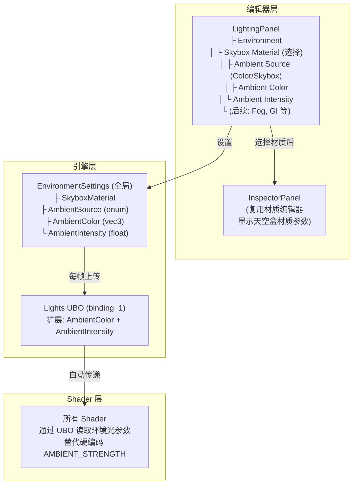
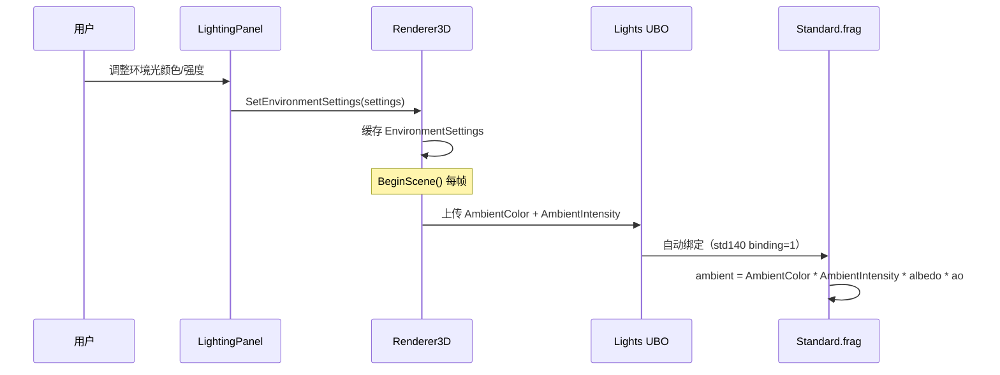
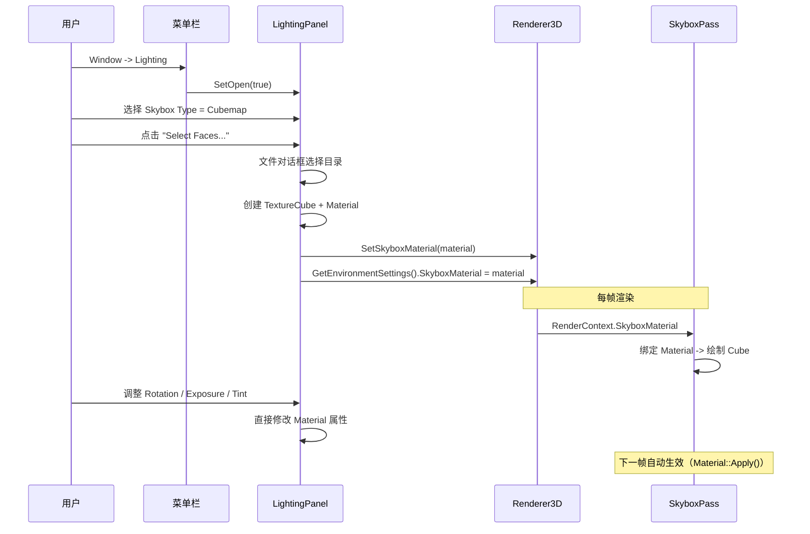

# PhaseR24：Lighting 面板与环境光全局化

> **文档版本**：v1.0  
> **创建日期**：2026-04-30  
> **对应功能编号**：R-TODO-08  
> **前置依赖**：R23（天空盒渲染）、R-17（RenderPass 抽象）、R-03（多光源支持）  
> **预估工作量**：2-3 天

---

## 目录

1. [功能概述](#1-功能概述)
2. [当前系统分析](#2-当前系统分析)
3. [设计方案](#3-设计方案)
4. [实现方案对比](#4-实现方案对比)
5. [推荐方案详细设计](#5-推荐方案详细设计)
6. [代码实现](#6-代码实现)
7. [编辑器集成](#7-编辑器集成)
8. [序列化支持](#8-序列化支持)
9. [测试验证](#9-测试验证)
10. [后续扩展](#10-后续扩展)

---

## 1. 功能概述

### 1.1 目标

实现 Lighting 设置面板和环境光全局化，包括：
- 新增 `LightingPanel` 编辑器面板，统一管理场景环境设置
- 将环境光从 Shader 硬编码常量（`AMBIENT_STRENGTH = 0.03`）提取为全局 UBO 参数
- 在 Lighting 面板中集成天空盒材质选择和环境光参数设置
- 天空盒材质参数可在 Inspector 中编辑（复用现有材质编辑器）
- 为后续 IBL 环境光照铺路

### 1.2 核心原则

- **环境光是场景级属性**：不由单独的 Shader 控制，所有物体接收相同的环境光
- **Material 驱动天空盒**：天空盒渲染方式由 Material（Shader + 参数）决定
- **复用现有系统**：复用 Inspector 的材质编辑器，复用 Lights UBO 传递环境光参数
- **渐进式设计**：当前阶段实现纯色环境光 + 天空盒选择，后续扩展 IBL

### 1.3 Unity 参考

Unity 的 `Window -> Rendering -> Lighting` 窗口结构：

```
Lighting Settings
+-- Environment
|   +-- Skybox Material          -> 选择天空盒材质
|   +-- Sun Source               -> 选择主方向光
|   +-- Environment Lighting
|   |   +-- Source               -> Skybox / Gradient / Color
|   |   +-- Intensity Multiplier -> 环境光强度
|   |   +-- Ambient Color        -> 纯色模式下的颜色
|   +-- Environment Reflections
|       +-- Source               -> Skybox / Custom
|       +-- Intensity Multiplier -> 反射强度
+-- Other Settings
    +-- Fog
```

---

## 2. 当前系统分析

### 2.1 环境光现状

当前环境光实现方式：

```glsl
// Common.glsl 中定义编译时常量
const float AMBIENT_STRENGTH = 0.03;

// Standard.frag 中使用
vec3 ambient = vec3(AMBIENT_STRENGTH) * albedo * ao;
```

**存在的问题**：

| 问题 | 说明 |
|------|------|
| 硬编码常量 | `AMBIENT_STRENGTH = 0.03` 是编译时常量，无法在运行时调整 |
| 无颜色控制 | 环境光颜色固定为白色（`vec3(0.03)`），无法设置暖色/冷色 |
| 无全局控制 | 每个 Shader 自己处理环境光，没有统一的全局环境光系统 |
| 自定义 Shader 不一致 | 用户写的自定义 Shader 可能用不同的环境光值，导致场景不一致 |
| 无法切换环境光源 | 无法在"纯色环境光"和"天空盒 IBL 环境光"之间切换 |

### 2.2 已具备的基础设施

| 基础设施 | 状态 | 关键代码 |
|---------|------|---------|
| Lights UBO (binding=1) | 已完成 | `Shaders/Lucky/Common.glsl` |
| Camera UBO (binding=0) | 已完成 | `Shaders/Lucky/Common.glsl` |
| `Renderer3D::SetSkyboxMaterial()` | 已完成 | `Renderer/Renderer3D.h/cpp` |
| `SkyboxPass` 天空盒渲染 | 已完成 | `Renderer/Passes/SkyboxPass.h/cpp` |
| `Material` 材质系统 | 已完成 | `Renderer/Material.h/cpp` |
| `PanelManager` 面板管理 | 已完成 | `Editor/PanelManager.h` |
| Inspector 材质编辑器 | 已完成 | `Panels/InspectorPanel.cpp` |
| `PreferencesPanel` 独立面板参考 | 已完成 | `Panels/PreferencesPanel.h/cpp` |
| `TextureCube` Cubemap 纹理 | 已完成 | `Renderer/TextureCube.h/cpp` |
| `ShaderUniformType::SamplerCube` | 已完成 | `Renderer/Shader.h` |

### 2.3 当前 Lights UBO 结构

```glsl
layout(std140, binding = 1) uniform Lights
{
    int DirectionalLightCount;
    int PointLightCount;
    int SpotLightCount;
    float _padding;     // 填充对齐到 16 字节

    DirectionalLight DirectionalLights[MAX_DIRECTIONAL_LIGHTS];
    PointLight PointLights[MAX_POINT_LIGHTS];
    SpotLight SpotLights[MAX_SPOT_LIGHTS];
} u_Lights;
```

### 2.4 当前编辑器面板列表

| 面板 | 类型 | 说明 |
|------|------|------|
| `SceneHierarchyPanel` | 托管面板 | 场景层级 |
| `SceneViewportPanel` | 托管面板 | 场景视口 |
| `InspectorPanel` | 托管面板 | 选中物体属性 |
| `PreferencesPanel` | 独立面板 | 偏好设置 |

**缺失**：没有全局场景/环境设置面板。

---

## 3. 设计方案

### 3.1 整体架构



### 3.2 数据流



---

## 4. 实现方案对比

### 4.1 环境光参数传递方案

#### 方案 A：扩展现有 Lights UBO（推荐 - 最优）

**描述**：在现有的 `Lights UBO (binding=1)` 中添加环境光字段。

**修改后的 UBO 结构**：

```glsl
layout(std140, binding = 1) uniform Lights
{
    int DirectionalLightCount;
    int PointLightCount;
    int SpotLightCount;
    int AmbientSource;          // <- 新增：0=Color, 1=Skybox(IBL)
    
    vec3 AmbientColor;          // <- 新增：环境光颜色（默认白色）
    float AmbientIntensity;     // <- 新增：环境光强度（默认 0.03）
    
    DirectionalLight DirectionalLights[MAX_DIRECTIONAL_LIGHTS];
    PointLight PointLights[MAX_POINT_LIGHTS];
    SpotLight SpotLights[MAX_SPOT_LIGHTS];
} u_Lights;
```

**优点**：
- 不需要新建 UBO，减少绑定点占用
- 修改量最小
- 所有已 `#include "Lucky/Common.glsl"` 的 Shader 自动获得环境光参数
- 利用现有的 `_padding` 字段位置，无需额外对齐

**缺点**：
- Lights UBO 职责变大（既管光源又管环境光）
- 后续 IBL 数据（Irradiance Map 等）无法放入 UBO（纹理需要单独绑定）

---

#### 方案 B：新建 Environment UBO（其次）

**描述**：新建 `Environment UBO (binding=2)`，专门存储环境光和场景环境参数。

```glsl
layout(std140, binding = 2) uniform Environment
{
    vec3 AmbientColor;          // 环境光颜色
    float AmbientIntensity;     // 环境光强度
    int AmbientSource;          // 环境光源类型：0=Color, 1=Skybox(IBL)
    float _padding[3];          // 填充对齐
} u_Environment;
```

**优点**：
- 职责分离清晰（光源 vs 环境）
- 后续 IBL 相关参数（如 IBL 强度、反射强度）也可以放在这里
- 不影响现有 Lights UBO 的内存布局

**缺点**：
- 多占用一个 UBO 绑定点（binding=2）
- 所有 Shader 需要额外声明此 UBO
- 修改量稍大

---

#### 方案 C：通过全局 Uniform 传递（不推荐）

**描述**：不使用 UBO，通过每个 Shader 的 uniform 变量传递环境光参数。

**优点**：
- 不需要修改 UBO 结构

**缺点**：
- 每次 Shader 切换都需要重新设置 uniform
- 性能差（频繁的 glUniform 调用）
- 需要修改所有 Pass 的代码来设置这些 uniform
- 不符合现有架构（UBO 用于全局数据）

---

#### 环境光传递方案选择

| 方案 | 推荐度 | 理由 |
|------|--------|------|
| **A：扩展 Lights UBO** | **最优** | 修改量最小，利用现有 padding，所有 Shader 自动获得 |
| B：新建 Environment UBO | 其次 | 职责清晰但修改量大，后续 IBL 时可考虑升级 |
| C：全局 Uniform | 不推荐 | 性能差，不符合架构 |

**实施策略**：当前阶段用方案 A（扩展 Lights UBO），后续实现 IBL 时如果需要更多环境参数，再考虑拆分为独立的 Environment UBO。

---

### 4.2 Lighting 面板类型方案

#### 方案 P1：独立窗口面板（类似 PreferencesPanel）（推荐 - 最优）

**描述**：`LightingPanel` 作为独立的 ImGui 窗口，不参与 DockSpace 托管，通过菜单栏 `Window -> Lighting` 打开/关闭。

**优点**：
- 与 `PreferencesPanel` 模式一致，代码可参考
- 不占用 DockSpace 空间
- 用户可以自由定位窗口
- 实现简单

**缺点**：
- 不参与 DockSpace 布局保存/恢复

---

#### 方案 P2：托管面板（类似 InspectorPanel）（其次）

**描述**：`LightingPanel` 作为 `PanelManager` 托管的面板，参与 DockSpace 布局。

**优点**：
- 参与 DockSpace 布局保存/恢复
- 与其他面板统一管理

**缺点**：
- 占用 DockSpace 空间
- Lighting 面板不是频繁使用的面板，常驻 DockSpace 浪费空间

---

#### 面板类型选择

| 方案 | 推荐度 | 理由 |
|------|--------|------|
| **P1：独立窗口** | **最优** | 与 PreferencesPanel 一致，不占用 DockSpace |
| P2：托管面板 | 其次 | 占用空间，不适合低频使用的面板 |

---

### 4.3 天空盒材质参数编辑方案

#### 方案 E1：Lighting 面板内嵌材质参数（推荐 - 最优）

**描述**：在 Lighting 面板的 Environment 区域直接内嵌天空盒材质的参数编辑 UI（旋转、曝光、色调），复用 Inspector 中材质编辑器的绘制逻辑。

**优点**：
- 用户在一个面板中完成所有天空盒设置
- 不需要切换到 Inspector
- 实现简单（提取材质编辑器的绘制函数为公共方法）

**缺点**：
- 需要将材质编辑器的绘制逻辑提取为可复用的公共函数

---

#### 方案 E2：通过 SelectionManager 联动 Inspector（其次）

**描述**：Lighting 面板选择天空盒材质后，设置 `SelectionManager` 的选中对象为天空盒 Material，Inspector 自动显示该材质的参数。

**优点**：
- 完全复用 Inspector 现有逻辑
- 无需修改 Inspector 代码

**缺点**：
- 选择天空盒材质会清除当前选中的 Entity
- 用户体验不直观（需要在两个面板之间切换）
- SelectionManager 当前只支持 Entity 选中，需要扩展

---

#### 材质参数编辑方案选择

| 方案 | 推荐度 | 理由 |
|------|--------|------|
| **E1：内嵌材质参数** | **最优** | 用户体验好，一个面板完成所有设置 |
| E2：联动 Inspector | 其次 | 需要扩展 SelectionManager，体验不直观 |

---

## 5. 推荐方案详细设计

### 5.1 EnvironmentSettings 数据结构

```cpp
/// <summary>
/// 环境光源类型
/// </summary>
enum class AmbientSource : int
{
    Color = 0,      // 纯色环境光（默认）
    Skybox = 1      // 天空盒 IBL 环境光（后续实现）
};

/// <summary>
/// 场景环境设置（全局）
/// 由 LightingPanel 编辑，通过 Renderer3D 传递给渲染管线
/// </summary>
struct EnvironmentSettings
{
    // ---- 天空盒 ----
    Ref<Material> SkyboxMaterial;                    // 天空盒材质（nullptr 表示无天空盒）
    
    // ---- 环境光 ----
    AmbientSource Source = AmbientSource::Color;    // 环境光源类型
    glm::vec3 AmbientColor = glm::vec3(1.0f);      // 环境光颜色（默认白色）
    float AmbientIntensity = 0.03f;                 // 环境光强度（默认 0.03，与当前硬编码值一致）
};
```

### 5.2 Lights UBO 扩展

**修改前**：

```glsl
layout(std140, binding = 1) uniform Lights
{
    int DirectionalLightCount;
    int PointLightCount;
    int SpotLightCount;
    float _padding;     // 填充对齐到 16 字节
    // ...
};
```

**修改后**：

```glsl
layout(std140, binding = 1) uniform Lights
{
    int DirectionalLightCount;
    int PointLightCount;
    int SpotLightCount;
    int AmbientSource;          // 环境光源类型：0=Color, 1=Skybox(IBL)
    
    vec3 AmbientColor;          // 环境光颜色（默认白色）
    float AmbientIntensity;     // 环境光强度（默认 0.03）
    
    DirectionalLight DirectionalLights[MAX_DIRECTIONAL_LIGHTS];
    PointLight PointLights[MAX_POINT_LIGHTS];
    SpotLight SpotLights[MAX_SPOT_LIGHTS];
} u_Lights;
```

> **注意**：原来的 `float _padding` 被替换为 `int AmbientSource`，然后新增 `vec3 AmbientColor` + `float AmbientIntensity`（共 16 字节，满足 std140 对齐要求）。

### 5.3 C++ 端 LightUBOData 结构体修改

```cpp
struct LightUBOData
{
    int DirectionalLightCount;  // 方向光数量
    int PointLightCount;        // 点光源数量
    int SpotLightCount;         // 聚光灯数量
    int AmbientSource;          // 环境光源类型：0=Color, 1=Skybox(IBL)
    
    glm::vec3 AmbientColor;     // 环境光颜色
    float AmbientIntensity;     // 环境光强度
    
    DirectionalLightData DirectionalLights[s_MaxDirectionalLights];
    PointLightData PointLights[s_MaxPointLights];
    SpotLightData SpotLights[s_MaxSpotLights];
};
```

### 5.4 Standard.frag 环境光修改

**修改前**：

```glsl
vec3 ambient = vec3(AMBIENT_STRENGTH) * albedo * ao;
```

**修改后**：

```glsl
vec3 ambient = u_Lights.AmbientColor * u_Lights.AmbientIntensity * albedo * ao;
```

> **注意**：`AMBIENT_STRENGTH` 常量保留在 `Common.glsl` 中作为 fallback（用户自定义 Shader 可能仍然使用它），但标记为 deprecated。

### 5.5 LightingPanel UI 布局

```
+------------------------------------------+
|  Lighting Settings                    [X] |
+------------------------------------------+
| [Environment]                             |
|   Skybox                                  |
|     Type: [None / Cubemap / HDR] (下拉)   |
|     [Select Faces...] (文件对话框)         |
|     ---- Material Parameters ----         |
|     Rotation:  [====|====] 0.0            |
|     Exposure:  [====|====] 1.0            |
|     Tint:      [■] (1.0, 1.0, 1.0, 1.0)  |
|                                           |
|   Ambient Light                           |
|     Source:    [Color / Skybox] (下拉)     |
|     Color:     [■] (1.0, 1.0, 1.0)       |
|     Intensity: [====|====] 0.03           |
|                                           |
+------------------------------------------+
```

---

## 6. 代码实现

### 6.1 新建 `EnvironmentSettings.h`

```cpp
// Lucky/Source/Lucky/Renderer/EnvironmentSettings.h
#pragma once

#include "Lucky/Core/Base.h"
#include "Material.h"

#include <glm/glm.hpp>

namespace Lucky
{
    /// <summary>
    /// 环境光源类型
    /// </summary>
    enum class AmbientSource : int
    {
        Color = 0,      // 纯色环境光（默认）
        Skybox = 1      // 天空盒 IBL 环境光（后续实现）
    };

    /// <summary>
    /// 场景环境设置（全局）
    /// 由 LightingPanel 编辑，通过 Renderer3D 传递给渲染管线
    /// </summary>
    struct EnvironmentSettings
    {
        // ---- 天空盒 ----
        Ref<Material> SkyboxMaterial;                    // 天空盒材质（nullptr 表示无天空盒）
        
        // ---- 环境光 ----
        AmbientSource Source = AmbientSource::Color;    // 环境光源类型
        glm::vec3 AmbientColor = glm::vec3(1.0f);      // 环境光颜色（默认白色）
        float AmbientIntensity = 0.03f;                 // 环境光强度（默认 0.03）
    };
}
```

### 6.2 修改 `Renderer3D.h`

添加环境设置接口：

```cpp
/// <summary>
/// 设置场景环境设置（由 LightingPanel 调用）
/// </summary>
static void SetEnvironmentSettings(const EnvironmentSettings& settings);

/// <summary>
/// 获取当前场景环境设置
/// </summary>
static EnvironmentSettings& GetEnvironmentSettings();
```

### 6.3 修改 `Renderer3D.cpp`

#### 6.3.1 Renderer3DData 添加字段

```cpp
struct Renderer3DData
{
    // ... 现有成员 ...
    
    // ======== 环境设置 ========
    EnvironmentSettings Environment;    // 场景环境设置
};
```

#### 6.3.2 BeginScene() 中上传环境光到 UBO

```cpp
void Renderer3D::BeginScene(const EditorCamera& camera, const SceneLightData& lightData)
{
    // ... 现有代码 ...
    
    // 设置 Light Uniform 缓冲区数据
    s_Data.LightBuffer.DirectionalLightCount = lightData.DirectionalLightCount;
    s_Data.LightBuffer.PointLightCount = lightData.PointLightCount;
    s_Data.LightBuffer.SpotLightCount = lightData.SpotLightCount;
    s_Data.LightBuffer.AmbientSource = static_cast<int>(s_Data.Environment.Source);     // <- 新增
    s_Data.LightBuffer.AmbientColor = s_Data.Environment.AmbientColor;                  // <- 新增
    s_Data.LightBuffer.AmbientIntensity = s_Data.Environment.AmbientIntensity;          // <- 新增
    
    // ... 其余代码不变 ...
}
```

#### 6.3.3 SetEnvironmentSettings 实现

```cpp
void Renderer3D::SetEnvironmentSettings(const EnvironmentSettings& settings)
{
    s_Data.Environment = settings;
    
    // 同步天空盒材质到渲染器
    s_Data.SkyboxMaterial = settings.SkyboxMaterial;
}

EnvironmentSettings& Renderer3D::GetEnvironmentSettings()
{
    return s_Data.Environment;
}
```

### 6.4 修改 `Common.glsl`

```glsl
// ---- 光照 Uniform 缓冲区 ----
layout(std140, binding = 1) uniform Lights
{
    int DirectionalLightCount;
    int PointLightCount;
    int SpotLightCount;
    int AmbientSource;          // 环境光源类型：0=Color, 1=Skybox(IBL)
    
    vec3 AmbientColor;          // 环境光颜色（默认白色）
    float AmbientIntensity;     // 环境光强度（默认 0.03）
    
    DirectionalLight DirectionalLights[MAX_DIRECTIONAL_LIGHTS];
    PointLight PointLights[MAX_POINT_LIGHTS];
    SpotLight SpotLights[MAX_SPOT_LIGHTS];
} u_Lights;
```

> **注意**：保留 `AMBIENT_STRENGTH` 常量但标记为 deprecated：
> ```glsl
> // [DEPRECATED] 使用 u_Lights.AmbientColor * u_Lights.AmbientIntensity 替代
> const float AMBIENT_STRENGTH = 0.03;
> ```

### 6.5 修改 `Standard.frag`

```glsl
// 修改前
vec3 ambient = vec3(AMBIENT_STRENGTH) * albedo * ao;

// 修改后
vec3 ambient = u_Lights.AmbientColor * u_Lights.AmbientIntensity * albedo * ao;
```

### 6.6 新建 `LightingPanel.h`

```cpp
// Luck3DApp/Source/Panels/LightingPanel.h
#pragma once

#include "Lucky.h"
#include "Lucky/Renderer/EnvironmentSettings.h"
#include "Lucky/Renderer/TextureCube.h"

namespace Lucky
{
    /// <summary>
    /// Lighting 设置面板（独立窗口）
    /// 管理场景环境设置：天空盒、环境光、后续 Fog 等
    /// 通过菜单栏 Window -> Lighting 打开
    /// </summary>
    class LightingPanel
    {
    public:
        LightingPanel() = default;
        
        /// <summary>
        /// 渲染面板 UI
        /// </summary>
        void OnImGuiRender();
        
        /// <summary>
        /// 显示/隐藏面板
        /// </summary>
        void SetOpen(bool open) { m_Open = open; }
        bool IsOpen() const { return m_Open; }
        
    private:
        /// <summary>
        /// 绘制 Environment 区域
        /// </summary>
        void DrawEnvironmentSection();
        
        /// <summary>
        /// 绘制天空盒设置
        /// </summary>
        void DrawSkyboxSettings();
        
        /// <summary>
        /// 绘制环境光设置
        /// </summary>
        void DrawAmbientLightSettings();
        
        /// <summary>
        /// 绘制天空盒材质参数（内嵌材质编辑器）
        /// </summary>
        void DrawSkyboxMaterialParameters();
        
        /// <summary>
        /// 加载 6 面 Cubemap 天空盒
        /// </summary>
        void LoadCubemapSkybox();
        
    private:
        bool m_Open = false;    // 面板是否打开
        
        // 天空盒类型：0=None, 1=Cubemap, 2=HDR
        int m_SkyboxType = 0;
        
        // 6 面 Cubemap 路径缓存
        std::array<std::string, 6> m_CubemapFacePaths;
        
        // HDR 路径缓存
        std::string m_HDRPath;
    };
}
```

### 6.7 新建 `LightingPanel.cpp`

```cpp
// Luck3DApp/Source/Panels/LightingPanel.cpp
#include "LightingPanel.h"

#include <imgui/imgui.h>
#include <glm/gtc/type_ptr.hpp>

#include "Lucky/Renderer/Renderer3D.h"
#include "Lucky/Renderer/TextureCube.h"
#include "Lucky/Utils/PlatformUtils.h"

namespace Lucky
{
    void LightingPanel::OnImGuiRender()
    {
        if (!m_Open) return;
        
        ImGui::Begin("Lighting", &m_Open);
        
        DrawEnvironmentSection();
        
        ImGui::End();
    }
    
    void LightingPanel::DrawEnvironmentSection()
    {
        if (ImGui::CollapsingHeader("Environment", ImGuiTreeNodeFlags_DefaultOpen))
        {
            DrawSkyboxSettings();
            ImGui::Separator();
            DrawAmbientLightSettings();
        }
    }
    
    void LightingPanel::DrawSkyboxSettings()
    {
        ImGui::Text("Skybox");
        ImGui::Indent();
        
        // 天空盒类型选择
        const char* types[] = { "None", "Cubemap (6 Faces)", "HDR Equirectangular" };
        if (ImGui::Combo("Type", &m_SkyboxType, types, 3))
        {
            if (m_SkyboxType == 0)
            {
                // 禁用天空盒
                auto& env = Renderer3D::GetEnvironmentSettings();
                env.SkyboxMaterial = nullptr;
                Renderer3D::SetSkyboxMaterial(nullptr);
            }
        }
        
        if (m_SkyboxType == 1)
        {
            // Cubemap 模式：选择 6 面纹理
            if (ImGui::Button("Select Faces..."))
            {
                LoadCubemapSkybox();
            }
        }
        else if (m_SkyboxType == 2)
        {
            // HDR 模式：选择 .hdr 文件
            if (ImGui::Button("Select HDR..."))
            {
                // TODO: 文件对话框选择 .hdr 文件
            }
        }
        
        // 天空盒材质参数编辑
        DrawSkyboxMaterialParameters();
        
        ImGui::Unindent();
    }
    
    void LightingPanel::DrawAmbientLightSettings()
    {
        ImGui::Text("Ambient Light");
        ImGui::Indent();
        
        auto& env = Renderer3D::GetEnvironmentSettings();
        
        // 环境光源类型
        const char* sources[] = { "Color", "Skybox (IBL)" };
        int source = static_cast<int>(env.Source);
        if (ImGui::Combo("Source", &source, sources, 2))
        {
            env.Source = static_cast<AmbientSource>(source);
        }
        
        // 纯色模式下显示颜色选择器
        if (env.Source == AmbientSource::Color)
        {
            ImGui::ColorEdit3("Color", glm::value_ptr(env.AmbientColor));
        }
        
        // 环境光强度
        ImGui::DragFloat("Intensity", &env.AmbientIntensity, 0.001f, 0.0f, 5.0f, "%.3f");
        
        ImGui::Unindent();
    }
    
    void LightingPanel::DrawSkyboxMaterialParameters()
    {
        auto skyboxMaterial = Renderer3D::GetSkyboxMaterial();
        if (!skyboxMaterial) return;
        
        ImGui::Separator();
        ImGui::Text("Material Parameters");
        
        // 遍历材质属性并绘制编辑 UI
        // 跳过内部参数（u_SkyboxVP 已在黑名单中，不会出现在属性列表中）
        for (const std::string& name : skyboxMaterial->GetPropertyOrder())
        {
            MaterialProperty* prop = skyboxMaterial->GetProperty(name);
            if (!prop) continue;
            
            switch (prop->Type)
            {
                case ShaderUniformType::Float:
                {
                    float value = std::get<float>(prop->Value);
                    if (ImGui::DragFloat(name.c_str(), &value, 0.01f))
                    {
                        prop->Value = value;
                    }
                    break;
                }
                case ShaderUniformType::Float4:
                {
                    glm::vec4 value = std::get<glm::vec4>(prop->Value);
                    if (ImGui::ColorEdit4(name.c_str(), glm::value_ptr(value)))
                    {
                        prop->Value = value;
                    }
                    break;
                }
                // SamplerCube 类型不在此处编辑（通过文件选择设置）
                default:
                    break;
            }
        }
    }
    
    void LightingPanel::LoadCubemapSkybox()
    {
        // 使用文件对话框选择第一张图片所在目录
        // 约定文件名：right.jpg, left.jpg, top.jpg, bottom.jpg, front.jpg, back.jpg
        std::string filepath = FileDialogs::OpenFile("Image Files\0*.jpg;*.png\0");
        if (filepath.empty()) return;
        
        // 从选择的文件推断目录
        std::string directory = filepath.substr(0, filepath.find_last_of("/\\") + 1);
        
        // 尝试加载标准命名的 6 面
        m_CubemapFacePaths = {
            directory + "right.jpg",
            directory + "left.jpg",
            directory + "top.jpg",
            directory + "bottom.jpg",
            directory + "front.jpg",
            directory + "back.jpg"
        };
        
        // 创建 TextureCube
        auto cubemap = TextureCube::Create(m_CubemapFacePaths);
        
        // 创建 Skybox Material
        auto skyboxShader = Renderer3D::GetShaderLibrary()->Get("Skybox");
        auto skyboxMaterial = Material::Create(skyboxShader);
        skyboxMaterial->SetName("Skybox Material");
        skyboxMaterial->SetTextureCube("u_SkyboxMap", cubemap);
        
        // 设置到渲染器
        auto& env = Renderer3D::GetEnvironmentSettings();
        env.SkyboxMaterial = skyboxMaterial;
        Renderer3D::SetSkyboxMaterial(skyboxMaterial);
    }
}
```

### 6.8 修改 `EditorLayer.h`

添加 LightingPanel 成员：

```cpp
#include "Panels/LightingPanel.h"

// 在 EditorLayer 类中添加：
LightingPanel m_LightingPanel;    // Lighting 设置面板（独立面板）
```

### 6.9 修改 `EditorLayer.cpp`

#### 6.9.1 OnImGuiRender() 中渲染 LightingPanel

```cpp
void EditorLayer::OnImGuiRender()
{
    // ... 现有代码 ...
    
    m_LightingPanel.OnImGuiRender();    // <- 新增
    
    // ... 现有代码 ...
}
```

#### 6.9.2 UI_DrawMenuBar() 中添加菜单项

```cpp
void EditorLayer::UI_DrawMenuBar()
{
    // ... 现有代码 ...
    
    if (ImGui::BeginMenu("Window"))
    {
        // ... 现有菜单项 ...
        
        if (ImGui::MenuItem("Lighting", nullptr, m_LightingPanel.IsOpen()))
        {
            m_LightingPanel.SetOpen(!m_LightingPanel.IsOpen());
        }
        
        ImGui::EndMenu();
    }
    
    // ... 现有代码 ...
}
```

---

## 7. 编辑器集成

### 7.1 面板交互流程



### 7.2 与 Inspector 的关系

- **LightingPanel** 负责：天空盒类型选择、文件加载、环境光参数
- **LightingPanel 内嵌** 天空盒材质参数编辑（旋转、曝光、色调）
- **InspectorPanel** 不参与天空盒设置（保持其"选中物体属性"的职责）

### 7.3 后续资产系统兼容

当资产系统实现后，升级路径：
1. "Select Faces..." 按钮改为从资产列表中选择 Skybox Material 资产
2. 天空盒材质变为独立的 `.mat` 资产文件
3. LightingPanel 中的材质参数编辑改为"打开材质资产编辑器"
4. 支持用户创建自定义 Skybox Shader + Material

---

## 8. 序列化支持

### 8.1 场景文件格式扩展

在 `.luck3d` 场景文件中添加 `Environment` 节点：

```yaml
Scene: Untitled
Environment:
  Skybox:
    Type: Cubemap       # None / Cubemap / HDR
    Faces:
      - "Assets/Textures/Skybox/right.jpg"
      - "Assets/Textures/Skybox/left.jpg"
      - "Assets/Textures/Skybox/top.jpg"
      - "Assets/Textures/Skybox/bottom.jpg"
      - "Assets/Textures/Skybox/front.jpg"
      - "Assets/Textures/Skybox/back.jpg"
    Rotation: 0.0
    Exposure: 1.0
    Tint: [1.0, 1.0, 1.0, 1.0]
  AmbientLight:
    Source: Color        # Color / Skybox
    Color: [1.0, 1.0, 1.0]
    Intensity: 0.03
Entities:
  - Entity: 12345678
    # ...
```

### 8.2 SceneSerializer 修改

在 `SceneSerializer::Serialize()` 和 `SceneSerializer::Deserialize()` 中添加环境设置的序列化/反序列化逻辑。

---

## 9. 测试验证

### 9.1 环境光测试

1. **默认值验证**：启动后环境光效果与修改前一致（颜色白色，强度 0.03）
2. **颜色调整**：在 Lighting 面板中修改环境光颜色，验证场景中所有物体的环境光颜色变化
3. **强度调整**：调整环境光强度为 0（全黑）和 1.0（全亮），验证效果
4. **暖色/冷色**：设置环境光为暖色（橙色）或冷色（蓝色），验证氛围变化

### 9.2 天空盒集成测试

1. **Lighting 面板加载天空盒**：通过 Lighting 面板选择 Cubemap 纹理，验证天空盒正确显示
2. **材质参数调整**：在 Lighting 面板中调整旋转、曝光、色调，验证实时生效
3. **禁用天空盒**：将 Type 设为 None，验证天空盒消失

### 9.3 序列化测试

1. **保存/加载**：设置环境光参数和天空盒后保存场景，重新加载验证恢复正确
2. **默认场景**：新建场景时环境光参数为默认值

---

## 10. 后续扩展

### 10.1 短期扩展

- **Fog（雾效）**：在 Lighting 面板中添加 Fog 设置区域
- **HDR 天空盒**：支持 .hdr 全景图加载
- **天空盒预览**：在 Lighting 面板中显示天空盒缩略图

### 10.2 中期扩展（IBL 环境光照）

当 `AmbientSource = Skybox` 时：
- 从天空盒 Cubemap 预计算 Irradiance Map（漫反射辐照度贴图）
- 预计算 Prefiltered Environment Map（镜面反射贴图）
- 预计算 BRDF LUT
- Standard.frag 中使用 IBL 数据替代纯色环境光

### 10.3 长期扩展

- **Reflection Probes**：反射探针，局部环境反射
- **Light Probes**：光照探针，局部环境光照
- **Global Illumination**：全局光照（Lightmap / SSGI）

---

## 附录 A：文件修改清单

| 文件 | 操作 | 说明 |
|------|------|------|
| `Renderer/EnvironmentSettings.h` | **新建** | 环境设置数据结构 |
| `Renderer/Renderer3D.h` | **修改** | 添加 SetEnvironmentSettings/GetEnvironmentSettings 接口 |
| `Renderer/Renderer3D.cpp` | **修改** | 添加 EnvironmentSettings 存储和 UBO 上传逻辑 |
| `Shaders/Lucky/Common.glsl` | **修改** | 扩展 Lights UBO 添加环境光字段 |
| `Shaders/Standard.frag` | **修改** | 使用 UBO 环境光参数替代硬编码常量 |
| `Panels/LightingPanel.h` | **新建** | Lighting 面板头文件 |
| `Panels/LightingPanel.cpp` | **新建** | Lighting 面板实现 |
| `EditorLayer.h` | **修改** | 添加 LightingPanel 成员 |
| `EditorLayer.cpp` | **修改** | 渲染 LightingPanel + 菜单项 |
| `Serialization/SceneSerializer.cpp` | **修改** | 添加环境设置序列化/反序列化 |

---

## 附录 B：实施阶段建议

### Phase 1：环境光全局化（1 天）

1. 新建 `EnvironmentSettings.h`
2. 修改 `LightUBOData` 结构体（添加 AmbientSource/AmbientColor/AmbientIntensity）
3. 修改 `Common.glsl`（扩展 Lights UBO）
4. 修改 `Standard.frag`（使用 UBO 环境光参数）
5. 修改 `Renderer3D`（BeginScene 中上传环境光数据）
6. 添加 `SetEnvironmentSettings()` / `GetEnvironmentSettings()` 接口
7. 验证：修改后效果与修改前一致（默认值 = 白色 × 0.03）

### Phase 2：Lighting 面板（1 天）

1. 新建 `LightingPanel.h/cpp`
2. 实现 Environment 区域 UI（天空盒选择 + 环境光参数）
3. 修改 `EditorLayer`（添加面板 + 菜单项）
4. 集成天空盒加载逻辑（从 EditorLayer 测试代码迁移到 LightingPanel）
5. 验证：通过 Lighting 面板加载天空盒并调整参数

### Phase 3：序列化（0.5 天）

1. 修改 `SceneSerializer`（保存/加载环境设置）
2. 验证：保存场景后重新加载，环境设置正确恢复
