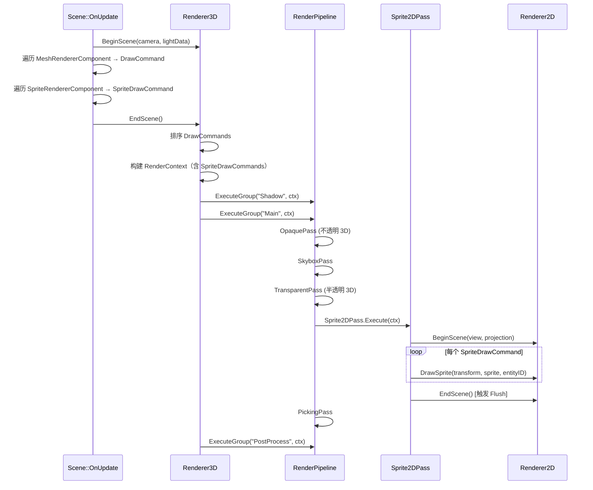

# PhaseR31 - Renderer2D 基础功能设计（世界空间 Sprite）

> 文档版本：v1.0
> 状态：设计中（P0 未开始实现）
> 依赖：PhaseR7 Multi-Pass Rendering、PhaseR9 DrawCommand Sorting、PhaseR15 Mouse Picking、PhaseR20 Transparent Rendering、PhaseR22 Material Semantic Mapping

---

## 目录

1. [目标与非目标](#1-目标与非目标)
2. [背景与设计约束](#2-背景与设计约束)
3. [总体架构](#3-总体架构)
4. [Sprite Shader 设计](#4-sprite-shader-设计)
5. [Renderer2D 类设计](#5-renderer2d-类设计)
6. [批处理机制详解](#6-批处理机制详解)
7. [SpriteRendererComponent 设计](#7-spriterenderercomponent-设计)
8. [Sprite2DPass 设计](#8-sprite2dpass-设计)
9. [RenderContext 扩展](#9-rendercontext-扩展)
10. [Scene 收集与整合](#10-scene-收集与整合)
11. [Inspector UI 与 Hierarchy 集成](#11-inspector-ui-与-hierarchy-集成)
12. [开发步骤与阶段验收](#12-开发步骤与阶段验收)
13. [附录](#13-附录)

---

## 1. 目标与非目标

### 1.1 P0 目标（本 Phase 交付）

- ? 提供世界空间 2D Sprite 的渲染能力，允许场景中的 Entity 作为 Sprite 存在，与 3D 网格一起渲染、参与深度测试、可被鼠标拾取
- ? 提供 `Renderer2D` 静态工具类，与 `Renderer3D` 风格一致
- ? 提供默认 Sprite Shader（用户可见，允许作为普通 Shader 参与自定义材质流程）
- ? 提供 `SpriteRendererComponent`（ECS 组件）
- ? 提供 `Sprite2DPass` 将 Renderer2D 接入 `RenderPipeline`
- ? 支持 32 纹理槽合批（贴图 API 由 Step 3 放开，Step 1 时槽 0 = 白色纹理）
- ? Statistics 面板显示 2D 统计（DrawCalls / QuadCount）

### 1.2 非目标（不做，留给后续 Phase）

- ? 屏幕空间 2D / UI 系统（对标 UGUI，另起 Phase）
- ? Sprite Asset 类型（P0 直接使用 `Ref<Texture2D>` + UVRect，见 §7 决策记录）
- ? Sprite Editor（图集切片工具）
- ? 9-Slice / SortingLayer / OrderInLayer
- ? SpriteRenderer 参与 3D 光照（P0 只做 Unlit）
- ? 文字/字体渲染
- ? Line / Circle 图元（后续 Phase 加入）

---

## 2. 背景与设计约束

### 2.1 现有渲染系统关键事实

| 事实 | 影响 Renderer2D 的设计 |
|---|---|
| 项目使用**前向渲染管线**，由 `RenderPipeline` 驱动，Pass 按 "Shadow" / "Main" / "PostProcess" / "Outline" 分组执行 | Renderer2D 必须包装为 Pass 加入 "Main" 组 |
| `RenderContext` 是 Pass 间数据交换的载体，由 `Renderer3D::EndScene()` 构造 | 需要扩展新增字段 `SpriteDrawCommands` |
| `Framebuffer` 已支持 `RED_INTEGER` 附件用于 EntityID 输出，`PickingPass` 会读取该附件实现鼠标拾取 | Sprite Shader 必须输出 `o_EntityID`（location=1）到主 FBO |
| 已有 `HDR_FBO`（`RGBA16F` + `RED_INTEGER` + `DEPTH24_STENCIL8`）作为 Main 组的渲染目标 | Sprite2DPass 渲染到 `HDR_FBO`，参与 Tonemapping |
| Shader 通过路径含 `/Internal/` 自动标记为 Internal（不出现在 Inspector 下拉） | `Sprite.vert/.frag` 放在 `Assets/Shaders/` 根目录，用户可见 |
| Shader 使用**分离文件**（`.vert` + `.frag`），非单一 `.glsl` | 新增 `Sprite.vert` + `Sprite.frag` 两个文件 |
| 已有 `Common.glsl` 提供 `u_Camera` UBO（`binding = 0`），含 `ViewProjectionMatrix` / `InvProjectionMatrix` / `Position` | Sprite Shader `#include "Lucky/Common.glsl"` 直接复用相机 UBO |
| 已有 `Renderer3D::GetDefaultTexture(TextureDefault::White)` 提供 1×1 白色纹理 | Renderer2D 直接复用，不需要自造 |

### 2.2 硬性约束

1. **命名规范**：严格遵循 [`docs/Coding_Style_Guide.md`](../Coding_Style_Guide.md)（`m_` / `s_` 前缀、PascalCase、`Ref<T>` 而非 `std::shared_ptr` 等）
2. **风格一致性**：与 `Renderer3D` / `GizmoRenderer` 保持接口对称（都是 `Init` / `Shutdown` / `BeginScene` / `EndScene` / `Statistics`）
3. **必须支持 EntityID 输出**：新增的所有 2D 图元都要能被鼠标拾取，否则用户体验割裂
4. **不引入新的第三方依赖**

---

## 3. 总体架构

### 3.1 分层结构

```
┌────────────────────────────────────────────────────────────────┐
│  应用层（Scene / EditorLayer）                                 │
│  ├─ 创建带 SpriteRendererComponent 的 Entity                   │
│  └─ Scene::OnUpdate 遍历收集 Sprite 到 RenderContext            │
├────────────────────────────────────────────────────────────────┤
│  管线层（RenderPipeline / RenderPass）                         │
│  ├─ Sprite2DPass（新增，"Main" 组）                            │
│  │   └─ 从 RenderContext 取 SpriteDrawCommands 循环调用         │
│  │      Renderer2D::DrawSprite(...)                            │
├────────────────────────────────────────────────────────────────┤
│  渲染器层（Renderer2D，新增）                                  │
│  ├─ BeginScene / DrawQuad / DrawSprite / EndScene              │
│  ├─ 批处理：Quad Vertex Buffer + Index Buffer                  │
│  └─ 32 纹理槽管理，自动 Flush                                  │
├────────────────────────────────────────────────────────────────┤
│  底层（VertexArray / VertexBuffer / IndexBuffer / Shader）     │
│  └─ 复用现有基础设施，不新增                                    │
└────────────────────────────────────────────────────────────────┘
```

### 3.2 帧内执行流程



### 3.3 Pass 执行顺序

在现有 "Main" 组的 Pass 队列中，`Sprite2DPass` 插入位置如下：

| 序号 | Pass | 说明 |
|---|---|---|
| 1 | `OpaquePass` | 不透明 3D 网格 |
| 2 | `SkyboxPass` | 天空盒填充剩余像素 |
| 3 | `TransparentPass` | 半透明 3D 网格（远 → 近排序） |
| **4** | **`Sprite2DPass` ★** | **2D 精灵（默认半透明，插入到透明之后）** |
| 5 | `PickingPass` | EntityID 附件整理 |

**为什么在 TransparentPass 之后**：
- Sprite 默认半透明（Alpha 抠图），必须晚于不透明 3D 物体渲染
- Sprite 与 3D 半透明物体互相排序失真是**已知限制**（对齐 Unity SpriteRenderer），P0 不解决

---

## 4. Sprite Shader 设计

### 4.1 文件位置与命名

```
Luck3DApp/Assets/Shaders/
├── Standard.vert / Standard.frag   （已有）
├── Skybox.vert / Skybox.frag       （已有）
└── Sprite.vert / Sprite.frag       ★ 新增
```

**加载注册**（在 `Renderer3D::Init()` 中追加一行）：

```cpp
s_Data.ShaderLib->Load("Assets/Shaders/Sprite");    // 默认 Sprite Shader（用户可见）
```

- ShaderLibrary key：`Sprite`
- 用户可见（路径不含 `/Internal/`）
- 用户可在 Inspector 中给自定义材质选择此 Shader

### 4.2 顶点属性布局

```glsl
// Sprite.vert
#version 450 core

layout(location = 0) in vec3  a_Position;       // 世界空间位置（CPU 端已应用 Transform）
layout(location = 1) in vec4  a_Color;          // 顶点颜色 = Sprite.Color × 内部 tint
layout(location = 2) in vec2  a_TexCoord;       // UV
layout(location = 3) in float a_TexIndex;       // 纹理槽索引 [0, 31]
layout(location = 4) in float a_TilingFactor;   // 平铺倍数
layout(location = 5) in int   a_EntityID;       // Entity ID（用于拾取）
```

**为什么 Position 用 vec3 而非 vec2**：Sprite 处于世界空间，z 坐标决定深度排序与 3D 遮挡关系。

**为什么 Transform 在 CPU 端展开而非通过 uniform 传递**：批处理的核心是"一次 DrawCall 绘制多个物体"，每个 Sprite 有自己的 Transform，只能预先在 CPU 端把 4 个角点变换到世界空间后写入 VBO。

### 4.3 完整 Sprite.vert

```glsl
#version 450 core

layout(location = 0) in vec3  a_Position;       // 世界空间位置
layout(location = 1) in vec4  a_Color;          // 颜色
layout(location = 2) in vec2  a_TexCoord;       // UV
layout(location = 3) in float a_TexIndex;       // 纹理槽索引
layout(location = 4) in float a_TilingFactor;   // 平铺倍数
layout(location = 5) in int   a_EntityID;       // Entity ID

// ---- 引擎公共库 ----
#include "Lucky/Common.glsl"

// 顶点着色器输出数据
struct VertexOutput
{
    vec4  Color;
    vec2  TexCoord;
    float TilingFactor;
};

layout(location = 0) out VertexOutput v_Output;
layout(location = 3) out flat float   v_TexIndex;      // flat 修饰符：不做插值
layout(location = 4) out flat int     v_EntityID;

void main()
{
    v_Output.Color = a_Color;
    v_Output.TexCoord = a_TexCoord;
    v_Output.TilingFactor = a_TilingFactor;
    v_TexIndex = a_TexIndex;
    v_EntityID = a_EntityID;

    gl_Position = u_Camera.ViewProjectionMatrix * vec4(a_Position, 1.0);
}
```

### 4.4 完整 Sprite.frag

```glsl
#version 450 core

layout(location = 0) out vec4 o_Color;      // 颜色输出（HDR FBO）
layout(location = 1) out int  o_EntityID;   // Entity ID 输出（拾取缓冲）

// 顶点着色器输出数据
struct VertexOutput
{
    vec4  Color;
    vec2  TexCoord;
    float TilingFactor;
};

layout(location = 0) in VertexOutput v_Input;
layout(location = 3) in flat float   v_TexIndex;
layout(location = 4) in flat int     v_EntityID;

// 32 个纹理槽（槽 0 = 白色纹理，用于纯色 Quad）
uniform sampler2D u_Textures[32];

void main()
{
    // 采样对应槽位的纹理，UV 乘以平铺倍数
    vec4 texColor = texture(u_Textures[int(v_TexIndex)], v_Input.TexCoord * v_Input.TilingFactor);

    // 最终颜色 = 顶点颜色 × 纹理颜色
    o_Color = v_Input.Color * texColor;

    // Alpha 阈值裁剪（避免半透明像素写入 EntityID 影响拾取）
    if (o_Color.a < 0.01)
    {
        discard;
    }

    o_EntityID = v_EntityID;
}
```

### 4.5 关于 `sampler2D u_Textures[32]` 的 GL 兼容性说明

- OpenGL 4.5 保证 `GL_MAX_TEXTURE_IMAGE_UNITS >= 16`，主流 GPU 均支持 32 个
- 在 `Renderer2D::Init()` 中通过 `glGetIntegerv(GL_MAX_TEXTURE_IMAGE_UNITS)` 查询实际上限并取 `min(32, 上限)`
- Shader 端固定写 32，若实际支持数 < 32，超出的槽位不会被使用（Renderer2D 内部的槽索引不会超出实际上限）

---

## 5. Renderer2D 类设计

### 5.1 文件位置

```
Lucky/Source/Lucky/Renderer/
├── Renderer2D.h    ★ 新增
└── Renderer2D.cpp  ★ 新增
```

### 5.2 Renderer2D.h 完整定义

```cpp
#pragma once

#include "EditorCamera.h"
#include "Texture.h"

#include <glm/glm.hpp>

namespace Lucky
{
    // 前向声明
    struct SpriteRendererComponent;

    /// <summary>
    /// 2D 渲染器：世界空间 Sprite 批处理绘制
    /// 与 Renderer3D 共享相机 / FBO / EntityID 缓冲，作为 RenderPipeline 中的 Pass 与 3D 一起渲染
    /// </summary>
    class Renderer2D
    {
    public:
        /// <summary>
        /// 初始化渲染器（创建 VAO/VBO/IBO、加载 Sprite Shader、准备白色纹理）
        /// </summary>
        static void Init();

        /// <summary>
        /// 释放资源
        /// </summary>
        static void Shutdown();

        /// <summary>
        /// 开始场景：使用编辑器相机
        /// </summary>
        /// <param name="camera">编辑器相机</param>
        static void BeginScene(const EditorCamera& camera);

        /// <summary>
        /// 开始场景：通用重载（供 Runtime 相机 / Sprite2DPass 使用）
        /// </summary>
        /// <param name="viewMatrix">视图矩阵</param>
        /// <param name="projectionMatrix">投影矩阵</param>
        static void BeginScene(const glm::mat4& viewMatrix, const glm::mat4& projectionMatrix);

        /// <summary>
        /// 结束场景：Flush 剩余批次
        /// </summary>
        static void EndScene();

        /// <summary>
        /// 立即提交当前批次并重置（用户显式断批时调用）
        /// </summary>
        static void Flush();

        // ---- 图元绘制 API（Step 1 只暴露纯色版本，Step 3 放开贴图版本） ----

        /// <summary>
        /// 绘制纯色 Quad（通用变换矩阵）
        /// </summary>
        /// <param name="transform">模型变换矩阵（世界空间）</param>
        /// <param name="color">颜色</param>
        /// <param name="entityID">实体 ID（用于拾取，-1 表示无效）</param>
        static void DrawQuad(const glm::mat4& transform, const glm::vec4& color, int entityID = -1);

        /// <summary>
        /// 绘制带纹理的 Quad
        /// </summary>
        /// <param name="transform">模型变换矩阵（世界空间）</param>
        /// <param name="texture">纹理（nullptr 视为纯色）</param>
        /// <param name="tintColor">颜色 Tint</param>
        /// <param name="uvRect">UV 区域（xy=uvMin, zw=uvMax），默认整张图</param>
        /// <param name="tilingFactor">平铺倍数</param>
        /// <param name="entityID">实体 ID</param>
        static void DrawQuad(const glm::mat4& transform, const Ref<Texture2D>& texture,
                             const glm::vec4& tintColor = glm::vec4(1.0f),
                             const glm::vec4& uvRect = glm::vec4(0.0f, 0.0f, 1.0f, 1.0f),
                             float tilingFactor = 1.0f,
                             int entityID = -1);

        /// <summary>
        /// 绘制 Sprite 组件（高层封装，最终仍走 DrawQuad）
        /// </summary>
        /// <param name="transform">模型变换矩阵</param>
        /// <param name="src">Sprite 组件</param>
        /// <param name="entityID">实体 ID</param>
        static void DrawSprite(const glm::mat4& transform, const SpriteRendererComponent& src, int entityID);

        // ---- 统计数据 ----

        /// <summary>
        /// 统计数据
        /// </summary>
        struct Statistics
        {
            uint32_t DrawCalls = 0;     // 绘制调用次数
            uint32_t QuadCount = 0;     // Quad 个数

            /// <summary>
            /// 返回总顶点个数
            /// </summary>
            uint32_t GetTotalVertexCount() const { return QuadCount * 4; }

            /// <summary>
            /// 返回总索引个数
            /// </summary>
            uint32_t GetTotalIndexCount() const { return QuadCount * 6; }
        };

        static Statistics GetStats();

        /// <summary>
        /// 重置统计数据
        /// </summary>
        static void ResetStats();

    private:
        /// <summary>
        /// 内部：当前批次数据满时执行 Flush 并重置批次状态
        /// </summary>
        static void FlushAndReset();

        /// <summary>
        /// 内部：提交纹理到槽位，若已存在则复用，若不存在且槽用满则触发 Flush
        /// 返回槽位索引（作为顶点属性 a_TexIndex 的值）
        /// </summary>
        /// <param name="texture">纹理（nullptr 返回 0，即白色槽）</param>
        /// <returns>纹理槽索引（0 ~ MaxTextureSlots-1）</returns>
        static float SubmitTexture(const Ref<Texture2D>& texture);
    };
}
```

### 5.3 Renderer2D.cpp 关键实现要点（不给完整代码，只给核心结构）

```cpp
#include "lcpch.h"
#include "Renderer2D.h"

#include "RenderCommand.h"
#include "VertexArray.h"
#include "Buffer.h"
#include "Shader.h"
#include "Renderer3D.h"

#include "Lucky/Scene/Components/SpriteRendererComponent.h"

#include <glm/gtc/matrix_transform.hpp>

namespace Lucky
{
    /// <summary>
    /// 单个 Quad 顶点数据（与 Sprite.vert 布局严格一致）
    /// </summary>
    struct QuadVertex
    {
        glm::vec3 Position;
        glm::vec4 Color;
        glm::vec2 TexCoord;
        float TexIndex;
        float TilingFactor;
        int EntityID;
    };

    /// <summary>
    /// Renderer2D 内部数据
    /// </summary>
    struct Renderer2DData
    {
        // ---- 批次容量常量 ----
        static const uint32_t MaxQuads = 10000;
        static const uint32_t MaxVertices = MaxQuads * 4;
        static const uint32_t MaxIndices = MaxQuads * 6;
        static const uint32_t MaxTextureSlots = 32;

        // ---- Quad 批处理资源 ----
        Ref<VertexArray>  QuadVertexArray;
        Ref<VertexBuffer> QuadVertexBuffer;
        Ref<Shader>       SpriteShader;
        Ref<Texture2D>    WhiteTexture;                 // 槽 0，用于纯色 Quad

        // ---- 顶点数据缓冲（CPU 端累积，Flush 时上传 GPU） ----
        uint32_t   QuadIndexCount = 0;                  // 当前批次的索引数
        QuadVertex* QuadVertexBufferBase = nullptr;     // CPU 端缓冲区基地址（Init 时 new，Shutdown 时 delete[]）
        QuadVertex* QuadVertexBufferPtr = nullptr;      // 当前写入位置

        // ---- 纹理槽 ----
        std::array<Ref<Texture2D>, MaxTextureSlots> TextureSlots;
        uint32_t TextureSlotIndex = 1;                  // 0 保留给白色纹理

        // ---- 顶点局部坐标模板（4 个角） ----
        // 中心在原点，边长 1（[-0.5, 0.5]），左下、右下、右上、左上
        glm::vec4 QuadVertexPositions[4] = {
            { -0.5f, -0.5f, 0.0f, 1.0f },
            {  0.5f, -0.5f, 0.0f, 1.0f },
            {  0.5f,  0.5f, 0.0f, 1.0f },
            { -0.5f,  0.5f, 0.0f, 1.0f }
        };

        // ---- 相机 VP 矩阵（BeginScene 时缓存） ----
        glm::mat4 ViewProjection = glm::mat4(1.0f);

        // ---- 统计 ----
        Renderer2D::Statistics Stats;
    };

    static Renderer2DData s_Data;

    void Renderer2D::Init()
    {
        // ---- 创建 VAO ----
        s_Data.QuadVertexArray = VertexArray::Create();

        // ---- 创建动态 VBO（每帧写入） ----
        s_Data.QuadVertexBuffer = VertexBuffer::Create(s_Data.MaxVertices * sizeof(QuadVertex));
        s_Data.QuadVertexBuffer->SetLayout({
            { ShaderDataType::Float3, "a_Position"     },
            { ShaderDataType::Float4, "a_Color"        },
            { ShaderDataType::Float2, "a_TexCoord"     },
            { ShaderDataType::Float,  "a_TexIndex"     },
            { ShaderDataType::Float,  "a_TilingFactor" },
            { ShaderDataType::Int,    "a_EntityID"     }
        });
        s_Data.QuadVertexArray->AddVertexBuffer(s_Data.QuadVertexBuffer);

        // ---- CPU 端顶点缓冲 ----
        s_Data.QuadVertexBufferBase = new QuadVertex[s_Data.MaxVertices];

        // ---- 静态 IBO（固定 0,1,2,2,3,0 模式，一次生成永不变） ----
        uint32_t* quadIndices = new uint32_t[s_Data.MaxIndices];
        uint32_t offset = 0;
        for (uint32_t i = 0; i < s_Data.MaxIndices; i += 6)
        {
            quadIndices[i + 0] = offset + 0;
            quadIndices[i + 1] = offset + 1;
            quadIndices[i + 2] = offset + 2;
            quadIndices[i + 3] = offset + 2;
            quadIndices[i + 4] = offset + 3;
            quadIndices[i + 5] = offset + 0;
            offset += 4;
        }
        Ref<IndexBuffer> ibo = IndexBuffer::Create(quadIndices, s_Data.MaxIndices);
        s_Data.QuadVertexArray->SetIndexBuffer(ibo);   // 假设 VertexArray 已有 SetIndexBuffer；若无则见 §13.1
        delete[] quadIndices;

        // ---- 加载 Shader（已由 Renderer3D::Init 加载到 ShaderLib） ----
        s_Data.SpriteShader = Renderer3D::GetShaderLibrary()->Get("Sprite");

        // ---- 复用 Renderer3D 的白色纹理作为槽 0 ----
        s_Data.WhiteTexture = Renderer3D::GetDefaultTexture(TextureDefault::White);
        s_Data.TextureSlots[0] = s_Data.WhiteTexture;

        // ---- 初始化采样器数组 uniform ----
        int samplers[Renderer2DData::MaxTextureSlots];
        for (uint32_t i = 0; i < Renderer2DData::MaxTextureSlots; ++i)
        {
            samplers[i] = (int)i;
        }
        s_Data.SpriteShader->Bind();
        s_Data.SpriteShader->SetIntArray("u_Textures", samplers, Renderer2DData::MaxTextureSlots);
    }

    void Renderer2D::BeginScene(const glm::mat4& viewMatrix, const glm::mat4& projectionMatrix)
    {
        s_Data.ViewProjection = projectionMatrix * viewMatrix;

        // Sprite Shader 通过 UBO 读取 VP，此处不需要 SetMat4
        // 但如果未来 Sprite Shader 不用 UBO 而用 uniform，则在此处 SetMat4

        // 重置当前批次
        s_Data.QuadIndexCount = 0;
        s_Data.QuadVertexBufferPtr = s_Data.QuadVertexBufferBase;
        s_Data.TextureSlotIndex = 1;    // 保留槽 0 = 白色
    }

    void Renderer2D::EndScene()
    {
        Flush();
    }

    void Renderer2D::Flush()
    {
        if (s_Data.QuadIndexCount == 0)
        {
            return;
        }

        // 上传 CPU 端顶点数据到 GPU
        uint32_t dataSize = (uint32_t)((uint8_t*)s_Data.QuadVertexBufferPtr - (uint8_t*)s_Data.QuadVertexBufferBase);
        s_Data.QuadVertexBuffer->SetData(s_Data.QuadVertexBufferBase, dataSize);

        // 绑定所有已使用的纹理槽
        for (uint32_t i = 0; i < s_Data.TextureSlotIndex; ++i)
        {
            RenderCommand::BindTextureUnit(i, s_Data.TextureSlots[i]->GetRendererID());
        }

        // 绑定 Shader（Shader 通过 UBO 读取相机数据，无需额外设置 uniform）
        s_Data.SpriteShader->Bind();

        // Draw
        RenderCommand::DrawIndexed(s_Data.QuadVertexArray, s_Data.QuadIndexCount);

        s_Data.Stats.DrawCalls++;
    }

    void Renderer2D::FlushAndReset()
    {
        Flush();

        s_Data.QuadIndexCount = 0;
        s_Data.QuadVertexBufferPtr = s_Data.QuadVertexBufferBase;
        s_Data.TextureSlotIndex = 1;
    }

    float Renderer2D::SubmitTexture(const Ref<Texture2D>& texture)
    {
        if (!texture)
        {
            return 0.0f;    // 槽 0 = 白色
        }

        // 查找是否已存在
        for (uint32_t i = 1; i < s_Data.TextureSlotIndex; ++i)
        {
            if (s_Data.TextureSlots[i]->GetRendererID() == texture->GetRendererID())
            {
                return (float)i;
            }
        }

        // 槽满：Flush 并重置
        if (s_Data.TextureSlotIndex >= Renderer2DData::MaxTextureSlots)
        {
            FlushAndReset();
        }

        s_Data.TextureSlots[s_Data.TextureSlotIndex] = texture;
        return (float)s_Data.TextureSlotIndex++;
    }

    void Renderer2D::DrawQuad(const glm::mat4& transform, const glm::vec4& color, int entityID)
    {
        // 顶点数满：Flush 并重置
        if (s_Data.QuadIndexCount >= Renderer2DData::MaxIndices)
        {
            FlushAndReset();
        }

        constexpr glm::vec2 texCoords[4] = {
            { 0.0f, 0.0f }, { 1.0f, 0.0f }, { 1.0f, 1.0f }, { 0.0f, 1.0f }
        };

        for (int i = 0; i < 4; ++i)
        {
            s_Data.QuadVertexBufferPtr->Position     = glm::vec3(transform * s_Data.QuadVertexPositions[i]);
            s_Data.QuadVertexBufferPtr->Color        = color;
            s_Data.QuadVertexBufferPtr->TexCoord     = texCoords[i];
            s_Data.QuadVertexBufferPtr->TexIndex     = 0.0f;
            s_Data.QuadVertexBufferPtr->TilingFactor = 1.0f;
            s_Data.QuadVertexBufferPtr->EntityID     = entityID;
            s_Data.QuadVertexBufferPtr++;
        }

        s_Data.QuadIndexCount += 6;
        s_Data.Stats.QuadCount++;
    }

    // DrawQuad(带纹理) / DrawSprite 类似，仅差 SubmitTexture 与 UVRect 处理
}
```

### 5.4 `Renderer::Init/Shutdown` 集成

修改 [Renderer.cpp](../../Lucky/Source/Lucky/Renderer/Renderer.cpp)：

```cpp
void Renderer::Init()
{
    RenderCommand::Init();
    ScreenQuad::Init();
    Renderer3D::Init();
    Renderer2D::Init();     // ★ 新增（必须在 Renderer3D::Init 之后，因为要复用 ShaderLibrary 与白色纹理）
    GizmoRenderer::Init();
}

void Renderer::Shutdown()
{
    Renderer3D::Shutdown();
    Renderer2D::Shutdown();   // ★ 新增
    GizmoRenderer::Shutdown();
    ScreenQuad::Shutdown();
}
```

---

## 6. 批处理机制详解

### 6.1 批处理容量

| 常量 | 值 | 说明 |
|---|---|---|
| `MaxQuads` | 10000 | 单批次最大 Quad 数 |
| `MaxVertices` | 40000 | = 10000 × 4 |
| `MaxIndices` | 60000 | = 10000 × 6 |
| `MaxTextureSlots` | 32 | 单批次最多容纳的不同纹理 |

**内存占用**：`sizeof(QuadVertex) ≈ 44` 字节，CPU 缓冲 ≈ 40000 × 44 ≈ **1.76 MB**（一次性分配）。

### 6.2 Flush 触发条件

以下任一条件触发 `FlushAndReset()`：

1. Quad 索引数达到 `MaxIndices`
2. 纹理槽用满（`TextureSlotIndex >= 32`）
3. 用户显式调用 `Renderer2D::Flush()`
4. `Renderer2D::EndScene()` 结束

### 6.3 纹理槽复用算法

```
输入：Ref<Texture2D> texture
输出：float slotIndex

if texture == nullptr:
    return 0.0f       // 槽 0 = 白色纹理

for i from 1 to (TextureSlotIndex - 1):
    if TextureSlots[i].RendererID == texture.RendererID:
        return (float)i

if TextureSlotIndex >= 32:
    FlushAndReset()   // 槽已满，触发断批

TextureSlots[TextureSlotIndex] = texture
return (float)(TextureSlotIndex++)
```

### 6.4 顶点数据组织

- **CPU 端缓冲**：`new QuadVertex[MaxVertices]` 一次性分配（`QuadVertexBufferBase`），避免频繁 heap 分配
- **写入指针**：`QuadVertexBufferPtr` 每次 `DrawQuad` 前移 4 个 `QuadVertex`
- **上传**：`Flush()` 时调用 `VertexBuffer::SetData(base, size)`，其中 `size = (ptr - base) * sizeof(QuadVertex)`

### 6.5 Index Buffer 优化

- Quad 索引模式固定为 `0,1,2,2,3,0` → `4,5,6,6,7,4` → ...
- **一次性生成 60000 个索引**（Init 时），永不修改
- Draw 时通过 `DrawIndexed(vao, QuadIndexCount)` 只使用前 N 个索引

---

## 7. SpriteRendererComponent 设计

### 7.1 关于 Sprite 资源类型的决策

#### 方案对比

| 方案 | 优点 | 缺点 | 推荐 |
|---|---|---|---|
| **A. 直接用 `Ref<Texture2D>` + UVRect** | ① 最简单，无新增资源类型<br>② UX 直观（用户直接拖图片到组件上）<br>③ 与现有 Material 引用 Texture2D 的方式一致<br>④ 图集切片可通过手填 UVRect 实现 | ① 不支持 Sprite Editor 可视化切片<br>② 无 Pivot / PPU 概念<br>③ 未来做图集时需要重构 | ? **P0 推荐** |
| **B. 引入极简 `Sprite` Asset（只含 Texture2D + UVRect）** | ① 为未来 Sprite Editor 预留结构<br>② 接口对齐 Unity | ① 多一层间接引用，UX 变差<br>② 若只有 UVRect 与方案 A 等价，增加负担<br>③ 需要修改 AssetType 枚举、AssetManager、Importer | ?? 收益不明显 |
| **C. 引入完整 `Sprite` Asset（Texture + Rect + Pivot + PPU + Border）** | ① 完整 Unity 语义 | ① 工作量约 5?8 天（需要 Sprite Editor、Sprite Packer 等工具）<br>② 与 P0 定位"跑通渲染管线"严重不符 | ? 留给未来 Phase |

#### 决策：采用方案 A

**关键理由**：

1. **P0 定位不匹配**：Sprite 资源类型的价值主要体现在切片工具、图集打包、9-Slice 等**编辑器功能**上，而 P0 目标是"跑通渲染管线"
2. **升级路径平滑**：未来引入 `Sprite` 时，`SpriteRendererComponent` 只需增加一个 `Sprite` 类型字段（保留 `Texture2D` 字段以兼容），Renderer2D 本身无需改动
3. **图集需求可通过 UVRect 手填满足**：99% 场景下用户只需 1 张 1 Sprite，不需要切片工具
4. **DrawCall 优化靠 32 纹理槽合批已足够**：不像 Unity 那样非要通过 Sprite Atlas 才能合批

### 7.2 文件位置

```
Lucky/Source/Lucky/Scene/Components/
└── SpriteRendererComponent.h   ★ 新增
```

### 7.3 完整定义

```cpp
#pragma once

#include "Lucky/Core/Base.h"
#include "Lucky/Renderer/Texture.h"

#include <glm/glm.hpp>

namespace Lucky
{
    /// <summary>
    /// Sprite 渲染器组件：世界空间 2D 精灵
    /// 由 Renderer2D 渲染，与 3D 网格一起参与深度测试、鼠标拾取
    /// </summary>
    struct SpriteRendererComponent
    {
        glm::vec4 Color = glm::vec4(1.0f);                              // Tint 颜色
        Ref<Texture2D> Texture;                                         // 纹理（nullptr = 纯色）
        glm::vec4 UVRect = glm::vec4(0.0f, 0.0f, 1.0f, 1.0f);           // UV 区域（xy=uvMin, zw=uvMax）
        float TilingFactor = 1.0f;                                      // 平铺倍数

        SpriteRendererComponent() = default;
        SpriteRendererComponent(const SpriteRendererComponent& other) = default;
        SpriteRendererComponent(const glm::vec4& color)
            : Color(color) {}
        SpriteRendererComponent(const Ref<Texture2D>& texture, const glm::vec4& tint = glm::vec4(1.0f))
            : Color(tint), Texture(texture) {}
    };
}
```

### 7.4 修改 Components.h 汇总头

追加：

```cpp
#include "SpriteRendererComponent.h"
```

---

## 8. Sprite2DPass 设计

### 8.1 文件位置

```
Lucky/Source/Lucky/Renderer/Passes/
├── Sprite2DPass.h    ★ 新增
└── Sprite2DPass.cpp  ★ 新增
```

### 8.2 完整定义 Sprite2DPass.h

```cpp
#pragma once

#include "Lucky/Renderer/RenderPass.h"

namespace Lucky
{
    /// <summary>
    /// 2D Sprite Pass：将 Renderer2D 接入 RenderPipeline
    /// 从 RenderContext.SpriteDrawCommands 循环调用 Renderer2D::DrawSprite
    /// 属于 "Main" 分组，在 TransparentPass 之后、PickingPass 之前执行
    /// </summary>
    class Sprite2DPass : public RenderPass
    {
    public:
        void Init() override {}
        void Execute(const RenderContext& context) override;
        const std::string& GetName() const override
        {
            static std::string name = "Sprite2DPass";
            return name;
        }
        const std::string& GetGroup() const override
        {
            static std::string group = "Main";
            return group;
        }
    };
}
```

### 8.3 完整实现 Sprite2DPass.cpp

```cpp
#include "lcpch.h"
#include "Sprite2DPass.h"

#include "Lucky/Renderer/RenderContext.h"
#include "Lucky/Renderer/RenderCommand.h"
#include "Lucky/Renderer/RenderState.h"
#include "Lucky/Renderer/Renderer2D.h"

namespace Lucky
{
    void Sprite2DPass::Execute(const RenderContext& context)
    {
        if (!context.SpriteDrawCommands || context.SpriteDrawCommands->empty())
        {
            return;
        }

        // ---- 绑定 HDR FBO（应与 TransparentPass 保持一致，此处兜底再绑一次） ----
        if (context.HDR_FBO)
        {
            context.HDR_FBO->Bind();
        }

        // ---- 设置 2D 渲染状态：半透明 + 深度测试 + 不写深度 ----
        RenderCommand::SetDepthTest(true);
        RenderCommand::SetDepthWrite(false);                            // 半透明不写深度
        RenderCommand::SetDepthFunc(DepthCompareFunc::Less);
        RenderCommand::SetBlendMode(BlendMode::SrcAlpha_OneMinusSrcAlpha);
        RenderCommand::SetCullMode(CullMode::Off);                      // Sprite 双面可见

        // ---- 调用 Renderer2D 执行批处理 ----
        Renderer2D::BeginScene(context.CameraViewMatrix, context.CameraProjectionMatrix);

        for (const SpriteDrawCommand& cmd : *context.SpriteDrawCommands)
        {
            Renderer2D::DrawSprite(cmd.Transform, cmd.Sprite, cmd.EntityID);
        }

        Renderer2D::EndScene();

        // ---- 更新统计到 RenderContext.Stats ----
        if (context.Stats)
        {
            const Renderer2D::Statistics& stats2D = Renderer2D::GetStats();
            context.Stats->DrawCalls += stats2D.DrawCalls;
            context.Stats->TriangleCount += stats2D.QuadCount * 2;
        }
    }
}
```

### 8.4 注册 Pass

在 `Renderer3D::Init()` 中现有 Pipeline 组装位置追加：

```cpp
s_Data.Pipeline.AddPass(CreateRef<TransparentPass>());
s_Data.Pipeline.AddPass(CreateRef<Sprite2DPass>());     // ★ 新增
s_Data.Pipeline.AddPass(CreateRef<PickingPass>());
```

---

## 9. RenderContext 扩展

修改 [RenderContext.h](../../Lucky/Source/Lucky/Renderer/RenderContext.h)：

### 9.1 新增数据结构

```cpp
// 在 DrawCommand 附近新增
/// <summary>
/// Sprite 绘制命令：从 SpriteRendererComponent 提取
/// 由 Scene 收集，Sprite2DPass 消费
/// </summary>
struct SpriteDrawCommand
{
    glm::mat4 Transform;                    // 模型变换矩阵（世界空间）
    SpriteRendererComponent Sprite;         // Sprite 数据副本（值拷贝，避免 Component 生命周期问题）
    int EntityID = -1;                      // Entity ID（用于拾取）
};
```

### 9.2 RenderContext 新增字段

```cpp
struct RenderContext
{
    // ... 现有字段 ...

    // ---- Sprite 数据 ----
    const std::vector<SpriteDrawCommand>* SpriteDrawCommands = nullptr;

    // 需要相机的独立 View 与 Projection（用于 Sprite2DPass 调用 Renderer2D::BeginScene）
    // 注：CameraViewMatrix 现有已有，需要新增 CameraProjectionMatrix
    glm::mat4 CameraProjectionMatrix = glm::mat4(1.0f);

    // ... 现有字段续 ...
};
```

**注意**：`RenderContext` 已经有 `CameraViewMatrix`（用于 CSM 深度计算），但没有独立的 `CameraProjectionMatrix`（VP 通过 UBO 传给 Shader）。为了让 `Sprite2DPass` 能构造 VP 传给 `Renderer2D::BeginScene`，需要新增。

### 9.3 前向声明

由于 `SpriteDrawCommand` 引用了 `SpriteRendererComponent`，需要在 `RenderContext.h` 顶部添加：

```cpp
#include "Lucky/Scene/Components/SpriteRendererComponent.h"
```

（组件是 `struct` 值类型，必须完整定义）

---

## 10. Scene 收集与整合

### 10.1 修改 Renderer3D

在 `Renderer3D` 中新增静态字段与收集接口：

```cpp
// Renderer3D.cpp 内部数据
struct Renderer3DData
{
    // ... 现有字段 ...
    std::vector<SpriteDrawCommand> SpriteDrawCommands;   // ★ 新增
};

// Renderer3D.h 新增静态接口
static void DrawSprite(const glm::mat4& transform, const SpriteRendererComponent& src, int entityID);
```

`Renderer3D::DrawSprite` 实现：

```cpp
void Renderer3D::DrawSprite(const glm::mat4& transform, const SpriteRendererComponent& src, int entityID)
{
    s_Data.SpriteDrawCommands.push_back({ transform, src, entityID });
}
```

`Renderer3D::EndScene()` 中构造 RenderContext 追加：

```cpp
context.SpriteDrawCommands = &s_Data.SpriteDrawCommands;
context.CameraProjectionMatrix = s_Data.CameraProjection;    // 假设 BeginScene 缓存的投影矩阵
```

`Renderer3D::BeginScene()` 中新增清空：

```cpp
s_Data.SpriteDrawCommands.clear();
```

### 10.2 修改 Scene::OnUpdate

在现有遍历 `MeshRendererComponent` 之后追加：

```cpp
// 收集 Sprite
auto spriteView = m_Registry.view<TransformComponent, SpriteRendererComponent>();
for (auto entityID : spriteView)
{
    auto [tr, sr] = spriteView.get<TransformComponent, SpriteRendererComponent>(entityID);
    Renderer3D::DrawSprite(tr.GetWorldMatrix(), sr, (int)entityID);
}
```

---

## 11. Inspector UI 与 Hierarchy 集成

### 11.1 Inspector：SpriteRendererComponent 编辑 UI

通过项目现有的 `ComponentRegistry`（见 PhaseR4 ECS Phase4）注册组件即可自动获得 Inspector：

- **Color**：`ImGui::ColorEdit4`
- **Texture**：现有 `Ref<Texture2D>` 拖放槽 UI（复用 Material 中的 Texture 编辑控件）
- **UVRect**：`ImGui::DragFloat4`
- **TilingFactor**：`ImGui::DragFloat`

具体控件调用参考 [InspectorPanel.cpp](../../Luck3DApp/Source/Panels/InspectorPanel.cpp) 中已有的 `MeshRendererComponent` 渲染逻辑。

### 11.2 Hierarchy：AddComponent 菜单

在 [SceneHierarchyPanel.cpp](../../Luck3DApp/Source/Panels/SceneHierarchyPanel.cpp) 的 `Add Component` 菜单中新增：

```cpp
if (ImGui::MenuItem("Sprite Renderer"))
{
    entity.AddComponent<SpriteRendererComponent>();
}
```

### 11.3 Hierarchy：Create Sprite 快捷菜单

在场景空白处右键菜单 `Create` → 新增：

```cpp
if (ImGui::MenuItem("2D Object / Sprite"))
{
    Entity sprite = m_Scene->CreateEntity("Sprite");
    sprite.AddComponent<SpriteRendererComponent>();
}
```

---

## 12. 开发步骤与阶段验收

### Step 1：最小闭环（纯色 Quad）

**目标**：跑通 Renderer2D 基础架构，能在 EditorLayer 里手动画一个纯色矩形。

**交付物**：

- `Luck3DApp/Assets/Shaders/Sprite.vert`
- `Luck3DApp/Assets/Shaders/Sprite.frag`
- `Lucky/Source/Lucky/Renderer/Renderer2D.h`
- `Lucky/Source/Lucky/Renderer/Renderer2D.cpp`（含完整批处理架构，但只暴露 `DrawQuad(纯色)` API）
- `Lucky/Source/Lucky/Renderer/Renderer3D.cpp`：追加 `ShaderLib->Load("Assets/Shaders/Sprite");`
- `Lucky/Source/Lucky/Renderer/Renderer.cpp`：追加 `Renderer2D::Init/Shutdown`

**验收方式**：

在 `EditorLayer::OnUpdate` 中临时插入以下代码，能看到红色矩形浮在场景中：

```cpp
Renderer2D::BeginScene(m_EditorCamera);
glm::mat4 transform = glm::translate(glm::mat4(1.0f), glm::vec3(0.0f, 0.0f, 0.0f));
Renderer2D::DrawQuad(transform, glm::vec4(1.0f, 0.0f, 0.0f, 1.0f), -1);
Renderer2D::EndScene();
```

**注意**：Step 1 尚未接入 Pipeline，只是 Renderer2D 本身能跑。可以在 `SceneViewportPanel::OnUpdate` 里 3D 渲染完之后手动调用。

---

### Step 2：（跳过，见 §1.2）

---

### Step 3：EntityID 输出 + 拾取集成

**目标**：Sprite 可通过鼠标点击选中。

**修改点**：

- `Sprite.frag` 已包含 `o_EntityID` 输出（Step 1 就已实现）
- 验证 `PickingPass` 能正确读取到 Sprite 写入的 EntityID
- 确认 Sprite 渲染到 HDR FBO 的 attachment 1（`RED_INTEGER`）而非主 FBO

**验收**：Step 4 完成后一起验证，因为需要真实的 Sprite Entity。

---

### Step 4：ECS 集成（SpriteRendererComponent + Sprite2DPass）

**目标**：Hierarchy 里创建 Sprite Entity，Inspector 可编辑，Sprite 与 3D 一起渲染。

**交付物**：

- `Lucky/Source/Lucky/Scene/Components/SpriteRendererComponent.h`
- `Lucky/Source/Lucky/Scene/Components/Components.h`：追加 include
- `Lucky/Source/Lucky/Renderer/Passes/Sprite2DPass.h/.cpp`
- `Lucky/Source/Lucky/Renderer/RenderContext.h`：新增 `SpriteDrawCommand` + `SpriteDrawCommands` 字段 + `CameraProjectionMatrix`
- `Lucky/Source/Lucky/Renderer/Renderer3D.h/.cpp`：新增 `DrawSprite` 静态方法 + `EndScene` 追加 SpriteDrawCommands 到 context
- `Lucky/Source/Lucky/Scene/Scene.cpp`：`OnUpdate` 中收集 Sprite
- `Luck3DApp/Source/Panels/SceneHierarchyPanel.cpp`：AddComponent 菜单 + Create 菜单
- Inspector 组件注册（通过现有 `ComponentRegistry`）
- **删除 Step 1 在 EditorLayer 中的临时代码**

**验收**：

1. Hierarchy 右键 `Create` → `2D Object / Sprite`，能创建一个默认白色矩形 Sprite
2. 在 Inspector 中修改 `Color`、拖入贴图，实时生效
3. Sprite 能被鼠标点击选中（EntityID 拾取正常）
4. 移动相机时 Sprite 深度排序正确（能被 3D 物体遮挡，也能遮挡 3D 物体）
5. Statistics 面板显示 2D DrawCalls / QuadCount

---

### Step 5 及以后（P1，不属于本 Phase）

- Line / Circle 图元
- SortingLayer / OrderInLayer
- Sprite Asset 类型 + Sprite Editor
- Sprite-Lit（参与 3D 光照）

---

## 13. 附录

### 13.1 关于 VertexArray::SetIndexBuffer

已确认 [VertexArray.h](../../Lucky/Source/Lucky/Renderer/VertexArray.h) 中存在 `SetIndexBuffer(const Ref<IndexBuffer>&)` 接口，且 `IndexBuffer` 支持 32 位无符号整型索引（最大 4,294,967,295，远超本 Phase 需要的 60,000），直接使用即可。

### 13.2 关于 std::array 与 Ref 的默认构造

`std::array<Ref<Texture2D>, 32>` 的默认元素为 `Ref<Texture2D>(nullptr)`，安全。

### 13.3 潜在设计选项与备选方案

#### 13.3.1 相机数据传递方式

| 方案 | 描述 | 优缺点 | 推荐 |
|---|---|---|---|
| **A. 复用 Common.glsl 的 `u_Camera` UBO** | Sprite Shader `#include Common.glsl`，直接读 UBO | ? 与 Standard Shader 一致<br>? 无需 Renderer2D 手动 SetMat4<br>?? 依赖 Common.glsl 中相机 UBO 已在 Renderer3D::BeginScene 时上传 | ? **推荐** |
| **B. 独立 uniform `u_ViewProjection`** | Renderer2D::BeginScene 时 `SetMat4` | ? Renderer2D 自包含，可脱离 Renderer3D 独立使用<br>? 与项目其他 Shader 风格不一致 | ? 不推荐 |

**推荐方案 A**：因为 Renderer2D 就是设计为与 Renderer3D 联动的（`Sprite2DPass` 在同一帧内 Renderer3D 已 Bind 过相机 UBO）。

#### 13.3.2 UV 处理方式

| 方案 | 描述 | 优缺点 | 推荐 |
|---|---|---|---|
| **A. UVRect 由 CPU 展开到 4 个顶点 TexCoord** | Renderer2D 内部计算 4 个角的 UV | ? Shader 简单，无 UV 分支<br>? 支持任意子矩形 | ? **推荐** |
| **B. UVRect 作为顶点属性传给 Shader** | Shader 端根据 gl_VertexID 计算 | ? 需要 gl_VertexID，代码复杂<br>? 每顶点重复存储 vec4 UVRect | ? 不推荐 |

#### 13.3.3 EntityID 类型

| 方案 | 描述 | 优缺点 | 推荐 |
|---|---|---|---|
| **A. int（location=5）作为顶点属性** | 每个顶点携带 EntityID | ? 与现有 PickingPass 一致<br>?? 每顶点浪费 4 字节 | ? **推荐** |
| **B. 独立 uniform** | 每 Quad 一次 uniform 更新 | ? 无法批处理，退化为一 Quad 一 DrawCall | ? 不可行 |

### 13.4 数据结构对齐检查

`QuadVertex` 布局：

```
offset  0: Position     vec3    (12 bytes)
offset 12: Color        vec4    (16 bytes)
offset 28: TexCoord     vec2    (8 bytes)
offset 36: TexIndex     float   (4 bytes)
offset 40: TilingFactor float   (4 bytes)
offset 44: EntityID     int     (4 bytes)
Total: 48 bytes（自然对齐）
```

**内存布局无需手动 padding**，因为顶点缓冲区不受 `std140` 约束。

### 13.5 Statistics 面板集成

在 Statistics 面板（若已有）中新增 2D 统计显示。若无独立面板，可在 `RenderPipelinePanel` 或 `SceneViewportPanel` 的调试信息区显示：

```cpp
const Renderer3D::Statistics& stats3D = Renderer3D::GetStats();
const Renderer2D::Statistics& stats2D = Renderer2D::GetStats();

ImGui::Text("3D Draw Calls: %u", stats3D.DrawCalls);
ImGui::Text("3D Triangles: %u", stats3D.TriangleCount);
ImGui::Separator();
ImGui::Text("2D Draw Calls: %u", stats2D.DrawCalls);
ImGui::Text("2D Quads: %u", stats2D.QuadCount);
```

### 13.6 与现有系统的相互作用检查表

| 现有系统 | 是否受影响 | 说明 |
|---|---|---|
| Renderer3D 主渲染流程 | ? 轻微修改 | 新增 SpriteDrawCommands 收集，新增 CameraProjectionMatrix 字段传递 |
| Shadow 系统 | ? 无影响 | Sprite 默认不投射阴影（P0 不支持） |
| Skybox | ? 无影响 | 天空盒仍在 Sprite 之前渲染 |
| Transparent 3D | ?? 需注意 | Sprite 与 3D 半透明物体交叉时排序失真（已知限制） |
| Post Processing | ? 无影响 | Sprite 渲染到 HDR FBO，走同一套 Tonemapping/Bloom/FXAA |
| Outline / Silhouette | ?? 待评估 | 描边系统当前只处理 Mesh，Sprite 暂不支持描边（P1 再补） |
| Picking | ? 完全支持 | Sprite Shader 输出 EntityID，PickingPass 无需改动 |
| Gizmo | ? 无影响 | Gizmo 走独立渲染路径 |
| IBL / Lighting | ? 无影响 | Sprite 默认 Unlit |

### 13.7 已知限制

1. **Sprite 与 3D 透明物体互相排序失真**：Sprite 在 TransparentPass 之后统一渲染，与 3D 半透明物体（如玻璃）交叉时可能出现错误的前后关系（对齐 Unity SpriteRenderer 的行为）
2. **Sprite 不投射也不接收阴影**：P0 不实现 2D 阴影
3. **Sprite 不参与 3D 光照**：P0 只支持 Unlit
4. **Sprite 不支持描边**：现有 Silhouette Pass 只处理 Mesh
5. **纹理槽单批次上限 32**：超出会自动断批，DrawCall 增多但功能正常

### 13.8 未来演进方向（超出本 Phase）

- **P1**：Line / Circle 图元、SortingLayer / OrderInLayer、Sprite 描边、Sprite Debug 可视化
- **P2**：Sprite Asset 类型（含 Pivot / PPU / 9-Slice）、Sprite Editor、Sprite Atlas 自动打包
- **P2**：Sprite-Lit（对标 URP `Sprite-Lit-Default`）?? 2D 法线贴图 + 参与 3D 光照
- **P3**：Text / Font 渲染（MSDF 位图字体）
- **P3**：独立 UI 系统（对标 UGUI，屏幕空间 HUD）

---

## 附：Phase 完成检查清单

开发完成后请依次核对：

- [ ] `Sprite.vert` / `Sprite.frag` 已创建，`ShaderLib->Load` 已追加
- [ ] `Renderer2D::Init` 在 `Renderer3D::Init` 之后调用（依赖 ShaderLibrary 与白色纹理）
- [ ] `Renderer2D::Shutdown` 在 `Renderer3D::Shutdown` 之后调用
- [ ] `SpriteRendererComponent.h` 已创建，`Components.h` 已 include
- [ ] `Sprite2DPass` 已注册到 Pipeline，位于 TransparentPass 之后、PickingPass 之前
- [ ] `RenderContext` 已新增 `SpriteDrawCommands` 与 `CameraProjectionMatrix`
- [ ] `Renderer3D::BeginScene` 清空 `SpriteDrawCommands`，`EndScene` 传递给 context
- [ ] `Renderer3D::DrawSprite` 已实现
- [ ] `Scene::OnUpdate` 遍历 Sprite 组件调用 `Renderer3D::DrawSprite`
- [ ] `SceneHierarchyPanel` 的 AddComponent 菜单已新增 `Sprite Renderer`
- [ ] `SceneHierarchyPanel` 的 Create 菜单已新增 `2D Object / Sprite`
- [ ] Inspector 中 SpriteRendererComponent 可正确编辑 Color / Texture / UVRect / TilingFactor
- [ ] Sprite 可被鼠标点击选中
- [ ] Sprite 与 3D 网格深度排序正确
- [ ] Statistics 面板显示 2D 数据
- [ ] Step 1 临时测试代码已从 EditorLayer 中移除

---

**文档结束**
