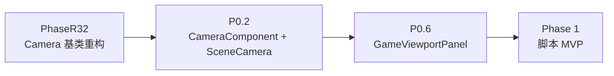

# PhaseR32：Camera 基类重构 ?? 投影 / 视口能力下移

## 1. 概述

### 背景

当前项目的相机层级极其"贫瘠"：

- [Camera.h](../../Lucky/Source/Lucky/Renderer/Camera.h) 只是一个持有 `m_ProjectionMatrix` 的空壳基类，共 23 行
- [EditorCamera](../../Lucky/Source/Lucky/Renderer/EditorCamera.h) 独占了"投影 + 视口 + 视图 + 姿态 + 输入控制"全部职责，且**只支持透视投影**
- 脚本系统前置工作 P0.2 会引入 `SceneCamera`（同时支持 Perspective / Orthographic），但如果按当前设计独立成一个类，`glm::perspective` 那套算式会**再出现一遍**，且 `EditorCamera` 未来若加正交视图还得再抽一次

### 目标

将"**投影 + 视口**"这两块能力从 `EditorCamera` 中剥离，下移到 `Camera` 基类，让 `EditorCamera` 和未来的 `SceneCamera` 都从同一个基类派生投影能力。

具体产出：

1. `Camera` 基类扩容：管理 `ProjectionType` + 透视/正交参数 + AspectRatio + `m_ProjectionMatrix`
2. `EditorCamera` 瘦身：删除投影相关字段与方法，构造函数通过基类 `SetPerspective / SetViewportSize` 初始化
3. **统一命名规范**：所有相机的透视/正交参数都用长命名 `GetPerspective* / GetOrthographic*`（`GetFOV / GetNear / GetFar` 等短命名彻底下线）
4. 为后续 `SceneCamera`（P0.2）落地铺平道路

### 前置依赖
- 无。本 Phase 完全独立，也不属于脚本系统前置工作，是渲染架构演进的一部分

### 本 Phase **不做**的事
- 不引入 `SceneCamera` 类（那是 P0.2 的事，本 Phase 完成后 P0.2 里 SceneCamera 变成"几乎空壳"）
- 不给 `EditorCamera` 加正交视图 UI/切换开关（能力已具备，但用户端切换 UI 属于独立的编辑器功能）
- 不改动 `Renderer3D::BeginScene` 的签名（继续用 `EditorCamera&`，只把内部对相机短命名的调用换为长命名）

---

## 2. 涉及的文件

### 需要修改
| 文件 | 说明 |
|------|------|
| `Lucky/Source/Lucky/Renderer/Camera.h` | 从 23 行扩展为完整投影管理类；新增 `ProjectionType` 枚举 |
| `Lucky/Source/Lucky/Renderer/Camera.cpp` | **新建**（当前不存在，因为原基类都是 inline） |
| `Lucky/Source/Lucky/Renderer/EditorCamera.h` | 删除投影字段/方法（包括短命名接口）；保留视图/姿态/输入相关 |
| `Lucky/Source/Lucky/Renderer/EditorCamera.cpp` | 删除 `UpdateProjection`；构造函数改为委托基类；`SetViewportSize` 同步基类 |
| `Lucky/Source/Lucky/Renderer/Renderer3D.cpp` | CSM 段中 3 处短命名调用改为长命名（详见 3.2） |

### 无需修改
- `Renderer3D.h`：`BeginScene` 签名不变
- `GizmoRenderer.h/.cpp`：只依赖 `GetPosition / GetViewProjectionMatrix`，均保留在 `EditorCamera`
- `SceneViewportPanel.h/.cpp`：只依赖视图/输入相关接口，均保留在 `EditorCamera`
- `Scene.h/.cpp`（P0.1 已引入 `OnRenderEditor(EditorCamera&)`）：零改动

---

## 3. 现状分析

### 3.1 EditorCamera 的职责拆分

按性质盘点 [EditorCamera](../../Lucky/Source/Lucky/Renderer/EditorCamera.h) 现有字段/方法：

| 类别 | 字段 | 方法 |
|------|------|------|
| **A. 投影参数** | `m_FOV / m_Near / m_Far / m_AspectRatio` | `UpdateProjection` / `GetFOV / GetNear / GetFar / GetAspectRatio` |
| **B. 视口大小** | `m_ViewportWidth / m_ViewportHeight` | `SetViewportSize` / `GetViewportHeight` |
| **C. 视图与姿态** | `m_ViewMatrix / m_Position / m_FocalPoint / m_Pitch / m_Yaw / m_Distance` | `UpdateView / GetViewMatrix / SetViewMatrix / GetPosition / GetOrientation / GetUpDirection / GetRightDirection / GetForwardDirection / CalculatePosition / GetPitch / GetYaw / GetDistance / SetDistance / GetViewProjectionMatrix` |
| **D. 输入控制器** | `m_InitialMousePosition` | `OnUpdate / OnEvent / OnMouseScroll / ViewPan / ViewRotate / ViewZoom / PanSpeed / RotationSpeed / ZoomSpeed` |

**观察**：
- **A 完全可下移**到基类（甚至可以顺手加正交能力）
- **B 部分下移**：`m_AspectRatio` 应下移；但 `m_ViewportWidth / m_ViewportHeight` 因 `PanSpeed()` 计算需要，仍要留在 EditorCamera
- **C / D 必须留在 EditorCamera**（专属于"轨道相机控制器"这一角色）

### 3.2 外部调用点全清单

对 `EditorCamera` 有依赖的位置：

| 调用者 | 依赖的接口 | 抽取后 |
|--------|-----------|-------|
| `Renderer3D::BeginScene(EditorCamera&, ...)` | `GetViewProjectionMatrix / GetProjectionMatrix / GetPosition / GetNear / GetFOV / GetAspectRatio / GetViewMatrix` | 前 3 个 + `GetAspectRatio / GetViewMatrix` 名字不变；`GetNear / GetFOV` 需改为长命名 |
| `GizmoRenderer::BeginScene(EditorCamera&)` | `GetPosition` | 不变 |
| `GizmoRenderer::DrawInfiniteGrid(EditorCamera&)` | `GetViewProjectionMatrix` | 不变 |
| `Renderer2D::BeginScene(EditorCamera&)` | `GetViewMatrix / GetProjectionMatrix` | 不变 |
| `Scene::OnRenderEditor(EditorCamera&)` | 由 `Scene::OnRenderEditor` 转发到 `RenderSceneImpl` | 不变 |
| `SceneViewportPanel` | `SetViewportSize / OnUpdate / OnEvent / GetViewMatrix / GetProjectionMatrix / GetDistance / SetViewMatrix / GetForwardDirection` 等 | 全部不变 |

**具体需改名的行**（[Renderer3D.cpp](../../Lucky/Source/Lucky/Renderer/Renderer3D.cpp) CSM 段）：

```cpp
float cameraNear = camera.GetNear();      →  float cameraNear = camera.GetPerspectiveNearClip();
float fov = camera.GetFOV();              →  float fov = camera.GetPerspectiveVerticalFOV();
```

一共 **2 处**。其余同段中的 `camera.GetAspectRatio() / camera.GetViewMatrix()` 命名新旧一致，无需修改。

### 3.3 主流引擎的对齐情况

| 引擎 | 相机架构 | 结论 |
|------|---------|------|
| **Unity** | `Camera` 组件单类同时支持 Perspective / Orthographic；`SceneView` 内部相机 = 一个隐藏 Camera + SceneView 输入控制 | 投影是相机基础能力，控制方式是差异层 |
| **Unreal** | `UCameraComponent` 统一基类；`FEditorViewportClient` 内部维护飞行相机后构造 `FSceneView` 喂给渲染管线 | 渲染只认统一相机数据，编辑器控制独立 |
| **Godot 4** | `Camera3D` 节点同时支持 Perspective / Orthographic / Frustum；编辑器 3D 视图相机就是一个隐藏 `Camera3D` | 投影完全共享 |
| **Hazel Engine** | `Camera` 基类（含 `m_Projection`）；`SceneCamera / EditorCamera` 各自继承并**各存一份投影参数** | Luck3D 现状继承自 Hazel，尚未做此层抽取 |

Luck3D 现状停留在 Hazel 级别，本 Phase 目标是**向 Unity/Unreal/Godot 的统一抽象靠拢**。

---

## 4. 详细设计

### 4.1 新的 Camera 基类

**`Lucky/Source/Lucky/Renderer/Camera.h`**：

```cpp
#pragma once

#include <glm/glm.hpp>

namespace Lucky
{
    /// <summary>
    /// 投影类型
    /// </summary>
    enum class ProjectionType : uint8_t
    {
        Perspective = 0,        // 透视投影
        Orthographic            // 正交投影
    };

    /// <summary>
    /// 相机基类：管理投影矩阵与投影参数（Perspective / Orthographic）
    /// 不感知视图矩阵、位置、朝向 ?? 那些由派生类或外部 Transform 承担
    /// </summary>
    class Camera
    {
    public:
        Camera();
        virtual ~Camera() = default;

        // ---- 一次性设置投影 ----

        /// <summary>
        /// 设置为透视投影
        /// </summary>
        /// <param name="verticalFOV">垂直张角（度）</param>
        /// <param name="nearClip">近裁剪面</param>
        /// <param name="farClip">远裁剪面</param>
        void SetPerspective(float verticalFOV, float nearClip, float farClip);

        /// <summary>
        /// 设置为正交投影
        /// </summary>
        /// <param name="size">正交视口垂直大小（世界空间单位）</param>
        /// <param name="nearClip">近裁剪面</param>
        /// <param name="farClip">远裁剪面</param>
        void SetOrthographic(float size, float nearClip, float farClip);

        /// <summary>
        /// 更新视口宽高，触发投影矩阵重算
        /// </summary>
        void SetViewportSize(uint32_t width, uint32_t height);

        // ---- Projection Type ----
        ProjectionType GetProjectionType() const { return m_ProjectionType; }
        void SetProjectionType(ProjectionType type);

        // ---- Perspective ----
        float GetPerspectiveVerticalFOV() const { return m_PerspectiveFOV; }
        void SetPerspectiveVerticalFOV(float fov);
        float GetPerspectiveNearClip() const { return m_PerspectiveNear; }
        void SetPerspectiveNearClip(float nearClip);
        float GetPerspectiveFarClip() const { return m_PerspectiveFar; }
        void SetPerspectiveFarClip(float farClip);

        // ---- Orthographic ----
        float GetOrthographicSize() const { return m_OrthographicSize; }
        void SetOrthographicSize(float size);
        float GetOrthographicNearClip() const { return m_OrthographicNear; }
        void SetOrthographicNearClip(float nearClip);
        float GetOrthographicFarClip() const { return m_OrthographicFar; }
        void SetOrthographicFarClip(float farClip);

        // ---- Aspect / Projection Matrix ----
        float GetAspectRatio() const { return m_AspectRatio; }
        const glm::mat4& GetProjectionMatrix() const { return m_ProjectionMatrix; }
    protected:
        /// <summary>
        /// 根据当前 ProjectionType 与参数重算投影矩阵
        /// </summary>
        void RecalculateProjection();
    protected:
        ProjectionType m_ProjectionType = ProjectionType::Perspective;

        float m_PerspectiveFOV = 45.0f;             // 垂直张角（度）
        float m_PerspectiveNear = 0.01f;            // 透视近裁剪面
        float m_PerspectiveFar = 1000.0f;           // 透视远裁剪面

        float m_OrthographicSize = 10.0f;           // 正交视口垂直大小
        float m_OrthographicNear = -1.0f;           // 正交近裁剪面
        float m_OrthographicFar = 1000.0f;          // 正交远裁剪面

        float m_AspectRatio = 1.0f;                 // 宽高比

        glm::mat4 m_ProjectionMatrix = glm::mat4(1.0f);
    };
}
```

**`Lucky/Source/Lucky/Renderer/Camera.cpp`**（新建）：

```cpp
#include "lcpch.h"
#include "Camera.h"

namespace Lucky
{
    Camera::Camera()
    {
        RecalculateProjection();
    }

    void Camera::SetPerspective(float verticalFOV, float nearClip, float farClip)
    {
        m_ProjectionType = ProjectionType::Perspective;
        m_PerspectiveFOV = verticalFOV;
        m_PerspectiveNear = nearClip;
        m_PerspectiveFar = farClip;
        RecalculateProjection();
    }

    void Camera::SetOrthographic(float size, float nearClip, float farClip)
    {
        m_ProjectionType = ProjectionType::Orthographic;
        m_OrthographicSize = size;
        m_OrthographicNear = nearClip;
        m_OrthographicFar = farClip;
        RecalculateProjection();
    }

    void Camera::SetViewportSize(uint32_t width, uint32_t height)
    {
        if (width == 0 || height == 0)
        {
            return; // 防除零
        }

        m_AspectRatio = static_cast<float>(width) / static_cast<float>(height);
        RecalculateProjection();
    }

    void Camera::SetProjectionType(ProjectionType type)
    {
        m_ProjectionType = type;
        RecalculateProjection();
    }

    void Camera::SetPerspectiveVerticalFOV(float fov)
    {
        m_PerspectiveFOV = fov;
        RecalculateProjection();
    }

    void Camera::SetPerspectiveNearClip(float nearClip)
    {
        m_PerspectiveNear = nearClip;
        RecalculateProjection();
    }

    void Camera::SetPerspectiveFarClip(float farClip)
    {
        m_PerspectiveFar = farClip;
        RecalculateProjection();
    }

    void Camera::SetOrthographicSize(float size)
    {
        m_OrthographicSize = size;
        RecalculateProjection();
    }

    void Camera::SetOrthographicNearClip(float nearClip)
    {
        m_OrthographicNear = nearClip;
        RecalculateProjection();
    }

    void Camera::SetOrthographicFarClip(float farClip)
    {
        m_OrthographicFar = farClip;
        RecalculateProjection();
    }

    void Camera::RecalculateProjection()
    {
        if (m_ProjectionType == ProjectionType::Perspective)
        {
            m_ProjectionMatrix = glm::perspective(
                glm::radians(m_PerspectiveFOV),
                m_AspectRatio,
                m_PerspectiveNear,
                m_PerspectiveFar);
        }
        else
        {
            float halfHeight = m_OrthographicSize * 0.5f;
            float halfWidth = halfHeight * m_AspectRatio;
            m_ProjectionMatrix = glm::ortho(
                -halfWidth, halfWidth,
                -halfHeight, halfHeight,
                m_OrthographicNear,
                m_OrthographicFar);
        }
    }
}
```

### 4.2 瘦身后的 EditorCamera

**`Lucky/Source/Lucky/Renderer/EditorCamera.h`** 变化（相较于原文件）：

**删除的字段**：
```cpp
float m_FOV = 45.0f;
float m_Near = 0.01f;
float m_Far = 1000.0f;
float m_AspectRatio = 1280.0f / 720.0f;
```

**删除的方法**：
```cpp
void UpdateProjection();
```

**删除的短命名 Getter**（它们现在由基类的长命名接口取代）：
```cpp
float GetFOV() const { return m_FOV; }
float GetNear() const { return m_Near; }
float GetFar() const { return m_Far; }
float GetAspectRatio() const { return m_AspectRatio; }   // 基类已提供同名方法，无需重复
```

保留的字段（视图/姿态/输入相关）：
```cpp
glm::mat4 m_ViewMatrix;
glm::vec3 m_Position;
glm::vec3 m_FocalPoint;
glm::vec2 m_InitialMousePosition;
float m_Distance = 5.0f;
float m_Pitch = 0.44f;
float m_Yaw = -0.62f;
float m_ViewportWidth = 1280.0f;         // PanSpeed 计算需要
float m_ViewportHeight = 720.0f;         // PanSpeed 计算需要
```

**保留的 Getter**：

```cpp
// 仅保留基类无法提供的、视图/姿态/输入相关的 Getter
// GetFOV / GetNear / GetFar 已删除，调用者直接使用基类的 GetPerspective* 长命名
```

> 基类 `Camera` 已提供 `GetAspectRatio() / GetProjectionMatrix() / GetPerspectiveVerticalFOV() / GetPerspectiveNearClip() / GetPerspectiveFarClip()` 等全套接口，无需在 EditorCamera 里重复声明。

**修改的方法**：

```cpp
// 原
void SetViewportSize(float width, float height) 
{ 
    m_ViewportWidth = width; 
    m_ViewportHeight = height; 
    UpdateProjection(); 
}

// 改为
void SetViewportSize(float width, float height)
{
    m_ViewportWidth = width;
    m_ViewportHeight = height;
    Camera::SetViewportSize(
        static_cast<uint32_t>(width),
        static_cast<uint32_t>(height));
}
```

**修改的构造函数**（`EditorCamera.cpp`）：

```cpp
// 原
EditorCamera::EditorCamera(float fov, float aspectRatio, float nearClip, float farClip)
    : m_FOV(fov), m_AspectRatio(aspectRatio), m_Near(nearClip), m_Far(farClip)
{
    UpdateView();
}

// 改为
EditorCamera::EditorCamera(float fov, float aspectRatio, float nearClip, float farClip)
{
    SetPerspective(fov, nearClip, farClip);
    // 由 aspectRatio 反推初始视口尺寸（保持行为一致）：
    // aspect = 宽/高，随便取一个基准高度即可，因为后续 SetViewportSize 会覆盖
    m_ViewportHeight = 720.0f;
    m_ViewportWidth = 720.0f * aspectRatio;
    Camera::SetViewportSize(
        static_cast<uint32_t>(m_ViewportWidth),
        static_cast<uint32_t>(m_ViewportHeight));

    UpdateView();
}
```

**删除**：
```cpp
void EditorCamera::UpdateProjection() { ... }
```

其余所有方法（`OnUpdate / OnEvent / UpdateView / ViewPan / ViewRotate / ViewZoom / SetViewMatrix / GetPosition / GetViewMatrix / GetForwardDirection / ...`）**全部保留原样**。

### 4.3 P0.2 后续的联动

本 Phase 完成后，P0.2 里 `SceneCamera` 的定义变得极其简单：

```cpp
namespace Lucky
{
    /// <summary>
    /// 场景相机：ECS 世界中作为 CameraComponent 的一部分
    /// 位置和朝向由 TransformComponent 承担
    /// </summary>
    class SceneCamera : public Camera
    {
    };
}
```

**为什么保留一个空派生类**：
- 保持类型区分性（Renderer3D 未来可以按类型分派不同处理）
- 为未来 ECS 相机独有字段留位（Unity 的 `Camera.clearFlags / cullingMask / viewportRect / depth` 等，将来都会加在这里）
- 与 `EditorCamera` 形成平级派生，语义清晰

如果**不想**为空派生类费心思，也可以直接让 `CameraComponent` 持有 `Camera`??但**推荐保留 SceneCamera**（Hazel 也是这么做的）。

### 4.4 Renderer3D::BeginScene 修改（3 处重命名）

[Renderer3D.cpp](../../Lucky/Source/Lucky/Renderer/Renderer3D.cpp) CSM 段中的 2 行需要重命名：

```cpp
// 原代码
float cameraNear = camera.GetNear();
// ...
float fov = camera.GetFOV();
float aspectRatio = camera.GetAspectRatio();   // 不变
glm::mat4 cameraView = camera.GetViewMatrix(); // 不变

// 修改后
float cameraNear = camera.GetPerspectiveNearClip();
// ...
float fov = camera.GetPerspectiveVerticalFOV();
float aspectRatio = camera.GetAspectRatio();
glm::mat4 cameraView = camera.GetViewMatrix();
```

其余依赖 `EditorCamera` 的位置（`GizmoRenderer / Renderer2D / SceneViewportPanel / Scene`）命名均不变。

---

## 5. 关键决策点与方案对比

### 5.1 【决策点 1】投影/视口能力抽取的位置

#### 方案 A：直接扩容 `Camera` 基类（**推荐 ★★★**）

- **优点**
  - 层级最扁平（保持三层：`Camera` → `EditorCamera` / `SceneCamera`）
  - 无中间类，无过度设计
  - 与 Unity/Godot 的"相机基础能力单类完成"哲学一致
- **缺点**
  - `Camera` 从 23 行的极简类变成 130+ 行的功能类（但依然清晰、职责单一）

#### 方案 B：插入 `ProjectionCamera` 中间类

```
Camera → ProjectionCamera → EditorCamera / SceneCamera
```

- **优点**
  - 保留 `Camera` 原有的极简形态（仅存 `m_ProjectionMatrix`）
  - 语义分层更细
- **缺点**
  - 多一层继承层级，无实际收益
  - `Camera` 极简形态本身没有独立价值（不会有类只派生自 `Camera` 而不派生自 `ProjectionCamera`）
  - 过度设计

#### 方案 C：组合而非继承（Camera 内含 Projection 对象）

- **优点**：符合"组合优于继承"
- **缺点**：`Camera::GetProjectionMatrix()` 要转发到内部对象，样板代码增多；外部使用体验变差

**结论**：采用**方案 A**。

### 5.2 【决策点 2】命名处理策略

`EditorCamera::GetFOV / GetNear / GetFar` 抽取后如何处理？

#### 方案 A：直接删除短命名，调用点同步改为长命名（**推荐 ★★★**）

- **优点**
  - 命名统一到位：全项目只存在一套命名（`GetPerspective*`），无歧义
  - 重构彻底，无遗留技术债
  - `Renderer3D.cpp` 只有20 - **2 处**机械替换，风险可忽略
  - `FOV` 本身是透视专属概念，`GetPerspectiveVerticalFOV` 语义更准确
- **缺点**
  - 需要同步修改 `Renderer3D.cpp` 的 2 行（手工机械替换）

#### 方案 B：保留兼容别名（inline 转发）

```cpp
float GetFOV() const { return GetPerspectiveVerticalFOV(); }
float GetNear() const { return GetPerspectiveNearClip(); }
float GetFar() const { return GetPerspectiveFarClip(); }
```

- **优点**
  - `Renderer3D::BeginScene` **零改动**
  - 可作为潜在外部依赖很多时的过渡方案
- **缺点**
  - 命名空间存在两套同义名（`GetFOV` 与 `GetPerspectiveVerticalFOV`），新代码该写哪个不清晰
  - 重构不彻底，遗留长期技术债
  - `FOV` 与 `GetPerspective*` 两套命名风格分裂
  - Luck3D 是新项目，无历史包袱、无第三方调用者，**没有理由为兼容付出代价**

#### 方案 C：`EditorCamera` 显式禁用 `SetOrthographic` 等基类接口

- **优点**：语义严格（编辑器相机就是透视）
- **缺点**
  - 违反 Liskov 原则；`= delete` 基类方法在 C++ 中不能真正阻止（`static_cast<Camera*>` 就绕开了）
  - 未来 Scene 视图工具栏切正交时反而要撤销

**结论**：采用**方案 A**。重构就要重构彻底，不为"少改 2 行"而不尚带来命名不一致的长期坐病。

### 5.3 【决策点 3】`m_ViewportWidth / m_ViewportHeight` 字段是否下移

#### 方案 A：不下移，保留在 EditorCamera（**推荐 ★★★**）

- **优点**
  - `PanSpeed()` 计算需要具体像素尺寸，不是 aspect ratio
  - 语义上"视口尺寸"是控制器相关的（用来调整交互速度），不是投影本身的属性
  - 基类只关心 `m_AspectRatio`（投影所需）
- **缺点**：`Camera::SetViewportSize` 和 `EditorCamera::SetViewportSize` 会形成"重载 + 遮蔽"关系，需要小心处理签名（`Camera` 用 `uint32_t`，`EditorCamera` 现有签名是 `float`）

#### 方案 B：下移到基类

- **优点**：字段集中
- **缺点**：`SceneCamera` 用不到这两个字段，基类冗余

**结论**：采用**方案 A**。签名差异的处理见 4.2 里 `EditorCamera::SetViewportSize` 的写法（内部先更新自己的字段，再调基类的 `uint32_t` 版本）。

### 5.4 【决策点 4】`SceneCamera` 是保留空派生还是直接用 Camera

#### 方案 A：保留 `SceneCamera` 空派生类（**推荐 ★★★**）

- **优点**
  - 保持类型区分性：函数签名 `void RenderTo(const SceneCamera&)` 比 `void RenderTo(const Camera&)` 语义更明确
  - 未来加"ECS 相机独有字段"（Unity `clearFlags / cullingMask / depth`）时位置清晰
  - 与 `EditorCamera` 平级派生，架构更规整
- **缺点**：一个空派生类看起来"没必要"（但这是"预留"性质，是可以接受的）

#### 方案 B：不建 `SceneCamera`，`CameraComponent` 直接持有 `Camera`

- **优点**：文件更少
- **缺点**
  - 未来加 ECS 相机字段时又要新建类，动到 `CameraComponent` 结构（涉及序列化）
  - 与 Hazel 参考实现不一致

**结论**：采用**方案 A**。

---

## 6. 验收标准

本 Phase 完成后应满足：

1. **编译通过**：`Camera.h/.cpp`、`EditorCamera.h/.cpp`、`Renderer3D.cpp`（2 处重命名）修改后项目正常编译
2. **零回归**：
   - 编辑器启动后行为与改造前完全一致（透视相机、鼠标 pan/rotate/zoom、CSM 阴影等）
   - Scene 面板渲染画面与改造前**像素一致**
   - Framebuffer resize 时相机 aspect 正确跟随
3. **接口就位**：以下调用可用
   - `editorCamera.GetPerspectiveVerticalFOV()` / `GetPerspectiveNearClip()` / `GetPerspectiveFarClip()` 返回正确值
   - `editorCamera.SetOrthographic(10.0f, 0.1f, 1000.0f)` 后 `GetProjectionMatrix()` 是正交矩阵
   - `Camera` 基类可以独立构造并使用（作为 P0.2 SceneCamera 的基础）
4. **命名清理验证**：全项目搜索 `GetFOV()` / `GetNear()` / `GetFar()`，实例方法调用（非本地变量同名）应为 **0 命中**（证明没漏改）
5. **手动验证**：
   - 在 `SceneViewportPanel` 里临时插一行 `m_EditorCamera.SetOrthographic(10.0f, -1.0f, 100.0f);`，画面切换为正交视图，验证完撤销
   - 编辑器相机的鼠标 pan/rotate/zoom 依然工作

---

## 7. 后续 Phase 的接入点预告

| 位置 | 后续 Phase | 会加什么 |
|------|-----------|---------|
| `Camera` 基类 | P0.2 CameraComponent | 派生出空 `SceneCamera` 供 `CameraComponent` 持有 |
| `Camera::SetOrthographic` | 未来 Scene 视图工具栏扩展 | 编辑器 Scene 视图可切 Persp / Iso / Top / Front / Right（对齐 Unity） |
| `Renderer3D::BeginScene` CSM 段 | P0.2 | 正交投影下自动关闭 CSM |

---

## 8. 变更清单速览

- **新增**
  - `Camera.h`：`enum class ProjectionType`；`Camera` 类扩容为投影管理类
  - `Camera.cpp`：新建，含 `RecalculateProjection` 与所有 Setter 实现
- **修改**
  - `EditorCamera.h`：删除 `m_FOV / m_Near / m_Far / m_AspectRatio` 字段与 `UpdateProjection` 方法；删除 `GetFOV / GetNear / GetFar / GetAspectRatio` 短命名 Getter（由基类接口取代）；`SetViewportSize` 内部委托基类
  - `EditorCamera.cpp`：构造函数改为委托基类 `SetPerspective + SetViewportSize`；删除 `UpdateProjection` 实现
  - `Renderer3D.cpp`：CSM 段 2 处短命名调用改为长命名（`GetNear → GetPerspectiveNearClip`；`GetFOV → GetPerspectiveVerticalFOV`）
- **删除**
  - `EditorCamera::UpdateProjection`
  - `EditorCamera::GetFOV / GetNear / GetFar / GetAspectRatio`（同名方法已在基类）
  - `EditorCamera` 中的投影相关字段
- **零改动**
  - `Renderer3D.h`（`BeginScene` 签名不变）
  - `GizmoRenderer.h/.cpp`
  - `SceneViewportPanel.h/.cpp`
  - `Scene.h/.cpp`
  - `Renderer2D.h/.cpp`

---

## 9. 与脚本系统 P0.2 的时序关系



**建议时序**：**先完成 PhaseR32，再开始 P0.2**。理由：
- P0.2 里 `SceneCamera` 的定义会因 PhaseR32 的落地大幅简化（从"几十行独立类"变成"空派生类"）
- 避免"先建独立 SceneCamera → 之后再合并到基类"的返工
- PhaseR32 独立可测（零调用点改动，只验证 EditorCamera 行为不变即可）

若同时启动，`Camera.h/.cpp` 会有并发修改冲突；**串行做更安全**。
