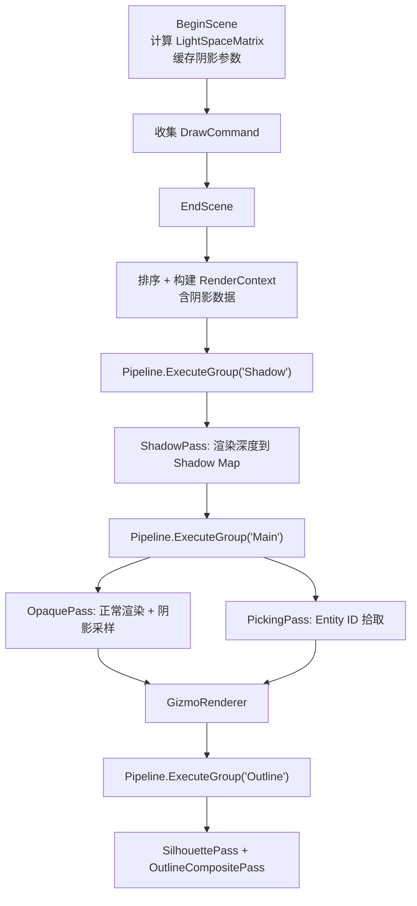

# Phase R4：阴影系统（Shadow Mapping）

> **文档版本**：v3.0  
> **创建日期**：2026-04-07  
> **更新日期**：2026-04-28  
> **优先级**：?? P1  
> **预计工作量**：5-7 天  
> **前置依赖**：Phase R3（多光源支持）? 已完成、Phase R7（多 Pass 渲染框架）? 已完成、Phase R13（Per-Material 渲染状态）? 已完成  
> **实施状态**：? **已完成**（第一至十五章已全部实施，第十六章为远期扩展规划）  
> **文档说明**：本文档详细描述引擎基于 Shadow Map 的阴影系统实现，从方向光阴影开始，支持 Hard/Soft（PCF 3×3）两种阴影模式，并预留级联阴影（CSM）的扩展空间。Shadow Pass 以 `RenderPass` 子类的形式接入现有 `RenderPipeline`，通过 `RenderContext` 传递阴影数据。所有代码可直接对照实现。
>
> **v3.0 更新**：
> - 全文档更新为**已实施状态**，所有代码示例与实际代码保持一致
> - `ShadowPass` 使用 `CullMode::Off`（双面渲染）替代 `CullMode::Front`，解决薄物体和近距离阴影缺失问题
> - `DirectionalLightComponent` 阴影属性已实现（`ShadowType`、`ShadowBias`、`ShadowStrength`），默认 Bias 为 `0.0003f`
> - `Standard.frag` 支持 Hard/Soft 阴影切换，Bias 和 Strength 由组件控制（通过 uniform 传递）
> - `InspectorPanel` 已添加阴影属性 UI（Shadow Type 下拉框 + Bias/Strength 滑块）
> - `Scene.cpp` 收集方向光阴影参数到 `SceneLightData`
> - 阴影参数通过 `SceneLightData` → `Renderer3DData` → `RenderContext` → `OpaquePass` uniform 完整传递链路
>
> **v2.0 重大变更**（历史）：
> - 渲染流程从「手动编排 Shadow Pass」改为「Pipeline 驱动」，Shadow Pass 作为 `RenderPass` 子类注册到 `RenderPipeline`
> - 阴影数据通过 `RenderContext` 传递给各 Pass，而非在 `Renderer3DData` 中硬编码
> - Shadow Pass 复用 `DrawCommand` 列表遍历，而非重新遍历 ECS
> - 所有 GL 状态操作使用 `RenderCommand` 封装，不再直接调用 OpenGL API
> - 更新现状分析，反映 R7/R8/R9/R13 完成后的引擎架构

---

## 目录

- [一、现状分析](#一现状分析)
- [二、改进目标](#二改进目标)
- [三、涉及的文件清单](#三涉及的文件清单)
- [四、Shadow Mapping 原理](#四shadow-mapping-原理)
- [五、方案选择](#五方案选择)
  - [5.1 阴影算法选择](#51-阴影算法选择)
  - [5.2 软阴影方案选择](#52-软阴影方案选择)
  - [5.3 Shadow Map 分辨率选择](#53-shadow-map-分辨率选择)
- [六、Framebuffer 扩展](#六framebuffer-扩展)
  - [6.1 新增 DEPTH_COMPONENT 格式](#61-新增-depth_component-格式)
  - [6.2 Framebuffer.h 修改](#62-framebufferh-修改)
  - [6.3 Framebuffer.cpp 修改（Invalidate 方法）](#63-framebuffercpp-修改invalidate-方法)
- [七、Shadow Pass Shader](#七shadow-pass-shader)
  - [7.1 Shadow.vert](#71-shadowvert)
  - [7.2 Shadow.frag](#72-shadowfrag)
- [八、光源空间矩阵计算](#八光源空间矩阵计算)
  - [8.1 方向光的 Light Space Matrix](#81-方向光的-light-space-matrix)
- [九、ShadowPass 实现（Pipeline 驱动）](#九shadowpass-实现pipeline-驱动)
  - [9.1 ShadowPass 类设计](#91-shadowpass-类设计)
  - [9.2 RenderContext 阴影字段扩展](#92-rendercontext-阴影字段扩展)
  - [9.3 Renderer3D 集成](#93-renderer3d-集成)
  - [9.4 渲染流程（Pipeline 驱动）](#94-渲染流程pipeline-驱动)
- [十、Standard.frag 阴影采样](#十standardfrag-阴影采样)
  - [10.1 阴影 Uniform 声明](#101-阴影-uniform-声明)
  - [10.2 动态 Bias 计算](#102-动态-bias-计算)
  - [10.3 硬阴影计算](#103-硬阴影计算)
  - [10.4 软阴影计算（PCF 3×3）](#104-软阴影计算pcf-33)
  - [10.5 阴影计算入口](#105-阴影计算入口)
  - [10.6 集成到光照计算](#106-集成到光照计算)
- [十一、Shadow Bias 处理](#十一shadow-bias-处理)
- [十二、Standard.vert 修改](#十二standardvert-修改)
- [十三、验证方法](#十三验证方法)
- [十四、已知问题与后续优化](#十四已知问题与后续优化)
- [十五、设计决策记录](#十五设计决策记录)

---

## 一、现状分析

> **注意**：本节已根据 2026-04-28 的实际代码状态更新。

当前引擎**已完成基础阴影系统**（Phase R4）。支持方向光 Shadow Map 阴影，包含 Hard/Soft（PCF 3×3）两种模式，阴影参数（Bias、Strength、ShadowType）由 `DirectionalLightComponent` 控制，通过 Inspector UI 可调。

### 当前已完成的前置功能

| 功能 | 状态 | 说明 |
|------|------|------|
| PBR Shader（Phase R2） | ? 已完成 | `Standard.frag` 完整 PBR（Metallic-Roughness 工作流） |
| 多光源支持（Phase R3） | ? 已完成 | 方向光×4 + 点光源×8 + 聚光灯×4，UBO 传递 |
| **阴影系统（Phase R4）** | ? **已完成** | **方向光 Shadow Map + Hard/Soft 阴影 + 动态 Bias + Inspector UI** |
| 多 Pass 渲染框架（Phase R7） | ? 已完成 | `RenderPipeline` + `RenderPass` 基类 + 分组执行（`ExecuteGroup`） |
| 选中描边（Phase R8） | ? 已完成 | `SilhouettePass` + `OutlineCompositePass`，独立 FBO + 边缘检测 |
| DrawCommand 排序（Phase R9） | ? 已完成 | 延迟提交 + `SortKey` 排序 + Shader 聚合 |
| Gizmo 渲染系统（Phase R10） | ? 已完成 | 独立 `GizmoRenderer` + 网格线 + 灯光可视化 |
| 模型导入（Phase R11） | ? 已完成 | Assimp 集成 + 多 SubMesh + 多材质 |
| Per-Material 渲染状态（Phase R13） | ? 已完成 | `RenderState`（CullMode / DepthWrite / BlendMode / RenderQueue）+ `RenderCommand` 封装 |
| 场景序列化 | ? 已完成 | YAML 格式 `.luck3d` 文件 |
| 材质系统 | ? 已完成 | Shader 内省 + `unordered_map` 属性存储 + Inspector UI |
| 5 种内置图元 | ? 已完成 | Cube / Plane / Sphere / Cylinder / Capsule |

### 当前渲染架构

引擎已建立 **RenderPipeline + RenderPass** 架构（R7 完成），当前注册了 5 个 Pass：

| Pass | 分组 | 说明 |
|------|------|------|
| `ShadowPass` | Shadow | **R4 新增**：从光源视角渲染场景深度到 Shadow Map（纯深度 FBO，`CullMode::Off` 双面渲染） |
| `OpaquePass` | Main | 不透明物体渲染（按 SortKey 排序 + Shader 聚合 + Per-Material RenderState + 阴影采样） |
| `PickingPass` | Main | Entity ID 拾取（写入 R32I 整数纹理） |
| `SilhouettePass` | Outline | 轮廓掩码渲染（选中物体渲染为纯白色到独立 FBO） |
| `OutlineCompositePass` | Outline | 描边合成（边缘检测 + 全屏 Quad 合成到主 FBO） |

### 当前渲染流程

```
Scene::OnUpdate
  → 收集光源数据（DirectionalLight / PointLight / SpotLight）
  → 收集第一个方向光的阴影参数（ShadowType / ShadowBias / ShadowStrength）到 SceneLightData
  → Renderer3D::BeginScene(camera, sceneLightData)
      → 设置 Camera UBO (binding=0) + Light UBO (binding=1)
      → 计算 LightSpaceMatrix（正交投影 × 光源视图）
      → 缓存阴影参数（ShadowBias / ShadowStrength / ShadowType）
      → 清空 OpaqueDrawCommands 列表
  → Renderer3D::DrawMesh() × N
      → 收集 DrawCommand（Transform + Mesh + Material + SortKey + EntityID）
  → Renderer3D::EndScene()
      → 按 SortKey 排序 OpaqueDrawCommands
      → 构建 RenderContext（OpaqueDrawCommands + 阴影数据 + TargetFramebuffer + Stats）
      → Pipeline.ExecuteGroup("Shadow", context)  // ShadowPass：渲染深度到 Shadow Map
      → Pipeline.ExecuteGroup("Main", context)    // OpaquePass（绑定 Shadow Map + 阴影采样）+ PickingPass
      → 提取描边物体到 OutlineDrawCommands
      → 清空 OpaqueDrawCommands
  → GizmoRenderer（网格线 + 灯光可视化）
  → Renderer3D::RenderOutline()
      → 构建 Outline RenderContext
      → Pipeline.ExecuteGroup("Outline", context)  // SilhouettePass + OutlineCompositePass
```

### 当前 RenderContext 结构

```cpp
struct RenderContext
{
    const std::vector<DrawCommand>* OpaqueDrawCommands = nullptr;
    const std::vector<OutlineDrawCommand>* OutlineDrawCommands = nullptr;
    const std::unordered_set<int>* OutlineEntityIDs = nullptr;
    glm::vec4 OutlineColor;
    float OutlineWidth;
    bool OutlineEnabled;
    
    // ---- 阴影数据（R4 已实现） ----
    bool ShadowEnabled = false;                                     // 是否启用阴影
    glm::mat4 LightSpaceMatrix = glm::mat4(1.0f);                  // 光源空间矩阵
    uint32_t ShadowMapTextureID = 0;                                // Shadow Map 纹理 ID（供 OpaquePass 绑定）
    float ShadowBias = 0.005f;                                      // 阴影偏移
    float ShadowStrength = 1.0f;                                    // 阴影强度 [0, 1]
    ShadowType ShadowShadowType = ShadowType::None;                // 阴影类型（Hard/Soft）
    
    Ref<Framebuffer> TargetFramebuffer;
    Renderer3D::Statistics* Stats = nullptr;
};
```

### 当前 Framebuffer 能力

```cpp
enum class FramebufferTextureFormat
{
    None = 0,
    RGBA8,              // 颜色
    RED_INTEGER,        // 用于 Entity ID 拾取
    DEFPTH24STENCIL8,   // 深度模板（注意：此为历史拼写错误，保持兼容）
    Depth = DEFPTH24STENCIL8
};
```

当前 Framebuffer 支持颜色附件和深度模板附件，但**不支持纯深度纹理**（Shadow Map 需要）。

> **注意**：`DEFPTH24STENCIL8` 是一个已知的拼写错误（应为 `DEPTH24STENCIL8`），为保持向后兼容暂不修改。新增的 `DEPTH_COMPONENT` 使用正确拼写。

### 当前 Shader 架构

- `Standard.vert`：输出世界空间位置、法线、TBN 矩阵
- `Standard.frag`：完整 PBR 光照计算，支持多光源循环，手动 Gamma 校正，**支持阴影采样**
- `Shadow/Shadow.vert` + `Shadow/Shadow.frag`：Shadow Pass 专用 Shader（仅写深度）
- 光照数据通过 `layout(std140, binding = 1) uniform Lights` UBO 传递
- 阴影相关 uniform（`u_ShadowMap`、`u_LightSpaceMatrix`、`u_ShadowBias`、`u_ShadowStrength`、`u_ShadowEnabled`、`u_ShadowType`）已实现，由 `OpaquePass` 在每帧设置

### 当前 RenderCommand 渲染状态封装

R13 已完成渲染状态的 `RenderCommand` 封装，Shadow Pass 中的所有 GL 状态操作应使用这些封装方法：

| 方法 | 说明 |
|------|------|
| `RenderCommand::SetCullMode(CullMode)` | 设置面剔除模式（Back / Front / Off） |
| `RenderCommand::SetDepthTest(bool)` | 开关深度测试 |
| `RenderCommand::SetDepthWrite(bool)` | 开关深度写入 |
| `RenderCommand::SetDepthFunc(DepthCompareFunc)` | 设置深度比较函数 |
| `RenderCommand::SetBlendMode(BlendMode)` | 设置混合模式 |
| `RenderCommand::SetViewport(x, y, w, h)` | 设置视口大小 |
| `RenderCommand::SetDrawBuffers(attachments, count)` | 设置 DrawBuffer 目标 |
| `RenderCommand::BindTextureUnit(slot, textureID)` | 绑定纹理到指定纹理单元 |

### 当前顶点布局

```cpp
struct Vertex
{
    glm::vec3 Position; // 位置         layout(location = 0)
    glm::vec4 Color;    // 颜色         layout(location = 1)
    glm::vec3 Normal;   // 法线         layout(location = 2)
    glm::vec2 TexCoord; // 纹理坐标     layout(location = 3)
    glm::vec4 Tangent;  // 切线+手性    layout(location = 4)
};
```

> Shadow Pass Shader 的顶点输入 layout 必须与此结构体一致。

---

## 二、改进目标

1. ? **方向光阴影**：主方向光投射阴影（支持 Hard/Soft 切换）
2. ? **Shadow Map FBO**：创建纯深度纹理的 Framebuffer（`DEPTH_COMPONENT` 格式）
3. ? **Shadow Pass**：从光源视角渲染场景深度（Pipeline 驱动，`CullMode::Off` 双面渲染）
4. ? **PCF 软阴影**：柔和的阴影边缘（3×3 采样核）
5. ? **Shadow Bias**：动态 Bias（组件控制）消除阴影痤疮（Shadow Acne）
6. ? **组件控制**：`DirectionalLightComponent` 阴影属性 + Inspector UI
7. ? **数据传递**：Component → SceneLightData → RenderContext → OpaquePass uniform

---

## 三、涉及的文件清单

| 文件路径 | 操作 | 说明 |
|---------|------|------|
| `Lucky/Source/Lucky/Renderer/Passes/ShadowPass.h` | **新建** ? | Shadow Pass 类（继承 `RenderPass`） |
| `Lucky/Source/Lucky/Renderer/Passes/ShadowPass.cpp` | **新建** ? | Shadow Pass 实现（创建 Shadow FBO、执行深度渲染） |
| `Lucky/Source/Lucky/Renderer/RenderContext.h` | 修改 ? | `RenderContext` 新增阴影字段（`LightSpaceMatrix`、`ShadowEnabled`、`ShadowShadowType` 等） |
| `Lucky/Source/Lucky/Renderer/Framebuffer.h` | 修改 ? | 添加 `DEPTH_COMPONENT` 格式 + `GetDepthAttachmentRendererID()` |
| `Lucky/Source/Lucky/Renderer/Framebuffer.cpp` | 修改 ? | 支持纯深度 FBO 创建（`IsDepthFormat` + `Invalidate` 扩展） |
| `Luck3DApp/Assets/Shaders/Shadow/Shadow.vert` | **新建** ? | Shadow Pass 顶点着色器 |
| `Luck3DApp/Assets/Shaders/Shadow/Shadow.frag` | **新建** ? | Shadow Pass 片段着色器 |
| `Lucky/Source/Lucky/Renderer/Renderer3D.h` | 修改 ? | `SceneLightData` 新增阴影字段（`DirLightShadowType`、`DirLightShadowBias`、`DirLightShadowStrength`） |
| `Lucky/Source/Lucky/Renderer/Renderer3D.cpp` | 修改 ? | 创建并注册 `ShadowPass` 到 Pipeline，`BeginScene()` 计算 LightSpaceMatrix，`EndScene()` 构建阴影 RenderContext |
| `Lucky/Source/Lucky/Renderer/Passes/OpaquePass.cpp` | 修改 ? | 绑定 Shadow Map 纹理到纹理单元 15，设置阴影 uniform |
| `Luck3DApp/Assets/Shaders/Standard.frag` | 修改 ? | 新增阴影 uniform + Hard/Soft 阴影采样 + 动态 Bias + 集成到方向光计算 |
| `Lucky/Source/Lucky/Scene/Components/DirectionalLightComponent.h` | 修改 ? | 新增 `ShadowType` 枚举 + 阴影属性（`Shadows`、`ShadowBias`、`ShadowStrength`） |
| `Lucky/Source/Lucky/Scene/Scene.cpp` | 修改 ? | 收集第一个方向光的阴影参数到 `SceneLightData` |
| `Luck3DApp/Source/Panels/InspectorPanel.cpp` | 修改 ? | 方向光组件 Inspector UI 添加阴影属性（Shadow Type 下拉框 + Bias/Strength 滑块） |

> **注意**：Shadow Shader 放在 `Assets/Shaders/Shadow/` 子目录下，与 Outline Shader（`Assets/Shaders/Outline/`）保持一致的目录组织风格。

---

## 四、Shadow Mapping 原理

```
Shadow Mapping 分两个 Pass：

Pass 1（Shadow Pass）：
  - 从光源视角渲染整个场景
  - 只输出深度值到 Shadow Map 纹理
  - 使用光源的 View-Projection 矩阵（Light Space Matrix）

Pass 2（Main Pass）：
  - 正常渲染场景
  - 对于每个片段，将其变换到光源空间
  - 比较片段深度与 Shadow Map 中存储的深度
  - 如果片段深度 > Shadow Map 深度，则该片段在阴影中
```



---

## 五、方案选择

### 5.1 阴影算法选择

| 方案 | 说明 | 优点 | 缺点 | 推荐 |
|------|------|------|------|------|
| **方案 A：基础 Shadow Map（推荐）** | 单张深度纹理 | 实现最简单 | 大场景精度不足 | ? |
| 方案 B：CSM（Cascaded Shadow Maps） | 多级级联阴影 | 大场景精度好 | 实现复杂，需要多张 Shadow Map | 后续优化 |
| 方案 C：VSM（Variance Shadow Maps） | 方差阴影 | 天然软阴影 | 漏光问题 | |

**推荐方案 A**：基础 Shadow Map。先实现最简单的版本，后续可升级为 CSM。

### 5.2 软阴影方案选择

| 方案 | 说明 | 优点 | 缺点 | 推荐 |
|------|------|------|------|------|
| **方案 A：PCF（推荐）** | Percentage Closer Filtering | 实现简单，效果好 | 采样数多时性能下降 | ? |
| 方案 B：PCSS | Percentage Closer Soft Shadows | 近处硬阴影，远处软阴影 | 实现复杂 | 后续优化 |
| 方案 C：硬阴影 | 直接比较深度 | 最简单 | 锯齿严重 | |

**推荐方案 A**：PCF，3×3 或 5×5 采样核。

### 5.3 Shadow Map 分辨率选择

| 分辨率 | 内存占用 | 质量 | 推荐 |
|--------|---------|------|------|
| 1024×1024 | 4 MB | 低 | 调试用 |
| **2048×2048** | 16 MB | 中 | ? **默认** |
| 4096×4096 | 64 MB | 高 | 高质量 |

**推荐 2048×2048**：质量和性能的平衡点。

---

## 六、Framebuffer 扩展

### 6.1 新增 DEPTH_COMPONENT 格式

当前 `FramebufferTextureFormat` 中的 `DEFPTH24STENCIL8` 是深度+模板附件，使用 `glTexStorage2D(GL_DEPTH24_STENCIL8)` 创建，附加到 `GL_DEPTH_STENCIL_ATTACHMENT`。这种格式**不能作为纹理采样**（因为它是 renderbuffer 风格的存储）。

Shadow Map 需要一个**纯深度纹理**，可以在 Fragment Shader 中通过 `texture(u_ShadowMap, uv).r` 采样。

**与现有深度附件的共存说明**：
- `DEFPTH24STENCIL8`：用于主 FBO 的深度+模板测试，附加到 `GL_DEPTH_STENCIL_ATTACHMENT`
- `DEPTH_COMPONENT`（新增）：用于 Shadow Map FBO 的纯深度纹理，附加到 `GL_DEPTH_ATTACHMENT`，可采样
- 两者不会在同一个 FBO 中共存：Shadow Map FBO 只有 `DEPTH_COMPONENT`，主 FBO 只有 `DEFPTH24STENCIL8`

### 6.2 Framebuffer.h 修改

```cpp
enum class FramebufferTextureFormat
{
    None = 0,

    RGBA8,
    RED_INTEGER,

    DEFPTH24STENCIL8,
    DEPTH_COMPONENT,        // ← 新增：纯深度纹理（可采样）

    Depth = DEFPTH24STENCIL8
};
```

### 6.3 Framebuffer.cpp 修改（Invalidate 方法）

在 `Invalidate()` 方法中添加 `DEPTH_COMPONENT` 的处理：

```cpp
// 在深度附件创建逻辑中添加：
case FramebufferTextureFormat::DEPTH_COMPONENT:
{
    // 创建纯深度纹理（可采样）
    glCreateTextures(GL_TEXTURE_2D, 1, &m_DepthAttachment);
    glBindTexture(GL_TEXTURE_2D, m_DepthAttachment);
    glTexImage2D(GL_TEXTURE_2D, 0, GL_DEPTH_COMPONENT24, 
                 m_Specification.Width, m_Specification.Height, 
                 0, GL_DEPTH_COMPONENT, GL_FLOAT, nullptr);
    
    // 纹理参数
    glTexParameteri(GL_TEXTURE_2D, GL_TEXTURE_MIN_FILTER, GL_NEAREST);
    glTexParameteri(GL_TEXTURE_2D, GL_TEXTURE_MAG_FILTER, GL_NEAREST);
    glTexParameteri(GL_TEXTURE_2D, GL_TEXTURE_WRAP_S, GL_CLAMP_TO_BORDER);
    glTexParameteri(GL_TEXTURE_2D, GL_TEXTURE_WRAP_T, GL_CLAMP_TO_BORDER);
    
    // 边界颜色设为白色（1.0），超出 Shadow Map 范围的区域不在阴影中
    float borderColor[] = { 1.0f, 1.0f, 1.0f, 1.0f };
    glTexParameterfv(GL_TEXTURE_2D, GL_TEXTURE_BORDER_COLOR, borderColor);
    
    // 附加到 FBO
    glFramebufferTexture2D(GL_FRAMEBUFFER, GL_DEPTH_ATTACHMENT, GL_TEXTURE_2D, m_DepthAttachment, 0);
    
    // 不需要颜色附件
    glDrawBuffer(GL_NONE);
    glReadBuffer(GL_NONE);
    
    break;
}
```

同时需要在 `Framebuffer` 类中添加获取深度纹理 ID 的方法（当前 `Framebuffer.h` 中已有 `m_DepthAttachment` 成员，但没有公开的 getter）：

```cpp
/// <summary>
/// 返回深度缓冲区纹理 ID（用于 Shadow Map 采样）
/// 仅当深度附件格式为 DEPTH_COMPONENT 时有意义
/// </summary>
uint32_t GetDepthAttachmentRendererID() const { return m_DepthAttachment; }
```

同时需要在 `Utils::IsDepthFormat()` 中添加新格式的识别：

```cpp
static bool IsDepthFormat(FramebufferTextureFormat format)
{
    switch (format)
    {
        case FramebufferTextureFormat::DEFPTH24STENCIL8: return true;
        case FramebufferTextureFormat::DEPTH_COMPONENT:  return true;  // ← 新增
    }
    return false;
}
```

---

## 七、Shadow Pass Shader

### 7.1 Shadow.vert

> **实际文件**：`Luck3DApp/Assets/Shaders/Shadow/Shadow.vert` ? 已实现

```glsl
// Shadow Pass 顶点着色器
// 从光源视角渲染场景深度到 Shadow Map
#version 450 core

// 顶点布局必须与 Vertex 结构体一致（即使不使用某些属性，也必须声明以保持 layout 偏移正确）
layout(location = 0) in vec3 a_Position;
layout(location = 1) in vec4 a_Color;       // 不使用
layout(location = 2) in vec3 a_Normal;      // 不使用
layout(location = 3) in vec2 a_TexCoord;    // 不使用
layout(location = 4) in vec4 a_Tangent;     // 不使用

uniform mat4 u_LightSpaceMatrix;    // 光源空间 VP 矩阵
uniform mat4 u_ObjectToWorldMatrix; // 模型矩阵（与 OpaquePass 中的 uniform 名称一致）

void main()
{
    gl_Position = u_LightSpaceMatrix * u_ObjectToWorldMatrix * vec4(a_Position, 1.0);
}
```

> **注意**：`u_ObjectToWorldMatrix` 名称与 `OpaquePass` 中使用的一致，这样 `ShadowPass` 可以复用 `DrawCommand` 列表中的 `Transform` 数据。

### 7.2 Shadow.frag

> **实际文件**：`Luck3DApp/Assets/Shaders/Shadow/Shadow.frag` ? 已实现

```glsl
// Shadow Pass 片段着色器
// Shadow Map 只需要深度值，片段着色器为空（硬件自动写入深度）
#version 450 core

void main()
{
    // 深度值由硬件自动写入，无需手动输出
}
```

---

## 八、光源空间矩阵计算

### 8.1 方向光的 Light Space Matrix

方向光使用正交投影（Orthographic Projection）：

> **实际实现**：在 `Renderer3D::BeginScene()` 中计算 ?

```cpp
// 实际代码（Renderer3D.cpp - BeginScene）
// 正交投影范围（固定范围，后续可升级为 CSM 动态计算）
const float orthoSize = 20.0f;
const float nearPlane = -30.0f;   // 负值允许捕获光源"背后"的物体
const float farPlane = 30.0f;

glm::mat4 lightProjection = glm::ortho(-orthoSize, orthoSize, -orthoSize, orthoSize, nearPlane, farPlane);

// 光源视图矩阵：从光源方向看向原点
glm::vec3 lightDir = glm::normalize(lightData.DirectionalLights[0].Direction);
glm::vec3 lightPos = -lightDir * 15.0f;  // 光源位置（沿光照反方向偏移）
glm::mat4 lightView = glm::lookAt(lightPos, glm::vec3(0.0f), glm::vec3(0.0f, 1.0f, 0.0f));

s_Data.LightSpaceMatrix = lightProjection * lightView;
```

> **注意**：`nearPlane` 使用负值（`-30.0f`）是为了确保光源"背后"的物体也能被正确渲染到 Shadow Map 中。`orthoSize` 应该根据实际场景大小调整。简单实现使用固定值，后续可以根据相机视锥体动态计算（CSM 的基础）。

---

## 九、ShadowPass 实现（Pipeline 驱动）

> **v2.0 重大变更**：本节从 v1.1 的「手动编排 Shadow Pass」改为「Pipeline 驱动」。Shadow Pass 作为 `RenderPass` 子类注册到 `RenderPipeline`，通过 `RenderContext` 接收阴影数据，与现有的 OpaquePass、PickingPass 等保持一致的架构风格。

### 9.1 ShadowPass 类设计

> **实际文件**：`Lucky/Source/Lucky/Renderer/Passes/ShadowPass.h` + `ShadowPass.cpp` ? 已实现

```cpp
// Lucky/Source/Lucky/Renderer/Passes/ShadowPass.h
#pragma once

#include "Lucky/Renderer/RenderPass.h"
#include "Lucky/Renderer/Shader.h"
#include "Lucky/Renderer/Framebuffer.h"

namespace Lucky
{
    /// <summary>
    /// 阴影 Pass：从光源视角渲染场景深度到 Shadow Map
    /// 属于 "Shadow" 分组，在 OpaquePass 之前执行
    /// </summary>
    class ShadowPass : public RenderPass
    {
    public:
        void Init() override;
        void Execute(const RenderContext& context) override;
        void Resize(uint32_t width, uint32_t height) override;
        const std::string& GetName() const override { static std::string name = "ShadowPass"; return name; }
        const std::string& GetGroup() const override { static std::string group = "Shadow"; return group; }

        /// <summary>
        /// 获取 Shadow Map 深度纹理 ID（供 OpaquePass 中的 Standard Shader 采样）
        /// </summary>
        uint32_t GetShadowMapTextureID() const;

    private:
        Ref<Framebuffer> m_ShadowMapFBO;        // Shadow Map FBO（纯深度纹理）
        Ref<Shader> m_ShadowShader;             // Shadow Pass Shader
        uint32_t m_ShadowMapResolution = 2048;  // Shadow Map 分辨率
    };
}
```

```cpp
// Lucky/Source/Lucky/Renderer/Passes/ShadowPass.cpp
#include "lcpch.h"
#include "ShadowPass.h"
#include "Lucky/Renderer/RenderContext.h"
#include "Lucky/Renderer/RenderCommand.h"
#include "Lucky/Renderer/Renderer3D.h"

namespace Lucky
{
    void ShadowPass::Init()
    {
        // Shader 在 Renderer3D::Init() 中统一加载，此处直接获取
        m_ShadowShader = Renderer3D::GetShaderLibrary()->Get("Shadow");

        // 创建 Shadow Map FBO（纯深度纹理，无颜色附件）
        FramebufferSpecification spec;
        spec.Width = m_ShadowMapResolution;
        spec.Height = m_ShadowMapResolution;
        spec.Attachments = { FramebufferTextureFormat::DEPTH_COMPONENT };
        m_ShadowMapFBO = Framebuffer::Create(spec);
    }

    void ShadowPass::Execute(const RenderContext& context)
    {
        // 条件执行：仅当阴影启用且有不透明物体时执行
        if (!context.ShadowEnabled || !context.OpaqueDrawCommands || context.OpaqueDrawCommands->empty())
        {
            return;
        }

        // ---- 绑定 Shadow Map FBO ----
        m_ShadowMapFBO->Bind();
        RenderCommand::SetViewport(0, 0, m_ShadowMapResolution, m_ShadowMapResolution);
        RenderCommand::Clear();

        // ---- 设置渲染状态：关闭面剔除（双面渲染，避免薄物体/近距离阴影缺失） ----
        RenderCommand::SetCullMode(CullMode::Off);

        // ---- 绑定 Shader 并设置 Light Space Matrix ----
        m_ShadowShader->Bind();
        m_ShadowShader->SetMat4("u_LightSpaceMatrix", context.LightSpaceMatrix);

        // ---- 遍历 DrawCommand 列表（复用 OpaquePass 的数据） ----
        for (const DrawCommand& cmd : *context.OpaqueDrawCommands)
        {
            m_ShadowShader->SetMat4("u_ObjectToWorldMatrix", cmd.Transform);

            RenderCommand::DrawIndexedRange(
                cmd.MeshData->GetVertexArray(),
                cmd.SubMeshPtr->IndexOffset,
                cmd.SubMeshPtr->IndexCount
            );
        }

        // ---- 恢复渲染状态 ----
        RenderCommand::SetCullMode(CullMode::Back);
        m_ShadowMapFBO->Unbind();

        // ---- 恢复主 FBO 视口 ----
        if (context.TargetFramebuffer)
        {
            context.TargetFramebuffer->Bind();
            const auto& spec = context.TargetFramebuffer->GetSpecification();
            RenderCommand::SetViewport(0, 0, spec.Width, spec.Height);
        }
    }

    void ShadowPass::Resize(uint32_t width, uint32_t height)
    {
        // Shadow Map 分辨率固定，不随视口变化
        // 后续可根据光源的 ShadowResolution 属性动态调整
    }

    uint32_t ShadowPass::GetShadowMapTextureID() const
    {
        return m_ShadowMapFBO->GetDepthAttachmentRendererID();
    }
}
```

> **设计说明**：
> - `ShadowPass` 复用 `context.OpaqueDrawCommands` 列表，而非重新遍历 ECS。这与 `PickingPass` 的做法一致
> - 所有 GL 状态操作使用 `RenderCommand` 封装，不直接调用 OpenGL API
> - Shadow Map FBO 和 Shader 由 `ShadowPass` 自己持有，资源归属清晰
> - 分组为 `"Shadow"`，在 `"Main"` 分组之前执行
> - **使用 `CullMode::Off`（双面渲染）** 而非 `CullMode::Front`，解决了薄物体和近距离物体阴影缺失的问题
> - Shader 在 `Renderer3D::Init()` 中统一加载（`s_Data.ShaderLib->Load("Assets/Shaders/Shadow/Shadow")`），`ShadowPass::Init()` 中通过 `Get("Shadow")` 获取

### 9.2 RenderContext 阴影字段扩展

> **实际文件**：`Lucky/Source/Lucky/Renderer/RenderContext.h` ? 已实现

在 `RenderContext` 中新增阴影相关字段：

```cpp
struct RenderContext
{
    // ---- DrawCommand 列表（已排序） ----
    const std::vector<DrawCommand>* OpaqueDrawCommands = nullptr;       // 不透明物体绘制命令（已按 SortKey 排序）
    
    // ---- Outline 数据 ----
    const std::vector<OutlineDrawCommand>* OutlineDrawCommands = nullptr;   // 描边绘制命令
    const std::unordered_set<int>* OutlineEntityIDs = nullptr;              // 需要描边的 EntityID 集合
    glm::vec4 OutlineColor = glm::vec4(1.0f, 0.4f, 0.0f, 1.0f);           // 描边颜色
    float OutlineWidth = 2.0f;                                              // 描边宽度（像素）
    bool OutlineEnabled = true;                                             // 是否启用描边
    
    // ---- FBO 引用 ----
    Ref<Framebuffer> TargetFramebuffer;     // 主 FBO
    
    // ---- 阴影数据（R4 已实现） ----
    bool ShadowEnabled = false;                                     // 是否启用阴影
    glm::mat4 LightSpaceMatrix = glm::mat4(1.0f);                  // 光源空间矩阵（正交投影 × 光源视图）
    uint32_t ShadowMapTextureID = 0;                                // Shadow Map 纹理 ID（供 OpaquePass 绑定）
    float ShadowBias = 0.005f;                                      // 阴影偏移（减少 Shadow Acne）
    float ShadowStrength = 1.0f;                                    // 阴影强度 [0, 1]
    ShadowType ShadowShadowType = ShadowType::None;                // 阴影类型（Hard/Soft）
    
    // ---- 统计数据（可写） ----
    Renderer3D::Statistics* Stats = nullptr;    // 渲染统计（DrawCalls、TriangleCount）
};
```

### 9.3 Renderer3D 集成

> **实际文件**：`Lucky/Source/Lucky/Renderer/Renderer3D.h` + `Renderer3D.cpp` ? 已实现

#### 9.3.0 SceneLightData 阴影字段

`SceneLightData` 新增阴影参数字段（CPU 端传递，不影响 UBO 布局）：

```cpp
struct SceneLightData
{
    int DirectionalLightCount = 0;
    DirectionalLightData DirectionalLights[s_MaxDirectionalLights];
    
    int PointLightCount = 0;
    PointLightData PointLights[s_MaxPointLights];
    
    int SpotLightCount = 0;
    SpotLightData SpotLights[s_MaxSpotLights];
    
    // ---- 阴影参数（CPU 端传递，不影响 UBO 布局） ----
    // 仅使用第一个方向光的阴影参数
    ShadowType DirLightShadowType = ShadowType::None;  // 方向光阴影类型
    float DirLightShadowBias = 0.005f;                  // 方向光阴影偏移
    float DirLightShadowStrength = 1.0f;                // 方向光阴影强度 [0, 1]
};
```

`Renderer3DData` 新增阴影缓存字段：

```cpp
// ======== 阴影数据 ========
bool ShadowEnabled = false;                     // 是否启用阴影
glm::mat4 LightSpaceMatrix = glm::mat4(1.0f);  // 光源空间矩阵（正交投影 × 光源视图）
float ShadowBias = 0.005f;                      // 阴影偏移（从组件读取）
float ShadowStrength = 1.0f;                    // 阴影强度（从组件读取）
ShadowType ShadowShadowType = ShadowType::None; // 阴影类型（从组件读取）
```

#### 9.3.1 Init 修改

在 `Renderer3D::Init()` 中加载 Shadow Shader 并创建注册 `ShadowPass`：

```cpp
void Renderer3D::Init()
{
    // ... 现有初始化 ...
    
    // 加载着色器（Shadow Shader 在此统一加载）
    s_Data.ShaderLib->Load("Assets/Shaders/InternalError");
    s_Data.ShaderLib->Load("Assets/Shaders/EntityID");
    s_Data.ShaderLib->Load("Assets/Shaders/Outline/Silhouette");
    s_Data.ShaderLib->Load("Assets/Shaders/Outline/OutlineComposite");
    s_Data.ShaderLib->Load("Assets/Shaders/Shadow/Shadow");             // R4 新增
    s_Data.ShaderLib->Load("Assets/Shaders/Standard");
    
    // ... 材质和纹理初始化 ...
    
    // ======== 创建渲染管线 ========
    auto shadowPass = CreateRef<ShadowPass>();              // R4 新增
    auto opaquePass = CreateRef<OpaquePass>();
    auto pickingPass = CreateRef<PickingPass>();
    auto silhouettePass = CreateRef<SilhouettePass>();
    auto outlineCompositePass = CreateRef<OutlineCompositePass>();
    
    // 设置 Pass 之间的依赖
    outlineCompositePass->SetSilhouettePass(silhouettePass);
    
    // 按顺序添加 Pass（执行顺序：Shadow → Main → Outline）
    s_Data.Pipeline.AddPass(shadowPass);
    s_Data.Pipeline.AddPass(opaquePass);
    s_Data.Pipeline.AddPass(pickingPass);
    s_Data.Pipeline.AddPass(silhouettePass);
    s_Data.Pipeline.AddPass(outlineCompositePass);
    
    s_Data.Pipeline.Init();
}
```

#### 9.3.2 BeginScene 修改

在 `BeginScene()` 中计算 Light Space Matrix 并缓存阴影参数：

```cpp
void Renderer3D::BeginScene(const EditorCamera& camera, const SceneLightData& lightData)
{
    // Camera UBO（不变）
    // Light UBO（不变）
    
    // ======== 计算阴影 Light Space Matrix ========
    s_Data.ShadowEnabled = false;
    if (lightData.DirectionalLightCount > 0 && lightData.DirLightShadowType != ShadowType::None)
    {
        // 使用第一个方向光计算 Light Space Matrix
        const float orthoSize = 20.0f;
        const float nearPlane = -30.0f;
        const float farPlane = 30.0f;
        
        glm::mat4 lightProjection = glm::ortho(-orthoSize, orthoSize, -orthoSize, orthoSize, nearPlane, farPlane);
        
        glm::vec3 lightDir = glm::normalize(lightData.DirectionalLights[0].Direction);
        glm::vec3 lightPos = -lightDir * 15.0f;
        glm::mat4 lightView = glm::lookAt(lightPos, glm::vec3(0.0f), glm::vec3(0.0f, 1.0f, 0.0f));
        
        s_Data.LightSpaceMatrix = lightProjection * lightView;
        s_Data.ShadowEnabled = true;
        s_Data.ShadowBias = lightData.DirLightShadowBias;
        s_Data.ShadowStrength = lightData.DirLightShadowStrength;
        s_Data.ShadowShadowType = lightData.DirLightShadowType;
    }
    
    // 清空绘制命令列表
    s_Data.OpaqueDrawCommands.clear();
    s_Data.CameraPosition = camera.GetPosition();
}
```

#### 9.3.3 EndScene 修改

在 `EndScene()` 中构建包含阴影数据的 `RenderContext`，并先执行 Shadow 分组，再执行 Main 分组：

```cpp
void Renderer3D::EndScene()
{
    // ---- 排序不透明物体 ----
    std::sort(s_Data.OpaqueDrawCommands.begin(), s_Data.OpaqueDrawCommands.end(), [](const DrawCommand& a, const DrawCommand& b)
    {
        return a.SortKey < b.SortKey;
    });
    
    // ---- 构建 RenderContext（包含阴影数据） ----
    RenderContext context;
    context.OpaqueDrawCommands = &s_Data.OpaqueDrawCommands;
    context.TargetFramebuffer = s_Data.TargetFramebuffer;
    context.Stats = &s_Data.Stats;
    
    // 阴影数据
    context.ShadowEnabled = s_Data.ShadowEnabled;
    context.LightSpaceMatrix = s_Data.LightSpaceMatrix;
    context.ShadowBias = s_Data.ShadowBias;
    context.ShadowStrength = s_Data.ShadowStrength;
    context.ShadowShadowType = s_Data.ShadowShadowType;
    
    // 获取 Shadow Map 纹理 ID（ShadowPass 持有 FBO）
    auto shadowPass = s_Data.Pipeline.GetPass<ShadowPass>();
    if (shadowPass)
    {
        context.ShadowMapTextureID = shadowPass->GetShadowMapTextureID();
    }
    
    // ---- 执行 Shadow 分组（ShadowPass） ----
    s_Data.Pipeline.ExecuteGroup("Shadow", context);
    
    // ---- 执行 Main 分组（OpaquePass + PickingPass） ----
    s_Data.Pipeline.ExecuteGroup("Main", context);

    // ======== 提取描边物体到独立列表 ========
    // ... （与现有代码一致，不变） ...
    
    s_Data.OpaqueDrawCommands.clear();
}
```

> **关键设计点**：
> - `ShadowPass` 和 `OpaquePass` 共享同一个 `RenderContext`，包含同一份 `OpaqueDrawCommands`
> - `ShadowPass` 在 `"Shadow"` 分组中执行，`OpaquePass` 在 `"Main"` 分组中执行
> - `EndScene()` 先执行 Shadow 分组，再执行 Main 分组，保证 Shadow Map 在 OpaquePass 之前已生成
> - `Scene.cpp` 仅负责收集阴影参数到 `SceneLightData`，不参与 Shadow Pass 的执行
> - 阴影参数传递链路：`DirectionalLightComponent` → `SceneLightData` → `Renderer3DData` → `RenderContext` → `OpaquePass` uniform

### 9.4 渲染流程（Pipeline 驱动）

```
R4 完成后的渲染流程：

Scene::OnUpdate
  → 收集光源数据（不变）
  → Renderer3D::BeginScene(camera, sceneLightData)
      → 设置 Camera UBO + Light UBO（不变）
      → 计算 LightSpaceMatrix（R4 新增）
      → 清空 OpaqueDrawCommands
  → Renderer3D::DrawMesh() × N（不变）
      → 收集 DrawCommand
  → Renderer3D::EndScene()
      → 排序 OpaqueDrawCommands
      → 构建 RenderContext（包含阴影数据）
      → Pipeline.ExecuteGroup("Shadow", context)   // ← R4 新增
          → ShadowPass::Execute()
              → 绑定 Shadow FBO
              → 设置 CullMode::Off（双面渲染）
              → 遍历 DrawCommands，只写深度
              → 恢复 CullMode::Back
              → 重新绑定主 FBO
      → Pipeline.ExecuteGroup("Main", context)
          → OpaquePass::Execute()（绑定 Shadow Map 纹理 + 正常渲染 + 阴影采样）
          → PickingPass::Execute()
      → 提取描边物体
      → 清空 OpaqueDrawCommands
  → GizmoRenderer（不变）
  → Renderer3D::RenderOutline()（不变）
```


#### 9.4.1 OpaquePass 中绑定 Shadow Map

> **实际文件**：`Lucky/Source/Lucky/Renderer/Passes/OpaquePass.cpp` ? 已实现

`OpaquePass::Execute()` 在绘制前将 Shadow Map 纹理绑定到纹理单元 15，并设置阴影 uniform：

```cpp
void OpaquePass::Execute(const RenderContext& context)
{
    // ... 现有代码 ...
    
    // R4 已实现：绑定 Shadow Map 纹理到纹理单元 15（避免与材质纹理冲突）
    if (context.ShadowEnabled && context.ShadowMapTextureID != 0)
    {
        RenderCommand::BindTextureUnit(15, context.ShadowMapTextureID);
    }
    
    for (const DrawCommand& cmd : *context.OpaqueDrawCommands)
    {
        // ... 现有的 Shader 绑定、材质应用逻辑 ...
        
        // R4 已实现：设置阴影相关 uniform
        if (context.ShadowEnabled)
        {
            cmd.MaterialData->GetShader()->SetInt("u_ShadowMap", 15);
            cmd.MaterialData->GetShader()->SetMat4("u_LightSpaceMatrix", context.LightSpaceMatrix);
            cmd.MaterialData->GetShader()->SetFloat("u_ShadowBias", context.ShadowBias);
            cmd.MaterialData->GetShader()->SetFloat("u_ShadowStrength", context.ShadowStrength);
            cmd.MaterialData->GetShader()->SetInt("u_ShadowEnabled", 1);
            cmd.MaterialData->GetShader()->SetInt("u_ShadowType", static_cast<int>(context.ShadowShadowType));
        }
        else
        {
            cmd.MaterialData->GetShader()->SetInt("u_ShadowEnabled", 0);
        }
        
        // ... 现有的绘制逻辑 ...
    }
}
```

> **纹理单元选择**：使用纹理单元 15（最后一个常用槽位），避免与材质纹理（0-7）冲突。后续可将纹理单元分配策略统一管理。

---

## 十、Standard.frag 阴影采样

> **实际文件**：`Luck3DApp/Assets/Shaders/Standard.frag` ? 已实现

### 10.1 阴影 Uniform 声明

```glsl
// ---- 阴影参数 ----
uniform sampler2D u_ShadowMap;      // Shadow Map 深度纹理
uniform mat4 u_LightSpaceMatrix;    // 光源空间 VP 矩阵
uniform float u_ShadowBias;         // 阴影偏移（由组件控制）
uniform float u_ShadowStrength;     // 阴影强度 [0, 1]（由组件控制）
uniform int u_ShadowEnabled;        // 阴影开关（0 = 关闭，1 = 开启）
uniform int u_ShadowType;           // 阴影类型（1 = Hard 硬阴影，2 = Soft 软阴影 PCF 3×3）
```

### 10.2 动态 Bias 计算

```glsl
/// <summary>
/// 计算动态 Bias：根据法线和光照方向的夹角调整
/// u_ShadowBias 作为基础 bias，当法线与光照方向接近垂直时放大到 10 倍
/// </summary>
float CalcShadowBias(vec3 normal, vec3 lightDir)
{
    float NdotL = dot(normal, lightDir);
    // 基础 bias × 动态缩放因子（最小 1 倍，最大 10 倍）
    return u_ShadowBias * (1.0 + 9.0 * (1.0 - clamp(NdotL, 0.0, 1.0)));
}
```

> **与文档 v2.0 的差异**：v2.0 使用 `max(0.05 * (1.0 - dot(normal, lightDir)), 0.005)` 硬编码 bias。实际实现改为以 `u_ShadowBias`（组件控制）为基础的动态缩放，更灵活。

### 10.3 硬阴影计算

```glsl
/// <summary>
/// 硬阴影计算（单次采样）
/// 返回值：0.0 = 完全不在阴影中，1.0 = 完全在阴影中
/// </summary>
float ShadowCalculationHard(vec3 projCoords, float bias)
{
    float currentDepth = projCoords.z;
    float closestDepth = texture(u_ShadowMap, projCoords.xy).r;
    return currentDepth - bias > closestDepth ? 1.0 : 0.0;
}
```

### 10.4 软阴影计算（PCF 3×3）

```glsl
/// <summary>
/// 软阴影计算（PCF 3×3 采样核）
/// 返回值：0.0 = 完全不在阴影中，1.0 = 完全在阴影中
/// </summary>
float ShadowCalculationSoft(vec3 projCoords, float bias)
{
    float currentDepth = projCoords.z;
    float shadow = 0.0;
    vec2 texelSize = 1.0 / textureSize(u_ShadowMap, 0);
    for (int x = -1; x <= 1; ++x)
    {
        for (int y = -1; y <= 1; ++y)
        {
            float pcfDepth = texture(u_ShadowMap, projCoords.xy + vec2(x, y) * texelSize).r;
            shadow += currentDepth - bias > pcfDepth ? 1.0 : 0.0;
        }
    }
    shadow /= 9.0;
    return shadow;
}
```

### 10.5 阴影计算入口

```glsl
/// <summary>
/// 阴影计算入口（根据 u_ShadowType 选择硬阴影或软阴影）
/// 返回值：0.0 = 完全在阴影中，1.0 = 完全不在阴影中
/// </summary>
float ShadowCalculation(vec3 worldPos, vec3 normal, vec3 lightDir)
{
    // 将世界空间坐标变换到光源空间
    vec4 fragPosLightSpace = u_LightSpaceMatrix * vec4(worldPos, 1.0);
    // 透视除法
    vec3 projCoords = fragPosLightSpace.xyz / fragPosLightSpace.w;
    // [-1, 1] → [0, 1]
    projCoords = projCoords * 0.5 + 0.5;
    
    // 超出 Shadow Map 范围的区域不在阴影中
    if (projCoords.z > 1.0)
    {
        return 1.0;
    }
    
    // 动态 Bias
    float bias = CalcShadowBias(normal, lightDir);
    
    // 根据阴影类型选择计算方式
    float shadow = 0.0;
    if (u_ShadowType == 1)  // Hard
    {
        shadow = ShadowCalculationHard(projCoords, bias);
    }
    else  // Soft (u_ShadowType == 2)
    {
        shadow = ShadowCalculationSoft(projCoords, bias);
    }
    
    // 应用阴影强度
    shadow *= u_ShadowStrength;
    
    return 1.0 - shadow;
}
```

> **返回值约定**：`ShadowCalculation()` 返回 `1.0` 表示完全不在阴影中，`0.0` 表示完全在阴影中。这样在光照计算中可以直接乘以光照贡献。

### 10.6 集成到光照计算

阴影仅应用于**第一个方向光**（当前只支持单光源阴影），在 `main()` 函数的方向光循环中判断：

```glsl
// 方向光
for (int i = 0; i < u_Lights.DirectionalLightCount; ++i)
{
    vec3 dirLightContribution = CalcDirectionalLight(u_Lights.DirectionalLights[i], N, V, albedo, metallic, roughness, F0);
    
    // 仅对第一个方向光应用阴影（当前只支持单光源阴影）
    if (i == 0 && u_ShadowEnabled != 0)
    {
        vec3 lightDir = normalize(-u_Lights.DirectionalLights[i].Direction);
        float shadow = ShadowCalculation(v_Input.WorldPos, N, lightDir);
        dirLightContribution *= shadow;
    }
    
    Lo += dirLightContribution;
}
```

> **注意**：`CalcDirectionalLight()` 函数签名**未修改**，阴影因子在 `main()` 中应用，而非在 `CalcDirectionalLight()` 内部。这样保持了光照计算函数的纯净性。

---

## 十一、Shadow Bias 处理

### 问题：Shadow Acne

当 Shadow Map 分辨率有限时，多个片段可能映射到同一个 Shadow Map 纹素，导致自阴影伪影（Shadow Acne）。

### 解决方案

实际实现采用**动态 Bias + 双面渲染**的组合方案：

1. **动态 Bias**（组件控制）：`u_ShadowBias` 由 `DirectionalLightComponent.ShadowBias` 控制（默认 `0.0003f`），根据法线和光照方向的夹角动态缩放（1~10 倍）

```glsl
float CalcShadowBias(vec3 normal, vec3 lightDir)
{
    float NdotL = dot(normal, lightDir);
    return u_ShadowBias * (1.0 + 9.0 * (1.0 - clamp(NdotL, 0.0, 1.0)));
}
```

2. **双面渲染**（Shadow Pass 中）：使用 `CullMode::Off` 关闭面剔除

```cpp
// Shadow Pass 开始时（在 ShadowPass::Execute() 中）
RenderCommand::SetCullMode(CullMode::Off);   // 关闭面剔除，双面渲染

// Shadow Pass 结束后恢复
RenderCommand::SetCullMode(CullMode::Back);  // 恢复默认
```

> **为什么使用 `CullMode::Off` 而非 `CullMode::Front`**：
> - `CullMode::Front`（剔除正面，只渲染背面）是经典的 Shadow Acne 解决方案
> - 但在实际测试中发现，`CullMode::Front` 会导致**薄物体**（如 Plane）和**近距离相交物体**的阴影缺失
> - `CullMode::Off`（双面渲染）配合较小的 Bias（`0.0003f`）可以同时解决 Shadow Acne 和阴影缺失问题
> - 代价是 Shadow Pass 的 DrawCall 数量翻倍（正面+背面都渲染），但对于当前场景规模影响可忽略

> **注意**：所有 GL 状态操作均使用 `RenderCommand` 封装，不直接调用 `glCullFace(GL_FRONT)` 等 OpenGL API。这与 R13 建立的渲染状态封装规范一致。

### 阴影参数调优

| 参数 | 默认值 | 说明 |
|------|--------|------|
| `ShadowBias` | `0.0003f` | 基础偏移量，越小阴影越贴近物体，但过小会出现 Shadow Acne |
| `ShadowStrength` | `1.0f` | 阴影浓度，0.0 = 无阴影，1.0 = 全黑阴影 |
| `ShadowType` | `None` | `None` = 不投射阴影，`Hard` = 硬阴影，`Soft` = PCF 3×3 软阴影 |

> **推荐**：Bias 设置为 `0.0003f` 左右，可以获得最接近直觉的阴影效果。

---

## 十二、Standard.vert 修改

在 VertexOutput 中添加光源空间坐标（可选，也可以在 Fragment Shader 中计算）：

```glsl
// 方案 A：在 Fragment Shader 中计算（推荐，更简单）
// 不需要修改 Standard.vert
// Fragment Shader 中直接使用 u_LightSpaceMatrix * vec4(worldPos, 1.0)

// 方案 B：在 Vertex Shader 中计算（性能略好）
// 需要在 VertexOutput 中添加 vec4 LightSpacePos
```

**推荐方案 A**：在 Fragment Shader 中计算。原因：
- 不需要修改 VertexOutput 结构
- 精度更高（逐片段计算 vs 逐顶点插值）
- 实现更简单

---

## 十三、验证方法

### 13.1 Shadow Map 可视化

1. 将 Shadow Map 深度纹理渲染到屏幕上的一个小窗口
2. 可以复用引擎已有的 `ScreenQuad` 工具类（当前用于 `OutlineCompositePass` 的全屏四边形绘制）
3. 确认深度值正确（近处白色，远处黑色）
4. 确认物体轮廓在 Shadow Map 中可见

### 13.2 基本阴影验证

1. 创建一个 Plane（地面）和一个 Cube（投射阴影）
2. 添加方向光
3. 确认 Cube 在 Plane 上投射阴影
4. 旋转方向光，确认阴影方向跟随

### 13.3 PCF 验证

1. 对比硬阴影和 PCF 软阴影
2. PCF 阴影边缘应该更柔和
3. 确认无明显的条纹伪影

### 13.4 Shadow Acne 验证

1. 确认物体表面无自阴影条纹
2. 调整 bias 值，找到最佳平衡点
3. 确认 bias 不会导致阴影"悬浮"（Peter Panning）

---

## 十四、已知问题与后续优化

| 问题 | 影响 | 后续优化方案 |
|------|------|-------------|
| 固定正交投影范围 | 远处物体可能超出 Shadow Map | CSM（级联阴影） |
| 单张 Shadow Map | 大场景精度不足 | CSM |
| 仅方向光阴影 | 点光源和聚光灯无阴影 | 点光源用 Cubemap Shadow，聚光灯用透视 Shadow Map |
| 固定分辨率 | 无法动态调整 | 根据场景复杂度动态调整 |

---

## 十五、设计决策记录

| 决策 | 选择 | 原因 |
|------|------|------|
| 阴影算法 | 基础 Shadow Map | 最简单，后续可升级为 CSM |
| 软阴影 | PCF 3×3 | 效果好，性能可接受 |
| Shadow Map 分辨率 | 2048×2048 | 质量和性能的平衡 |
| Shadow Bias | 动态 bias（组件控制）+ 双面渲染 | Bias 默认 `0.0003f`，配合 `CullMode::Off` 解决薄物体阴影缺失 |
| 光源空间坐标计算 | Fragment Shader 中计算 | 精度更高，不需要修改 VertexOutput |
| 深度纹理格式 | GL_DEPTH_COMPONENT24 | 24 位精度足够 |
| 边界处理 | GL_CLAMP_TO_BORDER + 白色边界 | 超出范围的区域不在阴影中 |
| Shadow Pass 架构 | `ShadowPass : RenderPass` 注册到 Pipeline | 与 R7 多 Pass 框架一致，可灵活启用/禁用 |
| Shadow Pass 面剔除 | `CullMode::Off`（双面渲染） | 解决薄物体和近距离相交物体的阴影缺失问题 |
| 阴影数据传递 | 通过 `RenderContext` 字段 | 与现有 Outline 数据传递方式一致，无需修改 Pass 接口 |
| DrawCommand 复用 | ShadowPass 复用 OpaqueDrawCommands | 避免重新遍历 ECS，与 PickingPass 做法一致 |
| GL 状态操作 | 统一使用 `RenderCommand` 封装 | 与 R13 建立的规范一致，不直接调用 OpenGL API |
| Scene.cpp 修改 | 仅收集阴影参数到 SceneLightData | Shadow Pass 在 EndScene() 内部通过 Pipeline 自动执行 |
| Shadow Shader 路径 | `Assets/Shaders/Shadow/Shadow` | 与 Outline Shader（`Assets/Shaders/Outline/`）保持一致的目录组织 |
| Shadow Shader 加载 | 在 `Renderer3D::Init()` 中统一加载 | `ShadowPass::Init()` 通过 `Get("Shadow")` 获取，避免重复加载 |
| Shadow Map 纹理单元 | 纹理单元 15 | 避免与材质纹理（0-7）冲突 |
| 阴影参数控制 | `DirectionalLightComponent` 上的属性 | ShadowType / ShadowBias / ShadowStrength 由组件控制，Inspector 可调 |
| 阴影参数传递链路 | Component → SceneLightData → Renderer3DData → RenderContext → OpaquePass uniform | 不修改 UBO 布局，通过普通 uniform 传递 |
| Hard/Soft 切换 | `u_ShadowType` uniform（1=Hard, 2=Soft） | 在 Shader 中根据类型选择采样方式 |
| 默认 Bias 值 | `0.0003f` | 经测试最接近直觉的阴影效果 |

---

## 十六、向 Unity 阴影系统扩展的分析

> **更新日期**：2026-04-16
> **说明**：本章分析当前 R4 设计与 Unity 阴影系统的差距，并给出向 Unity 风格扩展的建议，确保 R4 实施时预留正确的扩展点。

### 16.1 Unity 阴影系统的核心设计

Unity 的阴影控制权在 **Light 组件**上，每个光源独立控制自己的阴影行为：

| Unity Light 属性 | 说明 | 类型 |
|---|---|---|
| **Shadow Type** | `None` / `Hard Shadows` / `Soft Shadows` | 枚举 |
| **Shadow Resolution** | `Low` / `Medium` / `High` / `Very High` 或自定义分辨率 | 枚举/整数 |
| **Shadow Strength** | 阴影强度（0~1），0 = 无阴影，1 = 全黑阴影 | float |
| **Shadow Bias** | 深度偏移，防止 Shadow Acne | float |
| **Shadow Normal Bias** | 法线方向偏移 | float |
| **Shadow Near Plane** | 阴影相机近裁面 | float |

此外，Unity 的 **MeshRenderer** 组件上也有阴影相关属性：

| Unity MeshRenderer 属性 | 说明 |
|---|---|
| **Cast Shadows** | `On` / `Off` / `Two Sided` / `Shadows Only` |
| **Receive Shadows** | `true` / `false` |

Unity 的阴影系统是**双向控制**的：
- **光源端**：控制"是否投射阴影"以及阴影质量参数
- **物体端**：控制"是否投射阴影"和"是否接收阴影"

### 16.2 当前设计与 Unity 的差距分析

#### ? 已满足的部分

| 方面 | 当前设计 | 说明 |
|------|---------|------|
| Shadow Map 基础 | ? 基础 Shadow Map + Hard/Soft 切换 | 核心算法正确，支持两种阴影模式 |
| Shadow Bias | ? 动态 bias（组件控制）+ 双面渲染 | Bias 默认 `0.0003f`，Inspector 可调 |
| Shadow Pass 流程 | ? Pipeline 驱动的 ShadowPass 类 | 与 R7 多 Pass 框架一致 |
| CSM 扩展预留 | ? 文档提到后续升级 CSM | 有远期规划 |
| 渲染状态封装 | ? 使用 RenderCommand 封装 | 与 R13 规范一致 |
| **Light 组件阴影属性** | ? **已实现** | **`DirectionalLightComponent` 有 `ShadowType` / `ShadowBias` / `ShadowStrength`** |
| **阴影参数非硬编码** | ? **已实现** | **Bias 和 Strength 由组件控制，通过 uniform 传递到 Shader** |
| **Shadow Strength** | ? **已实现** | **`u_ShadowStrength` 控制阴影浓度 [0, 1]** |
| **Inspector UI** | ? **已实现** | **Shadow Type 下拉框 + Bias/Strength 滑块** |
| **Scene 数据收集** | ? **已实现** | **Scene.cpp 收集第一个方向光的阴影参数到 SceneLightData** |

#### ? 缺失的部分

| 差距 | 当前状态 | Unity 做法 | 影响 |
|------|---------|-----------|------|
| **1. Light 组件无阴影控制属性** | `DirectionalLightComponent` 只有 `Color` + `Intensity` | 每个光源有 `ShadowType` / `ShadowResolution` / `ShadowStrength` / `ShadowBias` 等 | ? **已解决**：`DirectionalLightComponent` 已有 `Shadows` / `ShadowBias` / `ShadowStrength` |
| **2. 阴影参数硬编码** | 分辨率 2048 硬编码在 `Renderer3DData` 中，bias 硬编码在 Shader 中 | 每个光源独立配置 | ? **已解决**：Bias 和 Strength 由组件控制，分辨率仍为固定 2048 |
| **3. 物体端无阴影控制** | `MeshRendererComponent` 无 `CastShadows` / `ReceiveShadows` 属性 | MeshRenderer 有 Cast/Receive 控制 | ?? 无法控制单个物体的阴影行为 |
| **4. 只支持第一个方向光** | `BeginScene` 中只取第一个方向光 | Unity 支持多光源阴影（主光源 + 额外光源） | ?? 多方向光场景只有一个有阴影 |
| **5. 无 Shadow Strength** | 阴影要么全有要么全无 | `ShadowStrength` 控制阴影浓度 | ? **已解决**：`u_ShadowStrength` 由组件控制 |
| **6. 点光源/聚光灯阴影** | 文档明确标注"后续优化" | Unity 三种光源都支持阴影 | ?? 已预留，但 PointLight/SpotLight 组件尚无阴影属性 |
| **7. 阴影属性未序列化** | `SceneSerializer` 未序列化阴影属性 | Unity 自动序列化所有组件属性 | ?? 保存/加载场景时阴影设置会丢失 |

#### ?? 架构层面的问题

| 问题 | 说明 |
|------|------|
| ~~**阴影参数与光源组件分离**~~ | ? **已解决**：阴影参数存储在 `DirectionalLightComponent` 上，通过 `SceneLightData` → `Renderer3DData` → `RenderContext` → `OpaquePass` uniform 完整传递 |
| ~~**SceneLightData 缺少阴影字段**~~ | ? **已解决**：`SceneLightData` 新增 `DirLightShadowType` / `DirLightShadowBias` / `DirLightShadowStrength` 字段（CPU 端传递，不影响 UBO 布局） |
| **Shadow Map 管理** | 当前只有一张 Shadow Map FBO（由 ShadowPass 持有）。Unity 为每个投射阴影的光源分配独立的 Shadow Map（或 Shadow Atlas 图集） |
| **阴影属性未序列化** | `SceneSerializer` 尚未序列化 `DirectionalLightComponent` 的阴影属性（`Shadows`、`ShadowBias`、`ShadowStrength`），保存/加载场景时阴影设置会丢失 |

### 16.3 扩展建议：Light 组件增加阴影属性

> ? **DirectionalLightComponent 阴影属性已实现**，PointLightComponent 和 SpotLightComponent 待后续扩展。

**已实现的 DirectionalLightComponent**：

```cpp
// 阴影类型枚举（定义在 DirectionalLightComponent.h 中）
enum class ShadowType : uint8_t
{
    None = 0,       // 不投射阴影
    Hard,           // 硬阴影（无 PCF）
    Soft            // 软阴影（PCF 3×3）
};

// DirectionalLightComponent（已实现）
struct DirectionalLightComponent
{
    glm::vec3 Color = glm::vec3(1.0f, 1.0f, 1.0f);  // 光照颜色
    float Intensity = 1.0f;                         // 光照强度

    // ---- 阴影属性（R4 已实现） ----
    ShadowType Shadows = ShadowType::None;          // 阴影类型（默认不投射阴影）
    float ShadowBias = 0.0003f;                     // 阴影偏移（默认 0.0003）
    float ShadowStrength = 1.0f;                    // 阴影强度 [0, 1]

    DirectionalLightComponent() = default;
    DirectionalLightComponent(const DirectionalLightComponent& other) = default;
    DirectionalLightComponent(const glm::vec3& color, float intensity)
        : Color(color), Intensity(intensity) {}
};
```

> **注意**：与文档 v2.0 的差异：
> - `ShadowBias` 默认值从 `0.005f` 改为 `0.0003f`（经测试更接近直觉效果）
> - 移除了 `ShadowNormalBias` 和 `ShadowNearPlane`（当前不需要）
> - `ShadowType` 使用 `uint8_t` 底层类型

**待实现的 PointLightComponent / SpotLightComponent 阴影属性**（后续扩展）：

```cpp
// PointLightComponent 扩展（待实现）
struct PointLightComponent
{
    glm::vec3 Color = glm::vec3(1.0f);
    float Intensity = 1.0f;
    float Range = 10.0f;

    // ---- 阴影属性（待后续扩展） ----
    ShadowType Shadows = ShadowType::None;
    float ShadowStrength = 1.0f;
    float ShadowBias = 0.005f;
};

// SpotLightComponent 扩展（同理）
struct SpotLightComponent
{
    glm::vec3 Color = glm::vec3(1.0f);
    float Intensity = 1.0f;
    float Range = 10.0f;
    float InnerCutoffAngle = 12.5f;
    float OuterCutoffAngle = 17.5f;

    // ---- 阴影属性（待后续扩展） ----
    ShadowType Shadows = ShadowType::None;
    float ShadowStrength = 1.0f;
    float ShadowBias = 0.005f;
};
```

### 16.4 扩展建议：MeshRenderer 增加阴影控制（可延后）

```cpp
enum class ShadowCastingMode
{
    Off = 0,
    On,
    TwoSided,
    ShadowsOnly     // 只投射阴影，自身不可见
};

struct MeshRendererComponent
{
    std::vector<Ref<Material>> Materials;

    // ---- 阴影属性（可延后到 R4+ 添加） ----
    ShadowCastingMode CastShadows = ShadowCastingMode::On;
    bool ReceiveShadows = true;
};
```

### 16.5 扩展建议：SceneLightData 增加阴影字段

> **? UBO 布局连锁影响警告**：修改 `DirectionalLightData` 等 GPU 数据结构会直接影响 `LightUBOData` 的 `std140` 内存布局。必须同步修改 `Standard.frag` 中的 `Lights` UBO 定义，否则会导致光照数据读取错位。

**当前 `DirectionalLightData` 的 `std140` 布局**：

```
offset 0:  vec3 Direction (12 bytes) + float Intensity (4 bytes) = 16 bytes
offset 16: vec3 Color (12 bytes) + padding[4] (4 bytes) = 16 bytes
总计：32 bytes per DirectionalLight
```

**添加阴影字段后的布局变化**：

```cpp
// 方案 A（推荐）：阴影数据不放入 UBO，通过 RenderContext + uniform 传递
// 优点：不破坏现有 UBO 布局，无需修改 Shader 中的 Lights UBO
// 缺点：只支持主光源阴影，多光源阴影需要重新设计
struct DirectionalLightData  // 保持不变
{
    glm::vec3 Direction;
    float Intensity;
    glm::vec3 Color;
    char padding[4];
};
// LightSpaceMatrix 通过 RenderContext 传递，在 OpaquePass 中设置为普通 uniform

// 方案 B（远期）：阴影数据放入 UBO
struct DirectionalLightData  // 修改后
{
    glm::vec3 Direction;
    float Intensity;
    glm::vec3 Color;
    float ShadowStrength;       // 新增：替代原来的 padding
    glm::mat4 LightSpaceMatrix; // 新增：64 bytes
    int ShadowMapIndex;         // 新增：4 bytes
    char padding[12];           // 填充到 16 字节对齐
};
// 总计：32 + 64 + 16 = 112 bytes per DirectionalLight
// ? 必须同步修改 Standard.frag 中的 Lights UBO 定义
```

**R4 推荐使用方案 A**：不修改 UBO 布局，阴影数据通过 `RenderContext` + 普通 `uniform` 传递。这样可以避免破坏现有的光照系统，降低实施风险。方案 B 留待多光源阴影时再实施。

### 16.6 推荐的分步实施策略

| 阶段 | 内容 | 状态 |
|------|------|------|
| **R4 第一步（最小可用）** | 创建 `ShadowPass : RenderPass`，注册到 Pipeline，通过 `RenderContext` 传递阴影数据。将 `ShadowType` 属性加到 `DirectionalLightComponent` 上 | ? **已完成** |
| **R4 第二步（质量提升）** | 将 `ShadowBias` / `ShadowStrength` 加到 Light 组件，通过 `RenderContext` 传入 OpaquePass。Inspector UI 可调 | ? **已完成** |
| **R4 第三步（序列化）** | 在 `SceneSerializer` 中序列化/反序列化 `DirectionalLightComponent` 的阴影属性 | ? **待实现** |
| **R4+ 扩展** | MeshRenderer 加 `CastShadows` / `ReceiveShadows` | ? 待实现 |
| **远期** | 点光源 Cubemap Shadow + 聚光灯透视 Shadow + Shadow Atlas + UBO 布局扩展 | ? 待实现 |

### 16.7 总结

R4 阴影系统在**算法层面**和**架构层面**均已完成实施：

- **算法**：Shadow Map + Hard/Soft（PCF 3×3）+ 动态 Bias + 双面渲染
- **架构**：Pipeline 驱动的 `ShadowPass` 类，通过 `RenderContext` 传递阴影数据
- **组件控制**：`DirectionalLightComponent` 上的 `ShadowType` / `ShadowBias` / `ShadowStrength` 属性，Inspector UI 可调
- **数据传递**：Component → SceneLightData → Renderer3DData → RenderContext → OpaquePass uniform，不修改 UBO 布局

**剩余待实现**：
1. **阴影属性序列化**：`SceneSerializer` 需要序列化 `DirectionalLightComponent` 的阴影属性
2. **物体端阴影控制**：`MeshRendererComponent` 的 `CastShadows` / `ReceiveShadows`
3. **点光源/聚光灯阴影**：需要 Cubemap Shadow / 透视 Shadow Map
4. **CSM（级联阴影）**：大场景精度优化

**R4 实施时的阴影数据传递策略**（已实现）：
- `LightSpaceMatrix`、`ShadowBias`、`ShadowStrength`、`ShadowType` 通过 `RenderContext` 传递
- `ShadowMapTextureID` 通过 `Pipeline.GetPass<ShadowPass>()` 获取
- **不修改** `DirectionalLightData` 的 UBO 布局，避免破坏现有光照系统
- 阴影相关 uniform 在 `OpaquePass` 中作为普通 uniform 设置（而非 UBO）

```cpp
// PointLightComponent 扩展（待实现）
struct PointLightComponent
{
    glm::vec3 Color = glm::vec3(1.0f);
    float Intensity = 1.0f;
    float Range = 10.0f;

    // ---- 阴影属性（待后续扩展） ----
    ShadowType Shadows = ShadowType::None;
    float ShadowStrength = 1.0f;
    float ShadowBias = 0.005f;
};

// SpotLightComponent 扩展（待实现）
struct SpotLightComponent
{
    glm::vec3 Color = glm::vec3(1.0f);
    float Intensity = 1.0f;
    float Range = 10.0f;
    float InnerCutoffAngle = 12.5f;
    float OuterCutoffAngle = 17.5f;

    // ---- 阴影属性（待后续扩展） ----
    ShadowType Shadows = ShadowType::None;
    float ShadowStrength = 1.0f;
    float ShadowBias = 0.005f;
};
```