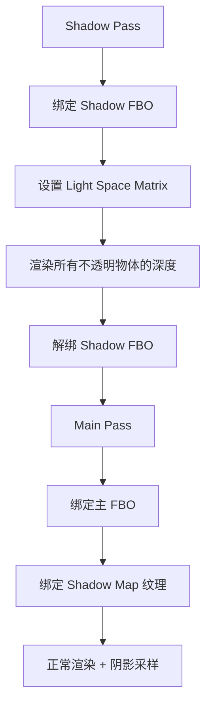

# Phase R4：阴影系统（Shadow Mapping）

> **文档版本**：v1.0  
> **创建日期**：2026-04-07  
> **优先级**：?? P1  
> **预计工作量**：5-7 天  
> **前置依赖**：Phase R3（多光源支持）  
> **文档说明**：本文档详细描述如何为引擎添加基于 Shadow Map 的阴影系统，从方向光阴影开始，支持 PCF 软阴影，并预留级联阴影（CSM）的扩展空间。所有代码可直接对照实现。

---

## 目录

- [一、现状分析](#一现状分析)
- [二、改进目标](#二改进目标)
- [三、涉及的文件清单](#三涉及的文件清单)
- [四、Shadow Mapping 原理](#四shadow-mapping-原理)
- [五、方案选择](#五方案选择)
  - [5.1 阴影算法选择](#51-阴影算法选择)
  - [5.2 软阴影方案选择](#52-软阴影方案选择)
  - [5.3 Shadow Map 分辨率选择](#53-shadow-map-分辨率选择)
- [六、Framebuffer 扩展](#六framebuffer-扩展)
  - [6.1 新增 DEPTH_ONLY 格式](#61-新增-depth_only-格式)
  - [6.2 Framebuffer.h 修改](#62-framebufferh-修改)
  - [6.3 Framebuffer.cpp 修改（Invalidate 方法）](#63-framebuffercpp-修改invalidate-方法)
- [七、Shadow Pass Shader](#七shadow-pass-shader)
  - [7.1 Shadow.vert](#71-shadowvert)
  - [7.2 Shadow.frag](#72-shadowfrag)
- [八、光源空间矩阵计算](#八光源空间矩阵计算)
  - [8.1 方向光的 Light Space Matrix](#81-方向光的-light-space-matrix)
- [九、Renderer3D 修改](#九renderer3d-修改)
  - [9.1 新增数据成员](#91-新增数据成员)
  - [9.2 Init 修改](#92-init-修改)
  - [9.3 渲染流程改造](#93-渲染流程改造)
  - [9.4 Shadow Pass 实现](#94-shadow-pass-实现)
- [十、Standard.frag 阴影采样](#十standardfrag-阴影采样)
  - [10.1 Shadow Map 采样函数](#101-shadow-map-采样函数)
  - [10.2 PCF 软阴影](#102-pcf-软阴影)
  - [10.3 集成到光照计算](#103-集成到光照计算)
- [十一、Shadow Bias 处理](#十一shadow-bias-处理)
- [十二、Standard.vert 修改](#十二standardvert-修改)
- [十三、验证方法](#十三验证方法)
- [十四、已知问题与后续优化](#十四已知问题与后续优化)
- [十五、设计决策记录](#十五设计决策记录)

---

## 一、现状分析

当前引擎**没有任何阴影支持**。所有物体都是全亮的（除了光照方向带来的明暗变化），没有投射阴影和接收阴影的能力。

### 当前 Framebuffer 能力

```cpp
enum class FramebufferTextureFormat
{
    None = 0,
    RGBA8,              // 颜色
    RED_INTEGER,        // 用于 Entity ID 拾取
    DEFPTH24STENCIL8,   // 深度模板
    Depth = DEFPTH24STENCIL8
};
```

当前 Framebuffer 支持颜色附件和深度模板附件，但**不支持纯深度纹理**（Shadow Map 需要）。

---

## 二、改进目标

1. **方向光阴影**：主方向光投射阴影
2. **Shadow Map FBO**：创建纯深度纹理的 Framebuffer
3. **Shadow Pass**：从光源视角渲染场景深度
4. **PCF 软阴影**：柔和的阴影边缘
5. **Shadow Bias**：消除阴影痤疮（Shadow Acne）

---

## 三、涉及的文件清单

| 文件路径 | 操作 | 说明 |
|---------|------|------|
| `Lucky/Source/Lucky/Renderer/Framebuffer.h` | 修改 | 添加 `DEPTH_COMPONENT` 格式 |
| `Lucky/Source/Lucky/Renderer/Framebuffer.cpp` | 修改 | 支持纯深度 FBO 创建 |
| `Luck3DApp/Assets/Shaders/Shadow.vert` | **新建** | Shadow Pass 顶点着色器 |
| `Luck3DApp/Assets/Shaders/Shadow.frag` | **新建** | Shadow Pass 片段着色器 |
| `Lucky/Source/Lucky/Renderer/Renderer3D.h` | 修改 | 添加 Shadow Pass 相关接口 |
| `Lucky/Source/Lucky/Renderer/Renderer3D.cpp` | 修改 | 实现 Shadow Pass + 渲染流程改造 |
| `Luck3DApp/Assets/Shaders/Standard.vert` | 修改 | 输出光源空间坐标 |
| `Luck3DApp/Assets/Shaders/Standard.frag` | 修改 | 采样 Shadow Map |

---

## 四、Shadow Mapping 原理

```
Shadow Mapping 分两个 Pass：

Pass 1（Shadow Pass）：
  - 从光源视角渲染整个场景
  - 只输出深度值到 Shadow Map 纹理
  - 使用光源的 View-Projection 矩阵（Light Space Matrix）

Pass 2（Main Pass）：
  - 正常渲染场景
  - 对于每个片段，将其变换到光源空间
  - 比较片段深度与 Shadow Map 中存储的深度
  - 如果片段深度 > Shadow Map 深度，则该片段在阴影中
```



---

## 五、方案选择

### 5.1 阴影算法选择

| 方案 | 说明 | 优点 | 缺点 | 推荐 |
|------|------|------|------|------|
| **方案 A：基础 Shadow Map（推荐）** | 单张深度纹理 | 实现最简单 | 大场景精度不足 | ? |
| 方案 B：CSM（Cascaded Shadow Maps） | 多级级联阴影 | 大场景精度好 | 实现复杂，需要多张 Shadow Map | 后续优化 |
| 方案 C：VSM（Variance Shadow Maps） | 方差阴影 | 天然软阴影 | 漏光问题 | |

**推荐方案 A**：基础 Shadow Map。先实现最简单的版本，后续可升级为 CSM。

### 5.2 软阴影方案选择

| 方案 | 说明 | 优点 | 缺点 | 推荐 |
|------|------|------|------|------|
| **方案 A：PCF（推荐）** | Percentage Closer Filtering | 实现简单，效果好 | 采样数多时性能下降 | ? |
| 方案 B：PCSS | Percentage Closer Soft Shadows | 近处硬阴影，远处软阴影 | 实现复杂 | 后续优化 |
| 方案 C：硬阴影 | 直接比较深度 | 最简单 | 锯齿严重 | |

**推荐方案 A**：PCF，3×3 或 5×5 采样核。

### 5.3 Shadow Map 分辨率选择

| 分辨率 | 内存占用 | 质量 | 推荐 |
|--------|---------|------|------|
| 1024×1024 | 4 MB | 低 | 调试用 |
| **2048×2048** | 16 MB | 中 | ? **默认** |
| 4096×4096 | 64 MB | 高 | 高质量 |

**推荐 2048×2048**：质量和性能的平衡点。

---

## 六、Framebuffer 扩展

### 6.1 新增 DEPTH_ONLY 格式

当前 `FramebufferTextureFormat` 中的 `DEFPTH24STENCIL8` 是深度+模板附件，不能作为纹理采样。Shadow Map 需要一个**纯深度纹理**。

### 6.2 Framebuffer.h 修改

```cpp
enum class FramebufferTextureFormat
{
    None = 0,

    RGBA8,
    RED_INTEGER,

    DEFPTH24STENCIL8,
    DEPTH_COMPONENT,        // ← 新增：纯深度纹理（可采样）

    Depth = DEFPTH24STENCIL8
};
```

### 6.3 Framebuffer.cpp 修改（Invalidate 方法）

在 `Invalidate()` 方法中添加 `DEPTH_COMPONENT` 的处理：

```cpp
// 在深度附件创建逻辑中添加：
case FramebufferTextureFormat::DEPTH_COMPONENT:
{
    // 创建纯深度纹理（可采样）
    glCreateTextures(GL_TEXTURE_2D, 1, &m_DepthAttachment);
    glBindTexture(GL_TEXTURE_2D, m_DepthAttachment);
    glTexImage2D(GL_TEXTURE_2D, 0, GL_DEPTH_COMPONENT24, 
                 m_Specification.Width, m_Specification.Height, 
                 0, GL_DEPTH_COMPONENT, GL_FLOAT, nullptr);
    
    // 纹理参数
    glTexParameteri(GL_TEXTURE_2D, GL_TEXTURE_MIN_FILTER, GL_NEAREST);
    glTexParameteri(GL_TEXTURE_2D, GL_TEXTURE_MAG_FILTER, GL_NEAREST);
    glTexParameteri(GL_TEXTURE_2D, GL_TEXTURE_WRAP_S, GL_CLAMP_TO_BORDER);
    glTexParameteri(GL_TEXTURE_2D, GL_TEXTURE_WRAP_T, GL_CLAMP_TO_BORDER);
    
    // 边界颜色设为白色（1.0），超出 Shadow Map 范围的区域不在阴影中
    float borderColor[] = { 1.0f, 1.0f, 1.0f, 1.0f };
    glTexParameterfv(GL_TEXTURE_2D, GL_TEXTURE_BORDER_COLOR, borderColor);
    
    // 附加到 FBO
    glFramebufferTexture2D(GL_FRAMEBUFFER, GL_DEPTH_ATTACHMENT, GL_TEXTURE_2D, m_DepthAttachment, 0);
    
    // 不需要颜色附件
    glDrawBuffer(GL_NONE);
    glReadBuffer(GL_NONE);
    
    break;
}
```

同时需要在 `Framebuffer` 类中添加获取深度纹理 ID 的方法：

```cpp
/// <summary>
/// 返回深度缓冲区纹理 ID（用于 Shadow Map 采样）
/// </summary>
uint32_t GetDepthAttachmentRendererID() const { return m_DepthAttachment; }
```

---

## 七、Shadow Pass Shader

### 7.1 Shadow.vert

```glsl
// Luck3DApp/Assets/Shaders/Shadow.vert
#version 450 core

layout(location = 0) in vec3 a_Position;
layout(location = 1) in vec4 a_Color;       // 不使用
layout(location = 2) in vec3 a_Normal;      // 不使用
layout(location = 3) in vec2 a_TexCoord;    // 不使用
layout(location = 4) in vec4 a_Tangent;     // 不使用

uniform mat4 u_LightSpaceMatrix;    // 光源空间 VP 矩阵
uniform mat4 u_ObjectToWorldMatrix; // 模型矩阵

void main()
{
    gl_Position = u_LightSpaceMatrix * u_ObjectToWorldMatrix * vec4(a_Position, 1.0);
}
```

### 7.2 Shadow.frag

```glsl
// Luck3DApp/Assets/Shaders/Shadow.frag
#version 450 core

// 不输出任何颜色，只写入深度缓冲区
void main()
{
    // gl_FragDepth 由 OpenGL 自动写入
    // 如果不需要修改深度值，Fragment Shader 可以为空
}
```

---

## 八、光源空间矩阵计算

### 8.1 方向光的 Light Space Matrix

方向光使用正交投影（Orthographic Projection）：

```cpp
/// <summary>
/// 计算方向光的 Light Space Matrix
/// </summary>
/// <param name="lightDirection">光照方向（世界空间）</param>
/// <param name="sceneCenter">场景中心</param>
/// <param name="sceneRadius">场景半径（包围球）</param>
/// <returns>Light Space Matrix = Projection × View</returns>
static glm::mat4 CalculateDirectionalLightSpaceMatrix(
    const glm::vec3& lightDirection,
    const glm::vec3& sceneCenter = glm::vec3(0.0f),
    float sceneRadius = 20.0f)
{
    // 光源"位置"（沿光照方向反方向偏移）
    glm::vec3 lightPos = sceneCenter - glm::normalize(lightDirection) * sceneRadius;
    
    // View 矩阵：从光源位置看向场景中心
    glm::mat4 lightView = glm::lookAt(lightPos, sceneCenter, glm::vec3(0.0f, 1.0f, 0.0f));
    
    // 正交投影矩阵：覆盖场景范围
    float orthoSize = sceneRadius;
    glm::mat4 lightProjection = glm::ortho(
        -orthoSize, orthoSize,      // left, right
        -orthoSize, orthoSize,      // bottom, top
        0.1f, sceneRadius * 2.0f    // near, far
    );
    
    return lightProjection * lightView;
}
```

> **注意**：`sceneRadius` 应该根据实际场景大小调整。简单实现可以使用固定值，后续可以根据相机视锥体动态计算（CSM 的基础）。

---

## 九、Renderer3D 修改

### 9.1 新增数据成员

```cpp
struct Renderer3DData
{
    // ... 现有成员 ...
    
    // Shadow Map
    Ref<Framebuffer> ShadowMapFBO;          // Shadow Map 帧缓冲区
    Ref<Shader> ShadowShader;               // Shadow Pass 着色器
    glm::mat4 LightSpaceMatrix;             // 光源空间矩阵
    uint32_t ShadowMapResolution = 2048;    // Shadow Map 分辨率
};
```

### 9.2 Init 修改

```cpp
void Renderer3D::Init()
{
    // ... 现有初始化 ...
    
    // 加载 Shadow Shader
    s_Data.ShaderLib->Load("Assets/Shaders/Shadow");
    s_Data.ShadowShader = s_Data.ShaderLib->Get("Shadow");
    
    // 创建 Shadow Map FBO
    FramebufferSpecification shadowSpec;
    shadowSpec.Width = s_Data.ShadowMapResolution;
    shadowSpec.Height = s_Data.ShadowMapResolution;
    shadowSpec.Attachments = { FramebufferTextureFormat::DEPTH_COMPONENT };
    s_Data.ShadowMapFBO = Framebuffer::Create(shadowSpec);
}
```

### 9.3 渲染流程改造

```
原流程：
  BeginScene → DrawMesh(每个实体) → EndScene

新流程：
  BeginScene
    → ShadowPass（从光源视角渲染深度）
    → MainPass（正常渲染 + 阴影采样）
  EndScene
```

### 9.4 Shadow Pass 实现

```cpp
void Renderer3D::BeginScene(const EditorCamera& camera, const SceneLightData& lightData)
{
    // Camera UBO（不变）
    // Light UBO（不变）
    
    // 计算 Light Space Matrix（使用第一个方向光）
    if (lightData.DirectionalLightCount > 0)
    {
        s_Data.LightSpaceMatrix = CalculateDirectionalLightSpaceMatrix(
            lightData.DirectionalLights[0].Direction
        );
    }
}

/// <summary>
/// 执行 Shadow Pass：从光源视角渲染场景深度
/// 在 BeginScene 之后、DrawMesh 之前调用
/// </summary>
void Renderer3D::BeginShadowPass()
{
    s_Data.ShadowMapFBO->Bind();
    RenderCommand::SetViewport(0, 0, s_Data.ShadowMapResolution, s_Data.ShadowMapResolution);
    RenderCommand::Clear();
    
    s_Data.ShadowShader->Bind();
    s_Data.ShadowShader->SetMat4("u_LightSpaceMatrix", s_Data.LightSpaceMatrix);
}

void Renderer3D::EndShadowPass()
{
    s_Data.ShadowMapFBO->Unbind();
}

/// <summary>
/// Shadow Pass 中绘制网格（只输出深度）
/// </summary>
void Renderer3D::DrawMeshShadow(const glm::mat4& transform, Ref<Mesh>& mesh)
{
    s_Data.ShadowShader->SetMat4("u_ObjectToWorldMatrix", transform);
    
    for (const SubMesh& sm : mesh->GetSubMeshes())
    {
        RenderCommand::DrawIndexedRange(mesh->GetVertexArray(), sm.IndexOffset, sm.IndexCount);
    }
}
```

### 9.5 Scene.cpp 中的调用顺序

```cpp
void Scene::OnUpdate(DeltaTime dt, EditorCamera& camera)
{
    // 收集光源数据（不变）
    // ...
    
    Renderer3D::BeginScene(camera, sceneLightData);
    
    // ---- Shadow Pass ----
    Renderer3D::BeginShadowPass();
    {
        auto meshGroup = m_Registry.group<TransformComponent>(entt::get<MeshFilterComponent, MeshRendererComponent>);
        for (auto entity : meshGroup)
        {
            auto [transform, meshFilter, meshRenderer] = meshGroup.get<TransformComponent, MeshFilterComponent, MeshRendererComponent>(entity);
            Renderer3D::DrawMeshShadow(transform.GetTransform(), meshFilter.Mesh);
        }
    }
    Renderer3D::EndShadowPass();
    
    // ---- Main Pass ----
    // 恢复视口大小（需要从外部传入或缓存）
    // RenderCommand::SetViewport(0, 0, viewportWidth, viewportHeight);
    {
        auto meshGroup = m_Registry.group<TransformComponent>(entt::get<MeshFilterComponent, MeshRendererComponent>);
        for (auto entity : meshGroup)
        {
            auto [transform, meshFilter, meshRenderer] = meshGroup.get<TransformComponent, MeshFilterComponent, MeshRendererComponent>(entity);
            Renderer3D::DrawMesh(transform.GetTransform(), meshFilter.Mesh, meshRenderer.Materials);
        }
    }
    
    Renderer3D::EndScene();
}
```

---

## 十、Standard.frag 阴影采样

### 10.1 Shadow Map 采样函数

```glsl
uniform sampler2D u_ShadowMap;          // Shadow Map 纹理
uniform mat4 u_LightSpaceMatrix;        // 光源空间矩阵

float ShadowCalculation(vec3 worldPos, vec3 normal, vec3 lightDir)
{
    // 变换到光源空间
    vec4 fragPosLightSpace = u_LightSpaceMatrix * vec4(worldPos, 1.0);
    
    // 透视除法
    vec3 projCoords = fragPosLightSpace.xyz / fragPosLightSpace.w;
    
    // 变换到 [0, 1] 范围
    projCoords = projCoords * 0.5 + 0.5;
    
    // 超出 Shadow Map 范围的片段不在阴影中
    if (projCoords.z > 1.0)
        return 0.0;
    
    // 当前片段深度
    float currentDepth = projCoords.z;
    
    // Shadow Bias（根据法线和光照方向动态调整）
    float bias = max(0.05 * (1.0 - dot(normal, lightDir)), 0.005);
    
    // 硬阴影
    float closestDepth = texture(u_ShadowMap, projCoords.xy).r;
    float shadow = currentDepth - bias > closestDepth ? 1.0 : 0.0;
    
    return shadow;
}
```

### 10.2 PCF 软阴影

```glsl
float ShadowCalculationPCF(vec3 worldPos, vec3 normal, vec3 lightDir)
{
    vec4 fragPosLightSpace = u_LightSpaceMatrix * vec4(worldPos, 1.0);
    vec3 projCoords = fragPosLightSpace.xyz / fragPosLightSpace.w;
    projCoords = projCoords * 0.5 + 0.5;
    
    if (projCoords.z > 1.0)
        return 0.0;
    
    float currentDepth = projCoords.z;
    float bias = max(0.05 * (1.0 - dot(normal, lightDir)), 0.005);
    
    // PCF：3×3 采样核
    float shadow = 0.0;
    vec2 texelSize = 1.0 / textureSize(u_ShadowMap, 0);
    
    for (int x = -1; x <= 1; ++x)
    {
        for (int y = -1; y <= 1; ++y)
        {
            float pcfDepth = texture(u_ShadowMap, projCoords.xy + vec2(x, y) * texelSize).r;
            shadow += currentDepth - bias > pcfDepth ? 1.0 : 0.0;
        }
    }
    shadow /= 9.0;  // 3×3 = 9 个采样
    
    return shadow;
}
```

### 10.3 集成到光照计算

在 `CalcDirectionalLight` 函数中添加阴影因子：

```glsl
vec3 CalcDirectionalLight(DirectionalLight light, vec3 N, vec3 V, vec3 worldPos, 
                          vec3 albedo, float metallic, float roughness, vec3 F0)
{
    vec3 L = normalize(-light.Direction);
    
    // 计算阴影
    float shadow = ShadowCalculationPCF(worldPos, N, L);
    
    // ... PBR 计算 ...
    
    // 应用阴影因子（只影响直接光照，不影响环境光）
    return (kD * albedo / PI + specular) * radiance * NdotL * (1.0 - shadow);
}
```

---

## 十一、Shadow Bias 处理

### 问题：Shadow Acne

当 Shadow Map 分辨率有限时，多个片段可能映射到同一个 Shadow Map 纹素，导致自阴影伪影（Shadow Acne）。

### 解决方案

1. **动态 Bias**：根据法线和光照方向的夹角调整 bias

```glsl
float bias = max(0.05 * (1.0 - dot(normal, lightDir)), 0.005);
```

2. **正面剔除**（Shadow Pass 中）：渲染背面而非正面

```cpp
// Shadow Pass 开始时
glCullFace(GL_FRONT);  // 剔除正面，渲染背面

// Shadow Pass 结束后恢复
glCullFace(GL_BACK);   // 恢复默认
```

> **推荐**：两种方法结合使用，效果最好。

---

## 十二、Standard.vert 修改

在 VertexOutput 中添加光源空间坐标（可选，也可以在 Fragment Shader 中计算）：

```glsl
// 方案 A：在 Fragment Shader 中计算（推荐，更简单）
// 不需要修改 Standard.vert
// Fragment Shader 中直接使用 u_LightSpaceMatrix * vec4(worldPos, 1.0)

// 方案 B：在 Vertex Shader 中计算（性能略好）
// 需要在 VertexOutput 中添加 vec4 LightSpacePos
```

**推荐方案 A**：在 Fragment Shader 中计算。原因：
- 不需要修改 VertexOutput 结构
- 精度更高（逐片段计算 vs 逐顶点插值）
- 实现更简单

---

## 十三、验证方法

### 13.1 Shadow Map 可视化

1. 将 Shadow Map 深度纹理渲染到屏幕上的一个小窗口
2. 确认深度值正确（近处白色，远处黑色）
3. 确认物体轮廓在 Shadow Map 中可见

### 13.2 基本阴影验证

1. 创建一个 Plane（地面）和一个 Cube（投射阴影）
2. 添加方向光
3. 确认 Cube 在 Plane 上投射阴影
4. 旋转方向光，确认阴影方向跟随

### 13.3 PCF 验证

1. 对比硬阴影和 PCF 软阴影
2. PCF 阴影边缘应该更柔和
3. 确认无明显的条纹伪影

### 13.4 Shadow Acne 验证

1. 确认物体表面无自阴影条纹
2. 调整 bias 值，找到最佳平衡点
3. 确认 bias 不会导致阴影"悬浮"（Peter Panning）

---

## 十四、已知问题与后续优化

| 问题 | 影响 | 后续优化方案 |
|------|------|-------------|
| 固定正交投影范围 | 远处物体可能超出 Shadow Map | CSM（级联阴影） |
| 单张 Shadow Map | 大场景精度不足 | CSM |
| 仅方向光阴影 | 点光源和聚光灯无阴影 | 点光源用 Cubemap Shadow，聚光灯用透视 Shadow Map |
| 固定分辨率 | 无法动态调整 | 根据场景复杂度动态调整 |

---

## 十五、设计决策记录

| 决策 | 选择 | 原因 |
|------|------|------|
| 阴影算法 | 基础 Shadow Map | 最简单，后续可升级为 CSM |
| 软阴影 | PCF 3×3 | 效果好，性能可接受 |
| Shadow Map 分辨率 | 2048×2048 | 质量和性能的平衡 |
| Shadow Bias | 动态 bias + 正面剔除 | 两种方法结合效果最好 |
| 光源空间坐标计算 | Fragment Shader 中计算 | 精度更高，不需要修改 VertexOutput |
| 深度纹理格式 | GL_DEPTH_COMPONENT24 | 24 位精度足够 |
| 边界处理 | GL_CLAMP_TO_BORDER + 白色边界 | 超出范围的区域不在阴影中 |
