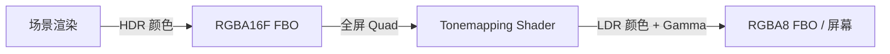
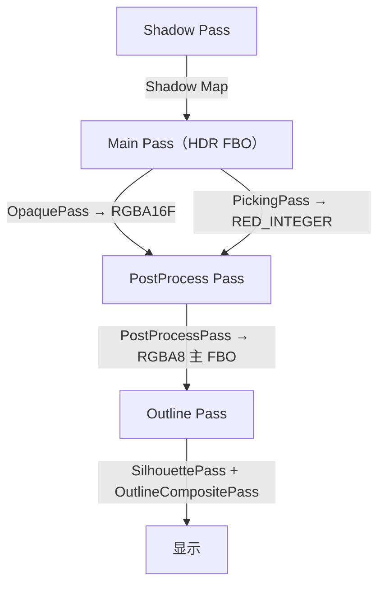

# Phase R5：HDR 渲染 + Tonemapping + Gamma 校正

> **文档版本**：v3.0  
> **创建日期**：2026-04-07  
> **更新日期**：2026-04-29  
> **优先级**：? P1  
> **预计工作量**：2-3 天  
> **前置依赖**：Phase R2（PBR Shader）? 已完成、Phase R7（多 Pass 渲染）? 已完成  
> **文档说明**：本文档详细描述如何将渲染管线从 LDR（Low Dynamic Range）升级为 HDR（High Dynamic Range），并添加 Tonemapping 和统一的 Gamma 校正。所有代码可直接对照实现。

---

## 目录

- [一、现状分析](#一现状分析)
- [二、改进目标](#二改进目标)
- [三、涉及的文件清单](#三涉及的文件清单)
- [四、HDR 渲染原理](#四hdr-渲染原理)
- [五、方案选择](#五方案选择)
  - [5.1 HDR 格式选择](#51-hdr-格式选择)
  - [5.2 Tonemapping 算法选择](#52-tonemapping-算法选择)
  - [5.3 Tonemapping Pass 集成方案](#53-tonemapping-pass-集成方案)
- [六、Framebuffer 扩展](#六framebuffer-扩展)
  - [6.1 新增 RGBA16F 格式](#61-新增-rgba16f-格式)
  - [6.2 Framebuffer.cpp 修改](#62-framebuffercpp-修改)
- [七、全屏 Quad 渲染（已完成）](#七全屏-quad-渲染已完成)
- [八、Tonemapping Shader](#八tonemapping-shader)
  - [8.1 Tonemapping.vert](#81-tonemappingvert)
  - [8.2 Tonemapping.frag](#82-tonemappingfrag)
  - [8.3 各 Tonemapping 算法实现](#83-各-tonemapping-算法实现)
- [九、渲染流程改造](#九渲染流程改造)
  - [9.1 PostProcessPass 实现](#91-postprocesspass-实现)
  - [9.2 HDR FBO 创建](#92-hdr-fbo-创建)
  - [9.3 渲染流程](#93-渲染流程)
  - [9.4 Renderer3D 修改](#94-renderer3d-修改)
  - [9.5 SceneViewportPanel 修改](#95-sceneviewportpanel-修改)
- [十、Standard.frag 修改](#十standardfrag-修改)
- [十一、Exposure 控制](#十一exposure-控制)
- [十二、验证方法](#十二验证方法)
- [十三、设计决策记录](#十三设计决策记录)

---

## 一、现状分析

> **注意**：本节已根据 2026-04-29 的实际代码状态更新。

### 当前渲染管线

```
当前：LDR 渲染
  场景渲染 → RGBA8 FBO → 直接显示

问题：
  - 颜色值被截断到 [0, 1]
  - 高亮区域（如强光照射）全部变成白色，丢失细节
  - PBR 光照计算在线性空间，但输出到 RGBA8 会丢失精度
  - Gamma 校正在 Standard.frag 中手动进行，不统一
```

### 当前已完成的前置功能

| 功能 | 状态 | 说明 |
|------|------|------|
| PBR Shader（Phase R2） | ? 已完成 | `Standard.frag` 完整 PBR，末尾有手动 `pow(color, vec3(1.0/2.2))` Gamma 校正 |
| 多光源支持（Phase R3） | ? 已完成 | 方向光×4 + 点光源×8 + 聚光灯×4，Light UBO |
| 阴影系统（Phase R4） | ? 已完成 | 方向光 Shadow Map，ShadowPass 集成到 Pipeline |
| 多 Pass 渲染（Phase R7） | ? 已完成 | `RenderPipeline` + `RenderPass` 架构，分组执行（Shadow → Main → Outline） |
| 选中描边（Phase R8） | ? 已完成 | SilhouettePass + OutlineCompositePass |
| 统一 Light 组件（Phase R9） | ? 已完成 | `LightComponent` 整合所有光源类型 |
| 鼠标拾取（Phase R15） | ? 已完成 | PickingPass + Entity ID |
| Shader 公共库（Phase R16） | ? 已完成 | `Common.glsl`、`Shadow.glsl`、`Lighting.glsl`，`#include` 机制 |
| 全屏 Quad 工具类 | ? 已完成 | `ScreenQuad.h/.cpp` 已实现，`Init()`/`Draw()`/`Shutdown()` |
| `RenderCommand::DrawArrays` | ? 已完成 | 无索引绘制接口已声明并实现 |
| 场景序列化 | ? 已完成 | YAML 格式 `.luck3d` 文件 |

### 当前渲染流程

```
SceneViewportPanel::OnUpdate
  → Framebuffer::Bind()（RGBA8 主 FBO）
  → RenderCommand::SetClearColor() + Clear()
  → m_Framebuffer->ClearAttachment(1, -1)          // 清除 Entity ID 缓冲区
  → Renderer3D::SetTargetFramebuffer(m_Framebuffer) // 传入主 FBO 引用
  → Renderer3D::SetOutlineEntities(...)             // 设置描边实体集合
  → Scene::OnUpdate()
      → 收集光源数据
      → Renderer3D::BeginScene(camera, sceneLightData)
          → Camera UBO + Light UBO + 计算 LightSpaceMatrix
      → Renderer3D::DrawMesh() × N                  // 收集 DrawCommand
      → Renderer3D::EndScene()
          → 排序 OpaqueDrawCommands
          → Pipeline.ExecuteGroup("Shadow")          // ShadowPass → Shadow Map FBO
          → Pipeline.ExecuteGroup("Main")            // OpaquePass + PickingPass → 主 FBO
          → 提取 OutlineDrawCommands
  → GizmoRenderer::BeginScene() / EndScene()
  → Renderer3D::RenderOutline()
      → Pipeline.ExecuteGroup("Outline")             // SilhouettePass + OutlineCompositePass
  → Framebuffer::Unbind()
```

### 当前 Framebuffer 格式

```cpp
enum class FramebufferTextureFormat
{
    None = 0,
    RGBA8,              // 8 位整数，[0, 255] → [0.0, 1.0]
    RED_INTEGER,        // 红色整型（用于 Entity ID 拾取）
    DEFPTH24STENCIL8,   // 深度模板（深度24位 + 模板8位，不可采样）
    DEPTH_COMPONENT,    // 纯深度纹理（24位深度，可采样，用于 Shadow Map）
    Depth = DEFPTH24STENCIL8
};
```

当前不支持浮点纹理格式（`RGBA16F`），需要在本阶段新增。

### 当前主 FBO 布局

| FBO | 附件 | 格式 | 用途 |
|-----|------|------|------|
| **主 FBO**（SceneViewportPanel） | Attachment 0 | `RGBA8` | 颜色渲染结果 |
| | Attachment 1 | `RED_INTEGER` | Entity ID（鼠标拾取） |
| | Depth | `DEPTH24_STENCIL8` | 深度模板 |

### 当前 RenderPass 分组

| 分组 | Pass | 执行时机 |
|------|------|---------|
| `Shadow` | ShadowPass | `EndScene()` |
| `Main` | OpaquePass + PickingPass | `EndScene()` |
| `Outline` | SilhouettePass + OutlineCompositePass | `RenderOutline()` |

---

## 二、改进目标

1. **HDR FBO**：主渲染目标使用 RGBA16F 浮点格式，颜色值不被截断
2. **Tonemapping Pass**：全屏后处理，将 HDR 颜色映射到 LDR（作为 `RenderPass` 集成到 `RenderPipeline`）
3. **统一 Gamma 校正**：在 Tonemapping 中统一进行，移除各 Shader 中的手动 Gamma
4. **Exposure 控制**：支持手动曝光调节

---

## 三、涉及的文件清单

| 文件路径 | 操作 | 说明 |
|---------|------|------|
| `Lucky/Source/Lucky/Renderer/Framebuffer.h` | 修改 | 添加 `RGBA16F` 格式 |
| `Lucky/Source/Lucky/Renderer/Framebuffer.cpp` | 修改 | 支持浮点纹理创建 |
| `Luck3DApp/Assets/Shaders/Internal/Tonemapping/Tonemapping.vert` | **新建** | 全屏 Quad 顶点着色器 |
| `Luck3DApp/Assets/Shaders/Internal/Tonemapping/Tonemapping.frag` | **新建** | Tonemapping + Gamma 校正 |
| `Lucky/Source/Lucky/Renderer/Passes/PostProcessPass.h` | **新建** | 后处理 RenderPass 头文件（R5 阶段仅包含 Tonemapping） |
| `Lucky/Source/Lucky/Renderer/Passes/PostProcessPass.cpp` | **新建** | 后处理 RenderPass 实现 |
| `Lucky/Source/Lucky/Renderer/Renderer3D.h` | 修改 | 添加 HDR 相关接口 |
| `Lucky/Source/Lucky/Renderer/Renderer3D.cpp` | 修改 | HDR FBO + Tonemapping Pass 注册 |
| `Lucky/Source/Lucky/Renderer/RenderContext.h` | 修改 | 添加 HDR 相关数据 |
| `Luck3DApp/Source/Panels/SceneViewportPanel.cpp` | 修改 | 适配 HDR 渲染流程 |
| `Luck3DApp/Assets/Shaders/Standard.frag` | 修改 | 移除手动 Gamma 校正 |

### 无需修改的文件

| 文件路径 | 说明 |
|---------|------|
| `Lucky/Source/Lucky/Renderer/ScreenQuad.h/.cpp` | ? 已完成，无需修改 |
| `Lucky/Source/Lucky/Renderer/RenderCommand.h/.cpp` | ? `DrawArrays` 已实现，无需修改 |
| `Lucky/Source/Lucky/Renderer/RenderPipeline.h/.cpp` | ? 分组执行机制已完成，无需修改 |
| `Lucky/Source/Lucky/Renderer/RenderPass.h` | ? Pass 基类已完成，无需修改 |

---

## 四、HDR 渲染原理

```
HDR 渲染流程：

1. 场景渲染到 HDR FBO（RGBA16F）
   - 颜色值可以超过 1.0（如 5.0, 10.0 等）
   - 保留高亮区域的细节

2. Tonemapping Pass
   - 读取 HDR FBO 的颜色纹理
   - 应用 Tonemapping 算法，将 HDR → LDR [0, 1]
   - 同时进行 Gamma 校正
   - 输出到最终显示的 FBO（RGBA8）

3. 显示
   - 最终 FBO 的内容显示到屏幕
```



---

## 五、方案选择

### 5.1 HDR 格式选择

| 格式 | 精度 | 内存 | 说明 | 推荐 |
|------|------|------|------|------|
| **RGBA16F** | 半精度浮点 | 8 bytes/pixel | 足够的 HDR 范围，性能好 | ? **推荐** |
| RGBA32F | 全精度浮点 | 16 bytes/pixel | 最高精度 | 内存翻倍，通常不需要 |
| R11G11B10F | 紧凑浮点 | 4 bytes/pixel | 无 Alpha，精度略低 | 性能优先时可选 |

**推荐 RGBA16F**：精度足够，性能和内存开销适中。

### 5.2 Tonemapping 算法选择

| 算法 | 公式 | 优点 | 缺点 | 推荐 |
|------|------|------|------|------|
| Reinhard | `c / (c + 1)` | 最简单 | 高亮区域偏灰 | 入门 |
| Reinhard Extended | `c * (1 + c/Lw2) / (1 + c)` | 可控白点 | 需要额外参数 | |
| **ACES Filmic** | 见下方 | 电影级效果，Unity/UE 默认 | 稍复杂 | ? **推荐** |
| Uncharted 2 | 见下方 | 游戏级效果 | 需要调参 | 备选 |

**推荐 ACES Filmic**：业界标准，Unity 和 Unreal 都使用。

### 5.3 Tonemapping Pass 集成方案

当前项目已有 `RenderPipeline` + `RenderPass` 分组执行架构，Tonemapping 应作为 `PostProcessPass` 的一部分集成到管线中。这样设计的好处是：后续 R6 阶段添加 Bloom、FXAA 等效果时，只需在 `PostProcessPass` 内部扩展效果链，无需重构。

#### 方案 A（推荐 ?）：HDR FBO 由 PostProcessPass 持有

PostProcessPass 自身持有 HDR FBO，在 `Init()` 中创建。场景渲染到 HDR FBO，PostProcessPass 执行 Tonemapping 后输出到主 FBO。

> **设计说明**：R5 阶段 PostProcessPass 内部仅包含 Tonemapping 一个效果。R6 阶段将在其内部引入 `PostProcessStack` 效果链和 Ping-Pong FBO，将 Bloom、FXAA 等效果串联在 Tonemapping 之前执行。这种设计使得 R5 → R6 的过渡是“扩展”而非“重构”。

**优点**：
- HDR FBO 的生命周期由 PostProcessPass 管理，职责清晰
- 与现有 Pass 架构一致（ShadowPass 也持有自己的 Shadow Map FBO）
- 后续 R6 添加更多后处理效果时，可以在 PostProcessPass 内部扩展效果链
- OpaquePass 和 PickingPass 无需修改（只需切换渲染目标）

**缺点**：
- OpaquePass 和 PickingPass 需要知道渲染到 HDR FBO 而非主 FBO，需要通过 RenderContext 传递

#### 方案 B：HDR FBO 由 Renderer3DData 持有

在 `Renderer3DData` 中创建 HDR FBO，`BeginScene()` 中绑定 HDR FBO，`EndScene()` 中执行 Tonemapping。

**优点**：
- 改动集中在 Renderer3D 内部

**缺点**：
- 不符合 RenderPass 架构的设计理念
- HDR FBO 的管理与 Pass 分离，职责不清晰
- 后续添加后处理效果时需要在 Renderer3D 中不断添加代码

**推荐方案 A**：与现有 RenderPass 架构一致，扩展性好，R6 可直接在 PostProcessPass 内部扩展效果链。

---

## 六、Framebuffer 扩展

### 6.1 新增 RGBA16F 格式

```cpp
// Lucky/Source/Lucky/Renderer/Framebuffer.h
enum class FramebufferTextureFormat
{
    None = 0,

    RGBA8,
    RGBA16F,            // ← 新增：HDR 浮点颜色
    RED_INTEGER,

    DEFPTH24STENCIL8,
    DEPTH_COMPONENT,    // 已有（Phase R4 阴影阶段添加）

    Depth = DEFPTH24STENCIL8
};
```

### 6.2 Framebuffer.cpp 修改

#### 6.2.1 Invalidate() 中添加 RGBA16F 分支

在颜色附件创建的 `switch` 中添加：

```cpp
// 在 Invalidate() 的颜色附件 switch 中新增
case FramebufferTextureFormat::RGBA16F:
{
    // HDR 浮点纹理：内部格式 GL_RGBA16F，数据类型 GL_FLOAT
    bool multisampled = m_Specification.Samples > 1;
    if (multisampled)
    {
        glTexImage2DMultisample(GL_TEXTURE_2D_MULTISAMPLE, m_Specification.Samples, GL_RGBA16F, m_Specification.Width, m_Specification.Height, GL_FALSE);
    }
    else
    {
        glTexImage2D(GL_TEXTURE_2D, 0, GL_RGBA16F, m_Specification.Width, m_Specification.Height, 0, GL_RGBA, GL_FLOAT, nullptr);
        glTexParameteri(GL_TEXTURE_2D, GL_TEXTURE_MIN_FILTER, GL_LINEAR);
        glTexParameteri(GL_TEXTURE_2D, GL_TEXTURE_MAG_FILTER, GL_LINEAR);
        glTexParameteri(GL_TEXTURE_2D, GL_TEXTURE_WRAP_S, GL_CLAMP_TO_EDGE);
        glTexParameteri(GL_TEXTURE_2D, GL_TEXTURE_WRAP_T, GL_CLAMP_TO_EDGE);
    }
    glFramebufferTexture2D(GL_FRAMEBUFFER, GL_COLOR_ATTACHMENT0 + i, Utils::TextureTarget(multisampled), m_ColorAttachments[i], 0);
    break;
}
```

> **注意**：与 `RGBA8` 的区别在于内部格式为 `GL_RGBA16F`，数据类型为 `GL_FLOAT`（而非 `GL_UNSIGNED_BYTE`）。由于 `RGBA16F` 不使用 `AttachColorTexture` 辅助函数（该函数硬编码了 `GL_UNSIGNED_BYTE`），需要直接内联处理。

#### 6.2.2 FramebufferTextureFormatToGL() 中添加 RGBA16F

```cpp
static GLenum FramebufferTextureFormatToGL(FramebufferTextureFormat format)
{
    switch (format)
    {
        case FramebufferTextureFormat::RGBA8:       return GL_RGBA8;
        case FramebufferTextureFormat::RGBA16F:     return GL_RGBA16F;  // ← 新增
        case FramebufferTextureFormat::RED_INTEGER: return GL_RED_INTEGER;
    }
    // ...
}
```

---

## 七、全屏 Quad 渲染（已完成）

> **状态**：? 已在 Phase R8（选中描边）中实现，无需修改。

`ScreenQuad` 工具类已完整实现，用于后处理 Pass 的全屏四边形绘制：

- **文件**：`Lucky/Source/Lucky/Renderer/ScreenQuad.h` / `ScreenQuad.cpp`
- **接口**：`ScreenQuad::Init()` / `ScreenQuad::Draw()` / `ScreenQuad::Shutdown()`
- **绘制方式**：使用 `RenderCommand::DrawArrays(s_VAO, 6)` 绘制 6 个顶点（2 个三角形）
- **初始化位置**：在 `Renderer::Init()` 中调用（与 `Renderer3D::Init()` 同级）

---

## 八、Tonemapping Shader

> **路径说明**：Tonemapping 是引擎内部的后处理 Shader，用户不应修改，因此放在 `Internal/Tonemapping/` 目录下（与 `Internal/Shadow/`、`Internal/Outline/` 一致）。

### 8.1 Tonemapping.vert

```glsl
// Luck3DApp/Assets/Shaders/Internal/Tonemapping/Tonemapping.vert
#version 450 core

layout(location = 0) in vec2 a_Position;
layout(location = 1) in vec2 a_TexCoord;

out vec2 v_TexCoord;

void main()
{
    v_TexCoord = a_TexCoord;
    gl_Position = vec4(a_Position, 0.0, 1.0);
}
```

### 8.2 Tonemapping.frag

```glsl
// Luck3DApp/Assets/Shaders/Internal/Tonemapping/Tonemapping.frag
#version 450 core

layout(location = 0) out vec4 o_Color;

in vec2 v_TexCoord;

uniform sampler2D u_HDRTexture;     // HDR 颜色纹理
uniform float u_Exposure;           // 曝光值（默认 1.0）
uniform int u_TonemapMode;          // Tonemapping 模式（0=Reinhard, 1=ACES, 2=Uncharted2）

// ==================== Tonemapping 算法 ====================

// Reinhard
vec3 TonemapReinhard(vec3 color)
{
    return color / (color + vec3(1.0));
}

// ACES Filmic（简化版，来自 Krzysztof Narkowicz）
vec3 TonemapACES(vec3 color)
{
    float a = 2.51;
    float b = 0.03;
    float c = 2.43;
    float d = 0.59;
    float e = 0.14;
    return clamp((color * (a * color + b)) / (color * (c * color + d) + e), 0.0, 1.0);
}

// Uncharted 2 Filmic
vec3 Uncharted2Helper(vec3 x)
{
    float A = 0.15;  // Shoulder Strength
    float B = 0.50;  // Linear Strength
    float C = 0.10;  // Linear Angle
    float D = 0.20;  // Toe Strength
    float E = 0.02;  // Toe Numerator
    float F = 0.30;  // Toe Denominator
    return ((x * (A * x + C * B) + D * E) / (x * (A * x + B) + D * F)) - E / F;
}

vec3 TonemapUncharted2(vec3 color)
{
    float W = 11.2;  // Linear White Point
    vec3 curr = Uncharted2Helper(color);
    vec3 whiteScale = vec3(1.0) / Uncharted2Helper(vec3(W));
    return curr * whiteScale;
}

// ==================== 主函数 ====================

void main()
{
    // 采样 HDR 颜色
    vec3 hdrColor = texture(u_HDRTexture, v_TexCoord).rgb;
    
    // 应用曝光
    hdrColor *= u_Exposure;
    
    // Tonemapping
    vec3 ldrColor;
    switch (u_TonemapMode)
    {
        case 0:
            ldrColor = TonemapReinhard(hdrColor);
            break;
        case 1:
            ldrColor = TonemapACES(hdrColor);
            break;
        case 2:
            ldrColor = TonemapUncharted2(hdrColor);
            break;
        default:
            ldrColor = TonemapACES(hdrColor);
            break;
    }
    
    // Gamma 校正（线性空间 → sRGB）
    ldrColor = pow(ldrColor, vec3(1.0 / 2.2));
    
    o_Color = vec4(ldrColor, 1.0);
}
```

### 8.3 各 Tonemapping 算法实现

已包含在上述 Shader 中。三种算法的视觉效果对比：

| 算法 | 暗部 | 中间调 | 高光 | 整体风格 |
|------|------|--------|------|---------|
| Reinhard | 保留 | 自然 | 偏灰 | 朴素 |
| ACES | 略提亮 | 对比度高 | 保留细节 | 电影感 |
| Uncharted 2 | 保留 | 自然 | 柔和过渡 | 游戏感 |

---

## 九、渲染流程改造

### 9.1 PostProcessPass 实现

PostProcessPass 作为标准 `RenderPass`，持有 HDR FBO，负责：
1. 提供 HDR FBO 给其他 Pass 作为渲染目标
2. 执行 Tonemapping + Gamma 校正，输出到主 FBO

> **设计说明**：R5 阶段 PostProcessPass 内部直接执行 Tonemapping。R6 阶段将在 Tonemapping 之前插入 `PostProcessStack` 效果链（Bloom、FXAA 等），这是纯粹的内部扩展，不影响外部接口。

#### 9.1.1 PostProcessPass.h

```cpp
// Lucky/Source/Lucky/Renderer/Passes/PostProcessPass.h
#pragma once

#include "Lucky/Renderer/RenderPass.h"
#include "Lucky/Renderer/Framebuffer.h"
#include "Lucky/Renderer/Shader.h"

namespace Lucky
{
    /// <summary>
    /// 后处理 Pass
    /// 持有 HDR FBO（RGBA16F），执行后处理效果链 + Tonemapping + Gamma 校正
    /// 属于 "PostProcess" 分组，在 Main 分组之后执行
    /// R5 阶段仅包含 Tonemapping，R6 阶段将扩展效果链
    /// </summary>
    class PostProcessPass : public RenderPass
    {
    public:
        void Init() override;
        void Execute(const RenderContext& context) override;
        void Resize(uint32_t width, uint32_t height) override;
        
        const std::string& GetName() const override
        {
            static std::string name = "PostProcessPass";
            return name;
        }
        
        const std::string& GetGroup() const override
        {
            static std::string group = "PostProcess";
            return group;
        }
        
        /// <summary>
        /// 获取 HDR FBO（供 OpaquePass 等 Main 分组 Pass 作为渲染目标）
        /// </summary>
        const Ref<Framebuffer>& GetHDR_FBO() const { return m_HDR_FBO; }
        
        /// <summary>
        /// 获取 HDR 颜色纹理 ID（用于 Tonemapping 采样）
        /// </summary>
        uint32_t GetHDRColorTextureID() const;
        
    private:
        Ref<Framebuffer> m_HDR_FBO;             // HDR 渲染目标（RGBA16F + RED_INTEGER + Depth）
        Ref<Shader> m_TonemappingShader;        // Tonemapping 着色器
    };
}
```

#### 9.1.2 PostProcessPass.cpp

```cpp
// Lucky/Source/Lucky/Renderer/Passes/PostProcessPass.cpp
#include "lcpch.h"
#include "PostProcessPass.h"

#include "Lucky/Renderer/RenderContext.h"
#include "Lucky/Renderer/RenderCommand.h"
#include "Lucky/Renderer/ScreenQuad.h"
#include "Lucky/Renderer/Renderer3D.h"

namespace Lucky
{
    void PostProcessPass::Init()
    {
        // 创建 HDR FBO（与主 FBO 相同的附件布局，但颜色格式为 RGBA16F）
        FramebufferSpecification hdrSpec;
        hdrSpec.Width = 1280;   // 初始大小，后续随视口调整
        hdrSpec.Height = 720;
        hdrSpec.Attachments = {
            FramebufferTextureFormat::RGBA16F,          // HDR 颜色（Attachment 0）
            FramebufferTextureFormat::RED_INTEGER,      // Entity ID（Attachment 1，保留鼠标拾取功能）
            FramebufferTextureFormat::DEFPTH24STENCIL8  // 深度模板
        };
        m_HDR_FBO = Framebuffer::Create(hdrSpec);
        
        // 加载 Tonemapping Shader
        m_TonemappingShader = Renderer3D::GetShaderLibrary()->Get("Tonemapping");
    }
    
    void PostProcessPass::Execute(const RenderContext& context)
    {
        // 绑定主 FBO（RGBA8）作为 Tonemapping 输出目标
        if (context.TargetFramebuffer)
        {
            context.TargetFramebuffer->Bind();
        }
        
        // 禁用深度测试（全屏后处理不需要）
        RenderCommand::SetDepthTest(false);
        RenderCommand::SetDepthWrite(false);
        
        // 绑定 Tonemapping Shader
        m_TonemappingShader->Bind();
        m_TonemappingShader->SetFloat("u_Exposure", context.Exposure);
        m_TonemappingShader->SetInt("u_TonemapMode", context.TonemapMode);
        
        // 绑定 HDR 颜色纹理到纹理单元 0
        RenderCommand::BindTextureUnit(0, GetHDRColorTextureID());
        m_TonemappingShader->SetInt("u_HDRTexture", 0);
        
        // 绘制全屏 Quad
        ScreenQuad::Draw();
        
        // 恢复深度测试状态
        RenderCommand::SetDepthTest(true);
        RenderCommand::SetDepthWrite(true);
    }
    
    void PostProcessPass::Resize(uint32_t width, uint32_t height)
    {
        if (m_HDR_FBO)
        {
            m_HDR_FBO->Resize(width, height);
        }
    }
    
    uint32_t PostProcessPass::GetHDRColorTextureID() const
    {
        return m_HDR_FBO->GetColorAttachmentRendererID(0);
    }
}
```

### 9.2 HDR FBO 创建

HDR FBO 由 `PostProcessPass` 在 `Init()` 中创建（见 9.1.2），附件布局：

| 附件 | 格式 | 用途 |
|------|------|------|
| Attachment 0 | `RGBA16F` | HDR 颜色（场景渲染输出） |
| Attachment 1 | `RED_INTEGER` | Entity ID（鼠标拾取，与主 FBO 一致） |
| Depth | `DEPTH24_STENCIL8` | 深度模板 |

> **设计说明**：HDR FBO 保留了 `RED_INTEGER` 附件，这样 PickingPass 可以直接写入 HDR FBO 的 Attachment 1，无需额外的 FBO。但鼠标拾取读取像素时需要从 HDR FBO 读取（而非主 FBO），这一点需要在 SceneViewportPanel 中调整。

### 9.3 渲染流程

```
新流程：
  1. Shadow Pass
     → 渲染到 Shadow Map FBO（不变）
  
  2. Main Pass（HDR）
     → 绑定 HDR FBO（RGBA16F，由 PostProcessPass 持有）
     → OpaquePass：正常渲染场景（PBR 光照，不做 Gamma 校正）→ Attachment 0
     → PickingPass：Entity ID → Attachment 1
     → 颜色值可以超过 1.0
  
  3. PostProcess Pass
     → 绑定主 FBO（RGBA8）
     → PostProcessPass：全屏 Quad + Tonemapping Shader
       → 读取 HDR FBO Attachment 0 颜色纹理
       → Tonemapping + Gamma 校正
       → 输出 LDR 颜色到主 FBO Attachment 0
  
  4. Outline Pass（不变）
     → SilhouettePass + OutlineCompositePass → 主 FBO
```



### 9.4 Renderer3D 修改

#### 9.4.1 RenderContext 新增 HDR 相关数据

```cpp
// Lucky/Source/Lucky/Renderer/RenderContext.h 新增字段
struct RenderContext
{
    // ... 已有字段 ...
    
    // ---- HDR / Tonemapping 数据 ----
    Ref<Framebuffer> HDR_FBO;       // HDR FBO（由 PostProcessPass 提供，Main 分组 Pass 渲染到此 FBO）
    float Exposure = 1.0f;          // 曝光值
    int TonemapMode = 1;            // Tonemapping 模式（0=Reinhard, 1=ACES, 2=Uncharted2）
};
```

#### 9.4.2 Renderer3DData 新增 HDR 参数

```cpp
// Renderer3D.cpp 的 Renderer3DData 中新增
float Exposure = 1.0f;      // 曝光值
int TonemapMode = 1;        // 默认 ACES
```

#### 9.4.3 Renderer3D::Init() 注册 PostProcessPass

```cpp
void Renderer3D::Init()
{
    // ... 已有 Shader 加载 ...
    
    // 加载 Tonemapping Shader（引擎内部着色器）
    s_Data.ShaderLib->Load("Assets/Shaders/Internal/Tonemapping/Tonemapping");
    
    // ... 已有 Pass 创建 ...
    
    // 创建 PostProcessPass
    auto postProcessPass = CreateRef<PostProcessPass>();
    
    // 按顺序添加 Pass（执行顺序：Shadow → Main → PostProcess → Outline）
    s_Data.Pipeline.AddPass(shadowPass);
    s_Data.Pipeline.AddPass(opaquePass);
    s_Data.Pipeline.AddPass(pickingPass);
    s_Data.Pipeline.AddPass(postProcessPass);       // ← 新增
    s_Data.Pipeline.AddPass(silhouettePass);
    s_Data.Pipeline.AddPass(outlineCompositePass);
    
    s_Data.Pipeline.Init();
}
```

#### 9.4.4 Renderer3D::EndScene() 修改

```cpp
void Renderer3D::EndScene()
{
    // ---- 排序不透明物体 ----
    // ... 排序逻辑不变 ...
    
    // ---- 构建 RenderContext ----
    RenderContext context;
    context.OpaqueDrawCommands = &s_Data.OpaqueDrawCommands;
    context.TargetFramebuffer = s_Data.TargetFramebuffer;
    context.Stats = &s_Data.Stats;
    
    // 阴影数据（不变）
    context.ShadowEnabled = s_Data.ShadowEnabled;
    context.LightSpaceMatrix = s_Data.LightSpaceMatrix;
    context.ShadowBias = s_Data.ShadowBias;
    context.ShadowStrength = s_Data.ShadowStrength;
    context.ShadowShadowType = s_Data.ShadowShadowType;
    
    auto shadowPass = s_Data.Pipeline.GetPass<ShadowPass>();
    if (shadowPass)
    {
        context.ShadowMapTextureID = shadowPass->GetShadowMapTextureID();
    }
    
    // HDR / Tonemapping 数据（新增）
    auto postProcessPass = s_Data.Pipeline.GetPass<PostProcessPass>();
    if (postProcessPass)
    {
        context.HDR_FBO = postProcessPass->GetHDR_FBO();
    }
    context.Exposure = s_Data.Exposure;
    context.TonemapMode = s_Data.TonemapMode;
    
    // ---- 执行渲染管线 ----
    s_Data.Pipeline.ExecuteGroup("Shadow", context);        // ShadowPass
    s_Data.Pipeline.ExecuteGroup("Main", context);          // OpaquePass + PickingPass → HDR FBO
    s_Data.Pipeline.ExecuteGroup("PostProcess", context);   // PostProcessPass → 主 FBO
    
    // ======== 提取描边物体到独立列表 ========
    // ... 描边提取逻辑不变 ...
}
```

#### 9.4.5 Renderer3D 新增 HDR 控制接口

```cpp
// Renderer3D.h 新增
static void SetExposure(float exposure);
static float GetExposure();
static void SetTonemapMode(int mode);
static int GetTonemapMode();

// Renderer3D.cpp 实现
void Renderer3D::SetExposure(float exposure)
{
    s_Data.Exposure = exposure;
}

float Renderer3D::GetExposure()
{
    return s_Data.Exposure;
}

void Renderer3D::SetTonemapMode(int mode)
{
    s_Data.TonemapMode = mode;
}

int Renderer3D::GetTonemapMode()
{
    return s_Data.TonemapMode;
}
```

#### 9.4.6 OpaquePass 修改：渲染到 HDR FBO

OpaquePass 需要在执行前绑定 HDR FBO（而非主 FBO）：

```cpp
// Lucky/Source/Lucky/Renderer/Passes/OpaquePass.cpp
void OpaquePass::Execute(const RenderContext& context)
{
    // 绑定 HDR FBO 作为渲染目标（如果可用）
    if (context.HDR_FBO)
    {
        context.HDR_FBO->Bind();
        RenderCommand::SetClearColor({ 0.0f, 0.0f, 0.0f, 1.0f });
        RenderCommand::Clear();
        context.HDR_FBO->ClearAttachment(1, -1);  // 清除 Entity ID 缓冲区
    }
    
    // ... 原有绘制逻辑不变 ...
}
```

> **注意**：清屏和 Entity ID 缓冲区清除从 `SceneViewportPanel::OnUpdate` 移到 `OpaquePass::Execute` 中，因为现在场景渲染到 HDR FBO 而非主 FBO。

#### 9.4.7 PickingPass 修改：渲染到 HDR FBO

PickingPass 也需要渲染到 HDR FBO 的 Attachment 1：

```cpp
// Lucky/Source/Lucky/Renderer/Passes/PickingPass.cpp
void PickingPass::Execute(const RenderContext& context)
{
    // PickingPass 渲染到 HDR FBO 的 Attachment 1（如果可用）
    // HDR FBO 已在 OpaquePass 中绑定，此处无需重新绑定
    
    // ... 原有绘制逻辑不变 ...
}
```

### 9.5 SceneViewportPanel 修改

#### 9.5.1 主 FBO 简化

主 FBO 不再需要 `RED_INTEGER` 附件（Entity ID 现在在 HDR FBO 中），但为了保持兼容性和简单性，暂时保留原有布局不变。

#### 9.5.2 鼠标拾取读取 HDR FBO

鼠标拾取需要从 HDR FBO 的 Attachment 1 读取 Entity ID（而非主 FBO）：

```cpp
// SceneViewportPanel.cpp 的 OnMouseButtonPressed 中
// 修改前：
m_Framebuffer->Bind();
int pixelData = m_Framebuffer->GetPixel(1, mouseX, mouseY);
m_Framebuffer->Unbind();

// 修改后：
// 从 HDR FBO 读取 Entity ID（PickingPass 渲染到 HDR FBO 的 Attachment 1）
auto postProcessPass = Renderer3D::GetPipeline().GetPass<PostProcessPass>();
if (postProcessPass)
{
    const auto& hdrFBO = postProcessPass->GetHDR_FBO();
    hdrFBO->Bind();
    int pixelData = hdrFBO->GetPixel(1, mouseX, mouseY);
    hdrFBO->Unbind();
    // ... 后续拾取逻辑不变 ...
}
```

#### 9.5.3 OnUpdate 清屏逻辑调整

由于场景渲染到 HDR FBO，主 FBO 的清屏逻辑需要调整：

```cpp
void SceneViewportPanel::OnUpdate(DeltaTime dt)
{
    // ... Resize 逻辑不变 ...
    
    m_EditorCamera.OnUpdate(dt);
    
    m_Framebuffer->Bind();          // 绑定主 FBO
    
    const ColorSettings& colors = EditorPreferences::Get().GetColors();
    RenderCommand::SetClearColor(colors.ViewportClearColor);
    RenderCommand::Clear();
    // 注意：不再需要 m_Framebuffer->ClearAttachment(1, -1)
    // Entity ID 缓冲区的清除已移到 OpaquePass 中（HDR FBO）
    
    Renderer3D::SetTargetFramebuffer(m_Framebuffer);
    
    // ... 描边设置不变 ...
    
    m_Scene->OnUpdate(dt, m_EditorCamera);
    
    // ... Gizmo 和 Outline 不变 ...
    
    m_Framebuffer->Unbind();
}
```

---

## 十、Standard.frag 修改

移除手动 Gamma 校正，由 Tonemapping Pass 统一处理：

```glsl
// 修改前：
vec3 color = ambient + Lo + emission;

// ---- Gamma 校正（线性空间 → sRGB） ----
color = pow(color, vec3(1.0 / 2.2));

o_Color = vec4(color, alpha);

// 修改后：
vec3 color = ambient + Lo + emission;

// Gamma 校正由 Tonemapping Pass 统一处理，此处不做
o_Color = vec4(color, alpha);
```

> **重要**：所有用户 Shader 都不应包含 Gamma 校正，这是引擎内部的后处理职责。

---

## 十一、Exposure 控制

### 手动曝光

在 Renderer3D 中提供静态方法（见 9.4.5）：

```cpp
static void SetExposure(float exposure);
static float GetExposure();
static void SetTonemapMode(int mode);
static int GetTonemapMode();
```

### 编辑器 UI

在 Preferences 面板或 Scene 设置面板中添加：

```cpp
// 曝光控制
float exposure = Renderer3D::GetExposure();
if (ImGui::DragFloat("Exposure", &exposure, 0.01f, 0.01f, 10.0f, "%.2f"))
{
    Renderer3D::SetExposure(exposure);
}

// Tonemapping 模式
int tonemapMode = Renderer3D::GetTonemapMode();
const char* tonemapModes[] = { "Reinhard", "ACES Filmic", "Uncharted 2" };
if (ImGui::Combo("Tonemapping", &tonemapMode, tonemapModes, IM_ARRAYSIZE(tonemapModes)))
{
    Renderer3D::SetTonemapMode(tonemapMode);
}
```

### 自动曝光（后续优化）

自动曝光需要计算场景平均亮度，可以通过以下方式实现：
1. 将 HDR 纹理逐级降采样（Mipmap）
2. 读取最低级别的平均亮度
3. 根据平均亮度自动调整 Exposure

这是一个较复杂的功能，建议在后续后处理框架阶段实现。

---

## 十二、验证方法

### 12.1 HDR 验证

1. 设置一个高强度光源（Intensity = 10.0）
2. 确认 HDR FBO 中的颜色值超过 1.0（可通过读取像素验证）
3. 确认 Tonemapping 后高亮区域保留细节（不是纯白）

### 12.2 Tonemapping 对比

1. 切换三种 Tonemapping 模式
2. 对比视觉效果差异
3. ACES 应该有最好的对比度和色彩表现

### 12.3 Exposure 验证

1. 调整 Exposure 从 0.1 到 5.0
2. 确认场景亮度随 Exposure 线性变化
3. 确认 Exposure = 1.0 时效果与之前接近

### 12.4 Gamma 校正验证

1. 确认 Standard.frag 中不再有手动 Gamma 校正
2. 确认 Tonemapping.frag 中的 Gamma 校正正确
3. 中间灰度（线性 0.18）在屏幕上应显示为约 46% 亮度

### 12.5 鼠标拾取验证

1. 确认鼠标拾取功能正常（Entity ID 从 HDR FBO 读取）
2. 点击空白区域应取消选中
3. 点击物体应正确选中

### 12.6 描边验证

1. 确认选中描边功能正常（Outline Pass 在 Tonemapping 之后执行）
2. 描边颜色和宽度应与之前一致

---

## 十三、设计决策记录

| 决策 | 选择 | 原因 |
|------|------|------|
| HDR 格式 | RGBA16F | 精度足够，性能好 |
| Tonemapping 算法 | ACES Filmic（默认） | 业界标准，Unity/UE 默认 |
| Gamma 校正位置 | Tonemapping Pass 中统一处理 | 避免每个 Shader 重复 |
| 全屏 Quad | 复用已有 `ScreenQuad` 工具类 | Phase R8 已实现，可直接使用 |
| 曝光控制 | 手动（默认 1.0） | 简单，后续可添加自动曝光 |
| Tonemapping 模式 | 运行时可切换 | 方便调试和对比 |
| Pass 集成方式 | 标准 `RenderPass`（方案 A） | 与现有 Pipeline 架构一致，扩展性好 |
| Pass 命名 | `PostProcessPass`（而非 `TonemappingPass`） | R5 直接使用 PostProcessPass，R6 可在其内部扩展效果链，避免重构 |
| HDR FBO 持有者 | `PostProcessPass` | 与 `ShadowPass` 持有 Shadow Map FBO 一致 |
| Shader 路径 | `Internal/Tonemapping/` | 引擎内部 Shader，用户不可见 |
| Entity ID 附件 | 保留在 HDR FBO 中 | PickingPass 直接写入 HDR FBO，无需额外 FBO |
