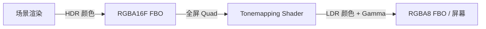

# Phase R5：HDR 渲染 + Tonemapping + Gamma 校正

> **文档版本**：v1.1  
> **创建日期**：2026-04-07  
> **更新日期**：2026-04-15  
> **优先级**：?? P1  
> **预计工作量**：2-3 天  
> **前置依赖**：Phase R2（PBR Shader）? 已完成  
> **文档说明**：本文档详细描述如何将渲染管线从 LDR（Low Dynamic Range）升级为 HDR（High Dynamic Range），并添加 Tonemapping 和统一的 Gamma 校正。所有代码可直接对照实现。

---

## 目录

- [一、现状分析](#一现状分析)
- [二、改进目标](#二改进目标)
- [三、涉及的文件清单](#三涉及的文件清单)
- [四、HDR 渲染原理](#四hdr-渲染原理)
- [五、方案选择](#五方案选择)
  - [5.1 HDR 格式选择](#51-hdr-格式选择)
  - [5.2 Tonemapping 算法选择](#52-tonemapping-算法选择)
- [六、Framebuffer 扩展](#六framebuffer-扩展)
  - [6.1 新增 RGBA16F 格式](#61-新增-rgba16f-格式)
  - [6.2 Framebuffer.cpp 修改](#62-framebuffercpp-修改)
- [七、全屏 Quad 渲染](#七全屏-quad-渲染)
  - [7.1 ScreenQuad 工具类](#71-screenquad-工具类)
- [八、Tonemapping Shader](#八tonemapping-shader)
  - [8.1 Tonemapping.vert](#81-tonemappingvert)
  - [8.2 Tonemapping.frag](#82-tonemappingfrag)
  - [8.3 各 Tonemapping 算法实现](#83-各-tonemapping-算法实现)
- [九、渲染流程改造](#九渲染流程改造)
  - [9.1 HDR FBO 创建](#91-hdr-fbo-创建)
  - [9.2 渲染流程](#92-渲染流程)
  - [9.3 Renderer3D 修改](#93-renderer3d-修改)
- [十、Standard.frag 修改](#十standardfrag-修改)
- [十一、Exposure 控制](#十一exposure-控制)
- [十二、验证方法](#十二验证方法)
- [十三、设计决策记录](#十三设计决策记录)

---

## 一、现状分析

> **注意**：本节已根据 2026-04-15 的实际代码状态更新。

### 当前渲染管线

```
当前：LDR 渲染
  场景渲染 → RGBA8 FBO → 直接显示

问题：
  - 颜色值被截断到 [0, 1]
  - 高亮区域（如强光照射）全部变成白色，丢失细节
  - PBR 光照计算在线性空间，但输出到 RGBA8 会丢失精度
  - Gamma 校正在 Standard.frag 中手动进行，不统一
```

### 当前已完成的前置功能

| 功能 | 状态 | 说明 |
|------|------|------|
| PBR Shader（Phase R2） | ? 已完成 | `Standard.frag` 完整 PBR，末尾有手动 `pow(color, vec3(1.0/2.2))` Gamma 校正 |
| 多光源支持（Phase R3） | ? 已完成 | 方向光×4 + 点光源×8 + 聚光灯×4 |
| 场景序列化 | ? 已完成 | YAML 格式 `.luck3d` 文件 |

### 当前 Framebuffer 格式

```cpp
enum class FramebufferTextureFormat
{
    None = 0,
    RGBA8,              // 8 位整数，[0, 255] → [0.0, 1.0]
    RED_INTEGER,
    DEFPTH24STENCIL8,
    Depth = DEFPTH24STENCIL8
};
```

当前不支持浮点纹理格式（`RGBA16F`）和纯深度纹理（`DEPTH_COMPONENT`），这两者分别在 Phase R4（阴影）和本阶段需要新增。

---

## 二、改进目标

1. **HDR FBO**：主渲染目标使用 RGBA16F 浮点格式，颜色值不被截断
2. **Tonemapping Pass**：全屏后处理，将 HDR 颜色映射到 LDR
3. **统一 Gamma 校正**：在 Tonemapping 中统一进行，移除各 Shader 中的手动 Gamma
4. **Exposure 控制**：支持手动曝光调节

---

## 三、涉及的文件清单

| 文件路径 | 操作 | 说明 |
|---------|------|------|
| `Lucky/Source/Lucky/Renderer/Framebuffer.h` | 修改 | 添加 `RGBA16F` 格式 |
| `Lucky/Source/Lucky/Renderer/Framebuffer.cpp` | 修改 | 支持浮点纹理创建 |
| `Lucky/Source/Lucky/Renderer/ScreenQuad.h` | **新建** | 全屏 Quad 渲染工具 |
| `Lucky/Source/Lucky/Renderer/ScreenQuad.cpp` | **新建** | 全屏 Quad 实现 |
| `Luck3DApp/Assets/Shaders/Tonemapping.vert` | **新建** | 全屏 Quad 顶点着色器 |
| `Luck3DApp/Assets/Shaders/Tonemapping.frag` | **新建** | Tonemapping + Gamma 校正 |
| `Lucky/Source/Lucky/Renderer/Renderer3D.h` | 修改 | 添加 HDR 相关接口 |
| `Lucky/Source/Lucky/Renderer/Renderer3D.cpp` | 修改 | HDR FBO + Tonemapping Pass |
| `Luck3DApp/Assets/Shaders/Standard.frag` | 修改 | 移除手动 Gamma 校正 |

---

## 四、HDR 渲染原理

```
HDR 渲染流程：

1. 场景渲染到 HDR FBO（RGBA16F）
   - 颜色值可以超过 1.0（如 5.0, 10.0 等）
   - 保留高亮区域的细节

2. Tonemapping Pass
   - 读取 HDR FBO 的颜色纹理
   - 应用 Tonemapping 算法，将 HDR → LDR [0, 1]
   - 同时进行 Gamma 校正
   - 输出到最终显示的 FBO（RGBA8）

3. 显示
   - 最终 FBO 的内容显示到屏幕
```



---

## 五、方案选择

### 5.1 HDR 格式选择

| 格式 | 精度 | 内存 | 说明 | 推荐 |
|------|------|------|------|------|
| **RGBA16F** | 半精度浮点 | 8 bytes/pixel | 足够的 HDR 范围，性能好 | ? **推荐** |
| RGBA32F | 全精度浮点 | 16 bytes/pixel | 最高精度 | 内存翻倍，通常不需要 |
| R11G11B10F | 紧凑浮点 | 4 bytes/pixel | 无 Alpha，精度略低 | 性能优先时可选 |

**推荐 RGBA16F**：精度足够，性能和内存开销适中。

### 5.2 Tonemapping 算法选择

| 算法 | 公式 | 优点 | 缺点 | 推荐 |
|------|------|------|------|------|
| Reinhard | `c / (c + 1)` | 最简单 | 高亮区域偏灰 | 入门 |
| Reinhard Extended | `c * (1 + c/Lw2) / (1 + c)` | 可控白点 | 需要额外参数 | |
| **ACES Filmic** | 见下方 | 电影级效果，Unity/UE 默认 | 稍复杂 | ? **推荐** |
| Uncharted 2 | 见下方 | 游戏级效果 | 需要调参 | 备选 |

**推荐 ACES Filmic**：业界标准，Unity 和 Unreal 都使用。

---

## 六、Framebuffer 扩展

### 6.1 新增 RGBA16F 格式

```cpp
enum class FramebufferTextureFormat
{
    None = 0,

    RGBA8,
    RGBA16F,            // ← 新增：HDR 浮点颜色
    RED_INTEGER,

    DEFPTH24STENCIL8,
    DEPTH_COMPONENT,

    Depth = DEFPTH24STENCIL8
};
```

### 6.2 Framebuffer.cpp 修改

在 `Invalidate()` 的颜色附件创建逻辑中添加：

```cpp
case FramebufferTextureFormat::RGBA16F:
{
    glTexImage2D(GL_TEXTURE_2D, 0, GL_RGBA16F,
                 m_Specification.Width, m_Specification.Height,
                 0, GL_RGBA, GL_FLOAT, nullptr);
    
    glTexParameteri(GL_TEXTURE_2D, GL_TEXTURE_MIN_FILTER, GL_LINEAR);
    glTexParameteri(GL_TEXTURE_2D, GL_TEXTURE_MAG_FILTER, GL_LINEAR);
    glTexParameteri(GL_TEXTURE_2D, GL_TEXTURE_WRAP_S, GL_CLAMP_TO_EDGE);
    glTexParameteri(GL_TEXTURE_2D, GL_TEXTURE_WRAP_T, GL_CLAMP_TO_EDGE);
    
    glFramebufferTexture2D(GL_FRAMEBUFFER, GL_COLOR_ATTACHMENT0 + i,
                           GL_TEXTURE_2D, m_ColorAttachments[i], 0);
    break;
}
```

---

## 七、全屏 Quad 渲染

### 7.1 ScreenQuad 工具类

全屏 Quad 用于后处理 Pass，将一个纹理渲染到整个屏幕。

```cpp
// Lucky/Source/Lucky/Renderer/ScreenQuad.h
#pragma once

#include "VertexArray.h"
#include "Buffer.h"
#include "Shader.h"

namespace Lucky
{
    /// <summary>
    /// 全屏四边形：用于后处理 Pass
    /// 覆盖整个 NDC 空间 [-1, 1]
    /// </summary>
    class ScreenQuad
    {
    public:
        /// <summary>
        /// 初始化全屏 Quad 的 VAO/VBO
        /// 在 Renderer3D::Init() 中调用
        /// </summary>
        static void Init();
        
        /// <summary>
        /// 释放资源
        /// 在 Renderer3D::Shutdown() 中调用
        /// </summary>
        static void Shutdown();
        
        /// <summary>
        /// 绘制全屏 Quad
        /// 调用前需要绑定目标 FBO 和 Shader
        /// </summary>
        static void Draw();
    
    private:
        static Ref<VertexArray> s_VAO;
        static Ref<VertexBuffer> s_VBO;
    };
}
```

```cpp
// Lucky/Source/Lucky/Renderer/ScreenQuad.cpp
#include "lcpch.h"
#include "ScreenQuad.h"
#include "RenderCommand.h"

namespace Lucky
{
    Ref<VertexArray> ScreenQuad::s_VAO;
    Ref<VertexBuffer> ScreenQuad::s_VBO;
    
    void ScreenQuad::Init()
    {
        // 全屏 Quad 顶点数据（位置 + UV）
        float quadVertices[] = {
            // Position (xy)   TexCoord (uv)
            -1.0f,  1.0f,     0.0f, 1.0f,
            -1.0f, -1.0f,     0.0f, 0.0f,
             1.0f, -1.0f,     1.0f, 0.0f,
            
            -1.0f,  1.0f,     0.0f, 1.0f,
             1.0f, -1.0f,     1.0f, 0.0f,
             1.0f,  1.0f,     1.0f, 1.0f,
        };
        
        s_VAO = VertexArray::Create();
        s_VBO = VertexBuffer::Create(quadVertices, sizeof(quadVertices));
        s_VBO->SetLayout({
            { ShaderDataType::Float2, "a_Position" },
            { ShaderDataType::Float2, "a_TexCoord" },
        });
        s_VAO->AddVertexBuffer(s_VBO);
    }
    
    void ScreenQuad::Shutdown()
    {
        s_VAO.reset();
        s_VBO.reset();
    }
    
    void ScreenQuad::Draw()
    {
        s_VAO->Bind();
        RenderCommand::DrawIndexed(s_VAO, 6);  // 6 个顶点，2 个三角形
    }
}
```

> **注意**：`ScreenQuad` 使用 `DrawIndexed` 或 `glDrawArrays`。由于没有 IndexBuffer，需要确认 `RenderCommand` 支持无索引绘制，或者添加一个 `DrawArrays` 方法。

**替代方案**：如果 `RenderCommand` 不支持 `DrawArrays`，可以添加：

```cpp
// RenderCommand.h 新增
static void DrawArrays(const Ref<VertexArray>& vertexArray, uint32_t vertexCount);

// RenderCommand.cpp 实现
void RenderCommand::DrawArrays(const Ref<VertexArray>& vertexArray, uint32_t vertexCount)
{
    vertexArray->Bind();
    glDrawArrays(GL_TRIANGLES, 0, vertexCount);
}
```

---

## 八、Tonemapping Shader

### 8.1 Tonemapping.vert

```glsl
// Luck3DApp/Assets/Shaders/Tonemapping.vert
#version 450 core

layout(location = 0) in vec2 a_Position;
layout(location = 1) in vec2 a_TexCoord;

out vec2 v_TexCoord;

void main()
{
    v_TexCoord = a_TexCoord;
    gl_Position = vec4(a_Position, 0.0, 1.0);
}
```

### 8.2 Tonemapping.frag

```glsl
// Luck3DApp/Assets/Shaders/Tonemapping.frag
#version 450 core

layout(location = 0) out vec4 o_Color;

in vec2 v_TexCoord;

uniform sampler2D u_HDRTexture;     // HDR 颜色纹理
uniform float u_Exposure;           // 曝光值（默认 1.0）
uniform int u_TonemapMode;          // Tonemapping 模式（0=Reinhard, 1=ACES, 2=Uncharted2）

// ==================== Tonemapping 算法 ====================

// Reinhard
vec3 TonemapReinhard(vec3 color)
{
    return color / (color + vec3(1.0));
}

// ACES Filmic（简化版，来自 Krzysztof Narkowicz）
vec3 TonemapACES(vec3 color)
{
    float a = 2.51;
    float b = 0.03;
    float c = 2.43;
    float d = 0.59;
    float e = 0.14;
    return clamp((color * (a * color + b)) / (color * (c * color + d) + e), 0.0, 1.0);
}

// Uncharted 2 Filmic
vec3 Uncharted2Helper(vec3 x)
{
    float A = 0.15;  // Shoulder Strength
    float B = 0.50;  // Linear Strength
    float C = 0.10;  // Linear Angle
    float D = 0.20;  // Toe Strength
    float E = 0.02;  // Toe Numerator
    float F = 0.30;  // Toe Denominator
    return ((x * (A * x + C * B) + D * E) / (x * (A * x + B) + D * F)) - E / F;
}

vec3 TonemapUncharted2(vec3 color)
{
    float W = 11.2;  // Linear White Point
    vec3 curr = Uncharted2Helper(color);
    vec3 whiteScale = vec3(1.0) / Uncharted2Helper(vec3(W));
    return curr * whiteScale;
}

// ==================== 主函数 ====================

void main()
{
    // 采样 HDR 颜色
    vec3 hdrColor = texture(u_HDRTexture, v_TexCoord).rgb;
    
    // 应用曝光
    hdrColor *= u_Exposure;
    
    // Tonemapping
    vec3 ldrColor;
    switch (u_TonemapMode)
    {
        case 0:
            ldrColor = TonemapReinhard(hdrColor);
            break;
        case 1:
            ldrColor = TonemapACES(hdrColor);
            break;
        case 2:
            ldrColor = TonemapUncharted2(hdrColor);
            break;
        default:
            ldrColor = TonemapACES(hdrColor);
            break;
    }
    
    // Gamma 校正（线性空间 → sRGB）
    ldrColor = pow(ldrColor, vec3(1.0 / 2.2));
    
    o_Color = vec4(ldrColor, 1.0);
}
```

### 8.3 各 Tonemapping 算法实现

已包含在上述 Shader 中。三种算法的视觉效果对比：

| 算法 | 暗部 | 中间调 | 高光 | 整体风格 |
|------|------|--------|------|---------|
| Reinhard | 保留 | 自然 | 偏灰 | 朴素 |
| ACES | 略提亮 | 对比度高 | 保留细节 | 电影感 |
| Uncharted 2 | 保留 | 自然 | 柔和过渡 | 游戏感 |

---

## 九、渲染流程改造

### 9.1 HDR FBO 创建

```cpp
// 在 Renderer3DData 中添加
Ref<Framebuffer> HDR_FBO;           // HDR 渲染目标
Ref<Shader> TonemappingShader;      // Tonemapping 着色器
float Exposure = 1.0f;              // 曝光值
int TonemapMode = 1;                // 默认 ACES
```

```cpp
// Init 中创建 HDR FBO
FramebufferSpecification hdrSpec;
hdrSpec.Width = 1920;   // 初始大小，后续随视口调整
hdrSpec.Height = 1080;
hdrSpec.Attachments = {
    FramebufferTextureFormat::RGBA16F,          // HDR 颜色
    FramebufferTextureFormat::RED_INTEGER,       // Entity ID（保留）
    FramebufferTextureFormat::DEFPTH24STENCIL8   // 深度模板
};
s_Data.HDR_FBO = Framebuffer::Create(hdrSpec);

// 加载 Tonemapping Shader
s_Data.ShaderLib->Load("Assets/Shaders/Tonemapping");
s_Data.TonemappingShader = s_Data.ShaderLib->Get("Tonemapping");
```

### 9.2 渲染流程

```
新流程：
  1. Shadow Pass（Phase R4）
     → 渲染到 Shadow Map FBO
  
  2. Main Pass（HDR）
     → 绑定 HDR FBO（RGBA16F）
     → 正常渲染场景（PBR 光照，不做 Gamma 校正）
     → 颜色值可以超过 1.0
  
  3. Tonemapping Pass
     → 绑定最终显示 FBO（RGBA8）
     → 全屏 Quad + Tonemapping Shader
     → 读取 HDR FBO 颜色纹理
     → Tonemapping + Gamma 校正
     → 输出 LDR 颜色
```

### 9.3 Renderer3D 修改

```cpp
void Renderer3D::BeginScene(const EditorCamera& camera, const SceneLightData& lightData)
{
    // ... Camera UBO, Light UBO ...
    
    // 绑定 HDR FBO 作为渲染目标
    s_Data.HDR_FBO->Bind();
    RenderCommand::SetClearColor({ 0.0f, 0.0f, 0.0f, 1.0f });
    RenderCommand::Clear();
}

void Renderer3D::EndScene()
{
    // 解绑 HDR FBO
    s_Data.HDR_FBO->Unbind();
    
    // Tonemapping Pass
    // 绑定最终显示 FBO（由 EditorLayer 管理）
    // 注意：这里需要知道最终 FBO 的 ID，可能需要从外部传入
    
    s_Data.TonemappingShader->Bind();
    s_Data.TonemappingShader->SetFloat("u_Exposure", s_Data.Exposure);
    s_Data.TonemappingShader->SetInt("u_TonemapMode", s_Data.TonemapMode);
    
    // 绑定 HDR 颜色纹理到 slot 0
    glActiveTexture(GL_TEXTURE0);
    glBindTexture(GL_TEXTURE_2D, s_Data.HDR_FBO->GetColorAttachmentRendererID(0));
    s_Data.TonemappingShader->SetInt("u_HDRTexture", 0);
    
    // 绘制全屏 Quad
    ScreenQuad::Draw();
}
```

> **注意**：Tonemapping Pass 的目标 FBO 需要仔细处理。当前 EditorLayer 有自己的 FBO 用于视口渲染。需要确保 Tonemapping 输出到正确的 FBO。
>
> **方案 A**：在 `EndScene` 中执行 Tonemapping，输出到 EditorLayer 的 FBO  
> **方案 B**：在 EditorLayer 中手动调用 Tonemapping  
>
> **推荐方案 A**：封装在 Renderer3D 内部，对外透明。

---

## 十、Standard.frag 修改

移除 Phase R2 中添加的手动 Gamma 校正：

```glsl
// 修改前（Phase R2）：
vec3 color = ambient + Lo + emission;
color = pow(color, vec3(1.0 / 2.2));  // ← 移除此行
o_Color = vec4(color, alpha);

// 修改后（Phase R5）：
vec3 color = ambient + Lo + emission;
// 不做 Gamma 校正，由 Tonemapping Pass 统一处理
o_Color = vec4(color, alpha);
```

---

## 十一、Exposure 控制

### 手动曝光

在 Renderer3D 中提供静态方法：

```cpp
static void SetExposure(float exposure);
static float GetExposure();
static void SetTonemapMode(int mode);
static int GetTonemapMode();
```

### 编辑器 UI

在 EditorLayer 或 Settings 面板中添加：

```cpp
ImGui::DragFloat("Exposure", &exposure, 0.1f, 0.1f, 10.0f);
ImGui::Combo("Tonemap", &tonemapMode, "Reinhard\0ACES\0Uncharted 2\0");
```

### 自动曝光（后续优化）

自动曝光需要计算场景平均亮度，可以通过以下方式实现：
1. 将 HDR 纹理逐级降采样（Mipmap）
2. 读取最低级别的平均亮度
3. 根据平均亮度自动调整 Exposure

这是一个较复杂的功能，建议在 Phase R6（后处理框架）中实现。

---

## 十二、验证方法

### 12.1 HDR 验证

1. 设置一个高强度光源（Intensity = 10.0）
2. 确认 HDR FBO 中的颜色值超过 1.0（可通过读取像素验证）
3. 确认 Tonemapping 后高亮区域保留细节（不是纯白）

### 12.2 Tonemapping 对比

1. 切换三种 Tonemapping 模式
2. 对比视觉效果差异
3. ACES 应该有最好的对比度和色彩表现

### 12.3 Exposure 验证

1. 调整 Exposure 从 0.1 到 5.0
2. 确认场景亮度随 Exposure 线性变化
3. 确认 Exposure = 1.0 时效果与之前接近

### 12.4 Gamma 校正验证

1. 确认 Standard.frag 中不再有手动 Gamma 校正
2. 确认 Tonemapping.frag 中的 Gamma 校正正确
3. 中间灰度（线性 0.18）在屏幕上应显示为约 46% 亮度

---

## 十三、设计决策记录

| 决策 | 选择 | 原因 |
|------|------|------|
| HDR 格式 | RGBA16F | 精度足够，性能好 |
| Tonemapping 算法 | ACES Filmic（默认） | 业界标准，Unity/UE 默认 |
| Gamma 校正位置 | Tonemapping Pass 中统一处理 | 避免每个 Shader 重复 |
| 全屏 Quad | 独立 ScreenQuad 工具类 | 可复用于后续后处理效果 |
| 曝光控制 | 手动（默认 1.0） | 简单，后续可添加自动曝光 |
| Tonemapping 模式 | 运行时可切换 | 方便调试和对比 |
