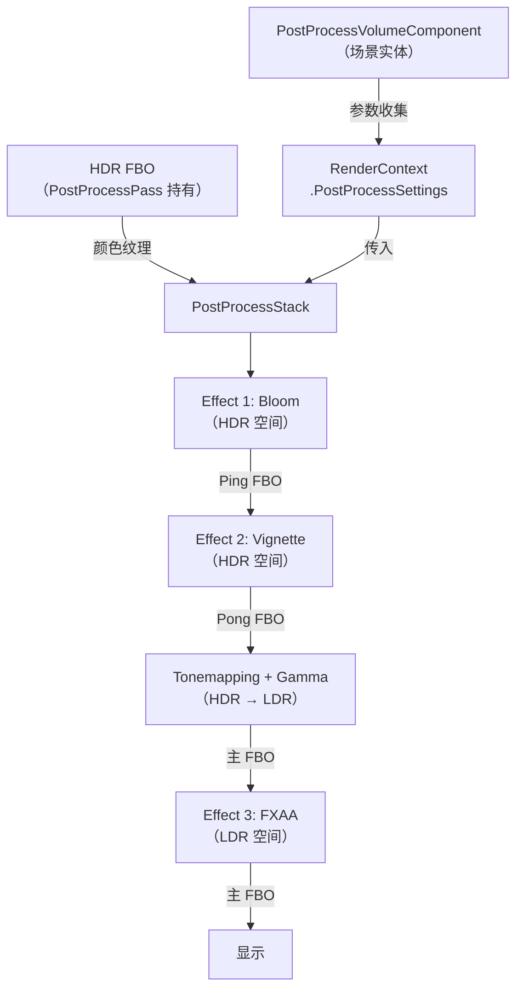
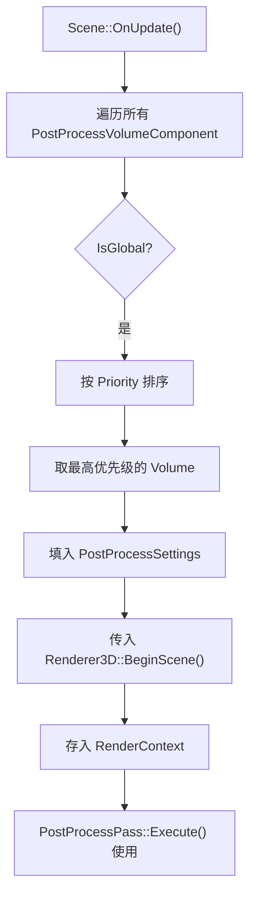

# Phase R6：后处理框架

> **文档版本**：v2.0  
> **创建日期**：2026-04-07  
> **更新日期**：2026-04-29  
> **优先级**：?? P2  
> **预计工作量**：4-5 天  
> **前置依赖**：Phase R5（HDR + Tonemapping）  
> **文档说明**：本文档详细描述如何在 R5 的 `PostProcessPass` 基础上构建可扩展的后处理框架，支持 Bloom、FXAA 等效果链，并通过场景层 `PostProcessVolumeComponent` 实现类似 Unity Volume 的控制方式。所有代码可直接对照实现。

---

## 目录

- [一、现状分析](#一现状分析)
- [二、改进目标](#二改进目标)
- [三、涉及的文件清单](#三涉及的文件清单)
- [四、后处理框架架构](#四后处理框架架构)
  - [4.1 整体架构](#41-整体架构)
  - [4.2 与 R5 PostProcessPass 的关系](#42-与-r5-postprocesspass-的关系)
  - [4.3 FBO Ping-Pong 机制](#43-fbo-ping-pong-机制)
  - [4.4 效果执行顺序](#44-效果执行顺序)
- [五、核心类设计](#五核心类设计)
  - [5.1 PostProcessEffect 基类](#51-postprocesseffect-基类)
  - [5.2 PostProcessStack 管理器](#52-postprocessstack-管理器)
  - [5.3 PostProcessPass 扩展](#53-postprocesspass-扩展)
- [六、场景层设计](#六场景层设计)
  - [6.1 PostProcessVolumeComponent](#61-postprocessvolumecomponent)
  - [6.2 参数收集流程](#62-参数收集流程)
  - [6.3 RenderContext 扩展](#63-rendercontext-扩展)
  - [6.4 序列化](#64-序列化)
  - [6.5 Inspector UI](#65-inspector-ui)
- [七、内置后处理效果](#七内置后处理效果)
  - [7.1 Bloom（泛光）](#71-bloom泛光)
  - [7.2 FXAA（快速抗锯齿）](#72-fxaa快速抗锯齿)
  - [7.3 Vignette（暗角）](#73-vignette暗角)
- [八、Bloom 详细实现](#八bloom-详细实现)
  - [8.1 Bloom 算法流程](#81-bloom-算法流程)
  - [8.2 亮度提取 Shader](#82-亮度提取-shader)
  - [8.3 高斯模糊 Shader](#83-高斯模糊-shader)
  - [8.4 Bloom 合成 Shader](#84-bloom-合成-shader)
  - [8.5 BloomEffect 类实现](#85-bloomeffect-类实现)
- [九、FXAA 详细实现](#九fxaa-详细实现)
  - [9.1 FXAA Shader](#91-fxaa-shader)
  - [9.2 FXAAEffect 类实现](#92-fxaaeffect-类实现)
- [十、渲染流程集成](#十渲染流程集成)
  - [10.1 完整渲染流程](#101-完整渲染流程)
  - [10.2 PostProcessPass 修改](#102-postprocesspass-修改)
  - [10.3 Renderer3D 修改](#103-renderer3d-修改)
  - [10.4 Scene 修改](#104-scene-修改)
- [十一、编辑器集成](#十一编辑器集成)
- [十二、验证方法](#十二验证方法)
- [十三、分步实施策略](#十三分步实施策略)
- [十四、设计决策记录](#十四设计决策记录)

---

## 一、现状分析

> **注意**：本节基于 R5 完成后的预期状态编写。

### R5 完成后的渲染管线

Phase R5 完成后，渲染管线已支持 HDR + Tonemapping：

```
SceneViewportPanel::OnUpdate
  → Framebuffer::Bind()（RGBA8 主 FBO）
  → Scene::OnUpdate()
      → Renderer3D::BeginScene()
      → Renderer3D::DrawMesh() × N
      → Renderer3D::EndScene()
          → Pipeline.ExecuteGroup("Shadow")         // ShadowPass → Shadow Map FBO
          → Pipeline.ExecuteGroup("Main")           // OpaquePass + PickingPass → HDR FBO
          → Pipeline.ExecuteGroup("PostProcess")    // PostProcessPass → 主 FBO（Tonemapping）
  → Renderer3D::RenderOutline()
      → Pipeline.ExecuteGroup("Outline")
  → Framebuffer::Unbind()
```

### R5 完成后的 PostProcessPass

| 属性 | 值 |
|------|-----|
| 类名 | `PostProcessPass` |
| 分组 | `"PostProcess"` |
| 持有 | HDR FBO（RGBA16F + RED_INTEGER + Depth） |
| 功能 | Tonemapping + Gamma 校正 + 深度 Blit（HDR FBO → 主 FBO，确保 Gizmo 遮挡正确） |
| 参数来源 | `RenderContext.Exposure` / `RenderContext.TonemapMode`（静态方法设置） |

> **补充说明**：
> - OpaquePass 在绑定 HDR FBO 后会将清屏颜色从 sRGB 空间转换到线性空间（`pow(color, 2.2)`），确保经过 Tonemapping + Gamma 校正后最终显示与用户设置一致。
> - PostProcessPass 在 Tonemapping 完成后会执行 `m_HDR_FBO->BlitDepthTo(context.TargetFramebuffer)`，将 HDR FBO 的深度缓冲区复制到主 FBO，使后续的 Gizmo 渲染能被场景物体正确遮挡。

### 当前问题

1. **Tonemapping 是唯一的后处理效果**，无法添加 Bloom、FXAA 等
2. **参数通过静态方法控制**（`Renderer3D::SetExposure()`），无法在场景中通过实体控制
3. **缺少效果链机制**，无法串联多个后处理效果

---

## 二、改进目标

1. **后处理效果链**：在 `PostProcessPass` 内部引入 `PostProcessStack`，支持多效果串联
2. **FBO Ping-Pong**：两个临时 FBO 交替使用，支持效果链中间结果传递
3. **内置效果**：Bloom、FXAA、Vignette
4. **场景层控制**：通过 `PostProcessVolumeComponent` 在场景中控制后处理参数（类似 Unity Volume）
5. **编辑器集成**：在 Inspector 中绘制 Volume 组件的后处理参数

---

## 三、涉及的文件清单

### 新建文件

| 文件路径 | 说明 |
|---------|------|
| `Lucky/Source/Lucky/Renderer/PostProcessEffect.h` | 后处理效果基类 |
| `Lucky/Source/Lucky/Renderer/PostProcessStack.h` | 后处理栈管理器头文件 |
| `Lucky/Source/Lucky/Renderer/PostProcessStack.cpp` | 后处理栈管理器实现 |
| `Lucky/Source/Lucky/Renderer/Effects/BloomEffect.h` | Bloom 效果 |
| `Lucky/Source/Lucky/Renderer/Effects/BloomEffect.cpp` | Bloom 实现 |
| `Lucky/Source/Lucky/Renderer/Effects/FXAAEffect.h` | FXAA 效果 |
| `Lucky/Source/Lucky/Renderer/Effects/FXAAEffect.cpp` | FXAA 实现 |
| `Lucky/Source/Lucky/Renderer/Effects/VignetteEffect.h` | Vignette 效果 |
| `Lucky/Source/Lucky/Renderer/Effects/VignetteEffect.cpp` | Vignette 实现 |
| `Lucky/Source/Lucky/Scene/Components/PostProcessVolumeComponent.h` | 后处理 Volume 组件 |
| `Luck3DApp/Assets/Shaders/Internal/PostProcess/Tonemapping.vert` | Tonemapping 顶点着色器（从 `Internal/Tonemapping/` 迁移） |
| `Luck3DApp/Assets/Shaders/Internal/PostProcess/Tonemapping.frag` | Tonemapping 片段着色器（从 `Internal/Tonemapping/` 迁移） |
| `Luck3DApp/Assets/Shaders/Internal/PostProcess/BrightExtract.vert` | 亮度提取顶点着色器（复用全屏 Quad） |
| `Luck3DApp/Assets/Shaders/Internal/PostProcess/BrightExtract.frag` | 亮度提取片段着色器 |
| `Luck3DApp/Assets/Shaders/Internal/PostProcess/GaussianBlur.vert` | 高斯模糊顶点着色器 |
| `Luck3DApp/Assets/Shaders/Internal/PostProcess/GaussianBlur.frag` | 高斯模糊片段着色器 |
| `Luck3DApp/Assets/Shaders/Internal/PostProcess/BloomComposite.vert` | Bloom 合成顶点着色器 |
| `Luck3DApp/Assets/Shaders/Internal/PostProcess/BloomComposite.frag` | Bloom 合成片段着色器 |
| `Luck3DApp/Assets/Shaders/Internal/PostProcess/FXAA.vert` | FXAA 顶点着色器 |
| `Luck3DApp/Assets/Shaders/Internal/PostProcess/FXAA.frag` | FXAA 片段着色器 |
| `Luck3DApp/Assets/Shaders/Internal/PostProcess/Vignette.vert` | Vignette 顶点着色器 |
| `Luck3DApp/Assets/Shaders/Internal/PostProcess/Vignette.frag` | Vignette 片段着色器 |

> **Shader 迁移说明**：R5 的 Tonemapping Shader 位于 `Internal/Tonemapping/` 目录下，R6 需要将其迁移到 `Internal/PostProcess/` 目录下，与其他后处理 Shader 统一管理。迁移后需同步修改 `Renderer3D::Init()` 中的加载路径，并删除旧的 `Internal/Tonemapping/` 目录。

> **路径说明**：所有后处理 Shader 放在 `Internal/PostProcess/` 目录下，因为它们是引擎内部 Shader，用户不应修改。

### 修改文件

| 文件路径 | 说明 |
|---------|------|
| `Lucky/Source/Lucky/Renderer/Passes/PostProcessPass.h` | 扩展：引入 PostProcessStack |
| `Lucky/Source/Lucky/Renderer/Passes/PostProcessPass.cpp` | 扩展：效果链执行逻辑 |
| `Lucky/Source/Lucky/Renderer/RenderContext.h` | 新增后处理参数字段 |
| `Lucky/Source/Lucky/Renderer/Renderer3D.h` | 扩展 `BeginScene` 签名；移除 R5 的 `SetExposure()`/`GetExposure()`/`SetTonemapMode()`/`GetTonemapMode()` 接口 |
| `Lucky/Source/Lucky/Renderer/Renderer3D.cpp` | 集成后处理框架；移除 `Renderer3DData` 中的 `Exposure`/`TonemapMode` 字段及对应方法实现；修改 Tonemapping Shader 加载路径 |
| `Lucky/Source/Lucky/Scene/Scene.cpp` | 收集 PostProcessVolumeComponent 参数 |
| `Lucky/Source/Lucky/Scene/Components/Components.h` | 包含新组件头文件 |
| `Lucky/Source/Lucky/Serialization/SceneSerializer.cpp` | 序列化 Volume 组件 |
| `Luck3DApp/Source/Panels/InspectorPanel.cpp` | 绘制 Volume 组件 UI |
| `Luck3DApp/Source/Panels/SceneHierarchyPanel.cpp` | 添加创建 Volume 实体菜单 |

### 无需修改的文件

| 文件路径 | 说明 |
|---------|------|
| `Lucky/Source/Lucky/Renderer/ScreenQuad.h/.cpp` | ? 已完成，后处理效果复用 |
| `Lucky/Source/Lucky/Renderer/RenderPipeline.h/.cpp` | ? 分组执行机制已完成 |
| `Lucky/Source/Lucky/Renderer/RenderPass.h` | ? Pass 基类已完成 |
| `Lucky/Source/Lucky/Renderer/Framebuffer.h/.cpp` | ? RGBA16F + `BlitDepthTo()` 已在 R5 中添加 |

---

## 四、后处理框架架构

### 4.1 整体架构



### 4.2 与 R5 PostProcessPass 的关系

R5 的 `PostProcessPass` 是 R6 的基础。R6 的改动是**内部扩展**，不改变外部接口：

| 属性 | R5 | R6 |
|------|----|----|
| 类名 | `PostProcessPass` | `PostProcessPass`（不变） |
| 分组 | `"PostProcess"` | `"PostProcess"`（不变） |
| 持有 | HDR FBO | HDR FBO + `PostProcessStack` + Ping-Pong FBO |
| Execute 逻辑 | 直接 Tonemapping | 效果链 → Tonemapping → FXAA |
| 参数来源 | `RenderContext.Exposure` / `TonemapMode` | `RenderContext.PostProcessSettings`（扩展） |

```
R5 PostProcessPass::Execute():
  1. 绑定主 FBO
  2. Tonemapping Shader（HDR → LDR + Gamma）
  3. ScreenQuad::Draw()

R6 PostProcessPass::Execute():
  1. PostProcessStack.Execute()（HDR 空间效果链：Bloom → Vignette → ...）
  2. 绑定主 FBO
  3. Tonemapping Shader（HDR → LDR + Gamma）
  4. FXAA（LDR 空间，可选）
  5. ScreenQuad::Draw()
```

### 4.3 FBO Ping-Pong 机制

```
两个临时 FBO（Ping 和 Pong）交替使用，由 PostProcessStack 管理：

初始输入：HDR FBO 颜色纹理

Effect 1（Bloom）：读取 HDR 纹理 → 写入 Ping FBO
Effect 2（Vignette）：读取 Ping FBO → 写入 Pong FBO
Effect 3：读取 Pong FBO → 写入 Ping FBO
...

最终：PostProcessStack 返回最后一个 FBO 的纹理 ID
→ PostProcessPass 用此纹理执行 Tonemapping → 主 FBO
```

> **注意**：如果没有启用任何 HDR 空间效果，`PostProcessStack.Execute()` 直接返回 HDR FBO 的原始纹理 ID，不产生额外开销。

### 4.4 效果执行顺序

| 顺序 | 效果 | 空间 | 说明 |
|------|------|------|------|
| 1 | Bloom | HDR | 需要 HDR 亮度信息提取高亮区域 |
| 2 | Vignette | HDR | 在 HDR 空间应用暗角 |
| 3 | **Tonemapping** | HDR → LDR | 色调映射 + Gamma 校正（内置于 PostProcessPass，不在 Stack 中） |
| 4 | FXAA | LDR | 基于亮度对比度检测边缘，需要在 LDR 空间 |

> **关键设计**：Tonemapping 不是 `PostProcessEffect`，而是 `PostProcessPass` 的内置步骤。这是因为 Tonemapping 是 HDR/LDR 的分界线，它的位置是固定的（所有 HDR 效果之后、所有 LDR 效果之前），不应被用户重排序。

---

## 五、核心类设计

### 5.1 PostProcessEffect 基类

```cpp
// Lucky/Source/Lucky/Renderer/PostProcessEffect.h
#pragma once

#include "Lucky/Core/Base.h"
#include "Framebuffer.h"
#include "Shader.h"

namespace Lucky
{
    /// <summary>
    /// 后处理效果执行空间
    /// </summary>
    enum class PostProcessSpace
    {
        HDR,    // 在 Tonemapping 之前执行（HDR 空间）
        LDR     // 在 Tonemapping 之后执行（LDR 空间）
    };

    /// <summary>
    /// 后处理效果基类
    /// 所有后处理效果都继承此类
    /// </summary>
    class PostProcessEffect
    {
    public:
        virtual ~PostProcessEffect() = default;

        /// <summary>
        /// 初始化效果（加载 Shader、创建 FBO 等）
        /// </summary>
        virtual void Init() = 0;

        /// <summary>
        /// 执行后处理效果
        /// </summary>
        /// <param name="sourceTexture">输入纹理 ID</param>
        /// <param name="destFBO">输出 FBO</param>
        /// <param name="width">视口宽度</param>
        /// <param name="height">视口高度</param>
        virtual void Execute(uint32_t sourceTexture, Ref<Framebuffer> destFBO,
                             uint32_t width, uint32_t height) = 0;

        /// <summary>
        /// 调整大小（视口变化时调用）
        /// </summary>
        virtual void Resize(uint32_t width, uint32_t height) {}

        /// <summary>
        /// 获取效果名称
        /// </summary>
        virtual const std::string& GetName() const = 0;

        /// <summary>
        /// 获取效果执行空间
        /// </summary>
        virtual PostProcessSpace GetSpace() const = 0;

        bool Enabled = true;   // 是否启用
        int Order = 0;         // 执行顺序（越小越先执行）
    };
}
```

### 5.2 PostProcessStack 管理器

```cpp
// Lucky/Source/Lucky/Renderer/PostProcessStack.h
#pragma once

#include "PostProcessEffect.h"

namespace Lucky
{
    /// <summary>
    /// 后处理栈：管理和执行所有后处理效果
    /// 由 PostProcessPass 持有，负责效果链的管理和 Ping-Pong FBO 的执行
    /// </summary>
    class PostProcessStack
    {
    public:
        /// <summary>
        /// 初始化后处理栈（创建 Ping-Pong FBO）
        /// </summary>
        /// <param name="width">视口宽度</param>
        /// <param name="height">视口高度</param>
        void Init(uint32_t width, uint32_t height);

        /// <summary>
        /// 释放资源
        /// </summary>
        void Shutdown();

        /// <summary>
        /// 添加后处理效果
        /// </summary>
        /// <param name="effect">后处理效果</param>
        void AddEffect(Ref<PostProcessEffect> effect);

        /// <summary>
        /// 移除后处理效果
        /// </summary>
        /// <param name="name">效果名称</param>
        void RemoveEffect(const std::string& name);

        /// <summary>
        /// 获取指定类型的后处理效果
        /// </summary>
        template<typename T>
        Ref<T> GetEffect() const
        {
            for (const auto& effect : m_Effects)
            {
                auto casted = std::dynamic_pointer_cast<T>(effect);
                if (casted)
                {
                    return casted;
                }
            }
            return nullptr;
        }

        /// <summary>
        /// 执行指定空间的所有启用效果
        /// </summary>
        /// <param name="sourceTexture">输入纹理 ID</param>
        /// <param name="space">执行空间（HDR 或 LDR）</param>
        /// <param name="width">视口宽度</param>
        /// <param name="height">视口高度</param>
        /// <returns>最终输出纹理 ID</returns>
        uint32_t Execute(uint32_t sourceTexture, PostProcessSpace space,
                         uint32_t width, uint32_t height);

        /// <summary>
        /// 调整大小
        /// </summary>
        /// <param name="width">视口宽度</param>
        /// <param name="height">视口高度</param>
        void Resize(uint32_t width, uint32_t height);

        /// <summary>
        /// 获取所有效果列表
        /// </summary>
        const std::vector<Ref<PostProcessEffect>>& GetEffects() const { return m_Effects; }

    private:
        std::vector<Ref<PostProcessEffect>> m_Effects;
        Ref<Framebuffer> m_PingFBO;     // Ping-Pong FBO A（RGBA16F）
        Ref<Framebuffer> m_PongFBO;     // Ping-Pong FBO B（RGBA16F）
    };
}
```

```cpp
// Lucky/Source/Lucky/Renderer/PostProcessStack.cpp
#include "lcpch.h"
#include "PostProcessStack.h"

#include <algorithm>

namespace Lucky
{
    void PostProcessStack::Init(uint32_t width, uint32_t height)
    {
        FramebufferSpecification spec;
        spec.Width = width;
        spec.Height = height;
        spec.Attachments = { FramebufferTextureFormat::RGBA16F };

        m_PingFBO = Framebuffer::Create(spec);
        m_PongFBO = Framebuffer::Create(spec);

        // 初始化所有效果
        for (auto& effect : m_Effects)
        {
            effect->Init();
        }
    }

    void PostProcessStack::Shutdown()
    {
        m_Effects.clear();
        m_PingFBO.reset();
        m_PongFBO.reset();
    }

    void PostProcessStack::AddEffect(Ref<PostProcessEffect> effect)
    {
        m_Effects.push_back(effect);
    }

    void PostProcessStack::RemoveEffect(const std::string& name)
    {
        m_Effects.erase(
            std::remove_if(m_Effects.begin(), m_Effects.end(),
                [&name](const auto& effect) { return effect->GetName() == name; }),
            m_Effects.end()
        );
    }

    uint32_t PostProcessStack::Execute(uint32_t sourceTexture, PostProcessSpace space,
                                       uint32_t width, uint32_t height)
    {
        // 收集指定空间的启用效果，并按 Order 排序
        std::vector<Ref<PostProcessEffect>> activeEffects;
        for (auto& effect : m_Effects)
        {
            if (effect->Enabled && effect->GetSpace() == space)
            {
                activeEffects.push_back(effect);
            }
        }

        std::sort(activeEffects.begin(), activeEffects.end(),
            [](const auto& a, const auto& b) { return a->Order < b->Order; });

        // 如果没有启用的效果，直接返回原始纹理
        if (activeEffects.empty())
        {
            return sourceTexture;
        }

        // Ping-Pong 执行
        uint32_t currentTexture = sourceTexture;
        bool usePing = true;

        for (auto& effect : activeEffects)
        {
            Ref<Framebuffer> destFBO = usePing ? m_PingFBO : m_PongFBO;

            effect->Execute(currentTexture, destFBO, width, height);

            currentTexture = destFBO->GetColorAttachmentRendererID(0);
            usePing = !usePing;
        }

        return currentTexture;
    }

    void PostProcessStack::Resize(uint32_t width, uint32_t height)
    {
        if (m_PingFBO)
        {
            m_PingFBO->Resize(width, height);
        }
        if (m_PongFBO)
        {
            m_PongFBO->Resize(width, height);
        }

        for (auto& effect : m_Effects)
        {
            effect->Resize(width, height);
        }
    }
}
```

### 5.3 PostProcessPass 扩展

R6 对 R5 的 `PostProcessPass` 进行内部扩展，新增 `PostProcessStack` 成员：

```cpp
// Lucky/Source/Lucky/Renderer/Passes/PostProcessPass.h（R6 扩展）
#pragma once

#include "Lucky/Renderer/RenderPass.h"
#include "Lucky/Renderer/Framebuffer.h"
#include "Lucky/Renderer/Shader.h"
#include "Lucky/Renderer/PostProcessStack.h"

namespace Lucky
{
    /// <summary>
    /// 后处理 Pass
    /// 持有 HDR FBO + PostProcessStack，执行完整的后处理管线：
    /// HDR 效果链 → Tonemapping → LDR 效果链
    /// 属于 "PostProcess" 分组，在 Main 分组之后执行
    /// </summary>
    class PostProcessPass : public RenderPass
    {
    public:
        void Init() override;
        void Execute(const RenderContext& context) override;
        void Resize(uint32_t width, uint32_t height) override;

        const std::string& GetName() const override
        {
            static std::string name = "PostProcessPass";
            return name;
        }

        const std::string& GetGroup() const override
        {
            static std::string group = "PostProcess";
            return group;
        }

        /// <summary>
        /// 获取 HDR FBO（供 OpaquePass 等 Main 分组 Pass 作为渲染目标）
        /// </summary>
        const Ref<Framebuffer>& GetHDR_FBO() const { return m_HDR_FBO; }

        /// <summary>
        /// 获取 HDR 颜色纹理 ID
        /// </summary>
        uint32_t GetHDRColorTextureID() const;

        /// <summary>
        /// 获取后处理栈（供外部添加/配置效果）
        /// </summary>
        PostProcessStack& GetPostProcessStack() { return m_PostProcessStack; }

    private:
        Ref<Framebuffer> m_HDR_FBO;             // HDR 渲染目标（RGBA16F + RED_INTEGER + Depth）
        Ref<Shader> m_TonemappingShader;        // Tonemapping 着色器
        PostProcessStack m_PostProcessStack;    // 后处理效果栈（R6 新增）
    };
}
```

```cpp
// Lucky/Source/Lucky/Renderer/Passes/PostProcessPass.cpp（R6 扩展）
#include "lcpch.h"
#include "PostProcessPass.h"

#include "Lucky/Renderer/RenderContext.h"
#include "Lucky/Renderer/RenderCommand.h"
#include "Lucky/Renderer/ScreenQuad.h"
#include "Lucky/Renderer/Renderer3D.h"

namespace Lucky
{
    void PostProcessPass::Init()
    {
        // 创建 HDR FBO（与 R5 相同）
        FramebufferSpecification hdrSpec;
        hdrSpec.Width = 1280;
        hdrSpec.Height = 720;
        hdrSpec.Attachments = {
            FramebufferTextureFormat::RGBA16F,
            FramebufferTextureFormat::RED_INTEGER,
            FramebufferTextureFormat::DEFPTH24STENCIL8
        };
        m_HDR_FBO = Framebuffer::Create(hdrSpec);

        // 加载 Tonemapping Shader
        m_TonemappingShader = Renderer3D::GetShaderLibrary()->Get("Tonemapping");

        // 初始化后处理栈（R6 新增）
        m_PostProcessStack.Init(1280, 720);
    }

    void PostProcessPass::Execute(const RenderContext& context)
    {
        uint32_t width = m_HDR_FBO->GetSpecification().Width;
        uint32_t height = m_HDR_FBO->GetSpecification().Height;

        // ---- 1. 执行 HDR 空间效果链（Bloom、Vignette 等） ----
        uint32_t processedTexture = m_PostProcessStack.Execute(
            GetHDRColorTextureID(), PostProcessSpace::HDR, width, height);

        // ---- 2. Tonemapping（HDR → LDR） ----
        // 绑定主 FBO 作为 Tonemapping 输出目标
        if (context.TargetFramebuffer)
        {
            context.TargetFramebuffer->Bind();
        }

        RenderCommand::SetDepthTest(false);
        RenderCommand::SetDepthWrite(false);

        m_TonemappingShader->Bind();
        m_TonemappingShader->SetFloat("u_Exposure", context.PostProcessSettings.Exposure);
        m_TonemappingShader->SetInt("u_TonemapMode", static_cast<int>(context.PostProcessSettings.Tonemap));

        RenderCommand::BindTextureUnit(0, processedTexture);
        m_TonemappingShader->SetInt("u_HDRTexture", 0);

        ScreenQuad::Draw();

        // ---- 3. 执行 LDR 空间效果链（FXAA 等） ----
        // TODO R6 实现：LDR 效果需要额外的 FBO 处理
        // uint32_t ldrTexture = context.TargetFramebuffer->GetColorAttachmentRendererID(0);
        // m_PostProcessStack.Execute(ldrTexture, PostProcessSpace::LDR, width, height);

        // 恢复深度测试状态
        RenderCommand::SetDepthTest(true);
        RenderCommand::SetDepthWrite(true);

        // 将 HDR FBO 的深度缓冲区 Blit 到主 FBO（使 Gizmo 能被场景物体正确遮挡）
        if (m_HDR_FBO && context.TargetFramebuffer)
        {
            m_HDR_FBO->BlitDepthTo(context.TargetFramebuffer);
        }
    }

    void PostProcessPass::Resize(uint32_t width, uint32_t height)
    {
        if (m_HDR_FBO)
        {
            m_HDR_FBO->Resize(width, height);
        }

        // 同步调整后处理栈的 FBO 大小
        m_PostProcessStack.Resize(width, height);
    }

    uint32_t PostProcessPass::GetHDRColorTextureID() const
    {
        return m_HDR_FBO->GetColorAttachmentRendererID(0);
    }
}
```

---

## 六、场景层设计

### 6.1 PostProcessVolumeComponent

类似 Unity 的 Volume 组件，通过场景实体控制后处理参数：

```cpp
// Lucky/Source/Lucky/Scene/Components/PostProcessVolumeComponent.h
#pragma once

#include <glm/glm.hpp>

namespace Lucky
{
    /// <summary>
    /// 后处理 Volume 组件
    /// 挂载到场景实体上，控制后处理效果的参数
    /// 类似 Unity 的 Volume 组件
    /// </summary>
    struct PostProcessVolumeComponent
    {
        // ---- Volume 设置 ----
        bool IsGlobal = true;       // 是否全局生效（当前仅支持 Global）
        float Priority = 0.0f;      // 优先级（多 Volume 时使用，值越大优先级越高）

    // ---- Tonemapping 参数 ----
        TonemapMode Tonemap = TonemapMode::ACES;  // Tonemapping 模式
        float Exposure = 1.0f;                     // 曝光值

        // ---- Bloom 参数 ----
        bool BloomEnabled = false;      // 是否启用 Bloom
        float BloomThreshold = 1.0f;    // 亮度阈值
        float BloomIntensity = 1.0f;    // 泛光强度
        int BloomIterations = 5;        // 模糊迭代次数

        // ---- FXAA 参数 ----
        bool FXAAEnabled = false;       // 是否启用 FXAA

        // ---- Vignette 参数 ----
        bool VignetteEnabled = false;       // 是否启用暗角
        float VignetteIntensity = 0.5f;     // 暗角强度
        float VignetteSmoothness = 2.0f;    // 暗角平滑度

        PostProcessVolumeComponent() = default;
        PostProcessVolumeComponent(const PostProcessVolumeComponent& other) = default;
    };
}
```

### 6.2 参数收集流程



```cpp
// Scene::OnUpdate() 中收集后处理参数
PostProcessSettings postProcessSettings;

auto volumeView = m_Registry.view<PostProcessVolumeComponent>();
float highestPriority = -FLT_MAX;

for (auto entity : volumeView)
{
    auto& volume = volumeView.get<PostProcessVolumeComponent>(entity);

    if (volume.IsGlobal && volume.Priority > highestPriority)
    {
        highestPriority = volume.Priority;

        // 填充后处理参数
        postProcessSettings.Tonemap = volume.Tonemap;
        postProcessSettings.Exposure = volume.Exposure;
        postProcessSettings.BloomEnabled = volume.BloomEnabled;
        postProcessSettings.BloomThreshold = volume.BloomThreshold;
        postProcessSettings.BloomIntensity = volume.BloomIntensity;
        postProcessSettings.BloomIterations = volume.BloomIterations;
        postProcessSettings.FXAAEnabled = volume.FXAAEnabled;
        postProcessSettings.VignetteEnabled = volume.VignetteEnabled;
        postProcessSettings.VignetteIntensity = volume.VignetteIntensity;
        postProcessSettings.VignetteSmoothness = volume.VignetteSmoothness;
    }
}

// 传入 BeginScene
Renderer3D::BeginScene(camera, sceneLightData, postProcessSettings);
```

### 6.3 RenderContext 扩展

```cpp
// Lucky/Source/Lucky/Renderer/RenderContext.h 新增

/// <summary>
/// Tonemapping 模式枚举
/// </summary>
enum class TonemapMode
{
    Reinhard = 0,       // Reinhard
    ACES = 1,           // ACES Filmic（默认）
    Uncharted2 = 2      // Uncharted 2
};

/// <summary>
/// 后处理参数（从 PostProcessVolumeComponent 收集）
/// </summary>
struct PostProcessSettings
{
    // Tonemapping
    TonemapMode Tonemap = TonemapMode::ACES;  // 默认 ACES
    float Exposure = 1.0f;

    // Bloom
    bool BloomEnabled = false;
    float BloomThreshold = 1.0f;
    float BloomIntensity = 1.0f;
    int BloomIterations = 5;

    // FXAA
    bool FXAAEnabled = false;

    // Vignette
    bool VignetteEnabled = false;
    float VignetteIntensity = 0.5f;
    float VignetteSmoothness = 2.0f;
};

struct RenderContext
{
    // ... 已有字段 ...

    // ---- 后处理参数（R6 新增，替代 R5 的 Exposure / TonemapMode） ----
    PostProcessSettings PostProcessSettings;
};
```

> **注意**：R6 的 `PostProcessSettings` 替代了 R5 的 `RenderContext.Exposure` 和 `RenderContext.TonemapMode`。实施时需要：
> 1. **移除** `RenderContext` 中的 `float Exposure` 和 `int TonemapMode` 字段
> 2. **移除** `Renderer3D` 中的 `SetExposure()`/`GetExposure()`/`SetTonemapMode()`/`GetTonemapMode()` 四个接口（声明 + 实现）
> 3. **移除** `Renderer3DData` 中的 `float Exposure` 和 `int TonemapMode` 字段
> 4. **移除** `EndScene()` 中的 `context.Exposure = s_Data.Exposure;` 和 `context.TonemapMode = s_Data.TonemapMode;` 赋值
>
> 以上字段和接口在 R5 中**没有任何外部调用者**（完全是死代码），移除不会影响任何功能。

### 6.4 序列化

```cpp
// SceneSerializer.cpp 中新增 PostProcessVolumeComponent 序列化

// ---- 序列化 ----
if (entity.HasComponent<PostProcessVolumeComponent>())
{
    auto& volume = entity.GetComponent<PostProcessVolumeComponent>();
    out << YAML::Key << "PostProcessVolumeComponent";
    out << YAML::BeginMap;
    out << YAML::Key << "IsGlobal" << YAML::Value << volume.IsGlobal;
    out << YAML::Key << "Priority" << YAML::Value << volume.Priority;
    out << YAML::Key << "TonemapMode" << YAML::Value << static_cast<int>(volume.Tonemap);
    out << YAML::Key << "Exposure" << YAML::Value << volume.Exposure;
    out << YAML::Key << "BloomEnabled" << YAML::Value << volume.BloomEnabled;
    out << YAML::Key << "BloomThreshold" << YAML::Value << volume.BloomThreshold;
    out << YAML::Key << "BloomIntensity" << YAML::Value << volume.BloomIntensity;
    out << YAML::Key << "BloomIterations" << YAML::Value << volume.BloomIterations;
    out << YAML::Key << "FXAAEnabled" << YAML::Value << volume.FXAAEnabled;
    out << YAML::Key << "VignetteEnabled" << YAML::Value << volume.VignetteEnabled;
    out << YAML::Key << "VignetteIntensity" << YAML::Value << volume.VignetteIntensity;
    out << YAML::Key << "VignetteSmoothness" << YAML::Value << volume.VignetteSmoothness;
    out << YAML::EndMap;
}

// ---- 反序列化 ----
auto postProcessVolumeNode = entity["PostProcessVolumeComponent"];
if (postProcessVolumeNode)
{
    auto& volume = deserializedEntity.AddComponent<PostProcessVolumeComponent>();
    volume.IsGlobal = postProcessVolumeNode["IsGlobal"].as<bool>();
    volume.Priority = postProcessVolumeNode["Priority"].as<float>();
    volume.Tonemap = static_cast<TonemapMode>(postProcessVolumeNode["TonemapMode"].as<int>());
    volume.Exposure = postProcessVolumeNode["Exposure"].as<float>();
    volume.BloomEnabled = postProcessVolumeNode["BloomEnabled"].as<bool>();
    volume.BloomThreshold = postProcessVolumeNode["BloomThreshold"].as<float>();
    volume.BloomIntensity = postProcessVolumeNode["BloomIntensity"].as<float>();
    volume.BloomIterations = postProcessVolumeNode["BloomIterations"].as<int>();
    volume.FXAAEnabled = postProcessVolumeNode["FXAAEnabled"].as<bool>();
    volume.VignetteEnabled = postProcessVolumeNode["VignetteEnabled"].as<bool>();
    volume.VignetteIntensity = postProcessVolumeNode["VignetteIntensity"].as<float>();
    volume.VignetteSmoothness = postProcessVolumeNode["VignetteSmoothness"].as<float>();
}
```

### 6.5 Inspector UI

```cpp
// InspectorPanel.cpp 中新增 PostProcessVolumeComponent 绘制

DrawComponent<PostProcessVolumeComponent>("Post Process Volume", entity, [](auto& volume)
{
    ImGui::Checkbox("Is Global", &volume.IsGlobal);
    ImGui::DragFloat("Priority", &volume.Priority, 0.1f);

    ImGui::Separator();
    ImGui::Text("Tonemapping");

    const char* tonemapModes[] = { "Reinhard", "ACES Filmic", "Uncharted 2" };
    int tonemapIndex = static_cast<int>(volume.Tonemap);
    if (ImGui::Combo("Tonemap Mode", &tonemapIndex, tonemapModes, IM_ARRAYSIZE(tonemapModes)))
    {
        volume.Tonemap = static_cast<TonemapMode>(tonemapIndex);
    }
    ImGui::DragFloat("Exposure", &volume.Exposure, 0.01f, 0.01f, 10.0f, "%.2f");

    ImGui::Separator();
    ImGui::Text("Bloom");

    ImGui::Checkbox("Bloom Enabled", &volume.BloomEnabled);
    if (volume.BloomEnabled)
    {
        ImGui::DragFloat("Bloom Threshold", &volume.BloomThreshold, 0.1f, 0.0f, 10.0f);
        ImGui::DragFloat("Bloom Intensity", &volume.BloomIntensity, 0.1f, 0.0f, 5.0f);
        ImGui::SliderInt("Bloom Iterations", &volume.BloomIterations, 1, 10);
    }

    ImGui::Separator();
    ImGui::Text("FXAA");

    ImGui::Checkbox("FXAA Enabled", &volume.FXAAEnabled);

    ImGui::Separator();
    ImGui::Text("Vignette");

    ImGui::Checkbox("Vignette Enabled", &volume.VignetteEnabled);
    if (volume.VignetteEnabled)
    {
        ImGui::DragFloat("Vignette Intensity", &volume.VignetteIntensity, 0.01f, 0.0f, 1.0f);
        ImGui::DragFloat("Vignette Smoothness", &volume.VignetteSmoothness, 0.1f, 0.0f, 10.0f);
    }
});
```

---

## 七、内置后处理效果

### 7.1 Bloom（泛光）

| 参数 | 类型 | 默认值 | 说明 |
|------|------|--------|------|
| Threshold | float | 1.0 | 亮度阈值（超过此值的像素产生泛光） |
| Intensity | float | 1.0 | 泛光强度 |
| Iterations | int | 5 | 模糊迭代次数 |

### 7.2 FXAA（快速抗锯齿）

| 参数 | 类型 | 默认值 | 说明 |
|------|------|--------|------|
| 无参数 | - | - | FXAA 3.11 Quality |

### 7.3 Vignette（暗角）

| 参数 | 类型 | 默认值 | 说明 |
|------|------|--------|------|
| Intensity | float | 0.5 | 暗角强度 |
| Smoothness | float | 2.0 | 暗角平滑度 |

---

## 八、Bloom 详细实现

### 8.1 Bloom 算法流程

```
1. 亮度提取（Bright Extract）
   - 从 HDR 纹理中提取亮度超过阈值的像素
   - 输出到半分辨率 FBO

2. 高斯模糊（Gaussian Blur）
   - 对提取的亮度图进行多次高斯模糊
   - 使用两 Pass 分离式模糊（水平 + 垂直）

3. 合成（Composite）
   - 将模糊后的泛光图与原始 HDR 图像叠加
```

### 8.2 亮度提取 Shader

```glsl
// Internal/PostProcess/BrightExtract.frag
#version 450 core

layout(location = 0) out vec4 o_Color;

in vec2 v_TexCoord;

uniform sampler2D u_SourceTexture;
uniform float u_Threshold;

void main()
{
    vec3 color = texture(u_SourceTexture, v_TexCoord).rgb;

    // 计算亮度
    float brightness = dot(color, vec3(0.2126, 0.7152, 0.0722));

    // 软阈值（避免硬截断）
    float softThreshold = brightness - u_Threshold;
    softThreshold = clamp(softThreshold, 0.0, 1.0);

    o_Color = vec4(color * softThreshold, 1.0);
}
```

### 8.3 高斯模糊 Shader

```glsl
// Internal/PostProcess/GaussianBlur.frag
#version 450 core

layout(location = 0) out vec4 o_Color;

in vec2 v_TexCoord;

uniform sampler2D u_SourceTexture;
uniform bool u_Horizontal;     // true = 水平模糊, false = 垂直模糊

// 9-tap 高斯权重
const float weights[5] = float[](0.227027, 0.1945946, 0.1216216, 0.054054, 0.016216);

void main()
{
    vec2 texelSize = 1.0 / textureSize(u_SourceTexture, 0);
    vec3 result = texture(u_SourceTexture, v_TexCoord).rgb * weights[0];

    if (u_Horizontal)
    {
        for (int i = 1; i < 5; ++i)
        {
            result += texture(u_SourceTexture, v_TexCoord + vec2(texelSize.x * i, 0.0)).rgb * weights[i];
            result += texture(u_SourceTexture, v_TexCoord - vec2(texelSize.x * i, 0.0)).rgb * weights[i];
        }
    }
    else
    {
        for (int i = 1; i < 5; ++i)
        {
            result += texture(u_SourceTexture, v_TexCoord + vec2(0.0, texelSize.y * i)).rgb * weights[i];
            result += texture(u_SourceTexture, v_TexCoord - vec2(0.0, texelSize.y * i)).rgb * weights[i];
        }
    }

    o_Color = vec4(result, 1.0);
}
```

### 8.4 Bloom 合成 Shader

```glsl
// Internal/PostProcess/BloomComposite.frag
#version 450 core

layout(location = 0) out vec4 o_Color;

in vec2 v_TexCoord;

uniform sampler2D u_SourceTexture;  // 原始 HDR 纹理
uniform sampler2D u_BloomTexture;   // 模糊后的泛光纹理
uniform float u_BloomIntensity;

void main()
{
    vec3 hdrColor = texture(u_SourceTexture, v_TexCoord).rgb;
    vec3 bloomColor = texture(u_BloomTexture, v_TexCoord).rgb;

    // 叠加泛光
    vec3 result = hdrColor + bloomColor * u_BloomIntensity;

    o_Color = vec4(result, 1.0);
}
```

### 8.5 BloomEffect 类实现

```cpp
// Lucky/Source/Lucky/Renderer/Effects/BloomEffect.h
#pragma once

#include "Lucky/Renderer/PostProcessEffect.h"

namespace Lucky
{
    /// <summary>
    /// Bloom 泛光效果
    /// 在 HDR 空间执行，提取高亮区域并模糊叠加
    /// </summary>
    class BloomEffect : public PostProcessEffect
    {
    public:
        float Threshold = 1.0f;     // 亮度阈值
        float Intensity = 1.0f;     // 泛光强度
        int Iterations = 5;         // 模糊迭代次数

        void Init() override;
        void Execute(uint32_t sourceTexture, Ref<Framebuffer> destFBO,
                     uint32_t width, uint32_t height) override;
        void Resize(uint32_t width, uint32_t height) override;

        const std::string& GetName() const override
        {
            static std::string name = "Bloom";
            return name;
        }

        PostProcessSpace GetSpace() const override { return PostProcessSpace::HDR; }

    private:
        Ref<Shader> m_BrightExtractShader;
        Ref<Shader> m_GaussianBlurShader;
        Ref<Shader> m_CompositeShader;
        Ref<Framebuffer> m_BrightFBO;       // 亮度提取 FBO
        Ref<Framebuffer> m_BlurPingFBO;     // 模糊 Ping FBO
        Ref<Framebuffer> m_BlurPongFBO;     // 模糊 Pong FBO
    };
}
```

---

## 九、FXAA 详细实现

### 9.1 FXAA Shader

```glsl
// Internal/PostProcess/FXAA.frag
#version 450 core

layout(location = 0) out vec4 o_Color;

in vec2 v_TexCoord;

uniform sampler2D u_SourceTexture;

// FXAA 3.11 Quality（简化版）
void main()
{
    vec2 texelSize = 1.0 / textureSize(u_SourceTexture, 0);

    // 采样周围像素的亮度
    float lumCenter = dot(texture(u_SourceTexture, v_TexCoord).rgb, vec3(0.299, 0.587, 0.114));
    float lumUp     = dot(texture(u_SourceTexture, v_TexCoord + vec2(0, texelSize.y)).rgb, vec3(0.299, 0.587, 0.114));
    float lumDown   = dot(texture(u_SourceTexture, v_TexCoord - vec2(0, texelSize.y)).rgb, vec3(0.299, 0.587, 0.114));
    float lumLeft   = dot(texture(u_SourceTexture, v_TexCoord - vec2(texelSize.x, 0)).rgb, vec3(0.299, 0.587, 0.114));
    float lumRight  = dot(texture(u_SourceTexture, v_TexCoord + vec2(texelSize.x, 0)).rgb, vec3(0.299, 0.587, 0.114));

    float lumMin = min(lumCenter, min(min(lumUp, lumDown), min(lumLeft, lumRight)));
    float lumMax = max(lumCenter, max(max(lumUp, lumDown), max(lumLeft, lumRight)));
    float lumRange = lumMax - lumMin;

    // 如果对比度太低，不进行抗锯齿
    if (lumRange < max(0.0312, lumMax * 0.125))
    {
        o_Color = texture(u_SourceTexture, v_TexCoord);
        return;
    }

    // 计算边缘方向
    float lumUpDown = lumUp + lumDown;
    float lumLeftRight = lumLeft + lumRight;

    bool isHorizontal = abs(-2.0 * lumCenter + lumUpDown) >= abs(-2.0 * lumCenter + lumLeftRight);

    float stepLength = isHorizontal ? texelSize.y : texelSize.x;
    float lum1 = isHorizontal ? lumUp : lumLeft;
    float lum2 = isHorizontal ? lumDown : lumRight;

    float gradient1 = abs(lum1 - lumCenter);
    float gradient2 = abs(lum2 - lumCenter);

    bool is1Steepest = gradient1 >= gradient2;

    // 沿边缘方向偏移采样
    float lumaLocalAverage = 0.0;
    if (is1Steepest)
    {
        stepLength = -stepLength;
        lumaLocalAverage = 0.5 * (lum1 + lumCenter);
    }
    else
    {
        lumaLocalAverage = 0.5 * (lum2 + lumCenter);
    }

    vec2 currentUV = v_TexCoord;
    if (isHorizontal)
    {
        currentUV.y += stepLength * 0.5;
    }
    else
    {
        currentUV.x += stepLength * 0.5;
    }

    o_Color = texture(u_SourceTexture, currentUV);
}
```

> **注意**：上述是 FXAA 的简化实现。完整的 FXAA 3.11 Quality 需要更多的边缘搜索步骤。可以参考 Timothy Lottes 的原始实现。

### 9.2 FXAAEffect 类实现

```cpp
// Lucky/Source/Lucky/Renderer/Effects/FXAAEffect.h
#pragma once

#include "Lucky/Renderer/PostProcessEffect.h"

namespace Lucky
{
    /// <summary>
    /// FXAA 快速抗锯齿效果
    /// 在 LDR 空间执行（Tonemapping 之后）
    /// </summary>
    class FXAAEffect : public PostProcessEffect
    {
    public:
        void Init() override;
        void Execute(uint32_t sourceTexture, Ref<Framebuffer> destFBO,
                     uint32_t width, uint32_t height) override;

        const std::string& GetName() const override
        {
            static std::string name = "FXAA";
            return name;
        }

        PostProcessSpace GetSpace() const override { return PostProcessSpace::LDR; }

    private:
        Ref<Shader> m_FXAAShader;
    };
}
```

---

## 十、渲染流程集成

### 10.1 完整渲染流程

```
R6 完整渲染流程：

1. Shadow Pass
   → 渲染到 Shadow Map FBO（不变）

2. Main Pass（HDR）
   → 绑定 HDR FBO（RGBA16F，由 PostProcessPass 持有）
   → OpaquePass：正常渲染场景 → Attachment 0
   → PickingPass：Entity ID → Attachment 1

3. PostProcess Pass
   → PostProcessStack.Execute(HDR 空间)
     → Bloom（如果启用）：亮度提取 → 模糊 → 合成
     → Vignette（如果启用）：暗角效果
   → Tonemapping + Gamma → 主 FBO（RGBA8）
   → PostProcessStack.Execute(LDR 空间)
     → FXAA（如果启用）

4. Outline Pass（不变）
   → SilhouettePass + OutlineCompositePass → 主 FBO
```

> **注意**：FXAA 在 Tonemapping 之后执行（LDR 空间），因为 FXAA 基于亮度对比度检测边缘。

### 10.2 PostProcessPass 修改

见第五章 5.3 节的完整代码。核心变化：

1. 新增 `m_PostProcessStack` 成员
2. `Init()` 中初始化 PostProcessStack
3. `Execute()` 中先执行 HDR 效果链，再 Tonemapping，最后执行 LDR 效果链
4. `Resize()` 中同步调整 PostProcessStack 的 FBO 大小

### 10.3 Renderer3D 修改

#### 10.3.1 Init() 中注册后处理效果

```cpp
void Renderer3D::Init()
{
    // ... 已有 Shader 加载 ...

    // 加载后处理 Shader（引擎内部着色器，统一放在 Internal/PostProcess/ 目录下）
    // 注意：R5 的 Tonemapping Shader 需从 Internal/Tonemapping/ 迁移到 Internal/PostProcess/
    s_Data.ShaderLib->Load("Assets/Shaders/Internal/PostProcess/Tonemapping");  // 从 R5 的 Internal/Tonemapping/ 迁移
    s_Data.ShaderLib->Load("Assets/Shaders/Internal/PostProcess/BrightExtract");
    s_Data.ShaderLib->Load("Assets/Shaders/Internal/PostProcess/GaussianBlur");
    s_Data.ShaderLib->Load("Assets/Shaders/Internal/PostProcess/BloomComposite");
    s_Data.ShaderLib->Load("Assets/Shaders/Internal/PostProcess/FXAA");
    s_Data.ShaderLib->Load("Assets/Shaders/Internal/PostProcess/Vignette");

    // ... 已有 Pass 创建 ...

    // 创建 PostProcessPass 并注册效果
    auto postProcessPass = CreateRef<PostProcessPass>();

    // 添加内置后处理效果
    auto bloomEffect = CreateRef<BloomEffect>();
    bloomEffect->Order = 0;
    bloomEffect->Enabled = false;   // 默认关闭，由 Volume 控制
    postProcessPass->GetPostProcessStack().AddEffect(bloomEffect);

    auto fxaaEffect = CreateRef<FXAAEffect>();
    fxaaEffect->Order = 0;
    fxaaEffect->Enabled = false;
    postProcessPass->GetPostProcessStack().AddEffect(fxaaEffect);

    // 注册到 Pipeline
    s_Data.Pipeline.AddPass(postProcessPass);

    s_Data.Pipeline.Init();
}
```

#### 10.3.2 BeginScene() 接收后处理参数

```cpp
// R6 扩展 BeginScene 签名
// R6 扩展：新增第三个参数 postProcessSettings（R5 为两参数，需同步修改 Scene.cpp 中的调用）
static void BeginScene(const EditorCamera& camera, const SceneLightData& lightData,
                       const PostProcessSettings& postProcessSettings = {});

void Renderer3D::BeginScene(const EditorCamera& camera, const SceneLightData& lightData,
                            const PostProcessSettings& postProcessSettings)
{
    // ... 已有逻辑 ...

    // 保存后处理参数
    s_Data.PostProcessSettings = postProcessSettings;
}
```

#### 10.3.3 EndScene() 中传递后处理参数

```cpp
void Renderer3D::EndScene()
{
    // ... 排序逻辑不变 ...

    // 构建 RenderContext
    RenderContext context;
    // ... 已有字段 ...

    // 后处理参数（R6 新增）
    context.PostProcessSettings = s_Data.PostProcessSettings;

    // 根据 Volume 参数更新效果状态
    auto postProcessPass = s_Data.Pipeline.GetPass<PostProcessPass>();
    if (postProcessPass)
    {
        context.HDR_FBO = postProcessPass->GetHDR_FBO();

        auto& stack = postProcessPass->GetPostProcessStack();

        // 同步 Bloom 参数
        auto bloom = stack.GetEffect<BloomEffect>();
        if (bloom)
        {
            bloom->Enabled = context.PostProcessSettings.BloomEnabled;
            bloom->Threshold = context.PostProcessSettings.BloomThreshold;
            bloom->Intensity = context.PostProcessSettings.BloomIntensity;
            bloom->Iterations = context.PostProcessSettings.BloomIterations;
        }

        // 同步 FXAA 参数
        auto fxaa = stack.GetEffect<FXAAEffect>();
        if (fxaa)
        {
            fxaa->Enabled = context.PostProcessSettings.FXAAEnabled;
        }
    }

    // 执行渲染管线
    s_Data.Pipeline.ExecuteGroup("Shadow", context);
    s_Data.Pipeline.ExecuteGroup("Main", context);
    s_Data.Pipeline.ExecuteGroup("PostProcess", context);

    // ... 描边提取逻辑不变 ...
}
```

### 10.4 Scene 修改

```cpp
// Scene::OnUpdate() 中收集后处理参数并传入 BeginScene
void Scene::OnUpdate(DeltaTime dt, EditorCamera& camera)
{
    // ---- 收集光源数据（不变） ----
    SceneLightData sceneLightData;
    // ...

    // ---- 收集后处理参数（R6 新增） ----
    PostProcessSettings postProcessSettings;

    auto volumeView = m_Registry.view<PostProcessVolumeComponent>();
    float highestPriority = -FLT_MAX;

    for (auto entity : volumeView)
    {
        auto& volume = volumeView.get<PostProcessVolumeComponent>(entity);

        if (volume.IsGlobal && volume.Priority > highestPriority)
        {
            highestPriority = volume.Priority;

            postProcessSettings.TonemapMode = volume.TonemapMode;
            postProcessSettings.Exposure = volume.Exposure;
            postProcessSettings.BloomEnabled = volume.BloomEnabled;
            postProcessSettings.BloomThreshold = volume.BloomThreshold;
            postProcessSettings.BloomIntensity = volume.BloomIntensity;
            postProcessSettings.BloomIterations = volume.BloomIterations;
            postProcessSettings.FXAAEnabled = volume.FXAAEnabled;
            postProcessSettings.VignetteEnabled = volume.VignetteEnabled;
            postProcessSettings.VignetteIntensity = volume.VignetteIntensity;
            postProcessSettings.VignetteSmoothness = volume.VignetteSmoothness;
        }
    }

    // ---- 开始场景渲染 ----
    Renderer3D::BeginScene(camera, sceneLightData, postProcessSettings);

    // ... 遍历实体、DrawMesh 不变 ...

    Renderer3D::EndScene();
}
```

---

## 十一、编辑器集成

### 11.1 SceneHierarchyPanel 添加创建菜单

在 `DrawEntityCreateMenu()` 中添加创建 Post Process Volume 实体的菜单项（与 Light 创建模式一致：创建新实体并附加组件）：

```cpp
// 在 DrawEntityCreateMenu() 中添加
if (ImGui::MenuItem("Post Process Volume"))
{
    std::string uniqueName = GenerateUniqueName("Post Process Volume", parent);
    newEntity = m_Scene->CreateEntity(uniqueName);
    newEntity.AddComponent<PostProcessVolumeComponent>();
}
```

### 11.2 InspectorPanel 绘制

见第六章 6.5 节的完整代码。

### 11.3 场景中的使用方式

```
使用方式（类似 Unity Volume）：

1. 在场景中创建一个空实体，命名为 "Global Volume"
2. 添加 PostProcessVolumeComponent 组件
3. 勾选 "Is Global"
4. 在 Inspector 中调整后处理参数：
   - Tonemapping：选择算法、调整曝光
   - Bloom：启用并调整阈值、强度、迭代次数
   - FXAA：启用/禁用
   - Vignette：启用并调整强度、平滑度
5. 参数实时生效，场景视口中可以看到效果变化
```

---

## 十二、验证方法

### 12.1 Bloom 验证

1. 创建一个高亮度光源（Intensity = 10.0）
2. 在 Volume 中启用 Bloom
3. 确认高亮区域有泛光效果
4. 调整 Threshold，确认泛光范围变化
5. 调整 Intensity，确认泛光强度变化

### 12.2 FXAA 验证

1. 观察物体边缘（特别是斜线）
2. 在 Volume 中启用/禁用 FXAA，对比边缘锯齿
3. 确认 FXAA 不会过度模糊纹理细节

### 12.3 效果链验证

1. 同时启用 Bloom + FXAA
2. 确认两个效果正确串联
3. 确认禁用某个效果后其他效果不受影响

### 12.4 Volume 控制验证

1. 创建 Global Volume 实体
2. 调整参数，确认实时生效
3. 删除 Volume 实体，确认回退到默认参数
4. 保存/加载场景，确认 Volume 参数正确序列化

### 12.5 性能验证

1. 不启用任何效果时，确认无额外开销（PostProcessStack 直接返回原始纹理）
2. 启用 Bloom 后，确认帧率下降在可接受范围内
3. 确认 Resize 后所有 FBO 正确调整大小

---

## 十三、分步实施策略

| 步骤 | 内容 | 说明 |
|------|------|------|
| 1 | 迁移 Tonemapping Shader | 将 `Internal/Tonemapping/` 移至 `Internal/PostProcess/`，修改 `Renderer3D::Init()` 加载路径，删除旧目录 |
| 2 | 创建 `TonemapMode` 枚举 + `PostProcessSettings` | 在 RenderContext.h 中定义枚举和参数结构体 |
| 3 | 清理 R5 遗留接口 | 移除 `RenderContext` 中的 `Exposure`/`TonemapMode` 字段，移除 `Renderer3D` 中的 `SetExposure()`/`GetExposure()`/`SetTonemapMode()`/`GetTonemapMode()` 及对应数据字段 |
| 4 | 创建 `PostProcessEffect` 基类 | 定义效果接口 |
| 5 | 创建 `PostProcessStack` | 实现 Ping-Pong FBO + 效果链执行 |
| 6 | 扩展 `PostProcessPass` | 引入 PostProcessStack，修改 Execute 逻辑（保留 BlitDepthTo） |
| 7 | 实现 `BloomEffect` | 亮度提取 + 高斯模糊 + 合成 |
| 8 | 实现 `FXAAEffect` | FXAA 3.11 简化版 |
| 9 | 实现 `VignetteEffect` | 暗角效果 |
| 10 | 创建 `PostProcessVolumeComponent` | 场景层组件 |
| 11 | 修改 `Scene::OnUpdate()` | 收集 Volume 参数 |
| 12 | 修改 `Renderer3D` | 扩展 `BeginScene` 签名，接收并传递后处理参数 |
| 13 | 序列化支持 | Volume 组件的序列化/反序列化 |
| 14 | 编辑器集成 | SceneHierarchyPanel 创建菜单 + InspectorPanel 绘制 Volume 组件参数 |

---

## 十四、设计决策记录

| 决策 | 选择 | 原因 |
|------|------|------|
| 后处理架构 | PostProcessPass 内部持有 PostProcessStack | 与 RenderPipeline 架构一致，R5 → R6 是扩展而非重构 |
| Tonemapping 位置 | PostProcessPass 内置步骤（不在 Stack 中） | Tonemapping 是 HDR/LDR 的分界线，位置固定，不应被重排序 |
| 效果空间分类 | `PostProcessSpace::HDR` / `LDR` | 明确区分 Tonemapping 前后的效果 |
| Bloom 算法 | 亮度提取 + 分离式高斯模糊 + 合成 | 经典做法，效果好 |
| FXAA 版本 | FXAA 3.11 Quality（简化版） | 性能好，实现相对简单 |
| FXAA 执行位置 | Tonemapping 之后（LDR 空间） | FXAA 基于亮度对比度，需要在 LDR 空间 |
| Bloom 执行位置 | Tonemapping 之前（HDR 空间） | 需要 HDR 亮度信息来提取高亮区域 |
| Ping-Pong FBO 格式 | RGBA16F | 与 HDR FBO 一致，保留精度 |
| 场景层控制 | PostProcessVolumeComponent | 类似 Unity Volume，通过场景实体控制参数 |
| 参数传递 | Scene → PostProcessSettings → RenderContext → PostProcessPass | 数据流清晰，各层职责分离 |
| 无效果时的开销 | PostProcessStack 直接返回原始纹理 | 零额外开销 |
| Shader 路径 | `Internal/PostProcess/`（包含 Tonemapping，从 R5 的 `Internal/Tonemapping/` 迁移） | 所有后处理 Shader 统一管理 |
| 后处理 Shader 顶点着色器 | 所有后处理效果复用相同的全屏 Quad 顶点着色器 | 减少重复代码 |