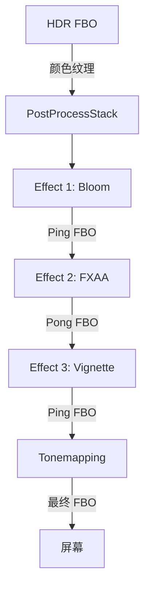

# Phase R6：后处理框架

> **文档版本**：v1.0  
> **创建日期**：2026-04-07  
> **优先级**：?? P2  
> **预计工作量**：4-5 天  
> **前置依赖**：Phase R5（HDR + Tonemapping）  
> **文档说明**：本文档详细描述如何构建一个可扩展的后处理框架，支持 Bloom、FXAA 等效果，使用 FBO Ping-Pong 链实现多效果串联。所有代码可直接对照实现。

---

## 目录

- [一、现状分析](#一现状分析)
- [二、改进目标](#二改进目标)
- [三、涉及的文件清单](#三涉及的文件清单)
- [四、后处理框架架构](#四后处理框架架构)
  - [4.1 整体架构](#41-整体架构)
  - [4.2 FBO Ping-Pong 机制](#42-fbo-ping-pong-机制)
- [五、核心类设计](#五核心类设计)
  - [5.1 PostProcessEffect 基类](#51-postprocesseffect-基类)
  - [5.2 PostProcessStack 管理器](#52-postprocessstack-管理器)
- [六、内置后处理效果](#六内置后处理效果)
  - [6.1 Bloom（泛光）](#61-bloom泛光)
  - [6.2 FXAA（快速抗锯齿）](#62-fxaa快速抗锯齿)
  - [6.3 Vignette（暗角）](#63-vignette暗角)
- [七、Bloom 详细实现](#七bloom-详细实现)
  - [7.1 Bloom 算法流程](#71-bloom-算法流程)
  - [7.2 亮度提取 Shader](#72-亮度提取-shader)
  - [7.3 高斯模糊 Shader](#73-高斯模糊-shader)
  - [7.4 Bloom 合成 Shader](#74-bloom-合成-shader)
  - [7.5 BloomEffect 类实现](#75-bloomeffect-类实现)
- [八、FXAA 详细实现](#八fxaa-详细实现)
  - [8.1 FXAA Shader](#81-fxaa-shader)
- [九、渲染流程集成](#九渲染流程集成)
  - [9.1 完整渲染流程](#91-完整渲染流程)
  - [9.2 Renderer3D 修改](#92-renderer3d-修改)
- [十、编辑器集成](#十编辑器集成)
- [十一、验证方法](#十一验证方法)
- [十二、设计决策记录](#十二设计决策记录)

---

## 一、现状分析

Phase R5 完成后，渲染管线已经支持 HDR + Tonemapping。但 Tonemapping 是唯一的后处理效果，且硬编码在 `EndScene` 中。需要一个可扩展的后处理框架来支持更多效果。

---

## 二、改进目标

1. **后处理框架**：可扩展的 Effect 链，支持动态添加/移除/排序效果
2. **FBO Ping-Pong**：两个 FBO 交替使用，支持多效果串联
3. **内置效果**：Bloom、FXAA、Vignette
4. **编辑器集成**：在 Inspector 或 Settings 面板中控制后处理参数

---

## 三、涉及的文件清单

| 文件路径 | 操作 | 说明 |
|---------|------|------|
| `Lucky/Source/Lucky/Renderer/PostProcessEffect.h` | **新建** | 后处理效果基类 |
| `Lucky/Source/Lucky/Renderer/PostProcessStack.h` | **新建** | 后处理管理器 |
| `Lucky/Source/Lucky/Renderer/PostProcessStack.cpp` | **新建** | 后处理管理器实现 |
| `Lucky/Source/Lucky/Renderer/Effects/BloomEffect.h` | **新建** | Bloom 效果 |
| `Lucky/Source/Lucky/Renderer/Effects/BloomEffect.cpp` | **新建** | Bloom 实现 |
| `Lucky/Source/Lucky/Renderer/Effects/FXAAEffect.h` | **新建** | FXAA 效果 |
| `Lucky/Source/Lucky/Renderer/Effects/FXAAEffect.cpp` | **新建** | FXAA 实现 |
| `Lucky/Source/Lucky/Renderer/Effects/VignetteEffect.h` | **新建** | Vignette 效果 |
| `Lucky/Source/Lucky/Renderer/Effects/VignetteEffect.cpp` | **新建** | Vignette 实现 |
| `Luck3DApp/Assets/Shaders/PostProcess/BrightExtract.frag` | **新建** | 亮度提取 |
| `Luck3DApp/Assets/Shaders/PostProcess/GaussianBlur.frag` | **新建** | 高斯模糊 |
| `Luck3DApp/Assets/Shaders/PostProcess/BloomComposite.frag` | **新建** | Bloom 合成 |
| `Luck3DApp/Assets/Shaders/PostProcess/FXAA.frag` | **新建** | FXAA |
| `Luck3DApp/Assets/Shaders/PostProcess/Vignette.frag` | **新建** | 暗角 |
| `Lucky/Source/Lucky/Renderer/Renderer3D.cpp` | 修改 | 集成后处理框架 |

---

## 四、后处理框架架构

### 4.1 整体架构



### 4.2 FBO Ping-Pong 机制

```
两个临时 FBO（Ping 和 Pong）交替使用：

初始输入：HDR FBO 颜色纹理

Effect 1：读取 HDR 纹理 → 写入 Ping FBO
Effect 2：读取 Ping FBO → 写入 Pong FBO
Effect 3：读取 Pong FBO → 写入 Ping FBO
...

最终：Tonemapping 读取最后一个 FBO → 写入显示 FBO
```

---

## 五、核心类设计

### 5.1 PostProcessEffect 基类

```cpp
// Lucky/Source/Lucky/Renderer/PostProcessEffect.h
#pragma once

#include "Lucky/Core/Base.h"
#include "Framebuffer.h"
#include "Shader.h"

namespace Lucky
{
    /// <summary>
    /// 后处理效果基类
    /// 所有后处理效果都继承此类
    /// </summary>
    class PostProcessEffect
    {
    public:
        virtual ~PostProcessEffect() = default;
        
        /// <summary>
        /// 初始化效果（加载 Shader、创建 FBO 等）
        /// </summary>
        virtual void Init() = 0;
        
        /// <summary>
        /// 执行后处理效果
        /// </summary>
        /// <param name="sourceTexture">输入纹理 ID</param>
        /// <param name="destFBO">输出 FBO</param>
        /// <param name="width">视口宽度</param>
        /// <param name="height">视口高度</param>
        virtual void Execute(uint32_t sourceTexture, Ref<Framebuffer> destFBO, 
                           uint32_t width, uint32_t height) = 0;
        
        /// <summary>
        /// 调整大小（视口变化时调用）
        /// </summary>
        virtual void Resize(uint32_t width, uint32_t height) {}
        
        /// <summary>
        /// 获取效果名称
        /// </summary>
        virtual const std::string& GetName() const = 0;
        
        bool Enabled = true;   // 是否启用
        int Order = 0;         // 执行顺序（越小越先执行）
    };
}
```

### 5.2 PostProcessStack 管理器

```cpp
// Lucky/Source/Lucky/Renderer/PostProcessStack.h
#pragma once

#include "PostProcessEffect.h"
#include "ScreenQuad.h"

namespace Lucky
{
    /// <summary>
    /// 后处理栈：管理和执行所有后处理效果
    /// </summary>
    class PostProcessStack
    {
    public:
        /// <summary>
        /// 初始化后处理栈（创建 Ping-Pong FBO）
        /// </summary>
        void Init(uint32_t width, uint32_t height);
        
        /// <summary>
        /// 释放资源
        /// </summary>
        void Shutdown();
        
        /// <summary>
        /// 添加后处理效果
        /// </summary>
        void AddEffect(Ref<PostProcessEffect> effect);
        
        /// <summary>
        /// 移除后处理效果
        /// </summary>
        void RemoveEffect(const std::string& name);
        
        /// <summary>
        /// 获取后处理效果
        /// </summary>
        template<typename T>
        Ref<T> GetEffect() const;
        
        /// <summary>
        /// 执行所有启用的后处理效果
        /// </summary>
        /// <param name="sourceTexture">输入 HDR 纹理 ID</param>
        /// <returns>最终输出纹理 ID</returns>
        uint32_t Execute(uint32_t sourceTexture, uint32_t width, uint32_t height);
        
        /// <summary>
        /// 调整大小
        /// </summary>
        void Resize(uint32_t width, uint32_t height);
        
        /// <summary>
        /// 获取所有效果列表
        /// </summary>
        const std::vector<Ref<PostProcessEffect>>& GetEffects() const { return m_Effects; }
        
    private:
        std::vector<Ref<PostProcessEffect>> m_Effects;
        Ref<Framebuffer> m_PingFBO;     // Ping-Pong FBO A
        Ref<Framebuffer> m_PongFBO;     // Ping-Pong FBO B
    };
}
```

```cpp
// PostProcessStack.cpp
void PostProcessStack::Init(uint32_t width, uint32_t height)
{
    FramebufferSpecification spec;
    spec.Width = width;
    spec.Height = height;
    spec.Attachments = { FramebufferTextureFormat::RGBA16F };
    
    m_PingFBO = Framebuffer::Create(spec);
    m_PongFBO = Framebuffer::Create(spec);
}

uint32_t PostProcessStack::Execute(uint32_t sourceTexture, uint32_t width, uint32_t height)
{
    // 按 Order 排序
    std::sort(m_Effects.begin(), m_Effects.end(),
        [](const auto& a, const auto& b) { return a->Order < b->Order; });
    
    uint32_t currentTexture = sourceTexture;
    bool usePing = true;
    
    for (auto& effect : m_Effects)
    {
        if (!effect->Enabled)
            continue;
        
        Ref<Framebuffer> destFBO = usePing ? m_PingFBO : m_PongFBO;
        
        effect->Execute(currentTexture, destFBO, width, height);
        
        currentTexture = destFBO->GetColorAttachmentRendererID(0);
        usePing = !usePing;
    }
    
    return currentTexture;  // 返回最终输出纹理 ID
}
```

---

## 六、内置后处理效果

### 6.1 Bloom（泛光）

| 参数 | 类型 | 默认值 | 说明 |
|------|------|--------|------|
| Threshold | float | 1.0 | 亮度阈值（超过此值的像素产生泛光） |
| Intensity | float | 1.0 | 泛光强度 |
| Radius | float | 1.0 | 泛光半径（模糊程度） |
| Iterations | int | 5 | 模糊迭代次数 |

### 6.2 FXAA（快速抗锯齿）

| 参数 | 类型 | 默认值 | 说明 |
|------|------|--------|------|
| 无参数 | - | - | FXAA 3.11 Quality |

### 6.3 Vignette（暗角）

| 参数 | 类型 | 默认值 | 说明 |
|------|------|--------|------|
| Intensity | float | 0.5 | 暗角强度 |
| Smoothness | float | 2.0 | 暗角平滑度 |

---

## 七、Bloom 详细实现

### 7.1 Bloom 算法流程

```
1. 亮度提取（Bright Extract）
   - 从 HDR 纹理中提取亮度超过阈值的像素
   - 输出到半分辨率 FBO

2. 高斯模糊（Gaussian Blur）
   - 对提取的亮度图进行多次高斯模糊
   - 使用两 Pass 分离式模糊（水平 + 垂直）
   - 逐级降采样（Mipmap 链）

3. 合成（Composite）
   - 将模糊后的泛光图与原始 HDR 图像叠加
```

### 7.2 亮度提取 Shader

```glsl
// PostProcess/BrightExtract.frag
#version 450 core

layout(location = 0) out vec4 o_Color;

in vec2 v_TexCoord;

uniform sampler2D u_SourceTexture;
uniform float u_Threshold;

void main()
{
    vec3 color = texture(u_SourceTexture, v_TexCoord).rgb;
    
    // 计算亮度
    float brightness = dot(color, vec3(0.2126, 0.7152, 0.0722));
    
    // 软阈值（避免硬截断）
    float softThreshold = brightness - u_Threshold;
    softThreshold = clamp(softThreshold, 0.0, 1.0);
    
    o_Color = vec4(color * softThreshold, 1.0);
}
```

### 7.3 高斯模糊 Shader

```glsl
// PostProcess/GaussianBlur.frag
#version 450 core

layout(location = 0) out vec4 o_Color;

in vec2 v_TexCoord;

uniform sampler2D u_SourceTexture;
uniform bool u_Horizontal;     // true = 水平模糊, false = 垂直模糊

// 9-tap 高斯权重
const float weights[5] = float[](0.227027, 0.1945946, 0.1216216, 0.054054, 0.016216);

void main()
{
    vec2 texelSize = 1.0 / textureSize(u_SourceTexture, 0);
    vec3 result = texture(u_SourceTexture, v_TexCoord).rgb * weights[0];
    
    if (u_Horizontal)
    {
        for (int i = 1; i < 5; ++i)
        {
            result += texture(u_SourceTexture, v_TexCoord + vec2(texelSize.x * i, 0.0)).rgb * weights[i];
            result += texture(u_SourceTexture, v_TexCoord - vec2(texelSize.x * i, 0.0)).rgb * weights[i];
        }
    }
    else
    {
        for (int i = 1; i < 5; ++i)
        {
            result += texture(u_SourceTexture, v_TexCoord + vec2(0.0, texelSize.y * i)).rgb * weights[i];
            result += texture(u_SourceTexture, v_TexCoord - vec2(0.0, texelSize.y * i)).rgb * weights[i];
        }
    }
    
    o_Color = vec4(result, 1.0);
}
```

### 7.4 Bloom 合成 Shader

```glsl
// PostProcess/BloomComposite.frag
#version 450 core

layout(location = 0) out vec4 o_Color;

in vec2 v_TexCoord;

uniform sampler2D u_SourceTexture;  // 原始 HDR 纹理
uniform sampler2D u_BloomTexture;   // 模糊后的泛光纹理
uniform float u_BloomIntensity;

void main()
{
    vec3 hdrColor = texture(u_SourceTexture, v_TexCoord).rgb;
    vec3 bloomColor = texture(u_BloomTexture, v_TexCoord).rgb;
    
    // 叠加泛光
    vec3 result = hdrColor + bloomColor * u_BloomIntensity;
    
    o_Color = vec4(result, 1.0);
}
```

### 7.5 BloomEffect 类实现

```cpp
// Lucky/Source/Lucky/Renderer/Effects/BloomEffect.h
#pragma once

#include "Lucky/Renderer/PostProcessEffect.h"

namespace Lucky
{
    class BloomEffect : public PostProcessEffect
    {
    public:
        float Threshold = 1.0f;
        float Intensity = 1.0f;
        int Iterations = 5;
        
        void Init() override;
        void Execute(uint32_t sourceTexture, Ref<Framebuffer> destFBO,
                    uint32_t width, uint32_t height) override;
        void Resize(uint32_t width, uint32_t height) override;
        const std::string& GetName() const override { static std::string name = "Bloom"; return name; }
        
    private:
        Ref<Shader> m_BrightExtractShader;
        Ref<Shader> m_GaussianBlurShader;
        Ref<Shader> m_CompositeShader;
        Ref<Framebuffer> m_BrightFBO;       // 亮度提取 FBO
        Ref<Framebuffer> m_BlurPingFBO;     // 模糊 Ping FBO
        Ref<Framebuffer> m_BlurPongFBO;     // 模糊 Pong FBO
    };
}
```

---

## 八、FXAA 详细实现

### 8.1 FXAA Shader

```glsl
// PostProcess/FXAA.frag
#version 450 core

layout(location = 0) out vec4 o_Color;

in vec2 v_TexCoord;

uniform sampler2D u_SourceTexture;

// FXAA 3.11 Quality（简化版）
void main()
{
    vec2 texelSize = 1.0 / textureSize(u_SourceTexture, 0);
    
    // 采样周围像素的亮度
    float lumCenter = dot(texture(u_SourceTexture, v_TexCoord).rgb, vec3(0.299, 0.587, 0.114));
    float lumUp     = dot(texture(u_SourceTexture, v_TexCoord + vec2(0, texelSize.y)).rgb, vec3(0.299, 0.587, 0.114));
    float lumDown   = dot(texture(u_SourceTexture, v_TexCoord - vec2(0, texelSize.y)).rgb, vec3(0.299, 0.587, 0.114));
    float lumLeft   = dot(texture(u_SourceTexture, v_TexCoord - vec2(texelSize.x, 0)).rgb, vec3(0.299, 0.587, 0.114));
    float lumRight  = dot(texture(u_SourceTexture, v_TexCoord + vec2(texelSize.x, 0)).rgb, vec3(0.299, 0.587, 0.114));
    
    float lumMin = min(lumCenter, min(min(lumUp, lumDown), min(lumLeft, lumRight)));
    float lumMax = max(lumCenter, max(max(lumUp, lumDown), max(lumLeft, lumRight)));
    float lumRange = lumMax - lumMin;
    
    // 如果对比度太低，不进行抗锯齿
    if (lumRange < max(0.0312, lumMax * 0.125))
    {
        o_Color = texture(u_SourceTexture, v_TexCoord);
        return;
    }
    
    // 计算边缘方向
    float lumUpDown = lumUp + lumDown;
    float lumLeftRight = lumLeft + lumRight;
    
    bool isHorizontal = abs(-2.0 * lumCenter + lumUpDown) >= abs(-2.0 * lumCenter + lumLeftRight);
    
    float stepLength = isHorizontal ? texelSize.y : texelSize.x;
    float lum1 = isHorizontal ? lumUp : lumLeft;
    float lum2 = isHorizontal ? lumDown : lumRight;
    
    float gradient1 = abs(lum1 - lumCenter);
    float gradient2 = abs(lum2 - lumCenter);
    
    bool is1Steepest = gradient1 >= gradient2;
    float gradientScaled = 0.25 * max(gradient1, gradient2);
    
    // 沿边缘方向偏移采样
    float lumaLocalAverage = 0.0;
    if (is1Steepest)
    {
        stepLength = -stepLength;
        lumaLocalAverage = 0.5 * (lum1 + lumCenter);
    }
    else
    {
        lumaLocalAverage = 0.5 * (lum2 + lumCenter);
    }
    
    vec2 currentUV = v_TexCoord;
    if (isHorizontal)
        currentUV.y += stepLength * 0.5;
    else
        currentUV.x += stepLength * 0.5;
    
    o_Color = texture(u_SourceTexture, currentUV);
}
```

> **注意**：上述是 FXAA 的简化实现。完整的 FXAA 3.11 Quality 需要更多的边缘搜索步骤。可以参考 Timothy Lottes 的原始实现。

---

## 九、渲染流程集成

### 9.1 完整渲染流程

```
1. Shadow Pass
2. Main Pass → HDR FBO
3. Post Process Stack
   3.1 Bloom（如果启用）
   3.2 其他效果...
4. Tonemapping + Gamma → 最终 FBO
5. FXAA（在 LDR 上执行）
```

> **注意**：FXAA 应该在 Tonemapping 之后执行（在 LDR 空间），因为 FXAA 基于亮度对比度检测边缘。

### 9.2 Renderer3D 修改

```cpp
void Renderer3D::EndScene()
{
    s_Data.HDR_FBO->Unbind();
    
    // 获取 HDR 颜色纹理
    uint32_t hdrTexture = s_Data.HDR_FBO->GetColorAttachmentRendererID(0);
    
    // 执行后处理栈（Bloom 等，在 HDR 空间）
    uint32_t processedTexture = s_Data.PostProcessStack.Execute(hdrTexture, viewportWidth, viewportHeight);
    
    // Tonemapping（HDR → LDR）
    // ... Tonemapping Pass ...
    
    // FXAA（在 LDR 空间）
    // ... FXAA Pass ...
}
```

---

## 十、编辑器集成

在 Settings 面板或 Inspector 中添加后处理控制：

```cpp
// 后处理设置面板
if (ImGui::CollapsingHeader("Post Processing"))
{
    auto& stack = Renderer3D::GetPostProcessStack();
    
    for (auto& effect : stack.GetEffects())
    {
        ImGui::Checkbox(effect->GetName().c_str(), &effect->Enabled);
        
        if (auto bloom = std::dynamic_pointer_cast<BloomEffect>(effect))
        {
            ImGui::DragFloat("Bloom Threshold", &bloom->Threshold, 0.1f, 0.0f, 10.0f);
            ImGui::DragFloat("Bloom Intensity", &bloom->Intensity, 0.1f, 0.0f, 5.0f);
            ImGui::SliderInt("Bloom Iterations", &bloom->Iterations, 1, 10);
        }
    }
}
```

---

## 十一、验证方法

### 11.1 Bloom 验证

1. 创建一个高亮度光源或自发光物体
2. 启用 Bloom，确认高亮区域有泛光效果
3. 调整 Threshold，确认泛光范围变化
4. 调整 Intensity，确认泛光强度变化

### 11.2 FXAA 验证

1. 观察物体边缘（特别是斜线）
2. 启用/禁用 FXAA，对比边缘锯齿
3. 确认 FXAA 不会过度模糊纹理细节

### 11.3 效果链验证

1. 同时启用 Bloom + FXAA
2. 确认两个效果正确串联
3. 确认禁用某个效果后其他效果不受影响

---

## 十二、设计决策记录

| 决策 | 选择 | 原因 |
|------|------|------|
| 后处理架构 | Effect 链 + Ping-Pong FBO | 灵活可扩展，业界标准做法 |
| Bloom 算法 | 亮度提取 + 分离式高斯模糊 + 合成 | 经典做法，效果好 |
| FXAA 版本 | FXAA 3.11 Quality（简化版） | 性能好，实现相对简单 |
| FXAA 执行位置 | Tonemapping 之后（LDR 空间） | FXAA 基于亮度对比度，需要在 LDR 空间 |
| Bloom 执行位置 | Tonemapping 之前（HDR 空间） | 需要 HDR 亮度信息来提取高亮区域 |
| Ping-Pong FBO 格式 | RGBA16F | 与 HDR FBO 一致，保留精度 |
