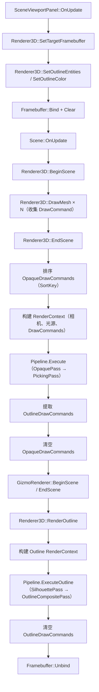

# Phase R7：多 Pass 渲染框架

> **文档版本**：v2.0  
> **创建日期**：2026-04-07  
> **更新日期**：2026-04-24  
> **优先级**：?? P2  
> **预计工作量**：3-5 天  
> **前置依赖**：Phase R3（多光源）? 已完成、Phase R9（DrawCommand 排序）? 已完成、Phase R8（选中描边）? 已完成  
> **实施时机**：在 R4（阴影系统）之前实施，提取当前已有的 4 个内联 Pass 为独立类  
> **文档说明**：本文档详细描述如何将当前内联在 `EndScene()` 和 `RenderOutline()` 中的 4 个渲染 Pass（Opaque、Picking、Silhouette、OutlineComposite）提取为独立的 `RenderPass` 类，建立可扩展的多 Pass 渲染管线。后续 R4/R5/R6 新增的 Pass（Shadow、HDR Tonemapping、PostProcess）可直接以 `RenderPass` 类的形式接入，无需再内联。参考 Unity SRP（Scriptable Render Pipeline）的设计思路。所有代码可直接对照实现。
>
> **v2.0 重大变更**：
> - 实施策略从「等 R4/R5/R6 完成后一次性提取所有 Pass」调整为「现在提取已有的 4 个 Pass，后续 Pass 直接以类的形式新增」
> - 新增 `SilhouettePass` 和 `OutlineCompositePass`（R8 描边已实现，文档 v1.2 中缺失）
> - `RenderObject` 替换为当前已验证的 `DrawCommand`（SubMesh 粒度）
> - 采用 `RenderContext` 方案替代多参数传递

---

## 目录

- [一、现状分析](#一现状分析)
- [二、改进目标](#二改进目标)
- [三、涉及的文件清单](#三涉及的文件清单)
- [四、方案选择](#四方案选择)
  - [4.1 渲染管线架构选择](#41-渲染管线架构选择)
  - [4.2 透明物体排序方案](#42-透明物体排序方案)
- [五、核心类设计](#五核心类设计)
  - [5.1 RenderPass 基类](#51-renderpass-基类)
  - [5.2 RenderContext 渲染上下文](#52-rendercontext-渲染上下文)
  - [5.3 RenderPipeline 管理器](#53-renderpipeline-管理器)
- [六、内置 RenderPass](#六内置-renderpass)
  - [6.1 OpaquePass（R7 阶段）](#61-opaquepassr7-阶段)
  - [6.2 PickingPass（R7 阶段）](#62-pickingpassr7-阶段)
  - [6.3 SilhouettePass（R7 阶段）](#63-silhouettepassr7-阶段)
  - [6.4 OutlineCompositePass（R7 阶段）](#64-outlinecompositepassr7-阶段)
  - [6.5 ShadowPass（后续 R4 阶段）](#65-shadowpass后续-r4-阶段)
  - [6.6 TransparentPass（后续 R9+ 阶段）](#66-transparentpass后续-r9-阶段)
  - [6.7 PostProcessPass（后续 R6 阶段）](#67-postprocesspass后续-r6-阶段)
  - [6.8 DepthPrepass（可选优化）](#68-depthprepass可选优化)
  - [6.9 SkyboxPass（可选）](#69-skyboxpass可选)
- [七、RenderPass 基类实现](#七renderpass-基类实现)
- [八、RenderPipeline 实现](#八renderpipeline-实现)
- [九、各 Pass 详细实现](#九各-pass-详细实现)
  - [9.1 OpaquePass（从 EndScene 提取）](#91-opaquepass从-endscene-提取)
  - [9.2 PickingPass（从 EndScene 提取）](#92-pickingpass从-endscene-提取)
  - [9.3 SilhouettePass（从 RenderOutline 提取）](#93-silhouettepass从-renderoutline-提取)
  - [9.4 OutlineCompositePass（从 RenderOutline 提取）](#94-outlinecompositepass从-renderoutline-提取)
  - [9.5 ShadowPass（后续 R4 阶段参考）](#95-shadowpass后续-r4-阶段参考)
  - [9.6 TransparentPass（后续 R9+ 阶段参考）](#96-transparentpass后续-r9-阶段参考)
  - [9.7 PostProcessPass（后续 R6 阶段参考）](#97-postprocesspass后续-r6-阶段参考)
- [十、Scene 集成](#十scene-集成)
  - [10.1 当前渲染对象收集方式（保持不变）](#101-当前渲染对象收集方式保持不变)
  - [10.2 新的渲染流程](#102-新的渲染流程)
- [十一、Renderer3D 重构](#十一renderer3d-重构)
- [十二、透明物体渲染（后续阶段）](#十二透明物体渲染后续阶段)
  - [12.1 透明度判断](#121-透明度判断)
  - [12.2 排序策略](#122-排序策略)
  - [12.3 渲染状态](#123-渲染状态)
- [十三、验证方法](#十三验证方法)
- [十四、设计决策记录](#十四设计决策记录)

---

## 一、现状分析

> **注意**：本节已根据 2026-04-24 的实际代码状态更新（R9/R8/R10/R11 均已完成）。

### 当前渲染流程

```
SceneViewportPanel::OnUpdate
  → Renderer3D::SetTargetFramebuffer(m_Framebuffer)    // 传入主 FBO 引用
  → Renderer3D::SetOutlineEntities(outlineEntityIDs)   // 设置需要描边的实体 ID 集合
  → Renderer3D::SetOutlineColor(color)                 // 设置描边颜色
  → Framebuffer::Bind()                                // 绑定主 FBO
  → RenderCommand::Clear()
  → m_Framebuffer->ClearAttachment(1, -1)
  → Scene::OnUpdate()
      → 收集光源数据
      → Renderer3D::BeginScene(camera, sceneLightData)
      → Renderer3D::DrawMesh() × N                     // 收集 DrawCommand（不立即绘制）
      → Renderer3D::EndScene()
          → Pass 1: Opaque 绘制（SortKey 排序 + Shader 聚合 + 批量绘制 → Attachment 0）
          → Pass 2: Picking Pass（EntityID Shader → Attachment 1）
          → 提取描边物体到 OutlineDrawCommands（轻量数据）
          → 清空 OpaqueDrawCommands
  → GizmoRenderer::BeginScene() / EndScene()           // Gizmo 渲染
  → Renderer3D::RenderOutline()                        // 描边最后渲染（覆盖在 Gizmo 之上）
      → Pass 3: Silhouette 渲染（遍历 OutlineDrawCommands → Silhouette FBO）
      → Pass 4: 描边合成（边缘检测 + Alpha 混合叠加 → 主 FBO Attachment 0）
      → 清空 OutlineDrawCommands
  → Framebuffer::Unbind()
```

### 当前已有的 4 个内联 Pass

| Pass | 位置 | 代码行数 | 说明 |
|------|------|---------|------|
| **Opaque Pass** | `EndScene()` 前半段 | ~25 行 | SortKey 排序 + Shader 聚合绑定 + 批量绘制 |
| **Picking Pass** | `EndScene()` 中段 | ~25 行 | 切换 DrawBuffer → EntityID Shader → 遍历绘制 → 恢复状态 |
| **Silhouette Pass** | `RenderOutline()` 阶段 1 | ~20 行 | 绑定 SilhouetteFBO → 禁用深度测试 → 纯白色渲染选中物体 |
| **OutlineComposite Pass** | `RenderOutline()` 阶段 2 | ~25 行 | 绑定主 FBO → 禁用深度测试 → 启用混合 → 全屏 Quad 边缘检测 |

### 当前已完成的前置功能

| 功能 | 状态 | 说明 |
|------|------|------|
| PBR Shader（Phase R2） | ? 已完成 | `Standard.frag` 完整 PBR |
| 多光源支持（Phase R3） | ? 已完成 | 方向光×4 + 点光源×8 + 聚光灯×4 |
| DrawCommand 排序（Phase R9） | ? 已完成 | 延迟提交 + SortKey 排序 + Shader 聚合 |
| 选中描边（Phase R8） | ? 已完成 | Silhouette FBO + 边缘检测 + OutlineDrawCommand 数据分离 |
| Gizmo 渲染系统（Phase R10） | ? 已完成 | 独立 GizmoRenderer + 网格线 + 灯光可视化 |
| 模型导入（Phase R11） | ? 已完成 | Assimp 集成 + 多 SubMesh + 多材质 |
| 材质系统 | ? 已完成 | Shader 内省 + `unordered_map` 属性存储 |
| 场景序列化 | ? 已完成 | YAML 格式 `.luck3d` 文件 |

### 当前存在的问题

| 编号 | 问题 | 影响 |
|------|------|------|
| R7-01 | 4 个 Pass 内联在 `EndScene()` + `RenderOutline()` 中 | 渲染流程硬编码，无法灵活添加/移除 Pass |
| R7-02 | OpenGL 状态管理散落各处（`glDrawBuffers`、`glDepthMask`、`glDisable(GL_DEPTH_TEST)` 等） | 每新增一个 Pass 都要小心翼翼地恢复状态，容易遗漏 |
| R7-03 | Outline 资源（SilhouetteFBO、Shader）存储在 `Renderer3DData` 中 | 资源归属不清晰，应由对应的 Pass 持有 |
| R7-04 | 无法区分不透明和透明物体 | 透明物体渲染需要独立的 TransparentPass（后续 R9+ 阶段） |
| R7-05 | 无 Depth Prepass | 复杂场景存在 Overdraw（可选优化） |

---

## 二、改进目标

### R7 阶段目标（本次实施）

1. **RenderPass 抽象**：定义 `RenderPass` 基类，将当前 4 个内联 Pass 提取为独立类
2. **RenderPipeline**：管理 Pass 的注册、执行顺序和生命周期
3. **RenderContext**：统一的渲染上下文，打包相机、光源、DrawCommand 列表、Outline 数据等
4. **资源归属清晰化**：将 Outline 相关资源（SilhouetteFBO、Shader）从 `Renderer3DData` 迁移到对应的 Pass 中
5. **可扩展性**：后续 R4/R5/R6 新增的 Pass 可直接以 `RenderPass` 类的形式接入，无需再内联

### 后续阶段目标（随功能需求驱动）

| 目标 | 触发时机 | 说明 |
|------|---------|------|
| ShadowPass | R4 阴影系统实施时 | 直接创建 `ShadowPass` 类接入管线 |
| HDR Tonemapping Pass | R5 HDR 实施时 | 直接创建 `TonemappingPass` 类接入管线 |
| PostProcessPass | R6 后处理实施时 | 直接创建 `PostProcessPass` 类接入管线 |
| TransparentPass | R9+ 透明物体支持时 | 需要 Material::RenderMode + 透明/不透明分区 |
| RenderQueue 独立类 | 需要更复杂的排序策略时 | 当前 `std::vector<DrawCommand>` + `std::sort` 已足够 |

---

## 三、涉及的文件清单

### R7 阶段（本次实施）

| 文件路径 | 操作 | 说明 |
|---------|------|------|
| `Lucky/Source/Lucky/Renderer/RenderPass.h` | **新建** | RenderPass 基类 |
| `Lucky/Source/Lucky/Renderer/RenderContext.h` | **新建** | 渲染上下文（打包相机、光源、DrawCommand 列表、Outline 数据等） |
| `Lucky/Source/Lucky/Renderer/RenderPipeline.h` | **新建** | 渲染管线管理器 |
| `Lucky/Source/Lucky/Renderer/RenderPipeline.cpp` | **新建** | 渲染管线实现 |
| `Lucky/Source/Lucky/Renderer/Passes/OpaquePass.h` | **新建** | 不透明物体 Pass（从 `EndScene()` 提取） |
| `Lucky/Source/Lucky/Renderer/Passes/OpaquePass.cpp` | **新建** | 不透明物体 Pass 实现 |
| `Lucky/Source/Lucky/Renderer/Passes/PickingPass.h` | **新建** | 拾取 Pass（从 `EndScene()` 提取） |
| `Lucky/Source/Lucky/Renderer/Passes/PickingPass.cpp` | **新建** | 拾取 Pass 实现 |
| `Lucky/Source/Lucky/Renderer/Passes/SilhouettePass.h` | **新建** | 轮廓掩码 Pass（从 `RenderOutline()` 阶段 1 提取） |
| `Lucky/Source/Lucky/Renderer/Passes/SilhouettePass.cpp` | **新建** | 轮廓掩码 Pass 实现 |
| `Lucky/Source/Lucky/Renderer/Passes/OutlineCompositePass.h` | **新建** | 描边合成 Pass（从 `RenderOutline()` 阶段 2 提取） |
| `Lucky/Source/Lucky/Renderer/Passes/OutlineCompositePass.cpp` | **新建** | 描边合成 Pass 实现 |
| `Lucky/Source/Lucky/Renderer/Renderer3D.h` | 修改 | 集成 RenderPipeline，保留外部 API 不变 |
| `Lucky/Source/Lucky/Renderer/Renderer3D.cpp` | 修改 | 重构渲染流程，将内联 Pass 替换为 Pipeline 调用 |
| `Lucky/Source/Lucky/Scene/Scene.cpp` | 修改 | 适配新的渲染流程（改动极小） |

### 后续阶段（随功能需求新增）

| 文件路径 | 操作 | 触发时机 | 说明 |
|---------|------|---------|------|
| `Lucky/Source/Lucky/Renderer/Passes/ShadowPass.h/cpp` | **新建** | R4 阴影系统 | 直接以 RenderPass 类接入管线 |
| `Lucky/Source/Lucky/Renderer/Passes/TransparentPass.h/cpp` | **新建** | R9+ 透明物体 | 需要 Material::RenderMode |
| `Lucky/Source/Lucky/Renderer/Passes/PostProcessPass.h/cpp` | **新建** | R6 后处理 | 需要 R5 HDR 基础 |
| `Lucky/Source/Lucky/Renderer/RenderQueue.h/cpp` | **新建** | 需要更复杂排序时 | 当前 `std::vector<DrawCommand>` 已足够 |

---

## 四、方案选择

### 4.1 渲染管线架构选择

| 方案 | 说明 | 优点 | 缺点 | 推荐 |
|------|------|------|------|------|
| **方案 A：线性 Pass 链（推荐）** | Pass 按固定顺序执行 | 简单直观，易于调试 | 灵活性有限 | ? |
| 方案 B：RenderGraph（依赖图） | Pass 之间声明依赖关系，自动排序 | 最灵活，可自动优化 | 实现复杂 | 后续优化 |
| 方案 C：Unity SRP 风格 | ScriptableRenderContext + RenderPass | 与 Unity 一致 | 过度设计 | |

**推荐方案 A**：线性 Pass 链。简单直观，满足当前需求。后续可升级为 RenderGraph。

### 4.2 透明物体排序方案

| 方案 | 说明 | 优点 | 缺点 | 推荐 |
|------|------|------|------|------|
| **方案 A：按距离排序（推荐）** | 按物体中心到相机的距离从远到近排序 | 简单，大多数情况正确 | 物体交叉时不正确 | ? |
| 方案 B：OIT（Order-Independent Transparency） | 无需排序的透明渲染 | 完全正确 | 实现复杂，性能开销大 | 后续优化 |

**推荐方案 A**：按距离排序。简单有效，覆盖大多数场景。

---

## 五、核心类设计

> **v2.0 变更**：
> - `RenderPass::Execute()` 签名从 `Execute(const RenderQueue& queue)` 改为 `Execute(const RenderContext& context)`，统一通过 `RenderContext` 传递所有数据
> - 新增 `RenderContext` 结构体，打包相机、光源、DrawCommand 列表、Outline 数据、主 FBO 引用等
> - 移除独立的 `RenderQueue` 类和 `RenderObject` 结构体（当前 `std::vector<DrawCommand>` + `std::sort` 已足够，后续需要时再引入）

### 5.1 RenderPass 基类

```cpp
// Lucky/Source/Lucky/Renderer/RenderPass.h
#pragma once

#include "Lucky/Core/Base.h"
#include "RenderCommand.h"

#include <string>

namespace Lucky
{
    // 前向声明
    struct RenderContext;
    
    /// <summary>
    /// 渲染 Pass 基类
    /// 每个 Pass 负责渲染管线中的一个阶段
    /// 不同 Pass 从 RenderContext 中获取各自需要的数据
    /// </summary>
    class RenderPass
    {
    public:
        virtual ~RenderPass() = default;
        
        /// <summary>
        /// 初始化 Pass（创建 FBO、加载 Shader 等）
        /// 在 RenderPipeline::Init() 中调用，仅调用一次
        /// </summary>
        virtual void Init() = 0;
        
        /// <summary>
        /// 执行 Pass（设置渲染状态 + 渲染物体 + 恢复状态）
        /// 每帧调用，通过 RenderContext 获取所需数据
        /// </summary>
        /// <param name="context">渲染上下文（包含相机、光源、DrawCommand 列表、Outline 数据等）</param>
        virtual void Execute(const RenderContext& context) = 0;
        
        /// <summary>
        /// 调整大小（FBO Resize 等）
        /// </summary>
        virtual void Resize(uint32_t width, uint32_t height) {}
        
        /// <summary>
        /// 获取 Pass 名称（用于调试和日志）
        /// </summary>
        virtual const std::string& GetName() const = 0;
        
        /// <summary>
        /// 是否启用此 Pass
        /// </summary>
        bool Enabled = true;
    };
}
```

> **设计说明**：相比 v1.2 版本，将 `Setup()` + `Execute()` + `Cleanup()` 三个方法合并为单个 `Execute(const RenderContext& context)`。原因：
> 1. 当前 4 个 Pass 的 Setup/Cleanup 逻辑都很简单（几行代码），拆分为三个方法增加了不必要的复杂度
> 2. 合并后每个 Pass 的渲染逻辑自包含，更容易理解和维护
> 3. 如果后续某个 Pass 的 Setup/Cleanup 变得复杂，可以在 Pass 内部自行拆分为私有方法

### 5.2 RenderContext 渲染上下文

```cpp
// Lucky/Source/Lucky/Renderer/RenderContext.h
#pragma once

#include "Lucky/Core/Base.h"
#include "Framebuffer.h"
#include "EditorCamera.h"
#include "Renderer3D.h"

#include <glm/glm.hpp>
#include <vector>
#include <unordered_set>

namespace Lucky
{
    // 前向声明（DrawCommand 和 OutlineDrawCommand 定义在 Renderer3D.cpp 中）
    struct DrawCommand;
    struct OutlineDrawCommand;
    
    /// <summary>
    /// 渲染上下文：包含一帧渲染所需的所有数据
    /// 由 Renderer3D 在 EndScene() / RenderOutline() 中构建，传递给 RenderPipeline
    /// 各 Pass 从中获取各自需要的数据
    /// </summary>
    struct RenderContext
    {
        // ---- 相机与光源 ----
        const EditorCamera* Camera = nullptr;           // 编辑器相机
        const SceneLightData* LightData = nullptr;      // 光源数据
        
        // ---- DrawCommand 列表（已排序） ----
        const std::vector<DrawCommand>* OpaqueDrawCommands = nullptr;       // 不透明物体绘制命令（已按 SortKey 排序）
        // const std::vector<DrawCommand>* TransparentDrawCommands = nullptr; // 透明物体绘制命令（后续 R9+ 阶段）
        
        // ---- Outline 数据 ----
        const std::vector<OutlineDrawCommand>* OutlineDrawCommands = nullptr;   // 描边绘制命令
        const std::unordered_set<int>* OutlineEntityIDs = nullptr;              // 需要描边的 EntityID 集合
        glm::vec4 OutlineColor = glm::vec4(1.0f, 0.4f, 0.0f, 1.0f);           // 描边颜色
        float OutlineWidth = 2.0f;                                              // 描边宽度（像素）
        bool OutlineEnabled = true;                                             // 是否启用描边
        
        // ---- FBO 引用 ----
        Ref<Framebuffer> TargetFramebuffer;     // 主 FBO（OpaquePass / PickingPass / OutlineCompositePass 使用）
        
        // ---- 统计数据（可写） ----
        Renderer3D::Statistics* Stats = nullptr;    // 渲染统计（DrawCalls、TriangleCount）
    };
}
```

> **设计说明**：`RenderContext` 使用指针引用外部数据（`const std::vector<DrawCommand>*`），而非拷贝数据。这样：
> 1. 零拷贝开销：DrawCommand 列表可能包含数百个元素，拷贝代价高
> 2. 生命周期清晰：`RenderContext` 仅在 `RenderPipeline::Execute()` 调用期间有效，此时 DrawCommand 列表保证存活
> 3. 各 Pass 只读访问：Pass 不应修改 DrawCommand 列表

### 5.3 RenderPipeline 管理器

```cpp
// Lucky/Source/Lucky/Renderer/RenderPipeline.h
#pragma once

#include "RenderPass.h"
#include "RenderContext.h"

#include <vector>

namespace Lucky
{
    /// <summary>
    /// 渲染管线：管理和执行所有 RenderPass
    /// 按注册顺序依次执行每个 Pass
    /// </summary>
    class RenderPipeline
    {
    public:
        /// <summary>
        /// 初始化管线（初始化所有已注册的 Pass）
        /// </summary>
        void Init();
        
        /// <summary>
        /// 释放资源
        /// </summary>
        void Shutdown();
        
        /// <summary>
        /// 添加 RenderPass（按添加顺序执行）
        /// </summary>
        void AddPass(const Ref<RenderPass>& pass);
        
        /// <summary>
        /// 移除 RenderPass
        /// </summary>
        void RemovePass(const std::string& name);
        
        /// <summary>
        /// 获取指定类型的 Pass
        /// </summary>
        template<typename T>
        Ref<T> GetPass() const
        {
            for (const auto& pass : m_Passes)
            {
                auto casted = std::dynamic_pointer_cast<T>(pass);
                if (casted)
                    return casted;
            }
            return nullptr;
        }
        
        /// <summary>
        /// 执行所有已启用的 Pass
        /// </summary>
        /// <param name="context">渲染上下文</param>
        void Execute(const RenderContext& context);
        
        /// <summary>
        /// 调整大小（通知所有 Pass）
        /// </summary>
        void Resize(uint32_t width, uint32_t height);
        
    private:
        std::vector<Ref<RenderPass>> m_Passes;  // Pass 列表（按执行顺序排列）
    };
}
```

---

## 六、内置 RenderPass

> **v2.0 变更**：按实施阶段分组。R7 阶段只提取当前已有的 4 个内联 Pass，后续 Pass 随功能需求驱动新增。

### R7 阶段（本次实施 ― 从现有代码提取）

#### 6.1 OpaquePass（R7 阶段）

| 属性 | 值 |
|------|-----|
| 渲染目标 | 主 FBO Attachment 0（RGBA8，当前为 LDR；后续 R5 升级为 RGBA16F HDR） |
| 渲染对象 | 所有不透明物体（遍历 `RenderContext::OpaqueDrawCommands`） |
| Shader | 用户材质 Shader（Standard.frag PBR 等） |
| 排序 | 按 SortKey 升序（Shader ID 聚合，减少状态切换） |
| 深度测试 | 启用（GL_LESS） |
| 深度写入 | 启用 |
| 混合 | 禁用 |
| 数据来源 | `RenderContext::OpaqueDrawCommands`（已按 SortKey 排序的 `DrawCommand` 列表） |
| 提取自 | `Renderer3D::EndScene()` 前半段（~25 行） |

> **Shader 聚合优化**：OpaquePass 跟踪上一次绑定的 Shader ID（`lastShaderID`），仅在 Shader 变化时调用 `Bind()`，减少 GPU 状态切换。这是 R9 已验证的优化，直接迁移。

> **注意**：OpaquePass 不自行创建 FBO，而是复用外部传入的主 FBO（通过 `RenderContext::TargetFramebuffer`）。HDR FBO 的创建推迟到 R5 阶段。

#### 6.2 PickingPass（R7 阶段）

| 属性 | 值 |
|------|-----|
| 渲染目标 | 主 FBO 的 Entity ID 附件（R32I，Attachment 1） |
| 渲染对象 | 所有不透明物体（复用 `RenderContext::OpaqueDrawCommands`） |
| Shader | EntityID.vert + EntityID.frag（引擎内部 Shader，只输出 Entity ID） |
| 深度测试 | 启用（GL_LEQUAL，复用 OpaquePass 写入的深度缓冲区） |
| 深度写入 | **禁用**（GL_FALSE，只读深度） |
| 混合 | 禁用 |
| DrawBuffer | 切换为 `{ GL_NONE, GL_COLOR_ATTACHMENT1 }`，只写入 Attachment 1 |
| 排序 | 无需排序（深度测试保证正确性） |
| 数据来源 | `RenderContext::OpaqueDrawCommands`（复用 OpaquePass 的列表） |
| 提取自 | `Renderer3D::EndScene()` 中段（~25 行） |

> **设计说明**：PickingPass 使用独立的 EntityID Shader 而非在用户 Shader 中添加 Entity ID 输出，这样用户编写 Shader 时无需关心拾取逻辑。这与 Unity 的处理方式类似――Unity 在 Scene View 中使用内部的 Picking Shader 进行拾取，用户 Shader 不需要包含任何拾取相关代码。

> **VP 矩阵传递**：当前代码中 VP 矩阵通过 Camera UBO（binding=0）传递，EntityID Shader 也通过 UBO 获取 VP 矩阵，**不需要**手动 `SetMat4("u_ViewProjectionMatrix", ...)`。

#### 6.3 SilhouettePass（R7 阶段）

| 属性 | 值 |
|------|-----|
| 渲染目标 | Silhouette FBO（RGBA8，独立 FBO，白色 = 选中，黑色 = 未选中） |
| 渲染对象 | 需要描边的物体（遍历 `RenderContext::OutlineDrawCommands`） |
| Shader | Silhouette.vert + Silhouette.frag（纯白色输出） |
| 深度测试 | **禁用**（描边穿透遮挡物，Silhouette FBO 无深度附件，与 Unity 行为一致） |
| 深度写入 | N/A（无深度附件） |
| 混合 | 禁用 |
| 条件执行 | 仅当 `OutlineEnabled && OutlineDrawCommands 非空` 时执行 |
| 数据来源 | `RenderContext::OutlineDrawCommands`（轻量数据：Transform + Mesh + SubMesh） |
| 提取自 | `Renderer3D::RenderOutline()` 阶段 1（~20 行） |

> **资源归属**：SilhouettePass 持有 `SilhouetteFBO` 和 `SilhouetteShader`，这些资源从 `Renderer3DData` 迁移到此 Pass 中。`Init()` 中创建 FBO 和加载 Shader，`Resize()` 中同步 FBO 大小。

#### 6.4 OutlineCompositePass（R7 阶段）

| 属性 | 值 |
|------|-----|
| 渲染目标 | 主 FBO Attachment 0（颜色缓冲区，Alpha 混合叠加描边） |
| 渲染对象 | 全屏 Quad（`ScreenQuad::Draw()`） |
| Shader | OutlineComposite.vert + OutlineComposite.frag（边缘检测 + 描边叠加） |
| 深度测试 | **禁用**（全屏 Quad 不需要深度测试） |
| 深度写入 | N/A |
| 混合 | **启用**（GL_SRC_ALPHA, GL_ONE_MINUS_SRC_ALPHA） |
| DrawBuffer | `{ GL_COLOR_ATTACHMENT0, GL_NONE }`（只写入颜色，不写入 EntityID） |
| 输入纹理 | Silhouette FBO 的颜色附件（纹理单元 0） |
| Uniform | `u_SilhouetteTexture`（纹理）、`u_OutlineColor`（颜色）、`u_OutlineWidth`（宽度） |
| 条件执行 | 仅当 `OutlineEnabled && OutlineDrawCommands 非空` 时执行 |
| 数据来源 | `RenderContext::OutlineColor`、`RenderContext::OutlineWidth`、SilhouettePass 的输出纹理 |
| 提取自 | `Renderer3D::RenderOutline()` 阶段 2（~25 行） |

> **Pass 间依赖**：OutlineCompositePass 需要 SilhouettePass 的输出纹理。通过 `SetSilhouettePass(Ref<SilhouettePass>)` 建立引用，在 `Execute()` 中获取 Silhouette FBO 的颜色附件纹理 ID。

> **状态恢复**：Execute 结束后恢复 `glEnable(GL_DEPTH_TEST)` + `glDepthFunc(GL_LESS)` + `glDisable(GL_BLEND)`，确保后续渲染不受影响。

### 后续阶段（随功能需求驱动新增）

#### 6.5 ShadowPass（后续 R4 阶段）

| 属性 | 值 |
|------|-----|
| 渲染目标 | Shadow Map FBO（DEPTH_COMPONENT） |
| 渲染对象 | 所有不透明物体 |
| Shader | Shadow.vert + Shadow.frag |
| 排序 | 无（只输出深度） |
| 实施时机 | R4 阴影系统实施时，直接创建 `ShadowPass` 类接入管线 |

#### 6.6 TransparentPass（后续 R9+ 阶段）

| 属性 | 值 |
|------|-----|
| 渲染目标 | 主 FBO / HDR FBO |
| 渲染对象 | 所有透明物体 |
| Shader | Standard.vert + Standard.frag（PBR） |
| 排序 | 从后到前（正确混合） |
| 深度测试 | 启用 |
| 深度写入 | **禁用** |
| 混合 | 启用（SrcAlpha, OneMinusSrcAlpha） |
| 实施时机 | 需要透明物体支持时，需要 Material::RenderMode + 透明/不透明分区 |

#### 6.7 PostProcessPass（后续 R6 阶段）

| 属性 | 值 |
|------|-----|
| 渲染目标 | 最终显示 FBO |
| 渲染对象 | 全屏 Quad |
| Shader | Tonemapping + 后处理效果 |
| 说明 | 执行 PostProcessStack + Tonemapping |
| 实施时机 | R5 HDR + R6 后处理实施时 |

#### 6.8 DepthPrepass（可选优化）

| 属性 | 值 |
|------|-----|
| 渲染目标 | 主 FBO（只写深度） |
| 渲染对象 | 所有不透明物体 |
| Shader | 简单的深度输出 Shader |
| 排序 | 从前到后 |
| 说明 | 减少后续 Pass 的 Overdraw。对于简单场景不需要，复杂场景可以显著减少 Fragment Shader 执行次数 |

#### 6.9 SkyboxPass（可选）

| 属性 | 值 |
|------|-----|
| 渲染目标 | 主 FBO / HDR FBO |
| 渲染对象 | Skybox Cube |
| Shader | Skybox.vert + Skybox.frag |
| 深度测试 | 启用（深度 = 1.0） |
| 深度写入 | 禁用 |
| 说明 | 在不透明物体之后渲染，利用 Early-Z 跳过被遮挡的天空像素 |

---

## 七、RenderPass 基类实现

已在第五章中定义。每个具体 Pass 继承 `RenderPass` 并实现两个核心虚函数：

- **`Init()`**：一次性初始化（创建 FBO、加载 Shader 等），在 `RenderPipeline::Init()` 中调用
- **`Execute(const RenderContext& context)`**：每帧执行（设置渲染状态 → 渲染物体 → 恢复状态），通过 `RenderContext` 获取所需数据

可选虚函数：
- **`Resize(uint32_t width, uint32_t height)`**：视口大小变化时调用（如 SilhouettePass 需要同步 FBO 大小）
- **`GetName()`**：返回 Pass 名称，用于调试和日志

> **设计说明**：v1.2 版本将渲染逻辑拆分为 `Setup()` + `Execute()` + `Cleanup()` 三个方法，v2.0 合并为单个 `Execute(const RenderContext& context)`。原因：当前 4 个 Pass 的 Setup/Cleanup 逻辑都很简单（几行代码），拆分为三个方法增加了不必要的复杂度。合并后每个 Pass 的渲染逻辑自包含，更容易理解和维护。

---

## 八、RenderPipeline 实现

```cpp
// Lucky/Source/Lucky/Renderer/RenderPipeline.cpp
#include "lcpch.h"
#include "RenderPipeline.h"

namespace Lucky
{
    void RenderPipeline::Init()
    {
        for (auto& pass : m_Passes)
        {
            pass->Init();
        }
    }
    
    void RenderPipeline::Shutdown()
    {
        m_Passes.clear();
    }
    
    void RenderPipeline::AddPass(const Ref<RenderPass>& pass)
    {
        m_Passes.push_back(pass);
    }
    
    void RenderPipeline::RemovePass(const std::string& name)
    {
        std::erase_if(m_Passes, [&name](const Ref<RenderPass>& pass)
        {
            return pass->GetName() == name;
        });
    }
    
    void RenderPipeline::Execute(const RenderContext& context)
    {
        for (auto& pass : m_Passes)
        {
            if (!pass->Enabled)
                continue;
            
            pass->Execute(context);
        }
    }
    
    void RenderPipeline::Resize(uint32_t width, uint32_t height)
    {
        for (auto& pass : m_Passes)
        {
            pass->Resize(width, height);
        }
    }
}
```

> **设计说明**：`Execute` 方法接收统一的 `RenderContext` 结构体，各 Pass 从中获取各自需要的数据。相比 v1.2 版本的多参数传递（`camera, lightData, opaqueQueue, transparentQueue`），`RenderContext` 方案更易扩展――新增 Outline 数据、Shadow Map 等只需在 `RenderContext` 中添加字段，无需修改 `RenderPipeline` 和 `RenderPass` 的接口签名。

---

## 九、各 Pass 详细实现

> **v2.0 变更**：所有 Pass 使用新的 `Execute(const RenderContext& context)` 单方法签名，代码基于当前 `Renderer3D.cpp` 中的实际实现提取。R7 阶段只实现前 4 个 Pass，后续 Pass 作为参考保留。

### R7 阶段（从现有代码提取）

#### 9.1 OpaquePass（从 EndScene 提取）

```cpp
// Lucky/Source/Lucky/Renderer/Passes/OpaquePass.h
#pragma once

#include "Lucky/Renderer/RenderPass.h"

namespace Lucky
{
    /// <summary>
    /// 不透明物体渲染 Pass
    /// 按 SortKey 排序 + Shader 聚合绑定 + 批量绘制
    /// 提取自 Renderer3D::EndScene() 前半段
    /// </summary>
    class OpaquePass : public RenderPass
    {
    public:
        void Init() override {}  // 无需初始化资源（复用外部主 FBO）
        void Execute(const RenderContext& context) override;
        const std::string& GetName() const override { static std::string name = "OpaquePass"; return name; }
    };
}
```

```cpp
// Lucky/Source/Lucky/Renderer/Passes/OpaquePass.cpp
#include "lcpch.h"
#include "OpaquePass.h"
#include "Lucky/Renderer/RenderContext.h"
#include "Lucky/Renderer/RenderCommand.h"

namespace Lucky
{
    void OpaquePass::Execute(const RenderContext& context)
    {
        if (!context.OpaqueDrawCommands || context.OpaqueDrawCommands->empty())
            return;
        
        // ---- 批量绘制不透明物体（DrawCommands 已在外部按 SortKey 排序） ----
        uint32_t lastShaderID = 0;  // 跟踪上一次绑定的 Shader
        
        for (const DrawCommand& cmd : *context.OpaqueDrawCommands)
        {
            // 绑定 Shader（仅在 Shader 变化时绑定，减少状态切换）
            uint32_t currentShaderID = cmd.MaterialData->GetShader()->GetRendererID();
            if (currentShaderID != lastShaderID)
            {
                cmd.MaterialData->GetShader()->Bind();
                lastShaderID = currentShaderID;
            }
            
            // 设置引擎内部 uniform
            cmd.MaterialData->GetShader()->SetMat4("u_ObjectToWorldMatrix", cmd.Transform);
            
            // 应用材质属性 TODO 优化：相同材质跳过
            cmd.MaterialData->Apply();
            
            // 绘制
            RenderCommand::DrawIndexedRange(
                cmd.MeshData->GetVertexArray(),
                cmd.SubMeshPtr->IndexOffset,
                cmd.SubMeshPtr->IndexCount
            );
            
            // 更新统计
            if (context.Stats)
            {
                context.Stats->DrawCalls++;
                context.Stats->TriangleCount += cmd.SubMeshPtr->IndexCount / 3;
            }
        }
    }
}
```

> **迁移说明**：以上代码与当前 `Renderer3D::EndScene()` 中 Pass 1（不透明物体绘制）的逻辑完全一致。排序在 `EndScene()` 中调用 `std::sort` 完成后再传入 `RenderContext`，OpaquePass 只负责绘制。
>
> **注意**：OpaquePass 不自行创建 FBO，复用外部传入的主 FBO（通过 `RenderContext::TargetFramebuffer`，在 Pipeline 执行前已绑定）。HDR FBO 的创建推迟到 R5 阶段。

#### 9.2 PickingPass（从 EndScene 提取）

```cpp
// Lucky/Source/Lucky/Renderer/Passes/PickingPass.h
#pragma once

#include "Lucky/Renderer/RenderPass.h"
#include "Lucky/Renderer/Shader.h"

namespace Lucky
{
    /// <summary>
    /// 拾取 Pass：将每个物体的 Entity ID 写入 R32I 整数纹理
    /// 用于鼠标点击拾取物体
    /// 复用 OpaquePass 的深度缓冲区（GL_LEQUAL）
    /// 提取自 Renderer3D::EndScene() 中段
    /// </summary>
    class PickingPass : public RenderPass
    {
    public:
        void Init() override;
        void Execute(const RenderContext& context) override;
        const std::string& GetName() const override { static std::string name = "PickingPass"; return name; }
        
    private:
        Ref<Shader> m_EntityIDShader;   // EntityID 专用 Shader
    };
}
```

```cpp
// Lucky/Source/Lucky/Renderer/Passes/PickingPass.cpp
#include "lcpch.h"
#include "PickingPass.h"
#include "Lucky/Renderer/RenderContext.h"
#include "Lucky/Renderer/RenderCommand.h"

#include <glad/glad.h>

namespace Lucky
{
    void PickingPass::Init()
    {
        // 从 ShaderLibrary 获取 EntityID Shader（已在 Renderer3D::Init() 中加载）
        m_EntityIDShader = Renderer3D::GetShaderLibrary()->Get("EntityID");
    }
    
    void PickingPass::Execute(const RenderContext& context)
    {
        if (!context.OpaqueDrawCommands || context.OpaqueDrawCommands->empty())
            return;
        
        // ---- 设置渲染状态 ----
        
        // 切换 glDrawBuffers：只写入 Attachment 1（Entity ID，R32I）
        GLenum pickBuffers[] = { GL_NONE, GL_COLOR_ATTACHMENT1 };
        glDrawBuffers(2, pickBuffers);
        
        // 关闭深度写入，保持深度测试（复用 OpaquePass 的深度缓冲区）
        glDepthMask(GL_FALSE);
        glDepthFunc(GL_LEQUAL);     // GL_LEQUAL 保证相同深度可通过
        
        // 绑定 EntityID Shader（VP 矩阵通过 Camera UBO binding=0 自动传递，无需手动设置）
        m_EntityIDShader->Bind();
        
        // ---- 遍历绘制 ----
        for (const DrawCommand& cmd : *context.OpaqueDrawCommands)
        {
            // 设置模型变换矩阵
            m_EntityIDShader->SetMat4("u_ObjectToWorldMatrix", cmd.Transform);
            // 设置 Entity ID
            m_EntityIDShader->SetInt("u_EntityID", cmd.EntityID);
            
            // 绘制
            RenderCommand::DrawIndexedRange(
                cmd.MeshData->GetVertexArray(),
                cmd.SubMeshPtr->IndexOffset,
                cmd.SubMeshPtr->IndexCount
            );
        }
        
        // ---- 恢复渲染状态 ----
        
        // 恢复 glDrawBuffers：只写入 Attachment 0（颜色），禁用 Attachment 1（EntityID）
        // 防止后续 Gizmo 渲染时向 EntityID 缓冲区写入未定义数据
        GLenum normalBuffers[] = { GL_COLOR_ATTACHMENT0, GL_NONE };
        glDrawBuffers(2, normalBuffers);
        glDepthMask(GL_TRUE);
        glDepthFunc(GL_LESS);
    }
}
```

> **迁移说明**：以上代码与当前 `Renderer3D::EndScene()` 中 Pass 2（Picking Pass）的逻辑完全一致。
>
> **VP 矩阵传递**：当前代码中 VP 矩阵通过 Camera UBO（binding=0）传递，EntityID Shader 也通过 UBO 获取 VP 矩阵，**不需要**手动 `SetMat4("u_ViewProjectionMatrix", ...)`。这与 v1.2 文档中的设计不同（v1.2 手动设置了 VP 矩阵）。

#### 9.3 SilhouettePass（从 RenderOutline 提取）

```cpp
// Lucky/Source/Lucky/Renderer/Passes/SilhouettePass.h
#pragma once

#include "Lucky/Renderer/RenderPass.h"
#include "Lucky/Renderer/Shader.h"
#include "Lucky/Renderer/Framebuffer.h"

namespace Lucky
{
    /// <summary>
    /// 轮廓掩码 Pass：将选中物体渲染为纯白色到独立的 Silhouette FBO
    /// 输出纹理供 OutlineCompositePass 进行边缘检测
    /// 提取自 Renderer3D::RenderOutline() 阶段 1
    /// </summary>
    class SilhouettePass : public RenderPass
    {
    public:
        void Init() override;
        void Execute(const RenderContext& context) override;
        void Resize(uint32_t width, uint32_t height) override;
        const std::string& GetName() const override { static std::string name = "SilhouettePass"; return name; }
        
        /// <summary>
        /// 获取 Silhouette FBO 的颜色附件纹理 ID（供 OutlineCompositePass 使用）
        /// </summary>
        uint32_t GetSilhouetteTextureID() const;
        
    private:
        Ref<Framebuffer> m_SilhouetteFBO;       // Silhouette FBO（RGBA8，白色 = 选中，黑色 = 未选中）
        Ref<Shader> m_SilhouetteShader;         // Silhouette Shader（纯白色输出）
    };
}
```

```cpp
// Lucky/Source/Lucky/Renderer/Passes/SilhouettePass.cpp
#include "lcpch.h"
#include "SilhouettePass.h"
#include "Lucky/Renderer/RenderContext.h"
#include "Lucky/Renderer/RenderCommand.h"

#include <glad/glad.h>

namespace Lucky
{
    void SilhouettePass::Init()
    {
        // 从 ShaderLibrary 获取 Silhouette Shader（已在 Renderer3D::Init() 中加载）
        m_SilhouetteShader = Renderer3D::GetShaderLibrary()->Get("Silhouette");
        
        // 创建 Silhouette FBO（初始大小 1280×720，后续在 Resize 时同步）
        FramebufferSpecification spec;
        spec.Width = 1280;
        spec.Height = 720;
        spec.Attachments = {
            FramebufferTextureFormat::RGBA8     // 轮廓掩码（白色 = 选中，黑色 = 未选中）
            // 不需要深度附件：描边穿透遮挡物（与 Unity 行为一致）
        };
        m_SilhouetteFBO = Framebuffer::Create(spec);
    }
    
    void SilhouettePass::Execute(const RenderContext& context)
    {
        // 条件执行：仅当描边启用且有描边物体时执行
        if (!context.OutlineEnabled || !context.OutlineDrawCommands || context.OutlineDrawCommands->empty())
            return;
        
        // ---- 绑定 Silhouette FBO ----
        m_SilhouetteFBO->Bind();
        
        // 清除为黑色（未选中区域 = 透明黑色）
        RenderCommand::SetClearColor({ 0.0f, 0.0f, 0.0f, 0.0f });
        RenderCommand::Clear();
        
        // 绑定 Silhouette Shader
        m_SilhouetteShader->Bind();
        
        // 禁用深度测试（描边穿透遮挡物，Silhouette FBO 无深度附件）
        glDisable(GL_DEPTH_TEST);
        
        // ---- 遍历描边物体 ----
        for (const OutlineDrawCommand& cmd : *context.OutlineDrawCommands)
        {
            m_SilhouetteShader->SetMat4("u_ObjectToWorldMatrix", cmd.Transform);
            
            RenderCommand::DrawIndexedRange(
                cmd.MeshData->GetVertexArray(),
                cmd.SubMeshPtr->IndexOffset,
                cmd.SubMeshPtr->IndexCount
            );
        }
        
        // ---- 解绑 FBO ----
        m_SilhouetteFBO->Unbind();
    }
    
    void SilhouettePass::Resize(uint32_t width, uint32_t height)
    {
        if (m_SilhouetteFBO)
        {
            m_SilhouetteFBO->Resize(width, height);
        }
    }
    
    uint32_t SilhouettePass::GetSilhouetteTextureID() const
    {
        return m_SilhouetteFBO->GetColorAttachmentRendererID(0);
    }
}
```

> **资源迁移**：`SilhouetteFBO` 和 `SilhouetteShader` 从 `Renderer3DData` 迁移到 `SilhouettePass` 中，资源归属清晰。`Renderer3D::ResizeSilhouetteFBO()` 改为调用 `Pipeline.GetPass<SilhouettePass>()->Resize()`。

#### 9.4 OutlineCompositePass（从 RenderOutline 提取）

```cpp
// Lucky/Source/Lucky/Renderer/Passes/OutlineCompositePass.h
#pragma once

#include "Lucky/Renderer/RenderPass.h"
#include "Lucky/Renderer/Shader.h"

namespace Lucky
{
    class SilhouettePass;  // 前向声明
    
    /// <summary>
    /// 描边合成 Pass：读取 Silhouette 纹理，进行边缘检测，将描边颜色 Alpha 混合叠加到主 FBO
    /// 提取自 Renderer3D::RenderOutline() 阶段 2
    /// </summary>
    class OutlineCompositePass : public RenderPass
    {
    public:
        void Init() override;
        void Execute(const RenderContext& context) override;
        const std::string& GetName() const override { static std::string name = "OutlineCompositePass"; return name; }
        
        /// <summary>
        /// 设置 SilhouettePass 引用（用于获取 Silhouette 纹理）
        /// </summary>
        void SetSilhouettePass(const Ref<SilhouettePass>& silhouettePass) { m_SilhouettePass = silhouettePass; }
        
    private:
        Ref<Shader> m_OutlineCompositeShader;       // 描边合成 Shader（边缘检测 + 叠加）
        Ref<SilhouettePass> m_SilhouettePass;       // SilhouettePass 引用（获取输出纹理）
    };
}
```

```cpp
// Lucky/Source/Lucky/Renderer/Passes/OutlineCompositePass.cpp
#include "lcpch.h"
#include "OutlineCompositePass.h"
#include "SilhouettePass.h"
#include "Lucky/Renderer/RenderContext.h"
#include "Lucky/Renderer/RenderCommand.h"
#include "Lucky/Renderer/ScreenQuad.h"

#include <glad/glad.h>

namespace Lucky
{
    void OutlineCompositePass::Init()
    {
        // 从 ShaderLibrary 获取 OutlineComposite Shader（已在 Renderer3D::Init() 中加载）
        m_OutlineCompositeShader = Renderer3D::GetShaderLibrary()->Get("OutlineComposite");
    }
    
    void OutlineCompositePass::Execute(const RenderContext& context)
    {
        // 条件执行：仅当描边启用且有描边物体时执行
        if (!context.OutlineEnabled || !context.OutlineDrawCommands || context.OutlineDrawCommands->empty())
            return;
        
        // ---- 重新绑定主 FBO ----
        context.TargetFramebuffer->Bind();
        
        // 只写入 Attachment 0（颜色），不写入 Attachment 1（EntityID）
        GLenum outlineBuffers[] = { GL_COLOR_ATTACHMENT0, GL_NONE };
        glDrawBuffers(2, outlineBuffers);
        
        // 禁用深度测试（全屏 Quad 不需要深度测试）
        glDisable(GL_DEPTH_TEST);
        
        // 启用 Alpha 混合（描边颜色与场景颜色混合）
        glEnable(GL_BLEND);
        glBlendFunc(GL_SRC_ALPHA, GL_ONE_MINUS_SRC_ALPHA);
        
        // ---- 绑定 Shader 和纹理 ----
        m_OutlineCompositeShader->Bind();
        
        // 绑定 Silhouette 纹理到纹理单元 0
        glActiveTexture(GL_TEXTURE0);
        glBindTexture(GL_TEXTURE_2D, m_SilhouettePass->GetSilhouetteTextureID());
        m_OutlineCompositeShader->SetInt("u_SilhouetteTexture", 0);
        
        // 设置描边参数
        m_OutlineCompositeShader->SetFloat4("u_OutlineColor", context.OutlineColor);
        m_OutlineCompositeShader->SetFloat("u_OutlineWidth", context.OutlineWidth);
        
        // ---- 绘制全屏四边形 ----
        ScreenQuad::Draw();
        
        // ---- 恢复渲染状态 ----
        glEnable(GL_DEPTH_TEST);
        glDepthFunc(GL_LESS);
        glDisable(GL_BLEND);
    }
}
```

> **Pass 间依赖**：OutlineCompositePass 通过 `SetSilhouettePass()` 持有 SilhouettePass 的引用，在 `Execute()` 中调用 `m_SilhouettePass->GetSilhouetteTextureID()` 获取 Silhouette FBO 的颜色附件纹理 ID。
>
> **迁移说明**：以上代码与当前 `Renderer3D::RenderOutline()` 阶段 2 的逻辑完全一致。描边参数（颜色、宽度）从 `RenderContext` 中获取，而非从 `Renderer3DData` 中读取。

### 后续阶段（参考实现）

#### 9.5 ShadowPass（后续 R4 阶段参考）

> R4 阴影系统实施时，直接创建 `ShadowPass` 类接入管线。以下为参考实现框架：

```cpp
// Lucky/Source/Lucky/Renderer/Passes/ShadowPass.h（R4 阶段新建）
class ShadowPass : public RenderPass
{
public:
    void Init() override;
    void Execute(const RenderContext& context) override;
    void Resize(uint32_t width, uint32_t height) override;
    const std::string& GetName() const override { static std::string name = "ShadowPass"; return name; }
    
    uint32_t GetShadowMapTextureID() const;
    const glm::mat4& GetLightSpaceMatrix() const { return m_LightSpaceMatrix; }
    
private:
    Ref<Framebuffer> m_ShadowMapFBO;
    Ref<Shader> m_ShadowShader;
    glm::mat4 m_LightSpaceMatrix;
    uint32_t m_Resolution = 2048;
};
```

```cpp
// ShadowPass.cpp（R4 阶段参考）
void ShadowPass::Execute(const RenderContext& context)
{
    // 计算 Light Space Matrix
    // ...
    
    // 绑定 Shadow Map FBO
    m_ShadowMapFBO->Bind();
    RenderCommand::SetViewport(0, 0, m_Resolution, m_Resolution);
    RenderCommand::Clear();
    
    glCullFace(GL_FRONT);   // 正面剔除（减少 Shadow Acne）
    m_ShadowShader->Bind();
    m_ShadowShader->SetMat4("u_LightSpaceMatrix", m_LightSpaceMatrix);
    
    for (const DrawCommand& cmd : *context.OpaqueDrawCommands)
    {
        m_ShadowShader->SetMat4("u_ObjectToWorldMatrix", cmd.Transform);
        RenderCommand::DrawIndexedRange(
            cmd.MeshData->GetVertexArray(),
            cmd.SubMeshPtr->IndexOffset,
            cmd.SubMeshPtr->IndexCount
        );
    }
    
    glCullFace(GL_BACK);    // 恢复默认
    m_ShadowMapFBO->Unbind();
}
```

#### 9.6 TransparentPass（后续 R9+ 阶段参考）

```cpp
// TransparentPass.cpp（R9+ 阶段参考）
void TransparentPass::Execute(const RenderContext& context)
{
    // 渲染状态：启用混合，禁用深度写入
    glEnable(GL_DEPTH_TEST);
    glDepthMask(GL_FALSE);      // 不写入深度
    glEnable(GL_BLEND);
    glBlendFunc(GL_SRC_ALPHA, GL_ONE_MINUS_SRC_ALPHA);
    
    // TransparentDrawCommands 已按从后到前排序
    // for (const DrawCommand& cmd : *context.TransparentDrawCommands)
    // {
    //     // 与 OpaquePass 相同的绘制逻辑
    // }
    
    // 恢复默认渲染状态
    glDepthMask(GL_TRUE);
    glDisable(GL_BLEND);
}
```

#### 9.7 PostProcessPass（后续 R6 阶段参考）

```cpp
// PostProcessPass.cpp（R6 阶段参考）
void PostProcessPass::Execute(const RenderContext& context)
{
    // 获取 HDR 颜色纹理
    // uint32_t hdrTexture = context.TargetFramebuffer->GetColorAttachmentRendererID(0);
    
    // 执行后处理栈（Phase R6）
    // uint32_t processedTexture = m_PostProcessStack->Execute(hdrTexture, m_Width, m_Height);
    
    // Tonemapping（HDR → LDR）
    // m_FinalFBO->Bind();
    // m_TonemappingShader->Bind();
    // ...
    // ScreenQuad::Draw();
    // m_FinalFBO->Unbind();
}
```

---

## 十、Scene 集成

> **v2.0 变更**：保持当前的 `DrawMesh()` 收集模式不变（不改为 Scene 层收集 `RenderObject`），改动极小。

### 10.1 当前渲染对象收集方式（保持不变）

当前渲染对象收集在 `Renderer3D::DrawMesh()` 中完成，Scene 只负责遍历实体并调用 `DrawMesh()`：

```cpp
// Scene::OnUpdate()（改动极小）
void Scene::OnUpdate(DeltaTime dt, EditorCamera& camera)
{
    // 收集光源数据（不变）
    SceneLightData sceneLightData;
    // ...
    
    // 开始场景渲染
    Renderer3D::BeginScene(camera, sceneLightData);
    
    // 遍历所有有 Mesh 的实体，调用 DrawMesh 收集 DrawCommand
    auto meshGroup = m_Registry.group<TransformComponent>(entt::get<MeshFilterComponent, MeshRendererComponent>);
    for (auto entity : meshGroup)
    {
        auto [transform, meshFilter, meshRenderer] = meshGroup.get<TransformComponent, MeshFilterComponent, MeshRendererComponent>(entity);
        
        if (meshFilter.Mesh)
        {
            Renderer3D::DrawMesh(
                transform.GetTransform(),
                meshFilter.Mesh,
                meshRenderer.Materials,
                (int)(uint32_t)entity
            );
        }
    }
    
    // 结束场景渲染（排序 + 执行 Pipeline）
    Renderer3D::EndScene();
}
```

> **设计说明**：Scene 层不需要知道 `RenderPass` 和 `RenderPipeline` 的存在。`DrawMesh()` 仍然只是收集 `DrawCommand`，排序和 Pipeline 执行都在 `EndScene()` 内部完成。这样 Scene 的改动为零。

### 10.2 新的渲染流程



> **两阶段 Pipeline 执行**：由于 Gizmo 需要在 Opaque/Picking 之后、Outline 之前渲染，Pipeline 分两次执行：
> 1. `EndScene()` 中执行 OpaquePass + PickingPass
> 2. `RenderOutline()` 中执行 SilhouettePass + OutlineCompositePass
>
> 这与当前代码的调用时序完全一致，只是将内联代码替换为 Pass 类调用。

---

## 十一、Renderer3D 重构

> **v2.0 变更**：只创建 4 个 Pass（Opaque、Picking、Silhouette、OutlineComposite），Outline 资源从 `Renderer3DData` 迁移到对应的 Pass 中。外部 API（`SetOutlineEntities`、`SetOutlineColor` 等）保持不变。

```cpp
// Renderer3D.h（新增部分）
class Renderer3D
{
public:
    // ... 现有 API 保持不变 ...
    
    /// <summary>
    /// 获取渲染管线（用于外部访问特定 Pass，如 Resize）
    /// </summary>
    static RenderPipeline& GetPipeline();
};

// Renderer3D.cpp Init()（重构后）
void Renderer3D::Init()
{
    // ... 现有初始化（ShaderLibrary、UBO、默认材质等）保持不变 ...
    
    // ======== 加载 Outline 相关 Shader（保持不变） ========
    s_Data.ShaderLib->Load("Assets/Shaders/Outline/Silhouette");
    s_Data.ShaderLib->Load("Assets/Shaders/Outline/OutlineComposite");
    
    // ======== 创建渲染管线 ========
    auto opaquePass = CreateRef<OpaquePass>();
    auto pickingPass = CreateRef<PickingPass>();
    auto silhouettePass = CreateRef<SilhouettePass>();
    auto outlineCompositePass = CreateRef<OutlineCompositePass>();
    
    // 设置 Pass 之间的依赖
    outlineCompositePass->SetSilhouettePass(silhouettePass);
    
    // 按顺序添加 Pass
    // 注意：OpaquePass 和 PickingPass 在 EndScene() 中执行
    //       SilhouettePass 和 OutlineCompositePass 在 RenderOutline() 中执行
    s_Data.Pipeline.AddPass(opaquePass);
    s_Data.Pipeline.AddPass(pickingPass);
    s_Data.Pipeline.AddPass(silhouettePass);
    s_Data.Pipeline.AddPass(outlineCompositePass);
    
    s_Data.Pipeline.Init();
    
    // ======== 移除 Renderer3DData 中的 Outline 资源 ========
    // SilhouetteFBO → SilhouettePass 持有
    // SilhouetteShader → SilhouettePass 持有
    // OutlineCompositeShader → OutlineCompositePass 持有
}
```

```cpp
// Renderer3D::EndScene()（重构后）
void Renderer3D::EndScene()
{
    // ---- 排序不透明物体 ----
    std::sort(s_Data.OpaqueDrawCommands.begin(), s_Data.OpaqueDrawCommands.end(),
        [](const DrawCommand& a, const DrawCommand& b) { return a.SortKey < b.SortKey; });
    
    // ---- 构建 RenderContext ----
    RenderContext context;
    context.OpaqueDrawCommands = &s_Data.OpaqueDrawCommands;
    context.TargetFramebuffer = s_Data.TargetFramebuffer;
    context.Stats = &s_Data.Stats;
    
    // ---- 执行 OpaquePass + PickingPass ----
    s_Data.Pipeline.GetPass<OpaquePass>()->Execute(context);
    s_Data.Pipeline.GetPass<PickingPass>()->Execute(context);
    
    // ---- 提取描边物体到独立列表（逻辑不变） ----
    s_Data.OutlineDrawCommands.clear();
    if (!s_Data.OutlineEntityIDs.empty())
    {
        for (const DrawCommand& cmd : s_Data.OpaqueDrawCommands)
        {
            if (s_Data.OutlineEntityIDs.count(cmd.EntityID))
            {
                OutlineDrawCommand outlineCmd;
                outlineCmd.Transform = cmd.Transform;
                outlineCmd.MeshData = cmd.MeshData;
                outlineCmd.SubMeshPtr = cmd.SubMeshPtr;
                s_Data.OutlineDrawCommands.push_back(outlineCmd);
            }
        }
    }
    
    // 清空 OpaqueDrawCommands
    s_Data.OpaqueDrawCommands.clear();
}
```

```cpp
// Renderer3D::RenderOutline()（重构后）
void Renderer3D::RenderOutline()
{
    // ---- 构建 Outline RenderContext ----
    RenderContext context;
    context.OutlineDrawCommands = &s_Data.OutlineDrawCommands;
    context.OutlineEntityIDs = &s_Data.OutlineEntityIDs;
    context.OutlineColor = s_Data.OutlineColor;
    context.OutlineWidth = s_Data.OutlineWidth;
    context.OutlineEnabled = s_Data.OutlineEnabled;
    context.TargetFramebuffer = s_Data.TargetFramebuffer;
    
    // ---- 执行 SilhouettePass + OutlineCompositePass ----
    s_Data.Pipeline.GetPass<SilhouettePass>()->Execute(context);
    s_Data.Pipeline.GetPass<OutlineCompositePass>()->Execute(context);
    
    // 清空描边命令列表
    s_Data.OutlineDrawCommands.clear();
}
```

```cpp
// Renderer3D::ResizeSilhouetteFBO()（重构后）
void Renderer3D::ResizeSilhouetteFBO(uint32_t width, uint32_t height)
{
    // 通过 Pipeline 获取 SilhouettePass 并调用 Resize
    auto silhouettePass = s_Data.Pipeline.GetPass<SilhouettePass>();
    if (silhouettePass)
    {
        silhouettePass->Resize(width, height);
    }
}
```

### 资源迁移清单

| 资源 | 迁移前位置 | 迁移后位置 | 说明 |
|------|-----------|-----------|------|
| `SilhouetteFBO` | `Renderer3DData` | `SilhouettePass` | `Init()` 中创建，`Resize()` 中同步大小 |
| `SilhouetteShader` | `Renderer3DData` | `SilhouettePass` | `Init()` 中从 ShaderLibrary 获取 |
| `OutlineCompositeShader` | `Renderer3DData` | `OutlineCompositePass` | `Init()` 中从 ShaderLibrary 获取 |
| `EntityIDShader` | `Renderer3DData` | `PickingPass` | `Init()` 中从 ShaderLibrary 获取 |
| `OutlineEntityIDs` | `Renderer3DData` | 保留 | 仍由外部通过 `SetOutlineEntities()` 设置 |
| `OutlineColor` / `OutlineWidth` | `Renderer3DData` | 保留 | 仍由外部通过 `SetOutlineColor()` 设置，通过 `RenderContext` 传递给 Pass |
| `TargetFramebuffer` | `Renderer3DData` | 保留 | 仍由外部通过 `SetTargetFramebuffer()` 设置，通过 `RenderContext` 传递给 Pass |

> **外部 API 不变**：`SetOutlineEntities()`、`SetOutlineColor()`、`SetTargetFramebuffer()`、`ResizeSilhouetteFBO()` 等接口保持不变，调用方（`SceneViewportPanel`）无需修改。

---

## 十二、透明物体渲染（后续阶段）

> **v2.0 说明**：透明物体渲染属于后续阶段功能（需要 `Material::RenderMode` + 透明/不透明分区），R7 阶段不实现。以下内容作为后续参考保留。

### 12.1 透明度判断

在 `Material` 类中添加透明度判断：

```cpp
// Material.h 新增
/// <summary>
/// 判断材质是否透明
/// 基于 Albedo 的 Alpha 值或显式设置
/// </summary>
bool IsTransparent() const;

/// <summary>
/// 设置渲染模式
/// </summary>
enum class RenderMode { Opaque, Transparent };
RenderMode GetRenderMode() const { return m_RenderMode; }
void SetRenderMode(RenderMode mode) { m_RenderMode = mode; }

private:
    RenderMode m_RenderMode = RenderMode::Opaque;
```

### 12.2 排序策略

```
不透明物体：从前到后排序
  - 利用 Early-Z 测试跳过被遮挡的片段
  - 减少 Fragment Shader 执行次数

透明物体：从后到前排序
  - 确保混合顺序正确
  - 远处的物体先渲染，近处的物体后渲染
```

### 12.3 渲染状态

```cpp
// 不透明物体渲染状态
glEnable(GL_DEPTH_TEST);
glDepthMask(GL_TRUE);       // 写入深度
glDisable(GL_BLEND);

// 透明物体渲染状态
glEnable(GL_DEPTH_TEST);
glDepthMask(GL_FALSE);      // 不写入深度
glEnable(GL_BLEND);
glBlendFunc(GL_SRC_ALPHA, GL_ONE_MINUS_SRC_ALPHA);
```

---

## 十三、验证方法

> **v2.0 变更**：验证方法针对 R7 阶段的 4 个 Pass，确保提取后的行为与内联版本完全一致。

### 13.1 OpaquePass 验证

1. 加载包含多个不透明物体的场景（不同 Shader、不同材质）
2. 确认渲染结果与重构前完全一致（逐像素对比截图）
3. 确认 Shader 聚合优化生效：通过日志或 GPU 调试工具验证 `Bind()` 调用次数减少
4. 确认 `Stats.DrawCalls` 和 `Stats.TriangleCount` 统计正确

### 13.2 PickingPass 验证

1. 在 Scene View 中点击不同物体，确认拾取结果正确
2. 点击重叠物体，确认拾取到最前面的物体（深度测试 GL_LEQUAL）
3. 点击空白区域，确认返回 -1（无物体）
4. 确认 Gizmo 渲染后不会污染 EntityID 缓冲区（`glDrawBuffers` 恢复正确）

### 13.3 SilhouettePass 验证

1. 选中一个物体，确认 Silhouette FBO 中该物体区域为白色、其余为黑色
2. 选中多个物体，确认所有选中物体都被渲染为白色
3. 将选中物体移到另一个物体后面，确认描边仍然可见（穿透遮挡）
4. 调整视口大小，确认 Silhouette FBO 正确 Resize

### 13.4 OutlineCompositePass 验证

1. 选中物体后确认描边颜色和宽度正确
2. 修改 `OutlineColor` 和 `OutlineWidth`，确认实时生效
3. 确认描边与场景颜色正确混合（Alpha Blending）
4. 确认描边渲染后深度测试和混合状态正确恢复（后续 Gizmo 渲染不受影响）

### 13.5 Pipeline 整体验证

1. 确认 Pass 执行顺序：OpaquePass → PickingPass →（Gizmo）→ SilhouettePass → OutlineCompositePass
2. 禁用某个 Pass（`pass->Enabled = false`），确认其他 Pass 不受影响
3. 确认 `RenderContext` 数据传递正确（各 Pass 获取到正确的 DrawCommand 列表）
4. 确认重构前后的帧率无明显差异（Pass 提取不应引入性能回退）

### 13.6 回归测试

1. 确认所有现有功能正常：场景渲染、物体拾取、选中描边、Gizmo 渲染
2. 确认 `SceneViewportPanel` 无需任何修改（外部 API 不变）
3. 确认 `Scene::OnUpdate()` 无需任何修改（DrawMesh 收集模式不变）

---

## 十四、设计决策记录

> **v2.0 变更**：新增 R7 实施策略相关决策（标记 ??），更新已过时的决策。

| 决策 | 选择 | 原因 |
|------|------|------|
| 管线架构 | 线性 Pass 链 | 简单直观，满足当前需求 |
| ?? R7 实施时机 | 在 R4（阴影系统）之前实施 | 当前已有 4 个内联 Pass，复杂度已到临界点。先建立框架，R4 实现时直接创建 `ShadowPass` 类接入管线，比继续内联再一次性迁移 6-7 个 Pass 风险更低 |
| ?? R7 实施范围 | 只提取现有 4 个 Pass（Opaque、Picking、Silhouette、OutlineComposite） | 不创建空壳 Pass（ShadowPass、TransparentPass 等），避免维护未使用的代码。后续 Pass 随功能需求驱动，直接以类的形式新增 |
| ?? RenderContext 方案 | 采用统一的 `RenderContext` 结构体 | 替代 v1.2 的多参数传递（`camera, lightData, opaqueQueue, transparentQueue`）。新增 Outline 数据、Shadow Map 等只需在 `RenderContext` 中添加字段，无需修改 `RenderPipeline` 和 `RenderPass` 的接口签名 |
| ?? RenderPass 签名简化 | 合并为单个 `Execute(const RenderContext& context)` | 替代 v1.2 的 `Setup()` + `Execute()` + `Cleanup()` 三方法。当前 4 个 Pass 的 Setup/Cleanup 逻辑都很简单（几行代码），拆分为三个方法增加了不必要的复杂度 |
| ?? DrawCommand 粒度 | 按 SubMesh 粒度（保持 R9 已验证的设计） | 替代 v1.2 的 `RenderObject`（按 Mesh 粒度）。SubMesh 粒度更细，不同 SubMesh 可以有不同的 Shader，排序更精确 |
| ?? 移除 RenderQueue 类 | 直接使用 `std::vector<DrawCommand>` | R9 已验证 DrawCommand + SortKey 排序方案，无需额外封装 `RenderQueue` 类。排序在 `EndScene()` 中完成后通过 `RenderContext` 传递给 Pass |
| ?? 两阶段 Pipeline 执行 | EndScene 执行 Opaque+Picking，RenderOutline 执行 Silhouette+OutlineComposite | Gizmo 需要在 Opaque/Picking 之后、Outline 之前渲染，因此 Pipeline 分两次执行，与当前代码调用时序一致 |
| ?? 资源归属迁移 | Shader/FBO 从 `Renderer3DData` 迁移到对应 Pass | 每个 Pass 持有自己的资源（SilhouetteFBO → SilhouettePass，EntityIDShader → PickingPass），资源归属清晰，生命周期由 Pass 管理 |
| Pass 间通信 | 直接引用（`SetSilhouettePass` 等） | 简单，Pass 数量少时足够 |
| 透明排序 | 按距离从后到前（后续阶段） | 简单有效，覆盖大多数场景 |
| 透明度判断 | Material::RenderMode（后续阶段） | 显式设置，避免自动判断的歧义 |
| Depth Prepass | 可选（默认禁用，后续阶段） | 简单场景不需要，复杂场景可启用 |
| PickingPass 位置 | OpaquePass 之后 | 复用 OpaquePass 的深度缓冲区（GL_LEQUAL），避免重复深度渲染 |
| PickingPass 使用独立 Shader | EntityID.vert + EntityID.frag | 用户 Shader 无需关心拾取逻辑，引擎自动注入 Entity ID |
| ?? 外部 API 不变 | `SetOutlineEntities` / `SetOutlineColor` / `SetTargetFramebuffer` 等接口保持不变 | 调用方（`SceneViewportPanel`）无需修改，降低重构风险 |
