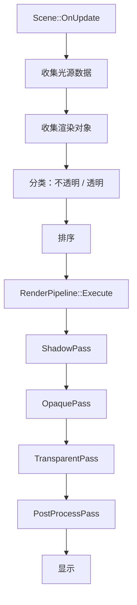

# Phase R7：多 Pass 渲染框架

> **文档版本**：v1.1  
> **创建日期**：2026-04-07  
> **更新日期**：2026-04-15  
> **优先级**：?? P2  
> **预计工作量**：5-7 天  
> **前置依赖**：Phase R3（多光源）? 已完成、Phase R4（阴影系统）  
> **文档说明**：本文档详细描述如何将当前的单 Pass 渲染流程重构为可扩展的多 Pass 渲染管线，支持 Shadow Pass、Depth Prepass、Opaque Pass、Transparent Pass 等，参考 Unity SRP（Scriptable Render Pipeline）的设计思路。所有代码可直接对照实现。

---

## 目录

- [一、现状分析](#一现状分析)
- [二、改进目标](#二改进目标)
- [三、涉及的文件清单](#三涉及的文件清单)
- [四、方案选择](#四方案选择)
  - [4.1 渲染管线架构选择](#41-渲染管线架构选择)
  - [4.2 透明物体排序方案](#42-透明物体排序方案)
- [五、核心类设计](#五核心类设计)
  - [5.1 RenderPass 基类](#51-renderpass-基类)
  - [5.2 RenderPipeline 管理器](#52-renderpipeline-管理器)
  - [5.3 RenderQueue 渲染队列](#53-renderqueue-渲染队列)
  - [5.4 RenderObject 渲染对象](#54-renderobject-渲染对象)
- [六、内置 RenderPass](#六内置-renderpass)
  - [6.1 ShadowPass](#61-shadowpass)
  - [6.2 DepthPrepass（可选）](#62-depthprepass可选)
  - [6.3 OpaquePass](#63-opaquepass)
  - [6.4 SkyboxPass（可选）](#64-skyboxpass可选)
  - [6.5 TransparentPass](#65-transparentpass)
  - [6.6 PostProcessPass](#66-postprocesspass)
- [七、RenderPass 基类实现](#七renderpass-基类实现)
- [八、RenderPipeline 实现](#八renderpipeline-实现)
- [九、RenderQueue 实现](#九renderqueue-实现)
- [十、各 Pass 详细实现](#十各-pass-详细实现)
  - [10.1 ShadowPass](#101-shadowpass)
  - [10.2 OpaquePass](#102-opaquepass)
  - [10.3 TransparentPass](#103-transparentpass)
  - [10.4 PostProcessPass](#104-postprocesspass)
- [十一、Scene 集成](#十一scene-集成)
  - [11.1 渲染对象收集](#111-渲染对象收集)
  - [11.2 新的渲染流程](#112-新的渲染流程)
- [十二、Renderer3D 重构](#十二renderer3d-重构)
- [十三、透明物体渲染](#十三透明物体渲染)
  - [13.1 透明度判断](#131-透明度判断)
  - [13.2 排序策略](#132-排序策略)
  - [13.3 渲染状态](#133-渲染状态)
- [十四、验证方法](#十四验证方法)
- [十五、设计决策记录](#十五设计决策记录)

---

## 一、现状分析

> **注意**：本节已根据 2026-04-15 的实际代码状态更新。

### 当前渲染流程

```cpp
// 当前：所有物体在一个 Pass 中渲染，无排序
Renderer3D::BeginScene(camera, lightData);
{
    for (auto entity : meshGroup)
    {
        Renderer3D::DrawMesh(transform, mesh, materials);
    }
}
Renderer3D::EndScene();  // 当前为空实现
```

### 当前已完成的前置功能

| 功能 | 状态 | 说明 |
|------|------|------|
| PBR Shader（Phase R2） | ? 已完成 | `Standard.frag` 完整 PBR |
| 多光源支持（Phase R3） | ? 已完成 | 方向光×4 + 点光源×8 + 聚光灯×4 |
| 场景序列化 | ? 已完成 | YAML 格式 `.luck3d` 文件 |
| 材质系统 | ? 已完成 | Shader 内省 + `unordered_map` 属性存储 |
| 5 种内置图元 | ? 已完成 | Cube / Plane / Sphere / Cylinder / Capsule |

### 问题

| 编号 | 问题 | 影响 |
|------|------|------|
| R7-01 | 单 Pass 渲染 | 无法区分不透明和透明物体 |
| R7-02 | 无渲染排序 | 透明物体渲染顺序错误 |
| R7-03 | 渲染流程硬编码 | 无法灵活添加/移除 Pass |
| R7-04 | `EndScene()` 为空实现 | 无法在结束时执行排序绘制或后处理 |
| R7-05 | 无 Depth Prepass | 复杂场景存在 Overdraw |

---

## 二、改进目标

1. **RenderPass 抽象**：将渲染流程拆分为独立的 Pass
2. **RenderPipeline**：管理 Pass 的执行顺序
3. **RenderQueue**：渲染对象排序（前后排序、材质排序）
4. **透明物体支持**：正确的从后到前排序渲染
5. **可扩展性**：方便添加新的 Pass（如 Depth Prepass、Skybox Pass）

---

## 三、涉及的文件清单

| 文件路径 | 操作 | 说明 |
|---------|------|------|
| `Lucky/Source/Lucky/Renderer/RenderPass.h` | **新建** | RenderPass 基类 |
| `Lucky/Source/Lucky/Renderer/RenderPipeline.h` | **新建** | 渲染管线管理器 |
| `Lucky/Source/Lucky/Renderer/RenderPipeline.cpp` | **新建** | 渲染管线实现 |
| `Lucky/Source/Lucky/Renderer/RenderQueue.h` | **新建** | 渲染队列 |
| `Lucky/Source/Lucky/Renderer/RenderQueue.cpp` | **新建** | 渲染队列实现 |
| `Lucky/Source/Lucky/Renderer/Passes/ShadowPass.h` | **新建** | 阴影 Pass |
| `Lucky/Source/Lucky/Renderer/Passes/ShadowPass.cpp` | **新建** | 阴影 Pass 实现 |
| `Lucky/Source/Lucky/Renderer/Passes/OpaquePass.h` | **新建** | 不透明物体 Pass |
| `Lucky/Source/Lucky/Renderer/Passes/OpaquePass.cpp` | **新建** | 不透明物体 Pass 实现 |
| `Lucky/Source/Lucky/Renderer/Passes/TransparentPass.h` | **新建** | 透明物体 Pass |
| `Lucky/Source/Lucky/Renderer/Passes/TransparentPass.cpp` | **新建** | 透明物体 Pass 实现 |
| `Lucky/Source/Lucky/Renderer/Passes/PostProcessPass.h` | **新建** | 后处理 Pass |
| `Lucky/Source/Lucky/Renderer/Passes/PostProcessPass.cpp` | **新建** | 后处理 Pass 实现 |
| `Lucky/Source/Lucky/Renderer/Renderer3D.h` | 修改 | 集成 RenderPipeline |
| `Lucky/Source/Lucky/Renderer/Renderer3D.cpp` | 修改 | 重构渲染流程 |
| `Lucky/Source/Lucky/Scene/Scene.cpp` | 修改 | 使用新的渲染流程 |

---

## 四、方案选择

### 4.1 渲染管线架构选择

| 方案 | 说明 | 优点 | 缺点 | 推荐 |
|------|------|------|------|------|
| **方案 A：线性 Pass 链（推荐）** | Pass 按固定顺序执行 | 简单直观，易于调试 | 灵活性有限 | ? |
| 方案 B：RenderGraph（依赖图） | Pass 之间声明依赖关系，自动排序 | 最灵活，可自动优化 | 实现复杂 | 后续优化 |
| 方案 C：Unity SRP 风格 | ScriptableRenderContext + RenderPass | 与 Unity 一致 | 过度设计 | |

**推荐方案 A**：线性 Pass 链。简单直观，满足当前需求。后续可升级为 RenderGraph。

### 4.2 透明物体排序方案

| 方案 | 说明 | 优点 | 缺点 | 推荐 |
|------|------|------|------|------|
| **方案 A：按距离排序（推荐）** | 按物体中心到相机的距离从远到近排序 | 简单，大多数情况正确 | 物体交叉时不正确 | ? |
| 方案 B：OIT（Order-Independent Transparency） | 无需排序的透明渲染 | 完全正确 | 实现复杂，性能开销大 | 后续优化 |

**推荐方案 A**：按距离排序。简单有效，覆盖大多数场景。

---

## 五、核心类设计

### 5.1 RenderPass 基类

```cpp
// Lucky/Source/Lucky/Renderer/RenderPass.h
#pragma once

#include "Lucky/Core/Base.h"
#include "Framebuffer.h"
#include "RenderCommand.h"

namespace Lucky
{
    // 前向声明
    class RenderQueue;
    class EditorCamera;
    struct SceneLightData;
    
    /// <summary>
    /// 渲染 Pass 基类
    /// 每个 Pass 负责渲染管线中的一个阶段
    /// </summary>
    class RenderPass
    {
    public:
        virtual ~RenderPass() = default;
        
        /// <summary>
        /// 初始化 Pass（创建 FBO、加载 Shader 等）
        /// 在 RenderPipeline::Init() 中调用
        /// </summary>
        virtual void Init() = 0;
        
        /// <summary>
        /// 设置 Pass（绑定 FBO、设置渲染状态）
        /// 在每帧 Execute 之前调用
        /// </summary>
        virtual void Setup(const EditorCamera& camera, const SceneLightData& lightData) = 0;
        
        /// <summary>
        /// 执行 Pass（渲染物体）
        /// </summary>
        /// <param name="queue">渲染队列（已排序的渲染对象列表）</param>
        virtual void Execute(const RenderQueue& queue) = 0;
        
        /// <summary>
        /// 清理 Pass（解绑 FBO、恢复渲染状态）
        /// </summary>
        virtual void Cleanup() = 0;
        
        /// <summary>
        /// 调整大小
        /// </summary>
        virtual void Resize(uint32_t width, uint32_t height) {}
        
        /// <summary>
        /// 获取 Pass 名称
        /// </summary>
        virtual const std::string& GetName() const = 0;
        
        bool Enabled = true;
    };
}
```

### 5.2 RenderPipeline 管理器

```cpp
// Lucky/Source/Lucky/Renderer/RenderPipeline.h
#pragma once

#include "RenderPass.h"
#include "RenderQueue.h"

namespace Lucky
{
    /// <summary>
    /// 渲染管线：管理和执行所有 RenderPass
    /// </summary>
    class RenderPipeline
    {
    public:
        /// <summary>
        /// 初始化管线（初始化所有 Pass）
        /// </summary>
        void Init();
        
        /// <summary>
        /// 释放资源
        /// </summary>
        void Shutdown();
        
        /// <summary>
        /// 添加 RenderPass
        /// </summary>
        void AddPass(Ref<RenderPass> pass);
        
        /// <summary>
        /// 移除 RenderPass
        /// </summary>
        void RemovePass(const std::string& name);
        
        /// <summary>
        /// 获取指定类型的 Pass
        /// </summary>
        template<typename T>
        Ref<T> GetPass() const;
        
        /// <summary>
        /// 执行所有 Pass
        /// </summary>
        void Execute(const EditorCamera& camera, const SceneLightData& lightData, 
                    const RenderQueue& opaqueQueue, const RenderQueue& transparentQueue);
        
        /// <summary>
        /// 调整大小
        /// </summary>
        void Resize(uint32_t width, uint32_t height);
        
    private:
        std::vector<Ref<RenderPass>> m_Passes;
    };
}
```

### 5.3 RenderQueue 渲染队列

```cpp
// Lucky/Source/Lucky/Renderer/RenderQueue.h
#pragma once

#include "Mesh.h"
#include "Material.h"
#include <glm/glm.hpp>

namespace Lucky
{
    /// <summary>
    /// 渲染对象：一个待渲染的网格实例
    /// </summary>
    struct RenderObject
    {
        glm::mat4 Transform;                    // 模型矩阵
        Ref<Mesh> MeshData;                     // 网格数据
        std::vector<Ref<Material>> Materials;   // 材质列表
        float DistanceToCamera = 0.0f;          // 到相机的距离（用于排序）
        uint32_t SortKey = 0;                   // 排序键（用于材质排序）
    };
    
    /// <summary>
    /// 排序模式
    /// </summary>
    enum class SortMode
    {
        None,           // 不排序
        FrontToBack,    // 从前到后（不透明物体，减少 Overdraw）
        BackToFront,    // 从后到前（透明物体，正确混合）
    };
    
    /// <summary>
    /// 渲染队列：存储和排序渲染对象
    /// </summary>
    class RenderQueue
    {
    public:
        /// <summary>
        /// 添加渲染对象
        /// </summary>
        void Add(const RenderObject& obj);
        
        /// <summary>
        /// 排序
        /// </summary>
        void Sort(SortMode mode);
        
        /// <summary>
        /// 清空队列
        /// </summary>
        void Clear();
        
        /// <summary>
        /// 获取所有渲染对象
        /// </summary>
        const std::vector<RenderObject>& GetObjects() const { return m_Objects; }
        
        /// <summary>
        /// 获取渲染对象数量
        /// </summary>
        size_t Size() const { return m_Objects.size(); }
        
        /// <summary>
        /// 是否为空
        /// </summary>
        bool Empty() const { return m_Objects.empty(); }
        
    private:
        std::vector<RenderObject> m_Objects;
    };
}
```

### 5.4 RenderQueue 实现

```cpp
// Lucky/Source/Lucky/Renderer/RenderQueue.cpp
#include "lcpch.h"
#include "RenderQueue.h"
#include <algorithm>

namespace Lucky
{
    void RenderQueue::Add(const RenderObject& obj)
    {
        m_Objects.push_back(obj);
    }
    
    void RenderQueue::Sort(SortMode mode)
    {
        switch (mode)
        {
            case SortMode::FrontToBack:
                std::sort(m_Objects.begin(), m_Objects.end(),
                    [](const RenderObject& a, const RenderObject& b)
                    {
                        return a.DistanceToCamera < b.DistanceToCamera;
                    });
                break;
                
            case SortMode::BackToFront:
                std::sort(m_Objects.begin(), m_Objects.end(),
                    [](const RenderObject& a, const RenderObject& b)
                    {
                        return a.DistanceToCamera > b.DistanceToCamera;
                    });
                break;
                
            case SortMode::None:
            default:
                break;
        }
    }
    
    void RenderQueue::Clear()
    {
        m_Objects.clear();
    }
}
```

---

## 六、内置 RenderPass

### 6.1 ShadowPass

| 属性 | 值 |
|------|-----|
| 渲染目标 | Shadow Map FBO（DEPTH_COMPONENT） |
| 渲染对象 | 所有不透明物体 |
| Shader | Shadow.vert + Shadow.frag |
| 排序 | 无（只输出深度） |

### 6.2 DepthPrepass（可选）

| 属性 | 值 |
|------|-----|
| 渲染目标 | 主 FBO（只写深度） |
| 渲染对象 | 所有不透明物体 |
| Shader | 简单的深度输出 Shader |
| 排序 | 从前到后 |
| 说明 | 减少后续 Pass 的 Overdraw |

> **注意**：Depth Prepass 是可选的优化。对于简单场景不需要，复杂场景可以显著减少 Fragment Shader 执行次数。

### 6.3 OpaquePass

| 属性 | 值 |
|------|-----|
| 渲染目标 | HDR FBO（RGBA16F） |
| 渲染对象 | 所有不透明物体 |
| Shader | Standard.vert + Standard.frag（PBR） |
| 排序 | 从前到后（减少 Overdraw） |
| 深度测试 | 启用 |
| 深度写入 | 启用 |
| 混合 | 禁用 |

### 6.4 SkyboxPass（可选）

| 属性 | 值 |
|------|-----|
| 渲染目标 | HDR FBO |
| 渲染对象 | Skybox Cube |
| Shader | Skybox.vert + Skybox.frag |
| 深度测试 | 启用（深度 = 1.0） |
| 深度写入 | 禁用 |
| 说明 | 在不透明物体之后渲染，利用 Early-Z 跳过被遮挡的天空像素 |

### 6.5 TransparentPass

| 属性 | 值 |
|------|-----|
| 渲染目标 | HDR FBO |
| 渲染对象 | 所有透明物体 |
| Shader | Standard.vert + Standard.frag（PBR） |
| 排序 | 从后到前（正确混合） |
| 深度测试 | 启用 |
| 深度写入 | **禁用** |
| 混合 | 启用（SrcAlpha, OneMinusSrcAlpha） |

### 6.6 PostProcessPass

| 属性 | 值 |
|------|-----|
| 渲染目标 | 最终显示 FBO |
| 渲染对象 | 全屏 Quad |
| Shader | Tonemapping + 后处理效果 |
| 说明 | 执行 PostProcessStack + Tonemapping |

---

## 七、RenderPass 基类实现

已在第五节中定义。每个具体 Pass 继承 `RenderPass` 并实现四个虚函数：`Init()`、`Setup()`、`Execute()`、`Cleanup()`。

---

## 八、RenderPipeline 实现

```cpp
// Lucky/Source/Lucky/Renderer/RenderPipeline.cpp
#include "lcpch.h"
#include "RenderPipeline.h"

namespace Lucky
{
    void RenderPipeline::Init()
    {
        for (auto& pass : m_Passes)
        {
            pass->Init();
        }
    }
    
    void RenderPipeline::Shutdown()
    {
        m_Passes.clear();
    }
    
    void RenderPipeline::AddPass(Ref<RenderPass> pass)
    {
        m_Passes.push_back(pass);
    }
    
    void RenderPipeline::RemovePass(const std::string& name)
    {
        m_Passes.erase(
            std::remove_if(m_Passes.begin(), m_Passes.end(),
                [&name](const Ref<RenderPass>& pass) { return pass->GetName() == name; }),
            m_Passes.end()
        );
    }
    
    void RenderPipeline::Execute(const EditorCamera& camera, const SceneLightData& lightData,
                                 const RenderQueue& opaqueQueue, const RenderQueue& transparentQueue)
    {
        for (auto& pass : m_Passes)
        {
            if (!pass->Enabled)
                continue;
            
            pass->Setup(camera, lightData);
            
            // 根据 Pass 类型传递不同的队列
            // ShadowPass 和 OpaquePass 使用 opaqueQueue
            // TransparentPass 使用 transparentQueue
            // PostProcessPass 不需要队列
            pass->Execute(opaqueQueue);  // 简化：具体 Pass 内部决定使用哪个队列
            
            pass->Cleanup();
        }
    }
    
    void RenderPipeline::Resize(uint32_t width, uint32_t height)
    {
        for (auto& pass : m_Passes)
        {
            pass->Resize(width, height);
        }
    }
}
```

> **改进方案**：`Execute` 方法可以接收一个 `RenderContext` 结构体，包含所有需要的数据（相机、光源、队列等），而不是直接传递多个参数。

```cpp
/// <summary>
/// 渲染上下文：包含一帧渲染所需的所有数据
/// </summary>
struct RenderContext
{
    const EditorCamera* Camera;
    const SceneLightData* LightData;
    RenderQueue OpaqueQueue;
    RenderQueue TransparentQueue;
    uint32_t ViewportWidth;
    uint32_t ViewportHeight;
};
```

---

## 九、RenderQueue 实现

已在第五节中定义。

---

## 十、各 Pass 详细实现

### 10.1 ShadowPass

```cpp
// Lucky/Source/Lucky/Renderer/Passes/ShadowPass.h
#pragma once

#include "Lucky/Renderer/RenderPass.h"

namespace Lucky
{
    class ShadowPass : public RenderPass
    {
    public:
        void Init() override;
        void Setup(const EditorCamera& camera, const SceneLightData& lightData) override;
        void Execute(const RenderQueue& queue) override;
        void Cleanup() override;
        void Resize(uint32_t width, uint32_t height) override;
        const std::string& GetName() const override { static std::string name = "ShadowPass"; return name; }
        
        /// <summary>
        /// 获取 Shadow Map 纹理 ID（供 OpaquePass 使用）
        /// </summary>
        uint32_t GetShadowMapTextureID() const;
        
        /// <summary>
        /// 获取 Light Space Matrix（供 OpaquePass 使用）
        /// </summary>
        const glm::mat4& GetLightSpaceMatrix() const { return m_LightSpaceMatrix; }
        
    private:
        Ref<Framebuffer> m_ShadowMapFBO;
        Ref<Shader> m_ShadowShader;
        glm::mat4 m_LightSpaceMatrix;
        uint32_t m_Resolution = 2048;
    };
}
```

```cpp
// ShadowPass.cpp
void ShadowPass::Init()
{
    // 创建 Shadow Map FBO
    FramebufferSpecification spec;
    spec.Width = m_Resolution;
    spec.Height = m_Resolution;
    spec.Attachments = { FramebufferTextureFormat::DEPTH_COMPONENT };
    m_ShadowMapFBO = Framebuffer::Create(spec);
    
    // 加载 Shadow Shader
    m_ShadowShader = Shader::Create("Assets/Shaders/Shadow");
}

void ShadowPass::Setup(const EditorCamera& camera, const SceneLightData& lightData)
{
    // 计算 Light Space Matrix
    if (lightData.DirectionalLightCount > 0)
    {
        m_LightSpaceMatrix = CalculateDirectionalLightSpaceMatrix(
            lightData.DirectionalLights[0].Direction
        );
    }
    
    // 绑定 Shadow Map FBO
    m_ShadowMapFBO->Bind();
    RenderCommand::SetViewport(0, 0, m_Resolution, m_Resolution);
    RenderCommand::Clear();
    
    // 正面剔除（减少 Shadow Acne）
    glCullFace(GL_FRONT);
    
    m_ShadowShader->Bind();
    m_ShadowShader->SetMat4("u_LightSpaceMatrix", m_LightSpaceMatrix);
}

void ShadowPass::Execute(const RenderQueue& queue)
{
    for (const auto& obj : queue.GetObjects())
    {
        m_ShadowShader->SetMat4("u_ObjectToWorldMatrix", obj.Transform);
        
        for (const auto& sm : obj.MeshData->GetSubMeshes())
        {
            RenderCommand::DrawIndexedRange(obj.MeshData->GetVertexArray(), sm.IndexOffset, sm.IndexCount);
        }
    }
}

void ShadowPass::Cleanup()
{
    glCullFace(GL_BACK);  // 恢复默认
    m_ShadowMapFBO->Unbind();
}
```

### 10.2 OpaquePass

```cpp
// Lucky/Source/Lucky/Renderer/Passes/OpaquePass.h
#pragma once

#include "Lucky/Renderer/RenderPass.h"

namespace Lucky
{
    class ShadowPass;  // 前向声明
    
    class OpaquePass : public RenderPass
    {
    public:
        void Init() override;
        void Setup(const EditorCamera& camera, const SceneLightData& lightData) override;
        void Execute(const RenderQueue& queue) override;
        void Cleanup() override;
        void Resize(uint32_t width, uint32_t height) override;
        const std::string& GetName() const override { static std::string name = "OpaquePass"; return name; }
        
        /// <summary>
        /// 设置 Shadow Pass 引用（用于获取 Shadow Map）
        /// </summary>
        void SetShadowPass(Ref<ShadowPass> shadowPass) { m_ShadowPass = shadowPass; }
        
        /// <summary>
        /// 获取 HDR FBO（供后续 Pass 使用）
        /// </summary>
        Ref<Framebuffer> GetHDR_FBO() const { return m_HDR_FBO; }
        
    private:
        Ref<Framebuffer> m_HDR_FBO;
        Ref<ShadowPass> m_ShadowPass;
    };
}
```

```cpp
// OpaquePass.cpp
void OpaquePass::Init()
{
    FramebufferSpecification spec;
    spec.Width = 1920;
    spec.Height = 1080;
    spec.Attachments = {
        FramebufferTextureFormat::RGBA16F,          // HDR 颜色
        FramebufferTextureFormat::RED_INTEGER,       // Entity ID
        FramebufferTextureFormat::DEFPTH24STENCIL8   // 深度模板
    };
    m_HDR_FBO = Framebuffer::Create(spec);
}

void OpaquePass::Setup(const EditorCamera& camera, const SceneLightData& lightData)
{
    m_HDR_FBO->Bind();
    RenderCommand::SetClearColor({ 0.0f, 0.0f, 0.0f, 1.0f });
    RenderCommand::Clear();
    
    // 绑定 Shadow Map 纹理到指定槽位
    if (m_ShadowPass)
    {
        glActiveTexture(GL_TEXTURE15);  // 使用高位槽位避免与材质纹理冲突
        glBindTexture(GL_TEXTURE_2D, m_ShadowPass->GetShadowMapTextureID());
    }
    
    // 渲染状态
    RenderCommand::EnableDepthTest(true);
    RenderCommand::EnableDepthWrite(true);
    RenderCommand::EnableBlending(false);
}

void OpaquePass::Execute(const RenderQueue& queue)
{
    for (const auto& obj : queue.GetObjects())
    {
        // 绑定材质和 Shader
        for (size_t i = 0; i < obj.MeshData->GetSubMeshes().size(); ++i)
        {
            const auto& sm = obj.MeshData->GetSubMeshes()[i];
            
            // 选择材质
            Ref<Material> material;
            if (i < obj.Materials.size() && obj.Materials[i])
                material = obj.Materials[i];
            else
                material = GetDefaultMaterial();
            
            // 绑定 Shader
            material->GetShader()->Bind();
            material->GetShader()->SetMat4("u_ObjectToWorldMatrix", obj.Transform);
            
            // 设置 Shadow Map uniform
            if (m_ShadowPass)
            {
                material->GetShader()->SetMat4("u_LightSpaceMatrix", m_ShadowPass->GetLightSpaceMatrix());
                material->GetShader()->SetInt("u_ShadowMap", 15);
            }
            
            // 应用材质属性
            material->Apply();
            
            // 绘制
            RenderCommand::DrawIndexedRange(obj.MeshData->GetVertexArray(), sm.IndexOffset, sm.IndexCount);
        }
    }
}

void OpaquePass::Cleanup()
{
    m_HDR_FBO->Unbind();
}
```

### 10.3 TransparentPass

```cpp
// TransparentPass.cpp
void TransparentPass::Setup(const EditorCamera& camera, const SceneLightData& lightData)
{
    // 使用与 OpaquePass 相同的 HDR FBO（不清除，叠加渲染）
    m_HDR_FBO->Bind();
    
    // 渲染状态：启用混合，禁用深度写入
    RenderCommand::EnableDepthTest(true);
    RenderCommand::EnableDepthWrite(false);     // 不写入深度
    RenderCommand::EnableBlending(true);
    RenderCommand::SetBlendFunc(GL_SRC_ALPHA, GL_ONE_MINUS_SRC_ALPHA);
}

void TransparentPass::Execute(const RenderQueue& queue)
{
    // queue 已经按从后到前排序
    for (const auto& obj : queue.GetObjects())
    {
        // 与 OpaquePass 相同的绘制逻辑
        // ...
    }
}

void TransparentPass::Cleanup()
{
    // 恢复默认渲染状态
    RenderCommand::EnableDepthWrite(true);
    RenderCommand::EnableBlending(false);
    m_HDR_FBO->Unbind();
}
```

### 10.4 PostProcessPass

```cpp
// PostProcessPass.cpp
void PostProcessPass::Execute(const RenderQueue& queue)
{
    // 获取 HDR 颜色纹理
    uint32_t hdrTexture = m_HDR_FBO->GetColorAttachmentRendererID(0);
    
    // 执行后处理栈（Phase R6）
    uint32_t processedTexture = m_PostProcessStack->Execute(hdrTexture, m_Width, m_Height);
    
    // Tonemapping（HDR → LDR）
    m_FinalFBO->Bind();
    m_TonemappingShader->Bind();
    m_TonemappingShader->SetFloat("u_Exposure", m_Exposure);
    m_TonemappingShader->SetInt("u_TonemapMode", m_TonemapMode);
    
    glActiveTexture(GL_TEXTURE0);
    glBindTexture(GL_TEXTURE_2D, processedTexture);
    m_TonemappingShader->SetInt("u_HDRTexture", 0);
    
    ScreenQuad::Draw();
    m_FinalFBO->Unbind();
}
```

---

## 十一、Scene 集成

### 11.1 渲染对象收集

```cpp
void Scene::OnUpdate(DeltaTime dt, EditorCamera& camera)
{
    // 收集光源数据（不变）
    SceneLightData sceneLightData;
    // ...
    
    // 收集渲染对象
    RenderQueue opaqueQueue;
    RenderQueue transparentQueue;
    
    auto meshGroup = m_Registry.group<TransformComponent>(entt::get<MeshFilterComponent, MeshRendererComponent>);
    for (auto entity : meshGroup)
    {
        auto [transform, meshFilter, meshRenderer] = meshGroup.get<TransformComponent, MeshFilterComponent, MeshRendererComponent>(entity);
        
        RenderObject obj;
        obj.Transform = transform.GetTransform();
        obj.MeshData = meshFilter.Mesh;
        obj.Materials = meshRenderer.Materials;
        
        // 计算到相机的距离
        glm::vec3 objPos = glm::vec3(obj.Transform[3]);
        obj.DistanceToCamera = glm::length(camera.GetPosition() - objPos);
        
        // 判断是否透明
        bool isTransparent = false;
        for (const auto& mat : obj.Materials)
        {
            if (mat && mat->IsTransparent())
            {
                isTransparent = true;
                break;
            }
        }
        
        if (isTransparent)
            transparentQueue.Add(obj);
        else
            opaqueQueue.Add(obj);
    }
    
    // 排序
    opaqueQueue.Sort(SortMode::FrontToBack);
    transparentQueue.Sort(SortMode::BackToFront);
    
    // 执行渲染管线
    Renderer3D::GetPipeline().Execute(camera, sceneLightData, opaqueQueue, transparentQueue);
}
```

### 11.2 新的渲染流程



---

## 十二、Renderer3D 重构

```cpp
// Renderer3D.h
class Renderer3D
{
public:
    static void Init();
    static void Shutdown();
    
    /// <summary>
    /// 获取渲染管线
    /// </summary>
    static RenderPipeline& GetPipeline();
    
    // ... 保留 DrawMesh 等方法用于向后兼容 ...
};

// Renderer3D.cpp
void Renderer3D::Init()
{
    // ... 现有初始化 ...
    
    // 创建渲染管线
    auto shadowPass = CreateRef<ShadowPass>();
    auto opaquePass = CreateRef<OpaquePass>();
    auto transparentPass = CreateRef<TransparentPass>();
    auto postProcessPass = CreateRef<PostProcessPass>();
    
    // 设置 Pass 之间的依赖
    opaquePass->SetShadowPass(shadowPass);
    transparentPass->SetHDR_FBO(opaquePass->GetHDR_FBO());
    postProcessPass->SetHDR_FBO(opaquePass->GetHDR_FBO());
    
    // 按顺序添加 Pass
    s_Data.Pipeline.AddPass(shadowPass);
    s_Data.Pipeline.AddPass(opaquePass);
    s_Data.Pipeline.AddPass(transparentPass);
    s_Data.Pipeline.AddPass(postProcessPass);
    
    s_Data.Pipeline.Init();
}
```

---

## 十三、透明物体渲染

### 13.1 透明度判断

在 `Material` 类中添加透明度判断：

```cpp
// Material.h 新增
/// <summary>
/// 判断材质是否透明
/// 基于 Albedo 的 Alpha 值或显式设置
/// </summary>
bool IsTransparent() const;

/// <summary>
/// 设置渲染模式
/// </summary>
enum class RenderMode { Opaque, Transparent };
RenderMode GetRenderMode() const { return m_RenderMode; }
void SetRenderMode(RenderMode mode) { m_RenderMode = mode; }

private:
    RenderMode m_RenderMode = RenderMode::Opaque;
```

### 13.2 排序策略

```
不透明物体：从前到后排序
  - 利用 Early-Z 测试跳过被遮挡的片段
  - 减少 Fragment Shader 执行次数

透明物体：从后到前排序
  - 确保混合顺序正确
  - 远处的物体先渲染，近处的物体后渲染
```

### 13.3 渲染状态

```cpp
// 不透明物体渲染状态
glEnable(GL_DEPTH_TEST);
glDepthMask(GL_TRUE);       // 写入深度
glDisable(GL_BLEND);

// 透明物体渲染状态
glEnable(GL_DEPTH_TEST);
glDepthMask(GL_FALSE);      // 不写入深度
glEnable(GL_BLEND);
glBlendFunc(GL_SRC_ALPHA, GL_ONE_MINUS_SRC_ALPHA);
```

---

## 十四、验证方法

### 14.1 Pass 执行顺序验证

1. 在每个 Pass 的 `Setup()` 和 `Cleanup()` 中添加日志
2. 确认执行顺序：Shadow → Opaque → Transparent → PostProcess

### 14.2 不透明物体排序验证

1. 创建多个重叠的不透明物体
2. 确认渲染结果正确（前面的物体遮挡后面的）
3. 检查 GPU 性能计数器，确认 Overdraw 减少

### 14.3 透明物体验证

1. 创建一个透明物体（Alpha < 1.0）放在不透明物体前面
2. 确认可以透过透明物体看到后面的不透明物体
3. 创建多个重叠的透明物体，确认混合顺序正确

### 14.4 Shadow + Transparent 验证

1. 确认透明物体不投射阴影（或可选投射）
2. 确认透明物体可以接收阴影

---

## 十五、设计决策记录

| 决策 | 选择 | 原因 |
|------|------|------|
| 管线架构 | 线性 Pass 链 | 简单直观，满足当前需求 |
| 透明排序 | 按距离从后到前 | 简单有效，覆盖大多数场景 |
| Pass 间通信 | 直接引用（SetShadowPass 等） | 简单，Pass 数量少时足够 |
| RenderQueue | 独立类 | 解耦排序逻辑和渲染逻辑 |
| RenderObject | 值类型 struct | 简单，避免智能指针开销 |
| 透明度判断 | Material::RenderMode | 显式设置，避免自动判断的歧义 |
| Depth Prepass | 可选（默认禁用） | 简单场景不需要，复杂场景可启用 |
| RenderContext | 推荐使用 | 减少 Execute 参数数量，便于扩展 |
