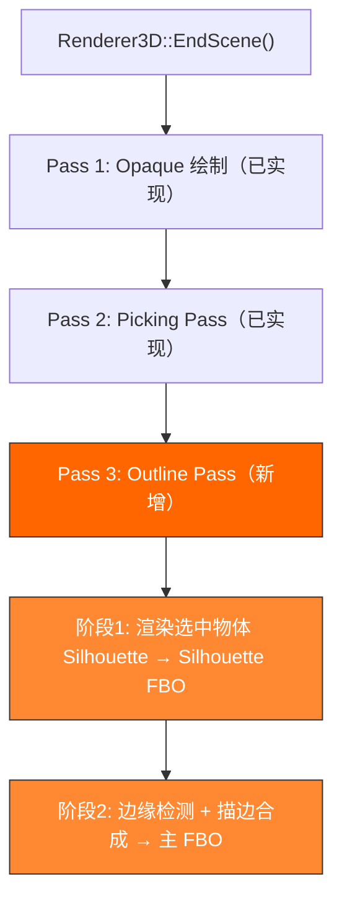
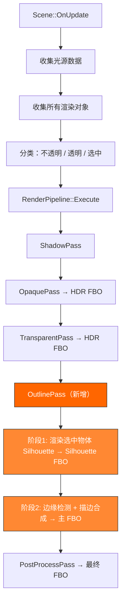

# Phase R8：选中项描边（Selection Outline）

> **文档版本**：v1.2  
> **创建日期**：2026-04-08  
> **更新日期**：2026-04-23  
> **优先级**：?? P2
> **预计工作量**：4-5 天  
> **前置依赖**：Phase R7（多 Pass 渲染框架）、Phase R6（后处理框架）  
> **临时实现前置依赖**：无（可在 R7/R6 完成前先行实现）  
> **文档说明**：本文档详细描述如何实现类似 Unity Scene View 的选中项描边功能。采用后处理方式（Screen-Space Outline），将选中物体渲染到单独的 Silhouette FBO，然后通过边缘检测在屏幕空间叠加橙色描边。文档包含两种实现路径：**临时内联实现**（在当前 `Renderer3D::EndScene()` 中内联，与 Picking Pass 同级）和 **R7 集成实现**（作为独立 `OutlinePass` 类插入 RenderPipeline）。所有代码可直接对照实现。

---

## 目录

- [一、现状分析](#一现状分析)
- [二、改进目标](#二改进目标)
- [三、方案选择](#三方案选择)
  - [3.1 描边方案对比](#31-描边方案对比)
  - [3.2 边缘检测算法选择](#32-边缘检测算法选择)
- [四、涉及的文件清单](#四涉及的文件清单)
- [五、临时内联实现策略（R7 完成前）](#五临时内联实现策略r7-完成前)
  - [5.1 可行性分析](#51-可行性分析)
  - [5.2 与 Picking Pass 的对比](#52-与-picking-pass-的对比)
  - [5.3 临时实现渲染流程](#53-临时实现渲染流程)
  - [5.4 临时实现需要的资源](#54-临时实现需要的资源)
  - [5.5 Renderer3DData 扩展](#55-renderer3ddata-扩展)
  - [5.6 EndScene() 中内联 Outline Pass 完整代码](#56-endscene-中内联-outline-pass-完整代码)
  - [5.7 Renderer3D::Init() 扩展](#57-renderer3dinit-扩展)
  - [5.8 SceneViewportPanel 集成](#58-sceneviewportpanel-集成)
  - [5.9 CompositeOutline 读写同一 FBO 的问题与解决方案](#59-compositeoutline-读写同一-fbo-的问题与解决方案)
  - [5.10 R7 迁移指南](#510-r7-迁移指南)
- [六、整体架构设计（R7 集成后）](#六整体架构设计r7-集成后)
  - [6.1 渲染流程总览](#61-渲染流程总览)
  - [6.2 与 Phase R7 的集成关系](#62-与-phase-r7-的集成关系)
  - [6.3 数据流图](#63-数据流图)
- [七、核心类设计（R7 集成后）](#七核心类设计r7-集成后)
  - [7.1 OutlinePass（描边 Pass）](#71-outlinepass描边-pass)
  - [7.2 ScreenQuad（全屏四边形工具类）](#72-screenquad全屏四边形工具类)
- [八、Silhouette 渲染阶段](#八silhouette-渲染阶段)
  - [8.1 Silhouette FBO 配置](#81-silhouette-fbo-配置)
  - [8.2 Silhouette Shader](#82-silhouette-shader)
  - [8.3 选中物体收集](#83-选中物体收集)
- [九、边缘检测与描边合成阶段](#九边缘检测与描边合成阶段)
  - [9.1 OutlineComposite Shader](#91-outlinecomposite-shader)
  - [9.2 描边参数配置](#92-描边参数配置)
- [十、OutlinePass 完整实现（R7 集成后）](#十outlinepass-完整实现r7-集成后)
- [十一、ScreenQuad 实现](#十一screenquad-实现)
- [十二、RenderPipeline 集成（R7 集成后）](#十二renderpipeline-集成r7-集成后)
  - [12.1 Pass 执行顺序](#121-pass-执行顺序)
  - [12.2 RenderContext 扩展](#122-rendercontext-扩展)
  - [12.3 Scene 中的选中物体收集](#123-scene-中的选中物体收集)
- [十三、Renderer3D 集成（R7 集成后）](#十三renderer3d-集成r7-集成后)
- [十四、编辑器集成](#十四编辑器集成)
  - [14.1 描边参数面板](#141-描边参数面板)
  - [14.2 多选支持（扩展）](#142-多选支持扩展)
- [十五、验证方法](#十五验证方法)
- [十六、性能分析](#十六性能分析)
- [十七、后续扩展](#十七后续扩展)
- [十八、设计决策记录](#十八设计决策记录)

---

## 一、现状分析

> **注意**：本节已根据 2026-04-15 的实际代码状态更新。

### 当前选择系统

```cpp
// SelectionManager：静态类，存储当前选中实体的 UUID
struct SelectionManager
{
    static void Select(UUID selectionID);
    static bool IsSelected(UUID selectionID);
    static void Deselect();
    static UUID GetSelection();
};
```

### 当前渲染流程

```
当前：双 Pass 内联 Forward 渲染（Opaque + Picking）
SceneViewportPanel::OnUpdate
  → Framebuffer::Bind()                    // 绑定主 FBO（RGBA8 + RED_INTEGER + DEPTH）
  → Scene::OnUpdate()
      → 收集光源数据（DirectionalLight / PointLight / SpotLight）
      → Renderer3D::BeginScene()             // 设置 Camera UBO + Light UBO
      → Renderer3D::DrawMesh() × N           // 收集 DrawCommand（延迟提交）
      → Renderer3D::EndScene()
          → Pass 1: Opaque 绘制（排序 + 批量绘制）
          → Pass 2: Picking Pass（内联，复用 DrawCommands，写入 Attachment 1）
  → GizmoRenderer::BeginScene() / EndScene()
  → Framebuffer::Unbind()
```

### 当前已完成的前置功能

| 功能 | 状态 | 说明 |
|------|------|------|
| PBR Shader（Phase R2） | ? 已完成 | `Standard.frag` 完整 PBR |
| 多光源支持（Phase R3） | ? 已完成 | 方向光×4 + 点光源×8 + 聚光灯×4 |
| 场景序列化 | ? 已完成 | YAML 格式 `.luck3d` 文件 |
| 材质系统 | ? 已完成 | Shader 内省 + `unordered_map` 属性存储 |
| 5 种内置图元 | ? 已完成 | Cube / Plane / Sphere / Cylinder / Capsule |
| SelectionManager | ? 已完成 | 单选支持，存储选中实体 UUID |
| 鼠标拾取（Entity ID Buffer） | ? 已完成 | Picking Pass 内联在 `EndScene()` 中，写入 RED_INTEGER 附件 |
| DrawCommand 延迟提交 | ? 已完成 | 按 Shader ID 排序，减少状态切换 |
| Gizmo 渲染器 | ? 已完成 | 独立渲染路径，线段批处理 + 无限网格 |

### 当前帧缓冲配置

```cpp
// SceneViewportPanel 的帧缓冲（已实现）
FramebufferSpecification fbSpec;
fbSpec.Attachments = {
    FramebufferTextureFormat::RGBA8,        // 颜色缓冲区 0：最终显示
    FramebufferTextureFormat::RED_INTEGER,  // 颜色缓冲区 1：Entity ID（鼠标拾取）
    FramebufferTextureFormat::Depth         // 深度缓冲区
};
```

### 问题

| 编号 | 问题 | 影响 |
|------|------|------|
| R8-01 | 选中物体无视觉反馈 | 用户无法直观看到当前选中了哪个物体 |
| R8-02 | 缺少 ScreenQuad 工具类 | 后处理和描边都需要全屏四边形绘制 |
| R8-03 | 无独立的描边渲染通道 | 需要在 Pass 链中插入新的 Pass |

### 关键发现：临时内联实现可行性

通过分析当前代码，发现描边功能的**核心渲染逻辑**（Silhouette 渲染 + 边缘检测合成）与 R7 的 Pass 架构**完全无关**。R8 文档中对 R7 的依赖仅仅是**组织形式**上的（把代码放到 `OutlinePass` 类中），而非**功能逻辑**上的。因此，可以像 Picking Pass 一样，先在 `Renderer3D::EndScene()` 中内联实现，等 R7 完成后再提取为独立的 `OutlinePass` 类。详见第五章。

---

## 二、改进目标

1. **选中描边**：选中物体显示橙色描边，效果类似 Unity Scene View
2. **屏幕空间描边**：描边宽度在屏幕空间均匀，不受物体距离和法线影响
3. **可配置参数**：描边颜色、宽度可在编辑器中调整
4. **临时内联实现**：在 R7 完成前，像 Picking Pass 一样内联在 `Renderer3D::EndScene()` 中
5. **与 Phase R7 无缝集成**：R7 完成后，提取为独立的 `OutlinePass` 插入到 RenderPipeline 中
6. **ScreenQuad 工具类**：为后处理框架（Phase R6）和描边功能提供共用的全屏四边形绘制能力

---

## 三、方案选择

### 3.1 描边方案对比

| 方案 | 原理 | 描边均匀性 | 实现复杂度 | 性能开销 | 推荐 |
|------|------|-----------|-----------|---------|------|
| 方案 A：Stencil + 放大绘制 | 模板缓冲 + 沿法线膨胀 | ? 不均匀（依赖法线） | 低 | 低 | 快速原型 |
| **方案 B：后处理描边（推荐）** | Silhouette FBO + 边缘检测 | ? 均匀（屏幕空间像素级） | 中 | 中 | ? |
| 方案 C：JFA 描边 | Jump Flood Algorithm | ? 均匀 + 支持任意宽度 | 高 | 高 | 后续升级 |

**选择方案 B**，理由：

1. **描边质量最接近 Unity**：Unity 2019+ 的 URP/HDRP 选中描边就是后处理方式
2. **与 Phase R7 架构完美契合**：作为一个独立的 `RenderPass` 插入到 Pass 链中
3. **与 Phase R6 共享基础设施**：复用 `ScreenQuad`、FBO Ping-Pong 等后处理基础设施
4. **描边宽度均匀**：不受模型法线、距离影响，始终是屏幕空间像素级宽度

### 3.2 边缘检测算法选择

| 算法 | 原理 | 优点 | 缺点 | 推荐 |
|------|------|------|------|------|
| Sobel 算子 | 3×3 卷积核，计算水平和垂直梯度 | 经典，效果好 | 描边宽度固定为 1 像素 | |
| **扩展采样（推荐）** | 在 N×N 范围内采样 Silhouette，检测边缘 | 支持可变宽度 | 采样次数随宽度增加 | ? |
| Laplacian 算子 | 3×3 卷积核，计算二阶导数 | 简单 | 对噪声敏感 | |

**选择扩展采样方案**，理由：

1. 支持可变描边宽度（1~10 像素），用户可在编辑器中调整
2. 实现简单直观：在 Silhouette 纹理上，对每个像素在 N×N 范围内采样，如果当前像素为黑色（非选中区域）但采样范围内存在白色像素（选中区域），则该像素为描边像素
3. 性能可控：描边宽度 3 像素时仅需 7×7 = 49 次采样，完全可接受

---

## 四、涉及的文件清单

### 4.1 临时内联实现（R7 完成前）

| 文件路径 | 操作 | 说明 |
|---------|------|------|
| `Lucky/Source/Lucky/Renderer/ScreenQuad.h` | **新建** | 全屏四边形工具类头文件 |
| `Lucky/Source/Lucky/Renderer/ScreenQuad.cpp` | **新建** | 全屏四边形工具类实现 |
| `Luck3DApp/Assets/Shaders/Outline/Silhouette.vert` | **新建** | 轮廓顶点着色器 |
| `Luck3DApp/Assets/Shaders/Outline/Silhouette.frag` | **新建** | 轮廓片元着色器 |
| `Luck3DApp/Assets/Shaders/Outline/OutlineComposite.vert` | **新建** | 描边合成顶点着色器 |
| `Luck3DApp/Assets/Shaders/Outline/OutlineComposite.frag` | **新建** | 描边合成片元着色器 |
| `Lucky/Source/Lucky/Renderer/Renderer3D.h` | 修改 | 新增 Outline 相关接口 |
| `Lucky/Source/Lucky/Renderer/Renderer3D.cpp` | 修改 | `Renderer3DData` 新增 Silhouette FBO、Shader；`Init()` 初始化；`EndScene()` 内联 Outline Pass |
| `Lucky/Source/Lucky/Renderer/Renderer.cpp` | 修改 | `Init()` 中调用 `ScreenQuad::Init()`；`Shutdown()` 中调用 `ScreenQuad::Shutdown()` |
| `Luck3DApp/Source/Panels/SceneViewportPanel.cpp` | 修改 | Resize 时同步 Silhouette FBO 大小 |

### 4.2 R7 集成后（追加）

| 文件路径 | 操作 | 说明 |
|---------|------|------|
| `Lucky/Source/Lucky/Renderer/Passes/OutlinePass.h` | **新建** | 描边 Pass 头文件 |
| `Lucky/Source/Lucky/Renderer/Passes/OutlinePass.cpp` | **新建** | 描边 Pass 实现（从 `EndScene()` 内联代码提取） |
| `Lucky/Source/Lucky/Renderer/RenderPass.h` | 引用 | Phase R7 定义的 RenderPass 基类 |
| `Lucky/Source/Lucky/Renderer/RenderPipeline.h` | 修改 | 注册 OutlinePass |
| `Lucky/Source/Lucky/Renderer/RenderPipeline.cpp` | 修改 | 在 Pass 链中插入 OutlinePass |
| `Lucky/Source/Lucky/Renderer/Renderer3D.cpp` | 修改 | 移除内联代码，改用 Pipeline 管理 |
| `Lucky/Source/Lucky/Scene/Scene.cpp` | 修改 | 收集选中物体的渲染数据到 RenderContext |

---

## 五、临时内联实现策略（R7 完成前）

> **核心思路**：描边功能的核心渲染逻辑（Silhouette 渲染 + 边缘检测合成）与 R7 的 Pass 架构**完全无关**。R8 文档中对 R7 的依赖仅仅是**组织形式**上的（把代码放到 `OutlinePass` 类中），而非**功能逻辑**上的。因此，可以像 Picking Pass 一样，先在 `Renderer3D::EndScene()` 中内联实现，等 R7 完成后再提取为独立的 `OutlinePass` 类。

### 5.1 可行性分析

| 依赖项 | 是否依赖 R7 | 能否临时实现 | 说明 |
|--------|------------|-------------|------|
| **Silhouette FBO** | ? 不依赖 | ? 可以 | 独立的 FBO，只需在 `Renderer3DData` 中新增 |
| **Silhouette Shader** | ? 不依赖 | ? 可以 | 极简 Shader，只输出纯白色 |
| **OutlineComposite Shader** | ? 不依赖 | ? 可以 | 全屏后处理 Shader |
| **ScreenQuad** | ? 不依赖 | ? 可以 | 静态工具类，独立于 R7 |
| **RenderPass 基类** | ? 依赖 R7 | ?? 不需要 | 临时方案不需要继承 RenderPass |
| **RenderPipeline** | ? 依赖 R7 | ?? 不需要 | 临时方案不需要 Pipeline 管理 |
| **RenderQueue** | ? 依赖 R7 | ?? 不需要 | 可以直接复用 DrawCommands |
| **选中物体收集** | ? 不依赖 | ? 可以 | SelectionManager 已完成 |

### 5.2 与 Picking Pass 的对比

| 维度 | Picking Pass（已实现） | Outline Pass（待实现） |
|------|----------------------|----------------------|
| 额外 FBO | ? 不需要（写入已有附件） | ? 需要 Silhouette FBO |
| 额外 Shader | 1 个（EntityID） | 2 个（Silhouette + OutlineComposite） |
| 全屏后处理 | ? 不需要 | ? 需要（ScreenQuad） |
| 复用 DrawCommands | ? 全部复用 | ?? 需要筛选选中物体（通过 `SelectedEntityID` 匹配） |
| 内联复杂度 | 低（~30 行） | 中（~80 行） |
| R7 迁移成本 | 极低 | 低（提取为 OutlinePass 类） |

### 5.3 临时实现渲染流程



```
完整渲染流程：
SceneViewportPanel::OnUpdate
  → Framebuffer::Bind()                    // 绑定主 FBO
  → Scene::OnUpdate()
      → Renderer3D::BeginScene()
      → Renderer3D::DrawMesh() × N
      → Renderer3D::EndScene()
          → Pass 1: Opaque 绘制（排序 + 批量绘制 → Attachment 0）
          → Pass 2: Picking Pass（EntityID Shader → Attachment 1）
          → Pass 3: Outline Pass（新增）
              → 阶段1: Silhouette 渲染（选中物体 → Silhouette FBO）
              → 阶段2: 描边合成（边缘检测 + 叠加 → 主 FBO Attachment 0）
  → GizmoRenderer::BeginScene() / EndScene()
  → Framebuffer::Unbind()
```

### 5.4 临时实现需要的资源

| 资源 | 类型 | 说明 |
|------|------|------|
| `SilhouetteFBO` | `Ref<Framebuffer>` | 独立 FBO，RGBA8 格式，存储选中物体轮廓掩码 |
| `SilhouetteShader` | `Ref<Shader>` | 极简 Shader，只输出纯白色 |
| `OutlineCompositeShader` | `Ref<Shader>` | 全屏后处理 Shader，边缘检测 + 描边合成 |
| `ScreenQuad` | 静态工具类 | 全屏四边形 VAO/VBO，用于全屏后处理 |
| `SelectedEntityID` | `int` | 当前选中实体的 EntityID，用于从 DrawCommands 中筛选 |

### 5.5 Renderer3DData 扩展

```cpp
struct Renderer3DData
{
    // ... 现有字段 ...
    
    // ======== Outline Pass 资源（临时内联） ========
    Ref<Framebuffer> SilhouetteFBO;             // Silhouette FBO：选中物体轮廓掩码
    Ref<Shader> SilhouetteShader;               // Silhouette Shader：纯白色输出
    Ref<Shader> OutlineCompositeShader;         // 描边合成 Shader：边缘检测 + 叠加
    int SelectedEntityID = -1;                  // 当前选中实体的 EntityID（-1 表示无选中）
    
    // 描边参数
    glm::vec4 OutlineColor = glm::vec4(1.0f, 0.4f, 0.0f, 1.0f);  // 描边颜色（橙色）
    float OutlineWidth = 2.0f;                                      // 描边宽度（像素）
    bool OutlineEnabled = true;                                     // 是否启用描边
};
```

### 5.6 EndScene() 中内联 Outline Pass 完整代码

```cpp
void Renderer3D::EndScene()
{
    // ---- Pass 1: Opaque 绘制（已有代码，不变） ----
    // ...
    
    // ---- Pass 2: Picking Pass（已有代码，不变） ----
    // ...
    
    // ======== Pass 3: Outline Pass（选中物体描边） ========
    if (s_Data.OutlineEnabled && s_Data.SelectedEntityID != -1)
    {
        // ---- 阶段 1：渲染选中物体的 Silhouette ----
        
        // 绑定 Silhouette FBO
        s_Data.SilhouetteFBO->Bind();
        
        // 清除为黑色（未选中区域）
        RenderCommand::SetClearColor({ 0.0f, 0.0f, 0.0f, 0.0f });
        RenderCommand::Clear();
        
        // 绑定 Silhouette Shader
        s_Data.SilhouetteShader->Bind();
        
        // 启用深度测试（独立深度缓冲，描边穿透遮挡物，与 Unity 行为一致）
        glEnable(GL_DEPTH_TEST);
        glDepthFunc(GL_LESS);
        
        // 遍历 DrawCommands，只渲染选中物体
        for (const DrawCommand& cmd : s_Data.OpaqueDrawCommands)
        {
            if (cmd.EntityID != s_Data.SelectedEntityID)
                continue;
            
            s_Data.SilhouetteShader->SetMat4("u_ObjectToWorldMatrix", cmd.Transform);
            
            RenderCommand::DrawIndexedRange(
                cmd.MeshData->GetVertexArray(),
                cmd.SubMeshPtr->IndexOffset,
                cmd.SubMeshPtr->IndexCount
            );
        }
        
        s_Data.SilhouetteFBO->Unbind();
        
        // ---- 阶段 2：边缘检测 + 描边合成 ----
        
        // 重新绑定主 FBO（SceneViewportPanel 的帧缓冲）
        // 注意：此时主 FBO 已经在外层绑定，但 Silhouette FBO 的 Unbind 会切换到默认 FBO
        // 需要重新绑定主 FBO
        // TODO: 需要从外部传入主 FBO 引用，或者使用 glGetIntegerv(GL_FRAMEBUFFER_BINDING) 保存/恢复
        
        // 禁用深度测试（全屏 Quad 不需要深度测试）
        glDisable(GL_DEPTH_TEST);
        
        // 启用混合
        glEnable(GL_BLEND);
        glBlendFunc(GL_SRC_ALPHA, GL_ONE_MINUS_SRC_ALPHA);
        
        // 只写入 Attachment 0（颜色），不写入 Attachment 1（EntityID）
        GLenum outlineBuffers[] = { GL_COLOR_ATTACHMENT0, GL_NONE };
        glDrawBuffers(2, outlineBuffers);
        
        // 绑定 OutlineComposite Shader
        s_Data.OutlineCompositeShader->Bind();
        
        // 绑定 Silhouette 纹理
        glActiveTexture(GL_TEXTURE0);
        glBindTexture(GL_TEXTURE_2D, s_Data.SilhouetteFBO->GetColorAttachmentRendererID(0));
        s_Data.OutlineCompositeShader->SetInt("u_SilhouetteTexture", 0);
        
        // 设置描边参数
        s_Data.OutlineCompositeShader->SetFloat4("u_OutlineColor", s_Data.OutlineColor);
        s_Data.OutlineCompositeShader->SetFloat("u_OutlineWidth", s_Data.OutlineWidth);
        
        // 绘制全屏四边形
        ScreenQuad::Draw();
        
        // 恢复渲染状态
        glEnable(GL_DEPTH_TEST);
        glDepthFunc(GL_LESS);
        glDisable(GL_BLEND);
    }
    
    // ---- 清空命令列表 ----
    s_Data.OpaqueDrawCommands.clear();
}
```

> **关键设计决策**：OutlineComposite Shader 采用**仅输出描边像素**的方式（非描边像素 `discard`），通过 Alpha 混合叠加到主 FBO 上。这样就**不需要读取主 FBO 的颜色纹理**，避免了 OpenGL 中"同时读写同一纹理"的问题。详见 5.9 节。

### 5.7 Renderer3D::Init() 扩展

```cpp
void Renderer3D::Init()
{
    // ... 现有初始化代码 ...
    
    // ======== Outline Pass 初始化 ========
    
    // 加载 Outline 相关 Shader
    s_Data.ShaderLib->Load("Assets/Shaders/Outline/Silhouette");
    s_Data.ShaderLib->Load("Assets/Shaders/Outline/OutlineComposite");
    s_Data.SilhouetteShader = s_Data.ShaderLib->Get("Silhouette");
    s_Data.OutlineCompositeShader = s_Data.ShaderLib->Get("OutlineComposite");
    
    // 创建 Silhouette FBO（初始大小，后续在 Resize 时同步）
    FramebufferSpecification silhouetteSpec;
    silhouetteSpec.Width = 1280;
    silhouetteSpec.Height = 720;
    silhouetteSpec.Attachments = {
        FramebufferTextureFormat::RGBA8     // 轮廓掩码（白色 = 选中，黑色 = 未选中）
        // 不需要深度附件：描边穿透遮挡物（与 Unity 行为一致）
    };
    s_Data.SilhouetteFBO = Framebuffer::Create(silhouetteSpec);
}
```

### 5.8 SceneViewportPanel 集成

#### 传递选中实体 ID

在 `Scene::OnUpdate` 中，需要将当前选中实体的 `entt::entity` ID 传递给 `Renderer3D`：

```cpp
// Scene::OnUpdate 中新增
void Scene::OnUpdate(DeltaTime dt, EditorCamera& camera)
{
    // ... 收集光源数据（不变）...
    
    // 设置选中实体 ID（用于描边）
    UUID selectedUUID = SelectionManager::GetSelection();
    int selectedEntityID = -1;
    if (selectedUUID != 0)
    {
        Entity selectedEntity = TryGetEntityWithUUID(selectedUUID);
        if (selectedEntity)
        {
            selectedEntityID = (int)(uint32_t)(entt::entity)selectedEntity;
        }
    }
    Renderer3D::SetSelectedEntityID(selectedEntityID);
    
    Renderer3D::BeginScene(camera, sceneLightData);
    // ... 绘制网格（不变）...
    Renderer3D::EndScene();
}
```

#### Silhouette FBO Resize 同步

在 `SceneViewportPanel::OnUpdate` 的 Resize 逻辑中，需要同步 Silhouette FBO 的大小：

```cpp
// SceneViewportPanel::OnUpdate 中
if (spec.Width != m_ViewportSize.x || spec.Height != m_ViewportSize.y)
{
    m_Framebuffer->Resize((uint32_t)m_ViewportSize.x, (uint32_t)m_ViewportSize.y);
    m_EditorCamera.SetViewportSize(m_ViewportSize.x, m_ViewportSize.y);
    
    // 同步 Silhouette FBO 大小
    Renderer3D::ResizeSilhouetteFBO((uint32_t)m_ViewportSize.x, (uint32_t)m_ViewportSize.y);
}
```

#### 主 FBO 重新绑定问题

Outline Pass 阶段 2 需要重新绑定主 FBO。由于 `Framebuffer::Unbind()` 会切换到默认 FBO（0），需要在 `EndScene()` 之前保存主 FBO 的绑定状态：

**方案 A（推荐）**：在 `BeginScene()` 中传入主 FBO 引用

```cpp
// Renderer3D 新增接口
static void SetTargetFramebuffer(const Ref<Framebuffer>& framebuffer);

// Renderer3DData 新增
Ref<Framebuffer> TargetFramebuffer;  // 主 FBO 引用

// SceneViewportPanel::OnUpdate 中
Renderer3D::SetTargetFramebuffer(m_Framebuffer);
```

**方案 B**：使用 OpenGL 保存/恢复

```cpp
GLint previousFBO;
glGetIntegerv(GL_FRAMEBUFFER_BINDING, &previousFBO);
// ... Silhouette FBO 操作 ...
glBindFramebuffer(GL_FRAMEBUFFER, previousFBO);
```

推荐**方案 A**，更清晰且不依赖 OpenGL 状态查询。

### 5.9 CompositeOutline 读写同一 FBO 的问题与解决方案

原始 R8 文档中的 OutlineComposite Shader 需要从主 FBO 读取场景颜色，同时写入主 FBO。在 OpenGL 中**不能同时读写同一纹理**。

| 方案 | 原理 | 优点 | 缺点 | 推荐 |
|------|------|------|------|------|
| 方案 A：Blit 到临时纹理 | 先将主 FBO 颜色 Blit 到临时纹理，再从临时纹理读取 | 完全避免读写冲突 | 额外显存 + Blit 开销 | |
| **方案 B：仅输出描边（推荐）** | Shader 只输出描边像素（非描边像素 `discard`），通过 Alpha 混合叠加 | 不需要读取主 FBO | 需要调整 Shader 逻辑 | ? |
| 方案 C：Ping-Pong FBO | 两个 FBO 交替读写 | 通用后处理方案 | 需要额外 FBO，复杂度高 | 后续 R6 使用 |

**选择方案 B**，调整后的 OutlineComposite Shader：

```glsl
// OutlineComposite.frag（方案 B：仅输出描边像素）
#version 450 core

layout(location = 0) out vec4 o_Color;

in vec2 v_TexCoord;

uniform sampler2D u_SilhouetteTexture;  // Silhouette 纹理
uniform vec4 u_OutlineColor;            // 描边颜色
uniform float u_OutlineWidth;           // 描边宽度（像素）

void main()
{
    vec2 texelSize = 1.0 / textureSize(u_SilhouetteTexture, 0);
    
    // 当前像素的 Silhouette 值
    float centerSilhouette = texture(u_SilhouetteTexture, v_TexCoord).r;
    
    // 如果当前像素在选中物体内部，不描边
    if (centerSilhouette > 0.5)
    {
        discard;
    }
    
    // 边缘检测：在 N×N 范围内采样
    float maxSilhouette = 0.0;
    int range = int(u_OutlineWidth);
    
    for (int x = -range; x <= range; x++)
    {
        for (int y = -range; y <= range; y++)
        {
            // 圆形采样区域
            if (x * x + y * y > range * range)
                continue;
            
            vec2 offset = vec2(float(x), float(y)) * texelSize;
            float s = texture(u_SilhouetteTexture, v_TexCoord + offset).r;
            maxSilhouette = max(maxSilhouette, s);
        }
    }
    
    // 如果采样范围内存在选中物体像素，输出描边颜色
    if (maxSilhouette > 0.5)
    {
        o_Color = u_OutlineColor;
    }
    else
    {
        discard;  // 非描边像素，丢弃
    }
}
```

> **优势**：不需要 `u_SceneTexture` uniform，不需要读取主 FBO 的颜色纹理，完全避免了读写冲突。描边颜色通过 `glBlendFunc(GL_SRC_ALPHA, GL_ONE_MINUS_SRC_ALPHA)` 与场景颜色混合。

### 5.10 R7 迁移指南

当 Phase R7 多 Pass 渲染框架完成后，将临时内联代码迁移为独立的 `OutlinePass` 类：

| 步骤 | 操作 | 说明 |
|------|------|------|
| 1 | 创建 `OutlinePass` 类 | 继承 `RenderPass` 基类 |
| 2 | 将 `EndScene()` 中的 Outline 代码移入 `OutlinePass::Execute()` | 核心逻辑不变 |
| 3 | 将 `Renderer3DData` 中的 Outline 资源移入 `OutlinePass` 成员 | `SilhouetteFBO`、`SilhouetteShader`、`OutlineCompositeShader` |
| 4 | 在 `RenderPipeline` 中注册 `OutlinePass` | 位于 TransparentPass 之后、PostProcessPass 之前 |
| 5 | 从 `Scene::OnUpdate` 中收集选中物体到 `RenderContext::SelectedQueue` | 替代 `SetSelectedEntityID()` |
| 6 | 删除 `Renderer3D` 中的临时接口 | `SetSelectedEntityID()`、`ResizeSilhouetteFBO()` |
| 7 | `ScreenQuad` 保持不变 | R6 后处理框架共用 |

迁移成本极低，核心渲染逻辑（Silhouette 渲染 + 边缘检测合成）完全不变，仅需调整代码组织结构。

---

## 六、整体架构设计（R7 集成后）

### 6.1 渲染流程总览



### 6.2 与 Phase R7 的集成关系

```
Phase R7 定义的 Pass 链：
┌────────────┐   ┌────────────┐   ┌────────────────┐   ┌────────────────┐   ┌────────────────┐
│ ShadowPass │ → │ OpaquePass │ → │ TransparentPass│ → │  OutlinePass   │ → │ PostProcessPass│
│            │   │  → HDR FBO │   │   → HDR FBO    │   │  → HDR FBO     │   │  → 最终 FBO    │
└────────────┘   └────────────┘   └────────────────┘   └────────────────┘   └────────────────┘
                                                              ↑ 新增
```

**OutlinePass 在 TransparentPass 之后、PostProcessPass 之前执行**，原因：

1. 描边需要在所有物体渲染完成后进行（需要完整的深度信息）
2. 描边结果写入 HDR FBO，随后被 PostProcessPass 处理（Tonemapping、FXAA 等）
3. 这样描边也会受到后处理效果的影响，视觉上更加统一

### 6.3 数据流图

```
                    ┌─────────────────────────────────────────────┐
                    │              OutlinePass                     │
                    │                                             │
                    │  ┌─────────────────────────────────────┐    │
                    │  │ 阶段 1：Silhouette 渲染              │    │
                    │  │                                     │    │
选中物体列表 ──────→│  │  Silhouette Shader                  │    │
(RenderContext)     │  │  ┌───────────┐                      │    │
                    │  │  │ 选中物体  │ → Silhouette FBO     │    │
                    │  │  │ 纯白渲染  │   (R8: 0/255)        │    │
                    │  │  └───────────┘                      │    │
                    │  └──────────────────┬──────────────────┘    │
                    │                     │                       │
                    │                     ��                       │
                    │  ┌─────────────────────────────────────┐    │
                    │  │ 阶段 2：边缘检测 + 描边合成          │    │
                    │  │                                     │    │
HDR FBO ──────────→│  │  OutlineComposite Shader            │    │──→ HDR FBO（叠加描边）
(场景颜色)          │  │  ┌───────────────────────┐          │    │
Silhouette FBO ───→│  │  │ 采样 Silhouette 纹理  │          │    │
                    │  │  │ 边缘检测（扩展采样）   │          │    │
                    │  │  │ 在边缘处叠加橙色      │          │    │
                    │  │  └───────────────────────┘          │    │
                    │  └─────────────────────────────────────┘    │
                    └─────────────────────────────────────────────┘
```

---

## 七、核心类设计（R7 集成后）

### 7.1 OutlinePass（描边 Pass）

```cpp
// Lucky/Source/Lucky/Renderer/Passes/OutlinePass.h
#pragma once

#include "Lucky/Renderer/RenderPass.h"
#include "Lucky/Renderer/Shader.h"
#include "Lucky/Renderer/Framebuffer.h"

namespace Lucky
{
    /// <summary>
    /// 描边渲染参数
    /// </summary>
    struct OutlineSettings
    {
        glm::vec4 Color = glm::vec4(1.0f, 0.4f, 0.0f, 1.0f);  // 描边颜色（橙色，与 Unity 一致）
        float Width = 2.0f;                                      // 描边宽度（像素）
        bool Enabled = true;                                     // 是否启用描边
    };
    
    /// <summary>
    /// 选中物体描边 Pass
    /// 
    /// 工作流程：
    /// 1. 将选中物体渲染到 Silhouette FBO（纯白色轮廓）
    /// 2. 对 Silhouette 纹理进行边缘检测
    /// 3. 在边缘处将橙色描边叠加到主 FBO
    /// 
    /// 在 RenderPipeline 中的位置：TransparentPass 之后、PostProcessPass 之前
    /// </summary>
    class OutlinePass : public RenderPass
    {
    public:
        void Init() override;
        void Setup(const EditorCamera& camera, const SceneLightData& lightData) override;
        void Execute(const RenderQueue& queue) override;
        void Cleanup() override;
        void Resize(uint32_t width, uint32_t height) override;
        const std::string& GetName() const override { static std::string name = "OutlinePass"; return name; }
        
        /// <summary>
        /// 设置主 HDR FBO 引用（描边结果叠加到此 FBO）
        /// </summary>
        void SetTargetFBO(Ref<Framebuffer> targetFBO) { m_TargetFBO = targetFBO; }
        
        /// <summary>
        /// 获取描边参数（可在编辑器中修改）
        /// </summary>
        OutlineSettings& GetSettings() { return m_Settings; }
        const OutlineSettings& GetSettings() const { return m_Settings; }
        
    private:
        /// <summary>
        /// 阶段 1：渲染选中物体的 Silhouette
        /// </summary>
        void RenderSilhouette(const RenderQueue& selectedQueue);
        
        /// <summary>
        /// 阶段 2：边缘检测 + 描边合成
        /// </summary>
        void CompositeOutline();
        
    private:
        OutlineSettings m_Settings;                 // 描边参数
        
        Ref<Framebuffer> m_SilhouetteFBO;           // Silhouette FBO（选中物体轮廓）
        Ref<Framebuffer> m_TargetFBO;               // 主 HDR FBO（描边叠加目标）
        
        Ref<Shader> m_SilhouetteShader;             // Silhouette 着色器（输出纯白色）
        Ref<Shader> m_OutlineCompositeShader;       // 描边合成着色器（边缘检测 + 叠加）
        
        uint32_t m_Width = 1920;                    // 视口宽度
        uint32_t m_Height = 1080;                   // 视口高度
    };
}
```

### 7.2 ScreenQuad（全屏四边形工具类）

```cpp
// Lucky/Source/Lucky/Renderer/ScreenQuad.h
#pragma once

#include "Lucky/Core/Base.h"
#include "VertexArray.h"

namespace Lucky
{
    /// <summary>
    /// 全屏四边形工具类
    /// 用于后处理和描边合成等需要全屏绘制的场景
    /// 
    /// 使用方式：
    ///   ScreenQuad::Init();    // 初始化（仅一次）
    ///   ScreenQuad::Draw();    // 绘制全屏四边形
    ///   ScreenQuad::Shutdown(); // 释放资源
    /// 
    /// 注意：调用 Draw() 前需要先绑定目标 FBO 和 Shader
    /// </summary>
    class ScreenQuad
    {
    public:
        /// <summary>
        /// 初始化全屏四边形（创建 VAO/VBO）
        /// 在 Renderer3D::Init() 中调用
        /// </summary>
        static void Init();
        
        /// <summary>
        /// 释放资源
        /// 在 Renderer3D::Shutdown() 中调用
        /// </summary>
        static void Shutdown();
        
        /// <summary>
        /// 绘制全屏四边形
        /// 调用前需要：
        /// 1. 绑定目标 FBO
        /// 2. 绑定 Shader 并设置 uniform
        /// </summary>
        static void Draw();
        
    private:
        static Ref<VertexArray> s_VAO;
        static Ref<VertexBuffer> s_VBO;
    };
}
```

---

## 八、Silhouette 渲染阶段

### 8.1 Silhouette FBO 配置

```cpp
// Silhouette FBO：单通道，存储选中物体的轮廓掩码
FramebufferSpecification silhouetteSpec;
silhouetteSpec.Width = viewportWidth;
silhouetteSpec.Height = viewportHeight;
silhouetteSpec.Attachments = {
    FramebufferTextureFormat::RGBA8,            // 颜色附件：轮廓掩码（白色 = 选中，黑色 = 未选中）
    FramebufferTextureFormat::DEFPTH24STENCIL8  // 深度附件：确保轮廓遮挡关系正确
};
m_SilhouetteFBO = Framebuffer::Create(silhouetteSpec);
```

**为什么需要深度附件**：

- 如果选中物体被其他物体遮挡，被遮挡部分不应该产生描边
- Silhouette FBO 的深度缓冲需要从主渲染的深度缓冲复制过来（或者使用共享深度附件）
- **简化方案**：不复制深度，直接在 Silhouette FBO 中独立渲染选中物体（描边会穿透遮挡物，与 Unity 行为一致）

> **Unity 行为参考**：Unity Scene View 的选中描边是**穿透遮挡物**的，即使物体被其他物体遮挡，描边仍然可见。这是有意为之的设计，方便用户在复杂场景中定位选中物体。本方案采用相同策略。

### 8.2 Silhouette Shader

**Silhouette.vert**：

```glsl
// Luck3DApp/Assets/Shaders/Outline/Silhouette.vert
#version 450 core

layout(location = 0) in vec3 a_Position;    // 位置
layout(location = 1) in vec4 a_Color;       // 颜色（不使用，但需要声明以匹配顶点布局）
layout(location = 2) in vec3 a_Normal;      // 法线（不使用）
layout(location = 3) in vec2 a_TexCoord;    // 纹理坐标（不使用）

// 相机 Uniform 缓冲区（复用 binding = 0）
layout(std140, binding = 0) uniform Camera
{
    mat4 ViewProjectionMatrix;
    vec3 Position;
} u_Camera;

// 模型矩阵
uniform mat4 u_ObjectToWorldMatrix;

void main()
{
    gl_Position = u_Camera.ViewProjectionMatrix * u_ObjectToWorldMatrix * vec4(a_Position, 1.0);
}
```

**Silhouette.frag**：

```glsl
// Luck3DApp/Assets/Shaders/Outline/Silhouette.frag
#version 450 core

layout(location = 0) out vec4 o_Color;

void main()
{
    // 输出纯白色：表示该像素属于选中物体
    o_Color = vec4(1.0, 1.0, 1.0, 1.0);
}
```

### 8.3 选中物体收集

在 `Scene::OnUpdate` 中，除了收集不透明和透明渲染队列外，还需要收集选中物体的渲染队列：

```cpp
// Scene::OnUpdate 中新增选中物体收集
RenderQueue selectedQueue;  // 选中物体渲染队列

UUID selectedID = SelectionManager::GetSelection();
if (selectedID != 0)
{
    Entity selectedEntity = TryGetEntityWithUUID(selectedID);
    if (selectedEntity && selectedEntity.HasComponent<MeshFilterComponent>() 
        && selectedEntity.HasComponent<MeshRendererComponent>())
    {
        auto& transform = selectedEntity.GetComponent<TransformComponent>();
        auto& meshFilter = selectedEntity.GetComponent<MeshFilterComponent>();
        auto& meshRenderer = selectedEntity.GetComponent<MeshRendererComponent>();
        
        RenderObject obj;
        obj.Transform = transform.GetTransform();
        obj.MeshData = meshFilter.Mesh;
        obj.Materials = meshRenderer.Materials;
        
        selectedQueue.Add(obj);
    }
}
```

---

## 九、边缘检测与描边合成阶段

### 9.1 OutlineComposite Shader

**OutlineComposite.vert**：

```glsl
// Luck3DApp/Assets/Shaders/Outline/OutlineComposite.vert
#version 450 core

layout(location = 0) in vec2 a_Position;    // 全屏四边形顶点位置 [-1, 1]
layout(location = 1) in vec2 a_TexCoord;    // 纹理坐标 [0, 1]

out vec2 v_TexCoord;

void main()
{
    v_TexCoord = a_TexCoord;
    gl_Position = vec4(a_Position, 0.0, 1.0);
}
```

**OutlineComposite.frag**：

```glsl
// Luck3DApp/Assets/Shaders/Outline/OutlineComposite.frag
#version 450 core

layout(location = 0) out vec4 o_Color;

in vec2 v_TexCoord;

uniform sampler2D u_SceneTexture;       // 主场景颜色纹理（HDR FBO）
uniform sampler2D u_SilhouetteTexture;  // Silhouette 纹理（选中物体轮廓）

uniform vec4 u_OutlineColor;            // 描边颜色（默认橙色）
uniform float u_OutlineWidth;           // 描边宽度（像素）

void main()
{
    vec2 texelSize = 1.0 / textureSize(u_SilhouetteTexture, 0);
    
    // 当前像素的 Silhouette 值
    float centerSilhouette = texture(u_SilhouetteTexture, v_TexCoord).r;
    
    // 采样原始场景颜色
    vec4 sceneColor = texture(u_SceneTexture, v_TexCoord);
    
    // 如果当前像素在选中物体内部，直接输出场景颜色（不在内部描边）
    if (centerSilhouette > 0.5)
    {
        o_Color = sceneColor;
        return;
    }
    
    // 边缘检测：在 N×N 范围内采样 Silhouette 纹理
    // 如果当前像素为黑色（非选中区域），但采样范围内存在白色像素（选中区域），
    // 则该像素为描边像素
    float maxSilhouette = 0.0;
    int range = int(u_OutlineWidth);
    
    for (int x = -range; x <= range; x++)
    {
        for (int y = -range; y <= range; y++)
        {
            // 圆形采样区域（避免方形描边）
            if (x * x + y * y > range * range)
                continue;
            
            vec2 offset = vec2(float(x), float(y)) * texelSize;
            float sample = texture(u_SilhouetteTexture, v_TexCoord + offset).r;
            maxSilhouette = max(maxSilhouette, sample);
        }
    }
    
    // 如果采样范围内存在选中物体像素，则叠加描边颜色
    if (maxSilhouette > 0.5)
    {
        // 描边像素：混合描边颜色和场景颜色
        o_Color = vec4(mix(sceneColor.rgb, u_OutlineColor.rgb, u_OutlineColor.a), sceneColor.a);
    }
    else
    {
        // 非描边像素：直接输出场景颜色
        o_Color = sceneColor;
    }
}
```

### 9.2 描边参数配置

| 参数 | 类型 | 默认值 | 范围 | 说明 |
|------|------|--------|------|------|
| `Color` | `vec4` | `(1.0, 0.4, 0.0, 1.0)` | RGBA | 描边颜色（默认橙色，与 Unity 一致） |
| `Width` | `float` | `2.0` | `1.0 ~ 10.0` | 描边宽度（屏幕空间像素） |
| `Enabled` | `bool` | `true` | - | 是否启用描边 |

---

## 十、OutlinePass 完整实现（R7 集成后）

```cpp
// Lucky/Source/Lucky/Renderer/Passes/OutlinePass.cpp
#include "lcpch.h"
#include "OutlinePass.h"
#include "Lucky/Renderer/RenderCommand.h"
#include "Lucky/Renderer/ScreenQuad.h"

#include <glad/glad.h>

namespace Lucky
{
    void OutlinePass::Init()
    {
        // 创建 Silhouette FBO
        FramebufferSpecification silhouetteSpec;
        silhouetteSpec.Width = m_Width;
        silhouetteSpec.Height = m_Height;
        silhouetteSpec.Attachments = {
            FramebufferTextureFormat::RGBA8,             // 轮廓掩码
            FramebufferTextureFormat::DEFPTH24STENCIL8   // 深度（可选，用于遮挡判断）
        };
        m_SilhouetteFBO = Framebuffer::Create(silhouetteSpec);
        
        // 加载 Shader
        m_SilhouetteShader = Shader::Create("Assets/Shaders/Outline/Silhouette");
        m_OutlineCompositeShader = Shader::Create("Assets/Shaders/Outline/OutlineComposite");
    }
    
    void OutlinePass::Setup(const EditorCamera& camera, const SceneLightData& lightData)
    {
        // Setup 阶段不需要特殊操作
        // 相机 UBO 已经在 OpaquePass 中设置
    }
    
    void OutlinePass::Execute(const RenderQueue& selectedQueue)
    {
        // 如果描边未启用或没有选中物体，跳过
        if (!m_Settings.Enabled || selectedQueue.Empty())
            return;
        
        // 阶段 1：渲染选中物体的 Silhouette
        RenderSilhouette(selectedQueue);
        
        // 阶段 2：边缘检测 + 描边合成
        CompositeOutline();
    }
    
    void OutlinePass::Cleanup()
    {
        // 恢复渲染状态（如果有修改）
    }
    
    void OutlinePass::Resize(uint32_t width, uint32_t height)
    {
        m_Width = width;
        m_Height = height;
        
        if (m_SilhouetteFBO)
        {
            m_SilhouetteFBO->Resize(width, height);
        }
    }
    
    void OutlinePass::RenderSilhouette(const RenderQueue& selectedQueue)
    {
        // 绑定 Silhouette FBO
        m_SilhouetteFBO->Bind();
        
        // 清除为黑色（未选中区域）
        RenderCommand::SetClearColor({ 0.0f, 0.0f, 0.0f, 0.0f });
        RenderCommand::Clear();
        
        // 绑定 Silhouette Shader
        m_SilhouetteShader->Bind();
        
        // 启用深度测试（确保正确的遮挡关系）
        glEnable(GL_DEPTH_TEST);
        
        // 遍历选中物体，渲染纯白色轮廓
        for (const auto& obj : selectedQueue.GetObjects())
        {
            m_SilhouetteShader->SetMat4("u_ObjectToWorldMatrix", obj.Transform);
            
            for (const auto& sm : obj.MeshData->GetSubMeshes())
            {
                RenderCommand::DrawIndexedRange(obj.MeshData->GetVertexArray(), sm.IndexOffset, sm.IndexCount);
            }
        }
        
        m_SilhouetteFBO->Unbind();
    }
    
    void OutlinePass::CompositeOutline()
    {
        // 绑定主 HDR FBO（描边叠加目标）
        m_TargetFBO->Bind();
        
        // 禁用深度测试（全屏 Quad 不需要深度测试）
        glDisable(GL_DEPTH_TEST);
        
        // 启用混合（描边颜色与场景颜色混合）
        glEnable(GL_BLEND);
        glBlendFunc(GL_SRC_ALPHA, GL_ONE_MINUS_SRC_ALPHA);
        
        // 绑定 OutlineComposite Shader
        m_OutlineCompositeShader->Bind();
        
        // 绑定场景颜色纹理（HDR FBO 的颜色附件 0）
        glActiveTexture(GL_TEXTURE0);
        glBindTexture(GL_TEXTURE_2D, m_TargetFBO->GetColorAttachmentRendererID(0));
        m_OutlineCompositeShader->SetInt("u_SceneTexture", 0);
        
        // 绑定 Silhouette 纹理
        glActiveTexture(GL_TEXTURE1);
        glBindTexture(GL_TEXTURE_2D, m_SilhouetteFBO->GetColorAttachmentRendererID(0));
        m_OutlineCompositeShader->SetInt("u_SilhouetteTexture", 1);
        
        // 设置描边参数
        m_OutlineCompositeShader->SetFloat4("u_OutlineColor", m_Settings.Color);
        m_OutlineCompositeShader->SetFloat("u_OutlineWidth", m_Settings.Width);
        
        // 绘制全屏四边形
        ScreenQuad::Draw();
        
        // 恢复渲染状态
        glEnable(GL_DEPTH_TEST);
        
        m_TargetFBO->Unbind();
    }
}
```

---

## 十一、ScreenQuad 实现

```cpp
// Lucky/Source/Lucky/Renderer/ScreenQuad.cpp
#include "lcpch.h"
#include "ScreenQuad.h"
#include "Buffer.h"

#include <glad/glad.h>

namespace Lucky
{
    Ref<VertexArray> ScreenQuad::s_VAO = nullptr;
    Ref<VertexBuffer> ScreenQuad::s_VBO = nullptr;
    
    void ScreenQuad::Init()
    {
        // 全屏四边形顶点数据
        // 位置 (x, y) + 纹理坐标 (u, v)
        float quadVertices[] = {
            // Position    // TexCoord
            -1.0f, -1.0f,  0.0f, 0.0f,   // 左下
             1.0f, -1.0f,  1.0f, 0.0f,   // 右下
             1.0f,  1.0f,  1.0f, 1.0f,   // 右上
            
            -1.0f, -1.0f,  0.0f, 0.0f,   // 左下
             1.0f,  1.0f,  1.0f, 1.0f,   // 右上
            -1.0f,  1.0f,  0.0f, 1.0f    // 左上
        };
        
        s_VAO = VertexArray::Create();
        
        s_VBO = VertexBuffer::Create(quadVertices, sizeof(quadVertices));
        s_VBO->SetLayout({
            { ShaderDataType::Float2, "a_Position" },
            { ShaderDataType::Float2, "a_TexCoord" }
        });
        
        s_VAO->AddVertexBuffer(s_VBO);
    }
    
    void ScreenQuad::Shutdown()
    {
        s_VAO = nullptr;
        s_VBO = nullptr;
    }
    
    void ScreenQuad::Draw()
    {
        s_VAO->Bind();
        glDrawArrays(GL_TRIANGLES, 0, 6);
    }
}
```

---

## 十二、RenderPipeline 集成（R7 集成后）

### 12.1 Pass 执行顺序

```cpp
// Phase R7 定义的 RenderPipeline::Execute 中，OutlinePass 的位置：
void RenderPipeline::Execute(const RenderContext& context)
{
    for (auto& pass : m_Passes)
    {
        if (!pass->Enabled)
            continue;
        
        pass->Setup(*context.Camera, *context.LightData);
        
        // 根据 Pass 类型传递不同的队列
        if (pass->GetName() == "OutlinePass")
        {
            // OutlinePass 使用选中物体队列
            pass->Execute(context.SelectedQueue);
        }
        else if (pass->GetName() == "TransparentPass")
        {
            pass->Execute(context.TransparentQueue);
        }
        else
        {
            pass->Execute(context.OpaqueQueue);
        }
        
        pass->Cleanup();
    }
}
```

> **更优雅的方案**：在 `RenderPass` 基类中添加 `GetQueueType()` 虚方法，返回该 Pass 需要的队列类型，避免在 `Execute` 中硬编码 Pass 名称判断。

```cpp
/// <summary>
/// 渲染队列类型：指示 Pass 需要哪种渲染队列
/// </summary>
enum class RenderQueueType
{
    Opaque,         // 不透明物体队列
    Transparent,    // 透明物体队列
    Selected,       // 选中物体队列
    None            // 不需要队列（如 PostProcessPass）
};

// RenderPass 基类新增
virtual RenderQueueType GetQueueType() const { return RenderQueueType::Opaque; }
```

### 12.2 RenderContext 扩展

在 Phase R7 定义的 `RenderContext` 基础上，新增选中物体队列：

```cpp
/// <summary>
/// 渲染上下文：包含一帧渲染所需的所有数据
/// Phase R7 定义，Phase R8 扩展
/// </summary>
struct RenderContext
{
    const EditorCamera* Camera;
    const SceneLightData* LightData;
    RenderQueue OpaqueQueue;
    RenderQueue TransparentQueue;
    RenderQueue SelectedQueue;      // 新增：选中物体渲染队列
    uint32_t ViewportWidth;
    uint32_t ViewportHeight;
};
```

### 12.3 Scene 中的选中物体收集

```cpp
// Scene::OnUpdate 修改
void Scene::OnUpdate(DeltaTime dt, EditorCamera& camera)
{
    // ... 收集光源数据（不变）...
    
    // 收集渲染对象
    RenderQueue opaqueQueue;
    RenderQueue transparentQueue;
    RenderQueue selectedQueue;      // 新增
    
    UUID selectedID = SelectionManager::GetSelection();     // 获取当前选中实体 ID
    
    auto meshGroup = m_Registry.group<TransformComponent>(entt::get<MeshFilterComponent, MeshRendererComponent>);
    for (auto entity : meshGroup)
    {
        auto [transform, meshFilter, meshRenderer] = meshGroup.get<TransformComponent, MeshFilterComponent, MeshRendererComponent>(entity);
        
        RenderObject obj;
        obj.Transform = transform.GetTransform();
        obj.MeshData = meshFilter.Mesh;
        obj.Materials = meshRenderer.Materials;
        
        // 计算到相机的距离
        glm::vec3 objPos = glm::vec3(obj.Transform[3]);
        obj.DistanceToCamera = glm::length(camera.GetPosition() - objPos);
        
        // 判断是否透明
        bool isTransparent = false;
        for (const auto& mat : obj.Materials)
        {
            if (mat && mat->IsTransparent())
            {
                isTransparent = true;
                break;
            }
        }
        
        if (isTransparent)
            transparentQueue.Add(obj);
        else
            opaqueQueue.Add(obj);
        
        // 新增：如果是选中物体，同时加入选中队列
        Entity e = { entity, this };
        UUID entityID = e.GetComponent<IDComponent>().ID;
        if (entityID == selectedID)
        {
            selectedQueue.Add(obj);
        }
    }
    
    // 排序
    opaqueQueue.Sort(SortMode::FrontToBack);
    transparentQueue.Sort(SortMode::BackToFront);
    // selectedQueue 不需要排序
    
    // 构建渲染上下文
    RenderContext context;
    context.Camera = &camera;
    context.LightData = &sceneLightData;
    context.OpaqueQueue = std::move(opaqueQueue);
    context.TransparentQueue = std::move(transparentQueue);
    context.SelectedQueue = std::move(selectedQueue);
    context.ViewportWidth = /* viewport width */;
    context.ViewportHeight = /* viewport height */;
    
    // 执行渲染管线
    Renderer3D::GetPipeline().Execute(context);
}
```

---

## 十三、Renderer3D 集成（R7 集成后）

```cpp
// Renderer3D::Init() 中新增
void Renderer3D::Init()
{
    // ... 现有初始化 ...
    
    // 初始化 ScreenQuad（Phase R6 和 R8 共用）
    ScreenQuad::Init();
    
    // 创建渲染管线（Phase R7）
    auto shadowPass = CreateRef<ShadowPass>();
    auto opaquePass = CreateRef<OpaquePass>();
    auto transparentPass = CreateRef<TransparentPass>();
    auto outlinePass = CreateRef<OutlinePass>();         // 新增
    auto postProcessPass = CreateRef<PostProcessPass>();
    
    // 设置 Pass 之间的依赖
    opaquePass->SetShadowPass(shadowPass);
    transparentPass->SetHDR_FBO(opaquePass->GetHDR_FBO());
    outlinePass->SetTargetFBO(opaquePass->GetHDR_FBO());    // 新增：描边叠加到 HDR FBO
    postProcessPass->SetHDR_FBO(opaquePass->GetHDR_FBO());
    
    // 按顺序添加 Pass
    s_Data.Pipeline.AddPass(shadowPass);
    s_Data.Pipeline.AddPass(opaquePass);
    s_Data.Pipeline.AddPass(transparentPass);
    s_Data.Pipeline.AddPass(outlinePass);                    // 新增
    s_Data.Pipeline.AddPass(postProcessPass);
    
    s_Data.Pipeline.Init();
}

// Renderer3D::Shutdown() 中新增
void Renderer3D::Shutdown()
{
    ScreenQuad::Shutdown();
    s_Data.Pipeline.Shutdown();
}
```

---

## 十四、编辑器集成

### 14.1 描边参数面板

在 Settings 面板或 Inspector 面板中添加描边参数控制：

```cpp
// 在编辑器的 Settings 面板中
void SettingsPanel::OnGUI()
{
    if (ImGui::CollapsingHeader("Selection Outline"))
    {
        auto outlinePass = Renderer3D::GetPipeline().GetPass<OutlinePass>();
        if (outlinePass)
        {
            auto& settings = outlinePass->GetSettings();
            
            ImGui::Checkbox("Enabled", &settings.Enabled);
            
            if (settings.Enabled)
            {
                // 描边颜色选择器
                ImGui::ColorEdit4("Outline Color", &settings.Color.x);
                
                // 描边宽度滑块
                ImGui::SliderFloat("Outline Width", &settings.Width, 1.0f, 10.0f, "%.0f px");
            }
        }
    }
}
```

### 14.2 多选支持（扩展）

当前 `SelectionManager` 仅支持单选。后续可扩展为多选：

```cpp
// SelectionManager 多选扩展（后续实现）
struct SelectionManager
{
    static void Select(UUID selectionID);
    static void AddToSelection(UUID selectionID);       // 新增：添加到选择集
    static void RemoveFromSelection(UUID selectionID);  // 新增：从选择集移除
    static bool IsSelected(UUID selectionID);
    static void DeselectAll();                           // 重命名
    static const std::unordered_set<UUID>& GetSelections();  // 新增：获取所有选中项
    
private:
    inline static std::unordered_set<UUID> s_Selections;
};
```

多选时，`Scene::OnUpdate` 中的选中物体收集逻辑改为：

```cpp
const auto& selections = SelectionManager::GetSelections();
for (auto entity : meshGroup)
{
    // ...
    Entity e = { entity, this };
    UUID entityID = e.GetComponent<IDComponent>().ID;
    if (selections.count(entityID) > 0)
    {
        selectedQueue.Add(obj);
    }
}
```

---

## 十五、验证方法

### 15.1 基础描边验证

1. 在场景中创建多个 Cube
2. 点击选中一个 Cube
3. **预期结果**：选中的 Cube 周围出现橙色描边，其他 Cube 无描边
4. 切换选中不同的 Cube，确认描边跟随切换

### 15.2 描边参数验证

1. 在 Settings 面板中调整描边颜色
2. **预期结果**：描边颜色实时变化
3. 调整描边宽度从 1 到 10
4. **预期结果**：描边宽度均匀变化，无方形伪影（圆形采样区域）

### 15.3 遮挡行为验证

1. 将一个 Cube 放在另一个 Cube 后面
2. 选中后面的 Cube
3. **预期结果**：描边穿透前面的 Cube 可见（与 Unity 行为一致）

### 15.4 取消选择验证

1. 选中一个 Cube（有描边）
2. 点击空白区域取消选择
3. **预期结果**：描边消失

### 15.5 视口缩放验证

1. 选中一个 Cube
2. 缩放视口大小
3. **预期结果**：描边宽度保持不变（屏幕空间像素级），不随视口缩放变化

### 15.6 性能验证

1. 选中物体时，检查帧率变化
2. **预期结果**：帧率下降 < 5%（仅增加 1 次选中物体绘制 + 1 次全屏 Quad 绘制）

---

## 十六、性能分析

### 16.1 额外开销

| 开销项 | 说明 | 影响 |
|--------|------|------|
| Silhouette FBO | 额外的 RGBA8 + DEPTH24_STENCIL8 帧缓冲 | 显存：`W × H × 8 bytes`（1920×1080 ≈ 16MB） |
| Silhouette 渲染 | 选中物体额外绘制一次（极简 Shader） | GPU：1~N 次 DrawCall（N = 选中物体的 SubMesh 数） |
| 边缘检测 | 全屏 Quad + 扩展采样 | GPU：1 次 DrawCall，`(2W+1)2` 次纹理采样/像素 |
| ScreenQuad VAO | 6 个顶点的 VBO | 显存：96 bytes（可忽略） |

### 16.2 边缘检测采样次数

| 描边宽度（像素） | 采样范围 | 最大采样次数/像素 | 实际采样次数/像素（圆形裁剪） |
|-----------------|---------|------------------|---------------------------|
| 1 | 3×3 | 9 | ~5 |
| 2 | 5×5 | 25 | ~13 |
| 3 | 7×7 | 49 | ~29 |
| 5 | 11×11 | 121 | ~69 |
| 10 | 21×21 | 441 | ~317 |

> **优化建议**：当描边宽度 > 5 像素时，可以先对 Silhouette 纹理进行一次高斯模糊（降低分辨率），然后基于模糊后的纹理做阈值检测，减少采样次数。此优化可在后续版本中实现。

### 16.3 与其他 Pass 的性能对比

| Pass | DrawCall 数 | 全屏 Pass 数 | 说明 |
|------|------------|-------------|------|
| ShadowPass | N（所有不透明物体） | 0 | 深度渲染 |
| OpaquePass | N（所有不透明物体） | 0 | 完整光照计算 |
| TransparentPass | M（透明物体） | 0 | 完整光照 + 混合 |
| **OutlinePass** | **K（选中物体）+ 1** | **1** | **极简 Shader + 全屏边缘检测** |
| PostProcessPass | 0 | 1~3 | Bloom + Tonemapping + FXAA |

OutlinePass 的开销远小于 OpaquePass，对整体性能影响极小。

---

## 十七、后续扩展

### 17.1 描边效果增强

| 功能 | 说明 | 实现方式 |
|------|------|---------|
| 描边动画 | 描边颜色/宽度随时间脉动 | Shader 中使用 `u_Time` uniform |
| 描边发光 | 描边外围添加发光效果 | 在边缘检测中使用距离衰减而非硬阈值 |
| 不同颜色描边 | 不同选择状态使用不同颜色（如：悬停=蓝色，选中=橙色） | `OutlineSettings` 支持多种颜色 |
| 遮挡部分虚线描边 | 被遮挡的部分用虚线描边 | 需要深度比较，复杂度较高 |

### 17.2 升级到 JFA 描边

当需要更高质量的描边（任意宽度、圆角、发光）时，可以将边缘检测算法从扩展采样升级为 JFA（Jump Flood Algorithm）：

```
JFA 流程：
1. 渲染 Silhouette（与当前方案相同）
2. JFA 初始化：将 Silhouette 边缘像素作为种子点
3. JFA 迭代：log2(max(W,H)) 次 Ping-Pong Pass
4. 距离场生成：每个像素知道到最近轮廓的距离
5. 基于距离场绘制描边（支持任意宽度和渐变）
```

JFA 的优势是采样次数固定为 `9 × log2(max(W,H))`（1920×1080 时约 99 次/像素），不随描边宽度增加。

### 17.3 多选不同颜色

```cpp
// 扩展 Silhouette Shader，支持不同选中物体输出不同颜色
// Silhouette.frag
uniform vec4 u_SilhouetteColor;  // 每个选中物体的标识颜色

void main()
{
    o_Color = u_SilhouetteColor;
}
```

---

## 十八、设计决策记录

| 决策 | 选择 | 原因 |
|------|------|------|
| 描边方案 | 后处理描边（Screen-Space） | 描边均匀，与 Phase R7 架构契合，效果最接近 Unity |
| 边缘检测算法 | 扩展采样（N×N 范围） | 支持可变宽度，实现简单，性能可接受 |
| 采样区域形状 | 圆形（`x2+y2 ≤ r2`） | 避免方形描边伪影 |
| 描边穿透遮挡 | 是（与 Unity 一致） | 方便用户在复杂场景中定位选中物体 |
| Silhouette FBO 格式 | RGBA8 | 仅需 0/1 掩码，RGBA8 足够且兼容性好 |
| Silhouette FBO 深度 | 不需要深度附件 | 描边穿透遮挡物，不需要深度比较 |
| OutlinePass 位置 | TransparentPass 之后、PostProcessPass 之前 | 描边受后处理影响（Tonemapping、FXAA），视觉统一 |
| ScreenQuad 设计 | 静态工具类 | 与 `Renderer3D`、`RenderCommand` 风格一致 |
| 描边默认颜色 | 橙色 `(1.0, 0.4, 0.0, 1.0)` | 与 Unity Scene View 一致，辨识度高 |
| 描边默认宽度 | 2 像素 | 清晰可见但不过于突兀 |
| 多选支持 | 预留接口，后续实现 | 当前 `SelectionManager` 仅支持单选 |
| 描边合成方式 | 仅输出描边像素 + Alpha 混合叠加 | 避免 OpenGL 同时读写同一纹理的问题，不需要读取主 FBO 颜色 |
| **临时实现策略** | **内联在 `EndScene()` 中** | **核心渲染逻辑与 R7 架构无关，可先行实现，R7 完成后提取为 OutlinePass 类** |
| **主 FBO 重新绑定** | **通过 `SetTargetFramebuffer()` 传入引用** | **比 `glGetIntegerv` 查询更清晰，不依赖 OpenGL 状态** |
| **选中物体筛选** | **通过 `SelectedEntityID` 匹配 DrawCommand** | **复用已有的 DrawCommands，不需要额外的渲染队列** |
| **ScreenQuad 提前创建** | **在临时实现阶段就创建** | **R6（后处理）和 R8（描边）共用，提前创建完全合理** |
