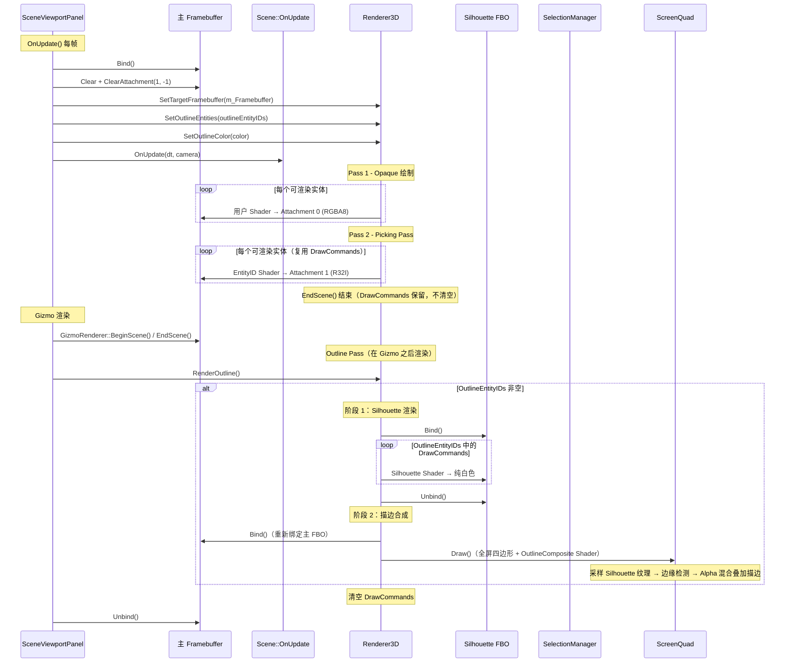

# ?? Luck3D 选中项描边功能 ― 临时内联实现详细设计文档

## 一、方案概述

**方案名称**：临时内联 Outline Pass + 后处理描边（Screen-Space Outline）

**核心思想**：将 Outline Pass 从 `Renderer3D::EndScene()` 中拆出为独立的 `Renderer3D::RenderOutline()` 方法，在 Gizmo 渲染之后调用，确保描边始终覆盖在 Gizmo 之上。该 Pass 分两个阶段：（1）将选中物体及其子孙节点渲染到独立的 Silhouette FBO（纯白色轮廓掩码）；（2）对 Silhouette 纹理进行边缘检测，通过 Alpha 混合将描边颜色叠加到主 FBO 上。

**描边颜色规则**（与 Unity 一致）：
- **选中叶节点**（无子节点）：仅该节点描边，颜色为橙色 `#FF6600`
- **选中非叶节点**（有子节点）：该节点 + 所有子孙节点一起描边，颜色统一为蓝色 `#5E779B`

**关键优势**：
- 不依赖 Phase R7（多 Pass 渲染框架），可立即实现
- 描边宽度在屏幕空间均匀，不受物体距离和法线影响（与 Unity Scene View 一致）
- 描边穿透遮挡物，方便用户在复杂场景中定位选中物体（与 Unity 行为一致）
- 描边始终在 Gizmo 之上，不会被 Gizmo 线条遮挡
- 选中父节点时子孙节点同步描边，视觉反馈清晰
- R7 完成后可低成本迁移为独立的 `OutlinePass` 类

---

## 二、整体架构

### 2.1 数据流图



### 2.2 渲染流程总览

```
SceneViewportPanel::OnUpdate
  → Renderer3D::SetTargetFramebuffer(m_Framebuffer)    // 传入主 FBO 引用
  → Renderer3D::SetOutlineEntities(outlineEntityIDs)   // 设置需要描边的实体 ID 集合（编辑器层递归收集）
  → Renderer3D::SetOutlineColor(color)                 // 设置描边颜色（叶节点橙色/非叶节点蓝色）
  → Framebuffer::Bind()                                // 绑定主 FBO
  → RenderCommand::Clear()
  → m_Framebuffer->ClearAttachment(1, -1)
  → Scene::OnUpdate()
      → 收集光源数据
      → Renderer3D::BeginScene(camera, sceneLightData)
      → Renderer3D::DrawMesh() × N
      → Renderer3D::EndScene()
          → Pass 1: Opaque 绘制（排序 + 批量绘制 → Attachment 0）
          → Pass 2: Picking Pass（EntityID Shader → Attachment 1）
          → （DrawCommands 保留，不清空）
  → GizmoRenderer::BeginScene() / EndScene()           // Gizmo 先渲染
  → Renderer3D::RenderOutline()                        // 描边最后渲染（覆盖在 Gizmo 之上）
      → Outline Pass（仅当 OutlineEntityIDs 非空时执行）
          → 阶段1: Silhouette 渲染（OutlineEntityIDs 中的物体 → Silhouette FBO）
          → 阶段2: 描边合成（边缘检测 + Alpha 混合叠加 → 主 FBO Attachment 0）
      → 清空 DrawCommands
  → Framebuffer::Unbind()
```

### 2.3 Framebuffer 布局

| FBO | 附件 | 格式 | 用途 | 状态 |
|-----|------|------|------|------|
| **主 FBO** | Attachment 0 | `RGBA8` | 颜色渲染结果 + 描边叠加 | ? 已有 |
| **主 FBO** | Attachment 1 | `RED_INTEGER` (`R32I`) | Entity ID 缓冲区 | ? 已有 |
| **主 FBO** | Depth | `DEPTH24_STENCIL8` | 深度/模板 | ? 已有 |
| **Silhouette FBO** | Attachment 0 | `RGBA8` | 选中物体轮廓掩码（白=选中，黑=未选中） | **新建** |

> **注意**：Silhouette FBO **不需要深度附件**。因为描边穿透遮挡物（与 Unity 行为一致），不需要深度比较。

---

## 三、需要修改/新建的文件清单

| 序号 | 文件 | 修改类型 | 说明 |
|------|------|----------|------|
| 1 | `Lucky/Source/Lucky/Renderer/ScreenQuad.h` | **新建** | 全屏四边形工具类头文件 |
| 2 | `Lucky/Source/Lucky/Renderer/ScreenQuad.cpp` | **新建** | 全屏四边形工具类实现 |
| 3 | `Luck3DApp/Assets/Shaders/Outline/Silhouette.vert` | **新建** | 轮廓顶点着色器 |
| 4 | `Luck3DApp/Assets/Shaders/Outline/Silhouette.frag` | **新建** | 轮廓片元着色器 |
| 5 | `Luck3DApp/Assets/Shaders/Outline/OutlineComposite.vert` | **新建** | 描边合成顶点着色器 |
| 6 | `Luck3DApp/Assets/Shaders/Outline/OutlineComposite.frag` | **新建** | 描边合成片元着色器 |
| 7 | `Lucky/Source/Lucky/Renderer/Renderer3D.h` | 修改 | 新增 Outline 相关静态接口（`SetOutlineEntities`、`SetOutlineColor`、`RenderOutline`） |
| 8 | `Lucky/Source/Lucky/Renderer/Renderer3D.cpp` | 修改 | `Renderer3DData` 扩展 + `Init()` 初始化 + `EndScene()` 不再包含 Outline + 新增 `RenderOutline()` |
| 9 | `Lucky/Source/Lucky/Renderer/Renderer.cpp` | 修改 | `Init()` 中调用 `ScreenQuad::Init()`；`Shutdown()` 中调用 `ScreenQuad::Shutdown()` |
| 10 | `Luck3DApp/Source/Panels/SceneViewportPanel.cpp` | 修改 | 传入主 FBO 引用 + 递归收集子孙节点 + 设置描边实体集合和颜色 + Gizmo 之后调用 `RenderOutline()` + Resize 时同步 Silhouette FBO |

---

## 四、各模块详细设计

### 4.1 新建 ScreenQuad 工具类

#### 4.1.1 ScreenQuad.h

**文件路径**：`Lucky/Source/Lucky/Renderer/ScreenQuad.h`

**设计要点**：
- 静态工具类，与 `Renderer3D`、`RenderCommand` 风格一致
- 管理一个全屏四边形的 VAO/VBO
- Phase R6（后处理框架）和 Phase R8（描边）共用
- 调用 `Draw()` 前需要先绑定目标 FBO 和 Shader

**完整代码**：

```cpp
#pragma once

#include "Lucky/Core/Base.h"
#include "VertexArray.h"
#include "Buffer.h"

namespace Lucky
{
    /// <summary>
    /// 全屏四边形工具类
    /// 用于后处理和描边合成等需要全屏绘制的场景
    /// 
    /// 使用方式：
    ///   ScreenQuad::Init();    // 初始化（仅一次，在 Renderer::Init() 中调用）
    ///   ScreenQuad::Draw();    // 绘制全屏四边形
    ///   ScreenQuad::Shutdown(); // 释放资源（在 Renderer::Shutdown() 中调用）
    /// 
    /// 注意：调用 Draw() 前需要先绑定目标 FBO 和 Shader
    /// </summary>
    class ScreenQuad
    {
    public:
        /// <summary>
        /// 初始化全屏四边形（创建 VAO/VBO）
        /// </summary>
        static void Init();
        
        /// <summary>
        /// 释放资源
        /// </summary>
        static void Shutdown();
        
        /// <summary>
        /// 绘制全屏四边形（6 个顶点，2 个三角形）
        /// 调用前需要：
        /// 1. 绑定目标 FBO
        /// 2. 绑定 Shader 并设置 uniform
        /// </summary>
        static void Draw();
        
    private:
        static Ref<VertexArray> s_VAO;
        static Ref<VertexBuffer> s_VBO;
    };
}
```

#### 4.1.2 ScreenQuad.cpp

**文件路径**：`Lucky/Source/Lucky/Renderer/ScreenQuad.cpp`

**设计要点**：
- 全屏四边形覆盖 NDC 空间 `[-1, 1]`
- 顶点布局：`Float2 a_Position` + `Float2 a_TexCoord`
- 使用 `glDrawArrays(GL_TRIANGLES, 0, 6)` 绘制（无索引缓冲区）

**完整代码**：

```cpp
#include "lcpch.h"
#include "ScreenQuad.h"

#include <glad/glad.h>

namespace Lucky
{
    Ref<VertexArray> ScreenQuad::s_VAO = nullptr;
    Ref<VertexBuffer> ScreenQuad::s_VBO = nullptr;
    
    void ScreenQuad::Init()
    {
        // 全屏四边形顶点数据：位置 (x, y) + 纹理坐标 (u, v)
        float quadVertices[] = {
            // Position    // TexCoord
            -1.0f, -1.0f,  0.0f, 0.0f,   // 左下
             1.0f, -1.0f,  1.0f, 0.0f,   // 右下
             1.0f,  1.0f,  1.0f, 1.0f,   // 右上
            
            -1.0f, -1.0f,  0.0f, 0.0f,   // 左下
             1.0f,  1.0f,  1.0f, 1.0f,   // 右上
            -1.0f,  1.0f,  0.0f, 1.0f    // 左上
        };
        
        s_VAO = VertexArray::Create();
        
        s_VBO = VertexBuffer::Create(quadVertices, sizeof(quadVertices));
        s_VBO->SetLayout({
            { ShaderDataType::Float2, "a_Position" },
            { ShaderDataType::Float2, "a_TexCoord" }
        });
        
        s_VAO->AddVertexBuffer(s_VBO);
    }
    
    void ScreenQuad::Shutdown()
    {
        s_VAO = nullptr;
        s_VBO = nullptr;
    }
    
    void ScreenQuad::Draw()
    {
        s_VAO->Bind();
        glDrawArrays(GL_TRIANGLES, 0, 6);
    }
}
```

---

### 4.2 新建 Silhouette Shader

#### 4.2.1 Silhouette.vert

**文件路径**：`Luck3DApp/Assets/Shaders/Outline/Silhouette.vert`

**设计要点**：
- 只需要 `a_Position`（`location = 0`）作为输入
- 使用与 `Standard.vert` 相同的 Camera UBO（`binding = 0`）
- 使用与 `Standard.vert` 相同的 `u_ObjectToWorldMatrix` uniform
- 虽然只使用 `a_Position`，但 VAO 的 vertex layout 包含所有 5 个属性（Position, Color, Normal, TexCoord, Tangent），OpenGL 会自动忽略 Shader 中未使用的属性，**不需要修改 VAO**

**完整代码**：

```glsl
#version 450 core

layout(location = 0) in vec3 a_Position;    // 位置

// 相机 Uniform 缓冲区（与 Standard.vert 共享 binding = 0）
layout(std140, binding = 0) uniform Camera
{
    mat4 ViewProjectionMatrix;
    vec3 Position;
} u_Camera;

// 模型矩阵
uniform mat4 u_ObjectToWorldMatrix;

void main()
{
    gl_Position = u_Camera.ViewProjectionMatrix * u_ObjectToWorldMatrix * vec4(a_Position, 1.0);
}
```

#### 4.2.2 Silhouette.frag

**文件路径**：`Luck3DApp/Assets/Shaders/Outline/Silhouette.frag`

**设计要点**：
- 输出到 `location = 0`（Silhouette FBO 的唯一颜色附件）
- 输出纯白色，表示该像素属于选中物体
- **极简**：不做任何光照计算

**完整代码**：

```glsl
#version 450 core

layout(location = 0) out vec4 o_Color;

void main()
{
    // 输出纯白色：表示该像素属于选中物体
    o_Color = vec4(1.0, 1.0, 1.0, 1.0);
}
```

---

### 4.3 新建 OutlineComposite Shader

#### 4.3.1 OutlineComposite.vert

**文件路径**：`Luck3DApp/Assets/Shaders/Outline/OutlineComposite.vert`

**设计要点**：
- 接收 ScreenQuad 的顶点数据：`Float2 a_Position` + `Float2 a_TexCoord`
- 不使用 Camera UBO（全屏四边形直接在 NDC 空间）
- 传递纹理坐标给片元着色器

**完整代码**：

```glsl
#version 450 core

layout(location = 0) in vec2 a_Position;    // 全屏四边形顶点位置 [-1, 1]
layout(location = 1) in vec2 a_TexCoord;    // 纹理坐标 [0, 1]

out vec2 v_TexCoord;

void main()
{
    v_TexCoord = a_TexCoord;
    gl_Position = vec4(a_Position, 0.0, 1.0);
}
```

#### 4.3.2 OutlineComposite.frag

**文件路径**：`Luck3DApp/Assets/Shaders/Outline/OutlineComposite.frag`

**关键设计决策 ― 描边合成方式**：

在 OpenGL 中**不能同时读写同一纹理**。OutlineComposite Shader 需要将描边叠加到主 FBO 上，这里有三种方案：

---

**方案 A：Blit 到临时纹理**

先将主 FBO 颜色 Blit 到临时纹理，Shader 从临时纹理读取场景颜色，同时写入主 FBO。

**优点**：
- 完全避免读写冲突
- Shader 可以同时访问场景颜色和 Silhouette 纹理

**缺点**：
- 需要额外的临时纹理（显存开销：`W × H × 4 bytes`，1920×1080 ≈ 8MB）
- 每帧需要一次 `glBlitFramebuffer` 调用
- 实现复杂度较高

---

**方案 B（推荐 ???）：仅输出描边像素 + Alpha 混合叠加**

Shader 只输出描边像素（非描边像素 `discard`），通过 `glBlendFunc(GL_SRC_ALPHA, GL_ONE_MINUS_SRC_ALPHA)` 将描边颜色与场景颜色混合。

**优点**：
- **不需要读取主 FBO 的颜色纹理**，完全避免读写冲突
- 不需要额外的临时纹理
- 实现最简单
- 性能最好

**缺点**：
- 描边颜色只能是纯色叠加，不能做复杂的颜色混合（如半透明描边与场景颜色的自定义混合）
- 但对于选中描边来说，纯色叠加完全足够

---

**方案 C：Ping-Pong FBO**

两个 FBO 交替读写，是通用的后处理方案。

**优点**：
- 通用性强，适合多 Pass 后处理链

**缺点**：
- 需要额外的 FBO
- 复杂度高，不适合单一的描边功能
- 后续 Phase R6（后处理框架）会使用此方案

---

**最终推荐：方案 B**

理由：最简单、性能最好、完全满足需求。描边颜色通过 Alpha 混合叠加，不需要读取主 FBO 颜色。

---

**OutlineComposite.frag 完整代码（方案 B）**：

```glsl
#version 450 core

layout(location = 0) out vec4 o_Color;

in vec2 v_TexCoord;

uniform sampler2D u_SilhouetteTexture;  // Silhouette 纹理（选中物体轮廓掩码）
uniform vec4 u_OutlineColor;            // 描边颜色（默认橙色）
uniform float u_OutlineWidth;           // 描边宽度（像素）

void main()
{
    vec2 texelSize = 1.0 / textureSize(u_SilhouetteTexture, 0);
    
    // 当前像素的 Silhouette 值
    float centerSilhouette = texture(u_SilhouetteTexture, v_TexCoord).r;
    
    // 如果当前像素在选中物体内部，不描边（discard）
    if (centerSilhouette > 0.5)
    {
        discard;
    }
    
    // 边缘检测：在 N×N 范围内采样 Silhouette 纹理
    float maxSilhouette = 0.0;
    int range = int(u_OutlineWidth);
    
    for (int x = -range; x <= range; x++)
    {
        for (int y = -range; y <= range; y++)
        {
            // 圆形采样区域（避免方形描边伪影）
            if (x * x + y * y > range * range)
                continue;
            
            vec2 offset = vec2(float(x), float(y)) * texelSize;
            float s = texture(u_SilhouetteTexture, v_TexCoord + offset).r;
            maxSilhouette = max(maxSilhouette, s);
        }
    }
    
    // 如果采样范围内存在选中物体像素，输出描边颜色
    if (maxSilhouette > 0.5)
    {
        o_Color = u_OutlineColor;
    }
    else
    {
        discard;  // 非描边像素，丢弃
    }
}
```

**边缘检测算法说明**：

| 描边宽度（像素） | 采样范围 | 最大采样次数/像素 | 实际采样次数/像素（圆形裁剪） |
|-----------------|---------|------------------|------------------------------|
| 1 | 3×3 | 9 | ~5 |
| 2 | 5×5 | 25 | ~13 |
| 3 | 7×7 | 49 | ~29 |
| 5 | 11×11 | 121 | ~69 |

---

### 4.4 修改 Renderer3D

#### 4.4.1 Renderer3DData 扩展

**文件**：`Lucky/Source/Lucky/Renderer/Renderer3D.cpp`

在现有的 `Renderer3DData` 结构体中新增以下字段：

```cpp
struct Renderer3DData
{
    // ... 现有字段（不变） ...
    
    // ======== Outline Pass 资源（临时内联） ========
    Ref<Framebuffer> SilhouetteFBO;             // Silhouette FBO：选中物体轮廓掩码
    Ref<Shader> SilhouetteShader;               // Silhouette Shader：纯白色输出
    Ref<Shader> OutlineCompositeShader;         // 描边合成 Shader：边缘检测 + 叠加
    Ref<Framebuffer> TargetFramebuffer;         // 主 FBO 引用（描边合成后重新绑定）
    std::unordered_set<int> OutlineEntityIDs;   // 需要描边的所有 EntityID 集合（空集合表示无选中）
    
    // 描边参数
    glm::vec4 OutlineColor = glm::vec4(1.0f, 0.4f, 0.0f, 1.0f);  // 描边颜色（默认橙色 #FF6600）
    float OutlineWidth = 2.0f;                                      // 描边宽度（像素）
    bool OutlineEnabled = true;                                     // 是否启用描边
    
    // 描边颜色规则（与 Unity 一致）
    // 选中叶节点（无子节点）：仅该节点描边，橙色 #FF6600 → (1.0, 0.4, 0.0, 1.0)
    // 选中非叶节点（有子节点）：该节点 + 所有子孙节点一起描边，蓝色 #5E779B → (0.369, 0.467, 0.608, 1.0)
};
```

#### 4.4.2 Renderer3D.h 新增接口

**文件**：`Lucky/Source/Lucky/Renderer/Renderer3D.h`

在 `Renderer3D` 类中新增以下静态方法：

```cpp
class Renderer3D
{
public:
    // ... 现有接口（不变） ...
    
    /// <summary>
    /// 设置主 FBO 引用（描边合成后需要重新绑定）
    /// 在 SceneViewportPanel::OnUpdate 中调用，位于 Framebuffer::Bind() 之后
    /// </summary>
    static void SetTargetFramebuffer(const Ref<Framebuffer>& framebuffer);
    
    /// <summary>
    /// 设置需要描边的实体 ID 集合
    /// 在 SceneViewportPanel::OnUpdate 中调用，由编辑器层递归收集选中实体及其子孙节点
    /// 空集合表示无选中
    /// </summary>
    static void SetOutlineEntities(const std::unordered_set<int>& entityIDs);
    
    /// <summary>
    /// 设置描边颜色
    /// 在 SceneViewportPanel::OnUpdate 中调用
    /// 非叶节点（含子节点）：蓝色 #5E779B，叶节点：橙色 #FF6600（与 Unity 一致）
    /// </summary>
    static void SetOutlineColor(const glm::vec4& color);
    
    /// <summary>
    /// 同步 Silhouette FBO 大小（视口 Resize 时调用）
    /// </summary>
    static void ResizeSilhouetteFBO(uint32_t width, uint32_t height);
    
    /// <summary>
    /// 渲染描边（在 Gizmo 之后调用，确保描边覆盖在 Gizmo 之上）
    /// 执行 Silhouette 渲染 + 边缘检测描边合成
    /// 调用后会清空 DrawCommands
    /// </summary>
    static void RenderOutline();
};
```

**关键设计决策 ― 主 FBO 重新绑定方式**：

Outline Pass 阶段 1 需要绑定 Silhouette FBO，阶段 2 需要重新绑定主 FBO。由于 `Framebuffer::Unbind()` 会切换到默认 FBO（0），需要一种方式重新绑定主 FBO。

---

**方式 A（推荐 ???）：通过 `SetTargetFramebuffer()` 传入主 FBO 引用**

```cpp
// Renderer3D 新增接口
static void SetTargetFramebuffer(const Ref<Framebuffer>& framebuffer);

// Renderer3DData 新增
Ref<Framebuffer> TargetFramebuffer;  // 主 FBO 引用

// SceneViewportPanel::OnUpdate 中调用
Renderer3D::SetTargetFramebuffer(m_Framebuffer);
```

在 `EndScene()` 的 Outline Pass 阶段 2 中：
```cpp
s_Data.TargetFramebuffer->Bind();  // 重新绑定主 FBO
```

**优点**：
- 语义清晰，明确知道描边叠加到哪个 FBO
- 不依赖 OpenGL 状态查询
- 与引擎的 `Ref<Framebuffer>` 抽象一致

**缺点**：
- 需要新增一个接口调用

---

**方式 B：使用 OpenGL 保存/恢复**

```cpp
// 在绑定 Silhouette FBO 之前保存当前 FBO
GLint previousFBO;
glGetIntegerv(GL_FRAMEBUFFER_BINDING, &previousFBO);

// ... Silhouette FBO 操作 ...

// 恢复之前的 FBO
glBindFramebuffer(GL_FRAMEBUFFER, previousFBO);
```

**优点**：
- 不需要新增接口
- 自动保存/恢复，不需要外部传入

**缺点**：
- 依赖 OpenGL 状态查询（`glGetIntegerv`），不够抽象
- 绕过了引擎的 `Framebuffer` 抽象层
- 如果后续切换到 Vulkan/DirectX，需要修改

---

**最终推荐：方式 A**

---

#### 4.4.3 Renderer3D.h 新增接口的实现

**文件**：`Lucky/Source/Lucky/Renderer/Renderer3D.cpp`

```cpp
void Renderer3D::SetTargetFramebuffer(const Ref<Framebuffer>& framebuffer)
{
    s_Data.TargetFramebuffer = framebuffer;
}

void Renderer3D::SetOutlineEntities(const std::unordered_set<int>& entityIDs)
{
    s_Data.OutlineEntityIDs = entityIDs;
}

void Renderer3D::SetOutlineColor(const glm::vec4& color)
{
    s_Data.OutlineColor = color;
}

void Renderer3D::ResizeSilhouetteFBO(uint32_t width, uint32_t height)
{
    if (s_Data.SilhouetteFBO)
    {
        s_Data.SilhouetteFBO->Resize(width, height);
    }
}
```

#### 4.4.4 Init() 中初始化 Outline 资源

**文件**：`Lucky/Source/Lucky/Renderer/Renderer3D.cpp`

在 `Renderer3D::Init()` 末尾新增：

```cpp
void Renderer3D::Init()
{
    // ... 现有初始化代码（不变） ...
    
    // ======== Outline Pass 初始化 ========
    
    // 加载 Outline 相关 Shader
    s_Data.ShaderLib->Load("Assets/Shaders/Outline/Silhouette");
    s_Data.ShaderLib->Load("Assets/Shaders/Outline/OutlineComposite");
    s_Data.SilhouetteShader = s_Data.ShaderLib->Get("Silhouette");
    s_Data.OutlineCompositeShader = s_Data.ShaderLib->Get("OutlineComposite");
    
    // 创建 Silhouette FBO（初始大小 1280×720，后续在 Resize 时同步）
    FramebufferSpecification silhouetteSpec;
    silhouetteSpec.Width = 1280;
    silhouetteSpec.Height = 720;
    silhouetteSpec.Attachments = {
        FramebufferTextureFormat::RGBA8     // 轮廓掩码（白色 = 选中，黑色 = 未选中）
        // 不需要深度附件：描边穿透遮挡物（与 Unity 行为一致）
    };
    s_Data.SilhouetteFBO = Framebuffer::Create(silhouetteSpec);
}
```

**?? 重要注意事项**：

1. **Shader 路径**：`ShaderLib->Load()` 接收的路径不含后缀名。Shader 文件为 `.vert` 和 `.frag` 分开的两个文件，`Shader::Create()` 内部会分别加载 `路径.vert` 和 `路径.frag`。
2. **Shader 名称**：`ShaderLib->Get()` 使用的是 Shader 文件名（不含路径和后缀），即 `"Silhouette"` 和 `"OutlineComposite"`。

#### 4.4.5 EndScene() 中不再包含 Outline Pass

**重要变更**：Outline Pass 已从 `EndScene()` 中拆出为独立的 `RenderOutline()` 方法。`EndScene()` 现在只包含 Pass 1（Opaque 绘制）和 Pass 2（Picking Pass），且 **不再清空 `OpaqueDrawCommands`**（由 `RenderOutline()` 负责清空）。

**完整的 EndScene() 修改设计**：

```cpp
void Renderer3D::EndScene()
{
    // ======== Pass 1: Opaque 绘制（现有代码，不变） ========
    // ... 排序 + 批量绘制 ...

    // ======== Pass 2: Picking Pass（现有代码，不变） ========
    // ... EntityID Shader 绘制 ...
    
    GLenum normalBuffers[] = { GL_COLOR_ATTACHMENT0, GL_NONE };
    glDrawBuffers(2, normalBuffers);
    glDepthMask(GL_TRUE);
    glDepthFunc(GL_LESS);
    
    // 注意：不再清空 DrawCommands，由 RenderOutline() 负责清空
}
```

#### 4.4.6 RenderOutline() 新增方法

**这是新增的核心方法**。在 `SceneViewportPanel::OnUpdate()` 中，于 Gizmo 渲染之后调用。执行 Outline Pass 的阶段 1 和阶段 2，然后清空 DrawCommands。

**完整的 RenderOutline() 设计**：

```cpp
void Renderer3D::RenderOutline()
{
    // ======== Outline Pass（选中物体描边） ========
    if (s_Data.OutlineEnabled && !s_Data.OutlineEntityIDs.empty())
    {
        // ---- 阶段 1：渲染选中物体的 Silhouette ----
        
        // 绑定 Silhouette FBO
        s_Data.SilhouetteFBO->Bind();
        
        // 清除为黑色（未选中区域 = 透明黑色）
        RenderCommand::SetClearColor({ 0.0f, 0.0f, 0.0f, 0.0f });
        RenderCommand::Clear();
        
        // 绑定 Silhouette Shader
        s_Data.SilhouetteShader->Bind();
        
        // 禁用深度测试（描边穿透遮挡物，Silhouette FBO 无深度附件）
        glDisable(GL_DEPTH_TEST);
        
        // 遍历 DrawCommands，渲染所有需要描边的物体（选中实体 + 子孙节点）
        for (const DrawCommand& cmd : s_Data.OpaqueDrawCommands)
        {
            if (s_Data.OutlineEntityIDs.find(cmd.EntityID) == s_Data.OutlineEntityIDs.end())
                continue;
            
            s_Data.SilhouetteShader->SetMat4("u_ObjectToWorldMatrix", cmd.Transform);
            
            RenderCommand::DrawIndexedRange(
                cmd.MeshData->GetVertexArray(),
                cmd.SubMeshPtr->IndexOffset,
                cmd.SubMeshPtr->IndexCount
            );
        }
        
        s_Data.SilhouetteFBO->Unbind();
        
        // ---- 阶段 2：边缘检测 + 描边合成 ----
        
        // 重新绑定主 FBO
        s_Data.TargetFramebuffer->Bind();
        
        // 只写入 Attachment 0（颜色），不写入 Attachment 1（EntityID）
        GLenum outlineBuffers[] = { GL_COLOR_ATTACHMENT0, GL_NONE };
        glDrawBuffers(2, outlineBuffers);
        
        // 禁用深度测试（全屏 Quad 不需要深度测试）
        glDisable(GL_DEPTH_TEST);
        
        // 启用 Alpha 混合（描边颜色与场景颜色混合）
        glEnable(GL_BLEND);
        glBlendFunc(GL_SRC_ALPHA, GL_ONE_MINUS_SRC_ALPHA);
        
        // 绑定 OutlineComposite Shader
        s_Data.OutlineCompositeShader->Bind();
        
        // 绑定 Silhouette 纹理到纹理单元 0
        glActiveTexture(GL_TEXTURE0);
        glBindTexture(GL_TEXTURE_2D, s_Data.SilhouetteFBO->GetColorAttachmentRendererID(0));
        s_Data.OutlineCompositeShader->SetInt("u_SilhouetteTexture", 0);
        
        // 设置描边参数
        s_Data.OutlineCompositeShader->SetFloat4("u_OutlineColor", s_Data.OutlineColor);
        s_Data.OutlineCompositeShader->SetFloat("u_OutlineWidth", s_Data.OutlineWidth);
        
        // 绘制全屏四边形
        ScreenQuad::Draw();
        
        // 恢复渲染状态
        glEnable(GL_DEPTH_TEST);
        glDepthFunc(GL_LESS);
        glDisable(GL_BLEND);
    }
    
    // ---- 清空命令列表 ----
    s_Data.OpaqueDrawCommands.clear();
}
```

**?? 重要注意事项**：

1. **`#include <glad/glad.h>`**：`Renderer3D.cpp` 已经包含了 `<glad/glad.h>`（第 8 行），所以可以直接使用 `glDrawBuffers`、`glDisable`、`glEnable`、`glBlendFunc`、`glActiveTexture`、`glBindTexture` 等 OpenGL 调用。

2. **`#include "ScreenQuad.h"`**：需要在 `Renderer3D.cpp` 顶部新增此 include。

3. **`glDrawBuffers` 状态管理**：
   - Picking Pass 结束后已经设置了 `{ GL_COLOR_ATTACHMENT0, GL_NONE }`
   - Outline Pass 阶段 2 也需要 `{ GL_COLOR_ATTACHMENT0, GL_NONE }`（只写颜色，不写 EntityID）
   - 所以如果 Outline Pass 不执行（无选中物体），`glDrawBuffers` 状态已经是正确的
   - 如果 Outline Pass 执行了，阶段 2 中设置的 `glDrawBuffers` 也是 `{ GL_COLOR_ATTACHMENT0, GL_NONE }`，与 Picking Pass 结束后的状态一致

4. **`RenderCommand::SetClearColor` 的副作用**：阶段 1 中设置了清屏颜色为黑色。这会影响后续的 `RenderCommand::Clear()` 调用。但由于 Outline Pass 在 `EndScene()` 末尾执行，而下一帧的 `SceneViewportPanel::OnUpdate` 会重新设置清屏颜色，所以不会有问题。

5. **深度测试状态**：
   - 阶段 1：禁用深度测试（Silhouette FBO 无深度附件，描边穿透遮挡物）
   - 阶段 2：禁用深度测试（全屏 Quad 不需要深度测试）
   - 结束后：恢复 `glEnable(GL_DEPTH_TEST)` + `glDepthFunc(GL_LESS)`
   - 这确保后续的 Gizmo 渲染正常工作

---

### 4.5 修改 Renderer.cpp

**文件**：`Lucky/Source/Lucky/Renderer/Renderer.cpp`

**当前代码**：
```cpp
#include "lcpch.h"
#include "Renderer.h"

#include "Renderer3D.h"
#include "GizmoRenderer.h"

namespace Lucky
{
    void Renderer::Init()
    {
        RenderCommand::Init();
        Renderer3D::Init();
        GizmoRenderer::Init();
    }

    void Renderer::Shutdown()
    {
        Renderer3D::Shutdown();
        GizmoRenderer::Shutdown();
    }
    // ...
}
```

**修改后**：
```cpp
#include "lcpch.h"
#include "Renderer.h"

#include "Renderer3D.h"
#include "GizmoRenderer.h"
#include "ScreenQuad.h"     // 新增

namespace Lucky
{
    void Renderer::Init()
    {
        RenderCommand::Init();
        ScreenQuad::Init();     // 新增：初始化全屏四边形（在 Renderer3D 之前，因为 Renderer3D::Init 不依赖它）
        Renderer3D::Init();
        GizmoRenderer::Init();
    }

    void Renderer::Shutdown()
    {
        Renderer3D::Shutdown();
        GizmoRenderer::Shutdown();
        ScreenQuad::Shutdown();     // 新增：释放全屏四边形资源
    }
    // ...
}
```

**关键设计决策 ― ScreenQuad 初始化位置**：

---

**位置 A（推荐 ???）：在 `Renderer::Init()` 中初始化**

即上面的实现方式。`ScreenQuad` 作为全局渲染基础设施，在 `Renderer` 层初始化。

**优点**：
- `ScreenQuad` 是 Phase R6（后处理）和 Phase R8（描边）的共用基础设施
- 在 `Renderer` 层初始化，生命周期管理清晰
- 与 `RenderCommand::Init()`、`Renderer3D::Init()` 同级

**缺点**：
- 无

---

**位置 B：在 `Renderer3D::Init()` 中初始化**

```cpp
void Renderer3D::Init()
{
    ScreenQuad::Init();
    // ...
}
```

**优点**：
- 不需要修改 `Renderer.cpp`

**缺点**：
- `ScreenQuad` 不仅仅是 `Renderer3D` 的依赖，后续 Phase R6 也会使用
- 放在 `Renderer3D` 中不够通用

---

**最终推荐：位置 A**

---

### 4.6 Scene::OnUpdate ― 无需修改

**文件**：`Lucky/Source/Lucky/Scene/Scene.cpp`

`Scene::OnUpdate` **不需要任何修改**。选中实体 ID 的设置由 `SceneViewportPanel::OnUpdate` 负责（见 4.7 节）。

**不在 Scene 中处理的原因**：
- `Scene` 是引擎核心层，不应关心编辑器层的选中状态（`SelectionManager` 是编辑器概念）
- 避免在 `Scene.cpp` 中引入 `SelectionManager.h` 依赖
- `SceneViewportPanel` 已经持有 `m_Scene` 引用，可通过 `m_Scene->TryGetEntityWithUUID()` + `Entity` 的隐式转换完成 UUID → entt::entity 的转换
- 与现有代码模式一致：`SetTargetFramebuffer()` 也是在 `SceneViewportPanel` 中调用的
- Runtime 模式下 `Scene::OnUpdate` 不需要执行无意义的选中检查

**关键设计决策 ― 选中实体 ID 的传递方式**：

---

**方式 A：在 `Scene::OnUpdate` 中通过 `SetOutlineEntities()` 传递**

```cpp
// Scene::OnUpdate 中
UUID selectedUUID = SelectionManager::GetSelection();
std::unordered_set<int> outlineEntityIDs;
if (selectedUUID != 0)
{
    Entity selectedEntity = TryGetEntityWithUUID(selectedUUID);
    if (selectedEntity)
    {
        outlineEntityIDs.insert((int)(uint32_t)(entt::entity)selectedEntity);
        // ... 递归收集子孙节点 ...
    }
}
Renderer3D::SetOutlineEntities(outlineEntityIDs);
```

**优点**：
- `Scene` 拥有 `m_Registry`，可以直接将 UUID 转换为 `entt::entity`

**缺点**：
- **职责污染**：`Scene` 是引擎核心层，不应关心编辑器层的 `SelectionManager`
- **引入不必要的依赖**：`Scene.cpp` 需要新增 `#include "SelectionManager.h"`，破坏了当前干净的依赖关系
- **Runtime 兼容性差**：Runtime 模式下 `Scene::OnUpdate` 也会被调用，但不需要描边

---

**方式 B（推荐 ???）：在 `SceneViewportPanel::OnUpdate` 中传递**

```cpp
// SceneViewportPanel::OnUpdate 中
UUID selectedUUID = SelectionManager::GetSelection();
int selectedEntityID = -1;
if (selectedUUID != 0)
{
    Entity selectedEntity = m_Scene->TryGetEntityWithUUID(selectedUUID);
    if (selectedEntity)
    {
        selectedEntityID = (int)(uint32_t)(entt::entity)selectedEntity;
    }
}
Renderer3D::SetSelectedEntityID(selectedEntityID);
```

**优点**：
- **职责清晰**：`SceneViewportPanel` 本身就是编辑器视口面板，已经在使用 `SelectionManager`（鼠标拾取时）、管理 `m_Framebuffer`、管理 `m_EditorCamera`，设置选中实体 ID 完全符合其职责
- **零新增依赖**：`SceneViewportPanel.cpp` 已经 include 了 `SelectionManager.h`、`Entity.h`、`Renderer3D.h`
- **与现有模式一致**：`SetTargetFramebuffer()` 也是在 `SceneViewportPanel` 中调用的
- **UUID → entt::entity 转换完全可行**：通过 `m_Scene->TryGetEntityWithUUID()` 获取 `Entity`，`Entity` 提供 `operator entt::entity()` 和 `operator uint32_t()` 隐式转换
- **Runtime 兼容**：仅编辑器模式下执行，不影响 Runtime

**缺点**：
- 无

---

**方式 C：在 `Renderer3D::BeginScene` 中传递**

```cpp
static void BeginScene(const EditorCamera& camera, const SceneLightData& lightData, int selectedEntityID = -1);
```

**优点**：
- 接口更紧凑

**缺点**：
- 修改了 `BeginScene` 的签名，影响所有调用方
- `selectedEntityID` 与相机和光照数据无关，放在 `BeginScene` 中语义不清

---

**最终推荐：方式 B**

---

### 4.7 修改 SceneViewportPanel

#### 4.7.1 传入主 FBO 引用 + 设置描边实体集合 + 递归收集子孙节点

**文件**：`Luck3DApp/Source/Panels/SceneViewportPanel.cpp`

在 `OnUpdate()` 中，`m_Framebuffer->Bind()` 之后、`m_Scene->OnUpdate()` 之前，新增传入主 FBO 引用和设置描边实体集合：

```cpp
void SceneViewportPanel::OnUpdate(DeltaTime dt)
{
    // ... Resize 逻辑（不变） ...
    
    m_EditorCamera.OnUpdate(dt);
    
    m_Framebuffer->Bind();
    
    // ... Clear 逻辑（不变） ...
    
    // 传入主 FBO 引用（用于 Outline Pass 阶段 2 重新绑定）
    Renderer3D::SetTargetFramebuffer(m_Framebuffer);
    
    // 设置描边实体集合和描边颜色
    UUID selectedUUID = SelectionManager::GetSelection();
    std::unordered_set<int> outlineEntityIDs;
    if (selectedUUID != 0)
    {
        Entity selectedEntity = m_Scene->TryGetEntityWithUUID(selectedUUID);
        if (selectedEntity)
        {
            int selectedID = (int)(uint32_t)(entt::entity)selectedEntity;
            const auto& children = selectedEntity.GetChildren();
            
            if (children.empty())
            {
                // 叶节点：仅描边自身，橙色
                outlineEntityIDs.insert(selectedID);
                Renderer3D::SetOutlineColor(glm::vec4(1.0f, 0.4f, 0.0f, 1.0f));
            }
            else
            {
                // 非叶节点：描边自身 + 所有子孙，蓝色
                outlineEntityIDs.insert(selectedID);
                Renderer3D::SetOutlineColor(glm::vec4(0.369f, 0.467f, 0.608f, 1.0f));
                // 递归收集所有子孙节点
                std::function<void(Entity)> collectChildren = [&](Entity entity)
                {
                    for (UUID childUUID : entity.GetChildren())
                    {
                        Entity child = m_Scene->TryGetEntityWithUUID(childUUID);
                        if (child)
                        {
                            outlineEntityIDs.insert((int)(uint32_t)(entt::entity)child);
                            collectChildren(child);
                        }
                    }
                };
                collectChildren(selectedEntity);
            }
        }
    }
    Renderer3D::SetOutlineEntities(outlineEntityIDs);
    
    m_Scene->OnUpdate(dt, m_EditorCamera);
    
    // ---- Gizmo ----
    GizmoRenderer::BeginScene(m_EditorCamera);
    // ... Gizmo 绘制（不变） ...
    GizmoRenderer::EndScene();
    
    // ---- 描边（在 Gizmo 之后渲染，确保描边覆盖在 Gizmo 之上） ----
    Renderer3D::RenderOutline();
    
    m_Framebuffer->Unbind();
}
```

**需要新增的 include**（在 `SceneViewportPanel.cpp` 顶部）：
```cpp
#include <unordered_set>
#include <functional>
```

> **注意**：检查 `SceneViewportPanel.cpp` 是否已经包含了 `Renderer3D.h`。如果没有，需要新增。当前代码中没有直接 include `Renderer3D.h`，需要新增。
> 
> `SceneViewportPanel.cpp` 已经 include 了 `SelectionManager.h` 和 `Entity.h`，不需要额外新增这两个依赖。

#### 4.7.2 Silhouette FBO Resize 同步

**文件**：`Luck3DApp/Source/Panels/SceneViewportPanel.cpp`

在 `OnUpdate()` 的 Resize 逻辑中，新增 Silhouette FBO 的 Resize：

**当前代码**（第 48-53 行）：
```cpp
if (FramebufferSpecification spec = m_Framebuffer->GetSpecification();
    m_ViewportSize.x > 0.0f && m_ViewportSize.y > 0.0f &&
    (spec.Width != m_ViewportSize.x || spec.Height != m_ViewportSize.y))
{
    m_Framebuffer->Resize((uint32_t)m_ViewportSize.x, (uint32_t)m_ViewportSize.y);
    m_EditorCamera.SetViewportSize(m_ViewportSize.x, m_ViewportSize.y);
}
```

**修改后**：
```cpp
if (FramebufferSpecification spec = m_Framebuffer->GetSpecification();
    m_ViewportSize.x > 0.0f && m_ViewportSize.y > 0.0f &&
    (spec.Width != m_ViewportSize.x || spec.Height != m_ViewportSize.y))
{
    m_Framebuffer->Resize((uint32_t)m_ViewportSize.x, (uint32_t)m_ViewportSize.y);
    m_EditorCamera.SetViewportSize(m_ViewportSize.x, m_ViewportSize.y);
    
    // 同步 Silhouette FBO 大小（描边功能）
    Renderer3D::ResizeSilhouetteFBO((uint32_t)m_ViewportSize.x, (uint32_t)m_ViewportSize.y);
}
```

---

## 五、不需要修改的文件

| 文件 | 原因 |
|------|------|
| `Standard.vert` / `Standard.frag` | 用户 Shader 不需要任何修改 |
| `EntityID.vert` / `EntityID.frag` | Picking Shader 不需要修改 |
| `GizmoLine.vert` / `GizmoLine.frag` | Gizmo 不参与描边 |
| `InfiniteGrid.vert` / `InfiniteGrid.frag` | 网格不参与描边 |
| `Framebuffer.h` / `Framebuffer.cpp` | 已有 `Create()`、`Bind()`、`Unbind()`、`Resize()`、`GetColorAttachmentRendererID()` |
| `SelectionManager.h` / `SelectionManager.cpp` | 已有 `GetSelection()`，不需要修改 |
| `Scene.h` / `Scene.cpp` | 选中实体 ID 的设置由 `SceneViewportPanel` 负责，`Scene` 不需要关心编辑器层的选中状态 |
| `Mesh.h` / `Mesh.cpp` | Vertex 结构不需要修改 |
| `SceneViewportPanel.h` | 不需要新增成员变量或方法声明 |

---

## 六、边界情况与注意事项

### 6.1 无选中物体时的行为

**情况**：`SelectionManager::GetSelection()` 返回 `0`（无选中），`OutlineEntityIDs` 为空集合。

**结果**：`RenderOutline()` 中的 `if (s_Data.OutlineEnabled && !s_Data.OutlineEntityIDs.empty())` 条件不满足，Outline Pass 完全跳过。**零性能开销**。

### 6.2 选中物体被删除

**情况**：选中物体后，在 Hierarchy 面板中删除该物体。

**结果**：
- `SelectionManager` 中仍然存储着已删除物体的 UUID
- `SceneViewportPanel` 中 `m_Scene->TryGetEntityWithUUID()` 返回空 `Entity`
- `outlineEntityIDs` 保持为空集合
- Outline Pass 不执行

**建议**：在 `Scene::DestroyEntity()` 中检查被删除的实体是否是当前选中项，如果是则调用 `SelectionManager::Deselect()`。这是 `SelectionManager` 的职责，与描边功能无关。

### 6.3 Gizmo 与描边的交互

**情况**：Gizmo（网格线、灯光 Gizmo）在 `Renderer3D::EndScene()` 之后由 `GizmoRenderer` 绘制。

**结果**：
- Gizmo 不经过 `Renderer3D` 的 `DrawCommand` 系统，不会出现在 Silhouette FBO 中
- 描边绘制在 Gizmo 之后（通过 `RenderOutline()` 在 `GizmoRenderer::EndScene()` 之后调用）
- 描边始终覆盖在 Gizmo 之上，不会被 Gizmo 线条遮挡
- 这是**正确的行为**――描边作为编辑器层的视觉反馈，应该始终可见

### 6.4 多个 SubMesh 共享同一个 Entity ID

**情况**：一个 Entity 可能有多个 SubMesh，每个 SubMesh 生成一个 `DrawCommand`。

**结果**：所有 SubMesh 的 `DrawCommand` 都携带相同的 `EntityID`，Outline Pass 会渲染该 Entity 的所有 SubMesh 到 Silhouette FBO。描边会包围整个物体，这是**正确的行为**。

### 6.5 视口缩放时的 Silhouette FBO 同步

**情况**：用户拖拽视口面板改变大小。

**结果**：`SceneViewportPanel::OnUpdate` 中的 Resize 逻辑会同时调用 `Renderer3D::ResizeSilhouetteFBO()`，确保 Silhouette FBO 与主 FBO 大小一致。如果不同步，描边会出现错位或拉伸。

### 6.6 `RenderCommand::SetClearColor` 的副作用

**情况**：Outline Pass 阶段 1 中设置了 `SetClearColor({ 0.0f, 0.0f, 0.0f, 0.0f })`。

**结果**：这会修改全局的 `glClearColor` 状态。但由于：
- Outline Pass 在 `RenderOutline()` 中执行（帧末尾）
- 下一帧的 `SceneViewportPanel::OnUpdate` 会重新调用 `RenderCommand::SetClearColor(colors.ViewportClearColor)`

所以不会有问题。

### 6.7 Alpha 混合状态的恢复

**情况**：Outline Pass 阶段 2 启用了 `glEnable(GL_BLEND)` + `glBlendFunc(GL_SRC_ALPHA, GL_ONE_MINUS_SRC_ALPHA)`。

**结果**：阶段 2 结束后调用了 `glDisable(GL_BLEND)`，恢复了混合状态。后续的 Gizmo 渲染不受影响。

> **注意**：如果后续 Gizmo 渲染也需要 Alpha 混合，需要在 `GizmoRenderer` 中自行设置混合状态。当前 `GizmoRenderer` 使用线段绘制，不需要 Alpha 混合。

---

## 七、性能分析

### 7.1 额外开销

| 开销项 | 说明 | 影响 |
|--------|------|------|
| Silhouette FBO | 额外的 RGBA8 帧缓冲（无深度） | 显存：`W × H × 4 bytes`（1920×1080 ≈ 8MB） |
| Silhouette 渲染 | 选中物体及其子孙节点额外绘制一次（极简 Shader，无光照） | GPU：K 次 DrawCall（K = 选中物体及子孙的 SubMesh 数） |
| 边缘检测 | 全屏 Quad + 扩展采样 | GPU：1 次 DrawCall，`(2W+1)2` 次纹理采样/像素 |
| ScreenQuad VAO | 6 个顶点的 VBO | 显存：96 bytes（可忽略） |
| 2 个 Shader | Silhouette + OutlineComposite | GPU 程序对象，可忽略 |

### 7.2 无选中物体时

Outline Pass 完全跳过（`if` 条件不满足），仅执行 `OpaqueDrawCommands.clear()`，**零额外开销**。

### 7.3 与其他 Pass 的性能对比

| Pass | DrawCall 数 | 全屏 Pass 数 | 说明 |
|------|------------|-------------|------|
| Opaque Pass | N（所有不透明物体） | 0 | 完整光照计算 |
| Picking Pass | N（所有不透明物体） | 0 | 极简 Shader |
| **Outline Pass** | **K（选中物体及子孙）+ 1** | **1** | **极简 Shader + 全屏边缘检测** |

Outline Pass 的开销远小于 Opaque Pass，对整体性能影响极小。

---

## 八、实现顺序建议

建议按以下顺序实现，每步完成后可以编译验证：

| 步骤 | 操作 | 验证方式 |
|------|------|----------|
| 1 | 新建 `ScreenQuad.h` 和 `ScreenQuad.cpp` | 编译通过 |
| 2 | 修改 `Renderer.cpp`：`Init()` 中调用 `ScreenQuad::Init()`，`Shutdown()` 中调用 `ScreenQuad::Shutdown()` | 编译通过，运行正常 |
| 3 | 新建 4 个 Shader 文件（`Silhouette.vert/frag`、`OutlineComposite.vert/frag`） | 文件存在即可 |
| 4 | 修改 `Renderer3D.h`：新增 `SetOutlineEntities()`、`SetOutlineColor()`、`RenderOutline()` 静态方法声明 | 编译通过 |
| 5 | 修改 `Renderer3D.cpp`：`Renderer3DData` 扩展（`OutlineEntityIDs` 集合）+ 新方法实现 + `Init()` 初始化 Outline 资源 | 编译通过，运行正常（Outline Pass 尚未执行） |
| 6 | 修改 `SceneViewportPanel.cpp`：递归收集子孙节点 + 设置描边实体集合和颜色 + Resize 同步 | 编译通过 |
| 7 | 修改 `Renderer3D.cpp`：`EndScene()` 中移除 Outline Pass + 新增 `RenderOutline()` + `SceneViewportPanel` 中在 Gizmo 之后调用 | **完整功能验证** |

---

## 九、验证方法

### 9.1 基础描边验证

1. 在场景中创建多个 Cube（叶节点）
2. 点击选中一个 Cube
3. **预期结果**：选中的 Cube 周围出现橙色描边，其他 Cube 无描边
4. 切换选中不同的 Cube，确认描边跟随切换

### 9.2 取消选择验证

1. 选中一个 Cube（有描边）
2. 点击空白区域取消选择
3. **预期结果**：描边消失

### 9.3 遮挡行为验证

1. 将一个 Cube 放在另一个 Cube 后面
2. 选中后面的 Cube
3. **预期结果**：描边穿透前面的 Cube 可见（与 Unity 行为一致）

### 9.4 视口缩放验证

1. 选中一个 Cube
2. 拖拽视口面板改变大小
3. **预期结果**：描边宽度保持不变（屏幕空间像素级），不随视口缩放变化；描边位置正确，无错位

### 9.5 Gizmo 交互验证

1. 选中一个 Cube（有描边）
2. 拖拽 ImGuizmo 手柄移动物体
3. **预期结果**：描边跟随物体移动，描边始终覆盖在 Gizmo 线条之上（不会被 Gizmo 遮挡）

### 9.6 父子节点描边验证

1. 创建父子层级结构：A → B，A → C
2. 选中父节点 A
3. **预期结果**：A、B、C 三个物体都出现蓝色描边
4. 选中叶节点 B
5. **预期结果**：仅 B 出现橙色描边，A 和 C 无描边

### 9.7 性能验证

1. 选中物体时，检查帧率变化
2. **预期结果**：帧率下降 < 5%

---

## 十、后续 R7 迁移指南

当 Phase R7 多 Pass 渲染框架完成后，将临时内联代码迁移为独立的 `OutlinePass` 类：

| 步骤 | 操作 | 说明 |
|------|------|------|
| 1 | 创建 `OutlinePass` 类 | 继承 `RenderPass` 基类 |
| 2 | 将 `RenderOutline()` 中的 Outline 代码移入 `OutlinePass::Execute()` | 核心逻辑不变 |
| 3 | 将 `Renderer3DData` 中的 Outline 资源移入 `OutlinePass` 成员 | `SilhouetteFBO`、`SilhouetteShader`、`OutlineCompositeShader` |
| 4 | 在 `RenderPipeline` 中注册 `OutlinePass` | 位于 TransparentPass 之后、PostProcessPass 之前 |
| 5 | 从 `SceneViewportPanel::OnUpdate` 中收集选中物体到 `RenderContext::SelectedQueue` | 替代 `SetOutlineEntities()` |
| 6 | 删除 `Renderer3D` 中的临时接口 | `SetOutlineEntities()`、`SetTargetFramebuffer()`、`ResizeSilhouetteFBO()`、`RenderOutline()` |
| 7 | `ScreenQuad` 保持不变 | R6 后处理框架共用 |

迁移成本极低，核心渲染逻辑（Silhouette 渲染 + 边缘检测合成）完全不变，仅需调整代码组织结构。

---

## 十一、设计决策汇总

| 决策 | 选择 | 备选 | 原因 |
|------|------|------|------|
| 描边方案 | 后处理描边（Screen-Space） | Stencil+放大、JFA | 描边均匀，效果最接近 Unity |
| 边缘检测算法 | 扩展采样（N×N 范围） | Sobel、Laplacian | 支持可变宽度，实现简单 |
| 采样区域形状 | 圆形（`x2+y2 ≤ r2`） | 方形 | 避免方形描边伪影 |
| 描边穿透遮挡 | 是（与 Unity 一致） | 否 | 方便用户在复杂场景中定位选中物体 |
| Silhouette FBO 格式 | RGBA8（无深度） | RGBA8+DEPTH | 描边穿透遮挡物，不需要深度比较 |
| 描边合成方式 | 仅输出描边像素 + Alpha 混合（方案 B） | Blit 临时纹理（A）、Ping-Pong（C） | 不需要读取主 FBO，避免读写冲突，最简单 |
| 主 FBO 重新绑定 | `SetTargetFramebuffer()` 传入引用（方式 A） | `glGetIntegerv` 保存/恢复（B） | 更清晰，不依赖 OpenGL 状态查询 |
| 选中实体 ID 传递 | `SceneViewportPanel::OnUpdate` 中 `SetOutlineEntities()`（方式 B） | `Scene::OnUpdate` 中传递（A）、`BeginScene` 参数（C） | 职责清晰，SceneViewportPanel 是编辑器层，不污染 Scene 核心层 |
| ScreenQuad 初始化位置 | `Renderer::Init()` 中（位置 A） | `Renderer3D::Init()` 中（B） | R6/R8 共用，放在 Renderer 层更通用 |
| 描边颜色策略 | 叶节点橙色 `#FF6600`，非叶节点（含子孙）蓝色 `#5E779B` | 固定单色 | 与 Unity Scene View 一致，通过 `SetOutlineColor()` 动态切换 |
| 子孙节点描边 | 编辑器层递归收集 + `unordered_set<int>` 传递 | 渲染器层查询 Scene | 职责清晰，渲染器不需要知道父子关系 |
| Outline Pass 位置 | 独立 `RenderOutline()` 方法，在 Gizmo 之后调用 | 内联在 `EndScene()` 中 | 描边不会被 Gizmo 遮挡，与 Unity 行为一致 |
| 描边默认宽度 | 2 像素 | ― | 清晰可见但不过于突兀 |
