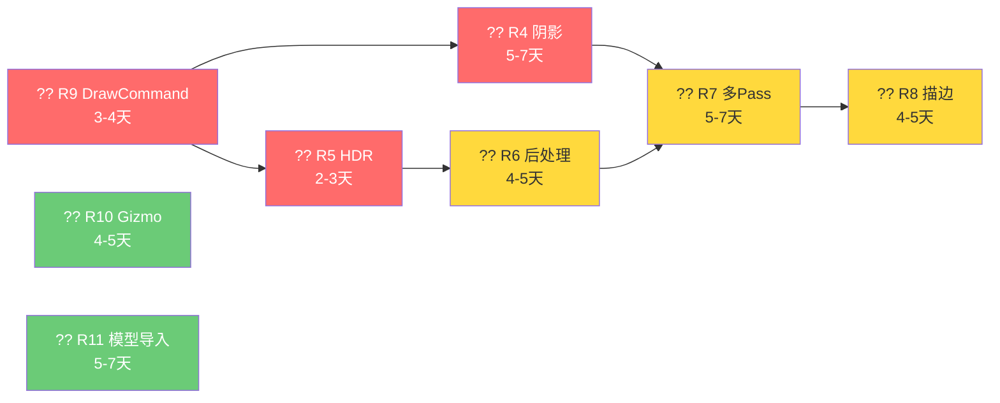

# Luck3D 引擎功能发展路线图

> **文档版本**：v2.5  
> **创建日期**：2026-04-01  
> **更新日期**：2026-04-17  
> **文档说明**：本文档整理了引擎的功能发展方向，按优先级排序。v2.5 版本更新 R10 Gizmo 渲染系统功能列表：新增坐标轴指示器（ViewManipulate）、补充聚光灯内外锥角可视化、补充网格线 Y 轴、标记 Transform 操控手柄已完成。

---

## 目录

- [一、当前引擎架构概览](#一当前引擎架构概览)
- [二、已完成的功能阶段](#二已完成的功能阶段)
- [三、功能发展路线总览](#三功能发展路线总览)
- [四、下一阶段：渲染改进](#四下一阶段渲染改进)
  - [R9 渲染排序 + 延迟提交（DrawCommand）](#r9-渲染排序--延迟提交drawcommand)
  - [R10 Gizmo 渲染系统](#r10-gizmo-渲染系统)
  - [R11 模型导入（AssetImporter）](#r11-模型导入assetimporter)
- [五、中期阶段：渲染管线演进](#五中期阶段渲染管线演进)
  - [R4 阴影系统](#r4-阴影系统)
  - [R5 HDR + Tonemapping](#r5-hdr--tonemapping)
  - [R6 后处理框架](#r6-后处理框架)
- [六、远期阶段：架构升级](#六远期阶段架构升级)
  - [R7 多 Pass 渲染框架](#r7-多-pass-渲染框架)
  - [R8 选中高亮描边](#r8-选中高亮描边)
- [七、远期展望（暂不实施）](#七远期展望暂不实施)
- [八、实施路线图时间线](#八实施路线图时间线)

---

## 一、当前引擎架构概览

### 渲染流程

```
SceneViewportPanel::OnUpdate
  → Framebuffer.Bind()
  → RenderCommand::Clear()
  → Scene::OnUpdate()
      → 收集光源数据（DirectionalLight / PointLight / SpotLight）
      → Renderer3D::BeginScene()     // 设置 Camera UBO (binding=0) + Light UBO (binding=1)
      → Renderer3D::DrawMesh() × N   // 遍历 SubMesh → 绑定 Shader → Apply 材质 → DrawIndexedRange
      → Renderer3D::EndScene()       // 当前为空实现
  → Framebuffer.Unbind()
```

### 架构特征

| 特征 | 当前状态 |
|------|---------|
| 渲染路径 | 单 Pass Forward 渲染 |
| 渲染器设计 | `Renderer3D` 全 static 方法 + 文件级 static 数据 |
| 物体排序 | 无排序，按 entt 注册顺序绘制 |
| 批处理 | 无，每个 SubMesh 一次 DrawCall |
| 离屏渲染 | 已有 Framebuffer（SceneViewportPanel 使用） |
| 光照 | PBR 多光源（方向光×4 + 点光源×8 + 聚光灯×4），通过 UBO 传递 |
| 材质系统 | Shader 内省 + MaterialProperty Map + Inspector UI |
| 场景管理 | entt ECS，支持父子层级关系 |
| 序列化 | YAML 格式 `.luck3d` 场景文件 |

### 已有的渲染模块

| 模块 | 文件 | 说明 |
|------|------|------|
| Renderer | `Renderer.h/cpp` | 顶层初始化入口 |
| Renderer3D | `Renderer3D.h/cpp` | 3D 渲染器，BeginScene/DrawMesh/EndScene |
| RenderCommand | `RenderCommand.h/cpp` | 最底层 OpenGL 调用封装 |
| Shader | `Shader.h/cpp` | 着色器加载、编译、Uniform 内省与上传 |
| Material | `Material.h/cpp` | 材质属性管理（unordered_map）与 Apply |
| Framebuffer | `Framebuffer.h/cpp` | 帧缓冲区（颜色附件 + 深度附件） |
| UniformBuffer | `UniformBuffer.h/cpp` | UBO 封装 |
| Mesh | `Mesh.h/cpp` | 网格数据（顶点 + SubMesh） |
| MeshFactory | `MeshFactory.h/cpp` | 内置几何体工厂（5 种图元） |
| MeshTangentCalculator | `MeshTangentCalculator.h/cpp` | 切线计算 |
| Texture | `Texture.h/cpp` | 2D 纹理 |

---

## 二、已完成的功能阶段

### ECS 系统

| 阶段 | 名称 | 文档 | 状态 |
|------|------|------|------|
| ECS Phase 1 | 世界矩阵与层级更新 | `docs/ECS/Phase1_WorldMatrix_And_HierarchyUpdate.md` | ? 已完成 |
| ECS Phase 2 | 重新设置父节点与世界 Transform 访问 | `docs/ECS/Phase2_Reparent_And_WorldTransformAccess.md` | ? 已完成 |
| ECS Phase 3 | DirtyFlag 与 Transform 通知 | `docs/ECS/Phase3_DirtyFlag_And_TransformNotification.md` | ? 已完成 |
| ECS Phase 4 | 组件注册与 Inspector 增强 | `docs/ECS/Phase4_ComponentRegistry_And_InspectorEnhancement.md` | ? 已完成 |

### 材质系统

| 阶段 | 名称 | 文档 | 状态 |
|------|------|------|------|
| Material Phase 1 | 材质与 Shader 内省 | `docs/MaterialSystem/Phase1_Material_And_ShaderIntrospection.md` | ? 已完成 |
| Material Phase 2 | 渲染管线集成 | `docs/MaterialSystem/Phase2_RenderPipeline_Integration.md` | ? 已完成 |
| Material Phase 3 | Inspector UI | `docs/MaterialSystem/Phase3_Inspector_UI.md` | ? 已完成 |
| Material Phase 4 | Shader 切换与默认材质 | `docs/MaterialSystem/Phase4_ShaderSwitch_And_DefaultMaterial.md` | ? 已完成 |
| Material Phase 5 | 材质属性 Map 重构 | `docs/MaterialSystem/Phase5_MaterialProperty_Map_Refactor.md` | ? 已完成 |
| Material Phase 6 | 方向光组件 | `docs/MaterialSystem/Phase6_DirectionalLight_Component.md` | ? 已完成 |

### 渲染系统

| 阶段 | 名称 | 文档 | 状态 |
|------|------|------|------|
| Rendering Phase 1 | 基础图元网格完善 | `docs/RenderingSystem/Phase1_Primitive_Mesh_Completion.md` | ? 已完成 |
| Rendering Phase 2 | MeshFactory 优化 | `docs/RenderingSystem/Phase2_MeshFactory_Optimization.md` | ? 已完成 |
| Rendering Phase 3 | 顶点切线优化 | `docs/RenderingSystem/Phase3_Vertex_Tangent_Optimization.md` | ? 已完成 |
| Phase R1 | 顶点升级与切线 | `docs/RenderingSystem/PhaseR1_Vertex_Upgrade_And_Tangent.md` | ? 已完成 |
| Phase R2 | PBR Shader | `docs/RenderingSystem/PhaseR2_PBR_Shader.md` | ? 已完成 |
| Phase R2.1 | 纹理槽自动管理 | `docs/RenderingSystem/PhaseR2.1_Texture_Slot_AutoManagement.md` | ? 已完成 |
| Phase R2.2 | Uniform 源码顺序排序 | `docs/RenderingSystem/PhaseR2.2_Uniform_SourceOrder_Sorting.md` | ? 已完成 |
| Phase R3 | 多光源支持 | `docs/RenderingSystem/PhaseR3_Multi_Light_Support.md` | ? 已完成 |

### 序列化系统

| 阶段 | 名称 | 文档 | 状态 |
|------|------|------|------|
| Serialization | 场景序列化增强 | `docs/Serialization/SceneSerialization_Enhancement.md` | ? 已完成 |

### 当前引擎能力总结

```
┌─────────────────────────────────────────────────────────────────┐
│                     Luck3D 引擎当前能力                          │
├─────────────────────────────────────────────────────────────────┤
│  ?? 渲染系统                                                     │
│    ? 单 Pass Forward 渲染                                       │
│    ? PBR 材质（Metallic-Roughness 工作流）                       │
│    ? 多光源支持（方向光 ×4 / 点光源 ×8 / 聚光灯 ×4）             │
│    ? 法线贴图 / 金属度贴图 / 粗糙度贴图 / AO 贴图 / 自发光贴图    │
│    ? Gamma 校正（手动，在 Standard.frag 中）                     │
│                                                                   │
│  ?? ECS 系统                                                     │
│    ? 实体创建/销毁 + UUID                                        │
│    ? 父子层级关系 + 世界矩阵                                     │
│    ? DirtyFlag 优化                                              │
│    ? 组件：Transform / MeshFilter / MeshRenderer /               │
│       DirectionalLight / PointLight / SpotLight                   │
│                                                                   │
│  ?? 材质系统                                                      │
│    ? Shader 内省 + 自动属性发现                                   │
│    ? 材质属性 Map（O(1) 查找）+ 源码顺序排序                      │
│    ? 纹理槽自动管理                                               │
│    ? Inspector UI 编辑                                            │
│    ? 默认材质 / 错误材质                                          │
│                                                                   │
│  ?? 序列化系统                                                    │
│    ? 场景序列化/反序列化（YAML / .luck3d）                        │
│    ? 材质序列化（内嵌在场景文件中）                                │
│    ? File → New / Open / Save / Save As                          │
│                                                                   │
│  ??? 编辑器                                                       │
│    ? Hierarchy 面板（场景层级树）                                  │
│    ? Inspector 面板（组件属性编辑）                                │
│    ? Scene Viewport 面板（3D 视口 + 编辑器相机）                   │
│    ? 5 种内置图元（Cube / Plane / Sphere / Cylinder / Capsule）   │
│    ? 鼠标点击拾取（Entity ID Framebuffer）                        │
│                                                                   │
│  ? 尚未实现                                                      │
│    ? 渲染排序 + 延迟提交（DrawCommand）                           │
│    ? Gizmo 渲染系统（灯光图标、网格线、操控手柄）                  │
│    ? 模型导入（Assimp）                                           │
│    ? 阴影系统                                                     │
│    ? HDR / Tone Mapping                                           │
│    ? 后处理框架                                                   │
│    ? 多 Pass 渲染                                                 │
│    ? 选中高亮描边                                                 │
└─────────────────────────────────────────────────────────────────┘
```

---

## 三、功能发展路线总览

```
下一阶段：渲染改进              中期阶段：渲染管线演进           远期阶段：架构升级
┌──────────────────────┐      ┌──────────────────────┐      ┌──────────────────────┐
│ R9  渲染排序+延迟提交 │      │ R4  阴影系统          │      │ R7  多 Pass 渲染框架  │
│     ?? 优先级：最高    │      │    ?? 优先级：高       │      │    ?? 优先级：中       │
│                      │      │                      │      │                      │
│ R10 Gizmo 渲染系统   │      │ R5  HDR + Tonemapping │      │ R8  选中高亮描边      │
│     ?? 优先级：中      │      │    ?? 优先级：高       │      │    ?? 优先级：中       │
│                      │      │                      │      │                      │
│ R11 模型导入 Assimp  │      │ R6  后处理框架        │      │                      │
│     ?? 优先级：中      │      │    ?? 优先级：中       │      │                      │
└──────────────────────┘      └──────────────────────┘      └──────────────────────┘
         ↓                             ↓                            ↓
    轻量级改造                    渲染管线升级                   架构级重构
    无前置依赖                    需要 R9 基础                  需要 R4-R6 基础
```

| 编号 | 功能 | 优先级 | 涉及渲染管线改造 | 前置依赖 | 设计文档 |
|------|------|--------|-----------------|---------|---------|
| R9 | 渲染排序 + 延迟提交 | ?? 最高 | **是（轻量级）** | 无 | `PhaseR9_DrawCommand_Sorting.md` |
| R9+ | 渲染队列（RenderQueue） | ?? 中 | **是（轻量级）** | R9 | `PhaseR9_DrawCommand_Sorting.md` 第七章 |
| R10 | Gizmo 渲染系统 | ?? 中 | 否（独立绘制路径） | 无 | `PhaseR10_Gizmo_Rendering.md`（v1.1） |
| R11 | 模型导入 | ?? 中 | 否 | 无 | `PhaseR11_Model_Import.md` |
| R4 | 阴影系统 | ?? 高 | **是** | R9（复用 DrawCommand） | `PhaseR4_Shadow_System.md` |
| R5 | HDR + Tonemapping | ?? 高 | **是** | R9 | `PhaseR5_HDR_Tonemapping.md` |
| R6 | 后处理框架 | ?? 中 | **是** | R5 | `PhaseR6_PostProcessing_Framework.md` |
| R7 | 多 Pass 渲染框架 | ?? 中 | **是（架构级）** | R4, R5, R6 | `PhaseR7_Multi_Pass_Rendering.md` |
| R8 | 选中高亮描边 | ?? 中 | **是** | R7, R6 | `PhaseR8_Selection_Outline.md` |
| R12 | 渲染器架构演进（Renderer2D / SceneRenderer） | ?? 低 | **是（架构级）** | R7, R9 | `PhaseR12_Renderer_Architecture_Evolution.md` |
| R13 | 渲染状态（Per-Material RenderState） | ?? 中 | **是** | R9（Phase 1 依赖） | `PhaseR13_RenderState_PerMaterial.md` |

---

## 四、下一阶段：渲染改进

> 这三个功能**无前置依赖**，可以立即开始实施。R10 和 R11 可以与 R9 并行开发。

### R9 渲染排序 + 延迟提交（DrawCommand）

> **详细设计文档**：`docs/RenderingSystem/PhaseR9_DrawCommand_Sorting.md`

| 维度 | 说明 |
|------|------|
| **当前问题** | 物体按 entt 注册顺序绘制，没有排序；相同 Shader 的物体频繁切换状态 |
| **改造收益** | 减少 GPU 状态切换；为后续阴影、后处理、透明排序、渲染队列打基础 |
| **改动范围** | **仅修改 `Renderer3D.cpp` 内部**，外部 API 完全不变 |
| **风险** | 极低。纯内部重构 |
| **核心改动** | `DrawMesh` 改为收集 DrawCommand → `EndScene` 排序 + 批量绘制 |
| **后续演进** | 支持 Unity 风格的 RenderQueue（详见 R9 文档第七章） |

**为什么排在第一**：
- 是后续所有渲染管线演进（阴影、HDR、后处理、多 Pass、渲染队列）的基石
- 改动量最小、风险最低
- 立即改善渲染性能
- 架构天然支持平滑演进到 Unity 风格的 RenderQueue 机制

---

### R10 Gizmo 渲染系统

> **详细设计文档**：`docs/RenderingSystem/PhaseR10_Gizmo_Rendering.md`

| 维度 | 说明 |
|------|------|
| **当前问题** | 编辑器中没有网格线、灯光不可见、没有坐标轴指示器（Transform 操控手柄已实现） |
| **改造收益** | 大幅提升编辑体验；灯光可视化；坐标轴指示器帮助判断相机朝向 |
| **改动范围** | 新增 `GizmoRenderer` + 修改 `SceneViewportPanel` |
| **风险** | 低。独立渲染路径，不影响主渲染 |
| **核心改动** | 线段批处理渲染器 + ImGuizmo 集成 |

**功能列表**：
| 功能 | 优先级 |
|------|--------|
| 场景网格线（Grid + X/Y/Z 轴高亮） | ?? 高 |
| 方向光方向箭头 | ?? 高 |
| 点光源范围球 | ?? 中 |
| 聚光灯内外锥角 + 范围锥体 | ?? 中 |
| 选中实体包围盒 | ?? 中 |
| 坐标轴指示器（ViewManipulate） | ?? 高 |
| ~~Transform 操控手柄（ImGuizmo）~~ | ~~?? 高~~ **? 已完成** |

---

### R11 模型导入（AssetImporter）

> **详细设计文档**：`docs/RenderingSystem/PhaseR11_Model_Import.md`

| 维度 | 说明 |
|------|------|
| **当前问题** | 只有 5 种内置图元，无法导入外部模型 |
| **改造收益** | 支持 `.obj`/`.fbx`/`.gltf` 等格式；验证 PBR 在复杂模型上的效果 |
| **改动范围** | 集成 Assimp 库 + 新增 `MeshImporter` + 扩展 `MeshFilterComponent` |
| **风险** | 中。Assimp 是大型第三方库，需要处理编译配置 |
| **核心改动** | Assimp 解析 → 顶点/索引/材质转换 → 创建 Mesh + Material |

---

## 五、中期阶段：渲染管线演进

> 这些功能需要 R9（DrawCommand）作为基础。建议在 R9 完成后按顺序实施。

### R4 阴影系统

> **详细设计文档**：`docs/RenderingSystem/PhaseR4_Shadow_System.md`（v1.2 已更新）

| 维度 | 说明 |
|------|------|
| **功能** | 方向光 Shadow Map + PCF 软阴影 |
| **前置依赖** | R9（复用 DrawCommand 列表做 Shadow Pass） |
| **核心改动** | Framebuffer 扩展（DEPTH_COMPONENT）+ Shadow Pass + Standard.frag 阴影采样 |
| **预计工作量** | 5-7 天 |

**Unity 风格阴影控制扩展**（v1.2 新增）：

当前设计中阴影参数（分辨率、bias）硬编码在 Renderer3D 和 Shader 中，不符合 Unity 的"阴影由 Light 组件控制"设计。R4 实施时建议同步完成以下扩展：

| 扩展项 | 说明 | 实施时机 |
|--------|------|---------|
| Light 组件增加 `ShadowType` 枚举 | `None` / `Hard` / `Soft`，控制每个光源是否投射阴影 | R4 实施时一并添加 |
| Light 组件增加 `ShadowBias` / `ShadowStrength` | 逐光源配置阴影质量参数，替代 Shader 硬编码 | R4 实施时一并添加 |
| MeshRenderer 增加 `CastShadows` / `ReceiveShadows` | 逐物体控制阴影投射与接收 | R4 实施时或稍后添加 |
| SceneLightData 扩展阴影字段 | GPU 数据结构增加 `LightSpaceMatrix` / `ShadowMapIndex` | R4 实施时一并添加 |

> 详细分析参见 R4 设计文档第十六章《向 Unity 阴影系统扩展的分析》。

### R5 HDR + Tonemapping

> **详细设计文档**：`docs/RenderingSystem/PhaseR5_HDR_Tonemapping.md`（v1.1 已更新）

| 维度 | 说明 |
|------|------|
| **功能** | RGBA16F HDR FBO + ACES Tonemapping + 统一 Gamma 校正 |
| **前置依赖** | R9（在 EndScene 中插入 Tonemapping Pass） |
| **核心改动** | Framebuffer 扩展（RGBA16F）+ ScreenQuad + Tonemapping Shader + 移除手动 Gamma |
| **预计工作量** | 2-3 天 |

### R6 后处理框架

> **详细设计文档**：`docs/RenderingSystem/PhaseR6_PostProcessing_Framework.md`（v1.1 已更新）

| 维度 | 说明 |
|------|------|
| **功能** | 可扩展的 Effect 链 + Bloom + FXAA |
| **前置依赖** | R5（HDR FBO + ScreenQuad） |
| **核心改动** | PostProcessEffect 基类 + PostProcessStack + FBO Ping-Pong |
| **预计工作量** | 4-5 天 |

---

## 六、远期阶段：架构升级

> 这些功能需要 R4-R6 全部完成后才有实施价值。

### R7 多 Pass 渲染框架

> **详细设计文档**：`docs/RenderingSystem/PhaseR7_Multi_Pass_Rendering.md`（v1.1 已更新）

| 维度 | 说明 |
|------|------|
| **功能** | RenderPass 抽象 + RenderPipeline + RenderQueue |
| **前置依赖** | R4（Shadow Pass）、R5（HDR Pass）、R6（PostProcess Pass） |
| **核心改动** | 将现有的 Shadow/Opaque/Transparent/PostProcess 流程抽象为独立 Pass |
| **预计工作量** | 5-7 天 |

### R8 选中高亮描边

> **详细设计文档**：`docs/RenderingSystem/PhaseR8_Selection_Outline.md`（v1.1 已更新）

| 维度 | 说明 |
|------|------|
| **功能** | 后处理描边（Silhouette FBO + 边缘检测） |
| **前置依赖** | R7（RenderPass 框架）、R6（ScreenQuad + 后处理基础设施） |
| **核心改动** | OutlinePass + Silhouette Shader + OutlineComposite Shader |
| **预计工作量** | 4-5 天 |

---

## 七、远期展望（暂不实施）

以下功能在当前阶段不建议实施，但作为远期发展方向记录：

| 功能 | 说明 | 前置条件 |
|------|------|---------|
| **级联阴影（CSM）** | 大场景高精度阴影 | R4 基础阴影 |
| **IBL 环境光** | 基于图像的光照（Image-Based Lighting） | R5 HDR |
| **骨骼动画** | Skinned Mesh 渲染 | R11 模型导入（Assimp 支持骨骼数据） |
| **渲染队列（RenderQueue）** | Unity 风格的渲染队列控制，材质可设置 Queue 值控制渲染顺序 | R9 DrawCommand + SortKey 基础 |
| **粒子系统** | GPU 粒子或 CPU 粒子 | R9 渲染排序（透明排序） |
| **场景八叉树/BVH** | 空间加速结构，用于视锥体剔除 | 场景物体数量 > 100 时 |
| **多视口渲染** | 支持多个 Scene View | 渲染器从 static 改为实例化 |
| **Renderer2D（2D 批处理渲染器）** | 独立的 2D 渲染器，支持 Sprite / Line / Circle 批处理渲染（类似 Unity SpriteRenderer / LineRenderer） | R9 DrawCommand（共享 Camera UBO） |
| **SceneRenderer（统一场景渲染器）** | 实例化的场景渲染器，持有 Renderer3D + Renderer2D + DebugRenderer，管理完整渲染管线 | R7 多 Pass 框架 + Renderer2D |
| **渲染状态（Per-Material RenderState）** | 每个材质独立控制 CullMode / ZWrite / ZTest / BlendMode / RenderingMode / RenderQueue，支持不透明/透明分区绘制 | R9 DrawCommand（Phase 0 背面剔除无依赖） |
| **渲染器实例化重构** | 将 Renderer3D 从全 static 改为实例化对象，支持多视口、多相机独立渲染 | R7 多 Pass 框架 |
| **Deferred Rendering** | 延迟渲染管线 | R7 多 Pass 框架 |
| **资产管理系统** | 统一的资产导入/缓存/引用管理 | R11 模型导入 |
| **Undo/Redo** | 编辑器撤销/重做 | 命令模式 |
| **Play Mode** | 运行时模式（场景播放/暂停/停止） | 场景拷贝 + 物理系统 |

> **渲染器架构演进详细分析**：参见 `docs/RenderingSystem/PhaseR12_Renderer_Architecture_Evolution.md`，包含当前 Renderer3D 问题分析、Hazel 引擎参考、Renderer2D / SceneRenderer 设计方案、渐进式演进路线等。
>
> **渲染状态（Per-Material RenderState）详细设计**：参见 `docs/RenderingSystem/PhaseR13_RenderState_PerMaterial.md`，包含渲染状态概念说明（RenderingMode / ZWrite / ZTest / CullMode / BlendMode / RenderQueue）、当前项目现状分析、Hazel 引擎对比参考、详细设计方案（枚举定义 / RenderState 结构体 / RenderCommand 扩展 / Material 集成 / 绘制流程应用 / Inspector 面板 UI / 序列化支持）、渐进式实施路线（Phase 0 ~ Phase 2）等。

---

## 八、实施路线图时间线

```
已完成                          下一阶段                    中期阶段                    远期阶段
(ECS + Material + Rendering     (渲染改进)                  (渲染管线演进)              (架构升级)
 + Serialization)
     │                           │                           │                          │
     ��                           ��                           ��                          ��
┌─────────┐              ┌──────────┐              ┌──────────┐              ┌──────────┐
│ ? 已完成 │              │ R9 排序   │              │ R4 阴影   │              │ R7 多Pass │
│ ECS P1-4│              │ ?? 最高   │              │ ?? 高     │              │ ?? 中     │
│ Mat P1-6│              │ 3-4 天    │              │ 5-7 天    │              │ 5-7 天    │
│ R1-R3   │              └──────────┘              └──────────┘              └──────────┘
│ 序列化   │                   │                         │                         │
└─────────┘              ┌──────────┐              ┌──────────┐              ┌──────────┐
                         │ R10 Gizmo│              │ R5 HDR   │              │ R8 描边   │
                         │ ?? 中     │              │ ?? 高     │              │ ?? 中     │
                         │ 4-5 天    │              │ 2-3 天    │              │ 4-5 天    │
                         └──────────┘              └──────────┘              └──────────┘
                              │                         │                         │
                         ┌──────────┐              ┌──────────┐                   │
                         │ R11 导入  │              │ R6 后处理 │                   ��
                         │ ?? 中     │              │ ?? 中     │              ┌──────────┐
                         │ 5-7 天    │              │ 4-5 天    │              │ 远期展望  │
                         └──────────┘              └──────────┘              │ CSM/IBL  │
                                                                            │ 动画/粒子 │
                                                                            └──────────┘
```

### 推荐实施顺序



**说明**：
- **红色（R9/R4/R5）**：关键路径，按顺序实施
- **黄色（R6/R7/R8）**：依赖前置功能，按顺序实施
- **绿色（R10/R11）**：无依赖，可随时并行实施

### 关于渲染管线改造的时机建议

| 时机 | 触发条件 | 改造内容 |
|------|---------|---------|
| **R9 阶段** | 立即实施 | DrawMesh 延迟提交 + 排序（仅改 Renderer3D.cpp 内部） |
| **R9+ 阶段** | 需要透明物体时 | Material 加 RenderQueue 字段 + SortKey 最高位改为 Queue + 透明分区绘制 + Inspector UI |
| **R4 阶段** | R9 完成后 | 在 EndScene 中插入 Shadow Pass |
| **R5 阶段** | R9 完成后 | 在 EndScene 中插入 Tonemapping Pass |
| **R7 阶段** | R4+R5+R6 完成后 | 将所有 Pass 抽象为 RenderPass 类 |

**核心原则**：不要提前引入不需要的抽象。每次改造都应该由具体的功能需求驱动，而不是为了"架构完整性"。
