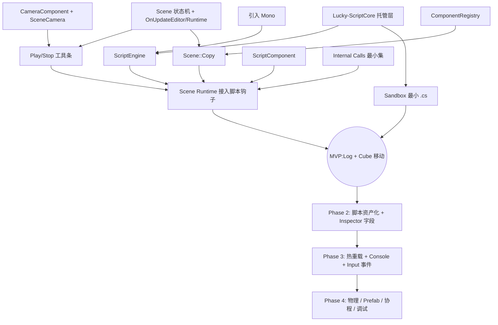

# 脚本系统路线图（C# / Mono）

> 本文档只描述阶段划分与关键节点，不包含具体实现代码。每个 Phase 落地时再拆出独立设计文档。

---

## 0. 背景与目标

### 技术选型
- **脚本语言**：C#
- **运行时**：Mono Embedding（对齐 Unity 早期方案）
- **备选**：后续可评估 CoreCLR / .NET Hosting，Phase 1 先走 Mono

### 最小目标（MVP）
在 Play 模式下，让一个挂载了 C# 脚本的 Cube 能够：
- 在 `OnCreate` 时通过 `Debug.Log("Hello Luck3D")` 向编辑器 Console 输出一行日志；
- 在 `OnUpdate` 中通过 `Transform.Position += Vector3.Right * dt` 让 Cube 自动向右移动。

达成上述任何一项即视为 **MVP 通过**。

---

## 1. 阶段总览

```
Phase 0：Runtime 基础设施（无脚本前置）
   └─ Scene 状态机 / CameraComponent / Scene::Copy / Play 工具条

Phase 1：Mono 集成与最小闭环（MVP）
   └─ 嵌入 Mono / ScriptComponent / ScriptEngine / 最小 Bindings

Phase 2：脚本资产化与 Inspector 编辑
   └─ .cs 资产 / ScriptClass 反射 / 字段编辑与序列化

Phase 3：脚本可用性提升
   └─ 事件类 Input / 热重载 / Console 输出重定向

Phase 4：与其他系统集成（后续按需）
   └─ 物理 / Prefab / 协程 / 调试器
```

---

## 2. Phase 0 ? Runtime 基础设施

> **目标**：让编辑器"能进入 Play 模式"，此时脚本系统本身还未接入，但整条 Runtime 路径已经打通。

### 里程碑
- **Scene 运行状态机**：`SceneState { Edit, Play, Pause }`，`OnRuntimeStart / OnRuntimeStop`
- **Scene 双更新入口**：拆分 `OnUpdateEditor(dt, EditorCamera&)` 与 `OnUpdateRuntime(dt)`
- **CameraComponent + SceneCamera**：Runtime 使用场景内主相机，而非 EditorCamera
- **Scene::Copy**：Play 前对 Scene 深拷贝，Stop 后还原原始编辑态
- **ComponentRegistry**（可选前置）：把组件的 Copy/Serialize/Inspector 集中注册，简化 Scene::Copy 与后续 ScriptComponent 接入
- **Play/Stop 工具条**：Scene Viewport 顶栏加 Play / Stop / Pause 按钮

### 出口标准
- 点击 Play：切换到 Runtime 分支，Scene Viewport 使用 GameCamera 渲染
- 点击 Stop：Scene 完整还原到 Play 之前的状态
- 全程无需脚本参与

---

## 3. Phase 1 ? Mono 集成与最小闭环（MVP）

> **目标**：完成脚本系统最小可运行闭环。

### 里程碑

**1) 引入 Mono 依赖**
- 在 `Vendor/` 引入 mono 运行时（`mono-2.0-sgen.dll` + `mono/lib/mono/...`）
- `Dependencies.lua` 添加 include / libdir / links
- 打包时 mono 目录随 exe 部署

**2) 托管层最小工程 `Lucky-ScriptCore`**
- 独立的 C# 类库项目，输出 `Lucky-ScriptCore.dll`
- 提供基础类型：
  - `Entity`（持有 UUID，`GetComponent<T>()`）
  - `Component`（基类，含 `Entity` 属性）
  - `TransformComponent`（`Position / Rotation / Scale`）
  - `Debug`（`Log / Warn / Error`）
  - `Vector3`（POD，与 C++ `glm::vec3` 内存布局对齐）

**3) 引擎侧 `ScriptEngine`**
- `Init / Shutdown`
- 加载 Mono Domain / 加载 `Lucky-ScriptCore.dll`
- 加载用户脚本程序集（先用固定路径 `Assets/Scripts/Binaries/App.dll`）
- 反射枚举继承自 `Entity` 的用户脚本类

**4) `ScriptComponent`**
- 字段：`std::string ClassName`（例如 `"Sandbox.PlayerController"`）
- 加入 `ComponentType` 枚举 + `ComponentTrait` 特化
- 序列化 / 反序列化 ClassName（`SceneSerializer` 分发）

**5) Internal Calls（最小集）**
- `Debug_Log(MonoString*)`
- `Entity_HasComponent(UUID, MonoReflectionType*)`
- `TransformComponent_GetPosition(UUID, glm::vec3* outPos)`
- `TransformComponent_SetPosition(UUID, glm::vec3* inPos)`

**6) 生命周期钩子接入 Scene::OnUpdateRuntime**
- `OnRuntimeStart`：遍历 `ScriptComponent`，实例化托管对象并调用 `OnCreate`
- `OnUpdateRuntime`：对所有实例调用 `OnUpdate(dt)`
- `OnRuntimeStop`：调用 `OnDestroy`，释放托管对象引用

**7) 用户 Sandbox 工程**
- 在 `Assets/Scripts/` 放一个最小的 `PlayerController.cs`：
  ```
  namespace Sandbox
  {
      public class PlayerController : Lucky.Entity
      {
          void OnCreate() { Lucky.Debug.Log("Hello Luck3D"); }
          void OnUpdate(float dt)
          {
              var t = GetComponent<TransformComponent>();
              var p = t.Position;
              p.X += dt;
              t.Position = p;
          }
      }
  }
  ```
- 编译产物落在 `Assets/Scripts/Binaries/App.dll`

**8) Inspector 展示**
- `ScriptComponent` 在 Inspector 显示当前 ClassName（字符串编辑框即可，Phase 2 再做下拉选择）

### 出口标准（MVP 达成条件）
1. Console 面板（或 Log 输出）看到 `Hello Luck3D`
2. Play 后 Cube 自动向右移动，Stop 后位置还原

---

## 4. Phase 2 ? 脚本资产化与 Inspector 编辑

> **目标**：让脚本以资产的形式被项目管理，字段可在 Inspector 编辑并随场景序列化。

### 里程碑
- `AssetType::Script` + `.cs` 扩展名映射；`ScriptImporter`
- Project 面板显示 `.cs` 图标，双击调用外部编辑器
- `ScriptEngine` 缓存 `ScriptClass` 元信息（字段名 / 类型 / 默认值）
- `ScriptComponent` 增加 `FieldMap`：`std::unordered_map<std::string, ScriptFieldValue>`
- Inspector 按字段类型绘制控件（`float / int / bool / Vector3 / Entity 引用`）
- `SceneSerializer` 写入/读取 `FieldMap`
- `ScriptComponent` 的 ClassName 选择从字符串改为下拉列表（列出所有继承自 `Entity` 的类）

### 出口标准
- 在 `.cs` 里写 `public float Speed = 3.0f;`，Inspector 出现 Speed 拖动条，保存场景后重新打开仍保留

---

## 5. Phase 3 ? 脚本可用性提升

> **目标**：让脚本真正"好用"。

### 里程碑
- **Input 事件化**：托管层 `Input.IsKeyDown / GetAxis` 对接引擎 `Input`；补充键盘 / 鼠标事件回调
- **热重载**：监听 `App.dll` 修改时间，Play 状态下卸载 AppDomain 并重新加载；保留字段值
- **Console 面板**：把 `Debug.Log/Warn/Error` 重定向到编辑器 Console（支持等级过滤、清空、双击定位）
- **异常处理**：脚本抛异常时打印堆栈到 Console，不影响引擎主循环
- **Time**：托管层 `Time.DeltaTime / Time.Time`

### 出口标准
- 修改 `.cs` 保存 → 编辑器自动重编译并 reload → Play 中生效
- 脚本异常不导致引擎崩溃

---

## 6. Phase 4 ? 与其他系统集成（后续按需）

- **物理**：Rigidbody / Collider 组件与事件（`OnCollisionEnter` 等）
- **Prefab**：`Instantiate(prefab)`
- **协程**：`WaitForSeconds` / `WaitForEndOfFrame`
- **托管调试器**：mono debugger stub + VS / Rider Attach
- **UI 事件绑定**：按钮回调等

本阶段不做前置约束，脚本系统 MVP 完成后按项目实际需求逐个补齐。

---

## 7. 依赖关系图



---

## 8. 参考

- Hazel Engine ScriptEngine（`Hazel-ScriptCore` 项目）
- Unity Scripting Runtime（mono embedding 参考实现）
- Mono Embedding 官方文档：<https://www.mono-project.com/docs/advanced/embedding/>
